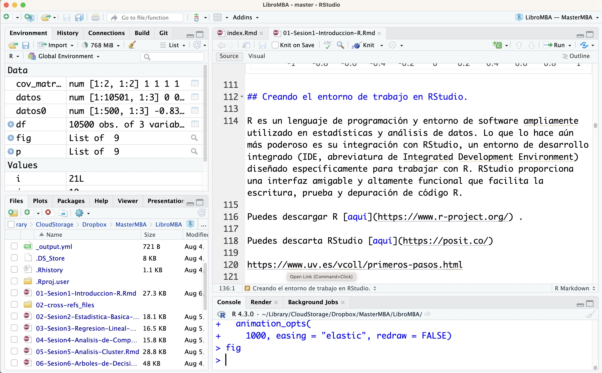

# Introducción a R

## Objetivos

**¿Qué pretendemos en 4 horas?**

1. Conocer un lenguaje de programación (R) extremadamente flexible, gratuito con altas prestaciones. 

¿Qué **NO** pretendemos?

1. Manejar R con soltura
2. Desarrollar programas para manejar grandes volúmenes de datos y analizar procesos usando herramientas de aprendizaje automático....

## El lenguaje R

R es un lenguaje de programación y un entorno de software libre para el análisis estadístico y la visualización de datos. Desarrollado originalmente por Ross Ihaka y Robert Gentleman en la Universidad de Auckland en los años 90, R se ha convertido en una herramienta esencial en la estadística, la ciencia de datos y la investigación académica. Su principal fortaleza reside en su capacidad para manejar, analizar y graficar grandes volúmenes de datos de manera eficiente.

R es especialmente valorado por su amplia gama de paquetes y librerías que extienden su funcionalidad básica, permitiendo a los usuarios realizar tareas complejas de análisis de datos, modelado estadístico, minería de datos y aprendizaje automático. Además, la comunidad de usuarios de R es muy activa, contribuyendo constantemente con nuevos paquetes y actualizaciones, lo que mantiene al lenguaje en la vanguardia de las innovaciones en análisis de datos.

El entorno de desarrollo integrado más popular para R es RStudio, que proporciona una interfaz amigable y herramientas adicionales que facilitan la escritura y ejecución de código R. La versatilidad de R y su capacidad para integrarse con otros lenguajes de programación y sistemas de bases de datos lo convierten en una opción preferida para analistas, científicos de datos y estadísticos de todo el mundo.


## ¿Por qué aprender R?

Aprender a usar R puede ser beneficioso por varias razones, especialmente si estás interesado en la estadística, la ciencia de datos, la investigación científica o cualquier campo relacionado con el análisis de datos. A continuación, se presentan algunas razones para aprender a usar R:

* **Ciencia de Datos:** R se ha convertido en una herramienta fundamental en el campo de la ciencia de datos. Es utilizado para la limpieza de datos, la exploración de datos, el aprendizaje automático y la generación de informes.

* **Big Data** R es una herramienta poderosa cuando se trata de trabajar con grandes volúmenes de datos, también conocidos como "big data". A través de sus numerosos paquetes y extensiones, R ofrece capacidades avanzadas para la manipulación, procesamiento y análisis de conjuntos de datos masivos. Su capacidad para cargar, gestionar y realizar cálculos en datos de gran tamaño es fundamental en campos como la ciencia de datos y el análisis estadístico. Además, R se integra bien con herramientas de big data como Hadoop y Spark, lo que permite a los profesionales de datos abordar proyectos que involucran la recopilación y análisis de datos a escala empresarial. En resumen, R es una opción sólida para aquellos que deseen trabajar con big data y obtener información valiosa a partir de conjuntos de datos extensos y complejos.

* **Poderosa Herramienta Estadística** R es un lenguaje de programación y un entorno de desarrollo diseñado específicamente para estadísticas y análisis de datos. Ofrece una amplia gama de funciones estadísticas y técnicas de modelado que son esenciales para la investigación y el análisis de datos.

* **Existe una Comunidad Activa** R cuenta con una comunidad de usuarios y desarrolladores activa y diversa. Esto significa que hay una gran cantidad de recursos, paquetes y documentación disponibles en línea. Puedes encontrar soluciones para una variedad de problemas y obtener ayuda de la comunidad cuando lo necesites.

* **Paquetes Especializados** R tiene una gran cantidad de paquetes diseñados para tareas específicas. Ya sea que necesites realizar análisis de series temporales, gráficos avanzados, aprendizaje automático o análisis bioestadísticos, es probable que encuentres un paquete en R que se adapte a tus necesidades.

* **Es Multiplataforma** ¿Usas Windows? Muy bien. ¿Tienes Mac? No hay problema. ¿Eres puro Linux? No pasa nada. R está disponible y funcionando en todos estos sistemas operativos.

* **Visualización de Datos** R ofrece capacidades avanzadas de visualización de datos. Puedes crear gráficos y visualizaciones de alta calidad para comunicar tus resultados de manera efectiva. Librerías como ggplot2 son ampliamente utilizadas para crear visualizaciones personalizadas y elegantes.

* **Flexibilidad y Personalización** R es altamente personalizable y extensible. Puedes escribir tus propias funciones y paquetes para adaptar R a tus necesidades específicas. Esto es especialmente útil si estás realizando investigaciones originales o trabajando en proyectos específicos.

* **Uso en la Industria y la Academia** R es ampliamente utilizado tanto en la industria como en la academia. Aprender R puede abrirte puertas en una variedad de campos, incluyendo la ciencia de datos, la investigación académica, la consultoría y más.

* **Gratuito y de Código Abierto** R es un software de código abierto y es gratuito para su uso. Esto lo hace accesible para una amplia gama de usuarios y organizaciones sin incurrir en costos de licencia.

* **Herramientas de Integración** Existen numerosas herramientas y entornos que se integran fácilmente con R, como RStudio, que proporciona un entorno de desarrollo amigable y funcionalidad adicional para facilitar la programación en R.

* **Replicabilidad y Documentación:** R fomenta la replicabilidad de investigaciones y análisis al permitir que los usuarios documenten sus pasos y resultados de manera efectiva en forma de scripts y documentos R Markdown.

## RStudio

RStudio es un entorno de desarrollo integrado (IDE, GUI en ingles) diseñado específicamente para el lenguaje de programación R. Lanzado en 2011, **RStudio proporciona una interfaz amigable** y herramientas robustas que facilitan la escritura, depuración y ejecución de código R. Entre sus características destacan el editor de scripts con resaltado de sintaxis, la consola interactiva, herramientas para la gestión de proyectos y la visualización integrada de gráficos y datos. 

Además, RStudio soporta la integración con sistemas de control de versiones como Git y **facilita la creación de documentos reproducibles a través de R Markdown**. Estas capacidades hacen de RStudio una elección predilecta para estadísticos y científicos de datos.

## Qué cosas hago con R

En la empresa, antes era imprescindible saber inglés. Ahora, se da por descontado y cada vez es más importante conocer un lenguaje de programación que te permita manejar información numérica (asociada a los grandes volúmenes de información que se generan)

R se ha convertido en mi lenguaje de programación favorito (hay otros)

* Puedo escribir artículos científicos combinando texto y datos
* Puedo hacer reproducible la investigación
* Puedo generar potentes, y llamativos gráficos
* Hacer gráficos dinámicos e interactivos
* Integrar lenguajes html, latex, texto plano,..
* Generar mapas [interactivos](https://emods.es/LaVerdad/Chinos)
* Generar páginas webs (como esta!)
* Manejar millones de observaciones fácilmente!
* Un lenguaje altamente flexible...

```{r, echo=FALSE, collapse=TRUE, message=FALSE,warning=FALSE}
library(MASS)
library(ggplot2)
library(plotly)
# Generar datos con una distribución normal multivariante
datos <- matrix(0,ncol=3,nrow = 1)
n <- 500  # Tamaño de la muestra
set.seed(123)  # Establecer una semilla para la reproducibilidad
for (i in 1:21){
  j=(i-11)
  mean_vector <- c(0, 0)  # Vector de medias
  cov_matrix <- matrix(c(1, j/10, j/10, 1), nrow = 2)  # Matriz de covarianza
  datos0 <- cbind(mvrnorm(n, mean_vector, cov_matrix),rep(j/10,20))
  datos <- rbind(datos,datos0)
}
df <- as.data.frame(datos)
df <- df[-1,]
names(df) <- c("X","Y","r")
df$X <- round(df$X,2)
df$Y <- round(df$Y,2)
p <- ggplot(df, aes(X, Y, color = "blue")) +
  geom_point(aes( frame = r)) + 
  geom_smooth(method = "lm", se = FALSE, color = "blue",aes(frame = r)) + 
  labs(title = "Gráfico de Dispersión con Línea de Ajuste",
       x = "Variable Independiente",
       y = "Variable Dependiente") +
  theme_bw() +
  theme(legend.position='none') 
fig <- ggplotly(p)
fig <- fig %>%
  animation_slider(
    currentvalue = list(prefix = "Coef corr= ", font = list(color="red")))
fig <- fig %>% 
  animation_opts(
    1000, easing = "elastic", redraw = FALSE)
fig
```

## Creando el entorno de trabajo en RStudio.

R es un lenguaje de programación y entorno de software ampliamente utilizado en estadísticas y análisis de datos. Lo que lo hace aún más poderoso es su integración con RStudio, un entorno de desarrollo integrado (IDE, abreviatura de Integrated Development Environment) diseñado específicamente para trabajar con R. RStudio proporciona una interfaz amigable y altamente funcional que facilita la escritura, prueba y depuración de código R. 

Puedes descargar R [aquí](https://www.r-project.org/) .

Puedes descarta RStudio [aquí](https://posit.co/)

https://www.uv.es/vcoll/primeros-pasos.html

Trabajamos con la interfaz **RStudio** antes que con la de R porque es “más amigable”.

Un tipo básico de archivo de texto es un script R. Los scripts R tienen la extensión ".R" y reconocen todo el texto como si fuera código R. 

Cuando trabaja con código R, puede agregar comentarios usando este nombre: "#". Cualquier línea que comience con esta marca se ignora al ejecutar el código.

Una vez estamos en RStudio, podemos escribir y ejecutar las órdenes de varias formas:

* directamente en la consola
* a través de un script (.R)
* con ficheros Rmarkdown (.Rmd)

Como podemos ver, RStudio está (normalmente) dividido en 4 paneles.

{width=100%}


### Consola

Por defecto, la consola se encuentra en el panel inferior-izquierdo. ¿Vemos la pestaña que pone Console? Inmediatamente debajo aparece un texto informativo y, finalmente, el símbolo “>”. Aquí es donde R espera que le demos instrucciones. Para ejecutarlas y obtener el resultado pulsamos enter.

Vamos a hacer este ejemplo:

```{r}
2+2
5*(3-1)^2
sqrt(4)
```

En el ejemplo anterior se han ido introduciendo y ejecutando las instrucciones una a una. También es posible ejecutar desde la consola más de una instrucciones. Para ello, las instrucciones deben separarse con un “;”.

```{r}
2 + 2 ; 5*(3-1)^2 ; sqrt(4)
```


### Scripts

Trabajar en la consola es muy limitado ya que las instrucciones se han de introducir una a una. Lo habitual es trabajar con _scripts_ o ficheros de instrucciones. Estos ficheros tienen extensión **.R**.

Se puede crear una script con cualquier editor de texto, pero nosotros lo haremos desde RStudio. Para ello, seleccionamos la siguiente ruta de menús: 

* File > New File > R script

El panel del script se sitúa en la parte superior-izquierda de RStudio. Ahora podemos escribir las instrucciones línea por línea. Las instrucciones las podemos ejecutar una a una o las podemos seleccionar y ejecutar en bloque. Para ejecutar las instrucciones tenemos varias alternativas:

* Hacemos clic en el botón: Run (botón situado en la parte derecha de las opciones del panel de script)

* Pulsamos Ctrl+r


### Entorno

El panel, llamémoslo de entorno esta compuesto de varias pestañas:

* Environment 
* History
* Otras cosas ...

En el "Environment" se irán registrando los **objetos** que vayamos creando en la sesión de trabajo. También tenemos la opción de cargar y guardar una sesión de trabajo, importar datos y limpiar los **objetos** de la sesión. Estas opciones están accesibles a través de la cinta de opciones de la pestaña.

### Miscelánea: Archivos, Gráficos, Paquetes, Ayuda, Visor

Con el nombre de Misceléna nos referimos al otro panel (que se encuentra en la parte inferior-derecha) del escritorio de RStudio.

En este panel cabe destacar las siguientes pestañas, cada una con diferentes opciones:

* Files: es una especie de explotador de ficheros.
* Plots: donde se visualizan los gráficos que creamos. Entre las opciones disponibles se encuentran:
  * Zoom: para agrandar el gráfico y verlo en otra ventana.
  * Export: para exportar/guardar el gráfico. Se puede guardar el gráfico como imagen, pdf o copiarlo al portapapeles.
* Packages: proporciona un listado de los paquetes instalados en R y los que han sido cargado en la sesión. A través de las opciones de esta pestaña podemos instalar nuevos paquetes o actualizar los existentes.
* Help: Para obtener ayuda sobre una determinada función.
* Otros:

### Configuración del directorio de trabajo.

Antes de comenzar a trabajar debemos fijar el directorio donde queremos guardar nuestros ficheros. Básicamente, dos alternativas.

#### Opción 1. Fijar directorio.

Opción 1. Indicamos a R la ruta donde queremos trabajar y la fijamos con la función setwd().

setwd("C:/ruta del directorio de trabajo")

Para comprobar el directorio de trabajo utilizamos la función getwd():

getwd()

Para obtener un listado de los ficheros que contiene la ruta establecida se usa la función dir().

dir()

#### Opción 2. Proyecto de R.

Al crear un proyecto todos los ficheros quedan vinculados directamente al proyecto. Para crear un proyecto selección 

* File > New project... 

Se abrirá un menú que guia en la generación del proyecto

- Para crear un proyecto en un nuevo directorio, hacemos clic en el botón New Directory. Seguidamente, seleccionamos el tipo de proyecto, en nuestro caso Empty Project. Ahora, asignamos un nombre al directorio (carpeta) que se va a crear y que al mismo tiempo será el nombre del proyecto de R. Para terminar, hacemos clic en el botón Create Project. Al seguir este proceso se habrá creado una carpeta en Documentos y un fichero nombre_carpeta.Rproj.

- Para crear un proyecto en una carpeta que ya existe, hacemos clic en el botón Existing Directory y después seleccionamos la carpeta ayudándonos del Browse.. si fuera necesario. Una vez elegida la carpeta, clicamos en Create Project.

- Para abrir un proyecto hacemos doble clic sobre el archivo con extensión .Rproj o lo abrimos desde el menú de RStudio: File > Open Project…

> Ventaja de los proyectos: cualquier fichero que creemos (script de R, documento de Rmarkdown, etc.) y guardemos se guardará en la carpeta del proyecto.

### Instalar y cargar paquetes.

R está compuesto por un sistema base, pero para extender su funcionalidad es necesario instalar paquetes adicionales.

Podemos instalar paquetes de varias formas:

* A través del menú: Tools > Install packages…

En el escritorio de RStudio: Packages/Install. Vemos los paquetes que tenemos actualmente instalados y aquellos que se encuentran cargados.

* Utilizando la función install.packages(). El nombre del paquete que queremos instalar debe ir entre comillas.


```{r}
# dplyr es un paquete que se utiliza para manipular/gestionar datos
# install.packages("dplyr") 
```

* En ocasiones, para nuestra sesión de trabajo necesitamos instalar varios paquetes.

```{r}
# install.packages(c("dplyr","ggplot2"))
```

Es habitual iniciar la sesión de trabajo en R con un “pequeño programa” en el que se indica que para la sesión se requiere una serie de paquetes y que si no están instalados los instale. Aquí tenemos la versión más sencilla para hacer esto

```{r, message=FALSE,warning=FALSE}
if(!require(dplyr)) {install.packages("dplyr")}
```

Una vez instalado el paquete, hay que cargarlo para poderlo utilizar. Esto se hace con la función library().

```{r}
library(dplyr) # observad que el nombre del paquete no se pone entre comillas para cargarlo.
```

### Ayuda en R.

En muchas ocasiones necesitamos ayuda sobre cómo funciona una determinada función, cuáles son sus argumentos, etc. Hay varias formas de pedir la ayuda de R. Vamos a pedir la ayuda de la función mean().

```{r}
help(mean)
?mean
```

Si ejecutamos directamente la función library() se abrirá una ventana listando los paquetes que tenemos instalados en R. En el escritorio de RStudio, en la pestaña Packages también tenemos en listado de paquetes instalados (organizados en dos bloques: User Library y System Library)

library()
Para obtener ayuda sobre un determinado paquete…

library(help="foreign")

En ocasiones junto con los paquetes se facilita una documentación sobre su uso, a esto se le llama vignettes.

vignette()      # Para ver una lista de las vignettes a las que podemos acceder por paquete y a una vignette concreta de un paquete:

Pero sin duda, una de las mejores fuentes de ayuda en R nos la proporciona internet. Bien haciendo directamente en google la búsqueda sobre el tema que estamos interesados, bien acudiendo a algunas de las muchas webs que ofrecen ayuda. Algunas de las más populares y recomendables webs son:

* https://es.stackoverflow.com/
* https://stackoverflow.co/
* https://chat.openai.com/

## Primeros pasos

### Script básico para apreder R

```{r}
# Comentarios en R se realizan con el símbolo '#' al principio de la línea

# Asignación de variables
x <- 5            # Asigna el valor 5 a la variable x
y <- 3            # Asigna el valor 3 a la variable y

# Realizar cálculos
suma <- x + y     # Suma x e y y guarda el resultado en la variable suma
resta <- x - y    # Resta y de x y guarda el resultado en la variable resta
producto <- x * y # Multiplica x por y y guarda el resultado en la variable producto
division <- x / y # Divide x por y y guarda el resultado en la variable division

# Imprimir resultados
cat("La suma es:", suma, "\n")
cat("La resta es:", resta, "\n")
cat("El producto es:", producto, "\n")
cat("La división es:", division, "\n")

# Crear un vector de números del 1 al 10
mi_vector <- 1:10

# Imprimir el vector
cat("Mi vector:", mi_vector, "\n")

# Crear un gráfico de dispersión simple
plot(mi_vector, mi_vector, main="Gráfico de Dispersión", xlab="Eje X", ylab="Eje Y", col="blue", pch=19)

# Guardar el gráfico en un archivo PNG
png(filename="grafico.png")
plot(mi_vector, mi_vector, main="Gráfico de Dispersión", xlab="Eje X", ylab="Eje Y", col="blue", pch=19)
dev.off() # Cerrar el archivo PNG
```

### Tipos de Datos en R

En R, existen varios tipos de datos que se utilizan para almacenar y manipular información. A continuación, se presentan algunos de los tipos de datos más comunes en R:

1. **Numérico (numeric)**: Representa números reales o decimales. Por ejemplo, `x <- 3.14`.

2. **Entero (integer)**: Representa números enteros. Por ejemplo, `y <- 5L` (la "L" indica que es un número entero).

3. **Caracteres (character)**: Almacena texto o cadenas de caracteres. Se utiliza comillas simples o dobles. Por ejemplo, `nombre <- "Juan"`.

4. **Lógico (logical)**: Representa valores lógicos `Verdadero` (TRUE) o `Falso` (FALSE). Se utiliza para evaluaciones condicionales. Por ejemplo, `es_mayor <- TRUE`.

5. **Factor**: Se utiliza para representar datos categóricos o variables cualitativas. Los factores tienen niveles que indican las categorías. Por ejemplo, `genero <- factor(c("Masculino", "Femenino"))`.

6. **Fecha y hora**: R tiene tipos de datos específicos para fechas y horas, como `Date` y `POSIXct`, que permiten realizar operaciones y cálculos con fechas y horas.

7. **Lista (list)**: Permite almacenar una colección heterogénea de objetos (como vectores, matrices u otras listas) en una sola estructura de datos. Por ejemplo, `mi_lista <- list(1, "texto", c(2, 3, 4))`.

8. **Matriz (matrix)**: Es una estructura bidimensional que almacena datos del mismo tipo en filas y columnas. Por ejemplo, `matriz <- matrix(1:6, nrow = 2, ncol = 3)`.

9. **Arreglo (array)**: Similar a una matriz, pero puede tener más de dos dimensiones. Por ejemplo, `mi_arreglo <- array(1:12, dim = c(2, 3, 2))`.

10. **DataFrame**: Es similar a una matriz, pero puede contener diferentes tipos de datos en cada columna. Los data frames son muy utilizados para almacenar conjuntos de datos. Por ejemplo, `mi_df <- data.frame(nombre = c("Juan", "María"), edad = c(25, 30))`.

11. **NULL**: Representa la ausencia de valor o datos faltantes. Por ejemplo, si una variable no tiene un valor asignado, se considera NULL.

12. **Infinito y NaN**: R también tiene representaciones especiales para el infinito (`Inf` o `-Inf`) y para valores indefinidos (`NaN`, que significa "No es un número").

Estos son algunos de los tipos de datos más comunes en R. Es importante comprender cómo trabajar con cada tipo de dato, ya que es fundamental para el análisis y la manipulación de datos en R.

### La Importancia de los Objetos en R

Uno de los conceptos fundamentales en R es el uso de objetos para almacenar y manipular datos. Los objetos son contenedores que almacenan información, como números, texto, vectores, matrices, data frames y más. Comprender la importancia de los objetos es esencial para trabajar de manera efectiva en R. A continuación, se destacan algunas razones por las cuales los objetos son fundamentales:

1. **Organización de Datos**: Los objetos permiten organizar los datos de manera estructurada. Por ejemplo, puedes almacenar datos en un vector, una matriz o un data frame, lo que facilita la gestión y la manipulación de la información.

2. **Reutilización**: Los objetos se pueden reutilizar en múltiples operaciones y análisis. Puedes crear un objeto con datos y luego realizar diversas operaciones estadísticas o gráficas sin necesidad de volver a cargar los datos cada vez.

3. **Claridad y Documentación**: El uso de objetos con nombres descriptivos mejora la claridad del código. Puedes asignar nombres significativos a los objetos, lo que facilita la comprensión del código y su documentación.

4. **Programación Modular**: Los objetos permiten dividir un problema en partes más pequeñas y manejables. Puedes crear funciones que operen sobre objetos específicos, lo que promueve la programación modular y la reutilización de código.

5. **Interacción con Paquetes**: Muchos paquetes y funciones en R trabajan con objetos específicos. Al comprender cómo funcionan estos objetos, puedes aprovechar al máximo la funcionalidad de los paquetes y realizar análisis avanzados.

6. **Visualización y Gráficos**: Los objetos pueden contener datos que se utilizan para crear visualizaciones y gráficos. Los paquetes de gráficos en R, como ggplot2, se basan en objetos para generar gráficos personalizados.

7. **Análisis Estadístico**: Los objetos son esenciales para realizar análisis estadísticos en R. Puedes aplicar pruebas, modelos y métodos estadísticos a los datos almacenados en objetos.

En resumen, los objetos son la base de la programación en R y desempeñan un papel crucial en el análisis de datos y la creación de visualizaciones. Comprender cómo trabajar con objetos y cómo seleccionar el tipo adecuado de objeto para tus datos es esencial para aprovechar al máximo las capacidades de R.

### DataFrames en R

Un DataFrame en R es una estructura de datos bidimensional que se utiliza para almacenar y organizar datos de manera tabular. Cada columna de un DataFrame puede contener un tipo de dato diferente, como numérico, de caracteres, lógico, etc. Los DataFrames son muy utilizados para trabajar con conjuntos de datos y realizar análisis de datos en R.

### Ejemplo de DataFrame

Supongamos que queremos crear un DataFrame para almacenar información sobre estudiantes, incluyendo sus nombres, edades y calificaciones en dos materias: Matemáticas y Ciencias. Podemos crear un DataFrame de la siguiente manera:

```{r}
# Crear un DataFrame de ejemplo
estudiantes <- data.frame(
  Nombre = c("Juan", "María", "Carlos", "Ana"),
  Edad = c(25, 30, 22, 28),
  Matematicas = c(90, 85, 78, 92),
  Ciencias = c(88, 92, 76, 89)
)

# Mostrar el DataFrame
estudiantes
```

Cómo identificar los elementos de un dataframe

```{r}
estudiantes$Edad
estudiantes[,2]
estudiantes[1,]
```


## Un `for` en R

En R, un bucle `for` se utiliza para repetir una serie de instrucciones un número específico de veces o para iterar sobre una secuencia de elementos, como vectores o listas. Aquí tienes un ejemplo simple de cómo se usa un bucle `for` para imprimir los números del 1 al 5.

```{r}
# Ejemplo de bucle for para imprimir números del 1 al 5
for (i in 1:5) {
  print(i)
}
```

En este ejemplo, utilizaremos un bucle `for` para generar una serie de datos y almacenarlos en un DataFrame. Supongamos que queremos calcular y almacenar los primeros diez números pares en un DataFrame. Utilizaremos un bucle `for` para generar estos números y luego los almacenaremos en un DataFrame.

```{r}
# Crear un DataFrame vacío
mi_df <- data.frame(NumerosPares = numeric(0))
# Usar un bucle for para generar números pares y almacenarlos
for (i in 1:10) {
  numero_par <- 2 * i
  mi_df <- rbind(mi_df,numero_par)
}
# Mostrar el DataFrame resultante
mi_df
```

## Leer un Excel

### Datos Empleados

{width=70%}

RStudio permite cargar datos a través de menús (File > Import Dataset). Por menús se pueden cargar datos CSV, EXCEL, SPSS, SAS y STATA.

```{r}
library(readxl)
myxls <- read_xlsx("Datos/Datos_de_empleados.xlsx")
head(myxls)
myxls$fechnac <- as.Date(as.numeric(myxls$fechnac))
```

### Leer un csv

Al igual que los archivos de excel, R puede leer multitud de formatos. En general para leer cada formato es necesario disponer del paquete que hace esa función.

Los archivos con extensión **csv** son muy comunes para la transferencia de bases de datos. Por ejemplo `read.csv()` es una función que lee este formato

CSV significa “comma separated data”. En realidad CSV es un caso particular de “tabular o text data"

## Actividad 1:

El objetivo de esta actividad es familiarizarse con los conceptos básicos de R y practicar algunas operaciones simples.

1. **Instalación de Paquetes:**
   - Instala el paquete `stringr` usando el siguiente comando:
   - Carga el paquete `stringr`
   - Explora la viñeta y investiga sobre las cosas que hace
   - Usa los ejemplos que aparecen en la ayuda de la funció 'str_sub()'

2. **Creación de un DataFrame:**
   - Crea un DataFrame llamado `datos` con tres columnas: `Nombre`, `Edad` y `Puntuación`.
   - Llena el DataFrame con al menos 5 filas de datos ficticios.

3. **Operaciones Básicas:**
   - Calcula la media de las edades en el DataFrame.
   - Encuentra la persona con la puntuación más alta.
   - Filtra las filas para mostrar solo las personas mayores de 25 años.
   - Ordena el DataFrame por nombre en orden alfabético.

4. **Visualización de Datos (Opcional):**
   - Si te sientes cómodo, intenta visualizar alguna característica de tu DataFrame, como un gráfico de barras para las puntuaciones.


## Actividad 2:

El objetivo de esta actividad es practicar el uso del bucle `for` en R para generar tablas de multiplicar.

1. Elige un número para el cual quieres generar la tabla de multiplicar. Puede ser cualquier número entero positivo.

2. Utiliza un bucle `for` para generar la tabla de multiplicar del número seleccionado.

3. La tabla debe incluir multiplicaciones del número del 1 al 10.

4. Muestra los resultados en forma de una tabla que tenga dos columnas: una para el multiplicador y otra para el resultado de la multiplicación.

## Actividad 3:

- El objetivo es descargar un fichero de Internet y procesarlo

1. Descargar el excel de esta web

https://econet.carm.es/web/crem/inicio/-/crem/sicrem/PU_padron/series/sec4_sec2.html

2. Manejar el excel para que en la primera fila aparezca el nombre de la variable y en cada fila siguiente la población de cada municipio. Eliminar la fila de Total.

3. Importar el fichero a R

4. Calcular la suma de población en la CARM cada año usando la función `sum()`
