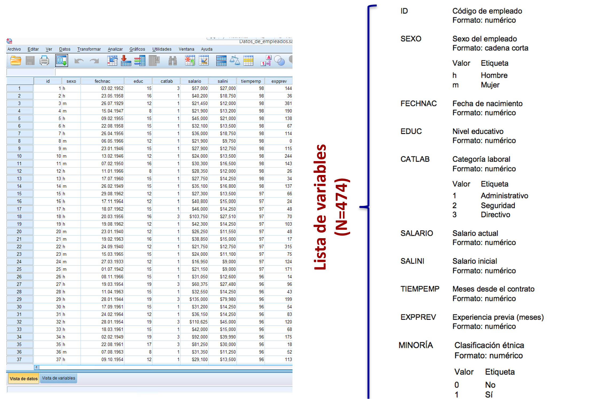

# Estadística con R 

* R es un lenguaje especializado en implementar técnicas estadísticas. 

* Utilizaremos R para realizar un análisis estadístico básico.

## Resumen estadístico

El archivo "datos de empleados.sav" de SPSS es un conjunto de datos ampliamente utilizado en análisis estadísticos y gestión de recursos humanos. Este archivo contiene información detallada sobre los empleados de una organización, abarcando diversas variables como edad, género, departamento, puesto de trabajo, salario, años de servicio, nivel educativo y rendimiento laboral. Gracias a esta riqueza de datos, los analistas pueden explorar patrones y tendencias dentro de la fuerza laboral, lo que facilita la toma de decisiones informadas en áreas cruciales como la contratación, capacitación, evaluación del desempeño y retención de empleados.

Por ejemplo, los datos pueden utilizarse para identificar diferencias salariales entre distintos géneros o departamentos, analizar la relación entre la antigüedad y el rendimiento laboral, o evaluar el impacto de la formación en el desarrollo profesional. Además, la estructura del archivo "datos de empleados.sav" permite la aplicación de diversas técnicas estadísticas y métodos de análisis, como regresión, análisis de varianza y pruebas de hipótesis, proporcionando un enfoque robusto para abordar cuestiones complejas en la gestión de recursos humanos.


{width=100%}

**Las funciones más elementales tienen una sintaxis muy intuitiva**

```{r, results='asis'}
library(readxl)
bbdd <- read_xlsx("Datos/Datos_de_empleados.xlsx")
# bbdd$fechnac <- as.Date(as.numeric(bbdd$fechnac),format = "%Y%m%d")
knitr::kable(head(bbdd[,c(2,6:7)],6))
```

**Para calcular algunos indicadores básicos se utilizan comandos sencillos**

```{r, collapse=TRUE,prompt=TRUE}
# Min, max,...
min(bbdd$salario)
max(bbdd$salario)
which.max(bbdd$salario)
bbdd$salario[which.max(bbdd$salario)]
sum(bbdd$salario)
```

### Medidas de posición central

Las medidas de tendencia central son estadísticas fundamentales que describen el punto medio o típico de un conjunto de datos. Entre las más utilizadas se encuentran la media aritmética, la mediana y la moda. La media aritmética, o promedio, se calcula sumando todos los valores y dividiéndolos por el número total de observaciones, proporcionando una medida del centro basada en todos los datos. La mediana, en cambio, es el valor que divide el conjunto de datos en dos mitades iguales, siendo especialmente útil cuando hay valores atípicos o distribuciones sesgadas, ya que no se ve afectada por extremos. La moda es el valor que aparece con mayor frecuencia en el conjunto de datos y puede ser útil para identificar el valor más común en una distribución. Cada una de estas medidas ofrece una perspectiva diferente sobre la centralidad de los datos y se elige según las características del conjunto de datos y el contexto del análisis

```{r, collapse=TRUE,prompt=TRUE}
# Media y Mediana de Salario
mean(bbdd$salario)
median(bbdd$salario)

# Es fácil calcular la media geométrica
x <- bbdd$salario
n <- length(x)
prod(x)^(1/n)
geom <- exp(mean(log(x)))
print(geom)

# También la media armónica
armo <- 1/mean(1/x)
print(armo)
```

**Algunos detalles sobre valores perdidos**

En R, los valores faltantes están representados por el símbolo NA (no disponible). 
Los valores imposibles (por ejemplo, la división por cero) están representados por el símbolo NaN (no es un número)

```{r, collapse=TRUE,prompt=TRUE}
x <- c(1,2,NA,3)
mean(x) # devuelve NA
sum(x, na.rm=TRUE) # devuelve 2
mean(x, na.rm=TRUE) # devuelve 2
```

**Igualmente se obtien en medidas de posición no central**

Las medidas de posición no central, como los cuartiles, deciles y percentiles, son herramientas estadísticas que dividen un conjunto de datos en partes iguales para analizar su distribución. Los cuartiles dividen los datos en cuatro partes: el primer cuartil (Q1) indica el 25% inferior, el segundo cuartil (Q2) es la mediana, y el tercer cuartil (Q3) representa el 75% inferior. Los deciles y percentiles proporcionan divisiones más finas, en diez y cien partes, respectivamente.

```{r, results='asis'}
quantile(bbdd$salario)
quantile(bbdd$salario,c(0,.15,.85))
```

### Medidas de dispersión absolutas

Las medidas de dispersión absolutas cuantifican la variabilidad o dispersión de un conjunto de datos respecto a su centro. Entre las más comunes se encuentran el rango, la desviación media y la desviación estándar. El rango es la diferencia entre el valor máximo y el mínimo, proporcionando una medida simple de la extensión de los datos. La desviación media calcula el promedio de las diferencias absolutas entre cada dato y la media, ofreciendo una visión general de la dispersión. La desviación estándar mide la dispersión de los datos respecto a la media.

```{r, collapse=TRUE,prompt=TRUE}
# Medidas de dispersión absolutas
range(bbdd$salario)
IQR(bbdd$salario) # Rango intercuartílico
sd(bbdd$salario) # Desviación estándar
var(bbdd$salario) # Varianza
```

### Medidas de asimetría y curtosis

Las medidas de asimetría y curtosis evalúan la forma y la distribución de un conjunto de datos. La asimetría indica si los datos están sesgados hacia un lado: una asimetría positiva sugiere una cola larga a la derecha, mientras que una negativa indica una cola larga a la izquierda. La curtosis mide la "agudeza" de la distribución: una curtosis alta (leptocúrtica) indica colas más pesadas y un pico más pronunciado, mientras que una baja (platicúrtica) señala colas más ligeras y un pico más plano. Estas medidas son cruciales para comprender la distribución de los datos más allá de la media y la dispersión

```{r, results='asis'}
if(!require(moments)) {install.packages("moments")}
library(moments)

skewness(bbdd$salario) #nos da el valor de la asimetria de los datos de la variable x
kurtosis(bbdd$salario) #nos da el achatamiento de la distribucion de los datos de la variable x.
```

### La función 'summary()'

La función 'summary()' en R proporciona un resumen estadístico de un objeto, como un conjunto de datos o un modelo. Para data frames, incluye medidas como la media, mediana, mínimos, máximos y cuartiles, ofreciendo una visión rápida y completa de las características clave del conjunto de datos

```{r}
# Resumen de la variable
summary(bbdd$salario)
# También para una data frame
BBDD <- as.data.frame(bbdd[,c(3,6:7)])
summary(BBDD)
# Un summary por categorías
# Añadimos variable al data frame
bbdd$MiVariable <- floor(bbdd$tiempemp/30)
by(bbdd$salario, bbdd$MiVariable, summary)
```

### Actividad

1. Importar datos del archivo "datos de empleados":

2. Calcular medidas de tendencia central (media y mediana) y de dispersión (rango, desviación estándar) para una variable numérica, por ejemplo, el salario.

3. Calcular medidas de asimetría y curtosis para la misma variable.

## Gráficos con R

* Las gráficas son la mejor forma de simplificar lo complejo. 
* Un buen gráfico suele ser más accesible que una tabla. Sin embargo es muy importante tener claro qué gráfico queremos hacer.
* Las facilidades gráficas de R constituyen una de las componentes más importantes de este lenguaje.
* R incluye muchas y muy variadas funciones para hacer gráficas estadísticas estándar: desde gráficos muy simples a figuras de gran calidad para incluir en artículos y libros.
* Permite además construir otras nuevas a la medida del usuario (aunque a veces hacer cosas simples no es fácil).
* Permite exportar gráficas en distintos formatos: PDF, JPEG, GIF, etc.
* Para ver una demo de gráficos con colores: demo(graphics).
* Aquí únicamente veremos algunas de todas las posibilidades.
* Otra alternativa son los paquetes: ggplot y ggplot2.

**La función plot()**

La función plot() en R se utiliza para crear gráficos básicos. Es fundamental para visualizar datos, permitiendo la generación de gráficos de dispersión, líneas, barras, y más. Con diversos argumentos y opciones de personalización, plot() facilita el análisis visual y la interpretación de conjuntos de datos complejos.

```{r, collapse=TRUE,prompt=TRUE}
x <- (0:100)/10
y <- sin(x)
plot(x, y, main="Función Seno")
```

** Algunas opciones de la función plot()**

* **main:** Cambia el título del gráfico
* **sub:** Cambia el subtítulo del gráfico
* **type:** Tipo de gráfico (puntos, líneas, etc.)
* **xlab, ylab:** Cambia las etiquetas de los ejes
* **xlim, ylim:** Cambia el rango de valores de los ejes
* **lty:** Cambia el tipo de línea; lwd: Cambia el grosor de línea
* **col:** Color con el que dibuja

```{r, results='asis'}
plot(x, y, main="Seno", type="l")
plot(x, y, main="Función Seno", lty=2, col="red", type="l")
plot(x, cos(x), main="Función Coseno", lty=3, col="blue", type="l",xlim=c(0, 2), ylab="cos(x)")
```

**Gráfico de sectores**

```{r}
pie(c(3,5,8))
pie(c(3,5,8), labels=c("Uno","Dos","Tres"),col=c("blue","red","green"),main="Mi gráfico")
```

**La función boxplot realiza este clásico gráfico**

La función boxplot() en R se usa para crear gráficos de caja, que visualizan la distribución de un conjunto de datos a través de sus cuartiles. Muestra la mediana, los cuartiles y los posibles valores atípicos, permitiendo identificar la dispersión, simetría y anomalías en los datos

```{r, results='asis',eval=TRUE}
# Con una sola variable
boxplot(bbdd$salario,col=c('powderblue'))
# Con las tres variables a la vez
boxplot(bbdd$salario,bbdd$salini,col=c('powderblue','#FF6D0099'))
# Los dos juntos
par(mfrow=c(1,2))
boxplot(bbdd$salario,bbdd$salini,col=c('powderblue','#FF6D0099'))
boxplot(log(bbdd$salario),log(bbdd$salini),col=c('powderblue','#FF6D0099'))
```

**Escribe `colors()` para una lista de colores**

### ggplot2

El paquete ggplot2 en R es una herramienta poderosa para la creación de gráficos y visualizaciones de datos. Basado en la gramática de gráficos de Hadley Wickham, ggplot2 permite construir visualizaciones complejas de manera flexible y coherente. Utiliza un sistema de capas, donde cada capa representa una parte del gráfico, como los datos, los estéticos, y los elementos geométricos. Los usuarios pueden personalizar gráficos con facilidad, añadiendo títulos, etiquetas, y temas. Además, ggplot2 facilita la visualización de relaciones entre variables, distribuciones, y patrones, convirtiéndose en una opción popular para el análisis exploratorio de datos y la comunicación de resultados

```{r, results='asis',eval=TRUE}
library(ggplot2)
Distr <- as.factor(bbdd$sexo)
qplot( x=Distr , y=salario , data=bbdd , geom=c("boxplot","jitter") , fill=Distr) + theme_bw()
Distr <- as.factor(bbdd$catlab)
qplot( x=Distr , y=salario , data=bbdd , geom=c("boxplot","jitter") , fill=Distr) +
theme_bw()
```

**Con ggplot se pueden hacer boxplots muy bonitos**

[https://www.rstudio.com/wp-content/uploads/2015/03/ggplot2-cheatsheet.pdf]

También violin-plots

[https://www.data-to-viz.com/caveat/boxplot.html]

**Histograma**

```{r, results='asis',eval=TRUE}
hist(log(bbdd$salario), breaks=20, col = "red")
```

**Se puede incluir la curva normal sobre el histograma**

```{r, results='asis',eval=TRUE}
g <- log(bbdd$salario)
m <- mean(g)
std<-sqrt(var(g))
hist(g, density=10, breaks=20, prob=TRUE,col="blue", 
     xlab="log(Renta)", 
     main="Curva normal sobre histograma")
curve(dnorm(x, mean=m, sd=std), 
      col="red", lwd=4, add=TRUE)
```

### Actividad

1. Crear un histograma

```{r, eval=FALSE}
ggplot(empleados, aes(x = salario)) +
  geom_histogram(binwidth = 1000, fill = "blue", color = "black") +
  labs(title = "Distribución del Salario de los Empleados", x = "Salario", y = "Frecuencia") +  theme_minimal()
```

2. Crear un gráfico de caja (boxplot) para comparar los salarios por departamento

```{r, eval=FALSE}
ggplot(empleados, aes(x = departamento, y = salario, fill = departamento)) +
  geom_boxplot() +
  labs(title = "Distribución del Salario por Departamento", x = "Departamento", y = "Salario") +
  theme_minimal()
```

## Test Hipótesis

### Un simple t-test de igualdad de medias

El contraste de medias basado en la t de Student es una técnica estadística para comparar las medias de dos grupos y determinar si hay una diferencia significativa entre ellas. Se utiliza cuando los datos siguen una distribución normal y el tamaño de la muestra es pequeño. La prueba t calcula el valor t, que se compara con un valor crítico de la distribución t para decidir si se rechaza la hipótesis nula de igualdad de medias. Existen dos tipos principales: la prueba t para muestras independientes, que compara dos grupos distintos, y la prueba t para muestras dependientes, que compara dos mediciones en el mismo grupo

```{r, results='asis',eval=TRUE}
# Contrastar si la Renta media de 2015 es 40000 euros
t.test(bbdd$salario,mu=40000)
t.test(bbdd$salario,mu=35000,alternative="greater")
```

Puede usar la opción var.equal = TRUE para especificar varianzas iguales y una estimación de varianza agrupada. Puede usar la opción alternative = "less" o alternative = "greater" para especificar una prueba de una cola

### Un simple t-test de igualdad de medias pareadas

```{r, eval=TRUE}
t.test(bbdd$salario,bbdd$salini)
t.test(log(bbdd$salario),log(bbdd$salini))
```

**Un poco mas complicado: ANOVA de un factor**

El ANOVA de un factor (Análisis de Varianza) es una técnica estadística utilizada para comparar las medias de tres o más grupos independientes y determinar si existen diferencias significativas entre ellas. Este análisis evalúa si la variabilidad entre las medias de los grupos es mayor que la variabilidad dentro de los grupos. El ANOVA de un factor calcula un estadístico F, que compara la variabilidad entre los grupos con la variabilidad dentro de los grupos. Si el valor F es suficientemente alto, se rechaza la hipótesis nula de igualdad de medias. Es útil para experimentos con un único factor categórico y múltiples niveles.

```{r}
group <- as.factor(bbdd$catlab)
levels(group) <- c("asa","aaas","asddd")
anova <- aov(bbdd$salario ~ group, data = bbdd)
summary(anova)
TukeyHSD(anova)
```

### Test de normalidad paramétricos

**Test Paramétricos: K-S y Shapiro**

Los test de normalidad Kolmogorov-Smirnov (KS) y Shapiro-Wilk son utilizados para evaluar si un conjunto de datos sigue una distribución normal. El test KS compara la distribución empírica de los datos con una distribución normal teórica, evaluando las diferencias entre las funciones de distribución acumulada observada y esperada. El test Shapiro-Wilk, en cambio, evalúa la normalidad ajustando una estadística basada en los valores ordenados de la muestra. Mientras que el test KS es más general y se aplica a cualquier distribución, el Shapiro-Wilk es más específico para la normalidad y suele ser más potente para muestras pequeñas. Ambos test ayudan a validar supuestos en análisis estadísticos.

```{r, results='asis',eval=TRUE}
g <- log(bbdd$salario)
ks.test(g, pnorm, mean(g), sd(g))
shapiro.test(g)
```

Tenga en cuenta que, la prueba de normalidad es sensible al tamaño de la muestra. Las muestras pequeñas con mayor frecuencia pasan las pruebas de normalidad. Por lo tanto, es importante combinar la inspección visual y la prueba de significación para tomar la decisión correcta.

## Distribuciones bivariadas

### Tablas de contingencia 

Una tabla de correlación muestra las relaciones entre variables cuantitativas, indicando la fuerza y dirección de la asociación mediante coeficientes de correlación, como Pearson o Spearman. Permite identificar patrones de dependencia lineal o no lineal entre pares de variables. Por otro lado, una tabla de contingencia, también conocida como tabla de frecuencia cruzada, se utiliza para analizar la relación entre dos variables categóricas. Muestra la frecuencia de ocurrencia conjunta de las categorías de las variables, facilitando el análisis de asociaciones y la prueba de independencia mediante chi-cuadrado. Ambas tablas son herramientas fundamentales para la exploración y análisis de datos en estadística.

1. La función **table()** calcula tablas de frecuencias a partir de factores.

```{r,  collapse=TRUE,prompt=TRUE,eval=TRUE}
msa <- mean(bbdd$salario) # Salario
msi <- mean(bbdd$salini) # SAl ini
Ricos <- bbdd$salario > msa # ricos/pobres
Ricosi <- bbdd$salini > msi # densos/no dendos
# Distribuciones de frecuencia unidimensional
table(Ricos)
table(Ricosi)
# Distribuciones de frecuencia bidimensionales
TaRiRi <- table(Ricos,Ricosi)
print(TaRiRi)
TaRiSx <- table(Ricos,bbdd$sexo)
print(TaRiSx)

# Como siempre, hay gráficos informativos
library(graphics)
mosaicplot(TaRiRi,main = "Ricos vs Ricosi")
mosaicplot(TaRiSx,main = "Ricos vs Sexo",color = TRUE)
```

### Algo de test de independencia

El test de independencia chi-cuadrado ($\chi^2$) se utiliza para evaluar si dos variables categóricas están asociadas o son independientes entre sí. Se basa en la comparación entre las frecuencias observadas en una tabla de contingencia y las frecuencias esperadas si las variables fueran independientes. Calcula un estadístico $\chi^2$ que se compara con un valor crítico de la distribución chi-cuadrado, considerando el número de grados de libertad. Si el estadístico $\chi^2$ es mayor que el valor crítico, se rechaza la hipótesis nula de independencia, indicando una asociación significativa entre las variables. Este test es útil para analizar relaciones en datos categóricos.

```{r,  collapse=TRUE,prompt=TRUE,eval=TRUE}
# Contrastes Chi2 de independencia
chisq.test(TaRiRi)
chisq.test(TaRiSx)
```

### Correlaciones

Una matriz de correlaciones es una tabla que muestra las correlaciones entre múltiples variables cuantitativas. Cada celda indica el coeficiente de correlación entre un par de variables, facilitando la identificación de relaciones lineales y patrones de asociación en grandes conjuntos de datos.

```{r,  collapse=TRUE,prompt=TRUE,eval=TRUE}
cor(bbdd$salario,bbdd$salini)
cor(bbdd$salario,bbdd$expprev)
# Un plot con correlaciones
library(ggcorrplot)
ggcorrplot(cor(bbdd[,6:9]),lab_size = 3,hc.order = TRUE,method = "circle",lab = TRUE)
```

```{r,  collapse=TRUE,prompt=TRUE,eval=TRUE}
# para saber si es significativamente distinta de cero
cor.test(bbdd$salario,bbdd$salini)
plot(bbdd$salario,bbdd$salini, main="Salario vs Salario Inicial", col='red')
```
