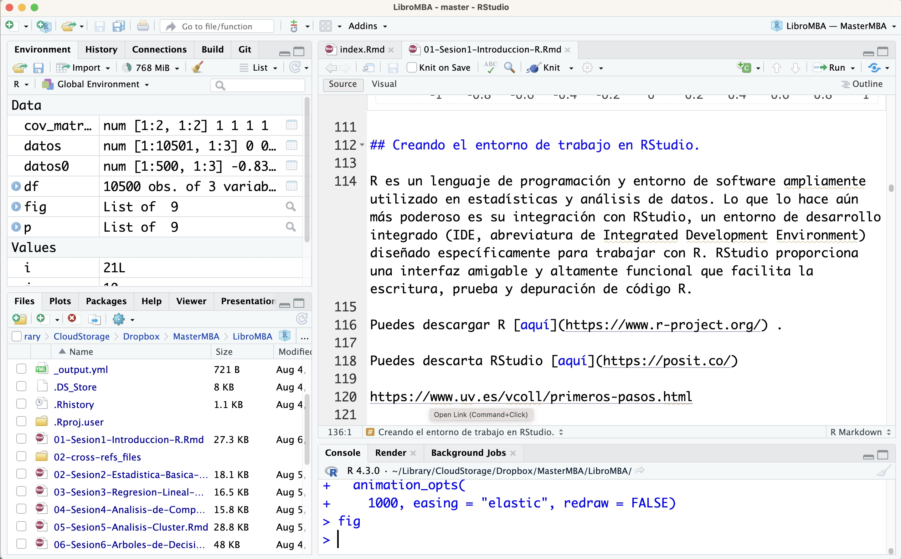
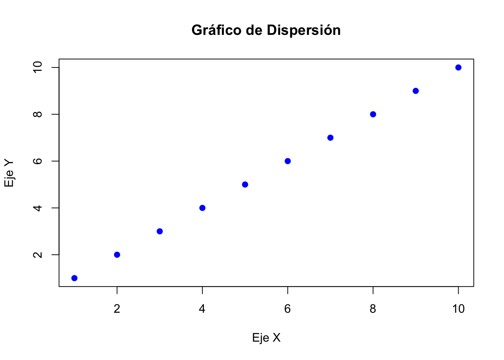
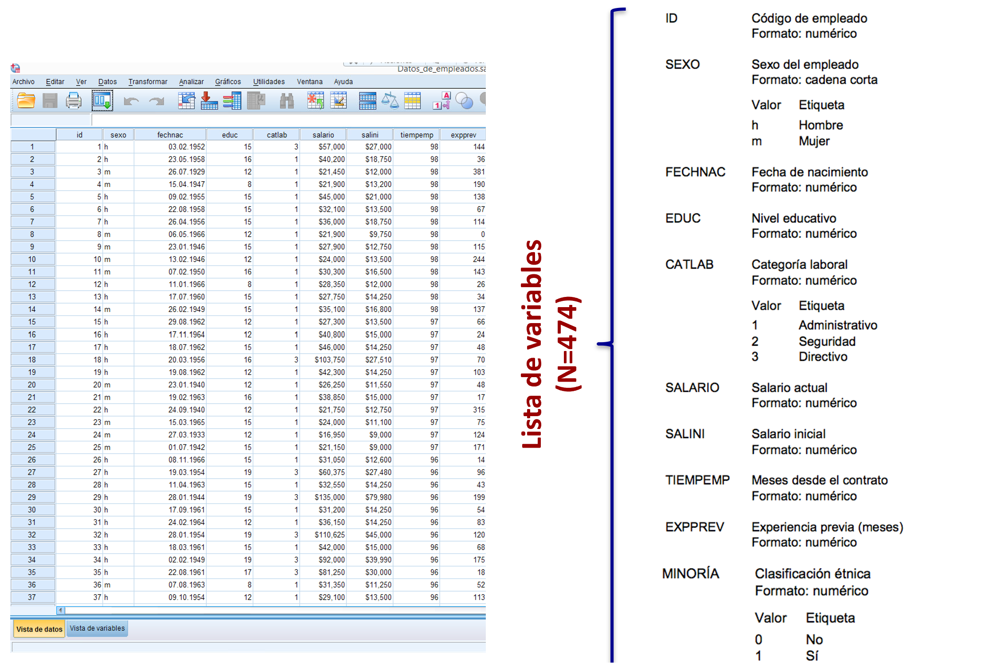

# Introducción a R

## Objetivos

**¿Qué pretendemos en 4 horas?**

1. Conocer un lenguaje de programación (R) extremadamente flexible, gratuito con altas prestaciones. 

¿Qué **NO** pretendemos?

1. Manejar R con soltura
2. Desarrollar programas para manejar grandes volúmenes de datos y analizar procesos usando herramientas de aprendizaje automático....

## El lenguaje R

R es un lenguaje de programación y un entorno de software libre para el análisis estadístico y la visualización de datos. Desarrollado originalmente por Ross Ihaka y Robert Gentleman en la Universidad de Auckland en los años 90, R se ha convertido en una herramienta esencial en la estadística, la ciencia de datos y la investigación académica. Su principal fortaleza reside en su capacidad para manejar, analizar y graficar grandes volúmenes de datos de manera eficiente.

R es especialmente valorado por su amplia gama de paquetes y librerías que extienden su funcionalidad básica, permitiendo a los usuarios realizar tareas complejas de análisis de datos, modelado estadístico, minería de datos y aprendizaje automático. Además, la comunidad de usuarios de R es muy activa, contribuyendo constantemente con nuevos paquetes y actualizaciones, lo que mantiene al lenguaje en la vanguardia de las innovaciones en análisis de datos.

El entorno de desarrollo integrado más popular para R es RStudio, que proporciona una interfaz amigable y herramientas adicionales que facilitan la escritura y ejecución de código R. La versatilidad de R y su capacidad para integrarse con otros lenguajes de programación y sistemas de bases de datos lo convierten en una opción preferida para analistas, científicos de datos y estadísticos de todo el mundo.


## ¿Por qué aprender R?

Aprender a usar R puede ser beneficioso por varias razones, especialmente si estás interesado en la estadística, la ciencia de datos, la investigación científica o cualquier campo relacionado con el análisis de datos. A continuación, se presentan algunas razones para aprender a usar R:

* **Ciencia de Datos:** R se ha convertido en una herramienta fundamental en el campo de la ciencia de datos. Es utilizado para la limpieza de datos, la exploración de datos, el aprendizaje automático y la generación de informes.

* **Big Data** R es una herramienta poderosa cuando se trata de trabajar con grandes volúmenes de datos, también conocidos como "big data". A través de sus numerosos paquetes y extensiones, R ofrece capacidades avanzadas para la manipulación, procesamiento y análisis de conjuntos de datos masivos. Su capacidad para cargar, gestionar y realizar cálculos en datos de gran tamaño es fundamental en campos como la ciencia de datos y el análisis estadístico. Además, R se integra bien con herramientas de big data como Hadoop y Spark, lo que permite a los profesionales de datos abordar proyectos que involucran la recopilación y análisis de datos a escala empresarial. En resumen, R es una opción sólida para aquellos que deseen trabajar con big data y obtener información valiosa a partir de conjuntos de datos extensos y complejos.

* **Poderosa Herramienta Estadística** R es un lenguaje de programación y un entorno de desarrollo diseñado específicamente para estadísticas y análisis de datos. Ofrece una amplia gama de funciones estadísticas y técnicas de modelado que son esenciales para la investigación y el análisis de datos.

* **Existe una Comunidad Activa** R cuenta con una comunidad de usuarios y desarrolladores activa y diversa. Esto significa que hay una gran cantidad de recursos, paquetes y documentación disponibles en línea. Puedes encontrar soluciones para una variedad de problemas y obtener ayuda de la comunidad cuando lo necesites.

* **Paquetes Especializados** R tiene una gran cantidad de paquetes diseñados para tareas específicas. Ya sea que necesites realizar análisis de series temporales, gráficos avanzados, aprendizaje automático o análisis bioestadísticos, es probable que encuentres un paquete en R que se adapte a tus necesidades.

* **Es Multiplataforma** ¿Usas Windows? Muy bien. ¿Tienes Mac? No hay problema. ¿Eres puro Linux? No pasa nada. R está disponible y funcionando en todos estos sistemas operativos.

* **Visualización de Datos** R ofrece capacidades avanzadas de visualización de datos. Puedes crear gráficos y visualizaciones de alta calidad para comunicar tus resultados de manera efectiva. Librerías como ggplot2 son ampliamente utilizadas para crear visualizaciones personalizadas y elegantes.

* **Flexibilidad y Personalización** R es altamente personalizable y extensible. Puedes escribir tus propias funciones y paquetes para adaptar R a tus necesidades específicas. Esto es especialmente útil si estás realizando investigaciones originales o trabajando en proyectos específicos.

* **Uso en la Industria y la Academia** R es ampliamente utilizado tanto en la industria como en la academia. Aprender R puede abrirte puertas en una variedad de campos, incluyendo la ciencia de datos, la investigación académica, la consultoría y más.

* **Gratuito y de Código Abierto** R es un software de código abierto y es gratuito para su uso. Esto lo hace accesible para una amplia gama de usuarios y organizaciones sin incurrir en costos de licencia.

* **Herramientas de Integración** Existen numerosas herramientas y entornos que se integran fácilmente con R, como RStudio, que proporciona un entorno de desarrollo amigable y funcionalidad adicional para facilitar la programación en R.

* **Replicabilidad y Documentación:** R fomenta la replicabilidad de investigaciones y análisis al permitir que los usuarios documenten sus pasos y resultados de manera efectiva en forma de scripts y documentos R Markdown.

## RStudio

RStudio es un entorno de desarrollo integrado (IDE, GUI en ingles) diseñado específicamente para el lenguaje de programación R. Lanzado en 2011, **RStudio proporciona una interfaz amigable** y herramientas robustas que facilitan la escritura, depuración y ejecución de código R. Entre sus características destacan el editor de scripts con resaltado de sintaxis, la consola interactiva, herramientas para la gestión de proyectos y la visualización integrada de gráficos y datos. 

Además, RStudio soporta la integración con sistemas de control de versiones como Git y **facilita la creación de documentos reproducibles a través de R Markdown**. Estas capacidades hacen de RStudio una elección predilecta para estadísticos y científicos de datos.

## Qué cosas hago con R

En la empresa, antes era imprescindible saber inglés. Ahora, se da por descontado y cada vez es más importante conocer un lenguaje de programación que te permita manejar información numérica (asociada a los grandes volúmenes de información que se generan)

R se ha convertido en mi lenguaje de programación favorito (hay otros)

* Puedo escribir artículos científicos combinando texto y datos
* Puedo hacer reproducible la investigación
* Puedo generar potentes, y llamativos gráficos
* Hacer gráficos dinámicos e interactivos
* Integrar lenguajes html, latex, texto plano,..
* Generar mapas [interactivos](https://emods.es/LaVerdad/Chinos)
* Generar páginas webs (como esta!)
* Manejar millones de observaciones fácilmente!
* Un lenguaje altamente flexible...


```{=html}
<div class="plotly html-widget html-fill-item-overflow-hidden html-fill-item" id="htmlwidget-a047a4ea54848aa97996" style="width:672px;height:480px;"></div>
<script type="application/json" data-for="htmlwidget-a047a4ea54848aa97996">{"x":{"data":[{"x":[0.56000000000000005,0.23000000000000001,-1.5600000000000001,-0.070000000000000007,-0.13,-1.72,-0.46000000000000002,1.27,0.68999999999999995,0.45000000000000001,-1.22,-0.35999999999999999,-0.40000000000000002,-0.11,0.56000000000000005,-1.79,-0.5,1.97,-0.69999999999999996,0.46999999999999997,1.0700000000000001,0.22,1.03,0.72999999999999998,0.63,1.6899999999999999,-0.83999999999999997,-0.14999999999999999,1.1399999999999999,-1.25,-0.42999999999999999,0.29999999999999999,-0.90000000000000002,-0.88,-0.81999999999999995,-0.68999999999999995,-0.55000000000000004,0.059999999999999998,0.31,0.38,0.68999999999999995,0.20999999999999999,1.27,-2.1699999999999999,-1.21,1.1200000000000001,0.40000000000000002,0.46999999999999997,-0.78000000000000003,0.080000000000000002,-0.25,0.029999999999999999,0.040000000000000001,-1.3700000000000001,0.23000000000000001,-1.52,1.55,-0.57999999999999996,-0.12,-0.22,-0.38,0.5,0.33000000000000002,1.02,1.0700000000000001,-0.29999999999999999,-0.45000000000000001,-0.050000000000000003,-0.92000000000000004,-2.0499999999999998,0.48999999999999999,2.3100000000000001,-1.01,0.70999999999999996,0.68999999999999995,-1.03,0.28000000000000003,1.22,-0.17999999999999999,0.14000000000000001,-0.01,-0.39000000000000001,0.37,-0.64000000000000001,0.22,-0.33000000000000002,-1.1000000000000001,-0.44,0.33000000000000002,-1.1499999999999999,-0.98999999999999999,-0.55000000000000004,-0.23999999999999999,0.63,-1.3600000000000001,0.59999999999999998,-2.1899999999999999,-1.53,0.23999999999999999,1.03,0.70999999999999996,-0.26000000000000001,0.25,0.34999999999999998,0.94999999999999996,0.050000000000000003,0.78000000000000003,1.6699999999999999,0.38,-0.92000000000000004,0.57999999999999996,-0.60999999999999999,1.6200000000000001,0.059999999999999998,-0.52000000000000002,-0.29999999999999999,-0.11,0.64000000000000001,0.84999999999999998,1.02,-0.12,0.94999999999999996,0.48999999999999999,0.26000000000000001,-1.8400000000000001,0.65000000000000002,-0.23999999999999999,-0.080000000000000002,0.95999999999999996,0.070000000000000007,-1.4399999999999999,-0.45000000000000001,-0.040000000000000001,0.41999999999999998,2.0499999999999998,-1.1299999999999999,1.46,-0.73999999999999999,-1.9099999999999999,1.4399999999999999,-0.69999999999999996,0.26000000000000001,1.5700000000000001,1.51,1.6000000000000001,0.53000000000000003,1.46,-0.68999999999999995,-2.1000000000000001,1.29,-0.79000000000000004,-0.77000000000000002,-0.33000000000000002,1.01,0.12,0.28000000000000003,-0.56000000000000005,0.37,-0.97999999999999998,0.37,-1.05,1.05,1.26,-3.2400000000000002,0.41999999999999998,-0.29999999999999999,-0.64000000000000001,0.47999999999999998,-0.52000000000000002,-0.37,0.22,-0.070000000000000007,0.029999999999999999,-2.1299999999999999,0.73999999999999999,1.1000000000000001,-0.040000000000000001,-0.31,-0.44,0.46000000000000002,1.0600000000000001,-1.26,0.34999999999999998,0.87,0.23999999999999999,0.20000000000000001,-1.1100000000000001,-0.080000000000000002,-0.75,0.5,-0.20999999999999999,0.32000000000000001,-0.089999999999999997,0.90000000000000002,1.3100000000000001,-2,-0.59999999999999998,1.25,0.60999999999999999,1.1899999999999999,-2.2000000000000002,-1.3100000000000001,0.27000000000000002,-0.54000000000000004,0.40999999999999998,0.47999999999999998,0.79000000000000004,0.58999999999999997,-1.6499999999999999,0.050000000000000003,-0.12,-0.23999999999999999,-1.23,0.52000000000000002,0.98999999999999999,-1.6799999999999999,0.44,0.71999999999999997,1.24,1.28,0.56999999999999995,-0.62,-1.1100000000000001,-0.70999999999999996,0.35999999999999999,-0.059999999999999998,0.69999999999999996,0.71999999999999997,-0.88,1.02,-1.96,0.089999999999999997,-0.20999999999999999,0.73999999999999999,0.56999999999999995,1.3200000000000001,0.17999999999999999,-0.41999999999999998,-0.32000000000000001,0.78000000000000003,0.79000000000000004,0.5,-1.5,1.1399999999999999,0.17999999999999999,-1.8999999999999999,0.10000000000000001,1.3600000000000001,0.66000000000000003,-0.48999999999999999,0.38,0.56000000000000005,0.34000000000000002,-0.089999999999999997,-1.6000000000000001,0.089999999999999997,-1.0800000000000001,-0.63,0.11,1.53,0.52000000000000002,0.48999999999999999,-0.050000000000000003,-1.3,-2.29,-1.55,0.13,1.76,0.39000000000000001,-0.089999999999999997,-0.84999999999999998,-0.95999999999999996,-0.68000000000000005,1.3999999999999999,-0.84999999999999998,0.45000000000000001,-0.17000000000000001,-0.070000000000000007,-0.42999999999999999,-0.02,1.6699999999999999,-0.73999999999999999,-0.39000000000000001,0.27000000000000002,-0.12,-0.13,-0.22,-1.6399999999999999,0.22,-0.17000000000000001,-1.1699999999999999,-1.05,-1.1499999999999999,0.57999999999999996,-2,-0.070000000000000007,-1.8700000000000001,1.3500000000000001,-0.02,-1.25,0.71999999999999997,0.75,0.93999999999999995,1.05,0.44,-0.33000000000000002,2.0099999999999998,-0.20999999999999999,-1.24,-2.04,-1.3,-0.76000000000000001,1.73,0.59999999999999998,0.34999999999999998,-0.69999999999999996,0.11,1.26,-1.6799999999999999,-0.91000000000000003,-0.23999999999999999,-1.22,1.3400000000000001,-0.66000000000000003,0.52000000000000002,-0.68000000000000005,0.059999999999999998,-0.63,-1.3400000000000001,-0.01,-1.02,1.1899999999999999,0.71999999999999997,-1.52,-0.38,2.0499999999999998,1.3600000000000001,0.20000000000000001,-0.87,0.10000000000000001,-0.62,-0.95999999999999996,-1.6699999999999999,-0.059999999999999998,0.050000000000000003,1.75,-0.10000000000000001,0.56999999999999995,0.96999999999999997,0.17999999999999999,-1.01,1.99,0.42999999999999999,-0.12,0.89000000000000001,-0.33000000000000002,-0.40999999999999998,0.029999999999999999,2.4700000000000002,-2.5699999999999998,0.20999999999999999,-0.65000000000000002,-0.27000000000000002,-1.02,-0.81999999999999995,0.20999999999999999,-0.38,0.94999999999999996,-0.85999999999999999,0.46000000000000002,-2.4199999999999999,1.6499999999999999,0.46000000000000002,-0.82999999999999996,-0.51000000000000001,0.58999999999999997,1,-0.14000000000000001,0.01,1.79,-0.029999999999999999,-0.19,-0.17000000000000001,1.0600000000000001,-0.47999999999999998,-1.3799999999999999,-0.46000000000000002,1.1399999999999999,0.44,-0.34999999999999998,0.65000000000000002,2.1600000000000001,-0.88,0.82999999999999996,0.56999999999999995,-1.5,0.77000000000000002,-0.84999999999999998,1.26,0.34999999999999998,0.070000000000000007,1.1699999999999999,0.63,0.029999999999999999,-0.67000000000000004,1.6499999999999999,0.34999999999999998,-0.76000000000000001,0.54000000000000004,-0.23000000000000001,-0.48999999999999999,-0.27000000000000002,-0.65000000000000002,0.12,0.40999999999999998,2.6400000000000001,0.089999999999999997,-0.42999999999999999,-0.54000000000000004,0.56000000000000005,-1.78,-0.28999999999999998,-0.13,-1.27,0.71999999999999997,0.45000000000000001,-2.3999999999999999,-0.01,-1.6299999999999999,1.4399999999999999,0.19,-0.38,-0.29999999999999999,1.01,-0.02,1.0800000000000001,-0.70999999999999996,-1.0800000000000001,2.2200000000000002,-1.24,1.24,-0.45000000000000001,-0.66000000000000003,0.20000000000000001,0.65000000000000002,-0.17000000000000001,-0.44,-0.88,2.0499999999999998,1.6399999999999999,-1.4299999999999999,-1.05,-0.44,-0.71999999999999997,-0.92000000000000004,2.6600000000000001,-1.1100000000000001,0.47999999999999998,-0.23000000000000001,0.29999999999999999,-0.87,0.34999999999999998,-0.52000000000000002,0.39000000000000001,1.0900000000000001,-1.21,-0.73999999999999999,-1.72,-0.070000000000000007,-1.1299999999999999,-1.98,0.28000000000000003,1.3200000000000001,0.23999999999999999,0.20999999999999999,-0.14999999999999999,-1.71,0.33000000000000002,-0.37,0.23000000000000001,-0.02,-0.31,-1.3300000000000001,-0.12,-0.70999999999999996,-0.78000000000000003,-0.91000000000000003,0.56999999999999995,-1.6299999999999999,0.38,0.11,-1.3999999999999999,-1.29,1.0900000000000001,0.87,1.3600000000000001,-0.17999999999999999,-0.16,-0.35999999999999999,-0.55000000000000004],"y":[-0.56000000000000005,-0.23000000000000001,1.5600000000000001,0.070000000000000007,0.13,1.72,0.46000000000000002,-1.27,-0.68999999999999995,-0.45000000000000001,1.22,0.35999999999999999,0.40000000000000002,0.11,-0.56000000000000005,1.79,0.5,-1.97,0.69999999999999996,-0.46999999999999997,-1.0700000000000001,-0.22,-1.03,-0.72999999999999998,-0.63,-1.6899999999999999,0.83999999999999997,0.14999999999999999,-1.1399999999999999,1.25,0.42999999999999999,-0.29999999999999999,0.90000000000000002,0.88,0.81999999999999995,0.68999999999999995,0.55000000000000004,-0.059999999999999998,-0.31,-0.38,-0.68999999999999995,-0.20999999999999999,-1.27,2.1699999999999999,1.21,-1.1200000000000001,-0.40000000000000002,-0.46999999999999997,0.78000000000000003,-0.080000000000000002,0.25,-0.029999999999999999,-0.040000000000000001,1.3700000000000001,-0.23000000000000001,1.52,-1.55,0.57999999999999996,0.12,0.22,0.38,-0.5,-0.33000000000000002,-1.02,-1.0700000000000001,0.29999999999999999,0.45000000000000001,0.050000000000000003,0.92000000000000004,2.0499999999999998,-0.48999999999999999,-2.3100000000000001,1.01,-0.70999999999999996,-0.68999999999999995,1.03,-0.28000000000000003,-1.22,0.17999999999999999,-0.14000000000000001,0.01,0.39000000000000001,-0.37,0.64000000000000001,-0.22,0.33000000000000002,1.1000000000000001,0.44,-0.33000000000000002,1.1499999999999999,0.98999999999999999,0.55000000000000004,0.23999999999999999,-0.63,1.3600000000000001,-0.59999999999999998,2.1899999999999999,1.53,-0.23999999999999999,-1.03,-0.70999999999999996,0.26000000000000001,-0.25,-0.34999999999999998,-0.94999999999999996,-0.050000000000000003,-0.78000000000000003,-1.6699999999999999,-0.38,0.92000000000000004,-0.57999999999999996,0.60999999999999999,-1.6200000000000001,-0.059999999999999998,0.52000000000000002,0.29999999999999999,0.11,-0.64000000000000001,-0.84999999999999998,-1.02,0.12,-0.94999999999999996,-0.48999999999999999,-0.26000000000000001,1.8400000000000001,-0.65000000000000002,0.23999999999999999,0.080000000000000002,-0.95999999999999996,-0.070000000000000007,1.4399999999999999,0.45000000000000001,0.040000000000000001,-0.41999999999999998,-2.0499999999999998,1.1299999999999999,-1.46,0.73999999999999999,1.9099999999999999,-1.4399999999999999,0.69999999999999996,-0.26000000000000001,-1.5700000000000001,-1.51,-1.6000000000000001,-0.53000000000000003,-1.46,0.68999999999999995,2.1000000000000001,-1.29,0.79000000000000004,0.77000000000000002,0.33000000000000002,-1.01,-0.12,-0.28000000000000003,0.56000000000000005,-0.37,0.97999999999999998,-0.37,1.05,-1.05,-1.26,3.2400000000000002,-0.41999999999999998,0.29999999999999999,0.64000000000000001,-0.47999999999999998,0.52000000000000002,0.37,-0.22,0.070000000000000007,-0.029999999999999999,2.1299999999999999,-0.73999999999999999,-1.1000000000000001,0.040000000000000001,0.31,0.44,-0.46000000000000002,-1.0600000000000001,1.26,-0.34999999999999998,-0.87,-0.23999999999999999,-0.20000000000000001,1.1100000000000001,0.080000000000000002,0.75,-0.5,0.20999999999999999,-0.32000000000000001,0.089999999999999997,-0.90000000000000002,-1.3100000000000001,2,0.59999999999999998,-1.25,-0.60999999999999999,-1.1899999999999999,2.2000000000000002,1.3100000000000001,-0.27000000000000002,0.54000000000000004,-0.40999999999999998,-0.47999999999999998,-0.79000000000000004,-0.58999999999999997,1.6499999999999999,-0.050000000000000003,0.12,0.23999999999999999,1.23,-0.52000000000000002,-0.98999999999999999,1.6799999999999999,-0.44,-0.71999999999999997,-1.24,-1.28,-0.56999999999999995,0.62,1.1100000000000001,0.70999999999999996,-0.35999999999999999,0.059999999999999998,-0.69999999999999996,-0.71999999999999997,0.88,-1.02,1.96,-0.089999999999999997,0.20999999999999999,-0.73999999999999999,-0.56999999999999995,-1.3200000000000001,-0.17999999999999999,0.41999999999999998,0.32000000000000001,-0.78000000000000003,-0.79000000000000004,-0.5,1.5,-1.1399999999999999,-0.17999999999999999,1.8999999999999999,-0.10000000000000001,-1.3600000000000001,-0.66000000000000003,0.48999999999999999,-0.38,-0.56000000000000005,-0.34000000000000002,0.089999999999999997,1.6000000000000001,-0.089999999999999997,1.0800000000000001,0.63,-0.11,-1.53,-0.52000000000000002,-0.48999999999999999,0.050000000000000003,1.3,2.29,1.55,-0.13,-1.76,-0.39000000000000001,0.089999999999999997,0.84999999999999998,0.95999999999999996,0.68000000000000005,-1.3999999999999999,0.84999999999999998,-0.45000000000000001,0.17000000000000001,0.070000000000000007,0.42999999999999999,0.02,-1.6699999999999999,0.73999999999999999,0.39000000000000001,-0.27000000000000002,0.12,0.13,0.22,1.6399999999999999,-0.22,0.17000000000000001,1.1699999999999999,1.05,1.1499999999999999,-0.57999999999999996,2,0.070000000000000007,1.8700000000000001,-1.3500000000000001,0.02,1.25,-0.71999999999999997,-0.75,-0.93999999999999995,-1.05,-0.44,0.33000000000000002,-2.0099999999999998,0.20999999999999999,1.24,2.04,1.3,0.76000000000000001,-1.73,-0.59999999999999998,-0.34999999999999998,0.69999999999999996,-0.11,-1.26,1.6799999999999999,0.91000000000000003,0.23999999999999999,1.22,-1.3400000000000001,0.66000000000000003,-0.52000000000000002,0.68000000000000005,-0.059999999999999998,0.63,1.3400000000000001,0.01,1.02,-1.1899999999999999,-0.71999999999999997,1.52,0.38,-2.0499999999999998,-1.3600000000000001,-0.20000000000000001,0.87,-0.10000000000000001,0.62,0.95999999999999996,1.6699999999999999,0.059999999999999998,-0.050000000000000003,-1.75,0.10000000000000001,-0.56999999999999995,-0.96999999999999997,-0.17999999999999999,1.01,-1.99,-0.42999999999999999,0.12,-0.89000000000000001,0.33000000000000002,0.40999999999999998,-0.029999999999999999,-2.4700000000000002,2.5699999999999998,-0.20999999999999999,0.65000000000000002,0.27000000000000002,1.02,0.81999999999999995,-0.20999999999999999,0.38,-0.94999999999999996,0.85999999999999999,-0.46000000000000002,2.4199999999999999,-1.6499999999999999,-0.46000000000000002,0.82999999999999996,0.51000000000000001,-0.58999999999999997,-1,0.14000000000000001,-0.01,-1.79,0.029999999999999999,0.19,0.17000000000000001,-1.0600000000000001,0.47999999999999998,1.3799999999999999,0.46000000000000002,-1.1399999999999999,-0.44,0.34999999999999998,-0.65000000000000002,-2.1600000000000001,0.88,-0.82999999999999996,-0.56999999999999995,1.5,-0.77000000000000002,0.84999999999999998,-1.26,-0.34999999999999998,-0.070000000000000007,-1.1699999999999999,-0.63,-0.029999999999999999,0.67000000000000004,-1.6499999999999999,-0.34999999999999998,0.76000000000000001,-0.54000000000000004,0.23000000000000001,0.48999999999999999,0.27000000000000002,0.65000000000000002,-0.12,-0.40999999999999998,-2.6400000000000001,-0.089999999999999997,0.42999999999999999,0.54000000000000004,-0.56000000000000005,1.78,0.28999999999999998,0.13,1.27,-0.71999999999999997,-0.45000000000000001,2.3999999999999999,0.01,1.6299999999999999,-1.4399999999999999,-0.19,0.38,0.29999999999999999,-1.01,0.02,-1.0800000000000001,0.70999999999999996,1.0800000000000001,-2.2200000000000002,1.24,-1.24,0.45000000000000001,0.66000000000000003,-0.20000000000000001,-0.65000000000000002,0.17000000000000001,0.44,0.88,-2.0499999999999998,-1.6399999999999999,1.4299999999999999,1.05,0.44,0.71999999999999997,0.92000000000000004,-2.6600000000000001,1.1100000000000001,-0.47999999999999998,0.23000000000000001,-0.29999999999999999,0.87,-0.34999999999999998,0.52000000000000002,-0.39000000000000001,-1.0900000000000001,1.21,0.73999999999999999,1.72,0.070000000000000007,1.1299999999999999,1.98,-0.28000000000000003,-1.3200000000000001,-0.23999999999999999,-0.20999999999999999,0.14999999999999999,1.71,-0.33000000000000002,0.37,-0.23000000000000001,0.02,0.31,1.3300000000000001,0.12,0.70999999999999996,0.78000000000000003,0.91000000000000003,-0.56999999999999995,1.6299999999999999,-0.38,-0.11,1.3999999999999999,1.29,-1.0900000000000001,-0.87,-1.3600000000000001,0.17999999999999999,0.16,0.35999999999999999,0.55000000000000004],"text":["X:  0.56<br />Y: -0.56<br />colour: blue<br />r: -1.0","X:  0.23<br />Y: -0.23<br />colour: blue<br />r: -1.0","X: -1.56<br />Y:  1.56<br />colour: blue<br />r: -1.0","X: -0.07<br />Y:  0.07<br />colour: blue<br />r: -1.0","X: -0.13<br />Y:  0.13<br />colour: blue<br />r: -1.0","X: -1.72<br />Y:  1.72<br />colour: blue<br />r: -1.0","X: -0.46<br />Y:  0.46<br />colour: blue<br />r: -1.0","X:  1.27<br />Y: -1.27<br />colour: blue<br />r: -1.0","X:  0.69<br />Y: -0.69<br />colour: blue<br />r: -1.0","X:  0.45<br />Y: -0.45<br />colour: blue<br />r: -1.0","X: -1.22<br />Y:  1.22<br />colour: blue<br />r: -1.0","X: -0.36<br />Y:  0.36<br />colour: blue<br />r: -1.0","X: -0.40<br />Y:  0.40<br />colour: blue<br />r: -1.0","X: -0.11<br />Y:  0.11<br />colour: blue<br />r: -1.0","X:  0.56<br />Y: -0.56<br />colour: blue<br />r: -1.0","X: -1.79<br />Y:  1.79<br />colour: blue<br />r: -1.0","X: -0.50<br />Y:  0.50<br />colour: blue<br />r: -1.0","X:  1.97<br />Y: -1.97<br />colour: blue<br />r: -1.0","X: -0.70<br />Y:  0.70<br />colour: blue<br />r: -1.0","X:  0.47<br />Y: -0.47<br />colour: blue<br />r: -1.0","X:  1.07<br />Y: -1.07<br />colour: blue<br />r: -1.0","X:  0.22<br />Y: -0.22<br />colour: blue<br />r: -1.0","X:  1.03<br />Y: -1.03<br />colour: blue<br />r: -1.0","X:  0.73<br />Y: -0.73<br />colour: blue<br />r: -1.0","X:  0.63<br />Y: -0.63<br />colour: blue<br />r: -1.0","X:  1.69<br />Y: -1.69<br />colour: blue<br />r: -1.0","X: -0.84<br />Y:  0.84<br />colour: blue<br />r: -1.0","X: -0.15<br />Y:  0.15<br />colour: blue<br />r: -1.0","X:  1.14<br />Y: -1.14<br />colour: blue<br />r: -1.0","X: -1.25<br />Y:  1.25<br />colour: blue<br />r: -1.0","X: -0.43<br />Y:  0.43<br />colour: blue<br />r: -1.0","X:  0.30<br />Y: -0.30<br />colour: blue<br />r: -1.0","X: -0.90<br />Y:  0.90<br />colour: blue<br />r: -1.0","X: -0.88<br />Y:  0.88<br />colour: blue<br />r: -1.0","X: -0.82<br />Y:  0.82<br />colour: blue<br />r: -1.0","X: -0.69<br />Y:  0.69<br />colour: blue<br />r: -1.0","X: -0.55<br />Y:  0.55<br />colour: blue<br />r: -1.0","X:  0.06<br />Y: -0.06<br />colour: blue<br />r: -1.0","X:  0.31<br />Y: -0.31<br />colour: blue<br />r: -1.0","X:  0.38<br />Y: -0.38<br />colour: blue<br />r: -1.0","X:  0.69<br />Y: -0.69<br />colour: blue<br />r: -1.0","X:  0.21<br />Y: -0.21<br />colour: blue<br />r: -1.0","X:  1.27<br />Y: -1.27<br />colour: blue<br />r: -1.0","X: -2.17<br />Y:  2.17<br />colour: blue<br />r: -1.0","X: -1.21<br />Y:  1.21<br />colour: blue<br />r: -1.0","X:  1.12<br />Y: -1.12<br />colour: blue<br />r: -1.0","X:  0.40<br />Y: -0.40<br />colour: blue<br />r: -1.0","X:  0.47<br />Y: -0.47<br />colour: blue<br />r: -1.0","X: -0.78<br />Y:  0.78<br />colour: blue<br />r: -1.0","X:  0.08<br />Y: -0.08<br />colour: blue<br />r: -1.0","X: -0.25<br />Y:  0.25<br />colour: blue<br />r: -1.0","X:  0.03<br />Y: -0.03<br />colour: blue<br />r: -1.0","X:  0.04<br />Y: -0.04<br />colour: blue<br />r: -1.0","X: -1.37<br />Y:  1.37<br />colour: blue<br />r: -1.0","X:  0.23<br />Y: -0.23<br />colour: blue<br />r: -1.0","X: -1.52<br />Y:  1.52<br />colour: blue<br />r: -1.0","X:  1.55<br />Y: -1.55<br />colour: blue<br />r: -1.0","X: -0.58<br />Y:  0.58<br />colour: blue<br />r: -1.0","X: -0.12<br />Y:  0.12<br />colour: blue<br />r: -1.0","X: -0.22<br />Y:  0.22<br />colour: blue<br />r: -1.0","X: -0.38<br />Y:  0.38<br />colour: blue<br />r: -1.0","X:  0.50<br />Y: -0.50<br />colour: blue<br />r: -1.0","X:  0.33<br />Y: -0.33<br />colour: blue<br />r: -1.0","X:  1.02<br />Y: -1.02<br />colour: blue<br />r: -1.0","X:  1.07<br />Y: -1.07<br />colour: blue<br />r: -1.0","X: -0.30<br />Y:  0.30<br />colour: blue<br />r: -1.0","X: -0.45<br />Y:  0.45<br />colour: blue<br />r: -1.0","X: -0.05<br />Y:  0.05<br />colour: blue<br />r: -1.0","X: -0.92<br />Y:  0.92<br />colour: blue<br />r: -1.0","X: -2.05<br />Y:  2.05<br />colour: blue<br />r: -1.0","X:  0.49<br />Y: -0.49<br />colour: blue<br />r: -1.0","X:  2.31<br />Y: -2.31<br />colour: blue<br />r: -1.0","X: -1.01<br />Y:  1.01<br />colour: blue<br />r: -1.0","X:  0.71<br />Y: -0.71<br />colour: blue<br />r: -1.0","X:  0.69<br />Y: -0.69<br />colour: blue<br />r: -1.0","X: -1.03<br />Y:  1.03<br />colour: blue<br />r: -1.0","X:  0.28<br />Y: -0.28<br />colour: blue<br />r: -1.0","X:  1.22<br />Y: -1.22<br />colour: blue<br />r: -1.0","X: -0.18<br />Y:  0.18<br />colour: blue<br />r: -1.0","X:  0.14<br />Y: -0.14<br />colour: blue<br />r: -1.0","X: -0.01<br />Y:  0.01<br />colour: blue<br />r: -1.0","X: -0.39<br />Y:  0.39<br />colour: blue<br />r: -1.0","X:  0.37<br />Y: -0.37<br />colour: blue<br />r: -1.0","X: -0.64<br />Y:  0.64<br />colour: blue<br />r: -1.0","X:  0.22<br />Y: -0.22<br />colour: blue<br />r: -1.0","X: -0.33<br />Y:  0.33<br />colour: blue<br />r: -1.0","X: -1.10<br />Y:  1.10<br />colour: blue<br />r: -1.0","X: -0.44<br />Y:  0.44<br />colour: blue<br />r: -1.0","X:  0.33<br />Y: -0.33<br />colour: blue<br />r: -1.0","X: -1.15<br />Y:  1.15<br />colour: blue<br />r: -1.0","X: -0.99<br />Y:  0.99<br />colour: blue<br />r: -1.0","X: -0.55<br />Y:  0.55<br />colour: blue<br />r: -1.0","X: -0.24<br />Y:  0.24<br />colour: blue<br />r: -1.0","X:  0.63<br />Y: -0.63<br />colour: blue<br />r: -1.0","X: -1.36<br />Y:  1.36<br />colour: blue<br />r: -1.0","X:  0.60<br />Y: -0.60<br />colour: blue<br />r: -1.0","X: -2.19<br />Y:  2.19<br />colour: blue<br />r: -1.0","X: -1.53<br />Y:  1.53<br />colour: blue<br />r: -1.0","X:  0.24<br />Y: -0.24<br />colour: blue<br />r: -1.0","X:  1.03<br />Y: -1.03<br />colour: blue<br />r: -1.0","X:  0.71<br />Y: -0.71<br />colour: blue<br />r: -1.0","X: -0.26<br />Y:  0.26<br />colour: blue<br />r: -1.0","X:  0.25<br />Y: -0.25<br />colour: blue<br />r: -1.0","X:  0.35<br />Y: -0.35<br />colour: blue<br />r: -1.0","X:  0.95<br />Y: -0.95<br />colour: blue<br />r: -1.0","X:  0.05<br />Y: -0.05<br />colour: blue<br />r: -1.0","X:  0.78<br />Y: -0.78<br />colour: blue<br />r: -1.0","X:  1.67<br />Y: -1.67<br />colour: blue<br />r: -1.0","X:  0.38<br />Y: -0.38<br />colour: blue<br />r: -1.0","X: -0.92<br />Y:  0.92<br />colour: blue<br />r: -1.0","X:  0.58<br />Y: -0.58<br />colour: blue<br />r: -1.0","X: -0.61<br />Y:  0.61<br />colour: blue<br />r: -1.0","X:  1.62<br />Y: -1.62<br />colour: blue<br />r: -1.0","X:  0.06<br />Y: -0.06<br />colour: blue<br />r: -1.0","X: -0.52<br />Y:  0.52<br />colour: blue<br />r: -1.0","X: -0.30<br />Y:  0.30<br />colour: blue<br />r: -1.0","X: -0.11<br />Y:  0.11<br />colour: blue<br />r: -1.0","X:  0.64<br />Y: -0.64<br />colour: blue<br />r: -1.0","X:  0.85<br />Y: -0.85<br />colour: blue<br />r: -1.0","X:  1.02<br />Y: -1.02<br />colour: blue<br />r: -1.0","X: -0.12<br />Y:  0.12<br />colour: blue<br />r: -1.0","X:  0.95<br />Y: -0.95<br />colour: blue<br />r: -1.0","X:  0.49<br />Y: -0.49<br />colour: blue<br />r: -1.0","X:  0.26<br />Y: -0.26<br />colour: blue<br />r: -1.0","X: -1.84<br />Y:  1.84<br />colour: blue<br />r: -1.0","X:  0.65<br />Y: -0.65<br />colour: blue<br />r: -1.0","X: -0.24<br />Y:  0.24<br />colour: blue<br />r: -1.0","X: -0.08<br />Y:  0.08<br />colour: blue<br />r: -1.0","X:  0.96<br />Y: -0.96<br />colour: blue<br />r: -1.0","X:  0.07<br />Y: -0.07<br />colour: blue<br />r: -1.0","X: -1.44<br />Y:  1.44<br />colour: blue<br />r: -1.0","X: -0.45<br />Y:  0.45<br />colour: blue<br />r: -1.0","X: -0.04<br />Y:  0.04<br />colour: blue<br />r: -1.0","X:  0.42<br />Y: -0.42<br />colour: blue<br />r: -1.0","X:  2.05<br />Y: -2.05<br />colour: blue<br />r: -1.0","X: -1.13<br />Y:  1.13<br />colour: blue<br />r: -1.0","X:  1.46<br />Y: -1.46<br />colour: blue<br />r: -1.0","X: -0.74<br />Y:  0.74<br />colour: blue<br />r: -1.0","X: -1.91<br />Y:  1.91<br />colour: blue<br />r: -1.0","X:  1.44<br />Y: -1.44<br />colour: blue<br />r: -1.0","X: -0.70<br />Y:  0.70<br />colour: blue<br />r: -1.0","X:  0.26<br />Y: -0.26<br />colour: blue<br />r: -1.0","X:  1.57<br />Y: -1.57<br />colour: blue<br />r: -1.0","X:  1.51<br />Y: -1.51<br />colour: blue<br />r: -1.0","X:  1.60<br />Y: -1.60<br />colour: blue<br />r: -1.0","X:  0.53<br />Y: -0.53<br />colour: blue<br />r: -1.0","X:  1.46<br />Y: -1.46<br />colour: blue<br />r: -1.0","X: -0.69<br />Y:  0.69<br />colour: blue<br />r: -1.0","X: -2.10<br />Y:  2.10<br />colour: blue<br />r: -1.0","X:  1.29<br />Y: -1.29<br />colour: blue<br />r: -1.0","X: -0.79<br />Y:  0.79<br />colour: blue<br />r: -1.0","X: -0.77<br />Y:  0.77<br />colour: blue<br />r: -1.0","X: -0.33<br />Y:  0.33<br />colour: blue<br />r: -1.0","X:  1.01<br />Y: -1.01<br />colour: blue<br />r: -1.0","X:  0.12<br />Y: -0.12<br />colour: blue<br />r: -1.0","X:  0.28<br />Y: -0.28<br />colour: blue<br />r: -1.0","X: -0.56<br />Y:  0.56<br />colour: blue<br />r: -1.0","X:  0.37<br />Y: -0.37<br />colour: blue<br />r: -1.0","X: -0.98<br />Y:  0.98<br />colour: blue<br />r: -1.0","X:  0.37<br />Y: -0.37<br />colour: blue<br />r: -1.0","X: -1.05<br />Y:  1.05<br />colour: blue<br />r: -1.0","X:  1.05<br />Y: -1.05<br />colour: blue<br />r: -1.0","X:  1.26<br />Y: -1.26<br />colour: blue<br />r: -1.0","X: -3.24<br />Y:  3.24<br />colour: blue<br />r: -1.0","X:  0.42<br />Y: -0.42<br />colour: blue<br />r: -1.0","X: -0.30<br />Y:  0.30<br />colour: blue<br />r: -1.0","X: -0.64<br />Y:  0.64<br />colour: blue<br />r: -1.0","X:  0.48<br />Y: -0.48<br />colour: blue<br />r: -1.0","X: -0.52<br />Y:  0.52<br />colour: blue<br />r: -1.0","X: -0.37<br />Y:  0.37<br />colour: blue<br />r: -1.0","X:  0.22<br />Y: -0.22<br />colour: blue<br />r: -1.0","X: -0.07<br />Y:  0.07<br />colour: blue<br />r: -1.0","X:  0.03<br />Y: -0.03<br />colour: blue<br />r: -1.0","X: -2.13<br />Y:  2.13<br />colour: blue<br />r: -1.0","X:  0.74<br />Y: -0.74<br />colour: blue<br />r: -1.0","X:  1.10<br />Y: -1.10<br />colour: blue<br />r: -1.0","X: -0.04<br />Y:  0.04<br />colour: blue<br />r: -1.0","X: -0.31<br />Y:  0.31<br />colour: blue<br />r: -1.0","X: -0.44<br />Y:  0.44<br />colour: blue<br />r: -1.0","X:  0.46<br />Y: -0.46<br />colour: blue<br />r: -1.0","X:  1.06<br />Y: -1.06<br />colour: blue<br />r: -1.0","X: -1.26<br />Y:  1.26<br />colour: blue<br />r: -1.0","X:  0.35<br />Y: -0.35<br />colour: blue<br />r: -1.0","X:  0.87<br />Y: -0.87<br />colour: blue<br />r: -1.0","X:  0.24<br />Y: -0.24<br />colour: blue<br />r: -1.0","X:  0.20<br />Y: -0.20<br />colour: blue<br />r: -1.0","X: -1.11<br />Y:  1.11<br />colour: blue<br />r: -1.0","X: -0.08<br />Y:  0.08<br />colour: blue<br />r: -1.0","X: -0.75<br />Y:  0.75<br />colour: blue<br />r: -1.0","X:  0.50<br />Y: -0.50<br />colour: blue<br />r: -1.0","X: -0.21<br />Y:  0.21<br />colour: blue<br />r: -1.0","X:  0.32<br />Y: -0.32<br />colour: blue<br />r: -1.0","X: -0.09<br />Y:  0.09<br />colour: blue<br />r: -1.0","X:  0.90<br />Y: -0.90<br />colour: blue<br />r: -1.0","X:  1.31<br />Y: -1.31<br />colour: blue<br />r: -1.0","X: -2.00<br />Y:  2.00<br />colour: blue<br />r: -1.0","X: -0.60<br />Y:  0.60<br />colour: blue<br />r: -1.0","X:  1.25<br />Y: -1.25<br />colour: blue<br />r: -1.0","X:  0.61<br />Y: -0.61<br />colour: blue<br />r: -1.0","X:  1.19<br />Y: -1.19<br />colour: blue<br />r: -1.0","X: -2.20<br />Y:  2.20<br />colour: blue<br />r: -1.0","X: -1.31<br />Y:  1.31<br />colour: blue<br />r: -1.0","X:  0.27<br />Y: -0.27<br />colour: blue<br />r: -1.0","X: -0.54<br />Y:  0.54<br />colour: blue<br />r: -1.0","X:  0.41<br />Y: -0.41<br />colour: blue<br />r: -1.0","X:  0.48<br />Y: -0.48<br />colour: blue<br />r: -1.0","X:  0.79<br />Y: -0.79<br />colour: blue<br />r: -1.0","X:  0.59<br />Y: -0.59<br />colour: blue<br />r: -1.0","X: -1.65<br />Y:  1.65<br />colour: blue<br />r: -1.0","X:  0.05<br />Y: -0.05<br />colour: blue<br />r: -1.0","X: -0.12<br />Y:  0.12<br />colour: blue<br />r: -1.0","X: -0.24<br />Y:  0.24<br />colour: blue<br />r: -1.0","X: -1.23<br />Y:  1.23<br />colour: blue<br />r: -1.0","X:  0.52<br />Y: -0.52<br />colour: blue<br />r: -1.0","X:  0.99<br />Y: -0.99<br />colour: blue<br />r: -1.0","X: -1.68<br />Y:  1.68<br />colour: blue<br />r: -1.0","X:  0.44<br />Y: -0.44<br />colour: blue<br />r: -1.0","X:  0.72<br />Y: -0.72<br />colour: blue<br />r: -1.0","X:  1.24<br />Y: -1.24<br />colour: blue<br />r: -1.0","X:  1.28<br />Y: -1.28<br />colour: blue<br />r: -1.0","X:  0.57<br />Y: -0.57<br />colour: blue<br />r: -1.0","X: -0.62<br />Y:  0.62<br />colour: blue<br />r: -1.0","X: -1.11<br />Y:  1.11<br />colour: blue<br />r: -1.0","X: -0.71<br />Y:  0.71<br />colour: blue<br />r: -1.0","X:  0.36<br />Y: -0.36<br />colour: blue<br />r: -1.0","X: -0.06<br />Y:  0.06<br />colour: blue<br />r: -1.0","X:  0.70<br />Y: -0.70<br />colour: blue<br />r: -1.0","X:  0.72<br />Y: -0.72<br />colour: blue<br />r: -1.0","X: -0.88<br />Y:  0.88<br />colour: blue<br />r: -1.0","X:  1.02<br />Y: -1.02<br />colour: blue<br />r: -1.0","X: -1.96<br />Y:  1.96<br />colour: blue<br />r: -1.0","X:  0.09<br />Y: -0.09<br />colour: blue<br />r: -1.0","X: -0.21<br />Y:  0.21<br />colour: blue<br />r: -1.0","X:  0.74<br />Y: -0.74<br />colour: blue<br />r: -1.0","X:  0.57<br />Y: -0.57<br />colour: blue<br />r: -1.0","X:  1.32<br />Y: -1.32<br />colour: blue<br />r: -1.0","X:  0.18<br />Y: -0.18<br />colour: blue<br />r: -1.0","X: -0.42<br />Y:  0.42<br />colour: blue<br />r: -1.0","X: -0.32<br />Y:  0.32<br />colour: blue<br />r: -1.0","X:  0.78<br />Y: -0.78<br />colour: blue<br />r: -1.0","X:  0.79<br />Y: -0.79<br />colour: blue<br />r: -1.0","X:  0.50<br />Y: -0.50<br />colour: blue<br />r: -1.0","X: -1.50<br />Y:  1.50<br />colour: blue<br />r: -1.0","X:  1.14<br />Y: -1.14<br />colour: blue<br />r: -1.0","X:  0.18<br />Y: -0.18<br />colour: blue<br />r: -1.0","X: -1.90<br />Y:  1.90<br />colour: blue<br />r: -1.0","X:  0.10<br />Y: -0.10<br />colour: blue<br />r: -1.0","X:  1.36<br />Y: -1.36<br />colour: blue<br />r: -1.0","X:  0.66<br />Y: -0.66<br />colour: blue<br />r: -1.0","X: -0.49<br />Y:  0.49<br />colour: blue<br />r: -1.0","X:  0.38<br />Y: -0.38<br />colour: blue<br />r: -1.0","X:  0.56<br />Y: -0.56<br />colour: blue<br />r: -1.0","X:  0.34<br />Y: -0.34<br />colour: blue<br />r: -1.0","X: -0.09<br />Y:  0.09<br />colour: blue<br />r: -1.0","X: -1.60<br />Y:  1.60<br />colour: blue<br />r: -1.0","X:  0.09<br />Y: -0.09<br />colour: blue<br />r: -1.0","X: -1.08<br />Y:  1.08<br />colour: blue<br />r: -1.0","X: -0.63<br />Y:  0.63<br />colour: blue<br />r: -1.0","X:  0.11<br />Y: -0.11<br />colour: blue<br />r: -1.0","X:  1.53<br />Y: -1.53<br />colour: blue<br />r: -1.0","X:  0.52<br />Y: -0.52<br />colour: blue<br />r: -1.0","X:  0.49<br />Y: -0.49<br />colour: blue<br />r: -1.0","X: -0.05<br />Y:  0.05<br />colour: blue<br />r: -1.0","X: -1.30<br />Y:  1.30<br />colour: blue<br />r: -1.0","X: -2.29<br />Y:  2.29<br />colour: blue<br />r: -1.0","X: -1.55<br />Y:  1.55<br />colour: blue<br />r: -1.0","X:  0.13<br />Y: -0.13<br />colour: blue<br />r: -1.0","X:  1.76<br />Y: -1.76<br />colour: blue<br />r: -1.0","X:  0.39<br />Y: -0.39<br />colour: blue<br />r: -1.0","X: -0.09<br />Y:  0.09<br />colour: blue<br />r: -1.0","X: -0.85<br />Y:  0.85<br />colour: blue<br />r: -1.0","X: -0.96<br />Y:  0.96<br />colour: blue<br />r: -1.0","X: -0.68<br />Y:  0.68<br />colour: blue<br />r: -1.0","X:  1.40<br />Y: -1.40<br />colour: blue<br />r: -1.0","X: -0.85<br />Y:  0.85<br />colour: blue<br />r: -1.0","X:  0.45<br />Y: -0.45<br />colour: blue<br />r: -1.0","X: -0.17<br />Y:  0.17<br />colour: blue<br />r: -1.0","X: -0.07<br />Y:  0.07<br />colour: blue<br />r: -1.0","X: -0.43<br />Y:  0.43<br />colour: blue<br />r: -1.0","X: -0.02<br />Y:  0.02<br />colour: blue<br />r: -1.0","X:  1.67<br />Y: -1.67<br />colour: blue<br />r: -1.0","X: -0.74<br />Y:  0.74<br />colour: blue<br />r: -1.0","X: -0.39<br />Y:  0.39<br />colour: blue<br />r: -1.0","X:  0.27<br />Y: -0.27<br />colour: blue<br />r: -1.0","X: -0.12<br />Y:  0.12<br />colour: blue<br />r: -1.0","X: -0.13<br />Y:  0.13<br />colour: blue<br />r: -1.0","X: -0.22<br />Y:  0.22<br />colour: blue<br />r: -1.0","X: -1.64<br />Y:  1.64<br />colour: blue<br />r: -1.0","X:  0.22<br />Y: -0.22<br />colour: blue<br />r: -1.0","X: -0.17<br />Y:  0.17<br />colour: blue<br />r: -1.0","X: -1.17<br />Y:  1.17<br />colour: blue<br />r: -1.0","X: -1.05<br />Y:  1.05<br />colour: blue<br />r: -1.0","X: -1.15<br />Y:  1.15<br />colour: blue<br />r: -1.0","X:  0.58<br />Y: -0.58<br />colour: blue<br />r: -1.0","X: -2.00<br />Y:  2.00<br />colour: blue<br />r: -1.0","X: -0.07<br />Y:  0.07<br />colour: blue<br />r: -1.0","X: -1.87<br />Y:  1.87<br />colour: blue<br />r: -1.0","X:  1.35<br />Y: -1.35<br />colour: blue<br />r: -1.0","X: -0.02<br />Y:  0.02<br />colour: blue<br />r: -1.0","X: -1.25<br />Y:  1.25<br />colour: blue<br />r: -1.0","X:  0.72<br />Y: -0.72<br />colour: blue<br />r: -1.0","X:  0.75<br />Y: -0.75<br />colour: blue<br />r: -1.0","X:  0.94<br />Y: -0.94<br />colour: blue<br />r: -1.0","X:  1.05<br />Y: -1.05<br />colour: blue<br />r: -1.0","X:  0.44<br />Y: -0.44<br />colour: blue<br />r: -1.0","X: -0.33<br />Y:  0.33<br />colour: blue<br />r: -1.0","X:  2.01<br />Y: -2.01<br />colour: blue<br />r: -1.0","X: -0.21<br />Y:  0.21<br />colour: blue<br />r: -1.0","X: -1.24<br />Y:  1.24<br />colour: blue<br />r: -1.0","X: -2.04<br />Y:  2.04<br />colour: blue<br />r: -1.0","X: -1.30<br />Y:  1.30<br />colour: blue<br />r: -1.0","X: -0.76<br />Y:  0.76<br />colour: blue<br />r: -1.0","X:  1.73<br />Y: -1.73<br />colour: blue<br />r: -1.0","X:  0.60<br />Y: -0.60<br />colour: blue<br />r: -1.0","X:  0.35<br />Y: -0.35<br />colour: blue<br />r: -1.0","X: -0.70<br />Y:  0.70<br />colour: blue<br />r: -1.0","X:  0.11<br />Y: -0.11<br />colour: blue<br />r: -1.0","X:  1.26<br />Y: -1.26<br />colour: blue<br />r: -1.0","X: -1.68<br />Y:  1.68<br />colour: blue<br />r: -1.0","X: -0.91<br />Y:  0.91<br />colour: blue<br />r: -1.0","X: -0.24<br />Y:  0.24<br />colour: blue<br />r: -1.0","X: -1.22<br />Y:  1.22<br />colour: blue<br />r: -1.0","X:  1.34<br />Y: -1.34<br />colour: blue<br />r: -1.0","X: -0.66<br />Y:  0.66<br />colour: blue<br />r: -1.0","X:  0.52<br />Y: -0.52<br />colour: blue<br />r: -1.0","X: -0.68<br />Y:  0.68<br />colour: blue<br />r: -1.0","X:  0.06<br />Y: -0.06<br />colour: blue<br />r: -1.0","X: -0.63<br />Y:  0.63<br />colour: blue<br />r: -1.0","X: -1.34<br />Y:  1.34<br />colour: blue<br />r: -1.0","X: -0.01<br />Y:  0.01<br />colour: blue<br />r: -1.0","X: -1.02<br />Y:  1.02<br />colour: blue<br />r: -1.0","X:  1.19<br />Y: -1.19<br />colour: blue<br />r: -1.0","X:  0.72<br />Y: -0.72<br />colour: blue<br />r: -1.0","X: -1.52<br />Y:  1.52<br />colour: blue<br />r: -1.0","X: -0.38<br />Y:  0.38<br />colour: blue<br />r: -1.0","X:  2.05<br />Y: -2.05<br />colour: blue<br />r: -1.0","X:  1.36<br />Y: -1.36<br />colour: blue<br />r: -1.0","X:  0.20<br />Y: -0.20<br />colour: blue<br />r: -1.0","X: -0.87<br />Y:  0.87<br />colour: blue<br />r: -1.0","X:  0.10<br />Y: -0.10<br />colour: blue<br />r: -1.0","X: -0.62<br />Y:  0.62<br />colour: blue<br />r: -1.0","X: -0.96<br />Y:  0.96<br />colour: blue<br />r: -1.0","X: -1.67<br />Y:  1.67<br />colour: blue<br />r: -1.0","X: -0.06<br />Y:  0.06<br />colour: blue<br />r: -1.0","X:  0.05<br />Y: -0.05<br />colour: blue<br />r: -1.0","X:  1.75<br />Y: -1.75<br />colour: blue<br />r: -1.0","X: -0.10<br />Y:  0.10<br />colour: blue<br />r: -1.0","X:  0.57<br />Y: -0.57<br />colour: blue<br />r: -1.0","X:  0.97<br />Y: -0.97<br />colour: blue<br />r: -1.0","X:  0.18<br />Y: -0.18<br />colour: blue<br />r: -1.0","X: -1.01<br />Y:  1.01<br />colour: blue<br />r: -1.0","X:  1.99<br />Y: -1.99<br />colour: blue<br />r: -1.0","X:  0.43<br />Y: -0.43<br />colour: blue<br />r: -1.0","X: -0.12<br />Y:  0.12<br />colour: blue<br />r: -1.0","X:  0.89<br />Y: -0.89<br />colour: blue<br />r: -1.0","X: -0.33<br />Y:  0.33<br />colour: blue<br />r: -1.0","X: -0.41<br />Y:  0.41<br />colour: blue<br />r: -1.0","X:  0.03<br />Y: -0.03<br />colour: blue<br />r: -1.0","X:  2.47<br />Y: -2.47<br />colour: blue<br />r: -1.0","X: -2.57<br />Y:  2.57<br />colour: blue<br />r: -1.0","X:  0.21<br />Y: -0.21<br />colour: blue<br />r: -1.0","X: -0.65<br />Y:  0.65<br />colour: blue<br />r: -1.0","X: -0.27<br />Y:  0.27<br />colour: blue<br />r: -1.0","X: -1.02<br />Y:  1.02<br />colour: blue<br />r: -1.0","X: -0.82<br />Y:  0.82<br />colour: blue<br />r: -1.0","X:  0.21<br />Y: -0.21<br />colour: blue<br />r: -1.0","X: -0.38<br />Y:  0.38<br />colour: blue<br />r: -1.0","X:  0.95<br />Y: -0.95<br />colour: blue<br />r: -1.0","X: -0.86<br />Y:  0.86<br />colour: blue<br />r: -1.0","X:  0.46<br />Y: -0.46<br />colour: blue<br />r: -1.0","X: -2.42<br />Y:  2.42<br />colour: blue<br />r: -1.0","X:  1.65<br />Y: -1.65<br />colour: blue<br />r: -1.0","X:  0.46<br />Y: -0.46<br />colour: blue<br />r: -1.0","X: -0.83<br />Y:  0.83<br />colour: blue<br />r: -1.0","X: -0.51<br />Y:  0.51<br />colour: blue<br />r: -1.0","X:  0.59<br />Y: -0.59<br />colour: blue<br />r: -1.0","X:  1.00<br />Y: -1.00<br />colour: blue<br />r: -1.0","X: -0.14<br />Y:  0.14<br />colour: blue<br />r: -1.0","X:  0.01<br />Y: -0.01<br />colour: blue<br />r: -1.0","X:  1.79<br />Y: -1.79<br />colour: blue<br />r: -1.0","X: -0.03<br />Y:  0.03<br />colour: blue<br />r: -1.0","X: -0.19<br />Y:  0.19<br />colour: blue<br />r: -1.0","X: -0.17<br />Y:  0.17<br />colour: blue<br />r: -1.0","X:  1.06<br />Y: -1.06<br />colour: blue<br />r: -1.0","X: -0.48<br />Y:  0.48<br />colour: blue<br />r: -1.0","X: -1.38<br />Y:  1.38<br />colour: blue<br />r: -1.0","X: -0.46<br />Y:  0.46<br />colour: blue<br />r: -1.0","X:  1.14<br />Y: -1.14<br />colour: blue<br />r: -1.0","X:  0.44<br />Y: -0.44<br />colour: blue<br />r: -1.0","X: -0.35<br />Y:  0.35<br />colour: blue<br />r: -1.0","X:  0.65<br />Y: -0.65<br />colour: blue<br />r: -1.0","X:  2.16<br />Y: -2.16<br />colour: blue<br />r: -1.0","X: -0.88<br />Y:  0.88<br />colour: blue<br />r: -1.0","X:  0.83<br />Y: -0.83<br />colour: blue<br />r: -1.0","X:  0.57<br />Y: -0.57<br />colour: blue<br />r: -1.0","X: -1.50<br />Y:  1.50<br />colour: blue<br />r: -1.0","X:  0.77<br />Y: -0.77<br />colour: blue<br />r: -1.0","X: -0.85<br />Y:  0.85<br />colour: blue<br />r: -1.0","X:  1.26<br />Y: -1.26<br />colour: blue<br />r: -1.0","X:  0.35<br />Y: -0.35<br />colour: blue<br />r: -1.0","X:  0.07<br />Y: -0.07<br />colour: blue<br />r: -1.0","X:  1.17<br />Y: -1.17<br />colour: blue<br />r: -1.0","X:  0.63<br />Y: -0.63<br />colour: blue<br />r: -1.0","X:  0.03<br />Y: -0.03<br />colour: blue<br />r: -1.0","X: -0.67<br />Y:  0.67<br />colour: blue<br />r: -1.0","X:  1.65<br />Y: -1.65<br />colour: blue<br />r: -1.0","X:  0.35<br />Y: -0.35<br />colour: blue<br />r: -1.0","X: -0.76<br />Y:  0.76<br />colour: blue<br />r: -1.0","X:  0.54<br />Y: -0.54<br />colour: blue<br />r: -1.0","X: -0.23<br />Y:  0.23<br />colour: blue<br />r: -1.0","X: -0.49<br />Y:  0.49<br />colour: blue<br />r: -1.0","X: -0.27<br />Y:  0.27<br />colour: blue<br />r: -1.0","X: -0.65<br />Y:  0.65<br />colour: blue<br />r: -1.0","X:  0.12<br />Y: -0.12<br />colour: blue<br />r: -1.0","X:  0.41<br />Y: -0.41<br />colour: blue<br />r: -1.0","X:  2.64<br />Y: -2.64<br />colour: blue<br />r: -1.0","X:  0.09<br />Y: -0.09<br />colour: blue<br />r: -1.0","X: -0.43<br />Y:  0.43<br />colour: blue<br />r: -1.0","X: -0.54<br />Y:  0.54<br />colour: blue<br />r: -1.0","X:  0.56<br />Y: -0.56<br />colour: blue<br />r: -1.0","X: -1.78<br />Y:  1.78<br />colour: blue<br />r: -1.0","X: -0.29<br />Y:  0.29<br />colour: blue<br />r: -1.0","X: -0.13<br />Y:  0.13<br />colour: blue<br />r: -1.0","X: -1.27<br />Y:  1.27<br />colour: blue<br />r: -1.0","X:  0.72<br />Y: -0.72<br />colour: blue<br />r: -1.0","X:  0.45<br />Y: -0.45<br />colour: blue<br />r: -1.0","X: -2.40<br />Y:  2.40<br />colour: blue<br />r: -1.0","X: -0.01<br />Y:  0.01<br />colour: blue<br />r: -1.0","X: -1.63<br />Y:  1.63<br />colour: blue<br />r: -1.0","X:  1.44<br />Y: -1.44<br />colour: blue<br />r: -1.0","X:  0.19<br />Y: -0.19<br />colour: blue<br />r: -1.0","X: -0.38<br />Y:  0.38<br />colour: blue<br />r: -1.0","X: -0.30<br />Y:  0.30<br />colour: blue<br />r: -1.0","X:  1.01<br />Y: -1.01<br />colour: blue<br />r: -1.0","X: -0.02<br />Y:  0.02<br />colour: blue<br />r: -1.0","X:  1.08<br />Y: -1.08<br />colour: blue<br />r: -1.0","X: -0.71<br />Y:  0.71<br />colour: blue<br />r: -1.0","X: -1.08<br />Y:  1.08<br />colour: blue<br />r: -1.0","X:  2.22<br />Y: -2.22<br />colour: blue<br />r: -1.0","X: -1.24<br />Y:  1.24<br />colour: blue<br />r: -1.0","X:  1.24<br />Y: -1.24<br />colour: blue<br />r: -1.0","X: -0.45<br />Y:  0.45<br />colour: blue<br />r: -1.0","X: -0.66<br />Y:  0.66<br />colour: blue<br />r: -1.0","X:  0.20<br />Y: -0.20<br />colour: blue<br />r: -1.0","X:  0.65<br />Y: -0.65<br />colour: blue<br />r: -1.0","X: -0.17<br />Y:  0.17<br />colour: blue<br />r: -1.0","X: -0.44<br />Y:  0.44<br />colour: blue<br />r: -1.0","X: -0.88<br />Y:  0.88<br />colour: blue<br />r: -1.0","X:  2.05<br />Y: -2.05<br />colour: blue<br />r: -1.0","X:  1.64<br />Y: -1.64<br />colour: blue<br />r: -1.0","X: -1.43<br />Y:  1.43<br />colour: blue<br />r: -1.0","X: -1.05<br />Y:  1.05<br />colour: blue<br />r: -1.0","X: -0.44<br />Y:  0.44<br />colour: blue<br />r: -1.0","X: -0.72<br />Y:  0.72<br />colour: blue<br />r: -1.0","X: -0.92<br />Y:  0.92<br />colour: blue<br />r: -1.0","X:  2.66<br />Y: -2.66<br />colour: blue<br />r: -1.0","X: -1.11<br />Y:  1.11<br />colour: blue<br />r: -1.0","X:  0.48<br />Y: -0.48<br />colour: blue<br />r: -1.0","X: -0.23<br />Y:  0.23<br />colour: blue<br />r: -1.0","X:  0.30<br />Y: -0.30<br />colour: blue<br />r: -1.0","X: -0.87<br />Y:  0.87<br />colour: blue<br />r: -1.0","X:  0.35<br />Y: -0.35<br />colour: blue<br />r: -1.0","X: -0.52<br />Y:  0.52<br />colour: blue<br />r: -1.0","X:  0.39<br />Y: -0.39<br />colour: blue<br />r: -1.0","X:  1.09<br />Y: -1.09<br />colour: blue<br />r: -1.0","X: -1.21<br />Y:  1.21<br />colour: blue<br />r: -1.0","X: -0.74<br />Y:  0.74<br />colour: blue<br />r: -1.0","X: -1.72<br />Y:  1.72<br />colour: blue<br />r: -1.0","X: -0.07<br />Y:  0.07<br />colour: blue<br />r: -1.0","X: -1.13<br />Y:  1.13<br />colour: blue<br />r: -1.0","X: -1.98<br />Y:  1.98<br />colour: blue<br />r: -1.0","X:  0.28<br />Y: -0.28<br />colour: blue<br />r: -1.0","X:  1.32<br />Y: -1.32<br />colour: blue<br />r: -1.0","X:  0.24<br />Y: -0.24<br />colour: blue<br />r: -1.0","X:  0.21<br />Y: -0.21<br />colour: blue<br />r: -1.0","X: -0.15<br />Y:  0.15<br />colour: blue<br />r: -1.0","X: -1.71<br />Y:  1.71<br />colour: blue<br />r: -1.0","X:  0.33<br />Y: -0.33<br />colour: blue<br />r: -1.0","X: -0.37<br />Y:  0.37<br />colour: blue<br />r: -1.0","X:  0.23<br />Y: -0.23<br />colour: blue<br />r: -1.0","X: -0.02<br />Y:  0.02<br />colour: blue<br />r: -1.0","X: -0.31<br />Y:  0.31<br />colour: blue<br />r: -1.0","X: -1.33<br />Y:  1.33<br />colour: blue<br />r: -1.0","X: -0.12<br />Y:  0.12<br />colour: blue<br />r: -1.0","X: -0.71<br />Y:  0.71<br />colour: blue<br />r: -1.0","X: -0.78<br />Y:  0.78<br />colour: blue<br />r: -1.0","X: -0.91<br />Y:  0.91<br />colour: blue<br />r: -1.0","X:  0.57<br />Y: -0.57<br />colour: blue<br />r: -1.0","X: -1.63<br />Y:  1.63<br />colour: blue<br />r: -1.0","X:  0.38<br />Y: -0.38<br />colour: blue<br />r: -1.0","X:  0.11<br />Y: -0.11<br />colour: blue<br />r: -1.0","X: -1.40<br />Y:  1.40<br />colour: blue<br />r: -1.0","X: -1.29<br />Y:  1.29<br />colour: blue<br />r: -1.0","X:  1.09<br />Y: -1.09<br />colour: blue<br />r: -1.0","X:  0.87<br />Y: -0.87<br />colour: blue<br />r: -1.0","X:  1.36<br />Y: -1.36<br />colour: blue<br />r: -1.0","X: -0.18<br />Y:  0.18<br />colour: blue<br />r: -1.0","X: -0.16<br />Y:  0.16<br />colour: blue<br />r: -1.0","X: -0.36<br />Y:  0.36<br />colour: blue<br />r: -1.0","X: -0.55<br />Y:  0.55<br />colour: blue<br />r: -1.0"],"frame":"-1","type":"scatter","mode":"markers","marker":{"autocolorscale":false,"color":"rgba(248,118,109,1)","opacity":1,"size":5.6692913385826778,"symbol":"circle","line":{"width":1.8897637795275593,"color":"rgba(248,118,109,1)"}},"hoveron":"points","name":"blue","legendgroup":"blue","showlegend":true,"xaxis":"x","yaxis":"y","hoverinfo":"text","visible":true},{"x":[-3.2400000000000002,-3.1653164556962028,-3.0906329113924054,-3.0159493670886079,-2.9412658227848105,-2.8665822784810127,-2.7918987341772152,-2.7172151898734178,-2.6425316455696204,-2.567848101265823,-2.4931645569620255,-2.4184810126582281,-2.3437974683544303,-2.2691139240506333,-2.1944303797468354,-2.119746835443038,-2.0450632911392406,-1.9703797468354431,-1.8956962025316457,-1.8210126582278481,-1.7463291139240507,-1.6716455696202532,-1.5969620253164556,-1.5222784810126582,-1.4475949367088607,-1.3729113924050633,-1.2982278481012659,-1.2235443037974685,-1.1488607594936706,-1.0741772151898732,-0.99949367088607577,-0.92481012658227835,-0.85012658227848092,-0.7754430379746835,-0.70075949367088608,-0.62607594936708866,-0.55139240506329124,-0.47670886075949337,-0.40202531645569595,-0.32734177215189852,-0.2526582278481011,-0.17797468354430368,-0.10329113924050626,-0.028607594936708836,0.046075949367089031,0.12075949367088645,0.19544303797468388,0.2701265822784813,0.34481012658227872,0.41949367088607614,0.49417721518987356,0.56886075949367099,0.64354430379746841,0.71822784810126628,0.79291139240506325,0.86759493670886112,0.94227848101265899,1.016962025316456,1.0916455696202538,1.1663291139240508,1.2410126582278487,1.3156962025316457,1.3903797468354435,1.4650632911392405,1.5397468354430384,1.6144303797468362,1.6891139240506332,1.7637974683544311,1.8384810126582281,1.9131645569620259,1.9878481012658229,2.0625316455696208,2.1372151898734177,2.2118987341772156,2.2865822784810135,2.3612658227848105,2.4359493670886083,2.5106329113924053,2.5853164556962032,2.6600000000000001],"y":[3.2399999999999998,3.1653164556962023,3.0906329113924049,3.0159493670886075,2.9412658227848101,2.8665822784810122,2.7918987341772148,2.7172151898734174,2.6425316455696199,2.5678481012658225,2.4931645569620251,2.4184810126582277,2.3437974683544298,2.2691139240506328,2.194430379746835,2.1197468354430375,2.0450632911392401,1.9703797468354429,1.8956962025316455,1.8210126582278479,1.7463291139240504,1.671645569620253,1.5969620253164554,1.5222784810126579,1.4475949367088605,1.3729113924050631,1.2982278481012657,1.2235443037974683,1.1488607594936704,1.074177215189873,0.99949367088607566,0.92481012658227824,0.85012658227848081,0.77544303797468339,0.70075949367088597,0.62607594936708855,0.55139240506329112,0.47670886075949331,0.40202531645569589,0.32734177215189847,0.2526582278481011,0.17797468354430365,0.10329113924050624,0.028607594936708836,-0.046075949367089024,-0.12075949367088644,-0.19544303797468385,-0.27012658227848124,-0.34481012658227866,-0.41949367088607609,-0.49417721518987351,-0.56886075949367088,-0.6435443037974683,-0.71822784810126616,-0.79291139240506314,-0.86759493670886101,-0.94227848101265888,-1.0169620253164557,-1.0916455696202536,-1.1663291139240506,-1.2410126582278485,-1.3156962025316454,-1.3903797468354433,-1.4650632911392403,-1.5397468354430381,-1.614430379746836,-1.689113924050633,-1.7637974683544309,-1.8384810126582278,-1.9131645569620257,-1.9878481012658227,-2.0625316455696203,-2.1372151898734173,-2.2118987341772152,-2.286582278481013,-2.36126582278481,-2.4359493670886079,-2.5106329113924049,-2.5853164556962027,-2.6599999999999997],"text":["X: -3.2400000000<br />Y:  3.2400000000<br />colour: blue<br />r: -1.0","X: -3.1653164557<br />Y:  3.1653164557<br />colour: blue<br />r: -1.0","X: -3.0906329114<br />Y:  3.0906329114<br />colour: blue<br />r: -1.0","X: -3.0159493671<br />Y:  3.0159493671<br />colour: blue<br />r: -1.0","X: -2.9412658228<br />Y:  2.9412658228<br />colour: blue<br />r: -1.0","X: -2.8665822785<br />Y:  2.8665822785<br />colour: blue<br />r: -1.0","X: -2.7918987342<br />Y:  2.7918987342<br />colour: blue<br />r: -1.0","X: -2.7172151899<br />Y:  2.7172151899<br />colour: blue<br />r: -1.0","X: -2.6425316456<br />Y:  2.6425316456<br />colour: blue<br />r: -1.0","X: -2.5678481013<br />Y:  2.5678481013<br />colour: blue<br />r: -1.0","X: -2.4931645570<br />Y:  2.4931645570<br />colour: blue<br />r: -1.0","X: -2.4184810127<br />Y:  2.4184810127<br />colour: blue<br />r: -1.0","X: -2.3437974684<br />Y:  2.3437974684<br />colour: blue<br />r: -1.0","X: -2.2691139241<br />Y:  2.2691139241<br />colour: blue<br />r: -1.0","X: -2.1944303797<br />Y:  2.1944303797<br />colour: blue<br />r: -1.0","X: -2.1197468354<br />Y:  2.1197468354<br />colour: blue<br />r: -1.0","X: -2.0450632911<br />Y:  2.0450632911<br />colour: blue<br />r: -1.0","X: -1.9703797468<br />Y:  1.9703797468<br />colour: blue<br />r: -1.0","X: -1.8956962025<br />Y:  1.8956962025<br />colour: blue<br />r: -1.0","X: -1.8210126582<br />Y:  1.8210126582<br />colour: blue<br />r: -1.0","X: -1.7463291139<br />Y:  1.7463291139<br />colour: blue<br />r: -1.0","X: -1.6716455696<br />Y:  1.6716455696<br />colour: blue<br />r: -1.0","X: -1.5969620253<br />Y:  1.5969620253<br />colour: blue<br />r: -1.0","X: -1.5222784810<br />Y:  1.5222784810<br />colour: blue<br />r: -1.0","X: -1.4475949367<br />Y:  1.4475949367<br />colour: blue<br />r: -1.0","X: -1.3729113924<br />Y:  1.3729113924<br />colour: blue<br />r: -1.0","X: -1.2982278481<br />Y:  1.2982278481<br />colour: blue<br />r: -1.0","X: -1.2235443038<br />Y:  1.2235443038<br />colour: blue<br />r: -1.0","X: -1.1488607595<br />Y:  1.1488607595<br />colour: blue<br />r: -1.0","X: -1.0741772152<br />Y:  1.0741772152<br />colour: blue<br />r: -1.0","X: -0.9994936709<br />Y:  0.9994936709<br />colour: blue<br />r: -1.0","X: -0.9248101266<br />Y:  0.9248101266<br />colour: blue<br />r: -1.0","X: -0.8501265823<br />Y:  0.8501265823<br />colour: blue<br />r: -1.0","X: -0.7754430380<br />Y:  0.7754430380<br />colour: blue<br />r: -1.0","X: -0.7007594937<br />Y:  0.7007594937<br />colour: blue<br />r: -1.0","X: -0.6260759494<br />Y:  0.6260759494<br />colour: blue<br />r: -1.0","X: -0.5513924051<br />Y:  0.5513924051<br />colour: blue<br />r: -1.0","X: -0.4767088608<br />Y:  0.4767088608<br />colour: blue<br />r: -1.0","X: -0.4020253165<br />Y:  0.4020253165<br />colour: blue<br />r: -1.0","X: -0.3273417722<br />Y:  0.3273417722<br />colour: blue<br />r: -1.0","X: -0.2526582278<br />Y:  0.2526582278<br />colour: blue<br />r: -1.0","X: -0.1779746835<br />Y:  0.1779746835<br />colour: blue<br />r: -1.0","X: -0.1032911392<br />Y:  0.1032911392<br />colour: blue<br />r: -1.0","X: -0.0286075949<br />Y:  0.0286075949<br />colour: blue<br />r: -1.0","X:  0.0460759494<br />Y: -0.0460759494<br />colour: blue<br />r: -1.0","X:  0.1207594937<br />Y: -0.1207594937<br />colour: blue<br />r: -1.0","X:  0.1954430380<br />Y: -0.1954430380<br />colour: blue<br />r: -1.0","X:  0.2701265823<br />Y: -0.2701265823<br />colour: blue<br />r: -1.0","X:  0.3448101266<br />Y: -0.3448101266<br />colour: blue<br />r: -1.0","X:  0.4194936709<br />Y: -0.4194936709<br />colour: blue<br />r: -1.0","X:  0.4941772152<br />Y: -0.4941772152<br />colour: blue<br />r: -1.0","X:  0.5688607595<br />Y: -0.5688607595<br />colour: blue<br />r: -1.0","X:  0.6435443038<br />Y: -0.6435443038<br />colour: blue<br />r: -1.0","X:  0.7182278481<br />Y: -0.7182278481<br />colour: blue<br />r: -1.0","X:  0.7929113924<br />Y: -0.7929113924<br />colour: blue<br />r: -1.0","X:  0.8675949367<br />Y: -0.8675949367<br />colour: blue<br />r: -1.0","X:  0.9422784810<br />Y: -0.9422784810<br />colour: blue<br />r: -1.0","X:  1.0169620253<br />Y: -1.0169620253<br />colour: blue<br />r: -1.0","X:  1.0916455696<br />Y: -1.0916455696<br />colour: blue<br />r: -1.0","X:  1.1663291139<br />Y: -1.1663291139<br />colour: blue<br />r: -1.0","X:  1.2410126582<br />Y: -1.2410126582<br />colour: blue<br />r: -1.0","X:  1.3156962025<br />Y: -1.3156962025<br />colour: blue<br />r: -1.0","X:  1.3903797468<br />Y: -1.3903797468<br />colour: blue<br />r: -1.0","X:  1.4650632911<br />Y: -1.4650632911<br />colour: blue<br />r: -1.0","X:  1.5397468354<br />Y: -1.5397468354<br />colour: blue<br />r: -1.0","X:  1.6144303797<br />Y: -1.6144303797<br />colour: blue<br />r: -1.0","X:  1.6891139241<br />Y: -1.6891139241<br />colour: blue<br />r: -1.0","X:  1.7637974684<br />Y: -1.7637974684<br />colour: blue<br />r: -1.0","X:  1.8384810127<br />Y: -1.8384810127<br />colour: blue<br />r: -1.0","X:  1.9131645570<br />Y: -1.9131645570<br />colour: blue<br />r: -1.0","X:  1.9878481013<br />Y: -1.9878481013<br />colour: blue<br />r: -1.0","X:  2.0625316456<br />Y: -2.0625316456<br />colour: blue<br />r: -1.0","X:  2.1372151899<br />Y: -2.1372151899<br />colour: blue<br />r: -1.0","X:  2.2118987342<br />Y: -2.2118987342<br />colour: blue<br />r: -1.0","X:  2.2865822785<br />Y: -2.2865822785<br />colour: blue<br />r: -1.0","X:  2.3612658228<br />Y: -2.3612658228<br />colour: blue<br />r: -1.0","X:  2.4359493671<br />Y: -2.4359493671<br />colour: blue<br />r: -1.0","X:  2.5106329114<br />Y: -2.5106329114<br />colour: blue<br />r: -1.0","X:  2.5853164557<br />Y: -2.5853164557<br />colour: blue<br />r: -1.0","X:  2.6600000000<br />Y: -2.6600000000<br />colour: blue<br />r: -1.0"],"frame":"-1","type":"scatter","mode":"lines","name":"fitted values","line":{"width":3.7795275590551185,"color":"rgba(0,0,255,1)","dash":"solid"},"hoveron":"points","showlegend":false,"xaxis":"x","yaxis":"y","hoverinfo":"text","visible":true}],"layout":{"margin":{"t":43.762557077625573,"r":7.3059360730593621,"b":40.182648401826498,"l":37.260273972602747},"plot_bgcolor":"rgba(255,255,255,1)","paper_bgcolor":"rgba(255,255,255,1)","font":{"color":"rgba(0,0,0,1)","family":"","size":14.611872146118724},"title":{"text":"Gráfico de Dispersión con Línea de Ajuste","font":{"color":"rgba(0,0,0,1)","family":"","size":17.534246575342465},"x":0,"xref":"paper"},"xaxis":{"domain":[0,1],"automargin":true,"type":"linear","autorange":false,"range":[-4.1275000000000004,4.3975],"tickmode":"array","ticktext":["-4","-2","0","2","4"],"tickvals":[-4,-2,0,2,4.0000000000000009],"categoryorder":"array","categoryarray":["-4","-2","0","2","4"],"nticks":null,"ticks":"outside","tickcolor":"rgba(51,51,51,1)","ticklen":3.6529680365296811,"tickwidth":0.66417600664176002,"showticklabels":true,"tickfont":{"color":"rgba(77,77,77,1)","family":"","size":11.68949771689498},"tickangle":-0,"showline":false,"linecolor":null,"linewidth":0,"showgrid":true,"gridcolor":"rgba(235,235,235,1)","gridwidth":0.66417600664176002,"zeroline":false,"anchor":"y","title":{"text":"Variable Independiente","font":{"color":"rgba(0,0,0,1)","family":"","size":14.611872146118724}},"hoverformat":".2f"},"yaxis":{"domain":[0,1],"automargin":true,"type":"linear","autorange":false,"range":[-3.8435000000000001,3.9335],"tickmode":"array","ticktext":["-2","0","2"],"tickvals":[-2,0,2.0000000000000004],"categoryorder":"array","categoryarray":["-2","0","2"],"nticks":null,"ticks":"outside","tickcolor":"rgba(51,51,51,1)","ticklen":3.6529680365296811,"tickwidth":0.66417600664176002,"showticklabels":true,"tickfont":{"color":"rgba(77,77,77,1)","family":"","size":11.68949771689498},"tickangle":-0,"showline":false,"linecolor":null,"linewidth":0,"showgrid":true,"gridcolor":"rgba(235,235,235,1)","gridwidth":0.66417600664176002,"zeroline":false,"anchor":"x","title":{"text":"Variable Dependiente","font":{"color":"rgba(0,0,0,1)","family":"","size":14.611872146118724}},"hoverformat":".2f"},"shapes":[{"type":"rect","fillcolor":"transparent","line":{"color":"rgba(51,51,51,1)","width":0.66417600664176002,"linetype":"solid"},"yref":"paper","xref":"paper","x0":0,"x1":1,"y0":0,"y1":1}],"showlegend":false,"legend":{"bgcolor":"rgba(255,255,255,1)","bordercolor":"transparent","borderwidth":1.8897637795275593,"font":{"color":"rgba(0,0,0,1)","family":"","size":11.68949771689498}},"hovermode":"closest","barmode":"relative","sliders":[{"currentvalue":{"prefix":"Coef corr= ","xanchor":"right","font":{"size":16,"color":"red"}},"steps":[{"method":"animate","args":[["-1"],{"transition":{"duration":500,"easing":"linear"},"frame":{"duration":500,"redraw":false},"mode":"immediate"}],"label":"-1","value":"-1"},{"method":"animate","args":[["-0.9"],{"transition":{"duration":500,"easing":"linear"},"frame":{"duration":500,"redraw":false},"mode":"immediate"}],"label":"-0.9","value":"-0.9"},{"method":"animate","args":[["-0.8"],{"transition":{"duration":500,"easing":"linear"},"frame":{"duration":500,"redraw":false},"mode":"immediate"}],"label":"-0.8","value":"-0.8"},{"method":"animate","args":[["-0.7"],{"transition":{"duration":500,"easing":"linear"},"frame":{"duration":500,"redraw":false},"mode":"immediate"}],"label":"-0.7","value":"-0.7"},{"method":"animate","args":[["-0.6"],{"transition":{"duration":500,"easing":"linear"},"frame":{"duration":500,"redraw":false},"mode":"immediate"}],"label":"-0.6","value":"-0.6"},{"method":"animate","args":[["-0.5"],{"transition":{"duration":500,"easing":"linear"},"frame":{"duration":500,"redraw":false},"mode":"immediate"}],"label":"-0.5","value":"-0.5"},{"method":"animate","args":[["-0.4"],{"transition":{"duration":500,"easing":"linear"},"frame":{"duration":500,"redraw":false},"mode":"immediate"}],"label":"-0.4","value":"-0.4"},{"method":"animate","args":[["-0.3"],{"transition":{"duration":500,"easing":"linear"},"frame":{"duration":500,"redraw":false},"mode":"immediate"}],"label":"-0.3","value":"-0.3"},{"method":"animate","args":[["-0.2"],{"transition":{"duration":500,"easing":"linear"},"frame":{"duration":500,"redraw":false},"mode":"immediate"}],"label":"-0.2","value":"-0.2"},{"method":"animate","args":[["-0.1"],{"transition":{"duration":500,"easing":"linear"},"frame":{"duration":500,"redraw":false},"mode":"immediate"}],"label":"-0.1","value":"-0.1"},{"method":"animate","args":[["0"],{"transition":{"duration":500,"easing":"linear"},"frame":{"duration":500,"redraw":false},"mode":"immediate"}],"label":"0","value":"0"},{"method":"animate","args":[["0.1"],{"transition":{"duration":500,"easing":"linear"},"frame":{"duration":500,"redraw":false},"mode":"immediate"}],"label":"0.1","value":"0.1"},{"method":"animate","args":[["0.2"],{"transition":{"duration":500,"easing":"linear"},"frame":{"duration":500,"redraw":false},"mode":"immediate"}],"label":"0.2","value":"0.2"},{"method":"animate","args":[["0.3"],{"transition":{"duration":500,"easing":"linear"},"frame":{"duration":500,"redraw":false},"mode":"immediate"}],"label":"0.3","value":"0.3"},{"method":"animate","args":[["0.4"],{"transition":{"duration":500,"easing":"linear"},"frame":{"duration":500,"redraw":false},"mode":"immediate"}],"label":"0.4","value":"0.4"},{"method":"animate","args":[["0.5"],{"transition":{"duration":500,"easing":"linear"},"frame":{"duration":500,"redraw":false},"mode":"immediate"}],"label":"0.5","value":"0.5"},{"method":"animate","args":[["0.6"],{"transition":{"duration":500,"easing":"linear"},"frame":{"duration":500,"redraw":false},"mode":"immediate"}],"label":"0.6","value":"0.6"},{"method":"animate","args":[["0.7"],{"transition":{"duration":500,"easing":"linear"},"frame":{"duration":500,"redraw":false},"mode":"immediate"}],"label":"0.7","value":"0.7"},{"method":"animate","args":[["0.8"],{"transition":{"duration":500,"easing":"linear"},"frame":{"duration":500,"redraw":false},"mode":"immediate"}],"label":"0.8","value":"0.8"},{"method":"animate","args":[["0.9"],{"transition":{"duration":500,"easing":"linear"},"frame":{"duration":500,"redraw":false},"mode":"immediate"}],"label":"0.9","value":"0.9"},{"method":"animate","args":[["1"],{"transition":{"duration":500,"easing":"linear"},"frame":{"duration":500,"redraw":false},"mode":"immediate"}],"label":"1","value":"1"}],"visible":true,"pad":{"t":40}}],"updatemenus":[{"type":"buttons","direction":"right","showactive":false,"y":0,"x":0,"yanchor":"top","xanchor":"right","pad":{"t":60,"r":5},"buttons":[{"label":"Play","method":"animate","args":[null,{"fromcurrent":true,"mode":"immediate","transition":{"duration":500,"easing":"linear"},"frame":{"duration":500,"redraw":false}}]}]}]},"config":{"doubleClick":"reset","modeBarButtonsToAdd":["hoverclosest","hovercompare"],"showSendToCloud":false},"source":"A","attrs":{"13ea31bf9817a":{"x":{},"y":{},"colour":{},"frame":{},"type":"scatter"},"13ea319a37eef":{"x":{},"y":{},"colour":{},"frame":{}}},"cur_data":"13ea31bf9817a","visdat":{"13ea31bf9817a":["function (y) ","x"],"13ea319a37eef":["function (y) ","x"]},"highlight":{"on":"plotly_click","persistent":false,"dynamic":false,"selectize":false,"opacityDim":0.20000000000000001,"selected":{"opacity":1},"debounce":0},"frames":[{"name":"-1","data":[{"x":[0.56000000000000005,0.23000000000000001,-1.5600000000000001,-0.070000000000000007,-0.13,-1.72,-0.46000000000000002,1.27,0.68999999999999995,0.45000000000000001,-1.22,-0.35999999999999999,-0.40000000000000002,-0.11,0.56000000000000005,-1.79,-0.5,1.97,-0.69999999999999996,0.46999999999999997,1.0700000000000001,0.22,1.03,0.72999999999999998,0.63,1.6899999999999999,-0.83999999999999997,-0.14999999999999999,1.1399999999999999,-1.25,-0.42999999999999999,0.29999999999999999,-0.90000000000000002,-0.88,-0.81999999999999995,-0.68999999999999995,-0.55000000000000004,0.059999999999999998,0.31,0.38,0.68999999999999995,0.20999999999999999,1.27,-2.1699999999999999,-1.21,1.1200000000000001,0.40000000000000002,0.46999999999999997,-0.78000000000000003,0.080000000000000002,-0.25,0.029999999999999999,0.040000000000000001,-1.3700000000000001,0.23000000000000001,-1.52,1.55,-0.57999999999999996,-0.12,-0.22,-0.38,0.5,0.33000000000000002,1.02,1.0700000000000001,-0.29999999999999999,-0.45000000000000001,-0.050000000000000003,-0.92000000000000004,-2.0499999999999998,0.48999999999999999,2.3100000000000001,-1.01,0.70999999999999996,0.68999999999999995,-1.03,0.28000000000000003,1.22,-0.17999999999999999,0.14000000000000001,-0.01,-0.39000000000000001,0.37,-0.64000000000000001,0.22,-0.33000000000000002,-1.1000000000000001,-0.44,0.33000000000000002,-1.1499999999999999,-0.98999999999999999,-0.55000000000000004,-0.23999999999999999,0.63,-1.3600000000000001,0.59999999999999998,-2.1899999999999999,-1.53,0.23999999999999999,1.03,0.70999999999999996,-0.26000000000000001,0.25,0.34999999999999998,0.94999999999999996,0.050000000000000003,0.78000000000000003,1.6699999999999999,0.38,-0.92000000000000004,0.57999999999999996,-0.60999999999999999,1.6200000000000001,0.059999999999999998,-0.52000000000000002,-0.29999999999999999,-0.11,0.64000000000000001,0.84999999999999998,1.02,-0.12,0.94999999999999996,0.48999999999999999,0.26000000000000001,-1.8400000000000001,0.65000000000000002,-0.23999999999999999,-0.080000000000000002,0.95999999999999996,0.070000000000000007,-1.4399999999999999,-0.45000000000000001,-0.040000000000000001,0.41999999999999998,2.0499999999999998,-1.1299999999999999,1.46,-0.73999999999999999,-1.9099999999999999,1.4399999999999999,-0.69999999999999996,0.26000000000000001,1.5700000000000001,1.51,1.6000000000000001,0.53000000000000003,1.46,-0.68999999999999995,-2.1000000000000001,1.29,-0.79000000000000004,-0.77000000000000002,-0.33000000000000002,1.01,0.12,0.28000000000000003,-0.56000000000000005,0.37,-0.97999999999999998,0.37,-1.05,1.05,1.26,-3.2400000000000002,0.41999999999999998,-0.29999999999999999,-0.64000000000000001,0.47999999999999998,-0.52000000000000002,-0.37,0.22,-0.070000000000000007,0.029999999999999999,-2.1299999999999999,0.73999999999999999,1.1000000000000001,-0.040000000000000001,-0.31,-0.44,0.46000000000000002,1.0600000000000001,-1.26,0.34999999999999998,0.87,0.23999999999999999,0.20000000000000001,-1.1100000000000001,-0.080000000000000002,-0.75,0.5,-0.20999999999999999,0.32000000000000001,-0.089999999999999997,0.90000000000000002,1.3100000000000001,-2,-0.59999999999999998,1.25,0.60999999999999999,1.1899999999999999,-2.2000000000000002,-1.3100000000000001,0.27000000000000002,-0.54000000000000004,0.40999999999999998,0.47999999999999998,0.79000000000000004,0.58999999999999997,-1.6499999999999999,0.050000000000000003,-0.12,-0.23999999999999999,-1.23,0.52000000000000002,0.98999999999999999,-1.6799999999999999,0.44,0.71999999999999997,1.24,1.28,0.56999999999999995,-0.62,-1.1100000000000001,-0.70999999999999996,0.35999999999999999,-0.059999999999999998,0.69999999999999996,0.71999999999999997,-0.88,1.02,-1.96,0.089999999999999997,-0.20999999999999999,0.73999999999999999,0.56999999999999995,1.3200000000000001,0.17999999999999999,-0.41999999999999998,-0.32000000000000001,0.78000000000000003,0.79000000000000004,0.5,-1.5,1.1399999999999999,0.17999999999999999,-1.8999999999999999,0.10000000000000001,1.3600000000000001,0.66000000000000003,-0.48999999999999999,0.38,0.56000000000000005,0.34000000000000002,-0.089999999999999997,-1.6000000000000001,0.089999999999999997,-1.0800000000000001,-0.63,0.11,1.53,0.52000000000000002,0.48999999999999999,-0.050000000000000003,-1.3,-2.29,-1.55,0.13,1.76,0.39000000000000001,-0.089999999999999997,-0.84999999999999998,-0.95999999999999996,-0.68000000000000005,1.3999999999999999,-0.84999999999999998,0.45000000000000001,-0.17000000000000001,-0.070000000000000007,-0.42999999999999999,-0.02,1.6699999999999999,-0.73999999999999999,-0.39000000000000001,0.27000000000000002,-0.12,-0.13,-0.22,-1.6399999999999999,0.22,-0.17000000000000001,-1.1699999999999999,-1.05,-1.1499999999999999,0.57999999999999996,-2,-0.070000000000000007,-1.8700000000000001,1.3500000000000001,-0.02,-1.25,0.71999999999999997,0.75,0.93999999999999995,1.05,0.44,-0.33000000000000002,2.0099999999999998,-0.20999999999999999,-1.24,-2.04,-1.3,-0.76000000000000001,1.73,0.59999999999999998,0.34999999999999998,-0.69999999999999996,0.11,1.26,-1.6799999999999999,-0.91000000000000003,-0.23999999999999999,-1.22,1.3400000000000001,-0.66000000000000003,0.52000000000000002,-0.68000000000000005,0.059999999999999998,-0.63,-1.3400000000000001,-0.01,-1.02,1.1899999999999999,0.71999999999999997,-1.52,-0.38,2.0499999999999998,1.3600000000000001,0.20000000000000001,-0.87,0.10000000000000001,-0.62,-0.95999999999999996,-1.6699999999999999,-0.059999999999999998,0.050000000000000003,1.75,-0.10000000000000001,0.56999999999999995,0.96999999999999997,0.17999999999999999,-1.01,1.99,0.42999999999999999,-0.12,0.89000000000000001,-0.33000000000000002,-0.40999999999999998,0.029999999999999999,2.4700000000000002,-2.5699999999999998,0.20999999999999999,-0.65000000000000002,-0.27000000000000002,-1.02,-0.81999999999999995,0.20999999999999999,-0.38,0.94999999999999996,-0.85999999999999999,0.46000000000000002,-2.4199999999999999,1.6499999999999999,0.46000000000000002,-0.82999999999999996,-0.51000000000000001,0.58999999999999997,1,-0.14000000000000001,0.01,1.79,-0.029999999999999999,-0.19,-0.17000000000000001,1.0600000000000001,-0.47999999999999998,-1.3799999999999999,-0.46000000000000002,1.1399999999999999,0.44,-0.34999999999999998,0.65000000000000002,2.1600000000000001,-0.88,0.82999999999999996,0.56999999999999995,-1.5,0.77000000000000002,-0.84999999999999998,1.26,0.34999999999999998,0.070000000000000007,1.1699999999999999,0.63,0.029999999999999999,-0.67000000000000004,1.6499999999999999,0.34999999999999998,-0.76000000000000001,0.54000000000000004,-0.23000000000000001,-0.48999999999999999,-0.27000000000000002,-0.65000000000000002,0.12,0.40999999999999998,2.6400000000000001,0.089999999999999997,-0.42999999999999999,-0.54000000000000004,0.56000000000000005,-1.78,-0.28999999999999998,-0.13,-1.27,0.71999999999999997,0.45000000000000001,-2.3999999999999999,-0.01,-1.6299999999999999,1.4399999999999999,0.19,-0.38,-0.29999999999999999,1.01,-0.02,1.0800000000000001,-0.70999999999999996,-1.0800000000000001,2.2200000000000002,-1.24,1.24,-0.45000000000000001,-0.66000000000000003,0.20000000000000001,0.65000000000000002,-0.17000000000000001,-0.44,-0.88,2.0499999999999998,1.6399999999999999,-1.4299999999999999,-1.05,-0.44,-0.71999999999999997,-0.92000000000000004,2.6600000000000001,-1.1100000000000001,0.47999999999999998,-0.23000000000000001,0.29999999999999999,-0.87,0.34999999999999998,-0.52000000000000002,0.39000000000000001,1.0900000000000001,-1.21,-0.73999999999999999,-1.72,-0.070000000000000007,-1.1299999999999999,-1.98,0.28000000000000003,1.3200000000000001,0.23999999999999999,0.20999999999999999,-0.14999999999999999,-1.71,0.33000000000000002,-0.37,0.23000000000000001,-0.02,-0.31,-1.3300000000000001,-0.12,-0.70999999999999996,-0.78000000000000003,-0.91000000000000003,0.56999999999999995,-1.6299999999999999,0.38,0.11,-1.3999999999999999,-1.29,1.0900000000000001,0.87,1.3600000000000001,-0.17999999999999999,-0.16,-0.35999999999999999,-0.55000000000000004],"y":[-0.56000000000000005,-0.23000000000000001,1.5600000000000001,0.070000000000000007,0.13,1.72,0.46000000000000002,-1.27,-0.68999999999999995,-0.45000000000000001,1.22,0.35999999999999999,0.40000000000000002,0.11,-0.56000000000000005,1.79,0.5,-1.97,0.69999999999999996,-0.46999999999999997,-1.0700000000000001,-0.22,-1.03,-0.72999999999999998,-0.63,-1.6899999999999999,0.83999999999999997,0.14999999999999999,-1.1399999999999999,1.25,0.42999999999999999,-0.29999999999999999,0.90000000000000002,0.88,0.81999999999999995,0.68999999999999995,0.55000000000000004,-0.059999999999999998,-0.31,-0.38,-0.68999999999999995,-0.20999999999999999,-1.27,2.1699999999999999,1.21,-1.1200000000000001,-0.40000000000000002,-0.46999999999999997,0.78000000000000003,-0.080000000000000002,0.25,-0.029999999999999999,-0.040000000000000001,1.3700000000000001,-0.23000000000000001,1.52,-1.55,0.57999999999999996,0.12,0.22,0.38,-0.5,-0.33000000000000002,-1.02,-1.0700000000000001,0.29999999999999999,0.45000000000000001,0.050000000000000003,0.92000000000000004,2.0499999999999998,-0.48999999999999999,-2.3100000000000001,1.01,-0.70999999999999996,-0.68999999999999995,1.03,-0.28000000000000003,-1.22,0.17999999999999999,-0.14000000000000001,0.01,0.39000000000000001,-0.37,0.64000000000000001,-0.22,0.33000000000000002,1.1000000000000001,0.44,-0.33000000000000002,1.1499999999999999,0.98999999999999999,0.55000000000000004,0.23999999999999999,-0.63,1.3600000000000001,-0.59999999999999998,2.1899999999999999,1.53,-0.23999999999999999,-1.03,-0.70999999999999996,0.26000000000000001,-0.25,-0.34999999999999998,-0.94999999999999996,-0.050000000000000003,-0.78000000000000003,-1.6699999999999999,-0.38,0.92000000000000004,-0.57999999999999996,0.60999999999999999,-1.6200000000000001,-0.059999999999999998,0.52000000000000002,0.29999999999999999,0.11,-0.64000000000000001,-0.84999999999999998,-1.02,0.12,-0.94999999999999996,-0.48999999999999999,-0.26000000000000001,1.8400000000000001,-0.65000000000000002,0.23999999999999999,0.080000000000000002,-0.95999999999999996,-0.070000000000000007,1.4399999999999999,0.45000000000000001,0.040000000000000001,-0.41999999999999998,-2.0499999999999998,1.1299999999999999,-1.46,0.73999999999999999,1.9099999999999999,-1.4399999999999999,0.69999999999999996,-0.26000000000000001,-1.5700000000000001,-1.51,-1.6000000000000001,-0.53000000000000003,-1.46,0.68999999999999995,2.1000000000000001,-1.29,0.79000000000000004,0.77000000000000002,0.33000000000000002,-1.01,-0.12,-0.28000000000000003,0.56000000000000005,-0.37,0.97999999999999998,-0.37,1.05,-1.05,-1.26,3.2400000000000002,-0.41999999999999998,0.29999999999999999,0.64000000000000001,-0.47999999999999998,0.52000000000000002,0.37,-0.22,0.070000000000000007,-0.029999999999999999,2.1299999999999999,-0.73999999999999999,-1.1000000000000001,0.040000000000000001,0.31,0.44,-0.46000000000000002,-1.0600000000000001,1.26,-0.34999999999999998,-0.87,-0.23999999999999999,-0.20000000000000001,1.1100000000000001,0.080000000000000002,0.75,-0.5,0.20999999999999999,-0.32000000000000001,0.089999999999999997,-0.90000000000000002,-1.3100000000000001,2,0.59999999999999998,-1.25,-0.60999999999999999,-1.1899999999999999,2.2000000000000002,1.3100000000000001,-0.27000000000000002,0.54000000000000004,-0.40999999999999998,-0.47999999999999998,-0.79000000000000004,-0.58999999999999997,1.6499999999999999,-0.050000000000000003,0.12,0.23999999999999999,1.23,-0.52000000000000002,-0.98999999999999999,1.6799999999999999,-0.44,-0.71999999999999997,-1.24,-1.28,-0.56999999999999995,0.62,1.1100000000000001,0.70999999999999996,-0.35999999999999999,0.059999999999999998,-0.69999999999999996,-0.71999999999999997,0.88,-1.02,1.96,-0.089999999999999997,0.20999999999999999,-0.73999999999999999,-0.56999999999999995,-1.3200000000000001,-0.17999999999999999,0.41999999999999998,0.32000000000000001,-0.78000000000000003,-0.79000000000000004,-0.5,1.5,-1.1399999999999999,-0.17999999999999999,1.8999999999999999,-0.10000000000000001,-1.3600000000000001,-0.66000000000000003,0.48999999999999999,-0.38,-0.56000000000000005,-0.34000000000000002,0.089999999999999997,1.6000000000000001,-0.089999999999999997,1.0800000000000001,0.63,-0.11,-1.53,-0.52000000000000002,-0.48999999999999999,0.050000000000000003,1.3,2.29,1.55,-0.13,-1.76,-0.39000000000000001,0.089999999999999997,0.84999999999999998,0.95999999999999996,0.68000000000000005,-1.3999999999999999,0.84999999999999998,-0.45000000000000001,0.17000000000000001,0.070000000000000007,0.42999999999999999,0.02,-1.6699999999999999,0.73999999999999999,0.39000000000000001,-0.27000000000000002,0.12,0.13,0.22,1.6399999999999999,-0.22,0.17000000000000001,1.1699999999999999,1.05,1.1499999999999999,-0.57999999999999996,2,0.070000000000000007,1.8700000000000001,-1.3500000000000001,0.02,1.25,-0.71999999999999997,-0.75,-0.93999999999999995,-1.05,-0.44,0.33000000000000002,-2.0099999999999998,0.20999999999999999,1.24,2.04,1.3,0.76000000000000001,-1.73,-0.59999999999999998,-0.34999999999999998,0.69999999999999996,-0.11,-1.26,1.6799999999999999,0.91000000000000003,0.23999999999999999,1.22,-1.3400000000000001,0.66000000000000003,-0.52000000000000002,0.68000000000000005,-0.059999999999999998,0.63,1.3400000000000001,0.01,1.02,-1.1899999999999999,-0.71999999999999997,1.52,0.38,-2.0499999999999998,-1.3600000000000001,-0.20000000000000001,0.87,-0.10000000000000001,0.62,0.95999999999999996,1.6699999999999999,0.059999999999999998,-0.050000000000000003,-1.75,0.10000000000000001,-0.56999999999999995,-0.96999999999999997,-0.17999999999999999,1.01,-1.99,-0.42999999999999999,0.12,-0.89000000000000001,0.33000000000000002,0.40999999999999998,-0.029999999999999999,-2.4700000000000002,2.5699999999999998,-0.20999999999999999,0.65000000000000002,0.27000000000000002,1.02,0.81999999999999995,-0.20999999999999999,0.38,-0.94999999999999996,0.85999999999999999,-0.46000000000000002,2.4199999999999999,-1.6499999999999999,-0.46000000000000002,0.82999999999999996,0.51000000000000001,-0.58999999999999997,-1,0.14000000000000001,-0.01,-1.79,0.029999999999999999,0.19,0.17000000000000001,-1.0600000000000001,0.47999999999999998,1.3799999999999999,0.46000000000000002,-1.1399999999999999,-0.44,0.34999999999999998,-0.65000000000000002,-2.1600000000000001,0.88,-0.82999999999999996,-0.56999999999999995,1.5,-0.77000000000000002,0.84999999999999998,-1.26,-0.34999999999999998,-0.070000000000000007,-1.1699999999999999,-0.63,-0.029999999999999999,0.67000000000000004,-1.6499999999999999,-0.34999999999999998,0.76000000000000001,-0.54000000000000004,0.23000000000000001,0.48999999999999999,0.27000000000000002,0.65000000000000002,-0.12,-0.40999999999999998,-2.6400000000000001,-0.089999999999999997,0.42999999999999999,0.54000000000000004,-0.56000000000000005,1.78,0.28999999999999998,0.13,1.27,-0.71999999999999997,-0.45000000000000001,2.3999999999999999,0.01,1.6299999999999999,-1.4399999999999999,-0.19,0.38,0.29999999999999999,-1.01,0.02,-1.0800000000000001,0.70999999999999996,1.0800000000000001,-2.2200000000000002,1.24,-1.24,0.45000000000000001,0.66000000000000003,-0.20000000000000001,-0.65000000000000002,0.17000000000000001,0.44,0.88,-2.0499999999999998,-1.6399999999999999,1.4299999999999999,1.05,0.44,0.71999999999999997,0.92000000000000004,-2.6600000000000001,1.1100000000000001,-0.47999999999999998,0.23000000000000001,-0.29999999999999999,0.87,-0.34999999999999998,0.52000000000000002,-0.39000000000000001,-1.0900000000000001,1.21,0.73999999999999999,1.72,0.070000000000000007,1.1299999999999999,1.98,-0.28000000000000003,-1.3200000000000001,-0.23999999999999999,-0.20999999999999999,0.14999999999999999,1.71,-0.33000000000000002,0.37,-0.23000000000000001,0.02,0.31,1.3300000000000001,0.12,0.70999999999999996,0.78000000000000003,0.91000000000000003,-0.56999999999999995,1.6299999999999999,-0.38,-0.11,1.3999999999999999,1.29,-1.0900000000000001,-0.87,-1.3600000000000001,0.17999999999999999,0.16,0.35999999999999999,0.55000000000000004],"text":["X:  0.56<br />Y: -0.56<br />colour: blue<br />r: -1.0","X:  0.23<br />Y: -0.23<br />colour: blue<br />r: -1.0","X: -1.56<br />Y:  1.56<br />colour: blue<br />r: -1.0","X: -0.07<br />Y:  0.07<br />colour: blue<br />r: -1.0","X: -0.13<br />Y:  0.13<br />colour: blue<br />r: -1.0","X: -1.72<br />Y:  1.72<br />colour: blue<br />r: -1.0","X: -0.46<br />Y:  0.46<br />colour: blue<br />r: -1.0","X:  1.27<br />Y: -1.27<br />colour: blue<br />r: -1.0","X:  0.69<br />Y: -0.69<br />colour: blue<br />r: -1.0","X:  0.45<br />Y: -0.45<br />colour: blue<br />r: -1.0","X: -1.22<br />Y:  1.22<br />colour: blue<br />r: -1.0","X: -0.36<br />Y:  0.36<br />colour: blue<br />r: -1.0","X: -0.40<br />Y:  0.40<br />colour: blue<br />r: -1.0","X: -0.11<br />Y:  0.11<br />colour: blue<br />r: -1.0","X:  0.56<br />Y: -0.56<br />colour: blue<br />r: -1.0","X: -1.79<br />Y:  1.79<br />colour: blue<br />r: -1.0","X: -0.50<br />Y:  0.50<br />colour: blue<br />r: -1.0","X:  1.97<br />Y: -1.97<br />colour: blue<br />r: -1.0","X: -0.70<br />Y:  0.70<br />colour: blue<br />r: -1.0","X:  0.47<br />Y: -0.47<br />colour: blue<br />r: -1.0","X:  1.07<br />Y: -1.07<br />colour: blue<br />r: -1.0","X:  0.22<br />Y: -0.22<br />colour: blue<br />r: -1.0","X:  1.03<br />Y: -1.03<br />colour: blue<br />r: -1.0","X:  0.73<br />Y: -0.73<br />colour: blue<br />r: -1.0","X:  0.63<br />Y: -0.63<br />colour: blue<br />r: -1.0","X:  1.69<br />Y: -1.69<br />colour: blue<br />r: -1.0","X: -0.84<br />Y:  0.84<br />colour: blue<br />r: -1.0","X: -0.15<br />Y:  0.15<br />colour: blue<br />r: -1.0","X:  1.14<br />Y: -1.14<br />colour: blue<br />r: -1.0","X: -1.25<br />Y:  1.25<br />colour: blue<br />r: -1.0","X: -0.43<br />Y:  0.43<br />colour: blue<br />r: -1.0","X:  0.30<br />Y: -0.30<br />colour: blue<br />r: -1.0","X: -0.90<br />Y:  0.90<br />colour: blue<br />r: -1.0","X: -0.88<br />Y:  0.88<br />colour: blue<br />r: -1.0","X: -0.82<br />Y:  0.82<br />colour: blue<br />r: -1.0","X: -0.69<br />Y:  0.69<br />colour: blue<br />r: -1.0","X: -0.55<br />Y:  0.55<br />colour: blue<br />r: -1.0","X:  0.06<br />Y: -0.06<br />colour: blue<br />r: -1.0","X:  0.31<br />Y: -0.31<br />colour: blue<br />r: -1.0","X:  0.38<br />Y: -0.38<br />colour: blue<br />r: -1.0","X:  0.69<br />Y: -0.69<br />colour: blue<br />r: -1.0","X:  0.21<br />Y: -0.21<br />colour: blue<br />r: -1.0","X:  1.27<br />Y: -1.27<br />colour: blue<br />r: -1.0","X: -2.17<br />Y:  2.17<br />colour: blue<br />r: -1.0","X: -1.21<br />Y:  1.21<br />colour: blue<br />r: -1.0","X:  1.12<br />Y: -1.12<br />colour: blue<br />r: -1.0","X:  0.40<br />Y: -0.40<br />colour: blue<br />r: -1.0","X:  0.47<br />Y: -0.47<br />colour: blue<br />r: -1.0","X: -0.78<br />Y:  0.78<br />colour: blue<br />r: -1.0","X:  0.08<br />Y: -0.08<br />colour: blue<br />r: -1.0","X: -0.25<br />Y:  0.25<br />colour: blue<br />r: -1.0","X:  0.03<br />Y: -0.03<br />colour: blue<br />r: -1.0","X:  0.04<br />Y: -0.04<br />colour: blue<br />r: -1.0","X: -1.37<br />Y:  1.37<br />colour: blue<br />r: -1.0","X:  0.23<br />Y: -0.23<br />colour: blue<br />r: -1.0","X: -1.52<br />Y:  1.52<br />colour: blue<br />r: -1.0","X:  1.55<br />Y: -1.55<br />colour: blue<br />r: -1.0","X: -0.58<br />Y:  0.58<br />colour: blue<br />r: -1.0","X: -0.12<br />Y:  0.12<br />colour: blue<br />r: -1.0","X: -0.22<br />Y:  0.22<br />colour: blue<br />r: -1.0","X: -0.38<br />Y:  0.38<br />colour: blue<br />r: -1.0","X:  0.50<br />Y: -0.50<br />colour: blue<br />r: -1.0","X:  0.33<br />Y: -0.33<br />colour: blue<br />r: -1.0","X:  1.02<br />Y: -1.02<br />colour: blue<br />r: -1.0","X:  1.07<br />Y: -1.07<br />colour: blue<br />r: -1.0","X: -0.30<br />Y:  0.30<br />colour: blue<br />r: -1.0","X: -0.45<br />Y:  0.45<br />colour: blue<br />r: -1.0","X: -0.05<br />Y:  0.05<br />colour: blue<br />r: -1.0","X: -0.92<br />Y:  0.92<br />colour: blue<br />r: -1.0","X: -2.05<br />Y:  2.05<br />colour: blue<br />r: -1.0","X:  0.49<br />Y: -0.49<br />colour: blue<br />r: -1.0","X:  2.31<br />Y: -2.31<br />colour: blue<br />r: -1.0","X: -1.01<br />Y:  1.01<br />colour: blue<br />r: -1.0","X:  0.71<br />Y: -0.71<br />colour: blue<br />r: -1.0","X:  0.69<br />Y: -0.69<br />colour: blue<br />r: -1.0","X: -1.03<br />Y:  1.03<br />colour: blue<br />r: -1.0","X:  0.28<br />Y: -0.28<br />colour: blue<br />r: -1.0","X:  1.22<br />Y: -1.22<br />colour: blue<br />r: -1.0","X: -0.18<br />Y:  0.18<br />colour: blue<br />r: -1.0","X:  0.14<br />Y: -0.14<br />colour: blue<br />r: -1.0","X: -0.01<br />Y:  0.01<br />colour: blue<br />r: -1.0","X: -0.39<br />Y:  0.39<br />colour: blue<br />r: -1.0","X:  0.37<br />Y: -0.37<br />colour: blue<br />r: -1.0","X: -0.64<br />Y:  0.64<br />colour: blue<br />r: -1.0","X:  0.22<br />Y: -0.22<br />colour: blue<br />r: -1.0","X: -0.33<br />Y:  0.33<br />colour: blue<br />r: -1.0","X: -1.10<br />Y:  1.10<br />colour: blue<br />r: -1.0","X: -0.44<br />Y:  0.44<br />colour: blue<br />r: -1.0","X:  0.33<br />Y: -0.33<br />colour: blue<br />r: -1.0","X: -1.15<br />Y:  1.15<br />colour: blue<br />r: -1.0","X: -0.99<br />Y:  0.99<br />colour: blue<br />r: -1.0","X: -0.55<br />Y:  0.55<br />colour: blue<br />r: -1.0","X: -0.24<br />Y:  0.24<br />colour: blue<br />r: -1.0","X:  0.63<br />Y: -0.63<br />colour: blue<br />r: -1.0","X: -1.36<br />Y:  1.36<br />colour: blue<br />r: -1.0","X:  0.60<br />Y: -0.60<br />colour: blue<br />r: -1.0","X: -2.19<br />Y:  2.19<br />colour: blue<br />r: -1.0","X: -1.53<br />Y:  1.53<br />colour: blue<br />r: -1.0","X:  0.24<br />Y: -0.24<br />colour: blue<br />r: -1.0","X:  1.03<br />Y: -1.03<br />colour: blue<br />r: -1.0","X:  0.71<br />Y: -0.71<br />colour: blue<br />r: -1.0","X: -0.26<br />Y:  0.26<br />colour: blue<br />r: -1.0","X:  0.25<br />Y: -0.25<br />colour: blue<br />r: -1.0","X:  0.35<br />Y: -0.35<br />colour: blue<br />r: -1.0","X:  0.95<br />Y: -0.95<br />colour: blue<br />r: -1.0","X:  0.05<br />Y: -0.05<br />colour: blue<br />r: -1.0","X:  0.78<br />Y: -0.78<br />colour: blue<br />r: -1.0","X:  1.67<br />Y: -1.67<br />colour: blue<br />r: -1.0","X:  0.38<br />Y: -0.38<br />colour: blue<br />r: -1.0","X: -0.92<br />Y:  0.92<br />colour: blue<br />r: -1.0","X:  0.58<br />Y: -0.58<br />colour: blue<br />r: -1.0","X: -0.61<br />Y:  0.61<br />colour: blue<br />r: -1.0","X:  1.62<br />Y: -1.62<br />colour: blue<br />r: -1.0","X:  0.06<br />Y: -0.06<br />colour: blue<br />r: -1.0","X: -0.52<br />Y:  0.52<br />colour: blue<br />r: -1.0","X: -0.30<br />Y:  0.30<br />colour: blue<br />r: -1.0","X: -0.11<br />Y:  0.11<br />colour: blue<br />r: -1.0","X:  0.64<br />Y: -0.64<br />colour: blue<br />r: -1.0","X:  0.85<br />Y: -0.85<br />colour: blue<br />r: -1.0","X:  1.02<br />Y: -1.02<br />colour: blue<br />r: -1.0","X: -0.12<br />Y:  0.12<br />colour: blue<br />r: -1.0","X:  0.95<br />Y: -0.95<br />colour: blue<br />r: -1.0","X:  0.49<br />Y: -0.49<br />colour: blue<br />r: -1.0","X:  0.26<br />Y: -0.26<br />colour: blue<br />r: -1.0","X: -1.84<br />Y:  1.84<br />colour: blue<br />r: -1.0","X:  0.65<br />Y: -0.65<br />colour: blue<br />r: -1.0","X: -0.24<br />Y:  0.24<br />colour: blue<br />r: -1.0","X: -0.08<br />Y:  0.08<br />colour: blue<br />r: -1.0","X:  0.96<br />Y: -0.96<br />colour: blue<br />r: -1.0","X:  0.07<br />Y: -0.07<br />colour: blue<br />r: -1.0","X: -1.44<br />Y:  1.44<br />colour: blue<br />r: -1.0","X: -0.45<br />Y:  0.45<br />colour: blue<br />r: -1.0","X: -0.04<br />Y:  0.04<br />colour: blue<br />r: -1.0","X:  0.42<br />Y: -0.42<br />colour: blue<br />r: -1.0","X:  2.05<br />Y: -2.05<br />colour: blue<br />r: -1.0","X: -1.13<br />Y:  1.13<br />colour: blue<br />r: -1.0","X:  1.46<br />Y: -1.46<br />colour: blue<br />r: -1.0","X: -0.74<br />Y:  0.74<br />colour: blue<br />r: -1.0","X: -1.91<br />Y:  1.91<br />colour: blue<br />r: -1.0","X:  1.44<br />Y: -1.44<br />colour: blue<br />r: -1.0","X: -0.70<br />Y:  0.70<br />colour: blue<br />r: -1.0","X:  0.26<br />Y: -0.26<br />colour: blue<br />r: -1.0","X:  1.57<br />Y: -1.57<br />colour: blue<br />r: -1.0","X:  1.51<br />Y: -1.51<br />colour: blue<br />r: -1.0","X:  1.60<br />Y: -1.60<br />colour: blue<br />r: -1.0","X:  0.53<br />Y: -0.53<br />colour: blue<br />r: -1.0","X:  1.46<br />Y: -1.46<br />colour: blue<br />r: -1.0","X: -0.69<br />Y:  0.69<br />colour: blue<br />r: -1.0","X: -2.10<br />Y:  2.10<br />colour: blue<br />r: -1.0","X:  1.29<br />Y: -1.29<br />colour: blue<br />r: -1.0","X: -0.79<br />Y:  0.79<br />colour: blue<br />r: -1.0","X: -0.77<br />Y:  0.77<br />colour: blue<br />r: -1.0","X: -0.33<br />Y:  0.33<br />colour: blue<br />r: -1.0","X:  1.01<br />Y: -1.01<br />colour: blue<br />r: -1.0","X:  0.12<br />Y: -0.12<br />colour: blue<br />r: -1.0","X:  0.28<br />Y: -0.28<br />colour: blue<br />r: -1.0","X: -0.56<br />Y:  0.56<br />colour: blue<br />r: -1.0","X:  0.37<br />Y: -0.37<br />colour: blue<br />r: -1.0","X: -0.98<br />Y:  0.98<br />colour: blue<br />r: -1.0","X:  0.37<br />Y: -0.37<br />colour: blue<br />r: -1.0","X: -1.05<br />Y:  1.05<br />colour: blue<br />r: -1.0","X:  1.05<br />Y: -1.05<br />colour: blue<br />r: -1.0","X:  1.26<br />Y: -1.26<br />colour: blue<br />r: -1.0","X: -3.24<br />Y:  3.24<br />colour: blue<br />r: -1.0","X:  0.42<br />Y: -0.42<br />colour: blue<br />r: -1.0","X: -0.30<br />Y:  0.30<br />colour: blue<br />r: -1.0","X: -0.64<br />Y:  0.64<br />colour: blue<br />r: -1.0","X:  0.48<br />Y: -0.48<br />colour: blue<br />r: -1.0","X: -0.52<br />Y:  0.52<br />colour: blue<br />r: -1.0","X: -0.37<br />Y:  0.37<br />colour: blue<br />r: -1.0","X:  0.22<br />Y: -0.22<br />colour: blue<br />r: -1.0","X: -0.07<br />Y:  0.07<br />colour: blue<br />r: -1.0","X:  0.03<br />Y: -0.03<br />colour: blue<br />r: -1.0","X: -2.13<br />Y:  2.13<br />colour: blue<br />r: -1.0","X:  0.74<br />Y: -0.74<br />colour: blue<br />r: -1.0","X:  1.10<br />Y: -1.10<br />colour: blue<br />r: -1.0","X: -0.04<br />Y:  0.04<br />colour: blue<br />r: -1.0","X: -0.31<br />Y:  0.31<br />colour: blue<br />r: -1.0","X: -0.44<br />Y:  0.44<br />colour: blue<br />r: -1.0","X:  0.46<br />Y: -0.46<br />colour: blue<br />r: -1.0","X:  1.06<br />Y: -1.06<br />colour: blue<br />r: -1.0","X: -1.26<br />Y:  1.26<br />colour: blue<br />r: -1.0","X:  0.35<br />Y: -0.35<br />colour: blue<br />r: -1.0","X:  0.87<br />Y: -0.87<br />colour: blue<br />r: -1.0","X:  0.24<br />Y: -0.24<br />colour: blue<br />r: -1.0","X:  0.20<br />Y: -0.20<br />colour: blue<br />r: -1.0","X: -1.11<br />Y:  1.11<br />colour: blue<br />r: -1.0","X: -0.08<br />Y:  0.08<br />colour: blue<br />r: -1.0","X: -0.75<br />Y:  0.75<br />colour: blue<br />r: -1.0","X:  0.50<br />Y: -0.50<br />colour: blue<br />r: -1.0","X: -0.21<br />Y:  0.21<br />colour: blue<br />r: -1.0","X:  0.32<br />Y: -0.32<br />colour: blue<br />r: -1.0","X: -0.09<br />Y:  0.09<br />colour: blue<br />r: -1.0","X:  0.90<br />Y: -0.90<br />colour: blue<br />r: -1.0","X:  1.31<br />Y: -1.31<br />colour: blue<br />r: -1.0","X: -2.00<br />Y:  2.00<br />colour: blue<br />r: -1.0","X: -0.60<br />Y:  0.60<br />colour: blue<br />r: -1.0","X:  1.25<br />Y: -1.25<br />colour: blue<br />r: -1.0","X:  0.61<br />Y: -0.61<br />colour: blue<br />r: -1.0","X:  1.19<br />Y: -1.19<br />colour: blue<br />r: -1.0","X: -2.20<br />Y:  2.20<br />colour: blue<br />r: -1.0","X: -1.31<br />Y:  1.31<br />colour: blue<br />r: -1.0","X:  0.27<br />Y: -0.27<br />colour: blue<br />r: -1.0","X: -0.54<br />Y:  0.54<br />colour: blue<br />r: -1.0","X:  0.41<br />Y: -0.41<br />colour: blue<br />r: -1.0","X:  0.48<br />Y: -0.48<br />colour: blue<br />r: -1.0","X:  0.79<br />Y: -0.79<br />colour: blue<br />r: -1.0","X:  0.59<br />Y: -0.59<br />colour: blue<br />r: -1.0","X: -1.65<br />Y:  1.65<br />colour: blue<br />r: -1.0","X:  0.05<br />Y: -0.05<br />colour: blue<br />r: -1.0","X: -0.12<br />Y:  0.12<br />colour: blue<br />r: -1.0","X: -0.24<br />Y:  0.24<br />colour: blue<br />r: -1.0","X: -1.23<br />Y:  1.23<br />colour: blue<br />r: -1.0","X:  0.52<br />Y: -0.52<br />colour: blue<br />r: -1.0","X:  0.99<br />Y: -0.99<br />colour: blue<br />r: -1.0","X: -1.68<br />Y:  1.68<br />colour: blue<br />r: -1.0","X:  0.44<br />Y: -0.44<br />colour: blue<br />r: -1.0","X:  0.72<br />Y: -0.72<br />colour: blue<br />r: -1.0","X:  1.24<br />Y: -1.24<br />colour: blue<br />r: -1.0","X:  1.28<br />Y: -1.28<br />colour: blue<br />r: -1.0","X:  0.57<br />Y: -0.57<br />colour: blue<br />r: -1.0","X: -0.62<br />Y:  0.62<br />colour: blue<br />r: -1.0","X: -1.11<br />Y:  1.11<br />colour: blue<br />r: -1.0","X: -0.71<br />Y:  0.71<br />colour: blue<br />r: -1.0","X:  0.36<br />Y: -0.36<br />colour: blue<br />r: -1.0","X: -0.06<br />Y:  0.06<br />colour: blue<br />r: -1.0","X:  0.70<br />Y: -0.70<br />colour: blue<br />r: -1.0","X:  0.72<br />Y: -0.72<br />colour: blue<br />r: -1.0","X: -0.88<br />Y:  0.88<br />colour: blue<br />r: -1.0","X:  1.02<br />Y: -1.02<br />colour: blue<br />r: -1.0","X: -1.96<br />Y:  1.96<br />colour: blue<br />r: -1.0","X:  0.09<br />Y: -0.09<br />colour: blue<br />r: -1.0","X: -0.21<br />Y:  0.21<br />colour: blue<br />r: -1.0","X:  0.74<br />Y: -0.74<br />colour: blue<br />r: -1.0","X:  0.57<br />Y: -0.57<br />colour: blue<br />r: -1.0","X:  1.32<br />Y: -1.32<br />colour: blue<br />r: -1.0","X:  0.18<br />Y: -0.18<br />colour: blue<br />r: -1.0","X: -0.42<br />Y:  0.42<br />colour: blue<br />r: -1.0","X: -0.32<br />Y:  0.32<br />colour: blue<br />r: -1.0","X:  0.78<br />Y: -0.78<br />colour: blue<br />r: -1.0","X:  0.79<br />Y: -0.79<br />colour: blue<br />r: -1.0","X:  0.50<br />Y: -0.50<br />colour: blue<br />r: -1.0","X: -1.50<br />Y:  1.50<br />colour: blue<br />r: -1.0","X:  1.14<br />Y: -1.14<br />colour: blue<br />r: -1.0","X:  0.18<br />Y: -0.18<br />colour: blue<br />r: -1.0","X: -1.90<br />Y:  1.90<br />colour: blue<br />r: -1.0","X:  0.10<br />Y: -0.10<br />colour: blue<br />r: -1.0","X:  1.36<br />Y: -1.36<br />colour: blue<br />r: -1.0","X:  0.66<br />Y: -0.66<br />colour: blue<br />r: -1.0","X: -0.49<br />Y:  0.49<br />colour: blue<br />r: -1.0","X:  0.38<br />Y: -0.38<br />colour: blue<br />r: -1.0","X:  0.56<br />Y: -0.56<br />colour: blue<br />r: -1.0","X:  0.34<br />Y: -0.34<br />colour: blue<br />r: -1.0","X: -0.09<br />Y:  0.09<br />colour: blue<br />r: -1.0","X: -1.60<br />Y:  1.60<br />colour: blue<br />r: -1.0","X:  0.09<br />Y: -0.09<br />colour: blue<br />r: -1.0","X: -1.08<br />Y:  1.08<br />colour: blue<br />r: -1.0","X: -0.63<br />Y:  0.63<br />colour: blue<br />r: -1.0","X:  0.11<br />Y: -0.11<br />colour: blue<br />r: -1.0","X:  1.53<br />Y: -1.53<br />colour: blue<br />r: -1.0","X:  0.52<br />Y: -0.52<br />colour: blue<br />r: -1.0","X:  0.49<br />Y: -0.49<br />colour: blue<br />r: -1.0","X: -0.05<br />Y:  0.05<br />colour: blue<br />r: -1.0","X: -1.30<br />Y:  1.30<br />colour: blue<br />r: -1.0","X: -2.29<br />Y:  2.29<br />colour: blue<br />r: -1.0","X: -1.55<br />Y:  1.55<br />colour: blue<br />r: -1.0","X:  0.13<br />Y: -0.13<br />colour: blue<br />r: -1.0","X:  1.76<br />Y: -1.76<br />colour: blue<br />r: -1.0","X:  0.39<br />Y: -0.39<br />colour: blue<br />r: -1.0","X: -0.09<br />Y:  0.09<br />colour: blue<br />r: -1.0","X: -0.85<br />Y:  0.85<br />colour: blue<br />r: -1.0","X: -0.96<br />Y:  0.96<br />colour: blue<br />r: -1.0","X: -0.68<br />Y:  0.68<br />colour: blue<br />r: -1.0","X:  1.40<br />Y: -1.40<br />colour: blue<br />r: -1.0","X: -0.85<br />Y:  0.85<br />colour: blue<br />r: -1.0","X:  0.45<br />Y: -0.45<br />colour: blue<br />r: -1.0","X: -0.17<br />Y:  0.17<br />colour: blue<br />r: -1.0","X: -0.07<br />Y:  0.07<br />colour: blue<br />r: -1.0","X: -0.43<br />Y:  0.43<br />colour: blue<br />r: -1.0","X: -0.02<br />Y:  0.02<br />colour: blue<br />r: -1.0","X:  1.67<br />Y: -1.67<br />colour: blue<br />r: -1.0","X: -0.74<br />Y:  0.74<br />colour: blue<br />r: -1.0","X: -0.39<br />Y:  0.39<br />colour: blue<br />r: -1.0","X:  0.27<br />Y: -0.27<br />colour: blue<br />r: -1.0","X: -0.12<br />Y:  0.12<br />colour: blue<br />r: -1.0","X: -0.13<br />Y:  0.13<br />colour: blue<br />r: -1.0","X: -0.22<br />Y:  0.22<br />colour: blue<br />r: -1.0","X: -1.64<br />Y:  1.64<br />colour: blue<br />r: -1.0","X:  0.22<br />Y: -0.22<br />colour: blue<br />r: -1.0","X: -0.17<br />Y:  0.17<br />colour: blue<br />r: -1.0","X: -1.17<br />Y:  1.17<br />colour: blue<br />r: -1.0","X: -1.05<br />Y:  1.05<br />colour: blue<br />r: -1.0","X: -1.15<br />Y:  1.15<br />colour: blue<br />r: -1.0","X:  0.58<br />Y: -0.58<br />colour: blue<br />r: -1.0","X: -2.00<br />Y:  2.00<br />colour: blue<br />r: -1.0","X: -0.07<br />Y:  0.07<br />colour: blue<br />r: -1.0","X: -1.87<br />Y:  1.87<br />colour: blue<br />r: -1.0","X:  1.35<br />Y: -1.35<br />colour: blue<br />r: -1.0","X: -0.02<br />Y:  0.02<br />colour: blue<br />r: -1.0","X: -1.25<br />Y:  1.25<br />colour: blue<br />r: -1.0","X:  0.72<br />Y: -0.72<br />colour: blue<br />r: -1.0","X:  0.75<br />Y: -0.75<br />colour: blue<br />r: -1.0","X:  0.94<br />Y: -0.94<br />colour: blue<br />r: -1.0","X:  1.05<br />Y: -1.05<br />colour: blue<br />r: -1.0","X:  0.44<br />Y: -0.44<br />colour: blue<br />r: -1.0","X: -0.33<br />Y:  0.33<br />colour: blue<br />r: -1.0","X:  2.01<br />Y: -2.01<br />colour: blue<br />r: -1.0","X: -0.21<br />Y:  0.21<br />colour: blue<br />r: -1.0","X: -1.24<br />Y:  1.24<br />colour: blue<br />r: -1.0","X: -2.04<br />Y:  2.04<br />colour: blue<br />r: -1.0","X: -1.30<br />Y:  1.30<br />colour: blue<br />r: -1.0","X: -0.76<br />Y:  0.76<br />colour: blue<br />r: -1.0","X:  1.73<br />Y: -1.73<br />colour: blue<br />r: -1.0","X:  0.60<br />Y: -0.60<br />colour: blue<br />r: -1.0","X:  0.35<br />Y: -0.35<br />colour: blue<br />r: -1.0","X: -0.70<br />Y:  0.70<br />colour: blue<br />r: -1.0","X:  0.11<br />Y: -0.11<br />colour: blue<br />r: -1.0","X:  1.26<br />Y: -1.26<br />colour: blue<br />r: -1.0","X: -1.68<br />Y:  1.68<br />colour: blue<br />r: -1.0","X: -0.91<br />Y:  0.91<br />colour: blue<br />r: -1.0","X: -0.24<br />Y:  0.24<br />colour: blue<br />r: -1.0","X: -1.22<br />Y:  1.22<br />colour: blue<br />r: -1.0","X:  1.34<br />Y: -1.34<br />colour: blue<br />r: -1.0","X: -0.66<br />Y:  0.66<br />colour: blue<br />r: -1.0","X:  0.52<br />Y: -0.52<br />colour: blue<br />r: -1.0","X: -0.68<br />Y:  0.68<br />colour: blue<br />r: -1.0","X:  0.06<br />Y: -0.06<br />colour: blue<br />r: -1.0","X: -0.63<br />Y:  0.63<br />colour: blue<br />r: -1.0","X: -1.34<br />Y:  1.34<br />colour: blue<br />r: -1.0","X: -0.01<br />Y:  0.01<br />colour: blue<br />r: -1.0","X: -1.02<br />Y:  1.02<br />colour: blue<br />r: -1.0","X:  1.19<br />Y: -1.19<br />colour: blue<br />r: -1.0","X:  0.72<br />Y: -0.72<br />colour: blue<br />r: -1.0","X: -1.52<br />Y:  1.52<br />colour: blue<br />r: -1.0","X: -0.38<br />Y:  0.38<br />colour: blue<br />r: -1.0","X:  2.05<br />Y: -2.05<br />colour: blue<br />r: -1.0","X:  1.36<br />Y: -1.36<br />colour: blue<br />r: -1.0","X:  0.20<br />Y: -0.20<br />colour: blue<br />r: -1.0","X: -0.87<br />Y:  0.87<br />colour: blue<br />r: -1.0","X:  0.10<br />Y: -0.10<br />colour: blue<br />r: -1.0","X: -0.62<br />Y:  0.62<br />colour: blue<br />r: -1.0","X: -0.96<br />Y:  0.96<br />colour: blue<br />r: -1.0","X: -1.67<br />Y:  1.67<br />colour: blue<br />r: -1.0","X: -0.06<br />Y:  0.06<br />colour: blue<br />r: -1.0","X:  0.05<br />Y: -0.05<br />colour: blue<br />r: -1.0","X:  1.75<br />Y: -1.75<br />colour: blue<br />r: -1.0","X: -0.10<br />Y:  0.10<br />colour: blue<br />r: -1.0","X:  0.57<br />Y: -0.57<br />colour: blue<br />r: -1.0","X:  0.97<br />Y: -0.97<br />colour: blue<br />r: -1.0","X:  0.18<br />Y: -0.18<br />colour: blue<br />r: -1.0","X: -1.01<br />Y:  1.01<br />colour: blue<br />r: -1.0","X:  1.99<br />Y: -1.99<br />colour: blue<br />r: -1.0","X:  0.43<br />Y: -0.43<br />colour: blue<br />r: -1.0","X: -0.12<br />Y:  0.12<br />colour: blue<br />r: -1.0","X:  0.89<br />Y: -0.89<br />colour: blue<br />r: -1.0","X: -0.33<br />Y:  0.33<br />colour: blue<br />r: -1.0","X: -0.41<br />Y:  0.41<br />colour: blue<br />r: -1.0","X:  0.03<br />Y: -0.03<br />colour: blue<br />r: -1.0","X:  2.47<br />Y: -2.47<br />colour: blue<br />r: -1.0","X: -2.57<br />Y:  2.57<br />colour: blue<br />r: -1.0","X:  0.21<br />Y: -0.21<br />colour: blue<br />r: -1.0","X: -0.65<br />Y:  0.65<br />colour: blue<br />r: -1.0","X: -0.27<br />Y:  0.27<br />colour: blue<br />r: -1.0","X: -1.02<br />Y:  1.02<br />colour: blue<br />r: -1.0","X: -0.82<br />Y:  0.82<br />colour: blue<br />r: -1.0","X:  0.21<br />Y: -0.21<br />colour: blue<br />r: -1.0","X: -0.38<br />Y:  0.38<br />colour: blue<br />r: -1.0","X:  0.95<br />Y: -0.95<br />colour: blue<br />r: -1.0","X: -0.86<br />Y:  0.86<br />colour: blue<br />r: -1.0","X:  0.46<br />Y: -0.46<br />colour: blue<br />r: -1.0","X: -2.42<br />Y:  2.42<br />colour: blue<br />r: -1.0","X:  1.65<br />Y: -1.65<br />colour: blue<br />r: -1.0","X:  0.46<br />Y: -0.46<br />colour: blue<br />r: -1.0","X: -0.83<br />Y:  0.83<br />colour: blue<br />r: -1.0","X: -0.51<br />Y:  0.51<br />colour: blue<br />r: -1.0","X:  0.59<br />Y: -0.59<br />colour: blue<br />r: -1.0","X:  1.00<br />Y: -1.00<br />colour: blue<br />r: -1.0","X: -0.14<br />Y:  0.14<br />colour: blue<br />r: -1.0","X:  0.01<br />Y: -0.01<br />colour: blue<br />r: -1.0","X:  1.79<br />Y: -1.79<br />colour: blue<br />r: -1.0","X: -0.03<br />Y:  0.03<br />colour: blue<br />r: -1.0","X: -0.19<br />Y:  0.19<br />colour: blue<br />r: -1.0","X: -0.17<br />Y:  0.17<br />colour: blue<br />r: -1.0","X:  1.06<br />Y: -1.06<br />colour: blue<br />r: -1.0","X: -0.48<br />Y:  0.48<br />colour: blue<br />r: -1.0","X: -1.38<br />Y:  1.38<br />colour: blue<br />r: -1.0","X: -0.46<br />Y:  0.46<br />colour: blue<br />r: -1.0","X:  1.14<br />Y: -1.14<br />colour: blue<br />r: -1.0","X:  0.44<br />Y: -0.44<br />colour: blue<br />r: -1.0","X: -0.35<br />Y:  0.35<br />colour: blue<br />r: -1.0","X:  0.65<br />Y: -0.65<br />colour: blue<br />r: -1.0","X:  2.16<br />Y: -2.16<br />colour: blue<br />r: -1.0","X: -0.88<br />Y:  0.88<br />colour: blue<br />r: -1.0","X:  0.83<br />Y: -0.83<br />colour: blue<br />r: -1.0","X:  0.57<br />Y: -0.57<br />colour: blue<br />r: -1.0","X: -1.50<br />Y:  1.50<br />colour: blue<br />r: -1.0","X:  0.77<br />Y: -0.77<br />colour: blue<br />r: -1.0","X: -0.85<br />Y:  0.85<br />colour: blue<br />r: -1.0","X:  1.26<br />Y: -1.26<br />colour: blue<br />r: -1.0","X:  0.35<br />Y: -0.35<br />colour: blue<br />r: -1.0","X:  0.07<br />Y: -0.07<br />colour: blue<br />r: -1.0","X:  1.17<br />Y: -1.17<br />colour: blue<br />r: -1.0","X:  0.63<br />Y: -0.63<br />colour: blue<br />r: -1.0","X:  0.03<br />Y: -0.03<br />colour: blue<br />r: -1.0","X: -0.67<br />Y:  0.67<br />colour: blue<br />r: -1.0","X:  1.65<br />Y: -1.65<br />colour: blue<br />r: -1.0","X:  0.35<br />Y: -0.35<br />colour: blue<br />r: -1.0","X: -0.76<br />Y:  0.76<br />colour: blue<br />r: -1.0","X:  0.54<br />Y: -0.54<br />colour: blue<br />r: -1.0","X: -0.23<br />Y:  0.23<br />colour: blue<br />r: -1.0","X: -0.49<br />Y:  0.49<br />colour: blue<br />r: -1.0","X: -0.27<br />Y:  0.27<br />colour: blue<br />r: -1.0","X: -0.65<br />Y:  0.65<br />colour: blue<br />r: -1.0","X:  0.12<br />Y: -0.12<br />colour: blue<br />r: -1.0","X:  0.41<br />Y: -0.41<br />colour: blue<br />r: -1.0","X:  2.64<br />Y: -2.64<br />colour: blue<br />r: -1.0","X:  0.09<br />Y: -0.09<br />colour: blue<br />r: -1.0","X: -0.43<br />Y:  0.43<br />colour: blue<br />r: -1.0","X: -0.54<br />Y:  0.54<br />colour: blue<br />r: -1.0","X:  0.56<br />Y: -0.56<br />colour: blue<br />r: -1.0","X: -1.78<br />Y:  1.78<br />colour: blue<br />r: -1.0","X: -0.29<br />Y:  0.29<br />colour: blue<br />r: -1.0","X: -0.13<br />Y:  0.13<br />colour: blue<br />r: -1.0","X: -1.27<br />Y:  1.27<br />colour: blue<br />r: -1.0","X:  0.72<br />Y: -0.72<br />colour: blue<br />r: -1.0","X:  0.45<br />Y: -0.45<br />colour: blue<br />r: -1.0","X: -2.40<br />Y:  2.40<br />colour: blue<br />r: -1.0","X: -0.01<br />Y:  0.01<br />colour: blue<br />r: -1.0","X: -1.63<br />Y:  1.63<br />colour: blue<br />r: -1.0","X:  1.44<br />Y: -1.44<br />colour: blue<br />r: -1.0","X:  0.19<br />Y: -0.19<br />colour: blue<br />r: -1.0","X: -0.38<br />Y:  0.38<br />colour: blue<br />r: -1.0","X: -0.30<br />Y:  0.30<br />colour: blue<br />r: -1.0","X:  1.01<br />Y: -1.01<br />colour: blue<br />r: -1.0","X: -0.02<br />Y:  0.02<br />colour: blue<br />r: -1.0","X:  1.08<br />Y: -1.08<br />colour: blue<br />r: -1.0","X: -0.71<br />Y:  0.71<br />colour: blue<br />r: -1.0","X: -1.08<br />Y:  1.08<br />colour: blue<br />r: -1.0","X:  2.22<br />Y: -2.22<br />colour: blue<br />r: -1.0","X: -1.24<br />Y:  1.24<br />colour: blue<br />r: -1.0","X:  1.24<br />Y: -1.24<br />colour: blue<br />r: -1.0","X: -0.45<br />Y:  0.45<br />colour: blue<br />r: -1.0","X: -0.66<br />Y:  0.66<br />colour: blue<br />r: -1.0","X:  0.20<br />Y: -0.20<br />colour: blue<br />r: -1.0","X:  0.65<br />Y: -0.65<br />colour: blue<br />r: -1.0","X: -0.17<br />Y:  0.17<br />colour: blue<br />r: -1.0","X: -0.44<br />Y:  0.44<br />colour: blue<br />r: -1.0","X: -0.88<br />Y:  0.88<br />colour: blue<br />r: -1.0","X:  2.05<br />Y: -2.05<br />colour: blue<br />r: -1.0","X:  1.64<br />Y: -1.64<br />colour: blue<br />r: -1.0","X: -1.43<br />Y:  1.43<br />colour: blue<br />r: -1.0","X: -1.05<br />Y:  1.05<br />colour: blue<br />r: -1.0","X: -0.44<br />Y:  0.44<br />colour: blue<br />r: -1.0","X: -0.72<br />Y:  0.72<br />colour: blue<br />r: -1.0","X: -0.92<br />Y:  0.92<br />colour: blue<br />r: -1.0","X:  2.66<br />Y: -2.66<br />colour: blue<br />r: -1.0","X: -1.11<br />Y:  1.11<br />colour: blue<br />r: -1.0","X:  0.48<br />Y: -0.48<br />colour: blue<br />r: -1.0","X: -0.23<br />Y:  0.23<br />colour: blue<br />r: -1.0","X:  0.30<br />Y: -0.30<br />colour: blue<br />r: -1.0","X: -0.87<br />Y:  0.87<br />colour: blue<br />r: -1.0","X:  0.35<br />Y: -0.35<br />colour: blue<br />r: -1.0","X: -0.52<br />Y:  0.52<br />colour: blue<br />r: -1.0","X:  0.39<br />Y: -0.39<br />colour: blue<br />r: -1.0","X:  1.09<br />Y: -1.09<br />colour: blue<br />r: -1.0","X: -1.21<br />Y:  1.21<br />colour: blue<br />r: -1.0","X: -0.74<br />Y:  0.74<br />colour: blue<br />r: -1.0","X: -1.72<br />Y:  1.72<br />colour: blue<br />r: -1.0","X: -0.07<br />Y:  0.07<br />colour: blue<br />r: -1.0","X: -1.13<br />Y:  1.13<br />colour: blue<br />r: -1.0","X: -1.98<br />Y:  1.98<br />colour: blue<br />r: -1.0","X:  0.28<br />Y: -0.28<br />colour: blue<br />r: -1.0","X:  1.32<br />Y: -1.32<br />colour: blue<br />r: -1.0","X:  0.24<br />Y: -0.24<br />colour: blue<br />r: -1.0","X:  0.21<br />Y: -0.21<br />colour: blue<br />r: -1.0","X: -0.15<br />Y:  0.15<br />colour: blue<br />r: -1.0","X: -1.71<br />Y:  1.71<br />colour: blue<br />r: -1.0","X:  0.33<br />Y: -0.33<br />colour: blue<br />r: -1.0","X: -0.37<br />Y:  0.37<br />colour: blue<br />r: -1.0","X:  0.23<br />Y: -0.23<br />colour: blue<br />r: -1.0","X: -0.02<br />Y:  0.02<br />colour: blue<br />r: -1.0","X: -0.31<br />Y:  0.31<br />colour: blue<br />r: -1.0","X: -1.33<br />Y:  1.33<br />colour: blue<br />r: -1.0","X: -0.12<br />Y:  0.12<br />colour: blue<br />r: -1.0","X: -0.71<br />Y:  0.71<br />colour: blue<br />r: -1.0","X: -0.78<br />Y:  0.78<br />colour: blue<br />r: -1.0","X: -0.91<br />Y:  0.91<br />colour: blue<br />r: -1.0","X:  0.57<br />Y: -0.57<br />colour: blue<br />r: -1.0","X: -1.63<br />Y:  1.63<br />colour: blue<br />r: -1.0","X:  0.38<br />Y: -0.38<br />colour: blue<br />r: -1.0","X:  0.11<br />Y: -0.11<br />colour: blue<br />r: -1.0","X: -1.40<br />Y:  1.40<br />colour: blue<br />r: -1.0","X: -1.29<br />Y:  1.29<br />colour: blue<br />r: -1.0","X:  1.09<br />Y: -1.09<br />colour: blue<br />r: -1.0","X:  0.87<br />Y: -0.87<br />colour: blue<br />r: -1.0","X:  1.36<br />Y: -1.36<br />colour: blue<br />r: -1.0","X: -0.18<br />Y:  0.18<br />colour: blue<br />r: -1.0","X: -0.16<br />Y:  0.16<br />colour: blue<br />r: -1.0","X: -0.36<br />Y:  0.36<br />colour: blue<br />r: -1.0","X: -0.55<br />Y:  0.55<br />colour: blue<br />r: -1.0"],"frame":"-1","type":"scatter","mode":"markers","marker":{"autocolorscale":false,"color":"rgba(248,118,109,1)","opacity":1,"size":5.6692913385826778,"symbol":"circle","line":{"width":1.8897637795275593,"color":"rgba(248,118,109,1)"}},"hoveron":"points","name":"blue","legendgroup":"blue","showlegend":true,"xaxis":"x","yaxis":"y","hoverinfo":"text","visible":true},{"x":[-3.2400000000000002,-3.1653164556962028,-3.0906329113924054,-3.0159493670886079,-2.9412658227848105,-2.8665822784810127,-2.7918987341772152,-2.7172151898734178,-2.6425316455696204,-2.567848101265823,-2.4931645569620255,-2.4184810126582281,-2.3437974683544303,-2.2691139240506333,-2.1944303797468354,-2.119746835443038,-2.0450632911392406,-1.9703797468354431,-1.8956962025316457,-1.8210126582278481,-1.7463291139240507,-1.6716455696202532,-1.5969620253164556,-1.5222784810126582,-1.4475949367088607,-1.3729113924050633,-1.2982278481012659,-1.2235443037974685,-1.1488607594936706,-1.0741772151898732,-0.99949367088607577,-0.92481012658227835,-0.85012658227848092,-0.7754430379746835,-0.70075949367088608,-0.62607594936708866,-0.55139240506329124,-0.47670886075949337,-0.40202531645569595,-0.32734177215189852,-0.2526582278481011,-0.17797468354430368,-0.10329113924050626,-0.028607594936708836,0.046075949367089031,0.12075949367088645,0.19544303797468388,0.2701265822784813,0.34481012658227872,0.41949367088607614,0.49417721518987356,0.56886075949367099,0.64354430379746841,0.71822784810126628,0.79291139240506325,0.86759493670886112,0.94227848101265899,1.016962025316456,1.0916455696202538,1.1663291139240508,1.2410126582278487,1.3156962025316457,1.3903797468354435,1.4650632911392405,1.5397468354430384,1.6144303797468362,1.6891139240506332,1.7637974683544311,1.8384810126582281,1.9131645569620259,1.9878481012658229,2.0625316455696208,2.1372151898734177,2.2118987341772156,2.2865822784810135,2.3612658227848105,2.4359493670886083,2.5106329113924053,2.5853164556962032,2.6600000000000001],"y":[3.2399999999999998,3.1653164556962023,3.0906329113924049,3.0159493670886075,2.9412658227848101,2.8665822784810122,2.7918987341772148,2.7172151898734174,2.6425316455696199,2.5678481012658225,2.4931645569620251,2.4184810126582277,2.3437974683544298,2.2691139240506328,2.194430379746835,2.1197468354430375,2.0450632911392401,1.9703797468354429,1.8956962025316455,1.8210126582278479,1.7463291139240504,1.671645569620253,1.5969620253164554,1.5222784810126579,1.4475949367088605,1.3729113924050631,1.2982278481012657,1.2235443037974683,1.1488607594936704,1.074177215189873,0.99949367088607566,0.92481012658227824,0.85012658227848081,0.77544303797468339,0.70075949367088597,0.62607594936708855,0.55139240506329112,0.47670886075949331,0.40202531645569589,0.32734177215189847,0.2526582278481011,0.17797468354430365,0.10329113924050624,0.028607594936708836,-0.046075949367089024,-0.12075949367088644,-0.19544303797468385,-0.27012658227848124,-0.34481012658227866,-0.41949367088607609,-0.49417721518987351,-0.56886075949367088,-0.6435443037974683,-0.71822784810126616,-0.79291139240506314,-0.86759493670886101,-0.94227848101265888,-1.0169620253164557,-1.0916455696202536,-1.1663291139240506,-1.2410126582278485,-1.3156962025316454,-1.3903797468354433,-1.4650632911392403,-1.5397468354430381,-1.614430379746836,-1.689113924050633,-1.7637974683544309,-1.8384810126582278,-1.9131645569620257,-1.9878481012658227,-2.0625316455696203,-2.1372151898734173,-2.2118987341772152,-2.286582278481013,-2.36126582278481,-2.4359493670886079,-2.5106329113924049,-2.5853164556962027,-2.6599999999999997],"text":["X: -3.2400000000<br />Y:  3.2400000000<br />colour: blue<br />r: -1.0","X: -3.1653164557<br />Y:  3.1653164557<br />colour: blue<br />r: -1.0","X: -3.0906329114<br />Y:  3.0906329114<br />colour: blue<br />r: -1.0","X: -3.0159493671<br />Y:  3.0159493671<br />colour: blue<br />r: -1.0","X: -2.9412658228<br />Y:  2.9412658228<br />colour: blue<br />r: -1.0","X: -2.8665822785<br />Y:  2.8665822785<br />colour: blue<br />r: -1.0","X: -2.7918987342<br />Y:  2.7918987342<br />colour: blue<br />r: -1.0","X: -2.7172151899<br />Y:  2.7172151899<br />colour: blue<br />r: -1.0","X: -2.6425316456<br />Y:  2.6425316456<br />colour: blue<br />r: -1.0","X: -2.5678481013<br />Y:  2.5678481013<br />colour: blue<br />r: -1.0","X: -2.4931645570<br />Y:  2.4931645570<br />colour: blue<br />r: -1.0","X: -2.4184810127<br />Y:  2.4184810127<br />colour: blue<br />r: -1.0","X: -2.3437974684<br />Y:  2.3437974684<br />colour: blue<br />r: -1.0","X: -2.2691139241<br />Y:  2.2691139241<br />colour: blue<br />r: -1.0","X: -2.1944303797<br />Y:  2.1944303797<br />colour: blue<br />r: -1.0","X: -2.1197468354<br />Y:  2.1197468354<br />colour: blue<br />r: -1.0","X: -2.0450632911<br />Y:  2.0450632911<br />colour: blue<br />r: -1.0","X: -1.9703797468<br />Y:  1.9703797468<br />colour: blue<br />r: -1.0","X: -1.8956962025<br />Y:  1.8956962025<br />colour: blue<br />r: -1.0","X: -1.8210126582<br />Y:  1.8210126582<br />colour: blue<br />r: -1.0","X: -1.7463291139<br />Y:  1.7463291139<br />colour: blue<br />r: -1.0","X: -1.6716455696<br />Y:  1.6716455696<br />colour: blue<br />r: -1.0","X: -1.5969620253<br />Y:  1.5969620253<br />colour: blue<br />r: -1.0","X: -1.5222784810<br />Y:  1.5222784810<br />colour: blue<br />r: -1.0","X: -1.4475949367<br />Y:  1.4475949367<br />colour: blue<br />r: -1.0","X: -1.3729113924<br />Y:  1.3729113924<br />colour: blue<br />r: -1.0","X: -1.2982278481<br />Y:  1.2982278481<br />colour: blue<br />r: -1.0","X: -1.2235443038<br />Y:  1.2235443038<br />colour: blue<br />r: -1.0","X: -1.1488607595<br />Y:  1.1488607595<br />colour: blue<br />r: -1.0","X: -1.0741772152<br />Y:  1.0741772152<br />colour: blue<br />r: -1.0","X: -0.9994936709<br />Y:  0.9994936709<br />colour: blue<br />r: -1.0","X: -0.9248101266<br />Y:  0.9248101266<br />colour: blue<br />r: -1.0","X: -0.8501265823<br />Y:  0.8501265823<br />colour: blue<br />r: -1.0","X: -0.7754430380<br />Y:  0.7754430380<br />colour: blue<br />r: -1.0","X: -0.7007594937<br />Y:  0.7007594937<br />colour: blue<br />r: -1.0","X: -0.6260759494<br />Y:  0.6260759494<br />colour: blue<br />r: -1.0","X: -0.5513924051<br />Y:  0.5513924051<br />colour: blue<br />r: -1.0","X: -0.4767088608<br />Y:  0.4767088608<br />colour: blue<br />r: -1.0","X: -0.4020253165<br />Y:  0.4020253165<br />colour: blue<br />r: -1.0","X: -0.3273417722<br />Y:  0.3273417722<br />colour: blue<br />r: -1.0","X: -0.2526582278<br />Y:  0.2526582278<br />colour: blue<br />r: -1.0","X: -0.1779746835<br />Y:  0.1779746835<br />colour: blue<br />r: -1.0","X: -0.1032911392<br />Y:  0.1032911392<br />colour: blue<br />r: -1.0","X: -0.0286075949<br />Y:  0.0286075949<br />colour: blue<br />r: -1.0","X:  0.0460759494<br />Y: -0.0460759494<br />colour: blue<br />r: -1.0","X:  0.1207594937<br />Y: -0.1207594937<br />colour: blue<br />r: -1.0","X:  0.1954430380<br />Y: -0.1954430380<br />colour: blue<br />r: -1.0","X:  0.2701265823<br />Y: -0.2701265823<br />colour: blue<br />r: -1.0","X:  0.3448101266<br />Y: -0.3448101266<br />colour: blue<br />r: -1.0","X:  0.4194936709<br />Y: -0.4194936709<br />colour: blue<br />r: -1.0","X:  0.4941772152<br />Y: -0.4941772152<br />colour: blue<br />r: -1.0","X:  0.5688607595<br />Y: -0.5688607595<br />colour: blue<br />r: -1.0","X:  0.6435443038<br />Y: -0.6435443038<br />colour: blue<br />r: -1.0","X:  0.7182278481<br />Y: -0.7182278481<br />colour: blue<br />r: -1.0","X:  0.7929113924<br />Y: -0.7929113924<br />colour: blue<br />r: -1.0","X:  0.8675949367<br />Y: -0.8675949367<br />colour: blue<br />r: -1.0","X:  0.9422784810<br />Y: -0.9422784810<br />colour: blue<br />r: -1.0","X:  1.0169620253<br />Y: -1.0169620253<br />colour: blue<br />r: -1.0","X:  1.0916455696<br />Y: -1.0916455696<br />colour: blue<br />r: -1.0","X:  1.1663291139<br />Y: -1.1663291139<br />colour: blue<br />r: -1.0","X:  1.2410126582<br />Y: -1.2410126582<br />colour: blue<br />r: -1.0","X:  1.3156962025<br />Y: -1.3156962025<br />colour: blue<br />r: -1.0","X:  1.3903797468<br />Y: -1.3903797468<br />colour: blue<br />r: -1.0","X:  1.4650632911<br />Y: -1.4650632911<br />colour: blue<br />r: -1.0","X:  1.5397468354<br />Y: -1.5397468354<br />colour: blue<br />r: -1.0","X:  1.6144303797<br />Y: -1.6144303797<br />colour: blue<br />r: -1.0","X:  1.6891139241<br />Y: -1.6891139241<br />colour: blue<br />r: -1.0","X:  1.7637974684<br />Y: -1.7637974684<br />colour: blue<br />r: -1.0","X:  1.8384810127<br />Y: -1.8384810127<br />colour: blue<br />r: -1.0","X:  1.9131645570<br />Y: -1.9131645570<br />colour: blue<br />r: -1.0","X:  1.9878481013<br />Y: -1.9878481013<br />colour: blue<br />r: -1.0","X:  2.0625316456<br />Y: -2.0625316456<br />colour: blue<br />r: -1.0","X:  2.1372151899<br />Y: -2.1372151899<br />colour: blue<br />r: -1.0","X:  2.2118987342<br />Y: -2.2118987342<br />colour: blue<br />r: -1.0","X:  2.2865822785<br />Y: -2.2865822785<br />colour: blue<br />r: -1.0","X:  2.3612658228<br />Y: -2.3612658228<br />colour: blue<br />r: -1.0","X:  2.4359493671<br />Y: -2.4359493671<br />colour: blue<br />r: -1.0","X:  2.5106329114<br />Y: -2.5106329114<br />colour: blue<br />r: -1.0","X:  2.5853164557<br />Y: -2.5853164557<br />colour: blue<br />r: -1.0","X:  2.6600000000<br />Y: -2.6600000000<br />colour: blue<br />r: -1.0"],"frame":"-1","type":"scatter","mode":"lines","name":"fitted values","line":{"width":3.7795275590551185,"color":"rgba(0,0,255,1)","dash":"solid"},"hoveron":"points","showlegend":false,"xaxis":"x","yaxis":"y","hoverinfo":"text","visible":true}],"traces":[0,1]},{"name":"-0.9","data":[{"x":[1.1499999999999999,1.0800000000000001,0.22,-0.01,2.23,-1.49,-0.33000000000000002,-2.1600000000000001,-0.90000000000000002,0.23000000000000001,-2.6699999999999999,-2.4100000000000001,1.02,-0.70999999999999996,0.27000000000000002,-0.29999999999999999,-0.16,1.0800000000000001,-0.25,-1.6299999999999999,0.13,0.22,-1.23,-0.81000000000000005,1.6100000000000001,-0.27000000000000002,-1.95,-1.0800000000000001,-0.35999999999999999,-0.83999999999999997,0.77000000000000002,-0.39000000000000001,0.93000000000000005,0.52000000000000002,-1,0.89000000000000001,-0.22,-0.45000000000000001,-0.10000000000000001,-1.9399999999999999,0.75,-0.65000000000000002,0.10000000000000001,-0.059999999999999998,-0.48999999999999999,0.64000000000000001,1.29,0.34000000000000002,-1.3600000000000001,-0.029999999999999999,-0.32000000000000001,0.34999999999999998,-0.23000000000000001,0.71999999999999997,-1.3300000000000001,-0.28000000000000003,0.68999999999999995,0.20000000000000001,-0.46000000000000002,-0.66000000000000003,-1.29,0.38,-1.1000000000000001,-1.1299999999999999,0.28000000000000003,1.21,0.85999999999999999,-0.5,0.12,-1.75,-0.81999999999999995,0.52000000000000002,1.1699999999999999,0.70999999999999996,0.02,0.26000000000000001,-0.54000000000000004,0.28000000000000003,0.11,0.82999999999999996,-1.6699999999999999,-0.51000000000000001,0.089999999999999997,1.55,-0.46999999999999997,0.93000000000000005,1.03,-0.78000000000000003,0.050000000000000003,1.55,-1.25,2.29,-0.46000000000000002,-0.73999999999999999,0.56999999999999995,-0.46000000000000002,-0.34999999999999998,-1.46,0.029999999999999999,0.050000000000000003,-0.82999999999999996,-0.93000000000000005,1.01,1.5,0.23000000000000001,0.31,0.40999999999999998,-0.29999999999999999,0.91000000000000003,-0.35999999999999999,0.34999999999999998,-1.1299999999999999,-2.4700000000000002,1.02,-0.91000000000000003,-0.45000000000000001,0.070000000000000007,0.23999999999999999,-1.77,1.9299999999999999,0.75,0.66000000000000003,-1.52,-0.13,0.58999999999999997,-3.0899999999999999,-0.050000000000000003,0.059999999999999998,-0.22,1.3400000000000001,-0.01,0.20999999999999999,-0.17000000000000001,0.70999999999999996,1.03,0.76000000000000001,0.44,-1.52,-1.3400000000000001,0.059999999999999998,0.62,0.42999999999999999,-0.42999999999999999,-0.41999999999999998,-0.53000000000000003,0.85999999999999999,1.25,-0.90000000000000002,0.32000000000000001,-0.23000000000000001,0.54000000000000004,0.96999999999999997,-0.89000000000000001,-0.31,-1.1799999999999999,0.23000000000000001,0.51000000000000001,-0.28000000000000003,0.95999999999999996,1.25,-0.72999999999999998,0.32000000000000001,-0.059999999999999998,0.47999999999999998,0.78000000000000003,2.0699999999999998,-0.56999999999999995,-0.96999999999999997,1.1599999999999999,-1.8,-0.26000000000000001,-1.53,0.93999999999999995,-0.01,-0.11,-1.0600000000000001,0.35999999999999999,0.12,1.8400000000000001,0.45000000000000001,-0.20000000000000001,0.5,0.12,0.17000000000000001,-0.40999999999999998,-1.28,0.97999999999999998,0.84999999999999998,-1.1000000000000001,2.1099999999999999,0.11,-1.6200000000000001,-1.8600000000000001,-0.55000000000000004,0.93999999999999995,-0.27000000000000002,0.75,-1.3500000000000001,0.77000000000000002,-0.37,-0.56000000000000005,0.83999999999999997,-0.14999999999999999,0.31,-1.01,-0.81999999999999995,1,-1.3899999999999999,0.25,-0.56999999999999995,0.040000000000000001,-0.16,-0.01,1.03,0.10000000000000001,-0.70999999999999996,2.2000000000000002,1.6699999999999999,0.77000000000000002,1.53,-0.46999999999999997,0.92000000000000004,2.1899999999999999,0.88,0.32000000000000001,-0.37,1.3899999999999999,-0.89000000000000001,-0.14999999999999999,-0.38,0.46999999999999997,-1.5700000000000001,0.059999999999999998,1.5800000000000001,0.41999999999999998,1.8999999999999999,0.12,0.46999999999999997,-0.62,-1.05,0.71999999999999997,-0.66000000000000003,-1.3600000000000001,0.34000000000000002,0.44,-0.42999999999999999,0.10000000000000001,-0.45000000000000001,-1.6699999999999999,-0.44,-0.87,-0.80000000000000004,-0.39000000000000001,-0.13,-1.3600000000000001,0.64000000000000001,0.97999999999999998,-0.62,0.26000000000000001,-0.20000000000000001,-0.47999999999999998,-0.35999999999999999,0.27000000000000002,0.31,-0.59999999999999998,-0.76000000000000001,-0.45000000000000001,-1.5800000000000001,-0.23000000000000001,-1.0900000000000001,-0.68999999999999995,-0.57999999999999996,-0.83999999999999997,0.16,0.56000000000000005,-0.54000000000000004,-0.17000000000000001,-0.91000000000000003,0.11,0.10000000000000001,0.40999999999999998,0.25,0.01,2.46,1.29,-0.17999999999999999,0.14000000000000001,0.93999999999999995,2.1899999999999999,0.33000000000000002,-0.77000000000000002,-1.49,-0.31,-1.22,-0.12,-0.14999999999999999,-0.34000000000000002,0.90000000000000002,-0.050000000000000003,-0.65000000000000002,1.02,0.46000000000000002,1.1299999999999999,-0.63,-0.77000000000000002,-0.69999999999999996,1.1000000000000001,-0.050000000000000003,0.91000000000000003,0.31,-1.3700000000000001,0.60999999999999999,-0.77000000000000002,0.81000000000000005,0.60999999999999999,-0.38,0.73999999999999999,1.4199999999999999,-1.28,-0.45000000000000001,0.84999999999999998,1.6100000000000001,-1.8899999999999999,-3.1099999999999999,-0.27000000000000002,-1.02,-0.88,0.31,0.38,1.4299999999999999,0.69999999999999996,-0.53000000000000003,0.68999999999999995,0.45000000000000001,0.12,1.6299999999999999,-0.40000000000000002,1.1000000000000001,-0.11,0.68000000000000005,0.11,-1.1899999999999999,0.59999999999999998,0.56000000000000005,1.29,0.97999999999999998,1.22,-0.17999999999999999,0.77000000000000002,0.050000000000000003,0.72999999999999998,1.0700000000000001,0.26000000000000001,-0.76000000000000001,-1.05,-1.95,-0.33000000000000002,1.3300000000000001,0.69999999999999996,0,-2.0899999999999999,-0.029999999999999999,-0.80000000000000004,-0.69999999999999996,1.1699999999999999,-0.070000000000000007,-1.01,-0.72999999999999998,-0.78000000000000003,-0.77000000000000002,0.22,0.91000000000000003,-1.3100000000000001,1.51,0.79000000000000004,-0.84999999999999998,0.68999999999999995,0.97999999999999998,1.0900000000000001,-0.75,-0.41999999999999998,-0.059999999999999998,-0.59999999999999998,-0.37,-0.73999999999999999,1.72,-0.14000000000000001,0.23999999999999999,-0.94999999999999996,1.3300000000000001,0.78000000000000003,0.75,-1.29,-1.1899999999999999,-0.93999999999999995,1.3799999999999999,-0.40999999999999998,-1.1000000000000001,-0.10000000000000001,0.39000000000000001,0.70999999999999996,0.75,-0.68999999999999995,0.050000000000000003,-0.14999999999999999,-0.68000000000000005,-0.68000000000000005,-1.1299999999999999,1.8799999999999999,-0.040000000000000001,-0.60999999999999999,-0.33000000000000002,0.91000000000000003,-0.76000000000000001,-0.33000000000000002,-0.53000000000000003,-0.54000000000000004,0.29999999999999999,-0.80000000000000004,-0.79000000000000004,0.67000000000000004,-1.26,0.070000000000000007,-0.66000000000000003,0.62,-1.8300000000000001,-0.040000000000000001,-0.84999999999999998,-0.059999999999999998,0.46000000000000002,-0.71999999999999997,1.28,-0.62,-0.10000000000000001,2.48,-0.050000000000000003,2.25,-0.91000000000000003,0.94999999999999996,1.0800000000000001,-0.28000000000000003,-1.1599999999999999,0.34000000000000002,-0.51000000000000001,-0.42999999999999999,0.96999999999999997,1.8400000000000001,2.0099999999999998,-0.44,-0.59999999999999998,-1.8300000000000001,-0.66000000000000003,-0.75,-1.25,0.17999999999999999,-0.41999999999999998,-0.84999999999999998,-1.4199999999999999,-0.65000000000000002,-0.84999999999999998,1.1699999999999999,-1.1599999999999999,-0.40999999999999998,-0.92000000000000004,0.029999999999999999,-0.02,-0.12,-0.39000000000000001,0,0.77000000000000002,0.029999999999999999,1.46,0.98999999999999999,-0.20999999999999999,2,1.4299999999999999,-1.1699999999999999,0.81000000000000005,1.95,-0.070000000000000007,-1.3400000000000001,-0.95999999999999996,-0.29999999999999999,-0.77000000000000002,0.52000000000000002,-0.57999999999999996,0.55000000000000004,-0.39000000000000001,-2.1000000000000001,-1.29,-0.5,0.87,0.70999999999999996,-2.0600000000000001,1.3500000000000001,-0.23000000000000001,-0.93000000000000005,-1.0600000000000001,-1.1799999999999999,0.26000000000000001],"y":[-0.79000000000000004,-0.93999999999999995,0.17999999999999999,-0.27000000000000002,-2.7400000000000002,0.54000000000000004,0.16,2.5499999999999998,0.44,-0.64000000000000001,2.7799999999999998,3.1099999999999999,-1.3600000000000001,0.20000000000000001,-0.14000000000000001,0.059999999999999998,0.28000000000000003,-1.3799999999999999,0.29999999999999999,1.78,-0.17999999999999999,-0.10000000000000001,1.5,0.94999999999999996,-1.6000000000000001,0.17999999999999999,1.27,1.6799999999999999,0.45000000000000001,0.56000000000000005,-1.5600000000000001,0.20000000000000001,-0.93000000000000005,-0.38,0.81999999999999995,-1.3300000000000001,0.29999999999999999,0.38,0.01,1.6100000000000001,-1.24,0.53000000000000003,-0.070000000000000007,-0.56999999999999995,0.41999999999999998,-1.3500000000000001,-1.27,-0.62,2.0499999999999998,0.080000000000000002,0.33000000000000002,-0.02,0.68999999999999995,-1.1399999999999999,0.92000000000000004,0.85999999999999999,-0.88,0.29999999999999999,0.93000000000000005,0.42999999999999999,1.6000000000000001,-0.81999999999999995,1.0800000000000001,0.89000000000000001,-0.040000000000000001,-0.68999999999999995,-1.27,0.39000000000000001,-0.02,1.72,0.23000000000000001,-0.20999999999999999,-0.82999999999999996,-0.42999999999999999,0.68999999999999995,-0.62,0.46000000000000002,-0.37,-0.089999999999999997,-0.59999999999999998,2.04,0.13,0.54000000000000004,-1.75,0.81999999999999995,-1.0600000000000001,-0.69999999999999996,1.01,-0.83999999999999997,-1.8500000000000001,2.2000000000000002,-2.3500000000000001,0.66000000000000003,1.25,-0.66000000000000003,0.40000000000000002,0.5,0.56999999999999995,0.96999999999999997,-0.42999999999999999,0.95999999999999996,0.63,-0.81000000000000005,-1.23,0.54000000000000004,-0.22,-1.51,-0.14000000000000001,-1.6599999999999999,-0.050000000000000003,-0.85999999999999999,0.72999999999999998,2.2599999999999998,-0.76000000000000001,1.1499999999999999,1.1599999999999999,-0.070000000000000007,-0.64000000000000001,1.3,-1.98,-0.5,-2.1400000000000001,1.2,-0.5,-0.44,3.1099999999999999,-0.14999999999999999,-0.81000000000000005,0.35999999999999999,-1.72,0.94999999999999996,0.02,0.75,-1.21,-0.95999999999999996,-0.58999999999999997,-1.05,1.02,1.74,-0.25,-0.080000000000000002,-0.20999999999999999,-0.28999999999999998,-0.23000000000000001,0.029999999999999999,-0.59999999999999998,-0.40000000000000002,1.4299999999999999,-0.75,0.35999999999999999,0.42999999999999999,-0.89000000000000001,0.26000000000000001,0.02,1.55,0.46000000000000002,-0.14000000000000001,0.26000000000000001,-1.3500000000000001,-0.38,0.27000000000000002,-0.33000000000000002,-0.19,0.26000000000000001,-0.47999999999999998,-1.8700000000000001,0.11,0.51000000000000001,-1.3500000000000001,1.0900000000000001,0.48999999999999999,1.0800000000000001,-0.92000000000000004,0.31,-0.29999999999999999,0.44,-0.76000000000000001,0.10000000000000001,-1.6299999999999999,-1.0700000000000001,0.040000000000000001,-0.87,0.029999999999999999,-0.73999999999999999,0.77000000000000002,1,-0.62,0.25,1.7,-2.1699999999999999,-0.51000000000000001,2.3999999999999999,2.4199999999999999,-0.23999999999999999,-0.73999999999999999,0.050000000000000003,-0.52000000000000002,1.48,-0.81000000000000005,0.35999999999999999,0.65000000000000002,-0.63,1.51,-1.1499999999999999,0.20999999999999999,1.3200000000000001,-0.93000000000000005,0.77000000000000002,-0.69999999999999996,0,0.44,-0.98999999999999999,0.51000000000000001,-1.3700000000000001,-0.16,0.90000000000000002,-2.0299999999999998,-1.23,-1.5,-1.5700000000000001,0.34999999999999998,-1.01,-2.0299999999999998,-0.37,-0.44,1.3,-0.76000000000000001,1.3700000000000001,0.63,0.33000000000000002,-1.1899999999999999,2.2400000000000002,-0.26000000000000001,-1.98,0.02,-1.8700000000000001,-0.48999999999999999,-0.34999999999999998,0.70999999999999996,0.92000000000000004,-0.68999999999999995,0.91000000000000003,1.4199999999999999,-1.1899999999999999,-0.82999999999999996,0.83999999999999997,0.46000000000000002,0.62,1.0700000000000001,0.31,1.1799999999999999,0.40999999999999998,0.45000000000000001,0.63,1.1599999999999999,-1.3200000000000001,-1.1699999999999999,0.53000000000000003,0.029999999999999999,-0.050000000000000003,0.95999999999999996,1.1000000000000001,-0.25,-0.29999999999999999,-0.46000000000000002,1.3100000000000001,0.38,1.22,-0.23999999999999999,1.1000000000000001,1.03,0.60999999999999999,-0.029999999999999999,-0.38,0.34999999999999998,-0.089999999999999997,-0.070000000000000007,0.93000000000000005,-0.10000000000000001,-0.040000000000000001,-0.53000000000000003,-0.02,-0.13,-2.0499999999999998,-1.3799999999999999,-0.32000000000000001,-0.37,-1.3999999999999999,-1.7,-0.35999999999999999,0.5,1.97,-0.39000000000000001,1.6899999999999999,0.040000000000000001,0.080000000000000002,0.28999999999999998,-0.80000000000000004,-0.14999999999999999,1.1200000000000001,-0.44,-0.17000000000000001,-1.1100000000000001,0.059999999999999998,0.059999999999999998,0.56000000000000005,-1.27,0.16,-0.93000000000000005,0.31,1.24,-0.37,0.62,-0.65000000000000002,-0.32000000000000001,0.47999999999999998,-0.57999999999999996,-1.8999999999999999,1.1899999999999999,0.25,-0.28999999999999998,-2.2799999999999998,1.8200000000000001,3.5,0.13,0.63,1.5,-1.0600000000000001,-0.31,-1.9299999999999999,-0.72999999999999998,0.68000000000000005,0.13,0.040000000000000001,-0.10000000000000001,-2,1.24,-1.71,-0.52000000000000002,-0.17000000000000001,-0.32000000000000001,1.6499999999999999,-0.54000000000000004,-0.96999999999999997,-1.6799999999999999,-0.59999999999999998,-1.05,0.62,-0.92000000000000004,0.64000000000000001,0.45000000000000001,-1.73,-1.28,0.95999999999999996,0.70999999999999996,1.96,-0.33000000000000002,-1.5800000000000001,-0.79000000000000004,0.80000000000000004,1.6100000000000001,0.19,1.4299999999999999,0.79000000000000004,-1.1100000000000001,-0.40000000000000002,1.53,0.97999999999999998,0.12,0.16,-0.73999999999999999,-1.6599999999999999,1.22,-1.25,-1.04,0.38,-1.77,-0.10000000000000001,-1.21,0.46000000000000002,0.45000000000000001,0.76000000000000001,0.27000000000000002,0.71999999999999997,0.51000000000000001,-2.1200000000000001,-0.42999999999999999,0.46000000000000002,0.46000000000000002,-0.98999999999999999,-0.20000000000000001,-1.3400000000000001,0.77000000000000002,1.3,0.59999999999999998,-1,0.46999999999999997,1.1399999999999999,0.23000000000000001,-0.71999999999999997,-1.3999999999999999,-0.55000000000000004,0.69999999999999996,-0.79000000000000004,0.29999999999999999,1.8400000000000001,0.45000000000000001,1.53,-1.4399999999999999,-0.58999999999999997,-0.47999999999999998,0.80000000000000004,-1.3700000000000001,0.81000000000000005,0.27000000000000002,-0.02,0.45000000000000001,0.080000000000000002,1.01,0.47999999999999998,0.38,0.77000000000000002,0.64000000000000001,0.65000000000000002,-0.54000000000000004,1.25,-0.050000000000000003,0.80000000000000004,-0.25,-0.089999999999999997,0.81000000000000005,-1.8100000000000001,0.31,0.67000000000000004,-2.77,0.67000000000000004,-1.98,0.37,0.059999999999999998,-0.28000000000000003,-0.29999999999999999,1.52,-0.90000000000000002,0.57999999999999996,0.23999999999999999,-1.3300000000000001,-1.55,-1.8700000000000001,0.63,-0.66000000000000003,1.78,0.45000000000000001,0.90000000000000002,1.3500000000000001,-0.80000000000000004,0.56999999999999995,0.83999999999999997,1.25,0.83999999999999997,-0.029999999999999999,-0.53000000000000003,0.26000000000000001,0.56999999999999995,0.31,0.85999999999999999,-0.40999999999999998,-0.27000000000000002,0.94999999999999996,0.34000000000000002,-0.84999999999999998,-0.54000000000000004,-1.1100000000000001,-0.89000000000000001,-0.48999999999999999,-1.5,-1.8600000000000001,0.96999999999999997,-0.31,-1.6599999999999999,-0.28999999999999998,1.23,0.33000000000000002,0.56000000000000005,1.54,-0.98999999999999999,0.84999999999999998,-0.59999999999999998,-0.38,2.21,0.59999999999999998,0.98999999999999999,-1.29,-0.81999999999999995,2.3900000000000001,-0.78000000000000003,0.19,0.81000000000000005,0.93000000000000005,0.93999999999999995,-0.059999999999999998],"text":["X:  1.15<br />Y: -0.79<br />colour: blue<br />r: -0.9","X:  1.08<br />Y: -0.94<br />colour: blue<br />r: -0.9","X:  0.22<br />Y:  0.18<br />colour: blue<br />r: -0.9","X: -0.01<br />Y: -0.27<br />colour: blue<br />r: -0.9","X:  2.23<br />Y: -2.74<br />colour: blue<br />r: -0.9","X: -1.49<br />Y:  0.54<br />colour: blue<br />r: -0.9","X: -0.33<br />Y:  0.16<br />colour: blue<br />r: -0.9","X: -2.16<br />Y:  2.55<br />colour: blue<br />r: -0.9","X: -0.90<br />Y:  0.44<br />colour: blue<br />r: -0.9","X:  0.23<br />Y: -0.64<br />colour: blue<br />r: -0.9","X: -2.67<br />Y:  2.78<br />colour: blue<br />r: -0.9","X: -2.41<br />Y:  3.11<br />colour: blue<br />r: -0.9","X:  1.02<br />Y: -1.36<br />colour: blue<br />r: -0.9","X: -0.71<br />Y:  0.20<br />colour: blue<br />r: -0.9","X:  0.27<br />Y: -0.14<br />colour: blue<br />r: -0.9","X: -0.30<br />Y:  0.06<br />colour: blue<br />r: -0.9","X: -0.16<br />Y:  0.28<br />colour: blue<br />r: -0.9","X:  1.08<br />Y: -1.38<br />colour: blue<br />r: -0.9","X: -0.25<br />Y:  0.30<br />colour: blue<br />r: -0.9","X: -1.63<br />Y:  1.78<br />colour: blue<br />r: -0.9","X:  0.13<br />Y: -0.18<br />colour: blue<br />r: -0.9","X:  0.22<br />Y: -0.10<br />colour: blue<br />r: -0.9","X: -1.23<br />Y:  1.50<br />colour: blue<br />r: -0.9","X: -0.81<br />Y:  0.95<br />colour: blue<br />r: -0.9","X:  1.61<br />Y: -1.60<br />colour: blue<br />r: -0.9","X: -0.27<br />Y:  0.18<br />colour: blue<br />r: -0.9","X: -1.95<br />Y:  1.27<br />colour: blue<br />r: -0.9","X: -1.08<br />Y:  1.68<br />colour: blue<br />r: -0.9","X: -0.36<br />Y:  0.45<br />colour: blue<br />r: -0.9","X: -0.84<br />Y:  0.56<br />colour: blue<br />r: -0.9","X:  0.77<br />Y: -1.56<br />colour: blue<br />r: -0.9","X: -0.39<br />Y:  0.20<br />colour: blue<br />r: -0.9","X:  0.93<br />Y: -0.93<br />colour: blue<br />r: -0.9","X:  0.52<br />Y: -0.38<br />colour: blue<br />r: -0.9","X: -1.00<br />Y:  0.82<br />colour: blue<br />r: -0.9","X:  0.89<br />Y: -1.33<br />colour: blue<br />r: -0.9","X: -0.22<br />Y:  0.30<br />colour: blue<br />r: -0.9","X: -0.45<br />Y:  0.38<br />colour: blue<br />r: -0.9","X: -0.10<br />Y:  0.01<br />colour: blue<br />r: -0.9","X: -1.94<br />Y:  1.61<br />colour: blue<br />r: -0.9","X:  0.75<br />Y: -1.24<br />colour: blue<br />r: -0.9","X: -0.65<br />Y:  0.53<br />colour: blue<br />r: -0.9","X:  0.10<br />Y: -0.07<br />colour: blue<br />r: -0.9","X: -0.06<br />Y: -0.57<br />colour: blue<br />r: -0.9","X: -0.49<br />Y:  0.42<br />colour: blue<br />r: -0.9","X:  0.64<br />Y: -1.35<br />colour: blue<br />r: -0.9","X:  1.29<br />Y: -1.27<br />colour: blue<br />r: -0.9","X:  0.34<br />Y: -0.62<br />colour: blue<br />r: -0.9","X: -1.36<br />Y:  2.05<br />colour: blue<br />r: -0.9","X: -0.03<br />Y:  0.08<br />colour: blue<br />r: -0.9","X: -0.32<br />Y:  0.33<br />colour: blue<br />r: -0.9","X:  0.35<br />Y: -0.02<br />colour: blue<br />r: -0.9","X: -0.23<br />Y:  0.69<br />colour: blue<br />r: -0.9","X:  0.72<br />Y: -1.14<br />colour: blue<br />r: -0.9","X: -1.33<br />Y:  0.92<br />colour: blue<br />r: -0.9","X: -0.28<br />Y:  0.86<br />colour: blue<br />r: -0.9","X:  0.69<br />Y: -0.88<br />colour: blue<br />r: -0.9","X:  0.20<br />Y:  0.30<br />colour: blue<br />r: -0.9","X: -0.46<br />Y:  0.93<br />colour: blue<br />r: -0.9","X: -0.66<br />Y:  0.43<br />colour: blue<br />r: -0.9","X: -1.29<br />Y:  1.60<br />colour: blue<br />r: -0.9","X:  0.38<br />Y: -0.82<br />colour: blue<br />r: -0.9","X: -1.10<br />Y:  1.08<br />colour: blue<br />r: -0.9","X: -1.13<br />Y:  0.89<br />colour: blue<br />r: -0.9","X:  0.28<br />Y: -0.04<br />colour: blue<br />r: -0.9","X:  1.21<br />Y: -0.69<br />colour: blue<br />r: -0.9","X:  0.86<br />Y: -1.27<br />colour: blue<br />r: -0.9","X: -0.50<br />Y:  0.39<br />colour: blue<br />r: -0.9","X:  0.12<br />Y: -0.02<br />colour: blue<br />r: -0.9","X: -1.75<br />Y:  1.72<br />colour: blue<br />r: -0.9","X: -0.82<br />Y:  0.23<br />colour: blue<br />r: -0.9","X:  0.52<br />Y: -0.21<br />colour: blue<br />r: -0.9","X:  1.17<br />Y: -0.83<br />colour: blue<br />r: -0.9","X:  0.71<br />Y: -0.43<br />colour: blue<br />r: -0.9","X:  0.02<br />Y:  0.69<br />colour: blue<br />r: -0.9","X:  0.26<br />Y: -0.62<br />colour: blue<br />r: -0.9","X: -0.54<br />Y:  0.46<br />colour: blue<br />r: -0.9","X:  0.28<br />Y: -0.37<br />colour: blue<br />r: -0.9","X:  0.11<br />Y: -0.09<br />colour: blue<br />r: -0.9","X:  0.83<br />Y: -0.60<br />colour: blue<br />r: -0.9","X: -1.67<br />Y:  2.04<br />colour: blue<br />r: -0.9","X: -0.51<br />Y:  0.13<br />colour: blue<br />r: -0.9","X:  0.09<br />Y:  0.54<br />colour: blue<br />r: -0.9","X:  1.55<br />Y: -1.75<br />colour: blue<br />r: -0.9","X: -0.47<br />Y:  0.82<br />colour: blue<br />r: -0.9","X:  0.93<br />Y: -1.06<br />colour: blue<br />r: -0.9","X:  1.03<br />Y: -0.70<br />colour: blue<br />r: -0.9","X: -0.78<br />Y:  1.01<br />colour: blue<br />r: -0.9","X:  0.05<br />Y: -0.84<br />colour: blue<br />r: -0.9","X:  1.55<br />Y: -1.85<br />colour: blue<br />r: -0.9","X: -1.25<br />Y:  2.20<br />colour: blue<br />r: -0.9","X:  2.29<br />Y: -2.35<br />colour: blue<br />r: -0.9","X: -0.46<br />Y:  0.66<br />colour: blue<br />r: -0.9","X: -0.74<br />Y:  1.25<br />colour: blue<br />r: -0.9","X:  0.57<br />Y: -0.66<br />colour: blue<br />r: -0.9","X: -0.46<br />Y:  0.40<br />colour: blue<br />r: -0.9","X: -0.35<br />Y:  0.50<br />colour: blue<br />r: -0.9","X: -1.46<br />Y:  0.57<br />colour: blue<br />r: -0.9","X:  0.03<br />Y:  0.97<br />colour: blue<br />r: -0.9","X:  0.05<br />Y: -0.43<br />colour: blue<br />r: -0.9","X: -0.83<br />Y:  0.96<br />colour: blue<br />r: -0.9","X: -0.93<br />Y:  0.63<br />colour: blue<br />r: -0.9","X:  1.01<br />Y: -0.81<br />colour: blue<br />r: -0.9","X:  1.50<br />Y: -1.23<br />colour: blue<br />r: -0.9","X:  0.23<br />Y:  0.54<br />colour: blue<br />r: -0.9","X:  0.31<br />Y: -0.22<br />colour: blue<br />r: -0.9","X:  0.41<br />Y: -1.51<br />colour: blue<br />r: -0.9","X: -0.30<br />Y: -0.14<br />colour: blue<br />r: -0.9","X:  0.91<br />Y: -1.66<br />colour: blue<br />r: -0.9","X: -0.36<br />Y: -0.05<br />colour: blue<br />r: -0.9","X:  0.35<br />Y: -0.86<br />colour: blue<br />r: -0.9","X: -1.13<br />Y:  0.73<br />colour: blue<br />r: -0.9","X: -2.47<br />Y:  2.26<br />colour: blue<br />r: -0.9","X:  1.02<br />Y: -0.76<br />colour: blue<br />r: -0.9","X: -0.91<br />Y:  1.15<br />colour: blue<br />r: -0.9","X: -0.45<br />Y:  1.16<br />colour: blue<br />r: -0.9","X:  0.07<br />Y: -0.07<br />colour: blue<br />r: -0.9","X:  0.24<br />Y: -0.64<br />colour: blue<br />r: -0.9","X: -1.77<br />Y:  1.30<br />colour: blue<br />r: -0.9","X:  1.93<br />Y: -1.98<br />colour: blue<br />r: -0.9","X:  0.75<br />Y: -0.50<br />colour: blue<br />r: -0.9","X:  0.66<br />Y: -2.14<br />colour: blue<br />r: -0.9","X: -1.52<br />Y:  1.20<br />colour: blue<br />r: -0.9","X: -0.13<br />Y: -0.50<br />colour: blue<br />r: -0.9","X:  0.59<br />Y: -0.44<br />colour: blue<br />r: -0.9","X: -3.09<br />Y:  3.11<br />colour: blue<br />r: -0.9","X: -0.05<br />Y: -0.15<br />colour: blue<br />r: -0.9","X:  0.06<br />Y: -0.81<br />colour: blue<br />r: -0.9","X: -0.22<br />Y:  0.36<br />colour: blue<br />r: -0.9","X:  1.34<br />Y: -1.72<br />colour: blue<br />r: -0.9","X: -0.01<br />Y:  0.95<br />colour: blue<br />r: -0.9","X:  0.21<br />Y:  0.02<br />colour: blue<br />r: -0.9","X: -0.17<br />Y:  0.75<br />colour: blue<br />r: -0.9","X:  0.71<br />Y: -1.21<br />colour: blue<br />r: -0.9","X:  1.03<br />Y: -0.96<br />colour: blue<br />r: -0.9","X:  0.76<br />Y: -0.59<br />colour: blue<br />r: -0.9","X:  0.44<br />Y: -1.05<br />colour: blue<br />r: -0.9","X: -1.52<br />Y:  1.02<br />colour: blue<br />r: -0.9","X: -1.34<br />Y:  1.74<br />colour: blue<br />r: -0.9","X:  0.06<br />Y: -0.25<br />colour: blue<br />r: -0.9","X:  0.62<br />Y: -0.08<br />colour: blue<br />r: -0.9","X:  0.43<br />Y: -0.21<br />colour: blue<br />r: -0.9","X: -0.43<br />Y: -0.29<br />colour: blue<br />r: -0.9","X: -0.42<br />Y: -0.23<br />colour: blue<br />r: -0.9","X: -0.53<br />Y:  0.03<br />colour: blue<br />r: -0.9","X:  0.86<br />Y: -0.60<br />colour: blue<br />r: -0.9","X:  1.25<br />Y: -0.40<br />colour: blue<br />r: -0.9","X: -0.90<br />Y:  1.43<br />colour: blue<br />r: -0.9","X:  0.32<br />Y: -0.75<br />colour: blue<br />r: -0.9","X: -0.23<br />Y:  0.36<br />colour: blue<br />r: -0.9","X:  0.54<br />Y:  0.43<br />colour: blue<br />r: -0.9","X:  0.97<br />Y: -0.89<br />colour: blue<br />r: -0.9","X: -0.89<br />Y:  0.26<br />colour: blue<br />r: -0.9","X: -0.31<br />Y:  0.02<br />colour: blue<br />r: -0.9","X: -1.18<br />Y:  1.55<br />colour: blue<br />r: -0.9","X:  0.23<br />Y:  0.46<br />colour: blue<br />r: -0.9","X:  0.51<br />Y: -0.14<br />colour: blue<br />r: -0.9","X: -0.28<br />Y:  0.26<br />colour: blue<br />r: -0.9","X:  0.96<br />Y: -1.35<br />colour: blue<br />r: -0.9","X:  1.25<br />Y: -0.38<br />colour: blue<br />r: -0.9","X: -0.73<br />Y:  0.27<br />colour: blue<br />r: -0.9","X:  0.32<br />Y: -0.33<br />colour: blue<br />r: -0.9","X: -0.06<br />Y: -0.19<br />colour: blue<br />r: -0.9","X:  0.48<br />Y:  0.26<br />colour: blue<br />r: -0.9","X:  0.78<br />Y: -0.48<br />colour: blue<br />r: -0.9","X:  2.07<br />Y: -1.87<br />colour: blue<br />r: -0.9","X: -0.57<br />Y:  0.11<br />colour: blue<br />r: -0.9","X: -0.97<br />Y:  0.51<br />colour: blue<br />r: -0.9","X:  1.16<br />Y: -1.35<br />colour: blue<br />r: -0.9","X: -1.80<br />Y:  1.09<br />colour: blue<br />r: -0.9","X: -0.26<br />Y:  0.49<br />colour: blue<br />r: -0.9","X: -1.53<br />Y:  1.08<br />colour: blue<br />r: -0.9","X:  0.94<br />Y: -0.92<br />colour: blue<br />r: -0.9","X: -0.01<br />Y:  0.31<br />colour: blue<br />r: -0.9","X: -0.11<br />Y: -0.30<br />colour: blue<br />r: -0.9","X: -1.06<br />Y:  0.44<br />colour: blue<br />r: -0.9","X:  0.36<br />Y: -0.76<br />colour: blue<br />r: -0.9","X:  0.12<br />Y:  0.10<br />colour: blue<br />r: -0.9","X:  1.84<br />Y: -1.63<br />colour: blue<br />r: -0.9","X:  0.45<br />Y: -1.07<br />colour: blue<br />r: -0.9","X: -0.20<br />Y:  0.04<br />colour: blue<br />r: -0.9","X:  0.50<br />Y: -0.87<br />colour: blue<br />r: -0.9","X:  0.12<br />Y:  0.03<br />colour: blue<br />r: -0.9","X:  0.17<br />Y: -0.74<br />colour: blue<br />r: -0.9","X: -0.41<br />Y:  0.77<br />colour: blue<br />r: -0.9","X: -1.28<br />Y:  1.00<br />colour: blue<br />r: -0.9","X:  0.98<br />Y: -0.62<br />colour: blue<br />r: -0.9","X:  0.85<br />Y:  0.25<br />colour: blue<br />r: -0.9","X: -1.10<br />Y:  1.70<br />colour: blue<br />r: -0.9","X:  2.11<br />Y: -2.17<br />colour: blue<br />r: -0.9","X:  0.11<br />Y: -0.51<br />colour: blue<br />r: -0.9","X: -1.62<br />Y:  2.40<br />colour: blue<br />r: -0.9","X: -1.86<br />Y:  2.42<br />colour: blue<br />r: -0.9","X: -0.55<br />Y: -0.24<br />colour: blue<br />r: -0.9","X:  0.94<br />Y: -0.74<br />colour: blue<br />r: -0.9","X: -0.27<br />Y:  0.05<br />colour: blue<br />r: -0.9","X:  0.75<br />Y: -0.52<br />colour: blue<br />r: -0.9","X: -1.35<br />Y:  1.48<br />colour: blue<br />r: -0.9","X:  0.77<br />Y: -0.81<br />colour: blue<br />r: -0.9","X: -0.37<br />Y:  0.36<br />colour: blue<br />r: -0.9","X: -0.56<br />Y:  0.65<br />colour: blue<br />r: -0.9","X:  0.84<br />Y: -0.63<br />colour: blue<br />r: -0.9","X: -0.15<br />Y:  1.51<br />colour: blue<br />r: -0.9","X:  0.31<br />Y: -1.15<br />colour: blue<br />r: -0.9","X: -1.01<br />Y:  0.21<br />colour: blue<br />r: -0.9","X: -0.82<br />Y:  1.32<br />colour: blue<br />r: -0.9","X:  1.00<br />Y: -0.93<br />colour: blue<br />r: -0.9","X: -1.39<br />Y:  0.77<br />colour: blue<br />r: -0.9","X:  0.25<br />Y: -0.70<br />colour: blue<br />r: -0.9","X: -0.57<br />Y:  0.00<br />colour: blue<br />r: -0.9","X:  0.04<br />Y:  0.44<br />colour: blue<br />r: -0.9","X: -0.16<br />Y: -0.99<br />colour: blue<br />r: -0.9","X: -0.01<br />Y:  0.51<br />colour: blue<br />r: -0.9","X:  1.03<br />Y: -1.37<br />colour: blue<br />r: -0.9","X:  0.10<br />Y: -0.16<br />colour: blue<br />r: -0.9","X: -0.71<br />Y:  0.90<br />colour: blue<br />r: -0.9","X:  2.20<br />Y: -2.03<br />colour: blue<br />r: -0.9","X:  1.67<br />Y: -1.23<br />colour: blue<br />r: -0.9","X:  0.77<br />Y: -1.50<br />colour: blue<br />r: -0.9","X:  1.53<br />Y: -1.57<br />colour: blue<br />r: -0.9","X: -0.47<br />Y:  0.35<br />colour: blue<br />r: -0.9","X:  0.92<br />Y: -1.01<br />colour: blue<br />r: -0.9","X:  2.19<br />Y: -2.03<br />colour: blue<br />r: -0.9","X:  0.88<br />Y: -0.37<br />colour: blue<br />r: -0.9","X:  0.32<br />Y: -0.44<br />colour: blue<br />r: -0.9","X: -0.37<br />Y:  1.30<br />colour: blue<br />r: -0.9","X:  1.39<br />Y: -0.76<br />colour: blue<br />r: -0.9","X: -0.89<br />Y:  1.37<br />colour: blue<br />r: -0.9","X: -0.15<br />Y:  0.63<br />colour: blue<br />r: -0.9","X: -0.38<br />Y:  0.33<br />colour: blue<br />r: -0.9","X:  0.47<br />Y: -1.19<br />colour: blue<br />r: -0.9","X: -1.57<br />Y:  2.24<br />colour: blue<br />r: -0.9","X:  0.06<br />Y: -0.26<br />colour: blue<br />r: -0.9","X:  1.58<br />Y: -1.98<br />colour: blue<br />r: -0.9","X:  0.42<br />Y:  0.02<br />colour: blue<br />r: -0.9","X:  1.90<br />Y: -1.87<br />colour: blue<br />r: -0.9","X:  0.12<br />Y: -0.49<br />colour: blue<br />r: -0.9","X:  0.47<br />Y: -0.35<br />colour: blue<br />r: -0.9","X: -0.62<br />Y:  0.71<br />colour: blue<br />r: -0.9","X: -1.05<br />Y:  0.92<br />colour: blue<br />r: -0.9","X:  0.72<br />Y: -0.69<br />colour: blue<br />r: -0.9","X: -0.66<br />Y:  0.91<br />colour: blue<br />r: -0.9","X: -1.36<br />Y:  1.42<br />colour: blue<br />r: -0.9","X:  0.34<br />Y: -1.19<br />colour: blue<br />r: -0.9","X:  0.44<br />Y: -0.83<br />colour: blue<br />r: -0.9","X: -0.43<br />Y:  0.84<br />colour: blue<br />r: -0.9","X:  0.10<br />Y:  0.46<br />colour: blue<br />r: -0.9","X: -0.45<br />Y:  0.62<br />colour: blue<br />r: -0.9","X: -1.67<br />Y:  1.07<br />colour: blue<br />r: -0.9","X: -0.44<br />Y:  0.31<br />colour: blue<br />r: -0.9","X: -0.87<br />Y:  1.18<br />colour: blue<br />r: -0.9","X: -0.80<br />Y:  0.41<br />colour: blue<br />r: -0.9","X: -0.39<br />Y:  0.45<br />colour: blue<br />r: -0.9","X: -0.13<br />Y:  0.63<br />colour: blue<br />r: -0.9","X: -1.36<br />Y:  1.16<br />colour: blue<br />r: -0.9","X:  0.64<br />Y: -1.32<br />colour: blue<br />r: -0.9","X:  0.98<br />Y: -1.17<br />colour: blue<br />r: -0.9","X: -0.62<br />Y:  0.53<br />colour: blue<br />r: -0.9","X:  0.26<br />Y:  0.03<br />colour: blue<br />r: -0.9","X: -0.20<br />Y: -0.05<br />colour: blue<br />r: -0.9","X: -0.48<br />Y:  0.96<br />colour: blue<br />r: -0.9","X: -0.36<br />Y:  1.10<br />colour: blue<br />r: -0.9","X:  0.27<br />Y: -0.25<br />colour: blue<br />r: -0.9","X:  0.31<br />Y: -0.30<br />colour: blue<br />r: -0.9","X: -0.60<br />Y: -0.46<br />colour: blue<br />r: -0.9","X: -0.76<br />Y:  1.31<br />colour: blue<br />r: -0.9","X: -0.45<br />Y:  0.38<br />colour: blue<br />r: -0.9","X: -1.58<br />Y:  1.22<br />colour: blue<br />r: -0.9","X: -0.23<br />Y: -0.24<br />colour: blue<br />r: -0.9","X: -1.09<br />Y:  1.10<br />colour: blue<br />r: -0.9","X: -0.69<br />Y:  1.03<br />colour: blue<br />r: -0.9","X: -0.58<br />Y:  0.61<br />colour: blue<br />r: -0.9","X: -0.84<br />Y: -0.03<br />colour: blue<br />r: -0.9","X:  0.16<br />Y: -0.38<br />colour: blue<br />r: -0.9","X:  0.56<br />Y:  0.35<br />colour: blue<br />r: -0.9","X: -0.54<br />Y: -0.09<br />colour: blue<br />r: -0.9","X: -0.17<br />Y: -0.07<br />colour: blue<br />r: -0.9","X: -0.91<br />Y:  0.93<br />colour: blue<br />r: -0.9","X:  0.11<br />Y: -0.10<br />colour: blue<br />r: -0.9","X:  0.10<br />Y: -0.04<br />colour: blue<br />r: -0.9","X:  0.41<br />Y: -0.53<br />colour: blue<br />r: -0.9","X:  0.25<br />Y: -0.02<br />colour: blue<br />r: -0.9","X:  0.01<br />Y: -0.13<br />colour: blue<br />r: -0.9","X:  2.46<br />Y: -2.05<br />colour: blue<br />r: -0.9","X:  1.29<br />Y: -1.38<br />colour: blue<br />r: -0.9","X: -0.18<br />Y: -0.32<br />colour: blue<br />r: -0.9","X:  0.14<br />Y: -0.37<br />colour: blue<br />r: -0.9","X:  0.94<br />Y: -1.40<br />colour: blue<br />r: -0.9","X:  2.19<br />Y: -1.70<br />colour: blue<br />r: -0.9","X:  0.33<br />Y: -0.36<br />colour: blue<br />r: -0.9","X: -0.77<br />Y:  0.50<br />colour: blue<br />r: -0.9","X: -1.49<br />Y:  1.97<br />colour: blue<br />r: -0.9","X: -0.31<br />Y: -0.39<br />colour: blue<br />r: -0.9","X: -1.22<br />Y:  1.69<br />colour: blue<br />r: -0.9","X: -0.12<br />Y:  0.04<br />colour: blue<br />r: -0.9","X: -0.15<br />Y:  0.08<br />colour: blue<br />r: -0.9","X: -0.34<br />Y:  0.29<br />colour: blue<br />r: -0.9","X:  0.90<br />Y: -0.80<br />colour: blue<br />r: -0.9","X: -0.05<br />Y: -0.15<br />colour: blue<br />r: -0.9","X: -0.65<br />Y:  1.12<br />colour: blue<br />r: -0.9","X:  1.02<br />Y: -0.44<br />colour: blue<br />r: -0.9","X:  0.46<br />Y: -0.17<br />colour: blue<br />r: -0.9","X:  1.13<br />Y: -1.11<br />colour: blue<br />r: -0.9","X: -0.63<br />Y:  0.06<br />colour: blue<br />r: -0.9","X: -0.77<br />Y:  0.06<br />colour: blue<br />r: -0.9","X: -0.70<br />Y:  0.56<br />colour: blue<br />r: -0.9","X:  1.10<br />Y: -1.27<br />colour: blue<br />r: -0.9","X: -0.05<br />Y:  0.16<br />colour: blue<br />r: -0.9","X:  0.91<br />Y: -0.93<br />colour: blue<br />r: -0.9","X:  0.31<br />Y:  0.31<br />colour: blue<br />r: -0.9","X: -1.37<br />Y:  1.24<br />colour: blue<br />r: -0.9","X:  0.61<br />Y: -0.37<br />colour: blue<br />r: -0.9","X: -0.77<br />Y:  0.62<br />colour: blue<br />r: -0.9","X:  0.81<br />Y: -0.65<br />colour: blue<br />r: -0.9","X:  0.61<br />Y: -0.32<br />colour: blue<br />r: -0.9","X: -0.38<br />Y:  0.48<br />colour: blue<br />r: -0.9","X:  0.74<br />Y: -0.58<br />colour: blue<br />r: -0.9","X:  1.42<br />Y: -1.90<br />colour: blue<br />r: -0.9","X: -1.28<br />Y:  1.19<br />colour: blue<br />r: -0.9","X: -0.45<br />Y:  0.25<br />colour: blue<br />r: -0.9","X:  0.85<br />Y: -0.29<br />colour: blue<br />r: -0.9","X:  1.61<br />Y: -2.28<br />colour: blue<br />r: -0.9","X: -1.89<br />Y:  1.82<br />colour: blue<br />r: -0.9","X: -3.11<br />Y:  3.50<br />colour: blue<br />r: -0.9","X: -0.27<br />Y:  0.13<br />colour: blue<br />r: -0.9","X: -1.02<br />Y:  0.63<br />colour: blue<br />r: -0.9","X: -0.88<br />Y:  1.50<br />colour: blue<br />r: -0.9","X:  0.31<br />Y: -1.06<br />colour: blue<br />r: -0.9","X:  0.38<br />Y: -0.31<br />colour: blue<br />r: -0.9","X:  1.43<br />Y: -1.93<br />colour: blue<br />r: -0.9","X:  0.70<br />Y: -0.73<br />colour: blue<br />r: -0.9","X: -0.53<br />Y:  0.68<br />colour: blue<br />r: -0.9","X:  0.69<br />Y:  0.13<br />colour: blue<br />r: -0.9","X:  0.45<br />Y:  0.04<br />colour: blue<br />r: -0.9","X:  0.12<br />Y: -0.10<br />colour: blue<br />r: -0.9","X:  1.63<br />Y: -2.00<br />colour: blue<br />r: -0.9","X: -0.40<br />Y:  1.24<br />colour: blue<br />r: -0.9","X:  1.10<br />Y: -1.71<br />colour: blue<br />r: -0.9","X: -0.11<br />Y: -0.52<br />colour: blue<br />r: -0.9","X:  0.68<br />Y: -0.17<br />colour: blue<br />r: -0.9","X:  0.11<br />Y: -0.32<br />colour: blue<br />r: -0.9","X: -1.19<br />Y:  1.65<br />colour: blue<br />r: -0.9","X:  0.60<br />Y: -0.54<br />colour: blue<br />r: -0.9","X:  0.56<br />Y: -0.97<br />colour: blue<br />r: -0.9","X:  1.29<br />Y: -1.68<br />colour: blue<br />r: -0.9","X:  0.98<br />Y: -0.60<br />colour: blue<br />r: -0.9","X:  1.22<br />Y: -1.05<br />colour: blue<br />r: -0.9","X: -0.18<br />Y:  0.62<br />colour: blue<br />r: -0.9","X:  0.77<br />Y: -0.92<br />colour: blue<br />r: -0.9","X:  0.05<br />Y:  0.64<br />colour: blue<br />r: -0.9","X:  0.73<br />Y:  0.45<br />colour: blue<br />r: -0.9","X:  1.07<br />Y: -1.73<br />colour: blue<br />r: -0.9","X:  0.26<br />Y: -1.28<br />colour: blue<br />r: -0.9","X: -0.76<br />Y:  0.96<br />colour: blue<br />r: -0.9","X: -1.05<br />Y:  0.71<br />colour: blue<br />r: -0.9","X: -1.95<br />Y:  1.96<br />colour: blue<br />r: -0.9","X: -0.33<br />Y: -0.33<br />colour: blue<br />r: -0.9","X:  1.33<br />Y: -1.58<br />colour: blue<br />r: -0.9","X:  0.70<br />Y: -0.79<br />colour: blue<br />r: -0.9","X:  0.00<br />Y:  0.80<br />colour: blue<br />r: -0.9","X: -2.09<br />Y:  1.61<br />colour: blue<br />r: -0.9","X: -0.03<br />Y:  0.19<br />colour: blue<br />r: -0.9","X: -0.80<br />Y:  1.43<br />colour: blue<br />r: -0.9","X: -0.70<br />Y:  0.79<br />colour: blue<br />r: -0.9","X:  1.17<br />Y: -1.11<br />colour: blue<br />r: -0.9","X: -0.07<br />Y: -0.40<br />colour: blue<br />r: -0.9","X: -1.01<br />Y:  1.53<br />colour: blue<br />r: -0.9","X: -0.73<br />Y:  0.98<br />colour: blue<br />r: -0.9","X: -0.78<br />Y:  0.12<br />colour: blue<br />r: -0.9","X: -0.77<br />Y:  0.16<br />colour: blue<br />r: -0.9","X:  0.22<br />Y: -0.74<br />colour: blue<br />r: -0.9","X:  0.91<br />Y: -1.66<br />colour: blue<br />r: -0.9","X: -1.31<br />Y:  1.22<br />colour: blue<br />r: -0.9","X:  1.51<br />Y: -1.25<br />colour: blue<br />r: -0.9","X:  0.79<br />Y: -1.04<br />colour: blue<br />r: -0.9","X: -0.85<br />Y:  0.38<br />colour: blue<br />r: -0.9","X:  0.69<br />Y: -1.77<br />colour: blue<br />r: -0.9","X:  0.98<br />Y: -0.10<br />colour: blue<br />r: -0.9","X:  1.09<br />Y: -1.21<br />colour: blue<br />r: -0.9","X: -0.75<br />Y:  0.46<br />colour: blue<br />r: -0.9","X: -0.42<br />Y:  0.45<br />colour: blue<br />r: -0.9","X: -0.06<br />Y:  0.76<br />colour: blue<br />r: -0.9","X: -0.60<br />Y:  0.27<br />colour: blue<br />r: -0.9","X: -0.37<br />Y:  0.72<br />colour: blue<br />r: -0.9","X: -0.74<br />Y:  0.51<br />colour: blue<br />r: -0.9","X:  1.72<br />Y: -2.12<br />colour: blue<br />r: -0.9","X: -0.14<br />Y: -0.43<br />colour: blue<br />r: -0.9","X:  0.24<br />Y:  0.46<br />colour: blue<br />r: -0.9","X: -0.95<br />Y:  0.46<br />colour: blue<br />r: -0.9","X:  1.33<br />Y: -0.99<br />colour: blue<br />r: -0.9","X:  0.78<br />Y: -0.20<br />colour: blue<br />r: -0.9","X:  0.75<br />Y: -1.34<br />colour: blue<br />r: -0.9","X: -1.29<br />Y:  0.77<br />colour: blue<br />r: -0.9","X: -1.19<br />Y:  1.30<br />colour: blue<br />r: -0.9","X: -0.94<br />Y:  0.60<br />colour: blue<br />r: -0.9","X:  1.38<br />Y: -1.00<br />colour: blue<br />r: -0.9","X: -0.41<br />Y:  0.47<br />colour: blue<br />r: -0.9","X: -1.10<br />Y:  1.14<br />colour: blue<br />r: -0.9","X: -0.10<br />Y:  0.23<br />colour: blue<br />r: -0.9","X:  0.39<br />Y: -0.72<br />colour: blue<br />r: -0.9","X:  0.71<br />Y: -1.40<br />colour: blue<br />r: -0.9","X:  0.75<br />Y: -0.55<br />colour: blue<br />r: -0.9","X: -0.69<br />Y:  0.70<br />colour: blue<br />r: -0.9","X:  0.05<br />Y: -0.79<br />colour: blue<br />r: -0.9","X: -0.15<br />Y:  0.30<br />colour: blue<br />r: -0.9","X: -0.68<br />Y:  1.84<br />colour: blue<br />r: -0.9","X: -0.68<br />Y:  0.45<br />colour: blue<br />r: -0.9","X: -1.13<br />Y:  1.53<br />colour: blue<br />r: -0.9","X:  1.88<br />Y: -1.44<br />colour: blue<br />r: -0.9","X: -0.04<br />Y: -0.59<br />colour: blue<br />r: -0.9","X: -0.61<br />Y: -0.48<br />colour: blue<br />r: -0.9","X: -0.33<br />Y:  0.80<br />colour: blue<br />r: -0.9","X:  0.91<br />Y: -1.37<br />colour: blue<br />r: -0.9","X: -0.76<br />Y:  0.81<br />colour: blue<br />r: -0.9","X: -0.33<br />Y:  0.27<br />colour: blue<br />r: -0.9","X: -0.53<br />Y: -0.02<br />colour: blue<br />r: -0.9","X: -0.54<br />Y:  0.45<br />colour: blue<br />r: -0.9","X:  0.30<br />Y:  0.08<br />colour: blue<br />r: -0.9","X: -0.80<br />Y:  1.01<br />colour: blue<br />r: -0.9","X: -0.79<br />Y:  0.48<br />colour: blue<br />r: -0.9","X:  0.67<br />Y:  0.38<br />colour: blue<br />r: -0.9","X: -1.26<br />Y:  0.77<br />colour: blue<br />r: -0.9","X:  0.07<br />Y:  0.64<br />colour: blue<br />r: -0.9","X: -0.66<br />Y:  0.65<br />colour: blue<br />r: -0.9","X:  0.62<br />Y: -0.54<br />colour: blue<br />r: -0.9","X: -1.83<br />Y:  1.25<br />colour: blue<br />r: -0.9","X: -0.04<br />Y: -0.05<br />colour: blue<br />r: -0.9","X: -0.85<br />Y:  0.80<br />colour: blue<br />r: -0.9","X: -0.06<br />Y: -0.25<br />colour: blue<br />r: -0.9","X:  0.46<br />Y: -0.09<br />colour: blue<br />r: -0.9","X: -0.72<br />Y:  0.81<br />colour: blue<br />r: -0.9","X:  1.28<br />Y: -1.81<br />colour: blue<br />r: -0.9","X: -0.62<br />Y:  0.31<br />colour: blue<br />r: -0.9","X: -0.10<br />Y:  0.67<br />colour: blue<br />r: -0.9","X:  2.48<br />Y: -2.77<br />colour: blue<br />r: -0.9","X: -0.05<br />Y:  0.67<br />colour: blue<br />r: -0.9","X:  2.25<br />Y: -1.98<br />colour: blue<br />r: -0.9","X: -0.91<br />Y:  0.37<br />colour: blue<br />r: -0.9","X:  0.95<br />Y:  0.06<br />colour: blue<br />r: -0.9","X:  1.08<br />Y: -0.28<br />colour: blue<br />r: -0.9","X: -0.28<br />Y: -0.30<br />colour: blue<br />r: -0.9","X: -1.16<br />Y:  1.52<br />colour: blue<br />r: -0.9","X:  0.34<br />Y: -0.90<br />colour: blue<br />r: -0.9","X: -0.51<br />Y:  0.58<br />colour: blue<br />r: -0.9","X: -0.43<br />Y:  0.24<br />colour: blue<br />r: -0.9","X:  0.97<br />Y: -1.33<br />colour: blue<br />r: -0.9","X:  1.84<br />Y: -1.55<br />colour: blue<br />r: -0.9","X:  2.01<br />Y: -1.87<br />colour: blue<br />r: -0.9","X: -0.44<br />Y:  0.63<br />colour: blue<br />r: -0.9","X: -0.60<br />Y: -0.66<br />colour: blue<br />r: -0.9","X: -1.83<br />Y:  1.78<br />colour: blue<br />r: -0.9","X: -0.66<br />Y:  0.45<br />colour: blue<br />r: -0.9","X: -0.75<br />Y:  0.90<br />colour: blue<br />r: -0.9","X: -1.25<br />Y:  1.35<br />colour: blue<br />r: -0.9","X:  0.18<br />Y: -0.80<br />colour: blue<br />r: -0.9","X: -0.42<br />Y:  0.57<br />colour: blue<br />r: -0.9","X: -0.85<br />Y:  0.84<br />colour: blue<br />r: -0.9","X: -1.42<br />Y:  1.25<br />colour: blue<br />r: -0.9","X: -0.65<br />Y:  0.84<br />colour: blue<br />r: -0.9","X: -0.85<br />Y: -0.03<br />colour: blue<br />r: -0.9","X:  1.17<br />Y: -0.53<br />colour: blue<br />r: -0.9","X: -1.16<br />Y:  0.26<br />colour: blue<br />r: -0.9","X: -0.41<br />Y:  0.57<br />colour: blue<br />r: -0.9","X: -0.92<br />Y:  0.31<br />colour: blue<br />r: -0.9","X:  0.03<br />Y:  0.86<br />colour: blue<br />r: -0.9","X: -0.02<br />Y: -0.41<br />colour: blue<br />r: -0.9","X: -0.12<br />Y: -0.27<br />colour: blue<br />r: -0.9","X: -0.39<br />Y:  0.95<br />colour: blue<br />r: -0.9","X:  0.00<br />Y:  0.34<br />colour: blue<br />r: -0.9","X:  0.77<br />Y: -0.85<br />colour: blue<br />r: -0.9","X:  0.03<br />Y: -0.54<br />colour: blue<br />r: -0.9","X:  1.46<br />Y: -1.11<br />colour: blue<br />r: -0.9","X:  0.99<br />Y: -0.89<br />colour: blue<br />r: -0.9","X: -0.21<br />Y: -0.49<br />colour: blue<br />r: -0.9","X:  2.00<br />Y: -1.50<br />colour: blue<br />r: -0.9","X:  1.43<br />Y: -1.86<br />colour: blue<br />r: -0.9","X: -1.17<br />Y:  0.97<br />colour: blue<br />r: -0.9","X:  0.81<br />Y: -0.31<br />colour: blue<br />r: -0.9","X:  1.95<br />Y: -1.66<br />colour: blue<br />r: -0.9","X: -0.07<br />Y: -0.29<br />colour: blue<br />r: -0.9","X: -1.34<br />Y:  1.23<br />colour: blue<br />r: -0.9","X: -0.96<br />Y:  0.33<br />colour: blue<br />r: -0.9","X: -0.30<br />Y:  0.56<br />colour: blue<br />r: -0.9","X: -0.77<br />Y:  1.54<br />colour: blue<br />r: -0.9","X:  0.52<br />Y: -0.99<br />colour: blue<br />r: -0.9","X: -0.58<br />Y:  0.85<br />colour: blue<br />r: -0.9","X:  0.55<br />Y: -0.60<br />colour: blue<br />r: -0.9","X: -0.39<br />Y: -0.38<br />colour: blue<br />r: -0.9","X: -2.10<br />Y:  2.21<br />colour: blue<br />r: -0.9","X: -1.29<br />Y:  0.60<br />colour: blue<br />r: -0.9","X: -0.50<br />Y:  0.99<br />colour: blue<br />r: -0.9","X:  0.87<br />Y: -1.29<br />colour: blue<br />r: -0.9","X:  0.71<br />Y: -0.82<br />colour: blue<br />r: -0.9","X: -2.06<br />Y:  2.39<br />colour: blue<br />r: -0.9","X:  1.35<br />Y: -0.78<br />colour: blue<br />r: -0.9","X: -0.23<br />Y:  0.19<br />colour: blue<br />r: -0.9","X: -0.93<br />Y:  0.81<br />colour: blue<br />r: -0.9","X: -1.06<br />Y:  0.93<br />colour: blue<br />r: -0.9","X: -1.18<br />Y:  0.94<br />colour: blue<br />r: -0.9","X:  0.26<br />Y: -0.06<br />colour: blue<br />r: -0.9"],"frame":"-0.9","type":"scatter","mode":"markers","marker":{"autocolorscale":false,"color":"rgba(248,118,109,1)","opacity":1,"size":5.6692913385826778,"symbol":"circle","line":{"width":1.8897637795275593,"color":"rgba(248,118,109,1)"}},"hoveron":"points","name":"blue","legendgroup":"blue","showlegend":true,"xaxis":"x","yaxis":"y","hoverinfo":"text","visible":true},{"x":[-3.1099999999999999,-3.0392405063291137,-2.9684810126582279,-2.8977215189873418,-2.8269620253164556,-2.7562025316455694,-2.6854430379746832,-2.6146835443037975,-2.5439240506329113,-2.4731645569620251,-2.4024050632911393,-2.3316455696202532,-2.260886075949367,-2.1901265822784808,-2.1193670886075946,-2.0486075949367089,-1.9778481012658227,-1.9070886075949365,-1.8363291139240505,-1.7655696202531646,-1.6948101265822784,-1.6240506329113922,-1.5532911392405062,-1.4825316455696202,-1.4117721518987341,-1.3410126582278479,-1.2702531645569619,-1.1994936708860759,-1.1287341772151898,-1.0579746835443036,-0.98721518987341783,-0.91645569620253164,-0.84569620253164546,-0.77493670886075927,-0.70417721518987308,-0.63341772151898734,-0.56265822784810116,-0.49189873417721497,-0.42113924050632923,-0.35037974683544304,-0.27962025316455685,-0.20886075949367067,-0.13810126582278448,-0.067341772151898738,0.0034177215189874488,0.074177215189873635,0.14493670886075938,0.21569620253164556,0.28645569620253175,0.35721518987341794,0.42797468354430412,0.49873417721518987,0.56949367088607605,0.64025316455696224,0.71101265822784798,0.78177215189873417,0.85253164556962036,0.92329113924050654,0.99405063291139273,1.0648101265822789,1.1355696202531642,1.2063291139240504,1.2770886075949366,1.3478481012658228,1.418607594936709,1.4893670886075951,1.5601265822784813,1.6308860759493675,1.7016455696202537,1.772405063291139,1.8431645569620252,1.9139240506329114,1.9846835443037976,2.0554430379746838,2.1262025316455699,2.1969620253164561,2.2677215189873414,2.3384810126582276,2.4092405063291138,2.48],"y":[2.9665625947324958,2.8984986322629851,2.8304346697934748,2.7623707073239641,2.6943067448544529,2.6262427823849421,2.5581788199154314,2.4901148574459211,2.4220508949764099,2.3539869325068992,2.2859229700373889,2.2178590075678781,2.1497950450983674,2.0817310826288562,2.0136671201593455,1.9456031576898352,1.8775391952203242,1.8094752327508135,1.7414112702813027,1.6733473078117922,1.6052833453422812,1.5372193828727705,1.46915542040326,1.4010914579337492,1.3330274954642385,1.2649635329947275,1.196899570525217,1.1288356080557063,1.0607716455861955,0.99270768311668467,0.92464372064717426,0.85657975817766341,0.78851579570815256,0.7204518332386417,0.65238787076913085,0.58432390829962044,0.51625994583010959,0.44819598336059879,0.38013202089108838,0.31206805842157753,0.24400409595206668,0.17594013348255585,0.107876171013045,0.039812208543534594,-0.028251753925976241,-0.096315716395487083,-0.16437967886499749,-0.23244364133450834,-0.3005076038040192,-0.36857156627352999,-0.43663552874304085,-0.50469949121255131,-0.57276345368206205,-0.6408274161515729,-0.70889137862108331,-0.77695534109059416,-0.84501930356010502,-0.91308326602961587,-0.98114722849912672,-1.0492111909686375,-1.1172751534381475,-1.1853391159076583,-1.2534030783771692,-1.32146704084668,-1.3895310033161909,-1.4575949657857017,-1.5256589282552127,-1.5937228907247234,-1.6617868531942341,-1.7298508156637442,-1.797914778133255,-1.8659787406027659,-1.9340427030722767,-2.0021066655417874,-2.0701706280112986,-2.1382345904808093,-2.2062985529503192,-2.2743625154198299,-2.3424264778893411,-2.4104904403588518],"text":["X: -3.1100000000<br />Y:  2.9665625947<br />colour: blue<br />r: -0.9","X: -3.0392405063<br />Y:  2.8984986323<br />colour: blue<br />r: -0.9","X: -2.9684810127<br />Y:  2.8304346698<br />colour: blue<br />r: -0.9","X: -2.8977215190<br />Y:  2.7623707073<br />colour: blue<br />r: -0.9","X: -2.8269620253<br />Y:  2.6943067449<br />colour: blue<br />r: -0.9","X: -2.7562025316<br />Y:  2.6262427824<br />colour: blue<br />r: -0.9","X: -2.6854430380<br />Y:  2.5581788199<br />colour: blue<br />r: -0.9","X: -2.6146835443<br />Y:  2.4901148574<br />colour: blue<br />r: -0.9","X: -2.5439240506<br />Y:  2.4220508950<br />colour: blue<br />r: -0.9","X: -2.4731645570<br />Y:  2.3539869325<br />colour: blue<br />r: -0.9","X: -2.4024050633<br />Y:  2.2859229700<br />colour: blue<br />r: -0.9","X: -2.3316455696<br />Y:  2.2178590076<br />colour: blue<br />r: -0.9","X: -2.2608860759<br />Y:  2.1497950451<br />colour: blue<br />r: -0.9","X: -2.1901265823<br />Y:  2.0817310826<br />colour: blue<br />r: -0.9","X: -2.1193670886<br />Y:  2.0136671202<br />colour: blue<br />r: -0.9","X: -2.0486075949<br />Y:  1.9456031577<br />colour: blue<br />r: -0.9","X: -1.9778481013<br />Y:  1.8775391952<br />colour: blue<br />r: -0.9","X: -1.9070886076<br />Y:  1.8094752328<br />colour: blue<br />r: -0.9","X: -1.8363291139<br />Y:  1.7414112703<br />colour: blue<br />r: -0.9","X: -1.7655696203<br />Y:  1.6733473078<br />colour: blue<br />r: -0.9","X: -1.6948101266<br />Y:  1.6052833453<br />colour: blue<br />r: -0.9","X: -1.6240506329<br />Y:  1.5372193829<br />colour: blue<br />r: -0.9","X: -1.5532911392<br />Y:  1.4691554204<br />colour: blue<br />r: -0.9","X: -1.4825316456<br />Y:  1.4010914579<br />colour: blue<br />r: -0.9","X: -1.4117721519<br />Y:  1.3330274955<br />colour: blue<br />r: -0.9","X: -1.3410126582<br />Y:  1.2649635330<br />colour: blue<br />r: -0.9","X: -1.2702531646<br />Y:  1.1968995705<br />colour: blue<br />r: -0.9","X: -1.1994936709<br />Y:  1.1288356081<br />colour: blue<br />r: -0.9","X: -1.1287341772<br />Y:  1.0607716456<br />colour: blue<br />r: -0.9","X: -1.0579746835<br />Y:  0.9927076831<br />colour: blue<br />r: -0.9","X: -0.9872151899<br />Y:  0.9246437206<br />colour: blue<br />r: -0.9","X: -0.9164556962<br />Y:  0.8565797582<br />colour: blue<br />r: -0.9","X: -0.8456962025<br />Y:  0.7885157957<br />colour: blue<br />r: -0.9","X: -0.7749367089<br />Y:  0.7204518332<br />colour: blue<br />r: -0.9","X: -0.7041772152<br />Y:  0.6523878708<br />colour: blue<br />r: -0.9","X: -0.6334177215<br />Y:  0.5843239083<br />colour: blue<br />r: -0.9","X: -0.5626582278<br />Y:  0.5162599458<br />colour: blue<br />r: -0.9","X: -0.4918987342<br />Y:  0.4481959834<br />colour: blue<br />r: -0.9","X: -0.4211392405<br />Y:  0.3801320209<br />colour: blue<br />r: -0.9","X: -0.3503797468<br />Y:  0.3120680584<br />colour: blue<br />r: -0.9","X: -0.2796202532<br />Y:  0.2440040960<br />colour: blue<br />r: -0.9","X: -0.2088607595<br />Y:  0.1759401335<br />colour: blue<br />r: -0.9","X: -0.1381012658<br />Y:  0.1078761710<br />colour: blue<br />r: -0.9","X: -0.0673417722<br />Y:  0.0398122085<br />colour: blue<br />r: -0.9","X:  0.0034177215<br />Y: -0.0282517539<br />colour: blue<br />r: -0.9","X:  0.0741772152<br />Y: -0.0963157164<br />colour: blue<br />r: -0.9","X:  0.1449367089<br />Y: -0.1643796789<br />colour: blue<br />r: -0.9","X:  0.2156962025<br />Y: -0.2324436413<br />colour: blue<br />r: -0.9","X:  0.2864556962<br />Y: -0.3005076038<br />colour: blue<br />r: -0.9","X:  0.3572151899<br />Y: -0.3685715663<br />colour: blue<br />r: -0.9","X:  0.4279746835<br />Y: -0.4366355287<br />colour: blue<br />r: -0.9","X:  0.4987341772<br />Y: -0.5046994912<br />colour: blue<br />r: -0.9","X:  0.5694936709<br />Y: -0.5727634537<br />colour: blue<br />r: -0.9","X:  0.6402531646<br />Y: -0.6408274162<br />colour: blue<br />r: -0.9","X:  0.7110126582<br />Y: -0.7088913786<br />colour: blue<br />r: -0.9","X:  0.7817721519<br />Y: -0.7769553411<br />colour: blue<br />r: -0.9","X:  0.8525316456<br />Y: -0.8450193036<br />colour: blue<br />r: -0.9","X:  0.9232911392<br />Y: -0.9130832660<br />colour: blue<br />r: -0.9","X:  0.9940506329<br />Y: -0.9811472285<br />colour: blue<br />r: -0.9","X:  1.0648101266<br />Y: -1.0492111910<br />colour: blue<br />r: -0.9","X:  1.1355696203<br />Y: -1.1172751534<br />colour: blue<br />r: -0.9","X:  1.2063291139<br />Y: -1.1853391159<br />colour: blue<br />r: -0.9","X:  1.2770886076<br />Y: -1.2534030784<br />colour: blue<br />r: -0.9","X:  1.3478481013<br />Y: -1.3214670408<br />colour: blue<br />r: -0.9","X:  1.4186075949<br />Y: -1.3895310033<br />colour: blue<br />r: -0.9","X:  1.4893670886<br />Y: -1.4575949658<br />colour: blue<br />r: -0.9","X:  1.5601265823<br />Y: -1.5256589283<br />colour: blue<br />r: -0.9","X:  1.6308860759<br />Y: -1.5937228907<br />colour: blue<br />r: -0.9","X:  1.7016455696<br />Y: -1.6617868532<br />colour: blue<br />r: -0.9","X:  1.7724050633<br />Y: -1.7298508157<br />colour: blue<br />r: -0.9","X:  1.8431645570<br />Y: -1.7979147781<br />colour: blue<br />r: -0.9","X:  1.9139240506<br />Y: -1.8659787406<br />colour: blue<br />r: -0.9","X:  1.9846835443<br />Y: -1.9340427031<br />colour: blue<br />r: -0.9","X:  2.0554430380<br />Y: -2.0021066655<br />colour: blue<br />r: -0.9","X:  2.1262025316<br />Y: -2.0701706280<br />colour: blue<br />r: -0.9","X:  2.1969620253<br />Y: -2.1382345905<br />colour: blue<br />r: -0.9","X:  2.2677215190<br />Y: -2.2062985530<br />colour: blue<br />r: -0.9","X:  2.3384810127<br />Y: -2.2743625154<br />colour: blue<br />r: -0.9","X:  2.4092405063<br />Y: -2.3424264779<br />colour: blue<br />r: -0.9","X:  2.4800000000<br />Y: -2.4104904404<br />colour: blue<br />r: -0.9"],"frame":"-0.9","type":"scatter","mode":"lines","name":"fitted values","line":{"width":3.7795275590551185,"color":"rgba(0,0,255,1)","dash":"solid"},"hoveron":"points","showlegend":false,"xaxis":"x","yaxis":"y","hoverinfo":"text","visible":true}],"traces":[0,1]},{"name":"-0.8","data":[{"x":[0.69999999999999996,-0.40999999999999998,0.73999999999999999,-0.98999999999999999,-0.40999999999999998,0.72999999999999998,1.72,0.28999999999999998,-1.5600000000000001,0.029999999999999999,0.14999999999999999,-0.81000000000000005,-0.55000000000000004,-0.56000000000000005,0.11,-0.91000000000000003,1.02,0.26000000000000001,0.41999999999999998,-0.85999999999999999,-0.52000000000000002,-1.6799999999999999,-1.75,-0.44,0.95999999999999996,0.93000000000000005,-0.050000000000000003,0.29999999999999999,-2,1.3600000000000001,1.1499999999999999,0.40000000000000002,-0.35999999999999999,-0.16,0.78000000000000003,-0.27000000000000002,-0,-0.97999999999999998,-1.3200000000000001,-0.040000000000000001,0.70999999999999996,-0.96999999999999997,2.1299999999999999,0.40000000000000002,-0.19,0.69999999999999996,-0.35999999999999999,-0.14999999999999999,0.53000000000000003,1.6000000000000001,0.13,0.13,-1.0600000000000001,-1.1399999999999999,-0.28999999999999998,0.059999999999999998,-0.47999999999999998,-0.32000000000000001,-0.45000000000000001,-0.32000000000000001,-0.71999999999999997,0.56999999999999995,-1.3799999999999999,-0.58999999999999997,-0.23999999999999999,0.26000000000000001,0.14999999999999999,-0.70999999999999996,2.0699999999999998,0.40000000000000002,-0.68000000000000005,0.01,0.95999999999999996,0.55000000000000004,-0.040000000000000001,1.26,-0.63,1.51,0.23000000000000001,0.75,0.80000000000000004,1.05,-0.41999999999999998,-0.050000000000000003,0.14999999999999999,2.3900000000000001,1.6499999999999999,0.66000000000000003,0.97999999999999998,0.54000000000000004,-0.92000000000000004,0.20999999999999999,0.31,0.22,-0.34999999999999998,0.26000000000000001,1.1100000000000001,0.17999999999999999,-0.25,-0.45000000000000001,-0.32000000000000001,-0.080000000000000002,-0.37,-0.14999999999999999,0.050000000000000003,0.47999999999999998,0.059999999999999998,0.93999999999999995,-0.29999999999999999,-0.37,0.90000000000000002,0.73999999999999999,1.0700000000000001,0.02,-1.3600000000000001,0.47999999999999998,-0.17999999999999999,0.52000000000000002,0.28999999999999998,0.19,-0.32000000000000001,0.63,-1.25,-0.33000000000000002,-1.1299999999999999,-1.3,0.14999999999999999,0.51000000000000001,-0.60999999999999999,-0.46000000000000002,0.46000000000000002,0.39000000000000001,0.92000000000000004,-1.26,2.0299999999999998,-0.35999999999999999,-0.39000000000000001,1.1399999999999999,-0.46999999999999997,1.8300000000000001,-0.51000000000000001,1.5,2.3500000000000001,1.0600000000000001,-0.38,0.83999999999999997,0.57999999999999996,-0.01,0.98999999999999999,-0.070000000000000007,-0.63,-1.21,-0.84999999999999998,-2.1000000000000001,-0.55000000000000004,-0.050000000000000003,2.1200000000000001,1.0800000000000001,0.17999999999999999,-0.71999999999999997,0.10000000000000001,-0.40999999999999998,0.65000000000000002,0.27000000000000002,0.34999999999999998,0.37,-0.25,0.25,-0.37,0.68999999999999995,0.040000000000000001,2.23,0.94999999999999996,1.74,1.78,0.11,0.41999999999999998,-0.13,-1.0900000000000001,-0.69999999999999996,-0.75,0.76000000000000001,0.46000000000000002,-0.66000000000000003,-0.28999999999999998,2.2799999999999998,0.96999999999999997,-0.5,1.2,-0.33000000000000002,-0.5,-0.050000000000000003,0.51000000000000001,-0.14999999999999999,-0.029999999999999999,-1.3999999999999999,1,0.80000000000000004,-0.029999999999999999,-0.42999999999999999,-1.53,0.5,0.82999999999999996,-0.82999999999999996,-0.93000000000000005,0.60999999999999999,-0.78000000000000003,0.69999999999999996,1.24,-0.40000000000000002,0.11,0.10000000000000001,0.80000000000000004,-1.6399999999999999,-0.56000000000000005,0.25,-1.0800000000000001,1.05,-0.34000000000000002,-1.1299999999999999,-0.25,-1.05,0.58999999999999997,2.0499999999999998,1.23,-0.51000000000000001,-1.2,0.64000000000000001,-0.050000000000000003,1.1799999999999999,0.42999999999999999,0.41999999999999998,-1.51,-0.92000000000000004,-0.80000000000000004,-1.27,-0.10000000000000001,-0.98999999999999999,-0.13,1.0600000000000001,0.93999999999999995,0.070000000000000007,-0.12,-0.080000000000000002,1.6799999999999999,2.21,-0.35999999999999999,0.68999999999999995,-1.03,1.54,1.54,0.39000000000000001,1.0600000000000001,1.29,-0.69999999999999996,-0.89000000000000001,1.28,-0.16,0.84999999999999998,0.44,0.23000000000000001,0.90000000000000002,1.0800000000000001,1.0900000000000001,-0.059999999999999998,-0.66000000000000003,-0.46000000000000002,0.54000000000000004,1.5600000000000001,-1.01,0.28999999999999998,0.71999999999999997,-0.98999999999999999,0.64000000000000001,-0.95999999999999996,-0.050000000000000003,0.33000000000000002,0.029999999999999999,-0.39000000000000001,0.37,0.91000000000000003,0.12,2.1099999999999999,0.57999999999999996,-0.20000000000000001,-0.62,-0.81999999999999995,-0.17999999999999999,-0.91000000000000003,-0.64000000000000001,1.3899999999999999,-0.02,-1.53,0.42999999999999999,-0.56000000000000005,0.059999999999999998,-0.32000000000000001,0.32000000000000001,0.56000000000000005,0.029999999999999999,-0.29999999999999999,0.52000000000000002,0.41999999999999998,-0.98999999999999999,0.60999999999999999,-0.95999999999999996,-2,-1.6499999999999999,0.5,1.6699999999999999,0.029999999999999999,-0.68000000000000005,-0.93000000000000005,1.1200000000000001,0.64000000000000001,0.23000000000000001,-0.55000000000000004,-0.76000000000000001,-0.42999999999999999,0.59999999999999998,1.28,2.3500000000000001,-0.28999999999999998,-0.44,-0.65000000000000002,0.20000000000000001,-1.27,0.38,-1.78,-1.3799999999999999,-0.39000000000000001,-0.14999999999999999,0.44,1.03,0.62,0.28000000000000003,-0.84999999999999998,-0.050000000000000003,-0.58999999999999997,-0.42999999999999999,0.90000000000000002,0.75,1.29,-0.62,-0.16,-0.14999999999999999,0.56999999999999995,0.28000000000000003,1.23,1.3999999999999999,1.71,-1.22,-0.089999999999999997,0.81999999999999995,-1.8100000000000001,-1.2,-0.55000000000000004,0.040000000000000001,0.62,-0.13,-0.37,-0.84999999999999998,-1.24,0.10000000000000001,0.98999999999999999,0.050000000000000003,-2.8399999999999999,0.38,-1.6000000000000001,0.57999999999999996,-0.32000000000000001,0.92000000000000004,0.14999999999999999,-0.91000000000000003,-0.080000000000000002,-0.68999999999999995,-0.95999999999999996,-2.1000000000000001,-0.58999999999999997,1.9399999999999999,1.3200000000000001,1.5800000000000001,2.5099999999999998,-1.49,0.56000000000000005,-0.33000000000000002,-1.0700000000000001,0.46999999999999997,-0.35999999999999999,-0.10000000000000001,-0.14999999999999999,0.70999999999999996,-0.27000000000000002,-0.23000000000000001,0.20999999999999999,1.02,-0.95999999999999996,-1.21,-1.77,-0.55000000000000004,0.95999999999999996,1.1200000000000001,0.20999999999999999,0.28999999999999998,-0.63,-0.14999999999999999,1.26,1.3899999999999999,0.34000000000000002,0.29999999999999999,1.8500000000000001,0.59999999999999998,0.14000000000000001,-1.51,2.5499999999999998,1.3999999999999999,0.89000000000000001,-0.14000000000000001,0.089999999999999997,-0.02,1.1599999999999999,0.90000000000000002,0.58999999999999997,-0.040000000000000001,-1.8100000000000001,0.81000000000000005,0.20999999999999999,0.56000000000000005,1.78,-0.29999999999999999,0.75,-2.0600000000000001,0.28999999999999998,0.02,0.16,-1.1899999999999999,-0.79000000000000004,0.56000000000000005,1.1599999999999999,1.05,0.52000000000000002,-1.1299999999999999,0.22,0.20000000000000001,-0.87,-1.47,0.51000000000000001,0.23999999999999999,-0.75,0.02,-0.46000000000000002,-2.25,0.22,-0.14000000000000001,-0.27000000000000002,-0.48999999999999999,-0.38,0.46999999999999997,-0.75,1.1799999999999999,-0.19,0.40000000000000002,1.05,-0.26000000000000001,0.10000000000000001,0.22,-0.25,-1.2,-0.70999999999999996,0.34999999999999998,0.69999999999999996,0.45000000000000001,-1.75,0.56000000000000005,1.1399999999999999,-0.56999999999999995,-0.14000000000000001,0.42999999999999999,-0.58999999999999997,-1.8400000000000001,-0.69999999999999996,-0.65000000000000002,-0.82999999999999996,1.55,0.70999999999999996,-1.7,-1.3899999999999999,-0.02,0.62,1.24,-2.48,0.58999999999999997,0.71999999999999997,-1.0700000000000001,1.29,-1.02,-1.23,0.34000000000000002,-1.75,-0.87],"y":[-0.27000000000000002,0.040000000000000001,-0.28999999999999998,1.3300000000000001,-0.080000000000000002,-0.42999999999999999,-1.71,-0.93000000000000005,2.3199999999999998,-1.04,-1.4399999999999999,0.42999999999999999,0.28999999999999998,0.87,-0.41999999999999998,1.22,-1.2,0.17000000000000001,-0.92000000000000004,0.42999999999999999,-0.27000000000000002,0.42999999999999999,2.1600000000000001,-0.17000000000000001,-0.059999999999999998,-0.64000000000000001,-0.55000000000000004,0.17000000000000001,1.78,-0.79000000000000004,-0.92000000000000004,-0.37,0.75,1.3899999999999999,-0.93999999999999995,-0.029999999999999999,-0.080000000000000002,1.29,0.75,-0.64000000000000001,0.79000000000000004,0.26000000000000001,-1.01,-0.19,0.90000000000000002,-0.29999999999999999,-0.46999999999999997,-0.19,-0.83999999999999997,-0.28999999999999998,-0.25,-0.53000000000000003,0.52000000000000002,1.76,-0.31,0.81999999999999995,-0.62,0.81999999999999995,-0.029999999999999999,0.12,1.3899999999999999,-1.3,1.3600000000000001,0.070000000000000007,0.10000000000000001,-0.81000000000000005,-0.16,0,-1.8500000000000001,-0.73999999999999999,0.44,-0.55000000000000004,-0.56000000000000005,-0.66000000000000003,0.40999999999999998,-1.8400000000000001,1.03,-2.6099999999999999,-0.72999999999999998,-0.73999999999999999,-1.5700000000000001,-1,0.059999999999999998,-0.28000000000000003,-0.41999999999999998,-2.0099999999999998,-0.85999999999999999,0.40999999999999998,-0.68999999999999995,-0.96999999999999997,1.0700000000000001,0.55000000000000004,-1.6699999999999999,-0.67000000000000004,-0.89000000000000001,-1.03,-0.71999999999999997,0.080000000000000002,1.1599999999999999,-0.02,-0.69999999999999996,0.66000000000000003,1.1299999999999999,-0.40999999999999998,0.91000000000000003,-1.6899999999999999,-0.41999999999999998,0.14000000000000001,0.070000000000000007,0.31,0.66000000000000003,-0.70999999999999996,-0.69999999999999996,0.54000000000000004,1.21,-1.02,-0.91000000000000003,1.1499999999999999,-0.76000000000000001,0.41999999999999998,-0.40999999999999998,-0.84999999999999998,0.33000000000000002,1.27,0.81999999999999995,1.1100000000000001,-0.81000000000000005,-0.37,-0.11,0.73999999999999999,-0.19,-0.40999999999999998,-0.25,1.55,-2.73,-0.68000000000000005,-0.32000000000000001,-0.87,0.26000000000000001,-1.8999999999999999,1.3,-1.6599999999999999,-1.8300000000000001,-0.39000000000000001,-0.080000000000000002,-0.39000000000000001,-0.48999999999999999,0.62,-1.02,-0.23999999999999999,0.31,1.8899999999999999,0.059999999999999998,1.1499999999999999,0.31,-0.050000000000000003,-2.1699999999999999,-1.24,-0.41999999999999998,0.63,-0.51000000000000001,0.62,-1.3700000000000001,-0.25,0.76000000000000001,-0.31,-0.029999999999999999,-1.03,0.34000000000000002,0.54000000000000004,-0.050000000000000003,-1.47,-0.33000000000000002,-1.0900000000000001,-1.27,-0.82999999999999996,0.11,0.40999999999999998,0.97999999999999998,0.14000000000000001,1.1699999999999999,-0.23999999999999999,-0.13,1.3999999999999999,-0.28999999999999998,-0.90000000000000002,-0.64000000000000001,1.4099999999999999,0.040000000000000001,0.31,-0.46999999999999997,-0.98999999999999999,-0.14999999999999999,0.58999999999999997,0.37,0.94999999999999996,0.62,-0.94999999999999996,0.28999999999999998,0.90000000000000002,2.7999999999999998,-0.37,0.20999999999999999,0.83999999999999997,1.5,-0.64000000000000001,0.47999999999999998,-0.38,-0.58999999999999997,0.78000000000000003,0.31,0.83999999999999997,-0.29999999999999999,1.76,0.69999999999999996,-0.46000000000000002,0.26000000000000001,-1.26,-0.59999999999999998,1.54,-0.60999999999999999,0.68000000000000005,0.17000000000000001,-2.3100000000000001,-0.44,-0.089999999999999997,1.54,-0.48999999999999999,0.47999999999999998,-0.65000000000000002,-1.5,-1.05,1.0900000000000001,0.87,0.33000000000000002,0.84999999999999998,-0.91000000000000003,0.45000000000000001,0.26000000000000001,-0.93000000000000005,-0.64000000000000001,0.16,0.27000000000000002,-0.68999999999999995,-0.20999999999999999,-1.76,0.45000000000000001,0.13,0.01,-1.3899999999999999,-0.83999999999999997,0.17999999999999999,-1.6200000000000001,-2.4700000000000002,0.78000000000000003,0.81999999999999995,-0.68000000000000005,-0.67000000000000004,-1.3,1.04,0.17999999999999999,-0.75,-0.38,-0.92000000000000004,0.77000000000000002,0.42999999999999999,0.25,-1.0600000000000001,-1.8300000000000001,-0,-0.050000000000000003,0.64000000000000001,0.96999999999999997,-1.05,1.21,-0.82999999999999996,-1.02,-0.37,0.34999999999999998,-0.02,-0.80000000000000004,-0.41999999999999998,-2.7200000000000002,-0.39000000000000001,0.66000000000000003,-0.93999999999999995,0.48999999999999999,0.75,0.32000000000000001,0.59999999999999998,-1.9099999999999999,-0.01,1.5600000000000001,-0.47999999999999998,0.29999999999999999,0.33000000000000002,0.73999999999999999,-0.20000000000000001,-0.67000000000000004,0.17000000000000001,0.10000000000000001,0.17000000000000001,0.47999999999999998,-0.20999999999999999,-0.85999999999999999,1.21,2.1800000000000002,1.1499999999999999,-0.35999999999999999,-1.79,0.14000000000000001,0.98999999999999999,0.55000000000000004,-1.21,-1.47,0.47999999999999998,0.64000000000000001,0.89000000000000001,1.1100000000000001,-1.23,-1.21,-1.47,0.67000000000000004,1.1399999999999999,-0.01,-1.8100000000000001,1.7,-0.32000000000000001,1.6000000000000001,-0.33000000000000002,1.8700000000000001,0.47999999999999998,0.32000000000000001,-0.89000000000000001,-0.44,0.19,-0.31,-0.11,-0.93000000000000005,-0.089999999999999997,-0.10000000000000001,-0.27000000000000002,-1.47,0.98999999999999999,-0.070000000000000007,-0.31,-0.83999999999999997,-0.19,-0.82999999999999996,-0.58999999999999997,-1.9299999999999999,0.64000000000000001,0.14000000000000001,-1.3,0.40000000000000002,-0.02,0.85999999999999999,-0.39000000000000001,-0.17999999999999999,-0.31,0.40000000000000002,0.67000000000000004,1.78,-0.85999999999999999,-0.93999999999999995,0.23999999999999999,2.8900000000000001,-0.42999999999999999,0.56999999999999995,0.12,-1.23,-0.42999999999999999,-0.26000000000000001,2.21,0.48999999999999999,0.23000000000000001,0.64000000000000001,1.8400000000000001,0.88,-0.77000000000000002,-0.64000000000000001,-1.4399999999999999,-2.8999999999999999,0.95999999999999996,-0.37,0.41999999999999998,1.1699999999999999,-0.5,-0.60999999999999999,0.56000000000000005,0.28000000000000003,-0.76000000000000001,1.1200000000000001,0.81000000000000005,-0.34000000000000002,-1.29,0.23999999999999999,1.5,0.84999999999999998,1.1000000000000001,0.050000000000000003,0.11,-0.91000000000000003,-0.48999999999999999,0.70999999999999996,0.34000000000000002,-2.2599999999999998,-2.1400000000000001,0.29999999999999999,0.57999999999999996,-2.5299999999999998,-0.94999999999999996,0.19,1.26,-1.27,-0.97999999999999998,-1.1599999999999999,0.19,0.71999999999999997,-0.63,-1.8999999999999999,-0.29999999999999999,-0.46999999999999997,-0.41999999999999998,1.27,-0.46999999999999997,0.34999999999999998,-0.78000000000000003,-0.56999999999999995,0.90000000000000002,-1.24,3.1299999999999999,0.46999999999999997,0.13,0.029999999999999999,2.2999999999999998,0.46999999999999997,0.080000000000000002,-1.0600000000000001,-0.92000000000000004,-0.95999999999999996,1.1699999999999999,-0.14000000000000001,-1.24,0.63,1.0800000000000001,-0.81000000000000005,-0.59999999999999998,-0.089999999999999997,0.01,0.31,1,0.11,-0.67000000000000004,0.65000000000000002,-0.58999999999999997,0.81000000000000005,0.050000000000000003,0.089999999999999997,-1.79,-0.16,-0.57999999999999996,-1.21,-1.04,0.81000000000000005,0.40000000000000002,1.0600000000000001,0.58999999999999997,0.85999999999999999,-0.27000000000000002,-1.8200000000000001,-0.080000000000000002,0.46999999999999997,0.33000000000000002,-1.97,0.35999999999999999,0.39000000000000001,-0.33000000000000002,-0.26000000000000001,0.76000000000000001,1.76,-1.51,-0.81000000000000005,-1.21,-0.67000000000000004,2.1200000000000001,1.45,-0.45000000000000001,-0.68999999999999995,-1.3600000000000001,1.55,0.81000000000000005,-0.40999999999999998,0.97999999999999998,-0.80000000000000004,0.34999999999999998,1.51,-0.059999999999999998,1,0.34000000000000002],"text":["X:  0.70<br />Y: -0.27<br />colour: blue<br />r: -0.8","X: -0.41<br />Y:  0.04<br />colour: blue<br />r: -0.8","X:  0.74<br />Y: -0.29<br />colour: blue<br />r: -0.8","X: -0.99<br />Y:  1.33<br />colour: blue<br />r: -0.8","X: -0.41<br />Y: -0.08<br />colour: blue<br />r: -0.8","X:  0.73<br />Y: -0.43<br />colour: blue<br />r: -0.8","X:  1.72<br />Y: -1.71<br />colour: blue<br />r: -0.8","X:  0.29<br />Y: -0.93<br />colour: blue<br />r: -0.8","X: -1.56<br />Y:  2.32<br />colour: blue<br />r: -0.8","X:  0.03<br />Y: -1.04<br />colour: blue<br />r: -0.8","X:  0.15<br />Y: -1.44<br />colour: blue<br />r: -0.8","X: -0.81<br />Y:  0.43<br />colour: blue<br />r: -0.8","X: -0.55<br />Y:  0.29<br />colour: blue<br />r: -0.8","X: -0.56<br />Y:  0.87<br />colour: blue<br />r: -0.8","X:  0.11<br />Y: -0.42<br />colour: blue<br />r: -0.8","X: -0.91<br />Y:  1.22<br />colour: blue<br />r: -0.8","X:  1.02<br />Y: -1.20<br />colour: blue<br />r: -0.8","X:  0.26<br />Y:  0.17<br />colour: blue<br />r: -0.8","X:  0.42<br />Y: -0.92<br />colour: blue<br />r: -0.8","X: -0.86<br />Y:  0.43<br />colour: blue<br />r: -0.8","X: -0.52<br />Y: -0.27<br />colour: blue<br />r: -0.8","X: -1.68<br />Y:  0.43<br />colour: blue<br />r: -0.8","X: -1.75<br />Y:  2.16<br />colour: blue<br />r: -0.8","X: -0.44<br />Y: -0.17<br />colour: blue<br />r: -0.8","X:  0.96<br />Y: -0.06<br />colour: blue<br />r: -0.8","X:  0.93<br />Y: -0.64<br />colour: blue<br />r: -0.8","X: -0.05<br />Y: -0.55<br />colour: blue<br />r: -0.8","X:  0.30<br />Y:  0.17<br />colour: blue<br />r: -0.8","X: -2.00<br />Y:  1.78<br />colour: blue<br />r: -0.8","X:  1.36<br />Y: -0.79<br />colour: blue<br />r: -0.8","X:  1.15<br />Y: -0.92<br />colour: blue<br />r: -0.8","X:  0.40<br />Y: -0.37<br />colour: blue<br />r: -0.8","X: -0.36<br />Y:  0.75<br />colour: blue<br />r: -0.8","X: -0.16<br />Y:  1.39<br />colour: blue<br />r: -0.8","X:  0.78<br />Y: -0.94<br />colour: blue<br />r: -0.8","X: -0.27<br />Y: -0.03<br />colour: blue<br />r: -0.8","X:  0.00<br />Y: -0.08<br />colour: blue<br />r: -0.8","X: -0.98<br />Y:  1.29<br />colour: blue<br />r: -0.8","X: -1.32<br />Y:  0.75<br />colour: blue<br />r: -0.8","X: -0.04<br />Y: -0.64<br />colour: blue<br />r: -0.8","X:  0.71<br />Y:  0.79<br />colour: blue<br />r: -0.8","X: -0.97<br />Y:  0.26<br />colour: blue<br />r: -0.8","X:  2.13<br />Y: -1.01<br />colour: blue<br />r: -0.8","X:  0.40<br />Y: -0.19<br />colour: blue<br />r: -0.8","X: -0.19<br />Y:  0.90<br />colour: blue<br />r: -0.8","X:  0.70<br />Y: -0.30<br />colour: blue<br />r: -0.8","X: -0.36<br />Y: -0.47<br />colour: blue<br />r: -0.8","X: -0.15<br />Y: -0.19<br />colour: blue<br />r: -0.8","X:  0.53<br />Y: -0.84<br />colour: blue<br />r: -0.8","X:  1.60<br />Y: -0.29<br />colour: blue<br />r: -0.8","X:  0.13<br />Y: -0.25<br />colour: blue<br />r: -0.8","X:  0.13<br />Y: -0.53<br />colour: blue<br />r: -0.8","X: -1.06<br />Y:  0.52<br />colour: blue<br />r: -0.8","X: -1.14<br />Y:  1.76<br />colour: blue<br />r: -0.8","X: -0.29<br />Y: -0.31<br />colour: blue<br />r: -0.8","X:  0.06<br />Y:  0.82<br />colour: blue<br />r: -0.8","X: -0.48<br />Y: -0.62<br />colour: blue<br />r: -0.8","X: -0.32<br />Y:  0.82<br />colour: blue<br />r: -0.8","X: -0.45<br />Y: -0.03<br />colour: blue<br />r: -0.8","X: -0.32<br />Y:  0.12<br />colour: blue<br />r: -0.8","X: -0.72<br />Y:  1.39<br />colour: blue<br />r: -0.8","X:  0.57<br />Y: -1.30<br />colour: blue<br />r: -0.8","X: -1.38<br />Y:  1.36<br />colour: blue<br />r: -0.8","X: -0.59<br />Y:  0.07<br />colour: blue<br />r: -0.8","X: -0.24<br />Y:  0.10<br />colour: blue<br />r: -0.8","X:  0.26<br />Y: -0.81<br />colour: blue<br />r: -0.8","X:  0.15<br />Y: -0.16<br />colour: blue<br />r: -0.8","X: -0.71<br />Y:  0.00<br />colour: blue<br />r: -0.8","X:  2.07<br />Y: -1.85<br />colour: blue<br />r: -0.8","X:  0.40<br />Y: -0.74<br />colour: blue<br />r: -0.8","X: -0.68<br />Y:  0.44<br />colour: blue<br />r: -0.8","X:  0.01<br />Y: -0.55<br />colour: blue<br />r: -0.8","X:  0.96<br />Y: -0.56<br />colour: blue<br />r: -0.8","X:  0.55<br />Y: -0.66<br />colour: blue<br />r: -0.8","X: -0.04<br />Y:  0.41<br />colour: blue<br />r: -0.8","X:  1.26<br />Y: -1.84<br />colour: blue<br />r: -0.8","X: -0.63<br />Y:  1.03<br />colour: blue<br />r: -0.8","X:  1.51<br />Y: -2.61<br />colour: blue<br />r: -0.8","X:  0.23<br />Y: -0.73<br />colour: blue<br />r: -0.8","X:  0.75<br />Y: -0.74<br />colour: blue<br />r: -0.8","X:  0.80<br />Y: -1.57<br />colour: blue<br />r: -0.8","X:  1.05<br />Y: -1.00<br />colour: blue<br />r: -0.8","X: -0.42<br />Y:  0.06<br />colour: blue<br />r: -0.8","X: -0.05<br />Y: -0.28<br />colour: blue<br />r: -0.8","X:  0.15<br />Y: -0.42<br />colour: blue<br />r: -0.8","X:  2.39<br />Y: -2.01<br />colour: blue<br />r: -0.8","X:  1.65<br />Y: -0.86<br />colour: blue<br />r: -0.8","X:  0.66<br />Y:  0.41<br />colour: blue<br />r: -0.8","X:  0.98<br />Y: -0.69<br />colour: blue<br />r: -0.8","X:  0.54<br />Y: -0.97<br />colour: blue<br />r: -0.8","X: -0.92<br />Y:  1.07<br />colour: blue<br />r: -0.8","X:  0.21<br />Y:  0.55<br />colour: blue<br />r: -0.8","X:  0.31<br />Y: -1.67<br />colour: blue<br />r: -0.8","X:  0.22<br />Y: -0.67<br />colour: blue<br />r: -0.8","X: -0.35<br />Y: -0.89<br />colour: blue<br />r: -0.8","X:  0.26<br />Y: -1.03<br />colour: blue<br />r: -0.8","X:  1.11<br />Y: -0.72<br />colour: blue<br />r: -0.8","X:  0.18<br />Y:  0.08<br />colour: blue<br />r: -0.8","X: -0.25<br />Y:  1.16<br />colour: blue<br />r: -0.8","X: -0.45<br />Y: -0.02<br />colour: blue<br />r: -0.8","X: -0.32<br />Y: -0.70<br />colour: blue<br />r: -0.8","X: -0.08<br />Y:  0.66<br />colour: blue<br />r: -0.8","X: -0.37<br />Y:  1.13<br />colour: blue<br />r: -0.8","X: -0.15<br />Y: -0.41<br />colour: blue<br />r: -0.8","X:  0.05<br />Y:  0.91<br />colour: blue<br />r: -0.8","X:  0.48<br />Y: -1.69<br />colour: blue<br />r: -0.8","X:  0.06<br />Y: -0.42<br />colour: blue<br />r: -0.8","X:  0.94<br />Y:  0.14<br />colour: blue<br />r: -0.8","X: -0.30<br />Y:  0.07<br />colour: blue<br />r: -0.8","X: -0.37<br />Y:  0.31<br />colour: blue<br />r: -0.8","X:  0.90<br />Y:  0.66<br />colour: blue<br />r: -0.8","X:  0.74<br />Y: -0.71<br />colour: blue<br />r: -0.8","X:  1.07<br />Y: -0.70<br />colour: blue<br />r: -0.8","X:  0.02<br />Y:  0.54<br />colour: blue<br />r: -0.8","X: -1.36<br />Y:  1.21<br />colour: blue<br />r: -0.8","X:  0.48<br />Y: -1.02<br />colour: blue<br />r: -0.8","X: -0.18<br />Y: -0.91<br />colour: blue<br />r: -0.8","X:  0.52<br />Y:  1.15<br />colour: blue<br />r: -0.8","X:  0.29<br />Y: -0.76<br />colour: blue<br />r: -0.8","X:  0.19<br />Y:  0.42<br />colour: blue<br />r: -0.8","X: -0.32<br />Y: -0.41<br />colour: blue<br />r: -0.8","X:  0.63<br />Y: -0.85<br />colour: blue<br />r: -0.8","X: -1.25<br />Y:  0.33<br />colour: blue<br />r: -0.8","X: -0.33<br />Y:  1.27<br />colour: blue<br />r: -0.8","X: -1.13<br />Y:  0.82<br />colour: blue<br />r: -0.8","X: -1.30<br />Y:  1.11<br />colour: blue<br />r: -0.8","X:  0.15<br />Y: -0.81<br />colour: blue<br />r: -0.8","X:  0.51<br />Y: -0.37<br />colour: blue<br />r: -0.8","X: -0.61<br />Y: -0.11<br />colour: blue<br />r: -0.8","X: -0.46<br />Y:  0.74<br />colour: blue<br />r: -0.8","X:  0.46<br />Y: -0.19<br />colour: blue<br />r: -0.8","X:  0.39<br />Y: -0.41<br />colour: blue<br />r: -0.8","X:  0.92<br />Y: -0.25<br />colour: blue<br />r: -0.8","X: -1.26<br />Y:  1.55<br />colour: blue<br />r: -0.8","X:  2.03<br />Y: -2.73<br />colour: blue<br />r: -0.8","X: -0.36<br />Y: -0.68<br />colour: blue<br />r: -0.8","X: -0.39<br />Y: -0.32<br />colour: blue<br />r: -0.8","X:  1.14<br />Y: -0.87<br />colour: blue<br />r: -0.8","X: -0.47<br />Y:  0.26<br />colour: blue<br />r: -0.8","X:  1.83<br />Y: -1.90<br />colour: blue<br />r: -0.8","X: -0.51<br />Y:  1.30<br />colour: blue<br />r: -0.8","X:  1.50<br />Y: -1.66<br />colour: blue<br />r: -0.8","X:  2.35<br />Y: -1.83<br />colour: blue<br />r: -0.8","X:  1.06<br />Y: -0.39<br />colour: blue<br />r: -0.8","X: -0.38<br />Y: -0.08<br />colour: blue<br />r: -0.8","X:  0.84<br />Y: -0.39<br />colour: blue<br />r: -0.8","X:  0.58<br />Y: -0.49<br />colour: blue<br />r: -0.8","X: -0.01<br />Y:  0.62<br />colour: blue<br />r: -0.8","X:  0.99<br />Y: -1.02<br />colour: blue<br />r: -0.8","X: -0.07<br />Y: -0.24<br />colour: blue<br />r: -0.8","X: -0.63<br />Y:  0.31<br />colour: blue<br />r: -0.8","X: -1.21<br />Y:  1.89<br />colour: blue<br />r: -0.8","X: -0.85<br />Y:  0.06<br />colour: blue<br />r: -0.8","X: -2.10<br />Y:  1.15<br />colour: blue<br />r: -0.8","X: -0.55<br />Y:  0.31<br />colour: blue<br />r: -0.8","X: -0.05<br />Y: -0.05<br />colour: blue<br />r: -0.8","X:  2.12<br />Y: -2.17<br />colour: blue<br />r: -0.8","X:  1.08<br />Y: -1.24<br />colour: blue<br />r: -0.8","X:  0.18<br />Y: -0.42<br />colour: blue<br />r: -0.8","X: -0.72<br />Y:  0.63<br />colour: blue<br />r: -0.8","X:  0.10<br />Y: -0.51<br />colour: blue<br />r: -0.8","X: -0.41<br />Y:  0.62<br />colour: blue<br />r: -0.8","X:  0.65<br />Y: -1.37<br />colour: blue<br />r: -0.8","X:  0.27<br />Y: -0.25<br />colour: blue<br />r: -0.8","X:  0.35<br />Y:  0.76<br />colour: blue<br />r: -0.8","X:  0.37<br />Y: -0.31<br />colour: blue<br />r: -0.8","X: -0.25<br />Y: -0.03<br />colour: blue<br />r: -0.8","X:  0.25<br />Y: -1.03<br />colour: blue<br />r: -0.8","X: -0.37<br />Y:  0.34<br />colour: blue<br />r: -0.8","X:  0.69<br />Y:  0.54<br />colour: blue<br />r: -0.8","X:  0.04<br />Y: -0.05<br />colour: blue<br />r: -0.8","X:  2.23<br />Y: -1.47<br />colour: blue<br />r: -0.8","X:  0.95<br />Y: -0.33<br />colour: blue<br />r: -0.8","X:  1.74<br />Y: -1.09<br />colour: blue<br />r: -0.8","X:  1.78<br />Y: -1.27<br />colour: blue<br />r: -0.8","X:  0.11<br />Y: -0.83<br />colour: blue<br />r: -0.8","X:  0.42<br />Y:  0.11<br />colour: blue<br />r: -0.8","X: -0.13<br />Y:  0.41<br />colour: blue<br />r: -0.8","X: -1.09<br />Y:  0.98<br />colour: blue<br />r: -0.8","X: -0.70<br />Y:  0.14<br />colour: blue<br />r: -0.8","X: -0.75<br />Y:  1.17<br />colour: blue<br />r: -0.8","X:  0.76<br />Y: -0.24<br />colour: blue<br />r: -0.8","X:  0.46<br />Y: -0.13<br />colour: blue<br />r: -0.8","X: -0.66<br />Y:  1.40<br />colour: blue<br />r: -0.8","X: -0.29<br />Y: -0.29<br />colour: blue<br />r: -0.8","X:  2.28<br />Y: -0.90<br />colour: blue<br />r: -0.8","X:  0.97<br />Y: -0.64<br />colour: blue<br />r: -0.8","X: -0.50<br />Y:  1.41<br />colour: blue<br />r: -0.8","X:  1.20<br />Y:  0.04<br />colour: blue<br />r: -0.8","X: -0.33<br />Y:  0.31<br />colour: blue<br />r: -0.8","X: -0.50<br />Y: -0.47<br />colour: blue<br />r: -0.8","X: -0.05<br />Y: -0.99<br />colour: blue<br />r: -0.8","X:  0.51<br />Y: -0.15<br />colour: blue<br />r: -0.8","X: -0.15<br />Y:  0.59<br />colour: blue<br />r: -0.8","X: -0.03<br />Y:  0.37<br />colour: blue<br />r: -0.8","X: -1.40<br />Y:  0.95<br />colour: blue<br />r: -0.8","X:  1.00<br />Y:  0.62<br />colour: blue<br />r: -0.8","X:  0.80<br />Y: -0.95<br />colour: blue<br />r: -0.8","X: -0.03<br />Y:  0.29<br />colour: blue<br />r: -0.8","X: -0.43<br />Y:  0.90<br />colour: blue<br />r: -0.8","X: -1.53<br />Y:  2.80<br />colour: blue<br />r: -0.8","X:  0.50<br />Y: -0.37<br />colour: blue<br />r: -0.8","X:  0.83<br />Y:  0.21<br />colour: blue<br />r: -0.8","X: -0.83<br />Y:  0.84<br />colour: blue<br />r: -0.8","X: -0.93<br />Y:  1.50<br />colour: blue<br />r: -0.8","X:  0.61<br />Y: -0.64<br />colour: blue<br />r: -0.8","X: -0.78<br />Y:  0.48<br />colour: blue<br />r: -0.8","X:  0.70<br />Y: -0.38<br />colour: blue<br />r: -0.8","X:  1.24<br />Y: -0.59<br />colour: blue<br />r: -0.8","X: -0.40<br />Y:  0.78<br />colour: blue<br />r: -0.8","X:  0.11<br />Y:  0.31<br />colour: blue<br />r: -0.8","X:  0.10<br />Y:  0.84<br />colour: blue<br />r: -0.8","X:  0.80<br />Y: -0.30<br />colour: blue<br />r: -0.8","X: -1.64<br />Y:  1.76<br />colour: blue<br />r: -0.8","X: -0.56<br />Y:  0.70<br />colour: blue<br />r: -0.8","X:  0.25<br />Y: -0.46<br />colour: blue<br />r: -0.8","X: -1.08<br />Y:  0.26<br />colour: blue<br />r: -0.8","X:  1.05<br />Y: -1.26<br />colour: blue<br />r: -0.8","X: -0.34<br />Y: -0.60<br />colour: blue<br />r: -0.8","X: -1.13<br />Y:  1.54<br />colour: blue<br />r: -0.8","X: -0.25<br />Y: -0.61<br />colour: blue<br />r: -0.8","X: -1.05<br />Y:  0.68<br />colour: blue<br />r: -0.8","X:  0.59<br />Y:  0.17<br />colour: blue<br />r: -0.8","X:  2.05<br />Y: -2.31<br />colour: blue<br />r: -0.8","X:  1.23<br />Y: -0.44<br />colour: blue<br />r: -0.8","X: -0.51<br />Y: -0.09<br />colour: blue<br />r: -0.8","X: -1.20<br />Y:  1.54<br />colour: blue<br />r: -0.8","X:  0.64<br />Y: -0.49<br />colour: blue<br />r: -0.8","X: -0.05<br />Y:  0.48<br />colour: blue<br />r: -0.8","X:  1.18<br />Y: -0.65<br />colour: blue<br />r: -0.8","X:  0.43<br />Y: -1.50<br />colour: blue<br />r: -0.8","X:  0.42<br />Y: -1.05<br />colour: blue<br />r: -0.8","X: -1.51<br />Y:  1.09<br />colour: blue<br />r: -0.8","X: -0.92<br />Y:  0.87<br />colour: blue<br />r: -0.8","X: -0.80<br />Y:  0.33<br />colour: blue<br />r: -0.8","X: -1.27<br />Y:  0.85<br />colour: blue<br />r: -0.8","X: -0.10<br />Y: -0.91<br />colour: blue<br />r: -0.8","X: -0.99<br />Y:  0.45<br />colour: blue<br />r: -0.8","X: -0.13<br />Y:  0.26<br />colour: blue<br />r: -0.8","X:  1.06<br />Y: -0.93<br />colour: blue<br />r: -0.8","X:  0.94<br />Y: -0.64<br />colour: blue<br />r: -0.8","X:  0.07<br />Y:  0.16<br />colour: blue<br />r: -0.8","X: -0.12<br />Y:  0.27<br />colour: blue<br />r: -0.8","X: -0.08<br />Y: -0.69<br />colour: blue<br />r: -0.8","X:  1.68<br />Y: -0.21<br />colour: blue<br />r: -0.8","X:  2.21<br />Y: -1.76<br />colour: blue<br />r: -0.8","X: -0.36<br />Y:  0.45<br />colour: blue<br />r: -0.8","X:  0.69<br />Y:  0.13<br />colour: blue<br />r: -0.8","X: -1.03<br />Y:  0.01<br />colour: blue<br />r: -0.8","X:  1.54<br />Y: -1.39<br />colour: blue<br />r: -0.8","X:  1.54<br />Y: -0.84<br />colour: blue<br />r: -0.8","X:  0.39<br />Y:  0.18<br />colour: blue<br />r: -0.8","X:  1.06<br />Y: -1.62<br />colour: blue<br />r: -0.8","X:  1.29<br />Y: -2.47<br />colour: blue<br />r: -0.8","X: -0.70<br />Y:  0.78<br />colour: blue<br />r: -0.8","X: -0.89<br />Y:  0.82<br />colour: blue<br />r: -0.8","X:  1.28<br />Y: -0.68<br />colour: blue<br />r: -0.8","X: -0.16<br />Y: -0.67<br />colour: blue<br />r: -0.8","X:  0.85<br />Y: -1.30<br />colour: blue<br />r: -0.8","X:  0.44<br />Y:  1.04<br />colour: blue<br />r: -0.8","X:  0.23<br />Y:  0.18<br />colour: blue<br />r: -0.8","X:  0.90<br />Y: -0.75<br />colour: blue<br />r: -0.8","X:  1.08<br />Y: -0.38<br />colour: blue<br />r: -0.8","X:  1.09<br />Y: -0.92<br />colour: blue<br />r: -0.8","X: -0.06<br />Y:  0.77<br />colour: blue<br />r: -0.8","X: -0.66<br />Y:  0.43<br />colour: blue<br />r: -0.8","X: -0.46<br />Y:  0.25<br />colour: blue<br />r: -0.8","X:  0.54<br />Y: -1.06<br />colour: blue<br />r: -0.8","X:  1.56<br />Y: -1.83<br />colour: blue<br />r: -0.8","X: -1.01<br />Y:  0.00<br />colour: blue<br />r: -0.8","X:  0.29<br />Y: -0.05<br />colour: blue<br />r: -0.8","X:  0.72<br />Y:  0.64<br />colour: blue<br />r: -0.8","X: -0.99<br />Y:  0.97<br />colour: blue<br />r: -0.8","X:  0.64<br />Y: -1.05<br />colour: blue<br />r: -0.8","X: -0.96<br />Y:  1.21<br />colour: blue<br />r: -0.8","X: -0.05<br />Y: -0.83<br />colour: blue<br />r: -0.8","X:  0.33<br />Y: -1.02<br />colour: blue<br />r: -0.8","X:  0.03<br />Y: -0.37<br />colour: blue<br />r: -0.8","X: -0.39<br />Y:  0.35<br />colour: blue<br />r: -0.8","X:  0.37<br />Y: -0.02<br />colour: blue<br />r: -0.8","X:  0.91<br />Y: -0.80<br />colour: blue<br />r: -0.8","X:  0.12<br />Y: -0.42<br />colour: blue<br />r: -0.8","X:  2.11<br />Y: -2.72<br />colour: blue<br />r: -0.8","X:  0.58<br />Y: -0.39<br />colour: blue<br />r: -0.8","X: -0.20<br />Y:  0.66<br />colour: blue<br />r: -0.8","X: -0.62<br />Y: -0.94<br />colour: blue<br />r: -0.8","X: -0.82<br />Y:  0.49<br />colour: blue<br />r: -0.8","X: -0.18<br />Y:  0.75<br />colour: blue<br />r: -0.8","X: -0.91<br />Y:  0.32<br />colour: blue<br />r: -0.8","X: -0.64<br />Y:  0.60<br />colour: blue<br />r: -0.8","X:  1.39<br />Y: -1.91<br />colour: blue<br />r: -0.8","X: -0.02<br />Y: -0.01<br />colour: blue<br />r: -0.8","X: -1.53<br />Y:  1.56<br />colour: blue<br />r: -0.8","X:  0.43<br />Y: -0.48<br />colour: blue<br />r: -0.8","X: -0.56<br />Y:  0.30<br />colour: blue<br />r: -0.8","X:  0.06<br />Y:  0.33<br />colour: blue<br />r: -0.8","X: -0.32<br />Y:  0.74<br />colour: blue<br />r: -0.8","X:  0.32<br />Y: -0.20<br />colour: blue<br />r: -0.8","X:  0.56<br />Y: -0.67<br />colour: blue<br />r: -0.8","X:  0.03<br />Y:  0.17<br />colour: blue<br />r: -0.8","X: -0.30<br />Y:  0.10<br />colour: blue<br />r: -0.8","X:  0.52<br />Y:  0.17<br />colour: blue<br />r: -0.8","X:  0.42<br />Y:  0.48<br />colour: blue<br />r: -0.8","X: -0.99<br />Y: -0.21<br />colour: blue<br />r: -0.8","X:  0.61<br />Y: -0.86<br />colour: blue<br />r: -0.8","X: -0.96<br />Y:  1.21<br />colour: blue<br />r: -0.8","X: -2.00<br />Y:  2.18<br />colour: blue<br />r: -0.8","X: -1.65<br />Y:  1.15<br />colour: blue<br />r: -0.8","X:  0.50<br />Y: -0.36<br />colour: blue<br />r: -0.8","X:  1.67<br />Y: -1.79<br />colour: blue<br />r: -0.8","X:  0.03<br />Y:  0.14<br />colour: blue<br />r: -0.8","X: -0.68<br />Y:  0.99<br />colour: blue<br />r: -0.8","X: -0.93<br />Y:  0.55<br />colour: blue<br />r: -0.8","X:  1.12<br />Y: -1.21<br />colour: blue<br />r: -0.8","X:  0.64<br />Y: -1.47<br />colour: blue<br />r: -0.8","X:  0.23<br />Y:  0.48<br />colour: blue<br />r: -0.8","X: -0.55<br />Y:  0.64<br />colour: blue<br />r: -0.8","X: -0.76<br />Y:  0.89<br />colour: blue<br />r: -0.8","X: -0.43<br />Y:  1.11<br />colour: blue<br />r: -0.8","X:  0.60<br />Y: -1.23<br />colour: blue<br />r: -0.8","X:  1.28<br />Y: -1.21<br />colour: blue<br />r: -0.8","X:  2.35<br />Y: -1.47<br />colour: blue<br />r: -0.8","X: -0.29<br />Y:  0.67<br />colour: blue<br />r: -0.8","X: -0.44<br />Y:  1.14<br />colour: blue<br />r: -0.8","X: -0.65<br />Y: -0.01<br />colour: blue<br />r: -0.8","X:  0.20<br />Y: -1.81<br />colour: blue<br />r: -0.8","X: -1.27<br />Y:  1.70<br />colour: blue<br />r: -0.8","X:  0.38<br />Y: -0.32<br />colour: blue<br />r: -0.8","X: -1.78<br />Y:  1.60<br />colour: blue<br />r: -0.8","X: -1.38<br />Y: -0.33<br />colour: blue<br />r: -0.8","X: -0.39<br />Y:  1.87<br />colour: blue<br />r: -0.8","X: -0.15<br />Y:  0.48<br />colour: blue<br />r: -0.8","X:  0.44<br />Y:  0.32<br />colour: blue<br />r: -0.8","X:  1.03<br />Y: -0.89<br />colour: blue<br />r: -0.8","X:  0.62<br />Y: -0.44<br />colour: blue<br />r: -0.8","X:  0.28<br />Y:  0.19<br />colour: blue<br />r: -0.8","X: -0.85<br />Y: -0.31<br />colour: blue<br />r: -0.8","X: -0.05<br />Y: -0.11<br />colour: blue<br />r: -0.8","X: -0.59<br />Y: -0.93<br />colour: blue<br />r: -0.8","X: -0.43<br />Y: -0.09<br />colour: blue<br />r: -0.8","X:  0.90<br />Y: -0.10<br />colour: blue<br />r: -0.8","X:  0.75<br />Y: -0.27<br />colour: blue<br />r: -0.8","X:  1.29<br />Y: -1.47<br />colour: blue<br />r: -0.8","X: -0.62<br />Y:  0.99<br />colour: blue<br />r: -0.8","X: -0.16<br />Y: -0.07<br />colour: blue<br />r: -0.8","X: -0.15<br />Y: -0.31<br />colour: blue<br />r: -0.8","X:  0.57<br />Y: -0.84<br />colour: blue<br />r: -0.8","X:  0.28<br />Y: -0.19<br />colour: blue<br />r: -0.8","X:  1.23<br />Y: -0.83<br />colour: blue<br />r: -0.8","X:  1.40<br />Y: -0.59<br />colour: blue<br />r: -0.8","X:  1.71<br />Y: -1.93<br />colour: blue<br />r: -0.8","X: -1.22<br />Y:  0.64<br />colour: blue<br />r: -0.8","X: -0.09<br />Y:  0.14<br />colour: blue<br />r: -0.8","X:  0.82<br />Y: -1.30<br />colour: blue<br />r: -0.8","X: -1.81<br />Y:  0.40<br />colour: blue<br />r: -0.8","X: -1.20<br />Y: -0.02<br />colour: blue<br />r: -0.8","X: -0.55<br />Y:  0.86<br />colour: blue<br />r: -0.8","X:  0.04<br />Y: -0.39<br />colour: blue<br />r: -0.8","X:  0.62<br />Y: -0.18<br />colour: blue<br />r: -0.8","X: -0.13<br />Y: -0.31<br />colour: blue<br />r: -0.8","X: -0.37<br />Y:  0.40<br />colour: blue<br />r: -0.8","X: -0.85<br />Y:  0.67<br />colour: blue<br />r: -0.8","X: -1.24<br />Y:  1.78<br />colour: blue<br />r: -0.8","X:  0.10<br />Y: -0.86<br />colour: blue<br />r: -0.8","X:  0.99<br />Y: -0.94<br />colour: blue<br />r: -0.8","X:  0.05<br />Y:  0.24<br />colour: blue<br />r: -0.8","X: -2.84<br />Y:  2.89<br />colour: blue<br />r: -0.8","X:  0.38<br />Y: -0.43<br />colour: blue<br />r: -0.8","X: -1.60<br />Y:  0.57<br />colour: blue<br />r: -0.8","X:  0.58<br />Y:  0.12<br />colour: blue<br />r: -0.8","X: -0.32<br />Y: -1.23<br />colour: blue<br />r: -0.8","X:  0.92<br />Y: -0.43<br />colour: blue<br />r: -0.8","X:  0.15<br />Y: -0.26<br />colour: blue<br />r: -0.8","X: -0.91<br />Y:  2.21<br />colour: blue<br />r: -0.8","X: -0.08<br />Y:  0.49<br />colour: blue<br />r: -0.8","X: -0.69<br />Y:  0.23<br />colour: blue<br />r: -0.8","X: -0.96<br />Y:  0.64<br />colour: blue<br />r: -0.8","X: -2.10<br />Y:  1.84<br />colour: blue<br />r: -0.8","X: -0.59<br />Y:  0.88<br />colour: blue<br />r: -0.8","X:  1.94<br />Y: -0.77<br />colour: blue<br />r: -0.8","X:  1.32<br />Y: -0.64<br />colour: blue<br />r: -0.8","X:  1.58<br />Y: -1.44<br />colour: blue<br />r: -0.8","X:  2.51<br />Y: -2.90<br />colour: blue<br />r: -0.8","X: -1.49<br />Y:  0.96<br />colour: blue<br />r: -0.8","X:  0.56<br />Y: -0.37<br />colour: blue<br />r: -0.8","X: -0.33<br />Y:  0.42<br />colour: blue<br />r: -0.8","X: -1.07<br />Y:  1.17<br />colour: blue<br />r: -0.8","X:  0.47<br />Y: -0.50<br />colour: blue<br />r: -0.8","X: -0.36<br />Y: -0.61<br />colour: blue<br />r: -0.8","X: -0.10<br />Y:  0.56<br />colour: blue<br />r: -0.8","X: -0.15<br />Y:  0.28<br />colour: blue<br />r: -0.8","X:  0.71<br />Y: -0.76<br />colour: blue<br />r: -0.8","X: -0.27<br />Y:  1.12<br />colour: blue<br />r: -0.8","X: -0.23<br />Y:  0.81<br />colour: blue<br />r: -0.8","X:  0.21<br />Y: -0.34<br />colour: blue<br />r: -0.8","X:  1.02<br />Y: -1.29<br />colour: blue<br />r: -0.8","X: -0.96<br />Y:  0.24<br />colour: blue<br />r: -0.8","X: -1.21<br />Y:  1.50<br />colour: blue<br />r: -0.8","X: -1.77<br />Y:  0.85<br />colour: blue<br />r: -0.8","X: -0.55<br />Y:  1.10<br />colour: blue<br />r: -0.8","X:  0.96<br />Y:  0.05<br />colour: blue<br />r: -0.8","X:  1.12<br />Y:  0.11<br />colour: blue<br />r: -0.8","X:  0.21<br />Y: -0.91<br />colour: blue<br />r: -0.8","X:  0.29<br />Y: -0.49<br />colour: blue<br />r: -0.8","X: -0.63<br />Y:  0.71<br />colour: blue<br />r: -0.8","X: -0.15<br />Y:  0.34<br />colour: blue<br />r: -0.8","X:  1.26<br />Y: -2.26<br />colour: blue<br />r: -0.8","X:  1.39<br />Y: -2.14<br />colour: blue<br />r: -0.8","X:  0.34<br />Y:  0.30<br />colour: blue<br />r: -0.8","X:  0.30<br />Y:  0.58<br />colour: blue<br />r: -0.8","X:  1.85<br />Y: -2.53<br />colour: blue<br />r: -0.8","X:  0.60<br />Y: -0.95<br />colour: blue<br />r: -0.8","X:  0.14<br />Y:  0.19<br />colour: blue<br />r: -0.8","X: -1.51<br />Y:  1.26<br />colour: blue<br />r: -0.8","X:  2.55<br />Y: -1.27<br />colour: blue<br />r: -0.8","X:  1.40<br />Y: -0.98<br />colour: blue<br />r: -0.8","X:  0.89<br />Y: -1.16<br />colour: blue<br />r: -0.8","X: -0.14<br />Y:  0.19<br />colour: blue<br />r: -0.8","X:  0.09<br />Y:  0.72<br />colour: blue<br />r: -0.8","X: -0.02<br />Y: -0.63<br />colour: blue<br />r: -0.8","X:  1.16<br />Y: -1.90<br />colour: blue<br />r: -0.8","X:  0.90<br />Y: -0.30<br />colour: blue<br />r: -0.8","X:  0.59<br />Y: -0.47<br />colour: blue<br />r: -0.8","X: -0.04<br />Y: -0.42<br />colour: blue<br />r: -0.8","X: -1.81<br />Y:  1.27<br />colour: blue<br />r: -0.8","X:  0.81<br />Y: -0.47<br />colour: blue<br />r: -0.8","X:  0.21<br />Y:  0.35<br />colour: blue<br />r: -0.8","X:  0.56<br />Y: -0.78<br />colour: blue<br />r: -0.8","X:  1.78<br />Y: -0.57<br />colour: blue<br />r: -0.8","X: -0.30<br />Y:  0.90<br />colour: blue<br />r: -0.8","X:  0.75<br />Y: -1.24<br />colour: blue<br />r: -0.8","X: -2.06<br />Y:  3.13<br />colour: blue<br />r: -0.8","X:  0.29<br />Y:  0.47<br />colour: blue<br />r: -0.8","X:  0.02<br />Y:  0.13<br />colour: blue<br />r: -0.8","X:  0.16<br />Y:  0.03<br />colour: blue<br />r: -0.8","X: -1.19<br />Y:  2.30<br />colour: blue<br />r: -0.8","X: -0.79<br />Y:  0.47<br />colour: blue<br />r: -0.8","X:  0.56<br />Y:  0.08<br />colour: blue<br />r: -0.8","X:  1.16<br />Y: -1.06<br />colour: blue<br />r: -0.8","X:  1.05<br />Y: -0.92<br />colour: blue<br />r: -0.8","X:  0.52<br />Y: -0.96<br />colour: blue<br />r: -0.8","X: -1.13<br />Y:  1.17<br />colour: blue<br />r: -0.8","X:  0.22<br />Y: -0.14<br />colour: blue<br />r: -0.8","X:  0.20<br />Y: -1.24<br />colour: blue<br />r: -0.8","X: -0.87<br />Y:  0.63<br />colour: blue<br />r: -0.8","X: -1.47<br />Y:  1.08<br />colour: blue<br />r: -0.8","X:  0.51<br />Y: -0.81<br />colour: blue<br />r: -0.8","X:  0.24<br />Y: -0.60<br />colour: blue<br />r: -0.8","X: -0.75<br />Y: -0.09<br />colour: blue<br />r: -0.8","X:  0.02<br />Y:  0.01<br />colour: blue<br />r: -0.8","X: -0.46<br />Y:  0.31<br />colour: blue<br />r: -0.8","X: -2.25<br />Y:  1.00<br />colour: blue<br />r: -0.8","X:  0.22<br />Y:  0.11<br />colour: blue<br />r: -0.8","X: -0.14<br />Y: -0.67<br />colour: blue<br />r: -0.8","X: -0.27<br />Y:  0.65<br />colour: blue<br />r: -0.8","X: -0.49<br />Y: -0.59<br />colour: blue<br />r: -0.8","X: -0.38<br />Y:  0.81<br />colour: blue<br />r: -0.8","X:  0.47<br />Y:  0.05<br />colour: blue<br />r: -0.8","X: -0.75<br />Y:  0.09<br />colour: blue<br />r: -0.8","X:  1.18<br />Y: -1.79<br />colour: blue<br />r: -0.8","X: -0.19<br />Y: -0.16<br />colour: blue<br />r: -0.8","X:  0.40<br />Y: -0.58<br />colour: blue<br />r: -0.8","X:  1.05<br />Y: -1.21<br />colour: blue<br />r: -0.8","X: -0.26<br />Y: -1.04<br />colour: blue<br />r: -0.8","X:  0.10<br />Y:  0.81<br />colour: blue<br />r: -0.8","X:  0.22<br />Y:  0.40<br />colour: blue<br />r: -0.8","X: -0.25<br />Y:  1.06<br />colour: blue<br />r: -0.8","X: -1.20<br />Y:  0.59<br />colour: blue<br />r: -0.8","X: -0.71<br />Y:  0.86<br />colour: blue<br />r: -0.8","X:  0.35<br />Y: -0.27<br />colour: blue<br />r: -0.8","X:  0.70<br />Y: -1.82<br />colour: blue<br />r: -0.8","X:  0.45<br />Y: -0.08<br />colour: blue<br />r: -0.8","X: -1.75<br />Y:  0.47<br />colour: blue<br />r: -0.8","X:  0.56<br />Y:  0.33<br />colour: blue<br />r: -0.8","X:  1.14<br />Y: -1.97<br />colour: blue<br />r: -0.8","X: -0.57<br />Y:  0.36<br />colour: blue<br />r: -0.8","X: -0.14<br />Y:  0.39<br />colour: blue<br />r: -0.8","X:  0.43<br />Y: -0.33<br />colour: blue<br />r: -0.8","X: -0.59<br />Y: -0.26<br />colour: blue<br />r: -0.8","X: -1.84<br />Y:  0.76<br />colour: blue<br />r: -0.8","X: -0.70<br />Y:  1.76<br />colour: blue<br />r: -0.8","X: -0.65<br />Y: -1.51<br />colour: blue<br />r: -0.8","X: -0.83<br />Y: -0.81<br />colour: blue<br />r: -0.8","X:  1.55<br />Y: -1.21<br />colour: blue<br />r: -0.8","X:  0.71<br />Y: -0.67<br />colour: blue<br />r: -0.8","X: -1.70<br />Y:  2.12<br />colour: blue<br />r: -0.8","X: -1.39<br />Y:  1.45<br />colour: blue<br />r: -0.8","X: -0.02<br />Y: -0.45<br />colour: blue<br />r: -0.8","X:  0.62<br />Y: -0.69<br />colour: blue<br />r: -0.8","X:  1.24<br />Y: -1.36<br />colour: blue<br />r: -0.8","X: -2.48<br />Y:  1.55<br />colour: blue<br />r: -0.8","X:  0.59<br />Y:  0.81<br />colour: blue<br />r: -0.8","X:  0.72<br />Y: -0.41<br />colour: blue<br />r: -0.8","X: -1.07<br />Y:  0.98<br />colour: blue<br />r: -0.8","X:  1.29<br />Y: -0.80<br />colour: blue<br />r: -0.8","X: -1.02<br />Y:  0.35<br />colour: blue<br />r: -0.8","X: -1.23<br />Y:  1.51<br />colour: blue<br />r: -0.8","X:  0.34<br />Y: -0.06<br />colour: blue<br />r: -0.8","X: -1.75<br />Y:  1.00<br />colour: blue<br />r: -0.8","X: -0.87<br />Y:  0.34<br />colour: blue<br />r: -0.8"],"frame":"-0.8","type":"scatter","mode":"markers","marker":{"autocolorscale":false,"color":"rgba(248,118,109,1)","opacity":1,"size":5.6692913385826778,"symbol":"circle","line":{"width":1.8897637795275593,"color":"rgba(248,118,109,1)"}},"hoveron":"points","name":"blue","legendgroup":"blue","showlegend":true,"xaxis":"x","yaxis":"y","hoverinfo":"text","visible":true},{"x":[-2.8399999999999999,-2.7717721518987339,-2.703544303797468,-2.6353164556962025,-2.5670886075949366,-2.4988607594936707,-2.4306329113924048,-2.3624050632911393,-2.2941772151898734,-2.2259493670886075,-2.1577215189873415,-2.0894936708860756,-2.0212658227848097,-1.9530379746835442,-1.8848101265822783,-1.8165822784810126,-1.7483544303797467,-1.6801265822784808,-1.6118987341772151,-1.5436708860759492,-1.4754430379746835,-1.4072151898734175,-1.3389873417721518,-1.2707594936708859,-1.20253164556962,-1.1343037974683543,-1.0660759493670884,-0.99784810126582268,-0.92962025316455676,-0.86139240506329107,-0.79316455696202537,-0.72493670886075945,-0.65670886075949353,-0.58848101265822761,-0.52025316455696169,-0.45202531645569621,-0.38379746835443029,-0.31556962025316437,-0.24734177215189845,-0.17911392405063298,-0.11088607594936706,-0.042658227848101138,0.025569620253164782,0.093797468354430702,0.16202531645569618,0.2302531645569621,0.29848101265822802,0.36670886075949394,0.43493670886075986,0.50316455696202533,0.57139240506329125,0.63962025316455717,0.70784810126582309,0.77607594936708857,0.84430379746835449,0.91253164556962041,0.98075949367088633,1.0489873417721522,1.1172151898734177,1.1854430379746841,1.2536708860759491,1.321898734177215,1.390126582278481,1.4583544303797469,1.5265822784810128,1.5948101265822787,1.6630379746835446,1.7312658227848106,1.7994936708860765,1.8677215189873415,1.9359493670886074,2.0041772151898734,2.0724050632911393,2.1406329113924052,2.2088607594936711,2.277088607594937,2.345316455696203,2.4135443037974689,2.4817721518987339,2.5499999999999998],"y":[2.2487246419470317,2.19408339460752,2.1394421472680083,2.084800899928497,2.0301596525889853,1.9755184052494736,1.9208771579099619,1.8662359105704507,1.811594663230939,1.7569534158914275,1.7023121685519158,1.6476709212124041,1.5930296738728924,1.5383884265333811,1.4837471791938697,1.4291059318543582,1.3744646845148465,1.3198234371753348,1.2651821898358233,1.2105409424963116,1.1558996951568001,1.1012584478172887,1.0466172004777772,0.99197595313826548,0.93733470579875378,0.88269345845924241,0.82805221111973071,0.77341096378021923,0.71876971644070764,0.66412846910119616,0.60948722176168468,0.55484597442217298,0.50020472708266139,0.44556347974314975,0.3909222324036381,0.33628098506412679,0.28163973772461515,0.2269984903851035,0.17235724304559186,0.11771599570608057,0.063074748366568928,0.0084335010270572865,-0.046207746312454355,-0.10084899365196601,-0.15549024099147729,-0.21013148833098894,-0.26477273567050058,-0.31941398301001223,-0.37405523034952387,-0.42869647768903518,-0.48333772502854683,-0.53797897236805847,-0.59262021970757006,-0.64726146704708143,-0.70190271438659302,-0.75654396172610472,-0.81118520906561631,-0.86582645640512801,-0.92046770374463927,-0.9751089510841513,-1.0297501984236621,-1.0843914457631738,-1.1390326931026855,-1.1936739404421972,-1.2483151877817087,-1.3029564351212204,-1.3575976824607321,-1.4122389298002438,-1.4668801771397553,-1.5215214244792663,-1.576162671818778,-1.6308039191582895,-1.6854451664978012,-1.7400864138373129,-1.7947276611768246,-1.8493689085163361,-1.9040101558558478,-1.9586514031953595,-2.0132926505348703,-2.067933897874382],"text":["X: -2.8400000000<br />Y:  2.2487246419<br />colour: blue<br />r: -0.8","X: -2.7717721519<br />Y:  2.1940833946<br />colour: blue<br />r: -0.8","X: -2.7035443038<br />Y:  2.1394421473<br />colour: blue<br />r: -0.8","X: -2.6353164557<br />Y:  2.0848008999<br />colour: blue<br />r: -0.8","X: -2.5670886076<br />Y:  2.0301596526<br />colour: blue<br />r: -0.8","X: -2.4988607595<br />Y:  1.9755184052<br />colour: blue<br />r: -0.8","X: -2.4306329114<br />Y:  1.9208771579<br />colour: blue<br />r: -0.8","X: -2.3624050633<br />Y:  1.8662359106<br />colour: blue<br />r: -0.8","X: -2.2941772152<br />Y:  1.8115946632<br />colour: blue<br />r: -0.8","X: -2.2259493671<br />Y:  1.7569534159<br />colour: blue<br />r: -0.8","X: -2.1577215190<br />Y:  1.7023121686<br />colour: blue<br />r: -0.8","X: -2.0894936709<br />Y:  1.6476709212<br />colour: blue<br />r: -0.8","X: -2.0212658228<br />Y:  1.5930296739<br />colour: blue<br />r: -0.8","X: -1.9530379747<br />Y:  1.5383884265<br />colour: blue<br />r: -0.8","X: -1.8848101266<br />Y:  1.4837471792<br />colour: blue<br />r: -0.8","X: -1.8165822785<br />Y:  1.4291059319<br />colour: blue<br />r: -0.8","X: -1.7483544304<br />Y:  1.3744646845<br />colour: blue<br />r: -0.8","X: -1.6801265823<br />Y:  1.3198234372<br />colour: blue<br />r: -0.8","X: -1.6118987342<br />Y:  1.2651821898<br />colour: blue<br />r: -0.8","X: -1.5436708861<br />Y:  1.2105409425<br />colour: blue<br />r: -0.8","X: -1.4754430380<br />Y:  1.1558996952<br />colour: blue<br />r: -0.8","X: -1.4072151899<br />Y:  1.1012584478<br />colour: blue<br />r: -0.8","X: -1.3389873418<br />Y:  1.0466172005<br />colour: blue<br />r: -0.8","X: -1.2707594937<br />Y:  0.9919759531<br />colour: blue<br />r: -0.8","X: -1.2025316456<br />Y:  0.9373347058<br />colour: blue<br />r: -0.8","X: -1.1343037975<br />Y:  0.8826934585<br />colour: blue<br />r: -0.8","X: -1.0660759494<br />Y:  0.8280522111<br />colour: blue<br />r: -0.8","X: -0.9978481013<br />Y:  0.7734109638<br />colour: blue<br />r: -0.8","X: -0.9296202532<br />Y:  0.7187697164<br />colour: blue<br />r: -0.8","X: -0.8613924051<br />Y:  0.6641284691<br />colour: blue<br />r: -0.8","X: -0.7931645570<br />Y:  0.6094872218<br />colour: blue<br />r: -0.8","X: -0.7249367089<br />Y:  0.5548459744<br />colour: blue<br />r: -0.8","X: -0.6567088608<br />Y:  0.5002047271<br />colour: blue<br />r: -0.8","X: -0.5884810127<br />Y:  0.4455634797<br />colour: blue<br />r: -0.8","X: -0.5202531646<br />Y:  0.3909222324<br />colour: blue<br />r: -0.8","X: -0.4520253165<br />Y:  0.3362809851<br />colour: blue<br />r: -0.8","X: -0.3837974684<br />Y:  0.2816397377<br />colour: blue<br />r: -0.8","X: -0.3155696203<br />Y:  0.2269984904<br />colour: blue<br />r: -0.8","X: -0.2473417722<br />Y:  0.1723572430<br />colour: blue<br />r: -0.8","X: -0.1791139241<br />Y:  0.1177159957<br />colour: blue<br />r: -0.8","X: -0.1108860759<br />Y:  0.0630747484<br />colour: blue<br />r: -0.8","X: -0.0426582278<br />Y:  0.0084335010<br />colour: blue<br />r: -0.8","X:  0.0255696203<br />Y: -0.0462077463<br />colour: blue<br />r: -0.8","X:  0.0937974684<br />Y: -0.1008489937<br />colour: blue<br />r: -0.8","X:  0.1620253165<br />Y: -0.1554902410<br />colour: blue<br />r: -0.8","X:  0.2302531646<br />Y: -0.2101314883<br />colour: blue<br />r: -0.8","X:  0.2984810127<br />Y: -0.2647727357<br />colour: blue<br />r: -0.8","X:  0.3667088608<br />Y: -0.3194139830<br />colour: blue<br />r: -0.8","X:  0.4349367089<br />Y: -0.3740552303<br />colour: blue<br />r: -0.8","X:  0.5031645570<br />Y: -0.4286964777<br />colour: blue<br />r: -0.8","X:  0.5713924051<br />Y: -0.4833377250<br />colour: blue<br />r: -0.8","X:  0.6396202532<br />Y: -0.5379789724<br />colour: blue<br />r: -0.8","X:  0.7078481013<br />Y: -0.5926202197<br />colour: blue<br />r: -0.8","X:  0.7760759494<br />Y: -0.6472614670<br />colour: blue<br />r: -0.8","X:  0.8443037975<br />Y: -0.7019027144<br />colour: blue<br />r: -0.8","X:  0.9125316456<br />Y: -0.7565439617<br />colour: blue<br />r: -0.8","X:  0.9807594937<br />Y: -0.8111852091<br />colour: blue<br />r: -0.8","X:  1.0489873418<br />Y: -0.8658264564<br />colour: blue<br />r: -0.8","X:  1.1172151899<br />Y: -0.9204677037<br />colour: blue<br />r: -0.8","X:  1.1854430380<br />Y: -0.9751089511<br />colour: blue<br />r: -0.8","X:  1.2536708861<br />Y: -1.0297501984<br />colour: blue<br />r: -0.8","X:  1.3218987342<br />Y: -1.0843914458<br />colour: blue<br />r: -0.8","X:  1.3901265823<br />Y: -1.1390326931<br />colour: blue<br />r: -0.8","X:  1.4583544304<br />Y: -1.1936739404<br />colour: blue<br />r: -0.8","X:  1.5265822785<br />Y: -1.2483151878<br />colour: blue<br />r: -0.8","X:  1.5948101266<br />Y: -1.3029564351<br />colour: blue<br />r: -0.8","X:  1.6630379747<br />Y: -1.3575976825<br />colour: blue<br />r: -0.8","X:  1.7312658228<br />Y: -1.4122389298<br />colour: blue<br />r: -0.8","X:  1.7994936709<br />Y: -1.4668801771<br />colour: blue<br />r: -0.8","X:  1.8677215190<br />Y: -1.5215214245<br />colour: blue<br />r: -0.8","X:  1.9359493671<br />Y: -1.5761626718<br />colour: blue<br />r: -0.8","X:  2.0041772152<br />Y: -1.6308039192<br />colour: blue<br />r: -0.8","X:  2.0724050633<br />Y: -1.6854451665<br />colour: blue<br />r: -0.8","X:  2.1406329114<br />Y: -1.7400864138<br />colour: blue<br />r: -0.8","X:  2.2088607595<br />Y: -1.7947276612<br />colour: blue<br />r: -0.8","X:  2.2770886076<br />Y: -1.8493689085<br />colour: blue<br />r: -0.8","X:  2.3453164557<br />Y: -1.9040101559<br />colour: blue<br />r: -0.8","X:  2.4135443038<br />Y: -1.9586514032<br />colour: blue<br />r: -0.8","X:  2.4817721519<br />Y: -2.0132926505<br />colour: blue<br />r: -0.8","X:  2.5500000000<br />Y: -2.0679338979<br />colour: blue<br />r: -0.8"],"frame":"-0.8","type":"scatter","mode":"lines","name":"fitted values","line":{"width":3.7795275590551185,"color":"rgba(0,0,255,1)","dash":"solid"},"hoveron":"points","showlegend":false,"xaxis":"x","yaxis":"y","hoverinfo":"text","visible":true}],"traces":[0,1]},{"name":"-0.7","data":[{"x":[-0.42999999999999999,0.84999999999999998,2.0600000000000001,0.75,-2.5600000000000001,0.080000000000000002,-1.28,0.27000000000000002,-0.11,-0.54000000000000004,-1.1699999999999999,0.56999999999999995,1.6799999999999999,-0.84999999999999998,1.1200000000000001,-1.6100000000000001,-0.39000000000000001,-1.5800000000000001,-0.16,0.28000000000000003,-0.11,0.28000000000000003,-1.24,-0.65000000000000002,2.23,1.23,1.4399999999999999,2.6400000000000001,0.29999999999999999,-0.91000000000000003,-0.02,1.3300000000000001,0.17999999999999999,1.96,-1.3200000000000001,-0.53000000000000003,1.77,0.41999999999999998,-0.65000000000000002,0.14000000000000001,-0.050000000000000003,-0.83999999999999997,-0.35999999999999999,-0.96999999999999997,-0.76000000000000001,0.92000000000000004,-0.40000000000000002,-0.89000000000000001,-0.27000000000000002,2.75,0.33000000000000002,-1.23,0.12,1.5800000000000001,0.33000000000000002,0.14999999999999999,-0.65000000000000002,-1.26,2.0099999999999998,0.40000000000000002,0.53000000000000003,2.0899999999999999,-0.35999999999999999,0.70999999999999996,-2.1099999999999999,2.4500000000000002,-0.93999999999999995,-1.4099999999999999,-1.03,-0.63,0.81999999999999995,-0.45000000000000001,0.62,-0.88,-1.3600000000000001,-1.6599999999999999,0.72999999999999998,0.93000000000000005,-0.52000000000000002,-1.05,-0.81000000000000005,-0.14999999999999999,-0.81000000000000005,-1.49,0.42999999999999999,-0.38,1.1499999999999999,-0.76000000000000001,0.73999999999999999,-0.22,1.6899999999999999,0.10000000000000001,1.5600000000000001,0.93999999999999995,0.48999999999999999,-1.05,0.53000000000000003,0.46999999999999997,-1.22,-1.72,-0.93000000000000005,0.91000000000000003,-1.27,1.3300000000000001,-0.17999999999999999,-1.05,0.23000000000000001,1.1799999999999999,-0.75,-0.10000000000000001,-0.23999999999999999,0.95999999999999996,0.90000000000000002,0.16,-0.25,0.80000000000000004,0.22,0.77000000000000002,0.47999999999999998,0.28000000000000003,0.75,-0.33000000000000002,-0.14000000000000001,1.3,-0.64000000000000001,-0.32000000000000001,0.12,0.94999999999999996,0.37,0.60999999999999999,0.5,-0.84999999999999998,1.98,0.19,1.0600000000000001,0.87,-0.01,0.17999999999999999,0.95999999999999996,0.11,1.6399999999999999,-0.58999999999999997,0.029999999999999999,0.87,0.76000000000000001,-1.05,-0.46999999999999997,0.089999999999999997,0.14000000000000001,-0.34999999999999998,-0.29999999999999999,0.14000000000000001,0.17000000000000001,0.35999999999999999,0.46000000000000002,0.75,-0.90000000000000002,-0.17000000000000001,1.03,-0.77000000000000002,0.059999999999999998,0.69999999999999996,-0.46999999999999997,0.67000000000000004,-0.20999999999999999,0.64000000000000001,1.01,0.040000000000000001,0.22,1.28,0.63,1.6699999999999999,0.16,-1.4299999999999999,0.48999999999999999,0.96999999999999997,0.25,-0.23999999999999999,-1.24,-2.4199999999999999,-0.60999999999999999,-0.35999999999999999,-1.48,0.66000000000000003,-0.37,-0.33000000000000002,1.48,2.2999999999999998,-1.74,0.71999999999999997,0.46000000000000002,1,-0.42999999999999999,-0.52000000000000002,0.28000000000000003,-0.93000000000000005,-1.3,-0.040000000000000001,0.80000000000000004,-0.40000000000000002,1.1399999999999999,-0.080000000000000002,0.5,-1.1299999999999999,2.4300000000000002,-0.54000000000000004,0.40000000000000002,-1.74,0.29999999999999999,-0.54000000000000004,-0.54000000000000004,-0.72999999999999998,-0.32000000000000001,-2.3500000000000001,-0.28999999999999998,0.070000000000000007,-1.1299999999999999,-0.66000000000000003,-0.76000000000000001,-0.62,-0.17000000000000001,-0.31,0.059999999999999998,0.48999999999999999,-0.37,0.60999999999999999,-1.47,0.55000000000000004,0.42999999999999999,-1.0800000000000001,0.59999999999999998,-0.84999999999999998,0.63,0.58999999999999997,0.11,0.35999999999999999,-0.02,0.91000000000000003,-0.54000000000000004,0.45000000000000001,-0.16,0.78000000000000003,0.17000000000000001,2.0699999999999998,2.5,-1.3300000000000001,-0.89000000000000001,-0.60999999999999999,1.78,-1.05,0.070000000000000007,-0.32000000000000001,-1.03,-0.91000000000000003,0.12,-1.98,-1.1699999999999999,-0.46000000000000002,-0.27000000000000002,0.67000000000000004,1.6599999999999999,-0.75,0.34000000000000002,0,1.1499999999999999,0.91000000000000003,-1.6599999999999999,0.60999999999999999,0.25,1.54,1.1499999999999999,0.29999999999999999,0.37,0.73999999999999999,0.56999999999999995,0.59999999999999998,-1.1899999999999999,0.46000000000000002,1.3100000000000001,0.70999999999999996,2.0099999999999998,1.96,1.1599999999999999,0.64000000000000001,1.96,-1.6699999999999999,-1.6799999999999999,-1.8300000000000001,-0.71999999999999997,-0.11,1.6699999999999999,1.3600000000000001,-0.22,-0.93000000000000005,-0.23999999999999999,-0.48999999999999999,0.34000000000000002,1.3600000000000001,-0.029999999999999999,0.12,0.01,-2.1400000000000001,-1.0900000000000001,0.52000000000000002,1.8,0.01,-0.93000000000000005,-0.42999999999999999,-0.27000000000000002,-1.03,0.17000000000000001,0.73999999999999999,0.17000000000000001,-0.5,-0.31,-0.5,1.0700000000000001,1.9399999999999999,0.14000000000000001,-0.38,-0.10000000000000001,0.58999999999999997,2.5600000000000001,-0.46000000000000002,1.04,-0.48999999999999999,-1.8999999999999999,0.22,-0.92000000000000004,0.46000000000000002,-0.40999999999999998,0.94999999999999996,-0.13,-1.25,-2.4199999999999999,1.47,-0.70999999999999996,0.88,-0.62,0.56999999999999995,0,-0.14000000000000001,-0.69999999999999996,-0.78000000000000003,-0.34000000000000002,-0.31,-0.80000000000000004,-0.87,-1.8100000000000001,-0.5,-0.32000000000000001,-1.27,-0.68000000000000005,-0.35999999999999999,0.94999999999999996,0.39000000000000001,0.22,0.20999999999999999,0.22,-0.01,0.95999999999999996,0.78000000000000003,-0.20000000000000001,0.56000000000000005,-0.12,-0.32000000000000001,1.74,-0.29999999999999999,-1.9099999999999999,0.34999999999999998,-0.71999999999999997,0.63,-0.63,-0.93999999999999995,0.63,0.17000000000000001,0.080000000000000002,-0.38,-0.82999999999999996,-0.85999999999999999,-0.70999999999999996,1.27,-0.23000000000000001,1.0600000000000001,-0.10000000000000001,-0.59999999999999998,-0.62,0.62,0.089999999999999997,-0.28000000000000003,0.71999999999999997,1,-1.28,-0.83999999999999997,0.65000000000000002,0.98999999999999999,0.77000000000000002,0.11,-0.72999999999999998,0.44,1.04,-0.82999999999999996,-0.089999999999999997,-0.22,-0.080000000000000002,-0.17999999999999999,0.82999999999999996,0.23000000000000001,0.64000000000000001,-0.57999999999999996,-0.97999999999999998,-0.54000000000000004,-1.3200000000000001,0.95999999999999996,0.20000000000000001,-0.26000000000000001,1.6499999999999999,0.57999999999999996,-0.25,-1.04,-0.68999999999999995,1.45,-0.93999999999999995,-0.68000000000000005,-0.029999999999999999,-1.1799999999999999,0.95999999999999996,-0.42999999999999999,2.6899999999999999,0.16,-1.8,-1.6299999999999999,2.2999999999999998,-0.52000000000000002,0.81000000000000005,-0.040000000000000001,1.5600000000000001,-0.12,1.1799999999999999,-1.0600000000000001,0.39000000000000001,0.5,-0.55000000000000004,-1.1899999999999999,-0.029999999999999999,-0.40999999999999998,-0.23999999999999999,-2.02,0.20999999999999999,0.46999999999999997,-1.25,-0.77000000000000002,-0.81999999999999995,0.17999999999999999,-1.3600000000000001,0.62,-0.75,-1.9099999999999999,-0.23999999999999999,-1.1000000000000001,-1.3999999999999999,-0.88,0.64000000000000001,-1.4299999999999999,1.5,-1.6599999999999999,0.91000000000000003,-0.25,-1.25,1.5600000000000001,0.20000000000000001,0.55000000000000004,0.28999999999999998,-1.75,1.6499999999999999,-1.02,-0.55000000000000004,0.59999999999999998,-0.57999999999999996,-1.55,2.04,0.71999999999999997,0.59999999999999998,-0.45000000000000001,1.2,-0.46000000000000002,1.3799999999999999,0.70999999999999996,-1.21,-0.29999999999999999,2.6299999999999999,0.25,0.23000000000000001,-1.54,0.91000000000000003,0.76000000000000001,-0.41999999999999998,0.20999999999999999,1.54,-2.1299999999999999],"y":[-0.70999999999999996,0.23999999999999999,-0.60999999999999999,-0.54000000000000004,2.23,0.02,0.40000000000000002,-0.070000000000000007,1.01,-0.64000000000000001,1.3500000000000001,-0.34999999999999998,-1.47,0.81000000000000005,0.68000000000000005,1.0800000000000001,-0.16,1.1000000000000001,0.47999999999999998,-0.35999999999999999,1.22,-0.56000000000000005,1.8700000000000001,-0.37,-1.51,0.35999999999999999,-1.5700000000000001,-1.3799999999999999,0.40999999999999998,0.28999999999999998,-1.4299999999999999,-1.1200000000000001,-0.93000000000000005,-0.90000000000000002,-0.02,0.53000000000000003,-1.1699999999999999,-0.72999999999999998,1.28,-0.17000000000000001,-0.029999999999999999,-0.070000000000000007,0.80000000000000004,1.26,0.66000000000000003,-1.6200000000000001,-1.0700000000000001,-0.33000000000000002,-0.46999999999999997,-1.27,-1.0700000000000001,0.64000000000000001,0.41999999999999998,-1.1399999999999999,0.72999999999999998,-0.14000000000000001,0.57999999999999996,2.6200000000000001,-0.79000000000000004,-0.53000000000000003,0.27000000000000002,-1.8500000000000001,-0.41999999999999998,-0.38,2.0099999999999998,-2.9300000000000002,1.8100000000000001,0.45000000000000001,0.32000000000000001,-0.35999999999999999,-0.48999999999999999,1.5900000000000001,-1.01,0.40000000000000002,-0.60999999999999999,0.33000000000000002,-0.37,-0.14999999999999999,0.040000000000000001,-0.48999999999999999,1.72,0.75,-0.54000000000000004,0.070000000000000007,-0.57999999999999996,1.6399999999999999,-0.72999999999999998,-0.14000000000000001,-2.4100000000000001,0.23000000000000001,-1.2,-0.33000000000000002,-1.6799999999999999,-0.23999999999999999,-0.93999999999999995,-0.029999999999999999,-0.54000000000000004,-0.94999999999999996,1.03,1.3600000000000001,1.0900000000000001,-1.8400000000000001,1.0900000000000001,-0.93999999999999995,-0.31,0.31,-0.17000000000000001,0.90000000000000002,-0.52000000000000002,0.68999999999999995,0.51000000000000001,-2.2200000000000002,0.56999999999999995,0.68999999999999995,0.82999999999999996,0.22,-1.0800000000000001,-1.75,-0.87,0.059999999999999998,-0.41999999999999998,0.77000000000000002,0.54000000000000004,-1.6699999999999999,-0.059999999999999998,0.68000000000000005,-0.35999999999999999,0.90000000000000002,-0.42999999999999999,0.070000000000000007,-1.3500000000000001,-0.070000000000000007,-0.28000000000000003,-0.90000000000000002,-0.62,-0.73999999999999999,-0.68999999999999995,-0.70999999999999996,-0.33000000000000002,-0.35999999999999999,-1.28,-0.38,1.1899999999999999,-1.5,-1.8400000000000001,3.0699999999999998,-0.029999999999999999,0.19,-0.23000000000000001,0.56000000000000005,-0.23000000000000001,-0.85999999999999999,-0.63,-0.28000000000000003,-0.13,-0.64000000000000001,1.0800000000000001,0.01,-0.39000000000000001,0.32000000000000001,0.70999999999999996,0.45000000000000001,0.27000000000000002,-1,-0.57999999999999996,-1.2,-1.1799999999999999,-0.56999999999999995,0.53000000000000003,-0.40000000000000002,0.31,-1.7,-0.67000000000000004,0.72999999999999998,-1.6399999999999999,-1.23,-0.14999999999999999,0.75,1.04,2.4700000000000002,0.85999999999999999,0.88,2.2599999999999998,0.10000000000000001,-0.77000000000000002,0.14000000000000001,-1.1399999999999999,-1.0800000000000001,1.5900000000000001,-0.34000000000000002,-0.39000000000000001,-0.83999999999999997,-0.17000000000000001,0.56999999999999995,-0.14000000000000001,-0.91000000000000003,0.46000000000000002,-0.059999999999999998,-0.23000000000000001,-0.51000000000000001,-0.41999999999999998,0.11,-1.1599999999999999,1.4399999999999999,-2.1499999999999999,0.20000000000000001,-0.5,1.9299999999999999,-0.14000000000000001,0.34999999999999998,0.17999999999999999,-0.27000000000000002,0.64000000000000001,1.3300000000000001,1.4199999999999999,0.42999999999999999,2.1699999999999999,0.41999999999999998,0.44,1.6799999999999999,0.13,1.02,-0.44,0.71999999999999997,-0.29999999999999999,-0.56999999999999995,2.2799999999999998,-0.47999999999999998,-0.23000000000000001,1.3600000000000001,0.56000000000000005,1.3,-0.48999999999999999,0.56000000000000005,-0.34999999999999998,-1.4299999999999999,-0.57999999999999996,-0.28999999999999998,1.04,-0.089999999999999997,-0.31,-0.75,0.56000000000000005,-0.90000000000000002,-2.9399999999999999,2.1400000000000001,0.51000000000000001,0.56000000000000005,-2.3399999999999999,0.20000000000000001,1.03,-0.46999999999999997,0.48999999999999999,1.1499999999999999,-0.10000000000000001,1.6000000000000001,0.66000000000000003,1.79,-0.85999999999999999,0.41999999999999998,-0.040000000000000001,0.01,0.82999999999999996,0.17000000000000001,-0.11,0.47999999999999998,2,-1.1100000000000001,-0.5,-1.05,-1.1399999999999999,-0.23000000000000001,-0.34999999999999998,-0.40000000000000002,-0.84999999999999998,0.23999999999999999,0.90000000000000002,-0.20000000000000001,-1.05,-1.26,-1.6799999999999999,-1.2,-0.22,-1.1599999999999999,-0.16,2,1.54,2.8999999999999999,0.70999999999999996,-0.40999999999999998,-0.26000000000000001,-0.67000000000000004,-1.1399999999999999,1.4299999999999999,0.98999999999999999,1.1499999999999999,-0,-1.5,0.56999999999999995,-0.28000000000000003,-0.55000000000000004,1.8799999999999999,0.51000000000000001,0.10000000000000001,-1.71,-0.52000000000000002,0.89000000000000001,0.26000000000000001,0.23000000000000001,0.89000000000000001,-0.14999999999999999,0.11,-0.29999999999999999,0.84999999999999998,-0.80000000000000004,0.91000000000000003,-1.1899999999999999,-0.40999999999999998,0.37,1.02,-0.84999999999999998,-0.46999999999999997,-2.6699999999999999,0.23000000000000001,-0.63,0.25,0.72999999999999998,-0.69999999999999996,0.37,0.17999999999999999,0.27000000000000002,-1.1799999999999999,0.64000000000000001,1.1599999999999999,0.89000000000000001,-0.71999999999999997,0.28000000000000003,-0.050000000000000003,0.34999999999999998,0.23999999999999999,-0.46000000000000002,1.1200000000000001,0.68000000000000005,-0.26000000000000001,0.51000000000000001,0.39000000000000001,-0.28999999999999998,-0.69999999999999996,-0.12,0.81000000000000005,1.1399999999999999,0.77000000000000002,0.34000000000000002,-0.64000000000000001,-1.0600000000000001,-0.51000000000000001,-1.3899999999999999,-0.34000000000000002,-0.75,-0.37,-0.93000000000000005,-0.37,0.46000000000000002,0.94999999999999996,-0.87,1.55,-1.28,0.58999999999999997,0.97999999999999998,-0.40000000000000002,-0.01,-0.40000000000000002,-0.67000000000000004,0.56000000000000005,-1.05,-0.84999999999999998,1.0600000000000001,0.39000000000000001,0.66000000000000003,1.45,0.70999999999999996,-0.70999999999999996,0.059999999999999998,0.32000000000000001,-0.12,1.0900000000000001,-0.11,0.91000000000000003,-0.13,0.45000000000000001,-1.45,0.22,1.7,0.28999999999999998,-1.1200000000000001,-1.27,-1,1.1799999999999999,0.070000000000000007,-0.60999999999999999,0.35999999999999999,0.96999999999999997,-0.65000000000000002,-0.33000000000000002,0.56999999999999995,-0.52000000000000002,-0.52000000000000002,-0.53000000000000003,-1.3600000000000001,0.28000000000000003,1.48,-0.089999999999999997,0.17999999999999999,-0.23999999999999999,-0.059999999999999998,-0.51000000000000001,-0.98999999999999999,0.75,0.63,0.22,1.74,-1.26,0.20000000000000001,0.64000000000000001,-0.40999999999999998,-0.070000000000000007,-1.6499999999999999,-0.029999999999999999,-3.0800000000000001,0.73999999999999999,1.1499999999999999,1.21,-2.6099999999999999,0.46999999999999997,0.17000000000000001,-0.080000000000000002,-2.5299999999999998,0.58999999999999997,0.20999999999999999,-0.37,0.040000000000000001,-1.3899999999999999,0.070000000000000007,-0.089999999999999997,0.070000000000000007,0.64000000000000001,-1.1000000000000001,0.34999999999999998,-0.45000000000000001,-0.59999999999999998,0.67000000000000004,1.29,0.42999999999999999,0.58999999999999997,1.5900000000000001,-1.24,1.3400000000000001,1.25,-0.14000000000000001,-0.02,-0.28000000000000003,1.3200000000000001,-0.93999999999999995,0.22,-1.6499999999999999,2.1699999999999999,-0.14000000000000001,-0.82999999999999996,-0.77000000000000002,-0.75,-0.28999999999999998,0.66000000000000003,-0.34000000000000002,1.99,-1.6399999999999999,-1.22,1.6299999999999999,-0.93999999999999995,-0.83999999999999997,2.0299999999999998,-1.3999999999999999,-0.76000000000000001,-1.6100000000000001,0.70999999999999996,-0.40000000000000002,0.40000000000000002,0.19,0.42999999999999999,0.37,-0.050000000000000003,-0.94999999999999996,-0.72999999999999998,1.55,1.8899999999999999,-1.1399999999999999,0.34000000000000002,-0.56999999999999995,-1.1499999999999999,-1.01,1.26],"text":["X: -0.43<br />Y: -0.71<br />colour: blue<br />r: -0.7","X:  0.85<br />Y:  0.24<br />colour: blue<br />r: -0.7","X:  2.06<br />Y: -0.61<br />colour: blue<br />r: -0.7","X:  0.75<br />Y: -0.54<br />colour: blue<br />r: -0.7","X: -2.56<br />Y:  2.23<br />colour: blue<br />r: -0.7","X:  0.08<br />Y:  0.02<br />colour: blue<br />r: -0.7","X: -1.28<br />Y:  0.40<br />colour: blue<br />r: -0.7","X:  0.27<br />Y: -0.07<br />colour: blue<br />r: -0.7","X: -0.11<br />Y:  1.01<br />colour: blue<br />r: -0.7","X: -0.54<br />Y: -0.64<br />colour: blue<br />r: -0.7","X: -1.17<br />Y:  1.35<br />colour: blue<br />r: -0.7","X:  0.57<br />Y: -0.35<br />colour: blue<br />r: -0.7","X:  1.68<br />Y: -1.47<br />colour: blue<br />r: -0.7","X: -0.85<br />Y:  0.81<br />colour: blue<br />r: -0.7","X:  1.12<br />Y:  0.68<br />colour: blue<br />r: -0.7","X: -1.61<br />Y:  1.08<br />colour: blue<br />r: -0.7","X: -0.39<br />Y: -0.16<br />colour: blue<br />r: -0.7","X: -1.58<br />Y:  1.10<br />colour: blue<br />r: -0.7","X: -0.16<br />Y:  0.48<br />colour: blue<br />r: -0.7","X:  0.28<br />Y: -0.36<br />colour: blue<br />r: -0.7","X: -0.11<br />Y:  1.22<br />colour: blue<br />r: -0.7","X:  0.28<br />Y: -0.56<br />colour: blue<br />r: -0.7","X: -1.24<br />Y:  1.87<br />colour: blue<br />r: -0.7","X: -0.65<br />Y: -0.37<br />colour: blue<br />r: -0.7","X:  2.23<br />Y: -1.51<br />colour: blue<br />r: -0.7","X:  1.23<br />Y:  0.36<br />colour: blue<br />r: -0.7","X:  1.44<br />Y: -1.57<br />colour: blue<br />r: -0.7","X:  2.64<br />Y: -1.38<br />colour: blue<br />r: -0.7","X:  0.30<br />Y:  0.41<br />colour: blue<br />r: -0.7","X: -0.91<br />Y:  0.29<br />colour: blue<br />r: -0.7","X: -0.02<br />Y: -1.43<br />colour: blue<br />r: -0.7","X:  1.33<br />Y: -1.12<br />colour: blue<br />r: -0.7","X:  0.18<br />Y: -0.93<br />colour: blue<br />r: -0.7","X:  1.96<br />Y: -0.90<br />colour: blue<br />r: -0.7","X: -1.32<br />Y: -0.02<br />colour: blue<br />r: -0.7","X: -0.53<br />Y:  0.53<br />colour: blue<br />r: -0.7","X:  1.77<br />Y: -1.17<br />colour: blue<br />r: -0.7","X:  0.42<br />Y: -0.73<br />colour: blue<br />r: -0.7","X: -0.65<br />Y:  1.28<br />colour: blue<br />r: -0.7","X:  0.14<br />Y: -0.17<br />colour: blue<br />r: -0.7","X: -0.05<br />Y: -0.03<br />colour: blue<br />r: -0.7","X: -0.84<br />Y: -0.07<br />colour: blue<br />r: -0.7","X: -0.36<br />Y:  0.80<br />colour: blue<br />r: -0.7","X: -0.97<br />Y:  1.26<br />colour: blue<br />r: -0.7","X: -0.76<br />Y:  0.66<br />colour: blue<br />r: -0.7","X:  0.92<br />Y: -1.62<br />colour: blue<br />r: -0.7","X: -0.40<br />Y: -1.07<br />colour: blue<br />r: -0.7","X: -0.89<br />Y: -0.33<br />colour: blue<br />r: -0.7","X: -0.27<br />Y: -0.47<br />colour: blue<br />r: -0.7","X:  2.75<br />Y: -1.27<br />colour: blue<br />r: -0.7","X:  0.33<br />Y: -1.07<br />colour: blue<br />r: -0.7","X: -1.23<br />Y:  0.64<br />colour: blue<br />r: -0.7","X:  0.12<br />Y:  0.42<br />colour: blue<br />r: -0.7","X:  1.58<br />Y: -1.14<br />colour: blue<br />r: -0.7","X:  0.33<br />Y:  0.73<br />colour: blue<br />r: -0.7","X:  0.15<br />Y: -0.14<br />colour: blue<br />r: -0.7","X: -0.65<br />Y:  0.58<br />colour: blue<br />r: -0.7","X: -1.26<br />Y:  2.62<br />colour: blue<br />r: -0.7","X:  2.01<br />Y: -0.79<br />colour: blue<br />r: -0.7","X:  0.40<br />Y: -0.53<br />colour: blue<br />r: -0.7","X:  0.53<br />Y:  0.27<br />colour: blue<br />r: -0.7","X:  2.09<br />Y: -1.85<br />colour: blue<br />r: -0.7","X: -0.36<br />Y: -0.42<br />colour: blue<br />r: -0.7","X:  0.71<br />Y: -0.38<br />colour: blue<br />r: -0.7","X: -2.11<br />Y:  2.01<br />colour: blue<br />r: -0.7","X:  2.45<br />Y: -2.93<br />colour: blue<br />r: -0.7","X: -0.94<br />Y:  1.81<br />colour: blue<br />r: -0.7","X: -1.41<br />Y:  0.45<br />colour: blue<br />r: -0.7","X: -1.03<br />Y:  0.32<br />colour: blue<br />r: -0.7","X: -0.63<br />Y: -0.36<br />colour: blue<br />r: -0.7","X:  0.82<br />Y: -0.49<br />colour: blue<br />r: -0.7","X: -0.45<br />Y:  1.59<br />colour: blue<br />r: -0.7","X:  0.62<br />Y: -1.01<br />colour: blue<br />r: -0.7","X: -0.88<br />Y:  0.40<br />colour: blue<br />r: -0.7","X: -1.36<br />Y: -0.61<br />colour: blue<br />r: -0.7","X: -1.66<br />Y:  0.33<br />colour: blue<br />r: -0.7","X:  0.73<br />Y: -0.37<br />colour: blue<br />r: -0.7","X:  0.93<br />Y: -0.15<br />colour: blue<br />r: -0.7","X: -0.52<br />Y:  0.04<br />colour: blue<br />r: -0.7","X: -1.05<br />Y: -0.49<br />colour: blue<br />r: -0.7","X: -0.81<br />Y:  1.72<br />colour: blue<br />r: -0.7","X: -0.15<br />Y:  0.75<br />colour: blue<br />r: -0.7","X: -0.81<br />Y: -0.54<br />colour: blue<br />r: -0.7","X: -1.49<br />Y:  0.07<br />colour: blue<br />r: -0.7","X:  0.43<br />Y: -0.58<br />colour: blue<br />r: -0.7","X: -0.38<br />Y:  1.64<br />colour: blue<br />r: -0.7","X:  1.15<br />Y: -0.73<br />colour: blue<br />r: -0.7","X: -0.76<br />Y: -0.14<br />colour: blue<br />r: -0.7","X:  0.74<br />Y: -2.41<br />colour: blue<br />r: -0.7","X: -0.22<br />Y:  0.23<br />colour: blue<br />r: -0.7","X:  1.69<br />Y: -1.20<br />colour: blue<br />r: -0.7","X:  0.10<br />Y: -0.33<br />colour: blue<br />r: -0.7","X:  1.56<br />Y: -1.68<br />colour: blue<br />r: -0.7","X:  0.94<br />Y: -0.24<br />colour: blue<br />r: -0.7","X:  0.49<br />Y: -0.94<br />colour: blue<br />r: -0.7","X: -1.05<br />Y: -0.03<br />colour: blue<br />r: -0.7","X:  0.53<br />Y: -0.54<br />colour: blue<br />r: -0.7","X:  0.47<br />Y: -0.95<br />colour: blue<br />r: -0.7","X: -1.22<br />Y:  1.03<br />colour: blue<br />r: -0.7","X: -1.72<br />Y:  1.36<br />colour: blue<br />r: -0.7","X: -0.93<br />Y:  1.09<br />colour: blue<br />r: -0.7","X:  0.91<br />Y: -1.84<br />colour: blue<br />r: -0.7","X: -1.27<br />Y:  1.09<br />colour: blue<br />r: -0.7","X:  1.33<br />Y: -0.94<br />colour: blue<br />r: -0.7","X: -0.18<br />Y: -0.31<br />colour: blue<br />r: -0.7","X: -1.05<br />Y:  0.31<br />colour: blue<br />r: -0.7","X:  0.23<br />Y: -0.17<br />colour: blue<br />r: -0.7","X:  1.18<br />Y:  0.90<br />colour: blue<br />r: -0.7","X: -0.75<br />Y: -0.52<br />colour: blue<br />r: -0.7","X: -0.10<br />Y:  0.69<br />colour: blue<br />r: -0.7","X: -0.24<br />Y:  0.51<br />colour: blue<br />r: -0.7","X:  0.96<br />Y: -2.22<br />colour: blue<br />r: -0.7","X:  0.90<br />Y:  0.57<br />colour: blue<br />r: -0.7","X:  0.16<br />Y:  0.69<br />colour: blue<br />r: -0.7","X: -0.25<br />Y:  0.83<br />colour: blue<br />r: -0.7","X:  0.80<br />Y:  0.22<br />colour: blue<br />r: -0.7","X:  0.22<br />Y: -1.08<br />colour: blue<br />r: -0.7","X:  0.77<br />Y: -1.75<br />colour: blue<br />r: -0.7","X:  0.48<br />Y: -0.87<br />colour: blue<br />r: -0.7","X:  0.28<br />Y:  0.06<br />colour: blue<br />r: -0.7","X:  0.75<br />Y: -0.42<br />colour: blue<br />r: -0.7","X: -0.33<br />Y:  0.77<br />colour: blue<br />r: -0.7","X: -0.14<br />Y:  0.54<br />colour: blue<br />r: -0.7","X:  1.30<br />Y: -1.67<br />colour: blue<br />r: -0.7","X: -0.64<br />Y: -0.06<br />colour: blue<br />r: -0.7","X: -0.32<br />Y:  0.68<br />colour: blue<br />r: -0.7","X:  0.12<br />Y: -0.36<br />colour: blue<br />r: -0.7","X:  0.95<br />Y:  0.90<br />colour: blue<br />r: -0.7","X:  0.37<br />Y: -0.43<br />colour: blue<br />r: -0.7","X:  0.61<br />Y:  0.07<br />colour: blue<br />r: -0.7","X:  0.50<br />Y: -1.35<br />colour: blue<br />r: -0.7","X: -0.85<br />Y: -0.07<br />colour: blue<br />r: -0.7","X:  1.98<br />Y: -0.28<br />colour: blue<br />r: -0.7","X:  0.19<br />Y: -0.90<br />colour: blue<br />r: -0.7","X:  1.06<br />Y: -0.62<br />colour: blue<br />r: -0.7","X:  0.87<br />Y: -0.74<br />colour: blue<br />r: -0.7","X: -0.01<br />Y: -0.69<br />colour: blue<br />r: -0.7","X:  0.18<br />Y: -0.71<br />colour: blue<br />r: -0.7","X:  0.96<br />Y: -0.33<br />colour: blue<br />r: -0.7","X:  0.11<br />Y: -0.36<br />colour: blue<br />r: -0.7","X:  1.64<br />Y: -1.28<br />colour: blue<br />r: -0.7","X: -0.59<br />Y: -0.38<br />colour: blue<br />r: -0.7","X:  0.03<br />Y:  1.19<br />colour: blue<br />r: -0.7","X:  0.87<br />Y: -1.50<br />colour: blue<br />r: -0.7","X:  0.76<br />Y: -1.84<br />colour: blue<br />r: -0.7","X: -1.05<br />Y:  3.07<br />colour: blue<br />r: -0.7","X: -0.47<br />Y: -0.03<br />colour: blue<br />r: -0.7","X:  0.09<br />Y:  0.19<br />colour: blue<br />r: -0.7","X:  0.14<br />Y: -0.23<br />colour: blue<br />r: -0.7","X: -0.35<br />Y:  0.56<br />colour: blue<br />r: -0.7","X: -0.30<br />Y: -0.23<br />colour: blue<br />r: -0.7","X:  0.14<br />Y: -0.86<br />colour: blue<br />r: -0.7","X:  0.17<br />Y: -0.63<br />colour: blue<br />r: -0.7","X:  0.36<br />Y: -0.28<br />colour: blue<br />r: -0.7","X:  0.46<br />Y: -0.13<br />colour: blue<br />r: -0.7","X:  0.75<br />Y: -0.64<br />colour: blue<br />r: -0.7","X: -0.90<br />Y:  1.08<br />colour: blue<br />r: -0.7","X: -0.17<br />Y:  0.01<br />colour: blue<br />r: -0.7","X:  1.03<br />Y: -0.39<br />colour: blue<br />r: -0.7","X: -0.77<br />Y:  0.32<br />colour: blue<br />r: -0.7","X:  0.06<br />Y:  0.71<br />colour: blue<br />r: -0.7","X:  0.70<br />Y:  0.45<br />colour: blue<br />r: -0.7","X: -0.47<br />Y:  0.27<br />colour: blue<br />r: -0.7","X:  0.67<br />Y: -1.00<br />colour: blue<br />r: -0.7","X: -0.21<br />Y: -0.58<br />colour: blue<br />r: -0.7","X:  0.64<br />Y: -1.20<br />colour: blue<br />r: -0.7","X:  1.01<br />Y: -1.18<br />colour: blue<br />r: -0.7","X:  0.04<br />Y: -0.57<br />colour: blue<br />r: -0.7","X:  0.22<br />Y:  0.53<br />colour: blue<br />r: -0.7","X:  1.28<br />Y: -0.40<br />colour: blue<br />r: -0.7","X:  0.63<br />Y:  0.31<br />colour: blue<br />r: -0.7","X:  1.67<br />Y: -1.70<br />colour: blue<br />r: -0.7","X:  0.16<br />Y: -0.67<br />colour: blue<br />r: -0.7","X: -1.43<br />Y:  0.73<br />colour: blue<br />r: -0.7","X:  0.49<br />Y: -1.64<br />colour: blue<br />r: -0.7","X:  0.97<br />Y: -1.23<br />colour: blue<br />r: -0.7","X:  0.25<br />Y: -0.15<br />colour: blue<br />r: -0.7","X: -0.24<br />Y:  0.75<br />colour: blue<br />r: -0.7","X: -1.24<br />Y:  1.04<br />colour: blue<br />r: -0.7","X: -2.42<br />Y:  2.47<br />colour: blue<br />r: -0.7","X: -0.61<br />Y:  0.86<br />colour: blue<br />r: -0.7","X: -0.36<br />Y:  0.88<br />colour: blue<br />r: -0.7","X: -1.48<br />Y:  2.26<br />colour: blue<br />r: -0.7","X:  0.66<br />Y:  0.10<br />colour: blue<br />r: -0.7","X: -0.37<br />Y: -0.77<br />colour: blue<br />r: -0.7","X: -0.33<br />Y:  0.14<br />colour: blue<br />r: -0.7","X:  1.48<br />Y: -1.14<br />colour: blue<br />r: -0.7","X:  2.30<br />Y: -1.08<br />colour: blue<br />r: -0.7","X: -1.74<br />Y:  1.59<br />colour: blue<br />r: -0.7","X:  0.72<br />Y: -0.34<br />colour: blue<br />r: -0.7","X:  0.46<br />Y: -0.39<br />colour: blue<br />r: -0.7","X:  1.00<br />Y: -0.84<br />colour: blue<br />r: -0.7","X: -0.43<br />Y: -0.17<br />colour: blue<br />r: -0.7","X: -0.52<br />Y:  0.57<br />colour: blue<br />r: -0.7","X:  0.28<br />Y: -0.14<br />colour: blue<br />r: -0.7","X: -0.93<br />Y: -0.91<br />colour: blue<br />r: -0.7","X: -1.30<br />Y:  0.46<br />colour: blue<br />r: -0.7","X: -0.04<br />Y: -0.06<br />colour: blue<br />r: -0.7","X:  0.80<br />Y: -0.23<br />colour: blue<br />r: -0.7","X: -0.40<br />Y: -0.51<br />colour: blue<br />r: -0.7","X:  1.14<br />Y: -0.42<br />colour: blue<br />r: -0.7","X: -0.08<br />Y:  0.11<br />colour: blue<br />r: -0.7","X:  0.50<br />Y: -1.16<br />colour: blue<br />r: -0.7","X: -1.13<br />Y:  1.44<br />colour: blue<br />r: -0.7","X:  2.43<br />Y: -2.15<br />colour: blue<br />r: -0.7","X: -0.54<br />Y:  0.20<br />colour: blue<br />r: -0.7","X:  0.40<br />Y: -0.50<br />colour: blue<br />r: -0.7","X: -1.74<br />Y:  1.93<br />colour: blue<br />r: -0.7","X:  0.30<br />Y: -0.14<br />colour: blue<br />r: -0.7","X: -0.54<br />Y:  0.35<br />colour: blue<br />r: -0.7","X: -0.54<br />Y:  0.18<br />colour: blue<br />r: -0.7","X: -0.73<br />Y: -0.27<br />colour: blue<br />r: -0.7","X: -0.32<br />Y:  0.64<br />colour: blue<br />r: -0.7","X: -2.35<br />Y:  1.33<br />colour: blue<br />r: -0.7","X: -0.29<br />Y:  1.42<br />colour: blue<br />r: -0.7","X:  0.07<br />Y:  0.43<br />colour: blue<br />r: -0.7","X: -1.13<br />Y:  2.17<br />colour: blue<br />r: -0.7","X: -0.66<br />Y:  0.42<br />colour: blue<br />r: -0.7","X: -0.76<br />Y:  0.44<br />colour: blue<br />r: -0.7","X: -0.62<br />Y:  1.68<br />colour: blue<br />r: -0.7","X: -0.17<br />Y:  0.13<br />colour: blue<br />r: -0.7","X: -0.31<br />Y:  1.02<br />colour: blue<br />r: -0.7","X:  0.06<br />Y: -0.44<br />colour: blue<br />r: -0.7","X:  0.49<br />Y:  0.72<br />colour: blue<br />r: -0.7","X: -0.37<br />Y: -0.30<br />colour: blue<br />r: -0.7","X:  0.61<br />Y: -0.57<br />colour: blue<br />r: -0.7","X: -1.47<br />Y:  2.28<br />colour: blue<br />r: -0.7","X:  0.55<br />Y: -0.48<br />colour: blue<br />r: -0.7","X:  0.43<br />Y: -0.23<br />colour: blue<br />r: -0.7","X: -1.08<br />Y:  1.36<br />colour: blue<br />r: -0.7","X:  0.60<br />Y:  0.56<br />colour: blue<br />r: -0.7","X: -0.85<br />Y:  1.30<br />colour: blue<br />r: -0.7","X:  0.63<br />Y: -0.49<br />colour: blue<br />r: -0.7","X:  0.59<br />Y:  0.56<br />colour: blue<br />r: -0.7","X:  0.11<br />Y: -0.35<br />colour: blue<br />r: -0.7","X:  0.36<br />Y: -1.43<br />colour: blue<br />r: -0.7","X: -0.02<br />Y: -0.58<br />colour: blue<br />r: -0.7","X:  0.91<br />Y: -0.29<br />colour: blue<br />r: -0.7","X: -0.54<br />Y:  1.04<br />colour: blue<br />r: -0.7","X:  0.45<br />Y: -0.09<br />colour: blue<br />r: -0.7","X: -0.16<br />Y: -0.31<br />colour: blue<br />r: -0.7","X:  0.78<br />Y: -0.75<br />colour: blue<br />r: -0.7","X:  0.17<br />Y:  0.56<br />colour: blue<br />r: -0.7","X:  2.07<br />Y: -0.90<br />colour: blue<br />r: -0.7","X:  2.50<br />Y: -2.94<br />colour: blue<br />r: -0.7","X: -1.33<br />Y:  2.14<br />colour: blue<br />r: -0.7","X: -0.89<br />Y:  0.51<br />colour: blue<br />r: -0.7","X: -0.61<br />Y:  0.56<br />colour: blue<br />r: -0.7","X:  1.78<br />Y: -2.34<br />colour: blue<br />r: -0.7","X: -1.05<br />Y:  0.20<br />colour: blue<br />r: -0.7","X:  0.07<br />Y:  1.03<br />colour: blue<br />r: -0.7","X: -0.32<br />Y: -0.47<br />colour: blue<br />r: -0.7","X: -1.03<br />Y:  0.49<br />colour: blue<br />r: -0.7","X: -0.91<br />Y:  1.15<br />colour: blue<br />r: -0.7","X:  0.12<br />Y: -0.10<br />colour: blue<br />r: -0.7","X: -1.98<br />Y:  1.60<br />colour: blue<br />r: -0.7","X: -1.17<br />Y:  0.66<br />colour: blue<br />r: -0.7","X: -0.46<br />Y:  1.79<br />colour: blue<br />r: -0.7","X: -0.27<br />Y: -0.86<br />colour: blue<br />r: -0.7","X:  0.67<br />Y:  0.42<br />colour: blue<br />r: -0.7","X:  1.66<br />Y: -0.04<br />colour: blue<br />r: -0.7","X: -0.75<br />Y:  0.01<br />colour: blue<br />r: -0.7","X:  0.34<br />Y:  0.83<br />colour: blue<br />r: -0.7","X:  0.00<br />Y:  0.17<br />colour: blue<br />r: -0.7","X:  1.15<br />Y: -0.11<br />colour: blue<br />r: -0.7","X:  0.91<br />Y:  0.48<br />colour: blue<br />r: -0.7","X: -1.66<br />Y:  2.00<br />colour: blue<br />r: -0.7","X:  0.61<br />Y: -1.11<br />colour: blue<br />r: -0.7","X:  0.25<br />Y: -0.50<br />colour: blue<br />r: -0.7","X:  1.54<br />Y: -1.05<br />colour: blue<br />r: -0.7","X:  1.15<br />Y: -1.14<br />colour: blue<br />r: -0.7","X:  0.30<br />Y: -0.23<br />colour: blue<br />r: -0.7","X:  0.37<br />Y: -0.35<br />colour: blue<br />r: -0.7","X:  0.74<br />Y: -0.40<br />colour: blue<br />r: -0.7","X:  0.57<br />Y: -0.85<br />colour: blue<br />r: -0.7","X:  0.60<br />Y:  0.24<br />colour: blue<br />r: -0.7","X: -1.19<br />Y:  0.90<br />colour: blue<br />r: -0.7","X:  0.46<br />Y: -0.20<br />colour: blue<br />r: -0.7","X:  1.31<br />Y: -1.05<br />colour: blue<br />r: -0.7","X:  0.71<br />Y: -1.26<br />colour: blue<br />r: -0.7","X:  2.01<br />Y: -1.68<br />colour: blue<br />r: -0.7","X:  1.96<br />Y: -1.20<br />colour: blue<br />r: -0.7","X:  1.16<br />Y: -0.22<br />colour: blue<br />r: -0.7","X:  0.64<br />Y: -1.16<br />colour: blue<br />r: -0.7","X:  1.96<br />Y: -0.16<br />colour: blue<br />r: -0.7","X: -1.67<br />Y:  2.00<br />colour: blue<br />r: -0.7","X: -1.68<br />Y:  1.54<br />colour: blue<br />r: -0.7","X: -1.83<br />Y:  2.90<br />colour: blue<br />r: -0.7","X: -0.72<br />Y:  0.71<br />colour: blue<br />r: -0.7","X: -0.11<br />Y: -0.41<br />colour: blue<br />r: -0.7","X:  1.67<br />Y: -0.26<br />colour: blue<br />r: -0.7","X:  1.36<br />Y: -0.67<br />colour: blue<br />r: -0.7","X: -0.22<br />Y: -1.14<br />colour: blue<br />r: -0.7","X: -0.93<br />Y:  1.43<br />colour: blue<br />r: -0.7","X: -0.24<br />Y:  0.99<br />colour: blue<br />r: -0.7","X: -0.49<br />Y:  1.15<br />colour: blue<br />r: -0.7","X:  0.34<br />Y:  0.00<br />colour: blue<br />r: -0.7","X:  1.36<br />Y: -1.50<br />colour: blue<br />r: -0.7","X: -0.03<br />Y:  0.57<br />colour: blue<br />r: -0.7","X:  0.12<br />Y: -0.28<br />colour: blue<br />r: -0.7","X:  0.01<br />Y: -0.55<br />colour: blue<br />r: -0.7","X: -2.14<br />Y:  1.88<br />colour: blue<br />r: -0.7","X: -1.09<br />Y:  0.51<br />colour: blue<br />r: -0.7","X:  0.52<br />Y:  0.10<br />colour: blue<br />r: -0.7","X:  1.80<br />Y: -1.71<br />colour: blue<br />r: -0.7","X:  0.01<br />Y: -0.52<br />colour: blue<br />r: -0.7","X: -0.93<br />Y:  0.89<br />colour: blue<br />r: -0.7","X: -0.43<br />Y:  0.26<br />colour: blue<br />r: -0.7","X: -0.27<br />Y:  0.23<br />colour: blue<br />r: -0.7","X: -1.03<br />Y:  0.89<br />colour: blue<br />r: -0.7","X:  0.17<br />Y: -0.15<br />colour: blue<br />r: -0.7","X:  0.74<br />Y:  0.11<br />colour: blue<br />r: -0.7","X:  0.17<br />Y: -0.30<br />colour: blue<br />r: -0.7","X: -0.50<br />Y:  0.85<br />colour: blue<br />r: -0.7","X: -0.31<br />Y: -0.80<br />colour: blue<br />r: -0.7","X: -0.50<br />Y:  0.91<br />colour: blue<br />r: -0.7","X:  1.07<br />Y: -1.19<br />colour: blue<br />r: -0.7","X:  1.94<br />Y: -0.41<br />colour: blue<br />r: -0.7","X:  0.14<br />Y:  0.37<br />colour: blue<br />r: -0.7","X: -0.38<br />Y:  1.02<br />colour: blue<br />r: -0.7","X: -0.10<br />Y: -0.85<br />colour: blue<br />r: -0.7","X:  0.59<br />Y: -0.47<br />colour: blue<br />r: -0.7","X:  2.56<br />Y: -2.67<br />colour: blue<br />r: -0.7","X: -0.46<br />Y:  0.23<br />colour: blue<br />r: -0.7","X:  1.04<br />Y: -0.63<br />colour: blue<br />r: -0.7","X: -0.49<br />Y:  0.25<br />colour: blue<br />r: -0.7","X: -1.90<br />Y:  0.73<br />colour: blue<br />r: -0.7","X:  0.22<br />Y: -0.70<br />colour: blue<br />r: -0.7","X: -0.92<br />Y:  0.37<br />colour: blue<br />r: -0.7","X:  0.46<br />Y:  0.18<br />colour: blue<br />r: -0.7","X: -0.41<br />Y:  0.27<br />colour: blue<br />r: -0.7","X:  0.95<br />Y: -1.18<br />colour: blue<br />r: -0.7","X: -0.13<br />Y:  0.64<br />colour: blue<br />r: -0.7","X: -1.25<br />Y:  1.16<br />colour: blue<br />r: -0.7","X: -2.42<br />Y:  0.89<br />colour: blue<br />r: -0.7","X:  1.47<br />Y: -0.72<br />colour: blue<br />r: -0.7","X: -0.71<br />Y:  0.28<br />colour: blue<br />r: -0.7","X:  0.88<br />Y: -0.05<br />colour: blue<br />r: -0.7","X: -0.62<br />Y:  0.35<br />colour: blue<br />r: -0.7","X:  0.57<br />Y:  0.24<br />colour: blue<br />r: -0.7","X:  0.00<br />Y: -0.46<br />colour: blue<br />r: -0.7","X: -0.14<br />Y:  1.12<br />colour: blue<br />r: -0.7","X: -0.70<br />Y:  0.68<br />colour: blue<br />r: -0.7","X: -0.78<br />Y: -0.26<br />colour: blue<br />r: -0.7","X: -0.34<br />Y:  0.51<br />colour: blue<br />r: -0.7","X: -0.31<br />Y:  0.39<br />colour: blue<br />r: -0.7","X: -0.80<br />Y: -0.29<br />colour: blue<br />r: -0.7","X: -0.87<br />Y: -0.70<br />colour: blue<br />r: -0.7","X: -1.81<br />Y: -0.12<br />colour: blue<br />r: -0.7","X: -0.50<br />Y:  0.81<br />colour: blue<br />r: -0.7","X: -0.32<br />Y:  1.14<br />colour: blue<br />r: -0.7","X: -1.27<br />Y:  0.77<br />colour: blue<br />r: -0.7","X: -0.68<br />Y:  0.34<br />colour: blue<br />r: -0.7","X: -0.36<br />Y: -0.64<br />colour: blue<br />r: -0.7","X:  0.95<br />Y: -1.06<br />colour: blue<br />r: -0.7","X:  0.39<br />Y: -0.51<br />colour: blue<br />r: -0.7","X:  0.22<br />Y: -1.39<br />colour: blue<br />r: -0.7","X:  0.21<br />Y: -0.34<br />colour: blue<br />r: -0.7","X:  0.22<br />Y: -0.75<br />colour: blue<br />r: -0.7","X: -0.01<br />Y: -0.37<br />colour: blue<br />r: -0.7","X:  0.96<br />Y: -0.93<br />colour: blue<br />r: -0.7","X:  0.78<br />Y: -0.37<br />colour: blue<br />r: -0.7","X: -0.20<br />Y:  0.46<br />colour: blue<br />r: -0.7","X:  0.56<br />Y:  0.95<br />colour: blue<br />r: -0.7","X: -0.12<br />Y: -0.87<br />colour: blue<br />r: -0.7","X: -0.32<br />Y:  1.55<br />colour: blue<br />r: -0.7","X:  1.74<br />Y: -1.28<br />colour: blue<br />r: -0.7","X: -0.30<br />Y:  0.59<br />colour: blue<br />r: -0.7","X: -1.91<br />Y:  0.98<br />colour: blue<br />r: -0.7","X:  0.35<br />Y: -0.40<br />colour: blue<br />r: -0.7","X: -0.72<br />Y: -0.01<br />colour: blue<br />r: -0.7","X:  0.63<br />Y: -0.40<br />colour: blue<br />r: -0.7","X: -0.63<br />Y: -0.67<br />colour: blue<br />r: -0.7","X: -0.94<br />Y:  0.56<br />colour: blue<br />r: -0.7","X:  0.63<br />Y: -1.05<br />colour: blue<br />r: -0.7","X:  0.17<br />Y: -0.85<br />colour: blue<br />r: -0.7","X:  0.08<br />Y:  1.06<br />colour: blue<br />r: -0.7","X: -0.38<br />Y:  0.39<br />colour: blue<br />r: -0.7","X: -0.83<br />Y:  0.66<br />colour: blue<br />r: -0.7","X: -0.86<br />Y:  1.45<br />colour: blue<br />r: -0.7","X: -0.71<br />Y:  0.71<br />colour: blue<br />r: -0.7","X:  1.27<br />Y: -0.71<br />colour: blue<br />r: -0.7","X: -0.23<br />Y:  0.06<br />colour: blue<br />r: -0.7","X:  1.06<br />Y:  0.32<br />colour: blue<br />r: -0.7","X: -0.10<br />Y: -0.12<br />colour: blue<br />r: -0.7","X: -0.60<br />Y:  1.09<br />colour: blue<br />r: -0.7","X: -0.62<br />Y: -0.11<br />colour: blue<br />r: -0.7","X:  0.62<br />Y:  0.91<br />colour: blue<br />r: -0.7","X:  0.09<br />Y: -0.13<br />colour: blue<br />r: -0.7","X: -0.28<br />Y:  0.45<br />colour: blue<br />r: -0.7","X:  0.72<br />Y: -1.45<br />colour: blue<br />r: -0.7","X:  1.00<br />Y:  0.22<br />colour: blue<br />r: -0.7","X: -1.28<br />Y:  1.70<br />colour: blue<br />r: -0.7","X: -0.84<br />Y:  0.29<br />colour: blue<br />r: -0.7","X:  0.65<br />Y: -1.12<br />colour: blue<br />r: -0.7","X:  0.99<br />Y: -1.27<br />colour: blue<br />r: -0.7","X:  0.77<br />Y: -1.00<br />colour: blue<br />r: -0.7","X:  0.11<br />Y:  1.18<br />colour: blue<br />r: -0.7","X: -0.73<br />Y:  0.07<br />colour: blue<br />r: -0.7","X:  0.44<br />Y: -0.61<br />colour: blue<br />r: -0.7","X:  1.04<br />Y:  0.36<br />colour: blue<br />r: -0.7","X: -0.83<br />Y:  0.97<br />colour: blue<br />r: -0.7","X: -0.09<br />Y: -0.65<br />colour: blue<br />r: -0.7","X: -0.22<br />Y: -0.33<br />colour: blue<br />r: -0.7","X: -0.08<br />Y:  0.57<br />colour: blue<br />r: -0.7","X: -0.18<br />Y: -0.52<br />colour: blue<br />r: -0.7","X:  0.83<br />Y: -0.52<br />colour: blue<br />r: -0.7","X:  0.23<br />Y: -0.53<br />colour: blue<br />r: -0.7","X:  0.64<br />Y: -1.36<br />colour: blue<br />r: -0.7","X: -0.58<br />Y:  0.28<br />colour: blue<br />r: -0.7","X: -0.98<br />Y:  1.48<br />colour: blue<br />r: -0.7","X: -0.54<br />Y: -0.09<br />colour: blue<br />r: -0.7","X: -1.32<br />Y:  0.18<br />colour: blue<br />r: -0.7","X:  0.96<br />Y: -0.24<br />colour: blue<br />r: -0.7","X:  0.20<br />Y: -0.06<br />colour: blue<br />r: -0.7","X: -0.26<br />Y: -0.51<br />colour: blue<br />r: -0.7","X:  1.65<br />Y: -0.99<br />colour: blue<br />r: -0.7","X:  0.58<br />Y:  0.75<br />colour: blue<br />r: -0.7","X: -0.25<br />Y:  0.63<br />colour: blue<br />r: -0.7","X: -1.04<br />Y:  0.22<br />colour: blue<br />r: -0.7","X: -0.69<br />Y:  1.74<br />colour: blue<br />r: -0.7","X:  1.45<br />Y: -1.26<br />colour: blue<br />r: -0.7","X: -0.94<br />Y:  0.20<br />colour: blue<br />r: -0.7","X: -0.68<br />Y:  0.64<br />colour: blue<br />r: -0.7","X: -0.03<br />Y: -0.41<br />colour: blue<br />r: -0.7","X: -1.18<br />Y: -0.07<br />colour: blue<br />r: -0.7","X:  0.96<br />Y: -1.65<br />colour: blue<br />r: -0.7","X: -0.43<br />Y: -0.03<br />colour: blue<br />r: -0.7","X:  2.69<br />Y: -3.08<br />colour: blue<br />r: -0.7","X:  0.16<br />Y:  0.74<br />colour: blue<br />r: -0.7","X: -1.80<br />Y:  1.15<br />colour: blue<br />r: -0.7","X: -1.63<br />Y:  1.21<br />colour: blue<br />r: -0.7","X:  2.30<br />Y: -2.61<br />colour: blue<br />r: -0.7","X: -0.52<br />Y:  0.47<br />colour: blue<br />r: -0.7","X:  0.81<br />Y:  0.17<br />colour: blue<br />r: -0.7","X: -0.04<br />Y: -0.08<br />colour: blue<br />r: -0.7","X:  1.56<br />Y: -2.53<br />colour: blue<br />r: -0.7","X: -0.12<br />Y:  0.59<br />colour: blue<br />r: -0.7","X:  1.18<br />Y:  0.21<br />colour: blue<br />r: -0.7","X: -1.06<br />Y: -0.37<br />colour: blue<br />r: -0.7","X:  0.39<br />Y:  0.04<br />colour: blue<br />r: -0.7","X:  0.50<br />Y: -1.39<br />colour: blue<br />r: -0.7","X: -0.55<br />Y:  0.07<br />colour: blue<br />r: -0.7","X: -1.19<br />Y: -0.09<br />colour: blue<br />r: -0.7","X: -0.03<br />Y:  0.07<br />colour: blue<br />r: -0.7","X: -0.41<br />Y:  0.64<br />colour: blue<br />r: -0.7","X: -0.24<br />Y: -1.10<br />colour: blue<br />r: -0.7","X: -2.02<br />Y:  0.35<br />colour: blue<br />r: -0.7","X:  0.21<br />Y: -0.45<br />colour: blue<br />r: -0.7","X:  0.47<br />Y: -0.60<br />colour: blue<br />r: -0.7","X: -1.25<br />Y:  0.67<br />colour: blue<br />r: -0.7","X: -0.77<br />Y:  1.29<br />colour: blue<br />r: -0.7","X: -0.82<br />Y:  0.43<br />colour: blue<br />r: -0.7","X:  0.18<br />Y:  0.59<br />colour: blue<br />r: -0.7","X: -1.36<br />Y:  1.59<br />colour: blue<br />r: -0.7","X:  0.62<br />Y: -1.24<br />colour: blue<br />r: -0.7","X: -0.75<br />Y:  1.34<br />colour: blue<br />r: -0.7","X: -1.91<br />Y:  1.25<br />colour: blue<br />r: -0.7","X: -0.24<br />Y: -0.14<br />colour: blue<br />r: -0.7","X: -1.10<br />Y: -0.02<br />colour: blue<br />r: -0.7","X: -1.40<br />Y: -0.28<br />colour: blue<br />r: -0.7","X: -0.88<br />Y:  1.32<br />colour: blue<br />r: -0.7","X:  0.64<br />Y: -0.94<br />colour: blue<br />r: -0.7","X: -1.43<br />Y:  0.22<br />colour: blue<br />r: -0.7","X:  1.50<br />Y: -1.65<br />colour: blue<br />r: -0.7","X: -1.66<br />Y:  2.17<br />colour: blue<br />r: -0.7","X:  0.91<br />Y: -0.14<br />colour: blue<br />r: -0.7","X: -0.25<br />Y: -0.83<br />colour: blue<br />r: -0.7","X: -1.25<br />Y: -0.77<br />colour: blue<br />r: -0.7","X:  1.56<br />Y: -0.75<br />colour: blue<br />r: -0.7","X:  0.20<br />Y: -0.29<br />colour: blue<br />r: -0.7","X:  0.55<br />Y:  0.66<br />colour: blue<br />r: -0.7","X:  0.29<br />Y: -0.34<br />colour: blue<br />r: -0.7","X: -1.75<br />Y:  1.99<br />colour: blue<br />r: -0.7","X:  1.65<br />Y: -1.64<br />colour: blue<br />r: -0.7","X: -1.02<br />Y: -1.22<br />colour: blue<br />r: -0.7","X: -0.55<br />Y:  1.63<br />colour: blue<br />r: -0.7","X:  0.60<br />Y: -0.94<br />colour: blue<br />r: -0.7","X: -0.58<br />Y: -0.84<br />colour: blue<br />r: -0.7","X: -1.55<br />Y:  2.03<br />colour: blue<br />r: -0.7","X:  2.04<br />Y: -1.40<br />colour: blue<br />r: -0.7","X:  0.72<br />Y: -0.76<br />colour: blue<br />r: -0.7","X:  0.60<br />Y: -1.61<br />colour: blue<br />r: -0.7","X: -0.45<br />Y:  0.71<br />colour: blue<br />r: -0.7","X:  1.20<br />Y: -0.40<br />colour: blue<br />r: -0.7","X: -0.46<br />Y:  0.40<br />colour: blue<br />r: -0.7","X:  1.38<br />Y:  0.19<br />colour: blue<br />r: -0.7","X:  0.71<br />Y:  0.43<br />colour: blue<br />r: -0.7","X: -1.21<br />Y:  0.37<br />colour: blue<br />r: -0.7","X: -0.30<br />Y: -0.05<br />colour: blue<br />r: -0.7","X:  2.63<br />Y: -0.95<br />colour: blue<br />r: -0.7","X:  0.25<br />Y: -0.73<br />colour: blue<br />r: -0.7","X:  0.23<br />Y:  1.55<br />colour: blue<br />r: -0.7","X: -1.54<br />Y:  1.89<br />colour: blue<br />r: -0.7","X:  0.91<br />Y: -1.14<br />colour: blue<br />r: -0.7","X:  0.76<br />Y:  0.34<br />colour: blue<br />r: -0.7","X: -0.42<br />Y: -0.57<br />colour: blue<br />r: -0.7","X:  0.21<br />Y: -1.15<br />colour: blue<br />r: -0.7","X:  1.54<br />Y: -1.01<br />colour: blue<br />r: -0.7","X: -2.13<br />Y:  1.26<br />colour: blue<br />r: -0.7"],"frame":"-0.7","type":"scatter","mode":"markers","marker":{"autocolorscale":false,"color":"rgba(248,118,109,1)","opacity":1,"size":5.6692913385826778,"symbol":"circle","line":{"width":1.8897637795275593,"color":"rgba(248,118,109,1)"}},"hoveron":"points","name":"blue","legendgroup":"blue","showlegend":true,"xaxis":"x","yaxis":"y","hoverinfo":"text","visible":true},{"x":[-2.5600000000000001,-2.4927848101265822,-2.4255696202531647,-2.3583544303797468,-2.2911392405063293,-2.2239240506329114,-2.156708860759494,-2.0894936708860761,-2.0222784810126582,-1.9550632911392407,-1.8878481012658228,-1.8206329113924051,-1.7534177215189874,-1.6862025316455695,-1.6189873417721521,-1.5517721518987342,-1.4845569620253165,-1.4173417721518988,-1.3501265822784811,-1.2829113924050632,-1.2156962025316456,-1.1484810126582279,-1.0812658227848102,-1.0140506329113925,-0.94683544303797484,-0.87962025316455694,-0.81240506329113926,-0.74518987341772158,-0.6779746835443039,-0.61075949367088622,-0.54354430379746832,-0.47632911392405086,-0.40911392405063296,-0.34189873417721506,-0.2746835443037976,-0.2074683544303797,-0.14025316455696224,-0.073037974683544338,-0.0058227848101264357,0.061392405063291022,0.12860759493670892,0.19582278481012638,0.26303797468354428,0.33025316455696219,0.39746835443037964,0.46468354430379755,0.531898734177215,0.59911392405063291,0.66632911392405036,0.73354430379746827,0.80075949367088617,0.86797468354430363,0.93518987341772153,1.002405063291139,1.0696202531645569,1.1368354430379748,1.2040506329113922,1.2712658227848102,1.3384810126582276,1.4056962025316455,1.4729113924050634,1.5401265822784809,1.6073417721518983,1.6745569620253167,1.7417721518987341,1.8089873417721516,1.8762025316455699,1.9434177215189874,2.0106329113924049,2.0778481012658223,2.1450632911392407,2.2122784810126581,2.2794936708860756,2.3467088607594939,2.4139240506329114,2.4811392405063288,2.5483544303797472,2.6155696202531646,2.6827848101265821,2.75],"y":[1.751996199089368,1.7057466974165874,1.6594971957438072,1.6132476940710265,1.5669981923982461,1.5207486907254655,1.4744991890526853,1.4282496873799047,1.382000185707124,1.3357506840343436,1.289501182361563,1.2432516806887826,1.1970021790160021,1.1507526773432215,1.1045031756704411,1.0582536739976605,1.01200417232488,0.96575467065209952,0.91950516897931911,0.87325566730653847,0.82700616563375795,0.78075666396097754,0.73450716228819701,0.6882576606154166,0.64200815894263608,0.59575865726985544,0.54950915559707503,0.5032596539242945,0.45701015225151403,0.41076065057873357,0.36451114890595293,0.31826164723317263,0.27201214556039199,0.22576264388761136,0.17951314221483103,0.13326364054205039,0.087014138869270077,0.040764637196489456,-0.0054848644762911713,-0.051734366149071495,-0.097983867821852116,-0.14423336949463245,-0.19048287116741308,-0.23673237284019369,-0.28298187451297402,-0.32923137618575465,-0.37548087785853496,-0.42173037953131559,-0.46797988120409589,-0.51422938287687658,-0.56047888454965722,-0.60672838622243752,-0.65297788789521816,-0.69922738956799846,-0.74547689124077909,-0.79172639291355973,-0.83797589458634003,-0.88422539625912067,-0.93047489793190097,-0.9767243996046816,-1.0229739012774621,-1.0692234029502425,-1.115472904623023,-1.1617224062958038,-1.207971907968584,-1.2542214096413644,-1.3004709113141453,-1.3467204129869257,-1.3929699146597061,-1.4392194163324863,-1.4854689180052671,-1.5317184196780476,-1.577967921350828,-1.6242174230236088,-1.6704669246963892,-1.7167164263691694,-1.7629659280419505,-1.8092154297147307,-1.8554649313875111,-1.9017144330602918],"text":["X: -2.5600000000<br />Y:  1.7519961991<br />colour: blue<br />r: -0.7","X: -2.4927848101<br />Y:  1.7057466974<br />colour: blue<br />r: -0.7","X: -2.4255696203<br />Y:  1.6594971957<br />colour: blue<br />r: -0.7","X: -2.3583544304<br />Y:  1.6132476941<br />colour: blue<br />r: -0.7","X: -2.2911392405<br />Y:  1.5669981924<br />colour: blue<br />r: -0.7","X: -2.2239240506<br />Y:  1.5207486907<br />colour: blue<br />r: -0.7","X: -2.1567088608<br />Y:  1.4744991891<br />colour: blue<br />r: -0.7","X: -2.0894936709<br />Y:  1.4282496874<br />colour: blue<br />r: -0.7","X: -2.0222784810<br />Y:  1.3820001857<br />colour: blue<br />r: -0.7","X: -1.9550632911<br />Y:  1.3357506840<br />colour: blue<br />r: -0.7","X: -1.8878481013<br />Y:  1.2895011824<br />colour: blue<br />r: -0.7","X: -1.8206329114<br />Y:  1.2432516807<br />colour: blue<br />r: -0.7","X: -1.7534177215<br />Y:  1.1970021790<br />colour: blue<br />r: -0.7","X: -1.6862025316<br />Y:  1.1507526773<br />colour: blue<br />r: -0.7","X: -1.6189873418<br />Y:  1.1045031757<br />colour: blue<br />r: -0.7","X: -1.5517721519<br />Y:  1.0582536740<br />colour: blue<br />r: -0.7","X: -1.4845569620<br />Y:  1.0120041723<br />colour: blue<br />r: -0.7","X: -1.4173417722<br />Y:  0.9657546707<br />colour: blue<br />r: -0.7","X: -1.3501265823<br />Y:  0.9195051690<br />colour: blue<br />r: -0.7","X: -1.2829113924<br />Y:  0.8732556673<br />colour: blue<br />r: -0.7","X: -1.2156962025<br />Y:  0.8270061656<br />colour: blue<br />r: -0.7","X: -1.1484810127<br />Y:  0.7807566640<br />colour: blue<br />r: -0.7","X: -1.0812658228<br />Y:  0.7345071623<br />colour: blue<br />r: -0.7","X: -1.0140506329<br />Y:  0.6882576606<br />colour: blue<br />r: -0.7","X: -0.9468354430<br />Y:  0.6420081589<br />colour: blue<br />r: -0.7","X: -0.8796202532<br />Y:  0.5957586573<br />colour: blue<br />r: -0.7","X: -0.8124050633<br />Y:  0.5495091556<br />colour: blue<br />r: -0.7","X: -0.7451898734<br />Y:  0.5032596539<br />colour: blue<br />r: -0.7","X: -0.6779746835<br />Y:  0.4570101523<br />colour: blue<br />r: -0.7","X: -0.6107594937<br />Y:  0.4107606506<br />colour: blue<br />r: -0.7","X: -0.5435443038<br />Y:  0.3645111489<br />colour: blue<br />r: -0.7","X: -0.4763291139<br />Y:  0.3182616472<br />colour: blue<br />r: -0.7","X: -0.4091139241<br />Y:  0.2720121456<br />colour: blue<br />r: -0.7","X: -0.3418987342<br />Y:  0.2257626439<br />colour: blue<br />r: -0.7","X: -0.2746835443<br />Y:  0.1795131422<br />colour: blue<br />r: -0.7","X: -0.2074683544<br />Y:  0.1332636405<br />colour: blue<br />r: -0.7","X: -0.1402531646<br />Y:  0.0870141389<br />colour: blue<br />r: -0.7","X: -0.0730379747<br />Y:  0.0407646372<br />colour: blue<br />r: -0.7","X: -0.0058227848<br />Y: -0.0054848645<br />colour: blue<br />r: -0.7","X:  0.0613924051<br />Y: -0.0517343661<br />colour: blue<br />r: -0.7","X:  0.1286075949<br />Y: -0.0979838678<br />colour: blue<br />r: -0.7","X:  0.1958227848<br />Y: -0.1442333695<br />colour: blue<br />r: -0.7","X:  0.2630379747<br />Y: -0.1904828712<br />colour: blue<br />r: -0.7","X:  0.3302531646<br />Y: -0.2367323728<br />colour: blue<br />r: -0.7","X:  0.3974683544<br />Y: -0.2829818745<br />colour: blue<br />r: -0.7","X:  0.4646835443<br />Y: -0.3292313762<br />colour: blue<br />r: -0.7","X:  0.5318987342<br />Y: -0.3754808779<br />colour: blue<br />r: -0.7","X:  0.5991139241<br />Y: -0.4217303795<br />colour: blue<br />r: -0.7","X:  0.6663291139<br />Y: -0.4679798812<br />colour: blue<br />r: -0.7","X:  0.7335443038<br />Y: -0.5142293829<br />colour: blue<br />r: -0.7","X:  0.8007594937<br />Y: -0.5604788845<br />colour: blue<br />r: -0.7","X:  0.8679746835<br />Y: -0.6067283862<br />colour: blue<br />r: -0.7","X:  0.9351898734<br />Y: -0.6529778879<br />colour: blue<br />r: -0.7","X:  1.0024050633<br />Y: -0.6992273896<br />colour: blue<br />r: -0.7","X:  1.0696202532<br />Y: -0.7454768912<br />colour: blue<br />r: -0.7","X:  1.1368354430<br />Y: -0.7917263929<br />colour: blue<br />r: -0.7","X:  1.2040506329<br />Y: -0.8379758946<br />colour: blue<br />r: -0.7","X:  1.2712658228<br />Y: -0.8842253963<br />colour: blue<br />r: -0.7","X:  1.3384810127<br />Y: -0.9304748979<br />colour: blue<br />r: -0.7","X:  1.4056962025<br />Y: -0.9767243996<br />colour: blue<br />r: -0.7","X:  1.4729113924<br />Y: -1.0229739013<br />colour: blue<br />r: -0.7","X:  1.5401265823<br />Y: -1.0692234030<br />colour: blue<br />r: -0.7","X:  1.6073417722<br />Y: -1.1154729046<br />colour: blue<br />r: -0.7","X:  1.6745569620<br />Y: -1.1617224063<br />colour: blue<br />r: -0.7","X:  1.7417721519<br />Y: -1.2079719080<br />colour: blue<br />r: -0.7","X:  1.8089873418<br />Y: -1.2542214096<br />colour: blue<br />r: -0.7","X:  1.8762025316<br />Y: -1.3004709113<br />colour: blue<br />r: -0.7","X:  1.9434177215<br />Y: -1.3467204130<br />colour: blue<br />r: -0.7","X:  2.0106329114<br />Y: -1.3929699147<br />colour: blue<br />r: -0.7","X:  2.0778481013<br />Y: -1.4392194163<br />colour: blue<br />r: -0.7","X:  2.1450632911<br />Y: -1.4854689180<br />colour: blue<br />r: -0.7","X:  2.2122784810<br />Y: -1.5317184197<br />colour: blue<br />r: -0.7","X:  2.2794936709<br />Y: -1.5779679214<br />colour: blue<br />r: -0.7","X:  2.3467088608<br />Y: -1.6242174230<br />colour: blue<br />r: -0.7","X:  2.4139240506<br />Y: -1.6704669247<br />colour: blue<br />r: -0.7","X:  2.4811392405<br />Y: -1.7167164264<br />colour: blue<br />r: -0.7","X:  2.5483544304<br />Y: -1.7629659280<br />colour: blue<br />r: -0.7","X:  2.6155696203<br />Y: -1.8092154297<br />colour: blue<br />r: -0.7","X:  2.6827848101<br />Y: -1.8554649314<br />colour: blue<br />r: -0.7","X:  2.7500000000<br />Y: -1.9017144331<br />colour: blue<br />r: -0.7"],"frame":"-0.7","type":"scatter","mode":"lines","name":"fitted values","line":{"width":3.7795275590551185,"color":"rgba(0,0,255,1)","dash":"solid"},"hoveron":"points","showlegend":false,"xaxis":"x","yaxis":"y","hoverinfo":"text","visible":true}],"traces":[0,1]},{"name":"-0.6","data":[{"x":[-0.55000000000000004,-0.27000000000000002,-1.1899999999999999,1.5900000000000001,1.48,-2.54,-0.75,-0.28999999999999998,0.76000000000000001,-0.059999999999999998,-1.8400000000000001,-1.3200000000000001,1.54,0.88,-0.67000000000000004,-0.55000000000000004,0.16,0.81999999999999995,-0.5,1.3899999999999999,-2.1000000000000001,1.8100000000000001,-0.63,2.1800000000000002,0.20000000000000001,-2.6699999999999999,-1.6899999999999999,0.81000000000000005,1.6000000000000001,-0.20000000000000001,0.92000000000000004,0.52000000000000002,0.98999999999999999,1.5800000000000001,0.41999999999999998,1.3300000000000001,-1.26,-0.56000000000000005,-0.47999999999999998,-1.53,-1.6899999999999999,0.01,-0.81999999999999995,-1.74,0.41999999999999998,0.51000000000000001,-0.35999999999999999,1.8999999999999999,-0.48999999999999999,0.34000000000000002,0.45000000000000001,2.0299999999999998,0.60999999999999999,-0.75,0.35999999999999999,1.3200000000000001,0.81000000000000005,0.84999999999999998,0.51000000000000001,-0.60999999999999999,-0.96999999999999997,0.90000000000000002,-0.23000000000000001,0.62,-0.35999999999999999,0.94999999999999996,-0.059999999999999998,0.93999999999999995,-0.40999999999999998,0.98999999999999999,-0.34999999999999998,1.1799999999999999,0.56999999999999995,-0.93000000000000005,-1.1200000000000001,-0.41999999999999998,0.68999999999999995,0.32000000000000001,-0.25,-1.3,-0.25,-0.35999999999999999,-0.51000000000000001,-0.40999999999999998,1.3100000000000001,0.75,1.1299999999999999,-3.2799999999999998,0.39000000000000001,-1.05,0.02,0.62,0.40000000000000002,0.22,-0.90000000000000002,0.089999999999999997,2.3199999999999998,-0.070000000000000007,0.23999999999999999,0.23999999999999999,-1.3600000000000001,-1.5800000000000001,1.3,-1.04,1.6200000000000001,0.70999999999999996,-0.41999999999999998,0.040000000000000001,0.34999999999999998,0.72999999999999998,0.64000000000000001,0.53000000000000003,0.02,0.53000000000000003,-0.32000000000000001,0.85999999999999999,-0.040000000000000001,-0.10000000000000001,0.20999999999999999,0.98999999999999999,-0.23000000000000001,-0.050000000000000003,-0.46000000000000002,-0.22,1.2,0.97999999999999998,0.55000000000000004,-0.28999999999999998,0.050000000000000003,-2.1600000000000001,-1.3400000000000001,0.64000000000000001,-1.52,-0.98999999999999999,0.51000000000000001,-0.57999999999999996,-0.97999999999999998,-1.3400000000000001,-0.27000000000000002,-0.85999999999999999,0.64000000000000001,0.23999999999999999,1.5900000000000001,-0.14000000000000001,-0.59999999999999998,0.41999999999999998,-0.13,0.67000000000000004,0.77000000000000002,-1.27,1.46,-0.070000000000000007,1.02,-0.050000000000000003,-0.44,1.24,-0.91000000000000003,-0.73999999999999999,0.85999999999999999,-0.29999999999999999,0.27000000000000002,1.02,1.0600000000000001,-0.46999999999999997,0.72999999999999998,0.27000000000000002,0.96999999999999997,0.37,0.20000000000000001,-1.0800000000000001,0.37,0.23000000000000001,0.25,-1.46,-0.64000000000000001,-0.66000000000000003,-1.23,0.16,-0.34999999999999998,1.1499999999999999,-0.39000000000000001,0.48999999999999999,0.029999999999999999,-1.6000000000000001,-0.23000000000000001,0.13,0.66000000000000003,0.96999999999999997,0.45000000000000001,0.64000000000000001,-0.19,0.23999999999999999,-1.1599999999999999,-0.77000000000000002,-0.38,-0.54000000000000004,0.31,0.34999999999999998,-0.34999999999999998,0.73999999999999999,-1.3600000000000001,0.050000000000000003,-0.5,2.04,1.6399999999999999,0.76000000000000001,0.52000000000000002,-1.3600000000000001,0.40000000000000002,-0.45000000000000001,-0.31,-0.25,-0.91000000000000003,-0.27000000000000002,-0.20000000000000001,1.54,0.79000000000000004,2.21,0.37,-0.80000000000000004,1.0700000000000001,-0.27000000000000002,-0.070000000000000007,-0.040000000000000001,0.75,0.22,-0.41999999999999998,0.17000000000000001,-1.3700000000000001,0,0.28000000000000003,0.089999999999999997,-1,0.63,-0.48999999999999999,1.5900000000000001,-0.20999999999999999,-0.27000000000000002,1.04,1.1100000000000001,1.6000000000000001,-0.89000000000000001,0.080000000000000002,0.45000000000000001,0.44,-0.40000000000000002,0.070000000000000007,-0.27000000000000002,0.31,-0.080000000000000002,-0.10000000000000001,-0.35999999999999999,-0.45000000000000001,-0.54000000000000004,-0.40000000000000002,0.19,-0.42999999999999999,-0.68999999999999995,1.1000000000000001,-1.01,1.02,-2.5800000000000001,0.44,2.3599999999999999,-1.02,0.89000000000000001,-0.28999999999999998,-0.67000000000000004,-1.47,0.11,1.0900000000000001,-0.60999999999999999,0.20000000000000001,2.0699999999999998,-0.62,-0.20999999999999999,-1.52,0.39000000000000001,0.10000000000000001,-0.16,-1.1899999999999999,1.3899999999999999,-0.13,-1.1699999999999999,0.82999999999999996,-1,1.03,0.28000000000000003,-0.080000000000000002,-2.3500000000000001,-0.68999999999999995,-1.76,0.93000000000000005,1.24,0.56999999999999995,0.94999999999999996,1.1100000000000001,-0.37,-0.16,-0.20999999999999999,-1,-0.87,0.35999999999999999,-0.47999999999999998,-0.11,-1.3999999999999999,0.53000000000000003,-1.24,1.51,0.63,2.0499999999999998,-0.81999999999999995,1.28,0,0.31,-0.98999999999999999,0.28999999999999998,0.28000000000000003,1.1499999999999999,-0.20999999999999999,-0.90000000000000002,0.02,-1.6899999999999999,0.52000000000000002,0.60999999999999999,0.040000000000000001,-0.46000000000000002,0.88,2.2999999999999998,-0.14000000000000001,-0.83999999999999997,2.25,1.25,0.040000000000000001,-0.87,0.34000000000000002,-1.0600000000000001,1.1200000000000001,0.22,-0.83999999999999997,0.23000000000000001,-0.47999999999999998,1.0600000000000001,-0.050000000000000003,0.53000000000000003,1.6899999999999999,0.51000000000000001,0.23000000000000001,-0.22,-0.56000000000000005,0.14000000000000001,0.40000000000000002,-1.2,-2.6800000000000002,0.28000000000000003,-0.059999999999999998,-0.059999999999999998,0.48999999999999999,1.1899999999999999,0.80000000000000004,-0.20000000000000001,0.81000000000000005,1.73,0.14999999999999999,-0.52000000000000002,0.81999999999999995,-0.059999999999999998,0.25,-0.56000000000000005,-0.89000000000000001,-0.52000000000000002,0.92000000000000004,-0.89000000000000001,-1.53,-0.51000000000000001,-2.5299999999999998,-0.63,-2.2999999999999998,0.059999999999999998,1.3300000000000001,2.1299999999999999,0.83999999999999997,-0.38,-0.64000000000000001,-0.5,-0.42999999999999999,0.040000000000000001,0.44,0.93999999999999995,1.1399999999999999,0.12,-0.089999999999999997,-0.82999999999999996,-0.79000000000000004,-1.3999999999999999,1.46,0.67000000000000004,-0.16,0.31,1.97,-0.34000000000000002,1.1299999999999999,-0.46999999999999997,0.91000000000000003,-3.1499999999999999,1.53,0.17999999999999999,1.3200000000000001,0.60999999999999999,-1.3799999999999999,0.85999999999999999,-0.17000000000000001,0.28000000000000003,-1.6899999999999999,-0.54000000000000004,-0.13,-0.93000000000000005,-0.059999999999999998,0.070000000000000007,0.080000000000000002,-0.32000000000000001,-1.3100000000000001,-1.24,-0.29999999999999999,-0.080000000000000002,-0.68000000000000005,-0.58999999999999997,-0.089999999999999997,-0.42999999999999999,-0.23000000000000001,-0.27000000000000002,-0.59999999999999998,0.080000000000000002,-1.1100000000000001,1.2,-0.28999999999999998,-0.42999999999999999,0.56999999999999995,-2.0699999999999998,1.3300000000000001,-0.72999999999999998,0.81000000000000005,1.6299999999999999,-1.3100000000000001,0.54000000000000004,1.45,-1.1899999999999999,3.29,0.5,1.8500000000000001,0.10000000000000001,1.02,0.35999999999999999,0.98999999999999999,-0.35999999999999999,0.080000000000000002,0.34999999999999998,2.0699999999999998,0.77000000000000002,1.05,-0.26000000000000001,-2.4900000000000002,0.57999999999999996,0.22,1.79,-0.63,0.63,-0.78000000000000003,-1.24,0.050000000000000003,-0.17000000000000001,1.77,-0.29999999999999999,-0.10000000000000001,1.9299999999999999,1.8600000000000001,-1.3500000000000001,0.56000000000000005,0.20000000000000001,-0.98999999999999999,-0.02,-0.73999999999999999,-0.089999999999999997,-0.78000000000000003,2.1699999999999999,1.95,1.01,0.90000000000000002,-2.21,0.56999999999999995,0.76000000000000001,-0.96999999999999997,-0.34999999999999998,0.93999999999999995,0.83999999999999997,0.51000000000000001,-0.66000000000000003,-0.5,-0.68000000000000005,0.47999999999999998],"y":[-0.20000000000000001,0.89000000000000001,0.01,-0.70999999999999996,-2.1499999999999999,1.4099999999999999,-0.34000000000000002,0.39000000000000001,-1.3799999999999999,1.97,1.45,1.4199999999999999,-2.0800000000000001,-0.97999999999999998,-0.48999999999999999,0.69999999999999996,-0.81000000000000005,-0.71999999999999997,-0.089999999999999997,-0.28999999999999998,1.5600000000000001,-1.46,0.28000000000000003,-1.3899999999999999,-0.68000000000000005,-0.01,0.31,-1.6899999999999999,-1.04,-0.089999999999999997,-0.78000000000000003,1.25,-0.77000000000000002,-1.3,-0.34000000000000002,-0.85999999999999999,0.68000000000000005,-1.1599999999999999,-0.55000000000000004,0.93999999999999995,1.6399999999999999,-0.080000000000000002,-0.22,0.59999999999999998,0.11,-1.3600000000000001,1.4199999999999999,-0.82999999999999996,-0.93000000000000005,-0.38,-0.47999999999999998,-2.8999999999999999,-0.44,1.51,-0.47999999999999998,0.20999999999999999,-0.38,-0.70999999999999996,0.78000000000000003,0.45000000000000001,1.6200000000000001,-1.8999999999999999,0.47999999999999998,0.34999999999999998,0.14999999999999999,-0.90000000000000002,0.02,-1.1299999999999999,0.77000000000000002,-0.69999999999999996,-0.23000000000000001,-2.6299999999999999,1.1499999999999999,1.05,0.25,1.47,-1.73,0.02,-0.38,-0.01,-0.55000000000000004,-0.71999999999999997,2.4900000000000002,1.55,-1.8300000000000001,0.059999999999999998,-0.64000000000000001,2.04,-0.48999999999999999,1.01,0.20000000000000001,0.81000000000000005,1.28,-0.029999999999999999,0.58999999999999997,1.0900000000000001,-0.69999999999999996,-1.0700000000000001,-0.68999999999999995,-0.67000000000000004,0.54000000000000004,1.0800000000000001,-0.34999999999999998,-0.070000000000000007,-0.47999999999999998,-0.28000000000000003,0.12,-0.28999999999999998,-0.87,-1.52,0.080000000000000002,0.62,1.03,-1.04,0.72999999999999998,-1.23,-1.02,0.69999999999999996,-1.03,-0.40999999999999998,-0.32000000000000001,0.02,1.22,-0.63,-1.8400000000000001,-0.20000000000000001,-0.57999999999999996,-1.96,0.62,2.3100000000000001,0.080000000000000002,0.35999999999999999,-0.60999999999999999,1.5900000000000001,-0.040000000000000001,0.60999999999999999,0.02,-1.5600000000000001,-0.17000000000000001,0.31,0.58999999999999997,-0.37,0.52000000000000002,0.38,-0.69999999999999996,-0.23999999999999999,0.17999999999999999,-0.70999999999999996,-0.66000000000000003,1.1799999999999999,-0.11,0.5,-0.70999999999999996,-0.46000000000000002,0.26000000000000001,-0.56000000000000005,0.14999999999999999,-0.34999999999999998,0.28999999999999998,0.14000000000000001,0.40000000000000002,-0.47999999999999998,-1.4399999999999999,-0.28000000000000003,-1.0700000000000001,0.20999999999999999,-1.98,-1.29,0.68999999999999995,0.79000000000000004,0.67000000000000004,-1.55,-0.48999999999999999,0.5,0.28999999999999998,0.75,0.56000000000000005,0.82999999999999996,1.6299999999999999,-0.58999999999999997,0.14999999999999999,-0.12,0.39000000000000001,0.77000000000000002,0.68000000000000005,-1,0.029999999999999999,-0.73999999999999999,0.28999999999999998,-0.26000000000000001,1.23,-0.64000000000000001,0.11,0.52000000000000002,-1.1599999999999999,2.0099999999999998,0.35999999999999999,-0.81999999999999995,-0.22,-1.03,-0.20000000000000001,-1.55,1.8100000000000001,-1.6699999999999999,-0.34999999999999998,0.16,-0.73999999999999999,1.05,0.28999999999999998,0.17999999999999999,0.95999999999999996,0.029999999999999999,0.81000000000000005,0.52000000000000002,1.05,-1.1200000000000001,-1.23,-1.77,-0.080000000000000002,1.76,-0.68000000000000005,0.28999999999999998,0.71999999999999997,0.38,0.23999999999999999,-0.89000000000000001,-1.5600000000000001,0.20999999999999999,0.94999999999999996,-1.4199999999999999,0.059999999999999998,0.26000000000000001,0.41999999999999998,0.22,0.65000000000000002,-1.0900000000000001,1.0800000000000001,-0.10000000000000001,-0.92000000000000004,-3.0499999999999998,0.93999999999999995,0.31,0.65000000000000002,-0.20000000000000001,0.53000000000000003,-0.12,-1.28,-0.17000000000000001,0.51000000000000001,-1.3700000000000001,0.25,0.20000000000000001,0.48999999999999999,0.72999999999999998,0.33000000000000002,0.72999999999999998,-0.59999999999999998,0.11,-1.1699999999999999,0.16,0.070000000000000007,1.6100000000000001,-0.63,-2.8100000000000001,1.4299999999999999,-0.19,0.77000000000000002,-0.26000000000000001,0.48999999999999999,-1.5,-1.04,1.29,-1.52,-0.68000000000000005,0.77000000000000002,-0.33000000000000002,2.5600000000000001,1.01,-0.53000000000000003,-1.29,1.8300000000000001,-0.78000000000000003,0.96999999999999997,-0.16,-0.20000000000000001,1.75,-0.31,0.25,0.60999999999999999,1.8100000000000001,0.41999999999999998,1.3400000000000001,-0.37,-1.8899999999999999,2.1600000000000001,-1.96,-1.29,0.72999999999999998,-0.26000000000000001,1.3,1.5600000000000001,0.77000000000000002,1.04,0.51000000000000001,0.14999999999999999,1.6499999999999999,0.63,0.20000000000000001,-0.17999999999999999,0.69999999999999996,-1.53,-0.56999999999999995,-1.3799999999999999,-0.23000000000000001,-0.12,0.75,-0.85999999999999999,-0.91000000000000003,-2.3799999999999999,0.90000000000000002,1.04,-0.39000000000000001,0.94999999999999996,-0.22,-1.1899999999999999,0.45000000000000001,0.77000000000000002,-1.79,-0.62,-0.059999999999999998,0.02,-1.9399999999999999,-1.8100000000000001,0.58999999999999997,0.71999999999999997,-0.34999999999999998,1.0900000000000001,0.02,-0.080000000000000002,1.5700000000000001,0.089999999999999997,-0.42999999999999999,-0.55000000000000004,0.070000000000000007,-0.62,-1.52,-1.23,-0.19,0.080000000000000002,1.3500000000000001,0.20999999999999999,0.17999999999999999,0.78000000000000003,1.6499999999999999,0.13,2.04,0.81000000000000005,0.34999999999999998,-2.25,-0.93000000000000005,-1.2,-1.1699999999999999,-0.34999999999999998,-0.58999999999999997,1.1899999999999999,-0.81999999999999995,0.14999999999999999,-0.12,0.85999999999999999,-0.81999999999999995,-0.82999999999999996,-0.12,0.70999999999999996,0.5,-0.47999999999999998,3.3300000000000001,-0.63,2.9300000000000002,-0.17999999999999999,-1.48,-0.41999999999999998,-0.71999999999999997,2.2599999999999998,2.3999999999999999,0.20999999999999999,0.12,-0.92000000000000004,-0.77000000000000002,-0.34000000000000002,-0.41999999999999998,-0.83999999999999997,-1.21,0.12,0.58999999999999997,1.46,-2.9199999999999999,1.5600000000000001,-0.72999999999999998,-0.16,-0.95999999999999996,-0.40000000000000002,-0.26000000000000001,0.16,-1.0800000000000001,3.02,0.13,-0.33000000000000002,-0.88,0.02,2.4399999999999999,0.16,0.92000000000000004,-1.3999999999999999,1.0700000000000001,0.29999999999999999,-1.4099999999999999,-0.51000000000000001,-0.75,0.97999999999999998,-1.3600000000000001,0.5,1.52,1.02,0.23999999999999999,0.52000000000000002,0.070000000000000007,1.02,0.59999999999999998,0.66000000000000003,0.91000000000000003,0.14000000000000001,0.68999999999999995,0.17999999999999999,0.69999999999999996,0.42999999999999999,0.059999999999999998,-0.37,-1.3500000000000001,0.070000000000000007,-0.75,1.6100000000000001,-1.1000000000000001,-0.12,0.23000000000000001,0.40000000000000002,-1.8500000000000001,1.5,-1.1599999999999999,-0.73999999999999999,-0.87,-0.92000000000000004,1.1799999999999999,-0.23999999999999999,-0.050000000000000003,-0.65000000000000002,0.56999999999999995,-1.1799999999999999,-1.6499999999999999,-0.89000000000000001,-2.3599999999999999,0.87,0.85999999999999999,-1.47,-1.3700000000000001,0.22,0.78000000000000003,0.68000000000000005,0.10000000000000001,0.14000000000000001,0.5,0.63,-0.31,-0.40999999999999998,-1.2,-0.40999999999999998,-0.23000000000000001,0.33000000000000002,-1.77,-0.53000000000000003,0.77000000000000002,0.56999999999999995,0.42999999999999999,0.5,-1.05,-1.77,0.85999999999999999,-1.46,0.22,1.47,0.81999999999999995,-0.53000000000000003,0.62,0.53000000000000003,0.80000000000000004,0.42999999999999999,0.25,-0.79000000000000004,0.60999999999999999,-0.46000000000000002,-0.64000000000000001],"text":["X: -0.55<br />Y: -0.20<br />colour: blue<br />r: -0.6","X: -0.27<br />Y:  0.89<br />colour: blue<br />r: -0.6","X: -1.19<br />Y:  0.01<br />colour: blue<br />r: -0.6","X:  1.59<br />Y: -0.71<br />colour: blue<br />r: -0.6","X:  1.48<br />Y: -2.15<br />colour: blue<br />r: -0.6","X: -2.54<br />Y:  1.41<br />colour: blue<br />r: -0.6","X: -0.75<br />Y: -0.34<br />colour: blue<br />r: -0.6","X: -0.29<br />Y:  0.39<br />colour: blue<br />r: -0.6","X:  0.76<br />Y: -1.38<br />colour: blue<br />r: -0.6","X: -0.06<br />Y:  1.97<br />colour: blue<br />r: -0.6","X: -1.84<br />Y:  1.45<br />colour: blue<br />r: -0.6","X: -1.32<br />Y:  1.42<br />colour: blue<br />r: -0.6","X:  1.54<br />Y: -2.08<br />colour: blue<br />r: -0.6","X:  0.88<br />Y: -0.98<br />colour: blue<br />r: -0.6","X: -0.67<br />Y: -0.49<br />colour: blue<br />r: -0.6","X: -0.55<br />Y:  0.70<br />colour: blue<br />r: -0.6","X:  0.16<br />Y: -0.81<br />colour: blue<br />r: -0.6","X:  0.82<br />Y: -0.72<br />colour: blue<br />r: -0.6","X: -0.50<br />Y: -0.09<br />colour: blue<br />r: -0.6","X:  1.39<br />Y: -0.29<br />colour: blue<br />r: -0.6","X: -2.10<br />Y:  1.56<br />colour: blue<br />r: -0.6","X:  1.81<br />Y: -1.46<br />colour: blue<br />r: -0.6","X: -0.63<br />Y:  0.28<br />colour: blue<br />r: -0.6","X:  2.18<br />Y: -1.39<br />colour: blue<br />r: -0.6","X:  0.20<br />Y: -0.68<br />colour: blue<br />r: -0.6","X: -2.67<br />Y: -0.01<br />colour: blue<br />r: -0.6","X: -1.69<br />Y:  0.31<br />colour: blue<br />r: -0.6","X:  0.81<br />Y: -1.69<br />colour: blue<br />r: -0.6","X:  1.60<br />Y: -1.04<br />colour: blue<br />r: -0.6","X: -0.20<br />Y: -0.09<br />colour: blue<br />r: -0.6","X:  0.92<br />Y: -0.78<br />colour: blue<br />r: -0.6","X:  0.52<br />Y:  1.25<br />colour: blue<br />r: -0.6","X:  0.99<br />Y: -0.77<br />colour: blue<br />r: -0.6","X:  1.58<br />Y: -1.30<br />colour: blue<br />r: -0.6","X:  0.42<br />Y: -0.34<br />colour: blue<br />r: -0.6","X:  1.33<br />Y: -0.86<br />colour: blue<br />r: -0.6","X: -1.26<br />Y:  0.68<br />colour: blue<br />r: -0.6","X: -0.56<br />Y: -1.16<br />colour: blue<br />r: -0.6","X: -0.48<br />Y: -0.55<br />colour: blue<br />r: -0.6","X: -1.53<br />Y:  0.94<br />colour: blue<br />r: -0.6","X: -1.69<br />Y:  1.64<br />colour: blue<br />r: -0.6","X:  0.01<br />Y: -0.08<br />colour: blue<br />r: -0.6","X: -0.82<br />Y: -0.22<br />colour: blue<br />r: -0.6","X: -1.74<br />Y:  0.60<br />colour: blue<br />r: -0.6","X:  0.42<br />Y:  0.11<br />colour: blue<br />r: -0.6","X:  0.51<br />Y: -1.36<br />colour: blue<br />r: -0.6","X: -0.36<br />Y:  1.42<br />colour: blue<br />r: -0.6","X:  1.90<br />Y: -0.83<br />colour: blue<br />r: -0.6","X: -0.49<br />Y: -0.93<br />colour: blue<br />r: -0.6","X:  0.34<br />Y: -0.38<br />colour: blue<br />r: -0.6","X:  0.45<br />Y: -0.48<br />colour: blue<br />r: -0.6","X:  2.03<br />Y: -2.90<br />colour: blue<br />r: -0.6","X:  0.61<br />Y: -0.44<br />colour: blue<br />r: -0.6","X: -0.75<br />Y:  1.51<br />colour: blue<br />r: -0.6","X:  0.36<br />Y: -0.48<br />colour: blue<br />r: -0.6","X:  1.32<br />Y:  0.21<br />colour: blue<br />r: -0.6","X:  0.81<br />Y: -0.38<br />colour: blue<br />r: -0.6","X:  0.85<br />Y: -0.71<br />colour: blue<br />r: -0.6","X:  0.51<br />Y:  0.78<br />colour: blue<br />r: -0.6","X: -0.61<br />Y:  0.45<br />colour: blue<br />r: -0.6","X: -0.97<br />Y:  1.62<br />colour: blue<br />r: -0.6","X:  0.90<br />Y: -1.90<br />colour: blue<br />r: -0.6","X: -0.23<br />Y:  0.48<br />colour: blue<br />r: -0.6","X:  0.62<br />Y:  0.35<br />colour: blue<br />r: -0.6","X: -0.36<br />Y:  0.15<br />colour: blue<br />r: -0.6","X:  0.95<br />Y: -0.90<br />colour: blue<br />r: -0.6","X: -0.06<br />Y:  0.02<br />colour: blue<br />r: -0.6","X:  0.94<br />Y: -1.13<br />colour: blue<br />r: -0.6","X: -0.41<br />Y:  0.77<br />colour: blue<br />r: -0.6","X:  0.99<br />Y: -0.70<br />colour: blue<br />r: -0.6","X: -0.35<br />Y: -0.23<br />colour: blue<br />r: -0.6","X:  1.18<br />Y: -2.63<br />colour: blue<br />r: -0.6","X:  0.57<br />Y:  1.15<br />colour: blue<br />r: -0.6","X: -0.93<br />Y:  1.05<br />colour: blue<br />r: -0.6","X: -1.12<br />Y:  0.25<br />colour: blue<br />r: -0.6","X: -0.42<br />Y:  1.47<br />colour: blue<br />r: -0.6","X:  0.69<br />Y: -1.73<br />colour: blue<br />r: -0.6","X:  0.32<br />Y:  0.02<br />colour: blue<br />r: -0.6","X: -0.25<br />Y: -0.38<br />colour: blue<br />r: -0.6","X: -1.30<br />Y: -0.01<br />colour: blue<br />r: -0.6","X: -0.25<br />Y: -0.55<br />colour: blue<br />r: -0.6","X: -0.36<br />Y: -0.72<br />colour: blue<br />r: -0.6","X: -0.51<br />Y:  2.49<br />colour: blue<br />r: -0.6","X: -0.41<br />Y:  1.55<br />colour: blue<br />r: -0.6","X:  1.31<br />Y: -1.83<br />colour: blue<br />r: -0.6","X:  0.75<br />Y:  0.06<br />colour: blue<br />r: -0.6","X:  1.13<br />Y: -0.64<br />colour: blue<br />r: -0.6","X: -3.28<br />Y:  2.04<br />colour: blue<br />r: -0.6","X:  0.39<br />Y: -0.49<br />colour: blue<br />r: -0.6","X: -1.05<br />Y:  1.01<br />colour: blue<br />r: -0.6","X:  0.02<br />Y:  0.20<br />colour: blue<br />r: -0.6","X:  0.62<br />Y:  0.81<br />colour: blue<br />r: -0.6","X:  0.40<br />Y:  1.28<br />colour: blue<br />r: -0.6","X:  0.22<br />Y: -0.03<br />colour: blue<br />r: -0.6","X: -0.90<br />Y:  0.59<br />colour: blue<br />r: -0.6","X:  0.09<br />Y:  1.09<br />colour: blue<br />r: -0.6","X:  2.32<br />Y: -0.70<br />colour: blue<br />r: -0.6","X: -0.07<br />Y: -1.07<br />colour: blue<br />r: -0.6","X:  0.24<br />Y: -0.69<br />colour: blue<br />r: -0.6","X:  0.24<br />Y: -0.67<br />colour: blue<br />r: -0.6","X: -1.36<br />Y:  0.54<br />colour: blue<br />r: -0.6","X: -1.58<br />Y:  1.08<br />colour: blue<br />r: -0.6","X:  1.30<br />Y: -0.35<br />colour: blue<br />r: -0.6","X: -1.04<br />Y: -0.07<br />colour: blue<br />r: -0.6","X:  1.62<br />Y: -0.48<br />colour: blue<br />r: -0.6","X:  0.71<br />Y: -0.28<br />colour: blue<br />r: -0.6","X: -0.42<br />Y:  0.12<br />colour: blue<br />r: -0.6","X:  0.04<br />Y: -0.29<br />colour: blue<br />r: -0.6","X:  0.35<br />Y: -0.87<br />colour: blue<br />r: -0.6","X:  0.73<br />Y: -1.52<br />colour: blue<br />r: -0.6","X:  0.64<br />Y:  0.08<br />colour: blue<br />r: -0.6","X:  0.53<br />Y:  0.62<br />colour: blue<br />r: -0.6","X:  0.02<br />Y:  1.03<br />colour: blue<br />r: -0.6","X:  0.53<br />Y: -1.04<br />colour: blue<br />r: -0.6","X: -0.32<br />Y:  0.73<br />colour: blue<br />r: -0.6","X:  0.86<br />Y: -1.23<br />colour: blue<br />r: -0.6","X: -0.04<br />Y: -1.02<br />colour: blue<br />r: -0.6","X: -0.10<br />Y:  0.70<br />colour: blue<br />r: -0.6","X:  0.21<br />Y: -1.03<br />colour: blue<br />r: -0.6","X:  0.99<br />Y: -0.41<br />colour: blue<br />r: -0.6","X: -0.23<br />Y: -0.32<br />colour: blue<br />r: -0.6","X: -0.05<br />Y:  0.02<br />colour: blue<br />r: -0.6","X: -0.46<br />Y:  1.22<br />colour: blue<br />r: -0.6","X: -0.22<br />Y: -0.63<br />colour: blue<br />r: -0.6","X:  1.20<br />Y: -1.84<br />colour: blue<br />r: -0.6","X:  0.98<br />Y: -0.20<br />colour: blue<br />r: -0.6","X:  0.55<br />Y: -0.58<br />colour: blue<br />r: -0.6","X: -0.29<br />Y: -1.96<br />colour: blue<br />r: -0.6","X:  0.05<br />Y:  0.62<br />colour: blue<br />r: -0.6","X: -2.16<br />Y:  2.31<br />colour: blue<br />r: -0.6","X: -1.34<br />Y:  0.08<br />colour: blue<br />r: -0.6","X:  0.64<br />Y:  0.36<br />colour: blue<br />r: -0.6","X: -1.52<br />Y: -0.61<br />colour: blue<br />r: -0.6","X: -0.99<br />Y:  1.59<br />colour: blue<br />r: -0.6","X:  0.51<br />Y: -0.04<br />colour: blue<br />r: -0.6","X: -0.58<br />Y:  0.61<br />colour: blue<br />r: -0.6","X: -0.98<br />Y:  0.02<br />colour: blue<br />r: -0.6","X: -1.34<br />Y: -1.56<br />colour: blue<br />r: -0.6","X: -0.27<br />Y: -0.17<br />colour: blue<br />r: -0.6","X: -0.86<br />Y:  0.31<br />colour: blue<br />r: -0.6","X:  0.64<br />Y:  0.59<br />colour: blue<br />r: -0.6","X:  0.24<br />Y: -0.37<br />colour: blue<br />r: -0.6","X:  1.59<br />Y:  0.52<br />colour: blue<br />r: -0.6","X: -0.14<br />Y:  0.38<br />colour: blue<br />r: -0.6","X: -0.60<br />Y: -0.70<br />colour: blue<br />r: -0.6","X:  0.42<br />Y: -0.24<br />colour: blue<br />r: -0.6","X: -0.13<br />Y:  0.18<br />colour: blue<br />r: -0.6","X:  0.67<br />Y: -0.71<br />colour: blue<br />r: -0.6","X:  0.77<br />Y: -0.66<br />colour: blue<br />r: -0.6","X: -1.27<br />Y:  1.18<br />colour: blue<br />r: -0.6","X:  1.46<br />Y: -0.11<br />colour: blue<br />r: -0.6","X: -0.07<br />Y:  0.50<br />colour: blue<br />r: -0.6","X:  1.02<br />Y: -0.71<br />colour: blue<br />r: -0.6","X: -0.05<br />Y: -0.46<br />colour: blue<br />r: -0.6","X: -0.44<br />Y:  0.26<br />colour: blue<br />r: -0.6","X:  1.24<br />Y: -0.56<br />colour: blue<br />r: -0.6","X: -0.91<br />Y:  0.15<br />colour: blue<br />r: -0.6","X: -0.74<br />Y: -0.35<br />colour: blue<br />r: -0.6","X:  0.86<br />Y:  0.29<br />colour: blue<br />r: -0.6","X: -0.30<br />Y:  0.14<br />colour: blue<br />r: -0.6","X:  0.27<br />Y:  0.40<br />colour: blue<br />r: -0.6","X:  1.02<br />Y: -0.48<br />colour: blue<br />r: -0.6","X:  1.06<br />Y: -1.44<br />colour: blue<br />r: -0.6","X: -0.47<br />Y: -0.28<br />colour: blue<br />r: -0.6","X:  0.73<br />Y: -1.07<br />colour: blue<br />r: -0.6","X:  0.27<br />Y:  0.21<br />colour: blue<br />r: -0.6","X:  0.97<br />Y: -1.98<br />colour: blue<br />r: -0.6","X:  0.37<br />Y: -1.29<br />colour: blue<br />r: -0.6","X:  0.20<br />Y:  0.69<br />colour: blue<br />r: -0.6","X: -1.08<br />Y:  0.79<br />colour: blue<br />r: -0.6","X:  0.37<br />Y:  0.67<br />colour: blue<br />r: -0.6","X:  0.23<br />Y: -1.55<br />colour: blue<br />r: -0.6","X:  0.25<br />Y: -0.49<br />colour: blue<br />r: -0.6","X: -1.46<br />Y:  0.50<br />colour: blue<br />r: -0.6","X: -0.64<br />Y:  0.29<br />colour: blue<br />r: -0.6","X: -0.66<br />Y:  0.75<br />colour: blue<br />r: -0.6","X: -1.23<br />Y:  0.56<br />colour: blue<br />r: -0.6","X:  0.16<br />Y:  0.83<br />colour: blue<br />r: -0.6","X: -0.35<br />Y:  1.63<br />colour: blue<br />r: -0.6","X:  1.15<br />Y: -0.59<br />colour: blue<br />r: -0.6","X: -0.39<br />Y:  0.15<br />colour: blue<br />r: -0.6","X:  0.49<br />Y: -0.12<br />colour: blue<br />r: -0.6","X:  0.03<br />Y:  0.39<br />colour: blue<br />r: -0.6","X: -1.60<br />Y:  0.77<br />colour: blue<br />r: -0.6","X: -0.23<br />Y:  0.68<br />colour: blue<br />r: -0.6","X:  0.13<br />Y: -1.00<br />colour: blue<br />r: -0.6","X:  0.66<br />Y:  0.03<br />colour: blue<br />r: -0.6","X:  0.97<br />Y: -0.74<br />colour: blue<br />r: -0.6","X:  0.45<br />Y:  0.29<br />colour: blue<br />r: -0.6","X:  0.64<br />Y: -0.26<br />colour: blue<br />r: -0.6","X: -0.19<br />Y:  1.23<br />colour: blue<br />r: -0.6","X:  0.24<br />Y: -0.64<br />colour: blue<br />r: -0.6","X: -1.16<br />Y:  0.11<br />colour: blue<br />r: -0.6","X: -0.77<br />Y:  0.52<br />colour: blue<br />r: -0.6","X: -0.38<br />Y: -1.16<br />colour: blue<br />r: -0.6","X: -0.54<br />Y:  2.01<br />colour: blue<br />r: -0.6","X:  0.31<br />Y:  0.36<br />colour: blue<br />r: -0.6","X:  0.35<br />Y: -0.82<br />colour: blue<br />r: -0.6","X: -0.35<br />Y: -0.22<br />colour: blue<br />r: -0.6","X:  0.74<br />Y: -1.03<br />colour: blue<br />r: -0.6","X: -1.36<br />Y: -0.20<br />colour: blue<br />r: -0.6","X:  0.05<br />Y: -1.55<br />colour: blue<br />r: -0.6","X: -0.50<br />Y:  1.81<br />colour: blue<br />r: -0.6","X:  2.04<br />Y: -1.67<br />colour: blue<br />r: -0.6","X:  1.64<br />Y: -0.35<br />colour: blue<br />r: -0.6","X:  0.76<br />Y:  0.16<br />colour: blue<br />r: -0.6","X:  0.52<br />Y: -0.74<br />colour: blue<br />r: -0.6","X: -1.36<br />Y:  1.05<br />colour: blue<br />r: -0.6","X:  0.40<br />Y:  0.29<br />colour: blue<br />r: -0.6","X: -0.45<br />Y:  0.18<br />colour: blue<br />r: -0.6","X: -0.31<br />Y:  0.96<br />colour: blue<br />r: -0.6","X: -0.25<br />Y:  0.03<br />colour: blue<br />r: -0.6","X: -0.91<br />Y:  0.81<br />colour: blue<br />r: -0.6","X: -0.27<br />Y:  0.52<br />colour: blue<br />r: -0.6","X: -0.20<br />Y:  1.05<br />colour: blue<br />r: -0.6","X:  1.54<br />Y: -1.12<br />colour: blue<br />r: -0.6","X:  0.79<br />Y: -1.23<br />colour: blue<br />r: -0.6","X:  2.21<br />Y: -1.77<br />colour: blue<br />r: -0.6","X:  0.37<br />Y: -0.08<br />colour: blue<br />r: -0.6","X: -0.80<br />Y:  1.76<br />colour: blue<br />r: -0.6","X:  1.07<br />Y: -0.68<br />colour: blue<br />r: -0.6","X: -0.27<br />Y:  0.29<br />colour: blue<br />r: -0.6","X: -0.07<br />Y:  0.72<br />colour: blue<br />r: -0.6","X: -0.04<br />Y:  0.38<br />colour: blue<br />r: -0.6","X:  0.75<br />Y:  0.24<br />colour: blue<br />r: -0.6","X:  0.22<br />Y: -0.89<br />colour: blue<br />r: -0.6","X: -0.42<br />Y: -1.56<br />colour: blue<br />r: -0.6","X:  0.17<br />Y:  0.21<br />colour: blue<br />r: -0.6","X: -1.37<br />Y:  0.95<br />colour: blue<br />r: -0.6","X:  0.00<br />Y: -1.42<br />colour: blue<br />r: -0.6","X:  0.28<br />Y:  0.06<br />colour: blue<br />r: -0.6","X:  0.09<br />Y:  0.26<br />colour: blue<br />r: -0.6","X: -1.00<br />Y:  0.42<br />colour: blue<br />r: -0.6","X:  0.63<br />Y:  0.22<br />colour: blue<br />r: -0.6","X: -0.49<br />Y:  0.65<br />colour: blue<br />r: -0.6","X:  1.59<br />Y: -1.09<br />colour: blue<br />r: -0.6","X: -0.21<br />Y:  1.08<br />colour: blue<br />r: -0.6","X: -0.27<br />Y: -0.10<br />colour: blue<br />r: -0.6","X:  1.04<br />Y: -0.92<br />colour: blue<br />r: -0.6","X:  1.11<br />Y: -3.05<br />colour: blue<br />r: -0.6","X:  1.60<br />Y:  0.94<br />colour: blue<br />r: -0.6","X: -0.89<br />Y:  0.31<br />colour: blue<br />r: -0.6","X:  0.08<br />Y:  0.65<br />colour: blue<br />r: -0.6","X:  0.45<br />Y: -0.20<br />colour: blue<br />r: -0.6","X:  0.44<br />Y:  0.53<br />colour: blue<br />r: -0.6","X: -0.40<br />Y: -0.12<br />colour: blue<br />r: -0.6","X:  0.07<br />Y: -1.28<br />colour: blue<br />r: -0.6","X: -0.27<br />Y: -0.17<br />colour: blue<br />r: -0.6","X:  0.31<br />Y:  0.51<br />colour: blue<br />r: -0.6","X: -0.08<br />Y: -1.37<br />colour: blue<br />r: -0.6","X: -0.10<br />Y:  0.25<br />colour: blue<br />r: -0.6","X: -0.36<br />Y:  0.20<br />colour: blue<br />r: -0.6","X: -0.45<br />Y:  0.49<br />colour: blue<br />r: -0.6","X: -0.54<br />Y:  0.73<br />colour: blue<br />r: -0.6","X: -0.40<br />Y:  0.33<br />colour: blue<br />r: -0.6","X:  0.19<br />Y:  0.73<br />colour: blue<br />r: -0.6","X: -0.43<br />Y: -0.60<br />colour: blue<br />r: -0.6","X: -0.69<br />Y:  0.11<br />colour: blue<br />r: -0.6","X:  1.10<br />Y: -1.17<br />colour: blue<br />r: -0.6","X: -1.01<br />Y:  0.16<br />colour: blue<br />r: -0.6","X:  1.02<br />Y:  0.07<br />colour: blue<br />r: -0.6","X: -2.58<br />Y:  1.61<br />colour: blue<br />r: -0.6","X:  0.44<br />Y: -0.63<br />colour: blue<br />r: -0.6","X:  2.36<br />Y: -2.81<br />colour: blue<br />r: -0.6","X: -1.02<br />Y:  1.43<br />colour: blue<br />r: -0.6","X:  0.89<br />Y: -0.19<br />colour: blue<br />r: -0.6","X: -0.29<br />Y:  0.77<br />colour: blue<br />r: -0.6","X: -0.67<br />Y: -0.26<br />colour: blue<br />r: -0.6","X: -1.47<br />Y:  0.49<br />colour: blue<br />r: -0.6","X:  0.11<br />Y: -1.50<br />colour: blue<br />r: -0.6","X:  1.09<br />Y: -1.04<br />colour: blue<br />r: -0.6","X: -0.61<br />Y:  1.29<br />colour: blue<br />r: -0.6","X:  0.20<br />Y: -1.52<br />colour: blue<br />r: -0.6","X:  2.07<br />Y: -0.68<br />colour: blue<br />r: -0.6","X: -0.62<br />Y:  0.77<br />colour: blue<br />r: -0.6","X: -0.21<br />Y: -0.33<br />colour: blue<br />r: -0.6","X: -1.52<br />Y:  2.56<br />colour: blue<br />r: -0.6","X:  0.39<br />Y:  1.01<br />colour: blue<br />r: -0.6","X:  0.10<br />Y: -0.53<br />colour: blue<br />r: -0.6","X: -0.16<br />Y: -1.29<br />colour: blue<br />r: -0.6","X: -1.19<br />Y:  1.83<br />colour: blue<br />r: -0.6","X:  1.39<br />Y: -0.78<br />colour: blue<br />r: -0.6","X: -0.13<br />Y:  0.97<br />colour: blue<br />r: -0.6","X: -1.17<br />Y: -0.16<br />colour: blue<br />r: -0.6","X:  0.83<br />Y: -0.20<br />colour: blue<br />r: -0.6","X: -1.00<br />Y:  1.75<br />colour: blue<br />r: -0.6","X:  1.03<br />Y: -0.31<br />colour: blue<br />r: -0.6","X:  0.28<br />Y:  0.25<br />colour: blue<br />r: -0.6","X: -0.08<br />Y:  0.61<br />colour: blue<br />r: -0.6","X: -2.35<br />Y:  1.81<br />colour: blue<br />r: -0.6","X: -0.69<br />Y:  0.42<br />colour: blue<br />r: -0.6","X: -1.76<br />Y:  1.34<br />colour: blue<br />r: -0.6","X:  0.93<br />Y: -0.37<br />colour: blue<br />r: -0.6","X:  1.24<br />Y: -1.89<br />colour: blue<br />r: -0.6","X:  0.57<br />Y:  2.16<br />colour: blue<br />r: -0.6","X:  0.95<br />Y: -1.96<br />colour: blue<br />r: -0.6","X:  1.11<br />Y: -1.29<br />colour: blue<br />r: -0.6","X: -0.37<br />Y:  0.73<br />colour: blue<br />r: -0.6","X: -0.16<br />Y: -0.26<br />colour: blue<br />r: -0.6","X: -0.21<br />Y:  1.30<br />colour: blue<br />r: -0.6","X: -1.00<br />Y:  1.56<br />colour: blue<br />r: -0.6","X: -0.87<br />Y:  0.77<br />colour: blue<br />r: -0.6","X:  0.36<br />Y:  1.04<br />colour: blue<br />r: -0.6","X: -0.48<br />Y:  0.51<br />colour: blue<br />r: -0.6","X: -0.11<br />Y:  0.15<br />colour: blue<br />r: -0.6","X: -1.40<br />Y:  1.65<br />colour: blue<br />r: -0.6","X:  0.53<br />Y:  0.63<br />colour: blue<br />r: -0.6","X: -1.24<br />Y:  0.20<br />colour: blue<br />r: -0.6","X:  1.51<br />Y: -0.18<br />colour: blue<br />r: -0.6","X:  0.63<br />Y:  0.70<br />colour: blue<br />r: -0.6","X:  2.05<br />Y: -1.53<br />colour: blue<br />r: -0.6","X: -0.82<br />Y: -0.57<br />colour: blue<br />r: -0.6","X:  1.28<br />Y: -1.38<br />colour: blue<br />r: -0.6","X:  0.00<br />Y: -0.23<br />colour: blue<br />r: -0.6","X:  0.31<br />Y: -0.12<br />colour: blue<br />r: -0.6","X: -0.99<br />Y:  0.75<br />colour: blue<br />r: -0.6","X:  0.29<br />Y: -0.86<br />colour: blue<br />r: -0.6","X:  0.28<br />Y: -0.91<br />colour: blue<br />r: -0.6","X:  1.15<br />Y: -2.38<br />colour: blue<br />r: -0.6","X: -0.21<br />Y:  0.90<br />colour: blue<br />r: -0.6","X: -0.90<br />Y:  1.04<br />colour: blue<br />r: -0.6","X:  0.02<br />Y: -0.39<br />colour: blue<br />r: -0.6","X: -1.69<br />Y:  0.95<br />colour: blue<br />r: -0.6","X:  0.52<br />Y: -0.22<br />colour: blue<br />r: -0.6","X:  0.61<br />Y: -1.19<br />colour: blue<br />r: -0.6","X:  0.04<br />Y:  0.45<br />colour: blue<br />r: -0.6","X: -0.46<br />Y:  0.77<br />colour: blue<br />r: -0.6","X:  0.88<br />Y: -1.79<br />colour: blue<br />r: -0.6","X:  2.30<br />Y: -0.62<br />colour: blue<br />r: -0.6","X: -0.14<br />Y: -0.06<br />colour: blue<br />r: -0.6","X: -0.84<br />Y:  0.02<br />colour: blue<br />r: -0.6","X:  2.25<br />Y: -1.94<br />colour: blue<br />r: -0.6","X:  1.25<br />Y: -1.81<br />colour: blue<br />r: -0.6","X:  0.04<br />Y:  0.59<br />colour: blue<br />r: -0.6","X: -0.87<br />Y:  0.72<br />colour: blue<br />r: -0.6","X:  0.34<br />Y: -0.35<br />colour: blue<br />r: -0.6","X: -1.06<br />Y:  1.09<br />colour: blue<br />r: -0.6","X:  1.12<br />Y:  0.02<br />colour: blue<br />r: -0.6","X:  0.22<br />Y: -0.08<br />colour: blue<br />r: -0.6","X: -0.84<br />Y:  1.57<br />colour: blue<br />r: -0.6","X:  0.23<br />Y:  0.09<br />colour: blue<br />r: -0.6","X: -0.48<br />Y: -0.43<br />colour: blue<br />r: -0.6","X:  1.06<br />Y: -0.55<br />colour: blue<br />r: -0.6","X: -0.05<br />Y:  0.07<br />colour: blue<br />r: -0.6","X:  0.53<br />Y: -0.62<br />colour: blue<br />r: -0.6","X:  1.69<br />Y: -1.52<br />colour: blue<br />r: -0.6","X:  0.51<br />Y: -1.23<br />colour: blue<br />r: -0.6","X:  0.23<br />Y: -0.19<br />colour: blue<br />r: -0.6","X: -0.22<br />Y:  0.08<br />colour: blue<br />r: -0.6","X: -0.56<br />Y:  1.35<br />colour: blue<br />r: -0.6","X:  0.14<br />Y:  0.21<br />colour: blue<br />r: -0.6","X:  0.40<br />Y:  0.18<br />colour: blue<br />r: -0.6","X: -1.20<br />Y:  0.78<br />colour: blue<br />r: -0.6","X: -2.68<br />Y:  1.65<br />colour: blue<br />r: -0.6","X:  0.28<br />Y:  0.13<br />colour: blue<br />r: -0.6","X: -0.06<br />Y:  2.04<br />colour: blue<br />r: -0.6","X: -0.06<br />Y:  0.81<br />colour: blue<br />r: -0.6","X:  0.49<br />Y:  0.35<br />colour: blue<br />r: -0.6","X:  1.19<br />Y: -2.25<br />colour: blue<br />r: -0.6","X:  0.80<br />Y: -0.93<br />colour: blue<br />r: -0.6","X: -0.20<br />Y: -1.20<br />colour: blue<br />r: -0.6","X:  0.81<br />Y: -1.17<br />colour: blue<br />r: -0.6","X:  1.73<br />Y: -0.35<br />colour: blue<br />r: -0.6","X:  0.15<br />Y: -0.59<br />colour: blue<br />r: -0.6","X: -0.52<br />Y:  1.19<br />colour: blue<br />r: -0.6","X:  0.82<br />Y: -0.82<br />colour: blue<br />r: -0.6","X: -0.06<br />Y:  0.15<br />colour: blue<br />r: -0.6","X:  0.25<br />Y: -0.12<br />colour: blue<br />r: -0.6","X: -0.56<br />Y:  0.86<br />colour: blue<br />r: -0.6","X: -0.89<br />Y: -0.82<br />colour: blue<br />r: -0.6","X: -0.52<br />Y: -0.83<br />colour: blue<br />r: -0.6","X:  0.92<br />Y: -0.12<br />colour: blue<br />r: -0.6","X: -0.89<br />Y:  0.71<br />colour: blue<br />r: -0.6","X: -1.53<br />Y:  0.50<br />colour: blue<br />r: -0.6","X: -0.51<br />Y: -0.48<br />colour: blue<br />r: -0.6","X: -2.53<br />Y:  3.33<br />colour: blue<br />r: -0.6","X: -0.63<br />Y: -0.63<br />colour: blue<br />r: -0.6","X: -2.30<br />Y:  2.93<br />colour: blue<br />r: -0.6","X:  0.06<br />Y: -0.18<br />colour: blue<br />r: -0.6","X:  1.33<br />Y: -1.48<br />colour: blue<br />r: -0.6","X:  2.13<br />Y: -0.42<br />colour: blue<br />r: -0.6","X:  0.84<br />Y: -0.72<br />colour: blue<br />r: -0.6","X: -0.38<br />Y:  2.26<br />colour: blue<br />r: -0.6","X: -0.64<br />Y:  2.40<br />colour: blue<br />r: -0.6","X: -0.50<br />Y:  0.21<br />colour: blue<br />r: -0.6","X: -0.43<br />Y:  0.12<br />colour: blue<br />r: -0.6","X:  0.04<br />Y: -0.92<br />colour: blue<br />r: -0.6","X:  0.44<br />Y: -0.77<br />colour: blue<br />r: -0.6","X:  0.94<br />Y: -0.34<br />colour: blue<br />r: -0.6","X:  1.14<br />Y: -0.42<br />colour: blue<br />r: -0.6","X:  0.12<br />Y: -0.84<br />colour: blue<br />r: -0.6","X: -0.09<br />Y: -1.21<br />colour: blue<br />r: -0.6","X: -0.83<br />Y:  0.12<br />colour: blue<br />r: -0.6","X: -0.79<br />Y:  0.59<br />colour: blue<br />r: -0.6","X: -1.40<br />Y:  1.46<br />colour: blue<br />r: -0.6","X:  1.46<br />Y: -2.92<br />colour: blue<br />r: -0.6","X:  0.67<br />Y:  1.56<br />colour: blue<br />r: -0.6","X: -0.16<br />Y: -0.73<br />colour: blue<br />r: -0.6","X:  0.31<br />Y: -0.16<br />colour: blue<br />r: -0.6","X:  1.97<br />Y: -0.96<br />colour: blue<br />r: -0.6","X: -0.34<br />Y: -0.40<br />colour: blue<br />r: -0.6","X:  1.13<br />Y: -0.26<br />colour: blue<br />r: -0.6","X: -0.47<br />Y:  0.16<br />colour: blue<br />r: -0.6","X:  0.91<br />Y: -1.08<br />colour: blue<br />r: -0.6","X: -3.15<br />Y:  3.02<br />colour: blue<br />r: -0.6","X:  1.53<br />Y:  0.13<br />colour: blue<br />r: -0.6","X:  0.18<br />Y: -0.33<br />colour: blue<br />r: -0.6","X:  1.32<br />Y: -0.88<br />colour: blue<br />r: -0.6","X:  0.61<br />Y:  0.02<br />colour: blue<br />r: -0.6","X: -1.38<br />Y:  2.44<br />colour: blue<br />r: -0.6","X:  0.86<br />Y:  0.16<br />colour: blue<br />r: -0.6","X: -0.17<br />Y:  0.92<br />colour: blue<br />r: -0.6","X:  0.28<br />Y: -1.40<br />colour: blue<br />r: -0.6","X: -1.69<br />Y:  1.07<br />colour: blue<br />r: -0.6","X: -0.54<br />Y:  0.30<br />colour: blue<br />r: -0.6","X: -0.13<br />Y: -1.41<br />colour: blue<br />r: -0.6","X: -0.93<br />Y: -0.51<br />colour: blue<br />r: -0.6","X: -0.06<br />Y: -0.75<br />colour: blue<br />r: -0.6","X:  0.07<br />Y:  0.98<br />colour: blue<br />r: -0.6","X:  0.08<br />Y: -1.36<br />colour: blue<br />r: -0.6","X: -0.32<br />Y:  0.50<br />colour: blue<br />r: -0.6","X: -1.31<br />Y:  1.52<br />colour: blue<br />r: -0.6","X: -1.24<br />Y:  1.02<br />colour: blue<br />r: -0.6","X: -0.30<br />Y:  0.24<br />colour: blue<br />r: -0.6","X: -0.08<br />Y:  0.52<br />colour: blue<br />r: -0.6","X: -0.68<br />Y:  0.07<br />colour: blue<br />r: -0.6","X: -0.59<br />Y:  1.02<br />colour: blue<br />r: -0.6","X: -0.09<br />Y:  0.60<br />colour: blue<br />r: -0.6","X: -0.43<br />Y:  0.66<br />colour: blue<br />r: -0.6","X: -0.23<br />Y:  0.91<br />colour: blue<br />r: -0.6","X: -0.27<br />Y:  0.14<br />colour: blue<br />r: -0.6","X: -0.60<br />Y:  0.69<br />colour: blue<br />r: -0.6","X:  0.08<br />Y:  0.18<br />colour: blue<br />r: -0.6","X: -1.11<br />Y:  0.70<br />colour: blue<br />r: -0.6","X:  1.20<br />Y:  0.43<br />colour: blue<br />r: -0.6","X: -0.29<br />Y:  0.06<br />colour: blue<br />r: -0.6","X: -0.43<br />Y: -0.37<br />colour: blue<br />r: -0.6","X:  0.57<br />Y: -1.35<br />colour: blue<br />r: -0.6","X: -2.07<br />Y:  0.07<br />colour: blue<br />r: -0.6","X:  1.33<br />Y: -0.75<br />colour: blue<br />r: -0.6","X: -0.73<br />Y:  1.61<br />colour: blue<br />r: -0.6","X:  0.81<br />Y: -1.10<br />colour: blue<br />r: -0.6","X:  1.63<br />Y: -0.12<br />colour: blue<br />r: -0.6","X: -1.31<br />Y:  0.23<br />colour: blue<br />r: -0.6","X:  0.54<br />Y:  0.40<br />colour: blue<br />r: -0.6","X:  1.45<br />Y: -1.85<br />colour: blue<br />r: -0.6","X: -1.19<br />Y:  1.50<br />colour: blue<br />r: -0.6","X:  3.29<br />Y: -1.16<br />colour: blue<br />r: -0.6","X:  0.50<br />Y: -0.74<br />colour: blue<br />r: -0.6","X:  1.85<br />Y: -0.87<br />colour: blue<br />r: -0.6","X:  0.10<br />Y: -0.92<br />colour: blue<br />r: -0.6","X:  1.02<br />Y:  1.18<br />colour: blue<br />r: -0.6","X:  0.36<br />Y: -0.24<br />colour: blue<br />r: -0.6","X:  0.99<br />Y: -0.05<br />colour: blue<br />r: -0.6","X: -0.36<br />Y: -0.65<br />colour: blue<br />r: -0.6","X:  0.08<br />Y:  0.57<br />colour: blue<br />r: -0.6","X:  0.35<br />Y: -1.18<br />colour: blue<br />r: -0.6","X:  2.07<br />Y: -1.65<br />colour: blue<br />r: -0.6","X:  0.77<br />Y: -0.89<br />colour: blue<br />r: -0.6","X:  1.05<br />Y: -2.36<br />colour: blue<br />r: -0.6","X: -0.26<br />Y:  0.87<br />colour: blue<br />r: -0.6","X: -2.49<br />Y:  0.86<br />colour: blue<br />r: -0.6","X:  0.58<br />Y: -1.47<br />colour: blue<br />r: -0.6","X:  0.22<br />Y: -1.37<br />colour: blue<br />r: -0.6","X:  1.79<br />Y:  0.22<br />colour: blue<br />r: -0.6","X: -0.63<br />Y:  0.78<br />colour: blue<br />r: -0.6","X:  0.63<br />Y:  0.68<br />colour: blue<br />r: -0.6","X: -0.78<br />Y:  0.10<br />colour: blue<br />r: -0.6","X: -1.24<br />Y:  0.14<br />colour: blue<br />r: -0.6","X:  0.05<br />Y:  0.50<br />colour: blue<br />r: -0.6","X: -0.17<br />Y:  0.63<br />colour: blue<br />r: -0.6","X:  1.77<br />Y: -0.31<br />colour: blue<br />r: -0.6","X: -0.30<br />Y: -0.41<br />colour: blue<br />r: -0.6","X: -0.10<br />Y: -1.20<br />colour: blue<br />r: -0.6","X:  1.93<br />Y: -0.41<br />colour: blue<br />r: -0.6","X:  1.86<br />Y: -0.23<br />colour: blue<br />r: -0.6","X: -1.35<br />Y:  0.33<br />colour: blue<br />r: -0.6","X:  0.56<br />Y: -1.77<br />colour: blue<br />r: -0.6","X:  0.20<br />Y: -0.53<br />colour: blue<br />r: -0.6","X: -0.99<br />Y:  0.77<br />colour: blue<br />r: -0.6","X: -0.02<br />Y:  0.57<br />colour: blue<br />r: -0.6","X: -0.74<br />Y:  0.43<br />colour: blue<br />r: -0.6","X: -0.09<br />Y:  0.50<br />colour: blue<br />r: -0.6","X: -0.78<br />Y: -1.05<br />colour: blue<br />r: -0.6","X:  2.17<br />Y: -1.77<br />colour: blue<br />r: -0.6","X:  1.95<br />Y:  0.86<br />colour: blue<br />r: -0.6","X:  1.01<br />Y: -1.46<br />colour: blue<br />r: -0.6","X:  0.90<br />Y:  0.22<br />colour: blue<br />r: -0.6","X: -2.21<br />Y:  1.47<br />colour: blue<br />r: -0.6","X:  0.57<br />Y:  0.82<br />colour: blue<br />r: -0.6","X:  0.76<br />Y: -0.53<br />colour: blue<br />r: -0.6","X: -0.97<br />Y:  0.62<br />colour: blue<br />r: -0.6","X: -0.35<br />Y:  0.53<br />colour: blue<br />r: -0.6","X:  0.94<br />Y:  0.80<br />colour: blue<br />r: -0.6","X:  0.84<br />Y:  0.43<br />colour: blue<br />r: -0.6","X:  0.51<br />Y:  0.25<br />colour: blue<br />r: -0.6","X: -0.66<br />Y: -0.79<br />colour: blue<br />r: -0.6","X: -0.50<br />Y:  0.61<br />colour: blue<br />r: -0.6","X: -0.68<br />Y: -0.46<br />colour: blue<br />r: -0.6","X:  0.48<br />Y: -0.64<br />colour: blue<br />r: -0.6"],"frame":"-0.6","type":"scatter","mode":"markers","marker":{"autocolorscale":false,"color":"rgba(248,118,109,1)","opacity":1,"size":5.6692913385826778,"symbol":"circle","line":{"width":1.8897637795275593,"color":"rgba(248,118,109,1)"}},"hoveron":"points","name":"blue","legendgroup":"blue","showlegend":true,"xaxis":"x","yaxis":"y","hoverinfo":"text","visible":true},{"x":[-3.2799999999999998,-3.1968354430379744,-3.113670886075949,-3.030506329113924,-2.9473417721518986,-2.8641772151898732,-2.7810126582278478,-2.6978481012658224,-2.614683544303797,-2.5315189873417721,-2.4483544303797466,-2.3651898734177212,-2.2820253164556958,-2.1988607594936704,-2.1156962025316455,-2.0325316455696201,-1.9493670886075947,-1.8662025316455693,-1.7830379746835441,-1.6998734177215187,-1.6167088607594935,-1.5335443037974681,-1.4503797468354427,-1.3672151898734175,-1.2840506329113921,-1.2008860759493669,-1.1177215189873415,-1.0345569620253161,-0.9513924050632907,-0.8682278481012653,-0.78506329113924034,-0.70189873417721493,-0.61873417721518953,-0.53556962025316412,-0.45240506329113872,-0.36924050632911376,-0.28607594936708836,-0.20291139240506295,-0.11974683544303755,-0.036582278481012143,0.046582278481012818,0.12974683544303822,0.21291139240506363,0.29607594936708903,0.37924050632911444,0.46240506329113984,0.5455696202531648,0.6287341772151902,0.71189873417721561,0.79506329113924101,0.87822784810126597,0.96139240506329182,1.0445569620253168,1.1277215189873426,1.2108860759493676,1.2940506329113926,1.3772151898734184,1.4603797468354434,1.5435443037974692,1.6267088607594942,1.7098734177215191,1.793037974683545,1.8762025316455699,1.9593670886075958,2.0425316455696207,2.1256962025316457,2.2088607594936716,2.2920253164556965,2.3751898734177224,2.4583544303797473,2.5415189873417723,2.6246835443037981,2.7078481012658231,2.7910126582278489,2.8741772151898739,2.9573417721518989,3.0405063291139247,3.1236708860759497,3.2068354430379755,3.29],"y":[2.0145042880613162,1.9633389413854072,1.9121735947094984,1.8610082480335899,1.8098429013576811,1.7586775546817721,1.7075122080058633,1.6563468613299546,1.6051815146540458,1.5540161679781372,1.5028508213022285,1.4516854746263195,1.4005201279504107,1.3493547812745019,1.2981894345985934,1.2470240879226846,1.1958587412467758,1.1446933945708668,1.0935280478949583,1.0423627012190495,0.99119735454314073,0.94003200786723196,0.88886666119132307,0.83770131451541441,0.78653596783950563,0.73537062116359697,0.68420527448768809,0.63303992781177931,0.58187458113587054,0.53070923445996165,0.4795438877840531,0.42837854110814433,0.3772131944322355,0.32604784775632667,0.27488250108041784,0.22371715440450932,0.17255180772860049,0.12138646105269169,0.070221114376782856,0.019055767700874044,-0.032109578975034497,-0.083274925650943313,-0.13444027232685213,-0.18560561900276096,-0.23677096567866976,-0.28793631235457856,-0.33910165903048711,-0.39026700570639594,-0.44143235238230477,-0.4925976990582136,-0.54376304573412215,-0.59492839241003126,-0.64609373908593981,-0.69725908576184881,-0.74842443243775736,-0.79958977911366591,-0.85075512578957502,-0.90192047246548357,-0.95308581914139268,-1.0042511658173012,-1.0554165124932098,-1.1065818591691188,-1.1577472058450273,-1.2089125525209365,-1.2600778991968451,-1.3112432458727536,-1.3624085925486626,-1.4135739392245712,-1.4647392859004802,-1.5159046325763887,-1.5670699792522973,-1.6182353259282065,-1.6694006726041151,-1.7205660192800241,-1.7717313659559326,-1.8228967126318412,-1.8740620593077504,-1.9252274059836589,-1.9763927526595679,-2.0275580993354763],"text":["X: -3.2800000000<br />Y:  2.0145042881<br />colour: blue<br />r: -0.6","X: -3.1968354430<br />Y:  1.9633389414<br />colour: blue<br />r: -0.6","X: -3.1136708861<br />Y:  1.9121735947<br />colour: blue<br />r: -0.6","X: -3.0305063291<br />Y:  1.8610082480<br />colour: blue<br />r: -0.6","X: -2.9473417722<br />Y:  1.8098429014<br />colour: blue<br />r: -0.6","X: -2.8641772152<br />Y:  1.7586775547<br />colour: blue<br />r: -0.6","X: -2.7810126582<br />Y:  1.7075122080<br />colour: blue<br />r: -0.6","X: -2.6978481013<br />Y:  1.6563468613<br />colour: blue<br />r: -0.6","X: -2.6146835443<br />Y:  1.6051815147<br />colour: blue<br />r: -0.6","X: -2.5315189873<br />Y:  1.5540161680<br />colour: blue<br />r: -0.6","X: -2.4483544304<br />Y:  1.5028508213<br />colour: blue<br />r: -0.6","X: -2.3651898734<br />Y:  1.4516854746<br />colour: blue<br />r: -0.6","X: -2.2820253165<br />Y:  1.4005201280<br />colour: blue<br />r: -0.6","X: -2.1988607595<br />Y:  1.3493547813<br />colour: blue<br />r: -0.6","X: -2.1156962025<br />Y:  1.2981894346<br />colour: blue<br />r: -0.6","X: -2.0325316456<br />Y:  1.2470240879<br />colour: blue<br />r: -0.6","X: -1.9493670886<br />Y:  1.1958587412<br />colour: blue<br />r: -0.6","X: -1.8662025316<br />Y:  1.1446933946<br />colour: blue<br />r: -0.6","X: -1.7830379747<br />Y:  1.0935280479<br />colour: blue<br />r: -0.6","X: -1.6998734177<br />Y:  1.0423627012<br />colour: blue<br />r: -0.6","X: -1.6167088608<br />Y:  0.9911973545<br />colour: blue<br />r: -0.6","X: -1.5335443038<br />Y:  0.9400320079<br />colour: blue<br />r: -0.6","X: -1.4503797468<br />Y:  0.8888666612<br />colour: blue<br />r: -0.6","X: -1.3672151899<br />Y:  0.8377013145<br />colour: blue<br />r: -0.6","X: -1.2840506329<br />Y:  0.7865359678<br />colour: blue<br />r: -0.6","X: -1.2008860759<br />Y:  0.7353706212<br />colour: blue<br />r: -0.6","X: -1.1177215190<br />Y:  0.6842052745<br />colour: blue<br />r: -0.6","X: -1.0345569620<br />Y:  0.6330399278<br />colour: blue<br />r: -0.6","X: -0.9513924051<br />Y:  0.5818745811<br />colour: blue<br />r: -0.6","X: -0.8682278481<br />Y:  0.5307092345<br />colour: blue<br />r: -0.6","X: -0.7850632911<br />Y:  0.4795438878<br />colour: blue<br />r: -0.6","X: -0.7018987342<br />Y:  0.4283785411<br />colour: blue<br />r: -0.6","X: -0.6187341772<br />Y:  0.3772131944<br />colour: blue<br />r: -0.6","X: -0.5355696203<br />Y:  0.3260478478<br />colour: blue<br />r: -0.6","X: -0.4524050633<br />Y:  0.2748825011<br />colour: blue<br />r: -0.6","X: -0.3692405063<br />Y:  0.2237171544<br />colour: blue<br />r: -0.6","X: -0.2860759494<br />Y:  0.1725518077<br />colour: blue<br />r: -0.6","X: -0.2029113924<br />Y:  0.1213864611<br />colour: blue<br />r: -0.6","X: -0.1197468354<br />Y:  0.0702211144<br />colour: blue<br />r: -0.6","X: -0.0365822785<br />Y:  0.0190557677<br />colour: blue<br />r: -0.6","X:  0.0465822785<br />Y: -0.0321095790<br />colour: blue<br />r: -0.6","X:  0.1297468354<br />Y: -0.0832749257<br />colour: blue<br />r: -0.6","X:  0.2129113924<br />Y: -0.1344402723<br />colour: blue<br />r: -0.6","X:  0.2960759494<br />Y: -0.1856056190<br />colour: blue<br />r: -0.6","X:  0.3792405063<br />Y: -0.2367709657<br />colour: blue<br />r: -0.6","X:  0.4624050633<br />Y: -0.2879363124<br />colour: blue<br />r: -0.6","X:  0.5455696203<br />Y: -0.3391016590<br />colour: blue<br />r: -0.6","X:  0.6287341772<br />Y: -0.3902670057<br />colour: blue<br />r: -0.6","X:  0.7118987342<br />Y: -0.4414323524<br />colour: blue<br />r: -0.6","X:  0.7950632911<br />Y: -0.4925976991<br />colour: blue<br />r: -0.6","X:  0.8782278481<br />Y: -0.5437630457<br />colour: blue<br />r: -0.6","X:  0.9613924051<br />Y: -0.5949283924<br />colour: blue<br />r: -0.6","X:  1.0445569620<br />Y: -0.6460937391<br />colour: blue<br />r: -0.6","X:  1.1277215190<br />Y: -0.6972590858<br />colour: blue<br />r: -0.6","X:  1.2108860759<br />Y: -0.7484244324<br />colour: blue<br />r: -0.6","X:  1.2940506329<br />Y: -0.7995897791<br />colour: blue<br />r: -0.6","X:  1.3772151899<br />Y: -0.8507551258<br />colour: blue<br />r: -0.6","X:  1.4603797468<br />Y: -0.9019204725<br />colour: blue<br />r: -0.6","X:  1.5435443038<br />Y: -0.9530858191<br />colour: blue<br />r: -0.6","X:  1.6267088608<br />Y: -1.0042511658<br />colour: blue<br />r: -0.6","X:  1.7098734177<br />Y: -1.0554165125<br />colour: blue<br />r: -0.6","X:  1.7930379747<br />Y: -1.1065818592<br />colour: blue<br />r: -0.6","X:  1.8762025316<br />Y: -1.1577472058<br />colour: blue<br />r: -0.6","X:  1.9593670886<br />Y: -1.2089125525<br />colour: blue<br />r: -0.6","X:  2.0425316456<br />Y: -1.2600778992<br />colour: blue<br />r: -0.6","X:  2.1256962025<br />Y: -1.3112432459<br />colour: blue<br />r: -0.6","X:  2.2088607595<br />Y: -1.3624085925<br />colour: blue<br />r: -0.6","X:  2.2920253165<br />Y: -1.4135739392<br />colour: blue<br />r: -0.6","X:  2.3751898734<br />Y: -1.4647392859<br />colour: blue<br />r: -0.6","X:  2.4583544304<br />Y: -1.5159046326<br />colour: blue<br />r: -0.6","X:  2.5415189873<br />Y: -1.5670699793<br />colour: blue<br />r: -0.6","X:  2.6246835443<br />Y: -1.6182353259<br />colour: blue<br />r: -0.6","X:  2.7078481013<br />Y: -1.6694006726<br />colour: blue<br />r: -0.6","X:  2.7910126582<br />Y: -1.7205660193<br />colour: blue<br />r: -0.6","X:  2.8741772152<br />Y: -1.7717313660<br />colour: blue<br />r: -0.6","X:  2.9573417722<br />Y: -1.8228967126<br />colour: blue<br />r: -0.6","X:  3.0405063291<br />Y: -1.8740620593<br />colour: blue<br />r: -0.6","X:  3.1236708861<br />Y: -1.9252274060<br />colour: blue<br />r: -0.6","X:  3.2068354430<br />Y: -1.9763927527<br />colour: blue<br />r: -0.6","X:  3.2900000000<br />Y: -2.0275580993<br />colour: blue<br />r: -0.6"],"frame":"-0.6","type":"scatter","mode":"lines","name":"fitted values","line":{"width":3.7795275590551185,"color":"rgba(0,0,255,1)","dash":"solid"},"hoveron":"points","showlegend":false,"xaxis":"x","yaxis":"y","hoverinfo":"text","visible":true}],"traces":[0,1]},{"name":"-0.5","data":[{"x":[1.1100000000000001,-0.33000000000000002,1.75,-1.71,-0.19,-0.59999999999999998,-1.6699999999999999,-0.080000000000000002,0.47999999999999998,-0.12,0.53000000000000003,-0.68999999999999995,0.19,0.050000000000000003,1.2,-0.46999999999999997,0.72999999999999998,0.089999999999999997,-2.0699999999999998,0.64000000000000001,0.72999999999999998,0.10000000000000001,0.64000000000000001,1.05,0.13,1.45,-0.56000000000000005,0.040000000000000001,-0.040000000000000001,1.1699999999999999,-0.39000000000000001,-0.029999999999999999,-0.11,0.76000000000000001,0.42999999999999999,0.71999999999999997,-0.40999999999999998,0.67000000000000004,-1.5900000000000001,-1.6899999999999999,-1.04,-0.87,-0.16,-0.22,0.33000000000000002,-0.54000000000000004,-0.33000000000000002,2.21,-1.6200000000000001,0.70999999999999996,1.71,-0.14999999999999999,0.31,-0.37,-0.20000000000000001,0.46000000000000002,0.28999999999999998,-0.81999999999999995,0.46000000000000002,0.40999999999999998,-1.1399999999999999,0.47999999999999998,-1.0700000000000001,0.62,-2.7799999999999998,-0.080000000000000002,-1.03,0.26000000000000001,0.56000000000000005,1.1399999999999999,0.29999999999999999,0.050000000000000003,-0.69999999999999996,-0.75,0.85999999999999999,0.34000000000000002,-1.1000000000000001,-0.40000000000000002,-0.58999999999999997,-0.14999999999999999,-1.0900000000000001,-1.1599999999999999,0.40999999999999998,-0.089999999999999997,0.56000000000000005,0.23000000000000001,-0.040000000000000001,-0.13,0.77000000000000002,0.19,-1.1899999999999999,0.53000000000000003,-0.73999999999999999,-0.94999999999999996,-0.91000000000000003,-0.83999999999999997,-1,-0.26000000000000001,-0.34000000000000002,-1.21,0.56000000000000005,0.35999999999999999,-0.26000000000000001,-0.93000000000000005,1.1799999999999999,0.41999999999999998,-0.41999999999999998,0.13,1.1299999999999999,0.23000000000000001,-0.10000000000000001,-0.23999999999999999,0.23999999999999999,1.6000000000000001,0.60999999999999999,1.02,-0.83999999999999997,0.78000000000000003,1.5,0.77000000000000002,-0.31,-0.42999999999999999,0.78000000000000003,-0.82999999999999996,0.31,-0.94999999999999996,0.89000000000000001,0.48999999999999999,0.34000000000000002,-0.23000000000000001,1.28,0.81000000000000005,1.6100000000000001,1.4199999999999999,0.23000000000000001,0.02,-2.29,0.71999999999999997,0.23999999999999999,-0,-0.53000000000000003,-0.050000000000000003,-0.83999999999999997,-0.28000000000000003,0.32000000000000001,1.1000000000000001,-0.070000000000000007,-0.39000000000000001,0.35999999999999999,0.64000000000000001,0.85999999999999999,-0.64000000000000001,-1,0.29999999999999999,0.28000000000000003,0.92000000000000004,-1.95,-1.6200000000000001,-1.04,0.56000000000000005,-1.3600000000000001,0.56000000000000005,-0.93000000000000005,-1.5600000000000001,-0.37,0.67000000000000004,-0.65000000000000002,0.029999999999999999,-0.90000000000000002,-0.26000000000000001,-1.24,0.089999999999999997,-2.3100000000000001,-1.28,0.81999999999999995,-0.70999999999999996,-0.080000000000000002,-0.34999999999999998,1.6699999999999999,-0.19,0.089999999999999997,-1.1899999999999999,-0.45000000000000001,1.03,-0.73999999999999999,0.32000000000000001,-0.44,1.25,1.8600000000000001,-0.12,0.12,-0.68999999999999995,-1.5700000000000001,-0.40999999999999998,0.58999999999999997,-0.65000000000000002,0.66000000000000003,-1.26,-1.0700000000000001,0.33000000000000002,-0.56000000000000005,-0.040000000000000001,-0.38,2.3500000000000001,0.22,-0.20999999999999999,0.66000000000000003,2.8999999999999999,0.35999999999999999,-1.1200000000000001,1,-0.73999999999999999,0.54000000000000004,-0.53000000000000003,0.72999999999999998,1,-0.059999999999999998,1.29,0.26000000000000001,0.02,-0.81999999999999995,-0.95999999999999996,0.53000000000000003,0.17999999999999999,1.3200000000000001,0.68999999999999995,0.93999999999999995,-2.02,-0.11,-1.0800000000000001,-0.88,0.40999999999999998,-0.23000000000000001,0.34999999999999998,0.28000000000000003,0.23000000000000001,-0.23999999999999999,-1.3899999999999999,-0.46000000000000002,-0.17000000000000001,1.1799999999999999,0.59999999999999998,0.050000000000000003,-0.97999999999999998,0.60999999999999999,0.51000000000000001,-1.3600000000000001,0.64000000000000001,-0.78000000000000003,-0.28000000000000003,-0.45000000000000001,0.60999999999999999,0.77000000000000002,1.5600000000000001,-0.070000000000000007,-1.4199999999999999,-0.19,-1.8799999999999999,0.58999999999999997,0.5,0.059999999999999998,-0.68999999999999995,0.76000000000000001,0.17999999999999999,-0,-0.90000000000000002,-1.03,0.040000000000000001,-0.16,0.96999999999999997,0.19,-0.23000000000000001,-0.14000000000000001,-0.34000000000000002,0.23999999999999999,1.5,-0.22,1.1599999999999999,-0.17000000000000001,-0.070000000000000007,0.01,0.58999999999999997,-0.16,-2.2400000000000002,0.11,0.040000000000000001,0.91000000000000003,1.51,-1.05,-0.75,0.94999999999999996,-0.69999999999999996,0.19,-0.29999999999999999,1.4299999999999999,0.16,-0.39000000000000001,-1.3700000000000001,0.85999999999999999,0.64000000000000001,-0.40999999999999998,-0.23000000000000001,-1.53,-0.20999999999999999,0.34000000000000002,-2.0600000000000001,0.34999999999999998,-1.1299999999999999,-1.6499999999999999,0.47999999999999998,-1.96,0.98999999999999999,1.1899999999999999,-1.5800000000000001,1.1200000000000001,-0.39000000000000001,-1.05,0.28999999999999998,-0.65000000000000002,0.68000000000000005,0.66000000000000003,-0.77000000000000002,-1.7,2,0.55000000000000004,1.3100000000000001,-0.46000000000000002,0.23999999999999999,-2.4500000000000002,-0.34999999999999998,0.44,1.0700000000000001,0.95999999999999996,0.71999999999999997,0.96999999999999997,-0.40999999999999998,2.7999999999999998,0.40000000000000002,-0.23999999999999999,-0.40999999999999998,-0.93999999999999995,0.26000000000000001,-1.1599999999999999,0.51000000000000001,0.20000000000000001,0.76000000000000001,-0.76000000000000001,0.54000000000000004,-0.32000000000000001,0.19,-2.8700000000000001,1.22,-1.03,-0.080000000000000002,-0,0.23999999999999999,-0.65000000000000002,-0.80000000000000004,1.26,-0.40000000000000002,-0.51000000000000001,-0.59999999999999998,-1.49,1.77,0.54000000000000004,1.02,1.6000000000000001,0.20000000000000001,-2.3700000000000001,1.3799999999999999,0.94999999999999996,0.81000000000000005,-0.059999999999999998,0.29999999999999999,0.35999999999999999,0.28999999999999998,-1.5900000000000001,0.81999999999999995,0.90000000000000002,0.81000000000000005,-0.26000000000000001,0.46999999999999997,-0.94999999999999996,0.54000000000000004,-0.22,0.90000000000000002,0.68999999999999995,-0.26000000000000001,1.54,0.57999999999999996,1.45,-0.80000000000000004,-1.1399999999999999,-0.56000000000000005,-0.42999999999999999,-0.54000000000000004,-0.60999999999999999,0.71999999999999997,-0.68999999999999995,1.5800000000000001,0.41999999999999998,-0.95999999999999996,-1.25,-0.38,0.059999999999999998,0.10000000000000001,-0.23000000000000001,0.64000000000000001,-0.17999999999999999,-0.81000000000000005,1.3200000000000001,-0.17999999999999999,-0.53000000000000003,1.6000000000000001,-1.1000000000000001,1,0.60999999999999999,0.25,-2.3599999999999999,-0.63,1.1200000000000001,-0.22,-1.23,-0.39000000000000001,0.11,-0.52000000000000002,1.45,-0.48999999999999999,1.02,0.93000000000000005,-1.71,-1.04,-1.8200000000000001,0.44,0.44,-0.27000000000000002,0.46999999999999997,-0.55000000000000004,0.95999999999999996,-2.0299999999999998,-2.04,0.72999999999999998,-0.82999999999999996,-2.1899999999999999,0.31,-0.60999999999999999,-2.1400000000000001,1.27,-0.89000000000000001,0.46999999999999997,-0.26000000000000001,-0.56999999999999995,-0.059999999999999998,-0.73999999999999999,1.6399999999999999,1.8300000000000001,-1.1799999999999999,-0.83999999999999997,-0.52000000000000002,1.1899999999999999,0.28999999999999998,1.4099999999999999,1.53,-0.89000000000000001,0.93000000000000005,-0.56999999999999995,0.22,0.34999999999999998,0.34999999999999998,-0.10000000000000001,-0.68000000000000005,-2.5,-0.91000000000000003,-1.3799999999999999,-1.96,-1.47,0.44,1.05,0.5,0.97999999999999998,0.40000000000000002,1.79,-1,-1.25,-0.40000000000000002,-0.16,-1.3,-0.080000000000000002,0.77000000000000002,1.5,0.45000000000000001,0.82999999999999996,-0.11,-1.6399999999999999,-2.4100000000000001,-1.3899999999999999,0.47999999999999998,0.10000000000000001,0.82999999999999996,0.37],"y":[0.25,1.6200000000000001,-0.23000000000000001,0.84999999999999998,1.3999999999999999,-0.02,-0.68000000000000005,0.28000000000000003,-0.29999999999999999,-0.71999999999999997,-0.52000000000000002,1.45,1.23,-0.14000000000000001,-0.77000000000000002,0.080000000000000002,-1.01,-1.3899999999999999,1.47,-1.78,-0.80000000000000004,-0.91000000000000003,-0.39000000000000001,-0.90000000000000002,-0.20000000000000001,-0.34000000000000002,1.77,0.25,1.4399999999999999,-1.26,-0.40999999999999998,0.91000000000000003,0.059999999999999998,0.79000000000000004,-1.3600000000000001,-0.37,-1.1200000000000001,-0.71999999999999997,-0.27000000000000002,1.3600000000000001,1.23,-0.14000000000000001,-0.37,0.78000000000000003,-1.03,-0.089999999999999997,-0.040000000000000001,-1.8500000000000001,1.6699999999999999,-1.5900000000000001,-2.8399999999999999,-0.14999999999999999,0.5,-0.38,0.050000000000000003,-1.5900000000000001,1.3100000000000001,1.5700000000000001,-0.98999999999999999,0.93999999999999995,-1.6100000000000001,0.37,0.62,1.1000000000000001,0.56999999999999995,-0.65000000000000002,1.54,-0.53000000000000003,0.14999999999999999,0.57999999999999996,0.79000000000000004,0.85999999999999999,-0.44,0.28999999999999998,-0.48999999999999999,-0.080000000000000002,0.029999999999999999,1.3999999999999999,-0.01,1.0800000000000001,0.37,-0.10000000000000001,0.02,-0.37,1.6399999999999999,-0.56000000000000005,-0.27000000000000002,-0.28999999999999998,-1.98,0.77000000000000002,-0.20999999999999999,0.42999999999999999,2.3700000000000001,-1.26,0.089999999999999997,0.080000000000000002,0.35999999999999999,0.46999999999999997,-0.67000000000000004,-0.23000000000000001,1,0.78000000000000003,0.97999999999999998,0.40999999999999998,1.1599999999999999,-0.26000000000000001,1.8799999999999999,0.22,0.47999999999999998,-1.3999999999999999,0.37,0.42999999999999999,-1.73,-0.73999999999999999,0.93000000000000005,-0.40000000000000002,1.49,-1.1299999999999999,-1.1799999999999999,0.65000000000000002,0.5,-0.16,0.56999999999999995,-0.17000000000000001,-1.02,-0.55000000000000004,-0.56000000000000005,-0.91000000000000003,0.53000000000000003,0.47999999999999998,-0.23000000000000001,-1.8799999999999999,-0.16,-2.04,0.45000000000000001,1.03,0.82999999999999996,-0.82999999999999996,-0.57999999999999996,-0.19,-0.12,-1.4299999999999999,0.77000000000000002,-0.93999999999999995,2.0299999999999998,-1.73,-0.34999999999999998,0.20999999999999999,-0.48999999999999999,-0.19,-0.23999999999999999,-0.46000000000000002,1.1899999999999999,-1.48,0.11,0.089999999999999997,0.5,1.72,-0.17000000000000001,0.67000000000000004,1,-0.23999999999999999,-1.03,0.26000000000000001,-0.19,-0.16,-0.33000000000000002,-0.75,2.3399999999999999,-0.93000000000000005,0.39000000000000001,0.089999999999999997,-0,0.33000000000000002,-0.29999999999999999,-0.22,-0.33000000000000002,0.52000000000000002,1.5900000000000001,0.62,-0.11,0.46999999999999997,0.089999999999999997,-1.25,-0.77000000000000002,-0.27000000000000002,1.49,-0.75,-1.6799999999999999,0.68999999999999995,1.75,0.089999999999999997,0.78000000000000003,1.1499999999999999,-1.02,0.95999999999999996,-0.35999999999999999,0.65000000000000002,0.65000000000000002,0.25,1.29,-0.5,1.3799999999999999,-1.6499999999999999,-1.6000000000000001,0.050000000000000003,-0.22,-1.72,-1.0800000000000001,1.6699999999999999,-1.1000000000000001,-0.45000000000000001,-0.32000000000000001,-0.5,0.41999999999999998,0.76000000000000001,-0.27000000000000002,-2.48,0.26000000000000001,0.23999999999999999,-0.11,1.4099999999999999,0.58999999999999997,0.65000000000000002,-1.1499999999999999,0.85999999999999999,-1.75,1.4399999999999999,-0.72999999999999998,-0.46999999999999997,-0.11,-1.8600000000000001,0.57999999999999996,-1.51,1.0700000000000001,-0.83999999999999997,-1.4199999999999999,-0.67000000000000004,0.17000000000000001,-0.59999999999999998,-0.10000000000000001,0.93000000000000005,-0.040000000000000001,0.68000000000000005,-0.47999999999999998,0.28999999999999998,2.5800000000000001,-1.5800000000000001,-0.23000000000000001,0.44,-1.23,-0.62,-1.75,-0.89000000000000001,-0.53000000000000003,0.75,-0.10000000000000001,0.79000000000000004,-0.45000000000000001,1.5,0.28000000000000003,-0.070000000000000007,1.1100000000000001,1.53,-0.02,0.78000000000000003,-0.19,0.02,-0.34999999999999998,-1.24,-0.93000000000000005,-0.68999999999999995,1.48,1.03,-1.1599999999999999,0.67000000000000004,2.79,-1.29,0.14000000000000001,0.40999999999999998,-0.85999999999999999,-1.78,-0.83999999999999997,2.4199999999999999,-0.080000000000000002,-0.34999999999999998,1.22,-0.51000000000000001,0.25,0.5,0.34999999999999998,-0.58999999999999997,-0.68000000000000005,0.90000000000000002,-1.4399999999999999,-0.23000000000000001,0.68999999999999995,1.55,-0.70999999999999996,-1.3,-0.58999999999999997,-0.33000000000000002,-0.22,-0.40999999999999998,-0.66000000000000003,1.22,-0.22,0.40000000000000002,-0.35999999999999999,-0.28000000000000003,0.92000000000000004,-1.01,-0.44,0.44,-1.5800000000000001,0.70999999999999996,-0.70999999999999996,1.5700000000000001,0.70999999999999996,-0.46999999999999997,-0.53000000000000003,0.64000000000000001,-0.16,0.070000000000000007,-1.5900000000000001,-0.55000000000000004,-0.47999999999999998,0.20999999999999999,1.5800000000000001,0.57999999999999996,0.17000000000000001,0.16,0.040000000000000001,-0.35999999999999999,-0.93000000000000005,-0.11,-2.7200000000000002,-1.6299999999999999,1.48,-0.14999999999999999,0.02,-0.77000000000000002,1.29,-0,1.21,0.78000000000000003,0.070000000000000007,-0.22,1.8300000000000001,-0.70999999999999996,2.0800000000000001,0.93999999999999995,-0.81000000000000005,-1.1499999999999999,1.27,0.56999999999999995,0.45000000000000001,0.44,-0.070000000000000007,1.03,-2.5699999999999998,-0.34000000000000002,0.10000000000000001,-0.97999999999999998,-0.23000000000000001,0.33000000000000002,-1.97,-0.14999999999999999,0.059999999999999998,-1.0600000000000001,-0.95999999999999996,0.13,-0.17000000000000001,0.47999999999999998,0.68000000000000005,-0.19,2.4900000000000002,0.040000000000000001,-1.4099999999999999,-1.8999999999999999,-0.60999999999999999,-0.46000000000000002,0.85999999999999999,0.22,-0.080000000000000002,-1.8999999999999999,0.28000000000000003,-0.73999999999999999,-0.89000000000000001,-1.01,-0.059999999999999998,0.63,-0.17000000000000001,0.64000000000000001,2.0099999999999998,-1.0900000000000001,1.4399999999999999,0.26000000000000001,1.3100000000000001,-0.58999999999999997,-0.62,0.62,1.6200000000000001,-0.44,-0.51000000000000001,1.1799999999999999,-0.42999999999999999,0.66000000000000003,0.26000000000000001,1.0800000000000001,-0.52000000000000002,-0.94999999999999996,0.51000000000000001,-2.1200000000000001,1.1399999999999999,-0.12,-1.2,0.54000000000000004,1.51,-1.79,-1.47,-0.45000000000000001,0.79000000000000004,-0.87,1.1399999999999999,1.48,-1.52,0.55000000000000004,0.13,0.82999999999999996,2.1800000000000002,-0.59999999999999998,-0.41999999999999998,-1.27,1.1799999999999999,-0.47999999999999998,0.070000000000000007,0.41999999999999998,-1.6399999999999999,0.37,1.9099999999999999,-0.029999999999999999,0.070000000000000007,1.3700000000000001,-1.22,-0.53000000000000003,1.8500000000000001,-0.33000000000000002,0.76000000000000001,1.29,-0.89000000000000001,0.059999999999999998,-0.64000000000000001,0.57999999999999996,0.75,-1.22,0.23000000000000001,1.1200000000000001,-0.32000000000000001,-0.25,-0.55000000000000004,-0.87,-0.88,1.0700000000000001,-2.6400000000000001,0.40000000000000002,-0.44,-1.9399999999999999,-0.059999999999999998,-0.41999999999999998,1.3999999999999999,1.6499999999999999,2.25,1.4399999999999999,0.83999999999999997,0.14000000000000001,-0.34999999999999998,1.3400000000000001,-2.1499999999999999,-0.35999999999999999,-1.1200000000000001,-0.10000000000000001,1.45,-0.38,0.059999999999999998,-0.17999999999999999,0.40000000000000002,1.45,-0.80000000000000004,-1.97,-1.5900000000000001,-0.02,-0.12,0.96999999999999997,-1.3100000000000001,-0.20000000000000001,1.8899999999999999,-0.12,-1.03,-1.1899999999999999],"text":["X:  1.11<br />Y:  0.25<br />colour: blue<br />r: -0.5","X: -0.33<br />Y:  1.62<br />colour: blue<br />r: -0.5","X:  1.75<br />Y: -0.23<br />colour: blue<br />r: -0.5","X: -1.71<br />Y:  0.85<br />colour: blue<br />r: -0.5","X: -0.19<br />Y:  1.40<br />colour: blue<br />r: -0.5","X: -0.60<br />Y: -0.02<br />colour: blue<br />r: -0.5","X: -1.67<br />Y: -0.68<br />colour: blue<br />r: -0.5","X: -0.08<br />Y:  0.28<br />colour: blue<br />r: -0.5","X:  0.48<br />Y: -0.30<br />colour: blue<br />r: -0.5","X: -0.12<br />Y: -0.72<br />colour: blue<br />r: -0.5","X:  0.53<br />Y: -0.52<br />colour: blue<br />r: -0.5","X: -0.69<br />Y:  1.45<br />colour: blue<br />r: -0.5","X:  0.19<br />Y:  1.23<br />colour: blue<br />r: -0.5","X:  0.05<br />Y: -0.14<br />colour: blue<br />r: -0.5","X:  1.20<br />Y: -0.77<br />colour: blue<br />r: -0.5","X: -0.47<br />Y:  0.08<br />colour: blue<br />r: -0.5","X:  0.73<br />Y: -1.01<br />colour: blue<br />r: -0.5","X:  0.09<br />Y: -1.39<br />colour: blue<br />r: -0.5","X: -2.07<br />Y:  1.47<br />colour: blue<br />r: -0.5","X:  0.64<br />Y: -1.78<br />colour: blue<br />r: -0.5","X:  0.73<br />Y: -0.80<br />colour: blue<br />r: -0.5","X:  0.10<br />Y: -0.91<br />colour: blue<br />r: -0.5","X:  0.64<br />Y: -0.39<br />colour: blue<br />r: -0.5","X:  1.05<br />Y: -0.90<br />colour: blue<br />r: -0.5","X:  0.13<br />Y: -0.20<br />colour: blue<br />r: -0.5","X:  1.45<br />Y: -0.34<br />colour: blue<br />r: -0.5","X: -0.56<br />Y:  1.77<br />colour: blue<br />r: -0.5","X:  0.04<br />Y:  0.25<br />colour: blue<br />r: -0.5","X: -0.04<br />Y:  1.44<br />colour: blue<br />r: -0.5","X:  1.17<br />Y: -1.26<br />colour: blue<br />r: -0.5","X: -0.39<br />Y: -0.41<br />colour: blue<br />r: -0.5","X: -0.03<br />Y:  0.91<br />colour: blue<br />r: -0.5","X: -0.11<br />Y:  0.06<br />colour: blue<br />r: -0.5","X:  0.76<br />Y:  0.79<br />colour: blue<br />r: -0.5","X:  0.43<br />Y: -1.36<br />colour: blue<br />r: -0.5","X:  0.72<br />Y: -0.37<br />colour: blue<br />r: -0.5","X: -0.41<br />Y: -1.12<br />colour: blue<br />r: -0.5","X:  0.67<br />Y: -0.72<br />colour: blue<br />r: -0.5","X: -1.59<br />Y: -0.27<br />colour: blue<br />r: -0.5","X: -1.69<br />Y:  1.36<br />colour: blue<br />r: -0.5","X: -1.04<br />Y:  1.23<br />colour: blue<br />r: -0.5","X: -0.87<br />Y: -0.14<br />colour: blue<br />r: -0.5","X: -0.16<br />Y: -0.37<br />colour: blue<br />r: -0.5","X: -0.22<br />Y:  0.78<br />colour: blue<br />r: -0.5","X:  0.33<br />Y: -1.03<br />colour: blue<br />r: -0.5","X: -0.54<br />Y: -0.09<br />colour: blue<br />r: -0.5","X: -0.33<br />Y: -0.04<br />colour: blue<br />r: -0.5","X:  2.21<br />Y: -1.85<br />colour: blue<br />r: -0.5","X: -1.62<br />Y:  1.67<br />colour: blue<br />r: -0.5","X:  0.71<br />Y: -1.59<br />colour: blue<br />r: -0.5","X:  1.71<br />Y: -2.84<br />colour: blue<br />r: -0.5","X: -0.15<br />Y: -0.15<br />colour: blue<br />r: -0.5","X:  0.31<br />Y:  0.50<br />colour: blue<br />r: -0.5","X: -0.37<br />Y: -0.38<br />colour: blue<br />r: -0.5","X: -0.20<br />Y:  0.05<br />colour: blue<br />r: -0.5","X:  0.46<br />Y: -1.59<br />colour: blue<br />r: -0.5","X:  0.29<br />Y:  1.31<br />colour: blue<br />r: -0.5","X: -0.82<br />Y:  1.57<br />colour: blue<br />r: -0.5","X:  0.46<br />Y: -0.99<br />colour: blue<br />r: -0.5","X:  0.41<br />Y:  0.94<br />colour: blue<br />r: -0.5","X: -1.14<br />Y: -1.61<br />colour: blue<br />r: -0.5","X:  0.48<br />Y:  0.37<br />colour: blue<br />r: -0.5","X: -1.07<br />Y:  0.62<br />colour: blue<br />r: -0.5","X:  0.62<br />Y:  1.10<br />colour: blue<br />r: -0.5","X: -2.78<br />Y:  0.57<br />colour: blue<br />r: -0.5","X: -0.08<br />Y: -0.65<br />colour: blue<br />r: -0.5","X: -1.03<br />Y:  1.54<br />colour: blue<br />r: -0.5","X:  0.26<br />Y: -0.53<br />colour: blue<br />r: -0.5","X:  0.56<br />Y:  0.15<br />colour: blue<br />r: -0.5","X:  1.14<br />Y:  0.58<br />colour: blue<br />r: -0.5","X:  0.30<br />Y:  0.79<br />colour: blue<br />r: -0.5","X:  0.05<br />Y:  0.86<br />colour: blue<br />r: -0.5","X: -0.70<br />Y: -0.44<br />colour: blue<br />r: -0.5","X: -0.75<br />Y:  0.29<br />colour: blue<br />r: -0.5","X:  0.86<br />Y: -0.49<br />colour: blue<br />r: -0.5","X:  0.34<br />Y: -0.08<br />colour: blue<br />r: -0.5","X: -1.10<br />Y:  0.03<br />colour: blue<br />r: -0.5","X: -0.40<br />Y:  1.40<br />colour: blue<br />r: -0.5","X: -0.59<br />Y: -0.01<br />colour: blue<br />r: -0.5","X: -0.15<br />Y:  1.08<br />colour: blue<br />r: -0.5","X: -1.09<br />Y:  0.37<br />colour: blue<br />r: -0.5","X: -1.16<br />Y: -0.10<br />colour: blue<br />r: -0.5","X:  0.41<br />Y:  0.02<br />colour: blue<br />r: -0.5","X: -0.09<br />Y: -0.37<br />colour: blue<br />r: -0.5","X:  0.56<br />Y:  1.64<br />colour: blue<br />r: -0.5","X:  0.23<br />Y: -0.56<br />colour: blue<br />r: -0.5","X: -0.04<br />Y: -0.27<br />colour: blue<br />r: -0.5","X: -0.13<br />Y: -0.29<br />colour: blue<br />r: -0.5","X:  0.77<br />Y: -1.98<br />colour: blue<br />r: -0.5","X:  0.19<br />Y:  0.77<br />colour: blue<br />r: -0.5","X: -1.19<br />Y: -0.21<br />colour: blue<br />r: -0.5","X:  0.53<br />Y:  0.43<br />colour: blue<br />r: -0.5","X: -0.74<br />Y:  2.37<br />colour: blue<br />r: -0.5","X: -0.95<br />Y: -1.26<br />colour: blue<br />r: -0.5","X: -0.91<br />Y:  0.09<br />colour: blue<br />r: -0.5","X: -0.84<br />Y:  0.08<br />colour: blue<br />r: -0.5","X: -1.00<br />Y:  0.36<br />colour: blue<br />r: -0.5","X: -0.26<br />Y:  0.47<br />colour: blue<br />r: -0.5","X: -0.34<br />Y: -0.67<br />colour: blue<br />r: -0.5","X: -1.21<br />Y: -0.23<br />colour: blue<br />r: -0.5","X:  0.56<br />Y:  1.00<br />colour: blue<br />r: -0.5","X:  0.36<br />Y:  0.78<br />colour: blue<br />r: -0.5","X: -0.26<br />Y:  0.98<br />colour: blue<br />r: -0.5","X: -0.93<br />Y:  0.41<br />colour: blue<br />r: -0.5","X:  1.18<br />Y:  1.16<br />colour: blue<br />r: -0.5","X:  0.42<br />Y: -0.26<br />colour: blue<br />r: -0.5","X: -0.42<br />Y:  1.88<br />colour: blue<br />r: -0.5","X:  0.13<br />Y:  0.22<br />colour: blue<br />r: -0.5","X:  1.13<br />Y:  0.48<br />colour: blue<br />r: -0.5","X:  0.23<br />Y: -1.40<br />colour: blue<br />r: -0.5","X: -0.10<br />Y:  0.37<br />colour: blue<br />r: -0.5","X: -0.24<br />Y:  0.43<br />colour: blue<br />r: -0.5","X:  0.24<br />Y: -1.73<br />colour: blue<br />r: -0.5","X:  1.60<br />Y: -0.74<br />colour: blue<br />r: -0.5","X:  0.61<br />Y:  0.93<br />colour: blue<br />r: -0.5","X:  1.02<br />Y: -0.40<br />colour: blue<br />r: -0.5","X: -0.84<br />Y:  1.49<br />colour: blue<br />r: -0.5","X:  0.78<br />Y: -1.13<br />colour: blue<br />r: -0.5","X:  1.50<br />Y: -1.18<br />colour: blue<br />r: -0.5","X:  0.77<br />Y:  0.65<br />colour: blue<br />r: -0.5","X: -0.31<br />Y:  0.50<br />colour: blue<br />r: -0.5","X: -0.43<br />Y: -0.16<br />colour: blue<br />r: -0.5","X:  0.78<br />Y:  0.57<br />colour: blue<br />r: -0.5","X: -0.83<br />Y: -0.17<br />colour: blue<br />r: -0.5","X:  0.31<br />Y: -1.02<br />colour: blue<br />r: -0.5","X: -0.95<br />Y: -0.55<br />colour: blue<br />r: -0.5","X:  0.89<br />Y: -0.56<br />colour: blue<br />r: -0.5","X:  0.49<br />Y: -0.91<br />colour: blue<br />r: -0.5","X:  0.34<br />Y:  0.53<br />colour: blue<br />r: -0.5","X: -0.23<br />Y:  0.48<br />colour: blue<br />r: -0.5","X:  1.28<br />Y: -0.23<br />colour: blue<br />r: -0.5","X:  0.81<br />Y: -1.88<br />colour: blue<br />r: -0.5","X:  1.61<br />Y: -0.16<br />colour: blue<br />r: -0.5","X:  1.42<br />Y: -2.04<br />colour: blue<br />r: -0.5","X:  0.23<br />Y:  0.45<br />colour: blue<br />r: -0.5","X:  0.02<br />Y:  1.03<br />colour: blue<br />r: -0.5","X: -2.29<br />Y:  0.83<br />colour: blue<br />r: -0.5","X:  0.72<br />Y: -0.83<br />colour: blue<br />r: -0.5","X:  0.24<br />Y: -0.58<br />colour: blue<br />r: -0.5","X:  0.00<br />Y: -0.19<br />colour: blue<br />r: -0.5","X: -0.53<br />Y: -0.12<br />colour: blue<br />r: -0.5","X: -0.05<br />Y: -1.43<br />colour: blue<br />r: -0.5","X: -0.84<br />Y:  0.77<br />colour: blue<br />r: -0.5","X: -0.28<br />Y: -0.94<br />colour: blue<br />r: -0.5","X:  0.32<br />Y:  2.03<br />colour: blue<br />r: -0.5","X:  1.10<br />Y: -1.73<br />colour: blue<br />r: -0.5","X: -0.07<br />Y: -0.35<br />colour: blue<br />r: -0.5","X: -0.39<br />Y:  0.21<br />colour: blue<br />r: -0.5","X:  0.36<br />Y: -0.49<br />colour: blue<br />r: -0.5","X:  0.64<br />Y: -0.19<br />colour: blue<br />r: -0.5","X:  0.86<br />Y: -0.24<br />colour: blue<br />r: -0.5","X: -0.64<br />Y: -0.46<br />colour: blue<br />r: -0.5","X: -1.00<br />Y:  1.19<br />colour: blue<br />r: -0.5","X:  0.30<br />Y: -1.48<br />colour: blue<br />r: -0.5","X:  0.28<br />Y:  0.11<br />colour: blue<br />r: -0.5","X:  0.92<br />Y:  0.09<br />colour: blue<br />r: -0.5","X: -1.95<br />Y:  0.50<br />colour: blue<br />r: -0.5","X: -1.62<br />Y:  1.72<br />colour: blue<br />r: -0.5","X: -1.04<br />Y: -0.17<br />colour: blue<br />r: -0.5","X:  0.56<br />Y:  0.67<br />colour: blue<br />r: -0.5","X: -1.36<br />Y:  1.00<br />colour: blue<br />r: -0.5","X:  0.56<br />Y: -0.24<br />colour: blue<br />r: -0.5","X: -0.93<br />Y: -1.03<br />colour: blue<br />r: -0.5","X: -1.56<br />Y:  0.26<br />colour: blue<br />r: -0.5","X: -0.37<br />Y: -0.19<br />colour: blue<br />r: -0.5","X:  0.67<br />Y: -0.16<br />colour: blue<br />r: -0.5","X: -0.65<br />Y: -0.33<br />colour: blue<br />r: -0.5","X:  0.03<br />Y: -0.75<br />colour: blue<br />r: -0.5","X: -0.90<br />Y:  2.34<br />colour: blue<br />r: -0.5","X: -0.26<br />Y: -0.93<br />colour: blue<br />r: -0.5","X: -1.24<br />Y:  0.39<br />colour: blue<br />r: -0.5","X:  0.09<br />Y:  0.09<br />colour: blue<br />r: -0.5","X: -2.31<br />Y:  0.00<br />colour: blue<br />r: -0.5","X: -1.28<br />Y:  0.33<br />colour: blue<br />r: -0.5","X:  0.82<br />Y: -0.30<br />colour: blue<br />r: -0.5","X: -0.71<br />Y: -0.22<br />colour: blue<br />r: -0.5","X: -0.08<br />Y: -0.33<br />colour: blue<br />r: -0.5","X: -0.35<br />Y:  0.52<br />colour: blue<br />r: -0.5","X:  1.67<br />Y:  1.59<br />colour: blue<br />r: -0.5","X: -0.19<br />Y:  0.62<br />colour: blue<br />r: -0.5","X:  0.09<br />Y: -0.11<br />colour: blue<br />r: -0.5","X: -1.19<br />Y:  0.47<br />colour: blue<br />r: -0.5","X: -0.45<br />Y:  0.09<br />colour: blue<br />r: -0.5","X:  1.03<br />Y: -1.25<br />colour: blue<br />r: -0.5","X: -0.74<br />Y: -0.77<br />colour: blue<br />r: -0.5","X:  0.32<br />Y: -0.27<br />colour: blue<br />r: -0.5","X: -0.44<br />Y:  1.49<br />colour: blue<br />r: -0.5","X:  1.25<br />Y: -0.75<br />colour: blue<br />r: -0.5","X:  1.86<br />Y: -1.68<br />colour: blue<br />r: -0.5","X: -0.12<br />Y:  0.69<br />colour: blue<br />r: -0.5","X:  0.12<br />Y:  1.75<br />colour: blue<br />r: -0.5","X: -0.69<br />Y:  0.09<br />colour: blue<br />r: -0.5","X: -1.57<br />Y:  0.78<br />colour: blue<br />r: -0.5","X: -0.41<br />Y:  1.15<br />colour: blue<br />r: -0.5","X:  0.59<br />Y: -1.02<br />colour: blue<br />r: -0.5","X: -0.65<br />Y:  0.96<br />colour: blue<br />r: -0.5","X:  0.66<br />Y: -0.36<br />colour: blue<br />r: -0.5","X: -1.26<br />Y:  0.65<br />colour: blue<br />r: -0.5","X: -1.07<br />Y:  0.65<br />colour: blue<br />r: -0.5","X:  0.33<br />Y:  0.25<br />colour: blue<br />r: -0.5","X: -0.56<br />Y:  1.29<br />colour: blue<br />r: -0.5","X: -0.04<br />Y: -0.50<br />colour: blue<br />r: -0.5","X: -0.38<br />Y:  1.38<br />colour: blue<br />r: -0.5","X:  2.35<br />Y: -1.65<br />colour: blue<br />r: -0.5","X:  0.22<br />Y: -1.60<br />colour: blue<br />r: -0.5","X: -0.21<br />Y:  0.05<br />colour: blue<br />r: -0.5","X:  0.66<br />Y: -0.22<br />colour: blue<br />r: -0.5","X:  2.90<br />Y: -1.72<br />colour: blue<br />r: -0.5","X:  0.36<br />Y: -1.08<br />colour: blue<br />r: -0.5","X: -1.12<br />Y:  1.67<br />colour: blue<br />r: -0.5","X:  1.00<br />Y: -1.10<br />colour: blue<br />r: -0.5","X: -0.74<br />Y: -0.45<br />colour: blue<br />r: -0.5","X:  0.54<br />Y: -0.32<br />colour: blue<br />r: -0.5","X: -0.53<br />Y: -0.50<br />colour: blue<br />r: -0.5","X:  0.73<br />Y:  0.42<br />colour: blue<br />r: -0.5","X:  1.00<br />Y:  0.76<br />colour: blue<br />r: -0.5","X: -0.06<br />Y: -0.27<br />colour: blue<br />r: -0.5","X:  1.29<br />Y: -2.48<br />colour: blue<br />r: -0.5","X:  0.26<br />Y:  0.26<br />colour: blue<br />r: -0.5","X:  0.02<br />Y:  0.24<br />colour: blue<br />r: -0.5","X: -0.82<br />Y: -0.11<br />colour: blue<br />r: -0.5","X: -0.96<br />Y:  1.41<br />colour: blue<br />r: -0.5","X:  0.53<br />Y:  0.59<br />colour: blue<br />r: -0.5","X:  0.18<br />Y:  0.65<br />colour: blue<br />r: -0.5","X:  1.32<br />Y: -1.15<br />colour: blue<br />r: -0.5","X:  0.69<br />Y:  0.86<br />colour: blue<br />r: -0.5","X:  0.94<br />Y: -1.75<br />colour: blue<br />r: -0.5","X: -2.02<br />Y:  1.44<br />colour: blue<br />r: -0.5","X: -0.11<br />Y: -0.73<br />colour: blue<br />r: -0.5","X: -1.08<br />Y: -0.47<br />colour: blue<br />r: -0.5","X: -0.88<br />Y: -0.11<br />colour: blue<br />r: -0.5","X:  0.41<br />Y: -1.86<br />colour: blue<br />r: -0.5","X: -0.23<br />Y:  0.58<br />colour: blue<br />r: -0.5","X:  0.35<br />Y: -1.51<br />colour: blue<br />r: -0.5","X:  0.28<br />Y:  1.07<br />colour: blue<br />r: -0.5","X:  0.23<br />Y: -0.84<br />colour: blue<br />r: -0.5","X: -0.24<br />Y: -1.42<br />colour: blue<br />r: -0.5","X: -1.39<br />Y: -0.67<br />colour: blue<br />r: -0.5","X: -0.46<br />Y:  0.17<br />colour: blue<br />r: -0.5","X: -0.17<br />Y: -0.60<br />colour: blue<br />r: -0.5","X:  1.18<br />Y: -0.10<br />colour: blue<br />r: -0.5","X:  0.60<br />Y:  0.93<br />colour: blue<br />r: -0.5","X:  0.05<br />Y: -0.04<br />colour: blue<br />r: -0.5","X: -0.98<br />Y:  0.68<br />colour: blue<br />r: -0.5","X:  0.61<br />Y: -0.48<br />colour: blue<br />r: -0.5","X:  0.51<br />Y:  0.29<br />colour: blue<br />r: -0.5","X: -1.36<br />Y:  2.58<br />colour: blue<br />r: -0.5","X:  0.64<br />Y: -1.58<br />colour: blue<br />r: -0.5","X: -0.78<br />Y: -0.23<br />colour: blue<br />r: -0.5","X: -0.28<br />Y:  0.44<br />colour: blue<br />r: -0.5","X: -0.45<br />Y: -1.23<br />colour: blue<br />r: -0.5","X:  0.61<br />Y: -0.62<br />colour: blue<br />r: -0.5","X:  0.77<br />Y: -1.75<br />colour: blue<br />r: -0.5","X:  1.56<br />Y: -0.89<br />colour: blue<br />r: -0.5","X: -0.07<br />Y: -0.53<br />colour: blue<br />r: -0.5","X: -1.42<br />Y:  0.75<br />colour: blue<br />r: -0.5","X: -0.19<br />Y: -0.10<br />colour: blue<br />r: -0.5","X: -1.88<br />Y:  0.79<br />colour: blue<br />r: -0.5","X:  0.59<br />Y: -0.45<br />colour: blue<br />r: -0.5","X:  0.50<br />Y:  1.50<br />colour: blue<br />r: -0.5","X:  0.06<br />Y:  0.28<br />colour: blue<br />r: -0.5","X: -0.69<br />Y: -0.07<br />colour: blue<br />r: -0.5","X:  0.76<br />Y:  1.11<br />colour: blue<br />r: -0.5","X:  0.18<br />Y:  1.53<br />colour: blue<br />r: -0.5","X:  0.00<br />Y: -0.02<br />colour: blue<br />r: -0.5","X: -0.90<br />Y:  0.78<br />colour: blue<br />r: -0.5","X: -1.03<br />Y: -0.19<br />colour: blue<br />r: -0.5","X:  0.04<br />Y:  0.02<br />colour: blue<br />r: -0.5","X: -0.16<br />Y: -0.35<br />colour: blue<br />r: -0.5","X:  0.97<br />Y: -1.24<br />colour: blue<br />r: -0.5","X:  0.19<br />Y: -0.93<br />colour: blue<br />r: -0.5","X: -0.23<br />Y: -0.69<br />colour: blue<br />r: -0.5","X: -0.14<br />Y:  1.48<br />colour: blue<br />r: -0.5","X: -0.34<br />Y:  1.03<br />colour: blue<br />r: -0.5","X:  0.24<br />Y: -1.16<br />colour: blue<br />r: -0.5","X:  1.50<br />Y:  0.67<br />colour: blue<br />r: -0.5","X: -0.22<br />Y:  2.79<br />colour: blue<br />r: -0.5","X:  1.16<br />Y: -1.29<br />colour: blue<br />r: -0.5","X: -0.17<br />Y:  0.14<br />colour: blue<br />r: -0.5","X: -0.07<br />Y:  0.41<br />colour: blue<br />r: -0.5","X:  0.01<br />Y: -0.86<br />colour: blue<br />r: -0.5","X:  0.59<br />Y: -1.78<br />colour: blue<br />r: -0.5","X: -0.16<br />Y: -0.84<br />colour: blue<br />r: -0.5","X: -2.24<br />Y:  2.42<br />colour: blue<br />r: -0.5","X:  0.11<br />Y: -0.08<br />colour: blue<br />r: -0.5","X:  0.04<br />Y: -0.35<br />colour: blue<br />r: -0.5","X:  0.91<br />Y:  1.22<br />colour: blue<br />r: -0.5","X:  1.51<br />Y: -0.51<br />colour: blue<br />r: -0.5","X: -1.05<br />Y:  0.25<br />colour: blue<br />r: -0.5","X: -0.75<br />Y:  0.50<br />colour: blue<br />r: -0.5","X:  0.95<br />Y:  0.35<br />colour: blue<br />r: -0.5","X: -0.70<br />Y: -0.59<br />colour: blue<br />r: -0.5","X:  0.19<br />Y: -0.68<br />colour: blue<br />r: -0.5","X: -0.30<br />Y:  0.90<br />colour: blue<br />r: -0.5","X:  1.43<br />Y: -1.44<br />colour: blue<br />r: -0.5","X:  0.16<br />Y: -0.23<br />colour: blue<br />r: -0.5","X: -0.39<br />Y:  0.69<br />colour: blue<br />r: -0.5","X: -1.37<br />Y:  1.55<br />colour: blue<br />r: -0.5","X:  0.86<br />Y: -0.71<br />colour: blue<br />r: -0.5","X:  0.64<br />Y: -1.30<br />colour: blue<br />r: -0.5","X: -0.41<br />Y: -0.59<br />colour: blue<br />r: -0.5","X: -0.23<br />Y: -0.33<br />colour: blue<br />r: -0.5","X: -1.53<br />Y: -0.22<br />colour: blue<br />r: -0.5","X: -0.21<br />Y: -0.41<br />colour: blue<br />r: -0.5","X:  0.34<br />Y: -0.66<br />colour: blue<br />r: -0.5","X: -2.06<br />Y:  1.22<br />colour: blue<br />r: -0.5","X:  0.35<br />Y: -0.22<br />colour: blue<br />r: -0.5","X: -1.13<br />Y:  0.40<br />colour: blue<br />r: -0.5","X: -1.65<br />Y: -0.36<br />colour: blue<br />r: -0.5","X:  0.48<br />Y: -0.28<br />colour: blue<br />r: -0.5","X: -1.96<br />Y:  0.92<br />colour: blue<br />r: -0.5","X:  0.99<br />Y: -1.01<br />colour: blue<br />r: -0.5","X:  1.19<br />Y: -0.44<br />colour: blue<br />r: -0.5","X: -1.58<br />Y:  0.44<br />colour: blue<br />r: -0.5","X:  1.12<br />Y: -1.58<br />colour: blue<br />r: -0.5","X: -0.39<br />Y:  0.71<br />colour: blue<br />r: -0.5","X: -1.05<br />Y: -0.71<br />colour: blue<br />r: -0.5","X:  0.29<br />Y:  1.57<br />colour: blue<br />r: -0.5","X: -0.65<br />Y:  0.71<br />colour: blue<br />r: -0.5","X:  0.68<br />Y: -0.47<br />colour: blue<br />r: -0.5","X:  0.66<br />Y: -0.53<br />colour: blue<br />r: -0.5","X: -0.77<br />Y:  0.64<br />colour: blue<br />r: -0.5","X: -1.70<br />Y: -0.16<br />colour: blue<br />r: -0.5","X:  2.00<br />Y:  0.07<br />colour: blue<br />r: -0.5","X:  0.55<br />Y: -1.59<br />colour: blue<br />r: -0.5","X:  1.31<br />Y: -0.55<br />colour: blue<br />r: -0.5","X: -0.46<br />Y: -0.48<br />colour: blue<br />r: -0.5","X:  0.24<br />Y:  0.21<br />colour: blue<br />r: -0.5","X: -2.45<br />Y:  1.58<br />colour: blue<br />r: -0.5","X: -0.35<br />Y:  0.58<br />colour: blue<br />r: -0.5","X:  0.44<br />Y:  0.17<br />colour: blue<br />r: -0.5","X:  1.07<br />Y:  0.16<br />colour: blue<br />r: -0.5","X:  0.96<br />Y:  0.04<br />colour: blue<br />r: -0.5","X:  0.72<br />Y: -0.36<br />colour: blue<br />r: -0.5","X:  0.97<br />Y: -0.93<br />colour: blue<br />r: -0.5","X: -0.41<br />Y: -0.11<br />colour: blue<br />r: -0.5","X:  2.80<br />Y: -2.72<br />colour: blue<br />r: -0.5","X:  0.40<br />Y: -1.63<br />colour: blue<br />r: -0.5","X: -0.24<br />Y:  1.48<br />colour: blue<br />r: -0.5","X: -0.41<br />Y: -0.15<br />colour: blue<br />r: -0.5","X: -0.94<br />Y:  0.02<br />colour: blue<br />r: -0.5","X:  0.26<br />Y: -0.77<br />colour: blue<br />r: -0.5","X: -1.16<br />Y:  1.29<br />colour: blue<br />r: -0.5","X:  0.51<br />Y:  0.00<br />colour: blue<br />r: -0.5","X:  0.20<br />Y:  1.21<br />colour: blue<br />r: -0.5","X:  0.76<br />Y:  0.78<br />colour: blue<br />r: -0.5","X: -0.76<br />Y:  0.07<br />colour: blue<br />r: -0.5","X:  0.54<br />Y: -0.22<br />colour: blue<br />r: -0.5","X: -0.32<br />Y:  1.83<br />colour: blue<br />r: -0.5","X:  0.19<br />Y: -0.71<br />colour: blue<br />r: -0.5","X: -2.87<br />Y:  2.08<br />colour: blue<br />r: -0.5","X:  1.22<br />Y:  0.94<br />colour: blue<br />r: -0.5","X: -1.03<br />Y: -0.81<br />colour: blue<br />r: -0.5","X: -0.08<br />Y: -1.15<br />colour: blue<br />r: -0.5","X:  0.00<br />Y:  1.27<br />colour: blue<br />r: -0.5","X:  0.24<br />Y:  0.57<br />colour: blue<br />r: -0.5","X: -0.65<br />Y:  0.45<br />colour: blue<br />r: -0.5","X: -0.80<br />Y:  0.44<br />colour: blue<br />r: -0.5","X:  1.26<br />Y: -0.07<br />colour: blue<br />r: -0.5","X: -0.40<br />Y:  1.03<br />colour: blue<br />r: -0.5","X: -0.51<br />Y: -2.57<br />colour: blue<br />r: -0.5","X: -0.60<br />Y: -0.34<br />colour: blue<br />r: -0.5","X: -1.49<br />Y:  0.10<br />colour: blue<br />r: -0.5","X:  1.77<br />Y: -0.98<br />colour: blue<br />r: -0.5","X:  0.54<br />Y: -0.23<br />colour: blue<br />r: -0.5","X:  1.02<br />Y:  0.33<br />colour: blue<br />r: -0.5","X:  1.60<br />Y: -1.97<br />colour: blue<br />r: -0.5","X:  0.20<br />Y: -0.15<br />colour: blue<br />r: -0.5","X: -2.37<br />Y:  0.06<br />colour: blue<br />r: -0.5","X:  1.38<br />Y: -1.06<br />colour: blue<br />r: -0.5","X:  0.95<br />Y: -0.96<br />colour: blue<br />r: -0.5","X:  0.81<br />Y:  0.13<br />colour: blue<br />r: -0.5","X: -0.06<br />Y: -0.17<br />colour: blue<br />r: -0.5","X:  0.30<br />Y:  0.48<br />colour: blue<br />r: -0.5","X:  0.36<br />Y:  0.68<br />colour: blue<br />r: -0.5","X:  0.29<br />Y: -0.19<br />colour: blue<br />r: -0.5","X: -1.59<br />Y:  2.49<br />colour: blue<br />r: -0.5","X:  0.82<br />Y:  0.04<br />colour: blue<br />r: -0.5","X:  0.90<br />Y: -1.41<br />colour: blue<br />r: -0.5","X:  0.81<br />Y: -1.90<br />colour: blue<br />r: -0.5","X: -0.26<br />Y: -0.61<br />colour: blue<br />r: -0.5","X:  0.47<br />Y: -0.46<br />colour: blue<br />r: -0.5","X: -0.95<br />Y:  0.86<br />colour: blue<br />r: -0.5","X:  0.54<br />Y:  0.22<br />colour: blue<br />r: -0.5","X: -0.22<br />Y: -0.08<br />colour: blue<br />r: -0.5","X:  0.90<br />Y: -1.90<br />colour: blue<br />r: -0.5","X:  0.69<br />Y:  0.28<br />colour: blue<br />r: -0.5","X: -0.26<br />Y: -0.74<br />colour: blue<br />r: -0.5","X:  1.54<br />Y: -0.89<br />colour: blue<br />r: -0.5","X:  0.58<br />Y: -1.01<br />colour: blue<br />r: -0.5","X:  1.45<br />Y: -0.06<br />colour: blue<br />r: -0.5","X: -0.80<br />Y:  0.63<br />colour: blue<br />r: -0.5","X: -1.14<br />Y: -0.17<br />colour: blue<br />r: -0.5","X: -0.56<br />Y:  0.64<br />colour: blue<br />r: -0.5","X: -0.43<br />Y:  2.01<br />colour: blue<br />r: -0.5","X: -0.54<br />Y: -1.09<br />colour: blue<br />r: -0.5","X: -0.61<br />Y:  1.44<br />colour: blue<br />r: -0.5","X:  0.72<br />Y:  0.26<br />colour: blue<br />r: -0.5","X: -0.69<br />Y:  1.31<br />colour: blue<br />r: -0.5","X:  1.58<br />Y: -0.59<br />colour: blue<br />r: -0.5","X:  0.42<br />Y: -0.62<br />colour: blue<br />r: -0.5","X: -0.96<br />Y:  0.62<br />colour: blue<br />r: -0.5","X: -1.25<br />Y:  1.62<br />colour: blue<br />r: -0.5","X: -0.38<br />Y: -0.44<br />colour: blue<br />r: -0.5","X:  0.06<br />Y: -0.51<br />colour: blue<br />r: -0.5","X:  0.10<br />Y:  1.18<br />colour: blue<br />r: -0.5","X: -0.23<br />Y: -0.43<br />colour: blue<br />r: -0.5","X:  0.64<br />Y:  0.66<br />colour: blue<br />r: -0.5","X: -0.18<br />Y:  0.26<br />colour: blue<br />r: -0.5","X: -0.81<br />Y:  1.08<br />colour: blue<br />r: -0.5","X:  1.32<br />Y: -0.52<br />colour: blue<br />r: -0.5","X: -0.18<br />Y: -0.95<br />colour: blue<br />r: -0.5","X: -0.53<br />Y:  0.51<br />colour: blue<br />r: -0.5","X:  1.60<br />Y: -2.12<br />colour: blue<br />r: -0.5","X: -1.10<br />Y:  1.14<br />colour: blue<br />r: -0.5","X:  1.00<br />Y: -0.12<br />colour: blue<br />r: -0.5","X:  0.61<br />Y: -1.20<br />colour: blue<br />r: -0.5","X:  0.25<br />Y:  0.54<br />colour: blue<br />r: -0.5","X: -2.36<br />Y:  1.51<br />colour: blue<br />r: -0.5","X: -0.63<br />Y: -1.79<br />colour: blue<br />r: -0.5","X:  1.12<br />Y: -1.47<br />colour: blue<br />r: -0.5","X: -0.22<br />Y: -0.45<br />colour: blue<br />r: -0.5","X: -1.23<br />Y:  0.79<br />colour: blue<br />r: -0.5","X: -0.39<br />Y: -0.87<br />colour: blue<br />r: -0.5","X:  0.11<br />Y:  1.14<br />colour: blue<br />r: -0.5","X: -0.52<br />Y:  1.48<br />colour: blue<br />r: -0.5","X:  1.45<br />Y: -1.52<br />colour: blue<br />r: -0.5","X: -0.49<br />Y:  0.55<br />colour: blue<br />r: -0.5","X:  1.02<br />Y:  0.13<br />colour: blue<br />r: -0.5","X:  0.93<br />Y:  0.83<br />colour: blue<br />r: -0.5","X: -1.71<br />Y:  2.18<br />colour: blue<br />r: -0.5","X: -1.04<br />Y: -0.60<br />colour: blue<br />r: -0.5","X: -1.82<br />Y: -0.42<br />colour: blue<br />r: -0.5","X:  0.44<br />Y: -1.27<br />colour: blue<br />r: -0.5","X:  0.44<br />Y:  1.18<br />colour: blue<br />r: -0.5","X: -0.27<br />Y: -0.48<br />colour: blue<br />r: -0.5","X:  0.47<br />Y:  0.07<br />colour: blue<br />r: -0.5","X: -0.55<br />Y:  0.42<br />colour: blue<br />r: -0.5","X:  0.96<br />Y: -1.64<br />colour: blue<br />r: -0.5","X: -2.03<br />Y:  0.37<br />colour: blue<br />r: -0.5","X: -2.04<br />Y:  1.91<br />colour: blue<br />r: -0.5","X:  0.73<br />Y: -0.03<br />colour: blue<br />r: -0.5","X: -0.83<br />Y:  0.07<br />colour: blue<br />r: -0.5","X: -2.19<br />Y:  1.37<br />colour: blue<br />r: -0.5","X:  0.31<br />Y: -1.22<br />colour: blue<br />r: -0.5","X: -0.61<br />Y: -0.53<br />colour: blue<br />r: -0.5","X: -2.14<br />Y:  1.85<br />colour: blue<br />r: -0.5","X:  1.27<br />Y: -0.33<br />colour: blue<br />r: -0.5","X: -0.89<br />Y:  0.76<br />colour: blue<br />r: -0.5","X:  0.47<br />Y:  1.29<br />colour: blue<br />r: -0.5","X: -0.26<br />Y: -0.89<br />colour: blue<br />r: -0.5","X: -0.57<br />Y:  0.06<br />colour: blue<br />r: -0.5","X: -0.06<br />Y: -0.64<br />colour: blue<br />r: -0.5","X: -0.74<br />Y:  0.58<br />colour: blue<br />r: -0.5","X:  1.64<br />Y:  0.75<br />colour: blue<br />r: -0.5","X:  1.83<br />Y: -1.22<br />colour: blue<br />r: -0.5","X: -1.18<br />Y:  0.23<br />colour: blue<br />r: -0.5","X: -0.84<br />Y:  1.12<br />colour: blue<br />r: -0.5","X: -0.52<br />Y: -0.32<br />colour: blue<br />r: -0.5","X:  1.19<br />Y: -0.25<br />colour: blue<br />r: -0.5","X:  0.29<br />Y: -0.55<br />colour: blue<br />r: -0.5","X:  1.41<br />Y: -0.87<br />colour: blue<br />r: -0.5","X:  1.53<br />Y: -0.88<br />colour: blue<br />r: -0.5","X: -0.89<br />Y:  1.07<br />colour: blue<br />r: -0.5","X:  0.93<br />Y: -2.64<br />colour: blue<br />r: -0.5","X: -0.57<br />Y:  0.40<br />colour: blue<br />r: -0.5","X:  0.22<br />Y: -0.44<br />colour: blue<br />r: -0.5","X:  0.35<br />Y: -1.94<br />colour: blue<br />r: -0.5","X:  0.35<br />Y: -0.06<br />colour: blue<br />r: -0.5","X: -0.10<br />Y: -0.42<br />colour: blue<br />r: -0.5","X: -0.68<br />Y:  1.40<br />colour: blue<br />r: -0.5","X: -2.50<br />Y:  1.65<br />colour: blue<br />r: -0.5","X: -0.91<br />Y:  2.25<br />colour: blue<br />r: -0.5","X: -1.38<br />Y:  1.44<br />colour: blue<br />r: -0.5","X: -1.96<br />Y:  0.84<br />colour: blue<br />r: -0.5","X: -1.47<br />Y:  0.14<br />colour: blue<br />r: -0.5","X:  0.44<br />Y: -0.35<br />colour: blue<br />r: -0.5","X:  1.05<br />Y:  1.34<br />colour: blue<br />r: -0.5","X:  0.50<br />Y: -2.15<br />colour: blue<br />r: -0.5","X:  0.98<br />Y: -0.36<br />colour: blue<br />r: -0.5","X:  0.40<br />Y: -1.12<br />colour: blue<br />r: -0.5","X:  1.79<br />Y: -0.10<br />colour: blue<br />r: -0.5","X: -1.00<br />Y:  1.45<br />colour: blue<br />r: -0.5","X: -1.25<br />Y: -0.38<br />colour: blue<br />r: -0.5","X: -0.40<br />Y:  0.06<br />colour: blue<br />r: -0.5","X: -0.16<br />Y: -0.18<br />colour: blue<br />r: -0.5","X: -1.30<br />Y:  0.40<br />colour: blue<br />r: -0.5","X: -0.08<br />Y:  1.45<br />colour: blue<br />r: -0.5","X:  0.77<br />Y: -0.80<br />colour: blue<br />r: -0.5","X:  1.50<br />Y: -1.97<br />colour: blue<br />r: -0.5","X:  0.45<br />Y: -1.59<br />colour: blue<br />r: -0.5","X:  0.83<br />Y: -0.02<br />colour: blue<br />r: -0.5","X: -0.11<br />Y: -0.12<br />colour: blue<br />r: -0.5","X: -1.64<br />Y:  0.97<br />colour: blue<br />r: -0.5","X: -2.41<br />Y: -1.31<br />colour: blue<br />r: -0.5","X: -1.39<br />Y: -0.20<br />colour: blue<br />r: -0.5","X:  0.48<br />Y:  1.89<br />colour: blue<br />r: -0.5","X:  0.10<br />Y: -0.12<br />colour: blue<br />r: -0.5","X:  0.83<br />Y: -1.03<br />colour: blue<br />r: -0.5","X:  0.37<br />Y: -1.19<br />colour: blue<br />r: -0.5"],"frame":"-0.5","type":"scatter","mode":"markers","marker":{"autocolorscale":false,"color":"rgba(248,118,109,1)","opacity":1,"size":5.6692913385826778,"symbol":"circle","line":{"width":1.8897637795275593,"color":"rgba(248,118,109,1)"}},"hoveron":"points","name":"blue","legendgroup":"blue","showlegend":true,"xaxis":"x","yaxis":"y","hoverinfo":"text","visible":true},{"x":[-2.8700000000000001,-2.7969620253164558,-2.7239240506329114,-2.6508860759493671,-2.5778481012658228,-2.5048101265822789,-2.4317721518987341,-2.3587341772151902,-2.2856962025316458,-2.2126582278481015,-2.1396202531645572,-2.0665822784810128,-1.9935443037974685,-1.9205063291139242,-1.84746835443038,-1.7744303797468357,-1.7013924050632914,-1.628354430379747,-1.5553164556962027,-1.4822784810126586,-1.4092405063291142,-1.3362025316455699,-1.2631645569620256,-1.1901265822784812,-1.1170886075949369,-1.0440506329113928,-0.97101265822784844,-0.8979746835443041,-0.82493670886075998,-0.75189873417721564,-0.67886075949367131,-0.60582278481012697,-0.53278481012658263,-0.45974683544303829,-0.38670886075949396,-0.31367088607594962,-0.24063291139240528,-0.16759493670886094,-0.094556962025317048,-0.021518987341772711,0.051518987341771627,0.12455696202531596,0.1975949367088603,0.27063291139240464,0.34367088607594898,0.41670886075949332,0.48974683544303765,0.56278481012658199,0.63582278481012633,0.70886075949367022,0.78189873417721456,0.8549367088607589,0.92797468354430324,1.0010126582278476,1.0740506329113919,1.1470886075949362,1.2201265822784801,1.2931645569620249,1.3662025316455688,1.4392405063291136,1.5122784810126575,1.5853164556962023,1.6583544303797462,1.731392405063291,1.8044303797468348,1.8774683544303787,1.9505063291139235,2.0235443037974674,2.0965822784810122,2.1696202531645561,2.2426582278481009,2.3156962025316448,2.3887341772151895,2.4617721518987334,2.5348101265822782,2.6078481012658221,2.680886075949366,2.7539240506329108,2.8269620253164547,2.8999999999999999],"y":[1.34446266964939,1.3094904438822343,1.2745182181150787,1.2395459923479231,1.2045737665807672,1.1696015408136118,1.1346293150464559,1.0996570892793005,1.0646848635121446,1.029712637744989,0.99474041197783336,0.95976818621067761,0.92479596044352197,0.88982373467636622,0.85485150890921069,0.81987928314205494,0.7849070573748993,0.74993483160774366,0.71496260584058791,0.67999038007343238,0.64501815430627663,0.61004592853912099,0.57507370277196523,0.54010147700480959,0.50512925123765384,0.47015702547049826,0.43518479970334256,0.40021257393618687,0.36524034816903128,0.33026812240187559,0.29529589663471989,0.26032367086756419,0.22535144510040853,0.19037921933325283,0.15540699356609713,0.12043476779894144,0.085462542031785743,0.050490316264630047,0.015518090497474568,-0.019454135269681126,-0.054426361036836818,-0.089398586803992514,-0.12437081257114821,-0.15934303833830391,-0.1943152641054596,-0.2292874898726153,-0.26425971563977096,-0.29923194140692666,-0.33420416717408236,-0.36917639294123783,-0.40414861870839353,-0.43912084447554922,-0.47409307024270492,-0.50906529600986061,-0.54403752177701636,-0.579009747544172,-0.61398197331132753,-0.6489541990784834,-0.68392642484563893,-0.71889865061279479,-0.75387087637995032,-0.78884310214710618,-0.82381532791426171,-0.85878755368141757,-0.89375977944857299,-0.92873200521572852,-0.96370423098288438,-0.99867645675003991,-1.0336486825171958,-1.0686209082843512,-1.1035931340515073,-1.1385653598186627,-1.1735375855858186,-1.208509811352974,-1.2434820371201301,-1.2784542628872855,-1.3134264886544409,-1.3483987144215968,-1.3833709401887524,-1.4183431659559085],"text":["X: -2.8700000000<br />Y:  1.3444626696<br />colour: blue<br />r: -0.5","X: -2.7969620253<br />Y:  1.3094904439<br />colour: blue<br />r: -0.5","X: -2.7239240506<br />Y:  1.2745182181<br />colour: blue<br />r: -0.5","X: -2.6508860759<br />Y:  1.2395459923<br />colour: blue<br />r: -0.5","X: -2.5778481013<br />Y:  1.2045737666<br />colour: blue<br />r: -0.5","X: -2.5048101266<br />Y:  1.1696015408<br />colour: blue<br />r: -0.5","X: -2.4317721519<br />Y:  1.1346293150<br />colour: blue<br />r: -0.5","X: -2.3587341772<br />Y:  1.0996570893<br />colour: blue<br />r: -0.5","X: -2.2856962025<br />Y:  1.0646848635<br />colour: blue<br />r: -0.5","X: -2.2126582278<br />Y:  1.0297126377<br />colour: blue<br />r: -0.5","X: -2.1396202532<br />Y:  0.9947404120<br />colour: blue<br />r: -0.5","X: -2.0665822785<br />Y:  0.9597681862<br />colour: blue<br />r: -0.5","X: -1.9935443038<br />Y:  0.9247959604<br />colour: blue<br />r: -0.5","X: -1.9205063291<br />Y:  0.8898237347<br />colour: blue<br />r: -0.5","X: -1.8474683544<br />Y:  0.8548515089<br />colour: blue<br />r: -0.5","X: -1.7744303797<br />Y:  0.8198792831<br />colour: blue<br />r: -0.5","X: -1.7013924051<br />Y:  0.7849070574<br />colour: blue<br />r: -0.5","X: -1.6283544304<br />Y:  0.7499348316<br />colour: blue<br />r: -0.5","X: -1.5553164557<br />Y:  0.7149626058<br />colour: blue<br />r: -0.5","X: -1.4822784810<br />Y:  0.6799903801<br />colour: blue<br />r: -0.5","X: -1.4092405063<br />Y:  0.6450181543<br />colour: blue<br />r: -0.5","X: -1.3362025316<br />Y:  0.6100459285<br />colour: blue<br />r: -0.5","X: -1.2631645570<br />Y:  0.5750737028<br />colour: blue<br />r: -0.5","X: -1.1901265823<br />Y:  0.5401014770<br />colour: blue<br />r: -0.5","X: -1.1170886076<br />Y:  0.5051292512<br />colour: blue<br />r: -0.5","X: -1.0440506329<br />Y:  0.4701570255<br />colour: blue<br />r: -0.5","X: -0.9710126582<br />Y:  0.4351847997<br />colour: blue<br />r: -0.5","X: -0.8979746835<br />Y:  0.4002125739<br />colour: blue<br />r: -0.5","X: -0.8249367089<br />Y:  0.3652403482<br />colour: blue<br />r: -0.5","X: -0.7518987342<br />Y:  0.3302681224<br />colour: blue<br />r: -0.5","X: -0.6788607595<br />Y:  0.2952958966<br />colour: blue<br />r: -0.5","X: -0.6058227848<br />Y:  0.2603236709<br />colour: blue<br />r: -0.5","X: -0.5327848101<br />Y:  0.2253514451<br />colour: blue<br />r: -0.5","X: -0.4597468354<br />Y:  0.1903792193<br />colour: blue<br />r: -0.5","X: -0.3867088608<br />Y:  0.1554069936<br />colour: blue<br />r: -0.5","X: -0.3136708861<br />Y:  0.1204347678<br />colour: blue<br />r: -0.5","X: -0.2406329114<br />Y:  0.0854625420<br />colour: blue<br />r: -0.5","X: -0.1675949367<br />Y:  0.0504903163<br />colour: blue<br />r: -0.5","X: -0.0945569620<br />Y:  0.0155180905<br />colour: blue<br />r: -0.5","X: -0.0215189873<br />Y: -0.0194541353<br />colour: blue<br />r: -0.5","X:  0.0515189873<br />Y: -0.0544263610<br />colour: blue<br />r: -0.5","X:  0.1245569620<br />Y: -0.0893985868<br />colour: blue<br />r: -0.5","X:  0.1975949367<br />Y: -0.1243708126<br />colour: blue<br />r: -0.5","X:  0.2706329114<br />Y: -0.1593430383<br />colour: blue<br />r: -0.5","X:  0.3436708861<br />Y: -0.1943152641<br />colour: blue<br />r: -0.5","X:  0.4167088608<br />Y: -0.2292874899<br />colour: blue<br />r: -0.5","X:  0.4897468354<br />Y: -0.2642597156<br />colour: blue<br />r: -0.5","X:  0.5627848101<br />Y: -0.2992319414<br />colour: blue<br />r: -0.5","X:  0.6358227848<br />Y: -0.3342041672<br />colour: blue<br />r: -0.5","X:  0.7088607595<br />Y: -0.3691763929<br />colour: blue<br />r: -0.5","X:  0.7818987342<br />Y: -0.4041486187<br />colour: blue<br />r: -0.5","X:  0.8549367089<br />Y: -0.4391208445<br />colour: blue<br />r: -0.5","X:  0.9279746835<br />Y: -0.4740930702<br />colour: blue<br />r: -0.5","X:  1.0010126582<br />Y: -0.5090652960<br />colour: blue<br />r: -0.5","X:  1.0740506329<br />Y: -0.5440375218<br />colour: blue<br />r: -0.5","X:  1.1470886076<br />Y: -0.5790097475<br />colour: blue<br />r: -0.5","X:  1.2201265823<br />Y: -0.6139819733<br />colour: blue<br />r: -0.5","X:  1.2931645570<br />Y: -0.6489541991<br />colour: blue<br />r: -0.5","X:  1.3662025316<br />Y: -0.6839264248<br />colour: blue<br />r: -0.5","X:  1.4392405063<br />Y: -0.7188986506<br />colour: blue<br />r: -0.5","X:  1.5122784810<br />Y: -0.7538708764<br />colour: blue<br />r: -0.5","X:  1.5853164557<br />Y: -0.7888431021<br />colour: blue<br />r: -0.5","X:  1.6583544304<br />Y: -0.8238153279<br />colour: blue<br />r: -0.5","X:  1.7313924051<br />Y: -0.8587875537<br />colour: blue<br />r: -0.5","X:  1.8044303797<br />Y: -0.8937597794<br />colour: blue<br />r: -0.5","X:  1.8774683544<br />Y: -0.9287320052<br />colour: blue<br />r: -0.5","X:  1.9505063291<br />Y: -0.9637042310<br />colour: blue<br />r: -0.5","X:  2.0235443038<br />Y: -0.9986764568<br />colour: blue<br />r: -0.5","X:  2.0965822785<br />Y: -1.0336486825<br />colour: blue<br />r: -0.5","X:  2.1696202532<br />Y: -1.0686209083<br />colour: blue<br />r: -0.5","X:  2.2426582278<br />Y: -1.1035931341<br />colour: blue<br />r: -0.5","X:  2.3156962025<br />Y: -1.1385653598<br />colour: blue<br />r: -0.5","X:  2.3887341772<br />Y: -1.1735375856<br />colour: blue<br />r: -0.5","X:  2.4617721519<br />Y: -1.2085098114<br />colour: blue<br />r: -0.5","X:  2.5348101266<br />Y: -1.2434820371<br />colour: blue<br />r: -0.5","X:  2.6078481013<br />Y: -1.2784542629<br />colour: blue<br />r: -0.5","X:  2.6808860759<br />Y: -1.3134264887<br />colour: blue<br />r: -0.5","X:  2.7539240506<br />Y: -1.3483987144<br />colour: blue<br />r: -0.5","X:  2.8269620253<br />Y: -1.3833709402<br />colour: blue<br />r: -0.5","X:  2.9000000000<br />Y: -1.4183431660<br />colour: blue<br />r: -0.5"],"frame":"-0.5","type":"scatter","mode":"lines","name":"fitted values","line":{"width":3.7795275590551185,"color":"rgba(0,0,255,1)","dash":"solid"},"hoveron":"points","showlegend":false,"xaxis":"x","yaxis":"y","hoverinfo":"text","visible":true}],"traces":[0,1]},{"name":"-0.4","data":[{"x":[0.26000000000000001,-0.72999999999999998,-0.40000000000000002,-0.77000000000000002,-0.089999999999999997,-0.25,-0.76000000000000001,-0.96999999999999997,-0.46999999999999997,0.059999999999999998,-0.94999999999999996,0.17000000000000001,0.78000000000000003,-1.45,-0.059999999999999998,-0.79000000000000004,0.28999999999999998,0.20999999999999999,-0.37,0.54000000000000004,-1.3700000000000001,-0.089999999999999997,-0.28999999999999998,-2.0299999999999998,1.73,-1.4099999999999999,-0.44,-0.01,0.38,-0.050000000000000003,0.40000000000000002,1.0600000000000001,-0.80000000000000004,1.03,-1.7,0.25,-0.26000000000000001,0.20999999999999999,0.73999999999999999,-0.059999999999999998,-1.22,1.29,-1.77,0.14999999999999999,0.68000000000000005,1.0800000000000001,-0.059999999999999998,-0.87,0.20000000000000001,0.14999999999999999,-0.040000000000000001,-0.66000000000000003,0.95999999999999996,-0.75,0.56000000000000005,0.10000000000000001,0.40000000000000002,0.20000000000000001,-1.48,0.34999999999999998,-0.029999999999999999,0.41999999999999998,-1.3999999999999999,-1.22,0.56999999999999995,-0.28999999999999998,1.25,0.72999999999999998,0.73999999999999999,-0.14000000000000001,0.39000000000000001,-0.40000000000000002,-0.25,0.080000000000000002,-0.68000000000000005,1.1000000000000001,0.92000000000000004,-0.46999999999999997,-0.29999999999999999,0.42999999999999999,-0.67000000000000004,-1.25,-0.68999999999999995,-1.97,1.1899999999999999,-2.4300000000000002,1.4399999999999999,-1.1599999999999999,-0.92000000000000004,0.23999999999999999,0.080000000000000002,0.20000000000000001,0.17999999999999999,0.070000000000000007,-0.81000000000000005,-0.040000000000000001,1.76,0.089999999999999997,1.49,-1.8100000000000001,1.1799999999999999,-0.34999999999999998,1.6200000000000001,0.96999999999999997,1.53,-0.34999999999999998,3.3100000000000001,-1.1799999999999999,0.63,-0.77000000000000002,-0.81999999999999995,-0.040000000000000001,0.65000000000000002,0.44,0.73999999999999999,-0.40999999999999998,0.48999999999999999,-0.20000000000000001,1.3500000000000001,0.28999999999999998,1.3600000000000001,1.47,1.53,0.34000000000000002,0.63,0.37,0.42999999999999999,1.23,1.49,0.57999999999999996,-0.79000000000000004,-0.31,1.26,2.5800000000000001,0.56999999999999995,2.2999999999999998,-1.5900000000000001,0.55000000000000004,-1.6100000000000001,0.12,-1.55,0.59999999999999998,-1.1699999999999999,-0.32000000000000001,-0.39000000000000001,1.76,-2.3500000000000001,0.32000000000000001,0.79000000000000004,0.37,1.5600000000000001,1.6599999999999999,1.1799999999999999,-0.76000000000000001,-0.40000000000000002,-0.69999999999999996,1.6299999999999999,-0.84999999999999998,-1.78,-0.81999999999999995,-1.1299999999999999,0.35999999999999999,3.3100000000000001,-0.29999999999999999,0.47999999999999998,1.52,0.40000000000000002,-0.52000000000000002,-0.23000000000000001,-0.67000000000000004,0.80000000000000004,-0.56000000000000005,1.3700000000000001,-0.12,0.59999999999999998,-1.0800000000000001,-0.95999999999999996,2.54,-0.02,0.53000000000000003,-0.55000000000000004,-0.23000000000000001,0.31,0.81999999999999995,-1.04,0.070000000000000007,2.21,-1.5700000000000001,-0.39000000000000001,0.35999999999999999,-1.48,0.46000000000000002,0.94999999999999996,0.35999999999999999,-0.69999999999999996,0.27000000000000002,-1.03,-0.90000000000000002,0.20999999999999999,0.14999999999999999,-1.45,0.97999999999999998,0.58999999999999997,0.56000000000000005,1.54,0.050000000000000003,-0.45000000000000001,1.0800000000000001,1.1399999999999999,0.53000000000000003,-0.33000000000000002,-2.0899999999999999,1.0700000000000001,1.0800000000000001,0.46999999999999997,1.4399999999999999,-1.9399999999999999,1.6299999999999999,-0.17000000000000001,-0.12,-0.53000000000000003,1.3200000000000001,0.84999999999999998,-0.75,0.87,0.16,1.01,-1.8300000000000001,0.87,0.27000000000000002,-0.81999999999999995,-0.20000000000000001,-0.20000000000000001,1.6699999999999999,-0.82999999999999996,-2.77,-0.60999999999999999,1.1899999999999999,-0.93000000000000005,0.45000000000000001,-1.6299999999999999,0.089999999999999997,-1.1799999999999999,-2.0099999999999998,-1.52,-1.1399999999999999,1.25,-0.23999999999999999,-0.81999999999999995,0.68999999999999995,-0.10000000000000001,0.27000000000000002,0.98999999999999999,0.31,0.85999999999999999,0.71999999999999997,1.3,-1.0600000000000001,-0.25,-2.3900000000000001,0.87,0.080000000000000002,-0.68000000000000005,-0.34999999999999998,0.5,-0.73999999999999999,1.6100000000000001,0.75,-0.83999999999999997,4.0099999999999998,0.45000000000000001,0.75,-0.81999999999999995,-0.96999999999999997,1.05,-0.80000000000000004,-0.83999999999999997,-0.65000000000000002,1.3700000000000001,-0.22,-0.87,-1.29,0.85999999999999999,0.63,0.10000000000000001,0.53000000000000003,-0.23999999999999999,-0.94999999999999996,-0.089999999999999997,-0.17000000000000001,-0.59999999999999998,0.60999999999999999,-0.89000000000000001,-0.92000000000000004,0.97999999999999998,2.98,-0.95999999999999996,0.39000000000000001,-1.3100000000000001,-0.10000000000000001,-0.080000000000000002,1.97,0.67000000000000004,1.8,-1.79,0.080000000000000002,-0.93999999999999995,-0.26000000000000001,0.40000000000000002,-0.19,1.0700000000000001,-0.58999999999999997,-0.93999999999999995,0.94999999999999996,-0.95999999999999996,0.080000000000000002,1.0700000000000001,-0.94999999999999996,-0.83999999999999997,1.29,1.6699999999999999,-0.95999999999999996,1.54,-0.31,0.40999999999999998,2.3500000000000001,-0.28999999999999998,1.6000000000000001,0.88,0.89000000000000001,-0.040000000000000001,0.10000000000000001,-0.27000000000000002,-0.81999999999999995,-1.05,-1.73,0.82999999999999996,0.050000000000000003,0.46999999999999997,0.70999999999999996,-0.75,0.56999999999999995,0.11,1.22,0.13,1.3100000000000001,0.65000000000000002,0.54000000000000004,1.25,0.68000000000000005,-1.6299999999999999,-1.78,1.77,-0.23999999999999999,0.72999999999999998,0.22,0.01,-0.57999999999999996,-0.52000000000000002,1,-0.71999999999999997,-0.53000000000000003,1.02,0.63,1.0800000000000001,-0.58999999999999997,-0.22,-0.28999999999999998,-0.01,0.029999999999999999,0.37,-1,1.8,0.94999999999999996,0.77000000000000002,0.69999999999999996,-2.0899999999999999,-1.25,-1.1899999999999999,-0.059999999999999998,-0.72999999999999998,0.33000000000000002,2.2000000000000002,1.97,0.29999999999999999,-0.56999999999999995,0.71999999999999997,-0.42999999999999999,-1.0900000000000001,0.67000000000000004,-1.6399999999999999,-0.82999999999999996,-0.89000000000000001,-0.42999999999999999,-0.23000000000000001,-0.48999999999999999,-0,-0.20000000000000001,-0.97999999999999998,1.9399999999999999,2.0600000000000001,0.14999999999999999,1.3400000000000001,-0.54000000000000004,0.63,2.2799999999999998,-0.78000000000000003,0.02,0.029999999999999999,1.1899999999999999,-0.17999999999999999,-2.21,0.23999999999999999,-0.56999999999999995,-0.23999999999999999,1.3400000000000001,-1.27,0.34999999999999998,-0.65000000000000002,-1.3400000000000001,-0.050000000000000003,1.4399999999999999,1.8100000000000001,-0.31,-0.17000000000000001,-0.57999999999999996,-1.25,0.41999999999999998,-0.67000000000000004,-0.040000000000000001,-0.81000000000000005,0.34999999999999998,0.029999999999999999,0.68000000000000005,0.23000000000000001,1.0900000000000001,-0.089999999999999997,0.10000000000000001,0.23000000000000001,-1.3500000000000001,0.56999999999999995,-0.90000000000000002,1.3600000000000001,1.0700000000000001,0.39000000000000001,-0.33000000000000002,0.14999999999999999,1.4299999999999999,0.83999999999999997,-1.04,-0.68999999999999995,-1.5600000000000001,-1.01,-1.3899999999999999,0.62,-0.68000000000000005,-0.68000000000000005,0.040000000000000001,-0.81999999999999995,0.070000000000000007,-0.56999999999999995,-1.3799999999999999,1.0600000000000001,0.59999999999999998,-0.53000000000000003,-0.68999999999999995,-0.02,0.68999999999999995,1.29,-0.77000000000000002,0.31,-0.64000000000000001,-0.48999999999999999,-0.34000000000000002,-1.04,0.28999999999999998,0.94999999999999996,-0.63,-2.21,0.34000000000000002,-0.13,0.029999999999999999,0.089999999999999997,0.64000000000000001,-1.02,-0.95999999999999996,0.89000000000000001,-0.70999999999999996,-1.1200000000000001,-0.17000000000000001,-0.79000000000000004,-1.04,1.26,0.44,0.17000000000000001,1.8100000000000001,-0.28000000000000003,-0.040000000000000001,1.2,-0],"y":[-0.91000000000000003,0.93999999999999995,-1.5600000000000001,-0.93999999999999995,0.92000000000000004,-1.26,-0.62,1.6699999999999999,-1.25,-1.8799999999999999,0.26000000000000001,-1.1499999999999999,0.33000000000000002,-0.59999999999999998,0.70999999999999996,1.1799999999999999,-0.84999999999999998,-0.32000000000000001,-1.47,0.27000000000000002,1.96,-0.20000000000000001,-0.33000000000000002,-1.1799999999999999,-0.31,0.19,-0.54000000000000004,-1.1899999999999999,1.01,-0.34999999999999998,0.14000000000000001,0.85999999999999999,1.79,0.11,-0.10000000000000001,0.53000000000000003,-0.71999999999999997,-0.87,0.13,-0.53000000000000003,0.60999999999999999,-0.02,0.97999999999999998,-0.14000000000000001,-0.41999999999999998,-0.11,0.25,2.0600000000000001,-0.17000000000000001,-0.01,0.31,-0.56000000000000005,-0.28000000000000003,0.90000000000000002,-1.5,-1.54,-0.28999999999999998,-0.27000000000000002,0.28000000000000003,-0.69999999999999996,-0.33000000000000002,-0.14000000000000001,1.29,1.21,-1.2,0.44,-0.92000000000000004,-0.65000000000000002,-0.23999999999999999,-1.5600000000000001,0.77000000000000002,-0.93000000000000005,0.26000000000000001,2.1400000000000001,1.28,-2.3700000000000001,0.5,0.33000000000000002,1.6499999999999999,-0.52000000000000002,-0.45000000000000001,1.48,-0.35999999999999999,1.1699999999999999,-2.52,0.96999999999999997,-2.54,0.72999999999999998,0.85999999999999999,-0.39000000000000001,-0.47999999999999998,0.79000000000000004,0.46999999999999997,0.46999999999999997,1.3899999999999999,0.34999999999999998,-1.7,0.78000000000000003,0.94999999999999996,-0.40000000000000002,-0.28000000000000003,-0.77000000000000002,-0.94999999999999996,-1.51,-1.3799999999999999,-0.31,-1.28,0.92000000000000004,-0.46000000000000002,-0.75,1.1799999999999999,0.46000000000000002,1.3600000000000001,-0.62,-1.4199999999999999,0.67000000000000004,0.14999999999999999,-0.20000000000000001,-0.029999999999999999,-0.64000000000000001,-2.4700000000000002,-1.29,-1.1000000000000001,0.040000000000000001,-1.1599999999999999,1.02,0.48999999999999999,0.40000000000000002,-1.2,-0.54000000000000004,0.69999999999999996,0.48999999999999999,0.73999999999999999,-1.1799999999999999,-0.23999999999999999,-2.6000000000000001,1.3799999999999999,0.59999999999999998,0.5,-0.17000000000000001,1.9299999999999999,-0.90000000000000002,0.23000000000000001,-0.34000000000000002,0.82999999999999996,-0.46000000000000002,1.3999999999999999,0.82999999999999996,-0.040000000000000001,-1.6200000000000001,-0.98999999999999999,-1.3799999999999999,-1.7,-0.69999999999999996,1.48,-0.11,-1.6000000000000001,-0.70999999999999996,0.72999999999999998,0.87,1.96,1.0600000000000001,-2.2000000000000002,0.78000000000000003,0.83999999999999997,-1.3600000000000001,0.17999999999999999,-1.6499999999999999,-0.96999999999999997,0.12,-0.19,-1.6499999999999999,-1.0700000000000001,0.16,1.52,-0.12,1.02,-1.4199999999999999,0.029999999999999999,-1.71,0.46000000000000002,-0.10000000000000001,-1.47,0.19,1.3100000000000001,-0.82999999999999996,-0.68000000000000005,0.26000000000000001,1.5700000000000001,-0.66000000000000003,1.29,0.19,-1.1799999999999999,-0.14999999999999999,-0.28000000000000003,1.21,-0.39000000000000001,1.1699999999999999,0.59999999999999998,1.01,0.27000000000000002,0.69999999999999996,-0.73999999999999999,0.089999999999999997,-0.68999999999999995,0.13,0.39000000000000001,-0.67000000000000004,-0.32000000000000001,-1.3300000000000001,-0.40000000000000002,0.28000000000000003,0.01,0.029999999999999999,0.42999999999999999,-0.19,-0.23999999999999999,1.1200000000000001,1.72,0.94999999999999996,0.80000000000000004,-1.1599999999999999,-1.96,-0.65000000000000002,0.27000000000000002,-0.40999999999999998,0.83999999999999997,0.84999999999999998,0.089999999999999997,-0.76000000000000001,1.9099999999999999,0.17999999999999999,0.20999999999999999,-0.5,0.41999999999999998,-0.81999999999999995,0.58999999999999997,-0.72999999999999998,1.5,-0.050000000000000003,1.4399999999999999,0.87,-0.48999999999999999,1.3500000000000001,0.51000000000000001,-0.37,-0.059999999999999998,1.27,0.46000000000000002,-0.17000000000000001,-0.46000000000000002,-0.19,-1.76,1.45,-1.6299999999999999,1.3,-1.28,0.54000000000000004,1.1200000000000001,0.73999999999999999,-1.1100000000000001,1.6799999999999999,-1.04,0.01,-0.20000000000000001,-0.050000000000000003,-0.25,-0.76000000000000001,0.53000000000000003,-0.81000000000000005,-0,0.01,0.42999999999999999,-0.25,-1.21,1.6799999999999999,0.93000000000000005,1.76,-0.26000000000000001,2.96,1.1499999999999999,0.65000000000000002,-1.1599999999999999,0.52000000000000002,0.40999999999999998,-1.76,-0.56999999999999995,0.35999999999999999,0.44,0.23000000000000001,1.8200000000000001,-0.65000000000000002,0.44,0.85999999999999999,-1.21,-0.34999999999999998,0.65000000000000002,-0.029999999999999999,2.6899999999999999,0.42999999999999999,-0.13,-0.92000000000000004,-0.68999999999999995,-0.51000000000000001,2.98,-2.0600000000000001,0.10000000000000001,1.99,-0.14000000000000001,0.050000000000000003,-0.73999999999999999,-0.59999999999999998,-1.54,-0.31,0.040000000000000001,-1.3100000000000001,-1.52,0.42999999999999999,-0.5,-1.4199999999999999,0.48999999999999999,0.46999999999999997,-0.13,0.97999999999999998,-0.14000000000000001,-0.02,0.48999999999999999,-2.5699999999999998,-0.20000000000000001,0.73999999999999999,0.38,0.53000000000000003,-0.070000000000000007,1.5,1.8200000000000001,1.3400000000000001,-1.3700000000000001,-1.3,-1.6399999999999999,0.01,-0.23999999999999999,0.88,-0.28000000000000003,0.95999999999999996,-0.56999999999999995,-0.13,-0.56999999999999995,-0.83999999999999997,0.40000000000000002,-1.6599999999999999,0.42999999999999999,1.48,-0.41999999999999998,1.8600000000000001,0.92000000000000004,0.27000000000000002,0.11,0.19,-0.34999999999999998,-0.44,-0.48999999999999999,0.93000000000000005,0.62,-1.4199999999999999,-1.6899999999999999,0.46000000000000002,-0.32000000000000001,-1.28,0.37,-1.1399999999999999,0.23000000000000001,-0.52000000000000002,-1.6200000000000001,-0.69999999999999996,-1.45,-1.3700000000000001,0.51000000000000001,0.72999999999999998,0.089999999999999997,-0.68000000000000005,1.25,-1.72,-1.1399999999999999,-3.0899999999999999,0.68000000000000005,-0.51000000000000001,-0.59999999999999998,0.39000000000000001,-1.02,0.16,0.48999999999999999,1.5800000000000001,0.85999999999999999,0.56999999999999995,-1.8999999999999999,-0.90000000000000002,-0.080000000000000002,0.050000000000000003,0.89000000000000001,-0.42999999999999999,-0.20999999999999999,0.050000000000000003,-1.1200000000000001,1.3300000000000001,0.34999999999999998,-2.2200000000000002,-1.1799999999999999,0.37,-1.26,-0.92000000000000004,-0.16,-0.17000000000000001,-0.56000000000000005,1.28,2.1099999999999999,-0.78000000000000003,0.17999999999999999,0.16,-0.23999999999999999,1.6000000000000001,1.5900000000000001,0.63,-0.69999999999999996,0.29999999999999999,0.70999999999999996,1.45,1.1499999999999999,0.78000000000000003,-0.39000000000000001,0.69999999999999996,1,0.63,-0.63,-1.0900000000000001,0.26000000000000001,1.0700000000000001,-0.089999999999999997,-0.56000000000000005,-0.76000000000000001,0.20000000000000001,0.33000000000000002,1.71,0.050000000000000003,-2.0099999999999998,0.12,1.2,-0.10000000000000001,-1.22,-0.14000000000000001,-1.1100000000000001,1.5,0.31,0.34999999999999998,-0.59999999999999998,-0.73999999999999999,0.67000000000000004,1.3600000000000001,1.28,1.1499999999999999,0.57999999999999996,1.1299999999999999,0.96999999999999997,-0.56999999999999995,3.1400000000000001,0.75,0.48999999999999999,0.10000000000000001,-0.91000000000000003,-0.80000000000000004,-0.27000000000000002,0.059999999999999998,1.1399999999999999,-0.52000000000000002,-0.95999999999999996,1.49,-0.14999999999999999,-0.17999999999999999,0.48999999999999999,0.29999999999999999,-1.3,-0.57999999999999996,-0.54000000000000004,0.14000000000000001,1.1899999999999999,0.20000000000000001,0.80000000000000004,-0.33000000000000002,-0.72999999999999998,0.20000000000000001,-1.1599999999999999,-0.029999999999999999,1.8799999999999999,-0.97999999999999998,1.6499999999999999,0.050000000000000003,0.14000000000000001,0.16,-0.13,-0.52000000000000002,0.029999999999999999],"text":["X:  0.26<br />Y: -0.91<br />colour: blue<br />r: -0.4","X: -0.73<br />Y:  0.94<br />colour: blue<br />r: -0.4","X: -0.40<br />Y: -1.56<br />colour: blue<br />r: -0.4","X: -0.77<br />Y: -0.94<br />colour: blue<br />r: -0.4","X: -0.09<br />Y:  0.92<br />colour: blue<br />r: -0.4","X: -0.25<br />Y: -1.26<br />colour: blue<br />r: -0.4","X: -0.76<br />Y: -0.62<br />colour: blue<br />r: -0.4","X: -0.97<br />Y:  1.67<br />colour: blue<br />r: -0.4","X: -0.47<br />Y: -1.25<br />colour: blue<br />r: -0.4","X:  0.06<br />Y: -1.88<br />colour: blue<br />r: -0.4","X: -0.95<br />Y:  0.26<br />colour: blue<br />r: -0.4","X:  0.17<br />Y: -1.15<br />colour: blue<br />r: -0.4","X:  0.78<br />Y:  0.33<br />colour: blue<br />r: -0.4","X: -1.45<br />Y: -0.60<br />colour: blue<br />r: -0.4","X: -0.06<br />Y:  0.71<br />colour: blue<br />r: -0.4","X: -0.79<br />Y:  1.18<br />colour: blue<br />r: -0.4","X:  0.29<br />Y: -0.85<br />colour: blue<br />r: -0.4","X:  0.21<br />Y: -0.32<br />colour: blue<br />r: -0.4","X: -0.37<br />Y: -1.47<br />colour: blue<br />r: -0.4","X:  0.54<br />Y:  0.27<br />colour: blue<br />r: -0.4","X: -1.37<br />Y:  1.96<br />colour: blue<br />r: -0.4","X: -0.09<br />Y: -0.20<br />colour: blue<br />r: -0.4","X: -0.29<br />Y: -0.33<br />colour: blue<br />r: -0.4","X: -2.03<br />Y: -1.18<br />colour: blue<br />r: -0.4","X:  1.73<br />Y: -0.31<br />colour: blue<br />r: -0.4","X: -1.41<br />Y:  0.19<br />colour: blue<br />r: -0.4","X: -0.44<br />Y: -0.54<br />colour: blue<br />r: -0.4","X: -0.01<br />Y: -1.19<br />colour: blue<br />r: -0.4","X:  0.38<br />Y:  1.01<br />colour: blue<br />r: -0.4","X: -0.05<br />Y: -0.35<br />colour: blue<br />r: -0.4","X:  0.40<br />Y:  0.14<br />colour: blue<br />r: -0.4","X:  1.06<br />Y:  0.86<br />colour: blue<br />r: -0.4","X: -0.80<br />Y:  1.79<br />colour: blue<br />r: -0.4","X:  1.03<br />Y:  0.11<br />colour: blue<br />r: -0.4","X: -1.70<br />Y: -0.10<br />colour: blue<br />r: -0.4","X:  0.25<br />Y:  0.53<br />colour: blue<br />r: -0.4","X: -0.26<br />Y: -0.72<br />colour: blue<br />r: -0.4","X:  0.21<br />Y: -0.87<br />colour: blue<br />r: -0.4","X:  0.74<br />Y:  0.13<br />colour: blue<br />r: -0.4","X: -0.06<br />Y: -0.53<br />colour: blue<br />r: -0.4","X: -1.22<br />Y:  0.61<br />colour: blue<br />r: -0.4","X:  1.29<br />Y: -0.02<br />colour: blue<br />r: -0.4","X: -1.77<br />Y:  0.98<br />colour: blue<br />r: -0.4","X:  0.15<br />Y: -0.14<br />colour: blue<br />r: -0.4","X:  0.68<br />Y: -0.42<br />colour: blue<br />r: -0.4","X:  1.08<br />Y: -0.11<br />colour: blue<br />r: -0.4","X: -0.06<br />Y:  0.25<br />colour: blue<br />r: -0.4","X: -0.87<br />Y:  2.06<br />colour: blue<br />r: -0.4","X:  0.20<br />Y: -0.17<br />colour: blue<br />r: -0.4","X:  0.15<br />Y: -0.01<br />colour: blue<br />r: -0.4","X: -0.04<br />Y:  0.31<br />colour: blue<br />r: -0.4","X: -0.66<br />Y: -0.56<br />colour: blue<br />r: -0.4","X:  0.96<br />Y: -0.28<br />colour: blue<br />r: -0.4","X: -0.75<br />Y:  0.90<br />colour: blue<br />r: -0.4","X:  0.56<br />Y: -1.50<br />colour: blue<br />r: -0.4","X:  0.10<br />Y: -1.54<br />colour: blue<br />r: -0.4","X:  0.40<br />Y: -0.29<br />colour: blue<br />r: -0.4","X:  0.20<br />Y: -0.27<br />colour: blue<br />r: -0.4","X: -1.48<br />Y:  0.28<br />colour: blue<br />r: -0.4","X:  0.35<br />Y: -0.70<br />colour: blue<br />r: -0.4","X: -0.03<br />Y: -0.33<br />colour: blue<br />r: -0.4","X:  0.42<br />Y: -0.14<br />colour: blue<br />r: -0.4","X: -1.40<br />Y:  1.29<br />colour: blue<br />r: -0.4","X: -1.22<br />Y:  1.21<br />colour: blue<br />r: -0.4","X:  0.57<br />Y: -1.20<br />colour: blue<br />r: -0.4","X: -0.29<br />Y:  0.44<br />colour: blue<br />r: -0.4","X:  1.25<br />Y: -0.92<br />colour: blue<br />r: -0.4","X:  0.73<br />Y: -0.65<br />colour: blue<br />r: -0.4","X:  0.74<br />Y: -0.24<br />colour: blue<br />r: -0.4","X: -0.14<br />Y: -1.56<br />colour: blue<br />r: -0.4","X:  0.39<br />Y:  0.77<br />colour: blue<br />r: -0.4","X: -0.40<br />Y: -0.93<br />colour: blue<br />r: -0.4","X: -0.25<br />Y:  0.26<br />colour: blue<br />r: -0.4","X:  0.08<br />Y:  2.14<br />colour: blue<br />r: -0.4","X: -0.68<br />Y:  1.28<br />colour: blue<br />r: -0.4","X:  1.10<br />Y: -2.37<br />colour: blue<br />r: -0.4","X:  0.92<br />Y:  0.50<br />colour: blue<br />r: -0.4","X: -0.47<br />Y:  0.33<br />colour: blue<br />r: -0.4","X: -0.30<br />Y:  1.65<br />colour: blue<br />r: -0.4","X:  0.43<br />Y: -0.52<br />colour: blue<br />r: -0.4","X: -0.67<br />Y: -0.45<br />colour: blue<br />r: -0.4","X: -1.25<br />Y:  1.48<br />colour: blue<br />r: -0.4","X: -0.69<br />Y: -0.36<br />colour: blue<br />r: -0.4","X: -1.97<br />Y:  1.17<br />colour: blue<br />r: -0.4","X:  1.19<br />Y: -2.52<br />colour: blue<br />r: -0.4","X: -2.43<br />Y:  0.97<br />colour: blue<br />r: -0.4","X:  1.44<br />Y: -2.54<br />colour: blue<br />r: -0.4","X: -1.16<br />Y:  0.73<br />colour: blue<br />r: -0.4","X: -0.92<br />Y:  0.86<br />colour: blue<br />r: -0.4","X:  0.24<br />Y: -0.39<br />colour: blue<br />r: -0.4","X:  0.08<br />Y: -0.48<br />colour: blue<br />r: -0.4","X:  0.20<br />Y:  0.79<br />colour: blue<br />r: -0.4","X:  0.18<br />Y:  0.47<br />colour: blue<br />r: -0.4","X:  0.07<br />Y:  0.47<br />colour: blue<br />r: -0.4","X: -0.81<br />Y:  1.39<br />colour: blue<br />r: -0.4","X: -0.04<br />Y:  0.35<br />colour: blue<br />r: -0.4","X:  1.76<br />Y: -1.70<br />colour: blue<br />r: -0.4","X:  0.09<br />Y:  0.78<br />colour: blue<br />r: -0.4","X:  1.49<br />Y:  0.95<br />colour: blue<br />r: -0.4","X: -1.81<br />Y: -0.40<br />colour: blue<br />r: -0.4","X:  1.18<br />Y: -0.28<br />colour: blue<br />r: -0.4","X: -0.35<br />Y: -0.77<br />colour: blue<br />r: -0.4","X:  1.62<br />Y: -0.95<br />colour: blue<br />r: -0.4","X:  0.97<br />Y: -1.51<br />colour: blue<br />r: -0.4","X:  1.53<br />Y: -1.38<br />colour: blue<br />r: -0.4","X: -0.35<br />Y: -0.31<br />colour: blue<br />r: -0.4","X:  3.31<br />Y: -1.28<br />colour: blue<br />r: -0.4","X: -1.18<br />Y:  0.92<br />colour: blue<br />r: -0.4","X:  0.63<br />Y: -0.46<br />colour: blue<br />r: -0.4","X: -0.77<br />Y: -0.75<br />colour: blue<br />r: -0.4","X: -0.82<br />Y:  1.18<br />colour: blue<br />r: -0.4","X: -0.04<br />Y:  0.46<br />colour: blue<br />r: -0.4","X:  0.65<br />Y:  1.36<br />colour: blue<br />r: -0.4","X:  0.44<br />Y: -0.62<br />colour: blue<br />r: -0.4","X:  0.74<br />Y: -1.42<br />colour: blue<br />r: -0.4","X: -0.41<br />Y:  0.67<br />colour: blue<br />r: -0.4","X:  0.49<br />Y:  0.15<br />colour: blue<br />r: -0.4","X: -0.20<br />Y: -0.20<br />colour: blue<br />r: -0.4","X:  1.35<br />Y: -0.03<br />colour: blue<br />r: -0.4","X:  0.29<br />Y: -0.64<br />colour: blue<br />r: -0.4","X:  1.36<br />Y: -2.47<br />colour: blue<br />r: -0.4","X:  1.47<br />Y: -1.29<br />colour: blue<br />r: -0.4","X:  1.53<br />Y: -1.10<br />colour: blue<br />r: -0.4","X:  0.34<br />Y:  0.04<br />colour: blue<br />r: -0.4","X:  0.63<br />Y: -1.16<br />colour: blue<br />r: -0.4","X:  0.37<br />Y:  1.02<br />colour: blue<br />r: -0.4","X:  0.43<br />Y:  0.49<br />colour: blue<br />r: -0.4","X:  1.23<br />Y:  0.40<br />colour: blue<br />r: -0.4","X:  1.49<br />Y: -1.20<br />colour: blue<br />r: -0.4","X:  0.58<br />Y: -0.54<br />colour: blue<br />r: -0.4","X: -0.79<br />Y:  0.70<br />colour: blue<br />r: -0.4","X: -0.31<br />Y:  0.49<br />colour: blue<br />r: -0.4","X:  1.26<br />Y:  0.74<br />colour: blue<br />r: -0.4","X:  2.58<br />Y: -1.18<br />colour: blue<br />r: -0.4","X:  0.57<br />Y: -0.24<br />colour: blue<br />r: -0.4","X:  2.30<br />Y: -2.60<br />colour: blue<br />r: -0.4","X: -1.59<br />Y:  1.38<br />colour: blue<br />r: -0.4","X:  0.55<br />Y:  0.60<br />colour: blue<br />r: -0.4","X: -1.61<br />Y:  0.50<br />colour: blue<br />r: -0.4","X:  0.12<br />Y: -0.17<br />colour: blue<br />r: -0.4","X: -1.55<br />Y:  1.93<br />colour: blue<br />r: -0.4","X:  0.60<br />Y: -0.90<br />colour: blue<br />r: -0.4","X: -1.17<br />Y:  0.23<br />colour: blue<br />r: -0.4","X: -0.32<br />Y: -0.34<br />colour: blue<br />r: -0.4","X: -0.39<br />Y:  0.83<br />colour: blue<br />r: -0.4","X:  1.76<br />Y: -0.46<br />colour: blue<br />r: -0.4","X: -2.35<br />Y:  1.40<br />colour: blue<br />r: -0.4","X:  0.32<br />Y:  0.83<br />colour: blue<br />r: -0.4","X:  0.79<br />Y: -0.04<br />colour: blue<br />r: -0.4","X:  0.37<br />Y: -1.62<br />colour: blue<br />r: -0.4","X:  1.56<br />Y: -0.99<br />colour: blue<br />r: -0.4","X:  1.66<br />Y: -1.38<br />colour: blue<br />r: -0.4","X:  1.18<br />Y: -1.70<br />colour: blue<br />r: -0.4","X: -0.76<br />Y: -0.70<br />colour: blue<br />r: -0.4","X: -0.40<br />Y:  1.48<br />colour: blue<br />r: -0.4","X: -0.70<br />Y: -0.11<br />colour: blue<br />r: -0.4","X:  1.63<br />Y: -1.60<br />colour: blue<br />r: -0.4","X: -0.85<br />Y: -0.71<br />colour: blue<br />r: -0.4","X: -1.78<br />Y:  0.73<br />colour: blue<br />r: -0.4","X: -0.82<br />Y:  0.87<br />colour: blue<br />r: -0.4","X: -1.13<br />Y:  1.96<br />colour: blue<br />r: -0.4","X:  0.36<br />Y:  1.06<br />colour: blue<br />r: -0.4","X:  3.31<br />Y: -2.20<br />colour: blue<br />r: -0.4","X: -0.30<br />Y:  0.78<br />colour: blue<br />r: -0.4","X:  0.48<br />Y:  0.84<br />colour: blue<br />r: -0.4","X:  1.52<br />Y: -1.36<br />colour: blue<br />r: -0.4","X:  0.40<br />Y:  0.18<br />colour: blue<br />r: -0.4","X: -0.52<br />Y: -1.65<br />colour: blue<br />r: -0.4","X: -0.23<br />Y: -0.97<br />colour: blue<br />r: -0.4","X: -0.67<br />Y:  0.12<br />colour: blue<br />r: -0.4","X:  0.80<br />Y: -0.19<br />colour: blue<br />r: -0.4","X: -0.56<br />Y: -1.65<br />colour: blue<br />r: -0.4","X:  1.37<br />Y: -1.07<br />colour: blue<br />r: -0.4","X: -0.12<br />Y:  0.16<br />colour: blue<br />r: -0.4","X:  0.60<br />Y:  1.52<br />colour: blue<br />r: -0.4","X: -1.08<br />Y: -0.12<br />colour: blue<br />r: -0.4","X: -0.96<br />Y:  1.02<br />colour: blue<br />r: -0.4","X:  2.54<br />Y: -1.42<br />colour: blue<br />r: -0.4","X: -0.02<br />Y:  0.03<br />colour: blue<br />r: -0.4","X:  0.53<br />Y: -1.71<br />colour: blue<br />r: -0.4","X: -0.55<br />Y:  0.46<br />colour: blue<br />r: -0.4","X: -0.23<br />Y: -0.10<br />colour: blue<br />r: -0.4","X:  0.31<br />Y: -1.47<br />colour: blue<br />r: -0.4","X:  0.82<br />Y:  0.19<br />colour: blue<br />r: -0.4","X: -1.04<br />Y:  1.31<br />colour: blue<br />r: -0.4","X:  0.07<br />Y: -0.83<br />colour: blue<br />r: -0.4","X:  2.21<br />Y: -0.68<br />colour: blue<br />r: -0.4","X: -1.57<br />Y:  0.26<br />colour: blue<br />r: -0.4","X: -0.39<br />Y:  1.57<br />colour: blue<br />r: -0.4","X:  0.36<br />Y: -0.66<br />colour: blue<br />r: -0.4","X: -1.48<br />Y:  1.29<br />colour: blue<br />r: -0.4","X:  0.46<br />Y:  0.19<br />colour: blue<br />r: -0.4","X:  0.95<br />Y: -1.18<br />colour: blue<br />r: -0.4","X:  0.36<br />Y: -0.15<br />colour: blue<br />r: -0.4","X: -0.70<br />Y: -0.28<br />colour: blue<br />r: -0.4","X:  0.27<br />Y:  1.21<br />colour: blue<br />r: -0.4","X: -1.03<br />Y: -0.39<br />colour: blue<br />r: -0.4","X: -0.90<br />Y:  1.17<br />colour: blue<br />r: -0.4","X:  0.21<br />Y:  0.60<br />colour: blue<br />r: -0.4","X:  0.15<br />Y:  1.01<br />colour: blue<br />r: -0.4","X: -1.45<br />Y:  0.27<br />colour: blue<br />r: -0.4","X:  0.98<br />Y:  0.70<br />colour: blue<br />r: -0.4","X:  0.59<br />Y: -0.74<br />colour: blue<br />r: -0.4","X:  0.56<br />Y:  0.09<br />colour: blue<br />r: -0.4","X:  1.54<br />Y: -0.69<br />colour: blue<br />r: -0.4","X:  0.05<br />Y:  0.13<br />colour: blue<br />r: -0.4","X: -0.45<br />Y:  0.39<br />colour: blue<br />r: -0.4","X:  1.08<br />Y: -0.67<br />colour: blue<br />r: -0.4","X:  1.14<br />Y: -0.32<br />colour: blue<br />r: -0.4","X:  0.53<br />Y: -1.33<br />colour: blue<br />r: -0.4","X: -0.33<br />Y: -0.40<br />colour: blue<br />r: -0.4","X: -2.09<br />Y:  0.28<br />colour: blue<br />r: -0.4","X:  1.07<br />Y:  0.01<br />colour: blue<br />r: -0.4","X:  1.08<br />Y:  0.03<br />colour: blue<br />r: -0.4","X:  0.47<br />Y:  0.43<br />colour: blue<br />r: -0.4","X:  1.44<br />Y: -0.19<br />colour: blue<br />r: -0.4","X: -1.94<br />Y: -0.24<br />colour: blue<br />r: -0.4","X:  1.63<br />Y:  1.12<br />colour: blue<br />r: -0.4","X: -0.17<br />Y:  1.72<br />colour: blue<br />r: -0.4","X: -0.12<br />Y:  0.95<br />colour: blue<br />r: -0.4","X: -0.53<br />Y:  0.80<br />colour: blue<br />r: -0.4","X:  1.32<br />Y: -1.16<br />colour: blue<br />r: -0.4","X:  0.85<br />Y: -1.96<br />colour: blue<br />r: -0.4","X: -0.75<br />Y: -0.65<br />colour: blue<br />r: -0.4","X:  0.87<br />Y:  0.27<br />colour: blue<br />r: -0.4","X:  0.16<br />Y: -0.41<br />colour: blue<br />r: -0.4","X:  1.01<br />Y:  0.84<br />colour: blue<br />r: -0.4","X: -1.83<br />Y:  0.85<br />colour: blue<br />r: -0.4","X:  0.87<br />Y:  0.09<br />colour: blue<br />r: -0.4","X:  0.27<br />Y: -0.76<br />colour: blue<br />r: -0.4","X: -0.82<br />Y:  1.91<br />colour: blue<br />r: -0.4","X: -0.20<br />Y:  0.18<br />colour: blue<br />r: -0.4","X: -0.20<br />Y:  0.21<br />colour: blue<br />r: -0.4","X:  1.67<br />Y: -0.50<br />colour: blue<br />r: -0.4","X: -0.83<br />Y:  0.42<br />colour: blue<br />r: -0.4","X: -2.77<br />Y: -0.82<br />colour: blue<br />r: -0.4","X: -0.61<br />Y:  0.59<br />colour: blue<br />r: -0.4","X:  1.19<br />Y: -0.73<br />colour: blue<br />r: -0.4","X: -0.93<br />Y:  1.50<br />colour: blue<br />r: -0.4","X:  0.45<br />Y: -0.05<br />colour: blue<br />r: -0.4","X: -1.63<br />Y:  1.44<br />colour: blue<br />r: -0.4","X:  0.09<br />Y:  0.87<br />colour: blue<br />r: -0.4","X: -1.18<br />Y: -0.49<br />colour: blue<br />r: -0.4","X: -2.01<br />Y:  1.35<br />colour: blue<br />r: -0.4","X: -1.52<br />Y:  0.51<br />colour: blue<br />r: -0.4","X: -1.14<br />Y: -0.37<br />colour: blue<br />r: -0.4","X:  1.25<br />Y: -0.06<br />colour: blue<br />r: -0.4","X: -0.24<br />Y:  1.27<br />colour: blue<br />r: -0.4","X: -0.82<br />Y:  0.46<br />colour: blue<br />r: -0.4","X:  0.69<br />Y: -0.17<br />colour: blue<br />r: -0.4","X: -0.10<br />Y: -0.46<br />colour: blue<br />r: -0.4","X:  0.27<br />Y: -0.19<br />colour: blue<br />r: -0.4","X:  0.99<br />Y: -1.76<br />colour: blue<br />r: -0.4","X:  0.31<br />Y:  1.45<br />colour: blue<br />r: -0.4","X:  0.86<br />Y: -1.63<br />colour: blue<br />r: -0.4","X:  0.72<br />Y:  1.30<br />colour: blue<br />r: -0.4","X:  1.30<br />Y: -1.28<br />colour: blue<br />r: -0.4","X: -1.06<br />Y:  0.54<br />colour: blue<br />r: -0.4","X: -0.25<br />Y:  1.12<br />colour: blue<br />r: -0.4","X: -2.39<br />Y:  0.74<br />colour: blue<br />r: -0.4","X:  0.87<br />Y: -1.11<br />colour: blue<br />r: -0.4","X:  0.08<br />Y:  1.68<br />colour: blue<br />r: -0.4","X: -0.68<br />Y: -1.04<br />colour: blue<br />r: -0.4","X: -0.35<br />Y:  0.01<br />colour: blue<br />r: -0.4","X:  0.50<br />Y: -0.20<br />colour: blue<br />r: -0.4","X: -0.74<br />Y: -0.05<br />colour: blue<br />r: -0.4","X:  1.61<br />Y: -0.25<br />colour: blue<br />r: -0.4","X:  0.75<br />Y: -0.76<br />colour: blue<br />r: -0.4","X: -0.84<br />Y:  0.53<br />colour: blue<br />r: -0.4","X:  4.01<br />Y: -0.81<br />colour: blue<br />r: -0.4","X:  0.45<br />Y:  0.00<br />colour: blue<br />r: -0.4","X:  0.75<br />Y:  0.01<br />colour: blue<br />r: -0.4","X: -0.82<br />Y:  0.43<br />colour: blue<br />r: -0.4","X: -0.97<br />Y: -0.25<br />colour: blue<br />r: -0.4","X:  1.05<br />Y: -1.21<br />colour: blue<br />r: -0.4","X: -0.80<br />Y:  1.68<br />colour: blue<br />r: -0.4","X: -0.84<br />Y:  0.93<br />colour: blue<br />r: -0.4","X: -0.65<br />Y:  1.76<br />colour: blue<br />r: -0.4","X:  1.37<br />Y: -0.26<br />colour: blue<br />r: -0.4","X: -0.22<br />Y:  2.96<br />colour: blue<br />r: -0.4","X: -0.87<br />Y:  1.15<br />colour: blue<br />r: -0.4","X: -1.29<br />Y:  0.65<br />colour: blue<br />r: -0.4","X:  0.86<br />Y: -1.16<br />colour: blue<br />r: -0.4","X:  0.63<br />Y:  0.52<br />colour: blue<br />r: -0.4","X:  0.10<br />Y:  0.41<br />colour: blue<br />r: -0.4","X:  0.53<br />Y: -1.76<br />colour: blue<br />r: -0.4","X: -0.24<br />Y: -0.57<br />colour: blue<br />r: -0.4","X: -0.95<br />Y:  0.36<br />colour: blue<br />r: -0.4","X: -0.09<br />Y:  0.44<br />colour: blue<br />r: -0.4","X: -0.17<br />Y:  0.23<br />colour: blue<br />r: -0.4","X: -0.60<br />Y:  1.82<br />colour: blue<br />r: -0.4","X:  0.61<br />Y: -0.65<br />colour: blue<br />r: -0.4","X: -0.89<br />Y:  0.44<br />colour: blue<br />r: -0.4","X: -0.92<br />Y:  0.86<br />colour: blue<br />r: -0.4","X:  0.98<br />Y: -1.21<br />colour: blue<br />r: -0.4","X:  2.98<br />Y: -0.35<br />colour: blue<br />r: -0.4","X: -0.96<br />Y:  0.65<br />colour: blue<br />r: -0.4","X:  0.39<br />Y: -0.03<br />colour: blue<br />r: -0.4","X: -1.31<br />Y:  2.69<br />colour: blue<br />r: -0.4","X: -0.10<br />Y:  0.43<br />colour: blue<br />r: -0.4","X: -0.08<br />Y: -0.13<br />colour: blue<br />r: -0.4","X:  1.97<br />Y: -0.92<br />colour: blue<br />r: -0.4","X:  0.67<br />Y: -0.69<br />colour: blue<br />r: -0.4","X:  1.80<br />Y: -0.51<br />colour: blue<br />r: -0.4","X: -1.79<br />Y:  2.98<br />colour: blue<br />r: -0.4","X:  0.08<br />Y: -2.06<br />colour: blue<br />r: -0.4","X: -0.94<br />Y:  0.10<br />colour: blue<br />r: -0.4","X: -0.26<br />Y:  1.99<br />colour: blue<br />r: -0.4","X:  0.40<br />Y: -0.14<br />colour: blue<br />r: -0.4","X: -0.19<br />Y:  0.05<br />colour: blue<br />r: -0.4","X:  1.07<br />Y: -0.74<br />colour: blue<br />r: -0.4","X: -0.59<br />Y: -0.60<br />colour: blue<br />r: -0.4","X: -0.94<br />Y: -1.54<br />colour: blue<br />r: -0.4","X:  0.95<br />Y: -0.31<br />colour: blue<br />r: -0.4","X: -0.96<br />Y:  0.04<br />colour: blue<br />r: -0.4","X:  0.08<br />Y: -1.31<br />colour: blue<br />r: -0.4","X:  1.07<br />Y: -1.52<br />colour: blue<br />r: -0.4","X: -0.95<br />Y:  0.43<br />colour: blue<br />r: -0.4","X: -0.84<br />Y: -0.50<br />colour: blue<br />r: -0.4","X:  1.29<br />Y: -1.42<br />colour: blue<br />r: -0.4","X:  1.67<br />Y:  0.49<br />colour: blue<br />r: -0.4","X: -0.96<br />Y:  0.47<br />colour: blue<br />r: -0.4","X:  1.54<br />Y: -0.13<br />colour: blue<br />r: -0.4","X: -0.31<br />Y:  0.98<br />colour: blue<br />r: -0.4","X:  0.41<br />Y: -0.14<br />colour: blue<br />r: -0.4","X:  2.35<br />Y: -0.02<br />colour: blue<br />r: -0.4","X: -0.29<br />Y:  0.49<br />colour: blue<br />r: -0.4","X:  1.60<br />Y: -2.57<br />colour: blue<br />r: -0.4","X:  0.88<br />Y: -0.20<br />colour: blue<br />r: -0.4","X:  0.89<br />Y:  0.74<br />colour: blue<br />r: -0.4","X: -0.04<br />Y:  0.38<br />colour: blue<br />r: -0.4","X:  0.10<br />Y:  0.53<br />colour: blue<br />r: -0.4","X: -0.27<br />Y: -0.07<br />colour: blue<br />r: -0.4","X: -0.82<br />Y:  1.50<br />colour: blue<br />r: -0.4","X: -1.05<br />Y:  1.82<br />colour: blue<br />r: -0.4","X: -1.73<br />Y:  1.34<br />colour: blue<br />r: -0.4","X:  0.83<br />Y: -1.37<br />colour: blue<br />r: -0.4","X:  0.05<br />Y: -1.30<br />colour: blue<br />r: -0.4","X:  0.47<br />Y: -1.64<br />colour: blue<br />r: -0.4","X:  0.71<br />Y:  0.01<br />colour: blue<br />r: -0.4","X: -0.75<br />Y: -0.24<br />colour: blue<br />r: -0.4","X:  0.57<br />Y:  0.88<br />colour: blue<br />r: -0.4","X:  0.11<br />Y: -0.28<br />colour: blue<br />r: -0.4","X:  1.22<br />Y:  0.96<br />colour: blue<br />r: -0.4","X:  0.13<br />Y: -0.57<br />colour: blue<br />r: -0.4","X:  1.31<br />Y: -0.13<br />colour: blue<br />r: -0.4","X:  0.65<br />Y: -0.57<br />colour: blue<br />r: -0.4","X:  0.54<br />Y: -0.84<br />colour: blue<br />r: -0.4","X:  1.25<br />Y:  0.40<br />colour: blue<br />r: -0.4","X:  0.68<br />Y: -1.66<br />colour: blue<br />r: -0.4","X: -1.63<br />Y:  0.43<br />colour: blue<br />r: -0.4","X: -1.78<br />Y:  1.48<br />colour: blue<br />r: -0.4","X:  1.77<br />Y: -0.42<br />colour: blue<br />r: -0.4","X: -0.24<br />Y:  1.86<br />colour: blue<br />r: -0.4","X:  0.73<br />Y:  0.92<br />colour: blue<br />r: -0.4","X:  0.22<br />Y:  0.27<br />colour: blue<br />r: -0.4","X:  0.01<br />Y:  0.11<br />colour: blue<br />r: -0.4","X: -0.58<br />Y:  0.19<br />colour: blue<br />r: -0.4","X: -0.52<br />Y: -0.35<br />colour: blue<br />r: -0.4","X:  1.00<br />Y: -0.44<br />colour: blue<br />r: -0.4","X: -0.72<br />Y: -0.49<br />colour: blue<br />r: -0.4","X: -0.53<br />Y:  0.93<br />colour: blue<br />r: -0.4","X:  1.02<br />Y:  0.62<br />colour: blue<br />r: -0.4","X:  0.63<br />Y: -1.42<br />colour: blue<br />r: -0.4","X:  1.08<br />Y: -1.69<br />colour: blue<br />r: -0.4","X: -0.59<br />Y:  0.46<br />colour: blue<br />r: -0.4","X: -0.22<br />Y: -0.32<br />colour: blue<br />r: -0.4","X: -0.29<br />Y: -1.28<br />colour: blue<br />r: -0.4","X: -0.01<br />Y:  0.37<br />colour: blue<br />r: -0.4","X:  0.03<br />Y: -1.14<br />colour: blue<br />r: -0.4","X:  0.37<br />Y:  0.23<br />colour: blue<br />r: -0.4","X: -1.00<br />Y: -0.52<br />colour: blue<br />r: -0.4","X:  1.80<br />Y: -1.62<br />colour: blue<br />r: -0.4","X:  0.95<br />Y: -0.70<br />colour: blue<br />r: -0.4","X:  0.77<br />Y: -1.45<br />colour: blue<br />r: -0.4","X:  0.70<br />Y: -1.37<br />colour: blue<br />r: -0.4","X: -2.09<br />Y:  0.51<br />colour: blue<br />r: -0.4","X: -1.25<br />Y:  0.73<br />colour: blue<br />r: -0.4","X: -1.19<br />Y:  0.09<br />colour: blue<br />r: -0.4","X: -0.06<br />Y: -0.68<br />colour: blue<br />r: -0.4","X: -0.73<br />Y:  1.25<br />colour: blue<br />r: -0.4","X:  0.33<br />Y: -1.72<br />colour: blue<br />r: -0.4","X:  2.20<br />Y: -1.14<br />colour: blue<br />r: -0.4","X:  1.97<br />Y: -3.09<br />colour: blue<br />r: -0.4","X:  0.30<br />Y:  0.68<br />colour: blue<br />r: -0.4","X: -0.57<br />Y: -0.51<br />colour: blue<br />r: -0.4","X:  0.72<br />Y: -0.60<br />colour: blue<br />r: -0.4","X: -0.43<br />Y:  0.39<br />colour: blue<br />r: -0.4","X: -1.09<br />Y: -1.02<br />colour: blue<br />r: -0.4","X:  0.67<br />Y:  0.16<br />colour: blue<br />r: -0.4","X: -1.64<br />Y:  0.49<br />colour: blue<br />r: -0.4","X: -0.83<br />Y:  1.58<br />colour: blue<br />r: -0.4","X: -0.89<br />Y:  0.86<br />colour: blue<br />r: -0.4","X: -0.43<br />Y:  0.57<br />colour: blue<br />r: -0.4","X: -0.23<br />Y: -1.90<br />colour: blue<br />r: -0.4","X: -0.49<br />Y: -0.90<br />colour: blue<br />r: -0.4","X:  0.00<br />Y: -0.08<br />colour: blue<br />r: -0.4","X: -0.20<br />Y:  0.05<br />colour: blue<br />r: -0.4","X: -0.98<br />Y:  0.89<br />colour: blue<br />r: -0.4","X:  1.94<br />Y: -0.43<br />colour: blue<br />r: -0.4","X:  2.06<br />Y: -0.21<br />colour: blue<br />r: -0.4","X:  0.15<br />Y:  0.05<br />colour: blue<br />r: -0.4","X:  1.34<br />Y: -1.12<br />colour: blue<br />r: -0.4","X: -0.54<br />Y:  1.33<br />colour: blue<br />r: -0.4","X:  0.63<br />Y:  0.35<br />colour: blue<br />r: -0.4","X:  2.28<br />Y: -2.22<br />colour: blue<br />r: -0.4","X: -0.78<br />Y: -1.18<br />colour: blue<br />r: -0.4","X:  0.02<br />Y:  0.37<br />colour: blue<br />r: -0.4","X:  0.03<br />Y: -1.26<br />colour: blue<br />r: -0.4","X:  1.19<br />Y: -0.92<br />colour: blue<br />r: -0.4","X: -0.18<br />Y: -0.16<br />colour: blue<br />r: -0.4","X: -2.21<br />Y: -0.17<br />colour: blue<br />r: -0.4","X:  0.24<br />Y: -0.56<br />colour: blue<br />r: -0.4","X: -0.57<br />Y:  1.28<br />colour: blue<br />r: -0.4","X: -0.24<br />Y:  2.11<br />colour: blue<br />r: -0.4","X:  1.34<br />Y: -0.78<br />colour: blue<br />r: -0.4","X: -1.27<br />Y:  0.18<br />colour: blue<br />r: -0.4","X:  0.35<br />Y:  0.16<br />colour: blue<br />r: -0.4","X: -0.65<br />Y: -0.24<br />colour: blue<br />r: -0.4","X: -1.34<br />Y:  1.60<br />colour: blue<br />r: -0.4","X: -0.05<br />Y:  1.59<br />colour: blue<br />r: -0.4","X:  1.44<br />Y:  0.63<br />colour: blue<br />r: -0.4","X:  1.81<br />Y: -0.70<br />colour: blue<br />r: -0.4","X: -0.31<br />Y:  0.30<br />colour: blue<br />r: -0.4","X: -0.17<br />Y:  0.71<br />colour: blue<br />r: -0.4","X: -0.58<br />Y:  1.45<br />colour: blue<br />r: -0.4","X: -1.25<br />Y:  1.15<br />colour: blue<br />r: -0.4","X:  0.42<br />Y:  0.78<br />colour: blue<br />r: -0.4","X: -0.67<br />Y: -0.39<br />colour: blue<br />r: -0.4","X: -0.04<br />Y:  0.70<br />colour: blue<br />r: -0.4","X: -0.81<br />Y:  1.00<br />colour: blue<br />r: -0.4","X:  0.35<br />Y:  0.63<br />colour: blue<br />r: -0.4","X:  0.03<br />Y: -0.63<br />colour: blue<br />r: -0.4","X:  0.68<br />Y: -1.09<br />colour: blue<br />r: -0.4","X:  0.23<br />Y:  0.26<br />colour: blue<br />r: -0.4","X:  1.09<br />Y:  1.07<br />colour: blue<br />r: -0.4","X: -0.09<br />Y: -0.09<br />colour: blue<br />r: -0.4","X:  0.10<br />Y: -0.56<br />colour: blue<br />r: -0.4","X:  0.23<br />Y: -0.76<br />colour: blue<br />r: -0.4","X: -1.35<br />Y:  0.20<br />colour: blue<br />r: -0.4","X:  0.57<br />Y:  0.33<br />colour: blue<br />r: -0.4","X: -0.90<br />Y:  1.71<br />colour: blue<br />r: -0.4","X:  1.36<br />Y:  0.05<br />colour: blue<br />r: -0.4","X:  1.07<br />Y: -2.01<br />colour: blue<br />r: -0.4","X:  0.39<br />Y:  0.12<br />colour: blue<br />r: -0.4","X: -0.33<br />Y:  1.20<br />colour: blue<br />r: -0.4","X:  0.15<br />Y: -0.10<br />colour: blue<br />r: -0.4","X:  1.43<br />Y: -1.22<br />colour: blue<br />r: -0.4","X:  0.84<br />Y: -0.14<br />colour: blue<br />r: -0.4","X: -1.04<br />Y: -1.11<br />colour: blue<br />r: -0.4","X: -0.69<br />Y:  1.50<br />colour: blue<br />r: -0.4","X: -1.56<br />Y:  0.31<br />colour: blue<br />r: -0.4","X: -1.01<br />Y:  0.35<br />colour: blue<br />r: -0.4","X: -1.39<br />Y: -0.60<br />colour: blue<br />r: -0.4","X:  0.62<br />Y: -0.74<br />colour: blue<br />r: -0.4","X: -0.68<br />Y:  0.67<br />colour: blue<br />r: -0.4","X: -0.68<br />Y:  1.36<br />colour: blue<br />r: -0.4","X:  0.04<br />Y:  1.28<br />colour: blue<br />r: -0.4","X: -0.82<br />Y:  1.15<br />colour: blue<br />r: -0.4","X:  0.07<br />Y:  0.58<br />colour: blue<br />r: -0.4","X: -0.57<br />Y:  1.13<br />colour: blue<br />r: -0.4","X: -1.38<br />Y:  0.97<br />colour: blue<br />r: -0.4","X:  1.06<br />Y: -0.57<br />colour: blue<br />r: -0.4","X:  0.60<br />Y:  3.14<br />colour: blue<br />r: -0.4","X: -0.53<br />Y:  0.75<br />colour: blue<br />r: -0.4","X: -0.69<br />Y:  0.49<br />colour: blue<br />r: -0.4","X: -0.02<br />Y:  0.10<br />colour: blue<br />r: -0.4","X:  0.69<br />Y: -0.91<br />colour: blue<br />r: -0.4","X:  1.29<br />Y: -0.80<br />colour: blue<br />r: -0.4","X: -0.77<br />Y: -0.27<br />colour: blue<br />r: -0.4","X:  0.31<br />Y:  0.06<br />colour: blue<br />r: -0.4","X: -0.64<br />Y:  1.14<br />colour: blue<br />r: -0.4","X: -0.49<br />Y: -0.52<br />colour: blue<br />r: -0.4","X: -0.34<br />Y: -0.96<br />colour: blue<br />r: -0.4","X: -1.04<br />Y:  1.49<br />colour: blue<br />r: -0.4","X:  0.29<br />Y: -0.15<br />colour: blue<br />r: -0.4","X:  0.95<br />Y: -0.18<br />colour: blue<br />r: -0.4","X: -0.63<br />Y:  0.49<br />colour: blue<br />r: -0.4","X: -2.21<br />Y:  0.30<br />colour: blue<br />r: -0.4","X:  0.34<br />Y: -1.30<br />colour: blue<br />r: -0.4","X: -0.13<br />Y: -0.58<br />colour: blue<br />r: -0.4","X:  0.03<br />Y: -0.54<br />colour: blue<br />r: -0.4","X:  0.09<br />Y:  0.14<br />colour: blue<br />r: -0.4","X:  0.64<br />Y:  1.19<br />colour: blue<br />r: -0.4","X: -1.02<br />Y:  0.20<br />colour: blue<br />r: -0.4","X: -0.96<br />Y:  0.80<br />colour: blue<br />r: -0.4","X:  0.89<br />Y: -0.33<br />colour: blue<br />r: -0.4","X: -0.71<br />Y: -0.73<br />colour: blue<br />r: -0.4","X: -1.12<br />Y:  0.20<br />colour: blue<br />r: -0.4","X: -0.17<br />Y: -1.16<br />colour: blue<br />r: -0.4","X: -0.79<br />Y: -0.03<br />colour: blue<br />r: -0.4","X: -1.04<br />Y:  1.88<br />colour: blue<br />r: -0.4","X:  1.26<br />Y: -0.98<br />colour: blue<br />r: -0.4","X:  0.44<br />Y:  1.65<br />colour: blue<br />r: -0.4","X:  0.17<br />Y:  0.05<br />colour: blue<br />r: -0.4","X:  1.81<br />Y:  0.14<br />colour: blue<br />r: -0.4","X: -0.28<br />Y:  0.16<br />colour: blue<br />r: -0.4","X: -0.04<br />Y: -0.13<br />colour: blue<br />r: -0.4","X:  1.20<br />Y: -0.52<br />colour: blue<br />r: -0.4","X:  0.00<br />Y:  0.03<br />colour: blue<br />r: -0.4"],"frame":"-0.4","type":"scatter","mode":"markers","marker":{"autocolorscale":false,"color":"rgba(248,118,109,1)","opacity":1,"size":5.6692913385826778,"symbol":"circle","line":{"width":1.8897637795275593,"color":"rgba(248,118,109,1)"}},"hoveron":"points","name":"blue","legendgroup":"blue","showlegend":true,"xaxis":"x","yaxis":"y","hoverinfo":"text","visible":true},{"x":[-2.77,-2.6841772151898735,-2.598354430379747,-2.5125316455696201,-2.4267088607594935,-2.340886075949367,-2.2550632911392405,-2.169240506329114,-2.0834177215189875,-1.9975949367088608,-1.9117721518987343,-1.8259493670886076,-1.740126582278481,-1.6543037974683545,-1.568481012658228,-1.4826582278481013,-1.3968354430379748,-1.3110126582278483,-1.2251898734177216,-1.1393670886075951,-1.0535443037974686,-0.96772151898734182,-0.88189873417721532,-0.79607594936708881,-0.71025316455696208,-0.62443037974683557,-0.53860759493670907,-0.45278481012658256,-0.36696202531645605,-0.2811392405063291,-0.1953164556962026,-0.10949367088607609,-0.023670886075949582,0.062151898734176925,0.14797468354430343,0.23379746835442994,0.31962025316455689,0.4054430379746834,0.4912658227848099,0.57708860759493641,0.66291139240506292,0.74873417721518942,0.83455696202531637,0.92037974683544288,1.0062025316455694,1.0920253164556959,1.1778481012658224,1.2636708860759494,1.3494936708860759,1.4353164556962024,1.5211392405063289,1.6069620253164554,1.6927848101265819,1.7786075949367084,1.8644303797468349,1.9502531645569614,2.0360759493670879,2.1218987341772144,2.2077215189873418,2.2935443037974683,2.3793670886075948,2.4651898734177213,2.5510126582278478,2.6368354430379743,2.7226582278481009,2.8084810126582274,2.8943037974683539,2.9801265822784804,3.0659493670886069,3.1517721518987334,3.2375949367088599,3.3234177215189873,3.4092405063291138,3.4950632911392403,3.5808860759493668,3.6667088607594933,3.7525316455696198,3.8383544303797463,3.9241772151898728,4.0099999999999998],"y":[1.2632530064421077,1.2244695873733145,1.185686168304521,1.1469027492357273,1.1081193301669339,1.0693359110981404,1.0305524920293472,0.99176907296055372,0.95298565389176026,0.91420223482296681,0.87541881575417335,0.8366353966853799,0.79785197761658644,0.75906855854779309,0.72028513947899964,0.68150172041020618,0.64271830134141272,0.60393488227261927,0.56515146320382581,0.52636804413503235,0.48758462506623901,0.4488012059974455,0.41001778692865209,0.37123436785985869,0.33245094879106518,0.29366752972227178,0.25488411065347832,0.21610069158468495,0.17731727251589152,0.13853385344709793,0.099750434378304512,0.060967015309511104,0.022183596240717696,-0.016599822828075712,-0.05538324189686912,-0.094166660965662521,-0.13295008003445613,-0.17173349910324953,-0.21051691817204296,-0.24930033724083636,-0.28808375630962979,-0.32686717537842319,-0.36565059444721676,-0.40443401351601022,-0.44321743258480362,-0.48200085165359702,-0.52078427072239042,-0.55956768979118399,-0.59835110885997744,-0.6371345279287709,-0.67591794699756425,-0.7147013660663577,-0.75348478513515105,-0.7922682042039445,-0.83105162327273785,-0.86983504234153131,-0.90861846141032465,-0.94740188047911811,-0.9861852995479119,-1.0249687186167054,-1.0637521376854988,-1.102535556754292,-1.1413189758230855,-1.180102394891879,-1.2188858139606724,-1.2576692330294659,-1.2964526520982591,-1.3352360711670526,-1.374019490235846,-1.4128029093046395,-1.4515863283734327,-1.4903697474422266,-1.5291531665110201,-1.5679365855798135,-1.6067200046486068,-1.6455034237174002,-1.6842868427861937,-1.7230702618549871,-1.7618536809237806,-1.800637099992574],"text":["X: -2.7700000000<br />Y:  1.2632530064<br />colour: blue<br />r: -0.4","X: -2.6841772152<br />Y:  1.2244695874<br />colour: blue<br />r: -0.4","X: -2.5983544304<br />Y:  1.1856861683<br />colour: blue<br />r: -0.4","X: -2.5125316456<br />Y:  1.1469027492<br />colour: blue<br />r: -0.4","X: -2.4267088608<br />Y:  1.1081193302<br />colour: blue<br />r: -0.4","X: -2.3408860759<br />Y:  1.0693359111<br />colour: blue<br />r: -0.4","X: -2.2550632911<br />Y:  1.0305524920<br />colour: blue<br />r: -0.4","X: -2.1692405063<br />Y:  0.9917690730<br />colour: blue<br />r: -0.4","X: -2.0834177215<br />Y:  0.9529856539<br />colour: blue<br />r: -0.4","X: -1.9975949367<br />Y:  0.9142022348<br />colour: blue<br />r: -0.4","X: -1.9117721519<br />Y:  0.8754188158<br />colour: blue<br />r: -0.4","X: -1.8259493671<br />Y:  0.8366353967<br />colour: blue<br />r: -0.4","X: -1.7401265823<br />Y:  0.7978519776<br />colour: blue<br />r: -0.4","X: -1.6543037975<br />Y:  0.7590685585<br />colour: blue<br />r: -0.4","X: -1.5684810127<br />Y:  0.7202851395<br />colour: blue<br />r: -0.4","X: -1.4826582278<br />Y:  0.6815017204<br />colour: blue<br />r: -0.4","X: -1.3968354430<br />Y:  0.6427183013<br />colour: blue<br />r: -0.4","X: -1.3110126582<br />Y:  0.6039348823<br />colour: blue<br />r: -0.4","X: -1.2251898734<br />Y:  0.5651514632<br />colour: blue<br />r: -0.4","X: -1.1393670886<br />Y:  0.5263680441<br />colour: blue<br />r: -0.4","X: -1.0535443038<br />Y:  0.4875846251<br />colour: blue<br />r: -0.4","X: -0.9677215190<br />Y:  0.4488012060<br />colour: blue<br />r: -0.4","X: -0.8818987342<br />Y:  0.4100177869<br />colour: blue<br />r: -0.4","X: -0.7960759494<br />Y:  0.3712343679<br />colour: blue<br />r: -0.4","X: -0.7102531646<br />Y:  0.3324509488<br />colour: blue<br />r: -0.4","X: -0.6244303797<br />Y:  0.2936675297<br />colour: blue<br />r: -0.4","X: -0.5386075949<br />Y:  0.2548841107<br />colour: blue<br />r: -0.4","X: -0.4527848101<br />Y:  0.2161006916<br />colour: blue<br />r: -0.4","X: -0.3669620253<br />Y:  0.1773172725<br />colour: blue<br />r: -0.4","X: -0.2811392405<br />Y:  0.1385338534<br />colour: blue<br />r: -0.4","X: -0.1953164557<br />Y:  0.0997504344<br />colour: blue<br />r: -0.4","X: -0.1094936709<br />Y:  0.0609670153<br />colour: blue<br />r: -0.4","X: -0.0236708861<br />Y:  0.0221835962<br />colour: blue<br />r: -0.4","X:  0.0621518987<br />Y: -0.0165998228<br />colour: blue<br />r: -0.4","X:  0.1479746835<br />Y: -0.0553832419<br />colour: blue<br />r: -0.4","X:  0.2337974684<br />Y: -0.0941666610<br />colour: blue<br />r: -0.4","X:  0.3196202532<br />Y: -0.1329500800<br />colour: blue<br />r: -0.4","X:  0.4054430380<br />Y: -0.1717334991<br />colour: blue<br />r: -0.4","X:  0.4912658228<br />Y: -0.2105169182<br />colour: blue<br />r: -0.4","X:  0.5770886076<br />Y: -0.2493003372<br />colour: blue<br />r: -0.4","X:  0.6629113924<br />Y: -0.2880837563<br />colour: blue<br />r: -0.4","X:  0.7487341772<br />Y: -0.3268671754<br />colour: blue<br />r: -0.4","X:  0.8345569620<br />Y: -0.3656505944<br />colour: blue<br />r: -0.4","X:  0.9203797468<br />Y: -0.4044340135<br />colour: blue<br />r: -0.4","X:  1.0062025316<br />Y: -0.4432174326<br />colour: blue<br />r: -0.4","X:  1.0920253165<br />Y: -0.4820008517<br />colour: blue<br />r: -0.4","X:  1.1778481013<br />Y: -0.5207842707<br />colour: blue<br />r: -0.4","X:  1.2636708861<br />Y: -0.5595676898<br />colour: blue<br />r: -0.4","X:  1.3494936709<br />Y: -0.5983511089<br />colour: blue<br />r: -0.4","X:  1.4353164557<br />Y: -0.6371345279<br />colour: blue<br />r: -0.4","X:  1.5211392405<br />Y: -0.6759179470<br />colour: blue<br />r: -0.4","X:  1.6069620253<br />Y: -0.7147013661<br />colour: blue<br />r: -0.4","X:  1.6927848101<br />Y: -0.7534847851<br />colour: blue<br />r: -0.4","X:  1.7786075949<br />Y: -0.7922682042<br />colour: blue<br />r: -0.4","X:  1.8644303797<br />Y: -0.8310516233<br />colour: blue<br />r: -0.4","X:  1.9502531646<br />Y: -0.8698350423<br />colour: blue<br />r: -0.4","X:  2.0360759494<br />Y: -0.9086184614<br />colour: blue<br />r: -0.4","X:  2.1218987342<br />Y: -0.9474018805<br />colour: blue<br />r: -0.4","X:  2.2077215190<br />Y: -0.9861852995<br />colour: blue<br />r: -0.4","X:  2.2935443038<br />Y: -1.0249687186<br />colour: blue<br />r: -0.4","X:  2.3793670886<br />Y: -1.0637521377<br />colour: blue<br />r: -0.4","X:  2.4651898734<br />Y: -1.1025355568<br />colour: blue<br />r: -0.4","X:  2.5510126582<br />Y: -1.1413189758<br />colour: blue<br />r: -0.4","X:  2.6368354430<br />Y: -1.1801023949<br />colour: blue<br />r: -0.4","X:  2.7226582278<br />Y: -1.2188858140<br />colour: blue<br />r: -0.4","X:  2.8084810127<br />Y: -1.2576692330<br />colour: blue<br />r: -0.4","X:  2.8943037975<br />Y: -1.2964526521<br />colour: blue<br />r: -0.4","X:  2.9801265823<br />Y: -1.3352360712<br />colour: blue<br />r: -0.4","X:  3.0659493671<br />Y: -1.3740194902<br />colour: blue<br />r: -0.4","X:  3.1517721519<br />Y: -1.4128029093<br />colour: blue<br />r: -0.4","X:  3.2375949367<br />Y: -1.4515863284<br />colour: blue<br />r: -0.4","X:  3.3234177215<br />Y: -1.4903697474<br />colour: blue<br />r: -0.4","X:  3.4092405063<br />Y: -1.5291531665<br />colour: blue<br />r: -0.4","X:  3.4950632911<br />Y: -1.5679365856<br />colour: blue<br />r: -0.4","X:  3.5808860759<br />Y: -1.6067200046<br />colour: blue<br />r: -0.4","X:  3.6667088608<br />Y: -1.6455034237<br />colour: blue<br />r: -0.4","X:  3.7525316456<br />Y: -1.6842868428<br />colour: blue<br />r: -0.4","X:  3.8383544304<br />Y: -1.7230702619<br />colour: blue<br />r: -0.4","X:  3.9241772152<br />Y: -1.7618536809<br />colour: blue<br />r: -0.4","X:  4.0100000000<br />Y: -1.8006371000<br />colour: blue<br />r: -0.4"],"frame":"-0.4","type":"scatter","mode":"lines","name":"fitted values","line":{"width":3.7795275590551185,"color":"rgba(0,0,255,1)","dash":"solid"},"hoveron":"points","showlegend":false,"xaxis":"x","yaxis":"y","hoverinfo":"text","visible":true}],"traces":[0,1]},{"name":"-0.3","data":[{"x":[1.1000000000000001,-0.79000000000000004,-1.23,1.1100000000000001,-0.75,0.85999999999999999,0.59999999999999998,-0.68999999999999995,-1,0.20000000000000001,0.46999999999999997,0.47999999999999998,-1.05,0.84999999999999998,0.28000000000000003,-0.32000000000000001,0.71999999999999997,-0.84999999999999998,1.02,1.3,1.3400000000000001,0.59999999999999998,-2.6099999999999999,0.20999999999999999,-1.26,-0.58999999999999997,0.70999999999999996,0.37,0.23999999999999999,-1.04,0.19,0.059999999999999998,0.20999999999999999,0.34999999999999998,-0.33000000000000002,-0.97999999999999998,-1.3700000000000001,-1.1799999999999999,-3.21,0.56000000000000005,0.51000000000000001,-0.68999999999999995,-0.040000000000000001,0.81000000000000005,0.71999999999999997,-0.070000000000000007,-0.34000000000000002,-0.41999999999999998,2.7799999999999998,-0.20999999999999999,-0.63,-1.04,0.37,0.38,-1.0700000000000001,1.1499999999999999,-0.13,-0.81999999999999995,-1.1699999999999999,0.79000000000000004,-0.01,0.41999999999999998,-0.070000000000000007,0.23999999999999999,-1.3500000000000001,0.98999999999999999,-0.34999999999999998,-0.19,0.059999999999999998,-0.53000000000000003,0.93999999999999995,0.60999999999999999,0.40999999999999998,1.28,-0.29999999999999999,-0.98999999999999999,0.90000000000000002,1.45,-0.87,1.3799999999999999,0.17999999999999999,0.54000000000000004,2.3700000000000001,0.089999999999999997,-0.90000000000000002,0.56999999999999995,1.79,0.12,-0.16,-2,0.40999999999999998,0.16,-0.84999999999999998,2.25,-0.84999999999999998,-0.23999999999999999,-1.6100000000000001,1.6899999999999999,0.02,1.51,-0.80000000000000004,0.48999999999999999,-0.050000000000000003,0.92000000000000004,-1.72,0.20999999999999999,-0.25,0.029999999999999999,-0.46000000000000002,-0.12,-0.050000000000000003,-0.080000000000000002,-0.47999999999999998,0.53000000000000003,0.16,-0.26000000000000001,0.82999999999999996,-1.1599999999999999,0.48999999999999999,-0.33000000000000002,-0.82999999999999996,-0.059999999999999998,0.51000000000000001,-0.31,-1.9199999999999999,-0.46000000000000002,-0.14000000000000001,0.46000000000000002,-1,1.5800000000000001,-0.58999999999999997,2.0099999999999998,0.59999999999999998,1.28,-1.3200000000000001,0.17000000000000001,0.52000000000000002,-1.1299999999999999,0.029999999999999999,-0.93000000000000005,1.78,-0.62,0.51000000000000001,1.1599999999999999,-0.080000000000000002,1.98,1.3300000000000001,0.73999999999999999,-0,0.20999999999999999,0.55000000000000004,-0.81000000000000005,0.71999999999999997,1.74,-1.22,0.66000000000000003,-1.3500000000000001,0.58999999999999997,0.41999999999999998,0.11,-0.48999999999999999,0.58999999999999997,0.28000000000000003,-1.4099999999999999,-0.64000000000000001,0.20999999999999999,-1.22,-1.1699999999999999,0.14000000000000001,-0.62,-0.5,1.8500000000000001,0.46999999999999997,0.84999999999999998,-0.72999999999999998,0.83999999999999997,0.27000000000000002,-1.6599999999999999,-1.3899999999999999,2.27,-1.1799999999999999,-0.34000000000000002,-0.87,-1.04,0.87,0.26000000000000001,-0.57999999999999996,0.75,1.0800000000000001,0.88,-0.050000000000000003,-0.37,-1.45,-0.54000000000000004,-0.16,-1.1299999999999999,1.0600000000000001,-1.54,0.12,-0.17000000000000001,-0.050000000000000003,-1.97,0.82999999999999996,0.79000000000000004,0.27000000000000002,1.1399999999999999,0.42999999999999999,0.81000000000000005,-0.28999999999999998,-1.02,-0.57999999999999996,-1.46,-0.46999999999999997,0.029999999999999999,1.3999999999999999,0.39000000000000001,-0.23999999999999999,0.26000000000000001,-0.27000000000000002,-0.60999999999999999,0.01,0.75,-0.26000000000000001,2.27,-0.64000000000000001,0.16,0.19,-1.6599999999999999,0.070000000000000007,-0.5,0.14999999999999999,-2.8199999999999998,0.11,0.040000000000000001,-0.28000000000000003,-0.39000000000000001,-0.32000000000000001,0.19,-0.91000000000000003,0.87,-1.1299999999999999,-0.23000000000000001,0.44,-1.6799999999999999,0.60999999999999999,0.13,1.72,-0.13,-0.93999999999999995,1.8999999999999999,-1.3,-0.19,-1.7,-0.72999999999999998,1.6799999999999999,-0.69999999999999996,1.3899999999999999,0.53000000000000003,-0.51000000000000001,-1.0600000000000001,-0.63,-0.19,-0.64000000000000001,-0.42999999999999999,-0.11,-0.47999999999999998,-0.040000000000000001,0.19,-0.13,-0.73999999999999999,-1.99,-1.6499999999999999,1.24,-0.53000000000000003,0.68999999999999995,-1.02,0.01,-1.05,1.25,0.53000000000000003,-1.3100000000000001,0.40999999999999998,0.90000000000000002,0.27000000000000002,0.68000000000000005,-1.26,-0.089999999999999997,0.17999999999999999,1.6200000000000001,-0.32000000000000001,0.20999999999999999,0.39000000000000001,-1.3899999999999999,-0.13,-1.01,-0.40999999999999998,0.97999999999999998,0.51000000000000001,-0.059999999999999998,0.17000000000000001,-0.56000000000000005,-0.84999999999999998,-0.40000000000000002,0.45000000000000001,-0.93999999999999995,0.76000000000000001,0.28999999999999998,-1.9399999999999999,-0.47999999999999998,0.59999999999999998,-1.1299999999999999,-0.46999999999999997,-1.8999999999999999,-0.55000000000000004,-1.8899999999999999,0.60999999999999999,0.71999999999999997,-0.73999999999999999,-0.20000000000000001,-2.73,-0.68000000000000005,-0.70999999999999996,0.20999999999999999,0.81000000000000005,0.58999999999999997,0.93999999999999995,0.56999999999999995,0.70999999999999996,0.66000000000000003,-1.1399999999999999,1.99,-0.25,0.17999999999999999,0.17999999999999999,0.11,0.71999999999999997,0.54000000000000004,-0.25,1.1799999999999999,-0.050000000000000003,0.029999999999999999,0.97999999999999998,0.28000000000000003,-0.23000000000000001,-1.3999999999999999,0.70999999999999996,-0.12,0.23999999999999999,0.14999999999999999,-0.35999999999999999,-0.12,-2.46,1.1499999999999999,0.58999999999999997,0.87,-1.4299999999999999,-1.29,-0,-0.11,1.8700000000000001,1.3300000000000001,-0.17999999999999999,-1.3200000000000001,0.78000000000000003,1.51,-1.22,1.75,-0.38,-0.20999999999999999,0.59999999999999998,1.8600000000000001,-1.9299999999999999,-0.14999999999999999,-1.6499999999999999,0.77000000000000002,-0.68999999999999995,-0.28999999999999998,0.83999999999999997,0.84999999999999998,-2.9500000000000002,1.0600000000000001,-1.23,0.19,-0.25,1.25,0.85999999999999999,0.37,-0.78000000000000003,-0.56000000000000005,1.3,1.24,0.080000000000000002,0.059999999999999998,-0.12,0.33000000000000002,0.11,-0.14999999999999999,0.20000000000000001,0.38,-0.81999999999999995,-0.54000000000000004,-0.40000000000000002,1.75,-0,0.11,-1.3300000000000001,0.46999999999999997,-0.5,-2.8300000000000001,1.4099999999999999,-1.1200000000000001,-0.25,1.03,-0.81000000000000005,2.3399999999999999,0.89000000000000001,-0.19,1.8300000000000001,0.73999999999999999,0.16,0.88,0.62,0.46000000000000002,-0.040000000000000001,0.070000000000000007,1.22,-0.88,0.01,-1.3200000000000001,2.4100000000000001,-1.4399999999999999,0.73999999999999999,-0.32000000000000001,1.8,-0.91000000000000003,0.59999999999999998,0.080000000000000002,0.13,-2.1200000000000001,-0.13,-1.45,1.0600000000000001,0.67000000000000004,-1.5900000000000001,-0.20999999999999999,0.65000000000000002,-0.67000000000000004,1.26,-1.4299999999999999,-1.72,0.17000000000000001,1.1200000000000001,-1.8999999999999999,-0.64000000000000001,0.56000000000000005,0.85999999999999999,1.48,-0.34999999999999998,0,-1.6899999999999999,-0.91000000000000003,-0.93999999999999995,0.28000000000000003,-1.29,-0.070000000000000007,0.02,0.57999999999999996,0.66000000000000003,0.98999999999999999,-0.56000000000000005,0.93000000000000005,-1.04,-0.37,-0.029999999999999999,-0.68999999999999995,-1.1499999999999999,-0.65000000000000002,0.28999999999999998,-1.2,1.8999999999999999,-0.12,-0.22,1.71,0.25,1.0600000000000001,-1.24,2.6099999999999999,-0,1.8200000000000001,-0.38,-0.02,-1.3999999999999999,-2.2000000000000002,0.48999999999999999,-1.23,1.26,0.80000000000000004,-0.01,0.17999999999999999,0.87],"y":[-1.51,-0.17999999999999999,1.8400000000000001,2.0800000000000001,2.0499999999999998,0.62,0.16,1.1599999999999999,-0.17999999999999999,1.49,0.25,0.40000000000000002,-0.64000000000000001,0.92000000000000004,1.55,-0.91000000000000003,-0.76000000000000001,1.54,-0.17000000000000001,1.76,-1.6599999999999999,-0.42999999999999999,1.3,0.35999999999999999,0.059999999999999998,0.28999999999999998,-1.5800000000000001,1.76,-1.4099999999999999,0.11,-1.75,0.01,1.0700000000000001,-0.17999999999999999,-0.56000000000000005,-0.059999999999999998,-0.20999999999999999,1.26,1.3400000000000001,0.38,2.6600000000000001,0.41999999999999998,0.080000000000000002,0.72999999999999998,-0.89000000000000001,1.53,1.3300000000000001,-1.23,0.83999999999999997,-0.16,1.1699999999999999,1.77,-0.53000000000000003,0.19,1.7,0.5,-1.76,-0.25,2.6699999999999999,-0.41999999999999998,-0.77000000000000002,0.25,0.02,-0.38,-0.57999999999999996,-0.059999999999999998,-0.56000000000000005,0.90000000000000002,0.27000000000000002,0.58999999999999997,-1.3100000000000001,-0.72999999999999998,0.16,-1.26,0,0.5,0.68999999999999995,-1.1899999999999999,-1.27,-0.70999999999999996,-0.23999999999999999,-1.72,-0.93000000000000005,1.47,-0.47999999999999998,-1.3100000000000001,-0.47999999999999998,-1.8600000000000001,-1.03,-0.070000000000000007,1.02,-1.3899999999999999,0.72999999999999998,0.01,1.8500000000000001,-0.64000000000000001,0.69999999999999996,0.050000000000000003,-0.029999999999999999,0.68999999999999995,-0.25,-1.0700000000000001,-2.02,-0.60999999999999999,1.1299999999999999,0.59999999999999998,1.4099999999999999,-1.1899999999999999,-0.64000000000000001,-0.27000000000000002,-0.48999999999999999,-0.29999999999999999,-0,-0.75,1.3999999999999999,2.6299999999999999,0.72999999999999998,-0.32000000000000001,0.82999999999999996,-0.38,-0.11,-0.16,-0.89000000000000001,-0.46000000000000002,0.040000000000000001,0.46000000000000002,0.5,0.28000000000000003,-0.11,-1.7,-0.69999999999999996,-0.40999999999999998,-0.059999999999999998,-0.97999999999999998,0.71999999999999997,-0.93999999999999995,-0.27000000000000002,0.85999999999999999,1.3400000000000001,-1.48,-1.48,0.72999999999999998,-0.089999999999999997,0.02,-0.94999999999999996,0.17000000000000001,-0.95999999999999996,-0.89000000000000001,1.74,-1.47,0.02,0.029999999999999999,1.4299999999999999,-1.4099999999999999,1.1399999999999999,0.93999999999999995,0.26000000000000001,-0.92000000000000004,-0.31,-0.32000000000000001,0.56000000000000005,-1.3799999999999999,-0.48999999999999999,-0.40999999999999998,1.1299999999999999,-1.25,1.0600000000000001,-1.3899999999999999,-0.17000000000000001,0.46999999999999997,0.91000000000000003,0.62,1.8600000000000001,-0.68000000000000005,0.62,-0.02,-1,0.050000000000000003,-0.63,0.31,0.22,-0.78000000000000003,0.050000000000000003,-0.29999999999999999,-0.68999999999999995,0.080000000000000002,-0.62,0.050000000000000003,-2.1400000000000001,0.059999999999999998,0.73999999999999999,1.1899999999999999,0.40000000000000002,0.60999999999999999,-0.47999999999999998,-1.6799999999999999,0.12,-0.029999999999999999,-0.85999999999999999,0.14999999999999999,1.45,-1.3899999999999999,1.1299999999999999,0.11,-1.6100000000000001,0.69999999999999996,-0.94999999999999996,1.04,-0.23999999999999999,-1.5600000000000001,0.34999999999999998,0.89000000000000001,-0.39000000000000001,0.91000000000000003,-0.26000000000000001,0.23000000000000001,-0.19,1,0.34999999999999998,-0.33000000000000002,0.64000000000000001,-0.68000000000000005,0.050000000000000003,-0.35999999999999999,0.82999999999999996,1.26,0.11,1.0600000000000001,-0.81000000000000005,1.55,1.28,0.70999999999999996,2.1600000000000001,1.27,0.66000000000000003,0.46999999999999997,1.0700000000000001,1.4199999999999999,1.02,0.65000000000000002,1.72,-0.27000000000000002,-1.6599999999999999,0.38,-1.6899999999999999,0.19,0.34999999999999998,1.98,0.13,0.80000000000000004,0.41999999999999998,0.16,-0.56999999999999995,0.73999999999999999,0.85999999999999999,-0.27000000000000002,-2.6800000000000002,-0.040000000000000001,0.85999999999999999,0.57999999999999996,0.33000000000000002,0.20999999999999999,0.56999999999999995,-1.9199999999999999,-1.1899999999999999,-1.95,0.52000000000000002,0.28999999999999998,0.5,-0.11,-0.12,1.1499999999999999,-0.87,0.17000000000000001,-0.28999999999999998,1.25,1.1399999999999999,0.88,-0.75,0.67000000000000004,1.29,-0.97999999999999998,-0.70999999999999996,0.029999999999999999,-0.40000000000000002,0.089999999999999997,-0.77000000000000002,-0.14999999999999999,-0.55000000000000004,0.25,1.29,-1.6799999999999999,0.94999999999999996,-1.6299999999999999,-0.28000000000000003,-0.13,-0.42999999999999999,-0.38,1.47,0.059999999999999998,-0.81999999999999995,0.65000000000000002,0.20999999999999999,0.070000000000000007,-0.63,-1.3899999999999999,0.70999999999999996,1.6000000000000001,-0.83999999999999997,-0.29999999999999999,1.0800000000000001,0.88,0.38,0.40999999999999998,-1.23,1.73,-0.66000000000000003,-0.31,0.51000000000000001,0.28000000000000003,0.69999999999999996,1.9299999999999999,0.31,-0.54000000000000004,-0.71999999999999997,-1.1299999999999999,-2.3300000000000001,0.10000000000000001,-0.11,1.1499999999999999,-0.63,0.01,-0.51000000000000001,1.24,1.3600000000000001,-0.64000000000000001,0.27000000000000002,-0.59999999999999998,-0.51000000000000001,0.14000000000000001,-0.56000000000000005,-0.070000000000000007,-1.3700000000000001,-0.13,-1.27,-0.33000000000000002,2.46,-1.6299999999999999,-0.16,-1.54,1.26,-0.66000000000000003,-2.8199999999999998,-0.34999999999999998,-2.1899999999999999,1.53,-1.0600000000000001,0.70999999999999996,-0.089999999999999997,-0.64000000000000001,-1.22,1.25,-0.73999999999999999,-0.40000000000000002,-0.80000000000000004,-0.11,0.28999999999999998,-0.87,1.0600000000000001,-0.82999999999999996,-0.28000000000000003,1.1899999999999999,-0.98999999999999999,1.24,0.02,-0.01,0.56000000000000005,-1.0600000000000001,-0.34000000000000002,0.059999999999999998,1.02,0.47999999999999998,-2.4500000000000002,1.25,0.77000000000000002,0.57999999999999996,-0.5,-0.90000000000000002,-0.25,-1.5,-0.050000000000000003,0.81000000000000005,-0.14000000000000001,0.040000000000000001,-0.14999999999999999,2.0699999999999998,-0.14999999999999999,0.070000000000000007,1.49,2.8799999999999999,0.34000000000000002,1.47,0.41999999999999998,0.12,-0.68999999999999995,0.11,0.69999999999999996,0.54000000000000004,1.49,0.34999999999999998,-0.23000000000000001,-1.9099999999999999,-0.14999999999999999,0.96999999999999997,2.21,1.46,-1.3500000000000001,1.6200000000000001,-0.84999999999999998,1.1200000000000001,-0.59999999999999998,0.11,-0.23000000000000001,0.20999999999999999,-0.57999999999999996,-0.87,-0.42999999999999999,1.24,1.3799999999999999,0.070000000000000007,0.85999999999999999,-0.91000000000000003,-0.62,-0.14999999999999999,1.55,0.82999999999999996,0.01,0.83999999999999997,2.48,-1.1899999999999999,-0.72999999999999998,1.22,0.93999999999999995,0.20000000000000001,0.12,0.52000000000000002,-0.16,0.11,1.6000000000000001,1.28,-1.1100000000000001,-1.9199999999999999,1.25,0.14999999999999999,-1.71,-0.45000000000000001,-0.17999999999999999,-0.14000000000000001,-0.44,0.52000000000000002,2.0899999999999999,0.53000000000000003,0.25,0.51000000000000001,-1.28,-1.02,0.62,0.37,-0.26000000000000001,0.040000000000000001,-0.080000000000000002,0.79000000000000004,-0.93999999999999995,-0.60999999999999999,-0.79000000000000004,1.05,0.34000000000000002,0.88,0.45000000000000001,0.14999999999999999,1.73,-0.20999999999999999,-0.62,-0.68999999999999995,0.46999999999999997,1.21,-0.60999999999999999,-0.56000000000000005,0.26000000000000001,0.059999999999999998,0.01,0.29999999999999999,-0.59999999999999998,1.6399999999999999,1.6599999999999999,-0.47999999999999998,0.01,1.54,-0.76000000000000001,-1.1399999999999999],"text":["X:  1.10<br />Y: -1.51<br />colour: blue<br />r: -0.3","X: -0.79<br />Y: -0.18<br />colour: blue<br />r: -0.3","X: -1.23<br />Y:  1.84<br />colour: blue<br />r: -0.3","X:  1.11<br />Y:  2.08<br />colour: blue<br />r: -0.3","X: -0.75<br />Y:  2.05<br />colour: blue<br />r: -0.3","X:  0.86<br />Y:  0.62<br />colour: blue<br />r: -0.3","X:  0.60<br />Y:  0.16<br />colour: blue<br />r: -0.3","X: -0.69<br />Y:  1.16<br />colour: blue<br />r: -0.3","X: -1.00<br />Y: -0.18<br />colour: blue<br />r: -0.3","X:  0.20<br />Y:  1.49<br />colour: blue<br />r: -0.3","X:  0.47<br />Y:  0.25<br />colour: blue<br />r: -0.3","X:  0.48<br />Y:  0.40<br />colour: blue<br />r: -0.3","X: -1.05<br />Y: -0.64<br />colour: blue<br />r: -0.3","X:  0.85<br />Y:  0.92<br />colour: blue<br />r: -0.3","X:  0.28<br />Y:  1.55<br />colour: blue<br />r: -0.3","X: -0.32<br />Y: -0.91<br />colour: blue<br />r: -0.3","X:  0.72<br />Y: -0.76<br />colour: blue<br />r: -0.3","X: -0.85<br />Y:  1.54<br />colour: blue<br />r: -0.3","X:  1.02<br />Y: -0.17<br />colour: blue<br />r: -0.3","X:  1.30<br />Y:  1.76<br />colour: blue<br />r: -0.3","X:  1.34<br />Y: -1.66<br />colour: blue<br />r: -0.3","X:  0.60<br />Y: -0.43<br />colour: blue<br />r: -0.3","X: -2.61<br />Y:  1.30<br />colour: blue<br />r: -0.3","X:  0.21<br />Y:  0.36<br />colour: blue<br />r: -0.3","X: -1.26<br />Y:  0.06<br />colour: blue<br />r: -0.3","X: -0.59<br />Y:  0.29<br />colour: blue<br />r: -0.3","X:  0.71<br />Y: -1.58<br />colour: blue<br />r: -0.3","X:  0.37<br />Y:  1.76<br />colour: blue<br />r: -0.3","X:  0.24<br />Y: -1.41<br />colour: blue<br />r: -0.3","X: -1.04<br />Y:  0.11<br />colour: blue<br />r: -0.3","X:  0.19<br />Y: -1.75<br />colour: blue<br />r: -0.3","X:  0.06<br />Y:  0.01<br />colour: blue<br />r: -0.3","X:  0.21<br />Y:  1.07<br />colour: blue<br />r: -0.3","X:  0.35<br />Y: -0.18<br />colour: blue<br />r: -0.3","X: -0.33<br />Y: -0.56<br />colour: blue<br />r: -0.3","X: -0.98<br />Y: -0.06<br />colour: blue<br />r: -0.3","X: -1.37<br />Y: -0.21<br />colour: blue<br />r: -0.3","X: -1.18<br />Y:  1.26<br />colour: blue<br />r: -0.3","X: -3.21<br />Y:  1.34<br />colour: blue<br />r: -0.3","X:  0.56<br />Y:  0.38<br />colour: blue<br />r: -0.3","X:  0.51<br />Y:  2.66<br />colour: blue<br />r: -0.3","X: -0.69<br />Y:  0.42<br />colour: blue<br />r: -0.3","X: -0.04<br />Y:  0.08<br />colour: blue<br />r: -0.3","X:  0.81<br />Y:  0.73<br />colour: blue<br />r: -0.3","X:  0.72<br />Y: -0.89<br />colour: blue<br />r: -0.3","X: -0.07<br />Y:  1.53<br />colour: blue<br />r: -0.3","X: -0.34<br />Y:  1.33<br />colour: blue<br />r: -0.3","X: -0.42<br />Y: -1.23<br />colour: blue<br />r: -0.3","X:  2.78<br />Y:  0.84<br />colour: blue<br />r: -0.3","X: -0.21<br />Y: -0.16<br />colour: blue<br />r: -0.3","X: -0.63<br />Y:  1.17<br />colour: blue<br />r: -0.3","X: -1.04<br />Y:  1.77<br />colour: blue<br />r: -0.3","X:  0.37<br />Y: -0.53<br />colour: blue<br />r: -0.3","X:  0.38<br />Y:  0.19<br />colour: blue<br />r: -0.3","X: -1.07<br />Y:  1.70<br />colour: blue<br />r: -0.3","X:  1.15<br />Y:  0.50<br />colour: blue<br />r: -0.3","X: -0.13<br />Y: -1.76<br />colour: blue<br />r: -0.3","X: -0.82<br />Y: -0.25<br />colour: blue<br />r: -0.3","X: -1.17<br />Y:  2.67<br />colour: blue<br />r: -0.3","X:  0.79<br />Y: -0.42<br />colour: blue<br />r: -0.3","X: -0.01<br />Y: -0.77<br />colour: blue<br />r: -0.3","X:  0.42<br />Y:  0.25<br />colour: blue<br />r: -0.3","X: -0.07<br />Y:  0.02<br />colour: blue<br />r: -0.3","X:  0.24<br />Y: -0.38<br />colour: blue<br />r: -0.3","X: -1.35<br />Y: -0.58<br />colour: blue<br />r: -0.3","X:  0.99<br />Y: -0.06<br />colour: blue<br />r: -0.3","X: -0.35<br />Y: -0.56<br />colour: blue<br />r: -0.3","X: -0.19<br />Y:  0.90<br />colour: blue<br />r: -0.3","X:  0.06<br />Y:  0.27<br />colour: blue<br />r: -0.3","X: -0.53<br />Y:  0.59<br />colour: blue<br />r: -0.3","X:  0.94<br />Y: -1.31<br />colour: blue<br />r: -0.3","X:  0.61<br />Y: -0.73<br />colour: blue<br />r: -0.3","X:  0.41<br />Y:  0.16<br />colour: blue<br />r: -0.3","X:  1.28<br />Y: -1.26<br />colour: blue<br />r: -0.3","X: -0.30<br />Y:  0.00<br />colour: blue<br />r: -0.3","X: -0.99<br />Y:  0.50<br />colour: blue<br />r: -0.3","X:  0.90<br />Y:  0.69<br />colour: blue<br />r: -0.3","X:  1.45<br />Y: -1.19<br />colour: blue<br />r: -0.3","X: -0.87<br />Y: -1.27<br />colour: blue<br />r: -0.3","X:  1.38<br />Y: -0.71<br />colour: blue<br />r: -0.3","X:  0.18<br />Y: -0.24<br />colour: blue<br />r: -0.3","X:  0.54<br />Y: -1.72<br />colour: blue<br />r: -0.3","X:  2.37<br />Y: -0.93<br />colour: blue<br />r: -0.3","X:  0.09<br />Y:  1.47<br />colour: blue<br />r: -0.3","X: -0.90<br />Y: -0.48<br />colour: blue<br />r: -0.3","X:  0.57<br />Y: -1.31<br />colour: blue<br />r: -0.3","X:  1.79<br />Y: -0.48<br />colour: blue<br />r: -0.3","X:  0.12<br />Y: -1.86<br />colour: blue<br />r: -0.3","X: -0.16<br />Y: -1.03<br />colour: blue<br />r: -0.3","X: -2.00<br />Y: -0.07<br />colour: blue<br />r: -0.3","X:  0.41<br />Y:  1.02<br />colour: blue<br />r: -0.3","X:  0.16<br />Y: -1.39<br />colour: blue<br />r: -0.3","X: -0.85<br />Y:  0.73<br />colour: blue<br />r: -0.3","X:  2.25<br />Y:  0.01<br />colour: blue<br />r: -0.3","X: -0.85<br />Y:  1.85<br />colour: blue<br />r: -0.3","X: -0.24<br />Y: -0.64<br />colour: blue<br />r: -0.3","X: -1.61<br />Y:  0.70<br />colour: blue<br />r: -0.3","X:  1.69<br />Y:  0.05<br />colour: blue<br />r: -0.3","X:  0.02<br />Y: -0.03<br />colour: blue<br />r: -0.3","X:  1.51<br />Y:  0.69<br />colour: blue<br />r: -0.3","X: -0.80<br />Y: -0.25<br />colour: blue<br />r: -0.3","X:  0.49<br />Y: -1.07<br />colour: blue<br />r: -0.3","X: -0.05<br />Y: -2.02<br />colour: blue<br />r: -0.3","X:  0.92<br />Y: -0.61<br />colour: blue<br />r: -0.3","X: -1.72<br />Y:  1.13<br />colour: blue<br />r: -0.3","X:  0.21<br />Y:  0.60<br />colour: blue<br />r: -0.3","X: -0.25<br />Y:  1.41<br />colour: blue<br />r: -0.3","X:  0.03<br />Y: -1.19<br />colour: blue<br />r: -0.3","X: -0.46<br />Y: -0.64<br />colour: blue<br />r: -0.3","X: -0.12<br />Y: -0.27<br />colour: blue<br />r: -0.3","X: -0.05<br />Y: -0.49<br />colour: blue<br />r: -0.3","X: -0.08<br />Y: -0.30<br />colour: blue<br />r: -0.3","X: -0.48<br />Y:  0.00<br />colour: blue<br />r: -0.3","X:  0.53<br />Y: -0.75<br />colour: blue<br />r: -0.3","X:  0.16<br />Y:  1.40<br />colour: blue<br />r: -0.3","X: -0.26<br />Y:  2.63<br />colour: blue<br />r: -0.3","X:  0.83<br />Y:  0.73<br />colour: blue<br />r: -0.3","X: -1.16<br />Y: -0.32<br />colour: blue<br />r: -0.3","X:  0.49<br />Y:  0.83<br />colour: blue<br />r: -0.3","X: -0.33<br />Y: -0.38<br />colour: blue<br />r: -0.3","X: -0.83<br />Y: -0.11<br />colour: blue<br />r: -0.3","X: -0.06<br />Y: -0.16<br />colour: blue<br />r: -0.3","X:  0.51<br />Y: -0.89<br />colour: blue<br />r: -0.3","X: -0.31<br />Y: -0.46<br />colour: blue<br />r: -0.3","X: -1.92<br />Y:  0.04<br />colour: blue<br />r: -0.3","X: -0.46<br />Y:  0.46<br />colour: blue<br />r: -0.3","X: -0.14<br />Y:  0.50<br />colour: blue<br />r: -0.3","X:  0.46<br />Y:  0.28<br />colour: blue<br />r: -0.3","X: -1.00<br />Y: -0.11<br />colour: blue<br />r: -0.3","X:  1.58<br />Y: -1.70<br />colour: blue<br />r: -0.3","X: -0.59<br />Y: -0.70<br />colour: blue<br />r: -0.3","X:  2.01<br />Y: -0.41<br />colour: blue<br />r: -0.3","X:  0.60<br />Y: -0.06<br />colour: blue<br />r: -0.3","X:  1.28<br />Y: -0.98<br />colour: blue<br />r: -0.3","X: -1.32<br />Y:  0.72<br />colour: blue<br />r: -0.3","X:  0.17<br />Y: -0.94<br />colour: blue<br />r: -0.3","X:  0.52<br />Y: -0.27<br />colour: blue<br />r: -0.3","X: -1.13<br />Y:  0.86<br />colour: blue<br />r: -0.3","X:  0.03<br />Y:  1.34<br />colour: blue<br />r: -0.3","X: -0.93<br />Y: -1.48<br />colour: blue<br />r: -0.3","X:  1.78<br />Y: -1.48<br />colour: blue<br />r: -0.3","X: -0.62<br />Y:  0.73<br />colour: blue<br />r: -0.3","X:  0.51<br />Y: -0.09<br />colour: blue<br />r: -0.3","X:  1.16<br />Y:  0.02<br />colour: blue<br />r: -0.3","X: -0.08<br />Y: -0.95<br />colour: blue<br />r: -0.3","X:  1.98<br />Y:  0.17<br />colour: blue<br />r: -0.3","X:  1.33<br />Y: -0.96<br />colour: blue<br />r: -0.3","X:  0.74<br />Y: -0.89<br />colour: blue<br />r: -0.3","X:  0.00<br />Y:  1.74<br />colour: blue<br />r: -0.3","X:  0.21<br />Y: -1.47<br />colour: blue<br />r: -0.3","X:  0.55<br />Y:  0.02<br />colour: blue<br />r: -0.3","X: -0.81<br />Y:  0.03<br />colour: blue<br />r: -0.3","X:  0.72<br />Y:  1.43<br />colour: blue<br />r: -0.3","X:  1.74<br />Y: -1.41<br />colour: blue<br />r: -0.3","X: -1.22<br />Y:  1.14<br />colour: blue<br />r: -0.3","X:  0.66<br />Y:  0.94<br />colour: blue<br />r: -0.3","X: -1.35<br />Y:  0.26<br />colour: blue<br />r: -0.3","X:  0.59<br />Y: -0.92<br />colour: blue<br />r: -0.3","X:  0.42<br />Y: -0.31<br />colour: blue<br />r: -0.3","X:  0.11<br />Y: -0.32<br />colour: blue<br />r: -0.3","X: -0.49<br />Y:  0.56<br />colour: blue<br />r: -0.3","X:  0.59<br />Y: -1.38<br />colour: blue<br />r: -0.3","X:  0.28<br />Y: -0.49<br />colour: blue<br />r: -0.3","X: -1.41<br />Y: -0.41<br />colour: blue<br />r: -0.3","X: -0.64<br />Y:  1.13<br />colour: blue<br />r: -0.3","X:  0.21<br />Y: -1.25<br />colour: blue<br />r: -0.3","X: -1.22<br />Y:  1.06<br />colour: blue<br />r: -0.3","X: -1.17<br />Y: -1.39<br />colour: blue<br />r: -0.3","X:  0.14<br />Y: -0.17<br />colour: blue<br />r: -0.3","X: -0.62<br />Y:  0.47<br />colour: blue<br />r: -0.3","X: -0.50<br />Y:  0.91<br />colour: blue<br />r: -0.3","X:  1.85<br />Y:  0.62<br />colour: blue<br />r: -0.3","X:  0.47<br />Y:  1.86<br />colour: blue<br />r: -0.3","X:  0.85<br />Y: -0.68<br />colour: blue<br />r: -0.3","X: -0.73<br />Y:  0.62<br />colour: blue<br />r: -0.3","X:  0.84<br />Y: -0.02<br />colour: blue<br />r: -0.3","X:  0.27<br />Y: -1.00<br />colour: blue<br />r: -0.3","X: -1.66<br />Y:  0.05<br />colour: blue<br />r: -0.3","X: -1.39<br />Y: -0.63<br />colour: blue<br />r: -0.3","X:  2.27<br />Y:  0.31<br />colour: blue<br />r: -0.3","X: -1.18<br />Y:  0.22<br />colour: blue<br />r: -0.3","X: -0.34<br />Y: -0.78<br />colour: blue<br />r: -0.3","X: -0.87<br />Y:  0.05<br />colour: blue<br />r: -0.3","X: -1.04<br />Y: -0.30<br />colour: blue<br />r: -0.3","X:  0.87<br />Y: -0.69<br />colour: blue<br />r: -0.3","X:  0.26<br />Y:  0.08<br />colour: blue<br />r: -0.3","X: -0.58<br />Y: -0.62<br />colour: blue<br />r: -0.3","X:  0.75<br />Y:  0.05<br />colour: blue<br />r: -0.3","X:  1.08<br />Y: -2.14<br />colour: blue<br />r: -0.3","X:  0.88<br />Y:  0.06<br />colour: blue<br />r: -0.3","X: -0.05<br />Y:  0.74<br />colour: blue<br />r: -0.3","X: -0.37<br />Y:  1.19<br />colour: blue<br />r: -0.3","X: -1.45<br />Y:  0.40<br />colour: blue<br />r: -0.3","X: -0.54<br />Y:  0.61<br />colour: blue<br />r: -0.3","X: -0.16<br />Y: -0.48<br />colour: blue<br />r: -0.3","X: -1.13<br />Y: -1.68<br />colour: blue<br />r: -0.3","X:  1.06<br />Y:  0.12<br />colour: blue<br />r: -0.3","X: -1.54<br />Y: -0.03<br />colour: blue<br />r: -0.3","X:  0.12<br />Y: -0.86<br />colour: blue<br />r: -0.3","X: -0.17<br />Y:  0.15<br />colour: blue<br />r: -0.3","X: -0.05<br />Y:  1.45<br />colour: blue<br />r: -0.3","X: -1.97<br />Y: -1.39<br />colour: blue<br />r: -0.3","X:  0.83<br />Y:  1.13<br />colour: blue<br />r: -0.3","X:  0.79<br />Y:  0.11<br />colour: blue<br />r: -0.3","X:  0.27<br />Y: -1.61<br />colour: blue<br />r: -0.3","X:  1.14<br />Y:  0.70<br />colour: blue<br />r: -0.3","X:  0.43<br />Y: -0.95<br />colour: blue<br />r: -0.3","X:  0.81<br />Y:  1.04<br />colour: blue<br />r: -0.3","X: -0.29<br />Y: -0.24<br />colour: blue<br />r: -0.3","X: -1.02<br />Y: -1.56<br />colour: blue<br />r: -0.3","X: -0.58<br />Y:  0.35<br />colour: blue<br />r: -0.3","X: -1.46<br />Y:  0.89<br />colour: blue<br />r: -0.3","X: -0.47<br />Y: -0.39<br />colour: blue<br />r: -0.3","X:  0.03<br />Y:  0.91<br />colour: blue<br />r: -0.3","X:  1.40<br />Y: -0.26<br />colour: blue<br />r: -0.3","X:  0.39<br />Y:  0.23<br />colour: blue<br />r: -0.3","X: -0.24<br />Y: -0.19<br />colour: blue<br />r: -0.3","X:  0.26<br />Y:  1.00<br />colour: blue<br />r: -0.3","X: -0.27<br />Y:  0.35<br />colour: blue<br />r: -0.3","X: -0.61<br />Y: -0.33<br />colour: blue<br />r: -0.3","X:  0.01<br />Y:  0.64<br />colour: blue<br />r: -0.3","X:  0.75<br />Y: -0.68<br />colour: blue<br />r: -0.3","X: -0.26<br />Y:  0.05<br />colour: blue<br />r: -0.3","X:  2.27<br />Y: -0.36<br />colour: blue<br />r: -0.3","X: -0.64<br />Y:  0.83<br />colour: blue<br />r: -0.3","X:  0.16<br />Y:  1.26<br />colour: blue<br />r: -0.3","X:  0.19<br />Y:  0.11<br />colour: blue<br />r: -0.3","X: -1.66<br />Y:  1.06<br />colour: blue<br />r: -0.3","X:  0.07<br />Y: -0.81<br />colour: blue<br />r: -0.3","X: -0.50<br />Y:  1.55<br />colour: blue<br />r: -0.3","X:  0.15<br />Y:  1.28<br />colour: blue<br />r: -0.3","X: -2.82<br />Y:  0.71<br />colour: blue<br />r: -0.3","X:  0.11<br />Y:  2.16<br />colour: blue<br />r: -0.3","X:  0.04<br />Y:  1.27<br />colour: blue<br />r: -0.3","X: -0.28<br />Y:  0.66<br />colour: blue<br />r: -0.3","X: -0.39<br />Y:  0.47<br />colour: blue<br />r: -0.3","X: -0.32<br />Y:  1.07<br />colour: blue<br />r: -0.3","X:  0.19<br />Y:  1.42<br />colour: blue<br />r: -0.3","X: -0.91<br />Y:  1.02<br />colour: blue<br />r: -0.3","X:  0.87<br />Y:  0.65<br />colour: blue<br />r: -0.3","X: -1.13<br />Y:  1.72<br />colour: blue<br />r: -0.3","X: -0.23<br />Y: -0.27<br />colour: blue<br />r: -0.3","X:  0.44<br />Y: -1.66<br />colour: blue<br />r: -0.3","X: -1.68<br />Y:  0.38<br />colour: blue<br />r: -0.3","X:  0.61<br />Y: -1.69<br />colour: blue<br />r: -0.3","X:  0.13<br />Y:  0.19<br />colour: blue<br />r: -0.3","X:  1.72<br />Y:  0.35<br />colour: blue<br />r: -0.3","X: -0.13<br />Y:  1.98<br />colour: blue<br />r: -0.3","X: -0.94<br />Y:  0.13<br />colour: blue<br />r: -0.3","X:  1.90<br />Y:  0.80<br />colour: blue<br />r: -0.3","X: -1.30<br />Y:  0.42<br />colour: blue<br />r: -0.3","X: -0.19<br />Y:  0.16<br />colour: blue<br />r: -0.3","X: -1.70<br />Y: -0.57<br />colour: blue<br />r: -0.3","X: -0.73<br />Y:  0.74<br />colour: blue<br />r: -0.3","X:  1.68<br />Y:  0.86<br />colour: blue<br />r: -0.3","X: -0.70<br />Y: -0.27<br />colour: blue<br />r: -0.3","X:  1.39<br />Y: -2.68<br />colour: blue<br />r: -0.3","X:  0.53<br />Y: -0.04<br />colour: blue<br />r: -0.3","X: -0.51<br />Y:  0.86<br />colour: blue<br />r: -0.3","X: -1.06<br />Y:  0.58<br />colour: blue<br />r: -0.3","X: -0.63<br />Y:  0.33<br />colour: blue<br />r: -0.3","X: -0.19<br />Y:  0.21<br />colour: blue<br />r: -0.3","X: -0.64<br />Y:  0.57<br />colour: blue<br />r: -0.3","X: -0.43<br />Y: -1.92<br />colour: blue<br />r: -0.3","X: -0.11<br />Y: -1.19<br />colour: blue<br />r: -0.3","X: -0.48<br />Y: -1.95<br />colour: blue<br />r: -0.3","X: -0.04<br />Y:  0.52<br />colour: blue<br />r: -0.3","X:  0.19<br />Y:  0.29<br />colour: blue<br />r: -0.3","X: -0.13<br />Y:  0.50<br />colour: blue<br />r: -0.3","X: -0.74<br />Y: -0.11<br />colour: blue<br />r: -0.3","X: -1.99<br />Y: -0.12<br />colour: blue<br />r: -0.3","X: -1.65<br />Y:  1.15<br />colour: blue<br />r: -0.3","X:  1.24<br />Y: -0.87<br />colour: blue<br />r: -0.3","X: -0.53<br />Y:  0.17<br />colour: blue<br />r: -0.3","X:  0.69<br />Y: -0.29<br />colour: blue<br />r: -0.3","X: -1.02<br />Y:  1.25<br />colour: blue<br />r: -0.3","X:  0.01<br />Y:  1.14<br />colour: blue<br />r: -0.3","X: -1.05<br />Y:  0.88<br />colour: blue<br />r: -0.3","X:  1.25<br />Y: -0.75<br />colour: blue<br />r: -0.3","X:  0.53<br />Y:  0.67<br />colour: blue<br />r: -0.3","X: -1.31<br />Y:  1.29<br />colour: blue<br />r: -0.3","X:  0.41<br />Y: -0.98<br />colour: blue<br />r: -0.3","X:  0.90<br />Y: -0.71<br />colour: blue<br />r: -0.3","X:  0.27<br />Y:  0.03<br />colour: blue<br />r: -0.3","X:  0.68<br />Y: -0.40<br />colour: blue<br />r: -0.3","X: -1.26<br />Y:  0.09<br />colour: blue<br />r: -0.3","X: -0.09<br />Y: -0.77<br />colour: blue<br />r: -0.3","X:  0.18<br />Y: -0.15<br />colour: blue<br />r: -0.3","X:  1.62<br />Y: -0.55<br />colour: blue<br />r: -0.3","X: -0.32<br />Y:  0.25<br />colour: blue<br />r: -0.3","X:  0.21<br />Y:  1.29<br />colour: blue<br />r: -0.3","X:  0.39<br />Y: -1.68<br />colour: blue<br />r: -0.3","X: -1.39<br />Y:  0.95<br />colour: blue<br />r: -0.3","X: -0.13<br />Y: -1.63<br />colour: blue<br />r: -0.3","X: -1.01<br />Y: -0.28<br />colour: blue<br />r: -0.3","X: -0.41<br />Y: -0.13<br />colour: blue<br />r: -0.3","X:  0.98<br />Y: -0.43<br />colour: blue<br />r: -0.3","X:  0.51<br />Y: -0.38<br />colour: blue<br />r: -0.3","X: -0.06<br />Y:  1.47<br />colour: blue<br />r: -0.3","X:  0.17<br />Y:  0.06<br />colour: blue<br />r: -0.3","X: -0.56<br />Y: -0.82<br />colour: blue<br />r: -0.3","X: -0.85<br />Y:  0.65<br />colour: blue<br />r: -0.3","X: -0.40<br />Y:  0.21<br />colour: blue<br />r: -0.3","X:  0.45<br />Y:  0.07<br />colour: blue<br />r: -0.3","X: -0.94<br />Y: -0.63<br />colour: blue<br />r: -0.3","X:  0.76<br />Y: -1.39<br />colour: blue<br />r: -0.3","X:  0.29<br />Y:  0.71<br />colour: blue<br />r: -0.3","X: -1.94<br />Y:  1.60<br />colour: blue<br />r: -0.3","X: -0.48<br />Y: -0.84<br />colour: blue<br />r: -0.3","X:  0.60<br />Y: -0.30<br />colour: blue<br />r: -0.3","X: -1.13<br />Y:  1.08<br />colour: blue<br />r: -0.3","X: -0.47<br />Y:  0.88<br />colour: blue<br />r: -0.3","X: -1.90<br />Y:  0.38<br />colour: blue<br />r: -0.3","X: -0.55<br />Y:  0.41<br />colour: blue<br />r: -0.3","X: -1.89<br />Y: -1.23<br />colour: blue<br />r: -0.3","X:  0.61<br />Y:  1.73<br />colour: blue<br />r: -0.3","X:  0.72<br />Y: -0.66<br />colour: blue<br />r: -0.3","X: -0.74<br />Y: -0.31<br />colour: blue<br />r: -0.3","X: -0.20<br />Y:  0.51<br />colour: blue<br />r: -0.3","X: -2.73<br />Y:  0.28<br />colour: blue<br />r: -0.3","X: -0.68<br />Y:  0.70<br />colour: blue<br />r: -0.3","X: -0.71<br />Y:  1.93<br />colour: blue<br />r: -0.3","X:  0.21<br />Y:  0.31<br />colour: blue<br />r: -0.3","X:  0.81<br />Y: -0.54<br />colour: blue<br />r: -0.3","X:  0.59<br />Y: -0.72<br />colour: blue<br />r: -0.3","X:  0.94<br />Y: -1.13<br />colour: blue<br />r: -0.3","X:  0.57<br />Y: -2.33<br />colour: blue<br />r: -0.3","X:  0.71<br />Y:  0.10<br />colour: blue<br />r: -0.3","X:  0.66<br />Y: -0.11<br />colour: blue<br />r: -0.3","X: -1.14<br />Y:  1.15<br />colour: blue<br />r: -0.3","X:  1.99<br />Y: -0.63<br />colour: blue<br />r: -0.3","X: -0.25<br />Y:  0.01<br />colour: blue<br />r: -0.3","X:  0.18<br />Y: -0.51<br />colour: blue<br />r: -0.3","X:  0.18<br />Y:  1.24<br />colour: blue<br />r: -0.3","X:  0.11<br />Y:  1.36<br />colour: blue<br />r: -0.3","X:  0.72<br />Y: -0.64<br />colour: blue<br />r: -0.3","X:  0.54<br />Y:  0.27<br />colour: blue<br />r: -0.3","X: -0.25<br />Y: -0.60<br />colour: blue<br />r: -0.3","X:  1.18<br />Y: -0.51<br />colour: blue<br />r: -0.3","X: -0.05<br />Y:  0.14<br />colour: blue<br />r: -0.3","X:  0.03<br />Y: -0.56<br />colour: blue<br />r: -0.3","X:  0.98<br />Y: -0.07<br />colour: blue<br />r: -0.3","X:  0.28<br />Y: -1.37<br />colour: blue<br />r: -0.3","X: -0.23<br />Y: -0.13<br />colour: blue<br />r: -0.3","X: -1.40<br />Y: -1.27<br />colour: blue<br />r: -0.3","X:  0.71<br />Y: -0.33<br />colour: blue<br />r: -0.3","X: -0.12<br />Y:  2.46<br />colour: blue<br />r: -0.3","X:  0.24<br />Y: -1.63<br />colour: blue<br />r: -0.3","X:  0.15<br />Y: -0.16<br />colour: blue<br />r: -0.3","X: -0.36<br />Y: -1.54<br />colour: blue<br />r: -0.3","X: -0.12<br />Y:  1.26<br />colour: blue<br />r: -0.3","X: -2.46<br />Y: -0.66<br />colour: blue<br />r: -0.3","X:  1.15<br />Y: -2.82<br />colour: blue<br />r: -0.3","X:  0.59<br />Y: -0.35<br />colour: blue<br />r: -0.3","X:  0.87<br />Y: -2.19<br />colour: blue<br />r: -0.3","X: -1.43<br />Y:  1.53<br />colour: blue<br />r: -0.3","X: -1.29<br />Y: -1.06<br />colour: blue<br />r: -0.3","X:  0.00<br />Y:  0.71<br />colour: blue<br />r: -0.3","X: -0.11<br />Y: -0.09<br />colour: blue<br />r: -0.3","X:  1.87<br />Y: -0.64<br />colour: blue<br />r: -0.3","X:  1.33<br />Y: -1.22<br />colour: blue<br />r: -0.3","X: -0.18<br />Y:  1.25<br />colour: blue<br />r: -0.3","X: -1.32<br />Y: -0.74<br />colour: blue<br />r: -0.3","X:  0.78<br />Y: -0.40<br />colour: blue<br />r: -0.3","X:  1.51<br />Y: -0.80<br />colour: blue<br />r: -0.3","X: -1.22<br />Y: -0.11<br />colour: blue<br />r: -0.3","X:  1.75<br />Y:  0.29<br />colour: blue<br />r: -0.3","X: -0.38<br />Y: -0.87<br />colour: blue<br />r: -0.3","X: -0.21<br />Y:  1.06<br />colour: blue<br />r: -0.3","X:  0.60<br />Y: -0.83<br />colour: blue<br />r: -0.3","X:  1.86<br />Y: -0.28<br />colour: blue<br />r: -0.3","X: -1.93<br />Y:  1.19<br />colour: blue<br />r: -0.3","X: -0.15<br />Y: -0.99<br />colour: blue<br />r: -0.3","X: -1.65<br />Y:  1.24<br />colour: blue<br />r: -0.3","X:  0.77<br />Y:  0.02<br />colour: blue<br />r: -0.3","X: -0.69<br />Y: -0.01<br />colour: blue<br />r: -0.3","X: -0.29<br />Y:  0.56<br />colour: blue<br />r: -0.3","X:  0.84<br />Y: -1.06<br />colour: blue<br />r: -0.3","X:  0.85<br />Y: -0.34<br />colour: blue<br />r: -0.3","X: -2.95<br />Y:  0.06<br />colour: blue<br />r: -0.3","X:  1.06<br />Y:  1.02<br />colour: blue<br />r: -0.3","X: -1.23<br />Y:  0.48<br />colour: blue<br />r: -0.3","X:  0.19<br />Y: -2.45<br />colour: blue<br />r: -0.3","X: -0.25<br />Y:  1.25<br />colour: blue<br />r: -0.3","X:  1.25<br />Y:  0.77<br />colour: blue<br />r: -0.3","X:  0.86<br />Y:  0.58<br />colour: blue<br />r: -0.3","X:  0.37<br />Y: -0.50<br />colour: blue<br />r: -0.3","X: -0.78<br />Y: -0.90<br />colour: blue<br />r: -0.3","X: -0.56<br />Y: -0.25<br />colour: blue<br />r: -0.3","X:  1.30<br />Y: -1.50<br />colour: blue<br />r: -0.3","X:  1.24<br />Y: -0.05<br />colour: blue<br />r: -0.3","X:  0.08<br />Y:  0.81<br />colour: blue<br />r: -0.3","X:  0.06<br />Y: -0.14<br />colour: blue<br />r: -0.3","X: -0.12<br />Y:  0.04<br />colour: blue<br />r: -0.3","X:  0.33<br />Y: -0.15<br />colour: blue<br />r: -0.3","X:  0.11<br />Y:  2.07<br />colour: blue<br />r: -0.3","X: -0.15<br />Y: -0.15<br />colour: blue<br />r: -0.3","X:  0.20<br />Y:  0.07<br />colour: blue<br />r: -0.3","X:  0.38<br />Y:  1.49<br />colour: blue<br />r: -0.3","X: -0.82<br />Y:  2.88<br />colour: blue<br />r: -0.3","X: -0.54<br />Y:  0.34<br />colour: blue<br />r: -0.3","X: -0.40<br />Y:  1.47<br />colour: blue<br />r: -0.3","X:  1.75<br />Y:  0.42<br />colour: blue<br />r: -0.3","X:  0.00<br />Y:  0.12<br />colour: blue<br />r: -0.3","X:  0.11<br />Y: -0.69<br />colour: blue<br />r: -0.3","X: -1.33<br />Y:  0.11<br />colour: blue<br />r: -0.3","X:  0.47<br />Y:  0.70<br />colour: blue<br />r: -0.3","X: -0.50<br />Y:  0.54<br />colour: blue<br />r: -0.3","X: -2.83<br />Y:  1.49<br />colour: blue<br />r: -0.3","X:  1.41<br />Y:  0.35<br />colour: blue<br />r: -0.3","X: -1.12<br />Y: -0.23<br />colour: blue<br />r: -0.3","X: -0.25<br />Y: -1.91<br />colour: blue<br />r: -0.3","X:  1.03<br />Y: -0.15<br />colour: blue<br />r: -0.3","X: -0.81<br />Y:  0.97<br />colour: blue<br />r: -0.3","X:  2.34<br />Y:  2.21<br />colour: blue<br />r: -0.3","X:  0.89<br />Y:  1.46<br />colour: blue<br />r: -0.3","X: -0.19<br />Y: -1.35<br />colour: blue<br />r: -0.3","X:  1.83<br />Y:  1.62<br />colour: blue<br />r: -0.3","X:  0.74<br />Y: -0.85<br />colour: blue<br />r: -0.3","X:  0.16<br />Y:  1.12<br />colour: blue<br />r: -0.3","X:  0.88<br />Y: -0.60<br />colour: blue<br />r: -0.3","X:  0.62<br />Y:  0.11<br />colour: blue<br />r: -0.3","X:  0.46<br />Y: -0.23<br />colour: blue<br />r: -0.3","X: -0.04<br />Y:  0.21<br />colour: blue<br />r: -0.3","X:  0.07<br />Y: -0.58<br />colour: blue<br />r: -0.3","X:  1.22<br />Y: -0.87<br />colour: blue<br />r: -0.3","X: -0.88<br />Y: -0.43<br />colour: blue<br />r: -0.3","X:  0.01<br />Y:  1.24<br />colour: blue<br />r: -0.3","X: -1.32<br />Y:  1.38<br />colour: blue<br />r: -0.3","X:  2.41<br />Y:  0.07<br />colour: blue<br />r: -0.3","X: -1.44<br />Y:  0.86<br />colour: blue<br />r: -0.3","X:  0.74<br />Y: -0.91<br />colour: blue<br />r: -0.3","X: -0.32<br />Y: -0.62<br />colour: blue<br />r: -0.3","X:  1.80<br />Y: -0.15<br />colour: blue<br />r: -0.3","X: -0.91<br />Y:  1.55<br />colour: blue<br />r: -0.3","X:  0.60<br />Y:  0.83<br />colour: blue<br />r: -0.3","X:  0.08<br />Y:  0.01<br />colour: blue<br />r: -0.3","X:  0.13<br />Y:  0.84<br />colour: blue<br />r: -0.3","X: -2.12<br />Y:  2.48<br />colour: blue<br />r: -0.3","X: -0.13<br />Y: -1.19<br />colour: blue<br />r: -0.3","X: -1.45<br />Y: -0.73<br />colour: blue<br />r: -0.3","X:  1.06<br />Y:  1.22<br />colour: blue<br />r: -0.3","X:  0.67<br />Y:  0.94<br />colour: blue<br />r: -0.3","X: -1.59<br />Y:  0.20<br />colour: blue<br />r: -0.3","X: -0.21<br />Y:  0.12<br />colour: blue<br />r: -0.3","X:  0.65<br />Y:  0.52<br />colour: blue<br />r: -0.3","X: -0.67<br />Y: -0.16<br />colour: blue<br />r: -0.3","X:  1.26<br />Y:  0.11<br />colour: blue<br />r: -0.3","X: -1.43<br />Y:  1.60<br />colour: blue<br />r: -0.3","X: -1.72<br />Y:  1.28<br />colour: blue<br />r: -0.3","X:  0.17<br />Y: -1.11<br />colour: blue<br />r: -0.3","X:  1.12<br />Y: -1.92<br />colour: blue<br />r: -0.3","X: -1.90<br />Y:  1.25<br />colour: blue<br />r: -0.3","X: -0.64<br />Y:  0.15<br />colour: blue<br />r: -0.3","X:  0.56<br />Y: -1.71<br />colour: blue<br />r: -0.3","X:  0.86<br />Y: -0.45<br />colour: blue<br />r: -0.3","X:  1.48<br />Y: -0.18<br />colour: blue<br />r: -0.3","X: -0.35<br />Y: -0.14<br />colour: blue<br />r: -0.3","X:  0.00<br />Y: -0.44<br />colour: blue<br />r: -0.3","X: -1.69<br />Y:  0.52<br />colour: blue<br />r: -0.3","X: -0.91<br />Y:  2.09<br />colour: blue<br />r: -0.3","X: -0.94<br />Y:  0.53<br />colour: blue<br />r: -0.3","X:  0.28<br />Y:  0.25<br />colour: blue<br />r: -0.3","X: -1.29<br />Y:  0.51<br />colour: blue<br />r: -0.3","X: -0.07<br />Y: -1.28<br />colour: blue<br />r: -0.3","X:  0.02<br />Y: -1.02<br />colour: blue<br />r: -0.3","X:  0.58<br />Y:  0.62<br />colour: blue<br />r: -0.3","X:  0.66<br />Y:  0.37<br />colour: blue<br />r: -0.3","X:  0.99<br />Y: -0.26<br />colour: blue<br />r: -0.3","X: -0.56<br />Y:  0.04<br />colour: blue<br />r: -0.3","X:  0.93<br />Y: -0.08<br />colour: blue<br />r: -0.3","X: -1.04<br />Y:  0.79<br />colour: blue<br />r: -0.3","X: -0.37<br />Y: -0.94<br />colour: blue<br />r: -0.3","X: -0.03<br />Y: -0.61<br />colour: blue<br />r: -0.3","X: -0.69<br />Y: -0.79<br />colour: blue<br />r: -0.3","X: -1.15<br />Y:  1.05<br />colour: blue<br />r: -0.3","X: -0.65<br />Y:  0.34<br />colour: blue<br />r: -0.3","X:  0.29<br />Y:  0.88<br />colour: blue<br />r: -0.3","X: -1.20<br />Y:  0.45<br />colour: blue<br />r: -0.3","X:  1.90<br />Y:  0.15<br />colour: blue<br />r: -0.3","X: -0.12<br />Y:  1.73<br />colour: blue<br />r: -0.3","X: -0.22<br />Y: -0.21<br />colour: blue<br />r: -0.3","X:  1.71<br />Y: -0.62<br />colour: blue<br />r: -0.3","X:  0.25<br />Y: -0.69<br />colour: blue<br />r: -0.3","X:  1.06<br />Y:  0.47<br />colour: blue<br />r: -0.3","X: -1.24<br />Y:  1.21<br />colour: blue<br />r: -0.3","X:  2.61<br />Y: -0.61<br />colour: blue<br />r: -0.3","X:  0.00<br />Y: -0.56<br />colour: blue<br />r: -0.3","X:  1.82<br />Y:  0.26<br />colour: blue<br />r: -0.3","X: -0.38<br />Y:  0.06<br />colour: blue<br />r: -0.3","X: -0.02<br />Y:  0.01<br />colour: blue<br />r: -0.3","X: -1.40<br />Y:  0.30<br />colour: blue<br />r: -0.3","X: -2.20<br />Y: -0.60<br />colour: blue<br />r: -0.3","X:  0.49<br />Y:  1.64<br />colour: blue<br />r: -0.3","X: -1.23<br />Y:  1.66<br />colour: blue<br />r: -0.3","X:  1.26<br />Y: -0.48<br />colour: blue<br />r: -0.3","X:  0.80<br />Y:  0.01<br />colour: blue<br />r: -0.3","X: -0.01<br />Y:  1.54<br />colour: blue<br />r: -0.3","X:  0.18<br />Y: -0.76<br />colour: blue<br />r: -0.3","X:  0.87<br />Y: -1.14<br />colour: blue<br />r: -0.3"],"frame":"-0.3","type":"scatter","mode":"markers","marker":{"autocolorscale":false,"color":"rgba(248,118,109,1)","opacity":1,"size":5.6692913385826778,"symbol":"circle","line":{"width":1.8897637795275593,"color":"rgba(248,118,109,1)"}},"hoveron":"points","name":"blue","legendgroup":"blue","showlegend":true,"xaxis":"x","yaxis":"y","hoverinfo":"text","visible":true},{"x":[-3.21,-3.1341772151898732,-3.058354430379747,-2.9825316455696202,-2.9067088607594935,-2.8308860759493673,-2.7550632911392405,-2.6792405063291138,-2.6034177215189871,-2.5275949367088608,-2.4517721518987341,-2.3759493670886078,-2.3001265822784811,-2.2243037974683544,-2.1484810126582277,-2.0726582278481009,-1.9968354430379747,-1.9210126582278482,-1.8451898734177214,-1.769367088607595,-1.6935443037974682,-1.6177215189873417,-1.5418987341772152,-1.4660759493670885,-1.390253164556962,-1.3144303797468355,-1.2386075949367088,-1.1627848101265821,-1.0869620253164558,-1.0111392405063291,-0.93531645569620236,-0.85949367088607609,-0.78367088607594937,-0.70784810126582265,-0.63202531645569637,-0.55620253164556965,-0.48037974683544293,-0.40455696202531666,-0.32873417721518994,-0.25291139240506322,-0.1770886075949365,-0.10126582278481022,-0.025443037974683502,0.050379746835443218,0.12620253164556949,0.20202531645569621,0.27784810126582293,0.35367088607594921,0.42949367088607593,0.50531645569620265,0.58113924050632892,0.65696202531645564,0.73278481012658236,0.80860759493670908,0.8844303797468358,0.96025316455696164,1.0360759493670884,1.1118987341772151,1.1877215189873418,1.2635443037974685,1.3393670886075952,1.4151898734177211,1.4910126582278478,1.5668354430379745,1.6426582278481012,1.7184810126582279,1.7943037974683547,1.8701265822784814,1.9459493670886072,2.0217721518987339,2.0975949367088607,2.1734177215189874,2.2492405063291141,2.3250632911392408,2.4008860759493666,2.4767088607594934,2.5525316455696201,2.6283544303797468,2.7041772151898735,2.7799999999999998],"y":[0.7915029363034406,0.77431462033521581,0.75712630436699113,0.73993798839876634,0.72274967243054156,0.70556135646231688,0.68837304049409209,0.6711847245258673,0.65399640855764252,0.63680809258941784,0.61961977662119305,0.60243146065296838,0.58524314468474359,0.5680548287165188,0.55086651274829401,0.53367819678006923,0.51648988081184455,0.49930156484361987,0.48211324887539508,0.46492493290717035,0.44773661693894556,0.43054830097072083,0.4133599850024961,0.39617166903427131,0.37898335306604658,0.36179503709782185,0.34460672112959706,0.32741840516137233,0.31023008919314765,0.29304177322492286,0.27585345725669808,0.2586651412884734,0.24147682532024861,0.22428850935202382,0.20710019338379915,0.18991187741557436,0.17272356144734957,0.1555352454791249,0.13834692951090011,0.12115861354267533,0.10397029757445056,0.086781981606225883,0.069593665638001095,0.052405349669776315,0.035217033701551638,0.018028717733326854,0.00084040176510207279,-0.016347914203122607,-0.033536230171347388,-0.050724546139572169,-0.067912862107796845,-0.085101178076021633,-0.10228949404424641,-0.11947781001247119,-0.13666612598069597,-0.15385444194892056,-0.17104275791714532,-0.18823107388537011,-0.2054193898535949,-0.22260770582181968,-0.23979602179004444,-0.25698433775826901,-0.2741726537264938,-0.29136096969471859,-0.30854928566294337,-0.32573760163116816,-0.34292591759939295,-0.36011423356761774,-0.3773025495358423,-0.39449086550406709,-0.41167918147229188,-0.42886749744051667,-0.44605581340874145,-0.46324412937696618,-0.48043244534519081,-0.49762076131341559,-0.51480907728164038,-0.53199739324986517,-0.54918570921808996,-0.56637402518631463],"text":["X: -3.2100000000<br />Y:  0.7915029363<br />colour: blue<br />r: -0.3","X: -3.1341772152<br />Y:  0.7743146203<br />colour: blue<br />r: -0.3","X: -3.0583544304<br />Y:  0.7571263044<br />colour: blue<br />r: -0.3","X: -2.9825316456<br />Y:  0.7399379884<br />colour: blue<br />r: -0.3","X: -2.9067088608<br />Y:  0.7227496724<br />colour: blue<br />r: -0.3","X: -2.8308860759<br />Y:  0.7055613565<br />colour: blue<br />r: -0.3","X: -2.7550632911<br />Y:  0.6883730405<br />colour: blue<br />r: -0.3","X: -2.6792405063<br />Y:  0.6711847245<br />colour: blue<br />r: -0.3","X: -2.6034177215<br />Y:  0.6539964086<br />colour: blue<br />r: -0.3","X: -2.5275949367<br />Y:  0.6368080926<br />colour: blue<br />r: -0.3","X: -2.4517721519<br />Y:  0.6196197766<br />colour: blue<br />r: -0.3","X: -2.3759493671<br />Y:  0.6024314607<br />colour: blue<br />r: -0.3","X: -2.3001265823<br />Y:  0.5852431447<br />colour: blue<br />r: -0.3","X: -2.2243037975<br />Y:  0.5680548287<br />colour: blue<br />r: -0.3","X: -2.1484810127<br />Y:  0.5508665127<br />colour: blue<br />r: -0.3","X: -2.0726582278<br />Y:  0.5336781968<br />colour: blue<br />r: -0.3","X: -1.9968354430<br />Y:  0.5164898808<br />colour: blue<br />r: -0.3","X: -1.9210126582<br />Y:  0.4993015648<br />colour: blue<br />r: -0.3","X: -1.8451898734<br />Y:  0.4821132489<br />colour: blue<br />r: -0.3","X: -1.7693670886<br />Y:  0.4649249329<br />colour: blue<br />r: -0.3","X: -1.6935443038<br />Y:  0.4477366169<br />colour: blue<br />r: -0.3","X: -1.6177215190<br />Y:  0.4305483010<br />colour: blue<br />r: -0.3","X: -1.5418987342<br />Y:  0.4133599850<br />colour: blue<br />r: -0.3","X: -1.4660759494<br />Y:  0.3961716690<br />colour: blue<br />r: -0.3","X: -1.3902531646<br />Y:  0.3789833531<br />colour: blue<br />r: -0.3","X: -1.3144303797<br />Y:  0.3617950371<br />colour: blue<br />r: -0.3","X: -1.2386075949<br />Y:  0.3446067211<br />colour: blue<br />r: -0.3","X: -1.1627848101<br />Y:  0.3274184052<br />colour: blue<br />r: -0.3","X: -1.0869620253<br />Y:  0.3102300892<br />colour: blue<br />r: -0.3","X: -1.0111392405<br />Y:  0.2930417732<br />colour: blue<br />r: -0.3","X: -0.9353164557<br />Y:  0.2758534573<br />colour: blue<br />r: -0.3","X: -0.8594936709<br />Y:  0.2586651413<br />colour: blue<br />r: -0.3","X: -0.7836708861<br />Y:  0.2414768253<br />colour: blue<br />r: -0.3","X: -0.7078481013<br />Y:  0.2242885094<br />colour: blue<br />r: -0.3","X: -0.6320253165<br />Y:  0.2071001934<br />colour: blue<br />r: -0.3","X: -0.5562025316<br />Y:  0.1899118774<br />colour: blue<br />r: -0.3","X: -0.4803797468<br />Y:  0.1727235614<br />colour: blue<br />r: -0.3","X: -0.4045569620<br />Y:  0.1555352455<br />colour: blue<br />r: -0.3","X: -0.3287341772<br />Y:  0.1383469295<br />colour: blue<br />r: -0.3","X: -0.2529113924<br />Y:  0.1211586135<br />colour: blue<br />r: -0.3","X: -0.1770886076<br />Y:  0.1039702976<br />colour: blue<br />r: -0.3","X: -0.1012658228<br />Y:  0.0867819816<br />colour: blue<br />r: -0.3","X: -0.0254430380<br />Y:  0.0695936656<br />colour: blue<br />r: -0.3","X:  0.0503797468<br />Y:  0.0524053497<br />colour: blue<br />r: -0.3","X:  0.1262025316<br />Y:  0.0352170337<br />colour: blue<br />r: -0.3","X:  0.2020253165<br />Y:  0.0180287177<br />colour: blue<br />r: -0.3","X:  0.2778481013<br />Y:  0.0008404018<br />colour: blue<br />r: -0.3","X:  0.3536708861<br />Y: -0.0163479142<br />colour: blue<br />r: -0.3","X:  0.4294936709<br />Y: -0.0335362302<br />colour: blue<br />r: -0.3","X:  0.5053164557<br />Y: -0.0507245461<br />colour: blue<br />r: -0.3","X:  0.5811392405<br />Y: -0.0679128621<br />colour: blue<br />r: -0.3","X:  0.6569620253<br />Y: -0.0851011781<br />colour: blue<br />r: -0.3","X:  0.7327848101<br />Y: -0.1022894940<br />colour: blue<br />r: -0.3","X:  0.8086075949<br />Y: -0.1194778100<br />colour: blue<br />r: -0.3","X:  0.8844303797<br />Y: -0.1366661260<br />colour: blue<br />r: -0.3","X:  0.9602531646<br />Y: -0.1538544419<br />colour: blue<br />r: -0.3","X:  1.0360759494<br />Y: -0.1710427579<br />colour: blue<br />r: -0.3","X:  1.1118987342<br />Y: -0.1882310739<br />colour: blue<br />r: -0.3","X:  1.1877215190<br />Y: -0.2054193899<br />colour: blue<br />r: -0.3","X:  1.2635443038<br />Y: -0.2226077058<br />colour: blue<br />r: -0.3","X:  1.3393670886<br />Y: -0.2397960218<br />colour: blue<br />r: -0.3","X:  1.4151898734<br />Y: -0.2569843378<br />colour: blue<br />r: -0.3","X:  1.4910126582<br />Y: -0.2741726537<br />colour: blue<br />r: -0.3","X:  1.5668354430<br />Y: -0.2913609697<br />colour: blue<br />r: -0.3","X:  1.6426582278<br />Y: -0.3085492857<br />colour: blue<br />r: -0.3","X:  1.7184810127<br />Y: -0.3257376016<br />colour: blue<br />r: -0.3","X:  1.7943037975<br />Y: -0.3429259176<br />colour: blue<br />r: -0.3","X:  1.8701265823<br />Y: -0.3601142336<br />colour: blue<br />r: -0.3","X:  1.9459493671<br />Y: -0.3773025495<br />colour: blue<br />r: -0.3","X:  2.0217721519<br />Y: -0.3944908655<br />colour: blue<br />r: -0.3","X:  2.0975949367<br />Y: -0.4116791815<br />colour: blue<br />r: -0.3","X:  2.1734177215<br />Y: -0.4288674974<br />colour: blue<br />r: -0.3","X:  2.2492405063<br />Y: -0.4460558134<br />colour: blue<br />r: -0.3","X:  2.3250632911<br />Y: -0.4632441294<br />colour: blue<br />r: -0.3","X:  2.4008860759<br />Y: -0.4804324453<br />colour: blue<br />r: -0.3","X:  2.4767088608<br />Y: -0.4976207613<br />colour: blue<br />r: -0.3","X:  2.5525316456<br />Y: -0.5148090773<br />colour: blue<br />r: -0.3","X:  2.6283544304<br />Y: -0.5319973932<br />colour: blue<br />r: -0.3","X:  2.7041772152<br />Y: -0.5491857092<br />colour: blue<br />r: -0.3","X:  2.7800000000<br />Y: -0.5663740252<br />colour: blue<br />r: -0.3"],"frame":"-0.3","type":"scatter","mode":"lines","name":"fitted values","line":{"width":3.7795275590551185,"color":"rgba(0,0,255,1)","dash":"solid"},"hoveron":"points","showlegend":false,"xaxis":"x","yaxis":"y","hoverinfo":"text","visible":true}],"traces":[0,1]},{"name":"-0.2","data":[{"x":[-0.56999999999999995,-1.4299999999999999,1.3200000000000001,0.39000000000000001,0.12,0.01,0.51000000000000001,0.38,-1.0800000000000001,0.56000000000000005,-0.28999999999999998,0.32000000000000001,-1.5800000000000001,-0.68999999999999995,0.54000000000000004,-0.34000000000000002,1.1299999999999999,-0.080000000000000002,-0.17000000000000001,-1.23,-0.58999999999999997,-2.2599999999999998,-0.69999999999999996,-1.8899999999999999,-0.28000000000000003,-0.27000000000000002,-0.54000000000000004,1.04,1.3899999999999999,-0.35999999999999999,1.1200000000000001,-0.34999999999999998,1.78,2.21,-0.070000000000000007,0.35999999999999999,0.89000000000000001,-0.73999999999999999,0.34000000000000002,0.26000000000000001,-0.40999999999999998,0.5,0.76000000000000001,0.34000000000000002,0.42999999999999999,0.029999999999999999,-1.0600000000000001,0.41999999999999998,1.72,0.33000000000000002,0.23000000000000001,0.40999999999999998,1.3,-1.3700000000000001,-0.02,-0.28000000000000003,-0.66000000000000003,-0.44,-0.88,0.46000000000000002,1.4399999999999999,1.1000000000000001,0.11,0.57999999999999996,-0.059999999999999998,-0.78000000000000003,-1.3799999999999999,1.1299999999999999,1,0.69999999999999996,-0.089999999999999997,0.93999999999999995,0.95999999999999996,-0.54000000000000004,-0.98999999999999999,0.25,-0.10000000000000001,-2.1000000000000001,-1.3,-0.79000000000000004,0.059999999999999998,-2.4700000000000002,-0.78000000000000003,-0.5,0.050000000000000003,0.33000000000000002,-0.79000000000000004,0.39000000000000001,0.34999999999999998,0.38,0.059999999999999998,0.13,0.23000000000000001,0.65000000000000002,-1.3999999999999999,0.050000000000000003,1.27,-0.32000000000000001,0.34000000000000002,-0.69999999999999996,1.05,-0.71999999999999997,-0.28000000000000003,-0.29999999999999999,1.95,0.93000000000000005,2.0499999999999998,-0.71999999999999997,-0.059999999999999998,-0.70999999999999996,-0.38,1.0700000000000001,0.40999999999999998,-0.97999999999999998,-1.1299999999999999,2.5099999999999998,1.5800000000000001,-1.02,1.0600000000000001,-1,0.13,-0.72999999999999998,-0.93000000000000005,0.82999999999999996,1.5700000000000001,1.26,-0.28999999999999998,-1.01,-1.4399999999999999,-1.98,1.6399999999999999,0.16,-0.29999999999999999,-0.14999999999999999,2.7999999999999998,0.79000000000000004,-1.6399999999999999,-0.17000000000000001,1.01,0.029999999999999999,-1.52,0.14999999999999999,-0.93999999999999995,-1.01,-0.48999999999999999,-0.85999999999999999,-2,-1.01,0.98999999999999999,-1.3500000000000001,2.5099999999999998,1.01,-0.93999999999999995,1.22,-0.53000000000000003,-3.5,1.05,0.69999999999999996,0.55000000000000004,0.23999999999999999,-2.3199999999999998,0.69999999999999996,-0.32000000000000001,0.55000000000000004,-0.75,0.38,-0.57999999999999996,0.54000000000000004,1,0.95999999999999996,0.14000000000000001,-0.62,-0.28000000000000003,-0.38,1.1699999999999999,-0.35999999999999999,-0.65000000000000002,1.26,-0.52000000000000002,-0.85999999999999999,0.059999999999999998,-0.60999999999999999,0.26000000000000001,0.79000000000000004,-0.62,-0.089999999999999997,0.050000000000000003,0.84999999999999998,0.76000000000000001,-0.67000000000000004,0.050000000000000003,-0.32000000000000001,-0.52000000000000002,-0.57999999999999996,1.8100000000000001,-0.32000000000000001,0.90000000000000002,1.1399999999999999,0.52000000000000002,-0.16,0.84999999999999998,0.70999999999999996,1.75,1.8400000000000001,-1.74,-0.070000000000000007,-0.14999999999999999,0.29999999999999999,-0.62,-0.92000000000000004,0.81999999999999995,-0.98999999999999999,-0.32000000000000001,-0.96999999999999997,-0.040000000000000001,0.42999999999999999,-1.6100000000000001,0.28000000000000003,0.17999999999999999,-0.17999999999999999,-0.77000000000000002,1.28,-1.4299999999999999,0.20999999999999999,0.28999999999999998,1.3999999999999999,-0.40999999999999998,0.97999999999999998,-0.75,0.82999999999999996,0.65000000000000002,-0.73999999999999999,-0.080000000000000002,-1.5600000000000001,0.25,-0.59999999999999998,0.81000000000000005,-1.3799999999999999,1.0900000000000001,-0.14999999999999999,-0.88,0.77000000000000002,-0.48999999999999999,0.64000000000000001,-2,-1.97,-0.59999999999999998,-0.070000000000000007,0.76000000000000001,1.1299999999999999,-0.19,0.71999999999999997,0.44,1.1200000000000001,0.69999999999999996,-1.8,-1.3,-2.3300000000000001,-0.96999999999999997,-0.67000000000000004,-0.73999999999999999,0.40999999999999998,0.93999999999999995,-0.90000000000000002,1.9299999999999999,-0.47999999999999998,-0.28000000000000003,-0.38,0.5,1.76,0.81000000000000005,0.46000000000000002,-1.1200000000000001,-0.60999999999999999,0.16,-0.20000000000000001,-0.22,0.11,0.62,-1.26,-2.3799999999999999,-1.01,0.93999999999999995,0.20000000000000001,-0.81999999999999995,-0.40000000000000002,-0.71999999999999997,0.20000000000000001,-1.29,-1.4299999999999999,-0.26000000000000001,0.66000000000000003,0.089999999999999997,0.97999999999999998,1.1299999999999999,0.70999999999999996,-0.37,-0.20999999999999999,-1.24,-0.22,0.22,0.53000000000000003,-1.49,-0.23000000000000001,-0.95999999999999996,-1.6100000000000001,-1.3500000000000001,-0.79000000000000004,-1.8899999999999999,-0.91000000000000003,-0.89000000000000001,-1.72,0.029999999999999999,-0.12,-0.62,0.81999999999999995,-1.48,-0.81999999999999995,-0.20000000000000001,-0.28000000000000003,1.1200000000000001,-0.11,0.75,-0.60999999999999999,-0.87,-1.1000000000000001,0.070000000000000007,-0.59999999999999998,1.1599999999999999,-0.19,-1.1799999999999999,1.4399999999999999,0.31,-0.46999999999999997,-0.32000000000000001,-0.56000000000000005,-1.2,1.73,-0.13,0.17999999999999999,-0.93000000000000005,-1.3500000000000001,-0.41999999999999998,0.70999999999999996,0.51000000000000001,1.9099999999999999,0.34999999999999998,-0.070000000000000007,1.01,0.080000000000000002,-0.19,-0.55000000000000004,-0.26000000000000001,1.0800000000000001,0.64000000000000001,-1.02,-0.59999999999999998,1.0700000000000001,-1.75,0.10000000000000001,0.47999999999999998,-0.35999999999999999,-0.73999999999999999,-1.51,2.5600000000000001,-0.93000000000000005,-0.5,-0.029999999999999999,-0.58999999999999997,1.6299999999999999,-1.1399999999999999,-0.80000000000000004,-1.3899999999999999,-0.5,0.76000000000000001,1.6699999999999999,-1.3100000000000001,0.69999999999999996,0.31,-0.56000000000000005,0.91000000000000003,1.5800000000000001,-0.42999999999999999,-0.56000000000000005,1.1899999999999999,0.55000000000000004,-2.8199999999999998,0.35999999999999999,-1.24,0.059999999999999998,-1.2,-0.44,-0.56000000000000005,1.27,0.70999999999999996,-1.1799999999999999,-0.02,-0.71999999999999997,-0.40000000000000002,0.31,0.29999999999999999,0.22,-0.13,1.8899999999999999,-1.47,1.24,1.6499999999999999,-0.41999999999999998,1.52,-0.38,0.88,1.8700000000000001,-0.47999999999999998,0.94999999999999996,-1.8100000000000001,-0.53000000000000003,1.1799999999999999,-2.3999999999999999,-0.11,0.96999999999999997,-1.04,1.72,-1.74,-1.1499999999999999,1.04,1.6599999999999999,-2.3199999999999998,0.050000000000000003,-1.6499999999999999,0.040000000000000001,-1.3,-0.93000000000000005,-0.58999999999999997,-0.23999999999999999,0.080000000000000002,0.76000000000000001,-1.03,1.6699999999999999,1.1100000000000001,0.35999999999999999,-0.58999999999999997,-0.14999999999999999,0.41999999999999998,2.0499999999999998,1.3799999999999999,-0.34000000000000002,-0.56999999999999995,-0.69999999999999996,0.14999999999999999,1.6200000000000001,-0.68000000000000005,0.97999999999999998,1.48,0.26000000000000001,1.77,0.58999999999999997,0.02,-0.56999999999999995,0.22,0.68000000000000005,1.6200000000000001,0.67000000000000004,-2.4100000000000001,-0.73999999999999999,-1.02,-0.34999999999999998,1.04,0.84999999999999998,-0.37,1.05,1.29,0.62,0.40999999999999998,2.1699999999999999,1.2,1.52,-1.1299999999999999,1.47,0.44,-0.13,0.35999999999999999,-1.0700000000000001,-0.94999999999999996,0.69999999999999996,-0.88,0.46000000000000002,-2.4500000000000002,-0.29999999999999999,-0.34999999999999998,0.38,-0.73999999999999999,-0.22,1.1000000000000001,-1.4299999999999999,-1.5,1.1299999999999999,0.87,0.17999999999999999,-0.80000000000000004,0.17999999999999999],"y":[0.22,1.3700000000000001,-1.3200000000000001,0.83999999999999997,-0.29999999999999999,-0.57999999999999996,-0.56000000000000005,0.080000000000000002,0.37,-0.70999999999999996,-0.77000000000000002,0.96999999999999997,-0.88,2.0099999999999998,0.080000000000000002,-0.60999999999999999,-1.6299999999999999,1.96,0.96999999999999997,0.31,-2.1299999999999999,0.10000000000000001,-1.77,0.45000000000000001,-0.34000000000000002,0.62,-0.31,-0.26000000000000001,1.1399999999999999,-1.1799999999999999,-0.46000000000000002,-0.56999999999999995,0.40000000000000002,2.1800000000000002,0.20999999999999999,1.47,-0.41999999999999998,0.31,0.34000000000000002,-0.29999999999999999,1.3200000000000001,0.89000000000000001,-0.46000000000000002,-1.6200000000000001,0.95999999999999996,-1.1399999999999999,1.74,1.26,-2.52,-1.25,-1.7,-1.1599999999999999,-1.25,-0.56000000000000005,0.56999999999999995,0.38,1.0800000000000001,-0.5,1.3500000000000001,-1.29,0.38,-0.11,-0.47999999999999998,-0.81999999999999995,0.93999999999999995,-0.97999999999999998,0.34000000000000002,-1.24,-1.3700000000000001,-0.35999999999999999,-1.45,-1.4099999999999999,1.5700000000000001,0.5,1.05,1.04,0.56999999999999995,-0.080000000000000002,-1.8999999999999999,-0.58999999999999997,0.51000000000000001,1.21,-0.11,-1.72,0.77000000000000002,-1.45,-2.52,2.27,-1.46,-2.0499999999999998,-0.67000000000000004,-0.84999999999999998,0.71999999999999997,0.28000000000000003,2.7000000000000002,2.1200000000000001,-1.8200000000000001,0.17999999999999999,-0.29999999999999999,0.5,-0.53000000000000003,-1.52,-0.17000000000000001,0.33000000000000002,-0.60999999999999999,0.32000000000000001,-1.1100000000000001,0.12,-1.0900000000000001,1.4299999999999999,1.45,-0.14000000000000001,0.95999999999999996,0.83999999999999997,-0.41999999999999998,0.79000000000000004,-1.48,-0.64000000000000001,-0.059999999999999998,1.1299999999999999,-1.1399999999999999,0.27000000000000002,0.52000000000000002,2.0600000000000001,-1.05,-1.02,-1.05,0.60999999999999999,0.47999999999999998,0.90000000000000002,0.20000000000000001,-0.84999999999999998,-0.34000000000000002,1.78,-0.16,-1.1000000000000001,1.0700000000000001,1.04,-2.2999999999999998,1.7,-0.93000000000000005,-0.93000000000000005,-0.94999999999999996,-0.02,0.050000000000000003,0.37,0.38,-0.40000000000000002,-1.3100000000000001,-1.25,-1.1699999999999999,0.64000000000000001,-2.1699999999999999,-0.22,-1.48,2.46,-0.5,-0.71999999999999997,-0.040000000000000001,-0.35999999999999999,2.9500000000000002,0.66000000000000003,-0.55000000000000004,-0.17999999999999999,0.98999999999999999,0.059999999999999998,0.14000000000000001,0.69999999999999996,-1.4199999999999999,-0.29999999999999999,0.14000000000000001,1.24,0.20000000000000001,-0.17999999999999999,-0.080000000000000002,1.0800000000000001,0.81999999999999995,0.76000000000000001,0.67000000000000004,-1.23,0.39000000000000001,0.66000000000000003,1.1299999999999999,-0.37,-0.029999999999999999,-0.90000000000000002,-0.25,-0.55000000000000004,0.72999999999999998,0.68000000000000005,-0.44,0.80000000000000004,-0.68000000000000005,0.28999999999999998,-0.59999999999999998,0.78000000000000003,-0.11,0.46000000000000002,0.92000000000000004,0.59999999999999998,0.089999999999999997,-0.89000000000000001,0.67000000000000004,-0.12,0,0.52000000000000002,-0.17000000000000001,-1.3100000000000001,0.70999999999999996,-0.63,-1.8500000000000001,-1.5900000000000001,-0.81999999999999995,-1.47,0,1.04,0.25,0.11,-0.79000000000000004,-2.02,-0.25,0.62,-0.47999999999999998,-1.1399999999999999,-0.16,-0.55000000000000004,0.45000000000000001,0.66000000000000003,3.5800000000000001,0.14999999999999999,-0.60999999999999999,2.2999999999999998,2.9100000000000001,0.81999999999999995,0.73999999999999999,0.54000000000000004,2.2400000000000002,0.37,0.059999999999999998,-1.3700000000000001,0.80000000000000004,-1.04,0.11,-0.5,1.1699999999999999,-0.46000000000000002,0.20999999999999999,0.23000000000000001,-0.48999999999999999,0.38,-0.029999999999999999,1.0600000000000001,0.93999999999999995,-2.9100000000000001,1.24,-0.89000000000000001,0.40999999999999998,0.10000000000000001,0.39000000000000001,0.90000000000000002,-1.3999999999999999,-0.44,-0.40000000000000002,1.6299999999999999,-1.24,-0.089999999999999997,-0.22,0.29999999999999999,1.8100000000000001,-0.34999999999999998,2.0499999999999998,1.0800000000000001,-1.22,-1.3100000000000001,0.76000000000000001,-1.3700000000000001,0.40000000000000002,0.12,-1.95,1.4199999999999999,0.85999999999999999,0.64000000000000001,0.29999999999999999,-0.70999999999999996,0.87,1.05,0.97999999999999998,-0.20999999999999999,0.48999999999999999,1.3400000000000001,-0,0.94999999999999996,0.14999999999999999,-0.84999999999999998,-0.67000000000000004,-0.20000000000000001,0.34999999999999998,0.20000000000000001,0.64000000000000001,-1.6000000000000001,0.050000000000000003,-0.20000000000000001,-1.1799999999999999,0.73999999999999999,1.6599999999999999,0.95999999999999996,1.52,0.17999999999999999,0.91000000000000003,-2.6299999999999999,-0.66000000000000003,0.53000000000000003,-0.41999999999999998,0.62,0.56000000000000005,0.48999999999999999,0.46000000000000002,0.02,-1.4199999999999999,1.55,-0.79000000000000004,1.3500000000000001,-0.48999999999999999,0.34000000000000002,-0.17999999999999999,0.71999999999999997,0.71999999999999997,0.70999999999999996,0.059999999999999998,-0.33000000000000002,0.46000000000000002,0.14000000000000001,-1.27,-0.71999999999999997,-0.51000000000000001,-0.55000000000000004,2.3900000000000001,-0.59999999999999998,-1.55,-1.1000000000000001,1.3100000000000001,0.58999999999999997,-1.8700000000000001,-0.94999999999999996,-0,-1.1799999999999999,1.1100000000000001,-0.19,-1.6499999999999999,-0.28999999999999998,-0.26000000000000001,0.73999999999999999,-0.34000000000000002,-0.029999999999999999,-0.35999999999999999,1.0700000000000001,-1.0700000000000001,1.53,-1.1200000000000001,0.79000000000000004,-1.8500000000000001,0.69999999999999996,1.1000000000000001,1.6699999999999999,0.52000000000000002,-2.7000000000000002,0.17999999999999999,-0.81999999999999995,1.3500000000000001,-0.70999999999999996,-0.56999999999999995,-0.20000000000000001,-0.02,0.90000000000000002,0.93000000000000005,-0.90000000000000002,-0.80000000000000004,1.29,-2.5499999999999998,1.1799999999999999,1.0800000000000001,-0.14999999999999999,-0.01,0.92000000000000004,2.0899999999999999,-0.080000000000000002,0.82999999999999996,0.070000000000000007,-0.71999999999999997,0.80000000000000004,0.26000000000000001,0.88,-0.58999999999999997,1.0700000000000001,-0.96999999999999997,-0.54000000000000004,1.0900000000000001,-1.3700000000000001,0.92000000000000004,0.40000000000000002,1.1100000000000001,-0.93000000000000005,1.53,-0.11,1.79,0.95999999999999996,-0.53000000000000003,-2.04,-1.5800000000000001,-0.69999999999999996,1.1699999999999999,0.88,-0.73999999999999999,-1.0700000000000001,-0.23999999999999999,-0.79000000000000004,1.6299999999999999,0.88,1.3999999999999999,-0.85999999999999999,0.70999999999999996,-0.85999999999999999,2.71,1.1399999999999999,-1.3799999999999999,0.35999999999999999,0.080000000000000002,-1.75,2.0699999999999998,2.1000000000000001,-0,-1.6299999999999999,2,0.040000000000000001,1.76,-0.13,0.23000000000000001,0.16,0.28000000000000003,0.080000000000000002,1.27,0.13,-0.28000000000000003,0.42999999999999999,0.23999999999999999,0.14999999999999999,-0.02,-1.1399999999999999,-0.89000000000000001,-1.5900000000000001,-0.089999999999999997,0.40999999999999998,1.4099999999999999,0.050000000000000003,-1.3999999999999999,0.45000000000000001,2.8199999999999998,2.2999999999999998,-2.1099999999999999,0.72999999999999998,-1.6000000000000001,-0.23999999999999999,0.28000000000000003,0.55000000000000004,-1.55,-0.96999999999999997,0.92000000000000004,-0.97999999999999998,-0.20999999999999999,-0.25,-0.81000000000000005,-0.66000000000000003,2.0299999999999998,0.54000000000000004,-0.28999999999999998,-2.0800000000000001,-0.28999999999999998,1.6000000000000001,-0.16,1.28,0.39000000000000001,-0.17999999999999999,-1.6000000000000001,-0.28000000000000003,0.81999999999999995,1.75,-1.03,0.34000000000000002,-0.54000000000000004,-0.95999999999999996,2.3300000000000001,0.02,0.56999999999999995,1.3100000000000001,1.1100000000000001,0.10000000000000001,0.87,-0.26000000000000001,0.68000000000000005,-0.31],"text":["X: -0.57<br />Y:  0.22<br />colour: blue<br />r: -0.2","X: -1.43<br />Y:  1.37<br />colour: blue<br />r: -0.2","X:  1.32<br />Y: -1.32<br />colour: blue<br />r: -0.2","X:  0.39<br />Y:  0.84<br />colour: blue<br />r: -0.2","X:  0.12<br />Y: -0.30<br />colour: blue<br />r: -0.2","X:  0.01<br />Y: -0.58<br />colour: blue<br />r: -0.2","X:  0.51<br />Y: -0.56<br />colour: blue<br />r: -0.2","X:  0.38<br />Y:  0.08<br />colour: blue<br />r: -0.2","X: -1.08<br />Y:  0.37<br />colour: blue<br />r: -0.2","X:  0.56<br />Y: -0.71<br />colour: blue<br />r: -0.2","X: -0.29<br />Y: -0.77<br />colour: blue<br />r: -0.2","X:  0.32<br />Y:  0.97<br />colour: blue<br />r: -0.2","X: -1.58<br />Y: -0.88<br />colour: blue<br />r: -0.2","X: -0.69<br />Y:  2.01<br />colour: blue<br />r: -0.2","X:  0.54<br />Y:  0.08<br />colour: blue<br />r: -0.2","X: -0.34<br />Y: -0.61<br />colour: blue<br />r: -0.2","X:  1.13<br />Y: -1.63<br />colour: blue<br />r: -0.2","X: -0.08<br />Y:  1.96<br />colour: blue<br />r: -0.2","X: -0.17<br />Y:  0.97<br />colour: blue<br />r: -0.2","X: -1.23<br />Y:  0.31<br />colour: blue<br />r: -0.2","X: -0.59<br />Y: -2.13<br />colour: blue<br />r: -0.2","X: -2.26<br />Y:  0.10<br />colour: blue<br />r: -0.2","X: -0.70<br />Y: -1.77<br />colour: blue<br />r: -0.2","X: -1.89<br />Y:  0.45<br />colour: blue<br />r: -0.2","X: -0.28<br />Y: -0.34<br />colour: blue<br />r: -0.2","X: -0.27<br />Y:  0.62<br />colour: blue<br />r: -0.2","X: -0.54<br />Y: -0.31<br />colour: blue<br />r: -0.2","X:  1.04<br />Y: -0.26<br />colour: blue<br />r: -0.2","X:  1.39<br />Y:  1.14<br />colour: blue<br />r: -0.2","X: -0.36<br />Y: -1.18<br />colour: blue<br />r: -0.2","X:  1.12<br />Y: -0.46<br />colour: blue<br />r: -0.2","X: -0.35<br />Y: -0.57<br />colour: blue<br />r: -0.2","X:  1.78<br />Y:  0.40<br />colour: blue<br />r: -0.2","X:  2.21<br />Y:  2.18<br />colour: blue<br />r: -0.2","X: -0.07<br />Y:  0.21<br />colour: blue<br />r: -0.2","X:  0.36<br />Y:  1.47<br />colour: blue<br />r: -0.2","X:  0.89<br />Y: -0.42<br />colour: blue<br />r: -0.2","X: -0.74<br />Y:  0.31<br />colour: blue<br />r: -0.2","X:  0.34<br />Y:  0.34<br />colour: blue<br />r: -0.2","X:  0.26<br />Y: -0.30<br />colour: blue<br />r: -0.2","X: -0.41<br />Y:  1.32<br />colour: blue<br />r: -0.2","X:  0.50<br />Y:  0.89<br />colour: blue<br />r: -0.2","X:  0.76<br />Y: -0.46<br />colour: blue<br />r: -0.2","X:  0.34<br />Y: -1.62<br />colour: blue<br />r: -0.2","X:  0.43<br />Y:  0.96<br />colour: blue<br />r: -0.2","X:  0.03<br />Y: -1.14<br />colour: blue<br />r: -0.2","X: -1.06<br />Y:  1.74<br />colour: blue<br />r: -0.2","X:  0.42<br />Y:  1.26<br />colour: blue<br />r: -0.2","X:  1.72<br />Y: -2.52<br />colour: blue<br />r: -0.2","X:  0.33<br />Y: -1.25<br />colour: blue<br />r: -0.2","X:  0.23<br />Y: -1.70<br />colour: blue<br />r: -0.2","X:  0.41<br />Y: -1.16<br />colour: blue<br />r: -0.2","X:  1.30<br />Y: -1.25<br />colour: blue<br />r: -0.2","X: -1.37<br />Y: -0.56<br />colour: blue<br />r: -0.2","X: -0.02<br />Y:  0.57<br />colour: blue<br />r: -0.2","X: -0.28<br />Y:  0.38<br />colour: blue<br />r: -0.2","X: -0.66<br />Y:  1.08<br />colour: blue<br />r: -0.2","X: -0.44<br />Y: -0.50<br />colour: blue<br />r: -0.2","X: -0.88<br />Y:  1.35<br />colour: blue<br />r: -0.2","X:  0.46<br />Y: -1.29<br />colour: blue<br />r: -0.2","X:  1.44<br />Y:  0.38<br />colour: blue<br />r: -0.2","X:  1.10<br />Y: -0.11<br />colour: blue<br />r: -0.2","X:  0.11<br />Y: -0.48<br />colour: blue<br />r: -0.2","X:  0.58<br />Y: -0.82<br />colour: blue<br />r: -0.2","X: -0.06<br />Y:  0.94<br />colour: blue<br />r: -0.2","X: -0.78<br />Y: -0.98<br />colour: blue<br />r: -0.2","X: -1.38<br />Y:  0.34<br />colour: blue<br />r: -0.2","X:  1.13<br />Y: -1.24<br />colour: blue<br />r: -0.2","X:  1.00<br />Y: -1.37<br />colour: blue<br />r: -0.2","X:  0.70<br />Y: -0.36<br />colour: blue<br />r: -0.2","X: -0.09<br />Y: -1.45<br />colour: blue<br />r: -0.2","X:  0.94<br />Y: -1.41<br />colour: blue<br />r: -0.2","X:  0.96<br />Y:  1.57<br />colour: blue<br />r: -0.2","X: -0.54<br />Y:  0.50<br />colour: blue<br />r: -0.2","X: -0.99<br />Y:  1.05<br />colour: blue<br />r: -0.2","X:  0.25<br />Y:  1.04<br />colour: blue<br />r: -0.2","X: -0.10<br />Y:  0.57<br />colour: blue<br />r: -0.2","X: -2.10<br />Y: -0.08<br />colour: blue<br />r: -0.2","X: -1.30<br />Y: -1.90<br />colour: blue<br />r: -0.2","X: -0.79<br />Y: -0.59<br />colour: blue<br />r: -0.2","X:  0.06<br />Y:  0.51<br />colour: blue<br />r: -0.2","X: -2.47<br />Y:  1.21<br />colour: blue<br />r: -0.2","X: -0.78<br />Y: -0.11<br />colour: blue<br />r: -0.2","X: -0.50<br />Y: -1.72<br />colour: blue<br />r: -0.2","X:  0.05<br />Y:  0.77<br />colour: blue<br />r: -0.2","X:  0.33<br />Y: -1.45<br />colour: blue<br />r: -0.2","X: -0.79<br />Y: -2.52<br />colour: blue<br />r: -0.2","X:  0.39<br />Y:  2.27<br />colour: blue<br />r: -0.2","X:  0.35<br />Y: -1.46<br />colour: blue<br />r: -0.2","X:  0.38<br />Y: -2.05<br />colour: blue<br />r: -0.2","X:  0.06<br />Y: -0.67<br />colour: blue<br />r: -0.2","X:  0.13<br />Y: -0.85<br />colour: blue<br />r: -0.2","X:  0.23<br />Y:  0.72<br />colour: blue<br />r: -0.2","X:  0.65<br />Y:  0.28<br />colour: blue<br />r: -0.2","X: -1.40<br />Y:  2.70<br />colour: blue<br />r: -0.2","X:  0.05<br />Y:  2.12<br />colour: blue<br />r: -0.2","X:  1.27<br />Y: -1.82<br />colour: blue<br />r: -0.2","X: -0.32<br />Y:  0.18<br />colour: blue<br />r: -0.2","X:  0.34<br />Y: -0.30<br />colour: blue<br />r: -0.2","X: -0.70<br />Y:  0.50<br />colour: blue<br />r: -0.2","X:  1.05<br />Y: -0.53<br />colour: blue<br />r: -0.2","X: -0.72<br />Y: -1.52<br />colour: blue<br />r: -0.2","X: -0.28<br />Y: -0.17<br />colour: blue<br />r: -0.2","X: -0.30<br />Y:  0.33<br />colour: blue<br />r: -0.2","X:  1.95<br />Y: -0.61<br />colour: blue<br />r: -0.2","X:  0.93<br />Y:  0.32<br />colour: blue<br />r: -0.2","X:  2.05<br />Y: -1.11<br />colour: blue<br />r: -0.2","X: -0.72<br />Y:  0.12<br />colour: blue<br />r: -0.2","X: -0.06<br />Y: -1.09<br />colour: blue<br />r: -0.2","X: -0.71<br />Y:  1.43<br />colour: blue<br />r: -0.2","X: -0.38<br />Y:  1.45<br />colour: blue<br />r: -0.2","X:  1.07<br />Y: -0.14<br />colour: blue<br />r: -0.2","X:  0.41<br />Y:  0.96<br />colour: blue<br />r: -0.2","X: -0.98<br />Y:  0.84<br />colour: blue<br />r: -0.2","X: -1.13<br />Y: -0.42<br />colour: blue<br />r: -0.2","X:  2.51<br />Y:  0.79<br />colour: blue<br />r: -0.2","X:  1.58<br />Y: -1.48<br />colour: blue<br />r: -0.2","X: -1.02<br />Y: -0.64<br />colour: blue<br />r: -0.2","X:  1.06<br />Y: -0.06<br />colour: blue<br />r: -0.2","X: -1.00<br />Y:  1.13<br />colour: blue<br />r: -0.2","X:  0.13<br />Y: -1.14<br />colour: blue<br />r: -0.2","X: -0.73<br />Y:  0.27<br />colour: blue<br />r: -0.2","X: -0.93<br />Y:  0.52<br />colour: blue<br />r: -0.2","X:  0.83<br />Y:  2.06<br />colour: blue<br />r: -0.2","X:  1.57<br />Y: -1.05<br />colour: blue<br />r: -0.2","X:  1.26<br />Y: -1.02<br />colour: blue<br />r: -0.2","X: -0.29<br />Y: -1.05<br />colour: blue<br />r: -0.2","X: -1.01<br />Y:  0.61<br />colour: blue<br />r: -0.2","X: -1.44<br />Y:  0.48<br />colour: blue<br />r: -0.2","X: -1.98<br />Y:  0.90<br />colour: blue<br />r: -0.2","X:  1.64<br />Y:  0.20<br />colour: blue<br />r: -0.2","X:  0.16<br />Y: -0.85<br />colour: blue<br />r: -0.2","X: -0.30<br />Y: -0.34<br />colour: blue<br />r: -0.2","X: -0.15<br />Y:  1.78<br />colour: blue<br />r: -0.2","X:  2.80<br />Y: -0.16<br />colour: blue<br />r: -0.2","X:  0.79<br />Y: -1.10<br />colour: blue<br />r: -0.2","X: -1.64<br />Y:  1.07<br />colour: blue<br />r: -0.2","X: -0.17<br />Y:  1.04<br />colour: blue<br />r: -0.2","X:  1.01<br />Y: -2.30<br />colour: blue<br />r: -0.2","X:  0.03<br />Y:  1.70<br />colour: blue<br />r: -0.2","X: -1.52<br />Y: -0.93<br />colour: blue<br />r: -0.2","X:  0.15<br />Y: -0.93<br />colour: blue<br />r: -0.2","X: -0.94<br />Y: -0.95<br />colour: blue<br />r: -0.2","X: -1.01<br />Y: -0.02<br />colour: blue<br />r: -0.2","X: -0.49<br />Y:  0.05<br />colour: blue<br />r: -0.2","X: -0.86<br />Y:  0.37<br />colour: blue<br />r: -0.2","X: -2.00<br />Y:  0.38<br />colour: blue<br />r: -0.2","X: -1.01<br />Y: -0.40<br />colour: blue<br />r: -0.2","X:  0.99<br />Y: -1.31<br />colour: blue<br />r: -0.2","X: -1.35<br />Y: -1.25<br />colour: blue<br />r: -0.2","X:  2.51<br />Y: -1.17<br />colour: blue<br />r: -0.2","X:  1.01<br />Y:  0.64<br />colour: blue<br />r: -0.2","X: -0.94<br />Y: -2.17<br />colour: blue<br />r: -0.2","X:  1.22<br />Y: -0.22<br />colour: blue<br />r: -0.2","X: -0.53<br />Y: -1.48<br />colour: blue<br />r: -0.2","X: -3.50<br />Y:  2.46<br />colour: blue<br />r: -0.2","X:  1.05<br />Y: -0.50<br />colour: blue<br />r: -0.2","X:  0.70<br />Y: -0.72<br />colour: blue<br />r: -0.2","X:  0.55<br />Y: -0.04<br />colour: blue<br />r: -0.2","X:  0.24<br />Y: -0.36<br />colour: blue<br />r: -0.2","X: -2.32<br />Y:  2.95<br />colour: blue<br />r: -0.2","X:  0.70<br />Y:  0.66<br />colour: blue<br />r: -0.2","X: -0.32<br />Y: -0.55<br />colour: blue<br />r: -0.2","X:  0.55<br />Y: -0.18<br />colour: blue<br />r: -0.2","X: -0.75<br />Y:  0.99<br />colour: blue<br />r: -0.2","X:  0.38<br />Y:  0.06<br />colour: blue<br />r: -0.2","X: -0.58<br />Y:  0.14<br />colour: blue<br />r: -0.2","X:  0.54<br />Y:  0.70<br />colour: blue<br />r: -0.2","X:  1.00<br />Y: -1.42<br />colour: blue<br />r: -0.2","X:  0.96<br />Y: -0.30<br />colour: blue<br />r: -0.2","X:  0.14<br />Y:  0.14<br />colour: blue<br />r: -0.2","X: -0.62<br />Y:  1.24<br />colour: blue<br />r: -0.2","X: -0.28<br />Y:  0.20<br />colour: blue<br />r: -0.2","X: -0.38<br />Y: -0.18<br />colour: blue<br />r: -0.2","X:  1.17<br />Y: -0.08<br />colour: blue<br />r: -0.2","X: -0.36<br />Y:  1.08<br />colour: blue<br />r: -0.2","X: -0.65<br />Y:  0.82<br />colour: blue<br />r: -0.2","X:  1.26<br />Y:  0.76<br />colour: blue<br />r: -0.2","X: -0.52<br />Y:  0.67<br />colour: blue<br />r: -0.2","X: -0.86<br />Y: -1.23<br />colour: blue<br />r: -0.2","X:  0.06<br />Y:  0.39<br />colour: blue<br />r: -0.2","X: -0.61<br />Y:  0.66<br />colour: blue<br />r: -0.2","X:  0.26<br />Y:  1.13<br />colour: blue<br />r: -0.2","X:  0.79<br />Y: -0.37<br />colour: blue<br />r: -0.2","X: -0.62<br />Y: -0.03<br />colour: blue<br />r: -0.2","X: -0.09<br />Y: -0.90<br />colour: blue<br />r: -0.2","X:  0.05<br />Y: -0.25<br />colour: blue<br />r: -0.2","X:  0.85<br />Y: -0.55<br />colour: blue<br />r: -0.2","X:  0.76<br />Y:  0.73<br />colour: blue<br />r: -0.2","X: -0.67<br />Y:  0.68<br />colour: blue<br />r: -0.2","X:  0.05<br />Y: -0.44<br />colour: blue<br />r: -0.2","X: -0.32<br />Y:  0.80<br />colour: blue<br />r: -0.2","X: -0.52<br />Y: -0.68<br />colour: blue<br />r: -0.2","X: -0.58<br />Y:  0.29<br />colour: blue<br />r: -0.2","X:  1.81<br />Y: -0.60<br />colour: blue<br />r: -0.2","X: -0.32<br />Y:  0.78<br />colour: blue<br />r: -0.2","X:  0.90<br />Y: -0.11<br />colour: blue<br />r: -0.2","X:  1.14<br />Y:  0.46<br />colour: blue<br />r: -0.2","X:  0.52<br />Y:  0.92<br />colour: blue<br />r: -0.2","X: -0.16<br />Y:  0.60<br />colour: blue<br />r: -0.2","X:  0.85<br />Y:  0.09<br />colour: blue<br />r: -0.2","X:  0.71<br />Y: -0.89<br />colour: blue<br />r: -0.2","X:  1.75<br />Y:  0.67<br />colour: blue<br />r: -0.2","X:  1.84<br />Y: -0.12<br />colour: blue<br />r: -0.2","X: -1.74<br />Y:  0.00<br />colour: blue<br />r: -0.2","X: -0.07<br />Y:  0.52<br />colour: blue<br />r: -0.2","X: -0.15<br />Y: -0.17<br />colour: blue<br />r: -0.2","X:  0.30<br />Y: -1.31<br />colour: blue<br />r: -0.2","X: -0.62<br />Y:  0.71<br />colour: blue<br />r: -0.2","X: -0.92<br />Y: -0.63<br />colour: blue<br />r: -0.2","X:  0.82<br />Y: -1.85<br />colour: blue<br />r: -0.2","X: -0.99<br />Y: -1.59<br />colour: blue<br />r: -0.2","X: -0.32<br />Y: -0.82<br />colour: blue<br />r: -0.2","X: -0.97<br />Y: -1.47<br />colour: blue<br />r: -0.2","X: -0.04<br />Y:  0.00<br />colour: blue<br />r: -0.2","X:  0.43<br />Y:  1.04<br />colour: blue<br />r: -0.2","X: -1.61<br />Y:  0.25<br />colour: blue<br />r: -0.2","X:  0.28<br />Y:  0.11<br />colour: blue<br />r: -0.2","X:  0.18<br />Y: -0.79<br />colour: blue<br />r: -0.2","X: -0.18<br />Y: -2.02<br />colour: blue<br />r: -0.2","X: -0.77<br />Y: -0.25<br />colour: blue<br />r: -0.2","X:  1.28<br />Y:  0.62<br />colour: blue<br />r: -0.2","X: -1.43<br />Y: -0.48<br />colour: blue<br />r: -0.2","X:  0.21<br />Y: -1.14<br />colour: blue<br />r: -0.2","X:  0.29<br />Y: -0.16<br />colour: blue<br />r: -0.2","X:  1.40<br />Y: -0.55<br />colour: blue<br />r: -0.2","X: -0.41<br />Y:  0.45<br />colour: blue<br />r: -0.2","X:  0.98<br />Y:  0.66<br />colour: blue<br />r: -0.2","X: -0.75<br />Y:  3.58<br />colour: blue<br />r: -0.2","X:  0.83<br />Y:  0.15<br />colour: blue<br />r: -0.2","X:  0.65<br />Y: -0.61<br />colour: blue<br />r: -0.2","X: -0.74<br />Y:  2.30<br />colour: blue<br />r: -0.2","X: -0.08<br />Y:  2.91<br />colour: blue<br />r: -0.2","X: -1.56<br />Y:  0.82<br />colour: blue<br />r: -0.2","X:  0.25<br />Y:  0.74<br />colour: blue<br />r: -0.2","X: -0.60<br />Y:  0.54<br />colour: blue<br />r: -0.2","X:  0.81<br />Y:  2.24<br />colour: blue<br />r: -0.2","X: -1.38<br />Y:  0.37<br />colour: blue<br />r: -0.2","X:  1.09<br />Y:  0.06<br />colour: blue<br />r: -0.2","X: -0.15<br />Y: -1.37<br />colour: blue<br />r: -0.2","X: -0.88<br />Y:  0.80<br />colour: blue<br />r: -0.2","X:  0.77<br />Y: -1.04<br />colour: blue<br />r: -0.2","X: -0.49<br />Y:  0.11<br />colour: blue<br />r: -0.2","X:  0.64<br />Y: -0.50<br />colour: blue<br />r: -0.2","X: -2.00<br />Y:  1.17<br />colour: blue<br />r: -0.2","X: -1.97<br />Y: -0.46<br />colour: blue<br />r: -0.2","X: -0.60<br />Y:  0.21<br />colour: blue<br />r: -0.2","X: -0.07<br />Y:  0.23<br />colour: blue<br />r: -0.2","X:  0.76<br />Y: -0.49<br />colour: blue<br />r: -0.2","X:  1.13<br />Y:  0.38<br />colour: blue<br />r: -0.2","X: -0.19<br />Y: -0.03<br />colour: blue<br />r: -0.2","X:  0.72<br />Y:  1.06<br />colour: blue<br />r: -0.2","X:  0.44<br />Y:  0.94<br />colour: blue<br />r: -0.2","X:  1.12<br />Y: -2.91<br />colour: blue<br />r: -0.2","X:  0.70<br />Y:  1.24<br />colour: blue<br />r: -0.2","X: -1.80<br />Y: -0.89<br />colour: blue<br />r: -0.2","X: -1.30<br />Y:  0.41<br />colour: blue<br />r: -0.2","X: -2.33<br />Y:  0.10<br />colour: blue<br />r: -0.2","X: -0.97<br />Y:  0.39<br />colour: blue<br />r: -0.2","X: -0.67<br />Y:  0.90<br />colour: blue<br />r: -0.2","X: -0.74<br />Y: -1.40<br />colour: blue<br />r: -0.2","X:  0.41<br />Y: -0.44<br />colour: blue<br />r: -0.2","X:  0.94<br />Y: -0.40<br />colour: blue<br />r: -0.2","X: -0.90<br />Y:  1.63<br />colour: blue<br />r: -0.2","X:  1.93<br />Y: -1.24<br />colour: blue<br />r: -0.2","X: -0.48<br />Y: -0.09<br />colour: blue<br />r: -0.2","X: -0.28<br />Y: -0.22<br />colour: blue<br />r: -0.2","X: -0.38<br />Y:  0.30<br />colour: blue<br />r: -0.2","X:  0.50<br />Y:  1.81<br />colour: blue<br />r: -0.2","X:  1.76<br />Y: -0.35<br />colour: blue<br />r: -0.2","X:  0.81<br />Y:  2.05<br />colour: blue<br />r: -0.2","X:  0.46<br />Y:  1.08<br />colour: blue<br />r: -0.2","X: -1.12<br />Y: -1.22<br />colour: blue<br />r: -0.2","X: -0.61<br />Y: -1.31<br />colour: blue<br />r: -0.2","X:  0.16<br />Y:  0.76<br />colour: blue<br />r: -0.2","X: -0.20<br />Y: -1.37<br />colour: blue<br />r: -0.2","X: -0.22<br />Y:  0.40<br />colour: blue<br />r: -0.2","X:  0.11<br />Y:  0.12<br />colour: blue<br />r: -0.2","X:  0.62<br />Y: -1.95<br />colour: blue<br />r: -0.2","X: -1.26<br />Y:  1.42<br />colour: blue<br />r: -0.2","X: -2.38<br />Y:  0.86<br />colour: blue<br />r: -0.2","X: -1.01<br />Y:  0.64<br />colour: blue<br />r: -0.2","X:  0.94<br />Y:  0.30<br />colour: blue<br />r: -0.2","X:  0.20<br />Y: -0.71<br />colour: blue<br />r: -0.2","X: -0.82<br />Y:  0.87<br />colour: blue<br />r: -0.2","X: -0.40<br />Y:  1.05<br />colour: blue<br />r: -0.2","X: -0.72<br />Y:  0.98<br />colour: blue<br />r: -0.2","X:  0.20<br />Y: -0.21<br />colour: blue<br />r: -0.2","X: -1.29<br />Y:  0.49<br />colour: blue<br />r: -0.2","X: -1.43<br />Y:  1.34<br />colour: blue<br />r: -0.2","X: -0.26<br />Y:  0.00<br />colour: blue<br />r: -0.2","X:  0.66<br />Y:  0.95<br />colour: blue<br />r: -0.2","X:  0.09<br />Y:  0.15<br />colour: blue<br />r: -0.2","X:  0.98<br />Y: -0.85<br />colour: blue<br />r: -0.2","X:  1.13<br />Y: -0.67<br />colour: blue<br />r: -0.2","X:  0.71<br />Y: -0.20<br />colour: blue<br />r: -0.2","X: -0.37<br />Y:  0.35<br />colour: blue<br />r: -0.2","X: -0.21<br />Y:  0.20<br />colour: blue<br />r: -0.2","X: -1.24<br />Y:  0.64<br />colour: blue<br />r: -0.2","X: -0.22<br />Y: -1.60<br />colour: blue<br />r: -0.2","X:  0.22<br />Y:  0.05<br />colour: blue<br />r: -0.2","X:  0.53<br />Y: -0.20<br />colour: blue<br />r: -0.2","X: -1.49<br />Y: -1.18<br />colour: blue<br />r: -0.2","X: -0.23<br />Y:  0.74<br />colour: blue<br />r: -0.2","X: -0.96<br />Y:  1.66<br />colour: blue<br />r: -0.2","X: -1.61<br />Y:  0.96<br />colour: blue<br />r: -0.2","X: -1.35<br />Y:  1.52<br />colour: blue<br />r: -0.2","X: -0.79<br />Y:  0.18<br />colour: blue<br />r: -0.2","X: -1.89<br />Y:  0.91<br />colour: blue<br />r: -0.2","X: -0.91<br />Y: -2.63<br />colour: blue<br />r: -0.2","X: -0.89<br />Y: -0.66<br />colour: blue<br />r: -0.2","X: -1.72<br />Y:  0.53<br />colour: blue<br />r: -0.2","X:  0.03<br />Y: -0.42<br />colour: blue<br />r: -0.2","X: -0.12<br />Y:  0.62<br />colour: blue<br />r: -0.2","X: -0.62<br />Y:  0.56<br />colour: blue<br />r: -0.2","X:  0.82<br />Y:  0.49<br />colour: blue<br />r: -0.2","X: -1.48<br />Y:  0.46<br />colour: blue<br />r: -0.2","X: -0.82<br />Y:  0.02<br />colour: blue<br />r: -0.2","X: -0.20<br />Y: -1.42<br />colour: blue<br />r: -0.2","X: -0.28<br />Y:  1.55<br />colour: blue<br />r: -0.2","X:  1.12<br />Y: -0.79<br />colour: blue<br />r: -0.2","X: -0.11<br />Y:  1.35<br />colour: blue<br />r: -0.2","X:  0.75<br />Y: -0.49<br />colour: blue<br />r: -0.2","X: -0.61<br />Y:  0.34<br />colour: blue<br />r: -0.2","X: -0.87<br />Y: -0.18<br />colour: blue<br />r: -0.2","X: -1.10<br />Y:  0.72<br />colour: blue<br />r: -0.2","X:  0.07<br />Y:  0.72<br />colour: blue<br />r: -0.2","X: -0.60<br />Y:  0.71<br />colour: blue<br />r: -0.2","X:  1.16<br />Y:  0.06<br />colour: blue<br />r: -0.2","X: -0.19<br />Y: -0.33<br />colour: blue<br />r: -0.2","X: -1.18<br />Y:  0.46<br />colour: blue<br />r: -0.2","X:  1.44<br />Y:  0.14<br />colour: blue<br />r: -0.2","X:  0.31<br />Y: -1.27<br />colour: blue<br />r: -0.2","X: -0.47<br />Y: -0.72<br />colour: blue<br />r: -0.2","X: -0.32<br />Y: -0.51<br />colour: blue<br />r: -0.2","X: -0.56<br />Y: -0.55<br />colour: blue<br />r: -0.2","X: -1.20<br />Y:  2.39<br />colour: blue<br />r: -0.2","X:  1.73<br />Y: -0.60<br />colour: blue<br />r: -0.2","X: -0.13<br />Y: -1.55<br />colour: blue<br />r: -0.2","X:  0.18<br />Y: -1.10<br />colour: blue<br />r: -0.2","X: -0.93<br />Y:  1.31<br />colour: blue<br />r: -0.2","X: -1.35<br />Y:  0.59<br />colour: blue<br />r: -0.2","X: -0.42<br />Y: -1.87<br />colour: blue<br />r: -0.2","X:  0.71<br />Y: -0.95<br />colour: blue<br />r: -0.2","X:  0.51<br />Y:  0.00<br />colour: blue<br />r: -0.2","X:  1.91<br />Y: -1.18<br />colour: blue<br />r: -0.2","X:  0.35<br />Y:  1.11<br />colour: blue<br />r: -0.2","X: -0.07<br />Y: -0.19<br />colour: blue<br />r: -0.2","X:  1.01<br />Y: -1.65<br />colour: blue<br />r: -0.2","X:  0.08<br />Y: -0.29<br />colour: blue<br />r: -0.2","X: -0.19<br />Y: -0.26<br />colour: blue<br />r: -0.2","X: -0.55<br />Y:  0.74<br />colour: blue<br />r: -0.2","X: -0.26<br />Y: -0.34<br />colour: blue<br />r: -0.2","X:  1.08<br />Y: -0.03<br />colour: blue<br />r: -0.2","X:  0.64<br />Y: -0.36<br />colour: blue<br />r: -0.2","X: -1.02<br />Y:  1.07<br />colour: blue<br />r: -0.2","X: -0.60<br />Y: -1.07<br />colour: blue<br />r: -0.2","X:  1.07<br />Y:  1.53<br />colour: blue<br />r: -0.2","X: -1.75<br />Y: -1.12<br />colour: blue<br />r: -0.2","X:  0.10<br />Y:  0.79<br />colour: blue<br />r: -0.2","X:  0.48<br />Y: -1.85<br />colour: blue<br />r: -0.2","X: -0.36<br />Y:  0.70<br />colour: blue<br />r: -0.2","X: -0.74<br />Y:  1.10<br />colour: blue<br />r: -0.2","X: -1.51<br />Y:  1.67<br />colour: blue<br />r: -0.2","X:  2.56<br />Y:  0.52<br />colour: blue<br />r: -0.2","X: -0.93<br />Y: -2.70<br />colour: blue<br />r: -0.2","X: -0.50<br />Y:  0.18<br />colour: blue<br />r: -0.2","X: -0.03<br />Y: -0.82<br />colour: blue<br />r: -0.2","X: -0.59<br />Y:  1.35<br />colour: blue<br />r: -0.2","X:  1.63<br />Y: -0.71<br />colour: blue<br />r: -0.2","X: -1.14<br />Y: -0.57<br />colour: blue<br />r: -0.2","X: -0.80<br />Y: -0.20<br />colour: blue<br />r: -0.2","X: -1.39<br />Y: -0.02<br />colour: blue<br />r: -0.2","X: -0.50<br />Y:  0.90<br />colour: blue<br />r: -0.2","X:  0.76<br />Y:  0.93<br />colour: blue<br />r: -0.2","X:  1.67<br />Y: -0.90<br />colour: blue<br />r: -0.2","X: -1.31<br />Y: -0.80<br />colour: blue<br />r: -0.2","X:  0.70<br />Y:  1.29<br />colour: blue<br />r: -0.2","X:  0.31<br />Y: -2.55<br />colour: blue<br />r: -0.2","X: -0.56<br />Y:  1.18<br />colour: blue<br />r: -0.2","X:  0.91<br />Y:  1.08<br />colour: blue<br />r: -0.2","X:  1.58<br />Y: -0.15<br />colour: blue<br />r: -0.2","X: -0.43<br />Y: -0.01<br />colour: blue<br />r: -0.2","X: -0.56<br />Y:  0.92<br />colour: blue<br />r: -0.2","X:  1.19<br />Y:  2.09<br />colour: blue<br />r: -0.2","X:  0.55<br />Y: -0.08<br />colour: blue<br />r: -0.2","X: -2.82<br />Y:  0.83<br />colour: blue<br />r: -0.2","X:  0.36<br />Y:  0.07<br />colour: blue<br />r: -0.2","X: -1.24<br />Y: -0.72<br />colour: blue<br />r: -0.2","X:  0.06<br />Y:  0.80<br />colour: blue<br />r: -0.2","X: -1.20<br />Y:  0.26<br />colour: blue<br />r: -0.2","X: -0.44<br />Y:  0.88<br />colour: blue<br />r: -0.2","X: -0.56<br />Y: -0.59<br />colour: blue<br />r: -0.2","X:  1.27<br />Y:  1.07<br />colour: blue<br />r: -0.2","X:  0.71<br />Y: -0.97<br />colour: blue<br />r: -0.2","X: -1.18<br />Y: -0.54<br />colour: blue<br />r: -0.2","X: -0.02<br />Y:  1.09<br />colour: blue<br />r: -0.2","X: -0.72<br />Y: -1.37<br />colour: blue<br />r: -0.2","X: -0.40<br />Y:  0.92<br />colour: blue<br />r: -0.2","X:  0.31<br />Y:  0.40<br />colour: blue<br />r: -0.2","X:  0.30<br />Y:  1.11<br />colour: blue<br />r: -0.2","X:  0.22<br />Y: -0.93<br />colour: blue<br />r: -0.2","X: -0.13<br />Y:  1.53<br />colour: blue<br />r: -0.2","X:  1.89<br />Y: -0.11<br />colour: blue<br />r: -0.2","X: -1.47<br />Y:  1.79<br />colour: blue<br />r: -0.2","X:  1.24<br />Y:  0.96<br />colour: blue<br />r: -0.2","X:  1.65<br />Y: -0.53<br />colour: blue<br />r: -0.2","X: -0.42<br />Y: -2.04<br />colour: blue<br />r: -0.2","X:  1.52<br />Y: -1.58<br />colour: blue<br />r: -0.2","X: -0.38<br />Y: -0.70<br />colour: blue<br />r: -0.2","X:  0.88<br />Y:  1.17<br />colour: blue<br />r: -0.2","X:  1.87<br />Y:  0.88<br />colour: blue<br />r: -0.2","X: -0.48<br />Y: -0.74<br />colour: blue<br />r: -0.2","X:  0.95<br />Y: -1.07<br />colour: blue<br />r: -0.2","X: -1.81<br />Y: -0.24<br />colour: blue<br />r: -0.2","X: -0.53<br />Y: -0.79<br />colour: blue<br />r: -0.2","X:  1.18<br />Y:  1.63<br />colour: blue<br />r: -0.2","X: -2.40<br />Y:  0.88<br />colour: blue<br />r: -0.2","X: -0.11<br />Y:  1.40<br />colour: blue<br />r: -0.2","X:  0.97<br />Y: -0.86<br />colour: blue<br />r: -0.2","X: -1.04<br />Y:  0.71<br />colour: blue<br />r: -0.2","X:  1.72<br />Y: -0.86<br />colour: blue<br />r: -0.2","X: -1.74<br />Y:  2.71<br />colour: blue<br />r: -0.2","X: -1.15<br />Y:  1.14<br />colour: blue<br />r: -0.2","X:  1.04<br />Y: -1.38<br />colour: blue<br />r: -0.2","X:  1.66<br />Y:  0.36<br />colour: blue<br />r: -0.2","X: -2.32<br />Y:  0.08<br />colour: blue<br />r: -0.2","X:  0.05<br />Y: -1.75<br />colour: blue<br />r: -0.2","X: -1.65<br />Y:  2.07<br />colour: blue<br />r: -0.2","X:  0.04<br />Y:  2.10<br />colour: blue<br />r: -0.2","X: -1.30<br />Y:  0.00<br />colour: blue<br />r: -0.2","X: -0.93<br />Y: -1.63<br />colour: blue<br />r: -0.2","X: -0.59<br />Y:  2.00<br />colour: blue<br />r: -0.2","X: -0.24<br />Y:  0.04<br />colour: blue<br />r: -0.2","X:  0.08<br />Y:  1.76<br />colour: blue<br />r: -0.2","X:  0.76<br />Y: -0.13<br />colour: blue<br />r: -0.2","X: -1.03<br />Y:  0.23<br />colour: blue<br />r: -0.2","X:  1.67<br />Y:  0.16<br />colour: blue<br />r: -0.2","X:  1.11<br />Y:  0.28<br />colour: blue<br />r: -0.2","X:  0.36<br />Y:  0.08<br />colour: blue<br />r: -0.2","X: -0.59<br />Y:  1.27<br />colour: blue<br />r: -0.2","X: -0.15<br />Y:  0.13<br />colour: blue<br />r: -0.2","X:  0.42<br />Y: -0.28<br />colour: blue<br />r: -0.2","X:  2.05<br />Y:  0.43<br />colour: blue<br />r: -0.2","X:  1.38<br />Y:  0.24<br />colour: blue<br />r: -0.2","X: -0.34<br />Y:  0.15<br />colour: blue<br />r: -0.2","X: -0.57<br />Y: -0.02<br />colour: blue<br />r: -0.2","X: -0.70<br />Y: -1.14<br />colour: blue<br />r: -0.2","X:  0.15<br />Y: -0.89<br />colour: blue<br />r: -0.2","X:  1.62<br />Y: -1.59<br />colour: blue<br />r: -0.2","X: -0.68<br />Y: -0.09<br />colour: blue<br />r: -0.2","X:  0.98<br />Y:  0.41<br />colour: blue<br />r: -0.2","X:  1.48<br />Y:  1.41<br />colour: blue<br />r: -0.2","X:  0.26<br />Y:  0.05<br />colour: blue<br />r: -0.2","X:  1.77<br />Y: -1.40<br />colour: blue<br />r: -0.2","X:  0.59<br />Y:  0.45<br />colour: blue<br />r: -0.2","X:  0.02<br />Y:  2.82<br />colour: blue<br />r: -0.2","X: -0.57<br />Y:  2.30<br />colour: blue<br />r: -0.2","X:  0.22<br />Y: -2.11<br />colour: blue<br />r: -0.2","X:  0.68<br />Y:  0.73<br />colour: blue<br />r: -0.2","X:  1.62<br />Y: -1.60<br />colour: blue<br />r: -0.2","X:  0.67<br />Y: -0.24<br />colour: blue<br />r: -0.2","X: -2.41<br />Y:  0.28<br />colour: blue<br />r: -0.2","X: -0.74<br />Y:  0.55<br />colour: blue<br />r: -0.2","X: -1.02<br />Y: -1.55<br />colour: blue<br />r: -0.2","X: -0.35<br />Y: -0.97<br />colour: blue<br />r: -0.2","X:  1.04<br />Y:  0.92<br />colour: blue<br />r: -0.2","X:  0.85<br />Y: -0.98<br />colour: blue<br />r: -0.2","X: -0.37<br />Y: -0.21<br />colour: blue<br />r: -0.2","X:  1.05<br />Y: -0.25<br />colour: blue<br />r: -0.2","X:  1.29<br />Y: -0.81<br />colour: blue<br />r: -0.2","X:  0.62<br />Y: -0.66<br />colour: blue<br />r: -0.2","X:  0.41<br />Y:  2.03<br />colour: blue<br />r: -0.2","X:  2.17<br />Y:  0.54<br />colour: blue<br />r: -0.2","X:  1.20<br />Y: -0.29<br />colour: blue<br />r: -0.2","X:  1.52<br />Y: -2.08<br />colour: blue<br />r: -0.2","X: -1.13<br />Y: -0.29<br />colour: blue<br />r: -0.2","X:  1.47<br />Y:  1.60<br />colour: blue<br />r: -0.2","X:  0.44<br />Y: -0.16<br />colour: blue<br />r: -0.2","X: -0.13<br />Y:  1.28<br />colour: blue<br />r: -0.2","X:  0.36<br />Y:  0.39<br />colour: blue<br />r: -0.2","X: -1.07<br />Y: -0.18<br />colour: blue<br />r: -0.2","X: -0.95<br />Y: -1.60<br />colour: blue<br />r: -0.2","X:  0.70<br />Y: -0.28<br />colour: blue<br />r: -0.2","X: -0.88<br />Y:  0.82<br />colour: blue<br />r: -0.2","X:  0.46<br />Y:  1.75<br />colour: blue<br />r: -0.2","X: -2.45<br />Y: -1.03<br />colour: blue<br />r: -0.2","X: -0.30<br />Y:  0.34<br />colour: blue<br />r: -0.2","X: -0.35<br />Y: -0.54<br />colour: blue<br />r: -0.2","X:  0.38<br />Y: -0.96<br />colour: blue<br />r: -0.2","X: -0.74<br />Y:  2.33<br />colour: blue<br />r: -0.2","X: -0.22<br />Y:  0.02<br />colour: blue<br />r: -0.2","X:  1.10<br />Y:  0.57<br />colour: blue<br />r: -0.2","X: -1.43<br />Y:  1.31<br />colour: blue<br />r: -0.2","X: -1.50<br />Y:  1.11<br />colour: blue<br />r: -0.2","X:  1.13<br />Y:  0.10<br />colour: blue<br />r: -0.2","X:  0.87<br />Y:  0.87<br />colour: blue<br />r: -0.2","X:  0.18<br />Y: -0.26<br />colour: blue<br />r: -0.2","X: -0.80<br />Y:  0.68<br />colour: blue<br />r: -0.2","X:  0.18<br />Y: -0.31<br />colour: blue<br />r: -0.2"],"frame":"-0.2","type":"scatter","mode":"markers","marker":{"autocolorscale":false,"color":"rgba(248,118,109,1)","opacity":1,"size":5.6692913385826778,"symbol":"circle","line":{"width":1.8897637795275593,"color":"rgba(248,118,109,1)"}},"hoveron":"points","name":"blue","legendgroup":"blue","showlegend":true,"xaxis":"x","yaxis":"y","hoverinfo":"text","visible":true},{"x":[-3.5,-3.420253164556962,-3.3405063291139241,-3.2607594936708861,-3.1810126582278482,-3.1012658227848102,-3.0215189873417723,-2.9417721518987343,-2.8620253164556964,-2.7822784810126584,-2.7025316455696204,-2.6227848101265825,-2.5430379746835445,-2.4632911392405061,-2.3835443037974686,-2.3037974683544302,-2.2240506329113927,-2.1443037974683543,-2.0645569620253168,-1.9848101265822786,-1.9050632911392407,-1.8253164556962027,-1.7455696202531648,-1.6658227848101268,-1.5860759493670886,-1.5063291139240507,-1.4265822784810127,-1.3468354430379748,-1.2670886075949368,-1.1873417721518988,-1.1075949367088609,-1.0278481012658229,-0.94810126582278498,-0.86835443037974702,-0.78860759493670907,-0.70886075949367111,-0.62911392405063316,-0.5493670886075952,-0.46962025316455724,-0.38987341772151929,-0.31012658227848133,-0.23037974683544338,-0.15063291139240542,-0.070886075949367466,0.0088607594936704892,0.088607594936708445,0.1683544303797464,0.24810126582278436,0.32784810126582276,0.40759493670886071,0.48734177215189867,0.56708860759493618,0.64683544303797458,0.72658227848101209,0.80632911392405049,0.886075949367088,0.9658227848101264,1.0455696202531639,1.1253164556962023,1.2050632911392398,1.2848101265822782,1.3645569620253157,1.4443037974683541,1.5240506329113916,1.60379746835443,1.6835443037974684,1.763291139240506,1.8430379746835444,1.9227848101265819,2.0025316455696203,2.0822784810126578,2.1620253164556962,2.2417721518987337,2.3215189873417721,2.4012658227848096,2.481012658227848,2.5607594936708855,2.6405063291139239,2.7202531645569614,2.7999999999999998],"y":[0.70937433204225697,0.69408399508572527,0.67879365812919346,0.66350332117266175,0.64821298421613005,0.63292264725959824,0.61763231030306653,0.60234197334653483,0.58705163639000302,0.57176129943347132,0.55647096247693961,0.5411806255204078,0.5258902885638761,0.51059995160734428,0.49530961465081264,0.48001927769428082,0.46472894073774917,0.44943860378121731,0.43414826682468566,0.4188579298681539,0.40356759291162214,0.38827725595509044,0.37298691899855868,0.35769658204202692,0.34240624508549516,0.32711590812896341,0.31182557117243165,0.29653523421589995,0.28124489725936819,0.26595456030283643,0.25066422334630473,0.23537388638977297,0.22008354943324124,0.20479321247670951,0.18950287552017775,0.17421253856364602,0.15892220160711429,0.14363186465058253,0.1283415276940508,0.11305119073751907,0.097760853780987325,0.082470516824455581,0.06718017986792385,0.051889842911392106,0.036599505954860369,0.021309168998328628,0.0060188320417968897,-0.0092715049147348502,-0.024561841871266674,-0.039852178827798415,-0.055142515784330152,-0.070432852740861807,-0.085723189697393634,-0.10101352665392528,-0.11630386361045711,-0.13159420056698876,-0.1468845375235206,-0.16217487448005224,-0.17746521143658406,-0.19275554839311573,-0.20804588534964755,-0.22333622230617919,-0.23862655926271104,-0.25391689621924268,-0.2692072331757745,-0.28449757013230631,-0.29978790708883796,-0.31507824404536983,-0.33036858100190147,-0.34565891795843329,-0.36094925491496493,-0.37623959187149675,-0.3915299288280284,-0.40682026578456026,-0.42211060274109191,-0.43740093969762373,-0.45269127665415537,-0.46798161361068719,-0.48327195056721883,-0.4985622875237507],"text":["X: -3.5000000000<br />Y:  0.7093743320<br />colour: blue<br />r: -0.2","X: -3.4202531646<br />Y:  0.6940839951<br />colour: blue<br />r: -0.2","X: -3.3405063291<br />Y:  0.6787936581<br />colour: blue<br />r: -0.2","X: -3.2607594937<br />Y:  0.6635033212<br />colour: blue<br />r: -0.2","X: -3.1810126582<br />Y:  0.6482129842<br />colour: blue<br />r: -0.2","X: -3.1012658228<br />Y:  0.6329226473<br />colour: blue<br />r: -0.2","X: -3.0215189873<br />Y:  0.6176323103<br />colour: blue<br />r: -0.2","X: -2.9417721519<br />Y:  0.6023419733<br />colour: blue<br />r: -0.2","X: -2.8620253165<br />Y:  0.5870516364<br />colour: blue<br />r: -0.2","X: -2.7822784810<br />Y:  0.5717612994<br />colour: blue<br />r: -0.2","X: -2.7025316456<br />Y:  0.5564709625<br />colour: blue<br />r: -0.2","X: -2.6227848101<br />Y:  0.5411806255<br />colour: blue<br />r: -0.2","X: -2.5430379747<br />Y:  0.5258902886<br />colour: blue<br />r: -0.2","X: -2.4632911392<br />Y:  0.5105999516<br />colour: blue<br />r: -0.2","X: -2.3835443038<br />Y:  0.4953096147<br />colour: blue<br />r: -0.2","X: -2.3037974684<br />Y:  0.4800192777<br />colour: blue<br />r: -0.2","X: -2.2240506329<br />Y:  0.4647289407<br />colour: blue<br />r: -0.2","X: -2.1443037975<br />Y:  0.4494386038<br />colour: blue<br />r: -0.2","X: -2.0645569620<br />Y:  0.4341482668<br />colour: blue<br />r: -0.2","X: -1.9848101266<br />Y:  0.4188579299<br />colour: blue<br />r: -0.2","X: -1.9050632911<br />Y:  0.4035675929<br />colour: blue<br />r: -0.2","X: -1.8253164557<br />Y:  0.3882772560<br />colour: blue<br />r: -0.2","X: -1.7455696203<br />Y:  0.3729869190<br />colour: blue<br />r: -0.2","X: -1.6658227848<br />Y:  0.3576965820<br />colour: blue<br />r: -0.2","X: -1.5860759494<br />Y:  0.3424062451<br />colour: blue<br />r: -0.2","X: -1.5063291139<br />Y:  0.3271159081<br />colour: blue<br />r: -0.2","X: -1.4265822785<br />Y:  0.3118255712<br />colour: blue<br />r: -0.2","X: -1.3468354430<br />Y:  0.2965352342<br />colour: blue<br />r: -0.2","X: -1.2670886076<br />Y:  0.2812448973<br />colour: blue<br />r: -0.2","X: -1.1873417722<br />Y:  0.2659545603<br />colour: blue<br />r: -0.2","X: -1.1075949367<br />Y:  0.2506642233<br />colour: blue<br />r: -0.2","X: -1.0278481013<br />Y:  0.2353738864<br />colour: blue<br />r: -0.2","X: -0.9481012658<br />Y:  0.2200835494<br />colour: blue<br />r: -0.2","X: -0.8683544304<br />Y:  0.2047932125<br />colour: blue<br />r: -0.2","X: -0.7886075949<br />Y:  0.1895028755<br />colour: blue<br />r: -0.2","X: -0.7088607595<br />Y:  0.1742125386<br />colour: blue<br />r: -0.2","X: -0.6291139241<br />Y:  0.1589222016<br />colour: blue<br />r: -0.2","X: -0.5493670886<br />Y:  0.1436318647<br />colour: blue<br />r: -0.2","X: -0.4696202532<br />Y:  0.1283415277<br />colour: blue<br />r: -0.2","X: -0.3898734177<br />Y:  0.1130511907<br />colour: blue<br />r: -0.2","X: -0.3101265823<br />Y:  0.0977608538<br />colour: blue<br />r: -0.2","X: -0.2303797468<br />Y:  0.0824705168<br />colour: blue<br />r: -0.2","X: -0.1506329114<br />Y:  0.0671801799<br />colour: blue<br />r: -0.2","X: -0.0708860759<br />Y:  0.0518898429<br />colour: blue<br />r: -0.2","X:  0.0088607595<br />Y:  0.0365995060<br />colour: blue<br />r: -0.2","X:  0.0886075949<br />Y:  0.0213091690<br />colour: blue<br />r: -0.2","X:  0.1683544304<br />Y:  0.0060188320<br />colour: blue<br />r: -0.2","X:  0.2481012658<br />Y: -0.0092715049<br />colour: blue<br />r: -0.2","X:  0.3278481013<br />Y: -0.0245618419<br />colour: blue<br />r: -0.2","X:  0.4075949367<br />Y: -0.0398521788<br />colour: blue<br />r: -0.2","X:  0.4873417722<br />Y: -0.0551425158<br />colour: blue<br />r: -0.2","X:  0.5670886076<br />Y: -0.0704328527<br />colour: blue<br />r: -0.2","X:  0.6468354430<br />Y: -0.0857231897<br />colour: blue<br />r: -0.2","X:  0.7265822785<br />Y: -0.1010135267<br />colour: blue<br />r: -0.2","X:  0.8063291139<br />Y: -0.1163038636<br />colour: blue<br />r: -0.2","X:  0.8860759494<br />Y: -0.1315942006<br />colour: blue<br />r: -0.2","X:  0.9658227848<br />Y: -0.1468845375<br />colour: blue<br />r: -0.2","X:  1.0455696203<br />Y: -0.1621748745<br />colour: blue<br />r: -0.2","X:  1.1253164557<br />Y: -0.1774652114<br />colour: blue<br />r: -0.2","X:  1.2050632911<br />Y: -0.1927555484<br />colour: blue<br />r: -0.2","X:  1.2848101266<br />Y: -0.2080458853<br />colour: blue<br />r: -0.2","X:  1.3645569620<br />Y: -0.2233362223<br />colour: blue<br />r: -0.2","X:  1.4443037975<br />Y: -0.2386265593<br />colour: blue<br />r: -0.2","X:  1.5240506329<br />Y: -0.2539168962<br />colour: blue<br />r: -0.2","X:  1.6037974684<br />Y: -0.2692072332<br />colour: blue<br />r: -0.2","X:  1.6835443038<br />Y: -0.2844975701<br />colour: blue<br />r: -0.2","X:  1.7632911392<br />Y: -0.2997879071<br />colour: blue<br />r: -0.2","X:  1.8430379747<br />Y: -0.3150782440<br />colour: blue<br />r: -0.2","X:  1.9227848101<br />Y: -0.3303685810<br />colour: blue<br />r: -0.2","X:  2.0025316456<br />Y: -0.3456589180<br />colour: blue<br />r: -0.2","X:  2.0822784810<br />Y: -0.3609492549<br />colour: blue<br />r: -0.2","X:  2.1620253165<br />Y: -0.3762395919<br />colour: blue<br />r: -0.2","X:  2.2417721519<br />Y: -0.3915299288<br />colour: blue<br />r: -0.2","X:  2.3215189873<br />Y: -0.4068202658<br />colour: blue<br />r: -0.2","X:  2.4012658228<br />Y: -0.4221106027<br />colour: blue<br />r: -0.2","X:  2.4810126582<br />Y: -0.4374009397<br />colour: blue<br />r: -0.2","X:  2.5607594937<br />Y: -0.4526912767<br />colour: blue<br />r: -0.2","X:  2.6405063291<br />Y: -0.4679816136<br />colour: blue<br />r: -0.2","X:  2.7202531646<br />Y: -0.4832719506<br />colour: blue<br />r: -0.2","X:  2.8000000000<br />Y: -0.4985622875<br />colour: blue<br />r: -0.2"],"frame":"-0.2","type":"scatter","mode":"lines","name":"fitted values","line":{"width":3.7795275590551185,"color":"rgba(0,0,255,1)","dash":"solid"},"hoveron":"points","showlegend":false,"xaxis":"x","yaxis":"y","hoverinfo":"text","visible":true}],"traces":[0,1]},{"name":"-0.1","data":[{"x":[-1.21,0.56000000000000005,0.87,1.1200000000000001,-2.3399999999999999,-0.34000000000000002,-1.01,1.3,-0.58999999999999997,-0.72999999999999998,0.92000000000000004,0.81000000000000005,-0.87,-1.3,-0.47999999999999998,-0.83999999999999997,-0.42999999999999999,0.31,0.93999999999999995,-1.3,-0.17999999999999999,-1.79,-0.80000000000000004,-0.55000000000000004,-1.9299999999999999,0.14999999999999999,-0.029999999999999999,-0.39000000000000001,-0.13,0.70999999999999996,0.52000000000000002,1.0600000000000001,0.14999999999999999,0.10000000000000001,0.23999999999999999,-1.5600000000000001,1.3300000000000001,-0.91000000000000003,0.28999999999999998,1.3,-1.03,0.54000000000000004,0.55000000000000004,0.17999999999999999,-1.72,0.14999999999999999,0.93000000000000005,-1.1599999999999999,-1.1499999999999999,-0.13,1.6499999999999999,0.56000000000000005,-1.1399999999999999,-0.57999999999999996,0.85999999999999999,0.72999999999999998,-1.05,0.40000000000000002,-0.72999999999999998,-1.3100000000000001,-2.1899999999999999,0.28999999999999998,-0.67000000000000004,0.39000000000000001,1.51,2.0099999999999998,-0.5,1.47,0.31,-0.35999999999999999,0.46999999999999997,1.05,-0.54000000000000004,1.3799999999999999,1.03,0.41999999999999998,-0.54000000000000004,0.69999999999999996,0.5,0.46999999999999997,-0.070000000000000007,0.88,-0.75,-0.42999999999999999,-1.1000000000000001,1.1000000000000001,0.26000000000000001,0.32000000000000001,2.1699999999999999,-2.4399999999999999,0.60999999999999999,1.8,1.0800000000000001,-0.68999999999999995,1.4399999999999999,0.66000000000000003,0.34000000000000002,0.01,1.0600000000000001,0.70999999999999996,0.71999999999999997,-0.44,0.52000000000000002,-0.070000000000000007,-0.38,-0.34999999999999998,0.27000000000000002,0.080000000000000002,0.089999999999999997,0.45000000000000001,-0.46000000000000002,-0.58999999999999997,-1.1799999999999999,-1.0800000000000001,-0.29999999999999999,1.0800000000000001,-0.57999999999999996,0.19,1.6000000000000001,-1.24,1.6499999999999999,-0.42999999999999999,-0.96999999999999997,-0.19,-0.29999999999999999,0.44,-0.72999999999999998,-0.59999999999999998,-2.0600000000000001,0.14000000000000001,0.81000000000000005,-0.64000000000000001,-0.28000000000000003,0.69999999999999996,-0.57999999999999996,-1.3899999999999999,0.94999999999999996,0.71999999999999997,0.68999999999999995,0.080000000000000002,1.9399999999999999,1.48,0.68000000000000005,0.20999999999999999,0.40000000000000002,-1.0900000000000001,1.25,0.25,-1.22,-0.87,0.089999999999999997,0.46000000000000002,0.080000000000000002,-2.0099999999999998,-1.4299999999999999,1.3100000000000001,-1.1899999999999999,-1.1799999999999999,0.38,1.79,-0.63,-1.49,-0,-0.79000000000000004,0.31,0.46999999999999997,-0.53000000000000003,-0.42999999999999999,0.33000000000000002,-0.56000000000000005,1.5,-0,-0.53000000000000003,1.03,0.22,0.45000000000000001,-0.080000000000000002,0.040000000000000001,-0.080000000000000002,1.8999999999999999,0.34999999999999998,-1.1299999999999999,-0.67000000000000004,0.63,2.4100000000000001,-0.5,2.6800000000000002,-0.93000000000000005,-0.28999999999999998,0.81999999999999995,1.6100000000000001,0.80000000000000004,-0.46999999999999997,-0.35999999999999999,0.63,-0.57999999999999996,-0.28999999999999998,0.95999999999999996,0.20999999999999999,0.56000000000000005,-0.14999999999999999,2.4900000000000002,-0.059999999999999998,-2.3599999999999999,0.69999999999999996,-1.01,-0.28000000000000003,-1.5,0.22,0.27000000000000002,0.040000000000000001,1.3,1.1599999999999999,-0.72999999999999998,-0.90000000000000002,-1.03,0.76000000000000001,1.55,0.16,2.02,-1.02,0.77000000000000002,0.16,-0.39000000000000001,0.22,-1.79,-1.54,-0.42999999999999999,0.23999999999999999,-0.68000000000000005,0.29999999999999999,-1.03,-0.40000000000000002,0.22,0.14999999999999999,-0.85999999999999999,1.25,1.28,1.6200000000000001,0.47999999999999998,-0.71999999999999997,0.76000000000000001,0.029999999999999999,0.38,2.1000000000000001,0.28999999999999998,0.46999999999999997,0.81000000000000005,1.1499999999999999,-1.24,0.48999999999999999,0.22,-1.27,-1,0.58999999999999997,-1.27,-0.16,0.28000000000000003,-1.79,2.4199999999999999,-0.28000000000000003,0.12,-1.6399999999999999,0.65000000000000002,-0.28000000000000003,-0.93999999999999995,0.29999999999999999,0.32000000000000001,1.3700000000000001,1.3700000000000001,-1.05,-0.70999999999999996,2.0099999999999998,-0.050000000000000003,-0.69999999999999996,-0.35999999999999999,0.14999999999999999,1.1000000000000001,1.71,-0.12,1.45,-0.68999999999999995,0.85999999999999999,-0,-0.51000000000000001,-0.32000000000000001,-1.1799999999999999,-1.0600000000000001,-0.059999999999999998,1.72,-0.60999999999999999,-0.31,-0.25,1.22,0.79000000000000004,0.54000000000000004,-1.24,0.26000000000000001,1.8200000000000001,1.3300000000000001,-1.3200000000000001,0.14999999999999999,-0.12,1.76,-2.75,0.42999999999999999,-0.050000000000000003,-1.46,1.5800000000000001,0.79000000000000004,-0.63,1.6399999999999999,0.63,0.42999999999999999,0.72999999999999998,0.82999999999999996,-0.58999999999999997,-1.1299999999999999,0.59999999999999998,0.98999999999999999,0.12,-0.67000000000000004,1.2,-0.55000000000000004,0.63,1.3500000000000001,0.11,0.70999999999999996,-0.70999999999999996,-0.23000000000000001,0.84999999999999998,0.089999999999999997,0.88,-2.2799999999999998,0.53000000000000003,0.73999999999999999,-0.81000000000000005,0.69999999999999996,1.3300000000000001,1.23,0.35999999999999999,-0.82999999999999996,0.02,2.0299999999999998,-1.96,0.73999999999999999,-1.6100000000000001,-0.29999999999999999,-0.60999999999999999,0.040000000000000001,-0.10000000000000001,0.25,1.0900000000000001,-1,0.79000000000000004,1.3799999999999999,0.77000000000000002,0.76000000000000001,-0,1.8700000000000001,1.6000000000000001,1.3799999999999999,0.23999999999999999,0.01,1.1299999999999999,-0.53000000000000003,-0.12,0.67000000000000004,-0.73999999999999999,0.040000000000000001,1.22,-0.54000000000000004,-0.64000000000000001,0.23999999999999999,-0.65000000000000002,1.2,-1.1899999999999999,-0.71999999999999997,0.28999999999999998,0.40999999999999998,-1.02,0.80000000000000004,-0.68999999999999995,0.27000000000000002,1.1599999999999999,-1.0900000000000001,0.68000000000000005,-0.73999999999999999,-1.0900000000000001,0.87,-0.85999999999999999,-0.20999999999999999,0.5,-0.02,-1.47,1.5800000000000001,-0.35999999999999999,0.96999999999999997,0.25,1.3899999999999999,0.39000000000000001,0.26000000000000001,0.88,1.47,-0.25,0.67000000000000004,-0.14999999999999999,-0.33000000000000002,-1.47,1.1200000000000001,-0.33000000000000002,-0.029999999999999999,0.51000000000000001,1.1100000000000001,-0.44,-1.6399999999999999,-1.1499999999999999,0.81000000000000005,0.56000000000000005,-1.96,-1.73,-1.48,-1.05,0.91000000000000003,0.67000000000000004,0.28000000000000003,0.53000000000000003,-0.31,0.16,0.45000000000000001,0.77000000000000002,-1.25,-0.51000000000000001,1.4199999999999999,1.3,2.3399999999999999,0.46999999999999997,-0.91000000000000003,0.41999999999999998,-0.31,-0.19,0.57999999999999996,-1.47,-2.96,-0.60999999999999999,1.5700000000000001,-1.0900000000000001,0.25,0.92000000000000004,0.93999999999999995,0.44,-0.070000000000000007,-0.53000000000000003,1.1200000000000001,-0.28000000000000003,-0.44,2.2999999999999998,-0.28000000000000003,0.82999999999999996,0.68999999999999995,-1.4199999999999999,-0.98999999999999999,-2.0600000000000001,-2.6499999999999999,0.34000000000000002,-0.72999999999999998,-2.4300000000000002,0.87,0.35999999999999999,-1.0600000000000001,-0.55000000000000004,0.80000000000000004,0.40999999999999998,0.20000000000000001,1.46,-2.02,0.26000000000000001,-0.70999999999999996,1.24,-0.28000000000000003,1.74,-0.23999999999999999,-0.16,-0.16,-1.1399999999999999,-1.3100000000000001,1.6299999999999999,0.66000000000000003,-0.34999999999999998,-1.24,-0.96999999999999997,0.71999999999999997,0.57999999999999996,-0.72999999999999998,0.47999999999999998,1.6100000000000001,-0.22,1.9299999999999999,-1.23,1.6000000000000001],"y":[1.6599999999999999,-0.35999999999999999,0.029999999999999999,-0.34999999999999998,1.71,-1.4099999999999999,0.95999999999999996,-0.51000000000000001,1.49,-0.23000000000000001,-0.29999999999999999,1.27,0.81000000000000005,0.080000000000000002,-0.14000000000000001,-1.46,-2.8799999999999999,-1.1499999999999999,-0.69999999999999996,-0.40000000000000002,-0.81999999999999995,-1.0600000000000001,0.34000000000000002,0.77000000000000002,0.80000000000000004,-0.45000000000000001,-0.51000000000000001,-1.4099999999999999,1.8300000000000001,0.089999999999999997,0.44,0.16,-0.23000000000000001,0.54000000000000004,-1.1499999999999999,-0.16,-0.40999999999999998,0.34999999999999998,-0.71999999999999997,-0.050000000000000003,0.68000000000000005,0.52000000000000002,0.87,2.2799999999999998,-0.57999999999999996,0.02,-0.47999999999999998,-0.76000000000000001,-1.71,1.1000000000000001,-0.02,-0.46000000000000002,3.0899999999999999,1.4099999999999999,-0.71999999999999997,-0.029999999999999999,-1.21,-0.70999999999999996,0.56999999999999995,-0.93999999999999995,0.17000000000000001,0.13,0.65000000000000002,0.90000000000000002,-0.58999999999999997,-0.070000000000000007,-0.38,-1.1599999999999999,-1.0700000000000001,0.65000000000000002,1.49,0.37,-0.46000000000000002,-0.35999999999999999,0.88,1.75,1.3400000000000001,-1.1699999999999999,-0.029999999999999999,0.25,0.16,-0.98999999999999999,-0.51000000000000001,0.34000000000000002,1.27,-0.59999999999999998,1.0900000000000001,-0.14999999999999999,-0.34999999999999998,0.47999999999999998,-0.89000000000000001,0.78000000000000003,0.63,-0.25,1.6299999999999999,-1.5800000000000001,-0.75,0.94999999999999996,-0.28000000000000003,1.03,0.87,0.93999999999999995,1.45,0.46000000000000002,1.1399999999999999,0.14000000000000001,-0.94999999999999996,-0.42999999999999999,-0.92000000000000004,-0.67000000000000004,1.3200000000000001,0.90000000000000002,-0.65000000000000002,-1.0700000000000001,-0.32000000000000001,0.32000000000000001,0.14000000000000001,-1.8300000000000001,-0.13,-0.26000000000000001,0.40999999999999998,0.70999999999999996,-0.82999999999999996,0.14000000000000001,-0.62,-0.28000000000000003,1.79,-1.1699999999999999,1.5900000000000001,0.51000000000000001,0.88,0.22,0.81000000000000005,-1.6699999999999999,-0.76000000000000001,-1.1000000000000001,-0.95999999999999996,-0.93999999999999995,-0.16,0.87,1.23,0.13,-1.53,-2.4199999999999999,1.46,0.089999999999999997,-0.67000000000000004,-1.3100000000000001,-1.1200000000000001,2.1499999999999999,2.7000000000000002,-0.059999999999999998,-1.01,0.72999999999999998,0.78000000000000003,-1.1299999999999999,-2.9300000000000002,-0.10000000000000001,0.14000000000000001,-2.02,-0.45000000000000001,0.88,0.040000000000000001,0.53000000000000003,-0.95999999999999996,0.32000000000000001,0.87,-0.64000000000000001,0.23999999999999999,-0.28999999999999998,-0,-1.22,-1.1799999999999999,-0.41999999999999998,1.9099999999999999,-0.85999999999999999,-0.25,2.0499999999999998,-0.71999999999999997,0.82999999999999996,0.67000000000000004,-1.0800000000000001,-0.38,-0.77000000000000002,1.3999999999999999,0.39000000000000001,-1.24,0.88,0.12,-1.4299999999999999,-1.21,-0.58999999999999997,1.1299999999999999,0.19,0.23999999999999999,-0.23999999999999999,1.5700000000000001,0.79000000000000004,-0.089999999999999997,0.050000000000000003,-0.45000000000000001,-0.44,-0.28999999999999998,1.05,0.5,-0.029999999999999999,-0.82999999999999996,0.70999999999999996,1.26,0.14999999999999999,-0.47999999999999998,0.63,-0.029999999999999999,0.080000000000000002,-0.54000000000000004,0.58999999999999997,-0.089999999999999997,-0.69999999999999996,-2.75,-1.5700000000000001,0.10000000000000001,0.75,1.1899999999999999,0.93000000000000005,-0.69999999999999996,0.63,1.53,-0.20000000000000001,-0.11,0.22,1.6299999999999999,0.94999999999999996,0.68000000000000005,0.029999999999999999,0.68000000000000005,-1.46,-0.12,-0.91000000000000003,-0.48999999999999999,-0.11,0.080000000000000002,2.23,0.22,0.02,-0.56000000000000005,-0.070000000000000007,-0.82999999999999996,-1.1499999999999999,-0.46999999999999997,-1.8600000000000001,-0.050000000000000003,1.9299999999999999,2.0099999999999998,-0.28999999999999998,0.41999999999999998,1.3600000000000001,0.68999999999999995,0.64000000000000001,0.02,0.070000000000000007,0.31,0.11,-0.28000000000000003,-0.56999999999999995,-1.1100000000000001,0.62,0.81999999999999995,-0.82999999999999996,0.12,0.23000000000000001,-0.57999999999999996,0.41999999999999998,0.11,0.87,-0.11,-0.02,0.45000000000000001,0.17000000000000001,-1.3500000000000001,-1.1000000000000001,-0.68999999999999995,-0.59999999999999998,-1.74,0.34999999999999998,2.96,1.4299999999999999,0.29999999999999999,-1.3700000000000001,-1.05,-0.39000000000000001,0.29999999999999999,0.83999999999999997,1,0.26000000000000001,0.23999999999999999,-1.6699999999999999,-1.28,-1.1200000000000001,-0.23999999999999999,-0.39000000000000001,-1.51,0.46999999999999997,1.1699999999999999,-1.1499999999999999,-0.46000000000000002,-0.91000000000000003,0.44,-0,0.28999999999999998,-0.63,-0.31,-0.14000000000000001,0.02,-0.98999999999999999,1.1299999999999999,1.8899999999999999,0.97999999999999998,-1.6000000000000001,0.46999999999999997,0.87,0.050000000000000003,-0.97999999999999998,0.070000000000000007,-0.27000000000000002,-0.26000000000000001,1.29,-0.02,-1.1699999999999999,1.01,0.059999999999999998,0.32000000000000001,0.84999999999999998,-0.68999999999999995,0.51000000000000001,1.28,0.31,0.87,0.94999999999999996,0.46000000000000002,-0.84999999999999998,0.29999999999999999,0.089999999999999997,0.5,-0.050000000000000003,-1.3400000000000001,-0.080000000000000002,-1.6000000000000001,1.55,-0.11,0.82999999999999996,-1.3300000000000001,0.58999999999999997,-1.0700000000000001,0.27000000000000002,-0.34000000000000002,-0.41999999999999998,-0.5,1.73,0.27000000000000002,-1.1699999999999999,-1.6299999999999999,0.79000000000000004,-1.0700000000000001,0.070000000000000007,0.31,-1.1799999999999999,0.31,1.6399999999999999,-1.3400000000000001,0.72999999999999998,-1.48,-1.6399999999999999,-0.23000000000000001,-0.32000000000000001,0.28999999999999998,-0.51000000000000001,-0.02,0.44,0.55000000000000004,0.31,0.29999999999999999,0.46999999999999997,-0.26000000000000001,-1.3999999999999999,0.14000000000000001,-0.52000000000000002,-0.20999999999999999,-1.22,0.52000000000000002,1.1200000000000001,-0.11,1.29,0.11,-0.48999999999999999,0.070000000000000007,-0.93999999999999995,0.19,1.1200000000000001,2.5899999999999999,1.1299999999999999,0.68999999999999995,-1.6299999999999999,0.37,-0.17000000000000001,0.64000000000000001,0.80000000000000004,-0.65000000000000002,0.059999999999999998,0.55000000000000004,0.13,0.45000000000000001,0.02,-1.0600000000000001,-1.27,1.4199999999999999,0.65000000000000002,0.67000000000000004,-0.65000000000000002,0.02,0.91000000000000003,-0.60999999999999999,-0.5,1.6699999999999999,-0.76000000000000001,-0.040000000000000001,-0.51000000000000001,-0.089999999999999997,-1.9299999999999999,0.29999999999999999,0.14999999999999999,-0.60999999999999999,1.5,-0.40999999999999998,-2.1400000000000001,0.81999999999999995,-1.46,0.11,-0.34999999999999998,-0.40000000000000002,-0.35999999999999999,0.29999999999999999,0.01,0.57999999999999996,-0.17000000000000001,0.59999999999999998,3,2.3799999999999999,0.050000000000000003,1.1699999999999999,-1.3700000000000001,0.34999999999999998,-0.87,-0.73999999999999999,1.3100000000000001,-0.47999999999999998,-0.85999999999999999,-1.3799999999999999,1.52,1.77,-1.98,-1.3700000000000001,1.1399999999999999,0.57999999999999996,1,-0.47999999999999998,0.68000000000000005,-0.33000000000000002,-0.27000000000000002,1.23,-0.60999999999999999,1.3500000000000001,1.1799999999999999,0.040000000000000001,0.93000000000000005,-0.12,-1.03,-0.28000000000000003,-0.040000000000000001,1.5900000000000001,0.14000000000000001,0.67000000000000004,-0.40000000000000002,-0.81000000000000005,0.72999999999999998,1.8600000000000001,-0.46999999999999997,-0.17000000000000001,-1.0700000000000001,-0.31,0.25,1.1299999999999999,-0.93000000000000005,0.72999999999999998,-0.53000000000000003,0.31,-0.23000000000000001,0.70999999999999996,-0.91000000000000003,-0.20999999999999999,-0.73999999999999999],"text":["X: -1.21<br />Y:  1.66<br />colour: blue<br />r: -0.1","X:  0.56<br />Y: -0.36<br />colour: blue<br />r: -0.1","X:  0.87<br />Y:  0.03<br />colour: blue<br />r: -0.1","X:  1.12<br />Y: -0.35<br />colour: blue<br />r: -0.1","X: -2.34<br />Y:  1.71<br />colour: blue<br />r: -0.1","X: -0.34<br />Y: -1.41<br />colour: blue<br />r: -0.1","X: -1.01<br />Y:  0.96<br />colour: blue<br />r: -0.1","X:  1.30<br />Y: -0.51<br />colour: blue<br />r: -0.1","X: -0.59<br />Y:  1.49<br />colour: blue<br />r: -0.1","X: -0.73<br />Y: -0.23<br />colour: blue<br />r: -0.1","X:  0.92<br />Y: -0.30<br />colour: blue<br />r: -0.1","X:  0.81<br />Y:  1.27<br />colour: blue<br />r: -0.1","X: -0.87<br />Y:  0.81<br />colour: blue<br />r: -0.1","X: -1.30<br />Y:  0.08<br />colour: blue<br />r: -0.1","X: -0.48<br />Y: -0.14<br />colour: blue<br />r: -0.1","X: -0.84<br />Y: -1.46<br />colour: blue<br />r: -0.1","X: -0.43<br />Y: -2.88<br />colour: blue<br />r: -0.1","X:  0.31<br />Y: -1.15<br />colour: blue<br />r: -0.1","X:  0.94<br />Y: -0.70<br />colour: blue<br />r: -0.1","X: -1.30<br />Y: -0.40<br />colour: blue<br />r: -0.1","X: -0.18<br />Y: -0.82<br />colour: blue<br />r: -0.1","X: -1.79<br />Y: -1.06<br />colour: blue<br />r: -0.1","X: -0.80<br />Y:  0.34<br />colour: blue<br />r: -0.1","X: -0.55<br />Y:  0.77<br />colour: blue<br />r: -0.1","X: -1.93<br />Y:  0.80<br />colour: blue<br />r: -0.1","X:  0.15<br />Y: -0.45<br />colour: blue<br />r: -0.1","X: -0.03<br />Y: -0.51<br />colour: blue<br />r: -0.1","X: -0.39<br />Y: -1.41<br />colour: blue<br />r: -0.1","X: -0.13<br />Y:  1.83<br />colour: blue<br />r: -0.1","X:  0.71<br />Y:  0.09<br />colour: blue<br />r: -0.1","X:  0.52<br />Y:  0.44<br />colour: blue<br />r: -0.1","X:  1.06<br />Y:  0.16<br />colour: blue<br />r: -0.1","X:  0.15<br />Y: -0.23<br />colour: blue<br />r: -0.1","X:  0.10<br />Y:  0.54<br />colour: blue<br />r: -0.1","X:  0.24<br />Y: -1.15<br />colour: blue<br />r: -0.1","X: -1.56<br />Y: -0.16<br />colour: blue<br />r: -0.1","X:  1.33<br />Y: -0.41<br />colour: blue<br />r: -0.1","X: -0.91<br />Y:  0.35<br />colour: blue<br />r: -0.1","X:  0.29<br />Y: -0.72<br />colour: blue<br />r: -0.1","X:  1.30<br />Y: -0.05<br />colour: blue<br />r: -0.1","X: -1.03<br />Y:  0.68<br />colour: blue<br />r: -0.1","X:  0.54<br />Y:  0.52<br />colour: blue<br />r: -0.1","X:  0.55<br />Y:  0.87<br />colour: blue<br />r: -0.1","X:  0.18<br />Y:  2.28<br />colour: blue<br />r: -0.1","X: -1.72<br />Y: -0.58<br />colour: blue<br />r: -0.1","X:  0.15<br />Y:  0.02<br />colour: blue<br />r: -0.1","X:  0.93<br />Y: -0.48<br />colour: blue<br />r: -0.1","X: -1.16<br />Y: -0.76<br />colour: blue<br />r: -0.1","X: -1.15<br />Y: -1.71<br />colour: blue<br />r: -0.1","X: -0.13<br />Y:  1.10<br />colour: blue<br />r: -0.1","X:  1.65<br />Y: -0.02<br />colour: blue<br />r: -0.1","X:  0.56<br />Y: -0.46<br />colour: blue<br />r: -0.1","X: -1.14<br />Y:  3.09<br />colour: blue<br />r: -0.1","X: -0.58<br />Y:  1.41<br />colour: blue<br />r: -0.1","X:  0.86<br />Y: -0.72<br />colour: blue<br />r: -0.1","X:  0.73<br />Y: -0.03<br />colour: blue<br />r: -0.1","X: -1.05<br />Y: -1.21<br />colour: blue<br />r: -0.1","X:  0.40<br />Y: -0.71<br />colour: blue<br />r: -0.1","X: -0.73<br />Y:  0.57<br />colour: blue<br />r: -0.1","X: -1.31<br />Y: -0.94<br />colour: blue<br />r: -0.1","X: -2.19<br />Y:  0.17<br />colour: blue<br />r: -0.1","X:  0.29<br />Y:  0.13<br />colour: blue<br />r: -0.1","X: -0.67<br />Y:  0.65<br />colour: blue<br />r: -0.1","X:  0.39<br />Y:  0.90<br />colour: blue<br />r: -0.1","X:  1.51<br />Y: -0.59<br />colour: blue<br />r: -0.1","X:  2.01<br />Y: -0.07<br />colour: blue<br />r: -0.1","X: -0.50<br />Y: -0.38<br />colour: blue<br />r: -0.1","X:  1.47<br />Y: -1.16<br />colour: blue<br />r: -0.1","X:  0.31<br />Y: -1.07<br />colour: blue<br />r: -0.1","X: -0.36<br />Y:  0.65<br />colour: blue<br />r: -0.1","X:  0.47<br />Y:  1.49<br />colour: blue<br />r: -0.1","X:  1.05<br />Y:  0.37<br />colour: blue<br />r: -0.1","X: -0.54<br />Y: -0.46<br />colour: blue<br />r: -0.1","X:  1.38<br />Y: -0.36<br />colour: blue<br />r: -0.1","X:  1.03<br />Y:  0.88<br />colour: blue<br />r: -0.1","X:  0.42<br />Y:  1.75<br />colour: blue<br />r: -0.1","X: -0.54<br />Y:  1.34<br />colour: blue<br />r: -0.1","X:  0.70<br />Y: -1.17<br />colour: blue<br />r: -0.1","X:  0.50<br />Y: -0.03<br />colour: blue<br />r: -0.1","X:  0.47<br />Y:  0.25<br />colour: blue<br />r: -0.1","X: -0.07<br />Y:  0.16<br />colour: blue<br />r: -0.1","X:  0.88<br />Y: -0.99<br />colour: blue<br />r: -0.1","X: -0.75<br />Y: -0.51<br />colour: blue<br />r: -0.1","X: -0.43<br />Y:  0.34<br />colour: blue<br />r: -0.1","X: -1.10<br />Y:  1.27<br />colour: blue<br />r: -0.1","X:  1.10<br />Y: -0.60<br />colour: blue<br />r: -0.1","X:  0.26<br />Y:  1.09<br />colour: blue<br />r: -0.1","X:  0.32<br />Y: -0.15<br />colour: blue<br />r: -0.1","X:  2.17<br />Y: -0.35<br />colour: blue<br />r: -0.1","X: -2.44<br />Y:  0.48<br />colour: blue<br />r: -0.1","X:  0.61<br />Y: -0.89<br />colour: blue<br />r: -0.1","X:  1.80<br />Y:  0.78<br />colour: blue<br />r: -0.1","X:  1.08<br />Y:  0.63<br />colour: blue<br />r: -0.1","X: -0.69<br />Y: -0.25<br />colour: blue<br />r: -0.1","X:  1.44<br />Y:  1.63<br />colour: blue<br />r: -0.1","X:  0.66<br />Y: -1.58<br />colour: blue<br />r: -0.1","X:  0.34<br />Y: -0.75<br />colour: blue<br />r: -0.1","X:  0.01<br />Y:  0.95<br />colour: blue<br />r: -0.1","X:  1.06<br />Y: -0.28<br />colour: blue<br />r: -0.1","X:  0.71<br />Y:  1.03<br />colour: blue<br />r: -0.1","X:  0.72<br />Y:  0.87<br />colour: blue<br />r: -0.1","X: -0.44<br />Y:  0.94<br />colour: blue<br />r: -0.1","X:  0.52<br />Y:  1.45<br />colour: blue<br />r: -0.1","X: -0.07<br />Y:  0.46<br />colour: blue<br />r: -0.1","X: -0.38<br />Y:  1.14<br />colour: blue<br />r: -0.1","X: -0.35<br />Y:  0.14<br />colour: blue<br />r: -0.1","X:  0.27<br />Y: -0.95<br />colour: blue<br />r: -0.1","X:  0.08<br />Y: -0.43<br />colour: blue<br />r: -0.1","X:  0.09<br />Y: -0.92<br />colour: blue<br />r: -0.1","X:  0.45<br />Y: -0.67<br />colour: blue<br />r: -0.1","X: -0.46<br />Y:  1.32<br />colour: blue<br />r: -0.1","X: -0.59<br />Y:  0.90<br />colour: blue<br />r: -0.1","X: -1.18<br />Y: -0.65<br />colour: blue<br />r: -0.1","X: -1.08<br />Y: -1.07<br />colour: blue<br />r: -0.1","X: -0.30<br />Y: -0.32<br />colour: blue<br />r: -0.1","X:  1.08<br />Y:  0.32<br />colour: blue<br />r: -0.1","X: -0.58<br />Y:  0.14<br />colour: blue<br />r: -0.1","X:  0.19<br />Y: -1.83<br />colour: blue<br />r: -0.1","X:  1.60<br />Y: -0.13<br />colour: blue<br />r: -0.1","X: -1.24<br />Y: -0.26<br />colour: blue<br />r: -0.1","X:  1.65<br />Y:  0.41<br />colour: blue<br />r: -0.1","X: -0.43<br />Y:  0.71<br />colour: blue<br />r: -0.1","X: -0.97<br />Y: -0.83<br />colour: blue<br />r: -0.1","X: -0.19<br />Y:  0.14<br />colour: blue<br />r: -0.1","X: -0.30<br />Y: -0.62<br />colour: blue<br />r: -0.1","X:  0.44<br />Y: -0.28<br />colour: blue<br />r: -0.1","X: -0.73<br />Y:  1.79<br />colour: blue<br />r: -0.1","X: -0.60<br />Y: -1.17<br />colour: blue<br />r: -0.1","X: -2.06<br />Y:  1.59<br />colour: blue<br />r: -0.1","X:  0.14<br />Y:  0.51<br />colour: blue<br />r: -0.1","X:  0.81<br />Y:  0.88<br />colour: blue<br />r: -0.1","X: -0.64<br />Y:  0.22<br />colour: blue<br />r: -0.1","X: -0.28<br />Y:  0.81<br />colour: blue<br />r: -0.1","X:  0.70<br />Y: -1.67<br />colour: blue<br />r: -0.1","X: -0.58<br />Y: -0.76<br />colour: blue<br />r: -0.1","X: -1.39<br />Y: -1.10<br />colour: blue<br />r: -0.1","X:  0.95<br />Y: -0.96<br />colour: blue<br />r: -0.1","X:  0.72<br />Y: -0.94<br />colour: blue<br />r: -0.1","X:  0.69<br />Y: -0.16<br />colour: blue<br />r: -0.1","X:  0.08<br />Y:  0.87<br />colour: blue<br />r: -0.1","X:  1.94<br />Y:  1.23<br />colour: blue<br />r: -0.1","X:  1.48<br />Y:  0.13<br />colour: blue<br />r: -0.1","X:  0.68<br />Y: -1.53<br />colour: blue<br />r: -0.1","X:  0.21<br />Y: -2.42<br />colour: blue<br />r: -0.1","X:  0.40<br />Y:  1.46<br />colour: blue<br />r: -0.1","X: -1.09<br />Y:  0.09<br />colour: blue<br />r: -0.1","X:  1.25<br />Y: -0.67<br />colour: blue<br />r: -0.1","X:  0.25<br />Y: -1.31<br />colour: blue<br />r: -0.1","X: -1.22<br />Y: -1.12<br />colour: blue<br />r: -0.1","X: -0.87<br />Y:  2.15<br />colour: blue<br />r: -0.1","X:  0.09<br />Y:  2.70<br />colour: blue<br />r: -0.1","X:  0.46<br />Y: -0.06<br />colour: blue<br />r: -0.1","X:  0.08<br />Y: -1.01<br />colour: blue<br />r: -0.1","X: -2.01<br />Y:  0.73<br />colour: blue<br />r: -0.1","X: -1.43<br />Y:  0.78<br />colour: blue<br />r: -0.1","X:  1.31<br />Y: -1.13<br />colour: blue<br />r: -0.1","X: -1.19<br />Y: -2.93<br />colour: blue<br />r: -0.1","X: -1.18<br />Y: -0.10<br />colour: blue<br />r: -0.1","X:  0.38<br />Y:  0.14<br />colour: blue<br />r: -0.1","X:  1.79<br />Y: -2.02<br />colour: blue<br />r: -0.1","X: -0.63<br />Y: -0.45<br />colour: blue<br />r: -0.1","X: -1.49<br />Y:  0.88<br />colour: blue<br />r: -0.1","X:  0.00<br />Y:  0.04<br />colour: blue<br />r: -0.1","X: -0.79<br />Y:  0.53<br />colour: blue<br />r: -0.1","X:  0.31<br />Y: -0.96<br />colour: blue<br />r: -0.1","X:  0.47<br />Y:  0.32<br />colour: blue<br />r: -0.1","X: -0.53<br />Y:  0.87<br />colour: blue<br />r: -0.1","X: -0.43<br />Y: -0.64<br />colour: blue<br />r: -0.1","X:  0.33<br />Y:  0.24<br />colour: blue<br />r: -0.1","X: -0.56<br />Y: -0.29<br />colour: blue<br />r: -0.1","X:  1.50<br />Y:  0.00<br />colour: blue<br />r: -0.1","X:  0.00<br />Y: -1.22<br />colour: blue<br />r: -0.1","X: -0.53<br />Y: -1.18<br />colour: blue<br />r: -0.1","X:  1.03<br />Y: -0.42<br />colour: blue<br />r: -0.1","X:  0.22<br />Y:  1.91<br />colour: blue<br />r: -0.1","X:  0.45<br />Y: -0.86<br />colour: blue<br />r: -0.1","X: -0.08<br />Y: -0.25<br />colour: blue<br />r: -0.1","X:  0.04<br />Y:  2.05<br />colour: blue<br />r: -0.1","X: -0.08<br />Y: -0.72<br />colour: blue<br />r: -0.1","X:  1.90<br />Y:  0.83<br />colour: blue<br />r: -0.1","X:  0.35<br />Y:  0.67<br />colour: blue<br />r: -0.1","X: -1.13<br />Y: -1.08<br />colour: blue<br />r: -0.1","X: -0.67<br />Y: -0.38<br />colour: blue<br />r: -0.1","X:  0.63<br />Y: -0.77<br />colour: blue<br />r: -0.1","X:  2.41<br />Y:  1.40<br />colour: blue<br />r: -0.1","X: -0.50<br />Y:  0.39<br />colour: blue<br />r: -0.1","X:  2.68<br />Y: -1.24<br />colour: blue<br />r: -0.1","X: -0.93<br />Y:  0.88<br />colour: blue<br />r: -0.1","X: -0.29<br />Y:  0.12<br />colour: blue<br />r: -0.1","X:  0.82<br />Y: -1.43<br />colour: blue<br />r: -0.1","X:  1.61<br />Y: -1.21<br />colour: blue<br />r: -0.1","X:  0.80<br />Y: -0.59<br />colour: blue<br />r: -0.1","X: -0.47<br />Y:  1.13<br />colour: blue<br />r: -0.1","X: -0.36<br />Y:  0.19<br />colour: blue<br />r: -0.1","X:  0.63<br />Y:  0.24<br />colour: blue<br />r: -0.1","X: -0.58<br />Y: -0.24<br />colour: blue<br />r: -0.1","X: -0.29<br />Y:  1.57<br />colour: blue<br />r: -0.1","X:  0.96<br />Y:  0.79<br />colour: blue<br />r: -0.1","X:  0.21<br />Y: -0.09<br />colour: blue<br />r: -0.1","X:  0.56<br />Y:  0.05<br />colour: blue<br />r: -0.1","X: -0.15<br />Y: -0.45<br />colour: blue<br />r: -0.1","X:  2.49<br />Y: -0.44<br />colour: blue<br />r: -0.1","X: -0.06<br />Y: -0.29<br />colour: blue<br />r: -0.1","X: -2.36<br />Y:  1.05<br />colour: blue<br />r: -0.1","X:  0.70<br />Y:  0.50<br />colour: blue<br />r: -0.1","X: -1.01<br />Y: -0.03<br />colour: blue<br />r: -0.1","X: -0.28<br />Y: -0.83<br />colour: blue<br />r: -0.1","X: -1.50<br />Y:  0.71<br />colour: blue<br />r: -0.1","X:  0.22<br />Y:  1.26<br />colour: blue<br />r: -0.1","X:  0.27<br />Y:  0.15<br />colour: blue<br />r: -0.1","X:  0.04<br />Y: -0.48<br />colour: blue<br />r: -0.1","X:  1.30<br />Y:  0.63<br />colour: blue<br />r: -0.1","X:  1.16<br />Y: -0.03<br />colour: blue<br />r: -0.1","X: -0.73<br />Y:  0.08<br />colour: blue<br />r: -0.1","X: -0.90<br />Y: -0.54<br />colour: blue<br />r: -0.1","X: -1.03<br />Y:  0.59<br />colour: blue<br />r: -0.1","X:  0.76<br />Y: -0.09<br />colour: blue<br />r: -0.1","X:  1.55<br />Y: -0.70<br />colour: blue<br />r: -0.1","X:  0.16<br />Y: -2.75<br />colour: blue<br />r: -0.1","X:  2.02<br />Y: -1.57<br />colour: blue<br />r: -0.1","X: -1.02<br />Y:  0.10<br />colour: blue<br />r: -0.1","X:  0.77<br />Y:  0.75<br />colour: blue<br />r: -0.1","X:  0.16<br />Y:  1.19<br />colour: blue<br />r: -0.1","X: -0.39<br />Y:  0.93<br />colour: blue<br />r: -0.1","X:  0.22<br />Y: -0.70<br />colour: blue<br />r: -0.1","X: -1.79<br />Y:  0.63<br />colour: blue<br />r: -0.1","X: -1.54<br />Y:  1.53<br />colour: blue<br />r: -0.1","X: -0.43<br />Y: -0.20<br />colour: blue<br />r: -0.1","X:  0.24<br />Y: -0.11<br />colour: blue<br />r: -0.1","X: -0.68<br />Y:  0.22<br />colour: blue<br />r: -0.1","X:  0.30<br />Y:  1.63<br />colour: blue<br />r: -0.1","X: -1.03<br />Y:  0.95<br />colour: blue<br />r: -0.1","X: -0.40<br />Y:  0.68<br />colour: blue<br />r: -0.1","X:  0.22<br />Y:  0.03<br />colour: blue<br />r: -0.1","X:  0.15<br />Y:  0.68<br />colour: blue<br />r: -0.1","X: -0.86<br />Y: -1.46<br />colour: blue<br />r: -0.1","X:  1.25<br />Y: -0.12<br />colour: blue<br />r: -0.1","X:  1.28<br />Y: -0.91<br />colour: blue<br />r: -0.1","X:  1.62<br />Y: -0.49<br />colour: blue<br />r: -0.1","X:  0.48<br />Y: -0.11<br />colour: blue<br />r: -0.1","X: -0.72<br />Y:  0.08<br />colour: blue<br />r: -0.1","X:  0.76<br />Y:  2.23<br />colour: blue<br />r: -0.1","X:  0.03<br />Y:  0.22<br />colour: blue<br />r: -0.1","X:  0.38<br />Y:  0.02<br />colour: blue<br />r: -0.1","X:  2.10<br />Y: -0.56<br />colour: blue<br />r: -0.1","X:  0.29<br />Y: -0.07<br />colour: blue<br />r: -0.1","X:  0.47<br />Y: -0.83<br />colour: blue<br />r: -0.1","X:  0.81<br />Y: -1.15<br />colour: blue<br />r: -0.1","X:  1.15<br />Y: -0.47<br />colour: blue<br />r: -0.1","X: -1.24<br />Y: -1.86<br />colour: blue<br />r: -0.1","X:  0.49<br />Y: -0.05<br />colour: blue<br />r: -0.1","X:  0.22<br />Y:  1.93<br />colour: blue<br />r: -0.1","X: -1.27<br />Y:  2.01<br />colour: blue<br />r: -0.1","X: -1.00<br />Y: -0.29<br />colour: blue<br />r: -0.1","X:  0.59<br />Y:  0.42<br />colour: blue<br />r: -0.1","X: -1.27<br />Y:  1.36<br />colour: blue<br />r: -0.1","X: -0.16<br />Y:  0.69<br />colour: blue<br />r: -0.1","X:  0.28<br />Y:  0.64<br />colour: blue<br />r: -0.1","X: -1.79<br />Y:  0.02<br />colour: blue<br />r: -0.1","X:  2.42<br />Y:  0.07<br />colour: blue<br />r: -0.1","X: -0.28<br />Y:  0.31<br />colour: blue<br />r: -0.1","X:  0.12<br />Y:  0.11<br />colour: blue<br />r: -0.1","X: -1.64<br />Y: -0.28<br />colour: blue<br />r: -0.1","X:  0.65<br />Y: -0.57<br />colour: blue<br />r: -0.1","X: -0.28<br />Y: -1.11<br />colour: blue<br />r: -0.1","X: -0.94<br />Y:  0.62<br />colour: blue<br />r: -0.1","X:  0.30<br />Y:  0.82<br />colour: blue<br />r: -0.1","X:  0.32<br />Y: -0.83<br />colour: blue<br />r: -0.1","X:  1.37<br />Y:  0.12<br />colour: blue<br />r: -0.1","X:  1.37<br />Y:  0.23<br />colour: blue<br />r: -0.1","X: -1.05<br />Y: -0.58<br />colour: blue<br />r: -0.1","X: -0.71<br />Y:  0.42<br />colour: blue<br />r: -0.1","X:  2.01<br />Y:  0.11<br />colour: blue<br />r: -0.1","X: -0.05<br />Y:  0.87<br />colour: blue<br />r: -0.1","X: -0.70<br />Y: -0.11<br />colour: blue<br />r: -0.1","X: -0.36<br />Y: -0.02<br />colour: blue<br />r: -0.1","X:  0.15<br />Y:  0.45<br />colour: blue<br />r: -0.1","X:  1.10<br />Y:  0.17<br />colour: blue<br />r: -0.1","X:  1.71<br />Y: -1.35<br />colour: blue<br />r: -0.1","X: -0.12<br />Y: -1.10<br />colour: blue<br />r: -0.1","X:  1.45<br />Y: -0.69<br />colour: blue<br />r: -0.1","X: -0.69<br />Y: -0.60<br />colour: blue<br />r: -0.1","X:  0.86<br />Y: -1.74<br />colour: blue<br />r: -0.1","X:  0.00<br />Y:  0.35<br />colour: blue<br />r: -0.1","X: -0.51<br />Y:  2.96<br />colour: blue<br />r: -0.1","X: -0.32<br />Y:  1.43<br />colour: blue<br />r: -0.1","X: -1.18<br />Y:  0.30<br />colour: blue<br />r: -0.1","X: -1.06<br />Y: -1.37<br />colour: blue<br />r: -0.1","X: -0.06<br />Y: -1.05<br />colour: blue<br />r: -0.1","X:  1.72<br />Y: -0.39<br />colour: blue<br />r: -0.1","X: -0.61<br />Y:  0.30<br />colour: blue<br />r: -0.1","X: -0.31<br />Y:  0.84<br />colour: blue<br />r: -0.1","X: -0.25<br />Y:  1.00<br />colour: blue<br />r: -0.1","X:  1.22<br />Y:  0.26<br />colour: blue<br />r: -0.1","X:  0.79<br />Y:  0.24<br />colour: blue<br />r: -0.1","X:  0.54<br />Y: -1.67<br />colour: blue<br />r: -0.1","X: -1.24<br />Y: -1.28<br />colour: blue<br />r: -0.1","X:  0.26<br />Y: -1.12<br />colour: blue<br />r: -0.1","X:  1.82<br />Y: -0.24<br />colour: blue<br />r: -0.1","X:  1.33<br />Y: -0.39<br />colour: blue<br />r: -0.1","X: -1.32<br />Y: -1.51<br />colour: blue<br />r: -0.1","X:  0.15<br />Y:  0.47<br />colour: blue<br />r: -0.1","X: -0.12<br />Y:  1.17<br />colour: blue<br />r: -0.1","X:  1.76<br />Y: -1.15<br />colour: blue<br />r: -0.1","X: -2.75<br />Y: -0.46<br />colour: blue<br />r: -0.1","X:  0.43<br />Y: -0.91<br />colour: blue<br />r: -0.1","X: -0.05<br />Y:  0.44<br />colour: blue<br />r: -0.1","X: -1.46<br />Y:  0.00<br />colour: blue<br />r: -0.1","X:  1.58<br />Y:  0.29<br />colour: blue<br />r: -0.1","X:  0.79<br />Y: -0.63<br />colour: blue<br />r: -0.1","X: -0.63<br />Y: -0.31<br />colour: blue<br />r: -0.1","X:  1.64<br />Y: -0.14<br />colour: blue<br />r: -0.1","X:  0.63<br />Y:  0.02<br />colour: blue<br />r: -0.1","X:  0.43<br />Y: -0.99<br />colour: blue<br />r: -0.1","X:  0.73<br />Y:  1.13<br />colour: blue<br />r: -0.1","X:  0.83<br />Y:  1.89<br />colour: blue<br />r: -0.1","X: -0.59<br />Y:  0.98<br />colour: blue<br />r: -0.1","X: -1.13<br />Y: -1.60<br />colour: blue<br />r: -0.1","X:  0.60<br />Y:  0.47<br />colour: blue<br />r: -0.1","X:  0.99<br />Y:  0.87<br />colour: blue<br />r: -0.1","X:  0.12<br />Y:  0.05<br />colour: blue<br />r: -0.1","X: -0.67<br />Y: -0.98<br />colour: blue<br />r: -0.1","X:  1.20<br />Y:  0.07<br />colour: blue<br />r: -0.1","X: -0.55<br />Y: -0.27<br />colour: blue<br />r: -0.1","X:  0.63<br />Y: -0.26<br />colour: blue<br />r: -0.1","X:  1.35<br />Y:  1.29<br />colour: blue<br />r: -0.1","X:  0.11<br />Y: -0.02<br />colour: blue<br />r: -0.1","X:  0.71<br />Y: -1.17<br />colour: blue<br />r: -0.1","X: -0.71<br />Y:  1.01<br />colour: blue<br />r: -0.1","X: -0.23<br />Y:  0.06<br />colour: blue<br />r: -0.1","X:  0.85<br />Y:  0.32<br />colour: blue<br />r: -0.1","X:  0.09<br />Y:  0.85<br />colour: blue<br />r: -0.1","X:  0.88<br />Y: -0.69<br />colour: blue<br />r: -0.1","X: -2.28<br />Y:  0.51<br />colour: blue<br />r: -0.1","X:  0.53<br />Y:  1.28<br />colour: blue<br />r: -0.1","X:  0.74<br />Y:  0.31<br />colour: blue<br />r: -0.1","X: -0.81<br />Y:  0.87<br />colour: blue<br />r: -0.1","X:  0.70<br />Y:  0.95<br />colour: blue<br />r: -0.1","X:  1.33<br />Y:  0.46<br />colour: blue<br />r: -0.1","X:  1.23<br />Y: -0.85<br />colour: blue<br />r: -0.1","X:  0.36<br />Y:  0.30<br />colour: blue<br />r: -0.1","X: -0.83<br />Y:  0.09<br />colour: blue<br />r: -0.1","X:  0.02<br />Y:  0.50<br />colour: blue<br />r: -0.1","X:  2.03<br />Y: -0.05<br />colour: blue<br />r: -0.1","X: -1.96<br />Y: -1.34<br />colour: blue<br />r: -0.1","X:  0.74<br />Y: -0.08<br />colour: blue<br />r: -0.1","X: -1.61<br />Y: -1.60<br />colour: blue<br />r: -0.1","X: -0.30<br />Y:  1.55<br />colour: blue<br />r: -0.1","X: -0.61<br />Y: -0.11<br />colour: blue<br />r: -0.1","X:  0.04<br />Y:  0.83<br />colour: blue<br />r: -0.1","X: -0.10<br />Y: -1.33<br />colour: blue<br />r: -0.1","X:  0.25<br />Y:  0.59<br />colour: blue<br />r: -0.1","X:  1.09<br />Y: -1.07<br />colour: blue<br />r: -0.1","X: -1.00<br />Y:  0.27<br />colour: blue<br />r: -0.1","X:  0.79<br />Y: -0.34<br />colour: blue<br />r: -0.1","X:  1.38<br />Y: -0.42<br />colour: blue<br />r: -0.1","X:  0.77<br />Y: -0.50<br />colour: blue<br />r: -0.1","X:  0.76<br />Y:  1.73<br />colour: blue<br />r: -0.1","X:  0.00<br />Y:  0.27<br />colour: blue<br />r: -0.1","X:  1.87<br />Y: -1.17<br />colour: blue<br />r: -0.1","X:  1.60<br />Y: -1.63<br />colour: blue<br />r: -0.1","X:  1.38<br />Y:  0.79<br />colour: blue<br />r: -0.1","X:  0.24<br />Y: -1.07<br />colour: blue<br />r: -0.1","X:  0.01<br />Y:  0.07<br />colour: blue<br />r: -0.1","X:  1.13<br />Y:  0.31<br />colour: blue<br />r: -0.1","X: -0.53<br />Y: -1.18<br />colour: blue<br />r: -0.1","X: -0.12<br />Y:  0.31<br />colour: blue<br />r: -0.1","X:  0.67<br />Y:  1.64<br />colour: blue<br />r: -0.1","X: -0.74<br />Y: -1.34<br />colour: blue<br />r: -0.1","X:  0.04<br />Y:  0.73<br />colour: blue<br />r: -0.1","X:  1.22<br />Y: -1.48<br />colour: blue<br />r: -0.1","X: -0.54<br />Y: -1.64<br />colour: blue<br />r: -0.1","X: -0.64<br />Y: -0.23<br />colour: blue<br />r: -0.1","X:  0.24<br />Y: -0.32<br />colour: blue<br />r: -0.1","X: -0.65<br />Y:  0.29<br />colour: blue<br />r: -0.1","X:  1.20<br />Y: -0.51<br />colour: blue<br />r: -0.1","X: -1.19<br />Y: -0.02<br />colour: blue<br />r: -0.1","X: -0.72<br />Y:  0.44<br />colour: blue<br />r: -0.1","X:  0.29<br />Y:  0.55<br />colour: blue<br />r: -0.1","X:  0.41<br />Y:  0.31<br />colour: blue<br />r: -0.1","X: -1.02<br />Y:  0.30<br />colour: blue<br />r: -0.1","X:  0.80<br />Y:  0.47<br />colour: blue<br />r: -0.1","X: -0.69<br />Y: -0.26<br />colour: blue<br />r: -0.1","X:  0.27<br />Y: -1.40<br />colour: blue<br />r: -0.1","X:  1.16<br />Y:  0.14<br />colour: blue<br />r: -0.1","X: -1.09<br />Y: -0.52<br />colour: blue<br />r: -0.1","X:  0.68<br />Y: -0.21<br />colour: blue<br />r: -0.1","X: -0.74<br />Y: -1.22<br />colour: blue<br />r: -0.1","X: -1.09<br />Y:  0.52<br />colour: blue<br />r: -0.1","X:  0.87<br />Y:  1.12<br />colour: blue<br />r: -0.1","X: -0.86<br />Y: -0.11<br />colour: blue<br />r: -0.1","X: -0.21<br />Y:  1.29<br />colour: blue<br />r: -0.1","X:  0.50<br />Y:  0.11<br />colour: blue<br />r: -0.1","X: -0.02<br />Y: -0.49<br />colour: blue<br />r: -0.1","X: -1.47<br />Y:  0.07<br />colour: blue<br />r: -0.1","X:  1.58<br />Y: -0.94<br />colour: blue<br />r: -0.1","X: -0.36<br />Y:  0.19<br />colour: blue<br />r: -0.1","X:  0.97<br />Y:  1.12<br />colour: blue<br />r: -0.1","X:  0.25<br />Y:  2.59<br />colour: blue<br />r: -0.1","X:  1.39<br />Y:  1.13<br />colour: blue<br />r: -0.1","X:  0.39<br />Y:  0.69<br />colour: blue<br />r: -0.1","X:  0.26<br />Y: -1.63<br />colour: blue<br />r: -0.1","X:  0.88<br />Y:  0.37<br />colour: blue<br />r: -0.1","X:  1.47<br />Y: -0.17<br />colour: blue<br />r: -0.1","X: -0.25<br />Y:  0.64<br />colour: blue<br />r: -0.1","X:  0.67<br />Y:  0.80<br />colour: blue<br />r: -0.1","X: -0.15<br />Y: -0.65<br />colour: blue<br />r: -0.1","X: -0.33<br />Y:  0.06<br />colour: blue<br />r: -0.1","X: -1.47<br />Y:  0.55<br />colour: blue<br />r: -0.1","X:  1.12<br />Y:  0.13<br />colour: blue<br />r: -0.1","X: -0.33<br />Y:  0.45<br />colour: blue<br />r: -0.1","X: -0.03<br />Y:  0.02<br />colour: blue<br />r: -0.1","X:  0.51<br />Y: -1.06<br />colour: blue<br />r: -0.1","X:  1.11<br />Y: -1.27<br />colour: blue<br />r: -0.1","X: -0.44<br />Y:  1.42<br />colour: blue<br />r: -0.1","X: -1.64<br />Y:  0.65<br />colour: blue<br />r: -0.1","X: -1.15<br />Y:  0.67<br />colour: blue<br />r: -0.1","X:  0.81<br />Y: -0.65<br />colour: blue<br />r: -0.1","X:  0.56<br />Y:  0.02<br />colour: blue<br />r: -0.1","X: -1.96<br />Y:  0.91<br />colour: blue<br />r: -0.1","X: -1.73<br />Y: -0.61<br />colour: blue<br />r: -0.1","X: -1.48<br />Y: -0.50<br />colour: blue<br />r: -0.1","X: -1.05<br />Y:  1.67<br />colour: blue<br />r: -0.1","X:  0.91<br />Y: -0.76<br />colour: blue<br />r: -0.1","X:  0.67<br />Y: -0.04<br />colour: blue<br />r: -0.1","X:  0.28<br />Y: -0.51<br />colour: blue<br />r: -0.1","X:  0.53<br />Y: -0.09<br />colour: blue<br />r: -0.1","X: -0.31<br />Y: -1.93<br />colour: blue<br />r: -0.1","X:  0.16<br />Y:  0.30<br />colour: blue<br />r: -0.1","X:  0.45<br />Y:  0.15<br />colour: blue<br />r: -0.1","X:  0.77<br />Y: -0.61<br />colour: blue<br />r: -0.1","X: -1.25<br />Y:  1.50<br />colour: blue<br />r: -0.1","X: -0.51<br />Y: -0.41<br />colour: blue<br />r: -0.1","X:  1.42<br />Y: -2.14<br />colour: blue<br />r: -0.1","X:  1.30<br />Y:  0.82<br />colour: blue<br />r: -0.1","X:  2.34<br />Y: -1.46<br />colour: blue<br />r: -0.1","X:  0.47<br />Y:  0.11<br />colour: blue<br />r: -0.1","X: -0.91<br />Y: -0.35<br />colour: blue<br />r: -0.1","X:  0.42<br />Y: -0.40<br />colour: blue<br />r: -0.1","X: -0.31<br />Y: -0.36<br />colour: blue<br />r: -0.1","X: -0.19<br />Y:  0.30<br />colour: blue<br />r: -0.1","X:  0.58<br />Y:  0.01<br />colour: blue<br />r: -0.1","X: -1.47<br />Y:  0.58<br />colour: blue<br />r: -0.1","X: -2.96<br />Y: -0.17<br />colour: blue<br />r: -0.1","X: -0.61<br />Y:  0.60<br />colour: blue<br />r: -0.1","X:  1.57<br />Y:  3.00<br />colour: blue<br />r: -0.1","X: -1.09<br />Y:  2.38<br />colour: blue<br />r: -0.1","X:  0.25<br />Y:  0.05<br />colour: blue<br />r: -0.1","X:  0.92<br />Y:  1.17<br />colour: blue<br />r: -0.1","X:  0.94<br />Y: -1.37<br />colour: blue<br />r: -0.1","X:  0.44<br />Y:  0.35<br />colour: blue<br />r: -0.1","X: -0.07<br />Y: -0.87<br />colour: blue<br />r: -0.1","X: -0.53<br />Y: -0.74<br />colour: blue<br />r: -0.1","X:  1.12<br />Y:  1.31<br />colour: blue<br />r: -0.1","X: -0.28<br />Y: -0.48<br />colour: blue<br />r: -0.1","X: -0.44<br />Y: -0.86<br />colour: blue<br />r: -0.1","X:  2.30<br />Y: -1.38<br />colour: blue<br />r: -0.1","X: -0.28<br />Y:  1.52<br />colour: blue<br />r: -0.1","X:  0.83<br />Y:  1.77<br />colour: blue<br />r: -0.1","X:  0.69<br />Y: -1.98<br />colour: blue<br />r: -0.1","X: -1.42<br />Y: -1.37<br />colour: blue<br />r: -0.1","X: -0.99<br />Y:  1.14<br />colour: blue<br />r: -0.1","X: -2.06<br />Y:  0.58<br />colour: blue<br />r: -0.1","X: -2.65<br />Y:  1.00<br />colour: blue<br />r: -0.1","X:  0.34<br />Y: -0.48<br />colour: blue<br />r: -0.1","X: -0.73<br />Y:  0.68<br />colour: blue<br />r: -0.1","X: -2.43<br />Y: -0.33<br />colour: blue<br />r: -0.1","X:  0.87<br />Y: -0.27<br />colour: blue<br />r: -0.1","X:  0.36<br />Y:  1.23<br />colour: blue<br />r: -0.1","X: -1.06<br />Y: -0.61<br />colour: blue<br />r: -0.1","X: -0.55<br />Y:  1.35<br />colour: blue<br />r: -0.1","X:  0.80<br />Y:  1.18<br />colour: blue<br />r: -0.1","X:  0.41<br />Y:  0.04<br />colour: blue<br />r: -0.1","X:  0.20<br />Y:  0.93<br />colour: blue<br />r: -0.1","X:  1.46<br />Y: -0.12<br />colour: blue<br />r: -0.1","X: -2.02<br />Y: -1.03<br />colour: blue<br />r: -0.1","X:  0.26<br />Y: -0.28<br />colour: blue<br />r: -0.1","X: -0.71<br />Y: -0.04<br />colour: blue<br />r: -0.1","X:  1.24<br />Y:  1.59<br />colour: blue<br />r: -0.1","X: -0.28<br />Y:  0.14<br />colour: blue<br />r: -0.1","X:  1.74<br />Y:  0.67<br />colour: blue<br />r: -0.1","X: -0.24<br />Y: -0.40<br />colour: blue<br />r: -0.1","X: -0.16<br />Y: -0.81<br />colour: blue<br />r: -0.1","X: -0.16<br />Y:  0.73<br />colour: blue<br />r: -0.1","X: -1.14<br />Y:  1.86<br />colour: blue<br />r: -0.1","X: -1.31<br />Y: -0.47<br />colour: blue<br />r: -0.1","X:  1.63<br />Y: -0.17<br />colour: blue<br />r: -0.1","X:  0.66<br />Y: -1.07<br />colour: blue<br />r: -0.1","X: -0.35<br />Y: -0.31<br />colour: blue<br />r: -0.1","X: -1.24<br />Y:  0.25<br />colour: blue<br />r: -0.1","X: -0.97<br />Y:  1.13<br />colour: blue<br />r: -0.1","X:  0.72<br />Y: -0.93<br />colour: blue<br />r: -0.1","X:  0.58<br />Y:  0.73<br />colour: blue<br />r: -0.1","X: -0.73<br />Y: -0.53<br />colour: blue<br />r: -0.1","X:  0.48<br />Y:  0.31<br />colour: blue<br />r: -0.1","X:  1.61<br />Y: -0.23<br />colour: blue<br />r: -0.1","X: -0.22<br />Y:  0.71<br />colour: blue<br />r: -0.1","X:  1.93<br />Y: -0.91<br />colour: blue<br />r: -0.1","X: -1.23<br />Y: -0.21<br />colour: blue<br />r: -0.1","X:  1.60<br />Y: -0.74<br />colour: blue<br />r: -0.1"],"frame":"-0.1","type":"scatter","mode":"markers","marker":{"autocolorscale":false,"color":"rgba(248,118,109,1)","opacity":1,"size":5.6692913385826778,"symbol":"circle","line":{"width":1.8897637795275593,"color":"rgba(248,118,109,1)"}},"hoveron":"points","name":"blue","legendgroup":"blue","showlegend":true,"xaxis":"x","yaxis":"y","hoverinfo":"text","visible":true},{"x":[-2.96,-2.8886075949367087,-2.8172151898734175,-2.7458227848101266,-2.6744303797468354,-2.6030379746835441,-2.5316455696202533,-2.4602531645569621,-2.3888607594936708,-2.3174683544303796,-2.2460759493670883,-2.1746835443037975,-2.1032911392405063,-2.031898734177215,-1.960506329113924,-1.8891139240506329,-1.8177215189873417,-1.7463291139240504,-1.6749367088607594,-1.6035443037974684,-1.5321518987341771,-1.4607594936708859,-1.3893670886075948,-1.3179746835443038,-1.2465822784810126,-1.1751898734177213,-1.1037974683544303,-1.0324050632911392,-0.96101265822784798,-0.88962025316455673,-0.81822784810126592,-0.74683544303797467,-0.67544303797468341,-0.60405063291139216,-0.53265822784810091,-0.4612658227848101,-0.38987341772151884,-0.31848101265822759,-0.24708860759493678,-0.17569620253164553,-0.10430379746835428,-0.032911392405063022,0.038481012658228231,0.10987341772151904,0.18126582278481029,0.25265822784810155,0.32405063291139236,0.39544303797468361,0.46683544303797486,0.53822784810126612,0.60962025316455737,0.68101265822784818,0.75240506329113943,0.82379746835443068,0.89518987341772149,0.96658227848101275,1.037974683544304,1.1093670886075948,1.1807594936708865,1.2521518987341773,1.3235443037974681,1.3949367088607598,1.4663291139240506,1.5377215189873423,1.6091139240506331,1.6805063291139239,1.7518987341772156,1.8232911392405065,1.8946835443037982,1.966075949367089,2.0374683544303798,2.1088607594936715,2.1802531645569623,2.2516455696202531,2.3230379746835448,2.3944303797468356,2.4658227848101264,2.5372151898734181,2.6086075949367089,2.6800000000000002],"y":[0.31697443624625471,0.3100117332582889,0.30304903027032304,0.29608632728235729,0.28912362429439148,0.28216092130642567,0.27519821831845986,0.26823551533049406,0.26127281234252825,0.25431010935456244,0.24734740636659663,0.24038470337863085,0.23342200039066505,0.22645929740269924,0.21949659441473343,0.21253389142676765,0.20557118843880182,0.19860848545083601,0.19164578246287023,0.18468307947490442,0.17772037648693861,0.17075767349897281,0.163794970511007,0.15683226752304122,0.14986956453507541,0.14290686154710958,0.1359441585591438,0.12898145557117799,0.12201875258321218,0.11505604959524637,0.10809334660728059,0.10113064361931479,0.094167940631348965,0.087205237643383157,0.080242534655417336,0.07327983166745157,0.066317128679485748,0.059354425691519941,0.052391722703554168,0.045429019715588354,0.038466316727622539,0.031503613739656725,0.02454091075169091,0.017578207763725137,0.010615504775759324,0.003652801787793509,-0.0033099012001722625,-0.010272604188138077,-0.01723530717610389,-0.024198010164069705,-0.031160713152035519,-0.038123416140001296,-0.04508611912796711,-0.052048822115932925,-0.05901152510389869,-0.065974228091864512,-0.072936931079830319,-0.079899634067796099,-0.086862337055761948,-0.093825040043727728,-0.10078774303169349,-0.10775044601965936,-0.11471314900762512,-0.12167585199559099,-0.12863855498355675,-0.13560125797152253,-0.14256396095948839,-0.14952666394745415,-0.15648936693542001,-0.16345206992338579,-0.17041477291135154,-0.1773774758993174,-0.18434017888728318,-0.19130288187524896,-0.1982655848632148,-0.20522828785118058,-0.21219099083914636,-0.21915369382711222,-0.22611639681507797,-0.23307909980304381],"text":["X: -2.9600000000<br />Y:  0.3169744362<br />colour: blue<br />r: -0.1","X: -2.8886075949<br />Y:  0.3100117333<br />colour: blue<br />r: -0.1","X: -2.8172151899<br />Y:  0.3030490303<br />colour: blue<br />r: -0.1","X: -2.7458227848<br />Y:  0.2960863273<br />colour: blue<br />r: -0.1","X: -2.6744303797<br />Y:  0.2891236243<br />colour: blue<br />r: -0.1","X: -2.6030379747<br />Y:  0.2821609213<br />colour: blue<br />r: -0.1","X: -2.5316455696<br />Y:  0.2751982183<br />colour: blue<br />r: -0.1","X: -2.4602531646<br />Y:  0.2682355153<br />colour: blue<br />r: -0.1","X: -2.3888607595<br />Y:  0.2612728123<br />colour: blue<br />r: -0.1","X: -2.3174683544<br />Y:  0.2543101094<br />colour: blue<br />r: -0.1","X: -2.2460759494<br />Y:  0.2473474064<br />colour: blue<br />r: -0.1","X: -2.1746835443<br />Y:  0.2403847034<br />colour: blue<br />r: -0.1","X: -2.1032911392<br />Y:  0.2334220004<br />colour: blue<br />r: -0.1","X: -2.0318987342<br />Y:  0.2264592974<br />colour: blue<br />r: -0.1","X: -1.9605063291<br />Y:  0.2194965944<br />colour: blue<br />r: -0.1","X: -1.8891139241<br />Y:  0.2125338914<br />colour: blue<br />r: -0.1","X: -1.8177215190<br />Y:  0.2055711884<br />colour: blue<br />r: -0.1","X: -1.7463291139<br />Y:  0.1986084855<br />colour: blue<br />r: -0.1","X: -1.6749367089<br />Y:  0.1916457825<br />colour: blue<br />r: -0.1","X: -1.6035443038<br />Y:  0.1846830795<br />colour: blue<br />r: -0.1","X: -1.5321518987<br />Y:  0.1777203765<br />colour: blue<br />r: -0.1","X: -1.4607594937<br />Y:  0.1707576735<br />colour: blue<br />r: -0.1","X: -1.3893670886<br />Y:  0.1637949705<br />colour: blue<br />r: -0.1","X: -1.3179746835<br />Y:  0.1568322675<br />colour: blue<br />r: -0.1","X: -1.2465822785<br />Y:  0.1498695645<br />colour: blue<br />r: -0.1","X: -1.1751898734<br />Y:  0.1429068615<br />colour: blue<br />r: -0.1","X: -1.1037974684<br />Y:  0.1359441586<br />colour: blue<br />r: -0.1","X: -1.0324050633<br />Y:  0.1289814556<br />colour: blue<br />r: -0.1","X: -0.9610126582<br />Y:  0.1220187526<br />colour: blue<br />r: -0.1","X: -0.8896202532<br />Y:  0.1150560496<br />colour: blue<br />r: -0.1","X: -0.8182278481<br />Y:  0.1080933466<br />colour: blue<br />r: -0.1","X: -0.7468354430<br />Y:  0.1011306436<br />colour: blue<br />r: -0.1","X: -0.6754430380<br />Y:  0.0941679406<br />colour: blue<br />r: -0.1","X: -0.6040506329<br />Y:  0.0872052376<br />colour: blue<br />r: -0.1","X: -0.5326582278<br />Y:  0.0802425347<br />colour: blue<br />r: -0.1","X: -0.4612658228<br />Y:  0.0732798317<br />colour: blue<br />r: -0.1","X: -0.3898734177<br />Y:  0.0663171287<br />colour: blue<br />r: -0.1","X: -0.3184810127<br />Y:  0.0593544257<br />colour: blue<br />r: -0.1","X: -0.2470886076<br />Y:  0.0523917227<br />colour: blue<br />r: -0.1","X: -0.1756962025<br />Y:  0.0454290197<br />colour: blue<br />r: -0.1","X: -0.1043037975<br />Y:  0.0384663167<br />colour: blue<br />r: -0.1","X: -0.0329113924<br />Y:  0.0315036137<br />colour: blue<br />r: -0.1","X:  0.0384810127<br />Y:  0.0245409108<br />colour: blue<br />r: -0.1","X:  0.1098734177<br />Y:  0.0175782078<br />colour: blue<br />r: -0.1","X:  0.1812658228<br />Y:  0.0106155048<br />colour: blue<br />r: -0.1","X:  0.2526582278<br />Y:  0.0036528018<br />colour: blue<br />r: -0.1","X:  0.3240506329<br />Y: -0.0033099012<br />colour: blue<br />r: -0.1","X:  0.3954430380<br />Y: -0.0102726042<br />colour: blue<br />r: -0.1","X:  0.4668354430<br />Y: -0.0172353072<br />colour: blue<br />r: -0.1","X:  0.5382278481<br />Y: -0.0241980102<br />colour: blue<br />r: -0.1","X:  0.6096202532<br />Y: -0.0311607132<br />colour: blue<br />r: -0.1","X:  0.6810126582<br />Y: -0.0381234161<br />colour: blue<br />r: -0.1","X:  0.7524050633<br />Y: -0.0450861191<br />colour: blue<br />r: -0.1","X:  0.8237974684<br />Y: -0.0520488221<br />colour: blue<br />r: -0.1","X:  0.8951898734<br />Y: -0.0590115251<br />colour: blue<br />r: -0.1","X:  0.9665822785<br />Y: -0.0659742281<br />colour: blue<br />r: -0.1","X:  1.0379746835<br />Y: -0.0729369311<br />colour: blue<br />r: -0.1","X:  1.1093670886<br />Y: -0.0798996341<br />colour: blue<br />r: -0.1","X:  1.1807594937<br />Y: -0.0868623371<br />colour: blue<br />r: -0.1","X:  1.2521518987<br />Y: -0.0938250400<br />colour: blue<br />r: -0.1","X:  1.3235443038<br />Y: -0.1007877430<br />colour: blue<br />r: -0.1","X:  1.3949367089<br />Y: -0.1077504460<br />colour: blue<br />r: -0.1","X:  1.4663291139<br />Y: -0.1147131490<br />colour: blue<br />r: -0.1","X:  1.5377215190<br />Y: -0.1216758520<br />colour: blue<br />r: -0.1","X:  1.6091139241<br />Y: -0.1286385550<br />colour: blue<br />r: -0.1","X:  1.6805063291<br />Y: -0.1356012580<br />colour: blue<br />r: -0.1","X:  1.7518987342<br />Y: -0.1425639610<br />colour: blue<br />r: -0.1","X:  1.8232911392<br />Y: -0.1495266639<br />colour: blue<br />r: -0.1","X:  1.8946835443<br />Y: -0.1564893669<br />colour: blue<br />r: -0.1","X:  1.9660759494<br />Y: -0.1634520699<br />colour: blue<br />r: -0.1","X:  2.0374683544<br />Y: -0.1704147729<br />colour: blue<br />r: -0.1","X:  2.1088607595<br />Y: -0.1773774759<br />colour: blue<br />r: -0.1","X:  2.1802531646<br />Y: -0.1843401789<br />colour: blue<br />r: -0.1","X:  2.2516455696<br />Y: -0.1913028819<br />colour: blue<br />r: -0.1","X:  2.3230379747<br />Y: -0.1982655849<br />colour: blue<br />r: -0.1","X:  2.3944303797<br />Y: -0.2052282879<br />colour: blue<br />r: -0.1","X:  2.4658227848<br />Y: -0.2121909908<br />colour: blue<br />r: -0.1","X:  2.5372151899<br />Y: -0.2191536938<br />colour: blue<br />r: -0.1","X:  2.6086075949<br />Y: -0.2261163968<br />colour: blue<br />r: -0.1","X:  2.6800000000<br />Y: -0.2330790998<br />colour: blue<br />r: -0.1"],"frame":"-0.1","type":"scatter","mode":"lines","name":"fitted values","line":{"width":3.7795275590551185,"color":"rgba(0,0,255,1)","dash":"solid"},"hoveron":"points","showlegend":false,"xaxis":"x","yaxis":"y","hoverinfo":"text","visible":true}],"traces":[0,1]},{"name":"0","data":[{"x":[-0.98999999999999999,0.66000000000000003,-0.57999999999999996,0.14000000000000001,0.17000000000000001,-0.57999999999999996,-2.48,0.029999999999999999,0.81000000000000005,-1.04,0.31,0.040000000000000001,0.93999999999999995,-0.44,1.4299999999999999,1.1799999999999999,-0.46999999999999997,-1.3700000000000001,-0.89000000000000001,-0.76000000000000001,1.5600000000000001,-0.46000000000000002,0.71999999999999997,-0.059999999999999998,-1.3400000000000001,1.54,-0.89000000000000001,1.8200000000000001,1.3799999999999999,-0.22,-1.6299999999999999,0.56000000000000005,0.90000000000000002,0.02,-1,-0.84999999999999998,0.089999999999999997,-1,-0.17999999999999999,0.080000000000000002,-0.040000000000000001,-1.1399999999999999,0.80000000000000004,1.02,0.31,0.11,-0.56999999999999995,-0.40000000000000002,-1.78,0.28999999999999998,-1.9099999999999999,-1.3999999999999999,-0.83999999999999997,-0.31,-0.20999999999999999,1.8500000000000001,1.51,0.79000000000000004,-0.080000000000000002,-1.26,0.95999999999999996,-0.31,2.1699999999999999,-2.4500000000000002,0.19,1.8899999999999999,-1.04,-1.23,-0.77000000000000002,-0.93999999999999995,0.20999999999999999,-1.3200000000000001,0.23000000000000001,1.8999999999999999,-1.8999999999999999,-1.1899999999999999,-0.72999999999999998,1.27,-0.92000000000000004,0.14000000000000001,-1.1699999999999999,-1.96,0.5,-0.53000000000000003,-1.3700000000000001,-1.1000000000000001,-0.050000000000000003,0.56999999999999995,-0.63,-0.68000000000000005,0.82999999999999996,1.5700000000000001,-0.56000000000000005,0.02,0.75,-0,-1.01,-0.28999999999999998,0.20000000000000001,0.70999999999999996,-0.050000000000000003,0.25,-0.029999999999999999,-0.81999999999999995,-1.03,1.4099999999999999,-0.55000000000000004,0.38,-0.60999999999999999,2.1499999999999999,-2.5600000000000001,0.040000000000000001,0.20999999999999999,-0.27000000000000002,0.89000000000000001,-0.029999999999999999,-0.42999999999999999,0.33000000000000002,-0.92000000000000004,0.46999999999999997,-0.57999999999999996,0.27000000000000002,1.78,-0.31,-0.12,-0.75,-1.6100000000000001,-0.040000000000000001,-1.23,-0.040000000000000001,0.51000000000000001,0.47999999999999998,-0.96999999999999997,-0.040000000000000001,-0.77000000000000002,-0.11,0.93999999999999995,-0.12,0.91000000000000003,2.02,0.89000000000000001,1.47,1.2,0.72999999999999998,-0.79000000000000004,0.41999999999999998,0.46999999999999997,1.1200000000000001,0.14999999999999999,-0.95999999999999996,-0.78000000000000003,-0.75,-0.45000000000000001,1.1899999999999999,-0.26000000000000001,0.60999999999999999,0.19,-1.1699999999999999,-0.080000000000000002,-0.39000000000000001,-0.46000000000000002,-0.53000000000000003,1.0700000000000001,-0.38,-0.83999999999999997,0.96999999999999997,0.52000000000000002,2.0499999999999998,-0.28000000000000003,0.13,1.1299999999999999,0.46000000000000002,1.4299999999999999,-0.89000000000000001,0.77000000000000002,-0.53000000000000003,0.26000000000000001,-0.44,0.64000000000000001,-0.89000000000000001,0.089999999999999997,-0.46000000000000002,-0.46999999999999997,-0.75,-0.070000000000000007,-0.42999999999999999,0.56000000000000005,2.1699999999999999,-0.93999999999999995,-0.070000000000000007,0.81000000000000005,0.92000000000000004,0.059999999999999998,1.8799999999999999,-1.27,0.23000000000000001,-0.080000000000000002,-0.42999999999999999,1.6599999999999999,-1.6299999999999999,-1.72,1.5700000000000001,1.27,-0.31,-0.72999999999999998,2.6400000000000001,-2.5499999999999998,0.94999999999999996,0.25,0.040000000000000001,0.40000000000000002,0.63,-0.059999999999999998,-1.4199999999999999,-1.3400000000000001,1.3600000000000001,0.48999999999999999,-1.74,-1.55,1.02,-1.8600000000000001,0.97999999999999998,0.63,-0.20000000000000001,0.19,1.8700000000000001,1.23,-0.81999999999999995,2.54,-0.45000000000000001,1.4199999999999999,0.16,0.040000000000000001,-1.25,0.46999999999999997,0.54000000000000004,-0.83999999999999997,0.40000000000000002,-0.48999999999999999,-1.03,0.73999999999999999,-0.75,0.37,-0.47999999999999998,0.41999999999999998,-1.6399999999999999,-1.01,0.19,2.6299999999999999,-1.29,0.17999999999999999,1.3300000000000001,-0.12,-0.02,0.46000000000000002,-1.03,0.83999999999999997,-0.17999999999999999,1.26,-0.38,-0.32000000000000001,1.48,0.37,-0.68999999999999995,-1.2,-0.55000000000000004,0.34999999999999998,-2.2000000000000002,0.46999999999999997,1.1599999999999999,0.67000000000000004,-1.3500000000000001,0.40000000000000002,-0.53000000000000003,-1.6399999999999999,0.34000000000000002,0.65000000000000002,0.48999999999999999,-2.7999999999999998,0.78000000000000003,-0.32000000000000001,-0.88,1.1299999999999999,-0.41999999999999998,-0.94999999999999996,0.02,0.80000000000000004,0.19,-0.37,0.5,-0.68999999999999995,0.25,0.66000000000000003,-1.5,1.45,-0.32000000000000001,0.26000000000000001,0.11,0.10000000000000001,0.81999999999999995,0.64000000000000001,0.51000000000000001,-0.93999999999999995,-0.96999999999999997,-0.77000000000000002,-0.92000000000000004,-2.2000000000000002,-2.7599999999999998,0.45000000000000001,1.73,-0.55000000000000004,0.72999999999999998,-0.37,1.1399999999999999,-0.5,1.22,-1.9399999999999999,0.92000000000000004,-1.1200000000000001,0.93000000000000005,-0.40000000000000002,0.45000000000000001,-0.68000000000000005,-1.3400000000000001,-1.74,-0.23000000000000001,1.1000000000000001,0.73999999999999999,-1.98,-0.13,0.42999999999999999,-0.51000000000000001,1.4199999999999999,0.41999999999999998,0.81999999999999995,2.5299999999999998,-0.46999999999999997,0.54000000000000004,-0.23000000000000001,-0.85999999999999999,0.040000000000000001,-1.01,0.92000000000000004,-0.029999999999999999,1.01,-1.3,-0.79000000000000004,1.22,-0.65000000000000002,-0.41999999999999998,-0.65000000000000002,-2.1600000000000001,0.80000000000000004,-0.27000000000000002,-0.81000000000000005,0.14999999999999999,0.38,-0.34999999999999998,-0.81999999999999995,1.1899999999999999,0.17000000000000001,0.26000000000000001,-0.050000000000000003,-1.5700000000000001,0.82999999999999996,0.13,1.54,0.63,0.16,0.40999999999999998,0.59999999999999998,-0.34999999999999998,0.059999999999999998,0.69999999999999996,1.1399999999999999,-0.69999999999999996,1.1200000000000001,-0.83999999999999997,0.10000000000000001,-0.40999999999999998,1.5700000000000001,0.029999999999999999,-0.19,-1.8100000000000001,-1.02,0.40999999999999998,-2.1600000000000001,1.3100000000000001,-0.40000000000000002,-0.33000000000000002,-1.0600000000000001,-0.52000000000000002,0.070000000000000007,0.44,1.3300000000000001,-1.1799999999999999,0.02,0.60999999999999999,-0.92000000000000004,-0.80000000000000004,-0.28000000000000003,1.6599999999999999,-0.47999999999999998,-2.5800000000000001,1.49,0.58999999999999997,-1.1399999999999999,-0.16,-0.45000000000000001,-0.33000000000000002,0.37,-0.58999999999999997,-0.23999999999999999,1.0600000000000001,1.73,0.029999999999999999,2.2000000000000002,0.54000000000000004,0.10000000000000001,-2.4900000000000002,2.5499999999999998,-0.98999999999999999,0.70999999999999996,1.96,1.25,-0.57999999999999996,0.20000000000000001,-0.050000000000000003,0.40000000000000002,0.13,1.49,-0.88,-1.2,-0.68999999999999995,1.24,0.32000000000000001,-0.59999999999999998,-0.52000000000000002,2.25,1.51,0.76000000000000001,1.8600000000000001,-0.84999999999999998,0.39000000000000001,-0.94999999999999996,0.16,-1.3100000000000001,2.7799999999999998,0.72999999999999998,-0.91000000000000003,-0.31,0.26000000000000001,-1.5,0.38,-2.6200000000000001,0.029999999999999999,0.82999999999999996,0.16,-0.70999999999999996,-1.28,-0.96999999999999997,0.89000000000000001,1.9399999999999999,-0.56000000000000005,-0.12,-1.73,-0.34999999999999998,-1.4199999999999999,0.23000000000000001,0.040000000000000001,0.19,-1.54,-0.73999999999999999,0.66000000000000003,-0.10000000000000001,0.84999999999999998,2.6299999999999999,0.69999999999999996,0.46000000000000002,0.56999999999999995,-0.84999999999999998,1.54,0.32000000000000001,-0.31,-0.12,0.60999999999999999,-1.21,-2.6699999999999999,-0.029999999999999999,-0.14999999999999999,-1.3600000000000001,-0.75,-0.55000000000000004,1.25,0.41999999999999998,1.3,0.96999999999999997,1.04,-0.90000000000000002,1.5800000000000001],"y":[2.3700000000000001,-0.17000000000000001,0.93000000000000005,-0.56999999999999995,0.23000000000000001,1.1299999999999999,1.3799999999999999,-0.23000000000000001,-1.6000000000000001,-0.29999999999999999,-0.28000000000000003,-0.029999999999999999,1.0900000000000001,-1.01,-1.6299999999999999,0.77000000000000002,-0.029999999999999999,0.35999999999999999,-1.3300000000000001,-0.69999999999999996,-0.22,2.0899999999999999,1.73,0.040000000000000001,1.0600000000000001,-0.56999999999999995,-0.38,-0.089999999999999997,-1.4199999999999999,-0.01,0.23000000000000001,-1.1200000000000001,-1.47,3.04,-0.47999999999999998,0.45000000000000001,-0.52000000000000002,1.55,-0.38,0.46000000000000002,0.75,-0.54000000000000004,-0.63,1.0700000000000001,1.3200000000000001,0.22,-1.26,0.82999999999999996,-0.75,-0.16,1.3600000000000001,-1.6399999999999999,0.75,0.28999999999999998,0.27000000000000002,0.26000000000000001,-0.29999999999999999,0.14999999999999999,-0.34000000000000002,0.25,-0.62,0.31,1.47,-0.93999999999999995,-0.46999999999999997,-0.56000000000000005,1.1699999999999999,-0.33000000000000002,0.98999999999999999,-0.050000000000000003,-0.64000000000000001,0.82999999999999996,-0.65000000000000002,-0.47999999999999998,-0.46999999999999997,0.95999999999999996,2.1099999999999999,-1.3500000000000001,-0.85999999999999999,-1.04,-1.28,0.17999999999999999,0.14999999999999999,-0.37,-0.51000000000000001,0.63,-2.04,1.3100000000000001,0.11,0.84999999999999998,-0.080000000000000002,0.029999999999999999,-0.28999999999999998,-0.56000000000000005,1.01,0.089999999999999997,-1.22,0.40999999999999998,-0.89000000000000001,-2.1600000000000001,-0.12,-0.10000000000000001,0.46000000000000002,1.3700000000000001,0.91000000000000003,-0.77000000000000002,0.56999999999999995,0.080000000000000002,0.5,-0.39000000000000001,-0.67000000000000004,1.03,0.11,0.68000000000000005,-0.64000000000000001,-2.77,-0.46999999999999997,0.14000000000000001,2.0099999999999998,-0.029999999999999999,-2.2799999999999998,-0.47999999999999998,-0.98999999999999999,0.5,-0.26000000000000001,0.64000000000000001,0.90000000000000002,-0.93000000000000005,1.0600000000000001,-0.71999999999999997,-0.17999999999999999,-0.35999999999999999,-2.1000000000000001,-0.35999999999999999,-2.0699999999999998,-1.5,0.20000000000000001,0.33000000000000002,0.68000000000000005,-0.66000000000000003,0.5,1.1499999999999999,-0.46000000000000002,0.56999999999999995,-1.6699999999999999,-0.38,-0.01,0.51000000000000001,-0.93000000000000005,-0.26000000000000001,0.12,0.90000000000000002,0.80000000000000004,-0.16,0.28999999999999998,0.28999999999999998,-0.78000000000000003,2.3799999999999999,0.20999999999999999,0.47999999999999998,-1.3300000000000001,-0.23999999999999999,-0.17999999999999999,0.81000000000000005,0.48999999999999999,-0.20000000000000001,0.47999999999999998,0.38,1.04,1.1399999999999999,0.51000000000000001,-1.1499999999999999,-0.31,-0.37,1.53,-0.20999999999999999,-0.65000000000000002,1.98,1.5700000000000001,-0.11,0.51000000000000001,-1.1399999999999999,0.58999999999999997,-0.56000000000000005,-0.14000000000000001,-0.83999999999999997,-2.1299999999999999,-1.3999999999999999,0.83999999999999997,-1.3500000000000001,-0.59999999999999998,-0.95999999999999996,-0.14000000000000001,0.58999999999999997,-0.34000000000000002,-0.95999999999999996,0.58999999999999997,0.11,1.4299999999999999,-0.089999999999999997,1.01,-0.38,0.93999999999999995,0.10000000000000001,-0.53000000000000003,0.070000000000000007,0.23999999999999999,1.6899999999999999,1.02,-0.41999999999999998,-0.040000000000000001,0.76000000000000001,-1.5,0.20999999999999999,0.23999999999999999,1.1799999999999999,0.63,0.77000000000000002,0.40000000000000002,0.88,2.52,0.13,0.93999999999999995,1.1499999999999999,-1.26,-0.080000000000000002,-0.38,-0.81000000000000005,-0.79000000000000004,-0.63,-0.64000000000000001,0.92000000000000004,0.68000000000000005,-0.080000000000000002,0.01,1.8700000000000001,-1.3300000000000001,0.17999999999999999,0.65000000000000002,0.26000000000000001,-0.44,0.46000000000000002,-0.19,-0.60999999999999999,-0.01,0.17999999999999999,0.029999999999999999,1.1799999999999999,0.93000000000000005,0.83999999999999997,-0.66000000000000003,0.90000000000000002,0.050000000000000003,0.84999999999999998,0.35999999999999999,-0.44,0.20000000000000001,-0.55000000000000004,-0.32000000000000001,1.7,1.4099999999999999,-0.41999999999999998,-0.48999999999999999,1.21,-0.01,0.34000000000000002,-0.059999999999999998,1.1799999999999999,0.28999999999999998,-0.23999999999999999,0.85999999999999999,0.93999999999999995,0.5,1.52,-0.40999999999999998,-0.19,-0.44,0.91000000000000003,-0.040000000000000001,-0.23999999999999999,-2.98,0.13,-0.16,2.7599999999999998,-1.1299999999999999,0.81999999999999995,0.56999999999999995,-0.02,0.40999999999999998,0.88,-0.20999999999999999,-0.62,-0.62,-2.1899999999999999,-0.23000000000000001,-0.01,1.3500000000000001,0.53000000000000003,0.87,-1.1399999999999999,0.51000000000000001,-0.81000000000000005,0.28000000000000003,1.6699999999999999,-1.3100000000000001,-0.02,-0.080000000000000002,0.62,2.04,-2.2000000000000002,1.1699999999999999,-0.70999999999999996,0.089999999999999997,1.0800000000000001,1.53,1.47,1.77,-2.0800000000000001,-0.55000000000000004,-0.31,0.56999999999999995,-0.92000000000000004,-0.46000000000000002,-0.029999999999999999,-1.8200000000000001,0.38,-0.050000000000000003,0.98999999999999999,-1.05,-0.080000000000000002,1.1299999999999999,-1.8400000000000001,0.75,-0.080000000000000002,-1.3100000000000001,-0.73999999999999999,-0.90000000000000002,0.22,1.5800000000000001,0.23999999999999999,-0.54000000000000004,-0.31,0.46999999999999997,0.080000000000000002,0.59999999999999998,0.13,0.040000000000000001,-1.1599999999999999,-1.1699999999999999,-0.98999999999999999,-0.050000000000000003,-0.089999999999999997,2.1299999999999999,1.1899999999999999,1.1799999999999999,0.69999999999999996,-0.29999999999999999,0.40000000000000002,-0.080000000000000002,-0.92000000000000004,0.32000000000000001,-0.82999999999999996,2.3700000000000001,-0.29999999999999999,-0.029999999999999999,-1.1899999999999999,-1.3,0.67000000000000004,0.52000000000000002,1.29,-0.83999999999999997,-0.52000000000000002,2.3399999999999999,0.81999999999999995,0.029999999999999999,-0.44,-0.51000000000000001,-0.72999999999999998,0.84999999999999998,-0.19,-0.23000000000000001,-1.1100000000000001,1.8400000000000001,0.40999999999999998,-0.68999999999999995,-0.14999999999999999,-0.81999999999999995,-0.41999999999999998,-0.81999999999999995,0.87,0.80000000000000004,0.89000000000000001,-0.25,-0.56000000000000005,-3.2599999999999998,0.68000000000000005,-0.93000000000000005,1.72,-0.23000000000000001,0.12,0.94999999999999996,-0.67000000000000004,0.44,1.1799999999999999,0.22,1.8200000000000001,-0.40999999999999998,0.83999999999999997,0.71999999999999997,0.22,1.3,-0.14000000000000001,-0.16,0.13,0.68000000000000005,-0.89000000000000001,-1.25,-1,-0.51000000000000001,0.85999999999999999,0.39000000000000001,0.070000000000000007,0.81000000000000005,1.0800000000000001,-1.5700000000000001,-0.12,-0.20999999999999999,1.3,-0.39000000000000001,0.14000000000000001,1.1399999999999999,1.4399999999999999,0.78000000000000003,-0.050000000000000003,0.34999999999999998,-2.0899999999999999,-1.3799999999999999,-1.6599999999999999,1.0600000000000001,0.79000000000000004,1.1100000000000001,0.73999999999999999,-0.19,0.5,0.65000000000000002,1.26,-0.77000000000000002,0.34999999999999998,-1.3100000000000001,-1.8400000000000001,-1.52,-1.9199999999999999,-0.88,-1.27,1.8200000000000001,0.77000000000000002,-0.25,-0.40000000000000002,1.47,0.26000000000000001,-0.77000000000000002,-0.13,0.040000000000000001,-0.11,2.2200000000000002,0.96999999999999997,0.58999999999999997,-0.52000000000000002,1.55,0.81999999999999995,-1.6699999999999999,-0.68000000000000005,1.6200000000000001,-1.8700000000000001,-0.44,0.13,-1.1299999999999999,1.26,-0.54000000000000004,-0.40000000000000002,-1.6000000000000001,0.02,-0.58999999999999997,-0.44,-0.22,1.1299999999999999,-0.67000000000000004,-0.64000000000000001,0.080000000000000002,0.34000000000000002,-1.8300000000000001,-1.3700000000000001,0.040000000000000001,0.87,0.20999999999999999,-0.60999999999999999,-0.20999999999999999,0.96999999999999997,0.76000000000000001,-1.1499999999999999],"text":["X: -0.99<br />Y:  2.37<br />colour: blue<br />r:  0.0","X:  0.66<br />Y: -0.17<br />colour: blue<br />r:  0.0","X: -0.58<br />Y:  0.93<br />colour: blue<br />r:  0.0","X:  0.14<br />Y: -0.57<br />colour: blue<br />r:  0.0","X:  0.17<br />Y:  0.23<br />colour: blue<br />r:  0.0","X: -0.58<br />Y:  1.13<br />colour: blue<br />r:  0.0","X: -2.48<br />Y:  1.38<br />colour: blue<br />r:  0.0","X:  0.03<br />Y: -0.23<br />colour: blue<br />r:  0.0","X:  0.81<br />Y: -1.60<br />colour: blue<br />r:  0.0","X: -1.04<br />Y: -0.30<br />colour: blue<br />r:  0.0","X:  0.31<br />Y: -0.28<br />colour: blue<br />r:  0.0","X:  0.04<br />Y: -0.03<br />colour: blue<br />r:  0.0","X:  0.94<br />Y:  1.09<br />colour: blue<br />r:  0.0","X: -0.44<br />Y: -1.01<br />colour: blue<br />r:  0.0","X:  1.43<br />Y: -1.63<br />colour: blue<br />r:  0.0","X:  1.18<br />Y:  0.77<br />colour: blue<br />r:  0.0","X: -0.47<br />Y: -0.03<br />colour: blue<br />r:  0.0","X: -1.37<br />Y:  0.36<br />colour: blue<br />r:  0.0","X: -0.89<br />Y: -1.33<br />colour: blue<br />r:  0.0","X: -0.76<br />Y: -0.70<br />colour: blue<br />r:  0.0","X:  1.56<br />Y: -0.22<br />colour: blue<br />r:  0.0","X: -0.46<br />Y:  2.09<br />colour: blue<br />r:  0.0","X:  0.72<br />Y:  1.73<br />colour: blue<br />r:  0.0","X: -0.06<br />Y:  0.04<br />colour: blue<br />r:  0.0","X: -1.34<br />Y:  1.06<br />colour: blue<br />r:  0.0","X:  1.54<br />Y: -0.57<br />colour: blue<br />r:  0.0","X: -0.89<br />Y: -0.38<br />colour: blue<br />r:  0.0","X:  1.82<br />Y: -0.09<br />colour: blue<br />r:  0.0","X:  1.38<br />Y: -1.42<br />colour: blue<br />r:  0.0","X: -0.22<br />Y: -0.01<br />colour: blue<br />r:  0.0","X: -1.63<br />Y:  0.23<br />colour: blue<br />r:  0.0","X:  0.56<br />Y: -1.12<br />colour: blue<br />r:  0.0","X:  0.90<br />Y: -1.47<br />colour: blue<br />r:  0.0","X:  0.02<br />Y:  3.04<br />colour: blue<br />r:  0.0","X: -1.00<br />Y: -0.48<br />colour: blue<br />r:  0.0","X: -0.85<br />Y:  0.45<br />colour: blue<br />r:  0.0","X:  0.09<br />Y: -0.52<br />colour: blue<br />r:  0.0","X: -1.00<br />Y:  1.55<br />colour: blue<br />r:  0.0","X: -0.18<br />Y: -0.38<br />colour: blue<br />r:  0.0","X:  0.08<br />Y:  0.46<br />colour: blue<br />r:  0.0","X: -0.04<br />Y:  0.75<br />colour: blue<br />r:  0.0","X: -1.14<br />Y: -0.54<br />colour: blue<br />r:  0.0","X:  0.80<br />Y: -0.63<br />colour: blue<br />r:  0.0","X:  1.02<br />Y:  1.07<br />colour: blue<br />r:  0.0","X:  0.31<br />Y:  1.32<br />colour: blue<br />r:  0.0","X:  0.11<br />Y:  0.22<br />colour: blue<br />r:  0.0","X: -0.57<br />Y: -1.26<br />colour: blue<br />r:  0.0","X: -0.40<br />Y:  0.83<br />colour: blue<br />r:  0.0","X: -1.78<br />Y: -0.75<br />colour: blue<br />r:  0.0","X:  0.29<br />Y: -0.16<br />colour: blue<br />r:  0.0","X: -1.91<br />Y:  1.36<br />colour: blue<br />r:  0.0","X: -1.40<br />Y: -1.64<br />colour: blue<br />r:  0.0","X: -0.84<br />Y:  0.75<br />colour: blue<br />r:  0.0","X: -0.31<br />Y:  0.29<br />colour: blue<br />r:  0.0","X: -0.21<br />Y:  0.27<br />colour: blue<br />r:  0.0","X:  1.85<br />Y:  0.26<br />colour: blue<br />r:  0.0","X:  1.51<br />Y: -0.30<br />colour: blue<br />r:  0.0","X:  0.79<br />Y:  0.15<br />colour: blue<br />r:  0.0","X: -0.08<br />Y: -0.34<br />colour: blue<br />r:  0.0","X: -1.26<br />Y:  0.25<br />colour: blue<br />r:  0.0","X:  0.96<br />Y: -0.62<br />colour: blue<br />r:  0.0","X: -0.31<br />Y:  0.31<br />colour: blue<br />r:  0.0","X:  2.17<br />Y:  1.47<br />colour: blue<br />r:  0.0","X: -2.45<br />Y: -0.94<br />colour: blue<br />r:  0.0","X:  0.19<br />Y: -0.47<br />colour: blue<br />r:  0.0","X:  1.89<br />Y: -0.56<br />colour: blue<br />r:  0.0","X: -1.04<br />Y:  1.17<br />colour: blue<br />r:  0.0","X: -1.23<br />Y: -0.33<br />colour: blue<br />r:  0.0","X: -0.77<br />Y:  0.99<br />colour: blue<br />r:  0.0","X: -0.94<br />Y: -0.05<br />colour: blue<br />r:  0.0","X:  0.21<br />Y: -0.64<br />colour: blue<br />r:  0.0","X: -1.32<br />Y:  0.83<br />colour: blue<br />r:  0.0","X:  0.23<br />Y: -0.65<br />colour: blue<br />r:  0.0","X:  1.90<br />Y: -0.48<br />colour: blue<br />r:  0.0","X: -1.90<br />Y: -0.47<br />colour: blue<br />r:  0.0","X: -1.19<br />Y:  0.96<br />colour: blue<br />r:  0.0","X: -0.73<br />Y:  2.11<br />colour: blue<br />r:  0.0","X:  1.27<br />Y: -1.35<br />colour: blue<br />r:  0.0","X: -0.92<br />Y: -0.86<br />colour: blue<br />r:  0.0","X:  0.14<br />Y: -1.04<br />colour: blue<br />r:  0.0","X: -1.17<br />Y: -1.28<br />colour: blue<br />r:  0.0","X: -1.96<br />Y:  0.18<br />colour: blue<br />r:  0.0","X:  0.50<br />Y:  0.15<br />colour: blue<br />r:  0.0","X: -0.53<br />Y: -0.37<br />colour: blue<br />r:  0.0","X: -1.37<br />Y: -0.51<br />colour: blue<br />r:  0.0","X: -1.10<br />Y:  0.63<br />colour: blue<br />r:  0.0","X: -0.05<br />Y: -2.04<br />colour: blue<br />r:  0.0","X:  0.57<br />Y:  1.31<br />colour: blue<br />r:  0.0","X: -0.63<br />Y:  0.11<br />colour: blue<br />r:  0.0","X: -0.68<br />Y:  0.85<br />colour: blue<br />r:  0.0","X:  0.83<br />Y: -0.08<br />colour: blue<br />r:  0.0","X:  1.57<br />Y:  0.03<br />colour: blue<br />r:  0.0","X: -0.56<br />Y: -0.29<br />colour: blue<br />r:  0.0","X:  0.02<br />Y: -0.56<br />colour: blue<br />r:  0.0","X:  0.75<br />Y:  1.01<br />colour: blue<br />r:  0.0","X:  0.00<br />Y:  0.09<br />colour: blue<br />r:  0.0","X: -1.01<br />Y: -1.22<br />colour: blue<br />r:  0.0","X: -0.29<br />Y:  0.41<br />colour: blue<br />r:  0.0","X:  0.20<br />Y: -0.89<br />colour: blue<br />r:  0.0","X:  0.71<br />Y: -2.16<br />colour: blue<br />r:  0.0","X: -0.05<br />Y: -0.12<br />colour: blue<br />r:  0.0","X:  0.25<br />Y: -0.10<br />colour: blue<br />r:  0.0","X: -0.03<br />Y:  0.46<br />colour: blue<br />r:  0.0","X: -0.82<br />Y:  1.37<br />colour: blue<br />r:  0.0","X: -1.03<br />Y:  0.91<br />colour: blue<br />r:  0.0","X:  1.41<br />Y: -0.77<br />colour: blue<br />r:  0.0","X: -0.55<br />Y:  0.57<br />colour: blue<br />r:  0.0","X:  0.38<br />Y:  0.08<br />colour: blue<br />r:  0.0","X: -0.61<br />Y:  0.50<br />colour: blue<br />r:  0.0","X:  2.15<br />Y: -0.39<br />colour: blue<br />r:  0.0","X: -2.56<br />Y: -0.67<br />colour: blue<br />r:  0.0","X:  0.04<br />Y:  1.03<br />colour: blue<br />r:  0.0","X:  0.21<br />Y:  0.11<br />colour: blue<br />r:  0.0","X: -0.27<br />Y:  0.68<br />colour: blue<br />r:  0.0","X:  0.89<br />Y: -0.64<br />colour: blue<br />r:  0.0","X: -0.03<br />Y: -2.77<br />colour: blue<br />r:  0.0","X: -0.43<br />Y: -0.47<br />colour: blue<br />r:  0.0","X:  0.33<br />Y:  0.14<br />colour: blue<br />r:  0.0","X: -0.92<br />Y:  2.01<br />colour: blue<br />r:  0.0","X:  0.47<br />Y: -0.03<br />colour: blue<br />r:  0.0","X: -0.58<br />Y: -2.28<br />colour: blue<br />r:  0.0","X:  0.27<br />Y: -0.48<br />colour: blue<br />r:  0.0","X:  1.78<br />Y: -0.99<br />colour: blue<br />r:  0.0","X: -0.31<br />Y:  0.50<br />colour: blue<br />r:  0.0","X: -0.12<br />Y: -0.26<br />colour: blue<br />r:  0.0","X: -0.75<br />Y:  0.64<br />colour: blue<br />r:  0.0","X: -1.61<br />Y:  0.90<br />colour: blue<br />r:  0.0","X: -0.04<br />Y: -0.93<br />colour: blue<br />r:  0.0","X: -1.23<br />Y:  1.06<br />colour: blue<br />r:  0.0","X: -0.04<br />Y: -0.72<br />colour: blue<br />r:  0.0","X:  0.51<br />Y: -0.18<br />colour: blue<br />r:  0.0","X:  0.48<br />Y: -0.36<br />colour: blue<br />r:  0.0","X: -0.97<br />Y: -2.10<br />colour: blue<br />r:  0.0","X: -0.04<br />Y: -0.36<br />colour: blue<br />r:  0.0","X: -0.77<br />Y: -2.07<br />colour: blue<br />r:  0.0","X: -0.11<br />Y: -1.50<br />colour: blue<br />r:  0.0","X:  0.94<br />Y:  0.20<br />colour: blue<br />r:  0.0","X: -0.12<br />Y:  0.33<br />colour: blue<br />r:  0.0","X:  0.91<br />Y:  0.68<br />colour: blue<br />r:  0.0","X:  2.02<br />Y: -0.66<br />colour: blue<br />r:  0.0","X:  0.89<br />Y:  0.50<br />colour: blue<br />r:  0.0","X:  1.47<br />Y:  1.15<br />colour: blue<br />r:  0.0","X:  1.20<br />Y: -0.46<br />colour: blue<br />r:  0.0","X:  0.73<br />Y:  0.57<br />colour: blue<br />r:  0.0","X: -0.79<br />Y: -1.67<br />colour: blue<br />r:  0.0","X:  0.42<br />Y: -0.38<br />colour: blue<br />r:  0.0","X:  0.47<br />Y: -0.01<br />colour: blue<br />r:  0.0","X:  1.12<br />Y:  0.51<br />colour: blue<br />r:  0.0","X:  0.15<br />Y: -0.93<br />colour: blue<br />r:  0.0","X: -0.96<br />Y: -0.26<br />colour: blue<br />r:  0.0","X: -0.78<br />Y:  0.12<br />colour: blue<br />r:  0.0","X: -0.75<br />Y:  0.90<br />colour: blue<br />r:  0.0","X: -0.45<br />Y:  0.80<br />colour: blue<br />r:  0.0","X:  1.19<br />Y: -0.16<br />colour: blue<br />r:  0.0","X: -0.26<br />Y:  0.29<br />colour: blue<br />r:  0.0","X:  0.61<br />Y:  0.29<br />colour: blue<br />r:  0.0","X:  0.19<br />Y: -0.78<br />colour: blue<br />r:  0.0","X: -1.17<br />Y:  2.38<br />colour: blue<br />r:  0.0","X: -0.08<br />Y:  0.21<br />colour: blue<br />r:  0.0","X: -0.39<br />Y:  0.48<br />colour: blue<br />r:  0.0","X: -0.46<br />Y: -1.33<br />colour: blue<br />r:  0.0","X: -0.53<br />Y: -0.24<br />colour: blue<br />r:  0.0","X:  1.07<br />Y: -0.18<br />colour: blue<br />r:  0.0","X: -0.38<br />Y:  0.81<br />colour: blue<br />r:  0.0","X: -0.84<br />Y:  0.49<br />colour: blue<br />r:  0.0","X:  0.97<br />Y: -0.20<br />colour: blue<br />r:  0.0","X:  0.52<br />Y:  0.48<br />colour: blue<br />r:  0.0","X:  2.05<br />Y:  0.38<br />colour: blue<br />r:  0.0","X: -0.28<br />Y:  1.04<br />colour: blue<br />r:  0.0","X:  0.13<br />Y:  1.14<br />colour: blue<br />r:  0.0","X:  1.13<br />Y:  0.51<br />colour: blue<br />r:  0.0","X:  0.46<br />Y: -1.15<br />colour: blue<br />r:  0.0","X:  1.43<br />Y: -0.31<br />colour: blue<br />r:  0.0","X: -0.89<br />Y: -0.37<br />colour: blue<br />r:  0.0","X:  0.77<br />Y:  1.53<br />colour: blue<br />r:  0.0","X: -0.53<br />Y: -0.21<br />colour: blue<br />r:  0.0","X:  0.26<br />Y: -0.65<br />colour: blue<br />r:  0.0","X: -0.44<br />Y:  1.98<br />colour: blue<br />r:  0.0","X:  0.64<br />Y:  1.57<br />colour: blue<br />r:  0.0","X: -0.89<br />Y: -0.11<br />colour: blue<br />r:  0.0","X:  0.09<br />Y:  0.51<br />colour: blue<br />r:  0.0","X: -0.46<br />Y: -1.14<br />colour: blue<br />r:  0.0","X: -0.47<br />Y:  0.59<br />colour: blue<br />r:  0.0","X: -0.75<br />Y: -0.56<br />colour: blue<br />r:  0.0","X: -0.07<br />Y: -0.14<br />colour: blue<br />r:  0.0","X: -0.43<br />Y: -0.84<br />colour: blue<br />r:  0.0","X:  0.56<br />Y: -2.13<br />colour: blue<br />r:  0.0","X:  2.17<br />Y: -1.40<br />colour: blue<br />r:  0.0","X: -0.94<br />Y:  0.84<br />colour: blue<br />r:  0.0","X: -0.07<br />Y: -1.35<br />colour: blue<br />r:  0.0","X:  0.81<br />Y: -0.60<br />colour: blue<br />r:  0.0","X:  0.92<br />Y: -0.96<br />colour: blue<br />r:  0.0","X:  0.06<br />Y: -0.14<br />colour: blue<br />r:  0.0","X:  1.88<br />Y:  0.59<br />colour: blue<br />r:  0.0","X: -1.27<br />Y: -0.34<br />colour: blue<br />r:  0.0","X:  0.23<br />Y: -0.96<br />colour: blue<br />r:  0.0","X: -0.08<br />Y:  0.59<br />colour: blue<br />r:  0.0","X: -0.43<br />Y:  0.11<br />colour: blue<br />r:  0.0","X:  1.66<br />Y:  1.43<br />colour: blue<br />r:  0.0","X: -1.63<br />Y: -0.09<br />colour: blue<br />r:  0.0","X: -1.72<br />Y:  1.01<br />colour: blue<br />r:  0.0","X:  1.57<br />Y: -0.38<br />colour: blue<br />r:  0.0","X:  1.27<br />Y:  0.94<br />colour: blue<br />r:  0.0","X: -0.31<br />Y:  0.10<br />colour: blue<br />r:  0.0","X: -0.73<br />Y: -0.53<br />colour: blue<br />r:  0.0","X:  2.64<br />Y:  0.07<br />colour: blue<br />r:  0.0","X: -2.55<br />Y:  0.24<br />colour: blue<br />r:  0.0","X:  0.95<br />Y:  1.69<br />colour: blue<br />r:  0.0","X:  0.25<br />Y:  1.02<br />colour: blue<br />r:  0.0","X:  0.04<br />Y: -0.42<br />colour: blue<br />r:  0.0","X:  0.40<br />Y: -0.04<br />colour: blue<br />r:  0.0","X:  0.63<br />Y:  0.76<br />colour: blue<br />r:  0.0","X: -0.06<br />Y: -1.50<br />colour: blue<br />r:  0.0","X: -1.42<br />Y:  0.21<br />colour: blue<br />r:  0.0","X: -1.34<br />Y:  0.24<br />colour: blue<br />r:  0.0","X:  1.36<br />Y:  1.18<br />colour: blue<br />r:  0.0","X:  0.49<br />Y:  0.63<br />colour: blue<br />r:  0.0","X: -1.74<br />Y:  0.77<br />colour: blue<br />r:  0.0","X: -1.55<br />Y:  0.40<br />colour: blue<br />r:  0.0","X:  1.02<br />Y:  0.88<br />colour: blue<br />r:  0.0","X: -1.86<br />Y:  2.52<br />colour: blue<br />r:  0.0","X:  0.98<br />Y:  0.13<br />colour: blue<br />r:  0.0","X:  0.63<br />Y:  0.94<br />colour: blue<br />r:  0.0","X: -0.20<br />Y:  1.15<br />colour: blue<br />r:  0.0","X:  0.19<br />Y: -1.26<br />colour: blue<br />r:  0.0","X:  1.87<br />Y: -0.08<br />colour: blue<br />r:  0.0","X:  1.23<br />Y: -0.38<br />colour: blue<br />r:  0.0","X: -0.82<br />Y: -0.81<br />colour: blue<br />r:  0.0","X:  2.54<br />Y: -0.79<br />colour: blue<br />r:  0.0","X: -0.45<br />Y: -0.63<br />colour: blue<br />r:  0.0","X:  1.42<br />Y: -0.64<br />colour: blue<br />r:  0.0","X:  0.16<br />Y:  0.92<br />colour: blue<br />r:  0.0","X:  0.04<br />Y:  0.68<br />colour: blue<br />r:  0.0","X: -1.25<br />Y: -0.08<br />colour: blue<br />r:  0.0","X:  0.47<br />Y:  0.01<br />colour: blue<br />r:  0.0","X:  0.54<br />Y:  1.87<br />colour: blue<br />r:  0.0","X: -0.84<br />Y: -1.33<br />colour: blue<br />r:  0.0","X:  0.40<br />Y:  0.18<br />colour: blue<br />r:  0.0","X: -0.49<br />Y:  0.65<br />colour: blue<br />r:  0.0","X: -1.03<br />Y:  0.26<br />colour: blue<br />r:  0.0","X:  0.74<br />Y: -0.44<br />colour: blue<br />r:  0.0","X: -0.75<br />Y:  0.46<br />colour: blue<br />r:  0.0","X:  0.37<br />Y: -0.19<br />colour: blue<br />r:  0.0","X: -0.48<br />Y: -0.61<br />colour: blue<br />r:  0.0","X:  0.42<br />Y: -0.01<br />colour: blue<br />r:  0.0","X: -1.64<br />Y:  0.18<br />colour: blue<br />r:  0.0","X: -1.01<br />Y:  0.03<br />colour: blue<br />r:  0.0","X:  0.19<br />Y:  1.18<br />colour: blue<br />r:  0.0","X:  2.63<br />Y:  0.93<br />colour: blue<br />r:  0.0","X: -1.29<br />Y:  0.84<br />colour: blue<br />r:  0.0","X:  0.18<br />Y: -0.66<br />colour: blue<br />r:  0.0","X:  1.33<br />Y:  0.90<br />colour: blue<br />r:  0.0","X: -0.12<br />Y:  0.05<br />colour: blue<br />r:  0.0","X: -0.02<br />Y:  0.85<br />colour: blue<br />r:  0.0","X:  0.46<br />Y:  0.36<br />colour: blue<br />r:  0.0","X: -1.03<br />Y: -0.44<br />colour: blue<br />r:  0.0","X:  0.84<br />Y:  0.20<br />colour: blue<br />r:  0.0","X: -0.18<br />Y: -0.55<br />colour: blue<br />r:  0.0","X:  1.26<br />Y: -0.32<br />colour: blue<br />r:  0.0","X: -0.38<br />Y:  1.70<br />colour: blue<br />r:  0.0","X: -0.32<br />Y:  1.41<br />colour: blue<br />r:  0.0","X:  1.48<br />Y: -0.42<br />colour: blue<br />r:  0.0","X:  0.37<br />Y: -0.49<br />colour: blue<br />r:  0.0","X: -0.69<br />Y:  1.21<br />colour: blue<br />r:  0.0","X: -1.20<br />Y: -0.01<br />colour: blue<br />r:  0.0","X: -0.55<br />Y:  0.34<br />colour: blue<br />r:  0.0","X:  0.35<br />Y: -0.06<br />colour: blue<br />r:  0.0","X: -2.20<br />Y:  1.18<br />colour: blue<br />r:  0.0","X:  0.47<br />Y:  0.29<br />colour: blue<br />r:  0.0","X:  1.16<br />Y: -0.24<br />colour: blue<br />r:  0.0","X:  0.67<br />Y:  0.86<br />colour: blue<br />r:  0.0","X: -1.35<br />Y:  0.94<br />colour: blue<br />r:  0.0","X:  0.40<br />Y:  0.50<br />colour: blue<br />r:  0.0","X: -0.53<br />Y:  1.52<br />colour: blue<br />r:  0.0","X: -1.64<br />Y: -0.41<br />colour: blue<br />r:  0.0","X:  0.34<br />Y: -0.19<br />colour: blue<br />r:  0.0","X:  0.65<br />Y: -0.44<br />colour: blue<br />r:  0.0","X:  0.49<br />Y:  0.91<br />colour: blue<br />r:  0.0","X: -2.80<br />Y: -0.04<br />colour: blue<br />r:  0.0","X:  0.78<br />Y: -0.24<br />colour: blue<br />r:  0.0","X: -0.32<br />Y: -2.98<br />colour: blue<br />r:  0.0","X: -0.88<br />Y:  0.13<br />colour: blue<br />r:  0.0","X:  1.13<br />Y: -0.16<br />colour: blue<br />r:  0.0","X: -0.42<br />Y:  2.76<br />colour: blue<br />r:  0.0","X: -0.95<br />Y: -1.13<br />colour: blue<br />r:  0.0","X:  0.02<br />Y:  0.82<br />colour: blue<br />r:  0.0","X:  0.80<br />Y:  0.57<br />colour: blue<br />r:  0.0","X:  0.19<br />Y: -0.02<br />colour: blue<br />r:  0.0","X: -0.37<br />Y:  0.41<br />colour: blue<br />r:  0.0","X:  0.50<br />Y:  0.88<br />colour: blue<br />r:  0.0","X: -0.69<br />Y: -0.21<br />colour: blue<br />r:  0.0","X:  0.25<br />Y: -0.62<br />colour: blue<br />r:  0.0","X:  0.66<br />Y: -0.62<br />colour: blue<br />r:  0.0","X: -1.50<br />Y: -2.19<br />colour: blue<br />r:  0.0","X:  1.45<br />Y: -0.23<br />colour: blue<br />r:  0.0","X: -0.32<br />Y: -0.01<br />colour: blue<br />r:  0.0","X:  0.26<br />Y:  1.35<br />colour: blue<br />r:  0.0","X:  0.11<br />Y:  0.53<br />colour: blue<br />r:  0.0","X:  0.10<br />Y:  0.87<br />colour: blue<br />r:  0.0","X:  0.82<br />Y: -1.14<br />colour: blue<br />r:  0.0","X:  0.64<br />Y:  0.51<br />colour: blue<br />r:  0.0","X:  0.51<br />Y: -0.81<br />colour: blue<br />r:  0.0","X: -0.94<br />Y:  0.28<br />colour: blue<br />r:  0.0","X: -0.97<br />Y:  1.67<br />colour: blue<br />r:  0.0","X: -0.77<br />Y: -1.31<br />colour: blue<br />r:  0.0","X: -0.92<br />Y: -0.02<br />colour: blue<br />r:  0.0","X: -2.20<br />Y: -0.08<br />colour: blue<br />r:  0.0","X: -2.76<br />Y:  0.62<br />colour: blue<br />r:  0.0","X:  0.45<br />Y:  2.04<br />colour: blue<br />r:  0.0","X:  1.73<br />Y: -2.20<br />colour: blue<br />r:  0.0","X: -0.55<br />Y:  1.17<br />colour: blue<br />r:  0.0","X:  0.73<br />Y: -0.71<br />colour: blue<br />r:  0.0","X: -0.37<br />Y:  0.09<br />colour: blue<br />r:  0.0","X:  1.14<br />Y:  1.08<br />colour: blue<br />r:  0.0","X: -0.50<br />Y:  1.53<br />colour: blue<br />r:  0.0","X:  1.22<br />Y:  1.47<br />colour: blue<br />r:  0.0","X: -1.94<br />Y:  1.77<br />colour: blue<br />r:  0.0","X:  0.92<br />Y: -2.08<br />colour: blue<br />r:  0.0","X: -1.12<br />Y: -0.55<br />colour: blue<br />r:  0.0","X:  0.93<br />Y: -0.31<br />colour: blue<br />r:  0.0","X: -0.40<br />Y:  0.57<br />colour: blue<br />r:  0.0","X:  0.45<br />Y: -0.92<br />colour: blue<br />r:  0.0","X: -0.68<br />Y: -0.46<br />colour: blue<br />r:  0.0","X: -1.34<br />Y: -0.03<br />colour: blue<br />r:  0.0","X: -1.74<br />Y: -1.82<br />colour: blue<br />r:  0.0","X: -0.23<br />Y:  0.38<br />colour: blue<br />r:  0.0","X:  1.10<br />Y: -0.05<br />colour: blue<br />r:  0.0","X:  0.74<br />Y:  0.99<br />colour: blue<br />r:  0.0","X: -1.98<br />Y: -1.05<br />colour: blue<br />r:  0.0","X: -0.13<br />Y: -0.08<br />colour: blue<br />r:  0.0","X:  0.43<br />Y:  1.13<br />colour: blue<br />r:  0.0","X: -0.51<br />Y: -1.84<br />colour: blue<br />r:  0.0","X:  1.42<br />Y:  0.75<br />colour: blue<br />r:  0.0","X:  0.42<br />Y: -0.08<br />colour: blue<br />r:  0.0","X:  0.82<br />Y: -1.31<br />colour: blue<br />r:  0.0","X:  2.53<br />Y: -0.74<br />colour: blue<br />r:  0.0","X: -0.47<br />Y: -0.90<br />colour: blue<br />r:  0.0","X:  0.54<br />Y:  0.22<br />colour: blue<br />r:  0.0","X: -0.23<br />Y:  1.58<br />colour: blue<br />r:  0.0","X: -0.86<br />Y:  0.24<br />colour: blue<br />r:  0.0","X:  0.04<br />Y: -0.54<br />colour: blue<br />r:  0.0","X: -1.01<br />Y: -0.31<br />colour: blue<br />r:  0.0","X:  0.92<br />Y:  0.47<br />colour: blue<br />r:  0.0","X: -0.03<br />Y:  0.08<br />colour: blue<br />r:  0.0","X:  1.01<br />Y:  0.60<br />colour: blue<br />r:  0.0","X: -1.30<br />Y:  0.13<br />colour: blue<br />r:  0.0","X: -0.79<br />Y:  0.04<br />colour: blue<br />r:  0.0","X:  1.22<br />Y: -1.16<br />colour: blue<br />r:  0.0","X: -0.65<br />Y: -1.17<br />colour: blue<br />r:  0.0","X: -0.42<br />Y: -0.99<br />colour: blue<br />r:  0.0","X: -0.65<br />Y: -0.05<br />colour: blue<br />r:  0.0","X: -2.16<br />Y: -0.09<br />colour: blue<br />r:  0.0","X:  0.80<br />Y:  2.13<br />colour: blue<br />r:  0.0","X: -0.27<br />Y:  1.19<br />colour: blue<br />r:  0.0","X: -0.81<br />Y:  1.18<br />colour: blue<br />r:  0.0","X:  0.15<br />Y:  0.70<br />colour: blue<br />r:  0.0","X:  0.38<br />Y: -0.30<br />colour: blue<br />r:  0.0","X: -0.35<br />Y:  0.40<br />colour: blue<br />r:  0.0","X: -0.82<br />Y: -0.08<br />colour: blue<br />r:  0.0","X:  1.19<br />Y: -0.92<br />colour: blue<br />r:  0.0","X:  0.17<br />Y:  0.32<br />colour: blue<br />r:  0.0","X:  0.26<br />Y: -0.83<br />colour: blue<br />r:  0.0","X: -0.05<br />Y:  2.37<br />colour: blue<br />r:  0.0","X: -1.57<br />Y: -0.30<br />colour: blue<br />r:  0.0","X:  0.83<br />Y: -0.03<br />colour: blue<br />r:  0.0","X:  0.13<br />Y: -1.19<br />colour: blue<br />r:  0.0","X:  1.54<br />Y: -1.30<br />colour: blue<br />r:  0.0","X:  0.63<br />Y:  0.67<br />colour: blue<br />r:  0.0","X:  0.16<br />Y:  0.52<br />colour: blue<br />r:  0.0","X:  0.41<br />Y:  1.29<br />colour: blue<br />r:  0.0","X:  0.60<br />Y: -0.84<br />colour: blue<br />r:  0.0","X: -0.35<br />Y: -0.52<br />colour: blue<br />r:  0.0","X:  0.06<br />Y:  2.34<br />colour: blue<br />r:  0.0","X:  0.70<br />Y:  0.82<br />colour: blue<br />r:  0.0","X:  1.14<br />Y:  0.03<br />colour: blue<br />r:  0.0","X: -0.70<br />Y: -0.44<br />colour: blue<br />r:  0.0","X:  1.12<br />Y: -0.51<br />colour: blue<br />r:  0.0","X: -0.84<br />Y: -0.73<br />colour: blue<br />r:  0.0","X:  0.10<br />Y:  0.85<br />colour: blue<br />r:  0.0","X: -0.41<br />Y: -0.19<br />colour: blue<br />r:  0.0","X:  1.57<br />Y: -0.23<br />colour: blue<br />r:  0.0","X:  0.03<br />Y: -1.11<br />colour: blue<br />r:  0.0","X: -0.19<br />Y:  1.84<br />colour: blue<br />r:  0.0","X: -1.81<br />Y:  0.41<br />colour: blue<br />r:  0.0","X: -1.02<br />Y: -0.69<br />colour: blue<br />r:  0.0","X:  0.41<br />Y: -0.15<br />colour: blue<br />r:  0.0","X: -2.16<br />Y: -0.82<br />colour: blue<br />r:  0.0","X:  1.31<br />Y: -0.42<br />colour: blue<br />r:  0.0","X: -0.40<br />Y: -0.82<br />colour: blue<br />r:  0.0","X: -0.33<br />Y:  0.87<br />colour: blue<br />r:  0.0","X: -1.06<br />Y:  0.80<br />colour: blue<br />r:  0.0","X: -0.52<br />Y:  0.89<br />colour: blue<br />r:  0.0","X:  0.07<br />Y: -0.25<br />colour: blue<br />r:  0.0","X:  0.44<br />Y: -0.56<br />colour: blue<br />r:  0.0","X:  1.33<br />Y: -3.26<br />colour: blue<br />r:  0.0","X: -1.18<br />Y:  0.68<br />colour: blue<br />r:  0.0","X:  0.02<br />Y: -0.93<br />colour: blue<br />r:  0.0","X:  0.61<br />Y:  1.72<br />colour: blue<br />r:  0.0","X: -0.92<br />Y: -0.23<br />colour: blue<br />r:  0.0","X: -0.80<br />Y:  0.12<br />colour: blue<br />r:  0.0","X: -0.28<br />Y:  0.95<br />colour: blue<br />r:  0.0","X:  1.66<br />Y: -0.67<br />colour: blue<br />r:  0.0","X: -0.48<br />Y:  0.44<br />colour: blue<br />r:  0.0","X: -2.58<br />Y:  1.18<br />colour: blue<br />r:  0.0","X:  1.49<br />Y:  0.22<br />colour: blue<br />r:  0.0","X:  0.59<br />Y:  1.82<br />colour: blue<br />r:  0.0","X: -1.14<br />Y: -0.41<br />colour: blue<br />r:  0.0","X: -0.16<br />Y:  0.84<br />colour: blue<br />r:  0.0","X: -0.45<br />Y:  0.72<br />colour: blue<br />r:  0.0","X: -0.33<br />Y:  0.22<br />colour: blue<br />r:  0.0","X:  0.37<br />Y:  1.30<br />colour: blue<br />r:  0.0","X: -0.59<br />Y: -0.14<br />colour: blue<br />r:  0.0","X: -0.24<br />Y: -0.16<br />colour: blue<br />r:  0.0","X:  1.06<br />Y:  0.13<br />colour: blue<br />r:  0.0","X:  1.73<br />Y:  0.68<br />colour: blue<br />r:  0.0","X:  0.03<br />Y: -0.89<br />colour: blue<br />r:  0.0","X:  2.20<br />Y: -1.25<br />colour: blue<br />r:  0.0","X:  0.54<br />Y: -1.00<br />colour: blue<br />r:  0.0","X:  0.10<br />Y: -0.51<br />colour: blue<br />r:  0.0","X: -2.49<br />Y:  0.86<br />colour: blue<br />r:  0.0","X:  2.55<br />Y:  0.39<br />colour: blue<br />r:  0.0","X: -0.99<br />Y:  0.07<br />colour: blue<br />r:  0.0","X:  0.71<br />Y:  0.81<br />colour: blue<br />r:  0.0","X:  1.96<br />Y:  1.08<br />colour: blue<br />r:  0.0","X:  1.25<br />Y: -1.57<br />colour: blue<br />r:  0.0","X: -0.58<br />Y: -0.12<br />colour: blue<br />r:  0.0","X:  0.20<br />Y: -0.21<br />colour: blue<br />r:  0.0","X: -0.05<br />Y:  1.30<br />colour: blue<br />r:  0.0","X:  0.40<br />Y: -0.39<br />colour: blue<br />r:  0.0","X:  0.13<br />Y:  0.14<br />colour: blue<br />r:  0.0","X:  1.49<br />Y:  1.14<br />colour: blue<br />r:  0.0","X: -0.88<br />Y:  1.44<br />colour: blue<br />r:  0.0","X: -1.20<br />Y:  0.78<br />colour: blue<br />r:  0.0","X: -0.69<br />Y: -0.05<br />colour: blue<br />r:  0.0","X:  1.24<br />Y:  0.35<br />colour: blue<br />r:  0.0","X:  0.32<br />Y: -2.09<br />colour: blue<br />r:  0.0","X: -0.60<br />Y: -1.38<br />colour: blue<br />r:  0.0","X: -0.52<br />Y: -1.66<br />colour: blue<br />r:  0.0","X:  2.25<br />Y:  1.06<br />colour: blue<br />r:  0.0","X:  1.51<br />Y:  0.79<br />colour: blue<br />r:  0.0","X:  0.76<br />Y:  1.11<br />colour: blue<br />r:  0.0","X:  1.86<br />Y:  0.74<br />colour: blue<br />r:  0.0","X: -0.85<br />Y: -0.19<br />colour: blue<br />r:  0.0","X:  0.39<br />Y:  0.50<br />colour: blue<br />r:  0.0","X: -0.95<br />Y:  0.65<br />colour: blue<br />r:  0.0","X:  0.16<br />Y:  1.26<br />colour: blue<br />r:  0.0","X: -1.31<br />Y: -0.77<br />colour: blue<br />r:  0.0","X:  2.78<br />Y:  0.35<br />colour: blue<br />r:  0.0","X:  0.73<br />Y: -1.31<br />colour: blue<br />r:  0.0","X: -0.91<br />Y: -1.84<br />colour: blue<br />r:  0.0","X: -0.31<br />Y: -1.52<br />colour: blue<br />r:  0.0","X:  0.26<br />Y: -1.92<br />colour: blue<br />r:  0.0","X: -1.50<br />Y: -0.88<br />colour: blue<br />r:  0.0","X:  0.38<br />Y: -1.27<br />colour: blue<br />r:  0.0","X: -2.62<br />Y:  1.82<br />colour: blue<br />r:  0.0","X:  0.03<br />Y:  0.77<br />colour: blue<br />r:  0.0","X:  0.83<br />Y: -0.25<br />colour: blue<br />r:  0.0","X:  0.16<br />Y: -0.40<br />colour: blue<br />r:  0.0","X: -0.71<br />Y:  1.47<br />colour: blue<br />r:  0.0","X: -1.28<br />Y:  0.26<br />colour: blue<br />r:  0.0","X: -0.97<br />Y: -0.77<br />colour: blue<br />r:  0.0","X:  0.89<br />Y: -0.13<br />colour: blue<br />r:  0.0","X:  1.94<br />Y:  0.04<br />colour: blue<br />r:  0.0","X: -0.56<br />Y: -0.11<br />colour: blue<br />r:  0.0","X: -0.12<br />Y:  2.22<br />colour: blue<br />r:  0.0","X: -1.73<br />Y:  0.97<br />colour: blue<br />r:  0.0","X: -0.35<br />Y:  0.59<br />colour: blue<br />r:  0.0","X: -1.42<br />Y: -0.52<br />colour: blue<br />r:  0.0","X:  0.23<br />Y:  1.55<br />colour: blue<br />r:  0.0","X:  0.04<br />Y:  0.82<br />colour: blue<br />r:  0.0","X:  0.19<br />Y: -1.67<br />colour: blue<br />r:  0.0","X: -1.54<br />Y: -0.68<br />colour: blue<br />r:  0.0","X: -0.74<br />Y:  1.62<br />colour: blue<br />r:  0.0","X:  0.66<br />Y: -1.87<br />colour: blue<br />r:  0.0","X: -0.10<br />Y: -0.44<br />colour: blue<br />r:  0.0","X:  0.85<br />Y:  0.13<br />colour: blue<br />r:  0.0","X:  2.63<br />Y: -1.13<br />colour: blue<br />r:  0.0","X:  0.70<br />Y:  1.26<br />colour: blue<br />r:  0.0","X:  0.46<br />Y: -0.54<br />colour: blue<br />r:  0.0","X:  0.57<br />Y: -0.40<br />colour: blue<br />r:  0.0","X: -0.85<br />Y: -1.60<br />colour: blue<br />r:  0.0","X:  1.54<br />Y:  0.02<br />colour: blue<br />r:  0.0","X:  0.32<br />Y: -0.59<br />colour: blue<br />r:  0.0","X: -0.31<br />Y: -0.44<br />colour: blue<br />r:  0.0","X: -0.12<br />Y: -0.22<br />colour: blue<br />r:  0.0","X:  0.61<br />Y:  1.13<br />colour: blue<br />r:  0.0","X: -1.21<br />Y: -0.67<br />colour: blue<br />r:  0.0","X: -2.67<br />Y: -0.64<br />colour: blue<br />r:  0.0","X: -0.03<br />Y:  0.08<br />colour: blue<br />r:  0.0","X: -0.15<br />Y:  0.34<br />colour: blue<br />r:  0.0","X: -1.36<br />Y: -1.83<br />colour: blue<br />r:  0.0","X: -0.75<br />Y: -1.37<br />colour: blue<br />r:  0.0","X: -0.55<br />Y:  0.04<br />colour: blue<br />r:  0.0","X:  1.25<br />Y:  0.87<br />colour: blue<br />r:  0.0","X:  0.42<br />Y:  0.21<br />colour: blue<br />r:  0.0","X:  1.30<br />Y: -0.61<br />colour: blue<br />r:  0.0","X:  0.97<br />Y: -0.21<br />colour: blue<br />r:  0.0","X:  1.04<br />Y:  0.97<br />colour: blue<br />r:  0.0","X: -0.90<br />Y:  0.76<br />colour: blue<br />r:  0.0","X:  1.58<br />Y: -1.15<br />colour: blue<br />r:  0.0"],"frame":"0","type":"scatter","mode":"markers","marker":{"autocolorscale":false,"color":"rgba(248,118,109,1)","opacity":1,"size":5.6692913385826778,"symbol":"circle","line":{"width":1.8897637795275593,"color":"rgba(248,118,109,1)"}},"hoveron":"points","name":"blue","legendgroup":"blue","showlegend":true,"xaxis":"x","yaxis":"y","hoverinfo":"text","visible":true},{"x":[-2.7999999999999998,-2.7293670886075949,-2.6587341772151896,-2.5881012658227847,-2.5174683544303798,-2.4468354430379744,-2.3762025316455695,-2.3055696202531646,-2.2349367088607592,-2.1643037974683543,-2.093670886075949,-2.0230379746835441,-1.9524050632911392,-1.881772151898734,-1.8111392405063289,-1.740506329113924,-1.6698734177215189,-1.5992405063291137,-1.5286075949367088,-1.4579746835443037,-1.3873417721518986,-1.3167088607594937,-1.2460759493670885,-1.1754430379746834,-1.1048101265822785,-1.0341772151898734,-0.96354430379746825,-0.89291139240506312,-0.82227848101265821,-0.75164556962025308,-0.68101265822784818,-0.61037974683544283,-0.53974683544303792,-0.46911392405063301,-0.39848101265822766,-0.32784810126582276,-0.25721518987341785,-0.1865822784810125,-0.11594936708860759,-0.045316455696202684,0.025316455696202667,0.095949367088607573,0.16658227848101248,0.23721518987341783,0.30784810126582274,0.37848101265822764,0.449113924050633,0.5197468354430379,0.59037974683544281,0.66101265822784816,0.73164556962025307,0.80227848101265842,0.87291139240506332,0.94354430379746823,1.0141772151898736,1.0848101265822785,1.1554430379746834,1.2260759493670887,1.2967088607594937,1.3673417721518986,1.4379746835443035,1.5086075949367084,1.5792405063291142,1.6498734177215191,1.720506329113924,1.7911392405063289,1.8617721518987338,1.9324050632911396,2.0030379746835445,2.0736708860759494,2.1443037974683543,2.2149367088607592,2.2855696202531641,2.3562025316455699,2.4268354430379748,2.4974683544303797,2.5681012658227846,2.6387341772151895,2.7093670886075945,2.7799999999999998],"y":[0.20890002116488271,0.20466426409625338,0.20042850702762402,0.19619274995899469,0.19195699289036536,0.18772123582173597,0.18348547875310664,0.17924972168447731,0.17501396461584795,0.17077820754721862,0.16654245047858926,0.16230669340995993,0.1580709363413306,0.15383517927270124,0.14959942220407191,0.14536366513544255,0.14112790806681322,0.13689215099818386,0.13265639392955453,0.12842063686092517,0.12418487979229584,0.11994912272366651,0.11571336565503715,0.1114776085864078,0.10724185151777847,0.10300609444914913,0.098770337380519768,0.094534580311890423,0.090298823243261092,0.086063066174631747,0.081827309106002416,0.077591552037373043,0.073355794968743712,0.069120037900114381,0.064884280831485022,0.060648523762855684,0.056412766694226353,0.052177009625596987,0.047941252556967656,0.043705495488338318,0.039469738419708959,0.035233981351079628,0.03099822428245029,0.026762467213820931,0.022526710145191597,0.018290953076562262,0.0140551960079329,0.0098194389393035653,0.0055836818706742316,0.0013479248020448705,-0.002887832266584464,-0.0071235893352138251,-0.01135934640384316,-0.015595103472472494,-0.019830860541101857,-0.024066617609731188,-0.028302374678360522,-0.032538131746989885,-0.036773888815619216,-0.041009645884248554,-0.045245402952877885,-0.049481160021507223,-0.053716917090136609,-0.057952674158765947,-0.062188431227395279,-0.066424188296024617,-0.070659945364653948,-0.074895702433283334,-0.079131459501912665,-0.08336721657054201,-0.087602973639171342,-0.091838730707800673,-0.096074487776430004,-0.10031024484505939,-0.10454600191368874,-0.10878175898231807,-0.1130175160509474,-0.11725327311957673,-0.12148903018820607,-0.12572478725683542],"text":["X: -2.8000000000<br />Y:  0.2089000212<br />colour: blue<br />r:  0.0","X: -2.7293670886<br />Y:  0.2046642641<br />colour: blue<br />r:  0.0","X: -2.6587341772<br />Y:  0.2004285070<br />colour: blue<br />r:  0.0","X: -2.5881012658<br />Y:  0.1961927500<br />colour: blue<br />r:  0.0","X: -2.5174683544<br />Y:  0.1919569929<br />colour: blue<br />r:  0.0","X: -2.4468354430<br />Y:  0.1877212358<br />colour: blue<br />r:  0.0","X: -2.3762025316<br />Y:  0.1834854788<br />colour: blue<br />r:  0.0","X: -2.3055696203<br />Y:  0.1792497217<br />colour: blue<br />r:  0.0","X: -2.2349367089<br />Y:  0.1750139646<br />colour: blue<br />r:  0.0","X: -2.1643037975<br />Y:  0.1707782075<br />colour: blue<br />r:  0.0","X: -2.0936708861<br />Y:  0.1665424505<br />colour: blue<br />r:  0.0","X: -2.0230379747<br />Y:  0.1623066934<br />colour: blue<br />r:  0.0","X: -1.9524050633<br />Y:  0.1580709363<br />colour: blue<br />r:  0.0","X: -1.8817721519<br />Y:  0.1538351793<br />colour: blue<br />r:  0.0","X: -1.8111392405<br />Y:  0.1495994222<br />colour: blue<br />r:  0.0","X: -1.7405063291<br />Y:  0.1453636651<br />colour: blue<br />r:  0.0","X: -1.6698734177<br />Y:  0.1411279081<br />colour: blue<br />r:  0.0","X: -1.5992405063<br />Y:  0.1368921510<br />colour: blue<br />r:  0.0","X: -1.5286075949<br />Y:  0.1326563939<br />colour: blue<br />r:  0.0","X: -1.4579746835<br />Y:  0.1284206369<br />colour: blue<br />r:  0.0","X: -1.3873417722<br />Y:  0.1241848798<br />colour: blue<br />r:  0.0","X: -1.3167088608<br />Y:  0.1199491227<br />colour: blue<br />r:  0.0","X: -1.2460759494<br />Y:  0.1157133657<br />colour: blue<br />r:  0.0","X: -1.1754430380<br />Y:  0.1114776086<br />colour: blue<br />r:  0.0","X: -1.1048101266<br />Y:  0.1072418515<br />colour: blue<br />r:  0.0","X: -1.0341772152<br />Y:  0.1030060944<br />colour: blue<br />r:  0.0","X: -0.9635443038<br />Y:  0.0987703374<br />colour: blue<br />r:  0.0","X: -0.8929113924<br />Y:  0.0945345803<br />colour: blue<br />r:  0.0","X: -0.8222784810<br />Y:  0.0902988232<br />colour: blue<br />r:  0.0","X: -0.7516455696<br />Y:  0.0860630662<br />colour: blue<br />r:  0.0","X: -0.6810126582<br />Y:  0.0818273091<br />colour: blue<br />r:  0.0","X: -0.6103797468<br />Y:  0.0775915520<br />colour: blue<br />r:  0.0","X: -0.5397468354<br />Y:  0.0733557950<br />colour: blue<br />r:  0.0","X: -0.4691139241<br />Y:  0.0691200379<br />colour: blue<br />r:  0.0","X: -0.3984810127<br />Y:  0.0648842808<br />colour: blue<br />r:  0.0","X: -0.3278481013<br />Y:  0.0606485238<br />colour: blue<br />r:  0.0","X: -0.2572151899<br />Y:  0.0564127667<br />colour: blue<br />r:  0.0","X: -0.1865822785<br />Y:  0.0521770096<br />colour: blue<br />r:  0.0","X: -0.1159493671<br />Y:  0.0479412526<br />colour: blue<br />r:  0.0","X: -0.0453164557<br />Y:  0.0437054955<br />colour: blue<br />r:  0.0","X:  0.0253164557<br />Y:  0.0394697384<br />colour: blue<br />r:  0.0","X:  0.0959493671<br />Y:  0.0352339814<br />colour: blue<br />r:  0.0","X:  0.1665822785<br />Y:  0.0309982243<br />colour: blue<br />r:  0.0","X:  0.2372151899<br />Y:  0.0267624672<br />colour: blue<br />r:  0.0","X:  0.3078481013<br />Y:  0.0225267101<br />colour: blue<br />r:  0.0","X:  0.3784810127<br />Y:  0.0182909531<br />colour: blue<br />r:  0.0","X:  0.4491139241<br />Y:  0.0140551960<br />colour: blue<br />r:  0.0","X:  0.5197468354<br />Y:  0.0098194389<br />colour: blue<br />r:  0.0","X:  0.5903797468<br />Y:  0.0055836819<br />colour: blue<br />r:  0.0","X:  0.6610126582<br />Y:  0.0013479248<br />colour: blue<br />r:  0.0","X:  0.7316455696<br />Y: -0.0028878323<br />colour: blue<br />r:  0.0","X:  0.8022784810<br />Y: -0.0071235893<br />colour: blue<br />r:  0.0","X:  0.8729113924<br />Y: -0.0113593464<br />colour: blue<br />r:  0.0","X:  0.9435443038<br />Y: -0.0155951035<br />colour: blue<br />r:  0.0","X:  1.0141772152<br />Y: -0.0198308605<br />colour: blue<br />r:  0.0","X:  1.0848101266<br />Y: -0.0240666176<br />colour: blue<br />r:  0.0","X:  1.1554430380<br />Y: -0.0283023747<br />colour: blue<br />r:  0.0","X:  1.2260759494<br />Y: -0.0325381317<br />colour: blue<br />r:  0.0","X:  1.2967088608<br />Y: -0.0367738888<br />colour: blue<br />r:  0.0","X:  1.3673417722<br />Y: -0.0410096459<br />colour: blue<br />r:  0.0","X:  1.4379746835<br />Y: -0.0452454030<br />colour: blue<br />r:  0.0","X:  1.5086075949<br />Y: -0.0494811600<br />colour: blue<br />r:  0.0","X:  1.5792405063<br />Y: -0.0537169171<br />colour: blue<br />r:  0.0","X:  1.6498734177<br />Y: -0.0579526742<br />colour: blue<br />r:  0.0","X:  1.7205063291<br />Y: -0.0621884312<br />colour: blue<br />r:  0.0","X:  1.7911392405<br />Y: -0.0664241883<br />colour: blue<br />r:  0.0","X:  1.8617721519<br />Y: -0.0706599454<br />colour: blue<br />r:  0.0","X:  1.9324050633<br />Y: -0.0748957024<br />colour: blue<br />r:  0.0","X:  2.0030379747<br />Y: -0.0791314595<br />colour: blue<br />r:  0.0","X:  2.0736708861<br />Y: -0.0833672166<br />colour: blue<br />r:  0.0","X:  2.1443037975<br />Y: -0.0876029736<br />colour: blue<br />r:  0.0","X:  2.2149367089<br />Y: -0.0918387307<br />colour: blue<br />r:  0.0","X:  2.2855696203<br />Y: -0.0960744878<br />colour: blue<br />r:  0.0","X:  2.3562025316<br />Y: -0.1003102448<br />colour: blue<br />r:  0.0","X:  2.4268354430<br />Y: -0.1045460019<br />colour: blue<br />r:  0.0","X:  2.4974683544<br />Y: -0.1087817590<br />colour: blue<br />r:  0.0","X:  2.5681012658<br />Y: -0.1130175161<br />colour: blue<br />r:  0.0","X:  2.6387341772<br />Y: -0.1172532731<br />colour: blue<br />r:  0.0","X:  2.7093670886<br />Y: -0.1214890302<br />colour: blue<br />r:  0.0","X:  2.7800000000<br />Y: -0.1257247873<br />colour: blue<br />r:  0.0"],"frame":"0","type":"scatter","mode":"lines","name":"fitted values","line":{"width":3.7795275590551185,"color":"rgba(0,0,255,1)","dash":"solid"},"hoveron":"points","showlegend":false,"xaxis":"x","yaxis":"y","hoverinfo":"text","visible":true}],"traces":[0,1]},{"name":"0.1","data":[{"x":[0.56999999999999995,-0.38,-1.01,-1.02,1.04,-0.17999999999999999,1.04,-0.46000000000000002,-1.3100000000000001,-0.65000000000000002,-1.3899999999999999,-1.3300000000000001,0.16,-0.66000000000000003,-0.53000000000000003,1.3799999999999999,-0.40999999999999998,1.46,1.27,-0.55000000000000004,0.27000000000000002,-0.10000000000000001,-0.16,-0.67000000000000004,2.0800000000000001,1.28,-0.089999999999999997,1.05,0.67000000000000004,-0.20000000000000001,-0.75,-0.22,-1.1699999999999999,0.25,1.7,1.55,-0.98999999999999999,2.7400000000000002,-0.93999999999999995,-1.6299999999999999,0.95999999999999996,0.47999999999999998,-0.029999999999999999,-0.95999999999999996,-1.8700000000000001,1.6899999999999999,1.1899999999999999,-0.17999999999999999,0.42999999999999999,-1,-0.20999999999999999,1.3799999999999999,1.1599999999999999,0.19,-1.0900000000000001,0.080000000000000002,-0.82999999999999996,-0.66000000000000003,-0.51000000000000001,0.47999999999999998,-0.94999999999999996,-2.0899999999999999,-1.23,-0.33000000000000002,-1.0700000000000001,1.6299999999999999,1.1899999999999999,1.2,-1.2,-1.0600000000000001,-0.14999999999999999,0.42999999999999999,-0.040000000000000001,-0.070000000000000007,-1.5,0.14000000000000001,-0.40000000000000002,-0.39000000000000001,-1.29,-1.3300000000000001,0.57999999999999996,-0.17999999999999999,1.55,0.56000000000000005,-0.46000000000000002,1.2,0.059999999999999998,-1.02,0.31,0.64000000000000001,-0.60999999999999999,-0.34000000000000002,0.42999999999999999,0.10000000000000001,-1.1499999999999999,-1.22,0.81000000000000005,1.8799999999999999,0.82999999999999996,0.10000000000000001,-0.32000000000000001,-0.66000000000000003,0.25,1.3999999999999999,-0.94999999999999996,0.12,-0,1.4399999999999999,-0.11,0.51000000000000001,0.40000000000000002,-0.40999999999999998,-1.4199999999999999,-0.35999999999999999,0.67000000000000004,0.029999999999999999,-1.5700000000000001,0.5,0.11,1.25,0.59999999999999998,-0.85999999999999999,1.4399999999999999,1.4099999999999999,-1.1200000000000001,-0.76000000000000001,-2.2400000000000002,-1.5800000000000001,0.28000000000000003,-0.56999999999999995,0.050000000000000003,0.83999999999999997,-0.35999999999999999,-0.31,-0.28999999999999998,-0.089999999999999997,-0.26000000000000001,0.17000000000000001,-0.27000000000000002,0.070000000000000007,1.03,0.28999999999999998,-1.3600000000000001,0.45000000000000001,0.25,0.80000000000000004,0.01,-0.52000000000000002,-0.80000000000000004,0.38,0.70999999999999996,-0.64000000000000001,-1.05,-1.1200000000000001,-1.5600000000000001,-0.66000000000000003,-0.64000000000000001,-1.26,1.25,0.90000000000000002,0.93999999999999995,1.6899999999999999,1.21,-1.8100000000000001,0.79000000000000004,2.3100000000000001,0.34000000000000002,2.6699999999999999,1.46,-0.10000000000000001,0.16,2,-1.8300000000000001,1.51,1.48,1.3899999999999999,2,-2.0899999999999999,0.13,0.68000000000000005,0.12,-0.01,1.49,0.83999999999999997,1.0700000000000001,-2.3599999999999999,0.059999999999999998,1.52,-0.89000000000000001,0.78000000000000003,-0.55000000000000004,-0.82999999999999996,-1.1000000000000001,0.58999999999999997,-0.02,0.080000000000000002,1.3100000000000001,0.83999999999999997,1.76,-0.58999999999999997,0.82999999999999996,1.4299999999999999,-1.28,0.83999999999999997,1.01,1.5700000000000001,-1.3,1.3100000000000001,0.40999999999999998,1.74,-0.26000000000000001,-0.5,0.69999999999999996,-0.64000000000000001,-0.40999999999999998,1.46,1.23,-1.0600000000000001,-1.74,-0.35999999999999999,1.24,-0.60999999999999999,-0.22,0.34999999999999998,-0.28000000000000003,0.53000000000000003,-0.46999999999999997,2.1299999999999999,-0.95999999999999996,2.0699999999999998,0.62,-0.29999999999999999,-0.75,0.93999999999999995,0.47999999999999998,0.029999999999999999,-1.22,-0.66000000000000003,0.42999999999999999,1.2,0.71999999999999997,0.38,-0.20999999999999999,-0.19,0.23999999999999999,-0.27000000000000002,0.5,-2.2000000000000002,1.46,1.4199999999999999,-0.029999999999999999,-1.5700000000000001,1.0900000000000001,0.82999999999999996,-1.8500000000000001,-1.1299999999999999,0.94999999999999996,1.29,-0.059999999999999998,-1.79,-0.67000000000000004,0.32000000000000001,1.05,-0.81999999999999995,-1.1499999999999999,-1.22,1.26,-0.47999999999999998,0.90000000000000002,0.23000000000000001,-0.63,0.40000000000000002,0.40000000000000002,-0.84999999999999998,0.27000000000000002,0.92000000000000004,0.059999999999999998,0.56000000000000005,-0.22,1.6299999999999999,0.78000000000000003,0.28999999999999998,-0.27000000000000002,0.14999999999999999,0.68999999999999995,0.080000000000000002,-0.53000000000000003,-0.60999999999999999,-0.76000000000000001,0.17000000000000001,0.27000000000000002,0.72999999999999998,0.42999999999999999,1.1299999999999999,1.6699999999999999,-0.80000000000000004,-0.60999999999999999,-0.10000000000000001,-0.87,-0.27000000000000002,0.80000000000000004,0.10000000000000001,-0.41999999999999998,0,0.26000000000000001,-2.27,0.32000000000000001,0.29999999999999999,0.22,0.20999999999999999,0.25,2.48,0.42999999999999999,0.11,0.20000000000000001,0.27000000000000002,0.29999999999999999,1.3600000000000001,-0.39000000000000001,-1.3200000000000001,-0.25,-0.56000000000000005,0.80000000000000004,0.72999999999999998,-0.5,0.54000000000000004,0.78000000000000003,-0.64000000000000001,-1.54,-0.31,-1.1699999999999999,1.9199999999999999,1.02,0.68999999999999995,-1.4099999999999999,-0.23000000000000001,-0.25,2.0099999999999998,-0.12,-0.63,-1.49,1.04,-0.46999999999999997,-0.20000000000000001,0.19,-0.80000000000000004,-1.8500000000000001,-0.90000000000000002,0.73999999999999999,-0.73999999999999999,-0.54000000000000004,-0.83999999999999997,-1.76,0.02,1.24,-0.17000000000000001,0.40000000000000002,0.94999999999999996,0.51000000000000001,0.81000000000000005,1.6499999999999999,1.3899999999999999,0.57999999999999996,1.27,0.89000000000000001,1.1399999999999999,-0.19,0.02,0.13,-0.17000000000000001,-0.57999999999999996,-0.19,-1,0.040000000000000001,0.089999999999999997,0.75,-0.20999999999999999,0.25,1.4099999999999999,0.59999999999999998,0.60999999999999999,0.040000000000000001,-0.42999999999999999,3.0600000000000001,-1.46,-0.51000000000000001,-0.72999999999999998,1.6100000000000001,2.25,-0.92000000000000004,-0.68000000000000005,-1.6799999999999999,0.52000000000000002,-1.05,-0.28999999999999998,1.52,-0.32000000000000001,-1.4399999999999999,-1,0.47999999999999998,0.26000000000000001,0.38,-0.56000000000000005,-0.56000000000000005,0.82999999999999996,-2.6299999999999999,-1.0900000000000001,0.17000000000000001,1.1200000000000001,-1.25,-1.53,-0.52000000000000002,-0.37,-0.68000000000000005,0.65000000000000002,-0.5,-0.51000000000000001,-0.57999999999999996,0.12,-0.089999999999999997,0.83999999999999997,1.98,0.20999999999999999,-0.64000000000000001,-0.20999999999999999,0.10000000000000001,-0.48999999999999999,0.17999999999999999,-1.98,-1.54,1.0600000000000001,0.02,0.40000000000000002,0.089999999999999997,-0.87,-0.46000000000000002,-0.34999999999999998,0.88,2.1200000000000001,1.3799999999999999,-1.4099999999999999,0.94999999999999996,1.27,-0.80000000000000004,1.3500000000000001,-0.68999999999999995,1.21,-0.070000000000000007,-0.26000000000000001,-3.0899999999999999,1.45,0.02,-0.050000000000000003,0.34000000000000002,-0.44,1.49,1.28,-0.60999999999999999,0.089999999999999997,-0.33000000000000002,-0.46000000000000002,0.02,-0.48999999999999999,0.98999999999999999,0.75,-2.7200000000000002,-0.40000000000000002,-0.52000000000000002,0.42999999999999999,-1.1699999999999999,-0.71999999999999997,-0.23000000000000001,-0.10000000000000001,-1.5,1.1599999999999999,-0.96999999999999997,-2.0600000000000001,1.99,0.23000000000000001,0.59999999999999998,-0.20000000000000001,0.45000000000000001,0.17999999999999999,0.23999999999999999,-0.23999999999999999,0.23999999999999999,-0.91000000000000003,-0.71999999999999997,-2,-0.059999999999999998,-0.83999999999999997,-0.20999999999999999,0.35999999999999999,0.56999999999999995,1.05,-0.64000000000000001,0.76000000000000001,-0.59999999999999998,0.17000000000000001,1.05],"y":[-0.17999999999999999,-0.20999999999999999,1.4199999999999999,-0.81000000000000005,0.070000000000000007,0.59999999999999998,-0.040000000000000001,-0.68999999999999995,-0.19,-1.77,0.51000000000000001,0.10000000000000001,-0,0.34000000000000002,1.26,-0.47999999999999998,0.42999999999999999,-0.38,0.68999999999999995,1.46,1.2,2.29,0.66000000000000003,0.59999999999999998,-1.3,-0.57999999999999996,0.28000000000000003,-1.9399999999999999,0.20999999999999999,-1.03,-0.13,-0.17999999999999999,0.089999999999999997,-0.63,1.8100000000000001,-0.14000000000000001,-0.14000000000000001,1.1200000000000001,0.029999999999999999,1.95,0.91000000000000003,1.25,1.5800000000000001,-0.29999999999999999,-0.13,0.40999999999999998,-1.27,0.56000000000000005,0.25,-1.5900000000000001,0.029999999999999999,-0.050000000000000003,-0.37,1.6699999999999999,0.44,-0.19,0.88,0.27000000000000002,-0.17000000000000001,-1.8999999999999999,0.57999999999999996,0.12,-0.95999999999999996,-0.46000000000000002,-0.88,1.76,-0.68000000000000005,0.14000000000000001,0.44,-1.1699999999999999,-0.55000000000000004,1.3200000000000001,1.6299999999999999,-1.1699999999999999,-1.4099999999999999,-0.66000000000000003,-0.040000000000000001,1.6299999999999999,0.35999999999999999,-0.98999999999999999,0.41999999999999998,-0.93000000000000005,-1.0800000000000001,-0.82999999999999996,-0.20000000000000001,-0.73999999999999999,0.68000000000000005,-0.35999999999999999,-0.75,0.95999999999999996,0.20999999999999999,-1.8899999999999999,-2.1800000000000002,1.02,0.46999999999999997,1.5,1.4199999999999999,-0.16,-0.64000000000000001,-0.53000000000000003,0.78000000000000003,-0.23000000000000001,0,0.14000000000000001,0.02,1.3,1.3100000000000001,-0.37,1.0800000000000001,-1.1899999999999999,0.96999999999999997,1.1699999999999999,-2.2999999999999998,0.84999999999999998,0.12,0.45000000000000001,1.46,0.40000000000000002,-0.92000000000000004,0.69999999999999996,0.059999999999999998,0.17000000000000001,-0.16,0.56000000000000005,-0.040000000000000001,-0.57999999999999996,1.0700000000000001,-1.25,-0.63,-1.8700000000000001,1.74,-0.20000000000000001,-0.16,-1.1699999999999999,1.3,0.82999999999999996,-0.13,2.1499999999999999,-2.3599999999999999,-0.10000000000000001,-0.72999999999999998,0.60999999999999999,-0.19,0.93000000000000005,-0.91000000000000003,0.34999999999999998,-0.72999999999999998,-1.1100000000000001,-1.0800000000000001,1.3500000000000001,-0.66000000000000003,-1.25,0.85999999999999999,-0.029999999999999999,-0.45000000000000001,1.1100000000000001,-0.27000000000000002,-0.01,0.53000000000000003,-0.63,-0.34000000000000002,0.64000000000000001,-0.90000000000000002,-0.41999999999999998,-0.13,-0.059999999999999998,-1.1100000000000001,1.1100000000000001,-1.1000000000000001,0.46999999999999997,0.46999999999999997,-0.39000000000000001,0.33000000000000002,0.59999999999999998,0.81000000000000005,0.76000000000000001,-1.45,-1.6699999999999999,-0.14000000000000001,0.23000000000000001,1.0700000000000001,0.40999999999999998,0.62,0.40999999999999998,-1.0700000000000001,1.45,-1.3700000000000001,0.56999999999999995,1.3100000000000001,1.23,-2.3300000000000001,-0.17000000000000001,-1.96,0.26000000000000001,1.2,-1.28,0.12,0.92000000000000004,0.02,-0.63,-1.25,0.40000000000000002,1.3400000000000001,1.6000000000000001,0.81000000000000005,0.02,-0.23999999999999999,-0.12,-0.28000000000000003,0.31,-1.1200000000000001,0.59999999999999998,-0.14999999999999999,1.3600000000000001,-0.10000000000000001,1.45,-0.53000000000000003,-0.60999999999999999,-1.8600000000000001,0.51000000000000001,-0.059999999999999998,1.6399999999999999,0.26000000000000001,-0.91000000000000003,-0.20000000000000001,0.66000000000000003,-0.029999999999999999,0.23000000000000001,0.17999999999999999,0.81000000000000005,-0.080000000000000002,0.40999999999999998,-1.3200000000000001,0.70999999999999996,-0.66000000000000003,-1.0900000000000001,-0.40999999999999998,0.65000000000000002,-1.1200000000000001,0.25,-0.14999999999999999,-1.8999999999999999,-0.5,0.13,0.17999999999999999,-0.69999999999999996,1.3600000000000001,1.47,-1.6599999999999999,-0.93999999999999995,0.32000000000000001,0.41999999999999998,-1.01,0.68999999999999995,-0.19,0.059999999999999998,1.0900000000000001,1.3500000000000001,0.76000000000000001,-2.0800000000000001,1.55,-0.42999999999999999,0.14999999999999999,0.46000000000000002,-0.59999999999999998,0.53000000000000003,-1.5800000000000001,-0.67000000000000004,0.35999999999999999,-0.27000000000000002,0.75,-1.48,0.56999999999999995,0.68000000000000005,1.21,-1.53,-0.62,-0.75,-1.46,0.46999999999999997,1.74,-1.1100000000000001,0.80000000000000004,0.19,-0.92000000000000004,0.41999999999999998,1,-0.13,0.53000000000000003,0.67000000000000004,0.44,-2.1499999999999999,1.78,-0.95999999999999996,-0.17999999999999999,-0.14999999999999999,-0.040000000000000001,0.34000000000000002,1.3899999999999999,1.01,-0,-1.3700000000000001,1.6299999999999999,-0.35999999999999999,0.23000000000000001,-0.64000000000000001,-0.20999999999999999,-0.27000000000000002,-0.81000000000000005,1.22,-0.90000000000000002,-0.40999999999999998,-1,-0.050000000000000003,-1.0700000000000001,0.65000000000000002,0.71999999999999997,-0.80000000000000004,-0.73999999999999999,-0.11,0.27000000000000002,-0.40999999999999998,-1.6000000000000001,0.91000000000000003,1.3700000000000001,2.2200000000000002,0.14999999999999999,0.58999999999999997,-0.35999999999999999,1.5800000000000001,-0.070000000000000007,0.02,2.04,-2.0699999999999998,0.089999999999999997,1.49,0.080000000000000002,-0.59999999999999998,1.3100000000000001,0.59999999999999998,0.25,0.81999999999999995,-0.53000000000000003,1.6100000000000001,0.96999999999999997,-2.2599999999999998,-1,-0.33000000000000002,1.6699999999999999,-0.040000000000000001,0.16,0.16,-2.1600000000000001,1.95,0.040000000000000001,0.53000000000000003,-2.2999999999999998,1.05,0.45000000000000001,0.12,-0.46000000000000002,-1.22,0.39000000000000001,-1.1299999999999999,0.73999999999999999,-0.20999999999999999,1.1699999999999999,1.04,-0.63,1.1100000000000001,2.1499999999999999,0.78000000000000003,-0.39000000000000001,-0.83999999999999997,-1.05,0.60999999999999999,0.81000000000000005,-0.97999999999999998,0.29999999999999999,-0.070000000000000007,-0.31,-0.14000000000000001,-2.0099999999999998,1.03,0.47999999999999998,0.27000000000000002,-0.26000000000000001,-0.56999999999999995,-1.5,0.35999999999999999,0.23999999999999999,-0.93999999999999995,1.49,0.14999999999999999,-0.22,-0.60999999999999999,-0.52000000000000002,0.69999999999999996,-1.78,-0.95999999999999996,-2.2799999999999998,0.81000000000000005,0.40000000000000002,0.63,1.6399999999999999,-1.29,0.68000000000000005,-0.46000000000000002,0.050000000000000003,-0.20000000000000001,0.90000000000000002,-0.39000000000000001,0.82999999999999996,0.65000000000000002,0.029999999999999999,-0.31,0.070000000000000007,0.35999999999999999,-0.46999999999999997,-1.73,1.74,-0.050000000000000003,-0.41999999999999998,0.71999999999999997,-0.85999999999999999,0.35999999999999999,-1.6399999999999999,0.56999999999999995,-1,0,1.8400000000000001,-0.14000000000000001,-0.78000000000000003,-0.27000000000000002,0.10000000000000001,1.8700000000000001,-0,0.17999999999999999,0.57999999999999996,0.93000000000000005,0.70999999999999996,-1.01,-0.080000000000000002,-0.38,-2.8100000000000001,1.1699999999999999,0.85999999999999999,-0.38,0.5,0.60999999999999999,0.11,-0.88,0.69999999999999996,-1.78,-0.5,1.79,1.6100000000000001,-0.54000000000000004,1.03,-0.82999999999999996,-0.14000000000000001,1.29,0.28999999999999998,1.28,0.89000000000000001,0.52000000000000002,-0.76000000000000001,-0.83999999999999997,0.75,0.14000000000000001,-0.72999999999999998,-0.17999999999999999,-1.1399999999999999,0.37,0.62,-0.55000000000000004,-0.45000000000000001,-0.22,2.0499999999999998,1.3500000000000001,-0.54000000000000004,1.3100000000000001,-0.59999999999999998,0.23000000000000001,-1.3300000000000001,0.88,-1.27,-1.03,-0.11,1.9299999999999999,-1.77,0.93999999999999995,1.02,1.5700000000000001,1.8899999999999999,-1.4399999999999999,0.76000000000000001,-1.48,-0.23999999999999999,0.37],"text":["X:  0.57<br />Y: -0.18<br />colour: blue<br />r:  0.1","X: -0.38<br />Y: -0.21<br />colour: blue<br />r:  0.1","X: -1.01<br />Y:  1.42<br />colour: blue<br />r:  0.1","X: -1.02<br />Y: -0.81<br />colour: blue<br />r:  0.1","X:  1.04<br />Y:  0.07<br />colour: blue<br />r:  0.1","X: -0.18<br />Y:  0.60<br />colour: blue<br />r:  0.1","X:  1.04<br />Y: -0.04<br />colour: blue<br />r:  0.1","X: -0.46<br />Y: -0.69<br />colour: blue<br />r:  0.1","X: -1.31<br />Y: -0.19<br />colour: blue<br />r:  0.1","X: -0.65<br />Y: -1.77<br />colour: blue<br />r:  0.1","X: -1.39<br />Y:  0.51<br />colour: blue<br />r:  0.1","X: -1.33<br />Y:  0.10<br />colour: blue<br />r:  0.1","X:  0.16<br />Y:  0.00<br />colour: blue<br />r:  0.1","X: -0.66<br />Y:  0.34<br />colour: blue<br />r:  0.1","X: -0.53<br />Y:  1.26<br />colour: blue<br />r:  0.1","X:  1.38<br />Y: -0.48<br />colour: blue<br />r:  0.1","X: -0.41<br />Y:  0.43<br />colour: blue<br />r:  0.1","X:  1.46<br />Y: -0.38<br />colour: blue<br />r:  0.1","X:  1.27<br />Y:  0.69<br />colour: blue<br />r:  0.1","X: -0.55<br />Y:  1.46<br />colour: blue<br />r:  0.1","X:  0.27<br />Y:  1.20<br />colour: blue<br />r:  0.1","X: -0.10<br />Y:  2.29<br />colour: blue<br />r:  0.1","X: -0.16<br />Y:  0.66<br />colour: blue<br />r:  0.1","X: -0.67<br />Y:  0.60<br />colour: blue<br />r:  0.1","X:  2.08<br />Y: -1.30<br />colour: blue<br />r:  0.1","X:  1.28<br />Y: -0.58<br />colour: blue<br />r:  0.1","X: -0.09<br />Y:  0.28<br />colour: blue<br />r:  0.1","X:  1.05<br />Y: -1.94<br />colour: blue<br />r:  0.1","X:  0.67<br />Y:  0.21<br />colour: blue<br />r:  0.1","X: -0.20<br />Y: -1.03<br />colour: blue<br />r:  0.1","X: -0.75<br />Y: -0.13<br />colour: blue<br />r:  0.1","X: -0.22<br />Y: -0.18<br />colour: blue<br />r:  0.1","X: -1.17<br />Y:  0.09<br />colour: blue<br />r:  0.1","X:  0.25<br />Y: -0.63<br />colour: blue<br />r:  0.1","X:  1.70<br />Y:  1.81<br />colour: blue<br />r:  0.1","X:  1.55<br />Y: -0.14<br />colour: blue<br />r:  0.1","X: -0.99<br />Y: -0.14<br />colour: blue<br />r:  0.1","X:  2.74<br />Y:  1.12<br />colour: blue<br />r:  0.1","X: -0.94<br />Y:  0.03<br />colour: blue<br />r:  0.1","X: -1.63<br />Y:  1.95<br />colour: blue<br />r:  0.1","X:  0.96<br />Y:  0.91<br />colour: blue<br />r:  0.1","X:  0.48<br />Y:  1.25<br />colour: blue<br />r:  0.1","X: -0.03<br />Y:  1.58<br />colour: blue<br />r:  0.1","X: -0.96<br />Y: -0.30<br />colour: blue<br />r:  0.1","X: -1.87<br />Y: -0.13<br />colour: blue<br />r:  0.1","X:  1.69<br />Y:  0.41<br />colour: blue<br />r:  0.1","X:  1.19<br />Y: -1.27<br />colour: blue<br />r:  0.1","X: -0.18<br />Y:  0.56<br />colour: blue<br />r:  0.1","X:  0.43<br />Y:  0.25<br />colour: blue<br />r:  0.1","X: -1.00<br />Y: -1.59<br />colour: blue<br />r:  0.1","X: -0.21<br />Y:  0.03<br />colour: blue<br />r:  0.1","X:  1.38<br />Y: -0.05<br />colour: blue<br />r:  0.1","X:  1.16<br />Y: -0.37<br />colour: blue<br />r:  0.1","X:  0.19<br />Y:  1.67<br />colour: blue<br />r:  0.1","X: -1.09<br />Y:  0.44<br />colour: blue<br />r:  0.1","X:  0.08<br />Y: -0.19<br />colour: blue<br />r:  0.1","X: -0.83<br />Y:  0.88<br />colour: blue<br />r:  0.1","X: -0.66<br />Y:  0.27<br />colour: blue<br />r:  0.1","X: -0.51<br />Y: -0.17<br />colour: blue<br />r:  0.1","X:  0.48<br />Y: -1.90<br />colour: blue<br />r:  0.1","X: -0.95<br />Y:  0.58<br />colour: blue<br />r:  0.1","X: -2.09<br />Y:  0.12<br />colour: blue<br />r:  0.1","X: -1.23<br />Y: -0.96<br />colour: blue<br />r:  0.1","X: -0.33<br />Y: -0.46<br />colour: blue<br />r:  0.1","X: -1.07<br />Y: -0.88<br />colour: blue<br />r:  0.1","X:  1.63<br />Y:  1.76<br />colour: blue<br />r:  0.1","X:  1.19<br />Y: -0.68<br />colour: blue<br />r:  0.1","X:  1.20<br />Y:  0.14<br />colour: blue<br />r:  0.1","X: -1.20<br />Y:  0.44<br />colour: blue<br />r:  0.1","X: -1.06<br />Y: -1.17<br />colour: blue<br />r:  0.1","X: -0.15<br />Y: -0.55<br />colour: blue<br />r:  0.1","X:  0.43<br />Y:  1.32<br />colour: blue<br />r:  0.1","X: -0.04<br />Y:  1.63<br />colour: blue<br />r:  0.1","X: -0.07<br />Y: -1.17<br />colour: blue<br />r:  0.1","X: -1.50<br />Y: -1.41<br />colour: blue<br />r:  0.1","X:  0.14<br />Y: -0.66<br />colour: blue<br />r:  0.1","X: -0.40<br />Y: -0.04<br />colour: blue<br />r:  0.1","X: -0.39<br />Y:  1.63<br />colour: blue<br />r:  0.1","X: -1.29<br />Y:  0.36<br />colour: blue<br />r:  0.1","X: -1.33<br />Y: -0.99<br />colour: blue<br />r:  0.1","X:  0.58<br />Y:  0.42<br />colour: blue<br />r:  0.1","X: -0.18<br />Y: -0.93<br />colour: blue<br />r:  0.1","X:  1.55<br />Y: -1.08<br />colour: blue<br />r:  0.1","X:  0.56<br />Y: -0.83<br />colour: blue<br />r:  0.1","X: -0.46<br />Y: -0.20<br />colour: blue<br />r:  0.1","X:  1.20<br />Y: -0.74<br />colour: blue<br />r:  0.1","X:  0.06<br />Y:  0.68<br />colour: blue<br />r:  0.1","X: -1.02<br />Y: -0.36<br />colour: blue<br />r:  0.1","X:  0.31<br />Y: -0.75<br />colour: blue<br />r:  0.1","X:  0.64<br />Y:  0.96<br />colour: blue<br />r:  0.1","X: -0.61<br />Y:  0.21<br />colour: blue<br />r:  0.1","X: -0.34<br />Y: -1.89<br />colour: blue<br />r:  0.1","X:  0.43<br />Y: -2.18<br />colour: blue<br />r:  0.1","X:  0.10<br />Y:  1.02<br />colour: blue<br />r:  0.1","X: -1.15<br />Y:  0.47<br />colour: blue<br />r:  0.1","X: -1.22<br />Y:  1.50<br />colour: blue<br />r:  0.1","X:  0.81<br />Y:  1.42<br />colour: blue<br />r:  0.1","X:  1.88<br />Y: -0.16<br />colour: blue<br />r:  0.1","X:  0.83<br />Y: -0.64<br />colour: blue<br />r:  0.1","X:  0.10<br />Y: -0.53<br />colour: blue<br />r:  0.1","X: -0.32<br />Y:  0.78<br />colour: blue<br />r:  0.1","X: -0.66<br />Y: -0.23<br />colour: blue<br />r:  0.1","X:  0.25<br />Y:  0.00<br />colour: blue<br />r:  0.1","X:  1.40<br />Y:  0.14<br />colour: blue<br />r:  0.1","X: -0.95<br />Y:  0.02<br />colour: blue<br />r:  0.1","X:  0.12<br />Y:  1.30<br />colour: blue<br />r:  0.1","X:  0.00<br />Y:  1.31<br />colour: blue<br />r:  0.1","X:  1.44<br />Y: -0.37<br />colour: blue<br />r:  0.1","X: -0.11<br />Y:  1.08<br />colour: blue<br />r:  0.1","X:  0.51<br />Y: -1.19<br />colour: blue<br />r:  0.1","X:  0.40<br />Y:  0.97<br />colour: blue<br />r:  0.1","X: -0.41<br />Y:  1.17<br />colour: blue<br />r:  0.1","X: -1.42<br />Y: -2.30<br />colour: blue<br />r:  0.1","X: -0.36<br />Y:  0.85<br />colour: blue<br />r:  0.1","X:  0.67<br />Y:  0.12<br />colour: blue<br />r:  0.1","X:  0.03<br />Y:  0.45<br />colour: blue<br />r:  0.1","X: -1.57<br />Y:  1.46<br />colour: blue<br />r:  0.1","X:  0.50<br />Y:  0.40<br />colour: blue<br />r:  0.1","X:  0.11<br />Y: -0.92<br />colour: blue<br />r:  0.1","X:  1.25<br />Y:  0.70<br />colour: blue<br />r:  0.1","X:  0.60<br />Y:  0.06<br />colour: blue<br />r:  0.1","X: -0.86<br />Y:  0.17<br />colour: blue<br />r:  0.1","X:  1.44<br />Y: -0.16<br />colour: blue<br />r:  0.1","X:  1.41<br />Y:  0.56<br />colour: blue<br />r:  0.1","X: -1.12<br />Y: -0.04<br />colour: blue<br />r:  0.1","X: -0.76<br />Y: -0.58<br />colour: blue<br />r:  0.1","X: -2.24<br />Y:  1.07<br />colour: blue<br />r:  0.1","X: -1.58<br />Y: -1.25<br />colour: blue<br />r:  0.1","X:  0.28<br />Y: -0.63<br />colour: blue<br />r:  0.1","X: -0.57<br />Y: -1.87<br />colour: blue<br />r:  0.1","X:  0.05<br />Y:  1.74<br />colour: blue<br />r:  0.1","X:  0.84<br />Y: -0.20<br />colour: blue<br />r:  0.1","X: -0.36<br />Y: -0.16<br />colour: blue<br />r:  0.1","X: -0.31<br />Y: -1.17<br />colour: blue<br />r:  0.1","X: -0.29<br />Y:  1.30<br />colour: blue<br />r:  0.1","X: -0.09<br />Y:  0.83<br />colour: blue<br />r:  0.1","X: -0.26<br />Y: -0.13<br />colour: blue<br />r:  0.1","X:  0.17<br />Y:  2.15<br />colour: blue<br />r:  0.1","X: -0.27<br />Y: -2.36<br />colour: blue<br />r:  0.1","X:  0.07<br />Y: -0.10<br />colour: blue<br />r:  0.1","X:  1.03<br />Y: -0.73<br />colour: blue<br />r:  0.1","X:  0.29<br />Y:  0.61<br />colour: blue<br />r:  0.1","X: -1.36<br />Y: -0.19<br />colour: blue<br />r:  0.1","X:  0.45<br />Y:  0.93<br />colour: blue<br />r:  0.1","X:  0.25<br />Y: -0.91<br />colour: blue<br />r:  0.1","X:  0.80<br />Y:  0.35<br />colour: blue<br />r:  0.1","X:  0.01<br />Y: -0.73<br />colour: blue<br />r:  0.1","X: -0.52<br />Y: -1.11<br />colour: blue<br />r:  0.1","X: -0.80<br />Y: -1.08<br />colour: blue<br />r:  0.1","X:  0.38<br />Y:  1.35<br />colour: blue<br />r:  0.1","X:  0.71<br />Y: -0.66<br />colour: blue<br />r:  0.1","X: -0.64<br />Y: -1.25<br />colour: blue<br />r:  0.1","X: -1.05<br />Y:  0.86<br />colour: blue<br />r:  0.1","X: -1.12<br />Y: -0.03<br />colour: blue<br />r:  0.1","X: -1.56<br />Y: -0.45<br />colour: blue<br />r:  0.1","X: -0.66<br />Y:  1.11<br />colour: blue<br />r:  0.1","X: -0.64<br />Y: -0.27<br />colour: blue<br />r:  0.1","X: -1.26<br />Y: -0.01<br />colour: blue<br />r:  0.1","X:  1.25<br />Y:  0.53<br />colour: blue<br />r:  0.1","X:  0.90<br />Y: -0.63<br />colour: blue<br />r:  0.1","X:  0.94<br />Y: -0.34<br />colour: blue<br />r:  0.1","X:  1.69<br />Y:  0.64<br />colour: blue<br />r:  0.1","X:  1.21<br />Y: -0.90<br />colour: blue<br />r:  0.1","X: -1.81<br />Y: -0.42<br />colour: blue<br />r:  0.1","X:  0.79<br />Y: -0.13<br />colour: blue<br />r:  0.1","X:  2.31<br />Y: -0.06<br />colour: blue<br />r:  0.1","X:  0.34<br />Y: -1.11<br />colour: blue<br />r:  0.1","X:  2.67<br />Y:  1.11<br />colour: blue<br />r:  0.1","X:  1.46<br />Y: -1.10<br />colour: blue<br />r:  0.1","X: -0.10<br />Y:  0.47<br />colour: blue<br />r:  0.1","X:  0.16<br />Y:  0.47<br />colour: blue<br />r:  0.1","X:  2.00<br />Y: -0.39<br />colour: blue<br />r:  0.1","X: -1.83<br />Y:  0.33<br />colour: blue<br />r:  0.1","X:  1.51<br />Y:  0.60<br />colour: blue<br />r:  0.1","X:  1.48<br />Y:  0.81<br />colour: blue<br />r:  0.1","X:  1.39<br />Y:  0.76<br />colour: blue<br />r:  0.1","X:  2.00<br />Y: -1.45<br />colour: blue<br />r:  0.1","X: -2.09<br />Y: -1.67<br />colour: blue<br />r:  0.1","X:  0.13<br />Y: -0.14<br />colour: blue<br />r:  0.1","X:  0.68<br />Y:  0.23<br />colour: blue<br />r:  0.1","X:  0.12<br />Y:  1.07<br />colour: blue<br />r:  0.1","X: -0.01<br />Y:  0.41<br />colour: blue<br />r:  0.1","X:  1.49<br />Y:  0.62<br />colour: blue<br />r:  0.1","X:  0.84<br />Y:  0.41<br />colour: blue<br />r:  0.1","X:  1.07<br />Y: -1.07<br />colour: blue<br />r:  0.1","X: -2.36<br />Y:  1.45<br />colour: blue<br />r:  0.1","X:  0.06<br />Y: -1.37<br />colour: blue<br />r:  0.1","X:  1.52<br />Y:  0.57<br />colour: blue<br />r:  0.1","X: -0.89<br />Y:  1.31<br />colour: blue<br />r:  0.1","X:  0.78<br />Y:  1.23<br />colour: blue<br />r:  0.1","X: -0.55<br />Y: -2.33<br />colour: blue<br />r:  0.1","X: -0.83<br />Y: -0.17<br />colour: blue<br />r:  0.1","X: -1.10<br />Y: -1.96<br />colour: blue<br />r:  0.1","X:  0.59<br />Y:  0.26<br />colour: blue<br />r:  0.1","X: -0.02<br />Y:  1.20<br />colour: blue<br />r:  0.1","X:  0.08<br />Y: -1.28<br />colour: blue<br />r:  0.1","X:  1.31<br />Y:  0.12<br />colour: blue<br />r:  0.1","X:  0.84<br />Y:  0.92<br />colour: blue<br />r:  0.1","X:  1.76<br />Y:  0.02<br />colour: blue<br />r:  0.1","X: -0.59<br />Y: -0.63<br />colour: blue<br />r:  0.1","X:  0.83<br />Y: -1.25<br />colour: blue<br />r:  0.1","X:  1.43<br />Y:  0.40<br />colour: blue<br />r:  0.1","X: -1.28<br />Y:  1.34<br />colour: blue<br />r:  0.1","X:  0.84<br />Y:  1.60<br />colour: blue<br />r:  0.1","X:  1.01<br />Y:  0.81<br />colour: blue<br />r:  0.1","X:  1.57<br />Y:  0.02<br />colour: blue<br />r:  0.1","X: -1.30<br />Y: -0.24<br />colour: blue<br />r:  0.1","X:  1.31<br />Y: -0.12<br />colour: blue<br />r:  0.1","X:  0.41<br />Y: -0.28<br />colour: blue<br />r:  0.1","X:  1.74<br />Y:  0.31<br />colour: blue<br />r:  0.1","X: -0.26<br />Y: -1.12<br />colour: blue<br />r:  0.1","X: -0.50<br />Y:  0.60<br />colour: blue<br />r:  0.1","X:  0.70<br />Y: -0.15<br />colour: blue<br />r:  0.1","X: -0.64<br />Y:  1.36<br />colour: blue<br />r:  0.1","X: -0.41<br />Y: -0.10<br />colour: blue<br />r:  0.1","X:  1.46<br />Y:  1.45<br />colour: blue<br />r:  0.1","X:  1.23<br />Y: -0.53<br />colour: blue<br />r:  0.1","X: -1.06<br />Y: -0.61<br />colour: blue<br />r:  0.1","X: -1.74<br />Y: -1.86<br />colour: blue<br />r:  0.1","X: -0.36<br />Y:  0.51<br />colour: blue<br />r:  0.1","X:  1.24<br />Y: -0.06<br />colour: blue<br />r:  0.1","X: -0.61<br />Y:  1.64<br />colour: blue<br />r:  0.1","X: -0.22<br />Y:  0.26<br />colour: blue<br />r:  0.1","X:  0.35<br />Y: -0.91<br />colour: blue<br />r:  0.1","X: -0.28<br />Y: -0.20<br />colour: blue<br />r:  0.1","X:  0.53<br />Y:  0.66<br />colour: blue<br />r:  0.1","X: -0.47<br />Y: -0.03<br />colour: blue<br />r:  0.1","X:  2.13<br />Y:  0.23<br />colour: blue<br />r:  0.1","X: -0.96<br />Y:  0.18<br />colour: blue<br />r:  0.1","X:  2.07<br />Y:  0.81<br />colour: blue<br />r:  0.1","X:  0.62<br />Y: -0.08<br />colour: blue<br />r:  0.1","X: -0.30<br />Y:  0.41<br />colour: blue<br />r:  0.1","X: -0.75<br />Y: -1.32<br />colour: blue<br />r:  0.1","X:  0.94<br />Y:  0.71<br />colour: blue<br />r:  0.1","X:  0.48<br />Y: -0.66<br />colour: blue<br />r:  0.1","X:  0.03<br />Y: -1.09<br />colour: blue<br />r:  0.1","X: -1.22<br />Y: -0.41<br />colour: blue<br />r:  0.1","X: -0.66<br />Y:  0.65<br />colour: blue<br />r:  0.1","X:  0.43<br />Y: -1.12<br />colour: blue<br />r:  0.1","X:  1.20<br />Y:  0.25<br />colour: blue<br />r:  0.1","X:  0.72<br />Y: -0.15<br />colour: blue<br />r:  0.1","X:  0.38<br />Y: -1.90<br />colour: blue<br />r:  0.1","X: -0.21<br />Y: -0.50<br />colour: blue<br />r:  0.1","X: -0.19<br />Y:  0.13<br />colour: blue<br />r:  0.1","X:  0.24<br />Y:  0.18<br />colour: blue<br />r:  0.1","X: -0.27<br />Y: -0.70<br />colour: blue<br />r:  0.1","X:  0.50<br />Y:  1.36<br />colour: blue<br />r:  0.1","X: -2.20<br />Y:  1.47<br />colour: blue<br />r:  0.1","X:  1.46<br />Y: -1.66<br />colour: blue<br />r:  0.1","X:  1.42<br />Y: -0.94<br />colour: blue<br />r:  0.1","X: -0.03<br />Y:  0.32<br />colour: blue<br />r:  0.1","X: -1.57<br />Y:  0.42<br />colour: blue<br />r:  0.1","X:  1.09<br />Y: -1.01<br />colour: blue<br />r:  0.1","X:  0.83<br />Y:  0.69<br />colour: blue<br />r:  0.1","X: -1.85<br />Y: -0.19<br />colour: blue<br />r:  0.1","X: -1.13<br />Y:  0.06<br />colour: blue<br />r:  0.1","X:  0.95<br />Y:  1.09<br />colour: blue<br />r:  0.1","X:  1.29<br />Y:  1.35<br />colour: blue<br />r:  0.1","X: -0.06<br />Y:  0.76<br />colour: blue<br />r:  0.1","X: -1.79<br />Y: -2.08<br />colour: blue<br />r:  0.1","X: -0.67<br />Y:  1.55<br />colour: blue<br />r:  0.1","X:  0.32<br />Y: -0.43<br />colour: blue<br />r:  0.1","X:  1.05<br />Y:  0.15<br />colour: blue<br />r:  0.1","X: -0.82<br />Y:  0.46<br />colour: blue<br />r:  0.1","X: -1.15<br />Y: -0.60<br />colour: blue<br />r:  0.1","X: -1.22<br />Y:  0.53<br />colour: blue<br />r:  0.1","X:  1.26<br />Y: -1.58<br />colour: blue<br />r:  0.1","X: -0.48<br />Y: -0.67<br />colour: blue<br />r:  0.1","X:  0.90<br />Y:  0.36<br />colour: blue<br />r:  0.1","X:  0.23<br />Y: -0.27<br />colour: blue<br />r:  0.1","X: -0.63<br />Y:  0.75<br />colour: blue<br />r:  0.1","X:  0.40<br />Y: -1.48<br />colour: blue<br />r:  0.1","X:  0.40<br />Y:  0.57<br />colour: blue<br />r:  0.1","X: -0.85<br />Y:  0.68<br />colour: blue<br />r:  0.1","X:  0.27<br />Y:  1.21<br />colour: blue<br />r:  0.1","X:  0.92<br />Y: -1.53<br />colour: blue<br />r:  0.1","X:  0.06<br />Y: -0.62<br />colour: blue<br />r:  0.1","X:  0.56<br />Y: -0.75<br />colour: blue<br />r:  0.1","X: -0.22<br />Y: -1.46<br />colour: blue<br />r:  0.1","X:  1.63<br />Y:  0.47<br />colour: blue<br />r:  0.1","X:  0.78<br />Y:  1.74<br />colour: blue<br />r:  0.1","X:  0.29<br />Y: -1.11<br />colour: blue<br />r:  0.1","X: -0.27<br />Y:  0.80<br />colour: blue<br />r:  0.1","X:  0.15<br />Y:  0.19<br />colour: blue<br />r:  0.1","X:  0.69<br />Y: -0.92<br />colour: blue<br />r:  0.1","X:  0.08<br />Y:  0.42<br />colour: blue<br />r:  0.1","X: -0.53<br />Y:  1.00<br />colour: blue<br />r:  0.1","X: -0.61<br />Y: -0.13<br />colour: blue<br />r:  0.1","X: -0.76<br />Y:  0.53<br />colour: blue<br />r:  0.1","X:  0.17<br />Y:  0.67<br />colour: blue<br />r:  0.1","X:  0.27<br />Y:  0.44<br />colour: blue<br />r:  0.1","X:  0.73<br />Y: -2.15<br />colour: blue<br />r:  0.1","X:  0.43<br />Y:  1.78<br />colour: blue<br />r:  0.1","X:  1.13<br />Y: -0.96<br />colour: blue<br />r:  0.1","X:  1.67<br />Y: -0.18<br />colour: blue<br />r:  0.1","X: -0.80<br />Y: -0.15<br />colour: blue<br />r:  0.1","X: -0.61<br />Y: -0.04<br />colour: blue<br />r:  0.1","X: -0.10<br />Y:  0.34<br />colour: blue<br />r:  0.1","X: -0.87<br />Y:  1.39<br />colour: blue<br />r:  0.1","X: -0.27<br />Y:  1.01<br />colour: blue<br />r:  0.1","X:  0.80<br />Y:  0.00<br />colour: blue<br />r:  0.1","X:  0.10<br />Y: -1.37<br />colour: blue<br />r:  0.1","X: -0.42<br />Y:  1.63<br />colour: blue<br />r:  0.1","X:  0.00<br />Y: -0.36<br />colour: blue<br />r:  0.1","X:  0.26<br />Y:  0.23<br />colour: blue<br />r:  0.1","X: -2.27<br />Y: -0.64<br />colour: blue<br />r:  0.1","X:  0.32<br />Y: -0.21<br />colour: blue<br />r:  0.1","X:  0.30<br />Y: -0.27<br />colour: blue<br />r:  0.1","X:  0.22<br />Y: -0.81<br />colour: blue<br />r:  0.1","X:  0.21<br />Y:  1.22<br />colour: blue<br />r:  0.1","X:  0.25<br />Y: -0.90<br />colour: blue<br />r:  0.1","X:  2.48<br />Y: -0.41<br />colour: blue<br />r:  0.1","X:  0.43<br />Y: -1.00<br />colour: blue<br />r:  0.1","X:  0.11<br />Y: -0.05<br />colour: blue<br />r:  0.1","X:  0.20<br />Y: -1.07<br />colour: blue<br />r:  0.1","X:  0.27<br />Y:  0.65<br />colour: blue<br />r:  0.1","X:  0.30<br />Y:  0.72<br />colour: blue<br />r:  0.1","X:  1.36<br />Y: -0.80<br />colour: blue<br />r:  0.1","X: -0.39<br />Y: -0.74<br />colour: blue<br />r:  0.1","X: -1.32<br />Y: -0.11<br />colour: blue<br />r:  0.1","X: -0.25<br />Y:  0.27<br />colour: blue<br />r:  0.1","X: -0.56<br />Y: -0.41<br />colour: blue<br />r:  0.1","X:  0.80<br />Y: -1.60<br />colour: blue<br />r:  0.1","X:  0.73<br />Y:  0.91<br />colour: blue<br />r:  0.1","X: -0.50<br />Y:  1.37<br />colour: blue<br />r:  0.1","X:  0.54<br />Y:  2.22<br />colour: blue<br />r:  0.1","X:  0.78<br />Y:  0.15<br />colour: blue<br />r:  0.1","X: -0.64<br />Y:  0.59<br />colour: blue<br />r:  0.1","X: -1.54<br />Y: -0.36<br />colour: blue<br />r:  0.1","X: -0.31<br />Y:  1.58<br />colour: blue<br />r:  0.1","X: -1.17<br />Y: -0.07<br />colour: blue<br />r:  0.1","X:  1.92<br />Y:  0.02<br />colour: blue<br />r:  0.1","X:  1.02<br />Y:  2.04<br />colour: blue<br />r:  0.1","X:  0.69<br />Y: -2.07<br />colour: blue<br />r:  0.1","X: -1.41<br />Y:  0.09<br />colour: blue<br />r:  0.1","X: -0.23<br />Y:  1.49<br />colour: blue<br />r:  0.1","X: -0.25<br />Y:  0.08<br />colour: blue<br />r:  0.1","X:  2.01<br />Y: -0.60<br />colour: blue<br />r:  0.1","X: -0.12<br />Y:  1.31<br />colour: blue<br />r:  0.1","X: -0.63<br />Y:  0.60<br />colour: blue<br />r:  0.1","X: -1.49<br />Y:  0.25<br />colour: blue<br />r:  0.1","X:  1.04<br />Y:  0.82<br />colour: blue<br />r:  0.1","X: -0.47<br />Y: -0.53<br />colour: blue<br />r:  0.1","X: -0.20<br />Y:  1.61<br />colour: blue<br />r:  0.1","X:  0.19<br />Y:  0.97<br />colour: blue<br />r:  0.1","X: -0.80<br />Y: -2.26<br />colour: blue<br />r:  0.1","X: -1.85<br />Y: -1.00<br />colour: blue<br />r:  0.1","X: -0.90<br />Y: -0.33<br />colour: blue<br />r:  0.1","X:  0.74<br />Y:  1.67<br />colour: blue<br />r:  0.1","X: -0.74<br />Y: -0.04<br />colour: blue<br />r:  0.1","X: -0.54<br />Y:  0.16<br />colour: blue<br />r:  0.1","X: -0.84<br />Y:  0.16<br />colour: blue<br />r:  0.1","X: -1.76<br />Y: -2.16<br />colour: blue<br />r:  0.1","X:  0.02<br />Y:  1.95<br />colour: blue<br />r:  0.1","X:  1.24<br />Y:  0.04<br />colour: blue<br />r:  0.1","X: -0.17<br />Y:  0.53<br />colour: blue<br />r:  0.1","X:  0.40<br />Y: -2.30<br />colour: blue<br />r:  0.1","X:  0.95<br />Y:  1.05<br />colour: blue<br />r:  0.1","X:  0.51<br />Y:  0.45<br />colour: blue<br />r:  0.1","X:  0.81<br />Y:  0.12<br />colour: blue<br />r:  0.1","X:  1.65<br />Y: -0.46<br />colour: blue<br />r:  0.1","X:  1.39<br />Y: -1.22<br />colour: blue<br />r:  0.1","X:  0.58<br />Y:  0.39<br />colour: blue<br />r:  0.1","X:  1.27<br />Y: -1.13<br />colour: blue<br />r:  0.1","X:  0.89<br />Y:  0.74<br />colour: blue<br />r:  0.1","X:  1.14<br />Y: -0.21<br />colour: blue<br />r:  0.1","X: -0.19<br />Y:  1.17<br />colour: blue<br />r:  0.1","X:  0.02<br />Y:  1.04<br />colour: blue<br />r:  0.1","X:  0.13<br />Y: -0.63<br />colour: blue<br />r:  0.1","X: -0.17<br />Y:  1.11<br />colour: blue<br />r:  0.1","X: -0.58<br />Y:  2.15<br />colour: blue<br />r:  0.1","X: -0.19<br />Y:  0.78<br />colour: blue<br />r:  0.1","X: -1.00<br />Y: -0.39<br />colour: blue<br />r:  0.1","X:  0.04<br />Y: -0.84<br />colour: blue<br />r:  0.1","X:  0.09<br />Y: -1.05<br />colour: blue<br />r:  0.1","X:  0.75<br />Y:  0.61<br />colour: blue<br />r:  0.1","X: -0.21<br />Y:  0.81<br />colour: blue<br />r:  0.1","X:  0.25<br />Y: -0.98<br />colour: blue<br />r:  0.1","X:  1.41<br />Y:  0.30<br />colour: blue<br />r:  0.1","X:  0.60<br />Y: -0.07<br />colour: blue<br />r:  0.1","X:  0.61<br />Y: -0.31<br />colour: blue<br />r:  0.1","X:  0.04<br />Y: -0.14<br />colour: blue<br />r:  0.1","X: -0.43<br />Y: -2.01<br />colour: blue<br />r:  0.1","X:  3.06<br />Y:  1.03<br />colour: blue<br />r:  0.1","X: -1.46<br />Y:  0.48<br />colour: blue<br />r:  0.1","X: -0.51<br />Y:  0.27<br />colour: blue<br />r:  0.1","X: -0.73<br />Y: -0.26<br />colour: blue<br />r:  0.1","X:  1.61<br />Y: -0.57<br />colour: blue<br />r:  0.1","X:  2.25<br />Y: -1.50<br />colour: blue<br />r:  0.1","X: -0.92<br />Y:  0.36<br />colour: blue<br />r:  0.1","X: -0.68<br />Y:  0.24<br />colour: blue<br />r:  0.1","X: -1.68<br />Y: -0.94<br />colour: blue<br />r:  0.1","X:  0.52<br />Y:  1.49<br />colour: blue<br />r:  0.1","X: -1.05<br />Y:  0.15<br />colour: blue<br />r:  0.1","X: -0.29<br />Y: -0.22<br />colour: blue<br />r:  0.1","X:  1.52<br />Y: -0.61<br />colour: blue<br />r:  0.1","X: -0.32<br />Y: -0.52<br />colour: blue<br />r:  0.1","X: -1.44<br />Y:  0.70<br />colour: blue<br />r:  0.1","X: -1.00<br />Y: -1.78<br />colour: blue<br />r:  0.1","X:  0.48<br />Y: -0.96<br />colour: blue<br />r:  0.1","X:  0.26<br />Y: -2.28<br />colour: blue<br />r:  0.1","X:  0.38<br />Y:  0.81<br />colour: blue<br />r:  0.1","X: -0.56<br />Y:  0.40<br />colour: blue<br />r:  0.1","X: -0.56<br />Y:  0.63<br />colour: blue<br />r:  0.1","X:  0.83<br />Y:  1.64<br />colour: blue<br />r:  0.1","X: -2.63<br />Y: -1.29<br />colour: blue<br />r:  0.1","X: -1.09<br />Y:  0.68<br />colour: blue<br />r:  0.1","X:  0.17<br />Y: -0.46<br />colour: blue<br />r:  0.1","X:  1.12<br />Y:  0.05<br />colour: blue<br />r:  0.1","X: -1.25<br />Y: -0.20<br />colour: blue<br />r:  0.1","X: -1.53<br />Y:  0.90<br />colour: blue<br />r:  0.1","X: -0.52<br />Y: -0.39<br />colour: blue<br />r:  0.1","X: -0.37<br />Y:  0.83<br />colour: blue<br />r:  0.1","X: -0.68<br />Y:  0.65<br />colour: blue<br />r:  0.1","X:  0.65<br />Y:  0.03<br />colour: blue<br />r:  0.1","X: -0.50<br />Y: -0.31<br />colour: blue<br />r:  0.1","X: -0.51<br />Y:  0.07<br />colour: blue<br />r:  0.1","X: -0.58<br />Y:  0.36<br />colour: blue<br />r:  0.1","X:  0.12<br />Y: -0.47<br />colour: blue<br />r:  0.1","X: -0.09<br />Y: -1.73<br />colour: blue<br />r:  0.1","X:  0.84<br />Y:  1.74<br />colour: blue<br />r:  0.1","X:  1.98<br />Y: -0.05<br />colour: blue<br />r:  0.1","X:  0.21<br />Y: -0.42<br />colour: blue<br />r:  0.1","X: -0.64<br />Y:  0.72<br />colour: blue<br />r:  0.1","X: -0.21<br />Y: -0.86<br />colour: blue<br />r:  0.1","X:  0.10<br />Y:  0.36<br />colour: blue<br />r:  0.1","X: -0.49<br />Y: -1.64<br />colour: blue<br />r:  0.1","X:  0.18<br />Y:  0.57<br />colour: blue<br />r:  0.1","X: -1.98<br />Y: -1.00<br />colour: blue<br />r:  0.1","X: -1.54<br />Y:  0.00<br />colour: blue<br />r:  0.1","X:  1.06<br />Y:  1.84<br />colour: blue<br />r:  0.1","X:  0.02<br />Y: -0.14<br />colour: blue<br />r:  0.1","X:  0.40<br />Y: -0.78<br />colour: blue<br />r:  0.1","X:  0.09<br />Y: -0.27<br />colour: blue<br />r:  0.1","X: -0.87<br />Y:  0.10<br />colour: blue<br />r:  0.1","X: -0.46<br />Y:  1.87<br />colour: blue<br />r:  0.1","X: -0.35<br />Y:  0.00<br />colour: blue<br />r:  0.1","X:  0.88<br />Y:  0.18<br />colour: blue<br />r:  0.1","X:  2.12<br />Y:  0.58<br />colour: blue<br />r:  0.1","X:  1.38<br />Y:  0.93<br />colour: blue<br />r:  0.1","X: -1.41<br />Y:  0.71<br />colour: blue<br />r:  0.1","X:  0.95<br />Y: -1.01<br />colour: blue<br />r:  0.1","X:  1.27<br />Y: -0.08<br />colour: blue<br />r:  0.1","X: -0.80<br />Y: -0.38<br />colour: blue<br />r:  0.1","X:  1.35<br />Y: -2.81<br />colour: blue<br />r:  0.1","X: -0.69<br />Y:  1.17<br />colour: blue<br />r:  0.1","X:  1.21<br />Y:  0.86<br />colour: blue<br />r:  0.1","X: -0.07<br />Y: -0.38<br />colour: blue<br />r:  0.1","X: -0.26<br />Y:  0.50<br />colour: blue<br />r:  0.1","X: -3.09<br />Y:  0.61<br />colour: blue<br />r:  0.1","X:  1.45<br />Y:  0.11<br />colour: blue<br />r:  0.1","X:  0.02<br />Y: -0.88<br />colour: blue<br />r:  0.1","X: -0.05<br />Y:  0.70<br />colour: blue<br />r:  0.1","X:  0.34<br />Y: -1.78<br />colour: blue<br />r:  0.1","X: -0.44<br />Y: -0.50<br />colour: blue<br />r:  0.1","X:  1.49<br />Y:  1.79<br />colour: blue<br />r:  0.1","X:  1.28<br />Y:  1.61<br />colour: blue<br />r:  0.1","X: -0.61<br />Y: -0.54<br />colour: blue<br />r:  0.1","X:  0.09<br />Y:  1.03<br />colour: blue<br />r:  0.1","X: -0.33<br />Y: -0.83<br />colour: blue<br />r:  0.1","X: -0.46<br />Y: -0.14<br />colour: blue<br />r:  0.1","X:  0.02<br />Y:  1.29<br />colour: blue<br />r:  0.1","X: -0.49<br />Y:  0.29<br />colour: blue<br />r:  0.1","X:  0.99<br />Y:  1.28<br />colour: blue<br />r:  0.1","X:  0.75<br />Y:  0.89<br />colour: blue<br />r:  0.1","X: -2.72<br />Y:  0.52<br />colour: blue<br />r:  0.1","X: -0.40<br />Y: -0.76<br />colour: blue<br />r:  0.1","X: -0.52<br />Y: -0.84<br />colour: blue<br />r:  0.1","X:  0.43<br />Y:  0.75<br />colour: blue<br />r:  0.1","X: -1.17<br />Y:  0.14<br />colour: blue<br />r:  0.1","X: -0.72<br />Y: -0.73<br />colour: blue<br />r:  0.1","X: -0.23<br />Y: -0.18<br />colour: blue<br />r:  0.1","X: -0.10<br />Y: -1.14<br />colour: blue<br />r:  0.1","X: -1.50<br />Y:  0.37<br />colour: blue<br />r:  0.1","X:  1.16<br />Y:  0.62<br />colour: blue<br />r:  0.1","X: -0.97<br />Y: -0.55<br />colour: blue<br />r:  0.1","X: -2.06<br />Y: -0.45<br />colour: blue<br />r:  0.1","X:  1.99<br />Y: -0.22<br />colour: blue<br />r:  0.1","X:  0.23<br />Y:  2.05<br />colour: blue<br />r:  0.1","X:  0.60<br />Y:  1.35<br />colour: blue<br />r:  0.1","X: -0.20<br />Y: -0.54<br />colour: blue<br />r:  0.1","X:  0.45<br />Y:  1.31<br />colour: blue<br />r:  0.1","X:  0.18<br />Y: -0.60<br />colour: blue<br />r:  0.1","X:  0.24<br />Y:  0.23<br />colour: blue<br />r:  0.1","X: -0.24<br />Y: -1.33<br />colour: blue<br />r:  0.1","X:  0.24<br />Y:  0.88<br />colour: blue<br />r:  0.1","X: -0.91<br />Y: -1.27<br />colour: blue<br />r:  0.1","X: -0.72<br />Y: -1.03<br />colour: blue<br />r:  0.1","X: -2.00<br />Y: -0.11<br />colour: blue<br />r:  0.1","X: -0.06<br />Y:  1.93<br />colour: blue<br />r:  0.1","X: -0.84<br />Y: -1.77<br />colour: blue<br />r:  0.1","X: -0.21<br />Y:  0.94<br />colour: blue<br />r:  0.1","X:  0.36<br />Y:  1.02<br />colour: blue<br />r:  0.1","X:  0.57<br />Y:  1.57<br />colour: blue<br />r:  0.1","X:  1.05<br />Y:  1.89<br />colour: blue<br />r:  0.1","X: -0.64<br />Y: -1.44<br />colour: blue<br />r:  0.1","X:  0.76<br />Y:  0.76<br />colour: blue<br />r:  0.1","X: -0.60<br />Y: -1.48<br />colour: blue<br />r:  0.1","X:  0.17<br />Y: -0.24<br />colour: blue<br />r:  0.1","X:  1.05<br />Y:  0.37<br />colour: blue<br />r:  0.1"],"frame":"0.1","type":"scatter","mode":"markers","marker":{"autocolorscale":false,"color":"rgba(248,118,109,1)","opacity":1,"size":5.6692913385826778,"symbol":"circle","line":{"width":1.8897637795275593,"color":"rgba(248,118,109,1)"}},"hoveron":"points","name":"blue","legendgroup":"blue","showlegend":true,"xaxis":"x","yaxis":"y","hoverinfo":"text","visible":true},{"x":[-3.0899999999999999,-3.0121518987341771,-2.9343037974683543,-2.8564556962025316,-2.7786075949367088,-2.7007594936708861,-2.6229113924050633,-2.5450632911392406,-2.4672151898734178,-2.3893670886075951,-2.3115189873417723,-2.2336708860759491,-2.1558227848101263,-2.0779746835443036,-2.0001265822784808,-1.9222784810126581,-1.8444303797468353,-1.7665822784810126,-1.6887341772151898,-1.6108860759493671,-1.5330379746835443,-1.4551898734177213,-1.3773417721518986,-1.2994936708860758,-1.2216455696202531,-1.1437974683544303,-1.0659493670886073,-0.98810126582278457,-0.91025316455696181,-0.83240506329113906,-0.7545569620253163,-0.67670886075949355,-0.59886075949367079,-0.52101265822784804,-0.44316455696202528,-0.36531645569620252,-0.28746835443037977,-0.20962025316455701,-0.13177215189873426,-0.053924050632911502,0.023924050632911253,0.10177215189873445,0.17962025316455721,0.25746835443037996,0.33531645569620272,0.41316455696202548,0.49101265822784823,0.56886075949367099,0.64670886075949374,0.7245569620253165,0.80240506329113925,0.88025316455696201,0.95810126582278521,1.035949367088608,1.1137974683544307,1.1916455696202535,1.2694936708860762,1.347341772151899,1.4251898734177217,1.5030379746835445,1.5808860759493673,1.65873417721519,1.7365822784810128,1.8144303797468355,1.8922784810126583,1.970126582278481,2.0479746835443038,2.1258227848101265,2.2036708860759493,2.2815189873417721,2.3593670886075948,2.4372151898734176,2.5150632911392403,2.5929113924050631,2.6707594936708858,2.7486075949367086,2.8264556962025313,2.9043037974683541,2.9821518987341769,3.0600000000000001],"y":[-0.14872994578731147,-0.14411063906609795,-0.13949133234488439,-0.13487202562367084,-0.13025271890245732,-0.12563341218124377,-0.12101410546003023,-0.1163947987388167,-0.11177549201760316,-0.10715618529638962,-0.10253687857517609,-0.097917571853962521,-0.093298265132748984,-0.088678958411535447,-0.08405965169032191,-0.079440344969108359,-0.074821038247894822,-0.070201731526681285,-0.065582424805467748,-0.060963118084254211,-0.056343811363040675,-0.051724504641827117,-0.04710519792061358,-0.042485891199400043,-0.037866584478186506,-0.033247277756972962,-0.028627971035759415,-0.024008664314545874,-0.019389357593332338,-0.014770050872118797,-0.010150744150905259,-0.0055314374296917207,-0.00091213070847818176,0.003707176012735357,0.0083264827339488961,0.012945789455162435,0.017565096176375972,0.022184402897589512,0.026803709618803049,0.031423016340016589,0.036042323061230126,0.040661629782443691,0.045280936503657228,0.049900243224870772,0.054519549946084309,0.059138856667297846,0.063758163388511382,0.068377470109724919,0.072996776830938456,0.077616083552152007,0.082235390273365544,0.086854696994579081,0.091474003715792646,0.096093310437006182,0.10071261715821972,0.10533192387943326,0.10995123060064679,0.11457053732186033,0.11918984404307388,0.12380915076428742,0.12842845748550094,0.13304776420671449,0.13766707092792804,0.14228637764914157,0.14690568437035512,0.15152499109156864,0.15614429781278219,0.16076360453399571,0.16538291125520926,0.17000221797642279,0.17462152469763634,0.17924083141884989,0.18386013814006341,0.18847944486127696,0.19309875158249049,0.19771805830370404,0.20233736502491756,0.20695667174613111,0.21157597846734466,0.21619528518855821],"text":["X: -3.0900000000<br />Y: -0.1487299458<br />colour: blue<br />r:  0.1","X: -3.0121518987<br />Y: -0.1441106391<br />colour: blue<br />r:  0.1","X: -2.9343037975<br />Y: -0.1394913323<br />colour: blue<br />r:  0.1","X: -2.8564556962<br />Y: -0.1348720256<br />colour: blue<br />r:  0.1","X: -2.7786075949<br />Y: -0.1302527189<br />colour: blue<br />r:  0.1","X: -2.7007594937<br />Y: -0.1256334122<br />colour: blue<br />r:  0.1","X: -2.6229113924<br />Y: -0.1210141055<br />colour: blue<br />r:  0.1","X: -2.5450632911<br />Y: -0.1163947987<br />colour: blue<br />r:  0.1","X: -2.4672151899<br />Y: -0.1117754920<br />colour: blue<br />r:  0.1","X: -2.3893670886<br />Y: -0.1071561853<br />colour: blue<br />r:  0.1","X: -2.3115189873<br />Y: -0.1025368786<br />colour: blue<br />r:  0.1","X: -2.2336708861<br />Y: -0.0979175719<br />colour: blue<br />r:  0.1","X: -2.1558227848<br />Y: -0.0932982651<br />colour: blue<br />r:  0.1","X: -2.0779746835<br />Y: -0.0886789584<br />colour: blue<br />r:  0.1","X: -2.0001265823<br />Y: -0.0840596517<br />colour: blue<br />r:  0.1","X: -1.9222784810<br />Y: -0.0794403450<br />colour: blue<br />r:  0.1","X: -1.8444303797<br />Y: -0.0748210382<br />colour: blue<br />r:  0.1","X: -1.7665822785<br />Y: -0.0702017315<br />colour: blue<br />r:  0.1","X: -1.6887341772<br />Y: -0.0655824248<br />colour: blue<br />r:  0.1","X: -1.6108860759<br />Y: -0.0609631181<br />colour: blue<br />r:  0.1","X: -1.5330379747<br />Y: -0.0563438114<br />colour: blue<br />r:  0.1","X: -1.4551898734<br />Y: -0.0517245046<br />colour: blue<br />r:  0.1","X: -1.3773417722<br />Y: -0.0471051979<br />colour: blue<br />r:  0.1","X: -1.2994936709<br />Y: -0.0424858912<br />colour: blue<br />r:  0.1","X: -1.2216455696<br />Y: -0.0378665845<br />colour: blue<br />r:  0.1","X: -1.1437974684<br />Y: -0.0332472778<br />colour: blue<br />r:  0.1","X: -1.0659493671<br />Y: -0.0286279710<br />colour: blue<br />r:  0.1","X: -0.9881012658<br />Y: -0.0240086643<br />colour: blue<br />r:  0.1","X: -0.9102531646<br />Y: -0.0193893576<br />colour: blue<br />r:  0.1","X: -0.8324050633<br />Y: -0.0147700509<br />colour: blue<br />r:  0.1","X: -0.7545569620<br />Y: -0.0101507442<br />colour: blue<br />r:  0.1","X: -0.6767088608<br />Y: -0.0055314374<br />colour: blue<br />r:  0.1","X: -0.5988607595<br />Y: -0.0009121307<br />colour: blue<br />r:  0.1","X: -0.5210126582<br />Y:  0.0037071760<br />colour: blue<br />r:  0.1","X: -0.4431645570<br />Y:  0.0083264827<br />colour: blue<br />r:  0.1","X: -0.3653164557<br />Y:  0.0129457895<br />colour: blue<br />r:  0.1","X: -0.2874683544<br />Y:  0.0175650962<br />colour: blue<br />r:  0.1","X: -0.2096202532<br />Y:  0.0221844029<br />colour: blue<br />r:  0.1","X: -0.1317721519<br />Y:  0.0268037096<br />colour: blue<br />r:  0.1","X: -0.0539240506<br />Y:  0.0314230163<br />colour: blue<br />r:  0.1","X:  0.0239240506<br />Y:  0.0360423231<br />colour: blue<br />r:  0.1","X:  0.1017721519<br />Y:  0.0406616298<br />colour: blue<br />r:  0.1","X:  0.1796202532<br />Y:  0.0452809365<br />colour: blue<br />r:  0.1","X:  0.2574683544<br />Y:  0.0499002432<br />colour: blue<br />r:  0.1","X:  0.3353164557<br />Y:  0.0545195499<br />colour: blue<br />r:  0.1","X:  0.4131645570<br />Y:  0.0591388567<br />colour: blue<br />r:  0.1","X:  0.4910126582<br />Y:  0.0637581634<br />colour: blue<br />r:  0.1","X:  0.5688607595<br />Y:  0.0683774701<br />colour: blue<br />r:  0.1","X:  0.6467088608<br />Y:  0.0729967768<br />colour: blue<br />r:  0.1","X:  0.7245569620<br />Y:  0.0776160836<br />colour: blue<br />r:  0.1","X:  0.8024050633<br />Y:  0.0822353903<br />colour: blue<br />r:  0.1","X:  0.8802531646<br />Y:  0.0868546970<br />colour: blue<br />r:  0.1","X:  0.9581012658<br />Y:  0.0914740037<br />colour: blue<br />r:  0.1","X:  1.0359493671<br />Y:  0.0960933104<br />colour: blue<br />r:  0.1","X:  1.1137974684<br />Y:  0.1007126172<br />colour: blue<br />r:  0.1","X:  1.1916455696<br />Y:  0.1053319239<br />colour: blue<br />r:  0.1","X:  1.2694936709<br />Y:  0.1099512306<br />colour: blue<br />r:  0.1","X:  1.3473417722<br />Y:  0.1145705373<br />colour: blue<br />r:  0.1","X:  1.4251898734<br />Y:  0.1191898440<br />colour: blue<br />r:  0.1","X:  1.5030379747<br />Y:  0.1238091508<br />colour: blue<br />r:  0.1","X:  1.5808860759<br />Y:  0.1284284575<br />colour: blue<br />r:  0.1","X:  1.6587341772<br />Y:  0.1330477642<br />colour: blue<br />r:  0.1","X:  1.7365822785<br />Y:  0.1376670709<br />colour: blue<br />r:  0.1","X:  1.8144303797<br />Y:  0.1422863776<br />colour: blue<br />r:  0.1","X:  1.8922784810<br />Y:  0.1469056844<br />colour: blue<br />r:  0.1","X:  1.9701265823<br />Y:  0.1515249911<br />colour: blue<br />r:  0.1","X:  2.0479746835<br />Y:  0.1561442978<br />colour: blue<br />r:  0.1","X:  2.1258227848<br />Y:  0.1607636045<br />colour: blue<br />r:  0.1","X:  2.2036708861<br />Y:  0.1653829113<br />colour: blue<br />r:  0.1","X:  2.2815189873<br />Y:  0.1700022180<br />colour: blue<br />r:  0.1","X:  2.3593670886<br />Y:  0.1746215247<br />colour: blue<br />r:  0.1","X:  2.4372151899<br />Y:  0.1792408314<br />colour: blue<br />r:  0.1","X:  2.5150632911<br />Y:  0.1838601381<br />colour: blue<br />r:  0.1","X:  2.5929113924<br />Y:  0.1884794449<br />colour: blue<br />r:  0.1","X:  2.6707594937<br />Y:  0.1930987516<br />colour: blue<br />r:  0.1","X:  2.7486075949<br />Y:  0.1977180583<br />colour: blue<br />r:  0.1","X:  2.8264556962<br />Y:  0.2023373650<br />colour: blue<br />r:  0.1","X:  2.9043037975<br />Y:  0.2069566717<br />colour: blue<br />r:  0.1","X:  2.9821518987<br />Y:  0.2115759785<br />colour: blue<br />r:  0.1","X:  3.0600000000<br />Y:  0.2161952852<br />colour: blue<br />r:  0.1"],"frame":"0.1","type":"scatter","mode":"lines","name":"fitted values","line":{"width":3.7795275590551185,"color":"rgba(0,0,255,1)","dash":"solid"},"hoveron":"points","showlegend":false,"xaxis":"x","yaxis":"y","hoverinfo":"text","visible":true}],"traces":[0,1]},{"name":"0.2","data":[{"x":[-0.12,-0.37,-1.1799999999999999,1.0900000000000001,-0.28000000000000003,0.37,-0.40999999999999998,1.6100000000000001,0.25,0.070000000000000007,-0.14000000000000001,-0.33000000000000002,0.19,-0.79000000000000004,-0.45000000000000001,0.37,0.44,0.55000000000000004,0.02,-0.39000000000000001,-1.03,-0.39000000000000001,0.46999999999999997,-1,-0.12,1.6799999999999999,0.69999999999999996,0.81000000000000005,0.54000000000000004,-0.029999999999999999,0.20999999999999999,1.27,-0.45000000000000001,0.76000000000000001,1.1100000000000001,-1.1899999999999999,-0.93999999999999995,-1.23,-0.01,0.16,-0.16,0.45000000000000001,0.75,1.6000000000000001,-1.1499999999999999,0.64000000000000001,0.56000000000000005,-1.01,-1.1100000000000001,-0.63,-0.78000000000000003,-0.25,-1.4199999999999999,0.96999999999999997,0.23999999999999999,-1.27,1.51,-1.2,1.1299999999999999,-0.93000000000000005,0.17000000000000001,-0.19,0.14000000000000001,-0.72999999999999998,1.01,1.02,-0.14000000000000001,-0.13,-1.79,0.40000000000000002,0.85999999999999999,-0.44,-0.82999999999999996,0.39000000000000001,-0.53000000000000003,0.71999999999999997,-0.12,0.63,-0.97999999999999998,1.6100000000000001,-1.3100000000000001,0.67000000000000004,-1.49,-0.16,-0.93000000000000005,0.57999999999999996,0.28000000000000003,-0.20999999999999999,-0.19,-1.3999999999999999,0.23000000000000001,-2.04,0.93999999999999995,1,-0.35999999999999999,0.20999999999999999,-1.5,-1.01,1.6499999999999999,-0.23999999999999999,1,0.51000000000000001,-0.089999999999999997,-0.5,1.52,-0.70999999999999996,0.68000000000000005,0.59999999999999998,-0,-1.1399999999999999,-1.0600000000000001,0.42999999999999999,-1.71,1.98,-0.78000000000000003,-1.5,-0.35999999999999999,-0.059999999999999998,1.1699999999999999,1.28,-0.72999999999999998,-1.54,0.46999999999999997,1.02,0.23000000000000001,-0.17000000000000001,0.14000000000000001,-1.8799999999999999,-1.1599999999999999,0.32000000000000001,0.089999999999999997,1.26,-1.26,0.17999999999999999,-0.53000000000000003,0.01,0.39000000000000001,0.53000000000000003,-0.55000000000000004,-1.6699999999999999,-0.20999999999999999,1.98,-0.42999999999999999,-0.68999999999999995,-0.32000000000000001,-0.90000000000000002,-1.1799999999999999,-1.3999999999999999,-0.13,-1.78,-1.4199999999999999,-0.91000000000000003,-0.54000000000000004,0.14999999999999999,-0.65000000000000002,0.40999999999999998,0.5,-0.68999999999999995,0.47999999999999998,0.70999999999999996,0.68999999999999995,0.81999999999999995,-0.29999999999999999,-0.68000000000000005,0.95999999999999996,0.58999999999999997,-0.54000000000000004,-0.71999999999999997,1.04,-0.60999999999999999,-0.080000000000000002,-0.69999999999999996,-1.27,-1.0900000000000001,-1.28,-0.050000000000000003,-0.17999999999999999,0.46999999999999997,1.5600000000000001,0.71999999999999997,0.34999999999999998,-1.1000000000000001,0.90000000000000002,1.29,0.55000000000000004,-0.050000000000000003,1.6299999999999999,0.54000000000000004,0.16,0.26000000000000001,0.91000000000000003,0.41999999999999998,1.77,0.40999999999999998,-0.52000000000000002,-1.23,-0.17999999999999999,1.46,0.85999999999999999,1.01,0.92000000000000004,1.28,0.60999999999999999,1.3100000000000001,-0.38,1.3600000000000001,0.02,0.17000000000000001,-1.27,-1.0600000000000001,-3.0099999999999998,-0.28999999999999998,-1.22,0.40999999999999998,-1.6699999999999999,-0.95999999999999996,0.47999999999999998,0.54000000000000004,0.080000000000000002,-0.14999999999999999,0.69999999999999996,-0.40000000000000002,-1.3999999999999999,2.6200000000000001,0.14000000000000001,2.0899999999999999,0.58999999999999997,-0.78000000000000003,1.3600000000000001,-1.21,1.1299999999999999,-0.13,-0.60999999999999999,0.11,2.3100000000000001,-0.68000000000000005,1.8600000000000001,-1.3899999999999999,2.0499999999999998,-2.1200000000000001,0.45000000000000001,1.23,0.02,0.16,1.55,2.79,0.23000000000000001,0.62,1.6799999999999999,0.34000000000000002,-0.55000000000000004,-0.68000000000000005,-0.23999999999999999,-0.78000000000000003,1.0800000000000001,-1.3300000000000001,-0.73999999999999999,-2.0899999999999999,-0.47999999999999998,-1.48,-0.92000000000000004,0.93000000000000005,-1.03,-1.8899999999999999,0.81000000000000005,-0.77000000000000002,-0.38,-2.6499999999999999,-0.58999999999999997,-1.74,-0.14999999999999999,0.97999999999999998,2.3900000000000001,-1.01,-1.29,0.87,0.23000000000000001,0.41999999999999998,-0.85999999999999999,-0.47999999999999998,-0.62,0.41999999999999998,0.5,-2.2799999999999998,-0,-0.26000000000000001,-0.70999999999999996,1.1200000000000001,0.28000000000000003,-1.0600000000000001,-0.17000000000000001,0.22,0.10000000000000001,0.78000000000000003,0.070000000000000007,0.77000000000000002,0.25,-0.78000000000000003,-0.69999999999999996,0.89000000000000001,-0.58999999999999997,1.5700000000000001,-0.28999999999999998,1.97,0.40000000000000002,-0.32000000000000001,-0.25,-0.82999999999999996,0.37,1.3799999999999999,-0.34000000000000002,-0.47999999999999998,-0.17999999999999999,0.77000000000000002,-0.17999999999999999,0.26000000000000001,1.95,1.3100000000000001,1.3600000000000001,-1.54,1.05,0.48999999999999999,-0.91000000000000003,-0.81000000000000005,1.03,1.01,0.55000000000000004,-0.47999999999999998,0.59999999999999998,-0.97999999999999998,-0.01,-0.10000000000000001,0.050000000000000003,-1.01,1.1200000000000001,0.17999999999999999,0.58999999999999997,1.6599999999999999,-1.46,0.13,-0.14000000000000001,-0.40000000000000002,1.21,1.27,-0.70999999999999996,0.85999999999999999,-2.4500000000000002,-0.84999999999999998,-0.72999999999999998,-0.089999999999999997,-0.59999999999999998,-0.070000000000000007,-1.4099999999999999,1.0900000000000001,-1.4199999999999999,0.38,-1.49,-0.84999999999999998,-0.13,0.14999999999999999,-0.81999999999999995,-1.3999999999999999,0.11,-1.29,-1.1000000000000001,0.48999999999999999,-0.28999999999999998,-0.029999999999999999,-0.65000000000000002,-0.27000000000000002,1.3799999999999999,1.0600000000000001,-0.60999999999999999,1.1399999999999999,-1.8500000000000001,-0.23000000000000001,-0.10000000000000001,-2.1699999999999999,-1.02,1.5700000000000001,0.56000000000000005,0.78000000000000003,0.93999999999999995,-1.1100000000000001,-1.02,1.5800000000000001,0.81999999999999995,-0.46000000000000002,0.23999999999999999,0.050000000000000003,-0.17999999999999999,1.3100000000000001,-0.28000000000000003,-0.59999999999999998,0.56999999999999995,-1.0600000000000001,-0.96999999999999997,-0.69999999999999996,0.53000000000000003,1.3999999999999999,-0.37,0.95999999999999996,0.22,-1.76,-0.29999999999999999,0.040000000000000001,-1.6000000000000001,0.68000000000000005,0.29999999999999999,-2.1699999999999999,-0.97999999999999998,1.04,1.1299999999999999,0.20000000000000001,-0.78000000000000003,0.70999999999999996,-2.3599999999999999,0.98999999999999999,0.29999999999999999,-0.89000000000000001,-0.76000000000000001,-0.81000000000000005,0.42999999999999999,-1.3400000000000001,-1.28,-0.14999999999999999,0.23000000000000001,-1.0700000000000001,-2.1099999999999999,0.92000000000000004,0.73999999999999999,0.62,-1.76,0.68999999999999995,-0.41999999999999998,1.3500000000000001,0.11,-0.56000000000000005,-0.19,0.12,-0.75,0.85999999999999999,1.8899999999999999,0.35999999999999999,-0.14999999999999999,2.2799999999999998,2.2400000000000002,0.22,0.11,-0.17999999999999999,0.089999999999999997,0.40999999999999998,-0.80000000000000004,0.76000000000000001,-1.3600000000000001,0.40999999999999998,0.46999999999999997,0.34999999999999998,0.63,-0.02,-0.62,-0.23999999999999999,0.40999999999999998,-0.01,0.53000000000000003,-0.23000000000000001,0.35999999999999999,0.5,-1.05,-0.46999999999999997,1.79,1,0.29999999999999999,1.1899999999999999,0.02,-1.6799999999999999,1.52,0.97999999999999998,-0.96999999999999997,1.0700000000000001,-1.0600000000000001,-0.89000000000000001,0.71999999999999997,-2.7799999999999998,0.90000000000000002,0.60999999999999999,-0.79000000000000004,-0.59999999999999998,-1.5700000000000001,-1,-0.040000000000000001,-0.32000000000000001,0.35999999999999999,-0.10000000000000001,-0.080000000000000002,-0.68000000000000005,-1.6200000000000001,1.02,2.3300000000000001,-0.40000000000000002],"y":[-0.11,1.6100000000000001,-0.66000000000000003,-0.41999999999999998,0.62,1.1100000000000001,-2,-0.77000000000000002,0.26000000000000001,-0.82999999999999996,0.34000000000000002,-0.25,2.3900000000000001,1.27,0.25,-0.46999999999999997,-1.3799999999999999,-0.13,-1.52,0.68000000000000005,-1.8600000000000001,-0.059999999999999998,1.24,0.37,1.1599999999999999,1.52,0.89000000000000001,0.17999999999999999,0.67000000000000004,-2.0899999999999999,-1.6299999999999999,1.8899999999999999,-0.37,1.01,-0.35999999999999999,-0.81999999999999995,2.0699999999999998,0.42999999999999999,-0.68000000000000005,-1.02,1.73,0.72999999999999998,0.050000000000000003,-0.51000000000000001,-1.74,-0.70999999999999996,-1.46,-0.17999999999999999,-0.17000000000000001,0.029999999999999999,-0.47999999999999998,-1.3700000000000001,-0.90000000000000002,1.9399999999999999,0.48999999999999999,1.4199999999999999,0.64000000000000001,-0.38,-1.0800000000000001,2.4700000000000002,-0.85999999999999999,-1.8,-1.04,-0.41999999999999998,-0.29999999999999999,0.34999999999999998,0.17000000000000001,-0.44,-1.71,-0.77000000000000002,0.19,-1.05,1.24,-0.050000000000000003,-1.3500000000000001,1.5800000000000001,0.93999999999999995,0.67000000000000004,0.23000000000000001,0.70999999999999996,0.40999999999999998,-0.37,-0.52000000000000002,-1.0600000000000001,0.72999999999999998,0.55000000000000004,-1.04,-0.77000000000000002,0.16,-1.3700000000000001,-1.8899999999999999,-0.39000000000000001,0.81000000000000005,-1.2,0.44,-0.39000000000000001,-0.65000000000000002,-0.20000000000000001,-0.52000000000000002,0.51000000000000001,0.32000000000000001,0.01,-0.080000000000000002,-0.20000000000000001,1.3799999999999999,0.22,-1.0600000000000001,-0.089999999999999997,0.33000000000000002,-1.0800000000000001,0.76000000000000001,0.46999999999999997,-0.20999999999999999,-0.14000000000000001,-0.84999999999999998,-1.4099999999999999,-1.7,1.9399999999999999,0.39000000000000001,1.9299999999999999,0.55000000000000004,0.83999999999999997,1.1000000000000001,0.48999999999999999,-2.9500000000000002,-0.080000000000000002,-0.33000000000000002,-0.79000000000000004,0.75,-1.73,0.27000000000000002,0.02,0.14000000000000001,0.19,0.089999999999999997,-0.41999999999999998,2.2000000000000002,-1.23,0.85999999999999999,0.97999999999999998,0.76000000000000001,1.76,-0.91000000000000003,-0.90000000000000002,-0.22,-0.41999999999999998,0.81999999999999995,-0.88,0.23999999999999999,-1.23,0.14999999999999999,0.53000000000000003,-1.25,0.29999999999999999,-1,-0.56000000000000005,-0.080000000000000002,-0.60999999999999999,-1.74,0.84999999999999998,-1.52,0.81000000000000005,-1.21,-1.47,-0.01,-0.5,0.67000000000000004,-1.3100000000000001,1.1100000000000001,0.64000000000000001,0.13,-0.56999999999999995,-2.6000000000000001,-0.12,0.46000000000000002,0.58999999999999997,-0.68000000000000005,1.3700000000000001,-1.6599999999999999,-0.10000000000000001,0.45000000000000001,1.52,-0.56000000000000005,0.35999999999999999,-0.089999999999999997,-0.68000000000000005,1.9099999999999999,1.0600000000000001,-0.5,0.39000000000000001,1.05,-0.81999999999999995,-0.040000000000000001,0.69999999999999996,-0.66000000000000003,-1.3899999999999999,1.8400000000000001,2.75,1.48,-0.77000000000000002,-0.28999999999999998,3.1299999999999999,2.21,-0.59999999999999998,0.67000000000000004,0.34000000000000002,1.95,-0.02,-0.62,0.65000000000000002,-1.5700000000000001,-0.39000000000000001,0.27000000000000002,-0.39000000000000001,-1.28,-1.6399999999999999,0.98999999999999999,-1.1299999999999999,0.82999999999999996,1.4199999999999999,2.3199999999999998,-0.56999999999999995,1.5900000000000001,1.8999999999999999,0.57999999999999996,0.41999999999999998,1.05,-0.46000000000000002,-0.51000000000000001,-1.1599999999999999,1.54,0.48999999999999999,-0.35999999999999999,-0.81999999999999995,0.57999999999999996,1.1899999999999999,1.46,0.17999999999999999,-0.46999999999999997,0.44,-0.91000000000000003,0.88,1.04,0.47999999999999998,0.64000000000000001,-0.19,0.28000000000000003,-0.48999999999999999,-2.0699999999999998,-0.17999999999999999,-0.029999999999999999,-1.48,-0.28000000000000003,-0.28000000000000003,-1.1399999999999999,0.26000000000000001,-0.83999999999999997,1.4399999999999999,1.0800000000000001,0.83999999999999997,-1.29,0.22,-0.47999999999999998,-1.6399999999999999,-1.01,0.40000000000000002,0.37,-2.1699999999999999,-0.63,-2.6200000000000001,-1.3300000000000001,-0.23999999999999999,-0.58999999999999997,1.4099999999999999,0.050000000000000003,-0.33000000000000002,0.070000000000000007,0.040000000000000001,-1.1899999999999999,-0.77000000000000002,0.25,0.22,0.84999999999999998,-1.3400000000000001,0.58999999999999997,-0.40999999999999998,-0.19,-1.8999999999999999,-0.35999999999999999,0.81999999999999995,0.22,2.0499999999999998,-0.31,-0.5,-1.1200000000000001,0.83999999999999997,-1.4199999999999999,0.73999999999999999,-0.35999999999999999,0.46999999999999997,1,1.8799999999999999,-0.67000000000000004,-0.20999999999999999,-1.3500000000000001,-0.97999999999999998,-0.81000000000000005,-0.52000000000000002,-1.23,-0.73999999999999999,-1.24,1.3200000000000001,-1.0700000000000001,1,-0.29999999999999999,-0.60999999999999999,0.67000000000000004,0.42999999999999999,-0.089999999999999997,-0.46000000000000002,1.03,0.68000000000000005,-1.01,-1.1100000000000001,1.27,1.1200000000000001,0.029999999999999999,1.04,1.8899999999999999,-1.3700000000000001,0.02,-0.14000000000000001,0.64000000000000001,0.32000000000000001,-0.27000000000000002,-0.20999999999999999,-1.26,1.0600000000000001,-1.0800000000000001,-0.17000000000000001,-1.3400000000000001,-0.40999999999999998,0.56000000000000005,1.1100000000000001,-1.1899999999999999,0.029999999999999999,-0.90000000000000002,-3.4900000000000002,-0.76000000000000001,0.35999999999999999,-1.1399999999999999,-0.23999999999999999,-1.3700000000000001,1.2,-1.4399999999999999,-1.48,0.80000000000000004,-0.64000000000000001,-0.56999999999999995,-1.1100000000000001,0.35999999999999999,-1.1599999999999999,0.72999999999999998,-0.92000000000000004,0.19,1.0900000000000001,-0.32000000000000001,-0.10000000000000001,0.33000000000000002,-0.01,0.82999999999999996,1.9399999999999999,-1.0700000000000001,-0.59999999999999998,0.95999999999999996,-0.5,-0.53000000000000003,0.20999999999999999,0.97999999999999998,-0.81000000000000005,0.25,-2.1800000000000002,0.20999999999999999,-1.3600000000000001,-1.29,-0.070000000000000007,0.26000000000000001,-0.68999999999999995,-0.96999999999999997,-0.28000000000000003,-1.6599999999999999,-2.21,-0.45000000000000001,-0.80000000000000004,-1.4199999999999999,-0.40000000000000002,0.28999999999999998,-0.41999999999999998,0.95999999999999996,1.25,-0.72999999999999998,1.53,-0.48999999999999999,-0.71999999999999997,-0.69999999999999996,0.88,1.05,0.68999999999999995,-0.55000000000000004,-0.93999999999999995,-1.6299999999999999,1.8500000000000001,0.46000000000000002,0.22,-0.54000000000000004,0.23000000000000001,-0.16,0.59999999999999998,0.29999999999999999,-0.029999999999999999,0.14000000000000001,-0.64000000000000001,0.25,-0.059999999999999998,-0.82999999999999996,1.1100000000000001,-0.34999999999999998,1.6000000000000001,-0.040000000000000001,-0.25,0.34999999999999998,-0.28999999999999998,-0.14000000000000001,1.0800000000000001,-0.17999999999999999,0.37,2.3500000000000001,0.91000000000000003,0.34000000000000002,2.27,-0.54000000000000004,0.35999999999999999,-1.3,-0.81999999999999995,-2.3700000000000001,-0.68000000000000005,-1.0700000000000001,-0.5,0.55000000000000004,-1.3100000000000001,0.37,-1.01,0.81000000000000005,-0.82999999999999996,0.02,0.13,-1.1799999999999999,0.97999999999999998,2.4300000000000002,-0.29999999999999999,0.11,-0.23999999999999999,0.68999999999999995,-0.39000000000000001,-0.070000000000000007,-1.3300000000000001,0.42999999999999999,-0.66000000000000003,-0.45000000000000001,-0.56000000000000005,-0.95999999999999996,-2.79,-1.98,-0.34999999999999998,-0.68999999999999995,-1.2,-0.12,-1.6399999999999999,-0.58999999999999997,1.3200000000000001,-2.0299999999999998,-0.60999999999999999,0.28000000000000003,-0.72999999999999998,0.66000000000000003,-0.81000000000000005,0.28000000000000003,0.51000000000000001,-0.46000000000000002,-0.02,-1.79,0.14000000000000001,-1.1599999999999999,-0.10000000000000001,-0.050000000000000003,-0.68999999999999995,-2.5600000000000001,0.17000000000000001,1.3999999999999999,1.1200000000000001],"text":["X: -0.12<br />Y: -0.11<br />colour: blue<br />r:  0.2","X: -0.37<br />Y:  1.61<br />colour: blue<br />r:  0.2","X: -1.18<br />Y: -0.66<br />colour: blue<br />r:  0.2","X:  1.09<br />Y: -0.42<br />colour: blue<br />r:  0.2","X: -0.28<br />Y:  0.62<br />colour: blue<br />r:  0.2","X:  0.37<br />Y:  1.11<br />colour: blue<br />r:  0.2","X: -0.41<br />Y: -2.00<br />colour: blue<br />r:  0.2","X:  1.61<br />Y: -0.77<br />colour: blue<br />r:  0.2","X:  0.25<br />Y:  0.26<br />colour: blue<br />r:  0.2","X:  0.07<br />Y: -0.83<br />colour: blue<br />r:  0.2","X: -0.14<br />Y:  0.34<br />colour: blue<br />r:  0.2","X: -0.33<br />Y: -0.25<br />colour: blue<br />r:  0.2","X:  0.19<br />Y:  2.39<br />colour: blue<br />r:  0.2","X: -0.79<br />Y:  1.27<br />colour: blue<br />r:  0.2","X: -0.45<br />Y:  0.25<br />colour: blue<br />r:  0.2","X:  0.37<br />Y: -0.47<br />colour: blue<br />r:  0.2","X:  0.44<br />Y: -1.38<br />colour: blue<br />r:  0.2","X:  0.55<br />Y: -0.13<br />colour: blue<br />r:  0.2","X:  0.02<br />Y: -1.52<br />colour: blue<br />r:  0.2","X: -0.39<br />Y:  0.68<br />colour: blue<br />r:  0.2","X: -1.03<br />Y: -1.86<br />colour: blue<br />r:  0.2","X: -0.39<br />Y: -0.06<br />colour: blue<br />r:  0.2","X:  0.47<br />Y:  1.24<br />colour: blue<br />r:  0.2","X: -1.00<br />Y:  0.37<br />colour: blue<br />r:  0.2","X: -0.12<br />Y:  1.16<br />colour: blue<br />r:  0.2","X:  1.68<br />Y:  1.52<br />colour: blue<br />r:  0.2","X:  0.70<br />Y:  0.89<br />colour: blue<br />r:  0.2","X:  0.81<br />Y:  0.18<br />colour: blue<br />r:  0.2","X:  0.54<br />Y:  0.67<br />colour: blue<br />r:  0.2","X: -0.03<br />Y: -2.09<br />colour: blue<br />r:  0.2","X:  0.21<br />Y: -1.63<br />colour: blue<br />r:  0.2","X:  1.27<br />Y:  1.89<br />colour: blue<br />r:  0.2","X: -0.45<br />Y: -0.37<br />colour: blue<br />r:  0.2","X:  0.76<br />Y:  1.01<br />colour: blue<br />r:  0.2","X:  1.11<br />Y: -0.36<br />colour: blue<br />r:  0.2","X: -1.19<br />Y: -0.82<br />colour: blue<br />r:  0.2","X: -0.94<br />Y:  2.07<br />colour: blue<br />r:  0.2","X: -1.23<br />Y:  0.43<br />colour: blue<br />r:  0.2","X: -0.01<br />Y: -0.68<br />colour: blue<br />r:  0.2","X:  0.16<br />Y: -1.02<br />colour: blue<br />r:  0.2","X: -0.16<br />Y:  1.73<br />colour: blue<br />r:  0.2","X:  0.45<br />Y:  0.73<br />colour: blue<br />r:  0.2","X:  0.75<br />Y:  0.05<br />colour: blue<br />r:  0.2","X:  1.60<br />Y: -0.51<br />colour: blue<br />r:  0.2","X: -1.15<br />Y: -1.74<br />colour: blue<br />r:  0.2","X:  0.64<br />Y: -0.71<br />colour: blue<br />r:  0.2","X:  0.56<br />Y: -1.46<br />colour: blue<br />r:  0.2","X: -1.01<br />Y: -0.18<br />colour: blue<br />r:  0.2","X: -1.11<br />Y: -0.17<br />colour: blue<br />r:  0.2","X: -0.63<br />Y:  0.03<br />colour: blue<br />r:  0.2","X: -0.78<br />Y: -0.48<br />colour: blue<br />r:  0.2","X: -0.25<br />Y: -1.37<br />colour: blue<br />r:  0.2","X: -1.42<br />Y: -0.90<br />colour: blue<br />r:  0.2","X:  0.97<br />Y:  1.94<br />colour: blue<br />r:  0.2","X:  0.24<br />Y:  0.49<br />colour: blue<br />r:  0.2","X: -1.27<br />Y:  1.42<br />colour: blue<br />r:  0.2","X:  1.51<br />Y:  0.64<br />colour: blue<br />r:  0.2","X: -1.20<br />Y: -0.38<br />colour: blue<br />r:  0.2","X:  1.13<br />Y: -1.08<br />colour: blue<br />r:  0.2","X: -0.93<br />Y:  2.47<br />colour: blue<br />r:  0.2","X:  0.17<br />Y: -0.86<br />colour: blue<br />r:  0.2","X: -0.19<br />Y: -1.80<br />colour: blue<br />r:  0.2","X:  0.14<br />Y: -1.04<br />colour: blue<br />r:  0.2","X: -0.73<br />Y: -0.42<br />colour: blue<br />r:  0.2","X:  1.01<br />Y: -0.30<br />colour: blue<br />r:  0.2","X:  1.02<br />Y:  0.35<br />colour: blue<br />r:  0.2","X: -0.14<br />Y:  0.17<br />colour: blue<br />r:  0.2","X: -0.13<br />Y: -0.44<br />colour: blue<br />r:  0.2","X: -1.79<br />Y: -1.71<br />colour: blue<br />r:  0.2","X:  0.40<br />Y: -0.77<br />colour: blue<br />r:  0.2","X:  0.86<br />Y:  0.19<br />colour: blue<br />r:  0.2","X: -0.44<br />Y: -1.05<br />colour: blue<br />r:  0.2","X: -0.83<br />Y:  1.24<br />colour: blue<br />r:  0.2","X:  0.39<br />Y: -0.05<br />colour: blue<br />r:  0.2","X: -0.53<br />Y: -1.35<br />colour: blue<br />r:  0.2","X:  0.72<br />Y:  1.58<br />colour: blue<br />r:  0.2","X: -0.12<br />Y:  0.94<br />colour: blue<br />r:  0.2","X:  0.63<br />Y:  0.67<br />colour: blue<br />r:  0.2","X: -0.98<br />Y:  0.23<br />colour: blue<br />r:  0.2","X:  1.61<br />Y:  0.71<br />colour: blue<br />r:  0.2","X: -1.31<br />Y:  0.41<br />colour: blue<br />r:  0.2","X:  0.67<br />Y: -0.37<br />colour: blue<br />r:  0.2","X: -1.49<br />Y: -0.52<br />colour: blue<br />r:  0.2","X: -0.16<br />Y: -1.06<br />colour: blue<br />r:  0.2","X: -0.93<br />Y:  0.73<br />colour: blue<br />r:  0.2","X:  0.58<br />Y:  0.55<br />colour: blue<br />r:  0.2","X:  0.28<br />Y: -1.04<br />colour: blue<br />r:  0.2","X: -0.21<br />Y: -0.77<br />colour: blue<br />r:  0.2","X: -0.19<br />Y:  0.16<br />colour: blue<br />r:  0.2","X: -1.40<br />Y: -1.37<br />colour: blue<br />r:  0.2","X:  0.23<br />Y: -1.89<br />colour: blue<br />r:  0.2","X: -2.04<br />Y: -0.39<br />colour: blue<br />r:  0.2","X:  0.94<br />Y:  0.81<br />colour: blue<br />r:  0.2","X:  1.00<br />Y: -1.20<br />colour: blue<br />r:  0.2","X: -0.36<br />Y:  0.44<br />colour: blue<br />r:  0.2","X:  0.21<br />Y: -0.39<br />colour: blue<br />r:  0.2","X: -1.50<br />Y: -0.65<br />colour: blue<br />r:  0.2","X: -1.01<br />Y: -0.20<br />colour: blue<br />r:  0.2","X:  1.65<br />Y: -0.52<br />colour: blue<br />r:  0.2","X: -0.24<br />Y:  0.51<br />colour: blue<br />r:  0.2","X:  1.00<br />Y:  0.32<br />colour: blue<br />r:  0.2","X:  0.51<br />Y:  0.01<br />colour: blue<br />r:  0.2","X: -0.09<br />Y: -0.08<br />colour: blue<br />r:  0.2","X: -0.50<br />Y: -0.20<br />colour: blue<br />r:  0.2","X:  1.52<br />Y:  1.38<br />colour: blue<br />r:  0.2","X: -0.71<br />Y:  0.22<br />colour: blue<br />r:  0.2","X:  0.68<br />Y: -1.06<br />colour: blue<br />r:  0.2","X:  0.60<br />Y: -0.09<br />colour: blue<br />r:  0.2","X:  0.00<br />Y:  0.33<br />colour: blue<br />r:  0.2","X: -1.14<br />Y: -1.08<br />colour: blue<br />r:  0.2","X: -1.06<br />Y:  0.76<br />colour: blue<br />r:  0.2","X:  0.43<br />Y:  0.47<br />colour: blue<br />r:  0.2","X: -1.71<br />Y: -0.21<br />colour: blue<br />r:  0.2","X:  1.98<br />Y: -0.14<br />colour: blue<br />r:  0.2","X: -0.78<br />Y: -0.85<br />colour: blue<br />r:  0.2","X: -1.50<br />Y: -1.41<br />colour: blue<br />r:  0.2","X: -0.36<br />Y: -1.70<br />colour: blue<br />r:  0.2","X: -0.06<br />Y:  1.94<br />colour: blue<br />r:  0.2","X:  1.17<br />Y:  0.39<br />colour: blue<br />r:  0.2","X:  1.28<br />Y:  1.93<br />colour: blue<br />r:  0.2","X: -0.73<br />Y:  0.55<br />colour: blue<br />r:  0.2","X: -1.54<br />Y:  0.84<br />colour: blue<br />r:  0.2","X:  0.47<br />Y:  1.10<br />colour: blue<br />r:  0.2","X:  1.02<br />Y:  0.49<br />colour: blue<br />r:  0.2","X:  0.23<br />Y: -2.95<br />colour: blue<br />r:  0.2","X: -0.17<br />Y: -0.08<br />colour: blue<br />r:  0.2","X:  0.14<br />Y: -0.33<br />colour: blue<br />r:  0.2","X: -1.88<br />Y: -0.79<br />colour: blue<br />r:  0.2","X: -1.16<br />Y:  0.75<br />colour: blue<br />r:  0.2","X:  0.32<br />Y: -1.73<br />colour: blue<br />r:  0.2","X:  0.09<br />Y:  0.27<br />colour: blue<br />r:  0.2","X:  1.26<br />Y:  0.02<br />colour: blue<br />r:  0.2","X: -1.26<br />Y:  0.14<br />colour: blue<br />r:  0.2","X:  0.18<br />Y:  0.19<br />colour: blue<br />r:  0.2","X: -0.53<br />Y:  0.09<br />colour: blue<br />r:  0.2","X:  0.01<br />Y: -0.42<br />colour: blue<br />r:  0.2","X:  0.39<br />Y:  2.20<br />colour: blue<br />r:  0.2","X:  0.53<br />Y: -1.23<br />colour: blue<br />r:  0.2","X: -0.55<br />Y:  0.86<br />colour: blue<br />r:  0.2","X: -1.67<br />Y:  0.98<br />colour: blue<br />r:  0.2","X: -0.21<br />Y:  0.76<br />colour: blue<br />r:  0.2","X:  1.98<br />Y:  1.76<br />colour: blue<br />r:  0.2","X: -0.43<br />Y: -0.91<br />colour: blue<br />r:  0.2","X: -0.69<br />Y: -0.90<br />colour: blue<br />r:  0.2","X: -0.32<br />Y: -0.22<br />colour: blue<br />r:  0.2","X: -0.90<br />Y: -0.42<br />colour: blue<br />r:  0.2","X: -1.18<br />Y:  0.82<br />colour: blue<br />r:  0.2","X: -1.40<br />Y: -0.88<br />colour: blue<br />r:  0.2","X: -0.13<br />Y:  0.24<br />colour: blue<br />r:  0.2","X: -1.78<br />Y: -1.23<br />colour: blue<br />r:  0.2","X: -1.42<br />Y:  0.15<br />colour: blue<br />r:  0.2","X: -0.91<br />Y:  0.53<br />colour: blue<br />r:  0.2","X: -0.54<br />Y: -1.25<br />colour: blue<br />r:  0.2","X:  0.15<br />Y:  0.30<br />colour: blue<br />r:  0.2","X: -0.65<br />Y: -1.00<br />colour: blue<br />r:  0.2","X:  0.41<br />Y: -0.56<br />colour: blue<br />r:  0.2","X:  0.50<br />Y: -0.08<br />colour: blue<br />r:  0.2","X: -0.69<br />Y: -0.61<br />colour: blue<br />r:  0.2","X:  0.48<br />Y: -1.74<br />colour: blue<br />r:  0.2","X:  0.71<br />Y:  0.85<br />colour: blue<br />r:  0.2","X:  0.69<br />Y: -1.52<br />colour: blue<br />r:  0.2","X:  0.82<br />Y:  0.81<br />colour: blue<br />r:  0.2","X: -0.30<br />Y: -1.21<br />colour: blue<br />r:  0.2","X: -0.68<br />Y: -1.47<br />colour: blue<br />r:  0.2","X:  0.96<br />Y: -0.01<br />colour: blue<br />r:  0.2","X:  0.59<br />Y: -0.50<br />colour: blue<br />r:  0.2","X: -0.54<br />Y:  0.67<br />colour: blue<br />r:  0.2","X: -0.72<br />Y: -1.31<br />colour: blue<br />r:  0.2","X:  1.04<br />Y:  1.11<br />colour: blue<br />r:  0.2","X: -0.61<br />Y:  0.64<br />colour: blue<br />r:  0.2","X: -0.08<br />Y:  0.13<br />colour: blue<br />r:  0.2","X: -0.70<br />Y: -0.57<br />colour: blue<br />r:  0.2","X: -1.27<br />Y: -2.60<br />colour: blue<br />r:  0.2","X: -1.09<br />Y: -0.12<br />colour: blue<br />r:  0.2","X: -1.28<br />Y:  0.46<br />colour: blue<br />r:  0.2","X: -0.05<br />Y:  0.59<br />colour: blue<br />r:  0.2","X: -0.18<br />Y: -0.68<br />colour: blue<br />r:  0.2","X:  0.47<br />Y:  1.37<br />colour: blue<br />r:  0.2","X:  1.56<br />Y: -1.66<br />colour: blue<br />r:  0.2","X:  0.72<br />Y: -0.10<br />colour: blue<br />r:  0.2","X:  0.35<br />Y:  0.45<br />colour: blue<br />r:  0.2","X: -1.10<br />Y:  1.52<br />colour: blue<br />r:  0.2","X:  0.90<br />Y: -0.56<br />colour: blue<br />r:  0.2","X:  1.29<br />Y:  0.36<br />colour: blue<br />r:  0.2","X:  0.55<br />Y: -0.09<br />colour: blue<br />r:  0.2","X: -0.05<br />Y: -0.68<br />colour: blue<br />r:  0.2","X:  1.63<br />Y:  1.91<br />colour: blue<br />r:  0.2","X:  0.54<br />Y:  1.06<br />colour: blue<br />r:  0.2","X:  0.16<br />Y: -0.50<br />colour: blue<br />r:  0.2","X:  0.26<br />Y:  0.39<br />colour: blue<br />r:  0.2","X:  0.91<br />Y:  1.05<br />colour: blue<br />r:  0.2","X:  0.42<br />Y: -0.82<br />colour: blue<br />r:  0.2","X:  1.77<br />Y: -0.04<br />colour: blue<br />r:  0.2","X:  0.41<br />Y:  0.70<br />colour: blue<br />r:  0.2","X: -0.52<br />Y: -0.66<br />colour: blue<br />r:  0.2","X: -1.23<br />Y: -1.39<br />colour: blue<br />r:  0.2","X: -0.18<br />Y:  1.84<br />colour: blue<br />r:  0.2","X:  1.46<br />Y:  2.75<br />colour: blue<br />r:  0.2","X:  0.86<br />Y:  1.48<br />colour: blue<br />r:  0.2","X:  1.01<br />Y: -0.77<br />colour: blue<br />r:  0.2","X:  0.92<br />Y: -0.29<br />colour: blue<br />r:  0.2","X:  1.28<br />Y:  3.13<br />colour: blue<br />r:  0.2","X:  0.61<br />Y:  2.21<br />colour: blue<br />r:  0.2","X:  1.31<br />Y: -0.60<br />colour: blue<br />r:  0.2","X: -0.38<br />Y:  0.67<br />colour: blue<br />r:  0.2","X:  1.36<br />Y:  0.34<br />colour: blue<br />r:  0.2","X:  0.02<br />Y:  1.95<br />colour: blue<br />r:  0.2","X:  0.17<br />Y: -0.02<br />colour: blue<br />r:  0.2","X: -1.27<br />Y: -0.62<br />colour: blue<br />r:  0.2","X: -1.06<br />Y:  0.65<br />colour: blue<br />r:  0.2","X: -3.01<br />Y: -1.57<br />colour: blue<br />r:  0.2","X: -0.29<br />Y: -0.39<br />colour: blue<br />r:  0.2","X: -1.22<br />Y:  0.27<br />colour: blue<br />r:  0.2","X:  0.41<br />Y: -0.39<br />colour: blue<br />r:  0.2","X: -1.67<br />Y: -1.28<br />colour: blue<br />r:  0.2","X: -0.96<br />Y: -1.64<br />colour: blue<br />r:  0.2","X:  0.48<br />Y:  0.99<br />colour: blue<br />r:  0.2","X:  0.54<br />Y: -1.13<br />colour: blue<br />r:  0.2","X:  0.08<br />Y:  0.83<br />colour: blue<br />r:  0.2","X: -0.15<br />Y:  1.42<br />colour: blue<br />r:  0.2","X:  0.70<br />Y:  2.32<br />colour: blue<br />r:  0.2","X: -0.40<br />Y: -0.57<br />colour: blue<br />r:  0.2","X: -1.40<br />Y:  1.59<br />colour: blue<br />r:  0.2","X:  2.62<br />Y:  1.90<br />colour: blue<br />r:  0.2","X:  0.14<br />Y:  0.58<br />colour: blue<br />r:  0.2","X:  2.09<br />Y:  0.42<br />colour: blue<br />r:  0.2","X:  0.59<br />Y:  1.05<br />colour: blue<br />r:  0.2","X: -0.78<br />Y: -0.46<br />colour: blue<br />r:  0.2","X:  1.36<br />Y: -0.51<br />colour: blue<br />r:  0.2","X: -1.21<br />Y: -1.16<br />colour: blue<br />r:  0.2","X:  1.13<br />Y:  1.54<br />colour: blue<br />r:  0.2","X: -0.13<br />Y:  0.49<br />colour: blue<br />r:  0.2","X: -0.61<br />Y: -0.36<br />colour: blue<br />r:  0.2","X:  0.11<br />Y: -0.82<br />colour: blue<br />r:  0.2","X:  2.31<br />Y:  0.58<br />colour: blue<br />r:  0.2","X: -0.68<br />Y:  1.19<br />colour: blue<br />r:  0.2","X:  1.86<br />Y:  1.46<br />colour: blue<br />r:  0.2","X: -1.39<br />Y:  0.18<br />colour: blue<br />r:  0.2","X:  2.05<br />Y: -0.47<br />colour: blue<br />r:  0.2","X: -2.12<br />Y:  0.44<br />colour: blue<br />r:  0.2","X:  0.45<br />Y: -0.91<br />colour: blue<br />r:  0.2","X:  1.23<br />Y:  0.88<br />colour: blue<br />r:  0.2","X:  0.02<br />Y:  1.04<br />colour: blue<br />r:  0.2","X:  0.16<br />Y:  0.48<br />colour: blue<br />r:  0.2","X:  1.55<br />Y:  0.64<br />colour: blue<br />r:  0.2","X:  2.79<br />Y: -0.19<br />colour: blue<br />r:  0.2","X:  0.23<br />Y:  0.28<br />colour: blue<br />r:  0.2","X:  0.62<br />Y: -0.49<br />colour: blue<br />r:  0.2","X:  1.68<br />Y: -2.07<br />colour: blue<br />r:  0.2","X:  0.34<br />Y: -0.18<br />colour: blue<br />r:  0.2","X: -0.55<br />Y: -0.03<br />colour: blue<br />r:  0.2","X: -0.68<br />Y: -1.48<br />colour: blue<br />r:  0.2","X: -0.24<br />Y: -0.28<br />colour: blue<br />r:  0.2","X: -0.78<br />Y: -0.28<br />colour: blue<br />r:  0.2","X:  1.08<br />Y: -1.14<br />colour: blue<br />r:  0.2","X: -1.33<br />Y:  0.26<br />colour: blue<br />r:  0.2","X: -0.74<br />Y: -0.84<br />colour: blue<br />r:  0.2","X: -2.09<br />Y:  1.44<br />colour: blue<br />r:  0.2","X: -0.48<br />Y:  1.08<br />colour: blue<br />r:  0.2","X: -1.48<br />Y:  0.84<br />colour: blue<br />r:  0.2","X: -0.92<br />Y: -1.29<br />colour: blue<br />r:  0.2","X:  0.93<br />Y:  0.22<br />colour: blue<br />r:  0.2","X: -1.03<br />Y: -0.48<br />colour: blue<br />r:  0.2","X: -1.89<br />Y: -1.64<br />colour: blue<br />r:  0.2","X:  0.81<br />Y: -1.01<br />colour: blue<br />r:  0.2","X: -0.77<br />Y:  0.40<br />colour: blue<br />r:  0.2","X: -0.38<br />Y:  0.37<br />colour: blue<br />r:  0.2","X: -2.65<br />Y: -2.17<br />colour: blue<br />r:  0.2","X: -0.59<br />Y: -0.63<br />colour: blue<br />r:  0.2","X: -1.74<br />Y: -2.62<br />colour: blue<br />r:  0.2","X: -0.15<br />Y: -1.33<br />colour: blue<br />r:  0.2","X:  0.98<br />Y: -0.24<br />colour: blue<br />r:  0.2","X:  2.39<br />Y: -0.59<br />colour: blue<br />r:  0.2","X: -1.01<br />Y:  1.41<br />colour: blue<br />r:  0.2","X: -1.29<br />Y:  0.05<br />colour: blue<br />r:  0.2","X:  0.87<br />Y: -0.33<br />colour: blue<br />r:  0.2","X:  0.23<br />Y:  0.07<br />colour: blue<br />r:  0.2","X:  0.42<br />Y:  0.04<br />colour: blue<br />r:  0.2","X: -0.86<br />Y: -1.19<br />colour: blue<br />r:  0.2","X: -0.48<br />Y: -0.77<br />colour: blue<br />r:  0.2","X: -0.62<br />Y:  0.25<br />colour: blue<br />r:  0.2","X:  0.42<br />Y:  0.22<br />colour: blue<br />r:  0.2","X:  0.50<br />Y:  0.85<br />colour: blue<br />r:  0.2","X: -2.28<br />Y: -1.34<br />colour: blue<br />r:  0.2","X:  0.00<br />Y:  0.59<br />colour: blue<br />r:  0.2","X: -0.26<br />Y: -0.41<br />colour: blue<br />r:  0.2","X: -0.71<br />Y: -0.19<br />colour: blue<br />r:  0.2","X:  1.12<br />Y: -1.90<br />colour: blue<br />r:  0.2","X:  0.28<br />Y: -0.36<br />colour: blue<br />r:  0.2","X: -1.06<br />Y:  0.82<br />colour: blue<br />r:  0.2","X: -0.17<br />Y:  0.22<br />colour: blue<br />r:  0.2","X:  0.22<br />Y:  2.05<br />colour: blue<br />r:  0.2","X:  0.10<br />Y: -0.31<br />colour: blue<br />r:  0.2","X:  0.78<br />Y: -0.50<br />colour: blue<br />r:  0.2","X:  0.07<br />Y: -1.12<br />colour: blue<br />r:  0.2","X:  0.77<br />Y:  0.84<br />colour: blue<br />r:  0.2","X:  0.25<br />Y: -1.42<br />colour: blue<br />r:  0.2","X: -0.78<br />Y:  0.74<br />colour: blue<br />r:  0.2","X: -0.70<br />Y: -0.36<br />colour: blue<br />r:  0.2","X:  0.89<br />Y:  0.47<br />colour: blue<br />r:  0.2","X: -0.59<br />Y:  1.00<br />colour: blue<br />r:  0.2","X:  1.57<br />Y:  1.88<br />colour: blue<br />r:  0.2","X: -0.29<br />Y: -0.67<br />colour: blue<br />r:  0.2","X:  1.97<br />Y: -0.21<br />colour: blue<br />r:  0.2","X:  0.40<br />Y: -1.35<br />colour: blue<br />r:  0.2","X: -0.32<br />Y: -0.98<br />colour: blue<br />r:  0.2","X: -0.25<br />Y: -0.81<br />colour: blue<br />r:  0.2","X: -0.83<br />Y: -0.52<br />colour: blue<br />r:  0.2","X:  0.37<br />Y: -1.23<br />colour: blue<br />r:  0.2","X:  1.38<br />Y: -0.74<br />colour: blue<br />r:  0.2","X: -0.34<br />Y: -1.24<br />colour: blue<br />r:  0.2","X: -0.48<br />Y:  1.32<br />colour: blue<br />r:  0.2","X: -0.18<br />Y: -1.07<br />colour: blue<br />r:  0.2","X:  0.77<br />Y:  1.00<br />colour: blue<br />r:  0.2","X: -0.18<br />Y: -0.30<br />colour: blue<br />r:  0.2","X:  0.26<br />Y: -0.61<br />colour: blue<br />r:  0.2","X:  1.95<br />Y:  0.67<br />colour: blue<br />r:  0.2","X:  1.31<br />Y:  0.43<br />colour: blue<br />r:  0.2","X:  1.36<br />Y: -0.09<br />colour: blue<br />r:  0.2","X: -1.54<br />Y: -0.46<br />colour: blue<br />r:  0.2","X:  1.05<br />Y:  1.03<br />colour: blue<br />r:  0.2","X:  0.49<br />Y:  0.68<br />colour: blue<br />r:  0.2","X: -0.91<br />Y: -1.01<br />colour: blue<br />r:  0.2","X: -0.81<br />Y: -1.11<br />colour: blue<br />r:  0.2","X:  1.03<br />Y:  1.27<br />colour: blue<br />r:  0.2","X:  1.01<br />Y:  1.12<br />colour: blue<br />r:  0.2","X:  0.55<br />Y:  0.03<br />colour: blue<br />r:  0.2","X: -0.48<br />Y:  1.04<br />colour: blue<br />r:  0.2","X:  0.60<br />Y:  1.89<br />colour: blue<br />r:  0.2","X: -0.98<br />Y: -1.37<br />colour: blue<br />r:  0.2","X: -0.01<br />Y:  0.02<br />colour: blue<br />r:  0.2","X: -0.10<br />Y: -0.14<br />colour: blue<br />r:  0.2","X:  0.05<br />Y:  0.64<br />colour: blue<br />r:  0.2","X: -1.01<br />Y:  0.32<br />colour: blue<br />r:  0.2","X:  1.12<br />Y: -0.27<br />colour: blue<br />r:  0.2","X:  0.18<br />Y: -0.21<br />colour: blue<br />r:  0.2","X:  0.59<br />Y: -1.26<br />colour: blue<br />r:  0.2","X:  1.66<br />Y:  1.06<br />colour: blue<br />r:  0.2","X: -1.46<br />Y: -1.08<br />colour: blue<br />r:  0.2","X:  0.13<br />Y: -0.17<br />colour: blue<br />r:  0.2","X: -0.14<br />Y: -1.34<br />colour: blue<br />r:  0.2","X: -0.40<br />Y: -0.41<br />colour: blue<br />r:  0.2","X:  1.21<br />Y:  0.56<br />colour: blue<br />r:  0.2","X:  1.27<br />Y:  1.11<br />colour: blue<br />r:  0.2","X: -0.71<br />Y: -1.19<br />colour: blue<br />r:  0.2","X:  0.86<br />Y:  0.03<br />colour: blue<br />r:  0.2","X: -2.45<br />Y: -0.90<br />colour: blue<br />r:  0.2","X: -0.85<br />Y: -3.49<br />colour: blue<br />r:  0.2","X: -0.73<br />Y: -0.76<br />colour: blue<br />r:  0.2","X: -0.09<br />Y:  0.36<br />colour: blue<br />r:  0.2","X: -0.60<br />Y: -1.14<br />colour: blue<br />r:  0.2","X: -0.07<br />Y: -0.24<br />colour: blue<br />r:  0.2","X: -1.41<br />Y: -1.37<br />colour: blue<br />r:  0.2","X:  1.09<br />Y:  1.20<br />colour: blue<br />r:  0.2","X: -1.42<br />Y: -1.44<br />colour: blue<br />r:  0.2","X:  0.38<br />Y: -1.48<br />colour: blue<br />r:  0.2","X: -1.49<br />Y:  0.80<br />colour: blue<br />r:  0.2","X: -0.85<br />Y: -0.64<br />colour: blue<br />r:  0.2","X: -0.13<br />Y: -0.57<br />colour: blue<br />r:  0.2","X:  0.15<br />Y: -1.11<br />colour: blue<br />r:  0.2","X: -0.82<br />Y:  0.36<br />colour: blue<br />r:  0.2","X: -1.40<br />Y: -1.16<br />colour: blue<br />r:  0.2","X:  0.11<br />Y:  0.73<br />colour: blue<br />r:  0.2","X: -1.29<br />Y: -0.92<br />colour: blue<br />r:  0.2","X: -1.10<br />Y:  0.19<br />colour: blue<br />r:  0.2","X:  0.49<br />Y:  1.09<br />colour: blue<br />r:  0.2","X: -0.29<br />Y: -0.32<br />colour: blue<br />r:  0.2","X: -0.03<br />Y: -0.10<br />colour: blue<br />r:  0.2","X: -0.65<br />Y:  0.33<br />colour: blue<br />r:  0.2","X: -0.27<br />Y: -0.01<br />colour: blue<br />r:  0.2","X:  1.38<br />Y:  0.83<br />colour: blue<br />r:  0.2","X:  1.06<br />Y:  1.94<br />colour: blue<br />r:  0.2","X: -0.61<br />Y: -1.07<br />colour: blue<br />r:  0.2","X:  1.14<br />Y: -0.60<br />colour: blue<br />r:  0.2","X: -1.85<br />Y:  0.96<br />colour: blue<br />r:  0.2","X: -0.23<br />Y: -0.50<br />colour: blue<br />r:  0.2","X: -0.10<br />Y: -0.53<br />colour: blue<br />r:  0.2","X: -2.17<br />Y:  0.21<br />colour: blue<br />r:  0.2","X: -1.02<br />Y:  0.98<br />colour: blue<br />r:  0.2","X:  1.57<br />Y: -0.81<br />colour: blue<br />r:  0.2","X:  0.56<br />Y:  0.25<br />colour: blue<br />r:  0.2","X:  0.78<br />Y: -2.18<br />colour: blue<br />r:  0.2","X:  0.94<br />Y:  0.21<br />colour: blue<br />r:  0.2","X: -1.11<br />Y: -1.36<br />colour: blue<br />r:  0.2","X: -1.02<br />Y: -1.29<br />colour: blue<br />r:  0.2","X:  1.58<br />Y: -0.07<br />colour: blue<br />r:  0.2","X:  0.82<br />Y:  0.26<br />colour: blue<br />r:  0.2","X: -0.46<br />Y: -0.69<br />colour: blue<br />r:  0.2","X:  0.24<br />Y: -0.97<br />colour: blue<br />r:  0.2","X:  0.05<br />Y: -0.28<br />colour: blue<br />r:  0.2","X: -0.18<br />Y: -1.66<br />colour: blue<br />r:  0.2","X:  1.31<br />Y: -2.21<br />colour: blue<br />r:  0.2","X: -0.28<br />Y: -0.45<br />colour: blue<br />r:  0.2","X: -0.60<br />Y: -0.80<br />colour: blue<br />r:  0.2","X:  0.57<br />Y: -1.42<br />colour: blue<br />r:  0.2","X: -1.06<br />Y: -0.40<br />colour: blue<br />r:  0.2","X: -0.97<br />Y:  0.29<br />colour: blue<br />r:  0.2","X: -0.70<br />Y: -0.42<br />colour: blue<br />r:  0.2","X:  0.53<br />Y:  0.96<br />colour: blue<br />r:  0.2","X:  1.40<br />Y:  1.25<br />colour: blue<br />r:  0.2","X: -0.37<br />Y: -0.73<br />colour: blue<br />r:  0.2","X:  0.96<br />Y:  1.53<br />colour: blue<br />r:  0.2","X:  0.22<br />Y: -0.49<br />colour: blue<br />r:  0.2","X: -1.76<br />Y: -0.72<br />colour: blue<br />r:  0.2","X: -0.30<br />Y: -0.70<br />colour: blue<br />r:  0.2","X:  0.04<br />Y:  0.88<br />colour: blue<br />r:  0.2","X: -1.60<br />Y:  1.05<br />colour: blue<br />r:  0.2","X:  0.68<br />Y:  0.69<br />colour: blue<br />r:  0.2","X:  0.30<br />Y: -0.55<br />colour: blue<br />r:  0.2","X: -2.17<br />Y: -0.94<br />colour: blue<br />r:  0.2","X: -0.98<br />Y: -1.63<br />colour: blue<br />r:  0.2","X:  1.04<br />Y:  1.85<br />colour: blue<br />r:  0.2","X:  1.13<br />Y:  0.46<br />colour: blue<br />r:  0.2","X:  0.20<br />Y:  0.22<br />colour: blue<br />r:  0.2","X: -0.78<br />Y: -0.54<br />colour: blue<br />r:  0.2","X:  0.71<br />Y:  0.23<br />colour: blue<br />r:  0.2","X: -2.36<br />Y: -0.16<br />colour: blue<br />r:  0.2","X:  0.99<br />Y:  0.60<br />colour: blue<br />r:  0.2","X:  0.30<br />Y:  0.30<br />colour: blue<br />r:  0.2","X: -0.89<br />Y: -0.03<br />colour: blue<br />r:  0.2","X: -0.76<br />Y:  0.14<br />colour: blue<br />r:  0.2","X: -0.81<br />Y: -0.64<br />colour: blue<br />r:  0.2","X:  0.43<br />Y:  0.25<br />colour: blue<br />r:  0.2","X: -1.34<br />Y: -0.06<br />colour: blue<br />r:  0.2","X: -1.28<br />Y: -0.83<br />colour: blue<br />r:  0.2","X: -0.15<br />Y:  1.11<br />colour: blue<br />r:  0.2","X:  0.23<br />Y: -0.35<br />colour: blue<br />r:  0.2","X: -1.07<br />Y:  1.60<br />colour: blue<br />r:  0.2","X: -2.11<br />Y: -0.04<br />colour: blue<br />r:  0.2","X:  0.92<br />Y: -0.25<br />colour: blue<br />r:  0.2","X:  0.74<br />Y:  0.35<br />colour: blue<br />r:  0.2","X:  0.62<br />Y: -0.29<br />colour: blue<br />r:  0.2","X: -1.76<br />Y: -0.14<br />colour: blue<br />r:  0.2","X:  0.69<br />Y:  1.08<br />colour: blue<br />r:  0.2","X: -0.42<br />Y: -0.18<br />colour: blue<br />r:  0.2","X:  1.35<br />Y:  0.37<br />colour: blue<br />r:  0.2","X:  0.11<br />Y:  2.35<br />colour: blue<br />r:  0.2","X: -0.56<br />Y:  0.91<br />colour: blue<br />r:  0.2","X: -0.19<br />Y:  0.34<br />colour: blue<br />r:  0.2","X:  0.12<br />Y:  2.27<br />colour: blue<br />r:  0.2","X: -0.75<br />Y: -0.54<br />colour: blue<br />r:  0.2","X:  0.86<br />Y:  0.36<br />colour: blue<br />r:  0.2","X:  1.89<br />Y: -1.30<br />colour: blue<br />r:  0.2","X:  0.36<br />Y: -0.82<br />colour: blue<br />r:  0.2","X: -0.15<br />Y: -2.37<br />colour: blue<br />r:  0.2","X:  2.28<br />Y: -0.68<br />colour: blue<br />r:  0.2","X:  2.24<br />Y: -1.07<br />colour: blue<br />r:  0.2","X:  0.22<br />Y: -0.50<br />colour: blue<br />r:  0.2","X:  0.11<br />Y:  0.55<br />colour: blue<br />r:  0.2","X: -0.18<br />Y: -1.31<br />colour: blue<br />r:  0.2","X:  0.09<br />Y:  0.37<br />colour: blue<br />r:  0.2","X:  0.41<br />Y: -1.01<br />colour: blue<br />r:  0.2","X: -0.80<br />Y:  0.81<br />colour: blue<br />r:  0.2","X:  0.76<br />Y: -0.83<br />colour: blue<br />r:  0.2","X: -1.36<br />Y:  0.02<br />colour: blue<br />r:  0.2","X:  0.41<br />Y:  0.13<br />colour: blue<br />r:  0.2","X:  0.47<br />Y: -1.18<br />colour: blue<br />r:  0.2","X:  0.35<br />Y:  0.98<br />colour: blue<br />r:  0.2","X:  0.63<br />Y:  2.43<br />colour: blue<br />r:  0.2","X: -0.02<br />Y: -0.30<br />colour: blue<br />r:  0.2","X: -0.62<br />Y:  0.11<br />colour: blue<br />r:  0.2","X: -0.24<br />Y: -0.24<br />colour: blue<br />r:  0.2","X:  0.41<br />Y:  0.69<br />colour: blue<br />r:  0.2","X: -0.01<br />Y: -0.39<br />colour: blue<br />r:  0.2","X:  0.53<br />Y: -0.07<br />colour: blue<br />r:  0.2","X: -0.23<br />Y: -1.33<br />colour: blue<br />r:  0.2","X:  0.36<br />Y:  0.43<br />colour: blue<br />r:  0.2","X:  0.50<br />Y: -0.66<br />colour: blue<br />r:  0.2","X: -1.05<br />Y: -0.45<br />colour: blue<br />r:  0.2","X: -0.47<br />Y: -0.56<br />colour: blue<br />r:  0.2","X:  1.79<br />Y: -0.96<br />colour: blue<br />r:  0.2","X:  1.00<br />Y: -2.79<br />colour: blue<br />r:  0.2","X:  0.30<br />Y: -1.98<br />colour: blue<br />r:  0.2","X:  1.19<br />Y: -0.35<br />colour: blue<br />r:  0.2","X:  0.02<br />Y: -0.69<br />colour: blue<br />r:  0.2","X: -1.68<br />Y: -1.20<br />colour: blue<br />r:  0.2","X:  1.52<br />Y: -0.12<br />colour: blue<br />r:  0.2","X:  0.98<br />Y: -1.64<br />colour: blue<br />r:  0.2","X: -0.97<br />Y: -0.59<br />colour: blue<br />r:  0.2","X:  1.07<br />Y:  1.32<br />colour: blue<br />r:  0.2","X: -1.06<br />Y: -2.03<br />colour: blue<br />r:  0.2","X: -0.89<br />Y: -0.61<br />colour: blue<br />r:  0.2","X:  0.72<br />Y:  0.28<br />colour: blue<br />r:  0.2","X: -2.78<br />Y: -0.73<br />colour: blue<br />r:  0.2","X:  0.90<br />Y:  0.66<br />colour: blue<br />r:  0.2","X:  0.61<br />Y: -0.81<br />colour: blue<br />r:  0.2","X: -0.79<br />Y:  0.28<br />colour: blue<br />r:  0.2","X: -0.60<br />Y:  0.51<br />colour: blue<br />r:  0.2","X: -1.57<br />Y: -0.46<br />colour: blue<br />r:  0.2","X: -1.00<br />Y: -0.02<br />colour: blue<br />r:  0.2","X: -0.04<br />Y: -1.79<br />colour: blue<br />r:  0.2","X: -0.32<br />Y:  0.14<br />colour: blue<br />r:  0.2","X:  0.36<br />Y: -1.16<br />colour: blue<br />r:  0.2","X: -0.10<br />Y: -0.10<br />colour: blue<br />r:  0.2","X: -0.08<br />Y: -0.05<br />colour: blue<br />r:  0.2","X: -0.68<br />Y: -0.69<br />colour: blue<br />r:  0.2","X: -1.62<br />Y: -2.56<br />colour: blue<br />r:  0.2","X:  1.02<br />Y:  0.17<br />colour: blue<br />r:  0.2","X:  2.33<br />Y:  1.40<br />colour: blue<br />r:  0.2","X: -0.40<br />Y:  1.12<br />colour: blue<br />r:  0.2"],"frame":"0.2","type":"scatter","mode":"markers","marker":{"autocolorscale":false,"color":"rgba(248,118,109,1)","opacity":1,"size":5.6692913385826778,"symbol":"circle","line":{"width":1.8897637795275593,"color":"rgba(248,118,109,1)"}},"hoveron":"points","name":"blue","legendgroup":"blue","showlegend":true,"xaxis":"x","yaxis":"y","hoverinfo":"text","visible":true},{"x":[-3.0099999999999998,-2.9365822784810125,-2.8631645569620252,-2.7897468354430379,-2.7163291139240506,-2.6429113924050629,-2.5694936708860756,-2.4960759493670883,-2.422658227848101,-2.3492405063291137,-2.2758227848101265,-2.2024050632911392,-2.1289873417721514,-2.0555696202531646,-1.9821518987341769,-1.9087341772151896,-1.8353164556962023,-1.761898734177215,-1.6884810126582277,-1.6150632911392402,-1.5416455696202529,-1.4682278481012656,-1.3948101265822781,-1.3213924050632908,-1.2479746835443035,-1.1745569620253162,-1.1011392405063289,-1.0277215189873414,-0.95430379746835392,-0.88088607594936663,-0.80746835443037934,-0.73405063291139205,-0.66063291139240476,-0.58721518987341748,-0.51379746835443019,-0.4403797468354429,-0.36696202531645561,-0.29354430379746788,-0.22012658227848059,-0.1467088607594933,-0.073291139240506009,0.00012658227848127979,0.073544303797468569,0.14696202531645586,0.22037974683544359,0.29379746835443088,0.36721518987341817,0.44063291139240546,0.51405063291139275,0.58746835443038004,0.66088607594936732,0.73430379746835461,0.8077215189873419,0.88113924050632964,0.95455696202531692,1.0279746835443042,1.1013924050632919,1.1748101265822788,1.2482278481012665,1.3216455696202534,1.3950632911392411,1.4684810126582279,1.5418987341772157,1.6153164556962025,1.6887341772151903,1.762151898734178,1.8355696202531648,1.9089873417721526,1.9824050632911394,2.0558227848101271,2.129240506329114,2.2026582278481017,2.2760759493670886,2.3494936708860763,2.422911392405064,2.4963291139240509,2.5697468354430386,2.6431645569620255,2.7165822784810132,2.79],"y":[-0.77129394686855346,-0.7545338938197097,-0.73777384077086594,-0.72101378772202218,-0.70425373467317842,-0.68749368162433466,-0.6707336285754909,-0.65397357552664714,-0.63721352247780338,-0.62045346942895963,-0.60369341638011598,-0.58693336333127222,-0.57017331028242835,-0.5534132572335847,-0.53665320418474083,-0.51989315113589718,-0.50313309808705342,-0.48637304503820966,-0.4696129919893659,-0.45285293894052214,-0.43609288589167838,-0.41933283284283468,-0.40257277979399086,-0.38581272674514711,-0.3690526736963034,-0.35229262064745964,-0.33553256759861594,-0.31877251454977212,-0.30201246150092836,-0.2852524084520846,-0.26849235540324085,-0.25173230235439714,-0.23497224930555338,-0.21821219625670965,-0.20145214320786592,-0.18469209015902216,-0.16793203711017843,-0.15117198406133459,-0.13441193101249085,-0.11765187796364711,-0.10089182491480338,-0.084131771865959631,-0.0673717188171159,-0.050611665768272154,-0.033851612719428319,-0.01709155967058458,-0.00033150662174084031,0.016428546427102897,0.033188599475946635,0.049948652524790374,0.066708705573634119,0.083468758622477851,0.1002288116713216,0.11698886472016543,0.13374891776900916,0.15050897081785292,0.16726902386669676,0.18402907691554038,0.20078912996438422,0.21754918301322787,0.23430923606207171,0.25106928911091536,0.26782934215975918,0.28458939520860282,0.30134944825744664,0.31810950130629051,0.33486955435513416,0.35162960740397797,0.36838966045282162,0.38514971350166544,0.40190976655050908,0.41866981959935295,0.43542987264819655,0.45218992569704042,0.46894997874588423,0.48571003179472788,0.5024700848435717,0.51923013789241534,0.53599019094125921,0.55275024399010286],"text":["X: -3.0100000000<br />Y: -0.7712939469<br />colour: blue<br />r:  0.2","X: -2.9365822785<br />Y: -0.7545338938<br />colour: blue<br />r:  0.2","X: -2.8631645570<br />Y: -0.7377738408<br />colour: blue<br />r:  0.2","X: -2.7897468354<br />Y: -0.7210137877<br />colour: blue<br />r:  0.2","X: -2.7163291139<br />Y: -0.7042537347<br />colour: blue<br />r:  0.2","X: -2.6429113924<br />Y: -0.6874936816<br />colour: blue<br />r:  0.2","X: -2.5694936709<br />Y: -0.6707336286<br />colour: blue<br />r:  0.2","X: -2.4960759494<br />Y: -0.6539735755<br />colour: blue<br />r:  0.2","X: -2.4226582278<br />Y: -0.6372135225<br />colour: blue<br />r:  0.2","X: -2.3492405063<br />Y: -0.6204534694<br />colour: blue<br />r:  0.2","X: -2.2758227848<br />Y: -0.6036934164<br />colour: blue<br />r:  0.2","X: -2.2024050633<br />Y: -0.5869333633<br />colour: blue<br />r:  0.2","X: -2.1289873418<br />Y: -0.5701733103<br />colour: blue<br />r:  0.2","X: -2.0555696203<br />Y: -0.5534132572<br />colour: blue<br />r:  0.2","X: -1.9821518987<br />Y: -0.5366532042<br />colour: blue<br />r:  0.2","X: -1.9087341772<br />Y: -0.5198931511<br />colour: blue<br />r:  0.2","X: -1.8353164557<br />Y: -0.5031330981<br />colour: blue<br />r:  0.2","X: -1.7618987342<br />Y: -0.4863730450<br />colour: blue<br />r:  0.2","X: -1.6884810127<br />Y: -0.4696129920<br />colour: blue<br />r:  0.2","X: -1.6150632911<br />Y: -0.4528529389<br />colour: blue<br />r:  0.2","X: -1.5416455696<br />Y: -0.4360928859<br />colour: blue<br />r:  0.2","X: -1.4682278481<br />Y: -0.4193328328<br />colour: blue<br />r:  0.2","X: -1.3948101266<br />Y: -0.4025727798<br />colour: blue<br />r:  0.2","X: -1.3213924051<br />Y: -0.3858127267<br />colour: blue<br />r:  0.2","X: -1.2479746835<br />Y: -0.3690526737<br />colour: blue<br />r:  0.2","X: -1.1745569620<br />Y: -0.3522926206<br />colour: blue<br />r:  0.2","X: -1.1011392405<br />Y: -0.3355325676<br />colour: blue<br />r:  0.2","X: -1.0277215190<br />Y: -0.3187725145<br />colour: blue<br />r:  0.2","X: -0.9543037975<br />Y: -0.3020124615<br />colour: blue<br />r:  0.2","X: -0.8808860759<br />Y: -0.2852524085<br />colour: blue<br />r:  0.2","X: -0.8074683544<br />Y: -0.2684923554<br />colour: blue<br />r:  0.2","X: -0.7340506329<br />Y: -0.2517323024<br />colour: blue<br />r:  0.2","X: -0.6606329114<br />Y: -0.2349722493<br />colour: blue<br />r:  0.2","X: -0.5872151899<br />Y: -0.2182121963<br />colour: blue<br />r:  0.2","X: -0.5137974684<br />Y: -0.2014521432<br />colour: blue<br />r:  0.2","X: -0.4403797468<br />Y: -0.1846920902<br />colour: blue<br />r:  0.2","X: -0.3669620253<br />Y: -0.1679320371<br />colour: blue<br />r:  0.2","X: -0.2935443038<br />Y: -0.1511719841<br />colour: blue<br />r:  0.2","X: -0.2201265823<br />Y: -0.1344119310<br />colour: blue<br />r:  0.2","X: -0.1467088608<br />Y: -0.1176518780<br />colour: blue<br />r:  0.2","X: -0.0732911392<br />Y: -0.1008918249<br />colour: blue<br />r:  0.2","X:  0.0001265823<br />Y: -0.0841317719<br />colour: blue<br />r:  0.2","X:  0.0735443038<br />Y: -0.0673717188<br />colour: blue<br />r:  0.2","X:  0.1469620253<br />Y: -0.0506116658<br />colour: blue<br />r:  0.2","X:  0.2203797468<br />Y: -0.0338516127<br />colour: blue<br />r:  0.2","X:  0.2937974684<br />Y: -0.0170915597<br />colour: blue<br />r:  0.2","X:  0.3672151899<br />Y: -0.0003315066<br />colour: blue<br />r:  0.2","X:  0.4406329114<br />Y:  0.0164285464<br />colour: blue<br />r:  0.2","X:  0.5140506329<br />Y:  0.0331885995<br />colour: blue<br />r:  0.2","X:  0.5874683544<br />Y:  0.0499486525<br />colour: blue<br />r:  0.2","X:  0.6608860759<br />Y:  0.0667087056<br />colour: blue<br />r:  0.2","X:  0.7343037975<br />Y:  0.0834687586<br />colour: blue<br />r:  0.2","X:  0.8077215190<br />Y:  0.1002288117<br />colour: blue<br />r:  0.2","X:  0.8811392405<br />Y:  0.1169888647<br />colour: blue<br />r:  0.2","X:  0.9545569620<br />Y:  0.1337489178<br />colour: blue<br />r:  0.2","X:  1.0279746835<br />Y:  0.1505089708<br />colour: blue<br />r:  0.2","X:  1.1013924051<br />Y:  0.1672690239<br />colour: blue<br />r:  0.2","X:  1.1748101266<br />Y:  0.1840290769<br />colour: blue<br />r:  0.2","X:  1.2482278481<br />Y:  0.2007891300<br />colour: blue<br />r:  0.2","X:  1.3216455696<br />Y:  0.2175491830<br />colour: blue<br />r:  0.2","X:  1.3950632911<br />Y:  0.2343092361<br />colour: blue<br />r:  0.2","X:  1.4684810127<br />Y:  0.2510692891<br />colour: blue<br />r:  0.2","X:  1.5418987342<br />Y:  0.2678293422<br />colour: blue<br />r:  0.2","X:  1.6153164557<br />Y:  0.2845893952<br />colour: blue<br />r:  0.2","X:  1.6887341772<br />Y:  0.3013494483<br />colour: blue<br />r:  0.2","X:  1.7621518987<br />Y:  0.3181095013<br />colour: blue<br />r:  0.2","X:  1.8355696203<br />Y:  0.3348695544<br />colour: blue<br />r:  0.2","X:  1.9089873418<br />Y:  0.3516296074<br />colour: blue<br />r:  0.2","X:  1.9824050633<br />Y:  0.3683896605<br />colour: blue<br />r:  0.2","X:  2.0558227848<br />Y:  0.3851497135<br />colour: blue<br />r:  0.2","X:  2.1292405063<br />Y:  0.4019097666<br />colour: blue<br />r:  0.2","X:  2.2026582278<br />Y:  0.4186698196<br />colour: blue<br />r:  0.2","X:  2.2760759494<br />Y:  0.4354298726<br />colour: blue<br />r:  0.2","X:  2.3494936709<br />Y:  0.4521899257<br />colour: blue<br />r:  0.2","X:  2.4229113924<br />Y:  0.4689499787<br />colour: blue<br />r:  0.2","X:  2.4963291139<br />Y:  0.4857100318<br />colour: blue<br />r:  0.2","X:  2.5697468354<br />Y:  0.5024700848<br />colour: blue<br />r:  0.2","X:  2.6431645570<br />Y:  0.5192301379<br />colour: blue<br />r:  0.2","X:  2.7165822785<br />Y:  0.5359901909<br />colour: blue<br />r:  0.2","X:  2.7900000000<br />Y:  0.5527502440<br />colour: blue<br />r:  0.2"],"frame":"0.2","type":"scatter","mode":"lines","name":"fitted values","line":{"width":3.7795275590551185,"color":"rgba(0,0,255,1)","dash":"solid"},"hoveron":"points","showlegend":false,"xaxis":"x","yaxis":"y","hoverinfo":"text","visible":true}],"traces":[0,1]},{"name":"0.3","data":[{"x":[-0.46000000000000002,-1.3100000000000001,0.78000000000000003,-0.80000000000000004,-0.28000000000000003,1.99,-1.8400000000000001,-0.11,-0.57999999999999996,0.58999999999999997,0.29999999999999999,1.01,0.39000000000000001,1.72,0.02,1.01,0.23000000000000001,0.56999999999999995,-0.02,0.02,0.60999999999999999,0.82999999999999996,-0.69999999999999996,-1.3500000000000001,-1.29,-1.46,1.0600000000000001,-0.94999999999999996,-2.7000000000000002,1.28,0.78000000000000003,-0.35999999999999999,-0.29999999999999999,0.59999999999999998,0.65000000000000002,0.19,0.13,0.57999999999999996,1.21,0.69999999999999996,2.3799999999999999,-0.33000000000000002,0.22,0.39000000000000001,0.83999999999999997,-0.60999999999999999,1.25,0.16,1.54,-2.7000000000000002,-1.24,0.20000000000000001,0.11,1.55,1.0600000000000001,0.19,-0.41999999999999998,1,-0.92000000000000004,0.81999999999999995,-0.92000000000000004,1.8400000000000001,-0.91000000000000003,-0.28000000000000003,0.22,1.6599999999999999,-1.1200000000000001,0.46000000000000002,-0.050000000000000003,2.1000000000000001,-1.8400000000000001,0.60999999999999999,1.99,1.3400000000000001,-0.72999999999999998,0.94999999999999996,-0.93000000000000005,2.2000000000000002,-0.47999999999999998,0.51000000000000001,-0.45000000000000001,-0.10000000000000001,-0.40999999999999998,-1.9299999999999999,0.26000000000000001,-0.11,-0.10000000000000001,0.34000000000000002,-1.21,1.3400000000000001,-0.83999999999999997,1.1399999999999999,3.1000000000000001,1.0900000000000001,-0.40000000000000002,-0.050000000000000003,-0.11,0.81999999999999995,-0.68000000000000005,-1.04,-0.029999999999999999,-0.41999999999999998,0.14000000000000001,-0.98999999999999999,0.25,-1.0700000000000001,2.7799999999999998,0.68000000000000005,0.47999999999999998,-1.3400000000000001,0.059999999999999998,-0.37,0.14000000000000001,1.1200000000000001,-0.46000000000000002,1.6299999999999999,-1.01,-0.54000000000000004,-1.48,-1.3600000000000001,-0.89000000000000001,0.56000000000000005,0.11,0.26000000000000001,0.29999999999999999,0.22,1.9099999999999999,0.46000000000000002,0.56000000000000005,0.81000000000000005,-1.9299999999999999,0.25,0.46999999999999997,0.5,-0.53000000000000003,0.45000000000000001,0.90000000000000002,0.33000000000000002,0.56000000000000005,-0.23999999999999999,-0.19,0.92000000000000004,-0.01,0.59999999999999998,-1.27,-0.97999999999999998,0.93999999999999995,1.45,0.35999999999999999,0.64000000000000001,0.37,-2.1499999999999999,-0.34999999999999998,-0.91000000000000003,1.5,0.34999999999999998,0.81000000000000005,-0.40999999999999998,0.98999999999999999,-1.23,1.04,0.37,0.029999999999999999,-0.70999999999999996,0.66000000000000003,0.26000000000000001,-1.4099999999999999,0.40000000000000002,0.02,-0.55000000000000004,0.70999999999999996,1.4399999999999999,1.8999999999999999,0.080000000000000002,1.6699999999999999,0.56000000000000005,0.089999999999999997,-0.29999999999999999,1.76,2.27,-1.3200000000000001,-0.46999999999999997,-0.59999999999999998,0.080000000000000002,-1.28,-0,0.58999999999999997,-1.1499999999999999,-1.5,-2.9300000000000002,-0.58999999999999997,0.14999999999999999,-0.040000000000000001,0.16,0.48999999999999999,0.72999999999999998,0.87,-0.14000000000000001,0.54000000000000004,1.01,-1.2,-0.81000000000000005,-1.0600000000000001,-0.95999999999999996,-0.089999999999999997,1.1100000000000001,0.66000000000000003,-0.69999999999999996,2.6499999999999999,0.39000000000000001,-1.75,-0.45000000000000001,-0.19,0.059999999999999998,0.46999999999999997,0.83999999999999997,-0.46999999999999997,0.73999999999999999,2.6299999999999999,-0.83999999999999997,0.73999999999999999,-0.63,-2.7200000000000002,1.4099999999999999,-1.0900000000000001,1.1499999999999999,0.56000000000000005,1.04,-1.0600000000000001,1.51,-0.90000000000000002,-0.10000000000000001,-0.39000000000000001,0.65000000000000002,0.33000000000000002,-1.71,-0.20000000000000001,0.63,-1.27,-0.71999999999999997,0.46999999999999997,2.3500000000000001,-0.56999999999999995,-0.39000000000000001,-0.050000000000000003,0.54000000000000004,0.33000000000000002,0.17000000000000001,0.51000000000000001,-0.059999999999999998,0.02,-1.1299999999999999,1.04,1.8100000000000001,0.83999999999999997,-1.45,-0.20999999999999999,-1.47,-0.42999999999999999,0.089999999999999997,0.63,0.48999999999999999,0.56000000000000005,-1.4199999999999999,-0.050000000000000003,1.5600000000000001,-0.75,-0.73999999999999999,-0.88,0.040000000000000001,-0.89000000000000001,1.1100000000000001,-0.67000000000000004,-0.81999999999999995,-0.01,-0.28999999999999998,-0.45000000000000001,0.95999999999999996,0.81000000000000005,-2.3700000000000001,0.29999999999999999,-0.55000000000000004,1.3400000000000001,0.95999999999999996,-0.72999999999999998,0.37,0.31,-1.4399999999999999,-0.23000000000000001,-0.91000000000000003,0.72999999999999998,0.42999999999999999,0.77000000000000002,-0.65000000000000002,2.3199999999999998,-0.81999999999999995,-0.059999999999999998,-0.070000000000000007,-1.72,1.7,0.14000000000000001,-0.75,-0.37,-1.6200000000000001,0.67000000000000004,2.1000000000000001,-1.3700000000000001,-0.46000000000000002,0.32000000000000001,0.01,0.10000000000000001,-1.3100000000000001,1.28,2.25,-1.6000000000000001,-1.26,-0.57999999999999996,-0.79000000000000004,0.14000000000000001,0.11,0.80000000000000004,-1.1799999999999999,0.20000000000000001,-0.28000000000000003,-0.66000000000000003,-0.68999999999999995,1.49,0.29999999999999999,1.1699999999999999,-0.22,0.72999999999999998,0.70999999999999996,0.57999999999999996,0.73999999999999999,0.20000000000000001,0.64000000000000001,-0.81999999999999995,0.080000000000000002,-1.1100000000000001,-0.94999999999999996,0.62,0.91000000000000003,-0.28000000000000003,-0.14999999999999999,0.10000000000000001,-0.52000000000000002,-0.029999999999999999,0.38,-0.20999999999999999,0.69999999999999996,-0.92000000000000004,-0.56999999999999995,1.5900000000000001,0.37,-1.22,1.8999999999999999,1.6599999999999999,-0.70999999999999996,-1.1499999999999999,1.3500000000000001,-0.97999999999999998,0.83999999999999997,-0.11,-0.58999999999999997,-0.67000000000000004,0.58999999999999997,-0.69999999999999996,-1.5600000000000001,0.059999999999999998,-0.25,0.34999999999999998,-0.89000000000000001,1.3100000000000001,-1.03,1.6299999999999999,-0.31,0.42999999999999999,-0.65000000000000002,0.51000000000000001,-1.0800000000000001,0.23999999999999999,-0.22,-0.050000000000000003,-0.47999999999999998,2.3199999999999998,1.6399999999999999,-0.28999999999999998,-0.62,0.94999999999999996,0.089999999999999997,0.27000000000000002,0.64000000000000001,1.8700000000000001,-0.20000000000000001,-0.77000000000000002,-0.41999999999999998,0.47999999999999998,0.20999999999999999,-1.3300000000000001,-0.47999999999999998,-1.9099999999999999,0.17000000000000001,1.01,1.3799999999999999,-0.37,0.23999999999999999,0.60999999999999999,0.13,-0.83999999999999997,-0.88,0.39000000000000001,-0.19,-0.46999999999999997,-1.55,-0.34000000000000002,-0.23999999999999999,-2.8900000000000001,-0.14000000000000001,0.71999999999999997,0.46999999999999997,1.6399999999999999,-0.40999999999999998,-0.01,-1.3999999999999999,-1.1599999999999999,0.11,0.47999999999999998,-0.51000000000000001,-0.78000000000000003,-0.72999999999999998,-1.6599999999999999,-1.0800000000000001,-0.64000000000000001,-0.33000000000000002,0.32000000000000001,0.39000000000000001,-0.87,-0.80000000000000004,0.27000000000000002,-1.1399999999999999,-0.42999999999999999,-0.51000000000000001,-0.46000000000000002,1.3300000000000001,-0.71999999999999997,-0.029999999999999999,-0.81000000000000005,-0.57999999999999996,1.9099999999999999,-0.68000000000000005,0.53000000000000003,0.17000000000000001,0.27000000000000002,0.93999999999999995,-2.0699999999999998,0.79000000000000004,1.2,-0.47999999999999998,0.55000000000000004,-0.38,0.28000000000000003,-1.22,-0.14000000000000001,1.27,-0.33000000000000002,0.32000000000000001,-0.27000000000000002,2.0800000000000001,0.68000000000000005,1.3600000000000001,0.39000000000000001,-0.48999999999999999,-0.53000000000000003,-0.29999999999999999,1.3799999999999999,-1.1000000000000001,0.88,1.4399999999999999,1.29,-0.37,-0.59999999999999998,1.4199999999999999,-2.0600000000000001,-1.3700000000000001,0.87,-0.13,-0.28999999999999998,0.92000000000000004,0.029999999999999999,0.46000000000000002,-0.059999999999999998,2.2999999999999998,0.77000000000000002,0.45000000000000001,-1.1100000000000001,-1.71,1.05,-0.14000000000000001,-0.32000000000000001,0.26000000000000001],"y":[-1.8200000000000001,-1.47,0.28999999999999998,0.10000000000000001,-0.26000000000000001,0.53000000000000003,-2.3399999999999999,-1.4099999999999999,0.5,0.44,1.3600000000000001,1.22,0.02,-0.81000000000000005,0.89000000000000001,1.0600000000000001,0.01,0.27000000000000002,0.050000000000000003,0.93000000000000005,0.97999999999999998,-0.83999999999999997,-0.23000000000000001,-0.40000000000000002,-0.73999999999999999,-0.34999999999999998,-1.1000000000000001,-1.0800000000000001,-1.9199999999999999,1.3700000000000001,0.96999999999999997,0.37,0.81999999999999995,-0.46999999999999997,-0.17000000000000001,-0.51000000000000001,1,0.5,2.04,0.48999999999999999,1.3999999999999999,1.6899999999999999,2.5499999999999998,0.37,-0.67000000000000004,1.26,1.1599999999999999,0.72999999999999998,-0.20000000000000001,-0.65000000000000002,0.76000000000000001,0.40000000000000002,-0.59999999999999998,-1.0600000000000001,0.60999999999999999,1.0600000000000001,0.48999999999999999,0.27000000000000002,1.02,1.48,-0.87,1.6100000000000001,-1.5800000000000001,-0.76000000000000001,0.52000000000000002,1.6000000000000001,0.68999999999999995,0.42999999999999999,-0.92000000000000004,-0.16,-0.44,0.27000000000000002,0.32000000000000001,0.29999999999999999,2.2799999999999998,-0.57999999999999996,-0.58999999999999997,0.02,-0.77000000000000002,0.89000000000000001,-0.73999999999999999,-0.089999999999999997,-0.68999999999999995,-0.84999999999999998,0.17000000000000001,1.79,0.77000000000000002,0.22,0.10000000000000001,1.3799999999999999,-0.45000000000000001,0.82999999999999996,-0.46000000000000002,0.5,-2.1699999999999999,-0.02,0.040000000000000001,1.3100000000000001,-0.35999999999999999,1.5800000000000001,-0.01,0.40000000000000002,0.22,1.1799999999999999,1.1200000000000001,0.25,0.39000000000000001,1.3,-0.46999999999999997,-0.25,-0.11,0.42999999999999999,0.66000000000000003,-1.22,-1.5800000000000001,1.01,-0.050000000000000003,-0.97999999999999998,-1.7,-0.96999999999999997,-0.97999999999999998,-0.78000000000000003,2.23,-0.55000000000000004,0.23999999999999999,-0.32000000000000001,1.0600000000000001,-0.22,0.31,-0.57999999999999996,0.28000000000000003,-0.059999999999999998,-1.1799999999999999,1.6899999999999999,-0.68999999999999995,-0.28000000000000003,0.20999999999999999,0.19,-1.3999999999999999,-0.37,2.0699999999999998,-1.6699999999999999,0.76000000000000001,0.97999999999999998,1.8300000000000001,-1.6399999999999999,0.38,1.1699999999999999,0.23000000000000001,-0.25,0.51000000000000001,0.20999999999999999,0.059999999999999998,0.14000000000000001,1.49,1.9199999999999999,0.56000000000000005,-0.38,-0.11,-1.3799999999999999,0.52000000000000002,0.55000000000000004,0.77000000000000002,0.46000000000000002,0.91000000000000003,2.4500000000000002,-1.25,0.01,0.91000000000000003,-1.22,0.91000000000000003,1.1399999999999999,0.52000000000000002,0.55000000000000004,1.0900000000000001,0.10000000000000001,-0.51000000000000001,-0.070000000000000007,-0.56000000000000005,-0.55000000000000004,-0.38,1.1699999999999999,-0.17000000000000001,0.39000000000000001,-0.20999999999999999,-1.24,-0.51000000000000001,-1.22,0.46999999999999997,-2.3100000000000001,0.42999999999999999,2.8399999999999999,-1.6000000000000001,0.059999999999999998,-1.79,0.029999999999999999,-0.16,0.77000000000000002,-0.19,0.5,-1.3300000000000001,0.39000000000000001,0.91000000000000003,-1.3899999999999999,0.48999999999999999,-0.34999999999999998,-1.1399999999999999,0.02,0.11,1.26,-1.01,-0.050000000000000003,-0.25,0.29999999999999999,-0.47999999999999998,-0.32000000000000001,0.40999999999999998,0.71999999999999997,-0.83999999999999997,-2.7400000000000002,1.8300000000000001,-0.63,-0.85999999999999999,0.68000000000000005,0.92000000000000004,1.0900000000000001,-1.1299999999999999,0.58999999999999997,-1.77,-0.60999999999999999,-1.02,1.6399999999999999,0.11,0.28000000000000003,-0.19,-0.32000000000000001,0.5,-0.34000000000000002,-0.40999999999999998,0.070000000000000007,-0.34000000000000002,2.1600000000000001,0.31,-2.2799999999999998,0.14999999999999999,-0.92000000000000004,-1.1100000000000001,0.97999999999999998,0.050000000000000003,0.44,1.1799999999999999,0.28999999999999998,-0.66000000000000003,1.01,-0.089999999999999997,-1.8200000000000001,1.4399999999999999,-1.6399999999999999,-2.5699999999999998,-0.87,1.22,-0.75,-0.40000000000000002,0.40000000000000002,-1.1799999999999999,0.57999999999999996,-0.31,0.39000000000000001,-1.1599999999999999,0.089999999999999997,0.65000000000000002,0.54000000000000004,-1.3899999999999999,-0.41999999999999998,1.6299999999999999,-1.3100000000000001,1.0800000000000001,0.71999999999999997,0.46000000000000002,-1.1000000000000001,1.8999999999999999,-1.6699999999999999,0.40999999999999998,0.63,-1.8999999999999999,-0.91000000000000003,0.95999999999999996,-1.1299999999999999,-0.17000000000000001,-0.84999999999999998,2.2599999999999998,0.5,1.6299999999999999,-0.46000000000000002,1.75,-0.40000000000000002,1.4399999999999999,-0.81999999999999995,-0.93999999999999995,0.57999999999999996,-0.67000000000000004,-0.47999999999999998,0.22,0.60999999999999999,0.19,0.56999999999999995,-0.63,-2.1499999999999999,-0.059999999999999998,0.71999999999999997,-0.73999999999999999,-0.02,-0.68000000000000005,-0.98999999999999999,0.5,-0.40999999999999998,1.53,-0.31,0.14000000000000001,0.53000000000000003,-0.01,0.44,-0.38,-0.67000000000000004,-1.6399999999999999,-0.22,0.01,0.089999999999999997,-1.6000000000000001,0.070000000000000007,1.3700000000000001,1.97,-0.28000000000000003,-1.1699999999999999,2.1800000000000002,-1.4299999999999999,1.05,-1.1899999999999999,-0.52000000000000002,-0.85999999999999999,0.5,-0.12,-1.0600000000000001,-0.96999999999999997,0.82999999999999996,0.040000000000000001,-0.46000000000000002,0.68000000000000005,0.31,0.32000000000000001,-1.3899999999999999,1.04,-1.01,0.63,0.76000000000000001,1.21,0.75,0.13,0.14000000000000001,0.48999999999999999,0.28000000000000003,-0.38,-0.81000000000000005,0.22,0.14000000000000001,1.1699999999999999,-1.8500000000000001,-0.42999999999999999,0.48999999999999999,1.73,-0.33000000000000002,1.3600000000000001,1.46,1.47,0.56999999999999995,-1.1100000000000001,0.60999999999999999,-1.1499999999999999,-0.13,0.66000000000000003,-0.81999999999999995,1.8500000000000001,0.029999999999999999,-0.55000000000000004,0.90000000000000002,1.75,-1.24,2.23,0.28000000000000003,0.46999999999999997,0.39000000000000001,1.25,0.56999999999999995,-2.0899999999999999,0.55000000000000004,0.34000000000000002,2.54,0.92000000000000004,-0.23000000000000001,1.46,-0.91000000000000003,0.75,-0.10000000000000001,1.55,0.35999999999999999,0.78000000000000003,-0.17000000000000001,-1.21,-0.01,-0.94999999999999996,0.54000000000000004,0.59999999999999998,-0.78000000000000003,-0.23000000000000001,-1.05,-0.44,-0.92000000000000004,0.17999999999999999,0.73999999999999999,-0.41999999999999998,0.17000000000000001,-0.13,0.25,0.38,-1.6299999999999999,0.40999999999999998,0.35999999999999999,1.1100000000000001,-1.4099999999999999,-0.26000000000000001,-0.029999999999999999,-0.16,0.27000000000000002,-0.78000000000000003,0.90000000000000002,-0.90000000000000002,-0.28000000000000003,-0.34000000000000002,0.98999999999999999,-0.050000000000000003,0.60999999999999999,0.95999999999999996,-1.1399999999999999,0.78000000000000003,-0.01,0.98999999999999999,-2.1499999999999999,-0.71999999999999997,0.40999999999999998,-0.73999999999999999,1.79,0.14000000000000001,-1.04,-0.96999999999999997,0.29999999999999999,-1.6000000000000001,0.38,-1.23,0.26000000000000001,-0.34999999999999998,-0.26000000000000001,-0.31,1.45,0.40999999999999998,0.52000000000000002,0.23000000000000001,-1.73,0.31,-0.51000000000000001,0.27000000000000002,2.5099999999999998,-1.47,-1.29,1.5800000000000001,0.089999999999999997,-0.84999999999999998,-1.0700000000000001,-0.31,-0.70999999999999996,-0.20000000000000001,-1.0600000000000001,1.55,-1.8799999999999999,-0.58999999999999997,0.27000000000000002,2.3700000000000001,1.45,0.26000000000000001,-0.67000000000000004,-0.27000000000000002,2.9900000000000002,0.02,1.1699999999999999,-1.0600000000000001,-2.3399999999999999,-0.75,2.21,-0.54000000000000004,0.029999999999999999,-0.16],"text":["X: -0.46<br />Y: -1.82<br />colour: blue<br />r:  0.3","X: -1.31<br />Y: -1.47<br />colour: blue<br />r:  0.3","X:  0.78<br />Y:  0.29<br />colour: blue<br />r:  0.3","X: -0.80<br />Y:  0.10<br />colour: blue<br />r:  0.3","X: -0.28<br />Y: -0.26<br />colour: blue<br />r:  0.3","X:  1.99<br />Y:  0.53<br />colour: blue<br />r:  0.3","X: -1.84<br />Y: -2.34<br />colour: blue<br />r:  0.3","X: -0.11<br />Y: -1.41<br />colour: blue<br />r:  0.3","X: -0.58<br />Y:  0.50<br />colour: blue<br />r:  0.3","X:  0.59<br />Y:  0.44<br />colour: blue<br />r:  0.3","X:  0.30<br />Y:  1.36<br />colour: blue<br />r:  0.3","X:  1.01<br />Y:  1.22<br />colour: blue<br />r:  0.3","X:  0.39<br />Y:  0.02<br />colour: blue<br />r:  0.3","X:  1.72<br />Y: -0.81<br />colour: blue<br />r:  0.3","X:  0.02<br />Y:  0.89<br />colour: blue<br />r:  0.3","X:  1.01<br />Y:  1.06<br />colour: blue<br />r:  0.3","X:  0.23<br />Y:  0.01<br />colour: blue<br />r:  0.3","X:  0.57<br />Y:  0.27<br />colour: blue<br />r:  0.3","X: -0.02<br />Y:  0.05<br />colour: blue<br />r:  0.3","X:  0.02<br />Y:  0.93<br />colour: blue<br />r:  0.3","X:  0.61<br />Y:  0.98<br />colour: blue<br />r:  0.3","X:  0.83<br />Y: -0.84<br />colour: blue<br />r:  0.3","X: -0.70<br />Y: -0.23<br />colour: blue<br />r:  0.3","X: -1.35<br />Y: -0.40<br />colour: blue<br />r:  0.3","X: -1.29<br />Y: -0.74<br />colour: blue<br />r:  0.3","X: -1.46<br />Y: -0.35<br />colour: blue<br />r:  0.3","X:  1.06<br />Y: -1.10<br />colour: blue<br />r:  0.3","X: -0.95<br />Y: -1.08<br />colour: blue<br />r:  0.3","X: -2.70<br />Y: -1.92<br />colour: blue<br />r:  0.3","X:  1.28<br />Y:  1.37<br />colour: blue<br />r:  0.3","X:  0.78<br />Y:  0.97<br />colour: blue<br />r:  0.3","X: -0.36<br />Y:  0.37<br />colour: blue<br />r:  0.3","X: -0.30<br />Y:  0.82<br />colour: blue<br />r:  0.3","X:  0.60<br />Y: -0.47<br />colour: blue<br />r:  0.3","X:  0.65<br />Y: -0.17<br />colour: blue<br />r:  0.3","X:  0.19<br />Y: -0.51<br />colour: blue<br />r:  0.3","X:  0.13<br />Y:  1.00<br />colour: blue<br />r:  0.3","X:  0.58<br />Y:  0.50<br />colour: blue<br />r:  0.3","X:  1.21<br />Y:  2.04<br />colour: blue<br />r:  0.3","X:  0.70<br />Y:  0.49<br />colour: blue<br />r:  0.3","X:  2.38<br />Y:  1.40<br />colour: blue<br />r:  0.3","X: -0.33<br />Y:  1.69<br />colour: blue<br />r:  0.3","X:  0.22<br />Y:  2.55<br />colour: blue<br />r:  0.3","X:  0.39<br />Y:  0.37<br />colour: blue<br />r:  0.3","X:  0.84<br />Y: -0.67<br />colour: blue<br />r:  0.3","X: -0.61<br />Y:  1.26<br />colour: blue<br />r:  0.3","X:  1.25<br />Y:  1.16<br />colour: blue<br />r:  0.3","X:  0.16<br />Y:  0.73<br />colour: blue<br />r:  0.3","X:  1.54<br />Y: -0.20<br />colour: blue<br />r:  0.3","X: -2.70<br />Y: -0.65<br />colour: blue<br />r:  0.3","X: -1.24<br />Y:  0.76<br />colour: blue<br />r:  0.3","X:  0.20<br />Y:  0.40<br />colour: blue<br />r:  0.3","X:  0.11<br />Y: -0.60<br />colour: blue<br />r:  0.3","X:  1.55<br />Y: -1.06<br />colour: blue<br />r:  0.3","X:  1.06<br />Y:  0.61<br />colour: blue<br />r:  0.3","X:  0.19<br />Y:  1.06<br />colour: blue<br />r:  0.3","X: -0.42<br />Y:  0.49<br />colour: blue<br />r:  0.3","X:  1.00<br />Y:  0.27<br />colour: blue<br />r:  0.3","X: -0.92<br />Y:  1.02<br />colour: blue<br />r:  0.3","X:  0.82<br />Y:  1.48<br />colour: blue<br />r:  0.3","X: -0.92<br />Y: -0.87<br />colour: blue<br />r:  0.3","X:  1.84<br />Y:  1.61<br />colour: blue<br />r:  0.3","X: -0.91<br />Y: -1.58<br />colour: blue<br />r:  0.3","X: -0.28<br />Y: -0.76<br />colour: blue<br />r:  0.3","X:  0.22<br />Y:  0.52<br />colour: blue<br />r:  0.3","X:  1.66<br />Y:  1.60<br />colour: blue<br />r:  0.3","X: -1.12<br />Y:  0.69<br />colour: blue<br />r:  0.3","X:  0.46<br />Y:  0.43<br />colour: blue<br />r:  0.3","X: -0.05<br />Y: -0.92<br />colour: blue<br />r:  0.3","X:  2.10<br />Y: -0.16<br />colour: blue<br />r:  0.3","X: -1.84<br />Y: -0.44<br />colour: blue<br />r:  0.3","X:  0.61<br />Y:  0.27<br />colour: blue<br />r:  0.3","X:  1.99<br />Y:  0.32<br />colour: blue<br />r:  0.3","X:  1.34<br />Y:  0.30<br />colour: blue<br />r:  0.3","X: -0.73<br />Y:  2.28<br />colour: blue<br />r:  0.3","X:  0.95<br />Y: -0.58<br />colour: blue<br />r:  0.3","X: -0.93<br />Y: -0.59<br />colour: blue<br />r:  0.3","X:  2.20<br />Y:  0.02<br />colour: blue<br />r:  0.3","X: -0.48<br />Y: -0.77<br />colour: blue<br />r:  0.3","X:  0.51<br />Y:  0.89<br />colour: blue<br />r:  0.3","X: -0.45<br />Y: -0.74<br />colour: blue<br />r:  0.3","X: -0.10<br />Y: -0.09<br />colour: blue<br />r:  0.3","X: -0.41<br />Y: -0.69<br />colour: blue<br />r:  0.3","X: -1.93<br />Y: -0.85<br />colour: blue<br />r:  0.3","X:  0.26<br />Y:  0.17<br />colour: blue<br />r:  0.3","X: -0.11<br />Y:  1.79<br />colour: blue<br />r:  0.3","X: -0.10<br />Y:  0.77<br />colour: blue<br />r:  0.3","X:  0.34<br />Y:  0.22<br />colour: blue<br />r:  0.3","X: -1.21<br />Y:  0.10<br />colour: blue<br />r:  0.3","X:  1.34<br />Y:  1.38<br />colour: blue<br />r:  0.3","X: -0.84<br />Y: -0.45<br />colour: blue<br />r:  0.3","X:  1.14<br />Y:  0.83<br />colour: blue<br />r:  0.3","X:  3.10<br />Y: -0.46<br />colour: blue<br />r:  0.3","X:  1.09<br />Y:  0.50<br />colour: blue<br />r:  0.3","X: -0.40<br />Y: -2.17<br />colour: blue<br />r:  0.3","X: -0.05<br />Y: -0.02<br />colour: blue<br />r:  0.3","X: -0.11<br />Y:  0.04<br />colour: blue<br />r:  0.3","X:  0.82<br />Y:  1.31<br />colour: blue<br />r:  0.3","X: -0.68<br />Y: -0.36<br />colour: blue<br />r:  0.3","X: -1.04<br />Y:  1.58<br />colour: blue<br />r:  0.3","X: -0.03<br />Y: -0.01<br />colour: blue<br />r:  0.3","X: -0.42<br />Y:  0.40<br />colour: blue<br />r:  0.3","X:  0.14<br />Y:  0.22<br />colour: blue<br />r:  0.3","X: -0.99<br />Y:  1.18<br />colour: blue<br />r:  0.3","X:  0.25<br />Y:  1.12<br />colour: blue<br />r:  0.3","X: -1.07<br />Y:  0.25<br />colour: blue<br />r:  0.3","X:  2.78<br />Y:  0.39<br />colour: blue<br />r:  0.3","X:  0.68<br />Y:  1.30<br />colour: blue<br />r:  0.3","X:  0.48<br />Y: -0.47<br />colour: blue<br />r:  0.3","X: -1.34<br />Y: -0.25<br />colour: blue<br />r:  0.3","X:  0.06<br />Y: -0.11<br />colour: blue<br />r:  0.3","X: -0.37<br />Y:  0.43<br />colour: blue<br />r:  0.3","X:  0.14<br />Y:  0.66<br />colour: blue<br />r:  0.3","X:  1.12<br />Y: -1.22<br />colour: blue<br />r:  0.3","X: -0.46<br />Y: -1.58<br />colour: blue<br />r:  0.3","X:  1.63<br />Y:  1.01<br />colour: blue<br />r:  0.3","X: -1.01<br />Y: -0.05<br />colour: blue<br />r:  0.3","X: -0.54<br />Y: -0.98<br />colour: blue<br />r:  0.3","X: -1.48<br />Y: -1.70<br />colour: blue<br />r:  0.3","X: -1.36<br />Y: -0.97<br />colour: blue<br />r:  0.3","X: -0.89<br />Y: -0.98<br />colour: blue<br />r:  0.3","X:  0.56<br />Y: -0.78<br />colour: blue<br />r:  0.3","X:  0.11<br />Y:  2.23<br />colour: blue<br />r:  0.3","X:  0.26<br />Y: -0.55<br />colour: blue<br />r:  0.3","X:  0.30<br />Y:  0.24<br />colour: blue<br />r:  0.3","X:  0.22<br />Y: -0.32<br />colour: blue<br />r:  0.3","X:  1.91<br />Y:  1.06<br />colour: blue<br />r:  0.3","X:  0.46<br />Y: -0.22<br />colour: blue<br />r:  0.3","X:  0.56<br />Y:  0.31<br />colour: blue<br />r:  0.3","X:  0.81<br />Y: -0.58<br />colour: blue<br />r:  0.3","X: -1.93<br />Y:  0.28<br />colour: blue<br />r:  0.3","X:  0.25<br />Y: -0.06<br />colour: blue<br />r:  0.3","X:  0.47<br />Y: -1.18<br />colour: blue<br />r:  0.3","X:  0.50<br />Y:  1.69<br />colour: blue<br />r:  0.3","X: -0.53<br />Y: -0.69<br />colour: blue<br />r:  0.3","X:  0.45<br />Y: -0.28<br />colour: blue<br />r:  0.3","X:  0.90<br />Y:  0.21<br />colour: blue<br />r:  0.3","X:  0.33<br />Y:  0.19<br />colour: blue<br />r:  0.3","X:  0.56<br />Y: -1.40<br />colour: blue<br />r:  0.3","X: -0.24<br />Y: -0.37<br />colour: blue<br />r:  0.3","X: -0.19<br />Y:  2.07<br />colour: blue<br />r:  0.3","X:  0.92<br />Y: -1.67<br />colour: blue<br />r:  0.3","X: -0.01<br />Y:  0.76<br />colour: blue<br />r:  0.3","X:  0.60<br />Y:  0.98<br />colour: blue<br />r:  0.3","X: -1.27<br />Y:  1.83<br />colour: blue<br />r:  0.3","X: -0.98<br />Y: -1.64<br />colour: blue<br />r:  0.3","X:  0.94<br />Y:  0.38<br />colour: blue<br />r:  0.3","X:  1.45<br />Y:  1.17<br />colour: blue<br />r:  0.3","X:  0.36<br />Y:  0.23<br />colour: blue<br />r:  0.3","X:  0.64<br />Y: -0.25<br />colour: blue<br />r:  0.3","X:  0.37<br />Y:  0.51<br />colour: blue<br />r:  0.3","X: -2.15<br />Y:  0.21<br />colour: blue<br />r:  0.3","X: -0.35<br />Y:  0.06<br />colour: blue<br />r:  0.3","X: -0.91<br />Y:  0.14<br />colour: blue<br />r:  0.3","X:  1.50<br />Y:  1.49<br />colour: blue<br />r:  0.3","X:  0.35<br />Y:  1.92<br />colour: blue<br />r:  0.3","X:  0.81<br />Y:  0.56<br />colour: blue<br />r:  0.3","X: -0.41<br />Y: -0.38<br />colour: blue<br />r:  0.3","X:  0.99<br />Y: -0.11<br />colour: blue<br />r:  0.3","X: -1.23<br />Y: -1.38<br />colour: blue<br />r:  0.3","X:  1.04<br />Y:  0.52<br />colour: blue<br />r:  0.3","X:  0.37<br />Y:  0.55<br />colour: blue<br />r:  0.3","X:  0.03<br />Y:  0.77<br />colour: blue<br />r:  0.3","X: -0.71<br />Y:  0.46<br />colour: blue<br />r:  0.3","X:  0.66<br />Y:  0.91<br />colour: blue<br />r:  0.3","X:  0.26<br />Y:  2.45<br />colour: blue<br />r:  0.3","X: -1.41<br />Y: -1.25<br />colour: blue<br />r:  0.3","X:  0.40<br />Y:  0.01<br />colour: blue<br />r:  0.3","X:  0.02<br />Y:  0.91<br />colour: blue<br />r:  0.3","X: -0.55<br />Y: -1.22<br />colour: blue<br />r:  0.3","X:  0.71<br />Y:  0.91<br />colour: blue<br />r:  0.3","X:  1.44<br />Y:  1.14<br />colour: blue<br />r:  0.3","X:  1.90<br />Y:  0.52<br />colour: blue<br />r:  0.3","X:  0.08<br />Y:  0.55<br />colour: blue<br />r:  0.3","X:  1.67<br />Y:  1.09<br />colour: blue<br />r:  0.3","X:  0.56<br />Y:  0.10<br />colour: blue<br />r:  0.3","X:  0.09<br />Y: -0.51<br />colour: blue<br />r:  0.3","X: -0.30<br />Y: -0.07<br />colour: blue<br />r:  0.3","X:  1.76<br />Y: -0.56<br />colour: blue<br />r:  0.3","X:  2.27<br />Y: -0.55<br />colour: blue<br />r:  0.3","X: -1.32<br />Y: -0.38<br />colour: blue<br />r:  0.3","X: -0.47<br />Y:  1.17<br />colour: blue<br />r:  0.3","X: -0.60<br />Y: -0.17<br />colour: blue<br />r:  0.3","X:  0.08<br />Y:  0.39<br />colour: blue<br />r:  0.3","X: -1.28<br />Y: -0.21<br />colour: blue<br />r:  0.3","X:  0.00<br />Y: -1.24<br />colour: blue<br />r:  0.3","X:  0.59<br />Y: -0.51<br />colour: blue<br />r:  0.3","X: -1.15<br />Y: -1.22<br />colour: blue<br />r:  0.3","X: -1.50<br />Y:  0.47<br />colour: blue<br />r:  0.3","X: -2.93<br />Y: -2.31<br />colour: blue<br />r:  0.3","X: -0.59<br />Y:  0.43<br />colour: blue<br />r:  0.3","X:  0.15<br />Y:  2.84<br />colour: blue<br />r:  0.3","X: -0.04<br />Y: -1.60<br />colour: blue<br />r:  0.3","X:  0.16<br />Y:  0.06<br />colour: blue<br />r:  0.3","X:  0.49<br />Y: -1.79<br />colour: blue<br />r:  0.3","X:  0.73<br />Y:  0.03<br />colour: blue<br />r:  0.3","X:  0.87<br />Y: -0.16<br />colour: blue<br />r:  0.3","X: -0.14<br />Y:  0.77<br />colour: blue<br />r:  0.3","X:  0.54<br />Y: -0.19<br />colour: blue<br />r:  0.3","X:  1.01<br />Y:  0.50<br />colour: blue<br />r:  0.3","X: -1.20<br />Y: -1.33<br />colour: blue<br />r:  0.3","X: -0.81<br />Y:  0.39<br />colour: blue<br />r:  0.3","X: -1.06<br />Y:  0.91<br />colour: blue<br />r:  0.3","X: -0.96<br />Y: -1.39<br />colour: blue<br />r:  0.3","X: -0.09<br />Y:  0.49<br />colour: blue<br />r:  0.3","X:  1.11<br />Y: -0.35<br />colour: blue<br />r:  0.3","X:  0.66<br />Y: -1.14<br />colour: blue<br />r:  0.3","X: -0.70<br />Y:  0.02<br />colour: blue<br />r:  0.3","X:  2.65<br />Y:  0.11<br />colour: blue<br />r:  0.3","X:  0.39<br />Y:  1.26<br />colour: blue<br />r:  0.3","X: -1.75<br />Y: -1.01<br />colour: blue<br />r:  0.3","X: -0.45<br />Y: -0.05<br />colour: blue<br />r:  0.3","X: -0.19<br />Y: -0.25<br />colour: blue<br />r:  0.3","X:  0.06<br />Y:  0.30<br />colour: blue<br />r:  0.3","X:  0.47<br />Y: -0.48<br />colour: blue<br />r:  0.3","X:  0.84<br />Y: -0.32<br />colour: blue<br />r:  0.3","X: -0.47<br />Y:  0.41<br />colour: blue<br />r:  0.3","X:  0.74<br />Y:  0.72<br />colour: blue<br />r:  0.3","X:  2.63<br />Y: -0.84<br />colour: blue<br />r:  0.3","X: -0.84<br />Y: -2.74<br />colour: blue<br />r:  0.3","X:  0.74<br />Y:  1.83<br />colour: blue<br />r:  0.3","X: -0.63<br />Y: -0.63<br />colour: blue<br />r:  0.3","X: -2.72<br />Y: -0.86<br />colour: blue<br />r:  0.3","X:  1.41<br />Y:  0.68<br />colour: blue<br />r:  0.3","X: -1.09<br />Y:  0.92<br />colour: blue<br />r:  0.3","X:  1.15<br />Y:  1.09<br />colour: blue<br />r:  0.3","X:  0.56<br />Y: -1.13<br />colour: blue<br />r:  0.3","X:  1.04<br />Y:  0.59<br />colour: blue<br />r:  0.3","X: -1.06<br />Y: -1.77<br />colour: blue<br />r:  0.3","X:  1.51<br />Y: -0.61<br />colour: blue<br />r:  0.3","X: -0.90<br />Y: -1.02<br />colour: blue<br />r:  0.3","X: -0.10<br />Y:  1.64<br />colour: blue<br />r:  0.3","X: -0.39<br />Y:  0.11<br />colour: blue<br />r:  0.3","X:  0.65<br />Y:  0.28<br />colour: blue<br />r:  0.3","X:  0.33<br />Y: -0.19<br />colour: blue<br />r:  0.3","X: -1.71<br />Y: -0.32<br />colour: blue<br />r:  0.3","X: -0.20<br />Y:  0.50<br />colour: blue<br />r:  0.3","X:  0.63<br />Y: -0.34<br />colour: blue<br />r:  0.3","X: -1.27<br />Y: -0.41<br />colour: blue<br />r:  0.3","X: -0.72<br />Y:  0.07<br />colour: blue<br />r:  0.3","X:  0.47<br />Y: -0.34<br />colour: blue<br />r:  0.3","X:  2.35<br />Y:  2.16<br />colour: blue<br />r:  0.3","X: -0.57<br />Y:  0.31<br />colour: blue<br />r:  0.3","X: -0.39<br />Y: -2.28<br />colour: blue<br />r:  0.3","X: -0.05<br />Y:  0.15<br />colour: blue<br />r:  0.3","X:  0.54<br />Y: -0.92<br />colour: blue<br />r:  0.3","X:  0.33<br />Y: -1.11<br />colour: blue<br />r:  0.3","X:  0.17<br />Y:  0.98<br />colour: blue<br />r:  0.3","X:  0.51<br />Y:  0.05<br />colour: blue<br />r:  0.3","X: -0.06<br />Y:  0.44<br />colour: blue<br />r:  0.3","X:  0.02<br />Y:  1.18<br />colour: blue<br />r:  0.3","X: -1.13<br />Y:  0.29<br />colour: blue<br />r:  0.3","X:  1.04<br />Y: -0.66<br />colour: blue<br />r:  0.3","X:  1.81<br />Y:  1.01<br />colour: blue<br />r:  0.3","X:  0.84<br />Y: -0.09<br />colour: blue<br />r:  0.3","X: -1.45<br />Y: -1.82<br />colour: blue<br />r:  0.3","X: -0.21<br />Y:  1.44<br />colour: blue<br />r:  0.3","X: -1.47<br />Y: -1.64<br />colour: blue<br />r:  0.3","X: -0.43<br />Y: -2.57<br />colour: blue<br />r:  0.3","X:  0.09<br />Y: -0.87<br />colour: blue<br />r:  0.3","X:  0.63<br />Y:  1.22<br />colour: blue<br />r:  0.3","X:  0.49<br />Y: -0.75<br />colour: blue<br />r:  0.3","X:  0.56<br />Y: -0.40<br />colour: blue<br />r:  0.3","X: -1.42<br />Y:  0.40<br />colour: blue<br />r:  0.3","X: -0.05<br />Y: -1.18<br />colour: blue<br />r:  0.3","X:  1.56<br />Y:  0.58<br />colour: blue<br />r:  0.3","X: -0.75<br />Y: -0.31<br />colour: blue<br />r:  0.3","X: -0.74<br />Y:  0.39<br />colour: blue<br />r:  0.3","X: -0.88<br />Y: -1.16<br />colour: blue<br />r:  0.3","X:  0.04<br />Y:  0.09<br />colour: blue<br />r:  0.3","X: -0.89<br />Y:  0.65<br />colour: blue<br />r:  0.3","X:  1.11<br />Y:  0.54<br />colour: blue<br />r:  0.3","X: -0.67<br />Y: -1.39<br />colour: blue<br />r:  0.3","X: -0.82<br />Y: -0.42<br />colour: blue<br />r:  0.3","X: -0.01<br />Y:  1.63<br />colour: blue<br />r:  0.3","X: -0.29<br />Y: -1.31<br />colour: blue<br />r:  0.3","X: -0.45<br />Y:  1.08<br />colour: blue<br />r:  0.3","X:  0.96<br />Y:  0.72<br />colour: blue<br />r:  0.3","X:  0.81<br />Y:  0.46<br />colour: blue<br />r:  0.3","X: -2.37<br />Y: -1.10<br />colour: blue<br />r:  0.3","X:  0.30<br />Y:  1.90<br />colour: blue<br />r:  0.3","X: -0.55<br />Y: -1.67<br />colour: blue<br />r:  0.3","X:  1.34<br />Y:  0.41<br />colour: blue<br />r:  0.3","X:  0.96<br />Y:  0.63<br />colour: blue<br />r:  0.3","X: -0.73<br />Y: -1.90<br />colour: blue<br />r:  0.3","X:  0.37<br />Y: -0.91<br />colour: blue<br />r:  0.3","X:  0.31<br />Y:  0.96<br />colour: blue<br />r:  0.3","X: -1.44<br />Y: -1.13<br />colour: blue<br />r:  0.3","X: -0.23<br />Y: -0.17<br />colour: blue<br />r:  0.3","X: -0.91<br />Y: -0.85<br />colour: blue<br />r:  0.3","X:  0.73<br />Y:  2.26<br />colour: blue<br />r:  0.3","X:  0.43<br />Y:  0.50<br />colour: blue<br />r:  0.3","X:  0.77<br />Y:  1.63<br />colour: blue<br />r:  0.3","X: -0.65<br />Y: -0.46<br />colour: blue<br />r:  0.3","X:  2.32<br />Y:  1.75<br />colour: blue<br />r:  0.3","X: -0.82<br />Y: -0.40<br />colour: blue<br />r:  0.3","X: -0.06<br />Y:  1.44<br />colour: blue<br />r:  0.3","X: -0.07<br />Y: -0.82<br />colour: blue<br />r:  0.3","X: -1.72<br />Y: -0.94<br />colour: blue<br />r:  0.3","X:  1.70<br />Y:  0.58<br />colour: blue<br />r:  0.3","X:  0.14<br />Y: -0.67<br />colour: blue<br />r:  0.3","X: -0.75<br />Y: -0.48<br />colour: blue<br />r:  0.3","X: -0.37<br />Y:  0.22<br />colour: blue<br />r:  0.3","X: -1.62<br />Y:  0.61<br />colour: blue<br />r:  0.3","X:  0.67<br />Y:  0.19<br />colour: blue<br />r:  0.3","X:  2.10<br />Y:  0.57<br />colour: blue<br />r:  0.3","X: -1.37<br />Y: -0.63<br />colour: blue<br />r:  0.3","X: -0.46<br />Y: -2.15<br />colour: blue<br />r:  0.3","X:  0.32<br />Y: -0.06<br />colour: blue<br />r:  0.3","X:  0.01<br />Y:  0.72<br />colour: blue<br />r:  0.3","X:  0.10<br />Y: -0.74<br />colour: blue<br />r:  0.3","X: -1.31<br />Y: -0.02<br />colour: blue<br />r:  0.3","X:  1.28<br />Y: -0.68<br />colour: blue<br />r:  0.3","X:  2.25<br />Y: -0.99<br />colour: blue<br />r:  0.3","X: -1.60<br />Y:  0.50<br />colour: blue<br />r:  0.3","X: -1.26<br />Y: -0.41<br />colour: blue<br />r:  0.3","X: -0.58<br />Y:  1.53<br />colour: blue<br />r:  0.3","X: -0.79<br />Y: -0.31<br />colour: blue<br />r:  0.3","X:  0.14<br />Y:  0.14<br />colour: blue<br />r:  0.3","X:  0.11<br />Y:  0.53<br />colour: blue<br />r:  0.3","X:  0.80<br />Y: -0.01<br />colour: blue<br />r:  0.3","X: -1.18<br />Y:  0.44<br />colour: blue<br />r:  0.3","X:  0.20<br />Y: -0.38<br />colour: blue<br />r:  0.3","X: -0.28<br />Y: -0.67<br />colour: blue<br />r:  0.3","X: -0.66<br />Y: -1.64<br />colour: blue<br />r:  0.3","X: -0.69<br />Y: -0.22<br />colour: blue<br />r:  0.3","X:  1.49<br />Y:  0.01<br />colour: blue<br />r:  0.3","X:  0.30<br />Y:  0.09<br />colour: blue<br />r:  0.3","X:  1.17<br />Y: -1.60<br />colour: blue<br />r:  0.3","X: -0.22<br />Y:  0.07<br />colour: blue<br />r:  0.3","X:  0.73<br />Y:  1.37<br />colour: blue<br />r:  0.3","X:  0.71<br />Y:  1.97<br />colour: blue<br />r:  0.3","X:  0.58<br />Y: -0.28<br />colour: blue<br />r:  0.3","X:  0.74<br />Y: -1.17<br />colour: blue<br />r:  0.3","X:  0.20<br />Y:  2.18<br />colour: blue<br />r:  0.3","X:  0.64<br />Y: -1.43<br />colour: blue<br />r:  0.3","X: -0.82<br />Y:  1.05<br />colour: blue<br />r:  0.3","X:  0.08<br />Y: -1.19<br />colour: blue<br />r:  0.3","X: -1.11<br />Y: -0.52<br />colour: blue<br />r:  0.3","X: -0.95<br />Y: -0.86<br />colour: blue<br />r:  0.3","X:  0.62<br />Y:  0.50<br />colour: blue<br />r:  0.3","X:  0.91<br />Y: -0.12<br />colour: blue<br />r:  0.3","X: -0.28<br />Y: -1.06<br />colour: blue<br />r:  0.3","X: -0.15<br />Y: -0.97<br />colour: blue<br />r:  0.3","X:  0.10<br />Y:  0.83<br />colour: blue<br />r:  0.3","X: -0.52<br />Y:  0.04<br />colour: blue<br />r:  0.3","X: -0.03<br />Y: -0.46<br />colour: blue<br />r:  0.3","X:  0.38<br />Y:  0.68<br />colour: blue<br />r:  0.3","X: -0.21<br />Y:  0.31<br />colour: blue<br />r:  0.3","X:  0.70<br />Y:  0.32<br />colour: blue<br />r:  0.3","X: -0.92<br />Y: -1.39<br />colour: blue<br />r:  0.3","X: -0.57<br />Y:  1.04<br />colour: blue<br />r:  0.3","X:  1.59<br />Y: -1.01<br />colour: blue<br />r:  0.3","X:  0.37<br />Y:  0.63<br />colour: blue<br />r:  0.3","X: -1.22<br />Y:  0.76<br />colour: blue<br />r:  0.3","X:  1.90<br />Y:  1.21<br />colour: blue<br />r:  0.3","X:  1.66<br />Y:  0.75<br />colour: blue<br />r:  0.3","X: -0.71<br />Y:  0.13<br />colour: blue<br />r:  0.3","X: -1.15<br />Y:  0.14<br />colour: blue<br />r:  0.3","X:  1.35<br />Y:  0.49<br />colour: blue<br />r:  0.3","X: -0.98<br />Y:  0.28<br />colour: blue<br />r:  0.3","X:  0.84<br />Y: -0.38<br />colour: blue<br />r:  0.3","X: -0.11<br />Y: -0.81<br />colour: blue<br />r:  0.3","X: -0.59<br />Y:  0.22<br />colour: blue<br />r:  0.3","X: -0.67<br />Y:  0.14<br />colour: blue<br />r:  0.3","X:  0.59<br />Y:  1.17<br />colour: blue<br />r:  0.3","X: -0.70<br />Y: -1.85<br />colour: blue<br />r:  0.3","X: -1.56<br />Y: -0.43<br />colour: blue<br />r:  0.3","X:  0.06<br />Y:  0.49<br />colour: blue<br />r:  0.3","X: -0.25<br />Y:  1.73<br />colour: blue<br />r:  0.3","X:  0.35<br />Y: -0.33<br />colour: blue<br />r:  0.3","X: -0.89<br />Y:  1.36<br />colour: blue<br />r:  0.3","X:  1.31<br />Y:  1.46<br />colour: blue<br />r:  0.3","X: -1.03<br />Y:  1.47<br />colour: blue<br />r:  0.3","X:  1.63<br />Y:  0.57<br />colour: blue<br />r:  0.3","X: -0.31<br />Y: -1.11<br />colour: blue<br />r:  0.3","X:  0.43<br />Y:  0.61<br />colour: blue<br />r:  0.3","X: -0.65<br />Y: -1.15<br />colour: blue<br />r:  0.3","X:  0.51<br />Y: -0.13<br />colour: blue<br />r:  0.3","X: -1.08<br />Y:  0.66<br />colour: blue<br />r:  0.3","X:  0.24<br />Y: -0.82<br />colour: blue<br />r:  0.3","X: -0.22<br />Y:  1.85<br />colour: blue<br />r:  0.3","X: -0.05<br />Y:  0.03<br />colour: blue<br />r:  0.3","X: -0.48<br />Y: -0.55<br />colour: blue<br />r:  0.3","X:  2.32<br />Y:  0.90<br />colour: blue<br />r:  0.3","X:  1.64<br />Y:  1.75<br />colour: blue<br />r:  0.3","X: -0.29<br />Y: -1.24<br />colour: blue<br />r:  0.3","X: -0.62<br />Y:  2.23<br />colour: blue<br />r:  0.3","X:  0.95<br />Y:  0.28<br />colour: blue<br />r:  0.3","X:  0.09<br />Y:  0.47<br />colour: blue<br />r:  0.3","X:  0.27<br />Y:  0.39<br />colour: blue<br />r:  0.3","X:  0.64<br />Y:  1.25<br />colour: blue<br />r:  0.3","X:  1.87<br />Y:  0.57<br />colour: blue<br />r:  0.3","X: -0.20<br />Y: -2.09<br />colour: blue<br />r:  0.3","X: -0.77<br />Y:  0.55<br />colour: blue<br />r:  0.3","X: -0.42<br />Y:  0.34<br />colour: blue<br />r:  0.3","X:  0.48<br />Y:  2.54<br />colour: blue<br />r:  0.3","X:  0.21<br />Y:  0.92<br />colour: blue<br />r:  0.3","X: -1.33<br />Y: -0.23<br />colour: blue<br />r:  0.3","X: -0.48<br />Y:  1.46<br />colour: blue<br />r:  0.3","X: -1.91<br />Y: -0.91<br />colour: blue<br />r:  0.3","X:  0.17<br />Y:  0.75<br />colour: blue<br />r:  0.3","X:  1.01<br />Y: -0.10<br />colour: blue<br />r:  0.3","X:  1.38<br />Y:  1.55<br />colour: blue<br />r:  0.3","X: -0.37<br />Y:  0.36<br />colour: blue<br />r:  0.3","X:  0.24<br />Y:  0.78<br />colour: blue<br />r:  0.3","X:  0.61<br />Y: -0.17<br />colour: blue<br />r:  0.3","X:  0.13<br />Y: -1.21<br />colour: blue<br />r:  0.3","X: -0.84<br />Y: -0.01<br />colour: blue<br />r:  0.3","X: -0.88<br />Y: -0.95<br />colour: blue<br />r:  0.3","X:  0.39<br />Y:  0.54<br />colour: blue<br />r:  0.3","X: -0.19<br />Y:  0.60<br />colour: blue<br />r:  0.3","X: -0.47<br />Y: -0.78<br />colour: blue<br />r:  0.3","X: -1.55<br />Y: -0.23<br />colour: blue<br />r:  0.3","X: -0.34<br />Y: -1.05<br />colour: blue<br />r:  0.3","X: -0.24<br />Y: -0.44<br />colour: blue<br />r:  0.3","X: -2.89<br />Y: -0.92<br />colour: blue<br />r:  0.3","X: -0.14<br />Y:  0.18<br />colour: blue<br />r:  0.3","X:  0.72<br />Y:  0.74<br />colour: blue<br />r:  0.3","X:  0.47<br />Y: -0.42<br />colour: blue<br />r:  0.3","X:  1.64<br />Y:  0.17<br />colour: blue<br />r:  0.3","X: -0.41<br />Y: -0.13<br />colour: blue<br />r:  0.3","X: -0.01<br />Y:  0.25<br />colour: blue<br />r:  0.3","X: -1.40<br />Y:  0.38<br />colour: blue<br />r:  0.3","X: -1.16<br />Y: -1.63<br />colour: blue<br />r:  0.3","X:  0.11<br />Y:  0.41<br />colour: blue<br />r:  0.3","X:  0.48<br />Y:  0.36<br />colour: blue<br />r:  0.3","X: -0.51<br />Y:  1.11<br />colour: blue<br />r:  0.3","X: -0.78<br />Y: -1.41<br />colour: blue<br />r:  0.3","X: -0.73<br />Y: -0.26<br />colour: blue<br />r:  0.3","X: -1.66<br />Y: -0.03<br />colour: blue<br />r:  0.3","X: -1.08<br />Y: -0.16<br />colour: blue<br />r:  0.3","X: -0.64<br />Y:  0.27<br />colour: blue<br />r:  0.3","X: -0.33<br />Y: -0.78<br />colour: blue<br />r:  0.3","X:  0.32<br />Y:  0.90<br />colour: blue<br />r:  0.3","X:  0.39<br />Y: -0.90<br />colour: blue<br />r:  0.3","X: -0.87<br />Y: -0.28<br />colour: blue<br />r:  0.3","X: -0.80<br />Y: -0.34<br />colour: blue<br />r:  0.3","X:  0.27<br />Y:  0.99<br />colour: blue<br />r:  0.3","X: -1.14<br />Y: -0.05<br />colour: blue<br />r:  0.3","X: -0.43<br />Y:  0.61<br />colour: blue<br />r:  0.3","X: -0.51<br />Y:  0.96<br />colour: blue<br />r:  0.3","X: -0.46<br />Y: -1.14<br />colour: blue<br />r:  0.3","X:  1.33<br />Y:  0.78<br />colour: blue<br />r:  0.3","X: -0.72<br />Y: -0.01<br />colour: blue<br />r:  0.3","X: -0.03<br />Y:  0.99<br />colour: blue<br />r:  0.3","X: -0.81<br />Y: -2.15<br />colour: blue<br />r:  0.3","X: -0.58<br />Y: -0.72<br />colour: blue<br />r:  0.3","X:  1.91<br />Y:  0.41<br />colour: blue<br />r:  0.3","X: -0.68<br />Y: -0.74<br />colour: blue<br />r:  0.3","X:  0.53<br />Y:  1.79<br />colour: blue<br />r:  0.3","X:  0.17<br />Y:  0.14<br />colour: blue<br />r:  0.3","X:  0.27<br />Y: -1.04<br />colour: blue<br />r:  0.3","X:  0.94<br />Y: -0.97<br />colour: blue<br />r:  0.3","X: -2.07<br />Y:  0.30<br />colour: blue<br />r:  0.3","X:  0.79<br />Y: -1.60<br />colour: blue<br />r:  0.3","X:  1.20<br />Y:  0.38<br />colour: blue<br />r:  0.3","X: -0.48<br />Y: -1.23<br />colour: blue<br />r:  0.3","X:  0.55<br />Y:  0.26<br />colour: blue<br />r:  0.3","X: -0.38<br />Y: -0.35<br />colour: blue<br />r:  0.3","X:  0.28<br />Y: -0.26<br />colour: blue<br />r:  0.3","X: -1.22<br />Y: -0.31<br />colour: blue<br />r:  0.3","X: -0.14<br />Y:  1.45<br />colour: blue<br />r:  0.3","X:  1.27<br />Y:  0.41<br />colour: blue<br />r:  0.3","X: -0.33<br />Y:  0.52<br />colour: blue<br />r:  0.3","X:  0.32<br />Y:  0.23<br />colour: blue<br />r:  0.3","X: -0.27<br />Y: -1.73<br />colour: blue<br />r:  0.3","X:  2.08<br />Y:  0.31<br />colour: blue<br />r:  0.3","X:  0.68<br />Y: -0.51<br />colour: blue<br />r:  0.3","X:  1.36<br />Y:  0.27<br />colour: blue<br />r:  0.3","X:  0.39<br />Y:  2.51<br />colour: blue<br />r:  0.3","X: -0.49<br />Y: -1.47<br />colour: blue<br />r:  0.3","X: -0.53<br />Y: -1.29<br />colour: blue<br />r:  0.3","X: -0.30<br />Y:  1.58<br />colour: blue<br />r:  0.3","X:  1.38<br />Y:  0.09<br />colour: blue<br />r:  0.3","X: -1.10<br />Y: -0.85<br />colour: blue<br />r:  0.3","X:  0.88<br />Y: -1.07<br />colour: blue<br />r:  0.3","X:  1.44<br />Y: -0.31<br />colour: blue<br />r:  0.3","X:  1.29<br />Y: -0.71<br />colour: blue<br />r:  0.3","X: -0.37<br />Y: -0.20<br />colour: blue<br />r:  0.3","X: -0.60<br />Y: -1.06<br />colour: blue<br />r:  0.3","X:  1.42<br />Y:  1.55<br />colour: blue<br />r:  0.3","X: -2.06<br />Y: -1.88<br />colour: blue<br />r:  0.3","X: -1.37<br />Y: -0.59<br />colour: blue<br />r:  0.3","X:  0.87<br />Y:  0.27<br />colour: blue<br />r:  0.3","X: -0.13<br />Y:  2.37<br />colour: blue<br />r:  0.3","X: -0.29<br />Y:  1.45<br />colour: blue<br />r:  0.3","X:  0.92<br />Y:  0.26<br />colour: blue<br />r:  0.3","X:  0.03<br />Y: -0.67<br />colour: blue<br />r:  0.3","X:  0.46<br />Y: -0.27<br />colour: blue<br />r:  0.3","X: -0.06<br />Y:  2.99<br />colour: blue<br />r:  0.3","X:  2.30<br />Y:  0.02<br />colour: blue<br />r:  0.3","X:  0.77<br />Y:  1.17<br />colour: blue<br />r:  0.3","X:  0.45<br />Y: -1.06<br />colour: blue<br />r:  0.3","X: -1.11<br />Y: -2.34<br />colour: blue<br />r:  0.3","X: -1.71<br />Y: -0.75<br />colour: blue<br />r:  0.3","X:  1.05<br />Y:  2.21<br />colour: blue<br />r:  0.3","X: -0.14<br />Y: -0.54<br />colour: blue<br />r:  0.3","X: -0.32<br />Y:  0.03<br />colour: blue<br />r:  0.3","X:  0.26<br />Y: -0.16<br />colour: blue<br />r:  0.3"],"frame":"0.3","type":"scatter","mode":"markers","marker":{"autocolorscale":false,"color":"rgba(248,118,109,1)","opacity":1,"size":5.6692913385826778,"symbol":"circle","line":{"width":1.8897637795275593,"color":"rgba(248,118,109,1)"}},"hoveron":"points","name":"blue","legendgroup":"blue","showlegend":true,"xaxis":"x","yaxis":"y","hoverinfo":"text","visible":true},{"x":[-2.9300000000000002,-2.8536708860759497,-2.7773417721518987,-2.7010126582278482,-2.6246835443037977,-2.5483544303797472,-2.4720253164556962,-2.3956962025316457,-2.3193670886075952,-2.2430379746835447,-2.1667088607594938,-2.0903797468354433,-2.0140506329113927,-1.9377215189873418,-1.8613924050632913,-1.7850632911392408,-1.7087341772151901,-1.6324050632911393,-1.5560759493670888,-1.4797468354430381,-1.4034177215189876,-1.3270886075949369,-1.2507594936708863,-1.1744303797468356,-1.0981012658227849,-1.0217721518987344,-0.94544303797468365,-0.86911392405063292,-0.79278481012658242,-0.71645569620253191,-0.6401265822784814,-0.56379746835443045,-0.48746835443037995,-0.41113924050632944,-0.33481012658227849,-0.25848101265822798,-0.18215189873417748,-0.10582278481012697,-0.029493670886076018,0.046835443037974489,0.123164556962025,0.19949367088607595,0.27582278481012645,0.35215189873417696,0.42848101265822747,0.50481012658227842,0.58113924050632892,0.65746835443037943,0.73379746835443038,0.81012658227848089,0.8864556962025314,0.9627848101265819,1.0391139240506329,1.1154430379746834,1.1917721518987343,1.2681012658227844,1.3444303797468353,1.4207594936708863,1.4970886075949363,1.5734177215189873,1.6497468354430374,1.7260759493670883,1.8024050632911393,1.8787341772151893,1.9550632911392403,2.0313924050632912,2.1077215189873413,2.1840506329113922,2.2603797468354432,2.3367088607594932,2.4130379746835442,2.4893670886075943,2.5656962025316452,2.6420253164556962,2.7183544303797462,2.7946835443037972,2.8710126582278481,2.9473417721518982,3.0236708860759491,3.1000000000000001],"y":[-0.85841345530837476,-0.83496965173691795,-0.81152584816546103,-0.78808204459400422,-0.7646382410225474,-0.74119443745109059,-0.71775063387963367,-0.69430683030817697,-0.67086302673672016,-0.64741922316526335,-0.62397541959380642,-0.60053161602234961,-0.5770878124508928,-0.55364400887943588,-0.53020020530797918,-0.50675640173652237,-0.4833125981650655,-0.45986879459360863,-0.43642499102215182,-0.41298118745069501,-0.3895373838792382,-0.36609358030778133,-0.34264977673632452,-0.31920597316486771,-0.29576216959341084,-0.27231836602195403,-0.24887456245049719,-0.22543075887904032,-0.20198695530758354,-0.17854315173612675,-0.15509934816466994,-0.13165554459321302,-0.10821174102175624,-0.084767937450299452,-0.061324133878842522,-0.037880330307385739,-0.014436526735928946,0.0090072768355278429,0.032451080406984772,0.055894883978441556,0.079338687549898354,0.10278249112135528,0.12622629469281207,0.14967009826426886,0.17311390183572564,0.19655770540718256,0.22000150897863935,0.24344531255009616,0.26688911612155308,0.29033291969300984,0.31377672326446665,0.33722052683592346,0.36066433040738038,0.38410813397883714,0.40755193755029406,0.43099574112175076,0.45443954469320769,0.47788334826466461,0.5013271518361212,0.52477095540757812,0.54821475897903482,0.57165856255049174,0.59510236612194867,0.61854616969340537,0.64198997326486229,0.66543377683631921,0.6888775804077758,0.71232138397923273,0.73576518755068965,0.75920899112214635,0.78265279469360327,0.80609659826505986,0.82954040183651689,0.85298420540797382,0.87642800897943041,0.89987181255088733,0.92331561612234425,0.94675941969380095,0.97020322326525787,0.9936470268367148],"text":["X: -2.9300000000<br />Y: -0.8584134553<br />colour: blue<br />r:  0.3","X: -2.8536708861<br />Y: -0.8349696517<br />colour: blue<br />r:  0.3","X: -2.7773417722<br />Y: -0.8115258482<br />colour: blue<br />r:  0.3","X: -2.7010126582<br />Y: -0.7880820446<br />colour: blue<br />r:  0.3","X: -2.6246835443<br />Y: -0.7646382410<br />colour: blue<br />r:  0.3","X: -2.5483544304<br />Y: -0.7411944375<br />colour: blue<br />r:  0.3","X: -2.4720253165<br />Y: -0.7177506339<br />colour: blue<br />r:  0.3","X: -2.3956962025<br />Y: -0.6943068303<br />colour: blue<br />r:  0.3","X: -2.3193670886<br />Y: -0.6708630267<br />colour: blue<br />r:  0.3","X: -2.2430379747<br />Y: -0.6474192232<br />colour: blue<br />r:  0.3","X: -2.1667088608<br />Y: -0.6239754196<br />colour: blue<br />r:  0.3","X: -2.0903797468<br />Y: -0.6005316160<br />colour: blue<br />r:  0.3","X: -2.0140506329<br />Y: -0.5770878125<br />colour: blue<br />r:  0.3","X: -1.9377215190<br />Y: -0.5536440089<br />colour: blue<br />r:  0.3","X: -1.8613924051<br />Y: -0.5302002053<br />colour: blue<br />r:  0.3","X: -1.7850632911<br />Y: -0.5067564017<br />colour: blue<br />r:  0.3","X: -1.7087341772<br />Y: -0.4833125982<br />colour: blue<br />r:  0.3","X: -1.6324050633<br />Y: -0.4598687946<br />colour: blue<br />r:  0.3","X: -1.5560759494<br />Y: -0.4364249910<br />colour: blue<br />r:  0.3","X: -1.4797468354<br />Y: -0.4129811875<br />colour: blue<br />r:  0.3","X: -1.4034177215<br />Y: -0.3895373839<br />colour: blue<br />r:  0.3","X: -1.3270886076<br />Y: -0.3660935803<br />colour: blue<br />r:  0.3","X: -1.2507594937<br />Y: -0.3426497767<br />colour: blue<br />r:  0.3","X: -1.1744303797<br />Y: -0.3192059732<br />colour: blue<br />r:  0.3","X: -1.0981012658<br />Y: -0.2957621696<br />colour: blue<br />r:  0.3","X: -1.0217721519<br />Y: -0.2723183660<br />colour: blue<br />r:  0.3","X: -0.9454430380<br />Y: -0.2488745625<br />colour: blue<br />r:  0.3","X: -0.8691139241<br />Y: -0.2254307589<br />colour: blue<br />r:  0.3","X: -0.7927848101<br />Y: -0.2019869553<br />colour: blue<br />r:  0.3","X: -0.7164556962<br />Y: -0.1785431517<br />colour: blue<br />r:  0.3","X: -0.6401265823<br />Y: -0.1550993482<br />colour: blue<br />r:  0.3","X: -0.5637974684<br />Y: -0.1316555446<br />colour: blue<br />r:  0.3","X: -0.4874683544<br />Y: -0.1082117410<br />colour: blue<br />r:  0.3","X: -0.4111392405<br />Y: -0.0847679375<br />colour: blue<br />r:  0.3","X: -0.3348101266<br />Y: -0.0613241339<br />colour: blue<br />r:  0.3","X: -0.2584810127<br />Y: -0.0378803303<br />colour: blue<br />r:  0.3","X: -0.1821518987<br />Y: -0.0144365267<br />colour: blue<br />r:  0.3","X: -0.1058227848<br />Y:  0.0090072768<br />colour: blue<br />r:  0.3","X: -0.0294936709<br />Y:  0.0324510804<br />colour: blue<br />r:  0.3","X:  0.0468354430<br />Y:  0.0558948840<br />colour: blue<br />r:  0.3","X:  0.1231645570<br />Y:  0.0793386875<br />colour: blue<br />r:  0.3","X:  0.1994936709<br />Y:  0.1027824911<br />colour: blue<br />r:  0.3","X:  0.2758227848<br />Y:  0.1262262947<br />colour: blue<br />r:  0.3","X:  0.3521518987<br />Y:  0.1496700983<br />colour: blue<br />r:  0.3","X:  0.4284810127<br />Y:  0.1731139018<br />colour: blue<br />r:  0.3","X:  0.5048101266<br />Y:  0.1965577054<br />colour: blue<br />r:  0.3","X:  0.5811392405<br />Y:  0.2200015090<br />colour: blue<br />r:  0.3","X:  0.6574683544<br />Y:  0.2434453126<br />colour: blue<br />r:  0.3","X:  0.7337974684<br />Y:  0.2668891161<br />colour: blue<br />r:  0.3","X:  0.8101265823<br />Y:  0.2903329197<br />colour: blue<br />r:  0.3","X:  0.8864556962<br />Y:  0.3137767233<br />colour: blue<br />r:  0.3","X:  0.9627848101<br />Y:  0.3372205268<br />colour: blue<br />r:  0.3","X:  1.0391139241<br />Y:  0.3606643304<br />colour: blue<br />r:  0.3","X:  1.1154430380<br />Y:  0.3841081340<br />colour: blue<br />r:  0.3","X:  1.1917721519<br />Y:  0.4075519376<br />colour: blue<br />r:  0.3","X:  1.2681012658<br />Y:  0.4309957411<br />colour: blue<br />r:  0.3","X:  1.3444303797<br />Y:  0.4544395447<br />colour: blue<br />r:  0.3","X:  1.4207594937<br />Y:  0.4778833483<br />colour: blue<br />r:  0.3","X:  1.4970886076<br />Y:  0.5013271518<br />colour: blue<br />r:  0.3","X:  1.5734177215<br />Y:  0.5247709554<br />colour: blue<br />r:  0.3","X:  1.6497468354<br />Y:  0.5482147590<br />colour: blue<br />r:  0.3","X:  1.7260759494<br />Y:  0.5716585626<br />colour: blue<br />r:  0.3","X:  1.8024050633<br />Y:  0.5951023661<br />colour: blue<br />r:  0.3","X:  1.8787341772<br />Y:  0.6185461697<br />colour: blue<br />r:  0.3","X:  1.9550632911<br />Y:  0.6419899733<br />colour: blue<br />r:  0.3","X:  2.0313924051<br />Y:  0.6654337768<br />colour: blue<br />r:  0.3","X:  2.1077215190<br />Y:  0.6888775804<br />colour: blue<br />r:  0.3","X:  2.1840506329<br />Y:  0.7123213840<br />colour: blue<br />r:  0.3","X:  2.2603797468<br />Y:  0.7357651876<br />colour: blue<br />r:  0.3","X:  2.3367088608<br />Y:  0.7592089911<br />colour: blue<br />r:  0.3","X:  2.4130379747<br />Y:  0.7826527947<br />colour: blue<br />r:  0.3","X:  2.4893670886<br />Y:  0.8060965983<br />colour: blue<br />r:  0.3","X:  2.5656962025<br />Y:  0.8295404018<br />colour: blue<br />r:  0.3","X:  2.6420253165<br />Y:  0.8529842054<br />colour: blue<br />r:  0.3","X:  2.7183544304<br />Y:  0.8764280090<br />colour: blue<br />r:  0.3","X:  2.7946835443<br />Y:  0.8998718126<br />colour: blue<br />r:  0.3","X:  2.8710126582<br />Y:  0.9233156161<br />colour: blue<br />r:  0.3","X:  2.9473417722<br />Y:  0.9467594197<br />colour: blue<br />r:  0.3","X:  3.0236708861<br />Y:  0.9702032233<br />colour: blue<br />r:  0.3","X:  3.1000000000<br />Y:  0.9936470268<br />colour: blue<br />r:  0.3"],"frame":"0.3","type":"scatter","mode":"lines","name":"fitted values","line":{"width":3.7795275590551185,"color":"rgba(0,0,255,1)","dash":"solid"},"hoveron":"points","showlegend":false,"xaxis":"x","yaxis":"y","hoverinfo":"text","visible":true}],"traces":[0,1]},{"name":"0.4","data":[{"x":[-0.64000000000000001,0.02,-0.93999999999999995,-0.02,0.42999999999999999,-0.28000000000000003,1.75,-1.0600000000000001,0.029999999999999999,-0.34999999999999998,-0.70999999999999996,-0.41999999999999998,-0.97999999999999998,2.0699999999999998,-1.24,-1.05,-0.93999999999999995,1.53,0.81000000000000005,0.56000000000000005,0.41999999999999998,-0.02,-0.54000000000000004,0.81999999999999995,2.02,-1.5800000000000001,1.3700000000000001,-0.55000000000000004,-0.01,-0.58999999999999997,0.60999999999999999,0.46999999999999997,0.35999999999999999,0.80000000000000004,0.32000000000000001,0.029999999999999999,1.23,-0.59999999999999998,-0.72999999999999998,0.040000000000000001,-0.80000000000000004,0.84999999999999998,1.6200000000000001,0.080000000000000002,0.96999999999999997,1.0900000000000001,-1.96,0.46000000000000002,0.75,0.17000000000000001,-0.25,0.089999999999999997,-0.97999999999999998,-0.25,0.56000000000000005,1.6799999999999999,-0.46999999999999997,-0.37,-1.48,0.20000000000000001,-0.02,-0.97999999999999998,-1.1100000000000001,-0.5,0.17999999999999999,-1.4399999999999999,1.0700000000000001,0.19,0.16,-0.44,1.75,-1.0600000000000001,-2.1499999999999999,-0.68000000000000005,0.54000000000000004,0.85999999999999999,-1.02,1.1699999999999999,0.51000000000000001,-1.1100000000000001,0.55000000000000004,-1.0800000000000001,-0.62,-0.63,2.0600000000000001,-1.05,1.4199999999999999,-0.46000000000000002,0.040000000000000001,0.02,-0.089999999999999997,0.35999999999999999,0.93000000000000005,-0.56999999999999995,1.47,1.4299999999999999,2.3500000000000001,1.51,1.6399999999999999,-0.83999999999999997,1.54,0.44,-0.82999999999999996,0.11,-1.3799999999999999,0.79000000000000004,0.80000000000000004,0.53000000000000003,1.8500000000000001,-0.19,0.42999999999999999,0.089999999999999997,-0.070000000000000007,-0.39000000000000001,-0.54000000000000004,0.25,-1.47,0.40999999999999998,-0.080000000000000002,1.4099999999999999,0.39000000000000001,-0.52000000000000002,-0.12,-2.2599999999999998,-0.94999999999999996,1.03,1.2,-0.94999999999999996,-0.32000000000000001,0.87,0.48999999999999999,1.1100000000000001,-1.0600000000000001,2.0499999999999998,1.9299999999999999,-0.14000000000000001,-2.0099999999999998,-0.48999999999999999,0.089999999999999997,0.34999999999999998,1.0800000000000001,-0.71999999999999997,0.029999999999999999,1.51,1.3700000000000001,0.059999999999999998,0.38,-0.44,0.96999999999999997,-1.9199999999999999,-0.31,-1.5900000000000001,0.20000000000000001,-0.23000000000000001,-0.46000000000000002,0.5,1.1599999999999999,-1.4299999999999999,-1.52,-0.51000000000000001,0.44,0.17000000000000001,-0.88,0.44,-1.71,0.5,-0.14999999999999999,-0.41999999999999998,1.3400000000000001,-0.53000000000000003,-0.089999999999999997,-1.1000000000000001,-0.46999999999999997,0.34999999999999998,-1.1100000000000001,0.59999999999999998,-0.66000000000000003,-0.27000000000000002,0.53000000000000003,1.8,0.52000000000000002,-1.22,-1.45,0.28000000000000003,-0.34999999999999998,-0.28000000000000003,-0.58999999999999997,1.8100000000000001,1.6399999999999999,-0.94999999999999996,2.1000000000000001,0.81000000000000005,0.93999999999999995,-0.20999999999999999,-2.6099999999999999,-0.31,-0.070000000000000007,-0.13,0.44,0.37,-1.3300000000000001,0.080000000000000002,-0.84999999999999998,0.51000000000000001,-0.93999999999999995,-0.20999999999999999,0.02,1.01,2.02,-0.37,1.23,-0.19,-1.49,-1.02,-0.32000000000000001,0.34000000000000002,-0.070000000000000007,0.59999999999999998,-0.63,1.1899999999999999,1.6399999999999999,-0.33000000000000002,-0.65000000000000002,-0.23999999999999999,-0.44,0.089999999999999997,-1.1599999999999999,0.080000000000000002,-0.28999999999999998,-0.080000000000000002,2.0299999999999998,1.6799999999999999,0.31,0.81999999999999995,-0.10000000000000001,-0.90000000000000002,0.83999999999999997,-0.65000000000000002,-0.52000000000000002,-1.25,0.65000000000000002,-0.57999999999999996,-0.16,0.53000000000000003,-1.6799999999999999,-0.14000000000000001,1.46,1.1799999999999999,-0.65000000000000002,-0.78000000000000003,0.65000000000000002,0.98999999999999999,0.93999999999999995,-2.0299999999999998,0.97999999999999998,-0.45000000000000001,0.71999999999999997,-0.54000000000000004,-0.64000000000000001,0.12,0.25,1.54,-0.55000000000000004,-0.26000000000000001,-0.37,-0.11,-0.58999999999999997,0.040000000000000001,0.77000000000000002,0.070000000000000007,-1.1200000000000001,0.58999999999999997,0.28999999999999998,0.90000000000000002,-0.10000000000000001,-0.59999999999999998,-0.46999999999999997,-1.6000000000000001,-1.8799999999999999,-0.81999999999999995,0.72999999999999998,-0.80000000000000004,0.71999999999999997,-0.89000000000000001,0.26000000000000001,-0.040000000000000001,-1.5,2.6000000000000001,-0.31,1.3600000000000001,-0.29999999999999999,1.3799999999999999,-0.080000000000000002,-0.62,0.52000000000000002,1.5800000000000001,-0.56999999999999995,-0.48999999999999999,-0.68000000000000005,0.26000000000000001,-0.16,1.6599999999999999,-0.88,0.34000000000000002,0.52000000000000002,1.3999999999999999,-0.32000000000000001,0.059999999999999998,-0.23000000000000001,2.5499999999999998,-0.37,-2.9700000000000002,-0.26000000000000001,0.20000000000000001,0.070000000000000007,-1.27,-0.56000000000000005,0.29999999999999999,-0.22,-0.66000000000000003,-1.6200000000000001,-0.56999999999999995,0.85999999999999999,-0.98999999999999999,-0.059999999999999998,-0.68999999999999995,2.2400000000000002,1.4199999999999999,1.5,1.1599999999999999,-0.97999999999999998,0.26000000000000001,-2.3300000000000001,-0.70999999999999996,-1.76,-0.26000000000000001,1.1000000000000001,2.1899999999999999,1.4399999999999999,0.65000000000000002,0.34999999999999998,-0.65000000000000002,-0.22,1.8899999999999999,-0.79000000000000004,-1.0600000000000001,0.16,-0.67000000000000004,2.9900000000000002,-0.93000000000000005,0.69999999999999996,-0.070000000000000007,-0.53000000000000003,1.48,-0.41999999999999998,1.1599999999999999,0.97999999999999998,-1.52,-0.85999999999999999,-0.39000000000000001,0.32000000000000001,0.93000000000000005,0.58999999999999997,-1.6399999999999999,-0.97999999999999998,0.79000000000000004,-0.80000000000000004,2.04,-1.51,-0.20000000000000001,-0.38,0.23999999999999999,-1.9399999999999999,-0.23000000000000001,-0.52000000000000002,-1,-0.5,0.44,0.31,-0.84999999999999998,0.32000000000000001,-0.73999999999999999,0.34999999999999998,0.050000000000000003,2.02,0.10000000000000001,1.0900000000000001,-0.16,0.28999999999999998,0.23999999999999999,1.47,-0.97999999999999998,1.3400000000000001,0.39000000000000001,-1.96,0.11,1.99,2.2599999999999998,0.02,-0.20000000000000001,-0.41999999999999998,0.02,0.089999999999999997,-0.32000000000000001,-0.34999999999999998,-2.27,1.5600000000000001,-0.040000000000000001,1.1799999999999999,-0.42999999999999999,-0.89000000000000001,0.14999999999999999,1.23,-0.070000000000000007,0.93999999999999995,0.73999999999999999,-0.97999999999999998,-1.0800000000000001,-0.81000000000000005,-0.89000000000000001,-1.1599999999999999,1.8400000000000001,1.1699999999999999,0.56000000000000005,2.0699999999999998,0.42999999999999999,-0.68999999999999995,-0.12,-2.0299999999999998,-1.5800000000000001,0.55000000000000004,-0.26000000000000001,0.45000000000000001,-1.4299999999999999,-0.76000000000000001,0.20000000000000001,-0.81000000000000005,-0.54000000000000004,0.11,1.73,-0.14999999999999999,0.080000000000000002,-0.79000000000000004,0.44,0.46000000000000002,-0.25,0.19,-0.71999999999999997,0.63,-1.05,0.63,-0.14000000000000001,0.12,2.21,-0.69999999999999996,1.3999999999999999,0.64000000000000001,-1.78,1.01,-1.3100000000000001,0.79000000000000004,0.10000000000000001,-0.089999999999999997,-0.20000000000000001,1.95,-0.80000000000000004,1.21,0.14000000000000001,0.17999999999999999,1.1899999999999999,-1.5700000000000001,-1.8500000000000001,-0.56999999999999995,1.4299999999999999,0.31,0.93999999999999995,-1.73,-0.84999999999999998,1.48,0.28999999999999998,-1.26,-0,-1.9199999999999999,-0.13,-1.3999999999999999,-1.3100000000000001,-0.20000000000000001,0.33000000000000002,1.8799999999999999,0.48999999999999999,-1.1000000000000001,-0.080000000000000002,1.7,-0.98999999999999999,-0.57999999999999996,-1.48,-0.67000000000000004,0.91000000000000003,-0.84999999999999998,0.78000000000000003],"y":[-0.89000000000000001,0.45000000000000001,-0.80000000000000004,0.47999999999999998,0.46999999999999997,1.1100000000000001,1.3899999999999999,0.14000000000000001,0.32000000000000001,-0.72999999999999998,1.4199999999999999,0.47999999999999998,0.42999999999999999,1.1499999999999999,-0.91000000000000003,-0.37,-0.81000000000000005,1.99,-0.33000000000000002,0.77000000000000002,1.1000000000000001,-0.42999999999999999,-0.23999999999999999,-0.080000000000000002,0.12,-2.6099999999999999,0.68999999999999995,-0.23999999999999999,-0.92000000000000004,1.3899999999999999,0.54000000000000004,1.6599999999999999,0.58999999999999997,1.3,0.14000000000000001,0.95999999999999996,-0.51000000000000001,-0.90000000000000002,-0.23999999999999999,0.23999999999999999,-1.1599999999999999,0.02,-0.68000000000000005,0.37,0.070000000000000007,-0.10000000000000001,0.02,-0.45000000000000001,0.45000000000000001,-0.68999999999999995,1.4099999999999999,0.52000000000000002,-1.6599999999999999,0.83999999999999997,0.67000000000000004,0.47999999999999998,-0.82999999999999996,0.29999999999999999,-0.68999999999999995,0.58999999999999997,0.48999999999999999,0.11,-0.55000000000000004,-0.059999999999999998,0.46999999999999997,-2.75,0.55000000000000004,0.31,-0.45000000000000001,0.56999999999999995,2.5800000000000001,0.22,-0.94999999999999996,-1.6100000000000001,-0.54000000000000004,-0.73999999999999999,-0.57999999999999996,-0.20000000000000001,-1.4399999999999999,1.02,0.53000000000000003,1.46,-0.46000000000000002,-0.40999999999999998,0.72999999999999998,0.14000000000000001,1.74,0.56999999999999995,0.57999999999999996,1.3799999999999999,0.17999999999999999,-0.90000000000000002,1.0700000000000001,-1.5800000000000001,1.3899999999999999,0.68000000000000005,-0.40999999999999998,0.39000000000000001,3.5499999999999998,-0.34999999999999998,1.1799999999999999,-0.14999999999999999,-0.62,-1.05,-1.3899999999999999,1.01,1.29,1.3700000000000001,1.45,-0,0.97999999999999998,-0.050000000000000003,-0.48999999999999999,-0.40999999999999998,-1.5,0.46000000000000002,-0.28999999999999998,0.41999999999999998,-0.040000000000000001,0.52000000000000002,0.34000000000000002,-1.28,0.22,-0.98999999999999999,-1.27,0.45000000000000001,0.95999999999999996,0.32000000000000001,-0.39000000000000001,-1.6799999999999999,-0.01,1.8100000000000001,-0.56000000000000005,1.3400000000000001,-0.26000000000000001,-0.34999999999999998,-0.73999999999999999,1.0800000000000001,1.99,0.90000000000000002,0.20000000000000001,-0.72999999999999998,-1.6499999999999999,0.69999999999999996,-0.98999999999999999,-2.0600000000000001,1.4399999999999999,-2.1899999999999999,0.40999999999999998,-1.03,-0.02,-0.84999999999999998,-0.040000000000000001,-0.26000000000000001,-1.97,0.41999999999999998,2.0299999999999998,-1.4299999999999999,0.46000000000000002,-0.81999999999999995,1.1599999999999999,-0.98999999999999999,-1.8500000000000001,-1.3500000000000001,-0.66000000000000003,-1.27,-1.3899999999999999,-0.79000000000000004,-1.9299999999999999,-0.81999999999999995,-1.96,0.67000000000000004,-0.51000000000000001,0.46000000000000002,0.32000000000000001,-0.12,0.029999999999999999,-0.19,0.98999999999999999,-0.28999999999999998,1.6499999999999999,-0.20999999999999999,0.88,0.089999999999999997,-0.029999999999999999,-0.26000000000000001,1.27,0.22,0.71999999999999997,-1.04,0.02,0.68000000000000005,1.1299999999999999,0.81000000000000005,-1.25,-2.1600000000000001,1.6899999999999999,-0.65000000000000002,1.6699999999999999,-0.40999999999999998,-0.65000000000000002,-0.17999999999999999,-0.5,-0.13,-1.24,1.0700000000000001,-0.11,0.55000000000000004,1.6899999999999999,-0.11,0.11,1.04,-1.8799999999999999,-1.46,-0.60999999999999999,-0.90000000000000002,0.76000000000000001,-0.45000000000000001,0.54000000000000004,-0.10000000000000001,-0.42999999999999999,-0.58999999999999997,-1.04,-0.34999999999999998,-0.65000000000000002,-1.6799999999999999,0.90000000000000002,-0.56000000000000005,0.68000000000000005,0.77000000000000002,0.93000000000000005,1.52,1.05,1.1100000000000001,-1.27,-2.3199999999999998,1.3899999999999999,-0.59999999999999998,0.32000000000000001,-0.23000000000000001,0.31,0.02,0.20999999999999999,-0.93999999999999995,-0.52000000000000002,-0.91000000000000003,2.7200000000000002,-0.78000000000000003,-0.44,0.32000000000000001,-0.31,-0.51000000000000001,0.34000000000000002,-0.13,0.59999999999999998,-0.02,-0.92000000000000004,0.19,-0.11,0.70999999999999996,-0.58999999999999997,0.10000000000000001,-0.23999999999999999,0.47999999999999998,0.39000000000000001,0.69999999999999996,1.03,1.05,0.31,-0.46000000000000002,-3.3399999999999999,-0.059999999999999998,1.1299999999999999,0.80000000000000004,0.72999999999999998,0.5,0.54000000000000004,0.68000000000000005,-0.97999999999999998,-1.3899999999999999,0,0.93999999999999995,0.70999999999999996,0.31,-0.059999999999999998,-0.78000000000000003,-0.60999999999999999,0.63,-0.37,-0.81999999999999995,0.89000000000000001,0.75,-0.56999999999999995,0.23999999999999999,-1.0900000000000001,-0.01,-0.45000000000000001,-0.95999999999999996,0.070000000000000007,0.65000000000000002,0.34999999999999998,0.089999999999999997,0.97999999999999998,-1.8700000000000001,1.3200000000000001,0.14000000000000001,-1.6899999999999999,0.45000000000000001,-0.42999999999999999,1.74,-1.71,-2.6299999999999999,0.56999999999999995,0.35999999999999999,0.38,-0.75,-0.5,-0.17999999999999999,-1.0700000000000001,0.88,0.089999999999999997,0.35999999999999999,-0.79000000000000004,-0.47999999999999998,0.95999999999999996,-1.1000000000000001,0.11,2.6299999999999999,1.1699999999999999,1.3899999999999999,-0.59999999999999998,-0.57999999999999996,-1.1899999999999999,1.9299999999999999,-0.13,0.25,-0.96999999999999997,-0.37,1.8600000000000001,0.73999999999999999,-0.059999999999999998,-0.26000000000000001,0.17999999999999999,1.96,-0.33000000000000002,1.1399999999999999,-0.87,-1.6299999999999999,1.3799999999999999,-1.1899999999999999,1.03,0.35999999999999999,-0.25,-1.5900000000000001,-0.23999999999999999,0,-0.83999999999999997,-0.67000000000000004,0.13,0.10000000000000001,0.53000000000000003,0.14999999999999999,1.8100000000000001,1.49,-0.37,0.040000000000000001,-0.20000000000000001,1.48,-2.1600000000000001,-0.52000000000000002,-1.28,0.67000000000000004,-0.83999999999999997,0.12,0.19,-0.97999999999999998,-0.53000000000000003,1.3,-0.95999999999999996,0.62,-0.23999999999999999,-1.3400000000000001,0.45000000000000001,-0.58999999999999997,1.3700000000000001,-0.62,1.45,1.4299999999999999,-0.33000000000000002,-1.71,1.04,-0.5,0.76000000000000001,-0.35999999999999999,-0.41999999999999998,-0.32000000000000001,2.4199999999999999,1.78,1.6399999999999999,-0.12,-0.26000000000000001,-1.5,-0.71999999999999997,1.53,0.68999999999999995,-0.72999999999999998,1.6000000000000001,-0.69999999999999996,0.85999999999999999,0.87,-0.10000000000000001,-0.67000000000000004,1.73,0.28000000000000003,0.91000000000000003,0.57999999999999996,-0.81999999999999995,0.13,0.42999999999999999,-0.94999999999999996,-0.17000000000000001,1.0800000000000001,-0.54000000000000004,-0.12,0.40000000000000002,1.6299999999999999,0.12,-0.39000000000000001,-0.80000000000000004,-1.1299999999999999,1.3,0.68999999999999995,-0.070000000000000007,-0.58999999999999997,-0.58999999999999997,-0.40000000000000002,0.54000000000000004,1.9099999999999999,1.75,0.64000000000000001,-0.32000000000000001,0.65000000000000002,1.6499999999999999,-0.96999999999999997,1.04,0.68000000000000005,1.48,1.78,0.56000000000000005,-1.97,0.14999999999999999,-0.44,-1.46,0.47999999999999998,-1.4099999999999999,0.81000000000000005,-0.48999999999999999,-1.4299999999999999,-0.45000000000000001,-2.46,0.20000000000000001,1.97,-0.029999999999999999,0.91000000000000003,0.84999999999999998,-0.56999999999999995,-0.77000000000000002,2.1600000000000001,0.84999999999999998,-0.87,0.14000000000000001,-0.23999999999999999,-0.53000000000000003,0.070000000000000007,0.55000000000000004,0.98999999999999999,0.48999999999999999,-0.73999999999999999,-0.23000000000000001,0.72999999999999998,-0.42999999999999999,0.90000000000000002,-0.68000000000000005,-0.34000000000000002,-0.85999999999999999,-0.57999999999999996,-1.0900000000000001,-0.28999999999999998,0.45000000000000001,0.14999999999999999,-0.31,-0.78000000000000003,0.52000000000000002,-1.3500000000000001,0.28000000000000003,-2.3100000000000001,0.45000000000000001,0.37,0.22,-0.93999999999999995],"text":["X: -0.64<br />Y: -0.89<br />colour: blue<br />r:  0.4","X:  0.02<br />Y:  0.45<br />colour: blue<br />r:  0.4","X: -0.94<br />Y: -0.80<br />colour: blue<br />r:  0.4","X: -0.02<br />Y:  0.48<br />colour: blue<br />r:  0.4","X:  0.43<br />Y:  0.47<br />colour: blue<br />r:  0.4","X: -0.28<br />Y:  1.11<br />colour: blue<br />r:  0.4","X:  1.75<br />Y:  1.39<br />colour: blue<br />r:  0.4","X: -1.06<br />Y:  0.14<br />colour: blue<br />r:  0.4","X:  0.03<br />Y:  0.32<br />colour: blue<br />r:  0.4","X: -0.35<br />Y: -0.73<br />colour: blue<br />r:  0.4","X: -0.71<br />Y:  1.42<br />colour: blue<br />r:  0.4","X: -0.42<br />Y:  0.48<br />colour: blue<br />r:  0.4","X: -0.98<br />Y:  0.43<br />colour: blue<br />r:  0.4","X:  2.07<br />Y:  1.15<br />colour: blue<br />r:  0.4","X: -1.24<br />Y: -0.91<br />colour: blue<br />r:  0.4","X: -1.05<br />Y: -0.37<br />colour: blue<br />r:  0.4","X: -0.94<br />Y: -0.81<br />colour: blue<br />r:  0.4","X:  1.53<br />Y:  1.99<br />colour: blue<br />r:  0.4","X:  0.81<br />Y: -0.33<br />colour: blue<br />r:  0.4","X:  0.56<br />Y:  0.77<br />colour: blue<br />r:  0.4","X:  0.42<br />Y:  1.10<br />colour: blue<br />r:  0.4","X: -0.02<br />Y: -0.43<br />colour: blue<br />r:  0.4","X: -0.54<br />Y: -0.24<br />colour: blue<br />r:  0.4","X:  0.82<br />Y: -0.08<br />colour: blue<br />r:  0.4","X:  2.02<br />Y:  0.12<br />colour: blue<br />r:  0.4","X: -1.58<br />Y: -2.61<br />colour: blue<br />r:  0.4","X:  1.37<br />Y:  0.69<br />colour: blue<br />r:  0.4","X: -0.55<br />Y: -0.24<br />colour: blue<br />r:  0.4","X: -0.01<br />Y: -0.92<br />colour: blue<br />r:  0.4","X: -0.59<br />Y:  1.39<br />colour: blue<br />r:  0.4","X:  0.61<br />Y:  0.54<br />colour: blue<br />r:  0.4","X:  0.47<br />Y:  1.66<br />colour: blue<br />r:  0.4","X:  0.36<br />Y:  0.59<br />colour: blue<br />r:  0.4","X:  0.80<br />Y:  1.30<br />colour: blue<br />r:  0.4","X:  0.32<br />Y:  0.14<br />colour: blue<br />r:  0.4","X:  0.03<br />Y:  0.96<br />colour: blue<br />r:  0.4","X:  1.23<br />Y: -0.51<br />colour: blue<br />r:  0.4","X: -0.60<br />Y: -0.90<br />colour: blue<br />r:  0.4","X: -0.73<br />Y: -0.24<br />colour: blue<br />r:  0.4","X:  0.04<br />Y:  0.24<br />colour: blue<br />r:  0.4","X: -0.80<br />Y: -1.16<br />colour: blue<br />r:  0.4","X:  0.85<br />Y:  0.02<br />colour: blue<br />r:  0.4","X:  1.62<br />Y: -0.68<br />colour: blue<br />r:  0.4","X:  0.08<br />Y:  0.37<br />colour: blue<br />r:  0.4","X:  0.97<br />Y:  0.07<br />colour: blue<br />r:  0.4","X:  1.09<br />Y: -0.10<br />colour: blue<br />r:  0.4","X: -1.96<br />Y:  0.02<br />colour: blue<br />r:  0.4","X:  0.46<br />Y: -0.45<br />colour: blue<br />r:  0.4","X:  0.75<br />Y:  0.45<br />colour: blue<br />r:  0.4","X:  0.17<br />Y: -0.69<br />colour: blue<br />r:  0.4","X: -0.25<br />Y:  1.41<br />colour: blue<br />r:  0.4","X:  0.09<br />Y:  0.52<br />colour: blue<br />r:  0.4","X: -0.98<br />Y: -1.66<br />colour: blue<br />r:  0.4","X: -0.25<br />Y:  0.84<br />colour: blue<br />r:  0.4","X:  0.56<br />Y:  0.67<br />colour: blue<br />r:  0.4","X:  1.68<br />Y:  0.48<br />colour: blue<br />r:  0.4","X: -0.47<br />Y: -0.83<br />colour: blue<br />r:  0.4","X: -0.37<br />Y:  0.30<br />colour: blue<br />r:  0.4","X: -1.48<br />Y: -0.69<br />colour: blue<br />r:  0.4","X:  0.20<br />Y:  0.59<br />colour: blue<br />r:  0.4","X: -0.02<br />Y:  0.49<br />colour: blue<br />r:  0.4","X: -0.98<br />Y:  0.11<br />colour: blue<br />r:  0.4","X: -1.11<br />Y: -0.55<br />colour: blue<br />r:  0.4","X: -0.50<br />Y: -0.06<br />colour: blue<br />r:  0.4","X:  0.18<br />Y:  0.47<br />colour: blue<br />r:  0.4","X: -1.44<br />Y: -2.75<br />colour: blue<br />r:  0.4","X:  1.07<br />Y:  0.55<br />colour: blue<br />r:  0.4","X:  0.19<br />Y:  0.31<br />colour: blue<br />r:  0.4","X:  0.16<br />Y: -0.45<br />colour: blue<br />r:  0.4","X: -0.44<br />Y:  0.57<br />colour: blue<br />r:  0.4","X:  1.75<br />Y:  2.58<br />colour: blue<br />r:  0.4","X: -1.06<br />Y:  0.22<br />colour: blue<br />r:  0.4","X: -2.15<br />Y: -0.95<br />colour: blue<br />r:  0.4","X: -0.68<br />Y: -1.61<br />colour: blue<br />r:  0.4","X:  0.54<br />Y: -0.54<br />colour: blue<br />r:  0.4","X:  0.86<br />Y: -0.74<br />colour: blue<br />r:  0.4","X: -1.02<br />Y: -0.58<br />colour: blue<br />r:  0.4","X:  1.17<br />Y: -0.20<br />colour: blue<br />r:  0.4","X:  0.51<br />Y: -1.44<br />colour: blue<br />r:  0.4","X: -1.11<br />Y:  1.02<br />colour: blue<br />r:  0.4","X:  0.55<br />Y:  0.53<br />colour: blue<br />r:  0.4","X: -1.08<br />Y:  1.46<br />colour: blue<br />r:  0.4","X: -0.62<br />Y: -0.46<br />colour: blue<br />r:  0.4","X: -0.63<br />Y: -0.41<br />colour: blue<br />r:  0.4","X:  2.06<br />Y:  0.73<br />colour: blue<br />r:  0.4","X: -1.05<br />Y:  0.14<br />colour: blue<br />r:  0.4","X:  1.42<br />Y:  1.74<br />colour: blue<br />r:  0.4","X: -0.46<br />Y:  0.57<br />colour: blue<br />r:  0.4","X:  0.04<br />Y:  0.58<br />colour: blue<br />r:  0.4","X:  0.02<br />Y:  1.38<br />colour: blue<br />r:  0.4","X: -0.09<br />Y:  0.18<br />colour: blue<br />r:  0.4","X:  0.36<br />Y: -0.90<br />colour: blue<br />r:  0.4","X:  0.93<br />Y:  1.07<br />colour: blue<br />r:  0.4","X: -0.57<br />Y: -1.58<br />colour: blue<br />r:  0.4","X:  1.47<br />Y:  1.39<br />colour: blue<br />r:  0.4","X:  1.43<br />Y:  0.68<br />colour: blue<br />r:  0.4","X:  2.35<br />Y: -0.41<br />colour: blue<br />r:  0.4","X:  1.51<br />Y:  0.39<br />colour: blue<br />r:  0.4","X:  1.64<br />Y:  3.55<br />colour: blue<br />r:  0.4","X: -0.84<br />Y: -0.35<br />colour: blue<br />r:  0.4","X:  1.54<br />Y:  1.18<br />colour: blue<br />r:  0.4","X:  0.44<br />Y: -0.15<br />colour: blue<br />r:  0.4","X: -0.83<br />Y: -0.62<br />colour: blue<br />r:  0.4","X:  0.11<br />Y: -1.05<br />colour: blue<br />r:  0.4","X: -1.38<br />Y: -1.39<br />colour: blue<br />r:  0.4","X:  0.79<br />Y:  1.01<br />colour: blue<br />r:  0.4","X:  0.80<br />Y:  1.29<br />colour: blue<br />r:  0.4","X:  0.53<br />Y:  1.37<br />colour: blue<br />r:  0.4","X:  1.85<br />Y:  1.45<br />colour: blue<br />r:  0.4","X: -0.19<br />Y:  0.00<br />colour: blue<br />r:  0.4","X:  0.43<br />Y:  0.98<br />colour: blue<br />r:  0.4","X:  0.09<br />Y: -0.05<br />colour: blue<br />r:  0.4","X: -0.07<br />Y: -0.49<br />colour: blue<br />r:  0.4","X: -0.39<br />Y: -0.41<br />colour: blue<br />r:  0.4","X: -0.54<br />Y: -1.50<br />colour: blue<br />r:  0.4","X:  0.25<br />Y:  0.46<br />colour: blue<br />r:  0.4","X: -1.47<br />Y: -0.29<br />colour: blue<br />r:  0.4","X:  0.41<br />Y:  0.42<br />colour: blue<br />r:  0.4","X: -0.08<br />Y: -0.04<br />colour: blue<br />r:  0.4","X:  1.41<br />Y:  0.52<br />colour: blue<br />r:  0.4","X:  0.39<br />Y:  0.34<br />colour: blue<br />r:  0.4","X: -0.52<br />Y: -1.28<br />colour: blue<br />r:  0.4","X: -0.12<br />Y:  0.22<br />colour: blue<br />r:  0.4","X: -2.26<br />Y: -0.99<br />colour: blue<br />r:  0.4","X: -0.95<br />Y: -1.27<br />colour: blue<br />r:  0.4","X:  1.03<br />Y:  0.45<br />colour: blue<br />r:  0.4","X:  1.20<br />Y:  0.96<br />colour: blue<br />r:  0.4","X: -0.95<br />Y:  0.32<br />colour: blue<br />r:  0.4","X: -0.32<br />Y: -0.39<br />colour: blue<br />r:  0.4","X:  0.87<br />Y: -1.68<br />colour: blue<br />r:  0.4","X:  0.49<br />Y: -0.01<br />colour: blue<br />r:  0.4","X:  1.11<br />Y:  1.81<br />colour: blue<br />r:  0.4","X: -1.06<br />Y: -0.56<br />colour: blue<br />r:  0.4","X:  2.05<br />Y:  1.34<br />colour: blue<br />r:  0.4","X:  1.93<br />Y: -0.26<br />colour: blue<br />r:  0.4","X: -0.14<br />Y: -0.35<br />colour: blue<br />r:  0.4","X: -2.01<br />Y: -0.74<br />colour: blue<br />r:  0.4","X: -0.49<br />Y:  1.08<br />colour: blue<br />r:  0.4","X:  0.09<br />Y:  1.99<br />colour: blue<br />r:  0.4","X:  0.35<br />Y:  0.90<br />colour: blue<br />r:  0.4","X:  1.08<br />Y:  0.20<br />colour: blue<br />r:  0.4","X: -0.72<br />Y: -0.73<br />colour: blue<br />r:  0.4","X:  0.03<br />Y: -1.65<br />colour: blue<br />r:  0.4","X:  1.51<br />Y:  0.70<br />colour: blue<br />r:  0.4","X:  1.37<br />Y: -0.99<br />colour: blue<br />r:  0.4","X:  0.06<br />Y: -2.06<br />colour: blue<br />r:  0.4","X:  0.38<br />Y:  1.44<br />colour: blue<br />r:  0.4","X: -0.44<br />Y: -2.19<br />colour: blue<br />r:  0.4","X:  0.97<br />Y:  0.41<br />colour: blue<br />r:  0.4","X: -1.92<br />Y: -1.03<br />colour: blue<br />r:  0.4","X: -0.31<br />Y: -0.02<br />colour: blue<br />r:  0.4","X: -1.59<br />Y: -0.85<br />colour: blue<br />r:  0.4","X:  0.20<br />Y: -0.04<br />colour: blue<br />r:  0.4","X: -0.23<br />Y: -0.26<br />colour: blue<br />r:  0.4","X: -0.46<br />Y: -1.97<br />colour: blue<br />r:  0.4","X:  0.50<br />Y:  0.42<br />colour: blue<br />r:  0.4","X:  1.16<br />Y:  2.03<br />colour: blue<br />r:  0.4","X: -1.43<br />Y: -1.43<br />colour: blue<br />r:  0.4","X: -1.52<br />Y:  0.46<br />colour: blue<br />r:  0.4","X: -0.51<br />Y: -0.82<br />colour: blue<br />r:  0.4","X:  0.44<br />Y:  1.16<br />colour: blue<br />r:  0.4","X:  0.17<br />Y: -0.99<br />colour: blue<br />r:  0.4","X: -0.88<br />Y: -1.85<br />colour: blue<br />r:  0.4","X:  0.44<br />Y: -1.35<br />colour: blue<br />r:  0.4","X: -1.71<br />Y: -0.66<br />colour: blue<br />r:  0.4","X:  0.50<br />Y: -1.27<br />colour: blue<br />r:  0.4","X: -0.15<br />Y: -1.39<br />colour: blue<br />r:  0.4","X: -0.42<br />Y: -0.79<br />colour: blue<br />r:  0.4","X:  1.34<br />Y: -1.93<br />colour: blue<br />r:  0.4","X: -0.53<br />Y: -0.82<br />colour: blue<br />r:  0.4","X: -0.09<br />Y: -1.96<br />colour: blue<br />r:  0.4","X: -1.10<br />Y:  0.67<br />colour: blue<br />r:  0.4","X: -0.47<br />Y: -0.51<br />colour: blue<br />r:  0.4","X:  0.35<br />Y:  0.46<br />colour: blue<br />r:  0.4","X: -1.11<br />Y:  0.32<br />colour: blue<br />r:  0.4","X:  0.60<br />Y: -0.12<br />colour: blue<br />r:  0.4","X: -0.66<br />Y:  0.03<br />colour: blue<br />r:  0.4","X: -0.27<br />Y: -0.19<br />colour: blue<br />r:  0.4","X:  0.53<br />Y:  0.99<br />colour: blue<br />r:  0.4","X:  1.80<br />Y: -0.29<br />colour: blue<br />r:  0.4","X:  0.52<br />Y:  1.65<br />colour: blue<br />r:  0.4","X: -1.22<br />Y: -0.21<br />colour: blue<br />r:  0.4","X: -1.45<br />Y:  0.88<br />colour: blue<br />r:  0.4","X:  0.28<br />Y:  0.09<br />colour: blue<br />r:  0.4","X: -0.35<br />Y: -0.03<br />colour: blue<br />r:  0.4","X: -0.28<br />Y: -0.26<br />colour: blue<br />r:  0.4","X: -0.59<br />Y:  1.27<br />colour: blue<br />r:  0.4","X:  1.81<br />Y:  0.22<br />colour: blue<br />r:  0.4","X:  1.64<br />Y:  0.72<br />colour: blue<br />r:  0.4","X: -0.95<br />Y: -1.04<br />colour: blue<br />r:  0.4","X:  2.10<br />Y:  0.02<br />colour: blue<br />r:  0.4","X:  0.81<br />Y:  0.68<br />colour: blue<br />r:  0.4","X:  0.94<br />Y:  1.13<br />colour: blue<br />r:  0.4","X: -0.21<br />Y:  0.81<br />colour: blue<br />r:  0.4","X: -2.61<br />Y: -1.25<br />colour: blue<br />r:  0.4","X: -0.31<br />Y: -2.16<br />colour: blue<br />r:  0.4","X: -0.07<br />Y:  1.69<br />colour: blue<br />r:  0.4","X: -0.13<br />Y: -0.65<br />colour: blue<br />r:  0.4","X:  0.44<br />Y:  1.67<br />colour: blue<br />r:  0.4","X:  0.37<br />Y: -0.41<br />colour: blue<br />r:  0.4","X: -1.33<br />Y: -0.65<br />colour: blue<br />r:  0.4","X:  0.08<br />Y: -0.18<br />colour: blue<br />r:  0.4","X: -0.85<br />Y: -0.50<br />colour: blue<br />r:  0.4","X:  0.51<br />Y: -0.13<br />colour: blue<br />r:  0.4","X: -0.94<br />Y: -1.24<br />colour: blue<br />r:  0.4","X: -0.21<br />Y:  1.07<br />colour: blue<br />r:  0.4","X:  0.02<br />Y: -0.11<br />colour: blue<br />r:  0.4","X:  1.01<br />Y:  0.55<br />colour: blue<br />r:  0.4","X:  2.02<br />Y:  1.69<br />colour: blue<br />r:  0.4","X: -0.37<br />Y: -0.11<br />colour: blue<br />r:  0.4","X:  1.23<br />Y:  0.11<br />colour: blue<br />r:  0.4","X: -0.19<br />Y:  1.04<br />colour: blue<br />r:  0.4","X: -1.49<br />Y: -1.88<br />colour: blue<br />r:  0.4","X: -1.02<br />Y: -1.46<br />colour: blue<br />r:  0.4","X: -0.32<br />Y: -0.61<br />colour: blue<br />r:  0.4","X:  0.34<br />Y: -0.90<br />colour: blue<br />r:  0.4","X: -0.07<br />Y:  0.76<br />colour: blue<br />r:  0.4","X:  0.60<br />Y: -0.45<br />colour: blue<br />r:  0.4","X: -0.63<br />Y:  0.54<br />colour: blue<br />r:  0.4","X:  1.19<br />Y: -0.10<br />colour: blue<br />r:  0.4","X:  1.64<br />Y: -0.43<br />colour: blue<br />r:  0.4","X: -0.33<br />Y: -0.59<br />colour: blue<br />r:  0.4","X: -0.65<br />Y: -1.04<br />colour: blue<br />r:  0.4","X: -0.24<br />Y: -0.35<br />colour: blue<br />r:  0.4","X: -0.44<br />Y: -0.65<br />colour: blue<br />r:  0.4","X:  0.09<br />Y: -1.68<br />colour: blue<br />r:  0.4","X: -1.16<br />Y:  0.90<br />colour: blue<br />r:  0.4","X:  0.08<br />Y: -0.56<br />colour: blue<br />r:  0.4","X: -0.29<br />Y:  0.68<br />colour: blue<br />r:  0.4","X: -0.08<br />Y:  0.77<br />colour: blue<br />r:  0.4","X:  2.03<br />Y:  0.93<br />colour: blue<br />r:  0.4","X:  1.68<br />Y:  1.52<br />colour: blue<br />r:  0.4","X:  0.31<br />Y:  1.05<br />colour: blue<br />r:  0.4","X:  0.82<br />Y:  1.11<br />colour: blue<br />r:  0.4","X: -0.10<br />Y: -1.27<br />colour: blue<br />r:  0.4","X: -0.90<br />Y: -2.32<br />colour: blue<br />r:  0.4","X:  0.84<br />Y:  1.39<br />colour: blue<br />r:  0.4","X: -0.65<br />Y: -0.60<br />colour: blue<br />r:  0.4","X: -0.52<br />Y:  0.32<br />colour: blue<br />r:  0.4","X: -1.25<br />Y: -0.23<br />colour: blue<br />r:  0.4","X:  0.65<br />Y:  0.31<br />colour: blue<br />r:  0.4","X: -0.58<br />Y:  0.02<br />colour: blue<br />r:  0.4","X: -0.16<br />Y:  0.21<br />colour: blue<br />r:  0.4","X:  0.53<br />Y: -0.94<br />colour: blue<br />r:  0.4","X: -1.68<br />Y: -0.52<br />colour: blue<br />r:  0.4","X: -0.14<br />Y: -0.91<br />colour: blue<br />r:  0.4","X:  1.46<br />Y:  2.72<br />colour: blue<br />r:  0.4","X:  1.18<br />Y: -0.78<br />colour: blue<br />r:  0.4","X: -0.65<br />Y: -0.44<br />colour: blue<br />r:  0.4","X: -0.78<br />Y:  0.32<br />colour: blue<br />r:  0.4","X:  0.65<br />Y: -0.31<br />colour: blue<br />r:  0.4","X:  0.99<br />Y: -0.51<br />colour: blue<br />r:  0.4","X:  0.94<br />Y:  0.34<br />colour: blue<br />r:  0.4","X: -2.03<br />Y: -0.13<br />colour: blue<br />r:  0.4","X:  0.98<br />Y:  0.60<br />colour: blue<br />r:  0.4","X: -0.45<br />Y: -0.02<br />colour: blue<br />r:  0.4","X:  0.72<br />Y: -0.92<br />colour: blue<br />r:  0.4","X: -0.54<br />Y:  0.19<br />colour: blue<br />r:  0.4","X: -0.64<br />Y: -0.11<br />colour: blue<br />r:  0.4","X:  0.12<br />Y:  0.71<br />colour: blue<br />r:  0.4","X:  0.25<br />Y: -0.59<br />colour: blue<br />r:  0.4","X:  1.54<br />Y:  0.10<br />colour: blue<br />r:  0.4","X: -0.55<br />Y: -0.24<br />colour: blue<br />r:  0.4","X: -0.26<br />Y:  0.48<br />colour: blue<br />r:  0.4","X: -0.37<br />Y:  0.39<br />colour: blue<br />r:  0.4","X: -0.11<br />Y:  0.70<br />colour: blue<br />r:  0.4","X: -0.59<br />Y:  1.03<br />colour: blue<br />r:  0.4","X:  0.04<br />Y:  1.05<br />colour: blue<br />r:  0.4","X:  0.77<br />Y:  0.31<br />colour: blue<br />r:  0.4","X:  0.07<br />Y: -0.46<br />colour: blue<br />r:  0.4","X: -1.12<br />Y: -3.34<br />colour: blue<br />r:  0.4","X:  0.59<br />Y: -0.06<br />colour: blue<br />r:  0.4","X:  0.29<br />Y:  1.13<br />colour: blue<br />r:  0.4","X:  0.90<br />Y:  0.80<br />colour: blue<br />r:  0.4","X: -0.10<br />Y:  0.73<br />colour: blue<br />r:  0.4","X: -0.60<br />Y:  0.50<br />colour: blue<br />r:  0.4","X: -0.47<br />Y:  0.54<br />colour: blue<br />r:  0.4","X: -1.60<br />Y:  0.68<br />colour: blue<br />r:  0.4","X: -1.88<br />Y: -0.98<br />colour: blue<br />r:  0.4","X: -0.82<br />Y: -1.39<br />colour: blue<br />r:  0.4","X:  0.73<br />Y:  0.00<br />colour: blue<br />r:  0.4","X: -0.80<br />Y:  0.94<br />colour: blue<br />r:  0.4","X:  0.72<br />Y:  0.71<br />colour: blue<br />r:  0.4","X: -0.89<br />Y:  0.31<br />colour: blue<br />r:  0.4","X:  0.26<br />Y: -0.06<br />colour: blue<br />r:  0.4","X: -0.04<br />Y: -0.78<br />colour: blue<br />r:  0.4","X: -1.50<br />Y: -0.61<br />colour: blue<br />r:  0.4","X:  2.60<br />Y:  0.63<br />colour: blue<br />r:  0.4","X: -0.31<br />Y: -0.37<br />colour: blue<br />r:  0.4","X:  1.36<br />Y: -0.82<br />colour: blue<br />r:  0.4","X: -0.30<br />Y:  0.89<br />colour: blue<br />r:  0.4","X:  1.38<br />Y:  0.75<br />colour: blue<br />r:  0.4","X: -0.08<br />Y: -0.57<br />colour: blue<br />r:  0.4","X: -0.62<br />Y:  0.24<br />colour: blue<br />r:  0.4","X:  0.52<br />Y: -1.09<br />colour: blue<br />r:  0.4","X:  1.58<br />Y: -0.01<br />colour: blue<br />r:  0.4","X: -0.57<br />Y: -0.45<br />colour: blue<br />r:  0.4","X: -0.49<br />Y: -0.96<br />colour: blue<br />r:  0.4","X: -0.68<br />Y:  0.07<br />colour: blue<br />r:  0.4","X:  0.26<br />Y:  0.65<br />colour: blue<br />r:  0.4","X: -0.16<br />Y:  0.35<br />colour: blue<br />r:  0.4","X:  1.66<br />Y:  0.09<br />colour: blue<br />r:  0.4","X: -0.88<br />Y:  0.98<br />colour: blue<br />r:  0.4","X:  0.34<br />Y: -1.87<br />colour: blue<br />r:  0.4","X:  0.52<br />Y:  1.32<br />colour: blue<br />r:  0.4","X:  1.40<br />Y:  0.14<br />colour: blue<br />r:  0.4","X: -0.32<br />Y: -1.69<br />colour: blue<br />r:  0.4","X:  0.06<br />Y:  0.45<br />colour: blue<br />r:  0.4","X: -0.23<br />Y: -0.43<br />colour: blue<br />r:  0.4","X:  2.55<br />Y:  1.74<br />colour: blue<br />r:  0.4","X: -0.37<br />Y: -1.71<br />colour: blue<br />r:  0.4","X: -2.97<br />Y: -2.63<br />colour: blue<br />r:  0.4","X: -0.26<br />Y:  0.57<br />colour: blue<br />r:  0.4","X:  0.20<br />Y:  0.36<br />colour: blue<br />r:  0.4","X:  0.07<br />Y:  0.38<br />colour: blue<br />r:  0.4","X: -1.27<br />Y: -0.75<br />colour: blue<br />r:  0.4","X: -0.56<br />Y: -0.50<br />colour: blue<br />r:  0.4","X:  0.30<br />Y: -0.18<br />colour: blue<br />r:  0.4","X: -0.22<br />Y: -1.07<br />colour: blue<br />r:  0.4","X: -0.66<br />Y:  0.88<br />colour: blue<br />r:  0.4","X: -1.62<br />Y:  0.09<br />colour: blue<br />r:  0.4","X: -0.57<br />Y:  0.36<br />colour: blue<br />r:  0.4","X:  0.86<br />Y: -0.79<br />colour: blue<br />r:  0.4","X: -0.99<br />Y: -0.48<br />colour: blue<br />r:  0.4","X: -0.06<br />Y:  0.96<br />colour: blue<br />r:  0.4","X: -0.69<br />Y: -1.10<br />colour: blue<br />r:  0.4","X:  2.24<br />Y:  0.11<br />colour: blue<br />r:  0.4","X:  1.42<br />Y:  2.63<br />colour: blue<br />r:  0.4","X:  1.50<br />Y:  1.17<br />colour: blue<br />r:  0.4","X:  1.16<br />Y:  1.39<br />colour: blue<br />r:  0.4","X: -0.98<br />Y: -0.60<br />colour: blue<br />r:  0.4","X:  0.26<br />Y: -0.58<br />colour: blue<br />r:  0.4","X: -2.33<br />Y: -1.19<br />colour: blue<br />r:  0.4","X: -0.71<br />Y:  1.93<br />colour: blue<br />r:  0.4","X: -1.76<br />Y: -0.13<br />colour: blue<br />r:  0.4","X: -0.26<br />Y:  0.25<br />colour: blue<br />r:  0.4","X:  1.10<br />Y: -0.97<br />colour: blue<br />r:  0.4","X:  2.19<br />Y: -0.37<br />colour: blue<br />r:  0.4","X:  1.44<br />Y:  1.86<br />colour: blue<br />r:  0.4","X:  0.65<br />Y:  0.74<br />colour: blue<br />r:  0.4","X:  0.35<br />Y: -0.06<br />colour: blue<br />r:  0.4","X: -0.65<br />Y: -0.26<br />colour: blue<br />r:  0.4","X: -0.22<br />Y:  0.18<br />colour: blue<br />r:  0.4","X:  1.89<br />Y:  1.96<br />colour: blue<br />r:  0.4","X: -0.79<br />Y: -0.33<br />colour: blue<br />r:  0.4","X: -1.06<br />Y:  1.14<br />colour: blue<br />r:  0.4","X:  0.16<br />Y: -0.87<br />colour: blue<br />r:  0.4","X: -0.67<br />Y: -1.63<br />colour: blue<br />r:  0.4","X:  2.99<br />Y:  1.38<br />colour: blue<br />r:  0.4","X: -0.93<br />Y: -1.19<br />colour: blue<br />r:  0.4","X:  0.70<br />Y:  1.03<br />colour: blue<br />r:  0.4","X: -0.07<br />Y:  0.36<br />colour: blue<br />r:  0.4","X: -0.53<br />Y: -0.25<br />colour: blue<br />r:  0.4","X:  1.48<br />Y: -1.59<br />colour: blue<br />r:  0.4","X: -0.42<br />Y: -0.24<br />colour: blue<br />r:  0.4","X:  1.16<br />Y:  0.00<br />colour: blue<br />r:  0.4","X:  0.98<br />Y: -0.84<br />colour: blue<br />r:  0.4","X: -1.52<br />Y: -0.67<br />colour: blue<br />r:  0.4","X: -0.86<br />Y:  0.13<br />colour: blue<br />r:  0.4","X: -0.39<br />Y:  0.10<br />colour: blue<br />r:  0.4","X:  0.32<br />Y:  0.53<br />colour: blue<br />r:  0.4","X:  0.93<br />Y:  0.15<br />colour: blue<br />r:  0.4","X:  0.59<br />Y:  1.81<br />colour: blue<br />r:  0.4","X: -1.64<br />Y:  1.49<br />colour: blue<br />r:  0.4","X: -0.98<br />Y: -0.37<br />colour: blue<br />r:  0.4","X:  0.79<br />Y:  0.04<br />colour: blue<br />r:  0.4","X: -0.80<br />Y: -0.20<br />colour: blue<br />r:  0.4","X:  2.04<br />Y:  1.48<br />colour: blue<br />r:  0.4","X: -1.51<br />Y: -2.16<br />colour: blue<br />r:  0.4","X: -0.20<br />Y: -0.52<br />colour: blue<br />r:  0.4","X: -0.38<br />Y: -1.28<br />colour: blue<br />r:  0.4","X:  0.24<br />Y:  0.67<br />colour: blue<br />r:  0.4","X: -1.94<br />Y: -0.84<br />colour: blue<br />r:  0.4","X: -0.23<br />Y:  0.12<br />colour: blue<br />r:  0.4","X: -0.52<br />Y:  0.19<br />colour: blue<br />r:  0.4","X: -1.00<br />Y: -0.98<br />colour: blue<br />r:  0.4","X: -0.50<br />Y: -0.53<br />colour: blue<br />r:  0.4","X:  0.44<br />Y:  1.30<br />colour: blue<br />r:  0.4","X:  0.31<br />Y: -0.96<br />colour: blue<br />r:  0.4","X: -0.85<br />Y:  0.62<br />colour: blue<br />r:  0.4","X:  0.32<br />Y: -0.24<br />colour: blue<br />r:  0.4","X: -0.74<br />Y: -1.34<br />colour: blue<br />r:  0.4","X:  0.35<br />Y:  0.45<br />colour: blue<br />r:  0.4","X:  0.05<br />Y: -0.59<br />colour: blue<br />r:  0.4","X:  2.02<br />Y:  1.37<br />colour: blue<br />r:  0.4","X:  0.10<br />Y: -0.62<br />colour: blue<br />r:  0.4","X:  1.09<br />Y:  1.45<br />colour: blue<br />r:  0.4","X: -0.16<br />Y:  1.43<br />colour: blue<br />r:  0.4","X:  0.29<br />Y: -0.33<br />colour: blue<br />r:  0.4","X:  0.24<br />Y: -1.71<br />colour: blue<br />r:  0.4","X:  1.47<br />Y:  1.04<br />colour: blue<br />r:  0.4","X: -0.98<br />Y: -0.50<br />colour: blue<br />r:  0.4","X:  1.34<br />Y:  0.76<br />colour: blue<br />r:  0.4","X:  0.39<br />Y: -0.36<br />colour: blue<br />r:  0.4","X: -1.96<br />Y: -0.42<br />colour: blue<br />r:  0.4","X:  0.11<br />Y: -0.32<br />colour: blue<br />r:  0.4","X:  1.99<br />Y:  2.42<br />colour: blue<br />r:  0.4","X:  2.26<br />Y:  1.78<br />colour: blue<br />r:  0.4","X:  0.02<br />Y:  1.64<br />colour: blue<br />r:  0.4","X: -0.20<br />Y: -0.12<br />colour: blue<br />r:  0.4","X: -0.42<br />Y: -0.26<br />colour: blue<br />r:  0.4","X:  0.02<br />Y: -1.50<br />colour: blue<br />r:  0.4","X:  0.09<br />Y: -0.72<br />colour: blue<br />r:  0.4","X: -0.32<br />Y:  1.53<br />colour: blue<br />r:  0.4","X: -0.35<br />Y:  0.69<br />colour: blue<br />r:  0.4","X: -2.27<br />Y: -0.73<br />colour: blue<br />r:  0.4","X:  1.56<br />Y:  1.60<br />colour: blue<br />r:  0.4","X: -0.04<br />Y: -0.70<br />colour: blue<br />r:  0.4","X:  1.18<br />Y:  0.86<br />colour: blue<br />r:  0.4","X: -0.43<br />Y:  0.87<br />colour: blue<br />r:  0.4","X: -0.89<br />Y: -0.10<br />colour: blue<br />r:  0.4","X:  0.15<br />Y: -0.67<br />colour: blue<br />r:  0.4","X:  1.23<br />Y:  1.73<br />colour: blue<br />r:  0.4","X: -0.07<br />Y:  0.28<br />colour: blue<br />r:  0.4","X:  0.94<br />Y:  0.91<br />colour: blue<br />r:  0.4","X:  0.74<br />Y:  0.58<br />colour: blue<br />r:  0.4","X: -0.98<br />Y: -0.82<br />colour: blue<br />r:  0.4","X: -1.08<br />Y:  0.13<br />colour: blue<br />r:  0.4","X: -0.81<br />Y:  0.43<br />colour: blue<br />r:  0.4","X: -0.89<br />Y: -0.95<br />colour: blue<br />r:  0.4","X: -1.16<br />Y: -0.17<br />colour: blue<br />r:  0.4","X:  1.84<br />Y:  1.08<br />colour: blue<br />r:  0.4","X:  1.17<br />Y: -0.54<br />colour: blue<br />r:  0.4","X:  0.56<br />Y: -0.12<br />colour: blue<br />r:  0.4","X:  2.07<br />Y:  0.40<br />colour: blue<br />r:  0.4","X:  0.43<br />Y:  1.63<br />colour: blue<br />r:  0.4","X: -0.69<br />Y:  0.12<br />colour: blue<br />r:  0.4","X: -0.12<br />Y: -0.39<br />colour: blue<br />r:  0.4","X: -2.03<br />Y: -0.80<br />colour: blue<br />r:  0.4","X: -1.58<br />Y: -1.13<br />colour: blue<br />r:  0.4","X:  0.55<br />Y:  1.30<br />colour: blue<br />r:  0.4","X: -0.26<br />Y:  0.69<br />colour: blue<br />r:  0.4","X:  0.45<br />Y: -0.07<br />colour: blue<br />r:  0.4","X: -1.43<br />Y: -0.59<br />colour: blue<br />r:  0.4","X: -0.76<br />Y: -0.59<br />colour: blue<br />r:  0.4","X:  0.20<br />Y: -0.40<br />colour: blue<br />r:  0.4","X: -0.81<br />Y:  0.54<br />colour: blue<br />r:  0.4","X: -0.54<br />Y:  1.91<br />colour: blue<br />r:  0.4","X:  0.11<br />Y:  1.75<br />colour: blue<br />r:  0.4","X:  1.73<br />Y:  0.64<br />colour: blue<br />r:  0.4","X: -0.15<br />Y: -0.32<br />colour: blue<br />r:  0.4","X:  0.08<br />Y:  0.65<br />colour: blue<br />r:  0.4","X: -0.79<br />Y:  1.65<br />colour: blue<br />r:  0.4","X:  0.44<br />Y: -0.97<br />colour: blue<br />r:  0.4","X:  0.46<br />Y:  1.04<br />colour: blue<br />r:  0.4","X: -0.25<br />Y:  0.68<br />colour: blue<br />r:  0.4","X:  0.19<br />Y:  1.48<br />colour: blue<br />r:  0.4","X: -0.72<br />Y:  1.78<br />colour: blue<br />r:  0.4","X:  0.63<br />Y:  0.56<br />colour: blue<br />r:  0.4","X: -1.05<br />Y: -1.97<br />colour: blue<br />r:  0.4","X:  0.63<br />Y:  0.15<br />colour: blue<br />r:  0.4","X: -0.14<br />Y: -0.44<br />colour: blue<br />r:  0.4","X:  0.12<br />Y: -1.46<br />colour: blue<br />r:  0.4","X:  2.21<br />Y:  0.48<br />colour: blue<br />r:  0.4","X: -0.70<br />Y: -1.41<br />colour: blue<br />r:  0.4","X:  1.40<br />Y:  0.81<br />colour: blue<br />r:  0.4","X:  0.64<br />Y: -0.49<br />colour: blue<br />r:  0.4","X: -1.78<br />Y: -1.43<br />colour: blue<br />r:  0.4","X:  1.01<br />Y: -0.45<br />colour: blue<br />r:  0.4","X: -1.31<br />Y: -2.46<br />colour: blue<br />r:  0.4","X:  0.79<br />Y:  0.20<br />colour: blue<br />r:  0.4","X:  0.10<br />Y:  1.97<br />colour: blue<br />r:  0.4","X: -0.09<br />Y: -0.03<br />colour: blue<br />r:  0.4","X: -0.20<br />Y:  0.91<br />colour: blue<br />r:  0.4","X:  1.95<br />Y:  0.85<br />colour: blue<br />r:  0.4","X: -0.80<br />Y: -0.57<br />colour: blue<br />r:  0.4","X:  1.21<br />Y: -0.77<br />colour: blue<br />r:  0.4","X:  0.14<br />Y:  2.16<br />colour: blue<br />r:  0.4","X:  0.18<br />Y:  0.85<br />colour: blue<br />r:  0.4","X:  1.19<br />Y: -0.87<br />colour: blue<br />r:  0.4","X: -1.57<br />Y:  0.14<br />colour: blue<br />r:  0.4","X: -1.85<br />Y: -0.24<br />colour: blue<br />r:  0.4","X: -0.57<br />Y: -0.53<br />colour: blue<br />r:  0.4","X:  1.43<br />Y:  0.07<br />colour: blue<br />r:  0.4","X:  0.31<br />Y:  0.55<br />colour: blue<br />r:  0.4","X:  0.94<br />Y:  0.99<br />colour: blue<br />r:  0.4","X: -1.73<br />Y:  0.49<br />colour: blue<br />r:  0.4","X: -0.85<br />Y: -0.74<br />colour: blue<br />r:  0.4","X:  1.48<br />Y: -0.23<br />colour: blue<br />r:  0.4","X:  0.29<br />Y:  0.73<br />colour: blue<br />r:  0.4","X: -1.26<br />Y: -0.43<br />colour: blue<br />r:  0.4","X:  0.00<br />Y:  0.90<br />colour: blue<br />r:  0.4","X: -1.92<br />Y: -0.68<br />colour: blue<br />r:  0.4","X: -0.13<br />Y: -0.34<br />colour: blue<br />r:  0.4","X: -1.40<br />Y: -0.86<br />colour: blue<br />r:  0.4","X: -1.31<br />Y: -0.58<br />colour: blue<br />r:  0.4","X: -0.20<br />Y: -1.09<br />colour: blue<br />r:  0.4","X:  0.33<br />Y: -0.29<br />colour: blue<br />r:  0.4","X:  1.88<br />Y:  0.45<br />colour: blue<br />r:  0.4","X:  0.49<br />Y:  0.15<br />colour: blue<br />r:  0.4","X: -1.10<br />Y: -0.31<br />colour: blue<br />r:  0.4","X: -0.08<br />Y: -0.78<br />colour: blue<br />r:  0.4","X:  1.70<br />Y:  0.52<br />colour: blue<br />r:  0.4","X: -0.99<br />Y: -1.35<br />colour: blue<br />r:  0.4","X: -0.58<br />Y:  0.28<br />colour: blue<br />r:  0.4","X: -1.48<br />Y: -2.31<br />colour: blue<br />r:  0.4","X: -0.67<br />Y:  0.45<br />colour: blue<br />r:  0.4","X:  0.91<br />Y:  0.37<br />colour: blue<br />r:  0.4","X: -0.85<br />Y:  0.22<br />colour: blue<br />r:  0.4","X:  0.78<br />Y: -0.94<br />colour: blue<br />r:  0.4"],"frame":"0.4","type":"scatter","mode":"markers","marker":{"autocolorscale":false,"color":"rgba(248,118,109,1)","opacity":1,"size":5.6692913385826778,"symbol":"circle","line":{"width":1.8897637795275593,"color":"rgba(248,118,109,1)"}},"hoveron":"points","name":"blue","legendgroup":"blue","showlegend":true,"xaxis":"x","yaxis":"y","hoverinfo":"text","visible":true},{"x":[-2.9700000000000002,-2.8945569620253164,-2.8191139240506331,-2.7436708860759493,-2.668227848101266,-2.5927848101265822,-2.5173417721518989,-2.4418987341772151,-2.3664556962025318,-2.2910126582278481,-2.2155696202531647,-2.140126582278481,-2.0646835443037972,-1.9892405063291139,-1.9137974683544303,-1.8383544303797468,-1.7629113924050632,-1.6874683544303797,-1.6120253164556961,-1.5365822784810126,-1.461139240506329,-1.3856962025316455,-1.3102531645569619,-1.2348101265822784,-1.1593670886075946,-1.0839240506329111,-1.0084810126582275,-0.93303797468354421,-0.85759493670886044,-0.78215189873417712,-0.70670886075949335,-0.63126582278481003,-0.55582278481012626,-0.48037974683544249,-0.40493670886075916,-0.3294936708860754,-0.25405063291139207,-0.1786075949367083,-0.10316455696202498,-0.027721518987341209,0.047721518987342115,0.12316455696202588,0.19860759493670921,0.27405063291139298,0.3494936708860763,0.42493670886076007,0.5003797468354434,0.57582278481012716,0.65126582278481093,0.72670886075949426,0.80215189873417803,0.87759493670886135,0.95303797468354512,1.0284810126582284,1.1039240506329118,1.1793670886075955,1.2548101265822793,1.3302531645569631,1.405696202531646,1.4811392405063297,1.5565822784810135,1.6320253164556973,1.7074683544303801,1.7829113924050639,1.8583544303797477,1.9337974683544314,2.0092405063291152,2.0846835443037981,2.1601265822784819,2.2355696202531656,2.3110126582278494,2.3864556962025323,2.4618987341772161,2.5373417721518998,2.6127848101265836,2.6882278481012665,2.7636708860759502,2.839113924050634,2.9145569620253178,2.9900000000000002],"y":[-1.196295662782443,-1.1654424226142035,-1.1345891824459644,-1.1037359422777249,-1.0728827021094856,-1.0420294619412462,-1.0111762217730069,-0.98032298160476761,-0.94946974143652829,-0.91861650126828898,-0.88776326110004966,-0.85691002093181023,-0.82605678076357081,-0.7952035405953316,-0.76435030042709229,-0.73349706025885297,-0.70264382009061366,-0.67179057992237434,-0.64093733975413503,-0.61008409958589571,-0.57923085941765629,-0.54837761924941697,-0.51752437908117765,-0.48667113891293834,-0.45581789874469897,-0.4249646585764596,-0.39411141840822028,-0.36325817823998108,-0.33240493807174165,-0.30155169790350239,-0.27069845773526297,-0.23984521756702376,-0.20899197739878433,-0.17813873723054491,-0.14728549706230568,-0.11643225689406626,-0.085579016725827031,-0.054725776557587619,-0.02387253638934838,0.0069807037788910363,0.037833943947130272,0.068687184115369684,0.099540424283608916,0.13039366445184833,0.16124690462008759,0.19210014478832699,0.22295338495656622,0.25380662512480562,0.28465986529304504,0.3155131054612843,0.34636634562952373,0.37721958579776294,0.40807282596600236,0.43892606613424162,0.46977930630248083,0.5006325464707202,0.53148578663895962,0.56233902680719905,0.59319226697543814,0.62404550714367757,0.654898747311917,0.68575198748015642,0.7166052276483954,0.74745846781663483,0.77831170798487426,0.80916494815311368,0.84001818832135311,0.8708714284895922,0.90172466865783163,0.93257790882607094,0.96343114899431037,0.99428438916254946,1.0251376293307888,1.0559908694990283,1.0868441096672676,1.1176973498355067,1.1485505900037463,1.1794038301719856,1.2102570703402251,1.241110310508464],"text":["X: -2.9700000000<br />Y: -1.1962956628<br />colour: blue<br />r:  0.4","X: -2.8945569620<br />Y: -1.1654424226<br />colour: blue<br />r:  0.4","X: -2.8191139241<br />Y: -1.1345891824<br />colour: blue<br />r:  0.4","X: -2.7436708861<br />Y: -1.1037359423<br />colour: blue<br />r:  0.4","X: -2.6682278481<br />Y: -1.0728827021<br />colour: blue<br />r:  0.4","X: -2.5927848101<br />Y: -1.0420294619<br />colour: blue<br />r:  0.4","X: -2.5173417722<br />Y: -1.0111762218<br />colour: blue<br />r:  0.4","X: -2.4418987342<br />Y: -0.9803229816<br />colour: blue<br />r:  0.4","X: -2.3664556962<br />Y: -0.9494697414<br />colour: blue<br />r:  0.4","X: -2.2910126582<br />Y: -0.9186165013<br />colour: blue<br />r:  0.4","X: -2.2155696203<br />Y: -0.8877632611<br />colour: blue<br />r:  0.4","X: -2.1401265823<br />Y: -0.8569100209<br />colour: blue<br />r:  0.4","X: -2.0646835443<br />Y: -0.8260567808<br />colour: blue<br />r:  0.4","X: -1.9892405063<br />Y: -0.7952035406<br />colour: blue<br />r:  0.4","X: -1.9137974684<br />Y: -0.7643503004<br />colour: blue<br />r:  0.4","X: -1.8383544304<br />Y: -0.7334970603<br />colour: blue<br />r:  0.4","X: -1.7629113924<br />Y: -0.7026438201<br />colour: blue<br />r:  0.4","X: -1.6874683544<br />Y: -0.6717905799<br />colour: blue<br />r:  0.4","X: -1.6120253165<br />Y: -0.6409373398<br />colour: blue<br />r:  0.4","X: -1.5365822785<br />Y: -0.6100840996<br />colour: blue<br />r:  0.4","X: -1.4611392405<br />Y: -0.5792308594<br />colour: blue<br />r:  0.4","X: -1.3856962025<br />Y: -0.5483776192<br />colour: blue<br />r:  0.4","X: -1.3102531646<br />Y: -0.5175243791<br />colour: blue<br />r:  0.4","X: -1.2348101266<br />Y: -0.4866711389<br />colour: blue<br />r:  0.4","X: -1.1593670886<br />Y: -0.4558178987<br />colour: blue<br />r:  0.4","X: -1.0839240506<br />Y: -0.4249646586<br />colour: blue<br />r:  0.4","X: -1.0084810127<br />Y: -0.3941114184<br />colour: blue<br />r:  0.4","X: -0.9330379747<br />Y: -0.3632581782<br />colour: blue<br />r:  0.4","X: -0.8575949367<br />Y: -0.3324049381<br />colour: blue<br />r:  0.4","X: -0.7821518987<br />Y: -0.3015516979<br />colour: blue<br />r:  0.4","X: -0.7067088608<br />Y: -0.2706984577<br />colour: blue<br />r:  0.4","X: -0.6312658228<br />Y: -0.2398452176<br />colour: blue<br />r:  0.4","X: -0.5558227848<br />Y: -0.2089919774<br />colour: blue<br />r:  0.4","X: -0.4803797468<br />Y: -0.1781387372<br />colour: blue<br />r:  0.4","X: -0.4049367089<br />Y: -0.1472854971<br />colour: blue<br />r:  0.4","X: -0.3294936709<br />Y: -0.1164322569<br />colour: blue<br />r:  0.4","X: -0.2540506329<br />Y: -0.0855790167<br />colour: blue<br />r:  0.4","X: -0.1786075949<br />Y: -0.0547257766<br />colour: blue<br />r:  0.4","X: -0.1031645570<br />Y: -0.0238725364<br />colour: blue<br />r:  0.4","X: -0.0277215190<br />Y:  0.0069807038<br />colour: blue<br />r:  0.4","X:  0.0477215190<br />Y:  0.0378339439<br />colour: blue<br />r:  0.4","X:  0.1231645570<br />Y:  0.0686871841<br />colour: blue<br />r:  0.4","X:  0.1986075949<br />Y:  0.0995404243<br />colour: blue<br />r:  0.4","X:  0.2740506329<br />Y:  0.1303936645<br />colour: blue<br />r:  0.4","X:  0.3494936709<br />Y:  0.1612469046<br />colour: blue<br />r:  0.4","X:  0.4249367089<br />Y:  0.1921001448<br />colour: blue<br />r:  0.4","X:  0.5003797468<br />Y:  0.2229533850<br />colour: blue<br />r:  0.4","X:  0.5758227848<br />Y:  0.2538066251<br />colour: blue<br />r:  0.4","X:  0.6512658228<br />Y:  0.2846598653<br />colour: blue<br />r:  0.4","X:  0.7267088608<br />Y:  0.3155131055<br />colour: blue<br />r:  0.4","X:  0.8021518987<br />Y:  0.3463663456<br />colour: blue<br />r:  0.4","X:  0.8775949367<br />Y:  0.3772195858<br />colour: blue<br />r:  0.4","X:  0.9530379747<br />Y:  0.4080728260<br />colour: blue<br />r:  0.4","X:  1.0284810127<br />Y:  0.4389260661<br />colour: blue<br />r:  0.4","X:  1.1039240506<br />Y:  0.4697793063<br />colour: blue<br />r:  0.4","X:  1.1793670886<br />Y:  0.5006325465<br />colour: blue<br />r:  0.4","X:  1.2548101266<br />Y:  0.5314857866<br />colour: blue<br />r:  0.4","X:  1.3302531646<br />Y:  0.5623390268<br />colour: blue<br />r:  0.4","X:  1.4056962025<br />Y:  0.5931922670<br />colour: blue<br />r:  0.4","X:  1.4811392405<br />Y:  0.6240455071<br />colour: blue<br />r:  0.4","X:  1.5565822785<br />Y:  0.6548987473<br />colour: blue<br />r:  0.4","X:  1.6320253165<br />Y:  0.6857519875<br />colour: blue<br />r:  0.4","X:  1.7074683544<br />Y:  0.7166052276<br />colour: blue<br />r:  0.4","X:  1.7829113924<br />Y:  0.7474584678<br />colour: blue<br />r:  0.4","X:  1.8583544304<br />Y:  0.7783117080<br />colour: blue<br />r:  0.4","X:  1.9337974684<br />Y:  0.8091649482<br />colour: blue<br />r:  0.4","X:  2.0092405063<br />Y:  0.8400181883<br />colour: blue<br />r:  0.4","X:  2.0846835443<br />Y:  0.8708714285<br />colour: blue<br />r:  0.4","X:  2.1601265823<br />Y:  0.9017246687<br />colour: blue<br />r:  0.4","X:  2.2355696203<br />Y:  0.9325779088<br />colour: blue<br />r:  0.4","X:  2.3110126582<br />Y:  0.9634311490<br />colour: blue<br />r:  0.4","X:  2.3864556962<br />Y:  0.9942843892<br />colour: blue<br />r:  0.4","X:  2.4618987342<br />Y:  1.0251376293<br />colour: blue<br />r:  0.4","X:  2.5373417722<br />Y:  1.0559908695<br />colour: blue<br />r:  0.4","X:  2.6127848101<br />Y:  1.0868441097<br />colour: blue<br />r:  0.4","X:  2.6882278481<br />Y:  1.1176973498<br />colour: blue<br />r:  0.4","X:  2.7636708861<br />Y:  1.1485505900<br />colour: blue<br />r:  0.4","X:  2.8391139241<br />Y:  1.1794038302<br />colour: blue<br />r:  0.4","X:  2.9145569620<br />Y:  1.2102570703<br />colour: blue<br />r:  0.4","X:  2.9900000000<br />Y:  1.2411103105<br />colour: blue<br />r:  0.4"],"frame":"0.4","type":"scatter","mode":"lines","name":"fitted values","line":{"width":3.7795275590551185,"color":"rgba(0,0,255,1)","dash":"solid"},"hoveron":"points","showlegend":false,"xaxis":"x","yaxis":"y","hoverinfo":"text","visible":true}],"traces":[0,1]},{"name":"0.5","data":[{"x":[-0.91000000000000003,-0.98999999999999999,-0.97999999999999998,0.93999999999999995,0.58999999999999997,1.3700000000000001,-1.8400000000000001,0.17999999999999999,0.37,0.78000000000000003,-0.080000000000000002,-1.3700000000000001,0.55000000000000004,-0.27000000000000002,0.01,-0.70999999999999996,-0.17999999999999999,2.04,-0.26000000000000001,0.35999999999999999,0.89000000000000001,-1.8799999999999999,-0.10000000000000001,1.52,-0.20000000000000001,-2.2599999999999998,0.88,-0.19,-1.6100000000000001,-0.23000000000000001,-2.1000000000000001,-0.17999999999999999,0.11,0.68999999999999995,0.95999999999999996,0.050000000000000003,0.81999999999999995,0.54000000000000004,-1.29,0.53000000000000003,0.20999999999999999,-0.56000000000000005,-0.85999999999999999,-0.33000000000000002,0.40999999999999998,0.77000000000000002,0,-1.1599999999999999,1.27,0.31,-0.029999999999999999,0.40999999999999998,-1.6499999999999999,0.52000000000000002,-1.03,-0.14000000000000001,0.25,-0.93999999999999995,-0.46999999999999997,0.39000000000000001,-0.91000000000000003,0.39000000000000001,-0.33000000000000002,-0.34999999999999998,-0.44,0.95999999999999996,-0.01,-0.57999999999999996,1.8899999999999999,1.6000000000000001,0.85999999999999999,1.3,-1.52,-1.49,-2.1200000000000001,-0.91000000000000003,-0.22,0.40999999999999998,0.82999999999999996,1.0900000000000001,-0.40999999999999998,-0.14999999999999999,1.21,-1.02,-0.39000000000000001,-1.05,-1.3,-0.33000000000000002,0.69999999999999996,-0.02,-0.57999999999999996,-0.78000000000000003,1.6200000000000001,0.87,1.3100000000000001,-0.27000000000000002,-0.96999999999999997,0.95999999999999996,0.17000000000000001,0.10000000000000001,0.56999999999999995,0.85999999999999999,-0.97999999999999998,0.20000000000000001,-2.2000000000000002,-0.13,1.9099999999999999,-0.80000000000000004,-0.38,-0.77000000000000002,0.28999999999999998,-1.29,1.4199999999999999,0.45000000000000001,2.2999999999999998,0.80000000000000004,0.40999999999999998,2.25,-0.46999999999999997,0.17999999999999999,-0.84999999999999998,-0.53000000000000003,-0.62,-0.67000000000000004,-0.48999999999999999,-0.59999999999999998,1.6499999999999999,-1.8700000000000001,-1.46,-0.19,2.0499999999999998,-0.23000000000000001,-0.66000000000000003,1.75,-1.1100000000000001,1.02,-0.89000000000000001,-3.2999999999999998,-0.57999999999999996,1.6499999999999999,0.089999999999999997,0.32000000000000001,-0.22,-0.23000000000000001,2.5899999999999999,0.47999999999999998,0.38,-0.72999999999999998,-0.64000000000000001,-1.3899999999999999,-1.01,-0.44,-1.0700000000000001,-0.72999999999999998,1.1399999999999999,0.91000000000000003,1.49,-0.23999999999999999,1.22,1.53,1.76,0.79000000000000004,0.40000000000000002,-1.7,0.22,-0.83999999999999997,0.14000000000000001,1.22,0.02,-0.11,0.70999999999999996,-0.31,2.4700000000000002,0.059999999999999998,0.28000000000000003,-0.44,0.40999999999999998,0.40000000000000002,-0.25,1.28,-0.5,0.32000000000000001,0.01,-0.10000000000000001,0.70999999999999996,-1.29,0.51000000000000001,0.76000000000000001,0.54000000000000004,1.4399999999999999,1.8100000000000001,0.22,1.54,-0.29999999999999999,0.13,0.65000000000000002,2.9500000000000002,0.17999999999999999,2.98,0.14999999999999999,1,-0.23999999999999999,-0.14999999999999999,-0.089999999999999997,-0.5,0.96999999999999997,0.80000000000000004,0.11,-0.32000000000000001,0.12,-0.93999999999999995,0.14000000000000001,0.28000000000000003,1.0700000000000001,1.8400000000000001,-1.1699999999999999,1.01,-1.02,-1.24,-0.40999999999999998,0.88,0.68999999999999995,0.14000000000000001,0.20000000000000001,-0.57999999999999996,2.8500000000000001,-1.2,0.089999999999999997,1.0900000000000001,-0.25,-0.11,-1.3300000000000001,0.44,-1.6299999999999999,-0.23999999999999999,-0.68999999999999995,0.40999999999999998,0.31,-0.47999999999999998,0.029999999999999999,0.60999999999999999,1.0600000000000001,0.51000000000000001,-0.12,1.0900000000000001,-0.27000000000000002,1.03,0.12,-0.059999999999999998,0.38,0.81999999999999995,1.23,-0.01,-0.070000000000000007,0.040000000000000001,0.76000000000000001,1.04,-0.32000000000000001,-0.60999999999999999,0.83999999999999997,0,-1.1899999999999999,1.0700000000000001,1.05,-1.8999999999999999,-1.72,-0.57999999999999996,-0.83999999999999997,0.57999999999999996,-1.6599999999999999,-1.3500000000000001,0.39000000000000001,-0.029999999999999999,1.26,-1.78,-0.44,0.55000000000000004,-1.5700000000000001,-0.91000000000000003,0.58999999999999997,-0.28000000000000003,1.48,1.55,-0.12,-0.26000000000000001,-1.49,0.68000000000000005,0.52000000000000002,1.1799999999999999,1.3100000000000001,-0.070000000000000007,0.040000000000000001,0.029999999999999999,3.29,1.4099999999999999,0.39000000000000001,0.25,1.1000000000000001,-0.81000000000000005,1.29,1.1899999999999999,0.34000000000000002,-0.63,-0.14999999999999999,0.29999999999999999,0.85999999999999999,-0.28000000000000003,1.3100000000000001,0.28000000000000003,0.92000000000000004,-1.4199999999999999,2.1499999999999999,-0.33000000000000002,0.90000000000000002,0.23000000000000001,0.34999999999999998,1.5900000000000001,0.19,-1.01,0.46000000000000002,-0.33000000000000002,-0.68999999999999995,-0.10000000000000001,-0.31,-0.78000000000000003,-1.5800000000000001,-1.54,-0.14000000000000001,0.78000000000000003,0.48999999999999999,0.82999999999999996,0.20000000000000001,-0.22,-1.21,0.39000000000000001,0.93000000000000005,-0.20000000000000001,-1,-0.28999999999999998,1.78,-0.26000000000000001,-0.88,1.1200000000000001,-0.089999999999999997,0.35999999999999999,-0.29999999999999999,0.10000000000000001,-0.75,-0.34999999999999998,-1.1599999999999999,-0.39000000000000001,-0.40999999999999998,0.029999999999999999,0.97999999999999998,2.0299999999999998,0.71999999999999997,0.79000000000000004,-1.1599999999999999,-1.1899999999999999,-0.53000000000000003,0.20999999999999999,2.6200000000000001,0.46999999999999997,1.1000000000000001,0.67000000000000004,-0.48999999999999999,0.01,0.14000000000000001,0.16,-1.5600000000000001,-0.59999999999999998,-0.47999999999999998,0.52000000000000002,1.0600000000000001,-0.47999999999999998,0.70999999999999996,0.19,0.87,1.1299999999999999,1.05,-0.35999999999999999,0.29999999999999999,-0.17999999999999999,-0.94999999999999996,-0.56999999999999995,-0.20999999999999999,1.0600000000000001,-1.05,-1.3,-1.99,-1.01,-0.92000000000000004,-1.54,-0.56999999999999995,-0.25,0.070000000000000007,-0.84999999999999998,1.47,1.6699999999999999,-0.20999999999999999,0.80000000000000004,2.3100000000000001,-0.33000000000000002,-0.59999999999999998,0.39000000000000001,0.23999999999999999,-0.19,2.0800000000000001,-2.2999999999999998,0.23000000000000001,-1.6299999999999999,0.40999999999999998,-0.81000000000000005,1.1599999999999999,0.51000000000000001,-1.51,0.80000000000000004,-0.39000000000000001,0.27000000000000002,-0.10000000000000001,-0.69999999999999996,-0.60999999999999999,0.10000000000000001,-0.64000000000000001,-1.3100000000000001,-1.7,2.2799999999999998,0.53000000000000003,0.17999999999999999,1.4099999999999999,-1.21,-0.75,-0.040000000000000001,1.55,0.10000000000000001,0.32000000000000001,1.4199999999999999,0.28000000000000003,0.38,-0.63,-0.13,0.17000000000000001,0.62,-0.080000000000000002,-0.80000000000000004,-0.34999999999999998,-0.059999999999999998,-0.73999999999999999,-0.25,-0.78000000000000003,-0.34000000000000002,0.44,-0.84999999999999998,0.31,0.79000000000000004,-0.81000000000000005,2.52,0.34999999999999998,0.28999999999999998,0.65000000000000002,-0.88,-0.48999999999999999,-1.3799999999999999,-0.28000000000000003,0.27000000000000002,0.78000000000000003,-0.73999999999999999,1.0800000000000001,1.1799999999999999,-0.23000000000000001,0.64000000000000001,0.68000000000000005,0.20999999999999999,1.1599999999999999,-0.91000000000000003,0.58999999999999997,-1.28,0.19,0.98999999999999999,0.60999999999999999,-0.60999999999999999,0.02,-0.35999999999999999,-0.26000000000000001,1.1200000000000001,-0.23000000000000001,1.79,2.3100000000000001,-1.3200000000000001,-0.87,-0.40999999999999998,1.53,-2.02,0.55000000000000004,0.44,0.080000000000000002,0.77000000000000002,1.74,0.23000000000000001,-1.4199999999999999],"y":[-1.4299999999999999,-0.02,-0.52000000000000002,0.75,0.48999999999999999,1.03,-0.73999999999999999,0.93000000000000005,0.28000000000000003,-0.14000000000000001,1.1699999999999999,-1.25,0.44,-0.050000000000000003,0.27000000000000002,0.050000000000000003,1.4299999999999999,-0.37,-0.10000000000000001,0.080000000000000002,1.95,-1.8,0.25,1.55,-0.48999999999999999,0.84999999999999998,-0.52000000000000002,-1.27,-1.24,-0.63,-1.9199999999999999,-1.4199999999999999,0.53000000000000003,0.59999999999999998,-0.95999999999999996,-0.20000000000000001,-0.97999999999999998,0.38,-1.3700000000000001,-1.1000000000000001,1.26,-0.40000000000000002,-1.05,0.62,0.35999999999999999,-0.26000000000000001,1.0700000000000001,-0.63,0.23999999999999999,0.88,0.51000000000000001,0.46000000000000002,-0.89000000000000001,2.8799999999999999,-0.059999999999999998,2.1499999999999999,1.8700000000000001,-1.4399999999999999,-0.33000000000000002,-0.44,-0.66000000000000003,0.22,0.11,-0.60999999999999999,-0.89000000000000001,0.56999999999999995,0.59999999999999998,-1.5800000000000001,0.98999999999999999,0.34999999999999998,-0.88,2.1099999999999999,-0.46000000000000002,-1.3400000000000001,-2.2200000000000002,-0.20999999999999999,-0.78000000000000003,1.1599999999999999,1.3600000000000001,-0.81999999999999995,-0.02,-0.75,0.35999999999999999,-0.26000000000000001,0.11,0.10000000000000001,0.40999999999999998,0.22,-0.39000000000000001,0.68000000000000005,-0.56999999999999995,-1.71,1.53,0.25,0.38,-1.3400000000000001,-1.04,-0.58999999999999997,-1.8300000000000001,1.1000000000000001,0.5,1.0600000000000001,0.83999999999999997,-0.88,-0.17000000000000001,0.33000000000000002,1.8700000000000001,0.52000000000000002,-0.55000000000000004,-1.78,-0.57999999999999996,-1.6599999999999999,-0.17000000000000001,-0.25,2.6600000000000001,-0.28000000000000003,0.98999999999999999,2.2000000000000002,-0.95999999999999996,-1.02,-1.1299999999999999,-0.81000000000000005,0.48999999999999999,-0.95999999999999996,0.34000000000000002,1.49,0.60999999999999999,-2.1899999999999999,-0.68999999999999995,1.1100000000000001,2.23,-1.79,-1.0700000000000001,0.93000000000000005,-1.3999999999999999,1.21,-1.26,-0.58999999999999997,-0.42999999999999999,0.82999999999999996,0.02,-0.42999999999999999,0.81000000000000005,-0.02,1.3899999999999999,0.72999999999999998,0.14000000000000001,-1.1599999999999999,0.01,-0.93000000000000005,-0.32000000000000001,-0.81999999999999995,-0.57999999999999996,-0.62,-1.4199999999999999,0.85999999999999999,1.02,-0.33000000000000002,1.4299999999999999,0.46999999999999997,0.78000000000000003,1.3600000000000001,-0.070000000000000007,-2.48,0.37,-1.03,-0.22,0.59999999999999998,0.27000000000000002,0.63,1.21,-0.93999999999999995,0.78000000000000003,-0.78000000000000003,-0.90000000000000002,0.12,1.1599999999999999,1.3400000000000001,-0.23999999999999999,-0.53000000000000003,2.1899999999999999,-0.70999999999999996,0.02,-0.62,0.12,0.35999999999999999,2.0699999999999998,-1.1200000000000001,-0.81000000000000005,0.16,1.75,0.47999999999999998,2.0699999999999998,-0.40999999999999998,0.71999999999999997,-0.69999999999999996,0.90000000000000002,-0.66000000000000003,1.71,0.62,-0.92000000000000004,-0.56000000000000005,-1.0800000000000001,0.050000000000000003,-0.41999999999999998,-0.029999999999999999,1.0600000000000001,-0.11,0.68000000000000005,0.64000000000000001,-1.3200000000000001,0.39000000000000001,0.070000000000000007,0.57999999999999996,-0.92000000000000004,0.20000000000000001,0.73999999999999999,0.40999999999999998,0.48999999999999999,-1.6799999999999999,1.53,0.35999999999999999,1.5600000000000001,-0.050000000000000003,-0.34000000000000002,2.8900000000000001,-0.56000000000000005,-2.1699999999999999,1.1200000000000001,-0.16,1.54,-1.1499999999999999,0.23000000000000001,-1.3300000000000001,-0.46999999999999997,-0.71999999999999997,0.17000000000000001,-0.44,0.23000000000000001,-0.88,-0.22,0.69999999999999996,0.90000000000000002,0.13,1.0700000000000001,-0.58999999999999997,0.53000000000000003,0.93999999999999995,-0.64000000000000001,-0.37,0.27000000000000002,0.72999999999999998,-0.42999999999999999,0.44,0.82999999999999996,-0.070000000000000007,0.31,-0.44,-0.28999999999999998,0.92000000000000004,0.089999999999999997,-1.3,-1.1599999999999999,2.2400000000000002,-0.81999999999999995,-2.3900000000000001,-0.040000000000000001,0.73999999999999999,0.77000000000000002,-1.2,-0.95999999999999996,-0.38,1,0.32000000000000001,-0.93999999999999995,0.28999999999999998,0.12,0.01,-1.1799999999999999,1.1899999999999999,-1,1.3200000000000001,0.87,-0.10000000000000001,-1.51,-2.1699999999999999,0.70999999999999996,-0.81000000000000005,2.29,2.1400000000000001,-1.6000000000000001,0.10000000000000001,-0.14000000000000001,0.87,1.6699999999999999,-0.66000000000000003,-1.6200000000000001,0.85999999999999999,-1.2,0.040000000000000001,1.49,0.28999999999999998,-0.050000000000000003,0.33000000000000002,-0.20999999999999999,-0.55000000000000004,0.77000000000000002,0.19,-0.28999999999999998,-0.12,-0.059999999999999998,0.68000000000000005,0.71999999999999997,2.21,0.64000000000000001,0.75,0.68000000000000005,-0.26000000000000001,-0.23999999999999999,0.31,1.3500000000000001,1.3100000000000001,0.23000000000000001,-0.76000000000000001,-0.52000000000000002,-0.84999999999999998,-0.050000000000000003,-0.58999999999999997,0.60999999999999999,0.82999999999999996,1.04,-0.47999999999999998,-0.089999999999999997,-1.5,1.6699999999999999,0.87,-1.6599999999999999,0.94999999999999996,-1.6599999999999999,0.52000000000000002,0.029999999999999999,-1.0900000000000001,0.12,-0.11,0.070000000000000007,-2.0099999999999998,0.37,0.55000000000000004,0.44,-0.25,0.16,-0.20999999999999999,-0.12,-0.27000000000000002,1.0600000000000001,0.81000000000000005,-0.98999999999999999,-1.1399999999999999,-1.73,1.1699999999999999,1.45,2.2000000000000002,0.92000000000000004,-0.52000000000000002,-0.63,0.27000000000000002,0.14000000000000001,-0.82999999999999996,0.59999999999999998,-1.22,-0.63,-0.029999999999999999,-0.29999999999999999,0.53000000000000003,-1.1499999999999999,0.38,0.57999999999999996,1.1299999999999999,-1.1699999999999999,1.01,0.01,0.88,1.75,-0.56000000000000005,-2.48,-0.33000000000000002,-0.56999999999999995,0.75,0.66000000000000003,-1.21,-1.9299999999999999,-1.5900000000000001,-0.40000000000000002,-1.71,0.050000000000000003,0.22,0.5,0.65000000000000002,1.1799999999999999,0.64000000000000001,-0.16,2.1400000000000001,-0.12,-1.5700000000000001,-0.79000000000000004,1.5800000000000001,-0.34999999999999998,1.99,-0.51000000000000001,-0.37,-0.34999999999999998,-1.1000000000000001,-0.65000000000000002,0.25,-0.83999999999999997,-1.25,1.9399999999999999,-0.10000000000000001,-0.53000000000000003,-1.1599999999999999,-2.25,-0.16,-0.20999999999999999,-0.28000000000000003,0.37,-0.91000000000000003,-0.10000000000000001,-0.33000000000000002,0.51000000000000001,1.4299999999999999,-1.3999999999999999,-2.1899999999999999,1.21,1.1599999999999999,0.02,1.55,-0.13,-0.34999999999999998,0.22,-1.8300000000000001,-1.5,-0.39000000000000001,0.029999999999999999,-0.14000000000000001,-1.1399999999999999,-0.17000000000000001,1.3899999999999999,1.02,-1.1299999999999999,-1.52,-0.39000000000000001,1.99,-0.23000000000000001,0.28999999999999998,-0.050000000000000003,0.83999999999999997,1.6100000000000001,-0.10000000000000001,-0.93000000000000005,0.71999999999999997,1.2,0.70999999999999996,-1.1599999999999999,-0.17000000000000001,-1.1399999999999999,0.98999999999999999,0.55000000000000004,1.53,0.93000000000000005,0.51000000000000001,0.53000000000000003,0.66000000000000003,0.76000000000000001,0.040000000000000001,-0.69999999999999996,-0.91000000000000003,1.3100000000000001,0.32000000000000001,-0.40000000000000002,-0.56999999999999995,0.13,-1.9199999999999999,-1.27,-0.87,0.23999999999999999,0.81999999999999995,1.24,1.3300000000000001,-0.62,0.40000000000000002,1.1399999999999999,1.8700000000000001,-1.0800000000000001,1.5600000000000001,-0.51000000000000001,-0.56999999999999995,0.53000000000000003,1.8200000000000001,-0.26000000000000001,-0.35999999999999999],"text":["X: -0.91<br />Y: -1.43<br />colour: blue<br />r:  0.5","X: -0.99<br />Y: -0.02<br />colour: blue<br />r:  0.5","X: -0.98<br />Y: -0.52<br />colour: blue<br />r:  0.5","X:  0.94<br />Y:  0.75<br />colour: blue<br />r:  0.5","X:  0.59<br />Y:  0.49<br />colour: blue<br />r:  0.5","X:  1.37<br />Y:  1.03<br />colour: blue<br />r:  0.5","X: -1.84<br />Y: -0.74<br />colour: blue<br />r:  0.5","X:  0.18<br />Y:  0.93<br />colour: blue<br />r:  0.5","X:  0.37<br />Y:  0.28<br />colour: blue<br />r:  0.5","X:  0.78<br />Y: -0.14<br />colour: blue<br />r:  0.5","X: -0.08<br />Y:  1.17<br />colour: blue<br />r:  0.5","X: -1.37<br />Y: -1.25<br />colour: blue<br />r:  0.5","X:  0.55<br />Y:  0.44<br />colour: blue<br />r:  0.5","X: -0.27<br />Y: -0.05<br />colour: blue<br />r:  0.5","X:  0.01<br />Y:  0.27<br />colour: blue<br />r:  0.5","X: -0.71<br />Y:  0.05<br />colour: blue<br />r:  0.5","X: -0.18<br />Y:  1.43<br />colour: blue<br />r:  0.5","X:  2.04<br />Y: -0.37<br />colour: blue<br />r:  0.5","X: -0.26<br />Y: -0.10<br />colour: blue<br />r:  0.5","X:  0.36<br />Y:  0.08<br />colour: blue<br />r:  0.5","X:  0.89<br />Y:  1.95<br />colour: blue<br />r:  0.5","X: -1.88<br />Y: -1.80<br />colour: blue<br />r:  0.5","X: -0.10<br />Y:  0.25<br />colour: blue<br />r:  0.5","X:  1.52<br />Y:  1.55<br />colour: blue<br />r:  0.5","X: -0.20<br />Y: -0.49<br />colour: blue<br />r:  0.5","X: -2.26<br />Y:  0.85<br />colour: blue<br />r:  0.5","X:  0.88<br />Y: -0.52<br />colour: blue<br />r:  0.5","X: -0.19<br />Y: -1.27<br />colour: blue<br />r:  0.5","X: -1.61<br />Y: -1.24<br />colour: blue<br />r:  0.5","X: -0.23<br />Y: -0.63<br />colour: blue<br />r:  0.5","X: -2.10<br />Y: -1.92<br />colour: blue<br />r:  0.5","X: -0.18<br />Y: -1.42<br />colour: blue<br />r:  0.5","X:  0.11<br />Y:  0.53<br />colour: blue<br />r:  0.5","X:  0.69<br />Y:  0.60<br />colour: blue<br />r:  0.5","X:  0.96<br />Y: -0.96<br />colour: blue<br />r:  0.5","X:  0.05<br />Y: -0.20<br />colour: blue<br />r:  0.5","X:  0.82<br />Y: -0.98<br />colour: blue<br />r:  0.5","X:  0.54<br />Y:  0.38<br />colour: blue<br />r:  0.5","X: -1.29<br />Y: -1.37<br />colour: blue<br />r:  0.5","X:  0.53<br />Y: -1.10<br />colour: blue<br />r:  0.5","X:  0.21<br />Y:  1.26<br />colour: blue<br />r:  0.5","X: -0.56<br />Y: -0.40<br />colour: blue<br />r:  0.5","X: -0.86<br />Y: -1.05<br />colour: blue<br />r:  0.5","X: -0.33<br />Y:  0.62<br />colour: blue<br />r:  0.5","X:  0.41<br />Y:  0.36<br />colour: blue<br />r:  0.5","X:  0.77<br />Y: -0.26<br />colour: blue<br />r:  0.5","X:  0.00<br />Y:  1.07<br />colour: blue<br />r:  0.5","X: -1.16<br />Y: -0.63<br />colour: blue<br />r:  0.5","X:  1.27<br />Y:  0.24<br />colour: blue<br />r:  0.5","X:  0.31<br />Y:  0.88<br />colour: blue<br />r:  0.5","X: -0.03<br />Y:  0.51<br />colour: blue<br />r:  0.5","X:  0.41<br />Y:  0.46<br />colour: blue<br />r:  0.5","X: -1.65<br />Y: -0.89<br />colour: blue<br />r:  0.5","X:  0.52<br />Y:  2.88<br />colour: blue<br />r:  0.5","X: -1.03<br />Y: -0.06<br />colour: blue<br />r:  0.5","X: -0.14<br />Y:  2.15<br />colour: blue<br />r:  0.5","X:  0.25<br />Y:  1.87<br />colour: blue<br />r:  0.5","X: -0.94<br />Y: -1.44<br />colour: blue<br />r:  0.5","X: -0.47<br />Y: -0.33<br />colour: blue<br />r:  0.5","X:  0.39<br />Y: -0.44<br />colour: blue<br />r:  0.5","X: -0.91<br />Y: -0.66<br />colour: blue<br />r:  0.5","X:  0.39<br />Y:  0.22<br />colour: blue<br />r:  0.5","X: -0.33<br />Y:  0.11<br />colour: blue<br />r:  0.5","X: -0.35<br />Y: -0.61<br />colour: blue<br />r:  0.5","X: -0.44<br />Y: -0.89<br />colour: blue<br />r:  0.5","X:  0.96<br />Y:  0.57<br />colour: blue<br />r:  0.5","X: -0.01<br />Y:  0.60<br />colour: blue<br />r:  0.5","X: -0.58<br />Y: -1.58<br />colour: blue<br />r:  0.5","X:  1.89<br />Y:  0.99<br />colour: blue<br />r:  0.5","X:  1.60<br />Y:  0.35<br />colour: blue<br />r:  0.5","X:  0.86<br />Y: -0.88<br />colour: blue<br />r:  0.5","X:  1.30<br />Y:  2.11<br />colour: blue<br />r:  0.5","X: -1.52<br />Y: -0.46<br />colour: blue<br />r:  0.5","X: -1.49<br />Y: -1.34<br />colour: blue<br />r:  0.5","X: -2.12<br />Y: -2.22<br />colour: blue<br />r:  0.5","X: -0.91<br />Y: -0.21<br />colour: blue<br />r:  0.5","X: -0.22<br />Y: -0.78<br />colour: blue<br />r:  0.5","X:  0.41<br />Y:  1.16<br />colour: blue<br />r:  0.5","X:  0.83<br />Y:  1.36<br />colour: blue<br />r:  0.5","X:  1.09<br />Y: -0.82<br />colour: blue<br />r:  0.5","X: -0.41<br />Y: -0.02<br />colour: blue<br />r:  0.5","X: -0.15<br />Y: -0.75<br />colour: blue<br />r:  0.5","X:  1.21<br />Y:  0.36<br />colour: blue<br />r:  0.5","X: -1.02<br />Y: -0.26<br />colour: blue<br />r:  0.5","X: -0.39<br />Y:  0.11<br />colour: blue<br />r:  0.5","X: -1.05<br />Y:  0.10<br />colour: blue<br />r:  0.5","X: -1.30<br />Y:  0.41<br />colour: blue<br />r:  0.5","X: -0.33<br />Y:  0.22<br />colour: blue<br />r:  0.5","X:  0.70<br />Y: -0.39<br />colour: blue<br />r:  0.5","X: -0.02<br />Y:  0.68<br />colour: blue<br />r:  0.5","X: -0.58<br />Y: -0.57<br />colour: blue<br />r:  0.5","X: -0.78<br />Y: -1.71<br />colour: blue<br />r:  0.5","X:  1.62<br />Y:  1.53<br />colour: blue<br />r:  0.5","X:  0.87<br />Y:  0.25<br />colour: blue<br />r:  0.5","X:  1.31<br />Y:  0.38<br />colour: blue<br />r:  0.5","X: -0.27<br />Y: -1.34<br />colour: blue<br />r:  0.5","X: -0.97<br />Y: -1.04<br />colour: blue<br />r:  0.5","X:  0.96<br />Y: -0.59<br />colour: blue<br />r:  0.5","X:  0.17<br />Y: -1.83<br />colour: blue<br />r:  0.5","X:  0.10<br />Y:  1.10<br />colour: blue<br />r:  0.5","X:  0.57<br />Y:  0.50<br />colour: blue<br />r:  0.5","X:  0.86<br />Y:  1.06<br />colour: blue<br />r:  0.5","X: -0.98<br />Y:  0.84<br />colour: blue<br />r:  0.5","X:  0.20<br />Y: -0.88<br />colour: blue<br />r:  0.5","X: -2.20<br />Y: -0.17<br />colour: blue<br />r:  0.5","X: -0.13<br />Y:  0.33<br />colour: blue<br />r:  0.5","X:  1.91<br />Y:  1.87<br />colour: blue<br />r:  0.5","X: -0.80<br />Y:  0.52<br />colour: blue<br />r:  0.5","X: -0.38<br />Y: -0.55<br />colour: blue<br />r:  0.5","X: -0.77<br />Y: -1.78<br />colour: blue<br />r:  0.5","X:  0.29<br />Y: -0.58<br />colour: blue<br />r:  0.5","X: -1.29<br />Y: -1.66<br />colour: blue<br />r:  0.5","X:  1.42<br />Y: -0.17<br />colour: blue<br />r:  0.5","X:  0.45<br />Y: -0.25<br />colour: blue<br />r:  0.5","X:  2.30<br />Y:  2.66<br />colour: blue<br />r:  0.5","X:  0.80<br />Y: -0.28<br />colour: blue<br />r:  0.5","X:  0.41<br />Y:  0.99<br />colour: blue<br />r:  0.5","X:  2.25<br />Y:  2.20<br />colour: blue<br />r:  0.5","X: -0.47<br />Y: -0.96<br />colour: blue<br />r:  0.5","X:  0.18<br />Y: -1.02<br />colour: blue<br />r:  0.5","X: -0.85<br />Y: -1.13<br />colour: blue<br />r:  0.5","X: -0.53<br />Y: -0.81<br />colour: blue<br />r:  0.5","X: -0.62<br />Y:  0.49<br />colour: blue<br />r:  0.5","X: -0.67<br />Y: -0.96<br />colour: blue<br />r:  0.5","X: -0.49<br />Y:  0.34<br />colour: blue<br />r:  0.5","X: -0.60<br />Y:  1.49<br />colour: blue<br />r:  0.5","X:  1.65<br />Y:  0.61<br />colour: blue<br />r:  0.5","X: -1.87<br />Y: -2.19<br />colour: blue<br />r:  0.5","X: -1.46<br />Y: -0.69<br />colour: blue<br />r:  0.5","X: -0.19<br />Y:  1.11<br />colour: blue<br />r:  0.5","X:  2.05<br />Y:  2.23<br />colour: blue<br />r:  0.5","X: -0.23<br />Y: -1.79<br />colour: blue<br />r:  0.5","X: -0.66<br />Y: -1.07<br />colour: blue<br />r:  0.5","X:  1.75<br />Y:  0.93<br />colour: blue<br />r:  0.5","X: -1.11<br />Y: -1.40<br />colour: blue<br />r:  0.5","X:  1.02<br />Y:  1.21<br />colour: blue<br />r:  0.5","X: -0.89<br />Y: -1.26<br />colour: blue<br />r:  0.5","X: -3.30<br />Y: -0.59<br />colour: blue<br />r:  0.5","X: -0.58<br />Y: -0.43<br />colour: blue<br />r:  0.5","X:  1.65<br />Y:  0.83<br />colour: blue<br />r:  0.5","X:  0.09<br />Y:  0.02<br />colour: blue<br />r:  0.5","X:  0.32<br />Y: -0.43<br />colour: blue<br />r:  0.5","X: -0.22<br />Y:  0.81<br />colour: blue<br />r:  0.5","X: -0.23<br />Y: -0.02<br />colour: blue<br />r:  0.5","X:  2.59<br />Y:  1.39<br />colour: blue<br />r:  0.5","X:  0.48<br />Y:  0.73<br />colour: blue<br />r:  0.5","X:  0.38<br />Y:  0.14<br />colour: blue<br />r:  0.5","X: -0.73<br />Y: -1.16<br />colour: blue<br />r:  0.5","X: -0.64<br />Y:  0.01<br />colour: blue<br />r:  0.5","X: -1.39<br />Y: -0.93<br />colour: blue<br />r:  0.5","X: -1.01<br />Y: -0.32<br />colour: blue<br />r:  0.5","X: -0.44<br />Y: -0.82<br />colour: blue<br />r:  0.5","X: -1.07<br />Y: -0.58<br />colour: blue<br />r:  0.5","X: -0.73<br />Y: -0.62<br />colour: blue<br />r:  0.5","X:  1.14<br />Y: -1.42<br />colour: blue<br />r:  0.5","X:  0.91<br />Y:  0.86<br />colour: blue<br />r:  0.5","X:  1.49<br />Y:  1.02<br />colour: blue<br />r:  0.5","X: -0.24<br />Y: -0.33<br />colour: blue<br />r:  0.5","X:  1.22<br />Y:  1.43<br />colour: blue<br />r:  0.5","X:  1.53<br />Y:  0.47<br />colour: blue<br />r:  0.5","X:  1.76<br />Y:  0.78<br />colour: blue<br />r:  0.5","X:  0.79<br />Y:  1.36<br />colour: blue<br />r:  0.5","X:  0.40<br />Y: -0.07<br />colour: blue<br />r:  0.5","X: -1.70<br />Y: -2.48<br />colour: blue<br />r:  0.5","X:  0.22<br />Y:  0.37<br />colour: blue<br />r:  0.5","X: -0.84<br />Y: -1.03<br />colour: blue<br />r:  0.5","X:  0.14<br />Y: -0.22<br />colour: blue<br />r:  0.5","X:  1.22<br />Y:  0.60<br />colour: blue<br />r:  0.5","X:  0.02<br />Y:  0.27<br />colour: blue<br />r:  0.5","X: -0.11<br />Y:  0.63<br />colour: blue<br />r:  0.5","X:  0.71<br />Y:  1.21<br />colour: blue<br />r:  0.5","X: -0.31<br />Y: -0.94<br />colour: blue<br />r:  0.5","X:  2.47<br />Y:  0.78<br />colour: blue<br />r:  0.5","X:  0.06<br />Y: -0.78<br />colour: blue<br />r:  0.5","X:  0.28<br />Y: -0.90<br />colour: blue<br />r:  0.5","X: -0.44<br />Y:  0.12<br />colour: blue<br />r:  0.5","X:  0.41<br />Y:  1.16<br />colour: blue<br />r:  0.5","X:  0.40<br />Y:  1.34<br />colour: blue<br />r:  0.5","X: -0.25<br />Y: -0.24<br />colour: blue<br />r:  0.5","X:  1.28<br />Y: -0.53<br />colour: blue<br />r:  0.5","X: -0.50<br />Y:  2.19<br />colour: blue<br />r:  0.5","X:  0.32<br />Y: -0.71<br />colour: blue<br />r:  0.5","X:  0.01<br />Y:  0.02<br />colour: blue<br />r:  0.5","X: -0.10<br />Y: -0.62<br />colour: blue<br />r:  0.5","X:  0.71<br />Y:  0.12<br />colour: blue<br />r:  0.5","X: -1.29<br />Y:  0.36<br />colour: blue<br />r:  0.5","X:  0.51<br />Y:  2.07<br />colour: blue<br />r:  0.5","X:  0.76<br />Y: -1.12<br />colour: blue<br />r:  0.5","X:  0.54<br />Y: -0.81<br />colour: blue<br />r:  0.5","X:  1.44<br />Y:  0.16<br />colour: blue<br />r:  0.5","X:  1.81<br />Y:  1.75<br />colour: blue<br />r:  0.5","X:  0.22<br />Y:  0.48<br />colour: blue<br />r:  0.5","X:  1.54<br />Y:  2.07<br />colour: blue<br />r:  0.5","X: -0.30<br />Y: -0.41<br />colour: blue<br />r:  0.5","X:  0.13<br />Y:  0.72<br />colour: blue<br />r:  0.5","X:  0.65<br />Y: -0.70<br />colour: blue<br />r:  0.5","X:  2.95<br />Y:  0.90<br />colour: blue<br />r:  0.5","X:  0.18<br />Y: -0.66<br />colour: blue<br />r:  0.5","X:  2.98<br />Y:  1.71<br />colour: blue<br />r:  0.5","X:  0.15<br />Y:  0.62<br />colour: blue<br />r:  0.5","X:  1.00<br />Y: -0.92<br />colour: blue<br />r:  0.5","X: -0.24<br />Y: -0.56<br />colour: blue<br />r:  0.5","X: -0.15<br />Y: -1.08<br />colour: blue<br />r:  0.5","X: -0.09<br />Y:  0.05<br />colour: blue<br />r:  0.5","X: -0.50<br />Y: -0.42<br />colour: blue<br />r:  0.5","X:  0.97<br />Y: -0.03<br />colour: blue<br />r:  0.5","X:  0.80<br />Y:  1.06<br />colour: blue<br />r:  0.5","X:  0.11<br />Y: -0.11<br />colour: blue<br />r:  0.5","X: -0.32<br />Y:  0.68<br />colour: blue<br />r:  0.5","X:  0.12<br />Y:  0.64<br />colour: blue<br />r:  0.5","X: -0.94<br />Y: -1.32<br />colour: blue<br />r:  0.5","X:  0.14<br />Y:  0.39<br />colour: blue<br />r:  0.5","X:  0.28<br />Y:  0.07<br />colour: blue<br />r:  0.5","X:  1.07<br />Y:  0.58<br />colour: blue<br />r:  0.5","X:  1.84<br />Y: -0.92<br />colour: blue<br />r:  0.5","X: -1.17<br />Y:  0.20<br />colour: blue<br />r:  0.5","X:  1.01<br />Y:  0.74<br />colour: blue<br />r:  0.5","X: -1.02<br />Y:  0.41<br />colour: blue<br />r:  0.5","X: -1.24<br />Y:  0.49<br />colour: blue<br />r:  0.5","X: -0.41<br />Y: -1.68<br />colour: blue<br />r:  0.5","X:  0.88<br />Y:  1.53<br />colour: blue<br />r:  0.5","X:  0.69<br />Y:  0.36<br />colour: blue<br />r:  0.5","X:  0.14<br />Y:  1.56<br />colour: blue<br />r:  0.5","X:  0.20<br />Y: -0.05<br />colour: blue<br />r:  0.5","X: -0.58<br />Y: -0.34<br />colour: blue<br />r:  0.5","X:  2.85<br />Y:  2.89<br />colour: blue<br />r:  0.5","X: -1.20<br />Y: -0.56<br />colour: blue<br />r:  0.5","X:  0.09<br />Y: -2.17<br />colour: blue<br />r:  0.5","X:  1.09<br />Y:  1.12<br />colour: blue<br />r:  0.5","X: -0.25<br />Y: -0.16<br />colour: blue<br />r:  0.5","X: -0.11<br />Y:  1.54<br />colour: blue<br />r:  0.5","X: -1.33<br />Y: -1.15<br />colour: blue<br />r:  0.5","X:  0.44<br />Y:  0.23<br />colour: blue<br />r:  0.5","X: -1.63<br />Y: -1.33<br />colour: blue<br />r:  0.5","X: -0.24<br />Y: -0.47<br />colour: blue<br />r:  0.5","X: -0.69<br />Y: -0.72<br />colour: blue<br />r:  0.5","X:  0.41<br />Y:  0.17<br />colour: blue<br />r:  0.5","X:  0.31<br />Y: -0.44<br />colour: blue<br />r:  0.5","X: -0.48<br />Y:  0.23<br />colour: blue<br />r:  0.5","X:  0.03<br />Y: -0.88<br />colour: blue<br />r:  0.5","X:  0.61<br />Y: -0.22<br />colour: blue<br />r:  0.5","X:  1.06<br />Y:  0.70<br />colour: blue<br />r:  0.5","X:  0.51<br />Y:  0.90<br />colour: blue<br />r:  0.5","X: -0.12<br />Y:  0.13<br />colour: blue<br />r:  0.5","X:  1.09<br />Y:  1.07<br />colour: blue<br />r:  0.5","X: -0.27<br />Y: -0.59<br />colour: blue<br />r:  0.5","X:  1.03<br />Y:  0.53<br />colour: blue<br />r:  0.5","X:  0.12<br />Y:  0.94<br />colour: blue<br />r:  0.5","X: -0.06<br />Y: -0.64<br />colour: blue<br />r:  0.5","X:  0.38<br />Y: -0.37<br />colour: blue<br />r:  0.5","X:  0.82<br />Y:  0.27<br />colour: blue<br />r:  0.5","X:  1.23<br />Y:  0.73<br />colour: blue<br />r:  0.5","X: -0.01<br />Y: -0.43<br />colour: blue<br />r:  0.5","X: -0.07<br />Y:  0.44<br />colour: blue<br />r:  0.5","X:  0.04<br />Y:  0.83<br />colour: blue<br />r:  0.5","X:  0.76<br />Y: -0.07<br />colour: blue<br />r:  0.5","X:  1.04<br />Y:  0.31<br />colour: blue<br />r:  0.5","X: -0.32<br />Y: -0.44<br />colour: blue<br />r:  0.5","X: -0.61<br />Y: -0.29<br />colour: blue<br />r:  0.5","X:  0.84<br />Y:  0.92<br />colour: blue<br />r:  0.5","X:  0.00<br />Y:  0.09<br />colour: blue<br />r:  0.5","X: -1.19<br />Y: -1.30<br />colour: blue<br />r:  0.5","X:  1.07<br />Y: -1.16<br />colour: blue<br />r:  0.5","X:  1.05<br />Y:  2.24<br />colour: blue<br />r:  0.5","X: -1.90<br />Y: -0.82<br />colour: blue<br />r:  0.5","X: -1.72<br />Y: -2.39<br />colour: blue<br />r:  0.5","X: -0.58<br />Y: -0.04<br />colour: blue<br />r:  0.5","X: -0.84<br />Y:  0.74<br />colour: blue<br />r:  0.5","X:  0.58<br />Y:  0.77<br />colour: blue<br />r:  0.5","X: -1.66<br />Y: -1.20<br />colour: blue<br />r:  0.5","X: -1.35<br />Y: -0.96<br />colour: blue<br />r:  0.5","X:  0.39<br />Y: -0.38<br />colour: blue<br />r:  0.5","X: -0.03<br />Y:  1.00<br />colour: blue<br />r:  0.5","X:  1.26<br />Y:  0.32<br />colour: blue<br />r:  0.5","X: -1.78<br />Y: -0.94<br />colour: blue<br />r:  0.5","X: -0.44<br />Y:  0.29<br />colour: blue<br />r:  0.5","X:  0.55<br />Y:  0.12<br />colour: blue<br />r:  0.5","X: -1.57<br />Y:  0.01<br />colour: blue<br />r:  0.5","X: -0.91<br />Y: -1.18<br />colour: blue<br />r:  0.5","X:  0.59<br />Y:  1.19<br />colour: blue<br />r:  0.5","X: -0.28<br />Y: -1.00<br />colour: blue<br />r:  0.5","X:  1.48<br />Y:  1.32<br />colour: blue<br />r:  0.5","X:  1.55<br />Y:  0.87<br />colour: blue<br />r:  0.5","X: -0.12<br />Y: -0.10<br />colour: blue<br />r:  0.5","X: -0.26<br />Y: -1.51<br />colour: blue<br />r:  0.5","X: -1.49<br />Y: -2.17<br />colour: blue<br />r:  0.5","X:  0.68<br />Y:  0.71<br />colour: blue<br />r:  0.5","X:  0.52<br />Y: -0.81<br />colour: blue<br />r:  0.5","X:  1.18<br />Y:  2.29<br />colour: blue<br />r:  0.5","X:  1.31<br />Y:  2.14<br />colour: blue<br />r:  0.5","X: -0.07<br />Y: -1.60<br />colour: blue<br />r:  0.5","X:  0.04<br />Y:  0.10<br />colour: blue<br />r:  0.5","X:  0.03<br />Y: -0.14<br />colour: blue<br />r:  0.5","X:  3.29<br />Y:  0.87<br />colour: blue<br />r:  0.5","X:  1.41<br />Y:  1.67<br />colour: blue<br />r:  0.5","X:  0.39<br />Y: -0.66<br />colour: blue<br />r:  0.5","X:  0.25<br />Y: -1.62<br />colour: blue<br />r:  0.5","X:  1.10<br />Y:  0.86<br />colour: blue<br />r:  0.5","X: -0.81<br />Y: -1.20<br />colour: blue<br />r:  0.5","X:  1.29<br />Y:  0.04<br />colour: blue<br />r:  0.5","X:  1.19<br />Y:  1.49<br />colour: blue<br />r:  0.5","X:  0.34<br />Y:  0.29<br />colour: blue<br />r:  0.5","X: -0.63<br />Y: -0.05<br />colour: blue<br />r:  0.5","X: -0.15<br />Y:  0.33<br />colour: blue<br />r:  0.5","X:  0.30<br />Y: -0.21<br />colour: blue<br />r:  0.5","X:  0.86<br />Y: -0.55<br />colour: blue<br />r:  0.5","X: -0.28<br />Y:  0.77<br />colour: blue<br />r:  0.5","X:  1.31<br />Y:  0.19<br />colour: blue<br />r:  0.5","X:  0.28<br />Y: -0.29<br />colour: blue<br />r:  0.5","X:  0.92<br />Y: -0.12<br />colour: blue<br />r:  0.5","X: -1.42<br />Y: -0.06<br />colour: blue<br />r:  0.5","X:  2.15<br />Y:  0.68<br />colour: blue<br />r:  0.5","X: -0.33<br />Y:  0.72<br />colour: blue<br />r:  0.5","X:  0.90<br />Y:  2.21<br />colour: blue<br />r:  0.5","X:  0.23<br />Y:  0.64<br />colour: blue<br />r:  0.5","X:  0.35<br />Y:  0.75<br />colour: blue<br />r:  0.5","X:  1.59<br />Y:  0.68<br />colour: blue<br />r:  0.5","X:  0.19<br />Y: -0.26<br />colour: blue<br />r:  0.5","X: -1.01<br />Y: -0.24<br />colour: blue<br />r:  0.5","X:  0.46<br />Y:  0.31<br />colour: blue<br />r:  0.5","X: -0.33<br />Y:  1.35<br />colour: blue<br />r:  0.5","X: -0.69<br />Y:  1.31<br />colour: blue<br />r:  0.5","X: -0.10<br />Y:  0.23<br />colour: blue<br />r:  0.5","X: -0.31<br />Y: -0.76<br />colour: blue<br />r:  0.5","X: -0.78<br />Y: -0.52<br />colour: blue<br />r:  0.5","X: -1.58<br />Y: -0.85<br />colour: blue<br />r:  0.5","X: -1.54<br />Y: -0.05<br />colour: blue<br />r:  0.5","X: -0.14<br />Y: -0.59<br />colour: blue<br />r:  0.5","X:  0.78<br />Y:  0.61<br />colour: blue<br />r:  0.5","X:  0.49<br />Y:  0.83<br />colour: blue<br />r:  0.5","X:  0.83<br />Y:  1.04<br />colour: blue<br />r:  0.5","X:  0.20<br />Y: -0.48<br />colour: blue<br />r:  0.5","X: -0.22<br />Y: -0.09<br />colour: blue<br />r:  0.5","X: -1.21<br />Y: -1.50<br />colour: blue<br />r:  0.5","X:  0.39<br />Y:  1.67<br />colour: blue<br />r:  0.5","X:  0.93<br />Y:  0.87<br />colour: blue<br />r:  0.5","X: -0.20<br />Y: -1.66<br />colour: blue<br />r:  0.5","X: -1.00<br />Y:  0.95<br />colour: blue<br />r:  0.5","X: -0.29<br />Y: -1.66<br />colour: blue<br />r:  0.5","X:  1.78<br />Y:  0.52<br />colour: blue<br />r:  0.5","X: -0.26<br />Y:  0.03<br />colour: blue<br />r:  0.5","X: -0.88<br />Y: -1.09<br />colour: blue<br />r:  0.5","X:  1.12<br />Y:  0.12<br />colour: blue<br />r:  0.5","X: -0.09<br />Y: -0.11<br />colour: blue<br />r:  0.5","X:  0.36<br />Y:  0.07<br />colour: blue<br />r:  0.5","X: -0.30<br />Y: -2.01<br />colour: blue<br />r:  0.5","X:  0.10<br />Y:  0.37<br />colour: blue<br />r:  0.5","X: -0.75<br />Y:  0.55<br />colour: blue<br />r:  0.5","X: -0.35<br />Y:  0.44<br />colour: blue<br />r:  0.5","X: -1.16<br />Y: -0.25<br />colour: blue<br />r:  0.5","X: -0.39<br />Y:  0.16<br />colour: blue<br />r:  0.5","X: -0.41<br />Y: -0.21<br />colour: blue<br />r:  0.5","X:  0.03<br />Y: -0.12<br />colour: blue<br />r:  0.5","X:  0.98<br />Y: -0.27<br />colour: blue<br />r:  0.5","X:  2.03<br />Y:  1.06<br />colour: blue<br />r:  0.5","X:  0.72<br />Y:  0.81<br />colour: blue<br />r:  0.5","X:  0.79<br />Y: -0.99<br />colour: blue<br />r:  0.5","X: -1.16<br />Y: -1.14<br />colour: blue<br />r:  0.5","X: -1.19<br />Y: -1.73<br />colour: blue<br />r:  0.5","X: -0.53<br />Y:  1.17<br />colour: blue<br />r:  0.5","X:  0.21<br />Y:  1.45<br />colour: blue<br />r:  0.5","X:  2.62<br />Y:  2.20<br />colour: blue<br />r:  0.5","X:  0.47<br />Y:  0.92<br />colour: blue<br />r:  0.5","X:  1.10<br />Y: -0.52<br />colour: blue<br />r:  0.5","X:  0.67<br />Y: -0.63<br />colour: blue<br />r:  0.5","X: -0.49<br />Y:  0.27<br />colour: blue<br />r:  0.5","X:  0.01<br />Y:  0.14<br />colour: blue<br />r:  0.5","X:  0.14<br />Y: -0.83<br />colour: blue<br />r:  0.5","X:  0.16<br />Y:  0.60<br />colour: blue<br />r:  0.5","X: -1.56<br />Y: -1.22<br />colour: blue<br />r:  0.5","X: -0.60<br />Y: -0.63<br />colour: blue<br />r:  0.5","X: -0.48<br />Y: -0.03<br />colour: blue<br />r:  0.5","X:  0.52<br />Y: -0.30<br />colour: blue<br />r:  0.5","X:  1.06<br />Y:  0.53<br />colour: blue<br />r:  0.5","X: -0.48<br />Y: -1.15<br />colour: blue<br />r:  0.5","X:  0.71<br />Y:  0.38<br />colour: blue<br />r:  0.5","X:  0.19<br />Y:  0.58<br />colour: blue<br />r:  0.5","X:  0.87<br />Y:  1.13<br />colour: blue<br />r:  0.5","X:  1.13<br />Y: -1.17<br />colour: blue<br />r:  0.5","X:  1.05<br />Y:  1.01<br />colour: blue<br />r:  0.5","X: -0.36<br />Y:  0.01<br />colour: blue<br />r:  0.5","X:  0.30<br />Y:  0.88<br />colour: blue<br />r:  0.5","X: -0.18<br />Y:  1.75<br />colour: blue<br />r:  0.5","X: -0.95<br />Y: -0.56<br />colour: blue<br />r:  0.5","X: -0.57<br />Y: -2.48<br />colour: blue<br />r:  0.5","X: -0.21<br />Y: -0.33<br />colour: blue<br />r:  0.5","X:  1.06<br />Y: -0.57<br />colour: blue<br />r:  0.5","X: -1.05<br />Y:  0.75<br />colour: blue<br />r:  0.5","X: -1.30<br />Y:  0.66<br />colour: blue<br />r:  0.5","X: -1.99<br />Y: -1.21<br />colour: blue<br />r:  0.5","X: -1.01<br />Y: -1.93<br />colour: blue<br />r:  0.5","X: -0.92<br />Y: -1.59<br />colour: blue<br />r:  0.5","X: -1.54<br />Y: -0.40<br />colour: blue<br />r:  0.5","X: -0.57<br />Y: -1.71<br />colour: blue<br />r:  0.5","X: -0.25<br />Y:  0.05<br />colour: blue<br />r:  0.5","X:  0.07<br />Y:  0.22<br />colour: blue<br />r:  0.5","X: -0.85<br />Y:  0.50<br />colour: blue<br />r:  0.5","X:  1.47<br />Y:  0.65<br />colour: blue<br />r:  0.5","X:  1.67<br />Y:  1.18<br />colour: blue<br />r:  0.5","X: -0.21<br />Y:  0.64<br />colour: blue<br />r:  0.5","X:  0.80<br />Y: -0.16<br />colour: blue<br />r:  0.5","X:  2.31<br />Y:  2.14<br />colour: blue<br />r:  0.5","X: -0.33<br />Y: -0.12<br />colour: blue<br />r:  0.5","X: -0.60<br />Y: -1.57<br />colour: blue<br />r:  0.5","X:  0.39<br />Y: -0.79<br />colour: blue<br />r:  0.5","X:  0.24<br />Y:  1.58<br />colour: blue<br />r:  0.5","X: -0.19<br />Y: -0.35<br />colour: blue<br />r:  0.5","X:  2.08<br />Y:  1.99<br />colour: blue<br />r:  0.5","X: -2.30<br />Y: -0.51<br />colour: blue<br />r:  0.5","X:  0.23<br />Y: -0.37<br />colour: blue<br />r:  0.5","X: -1.63<br />Y: -0.35<br />colour: blue<br />r:  0.5","X:  0.41<br />Y: -1.10<br />colour: blue<br />r:  0.5","X: -0.81<br />Y: -0.65<br />colour: blue<br />r:  0.5","X:  1.16<br />Y:  0.25<br />colour: blue<br />r:  0.5","X:  0.51<br />Y: -0.84<br />colour: blue<br />r:  0.5","X: -1.51<br />Y: -1.25<br />colour: blue<br />r:  0.5","X:  0.80<br />Y:  1.94<br />colour: blue<br />r:  0.5","X: -0.39<br />Y: -0.10<br />colour: blue<br />r:  0.5","X:  0.27<br />Y: -0.53<br />colour: blue<br />r:  0.5","X: -0.10<br />Y: -1.16<br />colour: blue<br />r:  0.5","X: -0.70<br />Y: -2.25<br />colour: blue<br />r:  0.5","X: -0.61<br />Y: -0.16<br />colour: blue<br />r:  0.5","X:  0.10<br />Y: -0.21<br />colour: blue<br />r:  0.5","X: -0.64<br />Y: -0.28<br />colour: blue<br />r:  0.5","X: -1.31<br />Y:  0.37<br />colour: blue<br />r:  0.5","X: -1.70<br />Y: -0.91<br />colour: blue<br />r:  0.5","X:  2.28<br />Y: -0.10<br />colour: blue<br />r:  0.5","X:  0.53<br />Y: -0.33<br />colour: blue<br />r:  0.5","X:  0.18<br />Y:  0.51<br />colour: blue<br />r:  0.5","X:  1.41<br />Y:  1.43<br />colour: blue<br />r:  0.5","X: -1.21<br />Y: -1.40<br />colour: blue<br />r:  0.5","X: -0.75<br />Y: -2.19<br />colour: blue<br />r:  0.5","X: -0.04<br />Y:  1.21<br />colour: blue<br />r:  0.5","X:  1.55<br />Y:  1.16<br />colour: blue<br />r:  0.5","X:  0.10<br />Y:  0.02<br />colour: blue<br />r:  0.5","X:  0.32<br />Y:  1.55<br />colour: blue<br />r:  0.5","X:  1.42<br />Y: -0.13<br />colour: blue<br />r:  0.5","X:  0.28<br />Y: -0.35<br />colour: blue<br />r:  0.5","X:  0.38<br />Y:  0.22<br />colour: blue<br />r:  0.5","X: -0.63<br />Y: -1.83<br />colour: blue<br />r:  0.5","X: -0.13<br />Y: -1.50<br />colour: blue<br />r:  0.5","X:  0.17<br />Y: -0.39<br />colour: blue<br />r:  0.5","X:  0.62<br />Y:  0.03<br />colour: blue<br />r:  0.5","X: -0.08<br />Y: -0.14<br />colour: blue<br />r:  0.5","X: -0.80<br />Y: -1.14<br />colour: blue<br />r:  0.5","X: -0.35<br />Y: -0.17<br />colour: blue<br />r:  0.5","X: -0.06<br />Y:  1.39<br />colour: blue<br />r:  0.5","X: -0.74<br />Y:  1.02<br />colour: blue<br />r:  0.5","X: -0.25<br />Y: -1.13<br />colour: blue<br />r:  0.5","X: -0.78<br />Y: -1.52<br />colour: blue<br />r:  0.5","X: -0.34<br />Y: -0.39<br />colour: blue<br />r:  0.5","X:  0.44<br />Y:  1.99<br />colour: blue<br />r:  0.5","X: -0.85<br />Y: -0.23<br />colour: blue<br />r:  0.5","X:  0.31<br />Y:  0.29<br />colour: blue<br />r:  0.5","X:  0.79<br />Y: -0.05<br />colour: blue<br />r:  0.5","X: -0.81<br />Y:  0.84<br />colour: blue<br />r:  0.5","X:  2.52<br />Y:  1.61<br />colour: blue<br />r:  0.5","X:  0.35<br />Y: -0.10<br />colour: blue<br />r:  0.5","X:  0.29<br />Y: -0.93<br />colour: blue<br />r:  0.5","X:  0.65<br />Y:  0.72<br />colour: blue<br />r:  0.5","X: -0.88<br />Y:  1.20<br />colour: blue<br />r:  0.5","X: -0.49<br />Y:  0.71<br />colour: blue<br />r:  0.5","X: -1.38<br />Y: -1.16<br />colour: blue<br />r:  0.5","X: -0.28<br />Y: -0.17<br />colour: blue<br />r:  0.5","X:  0.27<br />Y: -1.14<br />colour: blue<br />r:  0.5","X:  0.78<br />Y:  0.99<br />colour: blue<br />r:  0.5","X: -0.74<br />Y:  0.55<br />colour: blue<br />r:  0.5","X:  1.08<br />Y:  1.53<br />colour: blue<br />r:  0.5","X:  1.18<br />Y:  0.93<br />colour: blue<br />r:  0.5","X: -0.23<br />Y:  0.51<br />colour: blue<br />r:  0.5","X:  0.64<br />Y:  0.53<br />colour: blue<br />r:  0.5","X:  0.68<br />Y:  0.66<br />colour: blue<br />r:  0.5","X:  0.21<br />Y:  0.76<br />colour: blue<br />r:  0.5","X:  1.16<br />Y:  0.04<br />colour: blue<br />r:  0.5","X: -0.91<br />Y: -0.70<br />colour: blue<br />r:  0.5","X:  0.59<br />Y: -0.91<br />colour: blue<br />r:  0.5","X: -1.28<br />Y:  1.31<br />colour: blue<br />r:  0.5","X:  0.19<br />Y:  0.32<br />colour: blue<br />r:  0.5","X:  0.99<br />Y: -0.40<br />colour: blue<br />r:  0.5","X:  0.61<br />Y: -0.57<br />colour: blue<br />r:  0.5","X: -0.61<br />Y:  0.13<br />colour: blue<br />r:  0.5","X:  0.02<br />Y: -1.92<br />colour: blue<br />r:  0.5","X: -0.36<br />Y: -1.27<br />colour: blue<br />r:  0.5","X: -0.26<br />Y: -0.87<br />colour: blue<br />r:  0.5","X:  1.12<br />Y:  0.24<br />colour: blue<br />r:  0.5","X: -0.23<br />Y:  0.82<br />colour: blue<br />r:  0.5","X:  1.79<br />Y:  1.24<br />colour: blue<br />r:  0.5","X:  2.31<br />Y:  1.33<br />colour: blue<br />r:  0.5","X: -1.32<br />Y: -0.62<br />colour: blue<br />r:  0.5","X: -0.87<br />Y:  0.40<br />colour: blue<br />r:  0.5","X: -0.41<br />Y:  1.14<br />colour: blue<br />r:  0.5","X:  1.53<br />Y:  1.87<br />colour: blue<br />r:  0.5","X: -2.02<br />Y: -1.08<br />colour: blue<br />r:  0.5","X:  0.55<br />Y:  1.56<br />colour: blue<br />r:  0.5","X:  0.44<br />Y: -0.51<br />colour: blue<br />r:  0.5","X:  0.08<br />Y: -0.57<br />colour: blue<br />r:  0.5","X:  0.77<br />Y:  0.53<br />colour: blue<br />r:  0.5","X:  1.74<br />Y:  1.82<br />colour: blue<br />r:  0.5","X:  0.23<br />Y: -0.26<br />colour: blue<br />r:  0.5","X: -1.42<br />Y: -0.36<br />colour: blue<br />r:  0.5"],"frame":"0.5","type":"scatter","mode":"markers","marker":{"autocolorscale":false,"color":"rgba(248,118,109,1)","opacity":1,"size":5.6692913385826778,"symbol":"circle","line":{"width":1.8897637795275593,"color":"rgba(248,118,109,1)"}},"hoveron":"points","name":"blue","legendgroup":"blue","showlegend":true,"xaxis":"x","yaxis":"y","hoverinfo":"text","visible":true},{"x":[-3.2999999999999998,-3.2165822784810123,-3.1331645569620252,-3.0497468354430377,-2.9663291139240506,-2.8829113924050631,-2.7994936708860756,-2.7160759493670885,-2.632658227848101,-2.5492405063291139,-2.4658227848101264,-2.3824050632911389,-2.2989873417721518,-2.2155696202531647,-2.1321518987341772,-2.0487341772151897,-1.9653164556962024,-1.8818987341772151,-1.7984810126582278,-1.7150632911392403,-1.631645569620253,-1.5482278481012657,-1.4648101265822784,-1.3813924050632911,-1.2979746835443038,-1.2145569620253163,-1.1311392405063292,-1.0477215189873417,-0.96430379746835415,-0.88088607594936708,-0.79746835443037956,-0.71405063291139248,-0.63063291139240496,-0.54721518987341744,-0.46379746835443036,-0.38037974683544284,-0.29696202531645577,-0.21354430379746825,-0.13012658227848073,-0.046708860759493653,0.036708860759493867,0.12012658227848094,0.20354430379746846,0.28696202531645598,0.37037974683544306,0.45379746835443058,0.53721518987341765,0.62063291139240517,0.70405063291139225,0.78746835443037977,0.87088607594936729,0.95430379746835481,1.0377215189873414,1.121139240506329,1.2045569620253165,1.287974683544304,1.3713924050632915,1.4548101265822782,1.5382278481012657,1.6216455696202532,1.7050632911392407,1.7884810126582282,1.8718987341772149,1.9553164556962024,2.0387341772151899,2.1221518987341774,2.2055696202531649,2.2889873417721516,2.3724050632911391,2.4558227848101266,2.5392405063291141,2.6226582278481017,2.7060759493670883,2.7894936708860758,2.8729113924050633,2.9563291139240508,3.0397468354430384,3.123164556962025,3.2065822784810125,3.29],"y":[-1.7962146014495914,-1.7512359798332506,-1.7062573582169103,-1.6612787366005695,-1.6163001149842291,-1.5713214933678883,-1.5263428717515477,-1.4813642501352071,-1.4363856285188665,-1.3914070069025259,-1.3464283852861854,-1.3014497636698446,-1.2564711420535042,-1.2114925204371636,-1.166513898820823,-1.1215352772044822,-1.0765566555881416,-1.031578033971801,-0.98659941235546045,-0.94162079073911975,-0.89664216912277916,-0.85166354750643858,-0.8066849258900981,-0.76170630427375752,-0.71672768265741693,-0.67174906104107623,-0.62677043942473576,-0.58179181780839506,-0.53681319619205436,-0.49183457457571383,-0.44685595295937314,-0.40187733134303266,-0.35689870972669197,-0.31192008811035127,-0.26694146649401085,-0.22196284487767012,-0.17698422326132965,-0.13200560164498895,-0.087026980028648254,-0.042048358412307793,0.0029302632040329106,0.047908884820373372,0.092887506436714076,0.13786612805305479,0.18284474966939523,0.22782337128573593,0.27280199290207641,0.3177806145184171,0.36275923613475758,0.40773785775109828,0.45271647936743897,0.49769510098377967,0.54267372260011992,0.58765234421646062,0.63263096583280132,0.67760958744914201,0.72258820906548271,0.76756683068182296,0.81254545229816366,0.85752407391450436,0.90250269553084506,0.94748131714718575,0.99245993876352601,1.0374385603798666,1.0824171819962074,1.127395803612548,1.1723744252288888,1.2173530468452289,1.2623316684615697,1.3073102900779103,1.3522889116942511,1.3972675333105917,1.4422461549269321,1.4872247765432727,1.5322033981596135,1.5771820197759541,1.6221606413922949,1.667139263008635,1.7121178846249758,1.7570965062413164],"text":["X: -3.3000000000<br />Y: -1.7962146014<br />colour: blue<br />r:  0.5","X: -3.2165822785<br />Y: -1.7512359798<br />colour: blue<br />r:  0.5","X: -3.1331645570<br />Y: -1.7062573582<br />colour: blue<br />r:  0.5","X: -3.0497468354<br />Y: -1.6612787366<br />colour: blue<br />r:  0.5","X: -2.9663291139<br />Y: -1.6163001150<br />colour: blue<br />r:  0.5","X: -2.8829113924<br />Y: -1.5713214934<br />colour: blue<br />r:  0.5","X: -2.7994936709<br />Y: -1.5263428718<br />colour: blue<br />r:  0.5","X: -2.7160759494<br />Y: -1.4813642501<br />colour: blue<br />r:  0.5","X: -2.6326582278<br />Y: -1.4363856285<br />colour: blue<br />r:  0.5","X: -2.5492405063<br />Y: -1.3914070069<br />colour: blue<br />r:  0.5","X: -2.4658227848<br />Y: -1.3464283853<br />colour: blue<br />r:  0.5","X: -2.3824050633<br />Y: -1.3014497637<br />colour: blue<br />r:  0.5","X: -2.2989873418<br />Y: -1.2564711421<br />colour: blue<br />r:  0.5","X: -2.2155696203<br />Y: -1.2114925204<br />colour: blue<br />r:  0.5","X: -2.1321518987<br />Y: -1.1665138988<br />colour: blue<br />r:  0.5","X: -2.0487341772<br />Y: -1.1215352772<br />colour: blue<br />r:  0.5","X: -1.9653164557<br />Y: -1.0765566556<br />colour: blue<br />r:  0.5","X: -1.8818987342<br />Y: -1.0315780340<br />colour: blue<br />r:  0.5","X: -1.7984810127<br />Y: -0.9865994124<br />colour: blue<br />r:  0.5","X: -1.7150632911<br />Y: -0.9416207907<br />colour: blue<br />r:  0.5","X: -1.6316455696<br />Y: -0.8966421691<br />colour: blue<br />r:  0.5","X: -1.5482278481<br />Y: -0.8516635475<br />colour: blue<br />r:  0.5","X: -1.4648101266<br />Y: -0.8066849259<br />colour: blue<br />r:  0.5","X: -1.3813924051<br />Y: -0.7617063043<br />colour: blue<br />r:  0.5","X: -1.2979746835<br />Y: -0.7167276827<br />colour: blue<br />r:  0.5","X: -1.2145569620<br />Y: -0.6717490610<br />colour: blue<br />r:  0.5","X: -1.1311392405<br />Y: -0.6267704394<br />colour: blue<br />r:  0.5","X: -1.0477215190<br />Y: -0.5817918178<br />colour: blue<br />r:  0.5","X: -0.9643037975<br />Y: -0.5368131962<br />colour: blue<br />r:  0.5","X: -0.8808860759<br />Y: -0.4918345746<br />colour: blue<br />r:  0.5","X: -0.7974683544<br />Y: -0.4468559530<br />colour: blue<br />r:  0.5","X: -0.7140506329<br />Y: -0.4018773313<br />colour: blue<br />r:  0.5","X: -0.6306329114<br />Y: -0.3568987097<br />colour: blue<br />r:  0.5","X: -0.5472151899<br />Y: -0.3119200881<br />colour: blue<br />r:  0.5","X: -0.4637974684<br />Y: -0.2669414665<br />colour: blue<br />r:  0.5","X: -0.3803797468<br />Y: -0.2219628449<br />colour: blue<br />r:  0.5","X: -0.2969620253<br />Y: -0.1769842233<br />colour: blue<br />r:  0.5","X: -0.2135443038<br />Y: -0.1320056016<br />colour: blue<br />r:  0.5","X: -0.1301265823<br />Y: -0.0870269800<br />colour: blue<br />r:  0.5","X: -0.0467088608<br />Y: -0.0420483584<br />colour: blue<br />r:  0.5","X:  0.0367088608<br />Y:  0.0029302632<br />colour: blue<br />r:  0.5","X:  0.1201265823<br />Y:  0.0479088848<br />colour: blue<br />r:  0.5","X:  0.2035443038<br />Y:  0.0928875064<br />colour: blue<br />r:  0.5","X:  0.2869620253<br />Y:  0.1378661281<br />colour: blue<br />r:  0.5","X:  0.3703797468<br />Y:  0.1828447497<br />colour: blue<br />r:  0.5","X:  0.4537974684<br />Y:  0.2278233713<br />colour: blue<br />r:  0.5","X:  0.5372151899<br />Y:  0.2728019929<br />colour: blue<br />r:  0.5","X:  0.6206329114<br />Y:  0.3177806145<br />colour: blue<br />r:  0.5","X:  0.7040506329<br />Y:  0.3627592361<br />colour: blue<br />r:  0.5","X:  0.7874683544<br />Y:  0.4077378578<br />colour: blue<br />r:  0.5","X:  0.8708860759<br />Y:  0.4527164794<br />colour: blue<br />r:  0.5","X:  0.9543037975<br />Y:  0.4976951010<br />colour: blue<br />r:  0.5","X:  1.0377215190<br />Y:  0.5426737226<br />colour: blue<br />r:  0.5","X:  1.1211392405<br />Y:  0.5876523442<br />colour: blue<br />r:  0.5","X:  1.2045569620<br />Y:  0.6326309658<br />colour: blue<br />r:  0.5","X:  1.2879746835<br />Y:  0.6776095874<br />colour: blue<br />r:  0.5","X:  1.3713924051<br />Y:  0.7225882091<br />colour: blue<br />r:  0.5","X:  1.4548101266<br />Y:  0.7675668307<br />colour: blue<br />r:  0.5","X:  1.5382278481<br />Y:  0.8125454523<br />colour: blue<br />r:  0.5","X:  1.6216455696<br />Y:  0.8575240739<br />colour: blue<br />r:  0.5","X:  1.7050632911<br />Y:  0.9025026955<br />colour: blue<br />r:  0.5","X:  1.7884810127<br />Y:  0.9474813171<br />colour: blue<br />r:  0.5","X:  1.8718987342<br />Y:  0.9924599388<br />colour: blue<br />r:  0.5","X:  1.9553164557<br />Y:  1.0374385604<br />colour: blue<br />r:  0.5","X:  2.0387341772<br />Y:  1.0824171820<br />colour: blue<br />r:  0.5","X:  2.1221518987<br />Y:  1.1273958036<br />colour: blue<br />r:  0.5","X:  2.2055696203<br />Y:  1.1723744252<br />colour: blue<br />r:  0.5","X:  2.2889873418<br />Y:  1.2173530468<br />colour: blue<br />r:  0.5","X:  2.3724050633<br />Y:  1.2623316685<br />colour: blue<br />r:  0.5","X:  2.4558227848<br />Y:  1.3073102901<br />colour: blue<br />r:  0.5","X:  2.5392405063<br />Y:  1.3522889117<br />colour: blue<br />r:  0.5","X:  2.6226582278<br />Y:  1.3972675333<br />colour: blue<br />r:  0.5","X:  2.7060759494<br />Y:  1.4422461549<br />colour: blue<br />r:  0.5","X:  2.7894936709<br />Y:  1.4872247765<br />colour: blue<br />r:  0.5","X:  2.8729113924<br />Y:  1.5322033982<br />colour: blue<br />r:  0.5","X:  2.9563291139<br />Y:  1.5771820198<br />colour: blue<br />r:  0.5","X:  3.0397468354<br />Y:  1.6221606414<br />colour: blue<br />r:  0.5","X:  3.1231645570<br />Y:  1.6671392630<br />colour: blue<br />r:  0.5","X:  3.2065822785<br />Y:  1.7121178846<br />colour: blue<br />r:  0.5","X:  3.2900000000<br />Y:  1.7570965062<br />colour: blue<br />r:  0.5"],"frame":"0.5","type":"scatter","mode":"lines","name":"fitted values","line":{"width":3.7795275590551185,"color":"rgba(0,0,255,1)","dash":"solid"},"hoveron":"points","showlegend":false,"xaxis":"x","yaxis":"y","hoverinfo":"text","visible":true}],"traces":[0,1]},{"name":"0.6","data":[{"x":[-0.75,-1.1200000000000001,1.3600000000000001,1.1799999999999999,-0.83999999999999997,0.68999999999999995,0.32000000000000001,0.62,-0.81999999999999995,-1.29,1.99,-0.34999999999999998,0.20999999999999999,1,0.28999999999999998,0.28999999999999998,-0.91000000000000003,-0.63,0.46000000000000002,-0.94999999999999996,0.19,-0.88,0.81000000000000005,0.31,-1.8,-1.0700000000000001,0.55000000000000004,-0.64000000000000001,1.46,-1.8899999999999999,2.96,0.029999999999999999,0.55000000000000004,-0.55000000000000004,1.8600000000000001,-0.20999999999999999,-0.52000000000000002,-2.6400000000000001,-1.25,0.12,-1.0700000000000001,0.56999999999999995,-2.3700000000000001,-0.10000000000000001,-1.02,-0.12,-1,0.70999999999999996,0.69999999999999996,1.5900000000000001,-0.29999999999999999,0.44,0.23000000000000001,0.02,0.72999999999999998,-1.1200000000000001,-0.089999999999999997,-0.65000000000000002,-0.050000000000000003,-1.1799999999999999,-0.38,1.5900000000000001,1.6399999999999999,0.46000000000000002,0.02,0.67000000000000004,-1.3400000000000001,-1.02,1.1699999999999999,1.2,-1.0900000000000001,0.55000000000000004,1.6799999999999999,-0.58999999999999997,0.16,0.68999999999999995,-0.73999999999999999,-0.64000000000000001,-0.72999999999999998,0.57999999999999996,-1.1399999999999999,0.81000000000000005,0.25,0.42999999999999999,-0.39000000000000001,0.41999999999999998,2.4900000000000002,0.68000000000000005,-0.070000000000000007,-0.28999999999999998,0.85999999999999999,0.070000000000000007,0.28999999999999998,-0.82999999999999996,-0.71999999999999997,-1.0900000000000001,0.89000000000000001,-2.2400000000000002,-0.96999999999999997,-0.84999999999999998,-0.70999999999999996,0.42999999999999999,-0.77000000000000002,-0.28999999999999998,0.70999999999999996,0.19,0.28999999999999998,0.81000000000000005,-1.1399999999999999,-2.3900000000000001,1.47,0.34999999999999998,-0.040000000000000001,0.53000000000000003,0.71999999999999997,0.46999999999999997,-0.93999999999999995,0.14000000000000001,1.4099999999999999,-0.14999999999999999,-0.35999999999999999,0.23999999999999999,-0.14999999999999999,2.04,-0.5,-0.71999999999999997,0.70999999999999996,-1.77,-0.14999999999999999,-1.04,0.47999999999999998,-1.3799999999999999,-0.17999999999999999,1.04,0.10000000000000001,-0.029999999999999999,-1.72,-0.20999999999999999,0.83999999999999997,0.95999999999999996,0.11,-0.92000000000000004,-1.72,0.52000000000000002,-0.56000000000000005,-1.1499999999999999,1.0900000000000001,2.1699999999999999,-0.97999999999999998,-0.79000000000000004,0.48999999999999999,0.34000000000000002,0.39000000000000001,2.1899999999999999,-0.63,-0.33000000000000002,1.6599999999999999,-1.6399999999999999,-0.78000000000000003,1.1699999999999999,-0.58999999999999997,0.93000000000000005,0.79000000000000004,0.32000000000000001,0.54000000000000004,-0.13,0.029999999999999999,-0.23999999999999999,1.1699999999999999,3.1099999999999999,0.40999999999999998,-0.57999999999999996,0.39000000000000001,-0.81999999999999995,1.1399999999999999,0.42999999999999999,-0.029999999999999999,0.22,-0.17999999999999999,-0.080000000000000002,0.5,-0.25,-1.0600000000000001,0.80000000000000004,-0.60999999999999999,0.83999999999999997,1.04,-1.1599999999999999,-1.03,-0.67000000000000004,-0.54000000000000004,-0.17000000000000001,-1.77,0.47999999999999998,0.33000000000000002,-0.97999999999999998,1.3899999999999999,0.54000000000000004,-0.75,0.59999999999999998,0.63,0.12,0.47999999999999998,0.75,-1.28,1.1200000000000001,-2.3999999999999999,-0.070000000000000007,-1.04,1.02,0.52000000000000002,-0.14999999999999999,-1.29,0.059999999999999998,-0.34999999999999998,-1.51,0.95999999999999996,1.51,0.20999999999999999,1.01,1.3999999999999999,2.73,1.1200000000000001,1.3799999999999999,-0.17999999999999999,1.3200000000000001,-1.78,2.6099999999999999,0.14999999999999999,-1.53,-0.93000000000000005,0.080000000000000002,-1.1000000000000001,0.60999999999999999,1.1899999999999999,-0.73999999999999999,2,1.2,0.16,0.17999999999999999,-1.1100000000000001,-0.39000000000000001,0.23999999999999999,0.75,-0.84999999999999998,0.44,1,0.68000000000000005,-0.57999999999999996,-1.7,-1.1399999999999999,-1.22,1.47,0.81000000000000005,-0.60999999999999999,1.22,-2.21,-0.76000000000000001,0.070000000000000007,-1.1200000000000001,1.27,-0.01,1.0700000000000001,-1.02,-1.01,0.13,0.14999999999999999,0.20999999999999999,-0.35999999999999999,-0.080000000000000002,-1.6799999999999999,0.34000000000000002,-0.40000000000000002,0.23999999999999999,-1.1699999999999999,0.64000000000000001,-0.46000000000000002,0.85999999999999999,-0.17999999999999999,-2.54,-1.5800000000000001,-0.93000000000000005,0.51000000000000001,0.17999999999999999,0.02,-0.01,0,-1.5800000000000001,0.040000000000000001,-0.70999999999999996,2.1000000000000001,-1.79,-2.3100000000000001,-1.49,-0.20999999999999999,0.31,0.19,-0.56999999999999995,1.1599999999999999,-0.68999999999999995,-0.20999999999999999,-0.27000000000000002,-0.66000000000000003,-0.19,0.81000000000000005,-0.56999999999999995,-0.25,2.27,-0.20999999999999999,-2.02,0.17999999999999999,1.5700000000000001,-0.56000000000000005,1.47,-1.05,0.35999999999999999,-0.87,0.23000000000000001,-0.68000000000000005,-2.3500000000000001,-0.93000000000000005,-0.93999999999999995,-0.12,0.72999999999999998,-1.1599999999999999,-2.0099999999999998,-0.90000000000000002,-0.54000000000000004,-0.46999999999999997,1.54,-0.11,1.3500000000000001,-0.55000000000000004,0.040000000000000001,-0.83999999999999997,-0.14000000000000001,-1.6799999999999999,-1.05,-0.77000000000000002,0.69999999999999996,0.52000000000000002,0.34999999999999998,-0.080000000000000002,0.22,-0.52000000000000002,-0.76000000000000001,-0.20000000000000001,0.29999999999999999,-0.40999999999999998,-0.70999999999999996,-0.01,1.6599999999999999,-1.75,-0.38,0.12,-0.040000000000000001,0.26000000000000001,0.26000000000000001,1.04,-0.34000000000000002,-1.03,0.84999999999999998,0.87,-0.47999999999999998,1.3899999999999999,-0.32000000000000001,0.059999999999999998,0.65000000000000002,-0.41999999999999998,-0.98999999999999999,0.040000000000000001,1.51,0.97999999999999998,-0.40000000000000002,0.73999999999999999,-0.67000000000000004,-1.24,0.10000000000000001,1.5700000000000001,1.1499999999999999,-1.2,1.6499999999999999,-0.56999999999999995,0.10000000000000001,-3.3700000000000001,-0.88,0.95999999999999996,-1.8600000000000001,-0.31,1.6899999999999999,-0.44,0.78000000000000003,0.44,2.1400000000000001,0.17999999999999999,0.28999999999999998,-3.1800000000000002,-1.4099999999999999,-0.02,1.3400000000000001,-0.67000000000000004,1.28,1.6799999999999999,1.4299999999999999,0.35999999999999999,-1.72,0.32000000000000001,1.6299999999999999,0.53000000000000003,-0.20000000000000001,0.71999999999999997,0.17999999999999999,-1.0900000000000001,-0.67000000000000004,0.19,0.68999999999999995,-0.12,1.6299999999999999,-1.02,0.02,0.13,-0.13,-0.33000000000000002,-0.52000000000000002,0.11,-0.14000000000000001,-1.0600000000000001,0.82999999999999996,-0.45000000000000001,1.3600000000000001,-1.3700000000000001,0.77000000000000002,-1.3400000000000001,0.20000000000000001,0.45000000000000001,0.87,-1.3200000000000001,-2.1699999999999999,-0.53000000000000003,-0.56000000000000005,-0.65000000000000002,0.95999999999999996,0.81000000000000005,1.1699999999999999,0.089999999999999997,0.81000000000000005,2.52,1.05,-0.029999999999999999,0.66000000000000003,-0.77000000000000002,-0.68000000000000005,-2.2400000000000002,-0.33000000000000002,0.56999999999999995,-0.41999999999999998,0.32000000000000001,-0.56000000000000005,-0.44,-1.28,-0.32000000000000001,0.40999999999999998,0.68000000000000005,0.84999999999999998,-0.17000000000000001,-1.1899999999999999,0.029999999999999999,-1,-0.22,0.41999999999999998,-0.82999999999999996,2.02,0.28000000000000003,-1.3700000000000001,0.23000000000000001,-0.46000000000000002,0.68000000000000005,1.1100000000000001,-0.76000000000000001,1.1799999999999999,1.3899999999999999,-0.16,0.68999999999999995,0.23000000000000001,0.84999999999999998,0.14999999999999999,1.28,1.47,0.14999999999999999,-1.1100000000000001,-0.050000000000000003,-2.0600000000000001,-0.62,-0.48999999999999999,-0.14999999999999999,-0.51000000000000001,-0.059999999999999998,0.70999999999999996,0.20000000000000001,0.44],"y":[-1.21,-1.27,0.62,0.27000000000000002,-0.72999999999999998,-0.32000000000000001,-0.84999999999999998,0.84999999999999998,-0.31,-0.56999999999999995,0.95999999999999996,1.1299999999999999,0.029999999999999999,1.75,-1.0900000000000001,0.90000000000000002,-0.56000000000000005,-0.20999999999999999,2.0600000000000001,-0.47999999999999998,0.83999999999999997,-0.80000000000000004,0.92000000000000004,0.65000000000000002,-1.3200000000000001,-1.8700000000000001,0.83999999999999997,-1.0800000000000001,0.27000000000000002,-1.96,1.6399999999999999,-0.33000000000000002,0.75,-1.52,0.68999999999999995,1.1200000000000001,-0.23000000000000001,-2.9500000000000002,-0.12,-0.57999999999999996,-0.59999999999999998,0.27000000000000002,-1.8700000000000001,0.34000000000000002,-0.33000000000000002,0.12,-0.42999999999999999,-0.17000000000000001,1.6799999999999999,-0.050000000000000003,-2.02,-0.25,0.28999999999999998,0.17999999999999999,1.6699999999999999,-0.17000000000000001,-0.59999999999999998,-0.080000000000000002,0.39000000000000001,-0.11,-0.35999999999999999,2.0099999999999998,1.23,0.57999999999999996,-0.64000000000000001,-0.93999999999999995,-0.33000000000000002,-0.41999999999999998,0.90000000000000002,0.23000000000000001,-2.3999999999999999,0.16,2.1099999999999999,0.01,0.12,0.23000000000000001,0.58999999999999997,-0.79000000000000004,-0.65000000000000002,0.029999999999999999,-0.81000000000000005,1.4099999999999999,0.75,0.82999999999999996,0.80000000000000004,0.91000000000000003,1.79,0.01,-0.64000000000000001,-0.72999999999999998,2.48,-0.45000000000000001,0.29999999999999999,-0.32000000000000001,-1,0.070000000000000007,-0.28000000000000003,-1.1599999999999999,-0.23999999999999999,1.2,-0.82999999999999996,0.68000000000000005,0.56999999999999995,-1.6000000000000001,0.60999999999999999,0.17000000000000001,-0.040000000000000001,1.5800000000000001,-1.4299999999999999,-2.9199999999999999,1.8400000000000001,0.20000000000000001,0.27000000000000002,-0.84999999999999998,0.82999999999999996,1.5,-1.6799999999999999,-1.73,1.9199999999999999,-1.8500000000000001,-0.58999999999999997,1.51,-0.93999999999999995,0.89000000000000001,-0.33000000000000002,-0.40000000000000002,0.54000000000000004,-1.4399999999999999,0.10000000000000001,0.23999999999999999,1.3899999999999999,-0.54000000000000004,-0.73999999999999999,-0.39000000000000001,-0.029999999999999999,-1.0900000000000001,-0.76000000000000001,-0.70999999999999996,0.66000000000000003,2.73,0.17999999999999999,-1.9099999999999999,-0.81000000000000005,-1.1699999999999999,0.53000000000000003,0.39000000000000001,-1.21,1.74,-1.04,-0.77000000000000002,0.93999999999999995,0.40999999999999998,0.089999999999999997,2.1499999999999999,-0.11,-0.79000000000000004,0.94999999999999996,-1,-0.37,0.32000000000000001,0.58999999999999997,0.14999999999999999,0.53000000000000003,0.57999999999999996,0.69999999999999996,-1.0700000000000001,-0.45000000000000001,1.05,0.29999999999999999,2.75,0.58999999999999997,-0.63,-0.13,-1.52,0.19,0.19,0.84999999999999998,1.71,0.76000000000000001,-0.71999999999999997,1.5,-0.02,-1.24,-0.29999999999999999,-0.69999999999999996,0.58999999999999997,1.98,-0.54000000000000004,0.01,-1.25,-1.8700000000000001,-0.97999999999999998,-2.0699999999999998,-0.059999999999999998,0.29999999999999999,0.98999999999999999,-0.68000000000000005,0.60999999999999999,-0.54000000000000004,0.58999999999999997,0.17000000000000001,-0.42999999999999999,1.45,0.93999999999999995,-0.68999999999999995,0.050000000000000003,-2.3100000000000001,-1.5800000000000001,-0.93999999999999995,0.59999999999999998,1.52,0.10000000000000001,-0.31,1.4199999999999999,0.28999999999999998,-1.1799999999999999,0.80000000000000004,0.14999999999999999,0.25,1.28,1.3799999999999999,0.94999999999999996,0.77000000000000002,1.3700000000000001,-0.38,1.4099999999999999,0.01,0.63,-0.82999999999999996,-0.71999999999999997,-0.67000000000000004,-0.32000000000000001,-2.1899999999999999,0.68000000000000005,1.03,-2.1899999999999999,1.22,1.5600000000000001,-0.77000000000000002,0.62,-0.51000000000000001,-0.52000000000000002,0.28999999999999998,0.94999999999999996,-0.38,-0.88,0.050000000000000003,-0.12,0.27000000000000002,0.75,-0.46000000000000002,-0.51000000000000001,-0.39000000000000001,-0.22,-1.0900000000000001,1.25,-2.6499999999999999,0.02,0.22,-2.8999999999999999,1.0600000000000001,-0.95999999999999996,0.95999999999999996,0.14999999999999999,-1.76,1.0800000000000001,-0.68999999999999995,-0.35999999999999999,-0.16,-0.14999999999999999,0.54000000000000004,-1.1699999999999999,-0.29999999999999999,1.5700000000000001,-1.25,0.63,0.32000000000000001,0.52000000000000002,0.17999999999999999,-0.97999999999999998,-1.3100000000000001,-0.82999999999999996,-0.55000000000000004,-0.080000000000000002,-0.68000000000000005,-0.67000000000000004,0.37,-0.72999999999999998,-1.03,-1.4299999999999999,0.38,-1.8999999999999999,-1.26,-1.48,0.059999999999999998,-0.35999999999999999,-1.0800000000000001,-0.45000000000000001,-0.080000000000000002,-1.6499999999999999,0.080000000000000002,0.02,-0.59999999999999998,0.56000000000000005,0.62,-0.34999999999999998,-1.03,1.2,-0.080000000000000002,-2.96,0.81999999999999995,-0.080000000000000002,0.27000000000000002,0.97999999999999998,0.070000000000000007,-0.17000000000000001,-0.90000000000000002,-0.73999999999999999,-0.93999999999999995,-0.63,0.83999999999999997,-2,-0.089999999999999997,1.3200000000000001,0.33000000000000002,-1.9099999999999999,0.46999999999999997,-0.01,-0.96999999999999997,1.77,-1.0900000000000001,1.52,-0.31,0.10000000000000001,0.54000000000000004,-0.84999999999999998,0.13,-0.39000000000000001,-0.67000000000000004,-0.19,-1.1599999999999999,-0.75,0.059999999999999998,-0.32000000000000001,-1.5800000000000001,0.53000000000000003,-1.0600000000000001,-0.5,-1.04,0.089999999999999997,-0.33000000000000002,2.7599999999999998,-1.46,0.63,-0.25,-1.02,-1.5800000000000001,-0.25,-0.34999999999999998,-0.080000000000000002,-1.4299999999999999,0.54000000000000004,-0.13,-0.76000000000000001,-0.19,0.71999999999999997,-0.69999999999999996,-0.050000000000000003,-0.28000000000000003,-1.3,-0.16,2.5600000000000001,-0.67000000000000004,-0.45000000000000001,0.27000000000000002,-0.27000000000000002,-0.97999999999999998,-1.72,0.27000000000000002,0.75,0.39000000000000001,0.85999999999999999,-0.64000000000000001,0.85999999999999999,-0.92000000000000004,1.1499999999999999,2.3199999999999998,-1.72,-1.21,1.51,0.5,1.8899999999999999,0.27000000000000002,1.3999999999999999,-0.28000000000000003,-0.60999999999999999,-0.56000000000000005,-0.62,-0.93000000000000005,0.35999999999999999,0.34000000000000002,0.92000000000000004,1.8500000000000001,-0.23999999999999999,0.070000000000000007,-0.94999999999999996,1.5,1.6299999999999999,-1.0900000000000001,-0.26000000000000001,0.93999999999999995,-0.41999999999999998,-1.76,-1.3200000000000001,1.9299999999999999,2.0600000000000001,-0.40999999999999998,-0.22,-1.77,-0.55000000000000004,-0.81000000000000005,0.55000000000000004,-0.66000000000000003,-0.12,0.059999999999999998,-1.6000000000000001,-0.77000000000000002,0.67000000000000004,-1.3200000000000001,0.57999999999999996,-1.28,-1.2,-2.5299999999999998,0.10000000000000001,-0.029999999999999999,0.28000000000000003,-0.45000000000000001,-2.23,-0.089999999999999997,-2.04,0.13,0.71999999999999997,0.34999999999999998,0.71999999999999997,0.65000000000000002,-0.66000000000000003,0.44,-0.52000000000000002,1.02,0.88,0.10000000000000001,-0.27000000000000002,-0.17000000000000001,0.33000000000000002,0.56999999999999995,-0.46999999999999997,0.40999999999999998,0.67000000000000004,1.1599999999999999,0.10000000000000001,-0.31,-1.21,-0.70999999999999996,-0.050000000000000003,-0.40999999999999998,-1.9299999999999999,-1.1000000000000001,-1.1799999999999999,-1.1100000000000001,0.050000000000000003,1.3300000000000001,0.72999999999999998,-0.71999999999999997,0.34000000000000002,-0.23000000000000001,-1,0.39000000000000001,-0.57999999999999996,1.1699999999999999,0.64000000000000001,1.4099999999999999,-0.58999999999999997,1.4199999999999999,0.20999999999999999,2.0099999999999998,2.7599999999999998,0.28000000000000003,1.51,-0.28999999999999998,-1.2,-0.23000000000000001,-0.54000000000000004,1.05,0.14999999999999999,0.17999999999999999,-1.21,0.44,0.5,-0.55000000000000004,-0.47999999999999998],"text":["X: -0.75<br />Y: -1.21<br />colour: blue<br />r:  0.6","X: -1.12<br />Y: -1.27<br />colour: blue<br />r:  0.6","X:  1.36<br />Y:  0.62<br />colour: blue<br />r:  0.6","X:  1.18<br />Y:  0.27<br />colour: blue<br />r:  0.6","X: -0.84<br />Y: -0.73<br />colour: blue<br />r:  0.6","X:  0.69<br />Y: -0.32<br />colour: blue<br />r:  0.6","X:  0.32<br />Y: -0.85<br />colour: blue<br />r:  0.6","X:  0.62<br />Y:  0.85<br />colour: blue<br />r:  0.6","X: -0.82<br />Y: -0.31<br />colour: blue<br />r:  0.6","X: -1.29<br />Y: -0.57<br />colour: blue<br />r:  0.6","X:  1.99<br />Y:  0.96<br />colour: blue<br />r:  0.6","X: -0.35<br />Y:  1.13<br />colour: blue<br />r:  0.6","X:  0.21<br />Y:  0.03<br />colour: blue<br />r:  0.6","X:  1.00<br />Y:  1.75<br />colour: blue<br />r:  0.6","X:  0.29<br />Y: -1.09<br />colour: blue<br />r:  0.6","X:  0.29<br />Y:  0.90<br />colour: blue<br />r:  0.6","X: -0.91<br />Y: -0.56<br />colour: blue<br />r:  0.6","X: -0.63<br />Y: -0.21<br />colour: blue<br />r:  0.6","X:  0.46<br />Y:  2.06<br />colour: blue<br />r:  0.6","X: -0.95<br />Y: -0.48<br />colour: blue<br />r:  0.6","X:  0.19<br />Y:  0.84<br />colour: blue<br />r:  0.6","X: -0.88<br />Y: -0.80<br />colour: blue<br />r:  0.6","X:  0.81<br />Y:  0.92<br />colour: blue<br />r:  0.6","X:  0.31<br />Y:  0.65<br />colour: blue<br />r:  0.6","X: -1.80<br />Y: -1.32<br />colour: blue<br />r:  0.6","X: -1.07<br />Y: -1.87<br />colour: blue<br />r:  0.6","X:  0.55<br />Y:  0.84<br />colour: blue<br />r:  0.6","X: -0.64<br />Y: -1.08<br />colour: blue<br />r:  0.6","X:  1.46<br />Y:  0.27<br />colour: blue<br />r:  0.6","X: -1.89<br />Y: -1.96<br />colour: blue<br />r:  0.6","X:  2.96<br />Y:  1.64<br />colour: blue<br />r:  0.6","X:  0.03<br />Y: -0.33<br />colour: blue<br />r:  0.6","X:  0.55<br />Y:  0.75<br />colour: blue<br />r:  0.6","X: -0.55<br />Y: -1.52<br />colour: blue<br />r:  0.6","X:  1.86<br />Y:  0.69<br />colour: blue<br />r:  0.6","X: -0.21<br />Y:  1.12<br />colour: blue<br />r:  0.6","X: -0.52<br />Y: -0.23<br />colour: blue<br />r:  0.6","X: -2.64<br />Y: -2.95<br />colour: blue<br />r:  0.6","X: -1.25<br />Y: -0.12<br />colour: blue<br />r:  0.6","X:  0.12<br />Y: -0.58<br />colour: blue<br />r:  0.6","X: -1.07<br />Y: -0.60<br />colour: blue<br />r:  0.6","X:  0.57<br />Y:  0.27<br />colour: blue<br />r:  0.6","X: -2.37<br />Y: -1.87<br />colour: blue<br />r:  0.6","X: -0.10<br />Y:  0.34<br />colour: blue<br />r:  0.6","X: -1.02<br />Y: -0.33<br />colour: blue<br />r:  0.6","X: -0.12<br />Y:  0.12<br />colour: blue<br />r:  0.6","X: -1.00<br />Y: -0.43<br />colour: blue<br />r:  0.6","X:  0.71<br />Y: -0.17<br />colour: blue<br />r:  0.6","X:  0.70<br />Y:  1.68<br />colour: blue<br />r:  0.6","X:  1.59<br />Y: -0.05<br />colour: blue<br />r:  0.6","X: -0.30<br />Y: -2.02<br />colour: blue<br />r:  0.6","X:  0.44<br />Y: -0.25<br />colour: blue<br />r:  0.6","X:  0.23<br />Y:  0.29<br />colour: blue<br />r:  0.6","X:  0.02<br />Y:  0.18<br />colour: blue<br />r:  0.6","X:  0.73<br />Y:  1.67<br />colour: blue<br />r:  0.6","X: -1.12<br />Y: -0.17<br />colour: blue<br />r:  0.6","X: -0.09<br />Y: -0.60<br />colour: blue<br />r:  0.6","X: -0.65<br />Y: -0.08<br />colour: blue<br />r:  0.6","X: -0.05<br />Y:  0.39<br />colour: blue<br />r:  0.6","X: -1.18<br />Y: -0.11<br />colour: blue<br />r:  0.6","X: -0.38<br />Y: -0.36<br />colour: blue<br />r:  0.6","X:  1.59<br />Y:  2.01<br />colour: blue<br />r:  0.6","X:  1.64<br />Y:  1.23<br />colour: blue<br />r:  0.6","X:  0.46<br />Y:  0.58<br />colour: blue<br />r:  0.6","X:  0.02<br />Y: -0.64<br />colour: blue<br />r:  0.6","X:  0.67<br />Y: -0.94<br />colour: blue<br />r:  0.6","X: -1.34<br />Y: -0.33<br />colour: blue<br />r:  0.6","X: -1.02<br />Y: -0.42<br />colour: blue<br />r:  0.6","X:  1.17<br />Y:  0.90<br />colour: blue<br />r:  0.6","X:  1.20<br />Y:  0.23<br />colour: blue<br />r:  0.6","X: -1.09<br />Y: -2.40<br />colour: blue<br />r:  0.6","X:  0.55<br />Y:  0.16<br />colour: blue<br />r:  0.6","X:  1.68<br />Y:  2.11<br />colour: blue<br />r:  0.6","X: -0.59<br />Y:  0.01<br />colour: blue<br />r:  0.6","X:  0.16<br />Y:  0.12<br />colour: blue<br />r:  0.6","X:  0.69<br />Y:  0.23<br />colour: blue<br />r:  0.6","X: -0.74<br />Y:  0.59<br />colour: blue<br />r:  0.6","X: -0.64<br />Y: -0.79<br />colour: blue<br />r:  0.6","X: -0.73<br />Y: -0.65<br />colour: blue<br />r:  0.6","X:  0.58<br />Y:  0.03<br />colour: blue<br />r:  0.6","X: -1.14<br />Y: -0.81<br />colour: blue<br />r:  0.6","X:  0.81<br />Y:  1.41<br />colour: blue<br />r:  0.6","X:  0.25<br />Y:  0.75<br />colour: blue<br />r:  0.6","X:  0.43<br />Y:  0.83<br />colour: blue<br />r:  0.6","X: -0.39<br />Y:  0.80<br />colour: blue<br />r:  0.6","X:  0.42<br />Y:  0.91<br />colour: blue<br />r:  0.6","X:  2.49<br />Y:  1.79<br />colour: blue<br />r:  0.6","X:  0.68<br />Y:  0.01<br />colour: blue<br />r:  0.6","X: -0.07<br />Y: -0.64<br />colour: blue<br />r:  0.6","X: -0.29<br />Y: -0.73<br />colour: blue<br />r:  0.6","X:  0.86<br />Y:  2.48<br />colour: blue<br />r:  0.6","X:  0.07<br />Y: -0.45<br />colour: blue<br />r:  0.6","X:  0.29<br />Y:  0.30<br />colour: blue<br />r:  0.6","X: -0.83<br />Y: -0.32<br />colour: blue<br />r:  0.6","X: -0.72<br />Y: -1.00<br />colour: blue<br />r:  0.6","X: -1.09<br />Y:  0.07<br />colour: blue<br />r:  0.6","X:  0.89<br />Y: -0.28<br />colour: blue<br />r:  0.6","X: -2.24<br />Y: -1.16<br />colour: blue<br />r:  0.6","X: -0.97<br />Y: -0.24<br />colour: blue<br />r:  0.6","X: -0.85<br />Y:  1.20<br />colour: blue<br />r:  0.6","X: -0.71<br />Y: -0.83<br />colour: blue<br />r:  0.6","X:  0.43<br />Y:  0.68<br />colour: blue<br />r:  0.6","X: -0.77<br />Y:  0.57<br />colour: blue<br />r:  0.6","X: -0.29<br />Y: -1.60<br />colour: blue<br />r:  0.6","X:  0.71<br />Y:  0.61<br />colour: blue<br />r:  0.6","X:  0.19<br />Y:  0.17<br />colour: blue<br />r:  0.6","X:  0.29<br />Y: -0.04<br />colour: blue<br />r:  0.6","X:  0.81<br />Y:  1.58<br />colour: blue<br />r:  0.6","X: -1.14<br />Y: -1.43<br />colour: blue<br />r:  0.6","X: -2.39<br />Y: -2.92<br />colour: blue<br />r:  0.6","X:  1.47<br />Y:  1.84<br />colour: blue<br />r:  0.6","X:  0.35<br />Y:  0.20<br />colour: blue<br />r:  0.6","X: -0.04<br />Y:  0.27<br />colour: blue<br />r:  0.6","X:  0.53<br />Y: -0.85<br />colour: blue<br />r:  0.6","X:  0.72<br />Y:  0.83<br />colour: blue<br />r:  0.6","X:  0.47<br />Y:  1.50<br />colour: blue<br />r:  0.6","X: -0.94<br />Y: -1.68<br />colour: blue<br />r:  0.6","X:  0.14<br />Y: -1.73<br />colour: blue<br />r:  0.6","X:  1.41<br />Y:  1.92<br />colour: blue<br />r:  0.6","X: -0.15<br />Y: -1.85<br />colour: blue<br />r:  0.6","X: -0.36<br />Y: -0.59<br />colour: blue<br />r:  0.6","X:  0.24<br />Y:  1.51<br />colour: blue<br />r:  0.6","X: -0.15<br />Y: -0.94<br />colour: blue<br />r:  0.6","X:  2.04<br />Y:  0.89<br />colour: blue<br />r:  0.6","X: -0.50<br />Y: -0.33<br />colour: blue<br />r:  0.6","X: -0.72<br />Y: -0.40<br />colour: blue<br />r:  0.6","X:  0.71<br />Y:  0.54<br />colour: blue<br />r:  0.6","X: -1.77<br />Y: -1.44<br />colour: blue<br />r:  0.6","X: -0.15<br />Y:  0.10<br />colour: blue<br />r:  0.6","X: -1.04<br />Y:  0.24<br />colour: blue<br />r:  0.6","X:  0.48<br />Y:  1.39<br />colour: blue<br />r:  0.6","X: -1.38<br />Y: -0.54<br />colour: blue<br />r:  0.6","X: -0.18<br />Y: -0.74<br />colour: blue<br />r:  0.6","X:  1.04<br />Y: -0.39<br />colour: blue<br />r:  0.6","X:  0.10<br />Y: -0.03<br />colour: blue<br />r:  0.6","X: -0.03<br />Y: -1.09<br />colour: blue<br />r:  0.6","X: -1.72<br />Y: -0.76<br />colour: blue<br />r:  0.6","X: -0.21<br />Y: -0.71<br />colour: blue<br />r:  0.6","X:  0.84<br />Y:  0.66<br />colour: blue<br />r:  0.6","X:  0.96<br />Y:  2.73<br />colour: blue<br />r:  0.6","X:  0.11<br />Y:  0.18<br />colour: blue<br />r:  0.6","X: -0.92<br />Y: -1.91<br />colour: blue<br />r:  0.6","X: -1.72<br />Y: -0.81<br />colour: blue<br />r:  0.6","X:  0.52<br />Y: -1.17<br />colour: blue<br />r:  0.6","X: -0.56<br />Y:  0.53<br />colour: blue<br />r:  0.6","X: -1.15<br />Y:  0.39<br />colour: blue<br />r:  0.6","X:  1.09<br />Y: -1.21<br />colour: blue<br />r:  0.6","X:  2.17<br />Y:  1.74<br />colour: blue<br />r:  0.6","X: -0.98<br />Y: -1.04<br />colour: blue<br />r:  0.6","X: -0.79<br />Y: -0.77<br />colour: blue<br />r:  0.6","X:  0.49<br />Y:  0.94<br />colour: blue<br />r:  0.6","X:  0.34<br />Y:  0.41<br />colour: blue<br />r:  0.6","X:  0.39<br />Y:  0.09<br />colour: blue<br />r:  0.6","X:  2.19<br />Y:  2.15<br />colour: blue<br />r:  0.6","X: -0.63<br />Y: -0.11<br />colour: blue<br />r:  0.6","X: -0.33<br />Y: -0.79<br />colour: blue<br />r:  0.6","X:  1.66<br />Y:  0.95<br />colour: blue<br />r:  0.6","X: -1.64<br />Y: -1.00<br />colour: blue<br />r:  0.6","X: -0.78<br />Y: -0.37<br />colour: blue<br />r:  0.6","X:  1.17<br />Y:  0.32<br />colour: blue<br />r:  0.6","X: -0.59<br />Y:  0.59<br />colour: blue<br />r:  0.6","X:  0.93<br />Y:  0.15<br />colour: blue<br />r:  0.6","X:  0.79<br />Y:  0.53<br />colour: blue<br />r:  0.6","X:  0.32<br />Y:  0.58<br />colour: blue<br />r:  0.6","X:  0.54<br />Y:  0.70<br />colour: blue<br />r:  0.6","X: -0.13<br />Y: -1.07<br />colour: blue<br />r:  0.6","X:  0.03<br />Y: -0.45<br />colour: blue<br />r:  0.6","X: -0.24<br />Y:  1.05<br />colour: blue<br />r:  0.6","X:  1.17<br />Y:  0.30<br />colour: blue<br />r:  0.6","X:  3.11<br />Y:  2.75<br />colour: blue<br />r:  0.6","X:  0.41<br />Y:  0.59<br />colour: blue<br />r:  0.6","X: -0.58<br />Y: -0.63<br />colour: blue<br />r:  0.6","X:  0.39<br />Y: -0.13<br />colour: blue<br />r:  0.6","X: -0.82<br />Y: -1.52<br />colour: blue<br />r:  0.6","X:  1.14<br />Y:  0.19<br />colour: blue<br />r:  0.6","X:  0.43<br />Y:  0.19<br />colour: blue<br />r:  0.6","X: -0.03<br />Y:  0.85<br />colour: blue<br />r:  0.6","X:  0.22<br />Y:  1.71<br />colour: blue<br />r:  0.6","X: -0.18<br />Y:  0.76<br />colour: blue<br />r:  0.6","X: -0.08<br />Y: -0.72<br />colour: blue<br />r:  0.6","X:  0.50<br />Y:  1.50<br />colour: blue<br />r:  0.6","X: -0.25<br />Y: -0.02<br />colour: blue<br />r:  0.6","X: -1.06<br />Y: -1.24<br />colour: blue<br />r:  0.6","X:  0.80<br />Y: -0.30<br />colour: blue<br />r:  0.6","X: -0.61<br />Y: -0.70<br />colour: blue<br />r:  0.6","X:  0.84<br />Y:  0.59<br />colour: blue<br />r:  0.6","X:  1.04<br />Y:  1.98<br />colour: blue<br />r:  0.6","X: -1.16<br />Y: -0.54<br />colour: blue<br />r:  0.6","X: -1.03<br />Y:  0.01<br />colour: blue<br />r:  0.6","X: -0.67<br />Y: -1.25<br />colour: blue<br />r:  0.6","X: -0.54<br />Y: -1.87<br />colour: blue<br />r:  0.6","X: -0.17<br />Y: -0.98<br />colour: blue<br />r:  0.6","X: -1.77<br />Y: -2.07<br />colour: blue<br />r:  0.6","X:  0.48<br />Y: -0.06<br />colour: blue<br />r:  0.6","X:  0.33<br />Y:  0.30<br />colour: blue<br />r:  0.6","X: -0.98<br />Y:  0.99<br />colour: blue<br />r:  0.6","X:  1.39<br />Y: -0.68<br />colour: blue<br />r:  0.6","X:  0.54<br />Y:  0.61<br />colour: blue<br />r:  0.6","X: -0.75<br />Y: -0.54<br />colour: blue<br />r:  0.6","X:  0.60<br />Y:  0.59<br />colour: blue<br />r:  0.6","X:  0.63<br />Y:  0.17<br />colour: blue<br />r:  0.6","X:  0.12<br />Y: -0.43<br />colour: blue<br />r:  0.6","X:  0.48<br />Y:  1.45<br />colour: blue<br />r:  0.6","X:  0.75<br />Y:  0.94<br />colour: blue<br />r:  0.6","X: -1.28<br />Y: -0.69<br />colour: blue<br />r:  0.6","X:  1.12<br />Y:  0.05<br />colour: blue<br />r:  0.6","X: -2.40<br />Y: -2.31<br />colour: blue<br />r:  0.6","X: -0.07<br />Y: -1.58<br />colour: blue<br />r:  0.6","X: -1.04<br />Y: -0.94<br />colour: blue<br />r:  0.6","X:  1.02<br />Y:  0.60<br />colour: blue<br />r:  0.6","X:  0.52<br />Y:  1.52<br />colour: blue<br />r:  0.6","X: -0.15<br />Y:  0.10<br />colour: blue<br />r:  0.6","X: -1.29<br />Y: -0.31<br />colour: blue<br />r:  0.6","X:  0.06<br />Y:  1.42<br />colour: blue<br />r:  0.6","X: -0.35<br />Y:  0.29<br />colour: blue<br />r:  0.6","X: -1.51<br />Y: -1.18<br />colour: blue<br />r:  0.6","X:  0.96<br />Y:  0.80<br />colour: blue<br />r:  0.6","X:  1.51<br />Y:  0.15<br />colour: blue<br />r:  0.6","X:  0.21<br />Y:  0.25<br />colour: blue<br />r:  0.6","X:  1.01<br />Y:  1.28<br />colour: blue<br />r:  0.6","X:  1.40<br />Y:  1.38<br />colour: blue<br />r:  0.6","X:  2.73<br />Y:  0.95<br />colour: blue<br />r:  0.6","X:  1.12<br />Y:  0.77<br />colour: blue<br />r:  0.6","X:  1.38<br />Y:  1.37<br />colour: blue<br />r:  0.6","X: -0.18<br />Y: -0.38<br />colour: blue<br />r:  0.6","X:  1.32<br />Y:  1.41<br />colour: blue<br />r:  0.6","X: -1.78<br />Y:  0.01<br />colour: blue<br />r:  0.6","X:  2.61<br />Y:  0.63<br />colour: blue<br />r:  0.6","X:  0.15<br />Y: -0.83<br />colour: blue<br />r:  0.6","X: -1.53<br />Y: -0.72<br />colour: blue<br />r:  0.6","X: -0.93<br />Y: -0.67<br />colour: blue<br />r:  0.6","X:  0.08<br />Y: -0.32<br />colour: blue<br />r:  0.6","X: -1.10<br />Y: -2.19<br />colour: blue<br />r:  0.6","X:  0.61<br />Y:  0.68<br />colour: blue<br />r:  0.6","X:  1.19<br />Y:  1.03<br />colour: blue<br />r:  0.6","X: -0.74<br />Y: -2.19<br />colour: blue<br />r:  0.6","X:  2.00<br />Y:  1.22<br />colour: blue<br />r:  0.6","X:  1.20<br />Y:  1.56<br />colour: blue<br />r:  0.6","X:  0.16<br />Y: -0.77<br />colour: blue<br />r:  0.6","X:  0.18<br />Y:  0.62<br />colour: blue<br />r:  0.6","X: -1.11<br />Y: -0.51<br />colour: blue<br />r:  0.6","X: -0.39<br />Y: -0.52<br />colour: blue<br />r:  0.6","X:  0.24<br />Y:  0.29<br />colour: blue<br />r:  0.6","X:  0.75<br />Y:  0.95<br />colour: blue<br />r:  0.6","X: -0.85<br />Y: -0.38<br />colour: blue<br />r:  0.6","X:  0.44<br />Y: -0.88<br />colour: blue<br />r:  0.6","X:  1.00<br />Y:  0.05<br />colour: blue<br />r:  0.6","X:  0.68<br />Y: -0.12<br />colour: blue<br />r:  0.6","X: -0.58<br />Y:  0.27<br />colour: blue<br />r:  0.6","X: -1.70<br />Y:  0.75<br />colour: blue<br />r:  0.6","X: -1.14<br />Y: -0.46<br />colour: blue<br />r:  0.6","X: -1.22<br />Y: -0.51<br />colour: blue<br />r:  0.6","X:  1.47<br />Y: -0.39<br />colour: blue<br />r:  0.6","X:  0.81<br />Y: -0.22<br />colour: blue<br />r:  0.6","X: -0.61<br />Y: -1.09<br />colour: blue<br />r:  0.6","X:  1.22<br />Y:  1.25<br />colour: blue<br />r:  0.6","X: -2.21<br />Y: -2.65<br />colour: blue<br />r:  0.6","X: -0.76<br />Y:  0.02<br />colour: blue<br />r:  0.6","X:  0.07<br />Y:  0.22<br />colour: blue<br />r:  0.6","X: -1.12<br />Y: -2.90<br />colour: blue<br />r:  0.6","X:  1.27<br />Y:  1.06<br />colour: blue<br />r:  0.6","X: -0.01<br />Y: -0.96<br />colour: blue<br />r:  0.6","X:  1.07<br />Y:  0.96<br />colour: blue<br />r:  0.6","X: -1.02<br />Y:  0.15<br />colour: blue<br />r:  0.6","X: -1.01<br />Y: -1.76<br />colour: blue<br />r:  0.6","X:  0.13<br />Y:  1.08<br />colour: blue<br />r:  0.6","X:  0.15<br />Y: -0.69<br />colour: blue<br />r:  0.6","X:  0.21<br />Y: -0.36<br />colour: blue<br />r:  0.6","X: -0.36<br />Y: -0.16<br />colour: blue<br />r:  0.6","X: -0.08<br />Y: -0.15<br />colour: blue<br />r:  0.6","X: -1.68<br />Y:  0.54<br />colour: blue<br />r:  0.6","X:  0.34<br />Y: -1.17<br />colour: blue<br />r:  0.6","X: -0.40<br />Y: -0.30<br />colour: blue<br />r:  0.6","X:  0.24<br />Y:  1.57<br />colour: blue<br />r:  0.6","X: -1.17<br />Y: -1.25<br />colour: blue<br />r:  0.6","X:  0.64<br />Y:  0.63<br />colour: blue<br />r:  0.6","X: -0.46<br />Y:  0.32<br />colour: blue<br />r:  0.6","X:  0.86<br />Y:  0.52<br />colour: blue<br />r:  0.6","X: -0.18<br />Y:  0.18<br />colour: blue<br />r:  0.6","X: -2.54<br />Y: -0.98<br />colour: blue<br />r:  0.6","X: -1.58<br />Y: -1.31<br />colour: blue<br />r:  0.6","X: -0.93<br />Y: -0.83<br />colour: blue<br />r:  0.6","X:  0.51<br />Y: -0.55<br />colour: blue<br />r:  0.6","X:  0.18<br />Y: -0.08<br />colour: blue<br />r:  0.6","X:  0.02<br />Y: -0.68<br />colour: blue<br />r:  0.6","X: -0.01<br />Y: -0.67<br />colour: blue<br />r:  0.6","X:  0.00<br />Y:  0.37<br />colour: blue<br />r:  0.6","X: -1.58<br />Y: -0.73<br />colour: blue<br />r:  0.6","X:  0.04<br />Y: -1.03<br />colour: blue<br />r:  0.6","X: -0.71<br />Y: -1.43<br />colour: blue<br />r:  0.6","X:  2.10<br />Y:  0.38<br />colour: blue<br />r:  0.6","X: -1.79<br />Y: -1.90<br />colour: blue<br />r:  0.6","X: -2.31<br />Y: -1.26<br />colour: blue<br />r:  0.6","X: -1.49<br />Y: -1.48<br />colour: blue<br />r:  0.6","X: -0.21<br />Y:  0.06<br />colour: blue<br />r:  0.6","X:  0.31<br />Y: -0.36<br />colour: blue<br />r:  0.6","X:  0.19<br />Y: -1.08<br />colour: blue<br />r:  0.6","X: -0.57<br />Y: -0.45<br />colour: blue<br />r:  0.6","X:  1.16<br />Y: -0.08<br />colour: blue<br />r:  0.6","X: -0.69<br />Y: -1.65<br />colour: blue<br />r:  0.6","X: -0.21<br />Y:  0.08<br />colour: blue<br />r:  0.6","X: -0.27<br />Y:  0.02<br />colour: blue<br />r:  0.6","X: -0.66<br />Y: -0.60<br />colour: blue<br />r:  0.6","X: -0.19<br />Y:  0.56<br />colour: blue<br />r:  0.6","X:  0.81<br />Y:  0.62<br />colour: blue<br />r:  0.6","X: -0.57<br />Y: -0.35<br />colour: blue<br />r:  0.6","X: -0.25<br />Y: -1.03<br />colour: blue<br />r:  0.6","X:  2.27<br />Y:  1.20<br />colour: blue<br />r:  0.6","X: -0.21<br />Y: -0.08<br />colour: blue<br />r:  0.6","X: -2.02<br />Y: -2.96<br />colour: blue<br />r:  0.6","X:  0.18<br />Y:  0.82<br />colour: blue<br />r:  0.6","X:  1.57<br />Y: -0.08<br />colour: blue<br />r:  0.6","X: -0.56<br />Y:  0.27<br />colour: blue<br />r:  0.6","X:  1.47<br />Y:  0.98<br />colour: blue<br />r:  0.6","X: -1.05<br />Y:  0.07<br />colour: blue<br />r:  0.6","X:  0.36<br />Y: -0.17<br />colour: blue<br />r:  0.6","X: -0.87<br />Y: -0.90<br />colour: blue<br />r:  0.6","X:  0.23<br />Y: -0.74<br />colour: blue<br />r:  0.6","X: -0.68<br />Y: -0.94<br />colour: blue<br />r:  0.6","X: -2.35<br />Y: -0.63<br />colour: blue<br />r:  0.6","X: -0.93<br />Y:  0.84<br />colour: blue<br />r:  0.6","X: -0.94<br />Y: -2.00<br />colour: blue<br />r:  0.6","X: -0.12<br />Y: -0.09<br />colour: blue<br />r:  0.6","X:  0.73<br />Y:  1.32<br />colour: blue<br />r:  0.6","X: -1.16<br />Y:  0.33<br />colour: blue<br />r:  0.6","X: -2.01<br />Y: -1.91<br />colour: blue<br />r:  0.6","X: -0.90<br />Y:  0.47<br />colour: blue<br />r:  0.6","X: -0.54<br />Y: -0.01<br />colour: blue<br />r:  0.6","X: -0.47<br />Y: -0.97<br />colour: blue<br />r:  0.6","X:  1.54<br />Y:  1.77<br />colour: blue<br />r:  0.6","X: -0.11<br />Y: -1.09<br />colour: blue<br />r:  0.6","X:  1.35<br />Y:  1.52<br />colour: blue<br />r:  0.6","X: -0.55<br />Y: -0.31<br />colour: blue<br />r:  0.6","X:  0.04<br />Y:  0.10<br />colour: blue<br />r:  0.6","X: -0.84<br />Y:  0.54<br />colour: blue<br />r:  0.6","X: -0.14<br />Y: -0.85<br />colour: blue<br />r:  0.6","X: -1.68<br />Y:  0.13<br />colour: blue<br />r:  0.6","X: -1.05<br />Y: -0.39<br />colour: blue<br />r:  0.6","X: -0.77<br />Y: -0.67<br />colour: blue<br />r:  0.6","X:  0.70<br />Y: -0.19<br />colour: blue<br />r:  0.6","X:  0.52<br />Y: -1.16<br />colour: blue<br />r:  0.6","X:  0.35<br />Y: -0.75<br />colour: blue<br />r:  0.6","X: -0.08<br />Y:  0.06<br />colour: blue<br />r:  0.6","X:  0.22<br />Y: -0.32<br />colour: blue<br />r:  0.6","X: -0.52<br />Y: -1.58<br />colour: blue<br />r:  0.6","X: -0.76<br />Y:  0.53<br />colour: blue<br />r:  0.6","X: -0.20<br />Y: -1.06<br />colour: blue<br />r:  0.6","X:  0.30<br />Y: -0.50<br />colour: blue<br />r:  0.6","X: -0.41<br />Y: -1.04<br />colour: blue<br />r:  0.6","X: -0.71<br />Y:  0.09<br />colour: blue<br />r:  0.6","X: -0.01<br />Y: -0.33<br />colour: blue<br />r:  0.6","X:  1.66<br />Y:  2.76<br />colour: blue<br />r:  0.6","X: -1.75<br />Y: -1.46<br />colour: blue<br />r:  0.6","X: -0.38<br />Y:  0.63<br />colour: blue<br />r:  0.6","X:  0.12<br />Y: -0.25<br />colour: blue<br />r:  0.6","X: -0.04<br />Y: -1.02<br />colour: blue<br />r:  0.6","X:  0.26<br />Y: -1.58<br />colour: blue<br />r:  0.6","X:  0.26<br />Y: -0.25<br />colour: blue<br />r:  0.6","X:  1.04<br />Y: -0.35<br />colour: blue<br />r:  0.6","X: -0.34<br />Y: -0.08<br />colour: blue<br />r:  0.6","X: -1.03<br />Y: -1.43<br />colour: blue<br />r:  0.6","X:  0.85<br />Y:  0.54<br />colour: blue<br />r:  0.6","X:  0.87<br />Y: -0.13<br />colour: blue<br />r:  0.6","X: -0.48<br />Y: -0.76<br />colour: blue<br />r:  0.6","X:  1.39<br />Y: -0.19<br />colour: blue<br />r:  0.6","X: -0.32<br />Y:  0.72<br />colour: blue<br />r:  0.6","X:  0.06<br />Y: -0.70<br />colour: blue<br />r:  0.6","X:  0.65<br />Y: -0.05<br />colour: blue<br />r:  0.6","X: -0.42<br />Y: -0.28<br />colour: blue<br />r:  0.6","X: -0.99<br />Y: -1.30<br />colour: blue<br />r:  0.6","X:  0.04<br />Y: -0.16<br />colour: blue<br />r:  0.6","X:  1.51<br />Y:  2.56<br />colour: blue<br />r:  0.6","X:  0.98<br />Y: -0.67<br />colour: blue<br />r:  0.6","X: -0.40<br />Y: -0.45<br />colour: blue<br />r:  0.6","X:  0.74<br />Y:  0.27<br />colour: blue<br />r:  0.6","X: -0.67<br />Y: -0.27<br />colour: blue<br />r:  0.6","X: -1.24<br />Y: -0.98<br />colour: blue<br />r:  0.6","X:  0.10<br />Y: -1.72<br />colour: blue<br />r:  0.6","X:  1.57<br />Y:  0.27<br />colour: blue<br />r:  0.6","X:  1.15<br />Y:  0.75<br />colour: blue<br />r:  0.6","X: -1.20<br />Y:  0.39<br />colour: blue<br />r:  0.6","X:  1.65<br />Y:  0.86<br />colour: blue<br />r:  0.6","X: -0.57<br />Y: -0.64<br />colour: blue<br />r:  0.6","X:  0.10<br />Y:  0.86<br />colour: blue<br />r:  0.6","X: -3.37<br />Y: -0.92<br />colour: blue<br />r:  0.6","X: -0.88<br />Y:  1.15<br />colour: blue<br />r:  0.6","X:  0.96<br />Y:  2.32<br />colour: blue<br />r:  0.6","X: -1.86<br />Y: -1.72<br />colour: blue<br />r:  0.6","X: -0.31<br />Y: -1.21<br />colour: blue<br />r:  0.6","X:  1.69<br />Y:  1.51<br />colour: blue<br />r:  0.6","X: -0.44<br />Y:  0.50<br />colour: blue<br />r:  0.6","X:  0.78<br />Y:  1.89<br />colour: blue<br />r:  0.6","X:  0.44<br />Y:  0.27<br />colour: blue<br />r:  0.6","X:  2.14<br />Y:  1.40<br />colour: blue<br />r:  0.6","X:  0.18<br />Y: -0.28<br />colour: blue<br />r:  0.6","X:  0.29<br />Y: -0.61<br />colour: blue<br />r:  0.6","X: -3.18<br />Y: -0.56<br />colour: blue<br />r:  0.6","X: -1.41<br />Y: -0.62<br />colour: blue<br />r:  0.6","X: -0.02<br />Y: -0.93<br />colour: blue<br />r:  0.6","X:  1.34<br />Y:  0.36<br />colour: blue<br />r:  0.6","X: -0.67<br />Y:  0.34<br />colour: blue<br />r:  0.6","X:  1.28<br />Y:  0.92<br />colour: blue<br />r:  0.6","X:  1.68<br />Y:  1.85<br />colour: blue<br />r:  0.6","X:  1.43<br />Y: -0.24<br />colour: blue<br />r:  0.6","X:  0.36<br />Y:  0.07<br />colour: blue<br />r:  0.6","X: -1.72<br />Y: -0.95<br />colour: blue<br />r:  0.6","X:  0.32<br />Y:  1.50<br />colour: blue<br />r:  0.6","X:  1.63<br />Y:  1.63<br />colour: blue<br />r:  0.6","X:  0.53<br />Y: -1.09<br />colour: blue<br />r:  0.6","X: -0.20<br />Y: -0.26<br />colour: blue<br />r:  0.6","X:  0.72<br />Y:  0.94<br />colour: blue<br />r:  0.6","X:  0.18<br />Y: -0.42<br />colour: blue<br />r:  0.6","X: -1.09<br />Y: -1.76<br />colour: blue<br />r:  0.6","X: -0.67<br />Y: -1.32<br />colour: blue<br />r:  0.6","X:  0.19<br />Y:  1.93<br />colour: blue<br />r:  0.6","X:  0.69<br />Y:  2.06<br />colour: blue<br />r:  0.6","X: -0.12<br />Y: -0.41<br />colour: blue<br />r:  0.6","X:  1.63<br />Y: -0.22<br />colour: blue<br />r:  0.6","X: -1.02<br />Y: -1.77<br />colour: blue<br />r:  0.6","X:  0.02<br />Y: -0.55<br />colour: blue<br />r:  0.6","X:  0.13<br />Y: -0.81<br />colour: blue<br />r:  0.6","X: -0.13<br />Y:  0.55<br />colour: blue<br />r:  0.6","X: -0.33<br />Y: -0.66<br />colour: blue<br />r:  0.6","X: -0.52<br />Y: -0.12<br />colour: blue<br />r:  0.6","X:  0.11<br />Y:  0.06<br />colour: blue<br />r:  0.6","X: -0.14<br />Y: -1.60<br />colour: blue<br />r:  0.6","X: -1.06<br />Y: -0.77<br />colour: blue<br />r:  0.6","X:  0.83<br />Y:  0.67<br />colour: blue<br />r:  0.6","X: -0.45<br />Y: -1.32<br />colour: blue<br />r:  0.6","X:  1.36<br />Y:  0.58<br />colour: blue<br />r:  0.6","X: -1.37<br />Y: -1.28<br />colour: blue<br />r:  0.6","X:  0.77<br />Y: -1.20<br />colour: blue<br />r:  0.6","X: -1.34<br />Y: -2.53<br />colour: blue<br />r:  0.6","X:  0.20<br />Y:  0.10<br />colour: blue<br />r:  0.6","X:  0.45<br />Y: -0.03<br />colour: blue<br />r:  0.6","X:  0.87<br />Y:  0.28<br />colour: blue<br />r:  0.6","X: -1.32<br />Y: -0.45<br />colour: blue<br />r:  0.6","X: -2.17<br />Y: -2.23<br />colour: blue<br />r:  0.6","X: -0.53<br />Y: -0.09<br />colour: blue<br />r:  0.6","X: -0.56<br />Y: -2.04<br />colour: blue<br />r:  0.6","X: -0.65<br />Y:  0.13<br />colour: blue<br />r:  0.6","X:  0.96<br />Y:  0.72<br />colour: blue<br />r:  0.6","X:  0.81<br />Y:  0.35<br />colour: blue<br />r:  0.6","X:  1.17<br />Y:  0.72<br />colour: blue<br />r:  0.6","X:  0.09<br />Y:  0.65<br />colour: blue<br />r:  0.6","X:  0.81<br />Y: -0.66<br />colour: blue<br />r:  0.6","X:  2.52<br />Y:  0.44<br />colour: blue<br />r:  0.6","X:  1.05<br />Y: -0.52<br />colour: blue<br />r:  0.6","X: -0.03<br />Y:  1.02<br />colour: blue<br />r:  0.6","X:  0.66<br />Y:  0.88<br />colour: blue<br />r:  0.6","X: -0.77<br />Y:  0.10<br />colour: blue<br />r:  0.6","X: -0.68<br />Y: -0.27<br />colour: blue<br />r:  0.6","X: -2.24<br />Y: -0.17<br />colour: blue<br />r:  0.6","X: -0.33<br />Y:  0.33<br />colour: blue<br />r:  0.6","X:  0.57<br />Y:  0.57<br />colour: blue<br />r:  0.6","X: -0.42<br />Y: -0.47<br />colour: blue<br />r:  0.6","X:  0.32<br />Y:  0.41<br />colour: blue<br />r:  0.6","X: -0.56<br />Y:  0.67<br />colour: blue<br />r:  0.6","X: -0.44<br />Y:  1.16<br />colour: blue<br />r:  0.6","X: -1.28<br />Y:  0.10<br />colour: blue<br />r:  0.6","X: -0.32<br />Y: -0.31<br />colour: blue<br />r:  0.6","X:  0.41<br />Y: -1.21<br />colour: blue<br />r:  0.6","X:  0.68<br />Y: -0.71<br />colour: blue<br />r:  0.6","X:  0.85<br />Y: -0.05<br />colour: blue<br />r:  0.6","X: -0.17<br />Y: -0.41<br />colour: blue<br />r:  0.6","X: -1.19<br />Y: -1.93<br />colour: blue<br />r:  0.6","X:  0.03<br />Y: -1.10<br />colour: blue<br />r:  0.6","X: -1.00<br />Y: -1.18<br />colour: blue<br />r:  0.6","X: -0.22<br />Y: -1.11<br />colour: blue<br />r:  0.6","X:  0.42<br />Y:  0.05<br />colour: blue<br />r:  0.6","X: -0.83<br />Y:  1.33<br />colour: blue<br />r:  0.6","X:  2.02<br />Y:  0.73<br />colour: blue<br />r:  0.6","X:  0.28<br />Y: -0.72<br />colour: blue<br />r:  0.6","X: -1.37<br />Y:  0.34<br />colour: blue<br />r:  0.6","X:  0.23<br />Y: -0.23<br />colour: blue<br />r:  0.6","X: -0.46<br />Y: -1.00<br />colour: blue<br />r:  0.6","X:  0.68<br />Y:  0.39<br />colour: blue<br />r:  0.6","X:  1.11<br />Y: -0.58<br />colour: blue<br />r:  0.6","X: -0.76<br />Y:  1.17<br />colour: blue<br />r:  0.6","X:  1.18<br />Y:  0.64<br />colour: blue<br />r:  0.6","X:  1.39<br />Y:  1.41<br />colour: blue<br />r:  0.6","X: -0.16<br />Y: -0.59<br />colour: blue<br />r:  0.6","X:  0.69<br />Y:  1.42<br />colour: blue<br />r:  0.6","X:  0.23<br />Y:  0.21<br />colour: blue<br />r:  0.6","X:  0.85<br />Y:  2.01<br />colour: blue<br />r:  0.6","X:  0.15<br />Y:  2.76<br />colour: blue<br />r:  0.6","X:  1.28<br />Y:  0.28<br />colour: blue<br />r:  0.6","X:  1.47<br />Y:  1.51<br />colour: blue<br />r:  0.6","X:  0.15<br />Y: -0.29<br />colour: blue<br />r:  0.6","X: -1.11<br />Y: -1.20<br />colour: blue<br />r:  0.6","X: -0.05<br />Y: -0.23<br />colour: blue<br />r:  0.6","X: -2.06<br />Y: -0.54<br />colour: blue<br />r:  0.6","X: -0.62<br />Y:  1.05<br />colour: blue<br />r:  0.6","X: -0.49<br />Y:  0.15<br />colour: blue<br />r:  0.6","X: -0.15<br />Y:  0.18<br />colour: blue<br />r:  0.6","X: -0.51<br />Y: -1.21<br />colour: blue<br />r:  0.6","X: -0.06<br />Y:  0.44<br />colour: blue<br />r:  0.6","X:  0.71<br />Y:  0.50<br />colour: blue<br />r:  0.6","X:  0.20<br />Y: -0.55<br />colour: blue<br />r:  0.6","X:  0.44<br />Y: -0.48<br />colour: blue<br />r:  0.6"],"frame":"0.6","type":"scatter","mode":"markers","marker":{"autocolorscale":false,"color":"rgba(248,118,109,1)","opacity":1,"size":5.6692913385826778,"symbol":"circle","line":{"width":1.8897637795275593,"color":"rgba(248,118,109,1)"}},"hoveron":"points","name":"blue","legendgroup":"blue","showlegend":true,"xaxis":"x","yaxis":"y","hoverinfo":"text","visible":true},{"x":[-3.3700000000000001,-3.287974683544304,-3.2059493670886079,-3.1239240506329113,-3.0418987341772152,-2.9598734177215191,-2.877848101265823,-2.7958227848101265,-2.7137974683544304,-2.6317721518987343,-2.5497468354430382,-2.467721518987342,-2.3856962025316459,-2.3036708860759494,-2.2216455696202533,-2.1396202531645567,-2.0575949367088606,-1.9755696202531647,-1.8935443037974684,-1.8115189873417723,-1.729493670886076,-1.6474683544303799,-1.5654430379746835,-1.4834177215189874,-1.4013924050632913,-1.3193670886075952,-1.2373417721518987,-1.1553164556962026,-1.0732911392405065,-0.99126582278481035,-0.9092405063291138,-0.82721518987341769,-0.74518987341772158,-0.66316455696202548,-0.58113924050632937,-0.49911392405063282,-0.41708860759493671,-0.3350632911392406,-0.2530379746835445,-0.17101265822784795,-0.08898734177215184,-0.0069620253164557333,0.075063291139240373,0.15708860759493648,0.23911392405063303,0.32113924050632914,0.40316455696202524,0.48518987341772135,0.56721518987341746,0.64924050632911356,0.73126582278480967,0.81329113924050667,0.89531645569620277,0.97734177215189888,1.059367088607595,1.1413924050632911,1.2234177215189872,1.3054430379746833,1.3874683544303794,1.4694936708860755,1.5515189873417725,1.6335443037974686,1.7155696202531647,1.7975949367088608,1.8796202531645569,1.961645569620253,2.0436708860759492,2.1256962025316453,2.2077215189873414,2.2897468354430384,2.3717721518987345,2.4537974683544306,2.5358227848101267,2.6178481012658228,2.6998734177215189,2.781898734177215,2.8639240506329111,2.9459493670886072,3.0279746835443042,3.1099999999999999],"y":[-2.1101901394515759,-2.0601857211837711,-2.0101813029159663,-1.9601768846481613,-1.9101724663803565,-1.8601680481125518,-1.810163629844747,-1.760159211576942,-1.7101547933091372,-1.6601503750413324,-1.6101459567735277,-1.5601415385057229,-1.5101371202379181,-1.4601327019701131,-1.4101282837023084,-1.3601238654345034,-1.3101194471666986,-1.2601150288988938,-1.210110610631089,-1.1601061923632843,-1.1101017740954793,-1.0600973558276745,-1.0100929375598697,-0.96008851929206485,-0.91008410102426007,-0.86007968275645541,-0.8100752644886503,-0.76007084622084553,-0.71006642795304076,-0.66006200968523598,-0.61005759141743099,-0.56005317314962622,-0.51004875488182144,-0.46004433661401672,-0.41003991834621195,-0.3600355000784069,-0.31003108181060213,-0.26002666354279741,-0.21002224527499261,-0.16001782700718759,-0.11001340873938283,-0.060008990471578053,-0.010004572203773291,0.039999846064031473,0.090004264331836503,0.14000868259964128,0.19001310086744602,0.2400175191352508,0.29002193740305554,0.34002635567086031,0.39003077393866509,0.44003519220647042,0.49003961047427513,0.54004402874207991,0.59004844700988468,0.64005286527768945,0.69005728354549423,0.740061701813299,0.79006612008110377,0.84007053834890855,0.89007495661671376,0.94007937488451854,0.99008379315232331,1.0400882114201282,1.090092629687933,1.1400970479557375,1.1901014662235423,1.2401058844913471,1.2901103027591518,1.3401147210269573,1.3901191392947621,1.4401235575625668,1.4901279758303716,1.5401323940981764,1.5901368123659811,1.6401412306337859,1.6901456489015905,1.7401500671693952,1.7901544854372007,1.8401589037050052],"text":["X: -3.3700000000<br />Y: -2.1101901395<br />colour: blue<br />r:  0.6","X: -3.2879746835<br />Y: -2.0601857212<br />colour: blue<br />r:  0.6","X: -3.2059493671<br />Y: -2.0101813029<br />colour: blue<br />r:  0.6","X: -3.1239240506<br />Y: -1.9601768846<br />colour: blue<br />r:  0.6","X: -3.0418987342<br />Y: -1.9101724664<br />colour: blue<br />r:  0.6","X: -2.9598734177<br />Y: -1.8601680481<br />colour: blue<br />r:  0.6","X: -2.8778481013<br />Y: -1.8101636298<br />colour: blue<br />r:  0.6","X: -2.7958227848<br />Y: -1.7601592116<br />colour: blue<br />r:  0.6","X: -2.7137974684<br />Y: -1.7101547933<br />colour: blue<br />r:  0.6","X: -2.6317721519<br />Y: -1.6601503750<br />colour: blue<br />r:  0.6","X: -2.5497468354<br />Y: -1.6101459568<br />colour: blue<br />r:  0.6","X: -2.4677215190<br />Y: -1.5601415385<br />colour: blue<br />r:  0.6","X: -2.3856962025<br />Y: -1.5101371202<br />colour: blue<br />r:  0.6","X: -2.3036708861<br />Y: -1.4601327020<br />colour: blue<br />r:  0.6","X: -2.2216455696<br />Y: -1.4101282837<br />colour: blue<br />r:  0.6","X: -2.1396202532<br />Y: -1.3601238654<br />colour: blue<br />r:  0.6","X: -2.0575949367<br />Y: -1.3101194472<br />colour: blue<br />r:  0.6","X: -1.9755696203<br />Y: -1.2601150289<br />colour: blue<br />r:  0.6","X: -1.8935443038<br />Y: -1.2101106106<br />colour: blue<br />r:  0.6","X: -1.8115189873<br />Y: -1.1601061924<br />colour: blue<br />r:  0.6","X: -1.7294936709<br />Y: -1.1101017741<br />colour: blue<br />r:  0.6","X: -1.6474683544<br />Y: -1.0600973558<br />colour: blue<br />r:  0.6","X: -1.5654430380<br />Y: -1.0100929376<br />colour: blue<br />r:  0.6","X: -1.4834177215<br />Y: -0.9600885193<br />colour: blue<br />r:  0.6","X: -1.4013924051<br />Y: -0.9100841010<br />colour: blue<br />r:  0.6","X: -1.3193670886<br />Y: -0.8600796828<br />colour: blue<br />r:  0.6","X: -1.2373417722<br />Y: -0.8100752645<br />colour: blue<br />r:  0.6","X: -1.1553164557<br />Y: -0.7600708462<br />colour: blue<br />r:  0.6","X: -1.0732911392<br />Y: -0.7100664280<br />colour: blue<br />r:  0.6","X: -0.9912658228<br />Y: -0.6600620097<br />colour: blue<br />r:  0.6","X: -0.9092405063<br />Y: -0.6100575914<br />colour: blue<br />r:  0.6","X: -0.8272151899<br />Y: -0.5600531731<br />colour: blue<br />r:  0.6","X: -0.7451898734<br />Y: -0.5100487549<br />colour: blue<br />r:  0.6","X: -0.6631645570<br />Y: -0.4600443366<br />colour: blue<br />r:  0.6","X: -0.5811392405<br />Y: -0.4100399183<br />colour: blue<br />r:  0.6","X: -0.4991139241<br />Y: -0.3600355001<br />colour: blue<br />r:  0.6","X: -0.4170886076<br />Y: -0.3100310818<br />colour: blue<br />r:  0.6","X: -0.3350632911<br />Y: -0.2600266635<br />colour: blue<br />r:  0.6","X: -0.2530379747<br />Y: -0.2100222453<br />colour: blue<br />r:  0.6","X: -0.1710126582<br />Y: -0.1600178270<br />colour: blue<br />r:  0.6","X: -0.0889873418<br />Y: -0.1100134087<br />colour: blue<br />r:  0.6","X: -0.0069620253<br />Y: -0.0600089905<br />colour: blue<br />r:  0.6","X:  0.0750632911<br />Y: -0.0100045722<br />colour: blue<br />r:  0.6","X:  0.1570886076<br />Y:  0.0399998461<br />colour: blue<br />r:  0.6","X:  0.2391139241<br />Y:  0.0900042643<br />colour: blue<br />r:  0.6","X:  0.3211392405<br />Y:  0.1400086826<br />colour: blue<br />r:  0.6","X:  0.4031645570<br />Y:  0.1900131009<br />colour: blue<br />r:  0.6","X:  0.4851898734<br />Y:  0.2400175191<br />colour: blue<br />r:  0.6","X:  0.5672151899<br />Y:  0.2900219374<br />colour: blue<br />r:  0.6","X:  0.6492405063<br />Y:  0.3400263557<br />colour: blue<br />r:  0.6","X:  0.7312658228<br />Y:  0.3900307739<br />colour: blue<br />r:  0.6","X:  0.8132911392<br />Y:  0.4400351922<br />colour: blue<br />r:  0.6","X:  0.8953164557<br />Y:  0.4900396105<br />colour: blue<br />r:  0.6","X:  0.9773417722<br />Y:  0.5400440287<br />colour: blue<br />r:  0.6","X:  1.0593670886<br />Y:  0.5900484470<br />colour: blue<br />r:  0.6","X:  1.1413924051<br />Y:  0.6400528653<br />colour: blue<br />r:  0.6","X:  1.2234177215<br />Y:  0.6900572835<br />colour: blue<br />r:  0.6","X:  1.3054430380<br />Y:  0.7400617018<br />colour: blue<br />r:  0.6","X:  1.3874683544<br />Y:  0.7900661201<br />colour: blue<br />r:  0.6","X:  1.4694936709<br />Y:  0.8400705383<br />colour: blue<br />r:  0.6","X:  1.5515189873<br />Y:  0.8900749566<br />colour: blue<br />r:  0.6","X:  1.6335443038<br />Y:  0.9400793749<br />colour: blue<br />r:  0.6","X:  1.7155696203<br />Y:  0.9900837932<br />colour: blue<br />r:  0.6","X:  1.7975949367<br />Y:  1.0400882114<br />colour: blue<br />r:  0.6","X:  1.8796202532<br />Y:  1.0900926297<br />colour: blue<br />r:  0.6","X:  1.9616455696<br />Y:  1.1400970480<br />colour: blue<br />r:  0.6","X:  2.0436708861<br />Y:  1.1901014662<br />colour: blue<br />r:  0.6","X:  2.1256962025<br />Y:  1.2401058845<br />colour: blue<br />r:  0.6","X:  2.2077215190<br />Y:  1.2901103028<br />colour: blue<br />r:  0.6","X:  2.2897468354<br />Y:  1.3401147210<br />colour: blue<br />r:  0.6","X:  2.3717721519<br />Y:  1.3901191393<br />colour: blue<br />r:  0.6","X:  2.4537974684<br />Y:  1.4401235576<br />colour: blue<br />r:  0.6","X:  2.5358227848<br />Y:  1.4901279758<br />colour: blue<br />r:  0.6","X:  2.6178481013<br />Y:  1.5401323941<br />colour: blue<br />r:  0.6","X:  2.6998734177<br />Y:  1.5901368124<br />colour: blue<br />r:  0.6","X:  2.7818987342<br />Y:  1.6401412306<br />colour: blue<br />r:  0.6","X:  2.8639240506<br />Y:  1.6901456489<br />colour: blue<br />r:  0.6","X:  2.9459493671<br />Y:  1.7401500672<br />colour: blue<br />r:  0.6","X:  3.0279746835<br />Y:  1.7901544854<br />colour: blue<br />r:  0.6","X:  3.1100000000<br />Y:  1.8401589037<br />colour: blue<br />r:  0.6"],"frame":"0.6","type":"scatter","mode":"lines","name":"fitted values","line":{"width":3.7795275590551185,"color":"rgba(0,0,255,1)","dash":"solid"},"hoveron":"points","showlegend":false,"xaxis":"x","yaxis":"y","hoverinfo":"text","visible":true}],"traces":[0,1]},{"name":"0.7","data":[{"x":[0.96999999999999997,-0.13,-1.26,-1.01,1.49,-1.78,0.47999999999999998,1.53,0.93999999999999995,1.02,-1.47,-0.57999999999999996,-1.03,-0.78000000000000003,-0.050000000000000003,0.54000000000000004,0.80000000000000004,0.28999999999999998,-0.33000000000000002,-0.39000000000000001,0.20000000000000001,-0.69999999999999996,-2.1499999999999999,-1.04,1.2,1.3200000000000001,-1.02,-0.28000000000000003,-0.54000000000000004,0.59999999999999998,-0.98999999999999999,-0.69999999999999996,-0.85999999999999999,1.26,0.68999999999999995,-0.28999999999999998,0.33000000000000002,-1.3899999999999999,-0.29999999999999999,-1.29,-0.88,-1.53,0.31,0.31,-0.10000000000000001,0.32000000000000001,-1.3300000000000001,0.56000000000000005,1.4199999999999999,0.20000000000000001,-1.02,-0.68999999999999995,-0.29999999999999999,-0.83999999999999997,0.93999999999999995,-0.17999999999999999,-0.46999999999999997,-1.1899999999999999,2.2599999999999998,-1.03,0.46999999999999997,1.6499999999999999,-2.27,0.33000000000000002,-0.70999999999999996,-0.98999999999999999,0.54000000000000004,0.41999999999999998,0.16,0.56999999999999995,-0.34000000000000002,0.54000000000000004,-1.8999999999999999,1.5900000000000001,0.14999999999999999,-0.26000000000000001,2.29,-1.1599999999999999,0.20999999999999999,-0.27000000000000002,-0.42999999999999999,-1.26,0.79000000000000004,1.54,0.40999999999999998,-1.3300000000000001,-1.1499999999999999,0.87,-0.17000000000000001,0.28999999999999998,0.25,0.20999999999999999,0.57999999999999996,1.05,-0.51000000000000001,-1.1299999999999999,0.28999999999999998,-0.31,1.74,-1.6000000000000001,-0.85999999999999999,-1.1699999999999999,-1.6399999999999999,0.94999999999999996,0.20999999999999999,0.83999999999999997,-0.33000000000000002,-0.01,0.080000000000000002,1.28,-0.5,-0.26000000000000001,0.28999999999999998,-0.050000000000000003,0.44,1.5900000000000001,-2.0600000000000001,-2.5800000000000001,-0.040000000000000001,1.4199999999999999,0.14000000000000001,0.63,0.64000000000000001,-1.04,0.70999999999999996,0.88,-0.52000000000000002,2.2999999999999998,0.44,-0.48999999999999999,-0.14000000000000001,1.46,-0.32000000000000001,-0.56000000000000005,0.60999999999999999,1.2,-1.03,-0.44,-1.6200000000000001,0.29999999999999999,-1.1200000000000001,0.44,0.87,0.5,-0.63,2.0099999999999998,0.17999999999999999,-2.1299999999999999,0.63,0.82999999999999996,1.6200000000000001,0.089999999999999997,1.1799999999999999,1.24,1.1200000000000001,-1.73,-1.1200000000000001,-1.0900000000000001,-0.76000000000000001,-0.26000000000000001,-0.77000000000000002,0.39000000000000001,-0.88,1.8799999999999999,0.28000000000000003,0.02,0.070000000000000007,-0.040000000000000001,-0.62,-0.02,-0.20999999999999999,-1.46,0.16,2.1200000000000001,-1.03,0.46000000000000002,-0.040000000000000001,0.75,-0.77000000000000002,0.77000000000000002,-0.80000000000000004,-0.60999999999999999,-1.5800000000000001,-0.11,1.55,0.78000000000000003,-0.56999999999999995,2.2999999999999998,0.82999999999999996,0.80000000000000004,-1.1399999999999999,-1.3100000000000001,0.44,-0.059999999999999998,2.8700000000000001,-0.23000000000000001,0.050000000000000003,0.14000000000000001,-1.8700000000000001,-0.23999999999999999,-1.8,-0.72999999999999998,-0.81000000000000005,-0.81000000000000005,1.49,-0.080000000000000002,-1.0900000000000001,-1.4299999999999999,-1.24,0.97999999999999998,1.8100000000000001,0.26000000000000001,-0.28000000000000003,-0.41999999999999998,2.0800000000000001,-1.4399999999999999,0.72999999999999998,-1.1799999999999999,1.02,0.63,0.38,-1.03,-0.95999999999999996,-1.6899999999999999,-0.63,-2.1000000000000001,-0.16,-0.40999999999999998,-1.6599999999999999,-0.66000000000000003,-1.75,0.71999999999999997,-0.19,1.23,1.04,-0.070000000000000007,1.3400000000000001,-0.62,-0.68000000000000005,1.3400000000000001,0.40000000000000002,-0.77000000000000002,-0.46000000000000002,1.03,-0.83999999999999997,-0.68999999999999995,-1.1100000000000001,0.14999999999999999,1.5900000000000001,1.3100000000000001,1.3600000000000001,-1.47,1.49,-0.27000000000000002,1.3500000000000001,-1.54,-0.73999999999999999,-0.23999999999999999,-0.42999999999999999,0.38,-0.38,-0.71999999999999997,-1.1200000000000001,1.3,0.76000000000000001,-0.02,0.01,0.35999999999999999,-0.77000000000000002,-0.34999999999999998,-0.93000000000000005,-0.89000000000000001,0.83999999999999997,-0.51000000000000001,0.52000000000000002,-1.3400000000000001,1.8200000000000001,-0.28999999999999998,-1.1499999999999999,-0.51000000000000001,-0.97999999999999998,0.029999999999999999,0.41999999999999998,1.99,-0.20999999999999999,1.3799999999999999,0.98999999999999999,0.35999999999999999,-0.10000000000000001,-1.2,0.76000000000000001,0.41999999999999998,-0.79000000000000004,-0.95999999999999996,1.6899999999999999,1.01,-0.22,-0.35999999999999999,-0.69999999999999996,0.88,0.67000000000000004,0.35999999999999999,0.98999999999999999,1.8799999999999999,-1.79,0.38,0.64000000000000001,1.8,0.080000000000000002,-1.3700000000000001,-1.74,-0.91000000000000003,-0.31,0.96999999999999997,0.98999999999999999,-0.16,-0.080000000000000002,1.1299999999999999,1.1899999999999999,0.37,-0.39000000000000001,-0.56000000000000005,0.89000000000000001,0.76000000000000001,2.8300000000000001,0.44,0.27000000000000002,-1.3600000000000001,0.37,0.029999999999999999,1.3400000000000001,-1.22,-1.3799999999999999,-0.16,-0.72999999999999998,0.72999999999999998,0.01,-0.19,1.25,0.85999999999999999,-0.64000000000000001,0.22,0.089999999999999997,1.1000000000000001,1.1000000000000001,-0.87,-0.93999999999999995,0.97999999999999998,-0.40000000000000002,-2.1899999999999999,0.13,-1.28,-0.14999999999999999,-0.23999999999999999,-0.90000000000000002,0.54000000000000004,-0.96999999999999997,0.27000000000000002,1.75,-0.39000000000000001,0.92000000000000004,-0.62,-0.91000000000000003,0.32000000000000001,-0.5,-1.47,-1.1499999999999999,1.9099999999999999,-0.48999999999999999,-1.6799999999999999,0.65000000000000002,-0.53000000000000003,-1.3700000000000001,-0.19,-1.5600000000000001,-2.3799999999999999,-0.54000000000000004,0.97999999999999998,-0.81999999999999995,0.17000000000000001,0,-0.40999999999999998,-0.14999999999999999,-1.28,1.01,-0.46000000000000002,0.52000000000000002,-0.79000000000000004,-0.59999999999999998,-0.23999999999999999,-1.8700000000000001,-0.68000000000000005,-0.46000000000000002,-2.3799999999999999,0.45000000000000001,-1.1699999999999999,0.70999999999999996,-1.25,1.9199999999999999,1.2,0.98999999999999999,0.58999999999999997,1.3200000000000001,0.070000000000000007,-0.54000000000000004,-0.60999999999999999,-3.71,-0.39000000000000001,-0.60999999999999999,0.070000000000000007,0.92000000000000004,-0.01,-0.53000000000000003,0.34000000000000002,0.93000000000000005,0.84999999999999998,0.57999999999999996,0.66000000000000003,-0.63,1.28,-0.32000000000000001,-0.050000000000000003,-0.92000000000000004,-0.69999999999999996,-0.050000000000000003,0.94999999999999996,-0.83999999999999997,0.32000000000000001,-0.87,-1.76,0.34999999999999998,-0.39000000000000001,-0.46000000000000002,-1.48,-1.3100000000000001,1.0600000000000001,-0.14000000000000001,-0.40000000000000002,0.57999999999999996,1.27,0.69999999999999996,-1.8799999999999999,0.059999999999999998,0.040000000000000001,0.51000000000000001,-0.19,-0.75,-0.22,1.1599999999999999,0.37,1.24,-0.17999999999999999,-1.5900000000000001,-0.60999999999999999,-0.040000000000000001,-0.02,1.0800000000000001,-0.90000000000000002,-0.10000000000000001,-0.53000000000000003,1.25,-0.22,-0.13,1.6299999999999999,0.38,0.84999999999999998,-0.57999999999999996,1.0800000000000001,-0.050000000000000003,-1.3200000000000001,-1.1799999999999999,2.9199999999999999,-1.0800000000000001,-1.3200000000000001,-0.68000000000000005,0.75,0.55000000000000004,-0.040000000000000001,0.78000000000000003,0.77000000000000002,-0.81999999999999995,1,-0.67000000000000004,0.83999999999999997,0.11,0.40999999999999998,0.69999999999999996,-0.82999999999999996,-0.26000000000000001,0.26000000000000001,1.1100000000000001,-0.81999999999999995,0.82999999999999996,-0.33000000000000002,-1.3799999999999999,1.02,-2.73,-0.84999999999999998,0.81999999999999995,1.6100000000000001],"y":[0.34999999999999998,-0.39000000000000001,-0.82999999999999996,-0.16,1,-1.8500000000000001,0.79000000000000004,0.64000000000000001,1.2,0.16,-1.47,0.28000000000000003,-1.6299999999999999,-0.38,0.34000000000000002,0.12,1.3700000000000001,-0.11,0.22,0.11,-0.28000000000000003,-1.2,-1.9199999999999999,-1.8100000000000001,0.40999999999999998,2.1499999999999999,-0.14999999999999999,-0.56000000000000005,0.11,0.70999999999999996,-0.80000000000000004,-0.78000000000000003,0.25,0.02,1.74,0.27000000000000002,0.56999999999999995,-0.89000000000000001,-1.1100000000000001,-1.3700000000000001,-1.24,-1.1699999999999999,1.53,-1.1799999999999999,0.78000000000000003,0.47999999999999998,-1.0600000000000001,-0.070000000000000007,0.75,-0.57999999999999996,0.85999999999999999,0.62,-0.40000000000000002,0.42999999999999999,-0.28999999999999998,0.59999999999999998,-0.80000000000000004,0.37,3.04,-2.4100000000000001,1.29,0.40000000000000002,-0.73999999999999999,-1.0600000000000001,-1.6299999999999999,-0.87,0,0.70999999999999996,-0.81999999999999995,-0.56999999999999995,0.16,0.20000000000000001,-2.1699999999999999,2.2400000000000002,-0.72999999999999998,-0.46000000000000002,1.3,-0.040000000000000001,0.56999999999999995,-0.23000000000000001,0.22,-0.23999999999999999,0.40000000000000002,1.25,0.56000000000000005,-0.66000000000000003,-0.92000000000000004,0.98999999999999999,-0.31,-0.16,-0.20999999999999999,-0.28000000000000003,-0.050000000000000003,0.89000000000000001,-2.3700000000000001,-0.89000000000000001,-0.46999999999999997,-0.40999999999999998,1.73,0.70999999999999996,-0.56999999999999995,-0.42999999999999999,-0.52000000000000002,1.3500000000000001,-0.10000000000000001,0.40999999999999998,-1.0600000000000001,-0.40000000000000002,0.55000000000000004,-0.23000000000000001,1.04,-0.089999999999999997,-0.11,-0.87,0.92000000000000004,0.29999999999999999,-1.71,-3.04,0.44,1.6000000000000001,0.02,0.34999999999999998,0.23999999999999999,-0.65000000000000002,-0.17000000000000001,0.78000000000000003,-1.0900000000000001,1.3,-0.13,-1.0600000000000001,0.88,0.68000000000000005,0.26000000000000001,0.72999999999999998,-0.79000000000000004,-0.62,-0.46999999999999997,0.12,0.26000000000000001,-0.28999999999999998,-1.1000000000000001,-0.58999999999999997,1,0.28000000000000003,0.35999999999999999,2.8599999999999999,0.38,-1.3999999999999999,0.37,1.49,0.96999999999999997,0.81999999999999995,0.56000000000000005,0.22,1.26,-1.6399999999999999,-0.38,-0.33000000000000002,0.20000000000000001,-0.14999999999999999,0.02,-0.35999999999999999,-0.53000000000000003,1.8,0.28999999999999998,-0.40000000000000002,-1.0800000000000001,0.34000000000000002,0.01,0.20999999999999999,0.55000000000000004,0.62,2.0699999999999998,2.25,-1.51,0.34000000000000002,-0.92000000000000004,0.91000000000000003,-0.46999999999999997,-0.14000000000000001,-0.71999999999999997,0.059999999999999998,-1.52,-0.51000000000000001,2.2799999999999998,-0.20000000000000001,-0.28999999999999998,2.3999999999999999,0.90000000000000002,-0.90000000000000002,-0.66000000000000003,-1.29,0.72999999999999998,-0.62,1.3500000000000001,0.25,-0.42999999999999999,-1.1599999999999999,-0.39000000000000001,0.28000000000000003,-1.6499999999999999,0.16,-2.0899999999999999,-0.40999999999999998,1.54,-0.11,-0.68999999999999995,-1.1899999999999999,-0.93999999999999995,0.63,1.8100000000000001,-0.68999999999999995,-0.14000000000000001,-0.44,1.5600000000000001,-1.8600000000000001,0.87,-0.98999999999999999,1.04,0.48999999999999999,0.87,-1.0700000000000001,-0.38,-2.6699999999999999,-0.92000000000000004,-0.25,-0.16,0.059999999999999998,0.22,-0.51000000000000001,-1.48,0.65000000000000002,0.70999999999999996,-0.14000000000000001,0.75,-0.47999999999999998,2.0699999999999998,-1.0700000000000001,0.85999999999999999,0.75,0.53000000000000003,-0.64000000000000001,-1.1299999999999999,0.93000000000000005,0.14999999999999999,-0.29999999999999999,-0.53000000000000003,0.46999999999999997,1.22,1.45,0.59999999999999998,-1.3999999999999999,1.1699999999999999,1.79,1.73,-0.44,-1.27,-0.19,-0.14999999999999999,0.68999999999999995,-0.17999999999999999,0.34999999999999998,-0.84999999999999998,-0.02,1.8600000000000001,-0.27000000000000002,-0.65000000000000002,0.63,-0.34999999999999998,-0.20999999999999999,-1.23,-0,2.0699999999999998,-0.29999999999999999,1.0700000000000001,-1.3700000000000001,0.34000000000000002,-0.97999999999999998,-2.4199999999999999,0.37,-0.91000000000000003,0.29999999999999999,-0.48999999999999999,2.4900000000000002,1.26,0.97999999999999998,1.3899999999999999,-0.17000000000000001,-0.029999999999999999,-1.8999999999999999,0.44,1.46,-0.81000000000000005,-0.94999999999999996,0.01,0.5,-0.82999999999999996,-0.93000000000000005,-0.20000000000000001,1.8300000000000001,-0.60999999999999999,0.56999999999999995,-0.57999999999999996,1.01,-1.29,0.37,-0.28999999999999998,-0.059999999999999998,0.57999999999999996,-0.91000000000000003,-0.23000000000000001,0.14000000000000001,-0.51000000000000001,0.85999999999999999,0.83999999999999997,-0.46000000000000002,-1.6000000000000001,1.49,1.8300000000000001,-0.27000000000000002,-0.81000000000000005,-0.64000000000000001,-0.22,0.23000000000000001,2.1099999999999999,-0.17999999999999999,0.67000000000000004,-0.85999999999999999,0.41999999999999998,-0.26000000000000001,1.1899999999999999,0.48999999999999999,-1.49,-0.47999999999999998,-0.87,0.32000000000000001,0.17000000000000001,0.55000000000000004,1.3799999999999999,0.41999999999999998,-0.40000000000000002,-0.31,-0.58999999999999997,1.6299999999999999,1.73,-0.95999999999999996,-1.6399999999999999,1.73,0.17999999999999999,-0.83999999999999997,0.34000000000000002,-0.33000000000000002,-1.29,0.54000000000000004,-1.8400000000000001,0.10000000000000001,-0.57999999999999996,0.44,0.93999999999999995,-0.56999999999999995,1.02,-1.0800000000000001,-0.80000000000000004,-0.28999999999999998,-0.19,-0.87,-0.52000000000000002,1.23,-0.31,-2.1000000000000001,0.02,-1.1100000000000001,-1.55,0.12,-2.5,-2.0800000000000001,-1.8200000000000001,1.1499999999999999,-1.01,-0.72999999999999998,0.26000000000000001,-0.98999999999999999,0.40999999999999998,-2.23,-0.83999999999999997,-0.59999999999999998,0.65000000000000002,-0.42999999999999999,0.23999999999999999,1.8500000000000001,-0.35999999999999999,-0.34999999999999998,-0.57999999999999996,-0.81999999999999995,0.91000000000000003,-1.6699999999999999,1.23,-1.1299999999999999,1.74,0.54000000000000004,0.040000000000000001,0.80000000000000004,0.82999999999999996,-1.0600000000000001,-1.6100000000000001,-0.89000000000000001,-2.5899999999999999,-1.27,-0.40000000000000002,-0.52000000000000002,-0.51000000000000001,-0.59999999999999998,-0.94999999999999996,0.34000000000000002,1.1000000000000001,1.3300000000000001,0.25,1.77,-0.33000000000000002,0.66000000000000003,-0.33000000000000002,-0.19,0.01,-1.29,0.16,0.73999999999999999,-0.57999999999999996,1.3100000000000001,-0.23000000000000001,-0.40999999999999998,-0.58999999999999997,-1.5800000000000001,-0.25,-1.3999999999999999,-0.28000000000000003,0.27000000000000002,-0.059999999999999998,-0.01,0.23999999999999999,0.029999999999999999,0.25,-1.55,0.83999999999999997,-0.68999999999999995,1,0.029999999999999999,-0.080000000000000002,-0.28000000000000003,3.23,0.46000000000000002,2.1600000000000001,-0.95999999999999996,-1.0600000000000001,-0.80000000000000004,0.10000000000000001,-0.27000000000000002,0.51000000000000001,-0.78000000000000003,-0.84999999999999998,-1.0800000000000001,1.3600000000000001,-0.089999999999999997,-1.26,0.60999999999999999,-0.75,1.77,-1.71,1.6100000000000001,0.12,-0.10000000000000001,-1.28,1.78,-0.69999999999999996,0.040000000000000001,-0.70999999999999996,1.0900000000000001,0.029999999999999999,-1.4199999999999999,-0.93999999999999995,1.46,0.23999999999999999,0.59999999999999998,-0.87,0.54000000000000004,0.47999999999999998,2.02,2,0.47999999999999998,-0.34999999999999998,1.47,0.38,-1.24,0.34999999999999998,-0.28000000000000003,-0.26000000000000001,0.62,-1.99,-0.16,0.17999999999999999,0.26000000000000001],"text":["X:  0.97<br />Y:  0.35<br />colour: blue<br />r:  0.7","X: -0.13<br />Y: -0.39<br />colour: blue<br />r:  0.7","X: -1.26<br />Y: -0.83<br />colour: blue<br />r:  0.7","X: -1.01<br />Y: -0.16<br />colour: blue<br />r:  0.7","X:  1.49<br />Y:  1.00<br />colour: blue<br />r:  0.7","X: -1.78<br />Y: -1.85<br />colour: blue<br />r:  0.7","X:  0.48<br />Y:  0.79<br />colour: blue<br />r:  0.7","X:  1.53<br />Y:  0.64<br />colour: blue<br />r:  0.7","X:  0.94<br />Y:  1.20<br />colour: blue<br />r:  0.7","X:  1.02<br />Y:  0.16<br />colour: blue<br />r:  0.7","X: -1.47<br />Y: -1.47<br />colour: blue<br />r:  0.7","X: -0.58<br />Y:  0.28<br />colour: blue<br />r:  0.7","X: -1.03<br />Y: -1.63<br />colour: blue<br />r:  0.7","X: -0.78<br />Y: -0.38<br />colour: blue<br />r:  0.7","X: -0.05<br />Y:  0.34<br />colour: blue<br />r:  0.7","X:  0.54<br />Y:  0.12<br />colour: blue<br />r:  0.7","X:  0.80<br />Y:  1.37<br />colour: blue<br />r:  0.7","X:  0.29<br />Y: -0.11<br />colour: blue<br />r:  0.7","X: -0.33<br />Y:  0.22<br />colour: blue<br />r:  0.7","X: -0.39<br />Y:  0.11<br />colour: blue<br />r:  0.7","X:  0.20<br />Y: -0.28<br />colour: blue<br />r:  0.7","X: -0.70<br />Y: -1.20<br />colour: blue<br />r:  0.7","X: -2.15<br />Y: -1.92<br />colour: blue<br />r:  0.7","X: -1.04<br />Y: -1.81<br />colour: blue<br />r:  0.7","X:  1.20<br />Y:  0.41<br />colour: blue<br />r:  0.7","X:  1.32<br />Y:  2.15<br />colour: blue<br />r:  0.7","X: -1.02<br />Y: -0.15<br />colour: blue<br />r:  0.7","X: -0.28<br />Y: -0.56<br />colour: blue<br />r:  0.7","X: -0.54<br />Y:  0.11<br />colour: blue<br />r:  0.7","X:  0.60<br />Y:  0.71<br />colour: blue<br />r:  0.7","X: -0.99<br />Y: -0.80<br />colour: blue<br />r:  0.7","X: -0.70<br />Y: -0.78<br />colour: blue<br />r:  0.7","X: -0.86<br />Y:  0.25<br />colour: blue<br />r:  0.7","X:  1.26<br />Y:  0.02<br />colour: blue<br />r:  0.7","X:  0.69<br />Y:  1.74<br />colour: blue<br />r:  0.7","X: -0.29<br />Y:  0.27<br />colour: blue<br />r:  0.7","X:  0.33<br />Y:  0.57<br />colour: blue<br />r:  0.7","X: -1.39<br />Y: -0.89<br />colour: blue<br />r:  0.7","X: -0.30<br />Y: -1.11<br />colour: blue<br />r:  0.7","X: -1.29<br />Y: -1.37<br />colour: blue<br />r:  0.7","X: -0.88<br />Y: -1.24<br />colour: blue<br />r:  0.7","X: -1.53<br />Y: -1.17<br />colour: blue<br />r:  0.7","X:  0.31<br />Y:  1.53<br />colour: blue<br />r:  0.7","X:  0.31<br />Y: -1.18<br />colour: blue<br />r:  0.7","X: -0.10<br />Y:  0.78<br />colour: blue<br />r:  0.7","X:  0.32<br />Y:  0.48<br />colour: blue<br />r:  0.7","X: -1.33<br />Y: -1.06<br />colour: blue<br />r:  0.7","X:  0.56<br />Y: -0.07<br />colour: blue<br />r:  0.7","X:  1.42<br />Y:  0.75<br />colour: blue<br />r:  0.7","X:  0.20<br />Y: -0.58<br />colour: blue<br />r:  0.7","X: -1.02<br />Y:  0.86<br />colour: blue<br />r:  0.7","X: -0.69<br />Y:  0.62<br />colour: blue<br />r:  0.7","X: -0.30<br />Y: -0.40<br />colour: blue<br />r:  0.7","X: -0.84<br />Y:  0.43<br />colour: blue<br />r:  0.7","X:  0.94<br />Y: -0.29<br />colour: blue<br />r:  0.7","X: -0.18<br />Y:  0.60<br />colour: blue<br />r:  0.7","X: -0.47<br />Y: -0.80<br />colour: blue<br />r:  0.7","X: -1.19<br />Y:  0.37<br />colour: blue<br />r:  0.7","X:  2.26<br />Y:  3.04<br />colour: blue<br />r:  0.7","X: -1.03<br />Y: -2.41<br />colour: blue<br />r:  0.7","X:  0.47<br />Y:  1.29<br />colour: blue<br />r:  0.7","X:  1.65<br />Y:  0.40<br />colour: blue<br />r:  0.7","X: -2.27<br />Y: -0.74<br />colour: blue<br />r:  0.7","X:  0.33<br />Y: -1.06<br />colour: blue<br />r:  0.7","X: -0.71<br />Y: -1.63<br />colour: blue<br />r:  0.7","X: -0.99<br />Y: -0.87<br />colour: blue<br />r:  0.7","X:  0.54<br />Y:  0.00<br />colour: blue<br />r:  0.7","X:  0.42<br />Y:  0.71<br />colour: blue<br />r:  0.7","X:  0.16<br />Y: -0.82<br />colour: blue<br />r:  0.7","X:  0.57<br />Y: -0.57<br />colour: blue<br />r:  0.7","X: -0.34<br />Y:  0.16<br />colour: blue<br />r:  0.7","X:  0.54<br />Y:  0.20<br />colour: blue<br />r:  0.7","X: -1.90<br />Y: -2.17<br />colour: blue<br />r:  0.7","X:  1.59<br />Y:  2.24<br />colour: blue<br />r:  0.7","X:  0.15<br />Y: -0.73<br />colour: blue<br />r:  0.7","X: -0.26<br />Y: -0.46<br />colour: blue<br />r:  0.7","X:  2.29<br />Y:  1.30<br />colour: blue<br />r:  0.7","X: -1.16<br />Y: -0.04<br />colour: blue<br />r:  0.7","X:  0.21<br />Y:  0.57<br />colour: blue<br />r:  0.7","X: -0.27<br />Y: -0.23<br />colour: blue<br />r:  0.7","X: -0.43<br />Y:  0.22<br />colour: blue<br />r:  0.7","X: -1.26<br />Y: -0.24<br />colour: blue<br />r:  0.7","X:  0.79<br />Y:  0.40<br />colour: blue<br />r:  0.7","X:  1.54<br />Y:  1.25<br />colour: blue<br />r:  0.7","X:  0.41<br />Y:  0.56<br />colour: blue<br />r:  0.7","X: -1.33<br />Y: -0.66<br />colour: blue<br />r:  0.7","X: -1.15<br />Y: -0.92<br />colour: blue<br />r:  0.7","X:  0.87<br />Y:  0.99<br />colour: blue<br />r:  0.7","X: -0.17<br />Y: -0.31<br />colour: blue<br />r:  0.7","X:  0.29<br />Y: -0.16<br />colour: blue<br />r:  0.7","X:  0.25<br />Y: -0.21<br />colour: blue<br />r:  0.7","X:  0.21<br />Y: -0.28<br />colour: blue<br />r:  0.7","X:  0.58<br />Y: -0.05<br />colour: blue<br />r:  0.7","X:  1.05<br />Y:  0.89<br />colour: blue<br />r:  0.7","X: -0.51<br />Y: -2.37<br />colour: blue<br />r:  0.7","X: -1.13<br />Y: -0.89<br />colour: blue<br />r:  0.7","X:  0.29<br />Y: -0.47<br />colour: blue<br />r:  0.7","X: -0.31<br />Y: -0.41<br />colour: blue<br />r:  0.7","X:  1.74<br />Y:  1.73<br />colour: blue<br />r:  0.7","X: -1.60<br />Y:  0.71<br />colour: blue<br />r:  0.7","X: -0.86<br />Y: -0.57<br />colour: blue<br />r:  0.7","X: -1.17<br />Y: -0.43<br />colour: blue<br />r:  0.7","X: -1.64<br />Y: -0.52<br />colour: blue<br />r:  0.7","X:  0.95<br />Y:  1.35<br />colour: blue<br />r:  0.7","X:  0.21<br />Y: -0.10<br />colour: blue<br />r:  0.7","X:  0.84<br />Y:  0.41<br />colour: blue<br />r:  0.7","X: -0.33<br />Y: -1.06<br />colour: blue<br />r:  0.7","X: -0.01<br />Y: -0.40<br />colour: blue<br />r:  0.7","X:  0.08<br />Y:  0.55<br />colour: blue<br />r:  0.7","X:  1.28<br />Y: -0.23<br />colour: blue<br />r:  0.7","X: -0.50<br />Y:  1.04<br />colour: blue<br />r:  0.7","X: -0.26<br />Y: -0.09<br />colour: blue<br />r:  0.7","X:  0.29<br />Y: -0.11<br />colour: blue<br />r:  0.7","X: -0.05<br />Y: -0.87<br />colour: blue<br />r:  0.7","X:  0.44<br />Y:  0.92<br />colour: blue<br />r:  0.7","X:  1.59<br />Y:  0.30<br />colour: blue<br />r:  0.7","X: -2.06<br />Y: -1.71<br />colour: blue<br />r:  0.7","X: -2.58<br />Y: -3.04<br />colour: blue<br />r:  0.7","X: -0.04<br />Y:  0.44<br />colour: blue<br />r:  0.7","X:  1.42<br />Y:  1.60<br />colour: blue<br />r:  0.7","X:  0.14<br />Y:  0.02<br />colour: blue<br />r:  0.7","X:  0.63<br />Y:  0.35<br />colour: blue<br />r:  0.7","X:  0.64<br />Y:  0.24<br />colour: blue<br />r:  0.7","X: -1.04<br />Y: -0.65<br />colour: blue<br />r:  0.7","X:  0.71<br />Y: -0.17<br />colour: blue<br />r:  0.7","X:  0.88<br />Y:  0.78<br />colour: blue<br />r:  0.7","X: -0.52<br />Y: -1.09<br />colour: blue<br />r:  0.7","X:  2.30<br />Y:  1.30<br />colour: blue<br />r:  0.7","X:  0.44<br />Y: -0.13<br />colour: blue<br />r:  0.7","X: -0.49<br />Y: -1.06<br />colour: blue<br />r:  0.7","X: -0.14<br />Y:  0.88<br />colour: blue<br />r:  0.7","X:  1.46<br />Y:  0.68<br />colour: blue<br />r:  0.7","X: -0.32<br />Y:  0.26<br />colour: blue<br />r:  0.7","X: -0.56<br />Y:  0.73<br />colour: blue<br />r:  0.7","X:  0.61<br />Y: -0.79<br />colour: blue<br />r:  0.7","X:  1.20<br />Y: -0.62<br />colour: blue<br />r:  0.7","X: -1.03<br />Y: -0.47<br />colour: blue<br />r:  0.7","X: -0.44<br />Y:  0.12<br />colour: blue<br />r:  0.7","X: -1.62<br />Y:  0.26<br />colour: blue<br />r:  0.7","X:  0.30<br />Y: -0.29<br />colour: blue<br />r:  0.7","X: -1.12<br />Y: -1.10<br />colour: blue<br />r:  0.7","X:  0.44<br />Y: -0.59<br />colour: blue<br />r:  0.7","X:  0.87<br />Y:  1.00<br />colour: blue<br />r:  0.7","X:  0.50<br />Y:  0.28<br />colour: blue<br />r:  0.7","X: -0.63<br />Y:  0.36<br />colour: blue<br />r:  0.7","X:  2.01<br />Y:  2.86<br />colour: blue<br />r:  0.7","X:  0.18<br />Y:  0.38<br />colour: blue<br />r:  0.7","X: -2.13<br />Y: -1.40<br />colour: blue<br />r:  0.7","X:  0.63<br />Y:  0.37<br />colour: blue<br />r:  0.7","X:  0.83<br />Y:  1.49<br />colour: blue<br />r:  0.7","X:  1.62<br />Y:  0.97<br />colour: blue<br />r:  0.7","X:  0.09<br />Y:  0.82<br />colour: blue<br />r:  0.7","X:  1.18<br />Y:  0.56<br />colour: blue<br />r:  0.7","X:  1.24<br />Y:  0.22<br />colour: blue<br />r:  0.7","X:  1.12<br />Y:  1.26<br />colour: blue<br />r:  0.7","X: -1.73<br />Y: -1.64<br />colour: blue<br />r:  0.7","X: -1.12<br />Y: -0.38<br />colour: blue<br />r:  0.7","X: -1.09<br />Y: -0.33<br />colour: blue<br />r:  0.7","X: -0.76<br />Y:  0.20<br />colour: blue<br />r:  0.7","X: -0.26<br />Y: -0.15<br />colour: blue<br />r:  0.7","X: -0.77<br />Y:  0.02<br />colour: blue<br />r:  0.7","X:  0.39<br />Y: -0.36<br />colour: blue<br />r:  0.7","X: -0.88<br />Y: -0.53<br />colour: blue<br />r:  0.7","X:  1.88<br />Y:  1.80<br />colour: blue<br />r:  0.7","X:  0.28<br />Y:  0.29<br />colour: blue<br />r:  0.7","X:  0.02<br />Y: -0.40<br />colour: blue<br />r:  0.7","X:  0.07<br />Y: -1.08<br />colour: blue<br />r:  0.7","X: -0.04<br />Y:  0.34<br />colour: blue<br />r:  0.7","X: -0.62<br />Y:  0.01<br />colour: blue<br />r:  0.7","X: -0.02<br />Y:  0.21<br />colour: blue<br />r:  0.7","X: -0.21<br />Y:  0.55<br />colour: blue<br />r:  0.7","X: -1.46<br />Y:  0.62<br />colour: blue<br />r:  0.7","X:  0.16<br />Y:  2.07<br />colour: blue<br />r:  0.7","X:  2.12<br />Y:  2.25<br />colour: blue<br />r:  0.7","X: -1.03<br />Y: -1.51<br />colour: blue<br />r:  0.7","X:  0.46<br />Y:  0.34<br />colour: blue<br />r:  0.7","X: -0.04<br />Y: -0.92<br />colour: blue<br />r:  0.7","X:  0.75<br />Y:  0.91<br />colour: blue<br />r:  0.7","X: -0.77<br />Y: -0.47<br />colour: blue<br />r:  0.7","X:  0.77<br />Y: -0.14<br />colour: blue<br />r:  0.7","X: -0.80<br />Y: -0.72<br />colour: blue<br />r:  0.7","X: -0.61<br />Y:  0.06<br />colour: blue<br />r:  0.7","X: -1.58<br />Y: -1.52<br />colour: blue<br />r:  0.7","X: -0.11<br />Y: -0.51<br />colour: blue<br />r:  0.7","X:  1.55<br />Y:  2.28<br />colour: blue<br />r:  0.7","X:  0.78<br />Y: -0.20<br />colour: blue<br />r:  0.7","X: -0.57<br />Y: -0.29<br />colour: blue<br />r:  0.7","X:  2.30<br />Y:  2.40<br />colour: blue<br />r:  0.7","X:  0.83<br />Y:  0.90<br />colour: blue<br />r:  0.7","X:  0.80<br />Y: -0.90<br />colour: blue<br />r:  0.7","X: -1.14<br />Y: -0.66<br />colour: blue<br />r:  0.7","X: -1.31<br />Y: -1.29<br />colour: blue<br />r:  0.7","X:  0.44<br />Y:  0.73<br />colour: blue<br />r:  0.7","X: -0.06<br />Y: -0.62<br />colour: blue<br />r:  0.7","X:  2.87<br />Y:  1.35<br />colour: blue<br />r:  0.7","X: -0.23<br />Y:  0.25<br />colour: blue<br />r:  0.7","X:  0.05<br />Y: -0.43<br />colour: blue<br />r:  0.7","X:  0.14<br />Y: -1.16<br />colour: blue<br />r:  0.7","X: -1.87<br />Y: -0.39<br />colour: blue<br />r:  0.7","X: -0.24<br />Y:  0.28<br />colour: blue<br />r:  0.7","X: -1.80<br />Y: -1.65<br />colour: blue<br />r:  0.7","X: -0.73<br />Y:  0.16<br />colour: blue<br />r:  0.7","X: -0.81<br />Y: -2.09<br />colour: blue<br />r:  0.7","X: -0.81<br />Y: -0.41<br />colour: blue<br />r:  0.7","X:  1.49<br />Y:  1.54<br />colour: blue<br />r:  0.7","X: -0.08<br />Y: -0.11<br />colour: blue<br />r:  0.7","X: -1.09<br />Y: -0.69<br />colour: blue<br />r:  0.7","X: -1.43<br />Y: -1.19<br />colour: blue<br />r:  0.7","X: -1.24<br />Y: -0.94<br />colour: blue<br />r:  0.7","X:  0.98<br />Y:  0.63<br />colour: blue<br />r:  0.7","X:  1.81<br />Y:  1.81<br />colour: blue<br />r:  0.7","X:  0.26<br />Y: -0.69<br />colour: blue<br />r:  0.7","X: -0.28<br />Y: -0.14<br />colour: blue<br />r:  0.7","X: -0.42<br />Y: -0.44<br />colour: blue<br />r:  0.7","X:  2.08<br />Y:  1.56<br />colour: blue<br />r:  0.7","X: -1.44<br />Y: -1.86<br />colour: blue<br />r:  0.7","X:  0.73<br />Y:  0.87<br />colour: blue<br />r:  0.7","X: -1.18<br />Y: -0.99<br />colour: blue<br />r:  0.7","X:  1.02<br />Y:  1.04<br />colour: blue<br />r:  0.7","X:  0.63<br />Y:  0.49<br />colour: blue<br />r:  0.7","X:  0.38<br />Y:  0.87<br />colour: blue<br />r:  0.7","X: -1.03<br />Y: -1.07<br />colour: blue<br />r:  0.7","X: -0.96<br />Y: -0.38<br />colour: blue<br />r:  0.7","X: -1.69<br />Y: -2.67<br />colour: blue<br />r:  0.7","X: -0.63<br />Y: -0.92<br />colour: blue<br />r:  0.7","X: -2.10<br />Y: -0.25<br />colour: blue<br />r:  0.7","X: -0.16<br />Y: -0.16<br />colour: blue<br />r:  0.7","X: -0.41<br />Y:  0.06<br />colour: blue<br />r:  0.7","X: -1.66<br />Y:  0.22<br />colour: blue<br />r:  0.7","X: -0.66<br />Y: -0.51<br />colour: blue<br />r:  0.7","X: -1.75<br />Y: -1.48<br />colour: blue<br />r:  0.7","X:  0.72<br />Y:  0.65<br />colour: blue<br />r:  0.7","X: -0.19<br />Y:  0.71<br />colour: blue<br />r:  0.7","X:  1.23<br />Y: -0.14<br />colour: blue<br />r:  0.7","X:  1.04<br />Y:  0.75<br />colour: blue<br />r:  0.7","X: -0.07<br />Y: -0.48<br />colour: blue<br />r:  0.7","X:  1.34<br />Y:  2.07<br />colour: blue<br />r:  0.7","X: -0.62<br />Y: -1.07<br />colour: blue<br />r:  0.7","X: -0.68<br />Y:  0.86<br />colour: blue<br />r:  0.7","X:  1.34<br />Y:  0.75<br />colour: blue<br />r:  0.7","X:  0.40<br />Y:  0.53<br />colour: blue<br />r:  0.7","X: -0.77<br />Y: -0.64<br />colour: blue<br />r:  0.7","X: -0.46<br />Y: -1.13<br />colour: blue<br />r:  0.7","X:  1.03<br />Y:  0.93<br />colour: blue<br />r:  0.7","X: -0.84<br />Y:  0.15<br />colour: blue<br />r:  0.7","X: -0.69<br />Y: -0.30<br />colour: blue<br />r:  0.7","X: -1.11<br />Y: -0.53<br />colour: blue<br />r:  0.7","X:  0.15<br />Y:  0.47<br />colour: blue<br />r:  0.7","X:  1.59<br />Y:  1.22<br />colour: blue<br />r:  0.7","X:  1.31<br />Y:  1.45<br />colour: blue<br />r:  0.7","X:  1.36<br />Y:  0.60<br />colour: blue<br />r:  0.7","X: -1.47<br />Y: -1.40<br />colour: blue<br />r:  0.7","X:  1.49<br />Y:  1.17<br />colour: blue<br />r:  0.7","X: -0.27<br />Y:  1.79<br />colour: blue<br />r:  0.7","X:  1.35<br />Y:  1.73<br />colour: blue<br />r:  0.7","X: -1.54<br />Y: -0.44<br />colour: blue<br />r:  0.7","X: -0.74<br />Y: -1.27<br />colour: blue<br />r:  0.7","X: -0.24<br />Y: -0.19<br />colour: blue<br />r:  0.7","X: -0.43<br />Y: -0.15<br />colour: blue<br />r:  0.7","X:  0.38<br />Y:  0.69<br />colour: blue<br />r:  0.7","X: -0.38<br />Y: -0.18<br />colour: blue<br />r:  0.7","X: -0.72<br />Y:  0.35<br />colour: blue<br />r:  0.7","X: -1.12<br />Y: -0.85<br />colour: blue<br />r:  0.7","X:  1.30<br />Y: -0.02<br />colour: blue<br />r:  0.7","X:  0.76<br />Y:  1.86<br />colour: blue<br />r:  0.7","X: -0.02<br />Y: -0.27<br />colour: blue<br />r:  0.7","X:  0.01<br />Y: -0.65<br />colour: blue<br />r:  0.7","X:  0.36<br />Y:  0.63<br />colour: blue<br />r:  0.7","X: -0.77<br />Y: -0.35<br />colour: blue<br />r:  0.7","X: -0.35<br />Y: -0.21<br />colour: blue<br />r:  0.7","X: -0.93<br />Y: -1.23<br />colour: blue<br />r:  0.7","X: -0.89<br />Y:  0.00<br />colour: blue<br />r:  0.7","X:  0.84<br />Y:  2.07<br />colour: blue<br />r:  0.7","X: -0.51<br />Y: -0.30<br />colour: blue<br />r:  0.7","X:  0.52<br />Y:  1.07<br />colour: blue<br />r:  0.7","X: -1.34<br />Y: -1.37<br />colour: blue<br />r:  0.7","X:  1.82<br />Y:  0.34<br />colour: blue<br />r:  0.7","X: -0.29<br />Y: -0.98<br />colour: blue<br />r:  0.7","X: -1.15<br />Y: -2.42<br />colour: blue<br />r:  0.7","X: -0.51<br />Y:  0.37<br />colour: blue<br />r:  0.7","X: -0.98<br />Y: -0.91<br />colour: blue<br />r:  0.7","X:  0.03<br />Y:  0.30<br />colour: blue<br />r:  0.7","X:  0.42<br />Y: -0.49<br />colour: blue<br />r:  0.7","X:  1.99<br />Y:  2.49<br />colour: blue<br />r:  0.7","X: -0.21<br />Y:  1.26<br />colour: blue<br />r:  0.7","X:  1.38<br />Y:  0.98<br />colour: blue<br />r:  0.7","X:  0.99<br />Y:  1.39<br />colour: blue<br />r:  0.7","X:  0.36<br />Y: -0.17<br />colour: blue<br />r:  0.7","X: -0.10<br />Y: -0.03<br />colour: blue<br />r:  0.7","X: -1.20<br />Y: -1.90<br />colour: blue<br />r:  0.7","X:  0.76<br />Y:  0.44<br />colour: blue<br />r:  0.7","X:  0.42<br />Y:  1.46<br />colour: blue<br />r:  0.7","X: -0.79<br />Y: -0.81<br />colour: blue<br />r:  0.7","X: -0.96<br />Y: -0.95<br />colour: blue<br />r:  0.7","X:  1.69<br />Y:  0.01<br />colour: blue<br />r:  0.7","X:  1.01<br />Y:  0.50<br />colour: blue<br />r:  0.7","X: -0.22<br />Y: -0.83<br />colour: blue<br />r:  0.7","X: -0.36<br />Y: -0.93<br />colour: blue<br />r:  0.7","X: -0.70<br />Y: -0.20<br />colour: blue<br />r:  0.7","X:  0.88<br />Y:  1.83<br />colour: blue<br />r:  0.7","X:  0.67<br />Y: -0.61<br />colour: blue<br />r:  0.7","X:  0.36<br />Y:  0.57<br />colour: blue<br />r:  0.7","X:  0.99<br />Y: -0.58<br />colour: blue<br />r:  0.7","X:  1.88<br />Y:  1.01<br />colour: blue<br />r:  0.7","X: -1.79<br />Y: -1.29<br />colour: blue<br />r:  0.7","X:  0.38<br />Y:  0.37<br />colour: blue<br />r:  0.7","X:  0.64<br />Y: -0.29<br />colour: blue<br />r:  0.7","X:  1.80<br />Y: -0.06<br />colour: blue<br />r:  0.7","X:  0.08<br />Y:  0.58<br />colour: blue<br />r:  0.7","X: -1.37<br />Y: -0.91<br />colour: blue<br />r:  0.7","X: -1.74<br />Y: -0.23<br />colour: blue<br />r:  0.7","X: -0.91<br />Y:  0.14<br />colour: blue<br />r:  0.7","X: -0.31<br />Y: -0.51<br />colour: blue<br />r:  0.7","X:  0.97<br />Y:  0.86<br />colour: blue<br />r:  0.7","X:  0.99<br />Y:  0.84<br />colour: blue<br />r:  0.7","X: -0.16<br />Y: -0.46<br />colour: blue<br />r:  0.7","X: -0.08<br />Y: -1.60<br />colour: blue<br />r:  0.7","X:  1.13<br />Y:  1.49<br />colour: blue<br />r:  0.7","X:  1.19<br />Y:  1.83<br />colour: blue<br />r:  0.7","X:  0.37<br />Y: -0.27<br />colour: blue<br />r:  0.7","X: -0.39<br />Y: -0.81<br />colour: blue<br />r:  0.7","X: -0.56<br />Y: -0.64<br />colour: blue<br />r:  0.7","X:  0.89<br />Y: -0.22<br />colour: blue<br />r:  0.7","X:  0.76<br />Y:  0.23<br />colour: blue<br />r:  0.7","X:  2.83<br />Y:  2.11<br />colour: blue<br />r:  0.7","X:  0.44<br />Y: -0.18<br />colour: blue<br />r:  0.7","X:  0.27<br />Y:  0.67<br />colour: blue<br />r:  0.7","X: -1.36<br />Y: -0.86<br />colour: blue<br />r:  0.7","X:  0.37<br />Y:  0.42<br />colour: blue<br />r:  0.7","X:  0.03<br />Y: -0.26<br />colour: blue<br />r:  0.7","X:  1.34<br />Y:  1.19<br />colour: blue<br />r:  0.7","X: -1.22<br />Y:  0.49<br />colour: blue<br />r:  0.7","X: -1.38<br />Y: -1.49<br />colour: blue<br />r:  0.7","X: -0.16<br />Y: -0.48<br />colour: blue<br />r:  0.7","X: -0.73<br />Y: -0.87<br />colour: blue<br />r:  0.7","X:  0.73<br />Y:  0.32<br />colour: blue<br />r:  0.7","X:  0.01<br />Y:  0.17<br />colour: blue<br />r:  0.7","X: -0.19<br />Y:  0.55<br />colour: blue<br />r:  0.7","X:  1.25<br />Y:  1.38<br />colour: blue<br />r:  0.7","X:  0.86<br />Y:  0.42<br />colour: blue<br />r:  0.7","X: -0.64<br />Y: -0.40<br />colour: blue<br />r:  0.7","X:  0.22<br />Y: -0.31<br />colour: blue<br />r:  0.7","X:  0.09<br />Y: -0.59<br />colour: blue<br />r:  0.7","X:  1.10<br />Y:  1.63<br />colour: blue<br />r:  0.7","X:  1.10<br />Y:  1.73<br />colour: blue<br />r:  0.7","X: -0.87<br />Y: -0.96<br />colour: blue<br />r:  0.7","X: -0.94<br />Y: -1.64<br />colour: blue<br />r:  0.7","X:  0.98<br />Y:  1.73<br />colour: blue<br />r:  0.7","X: -0.40<br />Y:  0.18<br />colour: blue<br />r:  0.7","X: -2.19<br />Y: -0.84<br />colour: blue<br />r:  0.7","X:  0.13<br />Y:  0.34<br />colour: blue<br />r:  0.7","X: -1.28<br />Y: -0.33<br />colour: blue<br />r:  0.7","X: -0.15<br />Y: -1.29<br />colour: blue<br />r:  0.7","X: -0.24<br />Y:  0.54<br />colour: blue<br />r:  0.7","X: -0.90<br />Y: -1.84<br />colour: blue<br />r:  0.7","X:  0.54<br />Y:  0.10<br />colour: blue<br />r:  0.7","X: -0.97<br />Y: -0.58<br />colour: blue<br />r:  0.7","X:  0.27<br />Y:  0.44<br />colour: blue<br />r:  0.7","X:  1.75<br />Y:  0.94<br />colour: blue<br />r:  0.7","X: -0.39<br />Y: -0.57<br />colour: blue<br />r:  0.7","X:  0.92<br />Y:  1.02<br />colour: blue<br />r:  0.7","X: -0.62<br />Y: -1.08<br />colour: blue<br />r:  0.7","X: -0.91<br />Y: -0.80<br />colour: blue<br />r:  0.7","X:  0.32<br />Y: -0.29<br />colour: blue<br />r:  0.7","X: -0.50<br />Y: -0.19<br />colour: blue<br />r:  0.7","X: -1.47<br />Y: -0.87<br />colour: blue<br />r:  0.7","X: -1.15<br />Y: -0.52<br />colour: blue<br />r:  0.7","X:  1.91<br />Y:  1.23<br />colour: blue<br />r:  0.7","X: -0.49<br />Y: -0.31<br />colour: blue<br />r:  0.7","X: -1.68<br />Y: -2.10<br />colour: blue<br />r:  0.7","X:  0.65<br />Y:  0.02<br />colour: blue<br />r:  0.7","X: -0.53<br />Y: -1.11<br />colour: blue<br />r:  0.7","X: -1.37<br />Y: -1.55<br />colour: blue<br />r:  0.7","X: -0.19<br />Y:  0.12<br />colour: blue<br />r:  0.7","X: -1.56<br />Y: -2.50<br />colour: blue<br />r:  0.7","X: -2.38<br />Y: -2.08<br />colour: blue<br />r:  0.7","X: -0.54<br />Y: -1.82<br />colour: blue<br />r:  0.7","X:  0.98<br />Y:  1.15<br />colour: blue<br />r:  0.7","X: -0.82<br />Y: -1.01<br />colour: blue<br />r:  0.7","X:  0.17<br />Y: -0.73<br />colour: blue<br />r:  0.7","X:  0.00<br />Y:  0.26<br />colour: blue<br />r:  0.7","X: -0.41<br />Y: -0.99<br />colour: blue<br />r:  0.7","X: -0.15<br />Y:  0.41<br />colour: blue<br />r:  0.7","X: -1.28<br />Y: -2.23<br />colour: blue<br />r:  0.7","X:  1.01<br />Y: -0.84<br />colour: blue<br />r:  0.7","X: -0.46<br />Y: -0.60<br />colour: blue<br />r:  0.7","X:  0.52<br />Y:  0.65<br />colour: blue<br />r:  0.7","X: -0.79<br />Y: -0.43<br />colour: blue<br />r:  0.7","X: -0.60<br />Y:  0.24<br />colour: blue<br />r:  0.7","X: -0.24<br />Y:  1.85<br />colour: blue<br />r:  0.7","X: -1.87<br />Y: -0.36<br />colour: blue<br />r:  0.7","X: -0.68<br />Y: -0.35<br />colour: blue<br />r:  0.7","X: -0.46<br />Y: -0.58<br />colour: blue<br />r:  0.7","X: -2.38<br />Y: -0.82<br />colour: blue<br />r:  0.7","X:  0.45<br />Y:  0.91<br />colour: blue<br />r:  0.7","X: -1.17<br />Y: -1.67<br />colour: blue<br />r:  0.7","X:  0.71<br />Y:  1.23<br />colour: blue<br />r:  0.7","X: -1.25<br />Y: -1.13<br />colour: blue<br />r:  0.7","X:  1.92<br />Y:  1.74<br />colour: blue<br />r:  0.7","X:  1.20<br />Y:  0.54<br />colour: blue<br />r:  0.7","X:  0.99<br />Y:  0.04<br />colour: blue<br />r:  0.7","X:  0.59<br />Y:  0.80<br />colour: blue<br />r:  0.7","X:  1.32<br />Y:  0.83<br />colour: blue<br />r:  0.7","X:  0.07<br />Y: -1.06<br />colour: blue<br />r:  0.7","X: -0.54<br />Y: -1.61<br />colour: blue<br />r:  0.7","X: -0.61<br />Y: -0.89<br />colour: blue<br />r:  0.7","X: -3.71<br />Y: -2.59<br />colour: blue<br />r:  0.7","X: -0.39<br />Y: -1.27<br />colour: blue<br />r:  0.7","X: -0.61<br />Y: -0.40<br />colour: blue<br />r:  0.7","X:  0.07<br />Y: -0.52<br />colour: blue<br />r:  0.7","X:  0.92<br />Y: -0.51<br />colour: blue<br />r:  0.7","X: -0.01<br />Y: -0.60<br />colour: blue<br />r:  0.7","X: -0.53<br />Y: -0.95<br />colour: blue<br />r:  0.7","X:  0.34<br />Y:  0.34<br />colour: blue<br />r:  0.7","X:  0.93<br />Y:  1.10<br />colour: blue<br />r:  0.7","X:  0.85<br />Y:  1.33<br />colour: blue<br />r:  0.7","X:  0.58<br />Y:  0.25<br />colour: blue<br />r:  0.7","X:  0.66<br />Y:  1.77<br />colour: blue<br />r:  0.7","X: -0.63<br />Y: -0.33<br />colour: blue<br />r:  0.7","X:  1.28<br />Y:  0.66<br />colour: blue<br />r:  0.7","X: -0.32<br />Y: -0.33<br />colour: blue<br />r:  0.7","X: -0.05<br />Y: -0.19<br />colour: blue<br />r:  0.7","X: -0.92<br />Y:  0.01<br />colour: blue<br />r:  0.7","X: -0.70<br />Y: -1.29<br />colour: blue<br />r:  0.7","X: -0.05<br />Y:  0.16<br />colour: blue<br />r:  0.7","X:  0.95<br />Y:  0.74<br />colour: blue<br />r:  0.7","X: -0.84<br />Y: -0.58<br />colour: blue<br />r:  0.7","X:  0.32<br />Y:  1.31<br />colour: blue<br />r:  0.7","X: -0.87<br />Y: -0.23<br />colour: blue<br />r:  0.7","X: -1.76<br />Y: -0.41<br />colour: blue<br />r:  0.7","X:  0.35<br />Y: -0.59<br />colour: blue<br />r:  0.7","X: -0.39<br />Y: -1.58<br />colour: blue<br />r:  0.7","X: -0.46<br />Y: -0.25<br />colour: blue<br />r:  0.7","X: -1.48<br />Y: -1.40<br />colour: blue<br />r:  0.7","X: -1.31<br />Y: -0.28<br />colour: blue<br />r:  0.7","X:  1.06<br />Y:  0.27<br />colour: blue<br />r:  0.7","X: -0.14<br />Y: -0.06<br />colour: blue<br />r:  0.7","X: -0.40<br />Y: -0.01<br />colour: blue<br />r:  0.7","X:  0.58<br />Y:  0.24<br />colour: blue<br />r:  0.7","X:  1.27<br />Y:  0.03<br />colour: blue<br />r:  0.7","X:  0.70<br />Y:  0.25<br />colour: blue<br />r:  0.7","X: -1.88<br />Y: -1.55<br />colour: blue<br />r:  0.7","X:  0.06<br />Y:  0.84<br />colour: blue<br />r:  0.7","X:  0.04<br />Y: -0.69<br />colour: blue<br />r:  0.7","X:  0.51<br />Y:  1.00<br />colour: blue<br />r:  0.7","X: -0.19<br />Y:  0.03<br />colour: blue<br />r:  0.7","X: -0.75<br />Y: -0.08<br />colour: blue<br />r:  0.7","X: -0.22<br />Y: -0.28<br />colour: blue<br />r:  0.7","X:  1.16<br />Y:  3.23<br />colour: blue<br />r:  0.7","X:  0.37<br />Y:  0.46<br />colour: blue<br />r:  0.7","X:  1.24<br />Y:  2.16<br />colour: blue<br />r:  0.7","X: -0.18<br />Y: -0.96<br />colour: blue<br />r:  0.7","X: -1.59<br />Y: -1.06<br />colour: blue<br />r:  0.7","X: -0.61<br />Y: -0.80<br />colour: blue<br />r:  0.7","X: -0.04<br />Y:  0.10<br />colour: blue<br />r:  0.7","X: -0.02<br />Y: -0.27<br />colour: blue<br />r:  0.7","X:  1.08<br />Y:  0.51<br />colour: blue<br />r:  0.7","X: -0.90<br />Y: -0.78<br />colour: blue<br />r:  0.7","X: -0.10<br />Y: -0.85<br />colour: blue<br />r:  0.7","X: -0.53<br />Y: -1.08<br />colour: blue<br />r:  0.7","X:  1.25<br />Y:  1.36<br />colour: blue<br />r:  0.7","X: -0.22<br />Y: -0.09<br />colour: blue<br />r:  0.7","X: -0.13<br />Y: -1.26<br />colour: blue<br />r:  0.7","X:  1.63<br />Y:  0.61<br />colour: blue<br />r:  0.7","X:  0.38<br />Y: -0.75<br />colour: blue<br />r:  0.7","X:  0.85<br />Y:  1.77<br />colour: blue<br />r:  0.7","X: -0.58<br />Y: -1.71<br />colour: blue<br />r:  0.7","X:  1.08<br />Y:  1.61<br />colour: blue<br />r:  0.7","X: -0.05<br />Y:  0.12<br />colour: blue<br />r:  0.7","X: -1.32<br />Y: -0.10<br />colour: blue<br />r:  0.7","X: -1.18<br />Y: -1.28<br />colour: blue<br />r:  0.7","X:  2.92<br />Y:  1.78<br />colour: blue<br />r:  0.7","X: -1.08<br />Y: -0.70<br />colour: blue<br />r:  0.7","X: -1.32<br />Y:  0.04<br />colour: blue<br />r:  0.7","X: -0.68<br />Y: -0.71<br />colour: blue<br />r:  0.7","X:  0.75<br />Y:  1.09<br />colour: blue<br />r:  0.7","X:  0.55<br />Y:  0.03<br />colour: blue<br />r:  0.7","X: -0.04<br />Y: -1.42<br />colour: blue<br />r:  0.7","X:  0.78<br />Y: -0.94<br />colour: blue<br />r:  0.7","X:  0.77<br />Y:  1.46<br />colour: blue<br />r:  0.7","X: -0.82<br />Y:  0.24<br />colour: blue<br />r:  0.7","X:  1.00<br />Y:  0.60<br />colour: blue<br />r:  0.7","X: -0.67<br />Y: -0.87<br />colour: blue<br />r:  0.7","X:  0.84<br />Y:  0.54<br />colour: blue<br />r:  0.7","X:  0.11<br />Y:  0.48<br />colour: blue<br />r:  0.7","X:  0.41<br />Y:  2.02<br />colour: blue<br />r:  0.7","X:  0.70<br />Y:  2.00<br />colour: blue<br />r:  0.7","X: -0.83<br />Y:  0.48<br />colour: blue<br />r:  0.7","X: -0.26<br />Y: -0.35<br />colour: blue<br />r:  0.7","X:  0.26<br />Y:  1.47<br />colour: blue<br />r:  0.7","X:  1.11<br />Y:  0.38<br />colour: blue<br />r:  0.7","X: -0.82<br />Y: -1.24<br />colour: blue<br />r:  0.7","X:  0.83<br />Y:  0.35<br />colour: blue<br />r:  0.7","X: -0.33<br />Y: -0.28<br />colour: blue<br />r:  0.7","X: -1.38<br />Y: -0.26<br />colour: blue<br />r:  0.7","X:  1.02<br />Y:  0.62<br />colour: blue<br />r:  0.7","X: -2.73<br />Y: -1.99<br />colour: blue<br />r:  0.7","X: -0.85<br />Y: -0.16<br />colour: blue<br />r:  0.7","X:  0.82<br />Y:  0.18<br />colour: blue<br />r:  0.7","X:  1.61<br />Y:  0.26<br />colour: blue<br />r:  0.7"],"frame":"0.7","type":"scatter","mode":"markers","marker":{"autocolorscale":false,"color":"rgba(248,118,109,1)","opacity":1,"size":5.6692913385826778,"symbol":"circle","line":{"width":1.8897637795275593,"color":"rgba(248,118,109,1)"}},"hoveron":"points","name":"blue","legendgroup":"blue","showlegend":true,"xaxis":"x","yaxis":"y","hoverinfo":"text","visible":true},{"x":[-3.71,-3.6260759493670887,-3.5421518987341774,-3.4582278481012656,-3.3743037974683543,-3.290379746835443,-3.2064556962025317,-3.1225316455696204,-3.0386075949367086,-2.9546835443037973,-2.870759493670886,-2.7868354430379747,-2.7029113924050634,-2.6189873417721516,-2.5350632911392408,-2.451139240506329,-2.3672151898734177,-2.2832911392405064,-2.1993670886075947,-2.1154430379746838,-2.0315189873417721,-1.9475949367088607,-1.8636708860759494,-1.7797468354430379,-1.6958227848101268,-1.6118987341772151,-1.5279746835443038,-1.4440506329113925,-1.3601265822784812,-1.2762025316455698,-1.1922784810126581,-1.1083544303797468,-1.0244303797468355,-0.94050632911392418,-0.85658227848101287,-0.77265822784810112,-0.68873417721518981,-0.60481012658227851,-0.5208860759493672,-0.43696202531645589,-0.35303797468354414,-0.26911392405063284,-0.18518987341772153,-0.10126582278481022,-0.017341772151898915,0.066582278481012391,0.15050632911392414,0.23443037974683545,0.31835443037974631,0.40227848101265806,0.48620253164556981,0.57012658227848068,0.65405063291139243,0.73797468354430329,0.82189873417721504,0.90582278481012679,0.98974683544303765,1.0736708860759494,1.1575949367088603,1.241518987341772,1.3254430379746838,1.4093670886075946,1.4932911392405064,1.5772151898734172,1.661139240506329,1.7450632911392407,1.8289873417721516,1.9129113924050634,1.9968354430379742,2.080759493670886,2.1646835443037977,2.2486075949367086,2.3325316455696203,2.4164556962025312,2.500379746835443,2.5843037974683547,2.6682278481012656,2.7521518987341773,2.8360759493670882,2.9199999999999999],"y":[-2.6424415473002147,-2.5827398415052238,-2.5230381357102334,-2.4633364299152425,-2.403634724120252,-2.3439330183252611,-2.2842313125302707,-2.2245296067352798,-2.1648279009402889,-2.1051261951452984,-2.0454244893503075,-1.9857227835553171,-1.9260210777603264,-1.8663193719653355,-1.8066176661703452,-1.7469159603753543,-1.6872142545803637,-1.627512548785373,-1.5678108429903821,-1.5081091371953916,-1.4484074314004007,-1.3887057256054101,-1.3290040198104196,-1.2693023140154287,-1.2096006082204382,-1.1498989024254473,-1.0901971966304567,-1.030495490835466,-0.97079378504047542,-0.91109207924548485,-0.85139037345049384,-0.79168866765550328,-0.7319869618605126,-0.67228525606552192,-0.61258355027053135,-0.55288184447554034,-0.49318013868054977,-0.43347843288555915,-0.37377672709056853,-0.31407502129557785,-0.25437331550058695,-0.1946716097055963,-0.13496990391060568,-0.07526819811561504,-0.015566492320624407,0.044135213474366226,0.10383691926935718,0.1635386250643478,0.22324033085933812,0.28294203665432904,0.34264374244932,0.40234544824431034,0.46204715403930124,0.52174885983429153,0.58145056562928255,0.64115227142427345,0.70085397721926379,0.76055568301425469,0.82025738880924504,0.87995909460423594,0.93966080039922695,0.99936250619421729,1.0590642119892082,1.1187659177841984,1.1784676235791895,1.2381693293741804,1.2978710351691707,1.3575727409641616,1.417274446759152,1.4769761525541429,1.5366778583491338,1.5963795641441241,1.6560812699391152,1.7157829757341054,1.7754846815290963,1.8351863873240872,1.8948880931190777,1.9545897989140686,2.014291504709059,2.0739932105040499],"text":["X: -3.7100000000<br />Y: -2.6424415473<br />colour: blue<br />r:  0.7","X: -3.6260759494<br />Y: -2.5827398415<br />colour: blue<br />r:  0.7","X: -3.5421518987<br />Y: -2.5230381357<br />colour: blue<br />r:  0.7","X: -3.4582278481<br />Y: -2.4633364299<br />colour: blue<br />r:  0.7","X: -3.3743037975<br />Y: -2.4036347241<br />colour: blue<br />r:  0.7","X: -3.2903797468<br />Y: -2.3439330183<br />colour: blue<br />r:  0.7","X: -3.2064556962<br />Y: -2.2842313125<br />colour: blue<br />r:  0.7","X: -3.1225316456<br />Y: -2.2245296067<br />colour: blue<br />r:  0.7","X: -3.0386075949<br />Y: -2.1648279009<br />colour: blue<br />r:  0.7","X: -2.9546835443<br />Y: -2.1051261951<br />colour: blue<br />r:  0.7","X: -2.8707594937<br />Y: -2.0454244894<br />colour: blue<br />r:  0.7","X: -2.7868354430<br />Y: -1.9857227836<br />colour: blue<br />r:  0.7","X: -2.7029113924<br />Y: -1.9260210778<br />colour: blue<br />r:  0.7","X: -2.6189873418<br />Y: -1.8663193720<br />colour: blue<br />r:  0.7","X: -2.5350632911<br />Y: -1.8066176662<br />colour: blue<br />r:  0.7","X: -2.4511392405<br />Y: -1.7469159604<br />colour: blue<br />r:  0.7","X: -2.3672151899<br />Y: -1.6872142546<br />colour: blue<br />r:  0.7","X: -2.2832911392<br />Y: -1.6275125488<br />colour: blue<br />r:  0.7","X: -2.1993670886<br />Y: -1.5678108430<br />colour: blue<br />r:  0.7","X: -2.1154430380<br />Y: -1.5081091372<br />colour: blue<br />r:  0.7","X: -2.0315189873<br />Y: -1.4484074314<br />colour: blue<br />r:  0.7","X: -1.9475949367<br />Y: -1.3887057256<br />colour: blue<br />r:  0.7","X: -1.8636708861<br />Y: -1.3290040198<br />colour: blue<br />r:  0.7","X: -1.7797468354<br />Y: -1.2693023140<br />colour: blue<br />r:  0.7","X: -1.6958227848<br />Y: -1.2096006082<br />colour: blue<br />r:  0.7","X: -1.6118987342<br />Y: -1.1498989024<br />colour: blue<br />r:  0.7","X: -1.5279746835<br />Y: -1.0901971966<br />colour: blue<br />r:  0.7","X: -1.4440506329<br />Y: -1.0304954908<br />colour: blue<br />r:  0.7","X: -1.3601265823<br />Y: -0.9707937850<br />colour: blue<br />r:  0.7","X: -1.2762025316<br />Y: -0.9110920792<br />colour: blue<br />r:  0.7","X: -1.1922784810<br />Y: -0.8513903735<br />colour: blue<br />r:  0.7","X: -1.1083544304<br />Y: -0.7916886677<br />colour: blue<br />r:  0.7","X: -1.0244303797<br />Y: -0.7319869619<br />colour: blue<br />r:  0.7","X: -0.9405063291<br />Y: -0.6722852561<br />colour: blue<br />r:  0.7","X: -0.8565822785<br />Y: -0.6125835503<br />colour: blue<br />r:  0.7","X: -0.7726582278<br />Y: -0.5528818445<br />colour: blue<br />r:  0.7","X: -0.6887341772<br />Y: -0.4931801387<br />colour: blue<br />r:  0.7","X: -0.6048101266<br />Y: -0.4334784329<br />colour: blue<br />r:  0.7","X: -0.5208860759<br />Y: -0.3737767271<br />colour: blue<br />r:  0.7","X: -0.4369620253<br />Y: -0.3140750213<br />colour: blue<br />r:  0.7","X: -0.3530379747<br />Y: -0.2543733155<br />colour: blue<br />r:  0.7","X: -0.2691139241<br />Y: -0.1946716097<br />colour: blue<br />r:  0.7","X: -0.1851898734<br />Y: -0.1349699039<br />colour: blue<br />r:  0.7","X: -0.1012658228<br />Y: -0.0752681981<br />colour: blue<br />r:  0.7","X: -0.0173417722<br />Y: -0.0155664923<br />colour: blue<br />r:  0.7","X:  0.0665822785<br />Y:  0.0441352135<br />colour: blue<br />r:  0.7","X:  0.1505063291<br />Y:  0.1038369193<br />colour: blue<br />r:  0.7","X:  0.2344303797<br />Y:  0.1635386251<br />colour: blue<br />r:  0.7","X:  0.3183544304<br />Y:  0.2232403309<br />colour: blue<br />r:  0.7","X:  0.4022784810<br />Y:  0.2829420367<br />colour: blue<br />r:  0.7","X:  0.4862025316<br />Y:  0.3426437424<br />colour: blue<br />r:  0.7","X:  0.5701265823<br />Y:  0.4023454482<br />colour: blue<br />r:  0.7","X:  0.6540506329<br />Y:  0.4620471540<br />colour: blue<br />r:  0.7","X:  0.7379746835<br />Y:  0.5217488598<br />colour: blue<br />r:  0.7","X:  0.8218987342<br />Y:  0.5814505656<br />colour: blue<br />r:  0.7","X:  0.9058227848<br />Y:  0.6411522714<br />colour: blue<br />r:  0.7","X:  0.9897468354<br />Y:  0.7008539772<br />colour: blue<br />r:  0.7","X:  1.0736708861<br />Y:  0.7605556830<br />colour: blue<br />r:  0.7","X:  1.1575949367<br />Y:  0.8202573888<br />colour: blue<br />r:  0.7","X:  1.2415189873<br />Y:  0.8799590946<br />colour: blue<br />r:  0.7","X:  1.3254430380<br />Y:  0.9396608004<br />colour: blue<br />r:  0.7","X:  1.4093670886<br />Y:  0.9993625062<br />colour: blue<br />r:  0.7","X:  1.4932911392<br />Y:  1.0590642120<br />colour: blue<br />r:  0.7","X:  1.5772151899<br />Y:  1.1187659178<br />colour: blue<br />r:  0.7","X:  1.6611392405<br />Y:  1.1784676236<br />colour: blue<br />r:  0.7","X:  1.7450632911<br />Y:  1.2381693294<br />colour: blue<br />r:  0.7","X:  1.8289873418<br />Y:  1.2978710352<br />colour: blue<br />r:  0.7","X:  1.9129113924<br />Y:  1.3575727410<br />colour: blue<br />r:  0.7","X:  1.9968354430<br />Y:  1.4172744468<br />colour: blue<br />r:  0.7","X:  2.0807594937<br />Y:  1.4769761526<br />colour: blue<br />r:  0.7","X:  2.1646835443<br />Y:  1.5366778583<br />colour: blue<br />r:  0.7","X:  2.2486075949<br />Y:  1.5963795641<br />colour: blue<br />r:  0.7","X:  2.3325316456<br />Y:  1.6560812699<br />colour: blue<br />r:  0.7","X:  2.4164556962<br />Y:  1.7157829757<br />colour: blue<br />r:  0.7","X:  2.5003797468<br />Y:  1.7754846815<br />colour: blue<br />r:  0.7","X:  2.5843037975<br />Y:  1.8351863873<br />colour: blue<br />r:  0.7","X:  2.6682278481<br />Y:  1.8948880931<br />colour: blue<br />r:  0.7","X:  2.7521518987<br />Y:  1.9545897989<br />colour: blue<br />r:  0.7","X:  2.8360759494<br />Y:  2.0142915047<br />colour: blue<br />r:  0.7","X:  2.9200000000<br />Y:  2.0739932105<br />colour: blue<br />r:  0.7"],"frame":"0.7","type":"scatter","mode":"lines","name":"fitted values","line":{"width":3.7795275590551185,"color":"rgba(0,0,255,1)","dash":"solid"},"hoveron":"points","showlegend":false,"xaxis":"x","yaxis":"y","hoverinfo":"text","visible":true}],"traces":[0,1]},{"name":"0.8","data":[{"x":[0.48999999999999999,-1.51,-0.40000000000000002,-1,-0.51000000000000001,0.32000000000000001,-0.12,0.44,2.3900000000000001,0.95999999999999996,-1.1200000000000001,0.17000000000000001,0.02,0.050000000000000003,0.78000000000000003,-0.39000000000000001,-0.42999999999999999,-0.34999999999999998,0.55000000000000004,-1.4199999999999999,-0.45000000000000001,0.73999999999999999,-0,0.42999999999999999,-0.14000000000000001,0.40999999999999998,1.5,-0.80000000000000004,-0.57999999999999996,0.34999999999999998,-0.98999999999999999,-0.16,-0.23000000000000001,1.0700000000000001,-0,-1.6699999999999999,0.89000000000000001,-0.14000000000000001,-0.25,0.14999999999999999,0.17999999999999999,0.26000000000000001,-1.6200000000000001,-0.34999999999999998,-2.29,-0.35999999999999999,-0.19,0.10000000000000001,0.46999999999999997,-0.91000000000000003,0.17999999999999999,-0.38,2.0699999999999998,-0.33000000000000002,-0.90000000000000002,-1.55,0.38,0.77000000000000002,0.29999999999999999,0.60999999999999999,-1.46,-0.080000000000000002,1.4399999999999999,0.01,0.01,0.68999999999999995,-0.39000000000000001,1.03,1.05,-0.62,-0.5,0.040000000000000001,-0.16,-0.68999999999999995,-0.45000000000000001,0.90000000000000002,-0.17000000000000001,-0.52000000000000002,-0.91000000000000003,-0.12,0.64000000000000001,0.48999999999999999,0.47999999999999998,1.46,-0.76000000000000001,-0.54000000000000004,1.97,-0.95999999999999996,-0.34999999999999998,0.23000000000000001,0.54000000000000004,-0.80000000000000004,-0.93000000000000005,-0.56000000000000005,0.01,-1.8700000000000001,0.029999999999999999,0.56999999999999995,0.52000000000000002,0.38,-1.3300000000000001,0.85999999999999999,0.5,0.080000000000000002,1.04,-0.040000000000000001,0.67000000000000004,0.080000000000000002,0.52000000000000002,-0.34999999999999998,0.72999999999999998,-0.28999999999999998,0.96999999999999997,0.14000000000000001,-0.60999999999999999,-1.3500000000000001,-1.3899999999999999,-0.58999999999999997,-0.73999999999999999,1.0600000000000001,-0.040000000000000001,-0.54000000000000004,-0.20999999999999999,0.059999999999999998,-0.57999999999999996,0.89000000000000001,-0.46999999999999997,0.73999999999999999,-0.10000000000000001,1,0.88,-0.040000000000000001,-0.82999999999999996,0.22,-1.5,0.93000000000000005,-1.1200000000000001,-0.17999999999999999,0.12,0.62,0.39000000000000001,-0.40000000000000002,-2.02,1.49,0.71999999999999997,1.8300000000000001,-0.029999999999999999,1,0.28000000000000003,-0.93000000000000005,-0.38,0.91000000000000003,-0.41999999999999998,0.68999999999999995,0.57999999999999996,1.46,-2.1800000000000002,1.3999999999999999,-2.4700000000000002,0.28999999999999998,0.37,0.38,-0.85999999999999999,1.1299999999999999,0.46999999999999997,-0.85999999999999999,-0.72999999999999998,0.46000000000000002,-0.55000000000000004,0.97999999999999998,-0.73999999999999999,0.62,-0.02,-0.27000000000000002,0.11,0.17000000000000001,1.5600000000000001,0.080000000000000002,-0.92000000000000004,0.76000000000000001,-0.12,-1.51,0.22,0.56000000000000005,1.6699999999999999,0.33000000000000002,0.17999999999999999,-0.69999999999999996,0.68999999999999995,-0.01,-1.0700000000000001,0.63,-0.84999999999999998,-1.27,-0.17999999999999999,-0.79000000000000004,1.5,0.28999999999999998,0.73999999999999999,0.050000000000000003,-0.53000000000000003,-1.3,2.5899999999999999,1.75,0.12,-0.02,-0.68000000000000005,1.54,-0.53000000000000003,0.39000000000000001,0.80000000000000004,-2.79,-0.16,-0.37,-0.22,-1.0600000000000001,0.65000000000000002,-1.3300000000000001,1.6299999999999999,1.3200000000000001,2.0499999999999998,-0.27000000000000002,-0.059999999999999998,-0.11,0.26000000000000001,1.49,0.32000000000000001,-0.42999999999999999,-0.19,0.84999999999999998,1.48,-1.9399999999999999,-0.73999999999999999,-0.26000000000000001,0.12,-0.13,0.98999999999999999,2.2799999999999998,0.14000000000000001,-1.1200000000000001,0.20000000000000001,-0.050000000000000003,-0.34999999999999998,-0,-1.0800000000000001,-0.72999999999999998,-1.3300000000000001,0.059999999999999998,0.52000000000000002,0.02,0.46999999999999997,1.1399999999999999,1.3200000000000001,0.78000000000000003,0.35999999999999999,0.13,-0.64000000000000001,-0.93999999999999995,0.56999999999999995,-0.28000000000000003,0.34999999999999998,-0.41999999999999998,-0.040000000000000001,0.14999999999999999,-1.03,-1.8899999999999999,-2.8999999999999999,2.0099999999999998,-0.91000000000000003,0.080000000000000002,0.89000000000000001,-0.77000000000000002,-0.65000000000000002,-0.69999999999999996,-1.47,-0.39000000000000001,-1.1499999999999999,-0.23999999999999999,-0.33000000000000002,-0.63,0.34000000000000002,0.26000000000000001,-1.1599999999999999,-0.51000000000000001,1.01,-0.27000000000000002,1.9199999999999999,0.28000000000000003,0.10000000000000001,0.88,-1.45,0.92000000000000004,0.82999999999999996,-1,-0.97999999999999998,-0.91000000000000003,1.0700000000000001,0.040000000000000001,1.74,-1.0700000000000001,-1.52,-0.95999999999999996,-0.40999999999999998,-0.14999999999999999,-0.26000000000000001,-0.55000000000000004,-0.51000000000000001,0.39000000000000001,-0.059999999999999998,0,1.6200000000000001,-0.56999999999999995,1.3500000000000001,-0.12,-1.1499999999999999,-2.4100000000000001,0.02,-0.65000000000000002,0.65000000000000002,0.82999999999999996,-0.68000000000000005,-1.1699999999999999,0.23000000000000001,1.1299999999999999,-2.3199999999999998,-0.41999999999999998,-0.97999999999999998,0.44,-0.40999999999999998,0.26000000000000001,1.6200000000000001,0.48999999999999999,2.1299999999999999,-0.35999999999999999,1.3899999999999999,0.96999999999999997,1.72,0.41999999999999998,0.40999999999999998,-1.1799999999999999,-0.88,1.79,-0.39000000000000001,-1.02,1,-0.40000000000000002,-2.0800000000000001,-0.81999999999999995,-1.6899999999999999,-0.34000000000000002,-0.92000000000000004,-0.13,1.22,0.60999999999999999,1.6399999999999999,1.3799999999999999,-0.35999999999999999,0.76000000000000001,1.0600000000000001,0.20000000000000001,-1.25,0.57999999999999996,-0.87,0.56999999999999995,-0.059999999999999998,0.40000000000000002,0.070000000000000007,0.93999999999999995,0.17000000000000001,-0,-0.68000000000000005,0.040000000000000001,-0.17000000000000001,-1.46,-0.84999999999999998,-1.47,-1.27,-0.51000000000000001,0.13,-0.68999999999999995,0.77000000000000002,-2.2400000000000002,-0.96999999999999997,0.31,0.92000000000000004,0.75,0.28000000000000003,1.1899999999999999,-1.52,-0.17000000000000001,-1.5,0.25,-0.54000000000000004,0.32000000000000001,0.54000000000000004,0.87,0.14999999999999999,-0.14000000000000001,0.23999999999999999,0.75,0.56999999999999995,-0.47999999999999998,-2.1499999999999999,-0.029999999999999999,1.1799999999999999,0.96999999999999997,-0.85999999999999999,-1.6200000000000001,1.99,0.5,-0.55000000000000004,-0.14000000000000001,0.23000000000000001,0.34999999999999998,0.98999999999999999,-0.52000000000000002,0.10000000000000001,-0.88,1.28,1.78,-0.81000000000000005,0.12,0.23999999999999999,1.6200000000000001,0.27000000000000002,0.57999999999999996,-0.91000000000000003,-2.6400000000000001,-1.3200000000000001,-1.5800000000000001,0.23999999999999999,-0.17000000000000001,-0.48999999999999999,0.40000000000000002,0.070000000000000007,1.3,-0.94999999999999996,0.41999999999999998,0.37,-1.55,1.49,-1.76,1.21,-0.75,-0.28000000000000003,0.29999999999999999,-1.0800000000000001,1.8899999999999999,-0.63,0.17999999999999999,0.080000000000000002,-1.0700000000000001,-1.1599999999999999,-1.9299999999999999,0.69999999999999996,-0.14999999999999999,-0.17999999999999999,-0.089999999999999997,0.56000000000000005,1.49,0.47999999999999998,1.24,0.58999999999999997,0.70999999999999996,-0.92000000000000004,-1.21,-0.67000000000000004,-1.0600000000000001,-0.28000000000000003,0.12,-0.62,0.75,0.47999999999999998,-0.52000000000000002,-0.45000000000000001,1.3700000000000001,-1.47,-0.12,-0.31,-0.44,0.080000000000000002,-1.7,-1.28,1.1200000000000001,1.01,-0.65000000000000002,-1.0800000000000001,0.089999999999999997,0.34999999999999998,-1.5,1.01,2.0800000000000001,-0.59999999999999998,-0.80000000000000004,-0.23000000000000001,1.6200000000000001,1.01,-0.54000000000000004,-0.39000000000000001,-0.20999999999999999],"y":[0.040000000000000001,-1.53,-0.20999999999999999,-1.3300000000000001,-0.95999999999999996,-0.14999999999999999,-0.72999999999999998,0.16,2.1800000000000002,1.52,-0.84999999999999998,1.8,-0.19,-0.19,0.089999999999999997,-0.28000000000000003,-0.31,-0.81000000000000005,-0.23999999999999999,-0.52000000000000002,1.8899999999999999,0.62,0.01,0.56000000000000005,-0.02,0.81000000000000005,1.25,-2.29,0.089999999999999997,0.5,-0.85999999999999999,-0.85999999999999999,-0.22,1.04,0.12,-1.5700000000000001,0.34999999999999998,0.19,-0.17999999999999999,0.01,-0.029999999999999999,1.0900000000000001,-1.9099999999999999,-0.25,-2,0.16,0.27000000000000002,-0.20000000000000001,0.22,-0.28000000000000003,0.070000000000000007,0.14999999999999999,0.82999999999999996,-0.050000000000000003,-0.93000000000000005,-1.3999999999999999,-0.059999999999999998,-0.68999999999999995,0.78000000000000003,-0.48999999999999999,-2.02,-0.23000000000000001,1.4199999999999999,-0.10000000000000001,0.01,1.29,-0.53000000000000003,1.3400000000000001,-0.5,-0.55000000000000004,-0.53000000000000003,0.34999999999999998,-0.51000000000000001,0,-0.33000000000000002,0.75,-0.54000000000000004,0.080000000000000002,-2.0499999999999998,-0.76000000000000001,-0.32000000000000001,1.3700000000000001,1.02,0.34999999999999998,-0.96999999999999997,0.02,2.6099999999999999,0.029999999999999999,-0.39000000000000001,0.70999999999999996,0.56000000000000005,-0.55000000000000004,-1.4199999999999999,-0.71999999999999997,0.080000000000000002,-0.63,-0.01,1.1000000000000001,0.78000000000000003,-0.38,-2.3599999999999999,1.48,1.1799999999999999,-1.0600000000000001,1.3999999999999999,0.79000000000000004,-0.27000000000000002,-0.22,1.5800000000000001,-0.029999999999999999,0.14999999999999999,-0.68999999999999995,0.31,-0.16,-0.089999999999999997,-1.9199999999999999,-1.6100000000000001,0.02,-1.28,0.54000000000000004,0.63,-0.65000000000000002,-0.58999999999999997,0.37,-0.19,0.059999999999999998,0.54000000000000004,0.10000000000000001,-0.029999999999999999,1.29,1.9299999999999999,0.25,-0.050000000000000003,0.25,-1.4399999999999999,0.17999999999999999,0.38,-0.01,1.1499999999999999,0.76000000000000001,-0.20000000000000001,0.27000000000000002,-1.45,1.1100000000000001,0.38,2.6299999999999999,-0.5,0.64000000000000001,-0.80000000000000004,-0.51000000000000001,-0.23000000000000001,0.44,-0.76000000000000001,0.77000000000000002,0.40999999999999998,0.96999999999999997,-0.93999999999999995,1.47,-1.9199999999999999,0.57999999999999996,0.01,0.17000000000000001,-0.90000000000000002,1,-0.12,-0.14000000000000001,-1.3,-0.12,0.34000000000000002,1.4399999999999999,-1.05,1.0700000000000001,0.71999999999999997,-1.79,-0.029999999999999999,-0.22,1.54,0.5,-0.050000000000000003,1.1200000000000001,-0.14000000000000001,-1.6000000000000001,1.05,0.23000000000000001,0.87,-0.77000000000000002,0.089999999999999997,-1.1100000000000001,-0.089999999999999997,-0.59999999999999998,-0.82999999999999996,-0.70999999999999996,-0.46000000000000002,-1.27,-1.28,-0.66000000000000003,1.0600000000000001,0.39000000000000001,-0.050000000000000003,0.14000000000000001,-0.54000000000000004,-1.8600000000000001,0.70999999999999996,1.5700000000000001,0.48999999999999999,-0.55000000000000004,0.57999999999999996,0.66000000000000003,-1.27,0.23999999999999999,-0.089999999999999997,-2.2999999999999998,-0.76000000000000001,-0.34000000000000002,-1.0900000000000001,-1.72,0.23999999999999999,-0.10000000000000001,1.29,0.64000000000000001,2.4399999999999999,0.68000000000000005,-0.63,-0.38,0.53000000000000003,0.77000000000000002,0.40000000000000002,-1.6799999999999999,-0.40999999999999998,0.22,0.90000000000000002,-1.76,-1.01,-0.35999999999999999,-0.55000000000000004,-0.01,0.94999999999999996,1.9299999999999999,-0.44,-0.72999999999999998,0.28999999999999998,-0.64000000000000001,0.55000000000000004,-0.34999999999999998,-0.35999999999999999,-0.68000000000000005,-1.8999999999999999,-0.95999999999999996,-0.23999999999999999,0.01,0.55000000000000004,0.56999999999999995,1.24,1.6000000000000001,0.34999999999999998,0.17000000000000001,-0.34000000000000002,-0.050000000000000003,-0.54000000000000004,-1.0800000000000001,-0.77000000000000002,-1.1100000000000001,0.41999999999999998,0.38,-0.88,-1.8200000000000001,-3.3500000000000001,1.96,-0.73999999999999999,0.81000000000000005,0.40000000000000002,-0.050000000000000003,-0.23999999999999999,-0.28000000000000003,-1.49,-1.29,-0.87,-0.70999999999999996,-0.46999999999999997,0.57999999999999996,-0.77000000000000002,0.46000000000000002,0.73999999999999999,0.73999999999999999,-0.46000000000000002,-0.85999999999999999,0.56999999999999995,0.42999999999999999,-0.029999999999999999,0.01,-0.93000000000000005,-0.41999999999999998,0.79000000000000004,-1.02,-0.80000000000000004,-0.66000000000000003,1.3600000000000001,-0.53000000000000003,1.78,-1,-0.59999999999999998,-1.26,-0.72999999999999998,-0.89000000000000001,1.78,0.10000000000000001,0.55000000000000004,-0.050000000000000003,-0.57999999999999996,-0.48999999999999999,2.4399999999999999,-0.040000000000000001,2.2999999999999998,0.39000000000000001,-0.97999999999999998,-1.9199999999999999,-0.29999999999999999,1.3100000000000001,1.1799999999999999,0.02,-0.12,-1.4299999999999999,0.75,0.68999999999999995,-1.6000000000000001,-0.83999999999999997,-0.20999999999999999,0.029999999999999999,0.45000000000000001,0.40000000000000002,1.5,0.089999999999999997,1.46,-0.58999999999999997,-0.02,1.3799999999999999,1.55,0.70999999999999996,0.34000000000000002,-1.53,1.5,2,-0.40000000000000002,-1.8700000000000001,0.76000000000000001,-0.28000000000000003,-1.6799999999999999,-0.66000000000000003,-3.0299999999999998,-0.60999999999999999,0.52000000000000002,-0.34000000000000002,0.81999999999999995,0.68999999999999995,1.4099999999999999,1.8400000000000001,-0.20000000000000001,0.44,0.19,-0.14999999999999999,-0.29999999999999999,1.3899999999999999,-1.1200000000000001,0.089999999999999997,0.070000000000000007,0.28000000000000003,-1.1699999999999999,0.12,0.73999999999999999,0.12,-0.54000000000000004,0.17999999999999999,-0.81999999999999995,-1.0600000000000001,-0.91000000000000003,-0.28999999999999998,-1.05,-0.12,0.26000000000000001,-1.3100000000000001,1.5700000000000001,-2,-0.73999999999999999,1.3,1.3100000000000001,-0.080000000000000002,-0.67000000000000004,1.29,-0.45000000000000001,-0.38,-1.3400000000000001,0.41999999999999998,-0.10000000000000001,0.90000000000000002,1.1299999999999999,1.3,-0.050000000000000003,-0.14999999999999999,0.58999999999999997,1.3999999999999999,1.02,-0.13,-0.87,0.17999999999999999,1.3400000000000001,1.26,-0.17999999999999999,-0.93000000000000005,1.8100000000000001,1.54,-0.97999999999999998,-0.089999999999999997,-0.62,0.029999999999999999,0.70999999999999996,-0.93000000000000005,-0.19,-0.32000000000000001,0.55000000000000004,1.4299999999999999,-0.37,-0.95999999999999996,0.71999999999999997,1.3100000000000001,0.81000000000000005,-0.17000000000000001,-1.25,-2.6699999999999999,-1.49,-2.1699999999999999,0.48999999999999999,0.17000000000000001,0.40999999999999998,1.1000000000000001,-0.35999999999999999,1.25,-0.26000000000000001,-0.34999999999999998,-0.58999999999999997,-1.3,0.97999999999999998,-1.45,2.7799999999999998,-0.13,0.14999999999999999,0.13,-0.059999999999999998,1.0600000000000001,0.029999999999999999,0.93000000000000005,-0.82999999999999996,-1.6799999999999999,-1.9399999999999999,-1.6200000000000001,1.27,-0.60999999999999999,0.58999999999999997,-0.54000000000000004,-0.5,0.92000000000000004,1.0800000000000001,1.3100000000000001,0.62,1.01,-1.3600000000000001,-0.52000000000000002,-1.05,-1.3600000000000001,-0.87,-0.20999999999999999,0.070000000000000007,1.3100000000000001,0.41999999999999998,-0.95999999999999996,-0.5,0.76000000000000001,-1.6799999999999999,-0.56000000000000005,-0.44,-0.73999999999999999,-0.059999999999999998,-1.3700000000000001,-1.01,0.83999999999999997,1.47,-1.8600000000000001,-0.26000000000000001,0.88,0.81000000000000005,-1.3,0.42999999999999999,1.1299999999999999,0.040000000000000001,-0.78000000000000003,0.87,1.1599999999999999,0.33000000000000002,-1.01,-0.5,-0.98999999999999999],"text":["X:  0.49<br />Y:  0.04<br />colour: blue<br />r:  0.8","X: -1.51<br />Y: -1.53<br />colour: blue<br />r:  0.8","X: -0.40<br />Y: -0.21<br />colour: blue<br />r:  0.8","X: -1.00<br />Y: -1.33<br />colour: blue<br />r:  0.8","X: -0.51<br />Y: -0.96<br />colour: blue<br />r:  0.8","X:  0.32<br />Y: -0.15<br />colour: blue<br />r:  0.8","X: -0.12<br />Y: -0.73<br />colour: blue<br />r:  0.8","X:  0.44<br />Y:  0.16<br />colour: blue<br />r:  0.8","X:  2.39<br />Y:  2.18<br />colour: blue<br />r:  0.8","X:  0.96<br />Y:  1.52<br />colour: blue<br />r:  0.8","X: -1.12<br />Y: -0.85<br />colour: blue<br />r:  0.8","X:  0.17<br />Y:  1.80<br />colour: blue<br />r:  0.8","X:  0.02<br />Y: -0.19<br />colour: blue<br />r:  0.8","X:  0.05<br />Y: -0.19<br />colour: blue<br />r:  0.8","X:  0.78<br />Y:  0.09<br />colour: blue<br />r:  0.8","X: -0.39<br />Y: -0.28<br />colour: blue<br />r:  0.8","X: -0.43<br />Y: -0.31<br />colour: blue<br />r:  0.8","X: -0.35<br />Y: -0.81<br />colour: blue<br />r:  0.8","X:  0.55<br />Y: -0.24<br />colour: blue<br />r:  0.8","X: -1.42<br />Y: -0.52<br />colour: blue<br />r:  0.8","X: -0.45<br />Y:  1.89<br />colour: blue<br />r:  0.8","X:  0.74<br />Y:  0.62<br />colour: blue<br />r:  0.8","X:  0.00<br />Y:  0.01<br />colour: blue<br />r:  0.8","X:  0.43<br />Y:  0.56<br />colour: blue<br />r:  0.8","X: -0.14<br />Y: -0.02<br />colour: blue<br />r:  0.8","X:  0.41<br />Y:  0.81<br />colour: blue<br />r:  0.8","X:  1.50<br />Y:  1.25<br />colour: blue<br />r:  0.8","X: -0.80<br />Y: -2.29<br />colour: blue<br />r:  0.8","X: -0.58<br />Y:  0.09<br />colour: blue<br />r:  0.8","X:  0.35<br />Y:  0.50<br />colour: blue<br />r:  0.8","X: -0.99<br />Y: -0.86<br />colour: blue<br />r:  0.8","X: -0.16<br />Y: -0.86<br />colour: blue<br />r:  0.8","X: -0.23<br />Y: -0.22<br />colour: blue<br />r:  0.8","X:  1.07<br />Y:  1.04<br />colour: blue<br />r:  0.8","X:  0.00<br />Y:  0.12<br />colour: blue<br />r:  0.8","X: -1.67<br />Y: -1.57<br />colour: blue<br />r:  0.8","X:  0.89<br />Y:  0.35<br />colour: blue<br />r:  0.8","X: -0.14<br />Y:  0.19<br />colour: blue<br />r:  0.8","X: -0.25<br />Y: -0.18<br />colour: blue<br />r:  0.8","X:  0.15<br />Y:  0.01<br />colour: blue<br />r:  0.8","X:  0.18<br />Y: -0.03<br />colour: blue<br />r:  0.8","X:  0.26<br />Y:  1.09<br />colour: blue<br />r:  0.8","X: -1.62<br />Y: -1.91<br />colour: blue<br />r:  0.8","X: -0.35<br />Y: -0.25<br />colour: blue<br />r:  0.8","X: -2.29<br />Y: -2.00<br />colour: blue<br />r:  0.8","X: -0.36<br />Y:  0.16<br />colour: blue<br />r:  0.8","X: -0.19<br />Y:  0.27<br />colour: blue<br />r:  0.8","X:  0.10<br />Y: -0.20<br />colour: blue<br />r:  0.8","X:  0.47<br />Y:  0.22<br />colour: blue<br />r:  0.8","X: -0.91<br />Y: -0.28<br />colour: blue<br />r:  0.8","X:  0.18<br />Y:  0.07<br />colour: blue<br />r:  0.8","X: -0.38<br />Y:  0.15<br />colour: blue<br />r:  0.8","X:  2.07<br />Y:  0.83<br />colour: blue<br />r:  0.8","X: -0.33<br />Y: -0.05<br />colour: blue<br />r:  0.8","X: -0.90<br />Y: -0.93<br />colour: blue<br />r:  0.8","X: -1.55<br />Y: -1.40<br />colour: blue<br />r:  0.8","X:  0.38<br />Y: -0.06<br />colour: blue<br />r:  0.8","X:  0.77<br />Y: -0.69<br />colour: blue<br />r:  0.8","X:  0.30<br />Y:  0.78<br />colour: blue<br />r:  0.8","X:  0.61<br />Y: -0.49<br />colour: blue<br />r:  0.8","X: -1.46<br />Y: -2.02<br />colour: blue<br />r:  0.8","X: -0.08<br />Y: -0.23<br />colour: blue<br />r:  0.8","X:  1.44<br />Y:  1.42<br />colour: blue<br />r:  0.8","X:  0.01<br />Y: -0.10<br />colour: blue<br />r:  0.8","X:  0.01<br />Y:  0.01<br />colour: blue<br />r:  0.8","X:  0.69<br />Y:  1.29<br />colour: blue<br />r:  0.8","X: -0.39<br />Y: -0.53<br />colour: blue<br />r:  0.8","X:  1.03<br />Y:  1.34<br />colour: blue<br />r:  0.8","X:  1.05<br />Y: -0.50<br />colour: blue<br />r:  0.8","X: -0.62<br />Y: -0.55<br />colour: blue<br />r:  0.8","X: -0.50<br />Y: -0.53<br />colour: blue<br />r:  0.8","X:  0.04<br />Y:  0.35<br />colour: blue<br />r:  0.8","X: -0.16<br />Y: -0.51<br />colour: blue<br />r:  0.8","X: -0.69<br />Y:  0.00<br />colour: blue<br />r:  0.8","X: -0.45<br />Y: -0.33<br />colour: blue<br />r:  0.8","X:  0.90<br />Y:  0.75<br />colour: blue<br />r:  0.8","X: -0.17<br />Y: -0.54<br />colour: blue<br />r:  0.8","X: -0.52<br />Y:  0.08<br />colour: blue<br />r:  0.8","X: -0.91<br />Y: -2.05<br />colour: blue<br />r:  0.8","X: -0.12<br />Y: -0.76<br />colour: blue<br />r:  0.8","X:  0.64<br />Y: -0.32<br />colour: blue<br />r:  0.8","X:  0.49<br />Y:  1.37<br />colour: blue<br />r:  0.8","X:  0.48<br />Y:  1.02<br />colour: blue<br />r:  0.8","X:  1.46<br />Y:  0.35<br />colour: blue<br />r:  0.8","X: -0.76<br />Y: -0.97<br />colour: blue<br />r:  0.8","X: -0.54<br />Y:  0.02<br />colour: blue<br />r:  0.8","X:  1.97<br />Y:  2.61<br />colour: blue<br />r:  0.8","X: -0.96<br />Y:  0.03<br />colour: blue<br />r:  0.8","X: -0.35<br />Y: -0.39<br />colour: blue<br />r:  0.8","X:  0.23<br />Y:  0.71<br />colour: blue<br />r:  0.8","X:  0.54<br />Y:  0.56<br />colour: blue<br />r:  0.8","X: -0.80<br />Y: -0.55<br />colour: blue<br />r:  0.8","X: -0.93<br />Y: -1.42<br />colour: blue<br />r:  0.8","X: -0.56<br />Y: -0.72<br />colour: blue<br />r:  0.8","X:  0.01<br />Y:  0.08<br />colour: blue<br />r:  0.8","X: -1.87<br />Y: -0.63<br />colour: blue<br />r:  0.8","X:  0.03<br />Y: -0.01<br />colour: blue<br />r:  0.8","X:  0.57<br />Y:  1.10<br />colour: blue<br />r:  0.8","X:  0.52<br />Y:  0.78<br />colour: blue<br />r:  0.8","X:  0.38<br />Y: -0.38<br />colour: blue<br />r:  0.8","X: -1.33<br />Y: -2.36<br />colour: blue<br />r:  0.8","X:  0.86<br />Y:  1.48<br />colour: blue<br />r:  0.8","X:  0.50<br />Y:  1.18<br />colour: blue<br />r:  0.8","X:  0.08<br />Y: -1.06<br />colour: blue<br />r:  0.8","X:  1.04<br />Y:  1.40<br />colour: blue<br />r:  0.8","X: -0.04<br />Y:  0.79<br />colour: blue<br />r:  0.8","X:  0.67<br />Y: -0.27<br />colour: blue<br />r:  0.8","X:  0.08<br />Y: -0.22<br />colour: blue<br />r:  0.8","X:  0.52<br />Y:  1.58<br />colour: blue<br />r:  0.8","X: -0.35<br />Y: -0.03<br />colour: blue<br />r:  0.8","X:  0.73<br />Y:  0.15<br />colour: blue<br />r:  0.8","X: -0.29<br />Y: -0.69<br />colour: blue<br />r:  0.8","X:  0.97<br />Y:  0.31<br />colour: blue<br />r:  0.8","X:  0.14<br />Y: -0.16<br />colour: blue<br />r:  0.8","X: -0.61<br />Y: -0.09<br />colour: blue<br />r:  0.8","X: -1.35<br />Y: -1.92<br />colour: blue<br />r:  0.8","X: -1.39<br />Y: -1.61<br />colour: blue<br />r:  0.8","X: -0.59<br />Y:  0.02<br />colour: blue<br />r:  0.8","X: -0.74<br />Y: -1.28<br />colour: blue<br />r:  0.8","X:  1.06<br />Y:  0.54<br />colour: blue<br />r:  0.8","X: -0.04<br />Y:  0.63<br />colour: blue<br />r:  0.8","X: -0.54<br />Y: -0.65<br />colour: blue<br />r:  0.8","X: -0.21<br />Y: -0.59<br />colour: blue<br />r:  0.8","X:  0.06<br />Y:  0.37<br />colour: blue<br />r:  0.8","X: -0.58<br />Y: -0.19<br />colour: blue<br />r:  0.8","X:  0.89<br />Y:  0.06<br />colour: blue<br />r:  0.8","X: -0.47<br />Y:  0.54<br />colour: blue<br />r:  0.8","X:  0.74<br />Y:  0.10<br />colour: blue<br />r:  0.8","X: -0.10<br />Y: -0.03<br />colour: blue<br />r:  0.8","X:  1.00<br />Y:  1.29<br />colour: blue<br />r:  0.8","X:  0.88<br />Y:  1.93<br />colour: blue<br />r:  0.8","X: -0.04<br />Y:  0.25<br />colour: blue<br />r:  0.8","X: -0.83<br />Y: -0.05<br />colour: blue<br />r:  0.8","X:  0.22<br />Y:  0.25<br />colour: blue<br />r:  0.8","X: -1.50<br />Y: -1.44<br />colour: blue<br />r:  0.8","X:  0.93<br />Y:  0.18<br />colour: blue<br />r:  0.8","X: -1.12<br />Y:  0.38<br />colour: blue<br />r:  0.8","X: -0.18<br />Y: -0.01<br />colour: blue<br />r:  0.8","X:  0.12<br />Y:  1.15<br />colour: blue<br />r:  0.8","X:  0.62<br />Y:  0.76<br />colour: blue<br />r:  0.8","X:  0.39<br />Y: -0.20<br />colour: blue<br />r:  0.8","X: -0.40<br />Y:  0.27<br />colour: blue<br />r:  0.8","X: -2.02<br />Y: -1.45<br />colour: blue<br />r:  0.8","X:  1.49<br />Y:  1.11<br />colour: blue<br />r:  0.8","X:  0.72<br />Y:  0.38<br />colour: blue<br />r:  0.8","X:  1.83<br />Y:  2.63<br />colour: blue<br />r:  0.8","X: -0.03<br />Y: -0.50<br />colour: blue<br />r:  0.8","X:  1.00<br />Y:  0.64<br />colour: blue<br />r:  0.8","X:  0.28<br />Y: -0.80<br />colour: blue<br />r:  0.8","X: -0.93<br />Y: -0.51<br />colour: blue<br />r:  0.8","X: -0.38<br />Y: -0.23<br />colour: blue<br />r:  0.8","X:  0.91<br />Y:  0.44<br />colour: blue<br />r:  0.8","X: -0.42<br />Y: -0.76<br />colour: blue<br />r:  0.8","X:  0.69<br />Y:  0.77<br />colour: blue<br />r:  0.8","X:  0.58<br />Y:  0.41<br />colour: blue<br />r:  0.8","X:  1.46<br />Y:  0.97<br />colour: blue<br />r:  0.8","X: -2.18<br />Y: -0.94<br />colour: blue<br />r:  0.8","X:  1.40<br />Y:  1.47<br />colour: blue<br />r:  0.8","X: -2.47<br />Y: -1.92<br />colour: blue<br />r:  0.8","X:  0.29<br />Y:  0.58<br />colour: blue<br />r:  0.8","X:  0.37<br />Y:  0.01<br />colour: blue<br />r:  0.8","X:  0.38<br />Y:  0.17<br />colour: blue<br />r:  0.8","X: -0.86<br />Y: -0.90<br />colour: blue<br />r:  0.8","X:  1.13<br />Y:  1.00<br />colour: blue<br />r:  0.8","X:  0.47<br />Y: -0.12<br />colour: blue<br />r:  0.8","X: -0.86<br />Y: -0.14<br />colour: blue<br />r:  0.8","X: -0.73<br />Y: -1.30<br />colour: blue<br />r:  0.8","X:  0.46<br />Y: -0.12<br />colour: blue<br />r:  0.8","X: -0.55<br />Y:  0.34<br />colour: blue<br />r:  0.8","X:  0.98<br />Y:  1.44<br />colour: blue<br />r:  0.8","X: -0.74<br />Y: -1.05<br />colour: blue<br />r:  0.8","X:  0.62<br />Y:  1.07<br />colour: blue<br />r:  0.8","X: -0.02<br />Y:  0.72<br />colour: blue<br />r:  0.8","X: -0.27<br />Y: -1.79<br />colour: blue<br />r:  0.8","X:  0.11<br />Y: -0.03<br />colour: blue<br />r:  0.8","X:  0.17<br />Y: -0.22<br />colour: blue<br />r:  0.8","X:  1.56<br />Y:  1.54<br />colour: blue<br />r:  0.8","X:  0.08<br />Y:  0.50<br />colour: blue<br />r:  0.8","X: -0.92<br />Y: -0.05<br />colour: blue<br />r:  0.8","X:  0.76<br />Y:  1.12<br />colour: blue<br />r:  0.8","X: -0.12<br />Y: -0.14<br />colour: blue<br />r:  0.8","X: -1.51<br />Y: -1.60<br />colour: blue<br />r:  0.8","X:  0.22<br />Y:  1.05<br />colour: blue<br />r:  0.8","X:  0.56<br />Y:  0.23<br />colour: blue<br />r:  0.8","X:  1.67<br />Y:  0.87<br />colour: blue<br />r:  0.8","X:  0.33<br />Y: -0.77<br />colour: blue<br />r:  0.8","X:  0.18<br />Y:  0.09<br />colour: blue<br />r:  0.8","X: -0.70<br />Y: -1.11<br />colour: blue<br />r:  0.8","X:  0.69<br />Y: -0.09<br />colour: blue<br />r:  0.8","X: -0.01<br />Y: -0.60<br />colour: blue<br />r:  0.8","X: -1.07<br />Y: -0.83<br />colour: blue<br />r:  0.8","X:  0.63<br />Y: -0.71<br />colour: blue<br />r:  0.8","X: -0.85<br />Y: -0.46<br />colour: blue<br />r:  0.8","X: -1.27<br />Y: -1.27<br />colour: blue<br />r:  0.8","X: -0.18<br />Y: -1.28<br />colour: blue<br />r:  0.8","X: -0.79<br />Y: -0.66<br />colour: blue<br />r:  0.8","X:  1.50<br />Y:  1.06<br />colour: blue<br />r:  0.8","X:  0.29<br />Y:  0.39<br />colour: blue<br />r:  0.8","X:  0.74<br />Y: -0.05<br />colour: blue<br />r:  0.8","X:  0.05<br />Y:  0.14<br />colour: blue<br />r:  0.8","X: -0.53<br />Y: -0.54<br />colour: blue<br />r:  0.8","X: -1.30<br />Y: -1.86<br />colour: blue<br />r:  0.8","X:  2.59<br />Y:  0.71<br />colour: blue<br />r:  0.8","X:  1.75<br />Y:  1.57<br />colour: blue<br />r:  0.8","X:  0.12<br />Y:  0.49<br />colour: blue<br />r:  0.8","X: -0.02<br />Y: -0.55<br />colour: blue<br />r:  0.8","X: -0.68<br />Y:  0.58<br />colour: blue<br />r:  0.8","X:  1.54<br />Y:  0.66<br />colour: blue<br />r:  0.8","X: -0.53<br />Y: -1.27<br />colour: blue<br />r:  0.8","X:  0.39<br />Y:  0.24<br />colour: blue<br />r:  0.8","X:  0.80<br />Y: -0.09<br />colour: blue<br />r:  0.8","X: -2.79<br />Y: -2.30<br />colour: blue<br />r:  0.8","X: -0.16<br />Y: -0.76<br />colour: blue<br />r:  0.8","X: -0.37<br />Y: -0.34<br />colour: blue<br />r:  0.8","X: -0.22<br />Y: -1.09<br />colour: blue<br />r:  0.8","X: -1.06<br />Y: -1.72<br />colour: blue<br />r:  0.8","X:  0.65<br />Y:  0.24<br />colour: blue<br />r:  0.8","X: -1.33<br />Y: -0.10<br />colour: blue<br />r:  0.8","X:  1.63<br />Y:  1.29<br />colour: blue<br />r:  0.8","X:  1.32<br />Y:  0.64<br />colour: blue<br />r:  0.8","X:  2.05<br />Y:  2.44<br />colour: blue<br />r:  0.8","X: -0.27<br />Y:  0.68<br />colour: blue<br />r:  0.8","X: -0.06<br />Y: -0.63<br />colour: blue<br />r:  0.8","X: -0.11<br />Y: -0.38<br />colour: blue<br />r:  0.8","X:  0.26<br />Y:  0.53<br />colour: blue<br />r:  0.8","X:  1.49<br />Y:  0.77<br />colour: blue<br />r:  0.8","X:  0.32<br />Y:  0.40<br />colour: blue<br />r:  0.8","X: -0.43<br />Y: -1.68<br />colour: blue<br />r:  0.8","X: -0.19<br />Y: -0.41<br />colour: blue<br />r:  0.8","X:  0.85<br />Y:  0.22<br />colour: blue<br />r:  0.8","X:  1.48<br />Y:  0.90<br />colour: blue<br />r:  0.8","X: -1.94<br />Y: -1.76<br />colour: blue<br />r:  0.8","X: -0.74<br />Y: -1.01<br />colour: blue<br />r:  0.8","X: -0.26<br />Y: -0.36<br />colour: blue<br />r:  0.8","X:  0.12<br />Y: -0.55<br />colour: blue<br />r:  0.8","X: -0.13<br />Y: -0.01<br />colour: blue<br />r:  0.8","X:  0.99<br />Y:  0.95<br />colour: blue<br />r:  0.8","X:  2.28<br />Y:  1.93<br />colour: blue<br />r:  0.8","X:  0.14<br />Y: -0.44<br />colour: blue<br />r:  0.8","X: -1.12<br />Y: -0.73<br />colour: blue<br />r:  0.8","X:  0.20<br />Y:  0.29<br />colour: blue<br />r:  0.8","X: -0.05<br />Y: -0.64<br />colour: blue<br />r:  0.8","X: -0.35<br />Y:  0.55<br />colour: blue<br />r:  0.8","X:  0.00<br />Y: -0.35<br />colour: blue<br />r:  0.8","X: -1.08<br />Y: -0.36<br />colour: blue<br />r:  0.8","X: -0.73<br />Y: -0.68<br />colour: blue<br />r:  0.8","X: -1.33<br />Y: -1.90<br />colour: blue<br />r:  0.8","X:  0.06<br />Y: -0.96<br />colour: blue<br />r:  0.8","X:  0.52<br />Y: -0.24<br />colour: blue<br />r:  0.8","X:  0.02<br />Y:  0.01<br />colour: blue<br />r:  0.8","X:  0.47<br />Y:  0.55<br />colour: blue<br />r:  0.8","X:  1.14<br />Y:  0.57<br />colour: blue<br />r:  0.8","X:  1.32<br />Y:  1.24<br />colour: blue<br />r:  0.8","X:  0.78<br />Y:  1.60<br />colour: blue<br />r:  0.8","X:  0.36<br />Y:  0.35<br />colour: blue<br />r:  0.8","X:  0.13<br />Y:  0.17<br />colour: blue<br />r:  0.8","X: -0.64<br />Y: -0.34<br />colour: blue<br />r:  0.8","X: -0.94<br />Y: -0.05<br />colour: blue<br />r:  0.8","X:  0.57<br />Y: -0.54<br />colour: blue<br />r:  0.8","X: -0.28<br />Y: -1.08<br />colour: blue<br />r:  0.8","X:  0.35<br />Y: -0.77<br />colour: blue<br />r:  0.8","X: -0.42<br />Y: -1.11<br />colour: blue<br />r:  0.8","X: -0.04<br />Y:  0.42<br />colour: blue<br />r:  0.8","X:  0.15<br />Y:  0.38<br />colour: blue<br />r:  0.8","X: -1.03<br />Y: -0.88<br />colour: blue<br />r:  0.8","X: -1.89<br />Y: -1.82<br />colour: blue<br />r:  0.8","X: -2.90<br />Y: -3.35<br />colour: blue<br />r:  0.8","X:  2.01<br />Y:  1.96<br />colour: blue<br />r:  0.8","X: -0.91<br />Y: -0.74<br />colour: blue<br />r:  0.8","X:  0.08<br />Y:  0.81<br />colour: blue<br />r:  0.8","X:  0.89<br />Y:  0.40<br />colour: blue<br />r:  0.8","X: -0.77<br />Y: -0.05<br />colour: blue<br />r:  0.8","X: -0.65<br />Y: -0.24<br />colour: blue<br />r:  0.8","X: -0.70<br />Y: -0.28<br />colour: blue<br />r:  0.8","X: -1.47<br />Y: -1.49<br />colour: blue<br />r:  0.8","X: -0.39<br />Y: -1.29<br />colour: blue<br />r:  0.8","X: -1.15<br />Y: -0.87<br />colour: blue<br />r:  0.8","X: -0.24<br />Y: -0.71<br />colour: blue<br />r:  0.8","X: -0.33<br />Y: -0.47<br />colour: blue<br />r:  0.8","X: -0.63<br />Y:  0.58<br />colour: blue<br />r:  0.8","X:  0.34<br />Y: -0.77<br />colour: blue<br />r:  0.8","X:  0.26<br />Y:  0.46<br />colour: blue<br />r:  0.8","X: -1.16<br />Y:  0.74<br />colour: blue<br />r:  0.8","X: -0.51<br />Y:  0.74<br />colour: blue<br />r:  0.8","X:  1.01<br />Y: -0.46<br />colour: blue<br />r:  0.8","X: -0.27<br />Y: -0.86<br />colour: blue<br />r:  0.8","X:  1.92<br />Y:  0.57<br />colour: blue<br />r:  0.8","X:  0.28<br />Y:  0.43<br />colour: blue<br />r:  0.8","X:  0.10<br />Y: -0.03<br />colour: blue<br />r:  0.8","X:  0.88<br />Y:  0.01<br />colour: blue<br />r:  0.8","X: -1.45<br />Y: -0.93<br />colour: blue<br />r:  0.8","X:  0.92<br />Y: -0.42<br />colour: blue<br />r:  0.8","X:  0.83<br />Y:  0.79<br />colour: blue<br />r:  0.8","X: -1.00<br />Y: -1.02<br />colour: blue<br />r:  0.8","X: -0.98<br />Y: -0.80<br />colour: blue<br />r:  0.8","X: -0.91<br />Y: -0.66<br />colour: blue<br />r:  0.8","X:  1.07<br />Y:  1.36<br />colour: blue<br />r:  0.8","X:  0.04<br />Y: -0.53<br />colour: blue<br />r:  0.8","X:  1.74<br />Y:  1.78<br />colour: blue<br />r:  0.8","X: -1.07<br />Y: -1.00<br />colour: blue<br />r:  0.8","X: -1.52<br />Y: -0.60<br />colour: blue<br />r:  0.8","X: -0.96<br />Y: -1.26<br />colour: blue<br />r:  0.8","X: -0.41<br />Y: -0.73<br />colour: blue<br />r:  0.8","X: -0.15<br />Y: -0.89<br />colour: blue<br />r:  0.8","X: -0.26<br />Y:  1.78<br />colour: blue<br />r:  0.8","X: -0.55<br />Y:  0.10<br />colour: blue<br />r:  0.8","X: -0.51<br />Y:  0.55<br />colour: blue<br />r:  0.8","X:  0.39<br />Y: -0.05<br />colour: blue<br />r:  0.8","X: -0.06<br />Y: -0.58<br />colour: blue<br />r:  0.8","X:  0.00<br />Y: -0.49<br />colour: blue<br />r:  0.8","X:  1.62<br />Y:  2.44<br />colour: blue<br />r:  0.8","X: -0.57<br />Y: -0.04<br />colour: blue<br />r:  0.8","X:  1.35<br />Y:  2.30<br />colour: blue<br />r:  0.8","X: -0.12<br />Y:  0.39<br />colour: blue<br />r:  0.8","X: -1.15<br />Y: -0.98<br />colour: blue<br />r:  0.8","X: -2.41<br />Y: -1.92<br />colour: blue<br />r:  0.8","X:  0.02<br />Y: -0.30<br />colour: blue<br />r:  0.8","X: -0.65<br />Y:  1.31<br />colour: blue<br />r:  0.8","X:  0.65<br />Y:  1.18<br />colour: blue<br />r:  0.8","X:  0.83<br />Y:  0.02<br />colour: blue<br />r:  0.8","X: -0.68<br />Y: -0.12<br />colour: blue<br />r:  0.8","X: -1.17<br />Y: -1.43<br />colour: blue<br />r:  0.8","X:  0.23<br />Y:  0.75<br />colour: blue<br />r:  0.8","X:  1.13<br />Y:  0.69<br />colour: blue<br />r:  0.8","X: -2.32<br />Y: -1.60<br />colour: blue<br />r:  0.8","X: -0.42<br />Y: -0.84<br />colour: blue<br />r:  0.8","X: -0.98<br />Y: -0.21<br />colour: blue<br />r:  0.8","X:  0.44<br />Y:  0.03<br />colour: blue<br />r:  0.8","X: -0.41<br />Y:  0.45<br />colour: blue<br />r:  0.8","X:  0.26<br />Y:  0.40<br />colour: blue<br />r:  0.8","X:  1.62<br />Y:  1.50<br />colour: blue<br />r:  0.8","X:  0.49<br />Y:  0.09<br />colour: blue<br />r:  0.8","X:  2.13<br />Y:  1.46<br />colour: blue<br />r:  0.8","X: -0.36<br />Y: -0.59<br />colour: blue<br />r:  0.8","X:  1.39<br />Y: -0.02<br />colour: blue<br />r:  0.8","X:  0.97<br />Y:  1.38<br />colour: blue<br />r:  0.8","X:  1.72<br />Y:  1.55<br />colour: blue<br />r:  0.8","X:  0.42<br />Y:  0.71<br />colour: blue<br />r:  0.8","X:  0.41<br />Y:  0.34<br />colour: blue<br />r:  0.8","X: -1.18<br />Y: -1.53<br />colour: blue<br />r:  0.8","X: -0.88<br />Y:  1.50<br />colour: blue<br />r:  0.8","X:  1.79<br />Y:  2.00<br />colour: blue<br />r:  0.8","X: -0.39<br />Y: -0.40<br />colour: blue<br />r:  0.8","X: -1.02<br />Y: -1.87<br />colour: blue<br />r:  0.8","X:  1.00<br />Y:  0.76<br />colour: blue<br />r:  0.8","X: -0.40<br />Y: -0.28<br />colour: blue<br />r:  0.8","X: -2.08<br />Y: -1.68<br />colour: blue<br />r:  0.8","X: -0.82<br />Y: -0.66<br />colour: blue<br />r:  0.8","X: -1.69<br />Y: -3.03<br />colour: blue<br />r:  0.8","X: -0.34<br />Y: -0.61<br />colour: blue<br />r:  0.8","X: -0.92<br />Y:  0.52<br />colour: blue<br />r:  0.8","X: -0.13<br />Y: -0.34<br />colour: blue<br />r:  0.8","X:  1.22<br />Y:  0.82<br />colour: blue<br />r:  0.8","X:  0.61<br />Y:  0.69<br />colour: blue<br />r:  0.8","X:  1.64<br />Y:  1.41<br />colour: blue<br />r:  0.8","X:  1.38<br />Y:  1.84<br />colour: blue<br />r:  0.8","X: -0.36<br />Y: -0.20<br />colour: blue<br />r:  0.8","X:  0.76<br />Y:  0.44<br />colour: blue<br />r:  0.8","X:  1.06<br />Y:  0.19<br />colour: blue<br />r:  0.8","X:  0.20<br />Y: -0.15<br />colour: blue<br />r:  0.8","X: -1.25<br />Y: -0.30<br />colour: blue<br />r:  0.8","X:  0.58<br />Y:  1.39<br />colour: blue<br />r:  0.8","X: -0.87<br />Y: -1.12<br />colour: blue<br />r:  0.8","X:  0.57<br />Y:  0.09<br />colour: blue<br />r:  0.8","X: -0.06<br />Y:  0.07<br />colour: blue<br />r:  0.8","X:  0.40<br />Y:  0.28<br />colour: blue<br />r:  0.8","X:  0.07<br />Y: -1.17<br />colour: blue<br />r:  0.8","X:  0.94<br />Y:  0.12<br />colour: blue<br />r:  0.8","X:  0.17<br />Y:  0.74<br />colour: blue<br />r:  0.8","X:  0.00<br />Y:  0.12<br />colour: blue<br />r:  0.8","X: -0.68<br />Y: -0.54<br />colour: blue<br />r:  0.8","X:  0.04<br />Y:  0.18<br />colour: blue<br />r:  0.8","X: -0.17<br />Y: -0.82<br />colour: blue<br />r:  0.8","X: -1.46<br />Y: -1.06<br />colour: blue<br />r:  0.8","X: -0.85<br />Y: -0.91<br />colour: blue<br />r:  0.8","X: -1.47<br />Y: -0.29<br />colour: blue<br />r:  0.8","X: -1.27<br />Y: -1.05<br />colour: blue<br />r:  0.8","X: -0.51<br />Y: -0.12<br />colour: blue<br />r:  0.8","X:  0.13<br />Y:  0.26<br />colour: blue<br />r:  0.8","X: -0.69<br />Y: -1.31<br />colour: blue<br />r:  0.8","X:  0.77<br />Y:  1.57<br />colour: blue<br />r:  0.8","X: -2.24<br />Y: -2.00<br />colour: blue<br />r:  0.8","X: -0.97<br />Y: -0.74<br />colour: blue<br />r:  0.8","X:  0.31<br />Y:  1.30<br />colour: blue<br />r:  0.8","X:  0.92<br />Y:  1.31<br />colour: blue<br />r:  0.8","X:  0.75<br />Y: -0.08<br />colour: blue<br />r:  0.8","X:  0.28<br />Y: -0.67<br />colour: blue<br />r:  0.8","X:  1.19<br />Y:  1.29<br />colour: blue<br />r:  0.8","X: -1.52<br />Y: -0.45<br />colour: blue<br />r:  0.8","X: -0.17<br />Y: -0.38<br />colour: blue<br />r:  0.8","X: -1.50<br />Y: -1.34<br />colour: blue<br />r:  0.8","X:  0.25<br />Y:  0.42<br />colour: blue<br />r:  0.8","X: -0.54<br />Y: -0.10<br />colour: blue<br />r:  0.8","X:  0.32<br />Y:  0.90<br />colour: blue<br />r:  0.8","X:  0.54<br />Y:  1.13<br />colour: blue<br />r:  0.8","X:  0.87<br />Y:  1.30<br />colour: blue<br />r:  0.8","X:  0.15<br />Y: -0.05<br />colour: blue<br />r:  0.8","X: -0.14<br />Y: -0.15<br />colour: blue<br />r:  0.8","X:  0.24<br />Y:  0.59<br />colour: blue<br />r:  0.8","X:  0.75<br />Y:  1.40<br />colour: blue<br />r:  0.8","X:  0.57<br />Y:  1.02<br />colour: blue<br />r:  0.8","X: -0.48<br />Y: -0.13<br />colour: blue<br />r:  0.8","X: -2.15<br />Y: -0.87<br />colour: blue<br />r:  0.8","X: -0.03<br />Y:  0.18<br />colour: blue<br />r:  0.8","X:  1.18<br />Y:  1.34<br />colour: blue<br />r:  0.8","X:  0.97<br />Y:  1.26<br />colour: blue<br />r:  0.8","X: -0.86<br />Y: -0.18<br />colour: blue<br />r:  0.8","X: -1.62<br />Y: -0.93<br />colour: blue<br />r:  0.8","X:  1.99<br />Y:  1.81<br />colour: blue<br />r:  0.8","X:  0.50<br />Y:  1.54<br />colour: blue<br />r:  0.8","X: -0.55<br />Y: -0.98<br />colour: blue<br />r:  0.8","X: -0.14<br />Y: -0.09<br />colour: blue<br />r:  0.8","X:  0.23<br />Y: -0.62<br />colour: blue<br />r:  0.8","X:  0.35<br />Y:  0.03<br />colour: blue<br />r:  0.8","X:  0.99<br />Y:  0.71<br />colour: blue<br />r:  0.8","X: -0.52<br />Y: -0.93<br />colour: blue<br />r:  0.8","X:  0.10<br />Y: -0.19<br />colour: blue<br />r:  0.8","X: -0.88<br />Y: -0.32<br />colour: blue<br />r:  0.8","X:  1.28<br />Y:  0.55<br />colour: blue<br />r:  0.8","X:  1.78<br />Y:  1.43<br />colour: blue<br />r:  0.8","X: -0.81<br />Y: -0.37<br />colour: blue<br />r:  0.8","X:  0.12<br />Y: -0.96<br />colour: blue<br />r:  0.8","X:  0.24<br />Y:  0.72<br />colour: blue<br />r:  0.8","X:  1.62<br />Y:  1.31<br />colour: blue<br />r:  0.8","X:  0.27<br />Y:  0.81<br />colour: blue<br />r:  0.8","X:  0.58<br />Y: -0.17<br />colour: blue<br />r:  0.8","X: -0.91<br />Y: -1.25<br />colour: blue<br />r:  0.8","X: -2.64<br />Y: -2.67<br />colour: blue<br />r:  0.8","X: -1.32<br />Y: -1.49<br />colour: blue<br />r:  0.8","X: -1.58<br />Y: -2.17<br />colour: blue<br />r:  0.8","X:  0.24<br />Y:  0.49<br />colour: blue<br />r:  0.8","X: -0.17<br />Y:  0.17<br />colour: blue<br />r:  0.8","X: -0.49<br />Y:  0.41<br />colour: blue<br />r:  0.8","X:  0.40<br />Y:  1.10<br />colour: blue<br />r:  0.8","X:  0.07<br />Y: -0.36<br />colour: blue<br />r:  0.8","X:  1.30<br />Y:  1.25<br />colour: blue<br />r:  0.8","X: -0.95<br />Y: -0.26<br />colour: blue<br />r:  0.8","X:  0.42<br />Y: -0.35<br />colour: blue<br />r:  0.8","X:  0.37<br />Y: -0.59<br />colour: blue<br />r:  0.8","X: -1.55<br />Y: -1.30<br />colour: blue<br />r:  0.8","X:  1.49<br />Y:  0.98<br />colour: blue<br />r:  0.8","X: -1.76<br />Y: -1.45<br />colour: blue<br />r:  0.8","X:  1.21<br />Y:  2.78<br />colour: blue<br />r:  0.8","X: -0.75<br />Y: -0.13<br />colour: blue<br />r:  0.8","X: -0.28<br />Y:  0.15<br />colour: blue<br />r:  0.8","X:  0.30<br />Y:  0.13<br />colour: blue<br />r:  0.8","X: -1.08<br />Y: -0.06<br />colour: blue<br />r:  0.8","X:  1.89<br />Y:  1.06<br />colour: blue<br />r:  0.8","X: -0.63<br />Y:  0.03<br />colour: blue<br />r:  0.8","X:  0.18<br />Y:  0.93<br />colour: blue<br />r:  0.8","X:  0.08<br />Y: -0.83<br />colour: blue<br />r:  0.8","X: -1.07<br />Y: -1.68<br />colour: blue<br />r:  0.8","X: -1.16<br />Y: -1.94<br />colour: blue<br />r:  0.8","X: -1.93<br />Y: -1.62<br />colour: blue<br />r:  0.8","X:  0.70<br />Y:  1.27<br />colour: blue<br />r:  0.8","X: -0.15<br />Y: -0.61<br />colour: blue<br />r:  0.8","X: -0.18<br />Y:  0.59<br />colour: blue<br />r:  0.8","X: -0.09<br />Y: -0.54<br />colour: blue<br />r:  0.8","X:  0.56<br />Y: -0.50<br />colour: blue<br />r:  0.8","X:  1.49<br />Y:  0.92<br />colour: blue<br />r:  0.8","X:  0.48<br />Y:  1.08<br />colour: blue<br />r:  0.8","X:  1.24<br />Y:  1.31<br />colour: blue<br />r:  0.8","X:  0.59<br />Y:  0.62<br />colour: blue<br />r:  0.8","X:  0.71<br />Y:  1.01<br />colour: blue<br />r:  0.8","X: -0.92<br />Y: -1.36<br />colour: blue<br />r:  0.8","X: -1.21<br />Y: -0.52<br />colour: blue<br />r:  0.8","X: -0.67<br />Y: -1.05<br />colour: blue<br />r:  0.8","X: -1.06<br />Y: -1.36<br />colour: blue<br />r:  0.8","X: -0.28<br />Y: -0.87<br />colour: blue<br />r:  0.8","X:  0.12<br />Y: -0.21<br />colour: blue<br />r:  0.8","X: -0.62<br />Y:  0.07<br />colour: blue<br />r:  0.8","X:  0.75<br />Y:  1.31<br />colour: blue<br />r:  0.8","X:  0.48<br />Y:  0.42<br />colour: blue<br />r:  0.8","X: -0.52<br />Y: -0.96<br />colour: blue<br />r:  0.8","X: -0.45<br />Y: -0.50<br />colour: blue<br />r:  0.8","X:  1.37<br />Y:  0.76<br />colour: blue<br />r:  0.8","X: -1.47<br />Y: -1.68<br />colour: blue<br />r:  0.8","X: -0.12<br />Y: -0.56<br />colour: blue<br />r:  0.8","X: -0.31<br />Y: -0.44<br />colour: blue<br />r:  0.8","X: -0.44<br />Y: -0.74<br />colour: blue<br />r:  0.8","X:  0.08<br />Y: -0.06<br />colour: blue<br />r:  0.8","X: -1.70<br />Y: -1.37<br />colour: blue<br />r:  0.8","X: -1.28<br />Y: -1.01<br />colour: blue<br />r:  0.8","X:  1.12<br />Y:  0.84<br />colour: blue<br />r:  0.8","X:  1.01<br />Y:  1.47<br />colour: blue<br />r:  0.8","X: -0.65<br />Y: -1.86<br />colour: blue<br />r:  0.8","X: -1.08<br />Y: -0.26<br />colour: blue<br />r:  0.8","X:  0.09<br />Y:  0.88<br />colour: blue<br />r:  0.8","X:  0.35<br />Y:  0.81<br />colour: blue<br />r:  0.8","X: -1.50<br />Y: -1.30<br />colour: blue<br />r:  0.8","X:  1.01<br />Y:  0.43<br />colour: blue<br />r:  0.8","X:  2.08<br />Y:  1.13<br />colour: blue<br />r:  0.8","X: -0.60<br />Y:  0.04<br />colour: blue<br />r:  0.8","X: -0.80<br />Y: -0.78<br />colour: blue<br />r:  0.8","X: -0.23<br />Y:  0.87<br />colour: blue<br />r:  0.8","X:  1.62<br />Y:  1.16<br />colour: blue<br />r:  0.8","X:  1.01<br />Y:  0.33<br />colour: blue<br />r:  0.8","X: -0.54<br />Y: -1.01<br />colour: blue<br />r:  0.8","X: -0.39<br />Y: -0.50<br />colour: blue<br />r:  0.8","X: -0.21<br />Y: -0.99<br />colour: blue<br />r:  0.8"],"frame":"0.8","type":"scatter","mode":"markers","marker":{"autocolorscale":false,"color":"rgba(248,118,109,1)","opacity":1,"size":5.6692913385826778,"symbol":"circle","line":{"width":1.8897637795275593,"color":"rgba(248,118,109,1)"}},"hoveron":"points","name":"blue","legendgroup":"blue","showlegend":true,"xaxis":"x","yaxis":"y","hoverinfo":"text","visible":true},{"x":[-2.8999999999999999,-2.8305063291139239,-2.7610126582278478,-2.6915189873417722,-2.6220253164556961,-2.5525316455696201,-2.483037974683544,-2.413544303797468,-2.3440506329113924,-2.2745569620253163,-2.2050632911392403,-2.1355696202531647,-2.0660759493670886,-1.9965822784810126,-1.9270886075949365,-1.8575949367088607,-1.7881012658227846,-1.7186075949367086,-1.6491139240506327,-1.5796202531645567,-1.5101265822784808,-1.4406329113924048,-1.371139240506329,-1.3016455696202529,-1.2321518987341769,-1.162658227848101,-1.093164556962025,-1.0236708860759491,-0.95417721518987308,-0.88468354430379703,-0.81518987341772142,-0.74569620253164537,-0.67620253164556932,-0.60670886075949326,-0.53721518987341721,-0.4677215189873416,-0.39822784810126555,-0.32873417721518949,-0.25924050632911344,-0.18974683544303783,-0.12025316455696178,-0.050759493670885725,0.018734177215190329,0.088227848101266382,0.15772151898734199,0.22721518987341804,0.2967088607594941,0.36620253164557015,0.4356962025316462,0.50518987341772181,0.57468354430379787,0.64417721518987392,0.71367088607594997,0.78316455696202558,0.85265822784810164,0.92215189873417769,0.99164556962025374,1.0611392405063298,1.1306329113924058,1.2001265822784819,1.2696202531645571,1.3391139240506331,1.4086075949367092,1.4781012658227852,1.5475949367088613,1.6170886075949373,1.6865822784810134,1.7560759493670894,1.8255696202531655,1.8950632911392407,1.9645569620253167,2.0340506329113928,2.1035443037974688,2.1730379746835449,2.2425316455696209,2.312025316455697,2.381518987341773,2.4510126582278491,2.5205063291139242,2.5899999999999999],"y":[-2.3624177518161966,-2.3062256469330467,-2.2500335420498971,-2.1938414371667476,-2.1376493322835977,-2.0814572274004481,-2.0252651225172982,-1.9690730176341484,-1.9128809127509989,-1.8566888078678492,-1.8004967029846992,-1.7443045981015499,-1.6881124932184,-1.6319203883352502,-1.5757282834521005,-1.5195361785689507,-1.463344073685801,-1.4071519688026513,-1.3509598639195015,-1.2947677590363518,-1.2385756541532023,-1.1823835492700523,-1.1261914443869028,-1.069999339503753,-1.0138072346206031,-0.95761512973745355,-0.9014230248543037,-0.84523091997115407,-0.78903881508800433,-0.73284671020485448,-0.67665460532170507,-0.62046250043855522,-0.56427039555540548,-0.50807829067225563,-0.45188618578910583,-0.39569408090595637,-0.33950197602280657,-0.28330987113965678,-0.22711776625650698,-0.17092566137335752,-0.11473355649020772,-0.058541451607057926,-0.0023493467239081214,0.05384275815924168,0.11003486304239113,0.16622696792554092,0.22241907280869072,0.27861117769184052,0.33480328257499031,0.39099538745813978,0.44718749234128957,0.50337959722443937,0.55957170210758922,0.61576380699073863,0.67195591187388848,0.72814801675703822,0.78434012164018807,0.84053222652333781,0.89672433140648766,0.9529164362896374,1.0091085411727865,1.0653006460559364,1.1214927509390862,1.1776848558222359,1.2338769607053857,1.2900690655885356,1.3462611704716854,1.4024532753548351,1.4586453802379851,1.5148374851211341,1.5710295900042839,1.6272216948874336,1.6834137997705834,1.7396059046537333,1.7957980095368831,1.8519901144200328,1.9081822193031828,1.9643743241863325,2.0205664290694814,2.0767585339526309],"text":["X: -2.9000000000<br />Y: -2.3624177518<br />colour: blue<br />r:  0.8","X: -2.8305063291<br />Y: -2.3062256469<br />colour: blue<br />r:  0.8","X: -2.7610126582<br />Y: -2.2500335420<br />colour: blue<br />r:  0.8","X: -2.6915189873<br />Y: -2.1938414372<br />colour: blue<br />r:  0.8","X: -2.6220253165<br />Y: -2.1376493323<br />colour: blue<br />r:  0.8","X: -2.5525316456<br />Y: -2.0814572274<br />colour: blue<br />r:  0.8","X: -2.4830379747<br />Y: -2.0252651225<br />colour: blue<br />r:  0.8","X: -2.4135443038<br />Y: -1.9690730176<br />colour: blue<br />r:  0.8","X: -2.3440506329<br />Y: -1.9128809128<br />colour: blue<br />r:  0.8","X: -2.2745569620<br />Y: -1.8566888079<br />colour: blue<br />r:  0.8","X: -2.2050632911<br />Y: -1.8004967030<br />colour: blue<br />r:  0.8","X: -2.1355696203<br />Y: -1.7443045981<br />colour: blue<br />r:  0.8","X: -2.0660759494<br />Y: -1.6881124932<br />colour: blue<br />r:  0.8","X: -1.9965822785<br />Y: -1.6319203883<br />colour: blue<br />r:  0.8","X: -1.9270886076<br />Y: -1.5757282835<br />colour: blue<br />r:  0.8","X: -1.8575949367<br />Y: -1.5195361786<br />colour: blue<br />r:  0.8","X: -1.7881012658<br />Y: -1.4633440737<br />colour: blue<br />r:  0.8","X: -1.7186075949<br />Y: -1.4071519688<br />colour: blue<br />r:  0.8","X: -1.6491139241<br />Y: -1.3509598639<br />colour: blue<br />r:  0.8","X: -1.5796202532<br />Y: -1.2947677590<br />colour: blue<br />r:  0.8","X: -1.5101265823<br />Y: -1.2385756542<br />colour: blue<br />r:  0.8","X: -1.4406329114<br />Y: -1.1823835493<br />colour: blue<br />r:  0.8","X: -1.3711392405<br />Y: -1.1261914444<br />colour: blue<br />r:  0.8","X: -1.3016455696<br />Y: -1.0699993395<br />colour: blue<br />r:  0.8","X: -1.2321518987<br />Y: -1.0138072346<br />colour: blue<br />r:  0.8","X: -1.1626582278<br />Y: -0.9576151297<br />colour: blue<br />r:  0.8","X: -1.0931645570<br />Y: -0.9014230249<br />colour: blue<br />r:  0.8","X: -1.0236708861<br />Y: -0.8452309200<br />colour: blue<br />r:  0.8","X: -0.9541772152<br />Y: -0.7890388151<br />colour: blue<br />r:  0.8","X: -0.8846835443<br />Y: -0.7328467102<br />colour: blue<br />r:  0.8","X: -0.8151898734<br />Y: -0.6766546053<br />colour: blue<br />r:  0.8","X: -0.7456962025<br />Y: -0.6204625004<br />colour: blue<br />r:  0.8","X: -0.6762025316<br />Y: -0.5642703956<br />colour: blue<br />r:  0.8","X: -0.6067088608<br />Y: -0.5080782907<br />colour: blue<br />r:  0.8","X: -0.5372151899<br />Y: -0.4518861858<br />colour: blue<br />r:  0.8","X: -0.4677215190<br />Y: -0.3956940809<br />colour: blue<br />r:  0.8","X: -0.3982278481<br />Y: -0.3395019760<br />colour: blue<br />r:  0.8","X: -0.3287341772<br />Y: -0.2833098711<br />colour: blue<br />r:  0.8","X: -0.2592405063<br />Y: -0.2271177663<br />colour: blue<br />r:  0.8","X: -0.1897468354<br />Y: -0.1709256614<br />colour: blue<br />r:  0.8","X: -0.1202531646<br />Y: -0.1147335565<br />colour: blue<br />r:  0.8","X: -0.0507594937<br />Y: -0.0585414516<br />colour: blue<br />r:  0.8","X:  0.0187341772<br />Y: -0.0023493467<br />colour: blue<br />r:  0.8","X:  0.0882278481<br />Y:  0.0538427582<br />colour: blue<br />r:  0.8","X:  0.1577215190<br />Y:  0.1100348630<br />colour: blue<br />r:  0.8","X:  0.2272151899<br />Y:  0.1662269679<br />colour: blue<br />r:  0.8","X:  0.2967088608<br />Y:  0.2224190728<br />colour: blue<br />r:  0.8","X:  0.3662025316<br />Y:  0.2786111777<br />colour: blue<br />r:  0.8","X:  0.4356962025<br />Y:  0.3348032826<br />colour: blue<br />r:  0.8","X:  0.5051898734<br />Y:  0.3909953875<br />colour: blue<br />r:  0.8","X:  0.5746835443<br />Y:  0.4471874923<br />colour: blue<br />r:  0.8","X:  0.6441772152<br />Y:  0.5033795972<br />colour: blue<br />r:  0.8","X:  0.7136708861<br />Y:  0.5595717021<br />colour: blue<br />r:  0.8","X:  0.7831645570<br />Y:  0.6157638070<br />colour: blue<br />r:  0.8","X:  0.8526582278<br />Y:  0.6719559119<br />colour: blue<br />r:  0.8","X:  0.9221518987<br />Y:  0.7281480168<br />colour: blue<br />r:  0.8","X:  0.9916455696<br />Y:  0.7843401216<br />colour: blue<br />r:  0.8","X:  1.0611392405<br />Y:  0.8405322265<br />colour: blue<br />r:  0.8","X:  1.1306329114<br />Y:  0.8967243314<br />colour: blue<br />r:  0.8","X:  1.2001265823<br />Y:  0.9529164363<br />colour: blue<br />r:  0.8","X:  1.2696202532<br />Y:  1.0091085412<br />colour: blue<br />r:  0.8","X:  1.3391139241<br />Y:  1.0653006461<br />colour: blue<br />r:  0.8","X:  1.4086075949<br />Y:  1.1214927509<br />colour: blue<br />r:  0.8","X:  1.4781012658<br />Y:  1.1776848558<br />colour: blue<br />r:  0.8","X:  1.5475949367<br />Y:  1.2338769607<br />colour: blue<br />r:  0.8","X:  1.6170886076<br />Y:  1.2900690656<br />colour: blue<br />r:  0.8","X:  1.6865822785<br />Y:  1.3462611705<br />colour: blue<br />r:  0.8","X:  1.7560759494<br />Y:  1.4024532754<br />colour: blue<br />r:  0.8","X:  1.8255696203<br />Y:  1.4586453802<br />colour: blue<br />r:  0.8","X:  1.8950632911<br />Y:  1.5148374851<br />colour: blue<br />r:  0.8","X:  1.9645569620<br />Y:  1.5710295900<br />colour: blue<br />r:  0.8","X:  2.0340506329<br />Y:  1.6272216949<br />colour: blue<br />r:  0.8","X:  2.1035443038<br />Y:  1.6834137998<br />colour: blue<br />r:  0.8","X:  2.1730379747<br />Y:  1.7396059047<br />colour: blue<br />r:  0.8","X:  2.2425316456<br />Y:  1.7957980095<br />colour: blue<br />r:  0.8","X:  2.3120253165<br />Y:  1.8519901144<br />colour: blue<br />r:  0.8","X:  2.3815189873<br />Y:  1.9081822193<br />colour: blue<br />r:  0.8","X:  2.4510126582<br />Y:  1.9643743242<br />colour: blue<br />r:  0.8","X:  2.5205063291<br />Y:  2.0205664291<br />colour: blue<br />r:  0.8","X:  2.5900000000<br />Y:  2.0767585340<br />colour: blue<br />r:  0.8"],"frame":"0.8","type":"scatter","mode":"lines","name":"fitted values","line":{"width":3.7795275590551185,"color":"rgba(0,0,255,1)","dash":"solid"},"hoveron":"points","showlegend":false,"xaxis":"x","yaxis":"y","hoverinfo":"text","visible":true}],"traces":[0,1]},{"name":"0.9","data":[{"x":[2.2999999999999998,-1.8400000000000001,-1.8999999999999999,-0.10000000000000001,-0.81000000000000005,-0.90000000000000002,2.8599999999999999,-0.91000000000000003,1.3200000000000001,1.3600000000000001,-0.40999999999999998,0.46999999999999997,-1.72,-0.68000000000000005,-0.34000000000000002,0.66000000000000003,1.3899999999999999,-1.6100000000000001,1.6699999999999999,1.6499999999999999,-0.080000000000000002,-1.74,0.67000000000000004,0.11,-1.22,1.79,-0.42999999999999999,0.070000000000000007,0.45000000000000001,-1.4399999999999999,1.6699999999999999,2.25,0.87,0.97999999999999998,-0.68999999999999995,-0.19,0.81999999999999995,0.37,-0.54000000000000004,0.14000000000000001,1.8200000000000001,-1.05,-0.53000000000000003,-1.46,0.62,-0.63,0.71999999999999997,-1.05,-1.1100000000000001,-0.32000000000000001,-0.75,1.21,0.5,0.02,-1.5700000000000001,-2.3799999999999999,1.46,1.72,1.3,-0.87,1.3400000000000001,0.53000000000000003,-1.0800000000000001,1.73,-1.4199999999999999,-1.8100000000000001,0.31,-1.4299999999999999,-1.5900000000000001,-1.1599999999999999,2.4399999999999999,0.69999999999999996,-1.3799999999999999,-0.28000000000000003,0.68000000000000005,-0.29999999999999999,0.38,-0.54000000000000004,1.04,0.64000000000000001,1.1499999999999999,-0.089999999999999997,-1.54,2.1299999999999999,-0.52000000000000002,-0.80000000000000004,2.4700000000000002,0.68999999999999995,-0.14999999999999999,0.89000000000000001,-0.02,0.20999999999999999,-0.38,1.0600000000000001,0.65000000000000002,-0.17000000000000001,0.53000000000000003,-0.14000000000000001,-0.14000000000000001,1.46,0.20999999999999999,0.34000000000000002,0.71999999999999997,-0.40999999999999998,-1.49,1.3999999999999999,1.29,1.01,1.3,1.6200000000000001,-0.38,1.4299999999999999,0.34999999999999998,-2.1200000000000001,0.56000000000000005,0.56000000000000005,-3.7400000000000002,-1.0900000000000001,-0.91000000000000003,-0.26000000000000001,-0.040000000000000001,-0.029999999999999999,0.45000000000000001,-2.0800000000000001,-0.040000000000000001,-0.96999999999999997,0.27000000000000002,-0.040000000000000001,-1,-0.63,0.62,-0.60999999999999999,-0.52000000000000002,-1.1100000000000001,-0.070000000000000007,0.34999999999999998,-1.1399999999999999,2.0800000000000001,1.8799999999999999,0.28000000000000003,0.83999999999999997,-1.21,-0.16,0.23999999999999999,-0.75,-2.4199999999999999,-0.070000000000000007,-0.42999999999999999,-0.89000000000000001,0.12,0.47999999999999998,0.40999999999999998,1.1899999999999999,0.01,0.16,-0.22,0.44,-1.4199999999999999,-1.05,0.01,0.33000000000000002,-1.5700000000000001,-0.80000000000000004,1.6499999999999999,0.81999999999999995,-1.51,0.28999999999999998,0.51000000000000001,0.52000000000000002,1.25,0.75,-1.55,-0.070000000000000007,0.42999999999999999,0.050000000000000003,-0.10000000000000001,0.41999999999999998,0.62,1.8500000000000001,0.47999999999999998,-0.69999999999999996,1.2,0.39000000000000001,-0.46000000000000002,0.70999999999999996,0.72999999999999998,1.01,0.40000000000000002,-1.6000000000000001,0.87,0.47999999999999998,-1.6200000000000001,-0.42999999999999999,1.52,-1.6599999999999999,0.28000000000000003,-0.31,1.45,1.76,0.29999999999999999,0.92000000000000004,-1.1799999999999999,0.22,0.48999999999999999,-0.47999999999999998,-0.75,0.17000000000000001,1.48,1.23,1.3300000000000001,-0.84999999999999998,0.070000000000000007,-1.74,-0.34000000000000002,-1.26,0.89000000000000001,0.76000000000000001,-1.3,-2.3100000000000001,1.5,0.34999999999999998,0.52000000000000002,-1.02,0.25,-0.17000000000000001,-0.81999999999999995,0.23999999999999999,-0.32000000000000001,0.17000000000000001,0.34000000000000002,-0.14999999999999999,-2.3100000000000001,0.11,1.4399999999999999,-1.1599999999999999,-0.40999999999999998,-0.01,-0.32000000000000001,-1.3400000000000001,-0.17999999999999999,0.81999999999999995,0.46000000000000002,1.49,-0.35999999999999999,-0.89000000000000001,0.12,-0.47999999999999998,-0.44,-1.3,0.14999999999999999,0.26000000000000001,-0.87,-1.3100000000000001,0.25,-0.29999999999999999,-0.88,-0.25,-0.28000000000000003,1.1499999999999999,-0.78000000000000003,-0.35999999999999999,-1.3799999999999999,0.82999999999999996,0.47999999999999998,-2.1299999999999999,-0.44,1.51,0.57999999999999996,0.10000000000000001,0.17999999999999999,-0.040000000000000001,0.44,-0.79000000000000004,1.1100000000000001,0.63,-0.55000000000000004,-0.14999999999999999,-0.10000000000000001,-0.35999999999999999,-2.1699999999999999,-0.57999999999999996,0.35999999999999999,-0.72999999999999998,-1.3999999999999999,0.23000000000000001,1.4299999999999999,-1.49,-0.39000000000000001,-2.2400000000000002,0.56999999999999995,-2.4199999999999999,0.070000000000000007,0.46999999999999997,-0.19,0.85999999999999999,1.1899999999999999,0.55000000000000004,0.93000000000000005,-0.55000000000000004,0.79000000000000004,-1.0900000000000001,1.0700000000000001,-0.10000000000000001,1.3300000000000001,0.94999999999999996,0,0.70999999999999996,1.25,-0.89000000000000001,2.0699999999999998,0.14999999999999999,0.28999999999999998,-2.21,-0.52000000000000002,-0.070000000000000007,1.1499999999999999,-0.73999999999999999,1.3999999999999999,0.93999999999999995,-0.98999999999999999,2.1200000000000001,-1.8500000000000001,-1.6599999999999999,2.1400000000000001,-0.98999999999999999,-0.39000000000000001,-0.64000000000000001,-0.58999999999999997,-0.65000000000000002,0.88,-0.20999999999999999,-0.12,-0.28000000000000003,0.31,-0.050000000000000003,0.34000000000000002,-0.11,0.66000000000000003,0.11,0.56999999999999995,0.68000000000000005,-0.96999999999999997,-0.94999999999999996,-1.76,-1.1499999999999999,-3.2000000000000002,1.6499999999999999,0.97999999999999998,-0.87,-0.40999999999999998,2.2599999999999998,-1.3799999999999999,0.17000000000000001,-1.29,0.63,1.54,0.71999999999999997,0.080000000000000002,-0.76000000000000001,0.94999999999999996,0.13,1.1399999999999999,0.53000000000000003,-0.39000000000000001,0.68000000000000005,-0.080000000000000002,0.37,-2.1299999999999999,-0.40999999999999998,-1.1399999999999999,0.14000000000000001,-1.1399999999999999,-1.0700000000000001,-0.31,-0.60999999999999999,-0.67000000000000004,0.39000000000000001,-0.25,0.51000000000000001,-1.3700000000000001,0.33000000000000002,-0.98999999999999999,-0.20000000000000001,-1.1699999999999999,0.66000000000000003,0.56000000000000005,0.13,0.47999999999999998,1.4399999999999999,0.51000000000000001,1.1299999999999999,-0.22,-0.39000000000000001,0.55000000000000004,0.23999999999999999,0.39000000000000001,1.8400000000000001,1.1200000000000001,0.75,1.9099999999999999,-0.89000000000000001,1.1000000000000001,-0.46999999999999997,0.68000000000000005,-1.27,-0.79000000000000004,1.25,-1.23,-1.1399999999999999,-0.01,-0.55000000000000004,-0.55000000000000004,-0.56999999999999995,-0.27000000000000002,0.58999999999999997,-0.67000000000000004,0.93999999999999995,-1.3899999999999999,-0.17999999999999999,0.40999999999999998,0.53000000000000003,-0.65000000000000002,0.20000000000000001,0.84999999999999998,-0.44,0.40000000000000002,0.65000000000000002,1.3300000000000001,0.12,-1.05,0.48999999999999999,1.4299999999999999,-0.080000000000000002,-0.64000000000000001,-1.52,-0.68000000000000005,0.080000000000000002,0.19,0.69999999999999996,-0.46999999999999997,-0.83999999999999997,-1.1200000000000001,0.84999999999999998,0.57999999999999996,-1.6000000000000001,-0.02,0.46000000000000002,1.3,-1.22,-1.6200000000000001,0.16,0.68999999999999995,-0.029999999999999999,-1.27,0.93999999999999995,3.0499999999999998,-1.25,0.54000000000000004,0.38,-1.22,1.8100000000000001,-0.17999999999999999,-1.1799999999999999,-0.82999999999999996,-1.1799999999999999,1.3999999999999999,-2.0299999999999998,0.79000000000000004,1.26,1.6200000000000001,-0.55000000000000004,1.6699999999999999,1.52,1.04,0.19,-1.6299999999999999,-0.81000000000000005,0.14000000000000001,1.28,0.20000000000000001,0.12,-0.35999999999999999,0.94999999999999996,0.54000000000000004,-0.39000000000000001,-0.11,2.8100000000000001,-0.29999999999999999,-0.68000000000000005,0.22,-0.17999999999999999,-0.050000000000000003,-0.81000000000000005,-1.6399999999999999,1.8,1.1699999999999999,0.77000000000000002,0.28999999999999998,-0.82999999999999996,-0.71999999999999997],"y":[1.6599999999999999,-1.0700000000000001,-1.1599999999999999,-0.47999999999999998,-0.68000000000000005,-1.28,2.1800000000000002,-0.92000000000000004,1.01,1.4299999999999999,-0.53000000000000003,0.78000000000000003,-1.6000000000000001,-0.10000000000000001,-0.73999999999999999,0.28999999999999998,1.3600000000000001,-1.0600000000000001,1.22,1.8600000000000001,-0.53000000000000003,-1.3100000000000001,0.40000000000000002,0.089999999999999997,-0.32000000000000001,1.8899999999999999,-0.97999999999999998,0.35999999999999999,0.39000000000000001,-1.52,1.1799999999999999,1.3600000000000001,0.20000000000000001,1.3100000000000001,-0.46000000000000002,-0.39000000000000001,0.26000000000000001,0.25,-1.05,-0.01,0.58999999999999997,-0.35999999999999999,-0.45000000000000001,-0.68000000000000005,0.84999999999999998,-0.94999999999999996,0.41999999999999998,-0.82999999999999996,-0.88,0.14999999999999999,-1.6599999999999999,1.6399999999999999,0.059999999999999998,-0.66000000000000003,-1.1699999999999999,-2.2599999999999998,1.45,1.8,0.34000000000000002,-1.01,1.4099999999999999,1.0600000000000001,-1.5,1.76,-1.9199999999999999,-1.9199999999999999,0.71999999999999997,-0.75,-2.54,-1.4099999999999999,3.27,0.28999999999999998,-1.24,-0.60999999999999999,0.14000000000000001,-0.32000000000000001,0.32000000000000001,0.029999999999999999,0.65000000000000002,0.94999999999999996,0.68000000000000005,-0.27000000000000002,-1.55,1.53,-0.40999999999999998,-0.14000000000000001,2.3300000000000001,1.1899999999999999,-0.040000000000000001,0.47999999999999998,0.69999999999999996,0.10000000000000001,-0.53000000000000003,1.3899999999999999,0.69999999999999996,-0.17999999999999999,0.96999999999999997,0.12,0.53000000000000003,1.3899999999999999,0.5,0.39000000000000001,0.83999999999999997,-0.56000000000000005,-0.64000000000000001,0.94999999999999996,1.22,0.51000000000000001,0.82999999999999996,1.1299999999999999,-0.65000000000000002,1.24,-0.059999999999999998,-2.4500000000000002,0.42999999999999999,0.12,-3.0600000000000001,-0.92000000000000004,-1.2,-0.41999999999999998,-0.54000000000000004,0.87,0.42999999999999999,-1.76,-0.16,-0.23999999999999999,0.26000000000000001,-0.29999999999999999,-1.1299999999999999,-0.56999999999999995,0.53000000000000003,-0.33000000000000002,0.040000000000000001,-1.6699999999999999,-0.01,0.23999999999999999,-1.4099999999999999,2,2.0299999999999998,0.34000000000000002,0.78000000000000003,-1.8799999999999999,0.080000000000000002,0.5,-0.53000000000000003,-2.23,-0.27000000000000002,-0.17999999999999999,0.40999999999999998,-0.059999999999999998,0.77000000000000002,0.34999999999999998,1.0800000000000001,0.16,0.60999999999999999,-0.20999999999999999,-0.040000000000000001,-1.8300000000000001,-1.1200000000000001,-0.67000000000000004,1.1000000000000001,-0.75,-0.51000000000000001,1.4199999999999999,0.31,-0.75,0.40000000000000002,0.48999999999999999,0.46000000000000002,0.71999999999999997,0.32000000000000001,-2,-0.62,0.60999999999999999,0.40999999999999998,-0.70999999999999996,-0.01,0.29999999999999999,1.5600000000000001,0.5,-1.04,1.4299999999999999,0.080000000000000002,-0.52000000000000002,1.0600000000000001,1.0700000000000001,0.67000000000000004,0.57999999999999996,-2.3100000000000001,0.98999999999999999,0.46999999999999997,-1.47,-0.45000000000000001,0.56000000000000005,-1.48,-0.28000000000000003,-0.38,1.1699999999999999,1.8700000000000001,0.63,0.62,-1.3899999999999999,-0.31,-0.34000000000000002,-1.01,-0.96999999999999997,-0.01,1.8400000000000001,1.0700000000000001,0.90000000000000002,-1.02,0.01,-1.6100000000000001,0.050000000000000003,-0.81999999999999995,1.2,-0.23999999999999999,-1.8999999999999999,-2.3399999999999999,1.1499999999999999,-0.14000000000000001,0.20000000000000001,-0.73999999999999999,0.46000000000000002,0.34999999999999998,-0.82999999999999996,-0.34999999999999998,0.39000000000000001,-0.17000000000000001,0.40000000000000002,-0.16,-2.1600000000000001,-0.39000000000000001,0.77000000000000002,-0.90000000000000002,-0.59999999999999998,-0.84999999999999998,-0.89000000000000001,-1.1100000000000001,-0.19,0.40999999999999998,0.73999999999999999,1.5800000000000001,-0.35999999999999999,-0.28999999999999998,-0.16,-0.40999999999999998,0.23999999999999999,-1.3799999999999999,1.04,0.34999999999999998,-0.75,-0.62,0.27000000000000002,-0.77000000000000002,-1.6100000000000001,-0.46999999999999997,-0.65000000000000002,0.82999999999999996,-0.26000000000000001,0.11,-1.22,0.96999999999999997,-0.14999999999999999,-1.4399999999999999,-0.39000000000000001,0.98999999999999999,1.2,0.81999999999999995,0.76000000000000001,0.17000000000000001,-0.01,-1.4099999999999999,1.8100000000000001,0.81000000000000005,-0.70999999999999996,-0.46000000000000002,0.34999999999999998,-0.77000000000000002,-1.71,-0.10000000000000001,0.27000000000000002,-0.51000000000000001,-0.87,0.44,1.48,-2.0800000000000001,-0.63,-1.96,0.25,-1.77,0.92000000000000004,0.35999999999999999,-0.02,1.02,1.1499999999999999,0.62,0.80000000000000004,-1.04,1.3500000000000001,-0.84999999999999998,0.77000000000000002,-0.070000000000000007,1.5700000000000001,0.17000000000000001,0.050000000000000003,0.14999999999999999,1.05,-1.6100000000000001,1.3400000000000001,-0.81999999999999995,0.57999999999999996,-1.3500000000000001,-0,-0.48999999999999999,0.83999999999999997,-0.19,0.5,0.68999999999999995,-1.0900000000000001,1.3700000000000001,-1.1599999999999999,-1.47,2.6699999999999999,-1.1399999999999999,-0.34000000000000002,-0.52000000000000002,0.070000000000000007,0.059999999999999998,0.59999999999999998,0.28000000000000003,0.10000000000000001,0.10000000000000001,-0.31,-0.17000000000000001,0.94999999999999996,-0.050000000000000003,0.69999999999999996,-0.17000000000000001,1.05,0.69999999999999996,-0.90000000000000002,-1.28,-1.23,-1.1299999999999999,-2.6800000000000002,1.6200000000000001,1.01,-0.78000000000000003,-0.62,1.3899999999999999,-1.72,-0.20999999999999999,-1.4099999999999999,0.20999999999999999,1.46,0.68000000000000005,0.80000000000000004,-0.84999999999999998,1.8100000000000001,0.16,1.1799999999999999,0.73999999999999999,-0.34000000000000002,0.27000000000000002,0.11,0.83999999999999997,-1.8899999999999999,-0.38,-1.5,0.58999999999999997,-0.95999999999999996,-1.23,-0.57999999999999996,-0.70999999999999996,-0.34000000000000002,0.20000000000000001,0.13,-0.050000000000000003,-0.97999999999999998,0.29999999999999999,-0.38,-0.01,-0.88,-0.040000000000000001,0.46999999999999997,0.10000000000000001,-0.26000000000000001,0.82999999999999996,0.55000000000000004,0.56999999999999995,-0.51000000000000001,-0.059999999999999998,0.90000000000000002,0.059999999999999998,0.37,2.25,0.76000000000000001,0.56999999999999995,2.4700000000000002,-0.84999999999999998,0.46999999999999997,-0.60999999999999999,0,-1.6000000000000001,-1.3600000000000001,0.81999999999999995,-1.6100000000000001,-1.3500000000000001,0.75,-0.51000000000000001,-1.3500000000000001,-1.46,-0.67000000000000004,1.27,0.070000000000000007,0.51000000000000001,-1.03,0.37,-0.11,-0.28000000000000003,-1.0900000000000001,-0.13,0.63,0.40999999999999998,0.40000000000000002,0.71999999999999997,1.28,-0.23999999999999999,-1.49,1.1599999999999999,1.29,0.089999999999999997,-1.1899999999999999,-1.1399999999999999,-0.91000000000000003,0.17999999999999999,0.13,-0.22,0.11,-0.38,-1.49,0.91000000000000003,0.11,-1.23,0.28000000000000003,-0.56000000000000005,0.62,-1.6000000000000001,-1.5800000000000001,-0.37,0.97999999999999998,-0.089999999999999997,-1.25,0.53000000000000003,3.3199999999999998,-1.1699999999999999,0.55000000000000004,0.32000000000000001,-1.52,1.26,-0.60999999999999999,-2.1600000000000001,-0.67000000000000004,-0.81999999999999995,0.89000000000000001,-1.72,0.42999999999999999,1.1200000000000001,1.4099999999999999,-1.73,1.8799999999999999,1.46,1.1899999999999999,1.28,-1.5700000000000001,0.11,0.33000000000000002,1.6799999999999999,-0.17999999999999999,0.35999999999999999,-0.68000000000000005,0.66000000000000003,0.34000000000000002,-0.32000000000000001,-0.37,2.52,0.29999999999999999,-0.81000000000000005,-0.40000000000000002,-0.72999999999999998,-0.56999999999999995,-0.56000000000000005,-1.53,1.23,1,0.73999999999999999,0.69999999999999996,0.01,-0.31],"text":["X:  2.30<br />Y:  1.66<br />colour: blue<br />r:  0.9","X: -1.84<br />Y: -1.07<br />colour: blue<br />r:  0.9","X: -1.90<br />Y: -1.16<br />colour: blue<br />r:  0.9","X: -0.10<br />Y: -0.48<br />colour: blue<br />r:  0.9","X: -0.81<br />Y: -0.68<br />colour: blue<br />r:  0.9","X: -0.90<br />Y: -1.28<br />colour: blue<br />r:  0.9","X:  2.86<br />Y:  2.18<br />colour: blue<br />r:  0.9","X: -0.91<br />Y: -0.92<br />colour: blue<br />r:  0.9","X:  1.32<br />Y:  1.01<br />colour: blue<br />r:  0.9","X:  1.36<br />Y:  1.43<br />colour: blue<br />r:  0.9","X: -0.41<br />Y: -0.53<br />colour: blue<br />r:  0.9","X:  0.47<br />Y:  0.78<br />colour: blue<br />r:  0.9","X: -1.72<br />Y: -1.60<br />colour: blue<br />r:  0.9","X: -0.68<br />Y: -0.10<br />colour: blue<br />r:  0.9","X: -0.34<br />Y: -0.74<br />colour: blue<br />r:  0.9","X:  0.66<br />Y:  0.29<br />colour: blue<br />r:  0.9","X:  1.39<br />Y:  1.36<br />colour: blue<br />r:  0.9","X: -1.61<br />Y: -1.06<br />colour: blue<br />r:  0.9","X:  1.67<br />Y:  1.22<br />colour: blue<br />r:  0.9","X:  1.65<br />Y:  1.86<br />colour: blue<br />r:  0.9","X: -0.08<br />Y: -0.53<br />colour: blue<br />r:  0.9","X: -1.74<br />Y: -1.31<br />colour: blue<br />r:  0.9","X:  0.67<br />Y:  0.40<br />colour: blue<br />r:  0.9","X:  0.11<br />Y:  0.09<br />colour: blue<br />r:  0.9","X: -1.22<br />Y: -0.32<br />colour: blue<br />r:  0.9","X:  1.79<br />Y:  1.89<br />colour: blue<br />r:  0.9","X: -0.43<br />Y: -0.98<br />colour: blue<br />r:  0.9","X:  0.07<br />Y:  0.36<br />colour: blue<br />r:  0.9","X:  0.45<br />Y:  0.39<br />colour: blue<br />r:  0.9","X: -1.44<br />Y: -1.52<br />colour: blue<br />r:  0.9","X:  1.67<br />Y:  1.18<br />colour: blue<br />r:  0.9","X:  2.25<br />Y:  1.36<br />colour: blue<br />r:  0.9","X:  0.87<br />Y:  0.20<br />colour: blue<br />r:  0.9","X:  0.98<br />Y:  1.31<br />colour: blue<br />r:  0.9","X: -0.69<br />Y: -0.46<br />colour: blue<br />r:  0.9","X: -0.19<br />Y: -0.39<br />colour: blue<br />r:  0.9","X:  0.82<br />Y:  0.26<br />colour: blue<br />r:  0.9","X:  0.37<br />Y:  0.25<br />colour: blue<br />r:  0.9","X: -0.54<br />Y: -1.05<br />colour: blue<br />r:  0.9","X:  0.14<br />Y: -0.01<br />colour: blue<br />r:  0.9","X:  1.82<br />Y:  0.59<br />colour: blue<br />r:  0.9","X: -1.05<br />Y: -0.36<br />colour: blue<br />r:  0.9","X: -0.53<br />Y: -0.45<br />colour: blue<br />r:  0.9","X: -1.46<br />Y: -0.68<br />colour: blue<br />r:  0.9","X:  0.62<br />Y:  0.85<br />colour: blue<br />r:  0.9","X: -0.63<br />Y: -0.95<br />colour: blue<br />r:  0.9","X:  0.72<br />Y:  0.42<br />colour: blue<br />r:  0.9","X: -1.05<br />Y: -0.83<br />colour: blue<br />r:  0.9","X: -1.11<br />Y: -0.88<br />colour: blue<br />r:  0.9","X: -0.32<br />Y:  0.15<br />colour: blue<br />r:  0.9","X: -0.75<br />Y: -1.66<br />colour: blue<br />r:  0.9","X:  1.21<br />Y:  1.64<br />colour: blue<br />r:  0.9","X:  0.50<br />Y:  0.06<br />colour: blue<br />r:  0.9","X:  0.02<br />Y: -0.66<br />colour: blue<br />r:  0.9","X: -1.57<br />Y: -1.17<br />colour: blue<br />r:  0.9","X: -2.38<br />Y: -2.26<br />colour: blue<br />r:  0.9","X:  1.46<br />Y:  1.45<br />colour: blue<br />r:  0.9","X:  1.72<br />Y:  1.80<br />colour: blue<br />r:  0.9","X:  1.30<br />Y:  0.34<br />colour: blue<br />r:  0.9","X: -0.87<br />Y: -1.01<br />colour: blue<br />r:  0.9","X:  1.34<br />Y:  1.41<br />colour: blue<br />r:  0.9","X:  0.53<br />Y:  1.06<br />colour: blue<br />r:  0.9","X: -1.08<br />Y: -1.50<br />colour: blue<br />r:  0.9","X:  1.73<br />Y:  1.76<br />colour: blue<br />r:  0.9","X: -1.42<br />Y: -1.92<br />colour: blue<br />r:  0.9","X: -1.81<br />Y: -1.92<br />colour: blue<br />r:  0.9","X:  0.31<br />Y:  0.72<br />colour: blue<br />r:  0.9","X: -1.43<br />Y: -0.75<br />colour: blue<br />r:  0.9","X: -1.59<br />Y: -2.54<br />colour: blue<br />r:  0.9","X: -1.16<br />Y: -1.41<br />colour: blue<br />r:  0.9","X:  2.44<br />Y:  3.27<br />colour: blue<br />r:  0.9","X:  0.70<br />Y:  0.29<br />colour: blue<br />r:  0.9","X: -1.38<br />Y: -1.24<br />colour: blue<br />r:  0.9","X: -0.28<br />Y: -0.61<br />colour: blue<br />r:  0.9","X:  0.68<br />Y:  0.14<br />colour: blue<br />r:  0.9","X: -0.30<br />Y: -0.32<br />colour: blue<br />r:  0.9","X:  0.38<br />Y:  0.32<br />colour: blue<br />r:  0.9","X: -0.54<br />Y:  0.03<br />colour: blue<br />r:  0.9","X:  1.04<br />Y:  0.65<br />colour: blue<br />r:  0.9","X:  0.64<br />Y:  0.95<br />colour: blue<br />r:  0.9","X:  1.15<br />Y:  0.68<br />colour: blue<br />r:  0.9","X: -0.09<br />Y: -0.27<br />colour: blue<br />r:  0.9","X: -1.54<br />Y: -1.55<br />colour: blue<br />r:  0.9","X:  2.13<br />Y:  1.53<br />colour: blue<br />r:  0.9","X: -0.52<br />Y: -0.41<br />colour: blue<br />r:  0.9","X: -0.80<br />Y: -0.14<br />colour: blue<br />r:  0.9","X:  2.47<br />Y:  2.33<br />colour: blue<br />r:  0.9","X:  0.69<br />Y:  1.19<br />colour: blue<br />r:  0.9","X: -0.15<br />Y: -0.04<br />colour: blue<br />r:  0.9","X:  0.89<br />Y:  0.48<br />colour: blue<br />r:  0.9","X: -0.02<br />Y:  0.70<br />colour: blue<br />r:  0.9","X:  0.21<br />Y:  0.10<br />colour: blue<br />r:  0.9","X: -0.38<br />Y: -0.53<br />colour: blue<br />r:  0.9","X:  1.06<br />Y:  1.39<br />colour: blue<br />r:  0.9","X:  0.65<br />Y:  0.70<br />colour: blue<br />r:  0.9","X: -0.17<br />Y: -0.18<br />colour: blue<br />r:  0.9","X:  0.53<br />Y:  0.97<br />colour: blue<br />r:  0.9","X: -0.14<br />Y:  0.12<br />colour: blue<br />r:  0.9","X: -0.14<br />Y:  0.53<br />colour: blue<br />r:  0.9","X:  1.46<br />Y:  1.39<br />colour: blue<br />r:  0.9","X:  0.21<br />Y:  0.50<br />colour: blue<br />r:  0.9","X:  0.34<br />Y:  0.39<br />colour: blue<br />r:  0.9","X:  0.72<br />Y:  0.84<br />colour: blue<br />r:  0.9","X: -0.41<br />Y: -0.56<br />colour: blue<br />r:  0.9","X: -1.49<br />Y: -0.64<br />colour: blue<br />r:  0.9","X:  1.40<br />Y:  0.95<br />colour: blue<br />r:  0.9","X:  1.29<br />Y:  1.22<br />colour: blue<br />r:  0.9","X:  1.01<br />Y:  0.51<br />colour: blue<br />r:  0.9","X:  1.30<br />Y:  0.83<br />colour: blue<br />r:  0.9","X:  1.62<br />Y:  1.13<br />colour: blue<br />r:  0.9","X: -0.38<br />Y: -0.65<br />colour: blue<br />r:  0.9","X:  1.43<br />Y:  1.24<br />colour: blue<br />r:  0.9","X:  0.35<br />Y: -0.06<br />colour: blue<br />r:  0.9","X: -2.12<br />Y: -2.45<br />colour: blue<br />r:  0.9","X:  0.56<br />Y:  0.43<br />colour: blue<br />r:  0.9","X:  0.56<br />Y:  0.12<br />colour: blue<br />r:  0.9","X: -3.74<br />Y: -3.06<br />colour: blue<br />r:  0.9","X: -1.09<br />Y: -0.92<br />colour: blue<br />r:  0.9","X: -0.91<br />Y: -1.20<br />colour: blue<br />r:  0.9","X: -0.26<br />Y: -0.42<br />colour: blue<br />r:  0.9","X: -0.04<br />Y: -0.54<br />colour: blue<br />r:  0.9","X: -0.03<br />Y:  0.87<br />colour: blue<br />r:  0.9","X:  0.45<br />Y:  0.43<br />colour: blue<br />r:  0.9","X: -2.08<br />Y: -1.76<br />colour: blue<br />r:  0.9","X: -0.04<br />Y: -0.16<br />colour: blue<br />r:  0.9","X: -0.97<br />Y: -0.24<br />colour: blue<br />r:  0.9","X:  0.27<br />Y:  0.26<br />colour: blue<br />r:  0.9","X: -0.04<br />Y: -0.30<br />colour: blue<br />r:  0.9","X: -1.00<br />Y: -1.13<br />colour: blue<br />r:  0.9","X: -0.63<br />Y: -0.57<br />colour: blue<br />r:  0.9","X:  0.62<br />Y:  0.53<br />colour: blue<br />r:  0.9","X: -0.61<br />Y: -0.33<br />colour: blue<br />r:  0.9","X: -0.52<br />Y:  0.04<br />colour: blue<br />r:  0.9","X: -1.11<br />Y: -1.67<br />colour: blue<br />r:  0.9","X: -0.07<br />Y: -0.01<br />colour: blue<br />r:  0.9","X:  0.35<br />Y:  0.24<br />colour: blue<br />r:  0.9","X: -1.14<br />Y: -1.41<br />colour: blue<br />r:  0.9","X:  2.08<br />Y:  2.00<br />colour: blue<br />r:  0.9","X:  1.88<br />Y:  2.03<br />colour: blue<br />r:  0.9","X:  0.28<br />Y:  0.34<br />colour: blue<br />r:  0.9","X:  0.84<br />Y:  0.78<br />colour: blue<br />r:  0.9","X: -1.21<br />Y: -1.88<br />colour: blue<br />r:  0.9","X: -0.16<br />Y:  0.08<br />colour: blue<br />r:  0.9","X:  0.24<br />Y:  0.50<br />colour: blue<br />r:  0.9","X: -0.75<br />Y: -0.53<br />colour: blue<br />r:  0.9","X: -2.42<br />Y: -2.23<br />colour: blue<br />r:  0.9","X: -0.07<br />Y: -0.27<br />colour: blue<br />r:  0.9","X: -0.43<br />Y: -0.18<br />colour: blue<br />r:  0.9","X: -0.89<br />Y:  0.41<br />colour: blue<br />r:  0.9","X:  0.12<br />Y: -0.06<br />colour: blue<br />r:  0.9","X:  0.48<br />Y:  0.77<br />colour: blue<br />r:  0.9","X:  0.41<br />Y:  0.35<br />colour: blue<br />r:  0.9","X:  1.19<br />Y:  1.08<br />colour: blue<br />r:  0.9","X:  0.01<br />Y:  0.16<br />colour: blue<br />r:  0.9","X:  0.16<br />Y:  0.61<br />colour: blue<br />r:  0.9","X: -0.22<br />Y: -0.21<br />colour: blue<br />r:  0.9","X:  0.44<br />Y: -0.04<br />colour: blue<br />r:  0.9","X: -1.42<br />Y: -1.83<br />colour: blue<br />r:  0.9","X: -1.05<br />Y: -1.12<br />colour: blue<br />r:  0.9","X:  0.01<br />Y: -0.67<br />colour: blue<br />r:  0.9","X:  0.33<br />Y:  1.10<br />colour: blue<br />r:  0.9","X: -1.57<br />Y: -0.75<br />colour: blue<br />r:  0.9","X: -0.80<br />Y: -0.51<br />colour: blue<br />r:  0.9","X:  1.65<br />Y:  1.42<br />colour: blue<br />r:  0.9","X:  0.82<br />Y:  0.31<br />colour: blue<br />r:  0.9","X: -1.51<br />Y: -0.75<br />colour: blue<br />r:  0.9","X:  0.29<br />Y:  0.40<br />colour: blue<br />r:  0.9","X:  0.51<br />Y:  0.49<br />colour: blue<br />r:  0.9","X:  0.52<br />Y:  0.46<br />colour: blue<br />r:  0.9","X:  1.25<br />Y:  0.72<br />colour: blue<br />r:  0.9","X:  0.75<br />Y:  0.32<br />colour: blue<br />r:  0.9","X: -1.55<br />Y: -2.00<br />colour: blue<br />r:  0.9","X: -0.07<br />Y: -0.62<br />colour: blue<br />r:  0.9","X:  0.43<br />Y:  0.61<br />colour: blue<br />r:  0.9","X:  0.05<br />Y:  0.41<br />colour: blue<br />r:  0.9","X: -0.10<br />Y: -0.71<br />colour: blue<br />r:  0.9","X:  0.42<br />Y: -0.01<br />colour: blue<br />r:  0.9","X:  0.62<br />Y:  0.30<br />colour: blue<br />r:  0.9","X:  1.85<br />Y:  1.56<br />colour: blue<br />r:  0.9","X:  0.48<br />Y:  0.50<br />colour: blue<br />r:  0.9","X: -0.70<br />Y: -1.04<br />colour: blue<br />r:  0.9","X:  1.20<br />Y:  1.43<br />colour: blue<br />r:  0.9","X:  0.39<br />Y:  0.08<br />colour: blue<br />r:  0.9","X: -0.46<br />Y: -0.52<br />colour: blue<br />r:  0.9","X:  0.71<br />Y:  1.06<br />colour: blue<br />r:  0.9","X:  0.73<br />Y:  1.07<br />colour: blue<br />r:  0.9","X:  1.01<br />Y:  0.67<br />colour: blue<br />r:  0.9","X:  0.40<br />Y:  0.58<br />colour: blue<br />r:  0.9","X: -1.60<br />Y: -2.31<br />colour: blue<br />r:  0.9","X:  0.87<br />Y:  0.99<br />colour: blue<br />r:  0.9","X:  0.48<br />Y:  0.47<br />colour: blue<br />r:  0.9","X: -1.62<br />Y: -1.47<br />colour: blue<br />r:  0.9","X: -0.43<br />Y: -0.45<br />colour: blue<br />r:  0.9","X:  1.52<br />Y:  0.56<br />colour: blue<br />r:  0.9","X: -1.66<br />Y: -1.48<br />colour: blue<br />r:  0.9","X:  0.28<br />Y: -0.28<br />colour: blue<br />r:  0.9","X: -0.31<br />Y: -0.38<br />colour: blue<br />r:  0.9","X:  1.45<br />Y:  1.17<br />colour: blue<br />r:  0.9","X:  1.76<br />Y:  1.87<br />colour: blue<br />r:  0.9","X:  0.30<br />Y:  0.63<br />colour: blue<br />r:  0.9","X:  0.92<br />Y:  0.62<br />colour: blue<br />r:  0.9","X: -1.18<br />Y: -1.39<br />colour: blue<br />r:  0.9","X:  0.22<br />Y: -0.31<br />colour: blue<br />r:  0.9","X:  0.49<br />Y: -0.34<br />colour: blue<br />r:  0.9","X: -0.48<br />Y: -1.01<br />colour: blue<br />r:  0.9","X: -0.75<br />Y: -0.97<br />colour: blue<br />r:  0.9","X:  0.17<br />Y: -0.01<br />colour: blue<br />r:  0.9","X:  1.48<br />Y:  1.84<br />colour: blue<br />r:  0.9","X:  1.23<br />Y:  1.07<br />colour: blue<br />r:  0.9","X:  1.33<br />Y:  0.90<br />colour: blue<br />r:  0.9","X: -0.85<br />Y: -1.02<br />colour: blue<br />r:  0.9","X:  0.07<br />Y:  0.01<br />colour: blue<br />r:  0.9","X: -1.74<br />Y: -1.61<br />colour: blue<br />r:  0.9","X: -0.34<br />Y:  0.05<br />colour: blue<br />r:  0.9","X: -1.26<br />Y: -0.82<br />colour: blue<br />r:  0.9","X:  0.89<br />Y:  1.20<br />colour: blue<br />r:  0.9","X:  0.76<br />Y: -0.24<br />colour: blue<br />r:  0.9","X: -1.30<br />Y: -1.90<br />colour: blue<br />r:  0.9","X: -2.31<br />Y: -2.34<br />colour: blue<br />r:  0.9","X:  1.50<br />Y:  1.15<br />colour: blue<br />r:  0.9","X:  0.35<br />Y: -0.14<br />colour: blue<br />r:  0.9","X:  0.52<br />Y:  0.20<br />colour: blue<br />r:  0.9","X: -1.02<br />Y: -0.74<br />colour: blue<br />r:  0.9","X:  0.25<br />Y:  0.46<br />colour: blue<br />r:  0.9","X: -0.17<br />Y:  0.35<br />colour: blue<br />r:  0.9","X: -0.82<br />Y: -0.83<br />colour: blue<br />r:  0.9","X:  0.24<br />Y: -0.35<br />colour: blue<br />r:  0.9","X: -0.32<br />Y:  0.39<br />colour: blue<br />r:  0.9","X:  0.17<br />Y: -0.17<br />colour: blue<br />r:  0.9","X:  0.34<br />Y:  0.40<br />colour: blue<br />r:  0.9","X: -0.15<br />Y: -0.16<br />colour: blue<br />r:  0.9","X: -2.31<br />Y: -2.16<br />colour: blue<br />r:  0.9","X:  0.11<br />Y: -0.39<br />colour: blue<br />r:  0.9","X:  1.44<br />Y:  0.77<br />colour: blue<br />r:  0.9","X: -1.16<br />Y: -0.90<br />colour: blue<br />r:  0.9","X: -0.41<br />Y: -0.60<br />colour: blue<br />r:  0.9","X: -0.01<br />Y: -0.85<br />colour: blue<br />r:  0.9","X: -0.32<br />Y: -0.89<br />colour: blue<br />r:  0.9","X: -1.34<br />Y: -1.11<br />colour: blue<br />r:  0.9","X: -0.18<br />Y: -0.19<br />colour: blue<br />r:  0.9","X:  0.82<br />Y:  0.41<br />colour: blue<br />r:  0.9","X:  0.46<br />Y:  0.74<br />colour: blue<br />r:  0.9","X:  1.49<br />Y:  1.58<br />colour: blue<br />r:  0.9","X: -0.36<br />Y: -0.36<br />colour: blue<br />r:  0.9","X: -0.89<br />Y: -0.29<br />colour: blue<br />r:  0.9","X:  0.12<br />Y: -0.16<br />colour: blue<br />r:  0.9","X: -0.48<br />Y: -0.41<br />colour: blue<br />r:  0.9","X: -0.44<br />Y:  0.24<br />colour: blue<br />r:  0.9","X: -1.30<br />Y: -1.38<br />colour: blue<br />r:  0.9","X:  0.15<br />Y:  1.04<br />colour: blue<br />r:  0.9","X:  0.26<br />Y:  0.35<br />colour: blue<br />r:  0.9","X: -0.87<br />Y: -0.75<br />colour: blue<br />r:  0.9","X: -1.31<br />Y: -0.62<br />colour: blue<br />r:  0.9","X:  0.25<br />Y:  0.27<br />colour: blue<br />r:  0.9","X: -0.30<br />Y: -0.77<br />colour: blue<br />r:  0.9","X: -0.88<br />Y: -1.61<br />colour: blue<br />r:  0.9","X: -0.25<br />Y: -0.47<br />colour: blue<br />r:  0.9","X: -0.28<br />Y: -0.65<br />colour: blue<br />r:  0.9","X:  1.15<br />Y:  0.83<br />colour: blue<br />r:  0.9","X: -0.78<br />Y: -0.26<br />colour: blue<br />r:  0.9","X: -0.36<br />Y:  0.11<br />colour: blue<br />r:  0.9","X: -1.38<br />Y: -1.22<br />colour: blue<br />r:  0.9","X:  0.83<br />Y:  0.97<br />colour: blue<br />r:  0.9","X:  0.48<br />Y: -0.15<br />colour: blue<br />r:  0.9","X: -2.13<br />Y: -1.44<br />colour: blue<br />r:  0.9","X: -0.44<br />Y: -0.39<br />colour: blue<br />r:  0.9","X:  1.51<br />Y:  0.99<br />colour: blue<br />r:  0.9","X:  0.58<br />Y:  1.20<br />colour: blue<br />r:  0.9","X:  0.10<br />Y:  0.82<br />colour: blue<br />r:  0.9","X:  0.18<br />Y:  0.76<br />colour: blue<br />r:  0.9","X: -0.04<br />Y:  0.17<br />colour: blue<br />r:  0.9","X:  0.44<br />Y: -0.01<br />colour: blue<br />r:  0.9","X: -0.79<br />Y: -1.41<br />colour: blue<br />r:  0.9","X:  1.11<br />Y:  1.81<br />colour: blue<br />r:  0.9","X:  0.63<br />Y:  0.81<br />colour: blue<br />r:  0.9","X: -0.55<br />Y: -0.71<br />colour: blue<br />r:  0.9","X: -0.15<br />Y: -0.46<br />colour: blue<br />r:  0.9","X: -0.10<br />Y:  0.35<br />colour: blue<br />r:  0.9","X: -0.36<br />Y: -0.77<br />colour: blue<br />r:  0.9","X: -2.17<br />Y: -1.71<br />colour: blue<br />r:  0.9","X: -0.58<br />Y: -0.10<br />colour: blue<br />r:  0.9","X:  0.36<br />Y:  0.27<br />colour: blue<br />r:  0.9","X: -0.73<br />Y: -0.51<br />colour: blue<br />r:  0.9","X: -1.40<br />Y: -0.87<br />colour: blue<br />r:  0.9","X:  0.23<br />Y:  0.44<br />colour: blue<br />r:  0.9","X:  1.43<br />Y:  1.48<br />colour: blue<br />r:  0.9","X: -1.49<br />Y: -2.08<br />colour: blue<br />r:  0.9","X: -0.39<br />Y: -0.63<br />colour: blue<br />r:  0.9","X: -2.24<br />Y: -1.96<br />colour: blue<br />r:  0.9","X:  0.57<br />Y:  0.25<br />colour: blue<br />r:  0.9","X: -2.42<br />Y: -1.77<br />colour: blue<br />r:  0.9","X:  0.07<br />Y:  0.92<br />colour: blue<br />r:  0.9","X:  0.47<br />Y:  0.36<br />colour: blue<br />r:  0.9","X: -0.19<br />Y: -0.02<br />colour: blue<br />r:  0.9","X:  0.86<br />Y:  1.02<br />colour: blue<br />r:  0.9","X:  1.19<br />Y:  1.15<br />colour: blue<br />r:  0.9","X:  0.55<br />Y:  0.62<br />colour: blue<br />r:  0.9","X:  0.93<br />Y:  0.80<br />colour: blue<br />r:  0.9","X: -0.55<br />Y: -1.04<br />colour: blue<br />r:  0.9","X:  0.79<br />Y:  1.35<br />colour: blue<br />r:  0.9","X: -1.09<br />Y: -0.85<br />colour: blue<br />r:  0.9","X:  1.07<br />Y:  0.77<br />colour: blue<br />r:  0.9","X: -0.10<br />Y: -0.07<br />colour: blue<br />r:  0.9","X:  1.33<br />Y:  1.57<br />colour: blue<br />r:  0.9","X:  0.95<br />Y:  0.17<br />colour: blue<br />r:  0.9","X:  0.00<br />Y:  0.05<br />colour: blue<br />r:  0.9","X:  0.71<br />Y:  0.15<br />colour: blue<br />r:  0.9","X:  1.25<br />Y:  1.05<br />colour: blue<br />r:  0.9","X: -0.89<br />Y: -1.61<br />colour: blue<br />r:  0.9","X:  2.07<br />Y:  1.34<br />colour: blue<br />r:  0.9","X:  0.15<br />Y: -0.82<br />colour: blue<br />r:  0.9","X:  0.29<br />Y:  0.58<br />colour: blue<br />r:  0.9","X: -2.21<br />Y: -1.35<br />colour: blue<br />r:  0.9","X: -0.52<br />Y:  0.00<br />colour: blue<br />r:  0.9","X: -0.07<br />Y: -0.49<br />colour: blue<br />r:  0.9","X:  1.15<br />Y:  0.84<br />colour: blue<br />r:  0.9","X: -0.74<br />Y: -0.19<br />colour: blue<br />r:  0.9","X:  1.40<br />Y:  0.50<br />colour: blue<br />r:  0.9","X:  0.94<br />Y:  0.69<br />colour: blue<br />r:  0.9","X: -0.99<br />Y: -1.09<br />colour: blue<br />r:  0.9","X:  2.12<br />Y:  1.37<br />colour: blue<br />r:  0.9","X: -1.85<br />Y: -1.16<br />colour: blue<br />r:  0.9","X: -1.66<br />Y: -1.47<br />colour: blue<br />r:  0.9","X:  2.14<br />Y:  2.67<br />colour: blue<br />r:  0.9","X: -0.99<br />Y: -1.14<br />colour: blue<br />r:  0.9","X: -0.39<br />Y: -0.34<br />colour: blue<br />r:  0.9","X: -0.64<br />Y: -0.52<br />colour: blue<br />r:  0.9","X: -0.59<br />Y:  0.07<br />colour: blue<br />r:  0.9","X: -0.65<br />Y:  0.06<br />colour: blue<br />r:  0.9","X:  0.88<br />Y:  0.60<br />colour: blue<br />r:  0.9","X: -0.21<br />Y:  0.28<br />colour: blue<br />r:  0.9","X: -0.12<br />Y:  0.10<br />colour: blue<br />r:  0.9","X: -0.28<br />Y:  0.10<br />colour: blue<br />r:  0.9","X:  0.31<br />Y: -0.31<br />colour: blue<br />r:  0.9","X: -0.05<br />Y: -0.17<br />colour: blue<br />r:  0.9","X:  0.34<br />Y:  0.95<br />colour: blue<br />r:  0.9","X: -0.11<br />Y: -0.05<br />colour: blue<br />r:  0.9","X:  0.66<br />Y:  0.70<br />colour: blue<br />r:  0.9","X:  0.11<br />Y: -0.17<br />colour: blue<br />r:  0.9","X:  0.57<br />Y:  1.05<br />colour: blue<br />r:  0.9","X:  0.68<br />Y:  0.70<br />colour: blue<br />r:  0.9","X: -0.97<br />Y: -0.90<br />colour: blue<br />r:  0.9","X: -0.95<br />Y: -1.28<br />colour: blue<br />r:  0.9","X: -1.76<br />Y: -1.23<br />colour: blue<br />r:  0.9","X: -1.15<br />Y: -1.13<br />colour: blue<br />r:  0.9","X: -3.20<br />Y: -2.68<br />colour: blue<br />r:  0.9","X:  1.65<br />Y:  1.62<br />colour: blue<br />r:  0.9","X:  0.98<br />Y:  1.01<br />colour: blue<br />r:  0.9","X: -0.87<br />Y: -0.78<br />colour: blue<br />r:  0.9","X: -0.41<br />Y: -0.62<br />colour: blue<br />r:  0.9","X:  2.26<br />Y:  1.39<br />colour: blue<br />r:  0.9","X: -1.38<br />Y: -1.72<br />colour: blue<br />r:  0.9","X:  0.17<br />Y: -0.21<br />colour: blue<br />r:  0.9","X: -1.29<br />Y: -1.41<br />colour: blue<br />r:  0.9","X:  0.63<br />Y:  0.21<br />colour: blue<br />r:  0.9","X:  1.54<br />Y:  1.46<br />colour: blue<br />r:  0.9","X:  0.72<br />Y:  0.68<br />colour: blue<br />r:  0.9","X:  0.08<br />Y:  0.80<br />colour: blue<br />r:  0.9","X: -0.76<br />Y: -0.85<br />colour: blue<br />r:  0.9","X:  0.95<br />Y:  1.81<br />colour: blue<br />r:  0.9","X:  0.13<br />Y:  0.16<br />colour: blue<br />r:  0.9","X:  1.14<br />Y:  1.18<br />colour: blue<br />r:  0.9","X:  0.53<br />Y:  0.74<br />colour: blue<br />r:  0.9","X: -0.39<br />Y: -0.34<br />colour: blue<br />r:  0.9","X:  0.68<br />Y:  0.27<br />colour: blue<br />r:  0.9","X: -0.08<br />Y:  0.11<br />colour: blue<br />r:  0.9","X:  0.37<br />Y:  0.84<br />colour: blue<br />r:  0.9","X: -2.13<br />Y: -1.89<br />colour: blue<br />r:  0.9","X: -0.41<br />Y: -0.38<br />colour: blue<br />r:  0.9","X: -1.14<br />Y: -1.50<br />colour: blue<br />r:  0.9","X:  0.14<br />Y:  0.59<br />colour: blue<br />r:  0.9","X: -1.14<br />Y: -0.96<br />colour: blue<br />r:  0.9","X: -1.07<br />Y: -1.23<br />colour: blue<br />r:  0.9","X: -0.31<br />Y: -0.58<br />colour: blue<br />r:  0.9","X: -0.61<br />Y: -0.71<br />colour: blue<br />r:  0.9","X: -0.67<br />Y: -0.34<br />colour: blue<br />r:  0.9","X:  0.39<br />Y:  0.20<br />colour: blue<br />r:  0.9","X: -0.25<br />Y:  0.13<br />colour: blue<br />r:  0.9","X:  0.51<br />Y: -0.05<br />colour: blue<br />r:  0.9","X: -1.37<br />Y: -0.98<br />colour: blue<br />r:  0.9","X:  0.33<br />Y:  0.30<br />colour: blue<br />r:  0.9","X: -0.99<br />Y: -0.38<br />colour: blue<br />r:  0.9","X: -0.20<br />Y: -0.01<br />colour: blue<br />r:  0.9","X: -1.17<br />Y: -0.88<br />colour: blue<br />r:  0.9","X:  0.66<br />Y: -0.04<br />colour: blue<br />r:  0.9","X:  0.56<br />Y:  0.47<br />colour: blue<br />r:  0.9","X:  0.13<br />Y:  0.10<br />colour: blue<br />r:  0.9","X:  0.48<br />Y: -0.26<br />colour: blue<br />r:  0.9","X:  1.44<br />Y:  0.83<br />colour: blue<br />r:  0.9","X:  0.51<br />Y:  0.55<br />colour: blue<br />r:  0.9","X:  1.13<br />Y:  0.57<br />colour: blue<br />r:  0.9","X: -0.22<br />Y: -0.51<br />colour: blue<br />r:  0.9","X: -0.39<br />Y: -0.06<br />colour: blue<br />r:  0.9","X:  0.55<br />Y:  0.90<br />colour: blue<br />r:  0.9","X:  0.24<br />Y:  0.06<br />colour: blue<br />r:  0.9","X:  0.39<br />Y:  0.37<br />colour: blue<br />r:  0.9","X:  1.84<br />Y:  2.25<br />colour: blue<br />r:  0.9","X:  1.12<br />Y:  0.76<br />colour: blue<br />r:  0.9","X:  0.75<br />Y:  0.57<br />colour: blue<br />r:  0.9","X:  1.91<br />Y:  2.47<br />colour: blue<br />r:  0.9","X: -0.89<br />Y: -0.85<br />colour: blue<br />r:  0.9","X:  1.10<br />Y:  0.47<br />colour: blue<br />r:  0.9","X: -0.47<br />Y: -0.61<br />colour: blue<br />r:  0.9","X:  0.68<br />Y:  0.00<br />colour: blue<br />r:  0.9","X: -1.27<br />Y: -1.60<br />colour: blue<br />r:  0.9","X: -0.79<br />Y: -1.36<br />colour: blue<br />r:  0.9","X:  1.25<br />Y:  0.82<br />colour: blue<br />r:  0.9","X: -1.23<br />Y: -1.61<br />colour: blue<br />r:  0.9","X: -1.14<br />Y: -1.35<br />colour: blue<br />r:  0.9","X: -0.01<br />Y:  0.75<br />colour: blue<br />r:  0.9","X: -0.55<br />Y: -0.51<br />colour: blue<br />r:  0.9","X: -0.55<br />Y: -1.35<br />colour: blue<br />r:  0.9","X: -0.57<br />Y: -1.46<br />colour: blue<br />r:  0.9","X: -0.27<br />Y: -0.67<br />colour: blue<br />r:  0.9","X:  0.59<br />Y:  1.27<br />colour: blue<br />r:  0.9","X: -0.67<br />Y:  0.07<br />colour: blue<br />r:  0.9","X:  0.94<br />Y:  0.51<br />colour: blue<br />r:  0.9","X: -1.39<br />Y: -1.03<br />colour: blue<br />r:  0.9","X: -0.18<br />Y:  0.37<br />colour: blue<br />r:  0.9","X:  0.41<br />Y: -0.11<br />colour: blue<br />r:  0.9","X:  0.53<br />Y: -0.28<br />colour: blue<br />r:  0.9","X: -0.65<br />Y: -1.09<br />colour: blue<br />r:  0.9","X:  0.20<br />Y: -0.13<br />colour: blue<br />r:  0.9","X:  0.85<br />Y:  0.63<br />colour: blue<br />r:  0.9","X: -0.44<br />Y:  0.41<br />colour: blue<br />r:  0.9","X:  0.40<br />Y:  0.40<br />colour: blue<br />r:  0.9","X:  0.65<br />Y:  0.72<br />colour: blue<br />r:  0.9","X:  1.33<br />Y:  1.28<br />colour: blue<br />r:  0.9","X:  0.12<br />Y: -0.24<br />colour: blue<br />r:  0.9","X: -1.05<br />Y: -1.49<br />colour: blue<br />r:  0.9","X:  0.49<br />Y:  1.16<br />colour: blue<br />r:  0.9","X:  1.43<br />Y:  1.29<br />colour: blue<br />r:  0.9","X: -0.08<br />Y:  0.09<br />colour: blue<br />r:  0.9","X: -0.64<br />Y: -1.19<br />colour: blue<br />r:  0.9","X: -1.52<br />Y: -1.14<br />colour: blue<br />r:  0.9","X: -0.68<br />Y: -0.91<br />colour: blue<br />r:  0.9","X:  0.08<br />Y:  0.18<br />colour: blue<br />r:  0.9","X:  0.19<br />Y:  0.13<br />colour: blue<br />r:  0.9","X:  0.70<br />Y: -0.22<br />colour: blue<br />r:  0.9","X: -0.47<br />Y:  0.11<br />colour: blue<br />r:  0.9","X: -0.84<br />Y: -0.38<br />colour: blue<br />r:  0.9","X: -1.12<br />Y: -1.49<br />colour: blue<br />r:  0.9","X:  0.85<br />Y:  0.91<br />colour: blue<br />r:  0.9","X:  0.58<br />Y:  0.11<br />colour: blue<br />r:  0.9","X: -1.60<br />Y: -1.23<br />colour: blue<br />r:  0.9","X: -0.02<br />Y:  0.28<br />colour: blue<br />r:  0.9","X:  0.46<br />Y: -0.56<br />colour: blue<br />r:  0.9","X:  1.30<br />Y:  0.62<br />colour: blue<br />r:  0.9","X: -1.22<br />Y: -1.60<br />colour: blue<br />r:  0.9","X: -1.62<br />Y: -1.58<br />colour: blue<br />r:  0.9","X:  0.16<br />Y: -0.37<br />colour: blue<br />r:  0.9","X:  0.69<br />Y:  0.98<br />colour: blue<br />r:  0.9","X: -0.03<br />Y: -0.09<br />colour: blue<br />r:  0.9","X: -1.27<br />Y: -1.25<br />colour: blue<br />r:  0.9","X:  0.94<br />Y:  0.53<br />colour: blue<br />r:  0.9","X:  3.05<br />Y:  3.32<br />colour: blue<br />r:  0.9","X: -1.25<br />Y: -1.17<br />colour: blue<br />r:  0.9","X:  0.54<br />Y:  0.55<br />colour: blue<br />r:  0.9","X:  0.38<br />Y:  0.32<br />colour: blue<br />r:  0.9","X: -1.22<br />Y: -1.52<br />colour: blue<br />r:  0.9","X:  1.81<br />Y:  1.26<br />colour: blue<br />r:  0.9","X: -0.18<br />Y: -0.61<br />colour: blue<br />r:  0.9","X: -1.18<br />Y: -2.16<br />colour: blue<br />r:  0.9","X: -0.83<br />Y: -0.67<br />colour: blue<br />r:  0.9","X: -1.18<br />Y: -0.82<br />colour: blue<br />r:  0.9","X:  1.40<br />Y:  0.89<br />colour: blue<br />r:  0.9","X: -2.03<br />Y: -1.72<br />colour: blue<br />r:  0.9","X:  0.79<br />Y:  0.43<br />colour: blue<br />r:  0.9","X:  1.26<br />Y:  1.12<br />colour: blue<br />r:  0.9","X:  1.62<br />Y:  1.41<br />colour: blue<br />r:  0.9","X: -0.55<br />Y: -1.73<br />colour: blue<br />r:  0.9","X:  1.67<br />Y:  1.88<br />colour: blue<br />r:  0.9","X:  1.52<br />Y:  1.46<br />colour: blue<br />r:  0.9","X:  1.04<br />Y:  1.19<br />colour: blue<br />r:  0.9","X:  0.19<br />Y:  1.28<br />colour: blue<br />r:  0.9","X: -1.63<br />Y: -1.57<br />colour: blue<br />r:  0.9","X: -0.81<br />Y:  0.11<br />colour: blue<br />r:  0.9","X:  0.14<br />Y:  0.33<br />colour: blue<br />r:  0.9","X:  1.28<br />Y:  1.68<br />colour: blue<br />r:  0.9","X:  0.20<br />Y: -0.18<br />colour: blue<br />r:  0.9","X:  0.12<br />Y:  0.36<br />colour: blue<br />r:  0.9","X: -0.36<br />Y: -0.68<br />colour: blue<br />r:  0.9","X:  0.95<br />Y:  0.66<br />colour: blue<br />r:  0.9","X:  0.54<br />Y:  0.34<br />colour: blue<br />r:  0.9","X: -0.39<br />Y: -0.32<br />colour: blue<br />r:  0.9","X: -0.11<br />Y: -0.37<br />colour: blue<br />r:  0.9","X:  2.81<br />Y:  2.52<br />colour: blue<br />r:  0.9","X: -0.30<br />Y:  0.30<br />colour: blue<br />r:  0.9","X: -0.68<br />Y: -0.81<br />colour: blue<br />r:  0.9","X:  0.22<br />Y: -0.40<br />colour: blue<br />r:  0.9","X: -0.18<br />Y: -0.73<br />colour: blue<br />r:  0.9","X: -0.05<br />Y: -0.57<br />colour: blue<br />r:  0.9","X: -0.81<br />Y: -0.56<br />colour: blue<br />r:  0.9","X: -1.64<br />Y: -1.53<br />colour: blue<br />r:  0.9","X:  1.80<br />Y:  1.23<br />colour: blue<br />r:  0.9","X:  1.17<br />Y:  1.00<br />colour: blue<br />r:  0.9","X:  0.77<br />Y:  0.74<br />colour: blue<br />r:  0.9","X:  0.29<br />Y:  0.70<br />colour: blue<br />r:  0.9","X: -0.83<br />Y:  0.01<br />colour: blue<br />r:  0.9","X: -0.72<br />Y: -0.31<br />colour: blue<br />r:  0.9"],"frame":"0.9","type":"scatter","mode":"markers","marker":{"autocolorscale":false,"color":"rgba(248,118,109,1)","opacity":1,"size":5.6692913385826778,"symbol":"circle","line":{"width":1.8897637795275593,"color":"rgba(248,118,109,1)"}},"hoveron":"points","name":"blue","legendgroup":"blue","showlegend":true,"xaxis":"x","yaxis":"y","hoverinfo":"text","visible":true},{"x":[-3.7400000000000002,-3.6540506329113924,-3.5681012658227851,-3.4821518987341773,-3.39620253164557,-3.3102531645569622,-3.2243037974683544,-3.138354430379747,-3.0524050632911397,-2.9664556962025319,-2.8805063291139241,-2.7945569620253168,-2.708607594936709,-2.6226582278481017,-2.5367088607594939,-2.4507594936708861,-2.3648101265822787,-2.2788607594936714,-2.1929113924050636,-2.1069620253164558,-2.0210126582278485,-1.9350632911392407,-1.8491139240506331,-1.7631645569620256,-1.6772151898734178,-1.5912658227848104,-1.5053164556962026,-1.4193670886075953,-1.3334177215189875,-1.2474683544303802,-1.1615189873417724,-1.075569620253165,-0.98962025316455726,-0.90367088607594948,-0.81772151898734213,-0.73177215189873435,-0.645822784810127,-0.55987341772151922,-0.47392405063291188,-0.38797468354430409,-0.30202531645569675,-0.21607594936708896,-0.13012658227848117,-0.044177215189873831,0.041772151898733956,0.1277215189873413,0.21367088607594908,0.29962025316455687,0.38556962025316466,0.47151898734177156,0.55746835443037934,0.64341772151898713,0.72936708860759492,0.81531645569620181,0.9012658227848096,0.98721518987341739,1.0731645569620252,1.159113924050633,1.2450632911392399,1.3310126582278476,1.4169620253164554,1.5029113924050632,1.5888607594936701,1.6748101265822779,1.7607594936708857,1.8467088607594935,1.9326582278481013,2.0186075949367082,2.1045569620253159,2.1905063291139237,2.2764556962025315,2.3624050632911384,2.4483544303797462,2.534303797468354,2.6202531645569618,2.7062025316455696,2.7921518987341765,2.8781012658227842,2.964050632911392,3.0499999999999998],"y":[-3.3457580184979312,-3.2696180009050133,-3.1934779833120954,-3.1173379657191771,-3.0411979481262592,-2.9650579305333409,-2.8889179129404225,-2.8127778953475047,-2.7366378777545868,-2.6604978601616689,-2.5843578425687506,-2.5082178249758327,-2.4320778073829143,-2.3559377897899965,-2.2797977721970781,-2.2036577546041602,-2.1275177370112424,-2.0513777194183245,-1.9752377018254061,-1.8990976842324878,-1.8229576666395702,-1.7468176490466518,-1.6706776314537337,-1.5945376138608156,-1.5183975962678975,-1.4422575786749796,-1.3661175610820613,-1.2899775434891436,-1.2138375258962253,-1.1376975083033074,-1.0615574907103893,-0.9854174731174713,-0.90927745552455308,-0.83313743793163486,-0.75699742033871698,-0.68085740274579876,-0.60471738515288087,-0.52857736755996265,-0.45243734996704482,-0.3762973323741266,-0.30015731478120872,-0.2240172971882905,-0.14787727959537225,-0.071737262002454394,0.0044027555904638423,0.080542773183381697,0.15668279077629993,0.23282280836921818,0.30896282596213642,0.38510284355505386,0.46124286114797214,0.53738287874089041,0.61352289633380863,0.68966291392672607,0.76580293151964429,0.84194294911256251,0.91808296670548084,0.99422298429839906,1.0703630018913164,1.1465030194842347,1.222643037077153,1.2987830546700712,1.3749230722629886,1.4510630898559069,1.5272031074488253,1.6033431250417434,1.6794831426346617,1.7556231602275791,1.8317631778204972,1.9079031954134156,1.9840432130063339,2.0601832305992511,2.1363232481921695,2.2124632657850878,2.2886032833780061,2.3647433009709244,2.4408833185638419,2.5170233361567598,2.5931633537496781,2.6693033713425964],"text":["X: -3.7400000000<br />Y: -3.3457580185<br />colour: blue<br />r:  0.9","X: -3.6540506329<br />Y: -3.2696180009<br />colour: blue<br />r:  0.9","X: -3.5681012658<br />Y: -3.1934779833<br />colour: blue<br />r:  0.9","X: -3.4821518987<br />Y: -3.1173379657<br />colour: blue<br />r:  0.9","X: -3.3962025316<br />Y: -3.0411979481<br />colour: blue<br />r:  0.9","X: -3.3102531646<br />Y: -2.9650579305<br />colour: blue<br />r:  0.9","X: -3.2243037975<br />Y: -2.8889179129<br />colour: blue<br />r:  0.9","X: -3.1383544304<br />Y: -2.8127778953<br />colour: blue<br />r:  0.9","X: -3.0524050633<br />Y: -2.7366378778<br />colour: blue<br />r:  0.9","X: -2.9664556962<br />Y: -2.6604978602<br />colour: blue<br />r:  0.9","X: -2.8805063291<br />Y: -2.5843578426<br />colour: blue<br />r:  0.9","X: -2.7945569620<br />Y: -2.5082178250<br />colour: blue<br />r:  0.9","X: -2.7086075949<br />Y: -2.4320778074<br />colour: blue<br />r:  0.9","X: -2.6226582278<br />Y: -2.3559377898<br />colour: blue<br />r:  0.9","X: -2.5367088608<br />Y: -2.2797977722<br />colour: blue<br />r:  0.9","X: -2.4507594937<br />Y: -2.2036577546<br />colour: blue<br />r:  0.9","X: -2.3648101266<br />Y: -2.1275177370<br />colour: blue<br />r:  0.9","X: -2.2788607595<br />Y: -2.0513777194<br />colour: blue<br />r:  0.9","X: -2.1929113924<br />Y: -1.9752377018<br />colour: blue<br />r:  0.9","X: -2.1069620253<br />Y: -1.8990976842<br />colour: blue<br />r:  0.9","X: -2.0210126582<br />Y: -1.8229576666<br />colour: blue<br />r:  0.9","X: -1.9350632911<br />Y: -1.7468176490<br />colour: blue<br />r:  0.9","X: -1.8491139241<br />Y: -1.6706776315<br />colour: blue<br />r:  0.9","X: -1.7631645570<br />Y: -1.5945376139<br />colour: blue<br />r:  0.9","X: -1.6772151899<br />Y: -1.5183975963<br />colour: blue<br />r:  0.9","X: -1.5912658228<br />Y: -1.4422575787<br />colour: blue<br />r:  0.9","X: -1.5053164557<br />Y: -1.3661175611<br />colour: blue<br />r:  0.9","X: -1.4193670886<br />Y: -1.2899775435<br />colour: blue<br />r:  0.9","X: -1.3334177215<br />Y: -1.2138375259<br />colour: blue<br />r:  0.9","X: -1.2474683544<br />Y: -1.1376975083<br />colour: blue<br />r:  0.9","X: -1.1615189873<br />Y: -1.0615574907<br />colour: blue<br />r:  0.9","X: -1.0755696203<br />Y: -0.9854174731<br />colour: blue<br />r:  0.9","X: -0.9896202532<br />Y: -0.9092774555<br />colour: blue<br />r:  0.9","X: -0.9036708861<br />Y: -0.8331374379<br />colour: blue<br />r:  0.9","X: -0.8177215190<br />Y: -0.7569974203<br />colour: blue<br />r:  0.9","X: -0.7317721519<br />Y: -0.6808574027<br />colour: blue<br />r:  0.9","X: -0.6458227848<br />Y: -0.6047173852<br />colour: blue<br />r:  0.9","X: -0.5598734177<br />Y: -0.5285773676<br />colour: blue<br />r:  0.9","X: -0.4739240506<br />Y: -0.4524373500<br />colour: blue<br />r:  0.9","X: -0.3879746835<br />Y: -0.3762973324<br />colour: blue<br />r:  0.9","X: -0.3020253165<br />Y: -0.3001573148<br />colour: blue<br />r:  0.9","X: -0.2160759494<br />Y: -0.2240172972<br />colour: blue<br />r:  0.9","X: -0.1301265823<br />Y: -0.1478772796<br />colour: blue<br />r:  0.9","X: -0.0441772152<br />Y: -0.0717372620<br />colour: blue<br />r:  0.9","X:  0.0417721519<br />Y:  0.0044027556<br />colour: blue<br />r:  0.9","X:  0.1277215190<br />Y:  0.0805427732<br />colour: blue<br />r:  0.9","X:  0.2136708861<br />Y:  0.1566827908<br />colour: blue<br />r:  0.9","X:  0.2996202532<br />Y:  0.2328228084<br />colour: blue<br />r:  0.9","X:  0.3855696203<br />Y:  0.3089628260<br />colour: blue<br />r:  0.9","X:  0.4715189873<br />Y:  0.3851028436<br />colour: blue<br />r:  0.9","X:  0.5574683544<br />Y:  0.4612428611<br />colour: blue<br />r:  0.9","X:  0.6434177215<br />Y:  0.5373828787<br />colour: blue<br />r:  0.9","X:  0.7293670886<br />Y:  0.6135228963<br />colour: blue<br />r:  0.9","X:  0.8153164557<br />Y:  0.6896629139<br />colour: blue<br />r:  0.9","X:  0.9012658228<br />Y:  0.7658029315<br />colour: blue<br />r:  0.9","X:  0.9872151899<br />Y:  0.8419429491<br />colour: blue<br />r:  0.9","X:  1.0731645570<br />Y:  0.9180829667<br />colour: blue<br />r:  0.9","X:  1.1591139241<br />Y:  0.9942229843<br />colour: blue<br />r:  0.9","X:  1.2450632911<br />Y:  1.0703630019<br />colour: blue<br />r:  0.9","X:  1.3310126582<br />Y:  1.1465030195<br />colour: blue<br />r:  0.9","X:  1.4169620253<br />Y:  1.2226430371<br />colour: blue<br />r:  0.9","X:  1.5029113924<br />Y:  1.2987830547<br />colour: blue<br />r:  0.9","X:  1.5888607595<br />Y:  1.3749230723<br />colour: blue<br />r:  0.9","X:  1.6748101266<br />Y:  1.4510630899<br />colour: blue<br />r:  0.9","X:  1.7607594937<br />Y:  1.5272031074<br />colour: blue<br />r:  0.9","X:  1.8467088608<br />Y:  1.6033431250<br />colour: blue<br />r:  0.9","X:  1.9326582278<br />Y:  1.6794831426<br />colour: blue<br />r:  0.9","X:  2.0186075949<br />Y:  1.7556231602<br />colour: blue<br />r:  0.9","X:  2.1045569620<br />Y:  1.8317631778<br />colour: blue<br />r:  0.9","X:  2.1905063291<br />Y:  1.9079031954<br />colour: blue<br />r:  0.9","X:  2.2764556962<br />Y:  1.9840432130<br />colour: blue<br />r:  0.9","X:  2.3624050633<br />Y:  2.0601832306<br />colour: blue<br />r:  0.9","X:  2.4483544304<br />Y:  2.1363232482<br />colour: blue<br />r:  0.9","X:  2.5343037975<br />Y:  2.2124632658<br />colour: blue<br />r:  0.9","X:  2.6202531646<br />Y:  2.2886032834<br />colour: blue<br />r:  0.9","X:  2.7062025316<br />Y:  2.3647433010<br />colour: blue<br />r:  0.9","X:  2.7921518987<br />Y:  2.4408833186<br />colour: blue<br />r:  0.9","X:  2.8781012658<br />Y:  2.5170233362<br />colour: blue<br />r:  0.9","X:  2.9640506329<br />Y:  2.5931633537<br />colour: blue<br />r:  0.9","X:  3.0500000000<br />Y:  2.6693033713<br />colour: blue<br />r:  0.9"],"frame":"0.9","type":"scatter","mode":"lines","name":"fitted values","line":{"width":3.7795275590551185,"color":"rgba(0,0,255,1)","dash":"solid"},"hoveron":"points","showlegend":false,"xaxis":"x","yaxis":"y","hoverinfo":"text","visible":true}],"traces":[0,1]},{"name":"1","data":[{"x":[-0.83999999999999997,-0.22,-2.1000000000000001,-1.6699999999999999,-1.1000000000000001,-1.6699999999999999,-0.050000000000000003,1.5600000000000001,-0.40000000000000002,0.79000000000000004,0.73999999999999999,1.04,-1.1299999999999999,-1.21,1.6699999999999999,1.54,-0.10000000000000001,0.13,-0.53000000000000003,-1.26,0.79000000000000004,-1.49,-0.41999999999999998,-1.3700000000000001,0.81000000000000005,-1.8600000000000001,-1.04,0.14000000000000001,0.80000000000000004,-1.9399999999999999,1.6499999999999999,1.3600000000000001,0.81999999999999995,0.32000000000000001,-0.34000000000000002,0.040000000000000001,-0.53000000000000003,-0.16,1.25,-0.5,-0.68999999999999995,0.68000000000000005,-1.4199999999999999,0.01,0.82999999999999996,0.65000000000000002,0.13,0.20999999999999999,0.23000000000000001,0.28000000000000003,0.54000000000000004,-0.65000000000000002,-2.4700000000000002,-1.3400000000000001,0.040000000000000001,-0.23000000000000001,1.77,-1.1699999999999999,-0.62,-1.4399999999999999,0.10000000000000001,-0.45000000000000001,0.25,1.77,-0.34000000000000002,-0.089999999999999997,-0,1.99,-0.67000000000000004,0.98999999999999999,0.54000000000000004,0.28000000000000003,0.33000000000000002,1.6899999999999999,1.6899999999999999,0.90000000000000002,-2.25,0.35999999999999999,0.38,0.42999999999999999,0.01,0.52000000000000002,1.51,0.02,0.44,-1.0900000000000001,0.029999999999999999,0.69999999999999996,1.05,-0.19,-0.02,-2.1299999999999999,1.28,0.78000000000000003,-0.14999999999999999,0.56999999999999995,0.32000000000000001,0.14999999999999999,1.8100000000000001,-1.27,-0.81999999999999995,0.42999999999999999,0.089999999999999997,-0.65000000000000002,1.01,0.71999999999999997,1.1899999999999999,-0.98999999999999999,-1.9199999999999999,-0.01,-0.34999999999999998,-1.98,-0.97999999999999998,-0.14999999999999999,-2.04,-2.02,0.90000000000000002,-1.2,-0.88,0.34000000000000002,-1.3400000000000001,-0.81000000000000005,0.81999999999999995,-0.77000000000000002,0.81000000000000005,-2.6499999999999999,-1.3999999999999999,0.81000000000000005,0.57999999999999996,0,-0.38,-0.45000000000000001,-0.01,1.3100000000000001,-0.45000000000000001,1.3300000000000001,-1.95,0.11,1.95,0.52000000000000002,-1.49,1.3899999999999999,-0.96999999999999997,0.14999999999999999,1.1200000000000001,-0.81000000000000005,-0.17999999999999999,-1.3100000000000001,0.83999999999999997,0.14999999999999999,0.44,-0.79000000000000004,-0.70999999999999996,-0.29999999999999999,-0.34999999999999998,-0.34999999999999998,-0.54000000000000004,0.40999999999999998,-0.44,-0.65000000000000002,-1.53,1.23,-2.0600000000000001,-0.25,-0.35999999999999999,0.38,-0.84999999999999998,-0.40000000000000002,1.2,-0.68999999999999995,-1.8600000000000001,1.49,0.44,-0.56000000000000005,-0.94999999999999996,-2.4900000000000002,0.94999999999999996,-0.52000000000000002,-2.1200000000000001,0.25,0.53000000000000003,0.050000000000000003,0.37,-0.040000000000000001,1.1200000000000001,0.37,0.80000000000000004,-0.44,-0.58999999999999997,0.98999999999999999,0.19,-0.19,0.40000000000000002,-0.57999999999999996,1.3999999999999999,-1.3200000000000001,0.13,0.26000000000000001,0.84999999999999998,0.91000000000000003,-0.14999999999999999,-1.1399999999999999,0.39000000000000001,0.87,0.32000000000000001,-0.78000000000000003,0.059999999999999998,-1.6100000000000001,0.01,-0.070000000000000007,0.73999999999999999,-0.66000000000000003,-2.4500000000000002,0.28999999999999998,-0.96999999999999997,0.46000000000000002,-0.79000000000000004,-1.0700000000000001,-0.25,-1.6299999999999999,-0.68999999999999995,-0.089999999999999997,-0.75,0.29999999999999999,-0.17000000000000001,-0.56999999999999995,1.1000000000000001,-0.46000000000000002,-0.23000000000000001,0.45000000000000001,1.1299999999999999,-1.6499999999999999,-1.1000000000000001,-0.92000000000000004,0.31,-0.12,1.1399999999999999,-1.2,-0.10000000000000001,0.31,-2.0299999999999998,-0.64000000000000001,1.8300000000000001,-0.27000000000000002,-0.42999999999999999,0.98999999999999999,0.81000000000000005,0.78000000000000003,0.17999999999999999,-0.29999999999999999,0.60999999999999999,0.39000000000000001,0.56000000000000005,1.3200000000000001,-0.5,-1.7,-2.1899999999999999,1.48,-0.32000000000000001,-0.88,-1.1100000000000001,-0.93000000000000005,-0.14000000000000001,-0.51000000000000001,-1.03,-0.20999999999999999,0.63,-1.5800000000000001,2.4900000000000002,-0.080000000000000002,0.87,0.02,1,1.0800000000000001,1.97,-0.83999999999999997,2.1299999999999999,0,-0.34999999999999998,-2.9700000000000002,-1.98,-0.28999999999999998,0.53000000000000003,-0.56999999999999995,-0.32000000000000001,-1.01,1.79,-1.0800000000000001,0.46999999999999997,0.17999999999999999,0.080000000000000002,0.39000000000000001,-0.42999999999999999,0.27000000000000002,1.4399999999999999,-0.26000000000000001,1.26,-0.46000000000000002,-0.13,0.029999999999999999,-0.40000000000000002,-0.31,0.31,-1.8799999999999999,1.8300000000000001,-0.17999999999999999,0.35999999999999999,0.39000000000000001,0.82999999999999996,-1.3999999999999999,0.080000000000000002,0.60999999999999999,0.5,0.10000000000000001,-1.1000000000000001,-0.28000000000000003,-2.4100000000000001,-0,0.51000000000000001,-0.53000000000000003,1.4399999999999999,-0.68999999999999995,-0.02,1.21,0.10000000000000001,-2.2000000000000002,0.02,0.14999999999999999,-0.42999999999999999,0.20999999999999999,1.0600000000000001,0.11,-0.94999999999999996,1.3999999999999999,1.98,0.90000000000000002,0.54000000000000004,-0.23000000000000001,-1.25,0.14000000000000001,-1.23,0.63,0.94999999999999996,0.83999999999999997,0.67000000000000004,0.16,0.59999999999999998,1.6100000000000001,0.050000000000000003,1.78,-0.25,1.73,0.16,0.73999999999999999,-0.44,-0.98999999999999999,-0.41999999999999998,0.34999999999999998,-0.53000000000000003,1.3799999999999999,1.0600000000000001,0.60999999999999999,-0.42999999999999999,0.34000000000000002,-0.20000000000000001,1.6599999999999999,-0.69999999999999996,0.20999999999999999,-0.64000000000000001,0.48999999999999999,2.9199999999999999,0.25,0.19,0.44,-0.089999999999999997,1.5800000000000001,-0.089999999999999997,-0.14999999999999999,0.46000000000000002,0.059999999999999998,-0.39000000000000001,-0.98999999999999999,1.1100000000000001,0.54000000000000004,-0.72999999999999998,0.48999999999999999,-0.71999999999999997,0.59999999999999998,-0.34999999999999998,-0.28000000000000003,0.33000000000000002,-0.92000000000000004,1.1100000000000001,0.45000000000000001,-0.44,1.9199999999999999,-0.97999999999999998,1.8700000000000001,0.75,-0.55000000000000004,-0.040000000000000001,-0.57999999999999996,1.29,0.29999999999999999,0.55000000000000004,2.0600000000000001,-2.3599999999999999,-0.68999999999999995,0.65000000000000002,-1.1399999999999999,1.9399999999999999,0.56999999999999995,1.5,0.35999999999999999,-1.0700000000000001,0.46000000000000002,-1.23,1.3899999999999999,1.3200000000000001,1.6200000000000001,0.54000000000000004,0.63,-1.25,0.26000000000000001,1.1599999999999999,-1.4299999999999999,0.48999999999999999,-1.8799999999999999,1.52,-0.72999999999999998,0.55000000000000004,-0.78000000000000003,-0.01,-1.6399999999999999,-2.5899999999999999,0.93999999999999995,0.46999999999999997,1.1599999999999999,1.01,-0.34000000000000002,-0.59999999999999998,0.88,1.0600000000000001,0.5,0.089999999999999997,-0.57999999999999996,0.90000000000000002,0.81999999999999995,0.5,2.5699999999999998,-1.3,-0.5,0.23999999999999999,-1.1799999999999999,-0.63,-1.3200000000000001,1.6899999999999999,-0.58999999999999997,0.41999999999999998,2.0600000000000001,0.51000000000000001,-0.67000000000000004,0.69999999999999996,0.029999999999999999,-0.48999999999999999,-1.8500000000000001,2.0099999999999998,-0.68000000000000005,-0.080000000000000002,-0.16,-0.62,1.1899999999999999,0.26000000000000001,-1.28,0.14999999999999999,3.0099999999999998,0.14999999999999999,0.64000000000000001,1.0900000000000001,-0.56000000000000005,1.0600000000000001,1.96,0.25,1.21,-0.23000000000000001,0.83999999999999997,-1.5600000000000001,-0.90000000000000002,0.42999999999999999,0.57999999999999996,1.4399999999999999,0.41999999999999998,1.47,1.74,1.4399999999999999,1.1699999999999999,0.76000000000000001,-1.8799999999999999,-0.16,-0.80000000000000004],"y":[-0.83999999999999997,-0.22,-2.1000000000000001,-1.6699999999999999,-1.1000000000000001,-1.6699999999999999,-0.050000000000000003,1.5600000000000001,-0.40000000000000002,0.79000000000000004,0.73999999999999999,1.04,-1.1299999999999999,-1.21,1.6699999999999999,1.54,-0.10000000000000001,0.13,-0.53000000000000003,-1.26,0.79000000000000004,-1.49,-0.41999999999999998,-1.3700000000000001,0.81000000000000005,-1.8600000000000001,-1.04,0.14000000000000001,0.80000000000000004,-1.9399999999999999,1.6499999999999999,1.3600000000000001,0.81999999999999995,0.32000000000000001,-0.34000000000000002,0.040000000000000001,-0.53000000000000003,-0.16,1.25,-0.5,-0.68999999999999995,0.68000000000000005,-1.4199999999999999,0.01,0.82999999999999996,0.65000000000000002,0.13,0.20999999999999999,0.23000000000000001,0.28000000000000003,0.54000000000000004,-0.65000000000000002,-2.4700000000000002,-1.3400000000000001,0.040000000000000001,-0.23000000000000001,1.77,-1.1699999999999999,-0.62,-1.4399999999999999,0.10000000000000001,-0.45000000000000001,0.25,1.77,-0.34000000000000002,-0.089999999999999997,-0,1.99,-0.67000000000000004,0.98999999999999999,0.54000000000000004,0.28000000000000003,0.33000000000000002,1.6899999999999999,1.6899999999999999,0.90000000000000002,-2.25,0.35999999999999999,0.38,0.42999999999999999,0.01,0.52000000000000002,1.51,0.02,0.44,-1.0900000000000001,0.029999999999999999,0.69999999999999996,1.05,-0.19,-0.02,-2.1299999999999999,1.28,0.78000000000000003,-0.14999999999999999,0.56999999999999995,0.32000000000000001,0.14999999999999999,1.8100000000000001,-1.27,-0.81999999999999995,0.42999999999999999,0.089999999999999997,-0.65000000000000002,1.01,0.71999999999999997,1.1899999999999999,-0.98999999999999999,-1.9199999999999999,-0.01,-0.34999999999999998,-1.98,-0.97999999999999998,-0.14999999999999999,-2.04,-2.02,0.90000000000000002,-1.2,-0.88,0.34000000000000002,-1.3400000000000001,-0.81000000000000005,0.81999999999999995,-0.77000000000000002,0.81000000000000005,-2.6499999999999999,-1.3999999999999999,0.81000000000000005,0.57999999999999996,0,-0.38,-0.45000000000000001,-0.01,1.3100000000000001,-0.45000000000000001,1.3300000000000001,-1.95,0.11,1.95,0.52000000000000002,-1.49,1.3899999999999999,-0.96999999999999997,0.14999999999999999,1.1200000000000001,-0.81000000000000005,-0.17999999999999999,-1.3100000000000001,0.83999999999999997,0.14999999999999999,0.44,-0.79000000000000004,-0.70999999999999996,-0.29999999999999999,-0.34999999999999998,-0.34999999999999998,-0.54000000000000004,0.40999999999999998,-0.44,-0.65000000000000002,-1.53,1.23,-2.0600000000000001,-0.25,-0.35999999999999999,0.38,-0.84999999999999998,-0.40000000000000002,1.2,-0.68999999999999995,-1.8600000000000001,1.49,0.44,-0.56000000000000005,-0.94999999999999996,-2.4900000000000002,0.94999999999999996,-0.52000000000000002,-2.1200000000000001,0.25,0.53000000000000003,0.050000000000000003,0.37,-0.040000000000000001,1.1200000000000001,0.37,0.80000000000000004,-0.44,-0.58999999999999997,0.98999999999999999,0.19,-0.19,0.40000000000000002,-0.57999999999999996,1.3999999999999999,-1.3200000000000001,0.13,0.26000000000000001,0.84999999999999998,0.91000000000000003,-0.14999999999999999,-1.1399999999999999,0.39000000000000001,0.87,0.32000000000000001,-0.78000000000000003,0.059999999999999998,-1.6100000000000001,0.01,-0.070000000000000007,0.73999999999999999,-0.66000000000000003,-2.4500000000000002,0.28999999999999998,-0.96999999999999997,0.46000000000000002,-0.79000000000000004,-1.0700000000000001,-0.25,-1.6299999999999999,-0.68999999999999995,-0.089999999999999997,-0.75,0.29999999999999999,-0.17000000000000001,-0.56999999999999995,1.1000000000000001,-0.46000000000000002,-0.23000000000000001,0.45000000000000001,1.1299999999999999,-1.6499999999999999,-1.1000000000000001,-0.92000000000000004,0.31,-0.12,1.1399999999999999,-1.2,-0.10000000000000001,0.31,-2.0299999999999998,-0.64000000000000001,1.8300000000000001,-0.27000000000000002,-0.42999999999999999,0.98999999999999999,0.81000000000000005,0.78000000000000003,0.17999999999999999,-0.29999999999999999,0.60999999999999999,0.39000000000000001,0.56000000000000005,1.3200000000000001,-0.5,-1.7,-2.1899999999999999,1.48,-0.32000000000000001,-0.88,-1.1100000000000001,-0.93000000000000005,-0.14000000000000001,-0.51000000000000001,-1.03,-0.20999999999999999,0.63,-1.5800000000000001,2.4900000000000002,-0.080000000000000002,0.87,0.02,1,1.0800000000000001,1.97,-0.83999999999999997,2.1299999999999999,0,-0.34999999999999998,-2.9700000000000002,-1.98,-0.28999999999999998,0.53000000000000003,-0.56999999999999995,-0.32000000000000001,-1.01,1.79,-1.0800000000000001,0.46999999999999997,0.17999999999999999,0.080000000000000002,0.39000000000000001,-0.42999999999999999,0.27000000000000002,1.4399999999999999,-0.26000000000000001,1.26,-0.46000000000000002,-0.13,0.029999999999999999,-0.40000000000000002,-0.31,0.31,-1.8799999999999999,1.8300000000000001,-0.17999999999999999,0.35999999999999999,0.39000000000000001,0.82999999999999996,-1.3999999999999999,0.080000000000000002,0.60999999999999999,0.5,0.10000000000000001,-1.1000000000000001,-0.28000000000000003,-2.4100000000000001,-0,0.51000000000000001,-0.53000000000000003,1.4399999999999999,-0.68999999999999995,-0.02,1.21,0.10000000000000001,-2.2000000000000002,0.02,0.14999999999999999,-0.42999999999999999,0.20999999999999999,1.0600000000000001,0.11,-0.94999999999999996,1.3999999999999999,1.98,0.90000000000000002,0.54000000000000004,-0.23000000000000001,-1.25,0.14000000000000001,-1.23,0.63,0.94999999999999996,0.83999999999999997,0.67000000000000004,0.16,0.59999999999999998,1.6100000000000001,0.050000000000000003,1.78,-0.25,1.73,0.16,0.73999999999999999,-0.44,-0.98999999999999999,-0.41999999999999998,0.34999999999999998,-0.53000000000000003,1.3799999999999999,1.0600000000000001,0.60999999999999999,-0.42999999999999999,0.34000000000000002,-0.20000000000000001,1.6599999999999999,-0.69999999999999996,0.20999999999999999,-0.64000000000000001,0.48999999999999999,2.9199999999999999,0.25,0.19,0.44,-0.089999999999999997,1.5800000000000001,-0.089999999999999997,-0.14999999999999999,0.46000000000000002,0.059999999999999998,-0.39000000000000001,-0.98999999999999999,1.1100000000000001,0.54000000000000004,-0.72999999999999998,0.48999999999999999,-0.71999999999999997,0.59999999999999998,-0.34999999999999998,-0.28000000000000003,0.33000000000000002,-0.92000000000000004,1.1100000000000001,0.45000000000000001,-0.44,1.9199999999999999,-0.97999999999999998,1.8700000000000001,0.75,-0.55000000000000004,-0.040000000000000001,-0.57999999999999996,1.29,0.29999999999999999,0.55000000000000004,2.0600000000000001,-2.3599999999999999,-0.68999999999999995,0.65000000000000002,-1.1399999999999999,1.9399999999999999,0.56999999999999995,1.5,0.35999999999999999,-1.0700000000000001,0.46000000000000002,-1.23,1.3899999999999999,1.3200000000000001,1.6200000000000001,0.54000000000000004,0.63,-1.25,0.26000000000000001,1.1599999999999999,-1.4299999999999999,0.48999999999999999,-1.8799999999999999,1.52,-0.72999999999999998,0.55000000000000004,-0.78000000000000003,-0.01,-1.6399999999999999,-2.5899999999999999,0.93999999999999995,0.46999999999999997,1.1599999999999999,1.01,-0.34000000000000002,-0.59999999999999998,0.88,1.0600000000000001,0.5,0.089999999999999997,-0.57999999999999996,0.90000000000000002,0.81999999999999995,0.5,2.5699999999999998,-1.3,-0.5,0.23999999999999999,-1.1799999999999999,-0.63,-1.3200000000000001,1.6899999999999999,-0.58999999999999997,0.41999999999999998,2.0600000000000001,0.51000000000000001,-0.67000000000000004,0.69999999999999996,0.029999999999999999,-0.48999999999999999,-1.8500000000000001,2.0099999999999998,-0.68000000000000005,-0.080000000000000002,-0.16,-0.62,1.1899999999999999,0.26000000000000001,-1.28,0.14999999999999999,3.0099999999999998,0.14999999999999999,0.64000000000000001,1.0900000000000001,-0.56000000000000005,1.0600000000000001,1.96,0.25,1.21,-0.23000000000000001,0.83999999999999997,-1.5600000000000001,-0.90000000000000002,0.42999999999999999,0.57999999999999996,1.4399999999999999,0.41999999999999998,1.47,1.74,1.4399999999999999,1.1699999999999999,0.76000000000000001,-1.8799999999999999,-0.16,-0.80000000000000004],"text":["X: -0.84<br />Y: -0.84<br />colour: blue<br />r:  1.0","X: -0.22<br />Y: -0.22<br />colour: blue<br />r:  1.0","X: -2.10<br />Y: -2.10<br />colour: blue<br />r:  1.0","X: -1.67<br />Y: -1.67<br />colour: blue<br />r:  1.0","X: -1.10<br />Y: -1.10<br />colour: blue<br />r:  1.0","X: -1.67<br />Y: -1.67<br />colour: blue<br />r:  1.0","X: -0.05<br />Y: -0.05<br />colour: blue<br />r:  1.0","X:  1.56<br />Y:  1.56<br />colour: blue<br />r:  1.0","X: -0.40<br />Y: -0.40<br />colour: blue<br />r:  1.0","X:  0.79<br />Y:  0.79<br />colour: blue<br />r:  1.0","X:  0.74<br />Y:  0.74<br />colour: blue<br />r:  1.0","X:  1.04<br />Y:  1.04<br />colour: blue<br />r:  1.0","X: -1.13<br />Y: -1.13<br />colour: blue<br />r:  1.0","X: -1.21<br />Y: -1.21<br />colour: blue<br />r:  1.0","X:  1.67<br />Y:  1.67<br />colour: blue<br />r:  1.0","X:  1.54<br />Y:  1.54<br />colour: blue<br />r:  1.0","X: -0.10<br />Y: -0.10<br />colour: blue<br />r:  1.0","X:  0.13<br />Y:  0.13<br />colour: blue<br />r:  1.0","X: -0.53<br />Y: -0.53<br />colour: blue<br />r:  1.0","X: -1.26<br />Y: -1.26<br />colour: blue<br />r:  1.0","X:  0.79<br />Y:  0.79<br />colour: blue<br />r:  1.0","X: -1.49<br />Y: -1.49<br />colour: blue<br />r:  1.0","X: -0.42<br />Y: -0.42<br />colour: blue<br />r:  1.0","X: -1.37<br />Y: -1.37<br />colour: blue<br />r:  1.0","X:  0.81<br />Y:  0.81<br />colour: blue<br />r:  1.0","X: -1.86<br />Y: -1.86<br />colour: blue<br />r:  1.0","X: -1.04<br />Y: -1.04<br />colour: blue<br />r:  1.0","X:  0.14<br />Y:  0.14<br />colour: blue<br />r:  1.0","X:  0.80<br />Y:  0.80<br />colour: blue<br />r:  1.0","X: -1.94<br />Y: -1.94<br />colour: blue<br />r:  1.0","X:  1.65<br />Y:  1.65<br />colour: blue<br />r:  1.0","X:  1.36<br />Y:  1.36<br />colour: blue<br />r:  1.0","X:  0.82<br />Y:  0.82<br />colour: blue<br />r:  1.0","X:  0.32<br />Y:  0.32<br />colour: blue<br />r:  1.0","X: -0.34<br />Y: -0.34<br />colour: blue<br />r:  1.0","X:  0.04<br />Y:  0.04<br />colour: blue<br />r:  1.0","X: -0.53<br />Y: -0.53<br />colour: blue<br />r:  1.0","X: -0.16<br />Y: -0.16<br />colour: blue<br />r:  1.0","X:  1.25<br />Y:  1.25<br />colour: blue<br />r:  1.0","X: -0.50<br />Y: -0.50<br />colour: blue<br />r:  1.0","X: -0.69<br />Y: -0.69<br />colour: blue<br />r:  1.0","X:  0.68<br />Y:  0.68<br />colour: blue<br />r:  1.0","X: -1.42<br />Y: -1.42<br />colour: blue<br />r:  1.0","X:  0.01<br />Y:  0.01<br />colour: blue<br />r:  1.0","X:  0.83<br />Y:  0.83<br />colour: blue<br />r:  1.0","X:  0.65<br />Y:  0.65<br />colour: blue<br />r:  1.0","X:  0.13<br />Y:  0.13<br />colour: blue<br />r:  1.0","X:  0.21<br />Y:  0.21<br />colour: blue<br />r:  1.0","X:  0.23<br />Y:  0.23<br />colour: blue<br />r:  1.0","X:  0.28<br />Y:  0.28<br />colour: blue<br />r:  1.0","X:  0.54<br />Y:  0.54<br />colour: blue<br />r:  1.0","X: -0.65<br />Y: -0.65<br />colour: blue<br />r:  1.0","X: -2.47<br />Y: -2.47<br />colour: blue<br />r:  1.0","X: -1.34<br />Y: -1.34<br />colour: blue<br />r:  1.0","X:  0.04<br />Y:  0.04<br />colour: blue<br />r:  1.0","X: -0.23<br />Y: -0.23<br />colour: blue<br />r:  1.0","X:  1.77<br />Y:  1.77<br />colour: blue<br />r:  1.0","X: -1.17<br />Y: -1.17<br />colour: blue<br />r:  1.0","X: -0.62<br />Y: -0.62<br />colour: blue<br />r:  1.0","X: -1.44<br />Y: -1.44<br />colour: blue<br />r:  1.0","X:  0.10<br />Y:  0.10<br />colour: blue<br />r:  1.0","X: -0.45<br />Y: -0.45<br />colour: blue<br />r:  1.0","X:  0.25<br />Y:  0.25<br />colour: blue<br />r:  1.0","X:  1.77<br />Y:  1.77<br />colour: blue<br />r:  1.0","X: -0.34<br />Y: -0.34<br />colour: blue<br />r:  1.0","X: -0.09<br />Y: -0.09<br />colour: blue<br />r:  1.0","X:  0.00<br />Y:  0.00<br />colour: blue<br />r:  1.0","X:  1.99<br />Y:  1.99<br />colour: blue<br />r:  1.0","X: -0.67<br />Y: -0.67<br />colour: blue<br />r:  1.0","X:  0.99<br />Y:  0.99<br />colour: blue<br />r:  1.0","X:  0.54<br />Y:  0.54<br />colour: blue<br />r:  1.0","X:  0.28<br />Y:  0.28<br />colour: blue<br />r:  1.0","X:  0.33<br />Y:  0.33<br />colour: blue<br />r:  1.0","X:  1.69<br />Y:  1.69<br />colour: blue<br />r:  1.0","X:  1.69<br />Y:  1.69<br />colour: blue<br />r:  1.0","X:  0.90<br />Y:  0.90<br />colour: blue<br />r:  1.0","X: -2.25<br />Y: -2.25<br />colour: blue<br />r:  1.0","X:  0.36<br />Y:  0.36<br />colour: blue<br />r:  1.0","X:  0.38<br />Y:  0.38<br />colour: blue<br />r:  1.0","X:  0.43<br />Y:  0.43<br />colour: blue<br />r:  1.0","X:  0.01<br />Y:  0.01<br />colour: blue<br />r:  1.0","X:  0.52<br />Y:  0.52<br />colour: blue<br />r:  1.0","X:  1.51<br />Y:  1.51<br />colour: blue<br />r:  1.0","X:  0.02<br />Y:  0.02<br />colour: blue<br />r:  1.0","X:  0.44<br />Y:  0.44<br />colour: blue<br />r:  1.0","X: -1.09<br />Y: -1.09<br />colour: blue<br />r:  1.0","X:  0.03<br />Y:  0.03<br />colour: blue<br />r:  1.0","X:  0.70<br />Y:  0.70<br />colour: blue<br />r:  1.0","X:  1.05<br />Y:  1.05<br />colour: blue<br />r:  1.0","X: -0.19<br />Y: -0.19<br />colour: blue<br />r:  1.0","X: -0.02<br />Y: -0.02<br />colour: blue<br />r:  1.0","X: -2.13<br />Y: -2.13<br />colour: blue<br />r:  1.0","X:  1.28<br />Y:  1.28<br />colour: blue<br />r:  1.0","X:  0.78<br />Y:  0.78<br />colour: blue<br />r:  1.0","X: -0.15<br />Y: -0.15<br />colour: blue<br />r:  1.0","X:  0.57<br />Y:  0.57<br />colour: blue<br />r:  1.0","X:  0.32<br />Y:  0.32<br />colour: blue<br />r:  1.0","X:  0.15<br />Y:  0.15<br />colour: blue<br />r:  1.0","X:  1.81<br />Y:  1.81<br />colour: blue<br />r:  1.0","X: -1.27<br />Y: -1.27<br />colour: blue<br />r:  1.0","X: -0.82<br />Y: -0.82<br />colour: blue<br />r:  1.0","X:  0.43<br />Y:  0.43<br />colour: blue<br />r:  1.0","X:  0.09<br />Y:  0.09<br />colour: blue<br />r:  1.0","X: -0.65<br />Y: -0.65<br />colour: blue<br />r:  1.0","X:  1.01<br />Y:  1.01<br />colour: blue<br />r:  1.0","X:  0.72<br />Y:  0.72<br />colour: blue<br />r:  1.0","X:  1.19<br />Y:  1.19<br />colour: blue<br />r:  1.0","X: -0.99<br />Y: -0.99<br />colour: blue<br />r:  1.0","X: -1.92<br />Y: -1.92<br />colour: blue<br />r:  1.0","X: -0.01<br />Y: -0.01<br />colour: blue<br />r:  1.0","X: -0.35<br />Y: -0.35<br />colour: blue<br />r:  1.0","X: -1.98<br />Y: -1.98<br />colour: blue<br />r:  1.0","X: -0.98<br />Y: -0.98<br />colour: blue<br />r:  1.0","X: -0.15<br />Y: -0.15<br />colour: blue<br />r:  1.0","X: -2.04<br />Y: -2.04<br />colour: blue<br />r:  1.0","X: -2.02<br />Y: -2.02<br />colour: blue<br />r:  1.0","X:  0.90<br />Y:  0.90<br />colour: blue<br />r:  1.0","X: -1.20<br />Y: -1.20<br />colour: blue<br />r:  1.0","X: -0.88<br />Y: -0.88<br />colour: blue<br />r:  1.0","X:  0.34<br />Y:  0.34<br />colour: blue<br />r:  1.0","X: -1.34<br />Y: -1.34<br />colour: blue<br />r:  1.0","X: -0.81<br />Y: -0.81<br />colour: blue<br />r:  1.0","X:  0.82<br />Y:  0.82<br />colour: blue<br />r:  1.0","X: -0.77<br />Y: -0.77<br />colour: blue<br />r:  1.0","X:  0.81<br />Y:  0.81<br />colour: blue<br />r:  1.0","X: -2.65<br />Y: -2.65<br />colour: blue<br />r:  1.0","X: -1.40<br />Y: -1.40<br />colour: blue<br />r:  1.0","X:  0.81<br />Y:  0.81<br />colour: blue<br />r:  1.0","X:  0.58<br />Y:  0.58<br />colour: blue<br />r:  1.0","X:  0.00<br />Y:  0.00<br />colour: blue<br />r:  1.0","X: -0.38<br />Y: -0.38<br />colour: blue<br />r:  1.0","X: -0.45<br />Y: -0.45<br />colour: blue<br />r:  1.0","X: -0.01<br />Y: -0.01<br />colour: blue<br />r:  1.0","X:  1.31<br />Y:  1.31<br />colour: blue<br />r:  1.0","X: -0.45<br />Y: -0.45<br />colour: blue<br />r:  1.0","X:  1.33<br />Y:  1.33<br />colour: blue<br />r:  1.0","X: -1.95<br />Y: -1.95<br />colour: blue<br />r:  1.0","X:  0.11<br />Y:  0.11<br />colour: blue<br />r:  1.0","X:  1.95<br />Y:  1.95<br />colour: blue<br />r:  1.0","X:  0.52<br />Y:  0.52<br />colour: blue<br />r:  1.0","X: -1.49<br />Y: -1.49<br />colour: blue<br />r:  1.0","X:  1.39<br />Y:  1.39<br />colour: blue<br />r:  1.0","X: -0.97<br />Y: -0.97<br />colour: blue<br />r:  1.0","X:  0.15<br />Y:  0.15<br />colour: blue<br />r:  1.0","X:  1.12<br />Y:  1.12<br />colour: blue<br />r:  1.0","X: -0.81<br />Y: -0.81<br />colour: blue<br />r:  1.0","X: -0.18<br />Y: -0.18<br />colour: blue<br />r:  1.0","X: -1.31<br />Y: -1.31<br />colour: blue<br />r:  1.0","X:  0.84<br />Y:  0.84<br />colour: blue<br />r:  1.0","X:  0.15<br />Y:  0.15<br />colour: blue<br />r:  1.0","X:  0.44<br />Y:  0.44<br />colour: blue<br />r:  1.0","X: -0.79<br />Y: -0.79<br />colour: blue<br />r:  1.0","X: -0.71<br />Y: -0.71<br />colour: blue<br />r:  1.0","X: -0.30<br />Y: -0.30<br />colour: blue<br />r:  1.0","X: -0.35<br />Y: -0.35<br />colour: blue<br />r:  1.0","X: -0.35<br />Y: -0.35<br />colour: blue<br />r:  1.0","X: -0.54<br />Y: -0.54<br />colour: blue<br />r:  1.0","X:  0.41<br />Y:  0.41<br />colour: blue<br />r:  1.0","X: -0.44<br />Y: -0.44<br />colour: blue<br />r:  1.0","X: -0.65<br />Y: -0.65<br />colour: blue<br />r:  1.0","X: -1.53<br />Y: -1.53<br />colour: blue<br />r:  1.0","X:  1.23<br />Y:  1.23<br />colour: blue<br />r:  1.0","X: -2.06<br />Y: -2.06<br />colour: blue<br />r:  1.0","X: -0.25<br />Y: -0.25<br />colour: blue<br />r:  1.0","X: -0.36<br />Y: -0.36<br />colour: blue<br />r:  1.0","X:  0.38<br />Y:  0.38<br />colour: blue<br />r:  1.0","X: -0.85<br />Y: -0.85<br />colour: blue<br />r:  1.0","X: -0.40<br />Y: -0.40<br />colour: blue<br />r:  1.0","X:  1.20<br />Y:  1.20<br />colour: blue<br />r:  1.0","X: -0.69<br />Y: -0.69<br />colour: blue<br />r:  1.0","X: -1.86<br />Y: -1.86<br />colour: blue<br />r:  1.0","X:  1.49<br />Y:  1.49<br />colour: blue<br />r:  1.0","X:  0.44<br />Y:  0.44<br />colour: blue<br />r:  1.0","X: -0.56<br />Y: -0.56<br />colour: blue<br />r:  1.0","X: -0.95<br />Y: -0.95<br />colour: blue<br />r:  1.0","X: -2.49<br />Y: -2.49<br />colour: blue<br />r:  1.0","X:  0.95<br />Y:  0.95<br />colour: blue<br />r:  1.0","X: -0.52<br />Y: -0.52<br />colour: blue<br />r:  1.0","X: -2.12<br />Y: -2.12<br />colour: blue<br />r:  1.0","X:  0.25<br />Y:  0.25<br />colour: blue<br />r:  1.0","X:  0.53<br />Y:  0.53<br />colour: blue<br />r:  1.0","X:  0.05<br />Y:  0.05<br />colour: blue<br />r:  1.0","X:  0.37<br />Y:  0.37<br />colour: blue<br />r:  1.0","X: -0.04<br />Y: -0.04<br />colour: blue<br />r:  1.0","X:  1.12<br />Y:  1.12<br />colour: blue<br />r:  1.0","X:  0.37<br />Y:  0.37<br />colour: blue<br />r:  1.0","X:  0.80<br />Y:  0.80<br />colour: blue<br />r:  1.0","X: -0.44<br />Y: -0.44<br />colour: blue<br />r:  1.0","X: -0.59<br />Y: -0.59<br />colour: blue<br />r:  1.0","X:  0.99<br />Y:  0.99<br />colour: blue<br />r:  1.0","X:  0.19<br />Y:  0.19<br />colour: blue<br />r:  1.0","X: -0.19<br />Y: -0.19<br />colour: blue<br />r:  1.0","X:  0.40<br />Y:  0.40<br />colour: blue<br />r:  1.0","X: -0.58<br />Y: -0.58<br />colour: blue<br />r:  1.0","X:  1.40<br />Y:  1.40<br />colour: blue<br />r:  1.0","X: -1.32<br />Y: -1.32<br />colour: blue<br />r:  1.0","X:  0.13<br />Y:  0.13<br />colour: blue<br />r:  1.0","X:  0.26<br />Y:  0.26<br />colour: blue<br />r:  1.0","X:  0.85<br />Y:  0.85<br />colour: blue<br />r:  1.0","X:  0.91<br />Y:  0.91<br />colour: blue<br />r:  1.0","X: -0.15<br />Y: -0.15<br />colour: blue<br />r:  1.0","X: -1.14<br />Y: -1.14<br />colour: blue<br />r:  1.0","X:  0.39<br />Y:  0.39<br />colour: blue<br />r:  1.0","X:  0.87<br />Y:  0.87<br />colour: blue<br />r:  1.0","X:  0.32<br />Y:  0.32<br />colour: blue<br />r:  1.0","X: -0.78<br />Y: -0.78<br />colour: blue<br />r:  1.0","X:  0.06<br />Y:  0.06<br />colour: blue<br />r:  1.0","X: -1.61<br />Y: -1.61<br />colour: blue<br />r:  1.0","X:  0.01<br />Y:  0.01<br />colour: blue<br />r:  1.0","X: -0.07<br />Y: -0.07<br />colour: blue<br />r:  1.0","X:  0.74<br />Y:  0.74<br />colour: blue<br />r:  1.0","X: -0.66<br />Y: -0.66<br />colour: blue<br />r:  1.0","X: -2.45<br />Y: -2.45<br />colour: blue<br />r:  1.0","X:  0.29<br />Y:  0.29<br />colour: blue<br />r:  1.0","X: -0.97<br />Y: -0.97<br />colour: blue<br />r:  1.0","X:  0.46<br />Y:  0.46<br />colour: blue<br />r:  1.0","X: -0.79<br />Y: -0.79<br />colour: blue<br />r:  1.0","X: -1.07<br />Y: -1.07<br />colour: blue<br />r:  1.0","X: -0.25<br />Y: -0.25<br />colour: blue<br />r:  1.0","X: -1.63<br />Y: -1.63<br />colour: blue<br />r:  1.0","X: -0.69<br />Y: -0.69<br />colour: blue<br />r:  1.0","X: -0.09<br />Y: -0.09<br />colour: blue<br />r:  1.0","X: -0.75<br />Y: -0.75<br />colour: blue<br />r:  1.0","X:  0.30<br />Y:  0.30<br />colour: blue<br />r:  1.0","X: -0.17<br />Y: -0.17<br />colour: blue<br />r:  1.0","X: -0.57<br />Y: -0.57<br />colour: blue<br />r:  1.0","X:  1.10<br />Y:  1.10<br />colour: blue<br />r:  1.0","X: -0.46<br />Y: -0.46<br />colour: blue<br />r:  1.0","X: -0.23<br />Y: -0.23<br />colour: blue<br />r:  1.0","X:  0.45<br />Y:  0.45<br />colour: blue<br />r:  1.0","X:  1.13<br />Y:  1.13<br />colour: blue<br />r:  1.0","X: -1.65<br />Y: -1.65<br />colour: blue<br />r:  1.0","X: -1.10<br />Y: -1.10<br />colour: blue<br />r:  1.0","X: -0.92<br />Y: -0.92<br />colour: blue<br />r:  1.0","X:  0.31<br />Y:  0.31<br />colour: blue<br />r:  1.0","X: -0.12<br />Y: -0.12<br />colour: blue<br />r:  1.0","X:  1.14<br />Y:  1.14<br />colour: blue<br />r:  1.0","X: -1.20<br />Y: -1.20<br />colour: blue<br />r:  1.0","X: -0.10<br />Y: -0.10<br />colour: blue<br />r:  1.0","X:  0.31<br />Y:  0.31<br />colour: blue<br />r:  1.0","X: -2.03<br />Y: -2.03<br />colour: blue<br />r:  1.0","X: -0.64<br />Y: -0.64<br />colour: blue<br />r:  1.0","X:  1.83<br />Y:  1.83<br />colour: blue<br />r:  1.0","X: -0.27<br />Y: -0.27<br />colour: blue<br />r:  1.0","X: -0.43<br />Y: -0.43<br />colour: blue<br />r:  1.0","X:  0.99<br />Y:  0.99<br />colour: blue<br />r:  1.0","X:  0.81<br />Y:  0.81<br />colour: blue<br />r:  1.0","X:  0.78<br />Y:  0.78<br />colour: blue<br />r:  1.0","X:  0.18<br />Y:  0.18<br />colour: blue<br />r:  1.0","X: -0.30<br />Y: -0.30<br />colour: blue<br />r:  1.0","X:  0.61<br />Y:  0.61<br />colour: blue<br />r:  1.0","X:  0.39<br />Y:  0.39<br />colour: blue<br />r:  1.0","X:  0.56<br />Y:  0.56<br />colour: blue<br />r:  1.0","X:  1.32<br />Y:  1.32<br />colour: blue<br />r:  1.0","X: -0.50<br />Y: -0.50<br />colour: blue<br />r:  1.0","X: -1.70<br />Y: -1.70<br />colour: blue<br />r:  1.0","X: -2.19<br />Y: -2.19<br />colour: blue<br />r:  1.0","X:  1.48<br />Y:  1.48<br />colour: blue<br />r:  1.0","X: -0.32<br />Y: -0.32<br />colour: blue<br />r:  1.0","X: -0.88<br />Y: -0.88<br />colour: blue<br />r:  1.0","X: -1.11<br />Y: -1.11<br />colour: blue<br />r:  1.0","X: -0.93<br />Y: -0.93<br />colour: blue<br />r:  1.0","X: -0.14<br />Y: -0.14<br />colour: blue<br />r:  1.0","X: -0.51<br />Y: -0.51<br />colour: blue<br />r:  1.0","X: -1.03<br />Y: -1.03<br />colour: blue<br />r:  1.0","X: -0.21<br />Y: -0.21<br />colour: blue<br />r:  1.0","X:  0.63<br />Y:  0.63<br />colour: blue<br />r:  1.0","X: -1.58<br />Y: -1.58<br />colour: blue<br />r:  1.0","X:  2.49<br />Y:  2.49<br />colour: blue<br />r:  1.0","X: -0.08<br />Y: -0.08<br />colour: blue<br />r:  1.0","X:  0.87<br />Y:  0.87<br />colour: blue<br />r:  1.0","X:  0.02<br />Y:  0.02<br />colour: blue<br />r:  1.0","X:  1.00<br />Y:  1.00<br />colour: blue<br />r:  1.0","X:  1.08<br />Y:  1.08<br />colour: blue<br />r:  1.0","X:  1.97<br />Y:  1.97<br />colour: blue<br />r:  1.0","X: -0.84<br />Y: -0.84<br />colour: blue<br />r:  1.0","X:  2.13<br />Y:  2.13<br />colour: blue<br />r:  1.0","X:  0.00<br />Y:  0.00<br />colour: blue<br />r:  1.0","X: -0.35<br />Y: -0.35<br />colour: blue<br />r:  1.0","X: -2.97<br />Y: -2.97<br />colour: blue<br />r:  1.0","X: -1.98<br />Y: -1.98<br />colour: blue<br />r:  1.0","X: -0.29<br />Y: -0.29<br />colour: blue<br />r:  1.0","X:  0.53<br />Y:  0.53<br />colour: blue<br />r:  1.0","X: -0.57<br />Y: -0.57<br />colour: blue<br />r:  1.0","X: -0.32<br />Y: -0.32<br />colour: blue<br />r:  1.0","X: -1.01<br />Y: -1.01<br />colour: blue<br />r:  1.0","X:  1.79<br />Y:  1.79<br />colour: blue<br />r:  1.0","X: -1.08<br />Y: -1.08<br />colour: blue<br />r:  1.0","X:  0.47<br />Y:  0.47<br />colour: blue<br />r:  1.0","X:  0.18<br />Y:  0.18<br />colour: blue<br />r:  1.0","X:  0.08<br />Y:  0.08<br />colour: blue<br />r:  1.0","X:  0.39<br />Y:  0.39<br />colour: blue<br />r:  1.0","X: -0.43<br />Y: -0.43<br />colour: blue<br />r:  1.0","X:  0.27<br />Y:  0.27<br />colour: blue<br />r:  1.0","X:  1.44<br />Y:  1.44<br />colour: blue<br />r:  1.0","X: -0.26<br />Y: -0.26<br />colour: blue<br />r:  1.0","X:  1.26<br />Y:  1.26<br />colour: blue<br />r:  1.0","X: -0.46<br />Y: -0.46<br />colour: blue<br />r:  1.0","X: -0.13<br />Y: -0.13<br />colour: blue<br />r:  1.0","X:  0.03<br />Y:  0.03<br />colour: blue<br />r:  1.0","X: -0.40<br />Y: -0.40<br />colour: blue<br />r:  1.0","X: -0.31<br />Y: -0.31<br />colour: blue<br />r:  1.0","X:  0.31<br />Y:  0.31<br />colour: blue<br />r:  1.0","X: -1.88<br />Y: -1.88<br />colour: blue<br />r:  1.0","X:  1.83<br />Y:  1.83<br />colour: blue<br />r:  1.0","X: -0.18<br />Y: -0.18<br />colour: blue<br />r:  1.0","X:  0.36<br />Y:  0.36<br />colour: blue<br />r:  1.0","X:  0.39<br />Y:  0.39<br />colour: blue<br />r:  1.0","X:  0.83<br />Y:  0.83<br />colour: blue<br />r:  1.0","X: -1.40<br />Y: -1.40<br />colour: blue<br />r:  1.0","X:  0.08<br />Y:  0.08<br />colour: blue<br />r:  1.0","X:  0.61<br />Y:  0.61<br />colour: blue<br />r:  1.0","X:  0.50<br />Y:  0.50<br />colour: blue<br />r:  1.0","X:  0.10<br />Y:  0.10<br />colour: blue<br />r:  1.0","X: -1.10<br />Y: -1.10<br />colour: blue<br />r:  1.0","X: -0.28<br />Y: -0.28<br />colour: blue<br />r:  1.0","X: -2.41<br />Y: -2.41<br />colour: blue<br />r:  1.0","X:  0.00<br />Y:  0.00<br />colour: blue<br />r:  1.0","X:  0.51<br />Y:  0.51<br />colour: blue<br />r:  1.0","X: -0.53<br />Y: -0.53<br />colour: blue<br />r:  1.0","X:  1.44<br />Y:  1.44<br />colour: blue<br />r:  1.0","X: -0.69<br />Y: -0.69<br />colour: blue<br />r:  1.0","X: -0.02<br />Y: -0.02<br />colour: blue<br />r:  1.0","X:  1.21<br />Y:  1.21<br />colour: blue<br />r:  1.0","X:  0.10<br />Y:  0.10<br />colour: blue<br />r:  1.0","X: -2.20<br />Y: -2.20<br />colour: blue<br />r:  1.0","X:  0.02<br />Y:  0.02<br />colour: blue<br />r:  1.0","X:  0.15<br />Y:  0.15<br />colour: blue<br />r:  1.0","X: -0.43<br />Y: -0.43<br />colour: blue<br />r:  1.0","X:  0.21<br />Y:  0.21<br />colour: blue<br />r:  1.0","X:  1.06<br />Y:  1.06<br />colour: blue<br />r:  1.0","X:  0.11<br />Y:  0.11<br />colour: blue<br />r:  1.0","X: -0.95<br />Y: -0.95<br />colour: blue<br />r:  1.0","X:  1.40<br />Y:  1.40<br />colour: blue<br />r:  1.0","X:  1.98<br />Y:  1.98<br />colour: blue<br />r:  1.0","X:  0.90<br />Y:  0.90<br />colour: blue<br />r:  1.0","X:  0.54<br />Y:  0.54<br />colour: blue<br />r:  1.0","X: -0.23<br />Y: -0.23<br />colour: blue<br />r:  1.0","X: -1.25<br />Y: -1.25<br />colour: blue<br />r:  1.0","X:  0.14<br />Y:  0.14<br />colour: blue<br />r:  1.0","X: -1.23<br />Y: -1.23<br />colour: blue<br />r:  1.0","X:  0.63<br />Y:  0.63<br />colour: blue<br />r:  1.0","X:  0.95<br />Y:  0.95<br />colour: blue<br />r:  1.0","X:  0.84<br />Y:  0.84<br />colour: blue<br />r:  1.0","X:  0.67<br />Y:  0.67<br />colour: blue<br />r:  1.0","X:  0.16<br />Y:  0.16<br />colour: blue<br />r:  1.0","X:  0.60<br />Y:  0.60<br />colour: blue<br />r:  1.0","X:  1.61<br />Y:  1.61<br />colour: blue<br />r:  1.0","X:  0.05<br />Y:  0.05<br />colour: blue<br />r:  1.0","X:  1.78<br />Y:  1.78<br />colour: blue<br />r:  1.0","X: -0.25<br />Y: -0.25<br />colour: blue<br />r:  1.0","X:  1.73<br />Y:  1.73<br />colour: blue<br />r:  1.0","X:  0.16<br />Y:  0.16<br />colour: blue<br />r:  1.0","X:  0.74<br />Y:  0.74<br />colour: blue<br />r:  1.0","X: -0.44<br />Y: -0.44<br />colour: blue<br />r:  1.0","X: -0.99<br />Y: -0.99<br />colour: blue<br />r:  1.0","X: -0.42<br />Y: -0.42<br />colour: blue<br />r:  1.0","X:  0.35<br />Y:  0.35<br />colour: blue<br />r:  1.0","X: -0.53<br />Y: -0.53<br />colour: blue<br />r:  1.0","X:  1.38<br />Y:  1.38<br />colour: blue<br />r:  1.0","X:  1.06<br />Y:  1.06<br />colour: blue<br />r:  1.0","X:  0.61<br />Y:  0.61<br />colour: blue<br />r:  1.0","X: -0.43<br />Y: -0.43<br />colour: blue<br />r:  1.0","X:  0.34<br />Y:  0.34<br />colour: blue<br />r:  1.0","X: -0.20<br />Y: -0.20<br />colour: blue<br />r:  1.0","X:  1.66<br />Y:  1.66<br />colour: blue<br />r:  1.0","X: -0.70<br />Y: -0.70<br />colour: blue<br />r:  1.0","X:  0.21<br />Y:  0.21<br />colour: blue<br />r:  1.0","X: -0.64<br />Y: -0.64<br />colour: blue<br />r:  1.0","X:  0.49<br />Y:  0.49<br />colour: blue<br />r:  1.0","X:  2.92<br />Y:  2.92<br />colour: blue<br />r:  1.0","X:  0.25<br />Y:  0.25<br />colour: blue<br />r:  1.0","X:  0.19<br />Y:  0.19<br />colour: blue<br />r:  1.0","X:  0.44<br />Y:  0.44<br />colour: blue<br />r:  1.0","X: -0.09<br />Y: -0.09<br />colour: blue<br />r:  1.0","X:  1.58<br />Y:  1.58<br />colour: blue<br />r:  1.0","X: -0.09<br />Y: -0.09<br />colour: blue<br />r:  1.0","X: -0.15<br />Y: -0.15<br />colour: blue<br />r:  1.0","X:  0.46<br />Y:  0.46<br />colour: blue<br />r:  1.0","X:  0.06<br />Y:  0.06<br />colour: blue<br />r:  1.0","X: -0.39<br />Y: -0.39<br />colour: blue<br />r:  1.0","X: -0.99<br />Y: -0.99<br />colour: blue<br />r:  1.0","X:  1.11<br />Y:  1.11<br />colour: blue<br />r:  1.0","X:  0.54<br />Y:  0.54<br />colour: blue<br />r:  1.0","X: -0.73<br />Y: -0.73<br />colour: blue<br />r:  1.0","X:  0.49<br />Y:  0.49<br />colour: blue<br />r:  1.0","X: -0.72<br />Y: -0.72<br />colour: blue<br />r:  1.0","X:  0.60<br />Y:  0.60<br />colour: blue<br />r:  1.0","X: -0.35<br />Y: -0.35<br />colour: blue<br />r:  1.0","X: -0.28<br />Y: -0.28<br />colour: blue<br />r:  1.0","X:  0.33<br />Y:  0.33<br />colour: blue<br />r:  1.0","X: -0.92<br />Y: -0.92<br />colour: blue<br />r:  1.0","X:  1.11<br />Y:  1.11<br />colour: blue<br />r:  1.0","X:  0.45<br />Y:  0.45<br />colour: blue<br />r:  1.0","X: -0.44<br />Y: -0.44<br />colour: blue<br />r:  1.0","X:  1.92<br />Y:  1.92<br />colour: blue<br />r:  1.0","X: -0.98<br />Y: -0.98<br />colour: blue<br />r:  1.0","X:  1.87<br />Y:  1.87<br />colour: blue<br />r:  1.0","X:  0.75<br />Y:  0.75<br />colour: blue<br />r:  1.0","X: -0.55<br />Y: -0.55<br />colour: blue<br />r:  1.0","X: -0.04<br />Y: -0.04<br />colour: blue<br />r:  1.0","X: -0.58<br />Y: -0.58<br />colour: blue<br />r:  1.0","X:  1.29<br />Y:  1.29<br />colour: blue<br />r:  1.0","X:  0.30<br />Y:  0.30<br />colour: blue<br />r:  1.0","X:  0.55<br />Y:  0.55<br />colour: blue<br />r:  1.0","X:  2.06<br />Y:  2.06<br />colour: blue<br />r:  1.0","X: -2.36<br />Y: -2.36<br />colour: blue<br />r:  1.0","X: -0.69<br />Y: -0.69<br />colour: blue<br />r:  1.0","X:  0.65<br />Y:  0.65<br />colour: blue<br />r:  1.0","X: -1.14<br />Y: -1.14<br />colour: blue<br />r:  1.0","X:  1.94<br />Y:  1.94<br />colour: blue<br />r:  1.0","X:  0.57<br />Y:  0.57<br />colour: blue<br />r:  1.0","X:  1.50<br />Y:  1.50<br />colour: blue<br />r:  1.0","X:  0.36<br />Y:  0.36<br />colour: blue<br />r:  1.0","X: -1.07<br />Y: -1.07<br />colour: blue<br />r:  1.0","X:  0.46<br />Y:  0.46<br />colour: blue<br />r:  1.0","X: -1.23<br />Y: -1.23<br />colour: blue<br />r:  1.0","X:  1.39<br />Y:  1.39<br />colour: blue<br />r:  1.0","X:  1.32<br />Y:  1.32<br />colour: blue<br />r:  1.0","X:  1.62<br />Y:  1.62<br />colour: blue<br />r:  1.0","X:  0.54<br />Y:  0.54<br />colour: blue<br />r:  1.0","X:  0.63<br />Y:  0.63<br />colour: blue<br />r:  1.0","X: -1.25<br />Y: -1.25<br />colour: blue<br />r:  1.0","X:  0.26<br />Y:  0.26<br />colour: blue<br />r:  1.0","X:  1.16<br />Y:  1.16<br />colour: blue<br />r:  1.0","X: -1.43<br />Y: -1.43<br />colour: blue<br />r:  1.0","X:  0.49<br />Y:  0.49<br />colour: blue<br />r:  1.0","X: -1.88<br />Y: -1.88<br />colour: blue<br />r:  1.0","X:  1.52<br />Y:  1.52<br />colour: blue<br />r:  1.0","X: -0.73<br />Y: -0.73<br />colour: blue<br />r:  1.0","X:  0.55<br />Y:  0.55<br />colour: blue<br />r:  1.0","X: -0.78<br />Y: -0.78<br />colour: blue<br />r:  1.0","X: -0.01<br />Y: -0.01<br />colour: blue<br />r:  1.0","X: -1.64<br />Y: -1.64<br />colour: blue<br />r:  1.0","X: -2.59<br />Y: -2.59<br />colour: blue<br />r:  1.0","X:  0.94<br />Y:  0.94<br />colour: blue<br />r:  1.0","X:  0.47<br />Y:  0.47<br />colour: blue<br />r:  1.0","X:  1.16<br />Y:  1.16<br />colour: blue<br />r:  1.0","X:  1.01<br />Y:  1.01<br />colour: blue<br />r:  1.0","X: -0.34<br />Y: -0.34<br />colour: blue<br />r:  1.0","X: -0.60<br />Y: -0.60<br />colour: blue<br />r:  1.0","X:  0.88<br />Y:  0.88<br />colour: blue<br />r:  1.0","X:  1.06<br />Y:  1.06<br />colour: blue<br />r:  1.0","X:  0.50<br />Y:  0.50<br />colour: blue<br />r:  1.0","X:  0.09<br />Y:  0.09<br />colour: blue<br />r:  1.0","X: -0.58<br />Y: -0.58<br />colour: blue<br />r:  1.0","X:  0.90<br />Y:  0.90<br />colour: blue<br />r:  1.0","X:  0.82<br />Y:  0.82<br />colour: blue<br />r:  1.0","X:  0.50<br />Y:  0.50<br />colour: blue<br />r:  1.0","X:  2.57<br />Y:  2.57<br />colour: blue<br />r:  1.0","X: -1.30<br />Y: -1.30<br />colour: blue<br />r:  1.0","X: -0.50<br />Y: -0.50<br />colour: blue<br />r:  1.0","X:  0.24<br />Y:  0.24<br />colour: blue<br />r:  1.0","X: -1.18<br />Y: -1.18<br />colour: blue<br />r:  1.0","X: -0.63<br />Y: -0.63<br />colour: blue<br />r:  1.0","X: -1.32<br />Y: -1.32<br />colour: blue<br />r:  1.0","X:  1.69<br />Y:  1.69<br />colour: blue<br />r:  1.0","X: -0.59<br />Y: -0.59<br />colour: blue<br />r:  1.0","X:  0.42<br />Y:  0.42<br />colour: blue<br />r:  1.0","X:  2.06<br />Y:  2.06<br />colour: blue<br />r:  1.0","X:  0.51<br />Y:  0.51<br />colour: blue<br />r:  1.0","X: -0.67<br />Y: -0.67<br />colour: blue<br />r:  1.0","X:  0.70<br />Y:  0.70<br />colour: blue<br />r:  1.0","X:  0.03<br />Y:  0.03<br />colour: blue<br />r:  1.0","X: -0.49<br />Y: -0.49<br />colour: blue<br />r:  1.0","X: -1.85<br />Y: -1.85<br />colour: blue<br />r:  1.0","X:  2.01<br />Y:  2.01<br />colour: blue<br />r:  1.0","X: -0.68<br />Y: -0.68<br />colour: blue<br />r:  1.0","X: -0.08<br />Y: -0.08<br />colour: blue<br />r:  1.0","X: -0.16<br />Y: -0.16<br />colour: blue<br />r:  1.0","X: -0.62<br />Y: -0.62<br />colour: blue<br />r:  1.0","X:  1.19<br />Y:  1.19<br />colour: blue<br />r:  1.0","X:  0.26<br />Y:  0.26<br />colour: blue<br />r:  1.0","X: -1.28<br />Y: -1.28<br />colour: blue<br />r:  1.0","X:  0.15<br />Y:  0.15<br />colour: blue<br />r:  1.0","X:  3.01<br />Y:  3.01<br />colour: blue<br />r:  1.0","X:  0.15<br />Y:  0.15<br />colour: blue<br />r:  1.0","X:  0.64<br />Y:  0.64<br />colour: blue<br />r:  1.0","X:  1.09<br />Y:  1.09<br />colour: blue<br />r:  1.0","X: -0.56<br />Y: -0.56<br />colour: blue<br />r:  1.0","X:  1.06<br />Y:  1.06<br />colour: blue<br />r:  1.0","X:  1.96<br />Y:  1.96<br />colour: blue<br />r:  1.0","X:  0.25<br />Y:  0.25<br />colour: blue<br />r:  1.0","X:  1.21<br />Y:  1.21<br />colour: blue<br />r:  1.0","X: -0.23<br />Y: -0.23<br />colour: blue<br />r:  1.0","X:  0.84<br />Y:  0.84<br />colour: blue<br />r:  1.0","X: -1.56<br />Y: -1.56<br />colour: blue<br />r:  1.0","X: -0.90<br />Y: -0.90<br />colour: blue<br />r:  1.0","X:  0.43<br />Y:  0.43<br />colour: blue<br />r:  1.0","X:  0.58<br />Y:  0.58<br />colour: blue<br />r:  1.0","X:  1.44<br />Y:  1.44<br />colour: blue<br />r:  1.0","X:  0.42<br />Y:  0.42<br />colour: blue<br />r:  1.0","X:  1.47<br />Y:  1.47<br />colour: blue<br />r:  1.0","X:  1.74<br />Y:  1.74<br />colour: blue<br />r:  1.0","X:  1.44<br />Y:  1.44<br />colour: blue<br />r:  1.0","X:  1.17<br />Y:  1.17<br />colour: blue<br />r:  1.0","X:  0.76<br />Y:  0.76<br />colour: blue<br />r:  1.0","X: -1.88<br />Y: -1.88<br />colour: blue<br />r:  1.0","X: -0.16<br />Y: -0.16<br />colour: blue<br />r:  1.0","X: -0.80<br />Y: -0.80<br />colour: blue<br />r:  1.0"],"frame":"1","type":"scatter","mode":"markers","marker":{"autocolorscale":false,"color":"rgba(248,118,109,1)","opacity":1,"size":5.6692913385826778,"symbol":"circle","line":{"width":1.8897637795275593,"color":"rgba(248,118,109,1)"}},"hoveron":"points","name":"blue","legendgroup":"blue","showlegend":true,"xaxis":"x","yaxis":"y","hoverinfo":"text","visible":true},{"x":[-2.9700000000000002,-2.8943037974683548,-2.8186075949367089,-2.7429113924050634,-2.667215189873418,-2.5915189873417726,-2.5158227848101267,-2.4401265822784812,-2.3644303797468353,-2.2887341772151899,-2.2130379746835445,-2.137341772151899,-2.0616455696202531,-1.9859493670886077,-1.910253164556962,-1.8345569620253166,-1.7588607594936709,-1.6831645569620253,-1.6074683544303798,-1.5317721518987342,-1.4560759493670887,-1.3803797468354431,-1.3046835443037974,-1.228987341772152,-1.1532911392405063,-1.0775949367088606,-1.0018987341772152,-0.92620253164556976,-0.85050632911392388,-0.77481012658227844,-0.699113924050633,-0.62341772151898711,-0.54772151898734167,-0.47202531645569623,-0.39632911392405035,-0.32063291139240491,-0.24493670886075947,-0.16924050632911358,-0.093544303797468142,-0.017848101265822702,0.057848101265822738,0.13354430379746862,0.20924050632911406,0.2849367088607595,0.36063291139240539,0.43632911392405083,0.51202531645569627,0.58772151898734215,0.66341772151898759,0.73911392405063303,0.81481012658227892,0.89050632911392436,0.9662025316455698,1.0418987341772152,1.1175949367088607,1.193291139240507,1.2689873417721524,1.3446835443037979,1.4203797468354433,1.4960759493670888,1.5717721518987342,1.6474683544303805,1.723164556962026,1.7988607594936714,1.8745569620253169,1.9502531645569623,2.0259493670886077,2.1016455696202532,2.1773417721518995,2.2530379746835449,2.3287341772151904,2.4044303797468358,2.4801265822784813,2.5558227848101267,2.631518987341773,2.7072151898734185,2.7829113924050639,2.8586075949367094,2.9343037974683548,3.0099999999999998],"y":[-2.9699999999999989,-2.8943037974683534,-2.8186075949367075,-2.7429113924050621,-2.6672151898734167,-2.5915189873417712,-2.5158227848101253,-2.4401265822784803,-2.3644303797468345,-2.288734177215189,-2.2130379746835436,-2.1373417721518981,-2.0616455696202522,-1.9859493670886068,-1.9102531645569611,-1.8345569620253157,-1.75886075949367,-1.6831645569620246,-1.6074683544303792,-1.5317721518987335,-1.4560759493670881,-1.3803797468354424,-1.3046835443037967,-1.2289873417721513,-1.1532911392405059,-1.0775949367088602,-1.0018987341772148,-0.92620253164556932,-0.85050632911392354,-0.7748101265822781,-0.69911392405063266,-0.62341772151898678,-0.54772151898734145,-0.47202531645569601,-0.39632911392405018,-0.32063291139240474,-0.24493670886075936,-0.1692405063291135,-0.093544303797468087,-0.017848101265822685,0.057848101265822724,0.13354430379746857,0.20924050632911398,0.28493670886075939,0.36063291139240522,0.43632911392405066,0.51202531645569604,0.58772151898734193,0.66341772151898726,0.7391139240506327,0.81481012658227858,0.89050632911392402,0.96620253164556935,1.0418987341772148,1.1175949367088602,1.1932911392405066,1.268987341772152,1.3446835443037972,1.4203797468354427,1.4960759493670881,1.5717721518987335,1.6474683544303799,1.7231645569620253,1.7988607594936705,1.874556962025316,1.9502531645569614,2.0259493670886068,2.1016455696202523,2.1773417721518986,2.2530379746835441,2.3287341772151895,2.4044303797468349,2.4801265822784804,2.5558227848101254,2.6315189873417717,2.7072151898734171,2.7829113924050626,2.858607594936708,2.9343037974683535,3.0099999999999985],"text":["X: -2.9700000000<br />Y: -2.9700000000<br />colour: blue<br />r:  1.0","X: -2.8943037975<br />Y: -2.8943037975<br />colour: blue<br />r:  1.0","X: -2.8186075949<br />Y: -2.8186075949<br />colour: blue<br />r:  1.0","X: -2.7429113924<br />Y: -2.7429113924<br />colour: blue<br />r:  1.0","X: -2.6672151899<br />Y: -2.6672151899<br />colour: blue<br />r:  1.0","X: -2.5915189873<br />Y: -2.5915189873<br />colour: blue<br />r:  1.0","X: -2.5158227848<br />Y: -2.5158227848<br />colour: blue<br />r:  1.0","X: -2.4401265823<br />Y: -2.4401265823<br />colour: blue<br />r:  1.0","X: -2.3644303797<br />Y: -2.3644303797<br />colour: blue<br />r:  1.0","X: -2.2887341772<br />Y: -2.2887341772<br />colour: blue<br />r:  1.0","X: -2.2130379747<br />Y: -2.2130379747<br />colour: blue<br />r:  1.0","X: -2.1373417722<br />Y: -2.1373417722<br />colour: blue<br />r:  1.0","X: -2.0616455696<br />Y: -2.0616455696<br />colour: blue<br />r:  1.0","X: -1.9859493671<br />Y: -1.9859493671<br />colour: blue<br />r:  1.0","X: -1.9102531646<br />Y: -1.9102531646<br />colour: blue<br />r:  1.0","X: -1.8345569620<br />Y: -1.8345569620<br />colour: blue<br />r:  1.0","X: -1.7588607595<br />Y: -1.7588607595<br />colour: blue<br />r:  1.0","X: -1.6831645570<br />Y: -1.6831645570<br />colour: blue<br />r:  1.0","X: -1.6074683544<br />Y: -1.6074683544<br />colour: blue<br />r:  1.0","X: -1.5317721519<br />Y: -1.5317721519<br />colour: blue<br />r:  1.0","X: -1.4560759494<br />Y: -1.4560759494<br />colour: blue<br />r:  1.0","X: -1.3803797468<br />Y: -1.3803797468<br />colour: blue<br />r:  1.0","X: -1.3046835443<br />Y: -1.3046835443<br />colour: blue<br />r:  1.0","X: -1.2289873418<br />Y: -1.2289873418<br />colour: blue<br />r:  1.0","X: -1.1532911392<br />Y: -1.1532911392<br />colour: blue<br />r:  1.0","X: -1.0775949367<br />Y: -1.0775949367<br />colour: blue<br />r:  1.0","X: -1.0018987342<br />Y: -1.0018987342<br />colour: blue<br />r:  1.0","X: -0.9262025316<br />Y: -0.9262025316<br />colour: blue<br />r:  1.0","X: -0.8505063291<br />Y: -0.8505063291<br />colour: blue<br />r:  1.0","X: -0.7748101266<br />Y: -0.7748101266<br />colour: blue<br />r:  1.0","X: -0.6991139241<br />Y: -0.6991139241<br />colour: blue<br />r:  1.0","X: -0.6234177215<br />Y: -0.6234177215<br />colour: blue<br />r:  1.0","X: -0.5477215190<br />Y: -0.5477215190<br />colour: blue<br />r:  1.0","X: -0.4720253165<br />Y: -0.4720253165<br />colour: blue<br />r:  1.0","X: -0.3963291139<br />Y: -0.3963291139<br />colour: blue<br />r:  1.0","X: -0.3206329114<br />Y: -0.3206329114<br />colour: blue<br />r:  1.0","X: -0.2449367089<br />Y: -0.2449367089<br />colour: blue<br />r:  1.0","X: -0.1692405063<br />Y: -0.1692405063<br />colour: blue<br />r:  1.0","X: -0.0935443038<br />Y: -0.0935443038<br />colour: blue<br />r:  1.0","X: -0.0178481013<br />Y: -0.0178481013<br />colour: blue<br />r:  1.0","X:  0.0578481013<br />Y:  0.0578481013<br />colour: blue<br />r:  1.0","X:  0.1335443038<br />Y:  0.1335443038<br />colour: blue<br />r:  1.0","X:  0.2092405063<br />Y:  0.2092405063<br />colour: blue<br />r:  1.0","X:  0.2849367089<br />Y:  0.2849367089<br />colour: blue<br />r:  1.0","X:  0.3606329114<br />Y:  0.3606329114<br />colour: blue<br />r:  1.0","X:  0.4363291139<br />Y:  0.4363291139<br />colour: blue<br />r:  1.0","X:  0.5120253165<br />Y:  0.5120253165<br />colour: blue<br />r:  1.0","X:  0.5877215190<br />Y:  0.5877215190<br />colour: blue<br />r:  1.0","X:  0.6634177215<br />Y:  0.6634177215<br />colour: blue<br />r:  1.0","X:  0.7391139241<br />Y:  0.7391139241<br />colour: blue<br />r:  1.0","X:  0.8148101266<br />Y:  0.8148101266<br />colour: blue<br />r:  1.0","X:  0.8905063291<br />Y:  0.8905063291<br />colour: blue<br />r:  1.0","X:  0.9662025316<br />Y:  0.9662025316<br />colour: blue<br />r:  1.0","X:  1.0418987342<br />Y:  1.0418987342<br />colour: blue<br />r:  1.0","X:  1.1175949367<br />Y:  1.1175949367<br />colour: blue<br />r:  1.0","X:  1.1932911392<br />Y:  1.1932911392<br />colour: blue<br />r:  1.0","X:  1.2689873418<br />Y:  1.2689873418<br />colour: blue<br />r:  1.0","X:  1.3446835443<br />Y:  1.3446835443<br />colour: blue<br />r:  1.0","X:  1.4203797468<br />Y:  1.4203797468<br />colour: blue<br />r:  1.0","X:  1.4960759494<br />Y:  1.4960759494<br />colour: blue<br />r:  1.0","X:  1.5717721519<br />Y:  1.5717721519<br />colour: blue<br />r:  1.0","X:  1.6474683544<br />Y:  1.6474683544<br />colour: blue<br />r:  1.0","X:  1.7231645570<br />Y:  1.7231645570<br />colour: blue<br />r:  1.0","X:  1.7988607595<br />Y:  1.7988607595<br />colour: blue<br />r:  1.0","X:  1.8745569620<br />Y:  1.8745569620<br />colour: blue<br />r:  1.0","X:  1.9502531646<br />Y:  1.9502531646<br />colour: blue<br />r:  1.0","X:  2.0259493671<br />Y:  2.0259493671<br />colour: blue<br />r:  1.0","X:  2.1016455696<br />Y:  2.1016455696<br />colour: blue<br />r:  1.0","X:  2.1773417722<br />Y:  2.1773417722<br />colour: blue<br />r:  1.0","X:  2.2530379747<br />Y:  2.2530379747<br />colour: blue<br />r:  1.0","X:  2.3287341772<br />Y:  2.3287341772<br />colour: blue<br />r:  1.0","X:  2.4044303797<br />Y:  2.4044303797<br />colour: blue<br />r:  1.0","X:  2.4801265823<br />Y:  2.4801265823<br />colour: blue<br />r:  1.0","X:  2.5558227848<br />Y:  2.5558227848<br />colour: blue<br />r:  1.0","X:  2.6315189873<br />Y:  2.6315189873<br />colour: blue<br />r:  1.0","X:  2.7072151899<br />Y:  2.7072151899<br />colour: blue<br />r:  1.0","X:  2.7829113924<br />Y:  2.7829113924<br />colour: blue<br />r:  1.0","X:  2.8586075949<br />Y:  2.8586075949<br />colour: blue<br />r:  1.0","X:  2.9343037975<br />Y:  2.9343037975<br />colour: blue<br />r:  1.0","X:  3.0100000000<br />Y:  3.0100000000<br />colour: blue<br />r:  1.0"],"frame":"1","type":"scatter","mode":"lines","name":"fitted values","line":{"width":3.7795275590551185,"color":"rgba(0,0,255,1)","dash":"solid"},"hoveron":"points","showlegend":false,"xaxis":"x","yaxis":"y","hoverinfo":"text","visible":true}],"traces":[0,1]}],"shinyEvents":["plotly_hover","plotly_click","plotly_selected","plotly_relayout","plotly_brushed","plotly_brushing","plotly_clickannotation","plotly_doubleclick","plotly_deselect","plotly_afterplot","plotly_sunburstclick"],"base_url":"https://plot.ly"},"evals":[],"jsHooks":[]}</script>
```

## Creando el entorno de trabajo en RStudio.

R es un lenguaje de programación y entorno de software ampliamente utilizado en estadísticas y análisis de datos. Lo que lo hace aún más poderoso es su integración con RStudio, un entorno de desarrollo integrado (IDE, abreviatura de Integrated Development Environment) diseñado específicamente para trabajar con R. RStudio proporciona una interfaz amigable y altamente funcional que facilita la escritura, prueba y depuración de código R. 

Puedes descargar R [aquí](https://www.r-project.org/) .

Puedes descarta RStudio [aquí](https://posit.co/)

https://www.uv.es/vcoll/primeros-pasos.html

Trabajamos con la interfaz **RStudio** antes que con la de R porque es “más amigable”.

Un tipo básico de archivo de texto es un script R. Los scripts R tienen la extensión ".R" y reconocen todo el texto como si fuera código R. 

Cuando trabaja con código R, puede agregar comentarios usando este nombre: "#". Cualquier línea que comience con esta marca se ignora al ejecutar el código.

Una vez estamos en RStudio, podemos escribir y ejecutar las órdenes de varias formas:

* directamente en la consola
* a través de un script (.R)
* con ficheros Rmarkdown (.Rmd)

Como podemos ver, RStudio está (normalmente) dividido en 4 paneles.

{width=100%}


### Consola

Por defecto, la consola se encuentra en el panel inferior-izquierdo. ¿Vemos la pestaña que pone Console? Inmediatamente debajo aparece un texto informativo y, finalmente, el símbolo “>”. Aquí es donde R espera que le demos instrucciones. Para ejecutarlas y obtener el resultado pulsamos enter.

Vamos a hacer este ejemplo:


```r
2+2
#> [1] 4
5*(3-1)^2
#> [1] 20
sqrt(4)
#> [1] 2
```

En el ejemplo anterior se han ido introduciendo y ejecutando las instrucciones una a una. También es posible ejecutar desde la consola más de una instrucciones. Para ello, las instrucciones deben separarse con un “;”.


```r
2 + 2 ; 5*(3-1)^2 ; sqrt(4)
#> [1] 4
#> [1] 20
#> [1] 2
```


### Scripts

Trabajar en la consola es muy limitado ya que las instrucciones se han de introducir una a una. Lo habitual es trabajar con _scripts_ o ficheros de instrucciones. Estos ficheros tienen extensión **.R**.

Se puede crear una script con cualquier editor de texto, pero nosotros lo haremos desde RStudio. Para ello, seleccionamos la siguiente ruta de menús: 

* File > New File > R script

El panel del script se sitúa en la parte superior-izquierda de RStudio. Ahora podemos escribir las instrucciones línea por línea. Las instrucciones las podemos ejecutar una a una o las podemos seleccionar y ejecutar en bloque. Para ejecutar las instrucciones tenemos varias alternativas:

* Hacemos clic en el botón: Run (botón situado en la parte derecha de las opciones del panel de script)

* Pulsamos Ctrl+r


### Entorno

El panel, llamémoslo de entorno esta compuesto de varias pestañas:

* Environment 
* History
* Otras cosas ...

En el "Environment" se irán registrando los **objetos** que vayamos creando en la sesión de trabajo. También tenemos la opción de cargar y guardar una sesión de trabajo, importar datos y limpiar los **objetos** de la sesión. Estas opciones están accesibles a través de la cinta de opciones de la pestaña.

### Miscelánea: Archivos, Gráficos, Paquetes, Ayuda, Visor

Con el nombre de Misceléna nos referimos al otro panel (que se encuentra en la parte inferior-derecha) del escritorio de RStudio.

En este panel cabe destacar las siguientes pestañas, cada una con diferentes opciones:

* Files: es una especie de explotador de ficheros.
* Plots: donde se visualizan los gráficos que creamos. Entre las opciones disponibles se encuentran:
  * Zoom: para agrandar el gráfico y verlo en otra ventana.
  * Export: para exportar/guardar el gráfico. Se puede guardar el gráfico como imagen, pdf o copiarlo al portapapeles.
* Packages: proporciona un listado de los paquetes instalados en R y los que han sido cargado en la sesión. A través de las opciones de esta pestaña podemos instalar nuevos paquetes o actualizar los existentes.
* Help: Para obtener ayuda sobre una determinada función.
* Otros:

### Configuración del directorio de trabajo.

Antes de comenzar a trabajar debemos fijar el directorio donde queremos guardar nuestros ficheros. Básicamente, dos alternativas.

#### Opción 1. Fijar directorio.

Opción 1. Indicamos a R la ruta donde queremos trabajar y la fijamos con la función setwd().

setwd("C:/ruta del directorio de trabajo")

Para comprobar el directorio de trabajo utilizamos la función getwd():

getwd()

Para obtener un listado de los ficheros que contiene la ruta establecida se usa la función dir().

dir()

#### Opción 2. Proyecto de R.

Al crear un proyecto todos los ficheros quedan vinculados directamente al proyecto. Para crear un proyecto selección 

* File > New project... 

Se abrirá un menú que guia en la generación del proyecto

- Para crear un proyecto en un nuevo directorio, hacemos clic en el botón New Directory. Seguidamente, seleccionamos el tipo de proyecto, en nuestro caso Empty Project. Ahora, asignamos un nombre al directorio (carpeta) que se va a crear y que al mismo tiempo será el nombre del proyecto de R. Para terminar, hacemos clic en el botón Create Project. Al seguir este proceso se habrá creado una carpeta en Documentos y un fichero nombre_carpeta.Rproj.

- Para crear un proyecto en una carpeta que ya existe, hacemos clic en el botón Existing Directory y después seleccionamos la carpeta ayudándonos del Browse.. si fuera necesario. Una vez elegida la carpeta, clicamos en Create Project.

- Para abrir un proyecto hacemos doble clic sobre el archivo con extensión .Rproj o lo abrimos desde el menú de RStudio: File > Open Project…

> Ventaja de los proyectos: cualquier fichero que creemos (script de R, documento de Rmarkdown, etc.) y guardemos se guardará en la carpeta del proyecto.

### Instalar y cargar paquetes.

R está compuesto por un sistema base, pero para extender su funcionalidad es necesario instalar paquetes adicionales.

Podemos instalar paquetes de varias formas:

* A través del menú: Tools > Install packages…

En el escritorio de RStudio: Packages/Install. Vemos los paquetes que tenemos actualmente instalados y aquellos que se encuentran cargados.

* Utilizando la función install.packages(). El nombre del paquete que queremos instalar debe ir entre comillas.


```r
# dplyr es un paquete que se utiliza para manipular/gestionar datos
# install.packages("dplyr") 
```

* En ocasiones, para nuestra sesión de trabajo necesitamos instalar varios paquetes.


```r
# install.packages(c("dplyr","ggplot2"))
```

Es habitual iniciar la sesión de trabajo en R con un “pequeño programa” en el que se indica que para la sesión se requiere una serie de paquetes y que si no están instalados los instale. Aquí tenemos la versión más sencilla para hacer esto


```r
if(!require(dplyr)) {install.packages("dplyr")}
```

Una vez instalado el paquete, hay que cargarlo para poderlo utilizar. Esto se hace con la función library().


```r
library(dplyr) # observad que el nombre del paquete no se pone entre comillas para cargarlo.
```

### Ayuda en R.

En muchas ocasiones necesitamos ayuda sobre cómo funciona una determinada función, cuáles son sus argumentos, etc. Hay varias formas de pedir la ayuda de R. Vamos a pedir la ayuda de la función mean().


```r
help(mean)
?mean
```

Si ejecutamos directamente la función library() se abrirá una ventana listando los paquetes que tenemos instalados en R. En el escritorio de RStudio, en la pestaña Packages también tenemos en listado de paquetes instalados (organizados en dos bloques: User Library y System Library)

library()
Para obtener ayuda sobre un determinado paquete…

library(help="foreign")

En ocasiones junto con los paquetes se facilita una documentación sobre su uso, a esto se le llama vignettes.

vignette()      # Para ver una lista de las vignettes a las que podemos acceder por paquete y a una vignette concreta de un paquete:

Pero sin duda, una de las mejores fuentes de ayuda en R nos la proporciona internet. Bien haciendo directamente en google la búsqueda sobre el tema que estamos interesados, bien acudiendo a algunas de las muchas webs que ofrecen ayuda. Algunas de las más populares y recomendables webs son:

* https://es.stackoverflow.com/
* https://stackoverflow.co/
* https://chat.openai.com/

## Primeros pasos

### Script básico para apreder R


```r
# Comentarios en R se realizan con el símbolo '#' al principio de la línea

# Asignación de variables
x <- 5            # Asigna el valor 5 a la variable x
y <- 3            # Asigna el valor 3 a la variable y

# Realizar cálculos
suma <- x + y     # Suma x e y y guarda el resultado en la variable suma
resta <- x - y    # Resta y de x y guarda el resultado en la variable resta
producto <- x * y # Multiplica x por y y guarda el resultado en la variable producto
division <- x / y # Divide x por y y guarda el resultado en la variable division

# Imprimir resultados
cat("La suma es:", suma, "\n")
#> La suma es: 8
cat("La resta es:", resta, "\n")
#> La resta es: 2
cat("El producto es:", producto, "\n")
#> El producto es: 15
cat("La división es:", division, "\n")
#> La división es: 1.666667

# Crear un vector de números del 1 al 10
mi_vector <- 1:10

# Imprimir el vector
cat("Mi vector:", mi_vector, "\n")
#> Mi vector: 1 2 3 4 5 6 7 8 9 10

# Crear un gráfico de dispersión simple
plot(mi_vector, mi_vector, main="Gráfico de Dispersión", xlab="Eje X", ylab="Eje Y", col="blue", pch=19)
```



```r

# Guardar el gráfico en un archivo PNG
png(filename="grafico.png")
plot(mi_vector, mi_vector, main="Gráfico de Dispersión", xlab="Eje X", ylab="Eje Y", col="blue", pch=19)
dev.off() # Cerrar el archivo PNG
#> quartz_off_screen 
#>                 2
```

### Tipos de Datos en R

En R, existen varios tipos de datos que se utilizan para almacenar y manipular información. A continuación, se presentan algunos de los tipos de datos más comunes en R:

1. **Numérico (numeric)**: Representa números reales o decimales. Por ejemplo, `x <- 3.14`.

2. **Entero (integer)**: Representa números enteros. Por ejemplo, `y <- 5L` (la "L" indica que es un número entero).

3. **Caracteres (character)**: Almacena texto o cadenas de caracteres. Se utiliza comillas simples o dobles. Por ejemplo, `nombre <- "Juan"`.

4. **Lógico (logical)**: Representa valores lógicos `Verdadero` (TRUE) o `Falso` (FALSE). Se utiliza para evaluaciones condicionales. Por ejemplo, `es_mayor <- TRUE`.

5. **Factor**: Se utiliza para representar datos categóricos o variables cualitativas. Los factores tienen niveles que indican las categorías. Por ejemplo, `genero <- factor(c("Masculino", "Femenino"))`.

6. **Fecha y hora**: R tiene tipos de datos específicos para fechas y horas, como `Date` y `POSIXct`, que permiten realizar operaciones y cálculos con fechas y horas.

7. **Lista (list)**: Permite almacenar una colección heterogénea de objetos (como vectores, matrices u otras listas) en una sola estructura de datos. Por ejemplo, `mi_lista <- list(1, "texto", c(2, 3, 4))`.

8. **Matriz (matrix)**: Es una estructura bidimensional que almacena datos del mismo tipo en filas y columnas. Por ejemplo, `matriz <- matrix(1:6, nrow = 2, ncol = 3)`.

9. **Arreglo (array)**: Similar a una matriz, pero puede tener más de dos dimensiones. Por ejemplo, `mi_arreglo <- array(1:12, dim = c(2, 3, 2))`.

10. **DataFrame**: Es similar a una matriz, pero puede contener diferentes tipos de datos en cada columna. Los data frames son muy utilizados para almacenar conjuntos de datos. Por ejemplo, `mi_df <- data.frame(nombre = c("Juan", "María"), edad = c(25, 30))`.

11. **NULL**: Representa la ausencia de valor o datos faltantes. Por ejemplo, si una variable no tiene un valor asignado, se considera NULL.

12. **Infinito y NaN**: R también tiene representaciones especiales para el infinito (`Inf` o `-Inf`) y para valores indefinidos (`NaN`, que significa "No es un número").

Estos son algunos de los tipos de datos más comunes en R. Es importante comprender cómo trabajar con cada tipo de dato, ya que es fundamental para el análisis y la manipulación de datos en R.

### La Importancia de los Objetos en R

Uno de los conceptos fundamentales en R es el uso de objetos para almacenar y manipular datos. Los objetos son contenedores que almacenan información, como números, texto, vectores, matrices, data frames y más. Comprender la importancia de los objetos es esencial para trabajar de manera efectiva en R. A continuación, se destacan algunas razones por las cuales los objetos son fundamentales:

1. **Organización de Datos**: Los objetos permiten organizar los datos de manera estructurada. Por ejemplo, puedes almacenar datos en un vector, una matriz o un data frame, lo que facilita la gestión y la manipulación de la información.

2. **Reutilización**: Los objetos se pueden reutilizar en múltiples operaciones y análisis. Puedes crear un objeto con datos y luego realizar diversas operaciones estadísticas o gráficas sin necesidad de volver a cargar los datos cada vez.

3. **Claridad y Documentación**: El uso de objetos con nombres descriptivos mejora la claridad del código. Puedes asignar nombres significativos a los objetos, lo que facilita la comprensión del código y su documentación.

4. **Programación Modular**: Los objetos permiten dividir un problema en partes más pequeñas y manejables. Puedes crear funciones que operen sobre objetos específicos, lo que promueve la programación modular y la reutilización de código.

5. **Interacción con Paquetes**: Muchos paquetes y funciones en R trabajan con objetos específicos. Al comprender cómo funcionan estos objetos, puedes aprovechar al máximo la funcionalidad de los paquetes y realizar análisis avanzados.

6. **Visualización y Gráficos**: Los objetos pueden contener datos que se utilizan para crear visualizaciones y gráficos. Los paquetes de gráficos en R, como ggplot2, se basan en objetos para generar gráficos personalizados.

7. **Análisis Estadístico**: Los objetos son esenciales para realizar análisis estadísticos en R. Puedes aplicar pruebas, modelos y métodos estadísticos a los datos almacenados en objetos.

En resumen, los objetos son la base de la programación en R y desempeñan un papel crucial en el análisis de datos y la creación de visualizaciones. Comprender cómo trabajar con objetos y cómo seleccionar el tipo adecuado de objeto para tus datos es esencial para aprovechar al máximo las capacidades de R.

### DataFrames en R

Un DataFrame en R es una estructura de datos bidimensional que se utiliza para almacenar y organizar datos de manera tabular. Cada columna de un DataFrame puede contener un tipo de dato diferente, como numérico, de caracteres, lógico, etc. Los DataFrames son muy utilizados para trabajar con conjuntos de datos y realizar análisis de datos en R.

### Ejemplo de DataFrame

Supongamos que queremos crear un DataFrame para almacenar información sobre estudiantes, incluyendo sus nombres, edades y calificaciones en dos materias: Matemáticas y Ciencias. Podemos crear un DataFrame de la siguiente manera:


```r
# Crear un DataFrame de ejemplo
estudiantes <- data.frame(
  Nombre = c("Juan", "María", "Carlos", "Ana"),
  Edad = c(25, 30, 22, 28),
  Matematicas = c(90, 85, 78, 92),
  Ciencias = c(88, 92, 76, 89)
)

# Mostrar el DataFrame
estudiantes
#>   Nombre Edad Matematicas Ciencias
#> 1   Juan   25          90       88
#> 2  María   30          85       92
#> 3 Carlos   22          78       76
#> 4    Ana   28          92       89
```

Cómo identificar los elementos de un dataframe


```r
estudiantes$Edad
#> [1] 25 30 22 28
estudiantes[,2]
#> [1] 25 30 22 28
estudiantes[1,]
#>   Nombre Edad Matematicas Ciencias
#> 1   Juan   25          90       88
```


## Un `for` en R

En R, un bucle `for` se utiliza para repetir una serie de instrucciones un número específico de veces o para iterar sobre una secuencia de elementos, como vectores o listas. Aquí tienes un ejemplo simple de cómo se usa un bucle `for` para imprimir los números del 1 al 5.


```r
# Ejemplo de bucle for para imprimir números del 1 al 5
for (i in 1:5) {
  print(i)
}
#> [1] 1
#> [1] 2
#> [1] 3
#> [1] 4
#> [1] 5
```

En este ejemplo, utilizaremos un bucle `for` para generar una serie de datos y almacenarlos en un DataFrame. Supongamos que queremos calcular y almacenar los primeros diez números pares en un DataFrame. Utilizaremos un bucle `for` para generar estos números y luego los almacenaremos en un DataFrame.


```r
# Crear un DataFrame vacío
mi_df <- data.frame(NumerosPares = numeric(0))
# Usar un bucle for para generar números pares y almacenarlos
for (i in 1:10) {
  numero_par <- 2 * i
  mi_df <- rbind(mi_df,numero_par)
}
# Mostrar el DataFrame resultante
mi_df
#>    X2
#> 1   2
#> 2   4
#> 3   6
#> 4   8
#> 5  10
#> 6  12
#> 7  14
#> 8  16
#> 9  18
#> 10 20
```

## Leer un Excel

### Datos Empleados

{width=70%}

RStudio permite cargar datos a través de menús (File > Import Dataset). Por menús se pueden cargar datos CSV, EXCEL, SPSS, SAS y STATA.


```r
library(readxl)
myxls <- read_xlsx("Datos/Datos_de_empleados.xlsx")
head(myxls)
#> # A tibble: 6 × 10
#>      id sexo  fechnac  educ catlab salario salini tiempemp
#>   <dbl> <chr> <chr>   <dbl>  <dbl>   <dbl>  <dbl>    <dbl>
#> 1     1 h     19027      15      3   57000  27000       98
#> 2     2 h     21328      16      1   40200  18750       98
#> 3     3 m     10800      12      1   21450  12000       98
#> 4     4 m     17272       8      1   21900  13200       98
#> 5     5 h     20129      15      1   45000  21000       98
#> 6     6 h     21419      15      1   32100  13500       98
#> # ℹ 2 more variables: expprev <dbl>, minoría <dbl>
myxls$fechnac <- as.Date(as.numeric(myxls$fechnac))
#> Warning in as.Date(as.numeric(myxls$fechnac)): NAs
#> introduced by coercion
```

### Leer un csv

Al igual que los archivos de excel, R puede leer multitud de formatos. En general para leer cada formato es necesario disponer del paquete que hace esa función.

Los archivos con extensión **csv** son muy comunes para la transferencia de bases de datos. Por ejemplo `read.csv()` es una función que lee este formato

CSV significa “comma separated data”. En realidad CSV es un caso particular de “tabular o text data"

## Actividad 1:

El objetivo de esta actividad es familiarizarse con los conceptos básicos de R y practicar algunas operaciones simples.

1. **Instalación de Paquetes:**
   - Instala el paquete `stringr` usando el siguiente comando:
   - Carga el paquete `stringr`
   - Explora la viñeta y investiga sobre las cosas que hace
   - Usa los ejemplos que aparecen en la ayuda de la funció 'str_sub()'

2. **Creación de un DataFrame:**
   - Crea un DataFrame llamado `datos` con tres columnas: `Nombre`, `Edad` y `Puntuación`.
   - Llena el DataFrame con al menos 5 filas de datos ficticios.

3. **Operaciones Básicas:**
   - Calcula la media de las edades en el DataFrame.
   - Encuentra la persona con la puntuación más alta.
   - Filtra las filas para mostrar solo las personas mayores de 25 años.
   - Ordena el DataFrame por nombre en orden alfabético.

4. **Visualización de Datos (Opcional):**
   - Si te sientes cómodo, intenta visualizar alguna característica de tu DataFrame, como un gráfico de barras para las puntuaciones.


## Actividad 2:

El objetivo de esta actividad es practicar el uso del bucle `for` en R para generar tablas de multiplicar.

1. Elige un número para el cual quieres generar la tabla de multiplicar. Puede ser cualquier número entero positivo.

2. Utiliza un bucle `for` para generar la tabla de multiplicar del número seleccionado.

3. La tabla debe incluir multiplicaciones del número del 1 al 10.

4. Muestra los resultados en forma de una tabla que tenga dos columnas: una para el multiplicador y otra para el resultado de la multiplicación.

## Actividad 3:

- El objetivo es descargar un fichero de Internet y procesarlo

1. Descargar el excel de esta web

https://econet.carm.es/web/crem/inicio/-/crem/sicrem/PU_padron/series/sec4_sec2.html

2. Manejar el excel para que en la primera fila aparezca el nombre de la variable y en cada fila siguiente la población de cada municipio. Eliminar la fila de Total.

3. Importar el fichero a R

4. Calcular la suma de población en la CARM cada año usando la función `sum()`
