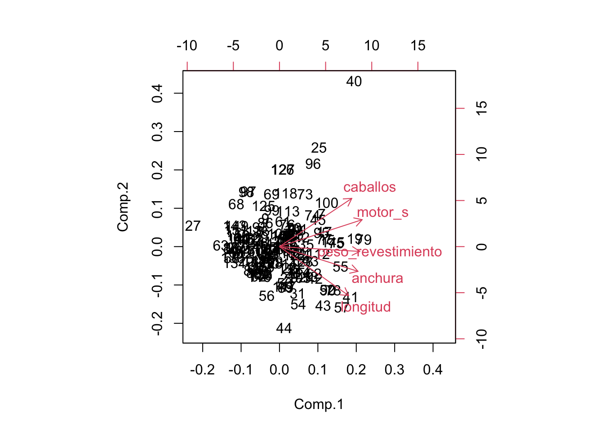

# Análisis de Componentes Principales

## Introducción


El análisis de componentes principales (ACP) es una técnica fundamental en estadística y análisis multivariado que se utiliza para simplificar y entender la estructura subyacente en conjuntos de datos complejos. Esta metodología tiene aplicaciones en diversas disciplinas, como la estadística, la ingeniería, la biología, la economía y la ciencia de datos.

En esencia, el ACP busca transformar un conjunto de variables correlacionadas en un nuevo conjunto de variables no correlacionadas, conocidas como componentes principales. Estos componentes se ordenan en función de la cantidad de varianza que explican en los datos originales, lo que permite destacar las direcciones principales de variabilidad en el conjunto de datos.

La idea central detrás del ACP es reducir la dimensionalidad del conjunto de datos, manteniendo la mayor cantidad posible de información. Al proyectar los datos en un espacio de menor dimensión definido por los componentes principales, se facilita la visualización y la interpretación de patrones y tendencias en los datos, lo que puede ser crucial para la toma de decisiones informada.

A lo largo de este proceso, el ACP proporciona una herramienta valiosa para identificar patrones subyacentes, eliminar redundancias y resaltar las relaciones más importantes entre las variables, lo que contribuye significativamente a la simplificación y comprensión de conjuntos de datos complejos.

## Antes de empezar

Antes de aplicar el ACP, es importante considerar algunas condiciones y realizar ciertos pasos:

**Tipo de Variables:** El ACP se utiliza comúnmente con variables cuantitativas. Las variables deben ser de escala numérica, ya que el método implica operaciones algebraicas y estadísticas que requieren números. Si tienes variables categóricas, es posible que necesites realizar alguna transformación o utilizar técnicas diferentes.

**Escalas de Medición:** Las variables deben tener escalas de medición comparables. Si las unidades de medida son muy diferentes entre las variables, es recomendable estandarizar o normalizar las variables antes de aplicar el ACP para evitar que una variable con una escala más grande domine la variabilidad.

**Correlación entre Variables:** El ACP asume que existe cierta correlación entre las variables originales. Si las variables están completamente incorrelacionadas, el análisis no aportará información significativa.

**Linealidad:** El ACP asume linealidad entre las variables. Si la relación entre las variables es altamente no lineal, el ACP puede no capturar adecuadamente la estructura subyacente de los datos.

## El ACP

### Escalado de las variables

El proceso de PCA identifica aquellas direcciones en las que la varianza es mayor. Como la varianza de una variable se mide en su misma escala elevada al cuadrado, si antes de calcular las componentes no se estandarizan todas las variables para que tengan media 0 y desviación estándar 1, aquellas variables cuya escala sea mayor dominarán al resto. De ahí que sea recomendable estandarizar siempre los datos.

### Influencia de outliers

Al trabajar con varianzas, el método PCA es altamente sensible a outliers, por lo que es altamente recomendable estudiar si los hay. La detección de valores atípicos con respecto a una determinada dimensión es algo relativamente sencillo de hacer mediante comprobaciones gráficas. Sin embargo, cuando se trata con múltiples dimensiones el proceso se complica. Por ejemplo, considérese un hombre que mide 2 metros y pesa 50 kg. Ninguno de los dos valores es atípico de forma individual, pero en conjunto se trataría de un caso muy excepcional. La distancia de Mahalanobis es una medida de distancia entre un punto y la media que se ajusta en función de la correlación entre dimensiones y que permite encontrar potenciales outliers en distribuciones multivariante.

### Proporción de varianza explicada

Una de las preguntas más frecuentes que surge tras realizar un PCA es: ¿Cuánta información presente en el set de datos original se pierde al proyectar las observaciones en un espacio de menor dimensión? o lo que es lo mismo ¿Cuanta información es capaz de capturar cada una de las componentes principales obtenidas? Para contestar a estas preguntas se recurre a la proporción de varianza explicada por cada componente principal.

### Número óptimo de componentes principales

Por lo general, dada una matriz de datos de dimensiones n x p, el número de componentes principales que se pueden calcular es como máximo de n-1 o p (el menor de los dos valores es el limitante). Sin embargo, siendo el objetivo del PCA reducir la dimensionalidad, suelen ser de interés utilizar el número mínimo de componentes que resultan suficientes para explicar los datos. No existe una respuesta o método único que permita identificar cual es el número óptimo de componentes principales a utilizar. Una forma de proceder muy extendida consiste en evaluar la proporción de varianza explicada acumulada y seleccionar el número de componentes mínimo a partir del cual el incremento deja de ser sustancial.

## Test iniciales

### Pruebas esfericidad de Bartlett

Se utiliza para probar la Hipótesis Nula que afirma que las variables no están correlacionadas en la población. Es decir, comprueba si la matriz de correlaciones es una matriz de identidad. Se puede dar como válidos aquellos resultados que nos presenten un valor elevado del test y cuya fiabilidad sea menor a 0.05. En este caso se rechaza la Hipótesis Nula y se continúa con el Análisis.

Prueba de esfericidad de Bartlett:

:::{ .infobox_resume}

Si Sig. (p-valor) < 0.05 aceptamos $H_0$ (hipótesis nula) => se puede aplicar el análisis factorial.

Si Sig. (p-valor) > 0.05 rechazamos $H_0$ => no se puede aplicar el análisis factorial.

:::

### Prueba del KMO

El test KMO (Kaiser, Meyer y Olkin) relaciona los coeficientes de correlación, $r_{jh}$, observados entre las variables $X_j$ y $X_h$, y $a_{jh}$ son los coeficientes de correlación parcial entre las variables $X_j$ y $X_h$. Cuanto más cerca de 1 tenga el valor obtenido del test KMO, implica que la relación entres las variables es alta. Si KMO ≥ 0.9, el test es muy bueno; notable para KMO ≥ 0.8; mediano para KMO ≥ 0.7; bajo para KMO ≥ 0.6; y muy bajo para KMO < 0.5.

La prueba de evalúa la aplicabilidad del análisis factorial de las variables estudiadas. El modelo es significativo (aceptamos la hipótesis nula, H0) cuando se puede aplicar el análisis factorial


## Una aplicación con "Datos de Empleados"

El objetivo es aplicar el ACP a los datos "Datos de Empleados". Debemos seleccionar solo las variables cuantitativas a las que vamos a añadir la edad del empleado.

Lectura de datos y cálculo de matriz de correlaciones


```r
library(openxlsx)
bbdd <- read.xlsx("Datos/Datos_de_empleados.xlsx")
cor(bbdd$salario,bbdd$salini)
#> [1] 0.8801175
cor(bbdd$salario,bbdd$expprev)
#> [1] -0.09746693
# Un plot con correlaciones
library(ggcorrplot)
#> Loading required package: ggplot2
ggcorrplot(cor(bbdd[,6:9]),lab_size = 3,hc.order = TRUE,method = "circle",lab = TRUE)
```


> **Ejercicio: Incluir nueva variable: Edad del empleado**

Buscar información para calcular la edad de cada empleado e introducirla como una nueva variable


Normalizamos datos

El cálculo de los componentes principales depende de las unidades de medida empleadas en las variables. Es importante, antes de aplicar el PCA, estandarizar las variables para que tengan media 0 y desviación estándar 1.


```r
de <- bbdd[,c(6:9,11)]
de.n <- scale(de)
corr_matrix <- cor(de.n)
ggcorrplot(corr_matrix,lab = TRUE,digits=3)
```


```r
library(corrplot)
#> corrplot 0.92 loaded
corrplot(cor(de.n))
```


Test de adecuación del ACP


```r
library(psych)
cortest.bartlett(cor(de.n),n=474)
#> $chisq
#> [1] 1266.164
#> 
#> $p.value
#> [1] 7.662669e-266
#> 
#> $df
#> [1] 10
```

Con este test podemos ver la relación de coeficientes de correlación entre variables si el valor es cercano a 1, mayor será la relación entre variables, dado los valores, se puede decir que es apto para la realización del análisis de componentes.


```r
KMO(de.n)
#> Kaiser-Meyer-Olkin factor adequacy
#> Call: KMO(r = de.n)
#> Overall MSA =  0.48
#> MSA for each item = 
#>  salario   salini tiempemp  expprev     edad 
#>     0.48     0.47     0.08     0.50     0.51
```

## Paquetes de R para el ACP

> **library(stats)**

* prcomp() -> Forma rápida de implementar PCA sobre una matriz de datos.

* princomp()

> **library(FactoMineR)**

* PCA() -> PCA con resultados más detallados. Los valores ausentes se reemplazan por la media de cada columna. Pueden incluirse variables categóricas suplementarias. Estandariza automáticamente los datos.

> **library(factoextra)**

* fviz_pca_ind() -> Representación de observaciones sobre componentes principales.

* fviz_pca_var() -> Representación de variables sobre componentes principales.

* fviz_screeplot() -> Representación (gráfico barras) de eigenvalores.

* fviz_contrib() -> Representa la contribución de filas/columnas de los resultados de un pca.

* get_pca() -> Extrae la información sobre las observaciones y variables de un análisis PCA.

* get_pca_var() -> Extrae la información sobre las variables.

* get_pca_ind() -> Extrae la información sobre las observaciones.

## Proporción de la varianza explicada

¿Cuánta información presente en el set de datos original se pierde al proyectar las observaciones en un espacio de menor dimensión?

¿Cuánta información es capaz de capturar cada una de las componentes principales obtenidas?


```r
# https://rpubs.com/laurarojasmar/ACP
pca <- prcomp(de, scale = TRUE)
print(pca)
#> Standard deviations (1, .., p=5):
#> [1] 1.3993033 1.3197040 1.0021060 0.4405821 0.3193784
#> 
#> Rotation (n x k) = (5 x 5):
#>                  PC1         PC2          PC3         PC4
#> salario  -0.60483585 -0.36493800  0.025204955  0.02748384
#> salini   -0.54214209 -0.45751707 -0.101152801  0.01888093
#> tiempemp -0.01592624 -0.07314815  0.992391695 -0.04844080
#> expprev   0.39509934 -0.58382909 -0.065339258 -0.70311587
#> edad      0.42883379 -0.55793488  0.004724985  0.70863934
#>                  PC5
#> salario   0.70682615
#> salini   -0.69726014
#> tiempemp -0.08489944
#> expprev   0.06632468
#> edad      0.05116844
```


```r
de.pca <- princomp(de.n)
summary(princomp(de.n))
#> Importance of components:
#>                          Comp.1    Comp.2    Comp.3
#> Standard deviation     1.397826 1.3183112 1.0010484
#> Proportion of Variance 0.391610 0.3483237 0.2008433
#> Cumulative Proportion  0.391610 0.7399337 0.9407770
#>                            Comp.4     Comp.5
#> Standard deviation     0.44011714 0.31904129
#> Proportion of Variance 0.03882252 0.02040051
#> Cumulative Proportion  0.97959949 1.00000000
```

## El gráfico de sedimentación

El gráfico de sedimentación se obtiene al representar en ordenadas las raíces características y en abscisas los números de las componentes principales correspondientes a cada raíz característica en orden decreciente.Uniendo todos los puntos se obtiene una Figura que, en general, se parece al perfil de una montaña con una fuerte pendiente hasta llegar a la base, formada por una meseta con una ligera inclinación.En este símil establecido de la montaña, en la meseta es donde se acumulan los guijarros caídos desde la cumbre, es decir, donde se sedimentan. Este es el motivo por lo que al gráfico se le conoce con el nombre de gráfico de sedimentación, su denominación en ingléses scree plot. De acuerdo con el criterio gráfico se retienen todas aquellas componentes previas a la zona de sedimentación.


```r
scree(de.n)
```


```r
library(psych)
library(FactoMineR)
library(factoextra)
de.pca <- PCA(de.n, graph = FALSE)
fviz_eig(de.pca, addlabels=T)
```


## Las componentes


```r
biplot(x = pca, scale = 0, cex = 0.6, col = c("blue4", "brown3"))
```


```r
de.pca <- princomp(de.n)
a <- de.pca$scores
bbdd$cp1 <- a[,1]
bbdd$cp2 <- a[,2]
```


```r
plot(bbdd$cp1,bbdd$cp2,col=as.factor(bbdd$sexo))
```


```r
plot(bbdd$cp1,bbdd$cp2,col=as.factor(bbdd$catlab))
```


## Ejercicio: ACP como indicador sintético

El ACP puede utilizarse para crear un indicador sintético al considerar los primeros componentes principales como resúmenes o representaciones condensadas del conjunto de datos original. Si bien cada componente principal es una combinación lineal de las variables originales, los primeros componentes suelen capturar las características más importantes o patrones de variabilidad presentes en los datos.

### Los datos

El siguiente conjunto de datos corresponde a calificaciones de 20 estudiantes en 5 materias Ciencias Natuales (CNa), Matemáticas (Mat), Francés (Fra), Latín (Lat) y Literatura (Lit)


```r
# https://bookdown.org/victor_morales/TecnicasML/an%C3%A1lisis-de-componentes-principales.html
CNa <- c(7,5,5,6,7,4,5,5,6,6,6,5,6,8,6,4,6,6,6,7)
Mat <- c(7,5,6,8,6,4,5,6,5,5,7,5,6,7,7,3,4,6,5,7)
Fra <- c(5,6,5,5,6,6,5,5,7,6,5,4,6,8,5,4,7,7,4,6)
Lat <- c(5,6,7,6,7,7,5,5,6,6,6,5,6,8,6,4,8,7,4,7)
Lit <- c(6,5,5,6,6,6,6,5,6,6,5,4,5,8,6,4,7,7,4,6)
Notas <- cbind(CNa,Mat,Fra,Lat,Lit)
Notas
#>       CNa Mat Fra Lat Lit
#>  [1,]   7   7   5   5   6
#>  [2,]   5   5   6   6   5
#>  [3,]   5   6   5   7   5
#>  [4,]   6   8   5   6   6
#>  [5,]   7   6   6   7   6
#>  [6,]   4   4   6   7   6
#>  [7,]   5   5   5   5   6
#>  [8,]   5   6   5   5   5
#>  [9,]   6   5   7   6   6
#> [10,]   6   5   6   6   6
#> [11,]   6   7   5   6   5
#> [12,]   5   5   4   5   4
#> [13,]   6   6   6   6   5
#> [14,]   8   7   8   8   8
#> [15,]   6   7   5   6   6
#> [16,]   4   3   4   4   4
#> [17,]   6   4   7   8   7
#> [18,]   6   6   7   7   7
#> [19,]   6   5   4   4   4
#> [20,]   7   7   6   7   6
```

* Obtener un sumario de la información
* Obtener la matriz de correlaciones
* Obtener test de adecuación
* Obtener CPs
* Interpretarlas

## Aplicación: Regresión y ACP

En esta sección realizaremos un ejercicio en el que se combina la Regresión Lineal Múltiple (RLM) con el ACP. El objetivo es reducir los problemas de multicolinealidad en la RLM al incluir variables altamente correlacionadas.

El ACP se utiliza principalmente para abordar problemas de multicolinealidad o reducción de dimensionalidad en conjuntos de datos, lo que puede tener implicaciones en modelos de regresión múltiple. Sin embargo, es importante tener en cuenta que al usar el ACP de esta manera, la interpretación de los coeficientes en términos de las variables originales puede volverse más complicada.

### Lectura y sumario de los datos

Utilizaremos la base de datos de venta de vehículos. El objetivo es predecir el precio en base a sus características. Un sumario de los datos se muestra a continuación.


```r
library(openxlsx)
CarSales <- read.xlsx("Datos/CarSAles.xlsx")
summary(CarSales)
#>   fabricante           modelo              ventas      
#>  Length:157         Length:157         Min.   :  0.11  
#>  Class :character   Class :character   1st Qu.: 14.11  
#>  Mode  :character   Mode  :character   Median : 29.45  
#>                                        Mean   : 53.00  
#>                                        3rd Qu.: 67.96  
#>                                        Max.   :540.56  
#>                                                        
#>     reventa           tipo            precio      
#>  Min.   : 5.16   Min.   :0.0000   Min.   : 9.235  
#>  1st Qu.:11.26   1st Qu.:0.0000   1st Qu.:18.017  
#>  Median :14.18   Median :0.0000   Median :22.799  
#>  Mean   :18.07   Mean   :0.2611   Mean   :27.391  
#>  3rd Qu.:19.88   3rd Qu.:1.0000   3rd Qu.:31.948  
#>  Max.   :67.55   Max.   :1.0000   Max.   :85.500  
#>  NA's   :36                       NA's   :2       
#>     motor_s         caballos     BaseNeumatico  
#>  Min.   :1.000   Min.   : 55.0   Min.   : 92.6  
#>  1st Qu.:2.300   1st Qu.:149.5   1st Qu.:103.0  
#>  Median :3.000   Median :177.5   Median :107.0  
#>  Mean   :3.061   Mean   :185.9   Mean   :107.5  
#>  3rd Qu.:3.575   3rd Qu.:215.0   3rd Qu.:112.2  
#>  Max.   :8.000   Max.   :450.0   Max.   :138.7  
#>  NA's   :1       NA's   :1       NA's   :1      
#>     anchura         longitud     peso_revestimiento
#>  Min.   :62.60   Min.   :149.4   Min.   :1.895     
#>  1st Qu.:68.40   1st Qu.:177.6   1st Qu.:2.971     
#>  Median :70.55   Median :187.9   Median :3.342     
#>  Mean   :71.15   Mean   :187.3   Mean   :3.378     
#>  3rd Qu.:73.42   3rd Qu.:196.1   3rd Qu.:3.800     
#>  Max.   :79.90   Max.   :224.5   Max.   :5.572     
#>  NA's   :1       NA's   :1       NA's   :2         
#>  tapón_combustible      kpl       
#>  Min.   :10.30     Min.   :15.00  
#>  1st Qu.:15.80     1st Qu.:21.00  
#>  Median :17.20     Median :24.00  
#>  Mean   :17.95     Mean   :23.84  
#>  3rd Qu.:19.57     3rd Qu.:26.00  
#>  Max.   :32.00     Max.   :45.00  
#>  NA's   :1         NA's   :3
```

### Eliminación de datos perdidos

Por simplicidad en el ejercicio se eliminan algunos datos en los que hay datos faltantes. En general estos valores podrian ser sustituidos por valores medios.


```r
CarSales <- CarSales[!is.na(CarSales$peso_revestimiento),]
CarSales <- CarSales[!is.na(CarSales$precio),]
CarSales <- CarSales[!is.na(CarSales$kpl),]
```

### Un modelo de regresión básico


```r
formula <- precio ~ motor_s + caballos + BaseNeumatico + anchura + longitud + peso_revestimiento + tapón_combustible + kpl
summary(lm(formula , data=CarSales))
#> 
#> Call:
#> lm(formula = formula, data = CarSales)
#> 
#> Residuals:
#>     Min      1Q  Median      3Q     Max 
#> -14.494  -3.106  -0.469   2.547  32.108 
#> 
#> Coefficients:
#>                    Estimate Std. Error t value Pr(>|t|)    
#> (Intercept)        23.04275   17.32973   1.330  0.18575    
#> motor_s            -3.84947    1.24859  -3.083  0.00246 ** 
#> caballos            0.26273    0.01825  14.397  < 2e-16 ***
#> BaseNeumatico      -0.06376    0.15059  -0.423  0.67265    
#> anchura            -0.42902    0.27540  -1.558  0.12149    
#> longitud           -0.23427    0.08328  -2.813  0.00560 ** 
#> peso_revestimiento  9.01935    2.15367   4.188  4.9e-05 ***
#> tapón_combustible   0.31214    0.30997   1.007  0.31563    
#> kpl                 0.52783    0.25548   2.066  0.04063 *  
#> ---
#> Signif. codes:  
#> 0 '***' 0.001 '**' 0.01 '*' 0.05 '.' 0.1 ' ' 1
#> 
#> Residual standard error: 6.738 on 143 degrees of freedom
#> Multiple R-squared:  0.7932,	Adjusted R-squared:  0.7816 
#> F-statistic: 68.57 on 8 and 143 DF,  p-value: < 2.2e-16
```

* Se eliminan algunas variables no significativas. Pueden ser importantes para ontener un modelo explicativo pero no para un modelo predictivo.


```r
# Eliminamos variables no informativas
formula <- precio ~ motor_s + caballos + anchura + longitud + peso_revestimiento + kpl
summary(lm(formula , data=CarSales))
#> 
#> Call:
#> lm(formula = formula, data = CarSales)
#> 
#> Residuals:
#>     Min      1Q  Median      3Q     Max 
#> -13.810  -3.132  -0.354   2.399  32.529 
#> 
#> Coefficients:
#>                    Estimate Std. Error t value Pr(>|t|)    
#> (Intercept)        23.95706   17.06820   1.404  0.16257    
#> motor_s            -3.82675    1.24211  -3.081  0.00247 ** 
#> caballos            0.26213    0.01778  14.747  < 2e-16 ***
#> anchura            -0.42581    0.27043  -1.575  0.11753    
#> longitud           -0.25383    0.06039  -4.203 4.58e-05 ***
#> peso_revestimiento  9.98519    1.85702   5.377 2.96e-07 ***
#> kpl                 0.44621    0.23777   1.877  0.06258 .  
#> ---
#> Signif. codes:  
#> 0 '***' 0.001 '**' 0.01 '*' 0.05 '.' 0.1 ' ' 1
#> 
#> Residual standard error: 6.715 on 145 degrees of freedom
#> Multiple R-squared:  0.7917,	Adjusted R-squared:  0.7831 
#> F-statistic: 91.85 on 6 and 145 DF,  p-value: < 2.2e-16
```

* Finalmente se seleccionan algunas variables explicativas **Xs**


```r
Xs <- CarSales[,c("motor_s","caballos","anchura","longitud","peso_revestimiento")]
```

### Evaluamos matriz de correlaciones 

La multicolinealidad en un modelo de regresión múltiple implica la existencia de altas correlaciones entre las variables independientes, generando inestabilidad numérica y elevando la varianza de los estimadores de los coeficientes. Esto dificulta la interpretación precisa de los efectos individuales de las variables predictoras, así como la evaluación confiable de la importancia relativa de cada predictor en la predicción del resultado.


```r
library(ggcorrplot)
ggcorrplot(cor(Xs),lab_size = 5,lab = TRUE)
```


### Test de adecuación del ACP

Test de Bartlett contrasta la hipótesis de que el determinante es distinto de la unidad (matriz identidad)


```r
Xs.n <- scale(Xs)
library(psych)
cortest.bartlett(cor(Xs.n))
#> $chisq
#> [1] 356.0616
#> 
#> $p.value
#> [1] 2.059602e-70
#> 
#> $df
#> [1] 10
```

Indicador KMO sugiere buena adecuación del ACP


```r
KMO(Xs.n)
#> Kaiser-Meyer-Olkin factor adequacy
#> Call: KMO(r = Xs.n)
#> Overall MSA =  0.81
#> MSA for each item = 
#>            motor_s           caballos            anchura 
#>               0.75               0.74               0.85 
#>           longitud peso_revestimiento 
#>               0.84               0.88
```

### Cálculo de las componentes

la librería 'stats' incluye la función 'princomp()' que realiza el ACP.


```r
Xs.pca <- princomp(Xs.n)
summary(Xs.pca)
#> Importance of components:
#>                           Comp.1    Comp.2     Comp.3
#> Standard deviation     1.8864719 0.8581591 0.54305278
#> Proportion of Variance 0.7164689 0.1482628 0.05937187
#> Cumulative Proportion  0.7164689 0.8647317 0.92410355
#>                            Comp.4    Comp.5
#> Standard deviation     0.50375651 0.3510200
#> Proportion of Variance 0.05109024 0.0248062
#> Cumulative Proportion  0.97519380 1.0000000
```
Una o como máximo 2 CP serían necesarias para resumir la información. Con dos CPs se está recogiendo el 86% de la información.

### Interpretación de las CPs


```r
Xs.pca$loadings
#> 
#> Loadings:
#>                    Comp.1 Comp.2 Comp.3 Comp.4 Comp.5
#> motor_s             0.482  0.345                0.804
#> caballos            0.421  0.618  0.386        -0.540
#> anchura             0.457 -0.317 -0.175 -0.803 -0.120
#> longitud            0.403 -0.628  0.563  0.356       
#> peso_revestimiento  0.468        -0.708  0.478 -0.218
#> 
#>                Comp.1 Comp.2 Comp.3 Comp.4 Comp.5
#> SS loadings       1.0    1.0    1.0    1.0    1.0
#> Proportion Var    0.2    0.2    0.2    0.2    0.2
#> Cumulative Var    0.2    0.4    0.6    0.8    1.0
```
La CP1 es un indicador global. Todas las variables puntúan de forma positiva. La CP2 discrimina coches potentes (xon muchos CVs y cc) frente a coches pequeños.


```r
biplot(Xs.pca)
```




```r
summary(lm(CarSales$precio ~ Xs.pca$scores[,1:2]))
#> 
#> Call:
#> lm(formula = CarSales$precio ~ Xs.pca$scores[, 1:2])
#> 
#> Residuals:
#>     Min      1Q  Median      3Q     Max 
#> -22.567  -4.051  -0.997   2.878  33.487 
#> 
#> Coefficients:
#>                            Estimate Std. Error t value
#> (Intercept)                 27.3318     0.6601   41.40
#> Xs.pca$scores[, 1:2]Comp.1   4.4839     0.3499   12.81
#> Xs.pca$scores[, 1:2]Comp.2   9.7531     0.7692   12.68
#>                            Pr(>|t|)    
#> (Intercept)                  <2e-16 ***
#> Xs.pca$scores[, 1:2]Comp.1   <2e-16 ***
#> Xs.pca$scores[, 1:2]Comp.2   <2e-16 ***
#> ---
#> Signif. codes:  
#> 0 '***' 0.001 '**' 0.01 '*' 0.05 '.' 0.1 ' ' 1
#> 
#> Residual standard error: 8.138 on 149 degrees of freedom
#> Multiple R-squared:  0.6856,	Adjusted R-squared:  0.6814 
#> F-statistic: 162.5 on 2 and 149 DF,  p-value: < 2.2e-16
```

