# Análisis  Cluster

El análisis clúster es un conjunto amplio de técnicas para encontrar subgrupos de observaciones dentro de un conjunto de datos. Cuando agrupamos observaciones, queremos que las observaciones en el mismo grupo sean similares y que las observaciones en diferentes grupos sean diferentes. Dado que no hay una variable de respuesta, este es un método no supervisado, lo que implica que busca encontrar relaciones entre las $n$ observaciones sin ser entrenado por una variable de respuesta. El agrupamiento nos permite identificar qué observaciones son similares y potencialmente categorizarlas como tales. El agrupamiento K-medias (K-means) es el método de agrupamiento más simple y comúnmente utilizado para dividir un conjunto de datos en un conjunto de k grupos o clusters.


{width=90%}


Para realizar un análisis de clúster en R, por lo general, los datos deben estar preparados de la siguiente manera:

1.- Las filas representan observaciones (individuos) y las columnas representan variables.

2.- Cualquier caso con valor omitido en los datos debe ser eliminado o estimado.

3.- Los datos deben estar estandarizados para hacer que las variables sean comparables. Recuerde que la estandarización consiste en transformar las variables de manera que tengan una media cero y una desviación estándar de uno.

Estas son las tres librerias de R que necesitaremos


```r
library(tidyverse)  #  Manipulación de datos
library(cluster)    #  Algoritmos de clustering 
library(factoextra) #  Algoritmos de clustering y visualización
```

## Medidas de distancia

La clasificación de observaciones en grupos requiere algunos métodos para calcular la distancia o la (dis)similitud entre cada par de observaciones. El resultado de este cálculo se conoce como una matriz de disimilitud o distancia. Existen muchos métodos para calcular esta distancia. La elección de las medidas de distancia es un paso crítico en el agrupamiento lod datos y afectará la forma de los grupos o clusters. Los métodos clásicos para las medidas de distancia son las distancias Euclidea y  Manhattan, aunque también existen otras distancias basadas en correlaciones:

**Distancia Euclidea**
$$d_E(x,y)=\sqrt{\sum\limits_{i=1}^n(x_i-y_i)^2}$$

**Distancia Manhattan**
$$d_M(x,y)=\sum\limits_{i=1}^n|x_i-y_i|$$
**Distancia Correlación de Pearson**
$$d_P(x,y)=1-\frac{\sum\limits_{i=1}^n(x_i-\bar{x})(y_i-\bar{y})}{\sqrt{\sum\limits_{i=1}^n(x_i-\bar{x})^2\sum\limits_{i=1}^n(y_i-\bar{y})^2}}$$
**Distancia Correlación de Spearman**
$$d_S(x,y)=1-\frac{\sum\limits_{i=1}^n(\tilde{x}_i-\bar{\tilde{x}})(\tilde{y}_i-\bar{\tilde{y}})}{\sqrt{\sum\limits_{i=1}^n(\tilde{x}_i-\bar{\tilde{x}})^2\sum\limits_{i=1}^n(\tilde{y}_i-\bar{\tilde{y}})^2}}$$
donde hemos denotado por $\tilde{x}_i=rank(x_i)$ el rango de la observación $x_i$.

Para el caso en el que los datos a clusterizar sean secuencias de caracteres (tipo categóricos), tambien se puede calcular la **Distancia de Hamming** que se calcula contando el número de posiciones en las que los caracteres correspondientes son diferentes. Se utiliza principalmente en secuencias binarias. Por ejemplo, dadas las secuencias $"1010101"$ y $"1001001"$ la distancia de Hamming sería 3, ya que hay tres posiciones donde son diferentes.


## Análisis cluster con el algoritmo K-medias.

El análsis clúster K-medias es el algoritmo de aprendizaje automático no supervisado más comúnmente utilizado para dividir un conjunto de datos en un conjunto de $k$ grupos (es decir, $k$ clústeres), donde $k$ representa el número de grupos predefinido por el analista. La clasificacion de los individuos se hace de tal manera que dentro del mismo clúster son tan similares como sea posible, mientras que los individuos de diferentes clústeres son tan diferentes como sea posible. Cada clúster está representado por su centro (o centroide), que corresponde a la media de los puntos asignados al clúster.

La idea básica detrás de la del algoritmo k-medias consiste en definir grupos de manera que la variación total intra-cluster (conocida como variación total dentro del grupo) se minimice.

Existen varios algoritmos de k-nedias disponibles. El algoritmo estándar es el algoritmo de Hartigan-Wong (Hartigan y Wong 1979), que define la variación total dentro del grupo como la suma de las distancias euclidianas al cuadrado entre los elementos y el centroide correspondiente:
$$W(C_k)=\sum\limits_{x_i\in C_k}(x_i-\mu_k)^2$$
donde $x_i$ es el dato perteneciente al cluster $C_k$ y $\mu_k$ es el valor medio de los puntos asignados al cluster $C_k$.

Cada punto $x_i$ se asocia al clúster que verifica que la suma de los cuadrados de las distancias de cada observación al centro de su cluster asignado (valor medio $\mu_k$) sea mínimo.

Se define la variación total dentro de clúster como $$VTDC=\sum_{i=1}^KW(C_k)=\sum_{i=1}^K\sum\limits_{x_i\in C_k}(x_i-\mu_k)^2$$

$VTDC$ mide la compacidad (es decir, la calidad) del agrupamiento y queremos que sea lo más pequeña posible.

### K-medias

El primer paso al utilizar el algoritmo k-medias es indicar el número de grupos/clústeres $k$ que se generarán en la solución final. El algoritmo comienza seleccionando aleatoriamente $k$ individuos del conjunto de datos para que sirvan como los centros iniciales de los clústeres. Los individuos seleccionados también se conocen como medias o centroides del clúster. A continuación, a cada uno de los objetos restantes se le asigna su centroide más cercano, donde "más cercano" se define usando la distancia utilizada entre el objeto y la media del grupo. Este paso se llama "paso de asignación de clúster". Después del paso de asignación, el algoritmo calcula el nuevo valor medio de cada clúster. El término "actualización del centroide del clúster" se utiliza para designar este paso. Ahora que los centros han sido recalculados, se vuelve a verificar cada observación para ver si podría estar más cerca de un grupo diferente. Todos los objetos se vuelven a asignar utilizando las medias actualizadas del grupo. Los pasos de asignación de grupo y actualización del centroide se repiten de forma iterativa hasta que las asignaciones de grupo dejan de cambiar (es decir, hasta que se alcanza la convergencia). Es decir, los grupos formados en la iteración actual son los mismos que los obtenidos en la iteración anterior.

El algoritmo $K$-medias se puede resumir de la siguiente manera:

1. Especificar el número de clúster $K$ que se crearán (por el investigador).

2. Seleccionar aleatoriamente k individuos del conjunto de datos como los centros o medias iniciales del clúster.

3. Asignar cada observación a su centroide más cercano, basado en una distancia entre el individuo y el centroide.

4. Para cada uno de los $k$ clústeres, actualizar el centroide del clúster calculando los nuevos valores medios de todos los puntos de datos en el clúster. El centroide de un $i$-ésimo clúster es un vector de longitud $p$ que contiene las medias de todas las variables para las observaciones en el $i$-ésimo clúster y  $p$ es el número de variables.

5. Minimizar de forma iterativa la suma total de cuadrados dentro del grupo $VTDC$. Es decir, iterar los pasos 3 y 4 hasta que las asignaciones de clúster dejen de cambiar o se alcance el número máximo de iteraciones. Por defecto, el software R utiliza 10 como valor predeterminado para el número máximo de iteraciones.

## Un ejemplo de análisis clúster con R
En esta sección seleccionamos las librerias a utilizar y explicamos las funciones básicas para realizar un análsis cluster por k-medias

### Funciones básicas de R para usar K-medias

Para realizar un análisis cluster con R necesitamos cargar algunas librerias esenciales.

```r
> library(dplyr)
> library(magrittr)
> library(plyr)
> library(ggplot2)
> library(plotly)
> library(tidyverse)  # data manipulation
> library(cluster)    # clustering algorithms
> # install.packages("factoextra")
> library(factoextra) # clustering algorithms & visualization
```

El fichero de datos que vamos a trabajar es **CarSales.xlsx** que contine datos de estimaciones de ventas, precios de catálogo y especificaciones físicas hipotéticas de varias marcas y modelos de vehículos. 

```r
> library(readxl)     # read xlsx files
> data <- read_xlsx("Datos/CarSales.xlsx")
```

Seleccionamos aquellas variables del fichero de datos que son numéricas para realizar el análsis cluster en funcion de ellas guardandolas en el objeto de R del tipo data frame llamado **datos**. Seguidamente tipifico los datos (acción que consiste en quitar la media y dividir por la desciación tipica) para normalizar las variables a que tengan media 0 y desviación típica 1 y elimino los NAN de la base de datos.


```r
> datos=as.data.frame(data[,c(3,4,6:14)])# selecciono aquellos elementos utilizados para la clusterización
> df=as.data.frame(scale(na.omit(datos)))# tipifico los datos, elimino los Nan y lo guardo en el data frame df
```

Dentro de R, es sencillo calcular y visualizar la matriz de distancias utilizando las funciones **get_dist** y **fviz_dist** del paquete R *factoextra*.

*get_dist*: para calcular una matriz de distancias entre las filas de una matriz de datos. La distancia predeterminada calculada es la Euclidiana; sin embargo, get_dist también admite otras distancias como las descritas anteriormente, entre otras.

*fviz_dist*: para visualizar una matriz de distancias.


```r
> distance <- get_dist(df)
> fviz_dist(distance, gradient = list(low = "#00AFBB", mid = "white", high = "#FC4E07"))
```

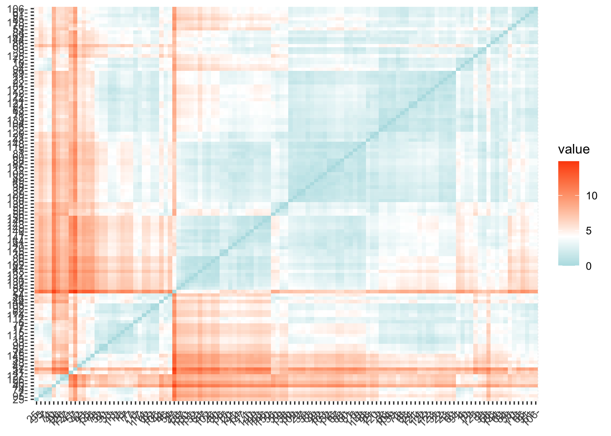

En R, podemos emplear la función **kmeans** para llevar a cabo el análisis de k-medias. En el ejemplo que vamos a realizar, se organizarán los datos en dos grupos **centers = 2**. Además, la función kmeans cuenta con una opción llamada **nstart** que realiza intentos con múltiples configuraciones iniciales y registra la mejor de ellas. Por ejemplo, al incluir **nstart = 25** se generarán 25 configuraciones iniciales. Este método se sugiere con frecuencia.


```r
> k2 <- kmeans(df, centers = 2, nstart = 25)
```
Para mostrar la estructura  interna del objeto **k2** generado al realizar el algoritmo k-medias en el ejemplo anterior podemos utilizar  la funcion **str**


```r
> str(k2)
#> List of 9
#>  $ cluster     : Named int [1:117] 1 2 2 1 2 2 1 2 2 2 ...
#>   ..- attr(*, "names")= chr [1:117] "1" "2" "4" "5" ...
#>  $ centers     : num [1:2, 1:11] 0.0434 -0.0426 -0.4533 0.4457 -0.5719 ...
#>   ..- attr(*, "dimnames")=List of 2
#>   .. ..$ : chr [1:2] "1" "2"
#>   .. ..$ : chr [1:11] "ventas" "reventa" "precio" "motor_s" ...
#>  $ totss       : num 1276
#>  $ withinss    : num [1:2] 261 558
#>  $ tot.withinss: num 819
#>  $ betweenss   : num 457
#>  $ size        : int [1:2] 58 59
#>  $ iter        : int 1
#>  $ ifault      : int 0
#>  - attr(*, "class")= chr "kmeans"
```

La función kmeans produce como resultado una lista con información diversa, siendo los elementos más relevantes:

1.- **cluster**: Un vector de números enteros (del 1 al k), que indica el clúster al que se asigna cada punto.

2.- **centers**: Una matriz que contiene los centros de los clústeres.

3.- **totss**: La suma total de los cuadrados.

4.- **withinss**: Un vector que contiene las sumas de cuadrados dentro de cada clúster, con un componente por clúster.

5.- **tot.withinss**: La suma total de cuadrados dentro de todos los clústeres, es decir, la suma de withinss.

6.- **betweenss**: La suma de cuadrados entre clústeres, calculada como **totss - tot.withinss**.

7.- **size**: El número de puntos en cada clúster.

Al imprimir los resultados, observaremos que nuestras agrupaciones generaron clústeres con tamaños de 61 y 56, respectivamente.


```r
> k2
#> K-means clustering with 2 clusters of sizes 58, 59
#> 
#> Cluster means:
#>        ventas    reventa     precio    motor_s   caballos
#> 1  0.04338422 -0.4533385 -0.5718609 -0.7030355 -0.6863263
#> 2 -0.04264890  0.4456548  0.5621683  0.6911197  0.6746937
#>   BaseNeumatico    anchura   longitud peso_revestimiento
#> 1    -0.5307746 -0.6676727 -0.6046852         -0.7833115
#> 2     0.5217784  0.6563562  0.5944363          0.7700351
#>   tapón_combustible        kpl
#> 1        -0.6622080  0.5717540
#> 2         0.6509841 -0.5620632
#> 
#> Clustering vector:
#>   1   2   4   5   6   7   9  10  11  12  13  14  15  17  18 
#>   1   2   2   1   2   2   1   2   2   2   2   2   2   2   2 
#>  20  21  22  23  24  25  26  27  29  30  31  32  33  36  37 
#>   1   1   1   2   2   2   1   1   1   1   2   1   2   1   1 
#>  38  40  41  42  43  44  46  47  48  49  50  52  53  54  55 
#>   1   2   2   2   2   2   2   1   1   1   1   2   2   2   2 
#>  56  57  58  59  60  61  62  63  64  65  66  68  69  70  71 
#>   1   2   1   1   1   2   2   1   1   1   2   1   1   2   2 
#>  72  74  77  78  80  81  82  83  84  85  86  87  88  89  90 
#>   2   2   2   2   1   1   1   2   1   2   1   1   1   1   2 
#>  91  92  93  94  95  96 102 103 104 105 106 109 112 113 114 
#>   2   2   1   2   2   2   1   1   2   2   2   1   2   2   2 
#> 115 116 117 119 120 121 122 123 125 126 127 130 131 132 137 
#>   1   1   2   1   1   2   2   2   1   2   2   1   1   1   1 
#> 138 139 140 141 143 144 145 146 147 148 149 150 
#>   1   2   1   1   1   1   2   1   1   1   1   1 
#> 
#> Within cluster sum of squares by cluster:
#> [1] 261.4993 557.6675
#>  (between_SS / total_SS =  35.8 %)
#> 
#> Available components:
#> 
#> [1] "cluster"      "centers"      "totss"       
#> [4] "withinss"     "tot.withinss" "betweenss"   
#> [7] "size"         "iter"         "ifault"
```

También es posible visualizar los resultados utilizando la función **fviz_cluster**. Esto proporciona una representación visual atractiva de los clústeres. En el caso de que haya más de dos dimensiones (variables), **fviz_cluster** llevará a cabo un análisis de componentes principales (PCA) y representará los puntos de datos en función de los dos primeros componentes principales que explican la mayor parte de la variabilidad.


```r
> fviz_cluster(k2, data = df)
```

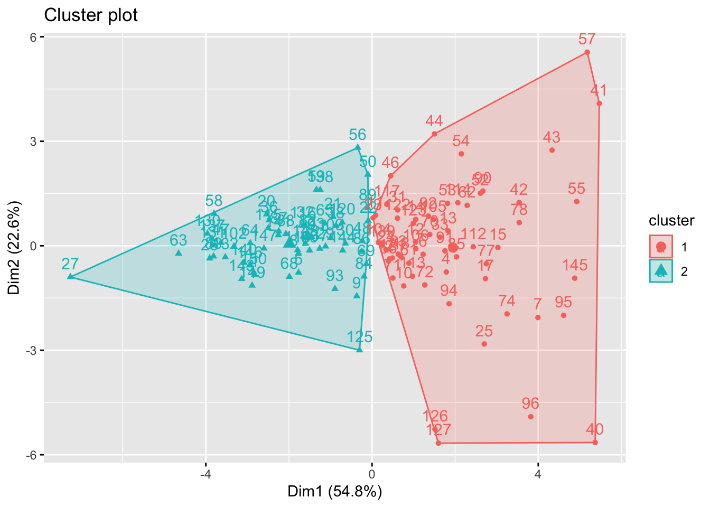

Alternativamente, puedes utilizar gráficos de dispersión clásicos por pares para ilustrar los clústeres en comparación con las variables originales.


```r
> data_sin_NAN=na.omit(data)
> modelo=data_sin_NAN$modelo
> 
> df %>%
+   as_tibble() %>%
+   mutate(cluster = k2$cluster,
+          Modelo =modelo) %>%
+   ggplot(aes(precio, caballos, color = factor(cluster), label = modelo)) +
+   geom_text()
```

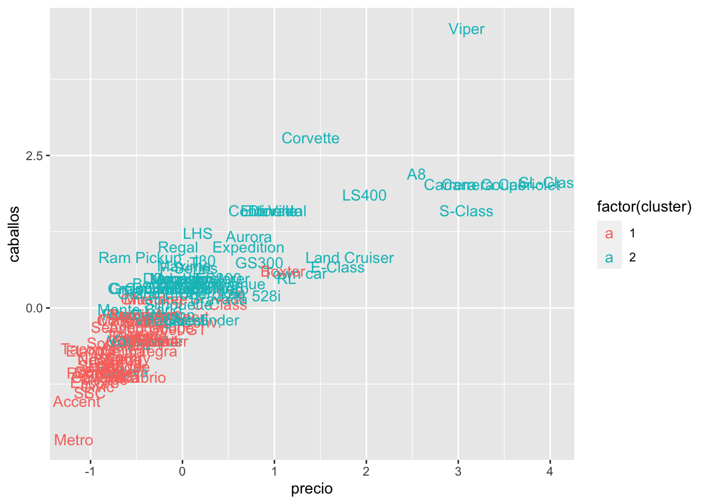
También podemos visualizar las variables y sus medias para cada cluster y así poder visualizar el peso de cada variable en el cluster y cuando ayuda en la clasificación.

```r
> df2=as.data.frame(scale(na.omit(datos)))#vuelvo a cargar los datos
> df2$clus=as.factor(k2$cluster)#defino una nueva columna de pertenencia a clúster
> df2$clus=factor(df2$clus)#lo defino como un factor 
> data_long=gather(df2,caracteristica,valor,ventas:kpl,factor_key=TRUE)#apilo los datos
> 
> ggplot(data_long,aes(as.factor(x=caracteristica),y=valor, group=clus,colour=clus))+
+   stat_summary(fun=mean,geom="pointrange",size=1)+
+   stat_summary(geom="line")+
+   geom_point(aes(shape=clus))
#> No summary function supplied, defaulting to `mean_se()`
#> Warning: Removed 22 rows containing missing values
#> (`geom_segment()`).
```

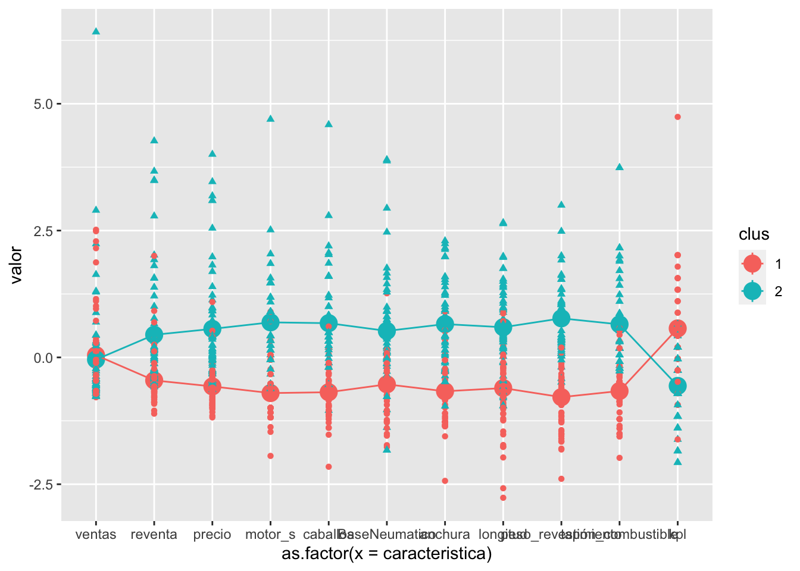

### Selección del número de clústeres

Dado que el número de clústeres ($k$) debe establecerse antes de iniciar el algoritmo, a menudo es ventajoso utilizar varios valores diferentes de $k$ y examinar las diferencias en los resultados. Podemos ejecutar el mismo proceso para 3, 4 y 5 clústeres, y los resultados se muestran en la figura:


```r
> k3 <- kmeans(df, centers = 3, nstart = 25)
> k4 <- kmeans(df, centers = 4, nstart = 25)
> k5 <- kmeans(df, centers = 5, nstart = 25)
> 
> # Gráficos para comparar
> p1 <- fviz_cluster(k2, geom = "point", data = df) + ggtitle("k = 2")
> p2 <- fviz_cluster(k3, geom = "point",  data = df) + ggtitle("k = 3")
> p3 <- fviz_cluster(k4, geom = "point",  data = df) + ggtitle("k = 4")
> p4 <- fviz_cluster(k5, geom = "point",  data = df) + ggtitle("k = 5")
> 
> library(gridExtra)
#> 
#> Attaching package: 'gridExtra'
#> The following object is masked from 'package:dplyr':
#> 
#>     combine
> grid.arrange(p1, p2, p3, p4, nrow = 2)
```


Estos gráficos nos permiten ver las diferentes configuraciones para diferente número de clústeres y nos dan una intuición sobre el número óptimo de clústeres. Para facilitar al analista la determinación de este numero óptimo, a continuación se explican los tres métodos más comunes para determinarlo, **Elbow**, **Silhouette** y el estadístico **Gap**

#### Método Elbow

Recordad que la idea que utiliza el algoritmo k-medias para identificar los clústeres es minimizar la variación total dentro de clúster  

$$VTDC=\sum_{i=1}^KW(C_k)=\sum_{i=1}^K\sum\limits_{x_i\in C_k}(x_i-\mu_k)^2$$

La suma $VTDC$, mide cuanto de compacto es el agrupamiento, y buscamos minimizar esta medida. Por tanto, podemos seguir el siguiente procedimiento para determinar el número óptimo de clústeres.

1.- Calcula el algoritmo  k-medias para diferentes valores de k. Por ejemplo, variando k desde 1 hasta 10 clústeres.

2.- Calcular, para cada valor de k, la variación total dentro de los clústeres $VTDC$.

3.- Representar gráficamente la curva de valores de $VTDC$ en función del número de clústeres k.

4.-El punto en el gráfico donde se observa un quiebre (codo) se considera comúnmente como un indicador del número apropiado de clústeres.

Podemos llevar a cabo este procedimiento en R con el siguiente código. Los resultados sugieren que 3 es el número óptimo de clústeres, ya que se observa el codo.


```r
> nk=10
> pares=matrix(0,nk,2)# definimos la matriz donde guardar los pares (nº cluster, VTDC) para valores de k=1:nk
> for (k in 1:nk){
+   pares[k,]=c(k,kmeans(df, k, nstart = 10 )$tot.withinss)# calculamos (nº cluster, VTDC)
+ }
> plot(pares[,1], pares[,2],
+        type="b", pch = 19, frame = FALSE, 
+        xlab="Número de clústeres K",
+        ylab="Variación total dentro del clúster VTDC")
```

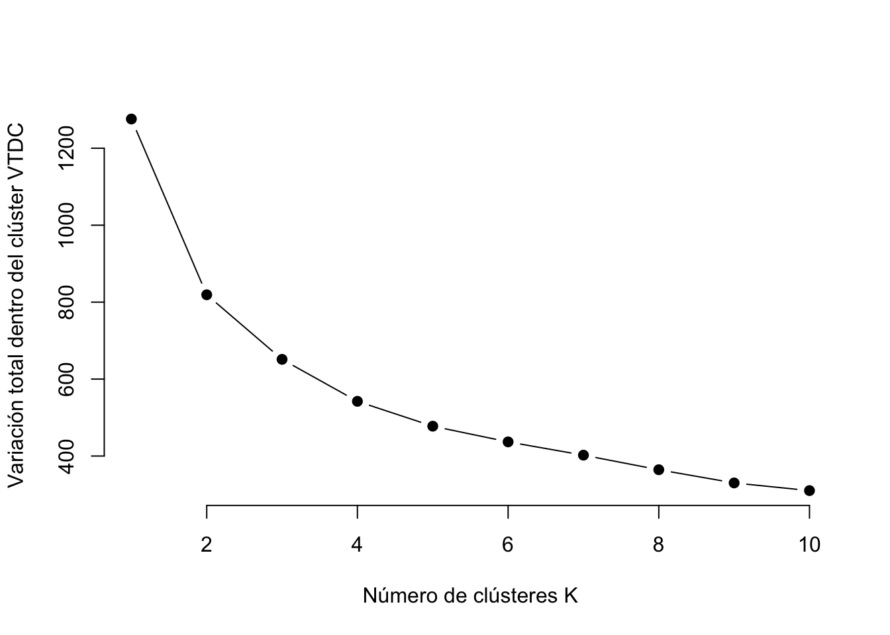

El método Elbow tambien se puede realizar con la función de R **fviz_nbclust** de la siguiente forma:


```r
> set.seed(123)
> fviz_nbclust(df, kmeans, method = "wss")
```

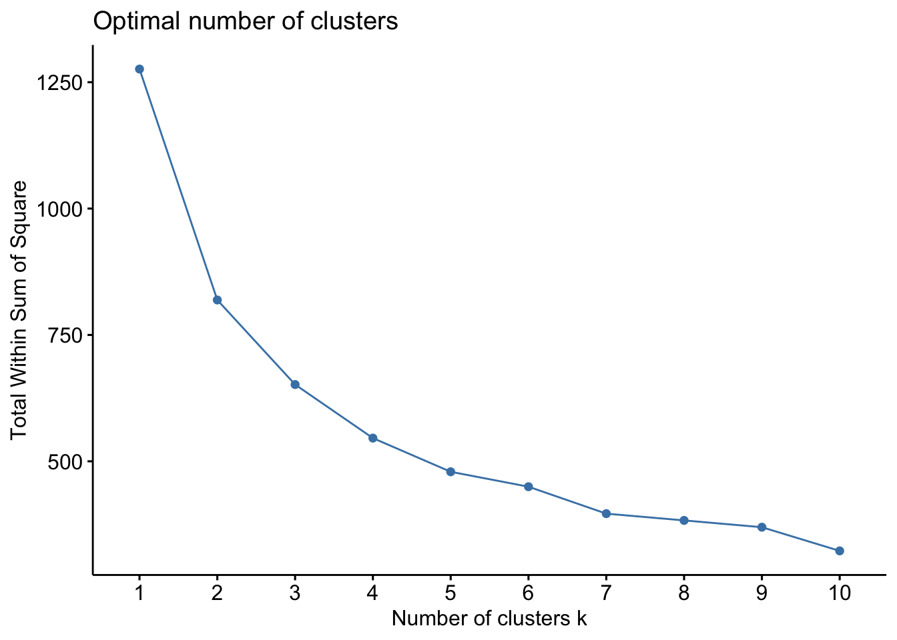

#### Método Silhouette

El método Silhouette evalúa la calidad de un agrupamiento, es decir, determina como de bien cada individuo se encuentra dentro del clúster.
Pasamos ahora a definir la silueta de un individuo $i$ que pertenece al clúster $C_I$ como $s(i)=0$ si $|C_I|=1$ y
$$s(i)=\frac{b(i)-a(i)}{\max\{a(i),b(i)\}}\mbox{ si }\quad |C_I|>1$$ 
 donde 
$$a(i)=\frac{1}{|C_I|-1}\sum\limits_{j\in C_I, j\neq i}d(i,j)$$
es la distancia media del individuo $i$ a todos los individuos de su cluster y
$$b(i)=\min\limits_{k\neq I}\frac{1}{|C_k|}\sum\limits_{j\in C_k}d(i,j)$$
la distancia media más pequeña entre las distancias medias del individuo $i$ a todos los individuos de un clúster $C_k$. Es fácil deducir que $-1\leq s(i)\leq1$. Un valor pequeño de $a(i)$ significa que el individuo $i$ es muy cercano a los individuos de su clúster, mientras que un valos grande de $b(i)$ significa que el individuo $i$ está muy distante de los indivíduos de su cluster vecino. Por todo ello, un valos de $s(i)$ cercano a 1 significa que el individuo $i$ está en el cluster apropiado, si es cercano a -1 significa que sería más apropiado que el individuo $i$ perteneciera a su clúster vecino y un valor $s(i)$=0 significa que podría pertenecer a dos clústeres diferentes. 


Un valor de silueta promedio alto indica un buen agrupamiento. El método del coeficiente de silueta calcula la silueta promedio de las observaciones para diferentes valores de k. El número óptimo de clústeres, k, es aquel que maximiza la silueta promedio a lo largo de un rango de posibles valores para k.
En este contexto se define el coeficiente Silhouette como
$$SC=\max_{k}\bar{s}(k)$$
donde $\bar{s}(k)$ denota la media de $s(i)$ para todos los $i\in C_k$.

Para llevar a cabo este enfoque, podemos utilizar la función **silhouette** del paquete **cluster** para calcular el ancho promedio de Silhouette. El siguiente código implementa este método para 2-$n_k$ clústeres. 


```r
> nk=10
> Spares=matrix(0,nk-1,2)# definimos la matriz donde guardar los pares (nº cluster, VTDC) para valores de k=1:nk
> cont=0
> for (k in 2:nk){
+   cont=cont+1
+   resultado<-kmeans(df, k, nstart = 10)
+   ss<-silhouette(resultado$cluster,dist(df))
+   Spares[cont,]=c(k,mean(ss[,3]))# calculamos (nº cluster, VTDC)
+ }
> plot(Spares[,1], Spares[,2],
+        type="b", pch = 19, frame = FALSE, 
+        xlab="Número de clústeres K",
+        ylab="Silueta  promedio")
```

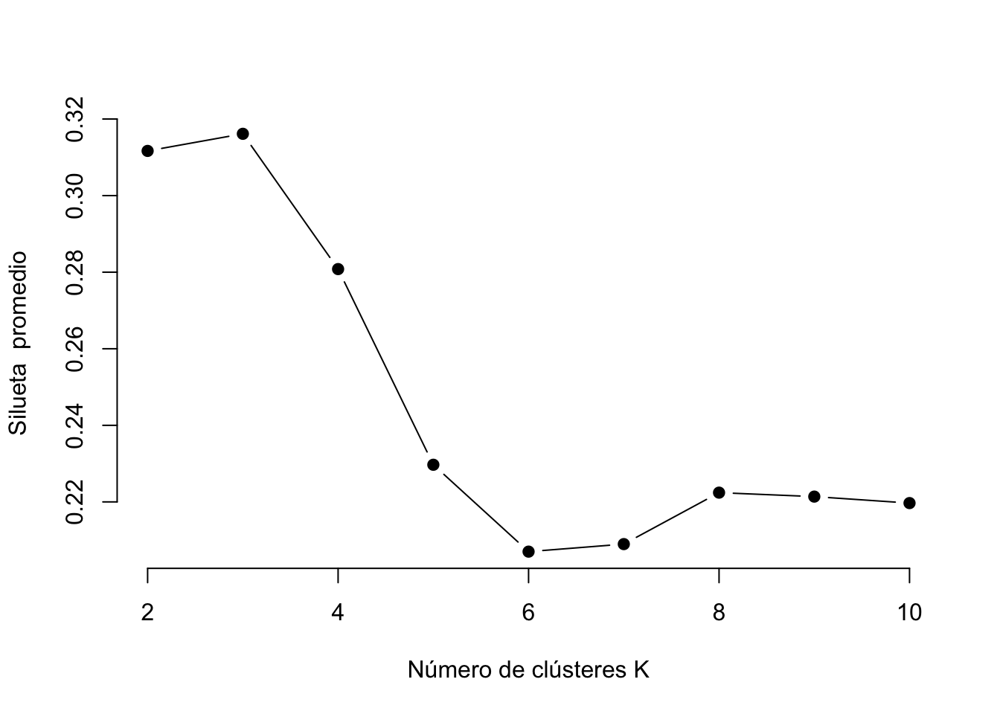
Los resultados muestran que 3 clústeres maximizan los valores medio de silueta, y que 5 clústeres son el segundo número óptimo.

### Visualización del clúster óptimo

Con los resultados obtenidos en las secciones anteriores indican que $k=3$ es el número optimo de clústeres, realizaremos el algoritmo k-medias para k=3 y lo representaremos con las  función **fviz_cluster**.


```r
> ClusterOpt <- kmeans(df, centers = 3, nstart = 25)
> fviz_cluster(ClusterOpt, data = df)
```

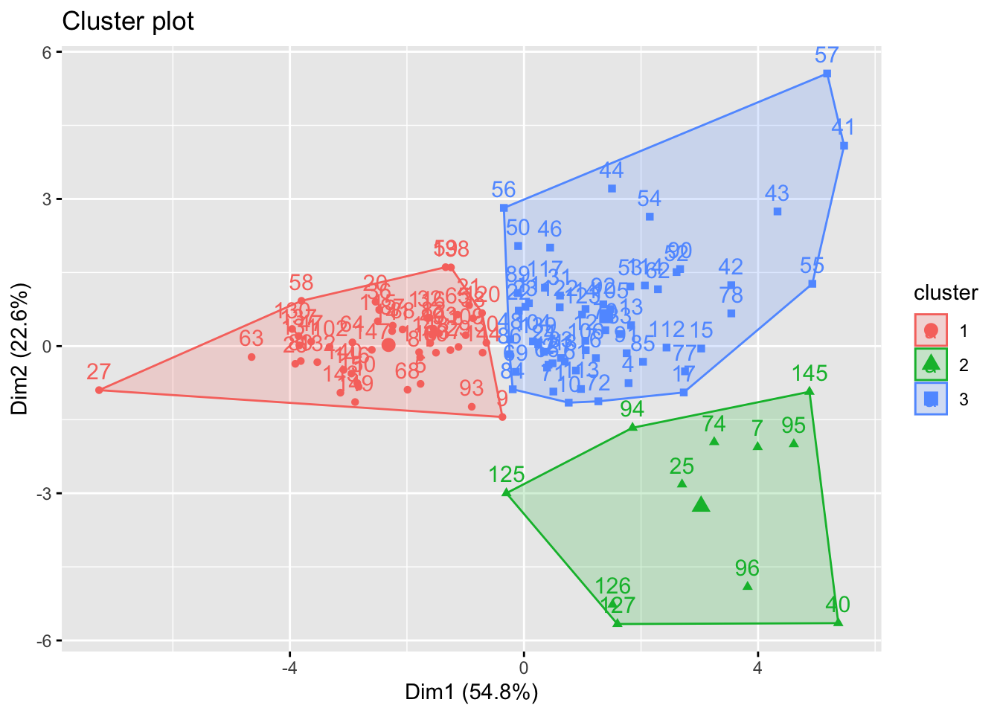

## Comentarios finales sobre el algoritmo k-medias

El algoritmo k-medias es un algoritmo muy sencillo y rápido que puede manejar grandes conjuntos de datos eficientemente. Sin embargo, presenta algunas debilidades.

Una posible limitación de k-medias es que requiere que especifiquemos previamente el número de clústeres. La agrupación jerárquica es una alternativa que no exige comprometerse con una cantidad específica de clústeres. Además, la agrupación jerárquica tiene la ventaja de generar una representación visual atractiva de las observaciones en forma de un dendrograma. 

Otra desventaja del algoritmo k-medias es su sensibilidad a valores atípicos, lo que puede resultar en diferentes resultados al cambiar el orden de los datos. 

## Análisis clúster jerárquico

El análisis clúster jerárquico es un enfoque alternativo al algoritmo k-medias para identificar grupos en el conjunto de datos. No requiere que especifiquemos previamente el número de clústeres a generar, como lo exige el enfoque k-medias. Además, el análisis jerárquico tiene una ventaja adicional sobre k-medias que resulta en una atractiva representación gráfica basada en árbol de las observaciones, llamada dendrograma.

Requeriremos el siguiente paquete adicional 


```r
library(dendextend) # Para comparar dos dendrogramas
```
El análisis clúster jerárquico se clasifica en dos tipos principales: aglomerativo y divisivo.

**Aglomerativo**: También conocido como AGNES (Agglomerative Nesting). En este enfoque, el proceso comienza desde la parte inferior, donde inicialmente cada individuo se considera un clúster individual (hoja). En cada paso, se combinan los dos clústeres más similares en uno más grande (nodo). Este procedimiento se repite hasta que todos los puntos forman parte de un único clúster grande (raíz), y el resultado se visualiza como un dendrograma.

**Divisivo**: También conocido como DIANA (Divise Analysis). Aquí, el proceso se desarrolla de arriba hacia abajo. Comienza desde la raíz, donde todos los objetos están en un solo clúster. En cada iteración, el clúster más heterogéneo se divide en dos. Este proceso se repite hasta que cada objeto tiene su propio clúster.

Es relevante destacar que la agrupación aglomerativa es eficiente para identificar clústeres pequeños, mientras que la agrupación divisiva es más efectiva para identificar clústeres grandes.


No obstante, una pregunta más significativa es: ¿Cómo medimos la diferencia entre dos conjuntos de observaciones?. Se han desarrollado diversos métodos de aglomeración de clústeres, también conocidos como métodos de enlace, para abordar esta interrogante. Entre los tipos más comunes de estos métodos se encuentran:

**Maximum or complete linkage clustering**: Calcula todas las diferencias entre los elementos del clúster 1 y los elementos del clúster 2, y toma el valor más grande (es decir, el máximo) de estas diferencias como la distancia entre los dos clústeres. Esto tiende a generar clústeres más compactos.

**Minimum or single linkage clustering**: Calcula todas las diferencias entre los elementos del clúster 1 y los elementos del clúster 2, y toma la más pequeña de estas diferencias como criterio de enlace. Esto tiende a producir clústeres largos y "sueltos".

**Mean or average linkage clustering**: Calcula todas las diferencias entre los elementos del clúster 1 y los elementos del clúster 2, y toma el promedio de estas diferencias como la distancia entre los dos clústeres.

**Centroid linkage clustering**: Calcula la diferencia entre el centroide del clúster 1 (un vector promedio de longitud p variables) y el centroide del clúster 2.

**Ward’s minimum variance method**: Minimiza la varianza total dentro del clúster. En cada paso, se fusionan los pares de clústeres con la mínima distancia entre clústeres.

### Análsis clúster jerárquico con R

Existen varias funciones de  R para realizar análsis clúster jerárquico, pero las más comunes son **hclust** y **agnes**  para clúster jerárquico aglomerativo y **diana** para clúster jerárquico divisivo.

#### Análisis clúster jerárquico aglomerativo

Podemos realizar el análisis jerárquico  aglomerativo con la función **hclust**. En primer lugar  calculamos ma matriz de disimilaridad con **dist** y lo introducimos en **hclust** y especificamos el método de aglomeración que queremos utilizar (i.e. “complete”, “average”, “single”, “ward.D”). Una vez realizado esto podemos realizar el dendrograma.


```r
> # Matriz de disimilaridad
> d <- dist(df, method = "euclidean")
> 
> # Clúster jerárquico usando Complete Linkage
> hc1 <- hclust(d, method = "complete" )
> 
> # Graficamos el dendrograma
> plot(hc1, cex = 0.6, hang = -1)
```

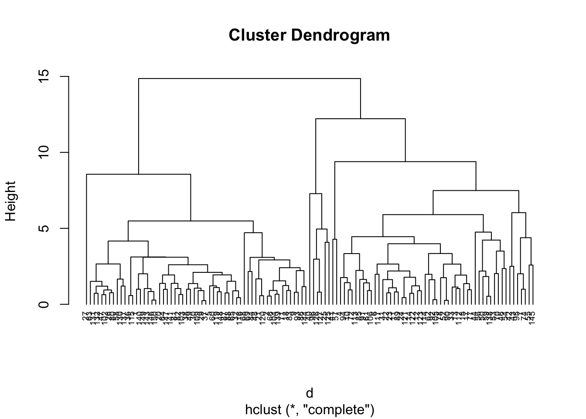
Alternativamente, podemos utilizar la función **agnes**. Estas funciones se comportan de manera muy similar, sin embargo, con la función **agnes**, también puedes obtener el coeficiente aglomerativo, que mide la cantidad de estructura de agrupamiento encontrada (valores más cercanos a 1 sugieren una estructura de agrupamiento fuerte).


```r
> # Calculado con agnes
> hc2 <- agnes(df, method = "complete")
> 
> # Coeficiente aglomerativo
> hc2$ac
#> [1] 0.9061342
```
Esto nos permite determinar que método de agrupación jerarquico obtiene estructuras de agrupación más fuertes. A continuacion calculamos el coeficiente aglomerativo para 4 métodos diferentes obteniendo que el método Ward es el mejor.


```r
> m <- c( "average", "single", "complete", "ward")
> results=matrix(0,2,4)
> for (i in 1:4){
+   results[,i]=c(m[i],agnes(df, method = m[i])$ac)
+   }
> print(results)
#>      [,1]                [,2]               
#> [1,] "average"           "single"           
#> [2,] "0.843969754548982" "0.723129823717284"
#>      [,3]               [,4]               
#> [1,] "complete"         "ward"             
#> [2,] "0.90613423703583" "0.949958399929762"
```
De forma analoga a lo  realizado anteriormente podemo visualizar el dendrograma.

```r
> # Clúster jerárquico usando Complete Linkage
> hc3 <- hclust(d, method = "ward.D" )
> 
> # Graficamos el dendrograma
> plot(hc3, cex = 0.6, hang = -1, main="Dendrograma agnes")
```

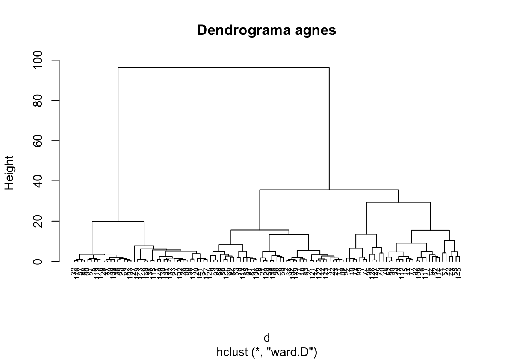

#### Análisis clúster jerárquico divisivo

La funcion de R **diana** proporcionada en el paquete **cluster** nos permite  realizar el análisis cluster jerarquico divisivo, el cual funciona similar que **agnes** perono hay método que proporcionar.


```r
> # Calculamos el análisis cluster jerarquico divisivo
> hc4 <- diana(df)
> # El coeficiente de  división; Cantidad de estructura de agrupamiento encontrada
> hc4$dc
#> [1] 0.89846
> # plot dendrogram
> pltree(hc4, cex = 0.6, hang = -1, main = "Dendrograma de diana")
```

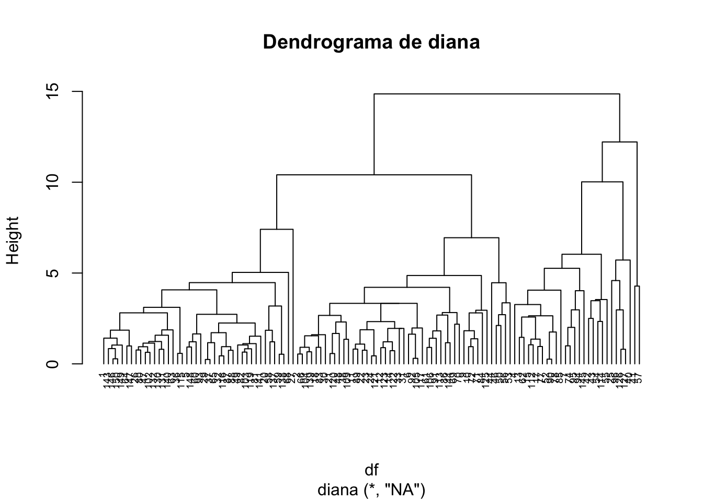

### Trabajando con dendrogramas

En el dendrograma que se muestra arriba, cada hoja representa una observación. Al ascender por el árbol, las observaciones similares se combinan en ramas, las cuales a su vez se fusionan a una mayor altura.

La altura de la fusión, indicada en el eje vertical, refleja la (des)similitud entre dos observaciones. A mayor altura de fusión, menor similitud entre las observaciones. *Es importante señalar que las conclusiones sobre la proximidad de dos observaciones se derivan únicamente de la altura donde las ramas que contienen esas dos observaciones se fusionan inicialmente. No podemos usar la proximidad a lo largo del eje horizontal como criterio de similitud*.

El valor de la altura del corte en el dendrograma determina el número de clústeres obtenidos y desempeña un papel similar a la *k* en la agrupación k-medias. Para identificar subgrupos (clústeres), podemos realizar un corte en el dendrograma utilizando la función **cutree**.


```r
> # Método de  Ward
> hc5 <- hclust(d, method = "ward.D2" )
> 
> # Cortamos el árbol en 3 grupos
> sub_grp <- cutree(hc5, k = 3)
> 
> # Numero de miembros  en cada grupo
> table(sub_grp)
#> sub_grp
#>  1  2  3 
#> 23 62 32
```
Podemos añadir a la base de datos la pertenencia al cluster de cada individuo de la siguiente forma


```r
> BaseDatos=df
> BaseDatos %>% mutate(cluster = sub_grp) %>%  head
#>       ventas    reventa     precio    motor_s   caballos
#> 1 -0.5621358 -0.1440282 -0.3158715 -1.1834292 -0.7045706
#> 2 -0.2628377  0.1588420  0.1717713  0.1433723  0.7461447
#> 4 -0.6731286  1.0075678  1.1329225  0.4276869  0.4901361
#> 5 -0.5157989  0.3639148 -0.1398961 -1.1834292 -0.5338982
#> 6 -0.5373420  0.4759294  0.5640058 -0.2357138  0.3194637
#> 7 -0.7691598  1.8067488  2.5463801  1.0910877  2.1968600
#>   BaseNeumatico     anchura   longitud peso_revestimiento
#> 1   -0.76099980 -1.10186337 -1.1059950         -1.1471500
#> 2    0.09608047 -0.25204126  0.3741573          0.3231015
#> 4    0.90347493  0.05956018  0.6413068          0.8807254
#> 5   -0.58709946 -0.84691674 -0.7016607         -0.5459879
#> 6    0.17060919  1.39094816  0.3091750          0.3967816
#> 7    0.70473168  0.79607268  0.7568308          0.9678018
#>   tapón_combustible        kpl cluster
#> 1       -1.21562468  0.8810010       1
#> 2       -0.16149767  0.1998747       2
#> 4        0.04932774 -0.4812516       2
#> 5       -0.37232307  0.6539589       2
#> 6        0.18109362 -0.4812516       3
#> 7        1.55145874 -0.7082937       3
```
También es posible dibujar el dendrograma con un rectángulo marcando cada cluster. El argumento **border** se usa para especificar el color de cada rectangulo


```r
> require(graphics)
> plot(hc5, cex = 0.6)
> rect.hclust(hc5, k = 3, border = 2:4)
```

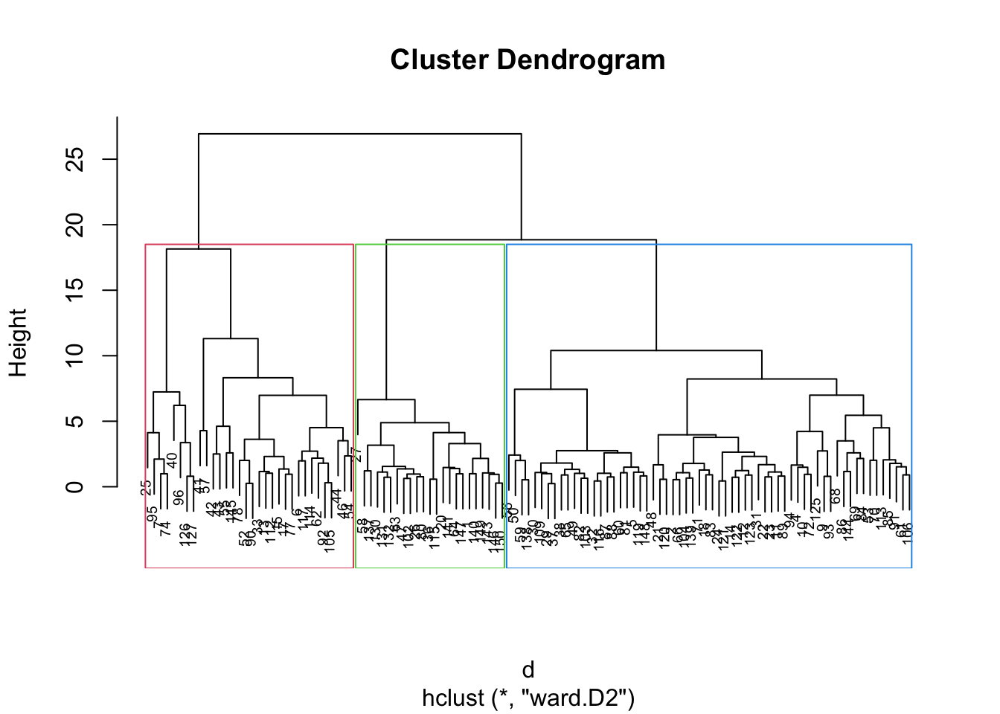
  
Podemos usar la función **fviz_cluster**  del paquete **factoextra** para visualizar el resultado.


```r
> fviz_cluster(list(data = df, cluster = sub_grp))
```


Para usar **cutree** con **agnes** y **diana** haremos lo siguiente:


```r
> # Corta el árbol agnes() en 3 grupos
> hc_a <- agnes(df, method = "ward")
> cutree(as.hclust(hc_a), k = 3)
#>   1   2   4   5   6   7   9  10  11  12  13  14  15  17  18 
#>   1   2   2   2   3   3   2   2   2   2   3   2   3   3   2 
#>  20  21  22  23  24  25  26  27  29  30  31  32  33  36  37 
#>   1   2   2   2   2   3   1   1   2   2   2   2   3   1   2 
#>  38  40  41  42  43  44  46  47  48  49  50  52  53  54  55 
#>   2   3   3   3   3   3   3   1   2   2   2   3   2   3   3 
#>  56  57  58  59  60  61  62  63  64  65  66  68  69  70  71 
#>   2   3   1   2   2   2   3   1   1   2   2   2   2   2   2 
#>  72  74  77  78  80  81  82  83  84  85  86  87  88  89  90 
#>   2   3   3   3   1   2   2   2   2   2   2   2   2   2   3 
#>  91  92  93  94  95  96 102 103 104 105 106 109 112 113 114 
#>   2   3   2   2   3   3   1   2   2   3   2   2   3   2   3 
#> 115 116 117 119 120 121 122 123 125 126 127 130 131 132 137 
#>   1   2   3   2   2   2   2   2   2   3   3   1   1   1   1 
#> 138 139 140 141 143 144 145 146 147 148 149 150 
#>   2   2   1   1   1   2   3   1   1   2   1   1
> 
> # Corta el árbol diana() en 3 grupos
> hc_d <- diana(df)
> cutree(as.hclust(hc_d), k = 3)
#>   1   2   4   5   6   7   9  10  11  12  13  14  15  17  18 
#>   1   1   2   1   1   2   1   1   1   1   2   1   2   2   1 
#>  20  21  22  23  24  25  26  27  29  30  31  32  33  36  37 
#>   1   1   1   1   1   2   1   1   1   1   1   1   1   1   1 
#>  38  40  41  42  43  44  46  47  48  49  50  52  53  54  55 
#>   1   2   3   2   2   1   1   1   1   1   1   2   1   2   2 
#>  56  57  58  59  60  61  62  63  64  65  66  68  69  70  71 
#>   1   3   1   1   1   1   2   1   1   1   1   1   1   1   1 
#>  72  74  77  78  80  81  82  83  84  85  86  87  88  89  90 
#>   1   2   2   2   1   1   1   1   1   2   1   1   1   1   2 
#>  91  92  93  94  95  96 102 103 104 105 106 109 112 113 114 
#>   1   1   1   2   2   2   1   1   1   1   1   1   2   1   2 
#> 115 116 117 119 120 121 122 123 125 126 127 130 131 132 137 
#>   1   1   1   1   1   1   1   1   1   2   2   1   1   1   1 
#> 138 139 140 141 143 144 145 146 147 148 149 150 
#>   1   1   1   1   1   1   2   1   1   1   1   1
```

Finalmente podemos comparar dos dendrogramas. Aqui comparamos el cluster jerárquico con  complete linkage versus el método de Ward. La función **tanglegram** dibuja dos dendrogramas a cada lado con las etiquetas conectadas por lineas.


```r
> # Calcula la matriz de distancia
> res.dist <- dist(df, method = "euclidean")
> 
> # Calculamos 2 cluster jerárquicos
> hc1 <- hclust(res.dist, method = "complete")
> hc2 <- hclust(res.dist, method = "ward.D2")
> 
> # Creamos dos dendrogramas
> dend1 <- as.dendrogram (hc1)
> dend2 <- as.dendrogram (hc2)
> 
> tanglegram(dend1, dend2)
```

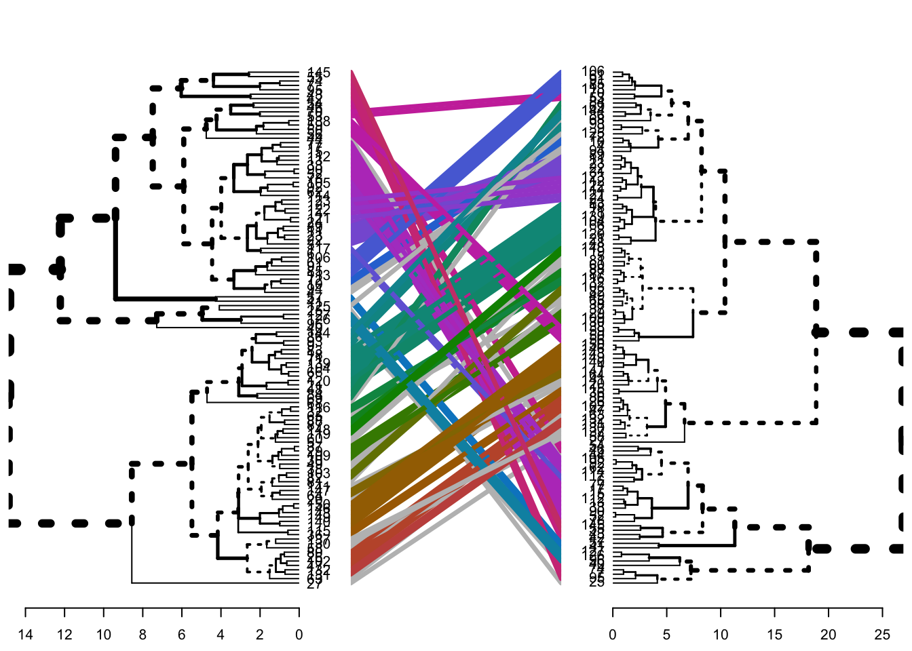

La salida muestra la union mediante líneas de los mismos nodos en ambos árboles. La calidad de la alineación de los dos árboles se puede medir utilizando la función "entanglement" (enredo). El **entanglement** es una medida entre 1 (entrelazamiento completo) y 0 (sin entrelazamiento). Un coeficiente de entrelazamiento más bajo corresponde a una buena alineación. La salida de **tanglegram** se puede personalizar utilizando muchas otras opciones de la siguiente manera:


```r
> if(!require(dendextend)) {install.packages("dendextend")}
> library(dendextend)
> dend_list <- dendlist(dend1, dend2)
> tanglegram(dend1, dend2,
+   highlight_distinct_edges = FALSE, # Turn-off dashed lines
+   common_subtrees_color_lines = FALSE, # Turn-off line colors
+   common_subtrees_color_branches = TRUE, # Color common branches 
+   main = paste("Entrelazamiento =", round(entanglement(dend_list), 2))
+   )
```

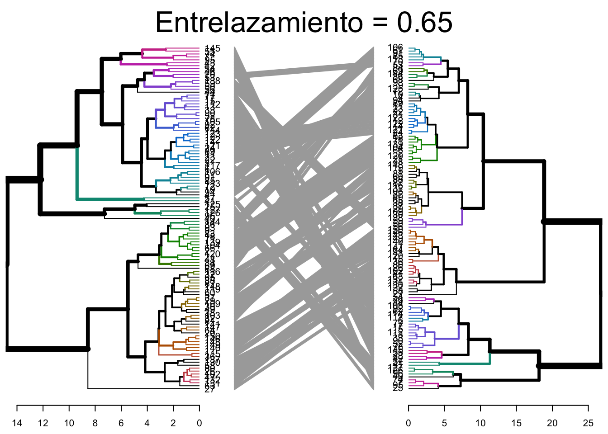
