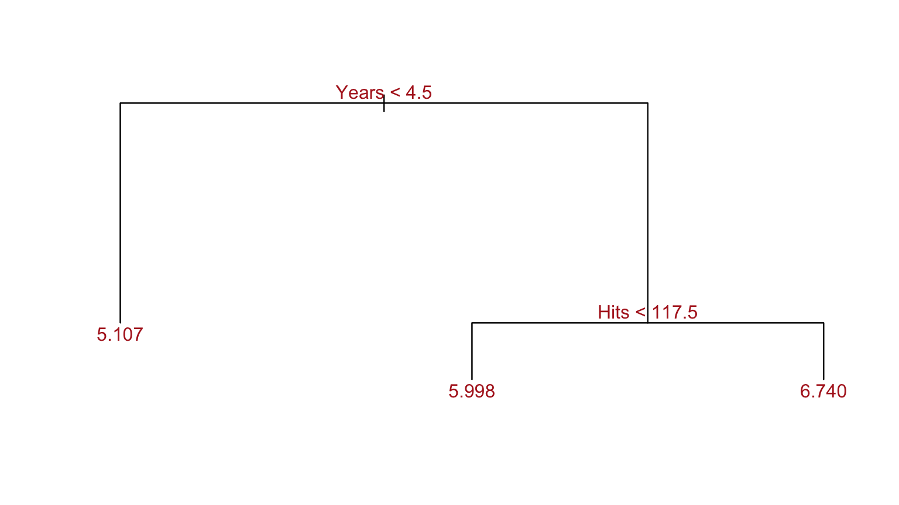
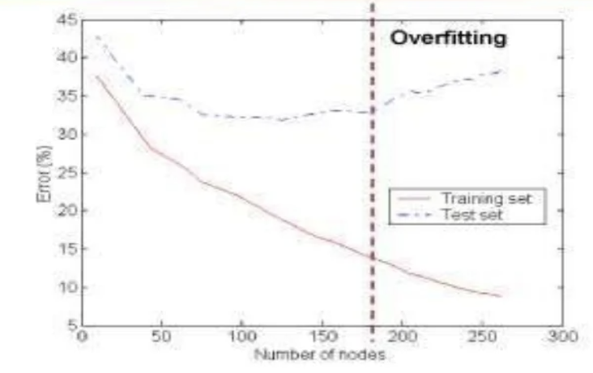
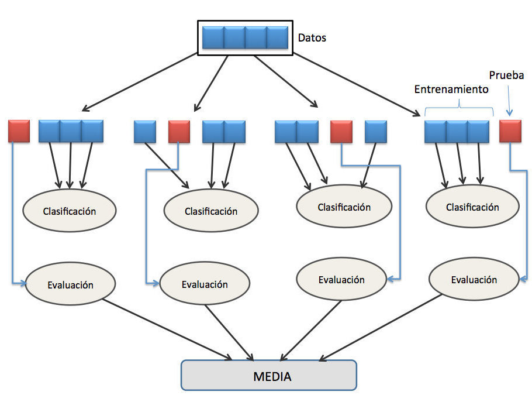
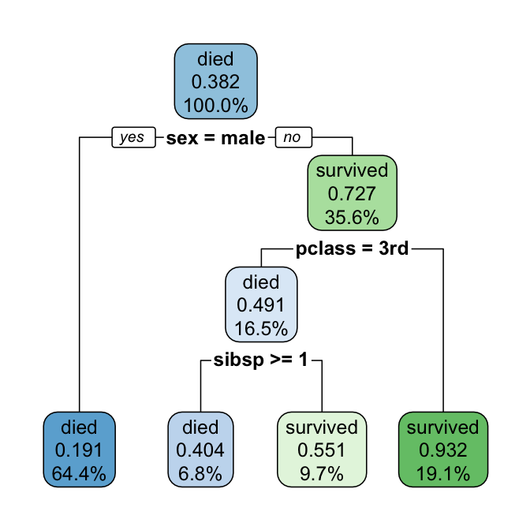

# Métodos basados en árboles

## Introducción

<!-- En esta sección, se describen métodos basados en árboles de decisión para regresión y clasificación. Estos métodos tienen como objetivo estratificar o segmentar el espacio predictor en varias regiones simples. La predicciones para cada observación se asignarán dependiendo de la región que le corresponda, asignándole un mismo valor (media, mediana, moda) a todas las observaciones que pertenezcan a la misma zona. -->

<!-- de Para hacer una predicción para una observación dada, normalmente usamos la media o la moda de las observaciones de entrenamiento en la región a la que pertenece. Dado que el conjunto de reglas de división utilizadas para segmentar el espacio predictor se puede resumir en un árbol, este tipo de enfoques se conocen como métodos de árbol de decisión. -->

Los árboles de decisión son modelos predictivos formados por reglas binarias (si/no) con las que se consigue repartir las observaciones en función de sus atributos y predecir así el valor de la variable respuesta. 

> **Los métodos basados en árboles se han convertido en uno de los referentes dentro del ámbito predictivo debido a los buenos resultados que generan en problemas muy diversos.**

Los árboles de decisión son uno de los métodos más simples y fáciles de interpretar para realizar predicciones en problemas de clasificación y de regresión. Estos métodos fueron desarrollados a partir de los años 70 del siglo XX como una alternativa versátil a los métodos clásicos de la estadística, fuertemente basados en las hipótesis de linealidad y de normalidad, y enseguida se convierten en una técnica básica del aprendizaje automático. Aunque su calidad predictiva es mediocre (especialmente en el caso de regresión), constituyen la base de otros métodos altamente competitivos (métodos de ensamblado en paralelo o en serie) en los que se combinan múltiples árboles para mejorar la predicción, pagando el precio, eso sí, de hacer más difícil la interpretación del modelo resultante.

Los métodos basados en árboles son simples y útiles para la interpretación. Sin embargo, por lo general no son competitivos con los mejores enfoques de aprendizaje supervisado en términos de precisión de predicción. Por lo tanto, también presentamos métodos alternativos que implican la producción de múltiples árboles que luego se combinan para producir una sola predicción de consenso. Veremos que la combinación de una gran cantidad de árboles a menudo puede resultar en mejoras importantes en la precisión de la predicción.

> **Mientras que la Regresión tiene una doble función (interpretación/preducción) los árboles deshechan de forma autómatica todas aquellas variables que no son últiples para la predicción**

<!-- https://www.cienciadedatos.net/documentos/33_arboles_decision_random_forest_gradient_boosting_c50 -->

## Origen de los Árboles de Decisión

Es difícil datar el orígen de una metodología. El primer artículo que desarrolla un enfoque de "árbol de decisión" data de 1959 y un investigador británico, William Belson, en un artículo titulado _Matching and Prediction on the Principle of Biological Classification_ [@belson1959], cuyo resumen describe su enfoque como una forma de emparejar muestras de población y desarrollar criterios para hacerlo.

El uso de árboles de decisión tuvo su origen en las ciencias sociales con los trabajos de Sonquist y Morgan el año 1964 y Morgan y Messenger el año 1979, ambos realizados en la Universidad de Michigan. El programa para la “Detección de Interacciones Automáticas”, creada el año 1971 por los investigadores Sonquist, Baker y Morgan, fue uno de los primeros métodos de ajuste de los datos basados en árboles de clasificación. En estadística, el año 1980, Kass introdujo un algoritmo recursivo de clasificación no binario, llamado “Detección de Interacciones Automáticas Chi-cuadrado”. Hacia el año 1984, los investigadores Breiman, Friedman, Olshen y Stone, introdujeron un nuevo algoritmo para la construcción de árboles y los aplicaron a problemas de regresión y clasificación. El método es conocido como “Árboles de clasificación y regresión”. Casi al mismo tiempo el proceso de inducción mediante árboles de decisión comenzó a ser usado por la comunidad de “Aprendizaje automático”.

Los creadores de la metodología del árbol de clasificación con aplicación al aprendizaje automático, también llamada metodología CART, fueron Leo Breiman, Jerome Friedman, Richard Olshen y Charles Stone. Su aplicación en el ámbito de la Estadística se inició en 1984 [@breiman1984].

## Los Árboles de Decisión en las técnicas de Machine Learning

Los algoritmos de aprendizaje automático pueden clasificarse en dos grupos:

* Supervisados.
* No supervisados.
* reforzar el aprendizaje.

**Aprendizaje supervisado**: El aprendizaje supervisado es un tipo de paradigma de aprendizaje automático en el que un modelo es entrenado utilizando un conjunto de datos etiquetado. En este enfoque, el algoritmo recibe un conjunto de ejemplos de entrada junto con sus correspondientes salidas deseadas (etiquetas) durante la fase de entrenamiento. El objetivo del modelo es aprender una función que mapee las entradas a las salidas de manera que pueda hacer predicciones precisas sobre nuevos datos no etiquetados.

En términos más simples, en el aprendizaje supervisado, el modelo aprende a partir de ejemplos conocidos y luego se le proporcionan nuevos ejemplos para hacer predicciones. La "supervisión" se refiere a la idea de que el proceso de entrenamiento del modelo está supervisado por las etiquetas proporcionadas en el conjunto de datos de entrenamiento.

Este enfoque se utiliza en una variedad de tareas, como clasificación y regresión. En la clasificación, el modelo se entrena para asignar las entradas a categorías predefinidas, mientras que en la regresión, el objetivo es predecir valores numéricos continuos. El aprendizaje supervisado es fundamental en la construcción de muchos sistemas de inteligencia artificial y toma su nombre del hecho de que el modelo es "supervisado" durante el proceso de aprendizaje con la ayuda de las etiquetas.

Un árbol de decisión es un **algoritmo supervisado** de aprendizaje automático porque para que el algoritmo aprenda es necesaria una **variable dependiente** y nuestra meta es obtener una 'función' que permita predecir, a partir de **variables independientes**, el valor de la variable objetivo para casos desconocidos.

**Aprendizaje no supervisado**: Los algoritmos de aprendizaje no supervisado trabajan de forma muy similar a los supervisados, con la diferencia de que éstos sólo ajustan su modelo predictivo tomando en cuenta los datos de entrada, sin importar los de salida. Es decir, a diferencia del supervisado, los datos de entrada no están clasificados ni etiquetados, y no son necesarias estas características para entrenar el modelo. Dentro de este tipo de algoritmos, el agrupamiento o clustering en inglés, es el más utilizado, ya que particiona los datos en grupos que posean características similares entre sí

La Figura \ref{fig:algoritmos} muestra esquemáticamente los principales algoritmos de Machine Learning.

{width='800px'}


## Árboles de regresión

Los árboles de regresión se aplican cuando la variable respuesta es continua. En términos generales, en el entrenamiento de un árbol de regresión, las observaciones se van distribuyendo por bifurcaciones (nodos) generando la estructura del árbol hasta alcanzar un nodo terminal. Cuando se quiere predecir una nueva observación, se recorre el árbol acorde al valor de sus predicciones hasta alcanzar uno de los nodos terminales. La predicción del árbol es la media/mediana/moda de la variable respuesta de las observaciones de entrenamiento que están en ese mismo nodo terminal.

### Un ejemplo de juguete

Usaremos el mismo ejemplo que aparece en @gareth2013 (pag. 304) para ilustrar cómo funcionan los árboles. En este ejemplo, objetivo es predecir una variable cuantitativa, el salario de los jugadores de béisbol, según los Años (cantidad de años que ha jugado en las ligas principales) y la cantidad de Hits/aciertos del año anterior. 

El siguiente código muestra un ejemplo básico de obtención de un árbol. Nótese que antes de realizar el análisis se eliminarán las observaciones a las que les faltan valores de Salario. También se transforma logarítmicamente el Salario para que su distribución tenga una forma de campana más típica (Recuerde que el salario se mide en miles de dólares).


```r
if(!require(ISLR)) {install.packages("ISLR")}
#> Loading required package: ISLR
library(ISLR) # provide the collection of data-sets used in the book 'An Introduction to Statistical Learning with Applications in R'
if(!require(tree)) {install.packages("tree")}
#> Loading required package: tree
library(tree) # Classification and regression trees
data(Hitters)
Hitters <- Hitters[!is.na(Hitters$Salary),]
formula <- log(Salary) ~ Years + Hits 
myfirsttree <- tree(formula, data = Hitters, control=tree.control(300, mincut = 60))
plot(x = myfirsttree, type = "proportional")
text(x = myfirsttree, splits = TRUE, pretty = 0, cex = 1, col = "firebrick")
```

<div class="figure">

<p class="caption">(\#fig:myfirsttree)\label{fig:myfirsttree}Árbol de regresión</p>
</div>


La Figura \ref{fig:myfirsttree} muestra un árbol de regresión ajustado a estos datos. Nótese que tiene forma de árbol (ver Sección \ref{sec:terminologia}). Consiste en una serie de reglas de división **binaria**, comenzando en la parte superior del árbol. La división superior asigna observaciones que tienen menos de 4,5 años (Years < 4.5) a la rama izquierda. El salario previsto para estos jugadores viene dado por el valor de respuesta media para los jugadores en el conjunto de datos con (Años<4.5). Para tales jugadores, el salario logarítmico medio es 5,107, por lo que hacemos una predicción de 165174\$, para estos jugadores. Los jugadores con ($Years \geq 4.5$) se asignan a la rama derecha, y luego ese grupo se subdivide aún más por 'Hits'. En general, el árbol estratifica o segmenta a los jugadores en tres regiones del espacio predictor: jugadores que han jugado durante cuatro años y medio o menos, jugadores que han jugado durante cuatro años y medio o más y que hicieron menos de 118 aciertos el año pasado y jugadores que han jugado durante cuatro años y medio o más y que hizo al menos 118 hits el año pasado. 

Estas tres regiones se pueden escribir como:

* $R_1$ = { X | Años < 4.5 }, 

* $R_2$={X | Años>=4.5, Hits < 117.5 } y 

* $R_3$ = {X | años >= 4.5, Hits >= 117.5 }. 

La Figura \ref{fig:particion0} ilustra las regiones en función de Años y Hits/Aciertos. Los salarios pronosticados para estos tres grupos son 1000 × exp(5,107) = 165 174$, 1000 × exp(5,999) = 402 834$ y 1,000 × exp(6.740)=845,346\$ respectivamente.


```r
plot(Hitters$Years, Hitters$Hits, col="orange", pch=16 ,xlab="Years", ylab="Hits")
partition.tree(myfirsttree, cex = 2, add = TRUE)
```

<div class="figure">

<p class="caption">(\#fig:unnamed-chunk-1)\label{fig:particion0}Partición del espacio con predicciones</p>
</div>

Podríamos interpretar el árbol de regresión que se muestra en la Figura \ref{fig:myfirsttree} de la siguiente manera: los años son el factor más importante para determinar el salario, y los jugadores con menos experiencia ganan salarios más bajos que los jugadores más experimentados. Dado que un jugador tiene menos experiencia, la cantidad de golpes que hizo en el año anterior parece jugar un papel pequeño en su salario. Pero entre los jugadores que han estado en las ligas mayores durante cinco años o más, la cantidad de Hits/aciertos hechos el año anterior sí afecta el salario, y los jugadores que hicieron más Hits/aciertos el año pasado tienden a tener salarios más altos. El árbol de regresión que se muestra en la Figura \ref{fig:myfirsttree} es probablemente una simplificación excesiva de la verdadera relación entre Aciertos, Años y Salario. Sin embargo, tiene ventajas sobre otros tipos de modelos de regresión.

### Terminología{#sec:terminologia}

Un árbol de decisión en Machine Learning es una estructura de árbol similar a un diagrama de flujo donde un nodo interno representa una característica (o atributo), la rama representa una regla de decisión y cada nodo hoja representa el resultado.

El nodo superior en un árbol de decisión en Machine Learning se conoce como el nodo raíz. Aprende a particionar en función del valor del atributo. Divide el árbol de una manera recursiva llamada partición recursiva.

Cada nodo en el árbol actúa como un caso de prueba para algún atributo, y cada borde que desciende de ese nodo corresponde a una de las posibles respuestas al caso de prueba. Este proceso es recursivo y se repite para cada subárbol enraizado en los nuevos nodos.

La Figura \ref{fig:arbol} muestra gráficamente la estructura de árbol.

{width='500px' height="500"}

- **Nodo raíz (nodo de decisión superior ):** Representa a toda la población o muestra y esto se divide en dos o más conjuntos homogéneos.

- **División:** Es un proceso de división de un nodo en dos o más subnodos. 

- **Nodo de decisión:** Cuando un subnodo se divide en subnodos adicionales, se llama nodo de decisión.

- **Nodo de hoja / terminal:** Los nodos sin hijos (sin división adicional) se llaman Hoja o nodo terminal.

- **Poda:** Cuando reducimos el tamaño de los árboles de decisión eliminando nodos (opuesto a la división), el proceso se llama poda.

- **Rama / Subárbol:** Una subsección del árbol de decisión se denomina rama o subárbol.

- **Nodo padre e hijo:** Un nodo, que se divide en subnodos se denomina nodo principal de subnodos, mientras que los subnodos son hijos de un nodo principal.


### Como se crea un árbol

En esta sección se presenta el proceso de construcción de un árbol de decisión. Básicamente, los árboles se construyen en dos dos pasos:

* **Paso 1:** Se divide  el espacio de predicciones, es decir, el conjunto de valores posibles para $X_1, X_2,..., X_p$, en J regiones distintas y no solapadas, $R_1, R_2,..., R_J$.

* **Paso 2:** Para cada observación que cae en la región $R_j$, se hace **la misma predicción**, que simplemente es la media (o la mediana o la moda) de los valores de respuesta para las observaciones de entrenamiento en $R_j$.

¿Cómo se construyen las regiones $R_1, R_2,..., R_J$? En teoría, podrían tener cualquier forma. Sin embargo, por simplicidad se divide el espacio de predicciones en rectángulos o cajas (Figura \ref{fig:cajas}). Esta división también ayuda en la interpretación del modelo predictivo resultante. Hay también posibilidad de realizar divisiones oblicuas [@Wickramarachchi2016] o flexibles [@Paez2019].  

{width='800px'}

En el caso de los árboles de regresión, el criterio empleado con más frecuencia para identificar las divisiones es el observar la suma de los residuos al cuadrado (Residual Sum of Squares, $RSS$) que es una medida de la discrepancia entre los datos reales y los predichos por el modelo. El objetivo es encontrar las J regiones $(R_1,…, R_j)$ que minimizan el $RSS$ total. Un $RSS$ bajo indica un buen ajuste del modelo a los datos. Por tanto, el objetivo es encontrar cajas $R_1, R_2,..., R_J$? que minimicen el $RSS$, dado por:

$$
RSS=\sum_{j=1}^J{\sum_{i \in R_j} (y_i-{\hat y}_{R_j})^2}
$$
donde ${\hat y}_{R_j}$ es el valor predicho (para las observaciones de entrenamiento) dentro de la $R_j$ caja. Desafortunadamente, es computacionalmente inviable considerar cada posible partición del espacio de características en cajas J. Por esta razón, se adopta un enfoque de _arriba-hacia-abajo_ (top-down) que se conoce como división binaria recursiva. El enfoque es de arriba-hacia-abajo porque comienza en la parte superior del árbol (en cuyo punto todas las observaciones pertenecen a una sola región) y luego divide sucesivamente el espacio predictor; cada división se indica a través de dos nuevas ramas más abajo en el árbol.

Para realizar la división binaria recursiva, primero seleccionamos el predictor $X_j$ y el punto de corte $s$ tal que dividiendo el espacio del predictor en las regiones $\{X|X_j < s\}$ y $\{X|X_j \geq s\}$ conduce a la mayor reducción posible en $RSS$. (La notación $\{X|X_j < s\}$ significa la región del predictor espacio en el que $X_j$ toma un valor menor que $s$). Es decir, consideramos todos los predictores $X_1,..., X_p$ y todos los valores posibles del punto de corte s para cada uno de los predictores, y luego elegimos el predictor y el punto de corte tales que el árbol resultante tiene el $RSS$ más bajo. Con mayor detalle, para cualquier j y s, definimos el par de semiplanos

$$
R_1(j,s)=\{X|X_j < s\} \ \ y \ \ R_2(j,s)=\{X|X_j \geq s\}
$$

y se buscan los valores de j y s que minimizan la ecuación

$$
RSS={\sum_{i \in R_1} (y_i-{\hat y}_{R_1})^2} + {\sum_{i \in R_2} (y_i-{\hat y}_{R_2})^2}
$$


### Evitar el overfitting

El proceso de construcción de árboles tiende a reducir rápidamente el error $SSR$, de tal forma que el modelo se ajusta muy bien a las observaciones empleadas como entrenamiento. Como consecuencia, se genera un sobreajuste (**_overfitting_**) que **reduce su capacidad predictiva al aplicarlo a nuevos datos**. La razón de este comportamiento radica en la facilidad con la que los árboles se ramifican adquiriendo estructuras complejas. De hecho, si no se limitan las divisiones, todo árbol termina ajustándose perfectamente a las observaciones de entrenamiento creando un nodo terminal por observación. Existen dos estrategias para prevenir el problema de overfitting de los árboles: 
- limitar el tamaño del árbol (parada temprana o _early stopping_) y 
- el proceso de podado ( _pruning_).

La Figura \ref{fig:sobreajuste} muestra el comportamiento del overffiting.

{width='600px'}


#### Controlar el tamaño del árbol (parada temprana)

El tamaño final que adquiere un árbol puede controlarse mediante reglas de parada que detengan la división de los nodos dependiendo de si se cumplen o no determinadas condiciones. El nombre de estas condiciones puede variar dependiendo del software o librería empleada, pero suelen estar presentes en todos ellos.

> **Observaciones mínimas para división:** define el número mínimo de observaciones que debe tener un nodo para poder ser dividido. Cuanto mayor el valor, menos flexible es el modelo.

> **Observaciones mínimas de nodo terminal:** define el número mínimo de observaciones que deben tener los nodos terminales. Su efecto es muy similar al de observaciones mínimas para división.

> **Profundidad máxima del árbol:** define la profundidad máxima del árbol, entendiendo por profundidad máxima el número de divisiones de la rama más larga (en sentido descendente) del árbol.

> **Número máximo de nodos terminales:** define el número máximo de nodos terminales que puede tener el árbol. Una vez alcanzado el límite, se detienen las divisiones. Su efecto es similar al de controlar la profundidad máxima del árbol.

> **Reducción mínima de error:** define la reducción mínima de error que tiene que conseguir una división para que se lleve a cabo.

A todos estos parámetros se les conoce como **hiperparámetros** porque no se aprenden durante el entrenamiento del modelo. Su valor tiene que ser especificado por el usuario en base a su conocimiento del problema y mediante el uso de validación cruzada.

#### Post-pruning

El proceso descrito anteriormente puede producir buenas predicciones en el conjunto de entrenamiento, pero es probable que se produzca un sobreajuste los datos, lo que conducirá a un rendimiento deficiente del conjunto de prueba. Esto se debe a que el árbol resultante puede ser demasiado complejo. Un árbol más pequeño con menos divisiones (menos regiones $R_1,... , R_J$) podría generar una aceptable predicción y una mejor interpretación a costa de un pequeño sesgo. Una posible alternativa al proceso descrito anteriormente es construir el árbol solo mientras la disminución en el $RSS$ debido a cada división exceda algún umbral (_threshold_). Esta estrategia dará como resultado árboles más pequeños, **pero es demasiado miope, ya que una división aparentemente sin valor en un nodo al principio del árbol podría ser seguida por una muy buena división en otro nodo posterior que conduzca a una gran reducción en $RSS$.** 

Una estrategia mejor sería hacer crecer un árbol $T_0$ muy grande y luego podarlo para obtener un subárbol. La cuestión es: **¿Cómo determinamos la mejor manera de podar el árbol?** Intuitivamente, nuestro objetivo es seleccionar un subárbol que conduzca a la tasa de error más baja. 

Dado un subárbol, se podría por ejemplo estimar su error utilizando un proceso de validación cruzada. Sin embargo, aplicar este procedimiento para cada posible subárbol sería demasiado engorroso, ya que es posible identificar una cantidad extremadamente grande de subárboles. En su lugar, es necesario encontrar una forma de seleccionar un pequeño conjunto de subárboles para su consideración/evaluación. La reducción de la complejidad de los costos, también conocida como reducción del eslabón más débil, brinda una manera de hacer precisamente esto. En lugar de considerar todos los subárboles posibles, consideramos una secuencia de árboles indexados por un parámetro de ajuste no negativo $\alpha$.

En este caso, se busca el sub-árbol T que minimiza la ecuación (**_Cost complexity pruning_**)

$$
\sum_{j=1}^{|T|}{\sum_{i \in R_j} (y_i-{\hat y}_{R_j})^2} + \alpha|T|
$$
es lo más pequeño posible. 

Aquí |T| indica el número de nodos terminales del árbol T.

El primer término de la ecuación se corresponde con el sumatorio total de los residuos cuadrados RSS. Por definición, cuantos más nodos terminales tenga el modelo menor será esta parte de la ecuación. El segundo término es la restricción, que penaliza al modelo en función del número de nodos terminales (a mayor número, mayor penalización). El grado de penalización se determina mediante el parámetro $\alpha$ que es la **medida de costo-complejidad** (**cost complexity**). Cuando $\alpha$=0, la penalización es nula y el árbol resultante es equivalente al árbol original. A medida que se incrementa $\alpha$ la penalización es mayor y, como consecuencia, los árboles resultantes son de menor tamaño. El valor óptimo de $\alpha$ puede identificarse mediante cross validation.

El parámetro $\alpha$ controla un equilibrio entre la complejidad del subárbol y su ajuste a los datos de entrenamiento. Cuando $\alpha$= 0, entonces el subárbol T simplemente será igual a $T_0$, porque entonces solo mide el error de entrenamiento. Sin embargo, a medida que aumenta $\alpha$, hay que pagar un precio por tener un árbol con muchos nodos terminales, por lo que la cantidad tenderá a minimizarse para un subárbol más pequeño. 

Resulta que a medida que se aumentea el valor de $\alpha$ desde cero, las ramas se eliminan del árbol de forma anidada y predecible, por lo que es fácil obtener la secuencia completa de subárboles en función de $\alpha$. 

Es posible seleccionar un valor de $\alpha$ usando un conjunto de validación o usando validación cruzada. 

### Validación cruzada

La validación cruzada o cross-validation es una técnica utilizada para evaluar los resultados de un análisis estadístico cuando el conjunto de datos se ha segmentado en una muestra de entrenamiento y otra de prueba, la validación cruzada (Figura \label{fig:validación}) comprueba si los resultados del análisis son independientes de la partición. Aunque la validación cruzada es una técnica diseñada para modelos de regresión y predicción, su uso se ha extendido a muchos otros ejercicios de Machine Learning.

{width='400px'}

La manera más sencilla de realizar la validación cruzada es una vez segmentado el conjunto de datos en la muestra de entrenamiento y test, consiste en resolver el modelo con los datos de entrenamiento, y probar el modelo estimado en la muestra de test, la simple comparación del resultado obtenido en dicha muestra con las observaciones reales nos permite validar el modelo en términos de error (proceso hold-out). Una aplicación alternativa consiste en repetir el proceso anterior, seleccionando aleatoriamente distintos conjuntos de datos de entrenamiento, y calcular los estadísticos de validación a partir de la media de los valores en cada una de las repeticiones. A este método se le denomina Validación cruzada aleatoria (Figura \ref{fig:esquema}). Los inconvenientes es que hay algunas muestras que quedan sin evaluar y otras que se evalúan más de una vez, es decir, los subconjuntos de prueba y entrenamiento se pueden solapar.

{width='400px'}

<!-- ver -->

<!-- https://bookdown.org/content/2274/metodos-de-clasificacion.html#validacion-cruzada -->


### Algoritmo para crear un árbol de regresión con pruning

- *1.* Se emplea _recursive binary splitting_ para crear un árbol grande y complejo ($T_0$) empleando los datos de training y reduciendo al máximo posible las condiciones de parada. Normalmente se emplea como única condición de parada el número mínimo de observaciones por nodo terminal.

- *2.* Se aplica el cost complexity pruning al árbol $T_0$ para obtener el mejor sub-árbol en función de $\alpha$. Es decir, se obtiene el mejor sub-árbol para un rango de valores de $\alpha$.

- *3.* Identificación del valor óptimo de $\alpha$ mediante k-cross-validation. Se divide la muestra de entrenamiento en K grupos. Para $k=1,...,K$:

- *4.* Repetir pasos 1 y 2 empleando todas las observaciones excepto las del grupo i-ésimo.

- *5.* Evaluar el $SSR$ para el rango de valores de $\alpha$ empleando el grupo i-ésimo.

- *6.* Obtener el promedio de los K $SSR$ calculados para cada valor $\alpha$.

Seleccionar el sub-árbol del paso 2 que se corresponde con el valor $\alpha$ que ha conseguido el menor cross-validation mean squared error en el paso 3.

En el caso de los árboles de clasificación (ver más adelante), en lugar de emplear la suma de residuos cuadrados $SSR$ como criterio de selección, se emplea una medida alternativa (ver árboles de clasificación).

## Árboles de clasificación

Los árboles de clasificación son el subtipo de árboles de decisión que se aplica cuando la variable respuesta es categórica.

### Cómo se crea un árbol de clasificación

Para construir un árbol de clasificación se emplea el mismo método descrito en los árboles de regresión. Sin embargo, como la variable respuesta en cualitativa, no es posible emplear el $RSS$ como criterio de selección de las divisiones óptimas. Existen varias alternativas, todas ellas con el objetivo de encontrar nodos lo más puros/homogéneos posible. Las más empleadas son:


- **Classification Error Rate:** Se define como la proporción de observaciones que no pertenecen a la clase más común en el nodo.
$$
E_m= 1- max (\hat p_{mk})
$$
donde $\hat p_{mk}$ representa la proporción de observaciones del nodo m que pertenecen a la clase k. A pesar de la sencillez de esta medida, no es suficientemente sensible para crear buenos árboles, por lo que, en la práctica, suelen emplearse otras medidas.

- **Gini Index:** Es una medida de la varianza total en el conjunto de las K clases del nodo m. Se considera una medida de pureza del nodo.
$$
G = \sum_{k=1}^K \hat p_{mk}(1-\hat p_{mk})
$$
Cuando $\hat p_{mk}$ es cercano a 0 o a 1 (el nodo contiene mayoritariamente observaciones de una clase), el término $\hat p_{mk}(1-\hat p_{mk})$ es muy pequeño. Como consecuencia, cuanto mayor sea la pureza del nodo, menor el valor del índice Gini G.


- **Cross Entropy:** La entropía es otra forma de cuantificar el desorden de un sistema. En el caso de los nodos, el desorden se corresponde con la impureza. Si un nodo es puro, contiene únicamente observaciones de una clase, su entropía es cero. Por el contrario, si la frecuencia de cada clase es la misma, el valor de la entropía alcanza el valor máximo de 1.
$$
D = \sum_{k=1}^K \hat p_{mk}log(\hat p_{mk})
$$


- **Chi-Square:** Esta aproximación consiste en identificar si existe una diferencia significativa entre los nodos hijos y el nodo parental, es decir, si hay evidencias de que la división consigue una mejora. Para ello, se aplica un test estadístico chi-square goodness of fit empleando como distribución esperada 
$H_0$ la frecuencia de cada clase en el nodo parental. Cuanto mayor el estadístico $\chi^2$, mayor la evidencia estadística de que existe una diferencia.
$$
\chi^2=\sum_k{(observado_k-esperado_k) \over esperado_k}
$$
Los árboles generados con este criterio de división reciben el nombre de CHAID (Chi-square Automatic Interaction Detector).


Independientemente de la medida empleada como criterio de selección de las divisiones, el proceso siempre es el mismo.

### Predicción del árbol

Tras la creación de un árbol, las observaciones de entrenamiento quedan agrupadas en los nodos terminales. Para predecir una nueva observación, se recorre el árbol en función del valor de sus predictores hasta llegar a uno de los nodos terminales. En el caso de clasificación, suele emplearse la moda de la variable respuesta como valor de predicción, es decir, la clase más frecuente del nodo. Además, puede acompañarse con el porcentaje de cada clase en el nodo terminal, lo que aporta información sobre la confianza de la predicción.

## Ventajas y desventajas de los Árboles de Decisión

### Ventajas (algunas)

- Fácil de entender
- Util en exploración de datos:identificar importancia de variables a partir de cientos de variables.
- Menos limpieza de datos: outliers y valores faltantes no influencian el modelo (A un cierto grado)
- El tipo de datos no es una restricción
- Es un método no paramétrico

### Desventajas (algunas)

- Sobreajuste
- Pérdida de información al categorizar variables continuas
- Inestabilidad: un pequeño cambio en los datos puede modificar ampliamente la estructura del árbol. Por lo tanto la interpretación no es tan directa como parece.
- Un árbol de decisión puede llegar a ser demasiado complejo con facilidad, perdiendo su utilidad.

## Paquetes de R

Algunas librerías que permiten crear y representar árboles de regresión y clasificación son: tree [@tree], rpart [@rpart] o party [@party]:

**rpart**: Este es el primer paquete de R para árboles de clasificación y árboles de regresión. Tiene funciones de poda y gráficos muy generales. Se complementa con otro paquete **rpart.plot** [@rpartplot]

**party**: El núcleo del paquete es la función ctree(), una implementación de árboles de inferencia condicional que integran modelos de regresión estructurados en árbol en una teoría bien definida de procedimientos de inferencia condicional. Esta clase no paramétrica de árboles de regresión es aplicable a todo tipo de problemas de regresión, incluidas variables de respuesta nominales, ordinales, numéricas, censuradas y multivariadas y escalas de medición arbitrarias de las covariables. Una de las principales diferencias que tiene con otros métodos de partición es que no hace prunning debido a su sustento estadístico. Es decir, el árbol sigue creciendo hasta que no quede ninguna variable que posea una relación significativa con el target.

**tree**: La función para crear un árbol de regresión es tree, a continuación la estructura de la función.

**randomForest:** dispone de los principales algoritmos para crear modelos Random Forest. Destaca por su fácil uso, pero no por su rapidez.

**ranger:** algoritmos para crear modelos random forest. Es similar a randomForest pero mucho más rápido. Además, incorpora extremely randomized trees y quantile regression forests.

**gbm:** dispone de los principales algoritmos de boosting. Este paquete ya no está mantenido, aunque es útil para explicar los conceptos, no se recomienda su uso en producción.

**XGBoost:** esta librería permite acceder al algoritmo XGboost (Extra Gradient boosting). Una adaptación de gradient boosting que destaca por su eficiencia y rapidez.

**H2O:** implementaciones muy optimizadas de los principales algoritmos de machine learning, entre ellos random forest, gradient boosting y XGBoost. Para conocer más detalles sobre cómo utilizar esta librería consultar Machine Learning con H2O y R.

**C50:** implementación de los algoritmos C5.0 para árboles de clasificación.

Existen otros paquetes que el lector puede consultar en la sección Recursive Partitioning de [CRAN Task View: Machine Learning & Statistical Learning.](https://cran.r-project.org/web/views/MachineLearning.html)

## Ejemplo Árbol de Clasificación

Un conjunto de datos clásico en Machine Learning son los datos del **Titanic**. Este set de datos contiene información sobre los pasajeros del RMS Titanic, el transatlántico británico que se hundió en abril de 1912 durante su viaje inaugural desde Southampton a Nueva York. Entre la información almacenada se encuentran la edad, género, características socio-económicas de los pasajeros y si sobrevivieron o no al naufragio. Aunque pueda resultar un clásico poco original, estos datos tienen una serie de características que los hacen idóneos para ser utilizados como ejemplo introductorio. Se trata de un problema y de unos datos cuyas variables pueden entenderse de forma sencilla. Es intuitivo comprender el impacto que puede tener la edad, el sexo, la localización del camarote en la supervivencia de los pasajeros. Aunque no lo parezca, comprender a fondo el problema que se pretende modelar es lo más importante para lograr buenos resultados.

En este ejemplo utilizaremos la librería **rpart** y **rpart.plot** para obtener los gráficos de árboles.

En primer lugar obtendremos un simple árbol sin ningún tipo de restricciones


```r
library(rpart)
library(rpart.plot)
data("ptitanic")
arbol_1 <- rpart(survived ~., data = ptitanic, method = 'class')
```

Por defecto, rpart() usa la medida de Gini para la división de los nodos. 

Los resultados que ofrece el algoritmo son:


```r
arbol_1
#> n= 1309 
#> 
#> node), split, n, loss, yval, (yprob)
#>       * denotes terminal node
#> 
#>   1) root 1309 500 died (0.6180290 0.3819710)  
#>     2) sex=male 843 161 died (0.8090154 0.1909846)  
#>       4) age>=9.5 796 136 died (0.8291457 0.1708543) *
#>       5) age< 9.5 47  22 survived (0.4680851 0.5319149)  
#>        10) sibsp>=2.5 20   1 died (0.9500000 0.0500000) *
#>        11) sibsp< 2.5 27   3 survived (0.1111111 0.8888889) *
#>     3) sex=female 466 127 survived (0.2725322 0.7274678)  
#>       6) pclass=3rd 216 106 died (0.5092593 0.4907407)  
#>        12) sibsp>=2.5 21   3 died (0.8571429 0.1428571) *
#>        13) sibsp< 2.5 195  92 survived (0.4717949 0.5282051)  
#>          26) age>=16.5 162  79 died (0.5123457 0.4876543)  
#>            52) parch>=3.5 9   1 died (0.8888889 0.1111111) *
#>            53) parch< 3.5 153  75 survived (0.4901961 0.5098039)  
#>             106) age>=27.5 44  17 died (0.6136364 0.3863636) *
#>             107) age< 27.5 109  48 survived (0.4403670 0.5596330)  
#>               214) age< 21.5 28  11 died (0.6071429 0.3928571) *
#>               215) age>=21.5 81  31 survived (0.3827160 0.6172840) *
#>          27) age< 16.5 33   9 survived (0.2727273 0.7272727) *
#>       7) pclass=1st,2nd 250  17 survived (0.0680000 0.9320000) *
```


La librería **rpart.plot** muestra los resultados gráficamente lo que puede ayudar a comprender el funcionamiento del algoritmo.

* En cada nodo se indica como se clasifican los individuos
* En segundo lugar se muestra el error de clasificarlos como se indica en la primera fila 
* En la tercera fila el % elementos en ese nodo


```r
rpart.plot(arbol_1)
```

<div class="figure">

<p class="caption">(\#fig:unnamed-chunk-4)\label{fig:arbol1}Árbol base.</p>
</div>

Por ejemplo, el la primera rama de la izquierda se seleccionan "Hombres" que supone un 64% de la muestra. Todos los hombres (n=843) se clasifican como "Muertos". La realidad es que de los 843 hombres, se salvaron 161 y por tanto el error = 161/843 = 0.19

Para mejorar este resultado, esta muestra de hombres puede subdividirse dependiendo de la edad para mejorar la predicción. Si la edad es mayor o igual a 9,5 años se clasifican como "Muertos" y si la edad es menor de 9.5, se clasifican como Sobrevivientes" 

Conforme el arbol va "creciendo" en "ramas" cada vez se comente menores errores.

La capacidad predictiva puede ser muy alta si el árbol se deja crecer sin control.


```r
# Predicción con sobrajuste
# ==============================================================================
prediccion_0 <- predict(arbol_1, type = "class")
table_mat <- table(ptitanic$survived, prediccion_0)
table_mat
#>           prediccion_0
#>            died survived
#>   died      749       60
#>   survived  169      331
accuracy_Test <- sum(diag(table_mat)) / sum(table_mat)
print(paste('Accuracy for test', round(accuracy_Test,3)))
#> [1] "Accuracy for test 0.825"
```

El árbol sin podado clasifica correctamente el 83% de las observaciones

### Pre-podado

La Figura \ref{fig:arbol1} muestra un árbol sin restricciones. Se puede hacer un prepodado controlando el número mínimo de observaciones en un nodo terminal:


```r
# Control de prepodado
# ==============================================================================
control <- list(minbucket = 50)
arbol_2 <- rpart(survived ~., data = ptitanic, method = 'class', control = control)
```


```r
library(rpart.plot)
rpart.plot(arbol_2, digits = 3)
```

<div class="figure">

<p class="caption">(\#fig:unnamed-chunk-7)\label{fig:arbol2}Árbol base 2.</p>
</div>

Otra alternativa sería controlar tanto el número mínimo de observaciones en un nodo ("minbucket=50") como el número mínimo de observaciones en un nodo para poder ser dividido ("minsplit = 250" si en un nodo hay 250 observaciones o menos, entoncen éste no se dividirá y el arbol no crecerá más por esa rama).


```r
# Control de prepodado
# ==============================================================================
control <- list(minbucket = 50, minsplit = 250)
arbol_3 <- rpart(survived ~., data = ptitanic, method = 'class', control = control)
```


```r
library(rpart.plot)
rpart.plot(arbol_3, digits = 3)
```

<div class="figure">

<p class="caption">(\#fig:unnamed-chunk-9)\label{fig:arbol3}Árbol base 3.</p>
</div>


### Entrenamiento y test

En esta subsección se dividirá la muestra en submuestras de entrenamiento y test y se evaluará la capacidad predictiva del árbol


```r
# División de los datos en train y test
# ==============================================================================
set.seed(123)
train <- sample(1:nrow(ptitanic), size = .7*nrow(ptitanic))
ptitanic_train <- ptitanic[train,]
ptitanic_test  <- ptitanic[-train,]
```

El siguiente código obtiene un árbol con la muestra de entrenamiento. Los resultados se muestran en la Figura \ref{fig:arbol4}.


```r
control <- list(minbucket = 50, minsplit = 50)
arbol_4 <- rpart(survived ~., data = ptitanic_train, method = 'class', control = control)
rpart.plot(arbol_4, digits = 3)
```

<div class="figure">

<p class="caption">(\#fig:unnamed-chunk-11)\label{fig:arbol4}Árbol base 4.</p>
</div>

La función predict() obtiene las predicciones para la muestra de test y la tabla muestra los resultados de la predicción


```r
prediccion_1 <- predict(arbol_4, newdata = ptitanic_test, type = 'class')
table_mat <- table(ptitanic_test$survived, prediccion_1)
table_mat
#>           prediccion_1
#>            died survived
#>   died      210       20
#>   survived   68       95
```

La accuracy de este árbol se obtiene con el siguiente código:


```r
accuracy_Test <- sum(diag(table_mat)) / sum(table_mat)
print(paste('Accuracy for test', round(accuracy_Test,3)))
#> [1] "Accuracy for test 0.776"
```

Lo ideal sería aplicar un proceso de validación cruzada para ajustar correctamente y encontrar así la mejor combinación de hiperparámetros.

## Ejemplo Árbol de Regresión

### Datos

El set de datos Boston disponible en el paquete MASS contiene precios de viviendas de la ciudad de Boston, así como información socioeconómica del barrio en el que se encuentran. Se pretende ajustar un modelo de regresión que permita predecir el precio medio de una vivienda (medv) en función de las variables disponibles.


```r
if (!require("MASS")) install.packages("MASS")
#> Loading required package: MASS
library(MASS)
data("Boston", package = "MASS")
```

### Ajuste del modelo con la librería 'tree'

La función **tree()** del paquete tree permite ajustar árboles de decisión. La elección entre árbol de regresión o árbol de clasificación se hace automáticamente dependiendo de si la variable respuesta es de tipo numeric o factor. Es importante tener en cuenta que solo estos dos tipos de vectores están permitidos, si se pasa uno de tipo character se devuelve un error.

A continuación, se ajusta un árbol de regresión empleando como variable respuesta medv y como predictores todas las variables disponibles. Como en todo estudio de regresión, no solo es importante ajustar el modelo, sino también cuantificar su capacidad para predecir nuevas observaciones. Para poder hacer la posterior evaluación, se dividen los datos en dos grupos, uno de entrenamiento y otro de test.

La función **tree()** crece el árbol hasta que encuentra una condición de stop. Por defecto, estas condiciones son:

- **mincut:** Número mínimo de observaciones que debe de tener al menos uno de los nodos hijos para que se produzca la división. Si al dividir el nodo, uno de los subnodos tiene menos de mincut observaciones, entonces el nodo no se divide.

- **minsize:** Número mínimo de observaciones que debe de tener un nodo para que pueda dividirse.


```r
# División de los datos en train y test equilibrando por cuartiles
# ==============================================================================
library(rsample)
set.seed(123)
split <- initial_split(Boston, prop = 0.7, strata = medv)
Boston_train <- training(split)
Boston_test <- testing(split)
```

#### Prepodado

El siguiente chunk muestra un código para obtener un modelo con pre-podado en función del número mínimo de observaciones 


```r
# Creación y entrenamiento del modelo
# ==============================================================================
library(tree)
set.seed(123)
control <- tree.control(dim(Boston_train)[1], 
                        mincut = 20, 
                        minsize = 50)
arbol_regresion <- tree::tree(formula = medv ~ .,
                              data    = Boston_train,
                              control = control)
summary(arbol_regresion)
#> 
#> Regression tree:
#> tree::tree(formula = medv ~ ., data = Boston_train, control = control)
#> Variables actually used in tree construction:
#> [1] "rm"    "lstat" "nox"   "crim" 
#> Number of terminal nodes:  7 
#> Residual mean deviance:  19.77 = 6821 / 345 
#> Distribution of residuals:
#>     Min.  1st Qu.   Median     Mean  3rd Qu.     Max. 
#> -22.1800  -2.1320   0.1656   0.0000   2.0050  27.7700
```

La función summary() muestra que, el árbol entrenado, tiene un total de 7 nodos terminales y que se han empleado como predictores las variables "rm", "lstat", "nox"  y "crim". En el contexto de árboles de regresión, el término *Residual mean deviance* es la suma de cuadrados residuales dividida entre (número de observaciones - número de nodos terminales). Cuanto menor es la 'deviance', mejor es el ajuste del árbol a las observaciones de entrenamiento.

El paquete tree no posee una buena capacidad para representar los árboles, pero una vez creado el árbol, se puede representar mediante la combinación de las funciones plot() y text(). La función plot() dibuja la estructura del árbol, las ramas y los nodos. Mediante su argumento type se puede especificar si se quiere que todas las ramas tengan el mismo tamaño (type = "uniform") o que su longitud sea proporcional a la reducción de impureza (heterogeneidad) de los nodos terminales (type = "proportional"). Esta segunda opción permite identificar visualmente el impacto de cada división en el modelo. La función text() añade la descripción de cada nodo interno y el valor de cada nodo terminal.


```r
# Estructura del árbol con prepodado
# ==============================================================================
plot(x = arbol_regresion, type = "proportional")
text(x = arbol_regresion, splits = TRUE, pretty = 0, cex = 0.8, col = "firebrick")
```


### Podado del árbol (pruning)

Con la finalidad de reducir la varianza del modelo y así mejorar la capacidad predictiva, se somete al árbol a un proceso de podado (pruning). El proceso de podado intenta encontrar el árbol más sencillo (menor tamaño) que consigue los mejores resultados de predicción.

Para podar un árbol es necesario indicar el grado de penalización por complejidad $\alpha$. Cuanto mayor sea este valor, más agresivo es el podado y menor el tamaño del árbol resultante. Dado que no hay forma de conocer de antemano el valor óptimo de $\alpha$, se recurre a validación cruzada para identificarlo.

La función cv.tree() emplea validación cruzada (cross validation) para identificar el valor óptimo de penalización. Por defecto, esta función emplea la 'deviance' para guiar el proceso de pruning.

El podado se realiza sobre un árbol sin apenas requisitos de prepodado como muestra el siguiente código:


```r
# Pruning (const complexity pruning) por validación cruzada
# ==============================================================================

# El árbol se crece al máximo posible para luego aplicar el pruning
control <- tree.control(dim(Boston_train)[1], 
                        mincut = 1, 
                        minsize = 2,
                        mindev  = 0)
arbol_regresion_base<- tree(formula = medv ~ .,
                            data    = Boston_train,
                            control = control)
summary(arbol_regresion_base)
#> 
#> Regression tree:
#> tree(formula = medv ~ ., data = Boston_train, control = control)
#> Variables actually used in tree construction:
#>  [1] "rm"      "lstat"   "dis"     "indus"   "black"  
#>  [6] "age"     "crim"    "ptratio" "tax"     "rad"    
#> [11] "zn"      "nox"    
#> Number of terminal nodes:  281 
#> Residual mean deviance:  0.008568 = 0.6083 / 71 
#> Distribution of residuals:
#>    Min. 1st Qu.  Median    Mean 3rd Qu.    Max. 
#> -0.1000  0.0000  0.0000  0.0000  0.0000  0.1333
```

El árbol sin restricciones de prepodado tiene 281 nodos y el valor de 'Residual mean deviance' ha disminuido mucho, pero obviamente hay sobreajuste.

Para resucir el sobreajuste de este modelo se aplica un proceso de validación cruzada como se indicó el la Figura \label{fig:validación}. En este caso se toman 5 folks.


```r
# Búsqueda por validación cruzada
# ==============================================================================
set.seed(123)
cv_arbol <- cv.tree(arbol_regresion_base, K = 5)
```

El objeto devuelto por **cv.tree()** contiene:

- **size:** el tamaño (número de nodos terminales) de cada árbol.
- **dev:** la estimación de cross-validation test error para cada tamaño de árbol.
- **k:** El rango de valores de penalización $\alpha$ evaluados.
- **method:** El criterio empleado para seleccionar el mejor árbol.


```r
# Tamaño óptimo encontrado
# ==============================================================================
size_optimo <- rev(cv_arbol$size)[which.min(rev(cv_arbol$dev))]
paste("Tamaño óptimo encontrado:", size_optimo)
#> [1] "Tamaño óptimo encontrado: 11"
```


```r
library(gridExtra)
library(ggplot2)
resultados_cv <- data.frame(n_nodos  = cv_arbol$size,
                            deviance = cv_arbol$dev,
                            alpha    = cv_arbol$k)

p1 <- ggplot(data = resultados_cv, aes(x = n_nodos, y = deviance)) +
      geom_line() +
      ylim(8000,12000)+
      xlim(0,20)+
      geom_point() +
      geom_vline(xintercept = size_optimo, color = "red") +
      labs(title = "Error vs tamaño del árbol") +
      theme_bw() 
  
p2 <- ggplot(data = resultados_cv, aes(x = alpha, y = deviance)) +
      geom_line() + 
      # ylim(8290,8300)+
      # xlim(0,1)+
      geom_point() +
      labs(title = "Error vs penalización alpha") +
      theme_bw() 
grid.arrange(p1, p2, ncol = 2, nrow = 1)
```

<div class="figure">

<p class="caption">(\#fig:unnamed-chunk-21)\label{fig:particion}Partición del espacio con predicciones</p>
</div>

Una vez identificado el valor óptimo de $\alpha$, con la función prune.tree() se aplica el podado final. En este caso se impone la condición de que obtenga el árbol con el valor óptimo de ramas encontrado el el proceso de validación cruzada con cvtree().


```r
# Estructura del árbol creado final
# ==============================================================================
arbol_final <- prune.tree(tree = arbol_regresion_base,
                          best = size_optimo) 
plot(x = arbol_final, type = "uniform")
text(x = arbol_final, splits = TRUE, pretty = 0, cex = 0.8, col = "firebrick")
```


### Predicción y evaluación del modelo

Por último, se evalúa la capacidad predictiva de los tres árboles empleando el conjunto de test.


```r
# Error de test del modelo base con pre-podado y sin post-podado
# ==============================================================================
predicciones <- predict(arbol_regresion, newdata = Boston_test)
test_rmse    <- sqrt(mean((predicciones - Boston_test$medv)^2))
paste("Error de test (RMSE) del árbol solo CON pre-podado:", round(test_rmse,4))
#> [1] "Error de test (RMSE) del árbol solo CON pre-podado: 4.6083"
```


```r
# Error de test del modelo base sin pre-podado y sin post-podado
# ==============================================================================
predicciones <- predict(arbol_regresion_base, newdata = Boston_test)
test_rmse    <- sqrt(mean((predicciones - Boston_test$medv)^2))
paste("Error de test (RMSE) del árbol SIN pre-podado y SIN post-podado:", round(test_rmse,4))
#> [1] "Error de test (RMSE) del árbol SIN pre-podado y SIN post-podado: 4.9402"
```


```r
# Error de test del modelo final
# ==============================================================================
predicciones <- predict(arbol_final, newdata = Boston_test)
test_rmse    <- sqrt(mean((predicciones - Boston_test$medv)^2))
paste("Error de test (RMSE) del árbol sin pre-podado y CON post-podado:", round(test_rmse,4))
#> [1] "Error de test (RMSE) del árbol sin pre-podado y CON post-podado: 4.6198"
```

En este caso el modelo los modelos con pre-podado y post-podado tiene un comportamiento muy similar en términos de RMSE y ambas opciones mejoran el RMSE del modelo sin podar.

## Webs

https://rpubs.com/fdvm/clase_arboles_uba_dm

https://rpubs.com/mpfoley73/529130

## Referencias
